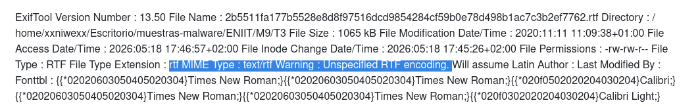

<div class="page"/>


# **1.1 Información general:**
```
└─$ file 2b5511fa177b5528e8d8f97516dcd9854284cf59b0e78d498b1ac7c3b2ef7762.rtf 
2b5511fa177b5528e8d8f97516dcd9854284cf59b0e78d498b1ac7c3b2ef7762.rtf: Rich Text Format data, version 0

└─$ md5sum 2b5511fa177b5528e8d8f97516dcd9854284cf59b0e78d498b1ac7c3b2ef7762.rtf
2fd300bd01ea3d00ea59d4e1d47056a0  2b5511fa177b5528e8d8f97516dcd9854284cf59b0e78d498b1ac7c3b2ef7762.rtf
```

El archivo es reconocido por `file` como un documento `Rich Text Format` válido. Esto confirma que la muestra mantiene estructura `RTF` y debe analizarse con herramientas específicas para `RTF/OLE`, como `rtfdump.py` y `oledump.py`.

-----


# **2. Analizamos con la herramienta Exiftool**
```
└─$ exiftool 2b5511fa177b5528e8d8f97516dcd9854284cf59b0e78d498b1ac7c3b2ef7762.rtf 
```

**Obtenemos el fichero [exiftool.](https://github.com/soniasalido/cybersecurity/blob/main/Documentation/Malware/Master-ENIIT-Analisis-Malware-Reversing/modulo-9-tecnicas-de-analisis-de-malware/3-M9T3/exiftool.md)**


## **2.1 Información general**
  
El archivo se identifica correctamente como `RTF`, con extensión `rtf` y tipo MIME `text/rtf`. Su tamaño aproximado es de `1065 kB`.

Las fechas indican que la muestra tiene una fecha de modificación de `2020-11-11 11:09:38+01:00`, mientras que las fechas de acceso y cambio de inode corresponden al año `2026`, durante su manipulación en el entorno de laboratorio.

No aparecen valores en los campos `Author` ni `Last Modified By`, lo cual puede ser habitual en documentos limpiados, generados automáticamente o manipulados. El campo `Info` muestra `Windows User`, lo que podría indicar que el documento fue generado o guardado desde un entorno Windows genérico.


## **2.2 El campo Datastore**
El campo `Datastore` contiene un blob hexadecimal largo. Este valor no se muestra decodificado por ExifTool, pero al analizarlo se observan varios elementos relevantes.
  


**Fragmentos destacados del campo `Datastore`:**  
```
Datastore : 01050000...4d73786d6c322e534158584d4c5265616465722e362e30...d0cf11e0...
....
....
....52006f006f007400200045006e007400720079...
```

**Cadena `Msxml2.SAXXMLReader.6.0`:**
```
└─$ echo "4d73786d6c322e534158584d4c5265616465722e362e30" | xxd -r -p
Msxml2.SAXXMLReader.6.0    
```
donde:
- Obtenemos: `Msxml2.SAXXMLReader.6.0`: Esto apunta a un componente `COM/XML` de Microsoft. En este caso, la cadena aparece como parte del objeto embebido dentro del campo Datastore.


**Cabecera `OLE/CFBF`:**  
Más adelante, dentro del mismo blob hexadecimal del campo `Datastore`, aparece la secuencia:
```
...d0cf11e0a1b11ae1...
```
donde:
- Esa secuencia corresponde a la firma característica de un archivo `OLE Compound File Binary Format`, también llamado `CFBF` u `OLE structured storage`. 


**Cadena interna `Root Entry`:**  
Dentro del mismo blob hexadecimal aparece también el fragmento:
```
....52006f006f007400200045006e007400720079...
```
donde:
- Este fragmento está codificado como `UTF-16LE`.
- Si se descodifica obtenemos: `Root Entry`.
- `Root Entry`: Es una cadena interna propia de la estructura `OLE/CFBF` embebida dentro del valor hexadecimal del campo Datastore.


**Conclusión del análisis del campo Datastore:**  
La estructura observada puede resumirse así:  
```
Campo ExifTool: Datastore
└── Blob hexadecimal
    └── Objeto OLE/CFBF embebido
        ├── Nombre/referencia interna: Msxml2.SAXXMLReader.6.0
        ├── Cabecera OLE/CFBF: D0 CF 11 E0 A1 B1 1A E1
        └── Entrada interna OLE: Root Entry
```

**<mark>En conclusión, el campo `Datastore` contiene una estructura `OLE/CFBF` embebida. Dentro de ella se identifican la cadena `Msxml2.SAXXMLReader.6.0`, la cabecera OLE `D0 CF 11 E0 A1 B1 1A E1` y la entrada interna `Root Entry`. Esto confirma que el documento `RTF` no es un fichero simple y que contiene objetos `OLE` que deberán extraerse y analizarse con herramientas como `rtfdump.py` y `oledump.py`.</mark>**

## **2.3 Los campos Themedata y Colorschememapping**
Además del campo `Datastore`, ExifTool muestra otros campos relevantes desde el punto de vista estructural: `Themedata` y `Colorschememapping`.

**A) El Campo Themedata**  
El campo `Themedata` comienza con la secuencia hexadecimal:
```
504b0304
```
donde:
- Esta secuencia corresponde a la firma típica de una entrada local de archivo `ZIP`. En `ASCII`, `50 4B` equivale a `PK`, cabecera habitual en archivos `ZIP`.

Dentro del mismo blob hexadecimal se observan nombres de ficheros propios de un paquete `Office Open XML` relacionado con temas de Office, como:
```
[Content_Types].xml
_rels/.rels
theme/theme/themeManager.xml
theme/theme/theme1.xml
theme/theme/_rels/themeManager.xml.rels
```
Esto indica que `Themedata` contiene datos comprimidos con estructura `ZIP/OOXML` asociados al tema visual del documento. En un `RTF` generado por Microsoft Word, este tipo de información puede aparecer como parte de los metadatos o recursos de formato del documento.

Por sí solo, este campo no debe considerarse malicioso. En este análisis, `Themedata` parece estar relacionado con información de tema de Office, no con el payload principal.


**B) El Campo Colorschememapping**  
El campo `Colorschememapping` también aparece codificado en hexadecimal. Al decodificarlo, se obtiene contenido `XML` relacionado con el mapeo de colores del tema de Office.

El comienzo del campo es:
```
3c3f786d6c2076657273696f6e3d22312e3022...
```

Si se convierte de hexadecimal a texto, comienza como:
```
<?xml version="1.0" encoding="UTF-8" standalone="yes"?>
```

Este campo tampoco parece ser el hallazgo principal del análisis. Su presencia es coherente con información de formato/tema de Office dentro del `RTF`.

 
------------


# **3. Didier Stevens Suite - rtfdump**
Con las herramientas de Didier Stevens Suite, vamos a anlizar la estructura del `RTF`: grupos, objetos, `object`, bloques hexadecimales, etc:
```
└─$ malwareRTF=/home/xxniwexx/Escritorio/muestras-malware/ENIIT/M9/T3/2b5511fa177b5528e8d8f97516dcd9854284cf59b0e78d498b1ac7c3b2ef7762.rtf


└─$ python rtfdump.py "$malwareRTF" > rtfdump-didier.txt                                                                                  
                                        
```

Obtenemos el fichero: [Análisis con Didier Stevens Suite](https://github.com/soniasalido/cybersecurity/blob/main/Documentation/Malware/Master-ENIIT-Analisis-Malware-Reversing/modulo-9-tecnicas-de-analisis-de-malware/3-M9T3/rtfdump-didier.txt)


La salida de `rtfdump.py` confirma que el RTF tiene contenido embebido sospechoso. Hay tres zonas que debemoss priorizar:  
  
...
  
...  
  
...  
donde:
- En el índice `169`: un bloque `\*\datastore` con `OLE/CFBF`.
- En el índice `332`: un bloque `\*\datastore` con `OLE/CFBF`.
- En el índice `350`: un bloque `\bin000000` que contiene `\objdata`: Como `356` está a `Level 3` y aparece debajo del bloque `350`, que está a Level 2, se interpreta como contenido anidado dentro de ese bloque/grupo superior.

| Índice rtfdump | Elemento       | Relevancia                                        |
| -------------: | -------------- | ------------------------------------------------- |
|            `1` | `\rtf09876`    | Raíz del grupo                                    |
|          `169` | `\*\datastore` | OLE embebido detectado                            |
|          `332` | `\*\datastore` | Segundo OLE embebido detectado                    |
|          `350` | `\bin000000`   | Bloque binario grande                             |
|          `356` | `\objdata`     | Objeto OLE/RTF embebido dentro del bloque binario |


## **3.1 Dos objetos `OLE` en `\*\datastore`**
**Aparece un primer `\*\datastore` en el índice `169`:**
```
169 ... \*\datastore
Name: b'Msxml2.SAXXMLReader.6.0\x00' Size: 1536 md5: 23e2fff9eb3567a7dc30952d4f857298 magic: d0cf11e0
```
donde:
- El `magic: d0cf11e0` es la cabecera de un `OLE Compound File / CFBF`.
- Además, rtfdump ya lo marca con `O`, lo que indica que ha identificado un objeto `OLE`.
- (Más adelante veremos que este objeto es el que detectó la herramienta exiftool haciendo carving)

**En el índice `332`, aparece otro `\*\datastore`:**
```
332 ... \*\datastore
Name: b'Msxml2.SAXXMLReader.6.0\x00' Size: 1536 md5: 9074f78b22547664129e121fbebe14fe magic: d0cf11e0
```
donde:
- Encontramos otro `OLE/CFBF` de 1536 bytes, con el mismo nombre `COM`, pero `MD5` diferente.
- Esto implica que no es simplemente una repetición idéntica: conviene extraer ambos y compararlos.


## **3.2 Bloque `\bin000000` en el índice `350`**
El índice 350 es muy relevante:
```
350 Level 2 ... l=91346 ... \bin000000
``` 

Un bloque `\bin` de unos `91 KB` dentro de un `RTF` sospechoso debe tratarse como zona de interés, porque puede contener objetos embebidos, estructuras OLE, shellcode, contenido ofuscado o datos para explotación.

Dentro de ese bloque aparecen varios subgrupos grandes:
```
351 l=5397
352 l=12537
353 l=14577
354 l=5397
355 l=13302
356 \objdata
```
Esto sugiere que el bloque no es mero texto: hay bastante contenido binario/estructurado.

## **3.3. Objeto `\objdata` en el índice `356`**
El índice 356 contiene:
```
356 ... \objdata
357 ... l=11270
358 ...
359 ... \mmath
360 ... \*\d
361 ... l=808
```

Esto es probablemente el artefacto más importante después de los datastore. `\objdata` suele ser donde `RTF` almacena datos de objetos `OLE` embebidos. Además, la presencia de `\mmath` y `\*\d` dentro de esa zona puede estar relacionada con contenido de Office/ecuaciones o estructura embebida.


## **3.4 Elemento raro: `\unknowntype1234567890`**
Antes del bloque `\bin000000`, aparece una sección en los índices `334` y `340`:
```
\unknowntype1234567890
```
Este nombre no parece un control `word` estándar útil de `RTF`. Puede ser ruido, padding, ofuscación o parte de una técnica para confundir parsers. Pudiera ser un anomalía estructural.


## **3.5 Buscamos OLE embebidos aunque el RTF esté ofuscado**
```
└─$ python rtfdump.py -F "$malwareRTF"
1:
   Magic: d0cf11e0 ....
   Size:  35186
   md5:   4d887446a79c0ff2d532f474e3ae3dd5
2:
   Magic: d0cf11e0 ....
   Size:  24945
   md5:   155c9a1cad0648461d02d708d3a79890
3:
   Magic: d0cf11e0 ....
   Size:  1544
   md5:   a4883bb0dc008bb283c2dd5b1ca9cace
4:
   Magic: d0cf11e0 ....
   Size:  1544
   md5:   26d49806195121f5c63c915847994e1a
5:
   Magic: d0cf11e0 ....
   Size:  4799
   md5:   2e843fce3d9732542cacdbfaef6a96de
                                            
```
donde:
- La cadena `-F` intenta decodificar cadenas hexadecimales y buscar objetos OLE con cabecera `D0CF11E0`, útil en RTF maliciosos ofuscados.
- Deberemos extraer estos 5 elementos que se han identificado para verificar si son nuevos objetos detectados o son los mismos que se han detectado anteriormente.


## **3.6 Conclusiones**
El análisis con `rtfdump.py` identifica un RTF con múltiples estructuras embebidas. Se detectan dos entradas `\*\datastore` que contienen objetos `OLE/CFBF` con cabecera `D0 CF 11 E0`, ambos asociados al nombre `Msxml2.SAXXMLReader.6.0` y con hashes MD5 distintos. Además, se observa un bloque `\bin000000` de aproximadamente 91 KB que contiene un subgrupo `\objdata`, lo que sugiere presencia de objeto `OLE` o payload embebido. Se prioriza la extracción de los índices `169`, `332`, `350` y `35`6 para análisis con `oledump.py`, `pecheck.py` y búsqueda de `IOCs`.


------

# **5. Extraer los objetos identificados**

## **5.1 Objeto `\*\datastore` índice `169`**

```
python rtfdump.py -s 169 -H -d "$malwareRTF" > extraccion-rtf/datastore_169_raw.bin
```

Este objeto se corresponde con:
```sh
\*\datastore
Name: Msxml2.SAXXMLReader.6.0
Size: 1536
md5: 23e2fff9eb3567a7dc30952d4f857298
magic: d0cf11e0
```

xxxx
```sh
└─$ xxd -l 16 datastore_169_raw.bin
00000000: 0105 0000 0200 0000 1800 0000 4d73 786d  ............Msxm
```
donde:
- Eso ya es binario real, no ASCII hexadecimal.


Tras extraer el campo `\*\datastore`, vemos que el contenido inicial está representado como hexadecimal textual. Se decodifica el contenido y se localiza la cabecera OLE/CFBF `D0 CF 11 E0 A1 B1 1A E1` en el offset `48`. Es decir, El OLE no empieza en el byte `0` del Datastore; empieza en el offset `48`. A partir de ese offset se carvean `1536` bytes para obtener los objetos OLE puros:
```sh
└─$ dd if=datastore_169_raw.bin of=datastore_169_puro.ole bs=1 skip=48 count=1536 status=none
```

Verificamos:
```shell
└─$ xxd -l 16 datastore_169_puro.ole
00000000: d0cf 11e0 a1b1 1ae1 0000 0000 0000 0000  ................
```

Calculamos md5:
```shell
└─$ md5sum datastore_169_puro.ole
23e2fff9eb3567a7dc30952d4f857298  datastore_169_puro.ole
```

Esta salida confirma que los el Datastore se han extraído correctamente como OLE puro.

## **5.2 Objeto `\*\datastore` índice `332`**
```sh
python rtfdump.py -s 332 -H -d "$malwareRTF" > extraccion-rtf/datastore_332_raw.bin
```

Este objeto se corresponde con:
```sh
\*\datastore
Name: Msxml2.SAXXMLReader.6.0
Size: 1536
md5: 9074f78b22547664129e121fbebe14fe
magic: d0cf11e0
```

xxxxx
```sh
└─$ xxd -l 16 datastore_332_raw.bin
00000000: 0105 0000 0200 0000 1800 0000 4d73 786d  ............Msxm
```
donde:
- Eso ya es binario real, no ASCII hexadecimal.


Tras extraer el campo `\*\datastore`, vemos que el contenido inicial está representado como hexadecimal textual. Se decodifica el contenido y se localiza la cabecera OLE/CFBF `D0 CF 11 E0 A1 B1 1A E1` en el offset `48`. Es decir, El OLE no empieza en el byte `0` del Datastore; empieza en el offset `48`. A partir de ese offset se carvean `1536` bytes para obtener los objetos OLE puros:
```sh
└─$ dd if=datastore_332_raw.bin of=datastore_332_puro.ole bs=1 skip=48 count=1536 status=none
```

Verificamos:
```shell
└─$ xxd -l 16 datastore_332_puro.ole
00000000: d0cf 11e0 a1b1 1ae1 0000 0000 0000 0000  ................
```


Calculamos md5:
```shell
└─$ md5sum datastore_169_puro.ole datastore_332_puro.ole
23e2fff9eb3567a7dc30952d4f857298  datastore_169_puro.ole
9074f78b22547664129e121fbebe14fe  datastore_332_puro.ole
```
donde:
- Los hashes coinciden con los reportados por `rtfdump.py`, por lo que se confirma que ambos objetos `\*\datastore` han sido extraídos correctamente.


## **5.3 Bloque `\bin000000` índice `350`**
```
python rtfdump.py -s 350 -d "$malwareRTF" > extraccion-rtf/bin_350.bin
```
Este bloque es grande, unos 91346 bytes, y puede contener datos embebidos relevantes.


## **5.4 Objeto \objdata índice `356`**
```
python rtfdump.py -s 356 -d "$malwareRTF" > extraccion-rtf/objdata_356.bin
```
Este es uno de los objetos más importantes, porque `\objdata` suele contener datos de objetos OLE embebidos en RTF.


## **5.5 Extraer elementos anómalos opcionales**
```
python rtfdump.py -s 334 -d "$malwareRTF" > extraccion-rtf/unknowntype_334.bin
python rtfdump.py -s 340 -d "$malwareRTF" > extraccion-rtf/unknowntype_340.bin
```

## **5.6 Extraer los 5 OLE encontrados con rtfdump.py -F**
```
python rtfdump.py -F -s 1 -d "$malwareRTF" > extraccion-rtf/F_1.ole
python rtfdump.py -F -s 2 -d "$malwareRTF" > extraccion-rtf/F_2.ole
python rtfdump.py -F -s 3 -d "$malwareRTF" > extraccion-rtf/F_3.ole
python rtfdump.py -F -s 4 -d "$malwareRTF" > extraccion-rtf/F_4.ole
python rtfdump.py -F -s 5 -d "$malwareRTF" > extraccion-rtf/F_5.ole
```

Deben tener los hashes:
```
F_1: Size 35186, md5 4d887446a79c0ff2d532f474e3ae3dd5
F_2: Size 24945, md5 155c9a1cad0648461d02d708d3a79890
F_3: Size 1544,  md5 a4883bb0dc008bb283c2dd5b1ca9cace
F_4: Size 1544,  md5 26d49806195121f5c63c915847994e1a
F_5: Size 4799,  md5 2e843fce3d9732542cacdbfaef6a96de
```


# **6. Análisis de los ficheros extraidos**

## **6.1 Comprobamos que se han extraído correctamente**
```
file extraccion-rtf/*
md5sum extraccion-rtf/*
sha256sum extraccion-rtf/*
xxd -l 16 extraccion-rtf/found_1.ole
```

```
└─$ file file extraccion-rtf/*
file:                                 cannot open `file' (No such file or directory)
extraccion-rtf/bin_350.bin:           data
extraccion-rtf/datastore_169_raw.bin: ctab data
extraccion-rtf/datastore_332_raw.bin: ctab data
extraccion-rtf/F_1.ole:               Composite Document File V2 Document, Cannot read section info
extraccion-rtf/F_2.ole:               Composite Document File V2 Document, Cannot read section info
extraccion-rtf/F_3.ole:               Composite Document File V2 Document, Cannot read section info
extraccion-rtf/F_4.ole:               Composite Document File V2 Document, Cannot read section info
extraccion-rtf/F_5.ole:               data
extraccion-rtf/objdata_356.bin:       data
extraccion-rtf/unknowntype_334.bin:   ASCII text, with CRLF line terminators
extraccion-rtf/unknowntype_340.bin:   ASCII text, with CRLF line terminators
                
```

```
└─$ md5sum extraccion-rtf/*
b6cdad4af13539186afa0e9f708f78a2  extraccion-rtf/bin_350.bin
81ea5156a2ca0f02b3b651f82d1c3f0e  extraccion-rtf/datastore_169_raw.bin
c8aa570f72c1fa77c8e16de270a5d251  extraccion-rtf/datastore_332_raw.bin
4d887446a79c0ff2d532f474e3ae3dd5  extraccion-rtf/F_1.ole
155c9a1cad0648461d02d708d3a79890  extraccion-rtf/F_2.ole
a4883bb0dc008bb283c2dd5b1ca9cace  extraccion-rtf/F_3.ole
26d49806195121f5c63c915847994e1a  extraccion-rtf/F_4.ole
2e843fce3d9732542cacdbfaef6a96de  extraccion-rtf/F_5.ole
948fc949057310f470c640fdb85fa80b  extraccion-rtf/objdata_356.bin
f1b4e27f634f934e31f915e479236a17  extraccion-rtf/unknowntype_334.bin
66db76683d1096b0e858dcd7d9993cd2  extraccion-rtf/unknowntype_340.bin

```


xxxx:
```
└─$ xxd -l 16  extraccion-rtf/F_1.ole 
00000000: d0cf 11e0 a1b1 1ae1 0000 0000 0000 0000  ................
                                                                                                                                                      

└─$ xxd -l 16  extraccion-rtf/F_2.ole 
00000000: d0cf 11e0 a1b1 1ae1 0000 0000 0000 0000  ................
                                                                                                                                                      
                                                                                                                                                      

└─$ xxd -l 16  extraccion-rtf/F_3.ole 
00000000: d0cf 11e0 a1b1 1ae1 0000 0000 0000 0000  ................
                                                                                                                                                      

└─$ xxd -l 16  extraccion-rtf/F_4.ole 
00000000: d0cf 11e0 a1b1 1ae1 0000 0000 0000 0000  ................
                                                                                                                                                      

└─$ xxd -l 16  extraccion-rtf/F_5.ole 
00000000: d0cf 11e0 a1b1 1ae0 10a4 3757 273f ffff  ..........7W'?..
     
```


## **6.2 Analizar con oledump.py**
```
└─$ DIDIER="$HOME/tools/didier-stevens"


└─$ for f in datastore_169_puro.ole datastore_332_puro.ole F_1.ole F_2.ole F_3.ole F_4.ole; do
    echo "===== $f ====="
    python "$DIDIER/oledump.py" "$f"
    python "$DIDIER/oledump.py" --storages "$f"
    echo
done
```

Obtenemos:
```
===== datastore_169_puro.ole =====
  1: R         'Root Entry'

===== datastore_332_puro.ole =====
  1: R         'Root Entry'

===== F_1.ole =====
  1: R         'Root Entry'

===== F_2.ole =====
  1: R         'Root Entry'

===== F_3.ole =====
  1: R         'Root Entry'

===== F_4.ole =====
  1: R         'Root Entry'
```
donde:
- El fichero tiene estructura OLE/CFBF válida.
- oledump.py reconoce la raíz del contenedor OLE.
- No aparecen streams adicionales como Contents, Ole, CompObj, Package, Equation Native, macros, payloads o datos extraíbles.
- Por tanto, estos OLE no parecen contener un payload PE ni un stream útil directamente accesible.
- Root Entry es la raíz obligatoria de un contenedor OLE. Que solo aparezca eso suele indicar un OLE vacío, mínimo, incompleto o construido para cumplir estructura.


**Tambien buscamos PE embebidos:**
```
for f in datastore_169_puro.ole datastore_332_puro.ole F_1.ole F_2.ole F_3.ole F_4.ole; do
    echo "===== $f ====="
    python "$DIDIER/pecheck.py" -l P "$f"
    echo
done
```

Obtenemos:
```
===== datastore_169_puro.ole =====

===== datastore_332_puro.ole =====

===== F_1.ole =====

===== F_2.ole =====

===== F_3.ole =====

===== F_4.ole =====
```
donde:
- Todos los objetos indica que pecheck.py no ha encontrado ejecutables PE embebidos dentro de esos ficheros.
- Es decir, no se han localizado cabeceras PE válidas tipo: `MZ .... PE`.


**Resumiendo:** Los OLE existen y son válidos a nivel de cabecera, pero no contienen streams ni PE embebidos detectables. Pueden ser:
- Contenedores OLE mínimos.
- Objetos vacíos usados como señuelo.
- Estructuras corruptas/incompletas.
- Fragmentos generados por el documento.
- Artefactos de explotación que no almacenan un PE directamente.
- Datos usados para manipular el parser, más que para guardar un payload.


## **Buscamos IOCs**

Script Python adaptado a tu caso para buscar IOCs en:
- el RTF original;
- los OLE extraídos;
- bin_350.bin;
- objdata_356.bin;
- F_*.ole;
- cualquier fichero dentro de extraccion-rtf.

**También buscamos IOCs con el siguiente script python ioc_scanner_rtf.py:**
```
#!/usr/bin/env python3
import argparse
import base64
import csv
import hashlib
import json
import os
import re
import string
from pathlib import Path
from typing import Dict, List, Iterable, Any


IOC_PATTERNS = {
    "url": re.compile(rb"""(?i)\b(?:https?|ftp)://[^\s'"<>\\]+"""),
    "ipv4": re.compile(rb"""\b(?:(?:25[0-5]|2[0-4]\d|1?\d?\d)\.){3}(?:25[0-5]|2[0-4]\d|1?\d?\d)\b"""),
    "email": re.compile(rb"""(?i)\b[A-Z0-9._%+-]+@[A-Z0-9.-]+\.[A-Z]{2,}\b"""),
    "domain": re.compile(rb"""(?i)\b(?:[a-z0-9-]+\.)+(?:com|net|org|info|biz|ru|cn|top|xyz|tk|ml|ga|cf|io|co|es|eu|uk|de|fr|it|nl|pl|br|in)\b"""),
    "windows_path": re.compile(rb"""(?i)\b[a-z]:\\(?:[^\\/:*?"<>|\r\n]+\\)*[^\\/:*?"<>|\r\n]*"""),
    "registry_key": re.compile(rb"""(?i)\b(?:HKCU|HKLM|HKCR|HKU|HKEY_CURRENT_USER|HKEY_LOCAL_MACHINE|HKEY_CLASSES_ROOT)\\[^\r\n\t]+"""),
    "md5": re.compile(rb"""\b[a-fA-F0-9]{32}\b"""),
    "sha1": re.compile(rb"""\b[a-fA-F0-9]{40}\b"""),
    "sha256": re.compile(rb"""\b[a-fA-F0-9]{64}\b"""),
    "base64_candidate": re.compile(rb"""\b[A-Za-z0-9+/]{40,}={0,2}\b"""),
}

SUSPICIOUS_TERMS = [
    # Red / descarga
    "http", "https", "ftp", "www.", "download", "urlmon", "URLDownloadToFile",
    "InternetOpen", "InternetReadFile", "WinHttpOpen", "WinHttpSendRequest",
    "WinHttpReadData", "XMLHTTP", "WinHttpRequest",

    # Intérpretes / LOLBins
    "cmd", "cmd.exe", "powershell", "powershell.exe", "pwsh",
    "wscript", "wscript.exe", "cscript", "cscript.exe", "mshta", "mshta.exe",
    "rundll32", "rundll32.exe", "regsvr32", "regsvr32.exe",
    "certutil", "certutil.exe", "bitsadmin", "bitsadmin.exe",
    "wmic", "wmic.exe", "schtasks", "schtasks.exe",

    # Payloads/extensiones
    ".exe", ".dll", ".hta", ".vbs", ".vbe", ".js", ".jse", ".ps1", ".bat", ".cmd",
    ".tmp", ".dat", ".scr", ".cab", ".zip",

    # PE / Windows APIs
    "MZ", "This program cannot be run in DOS mode", "PE",
    "KERNEL32", "USER32", "ADVAPI32", "WININET", "WS2_32",
    "VirtualAlloc", "VirtualProtect", "WriteProcessMemory",
    "CreateRemoteThread", "CreateProcess", "ShellExecute",
    "LoadLibrary", "GetProcAddress",

    # Persistencia/rutas
    "AppData", "ProgramData", "Temp", "Startup",
    "CurrentVersion\\Run", "RunOnce", "Software\\Microsoft\\Windows",

    # RTF/OLE/Office
    "\\object", "\\objdata", "\\bin", "\\datastore", "objdata", "datastore",
    "Equation.3", "EQNEDT32", "OLE2Link", "Package",
    "Msxml2.SAXXMLReader", "Root Entry",
]

MAGIC_PATTERNS = {
    "OLE_CFBF": bytes.fromhex("d0cf11e0a1b11ae1"),
    "ZIP_PK": bytes.fromhex("504b0304"),
    "PE_MZ": b"MZ",
    "RTF": b"{\\rtf",
}


def sha256(data: bytes) -> str:
    return hashlib.sha256(data).hexdigest()


def md5(data: bytes) -> str:
    return hashlib.md5(data).hexdigest()


def sha1(data: bytes) -> str:
    return hashlib.sha1(data).hexdigest()


def read_file(path: Path) -> bytes:
    with path.open("rb") as f:
        return f.read()


def printable_ascii_strings(data: bytes, min_len: int = 5) -> List[str]:
    allowed = set(bytes(string.printable, "ascii"))
    result = []
    current = bytearray()

    for b in data:
        if b in allowed and b not in b"\x0b\x0c":
            current.append(b)
        else:
            if len(current) >= min_len:
                result.append(current.decode("latin-1", errors="replace"))
            current = bytearray()

    if len(current) >= min_len:
        result.append(current.decode("latin-1", errors="replace"))

    return result


def utf16le_strings(data: bytes, min_len: int = 5) -> List[str]:
    result = []

    # Busca secuencias tipo A\x00B\x00C\x00
    pattern = re.compile((rb"(?:[\x20-\x7e]\x00){" + str(min_len).encode() + rb",}"))
    for match in pattern.finditer(data):
        try:
            decoded = match.group().decode("utf-16le", errors="ignore")
            if len(decoded) >= min_len:
                result.append(decoded)
        except UnicodeDecodeError:
            pass

    return result


def find_offsets(data: bytes, needle: bytes) -> List[int]:
    offsets = []
    start = 0
    while True:
        idx = data.find(needle, start)
        if idx == -1:
            break
        offsets.append(idx)
        start = idx + 1
    return offsets


def safe_decode(value: bytes) -> str:
    return value.decode("latin-1", errors="replace")


def extract_iocs_from_bytes(data: bytes) -> Dict[str, List[Dict[str, Any]]]:
    findings: Dict[str, List[Dict[str, Any]]] = {}

    for ioc_type, pattern in IOC_PATTERNS.items():
        findings[ioc_type] = []
        seen = set()

        for match in pattern.finditer(data):
            raw = match.group()
            decoded = safe_decode(raw)

            if decoded in seen:
                continue
            seen.add(decoded)

            findings[ioc_type].append({
                "value": decoded,
                "offset": match.start(),
            })

    return findings


def find_suspicious_terms(data: bytes) -> List[Dict[str, Any]]:
    results = []
    lowered = data.lower()
    seen = set()

    for term in SUSPICIOUS_TERMS:
        term_bytes = term.encode("latin-1", errors="ignore")
        if not term_bytes:
            continue

        offsets = find_offsets(lowered, term_bytes.lower())
        for off in offsets:
            key = (term, off)
            if key in seen:
                continue
            seen.add(key)

            context_start = max(0, off - 40)
            context_end = min(len(data), off + len(term_bytes) + 80)
            context = data[context_start:context_end]

            results.append({
                "term": term,
                "offset": off,
                "context": safe_decode(context),
            })

    return results


def find_magic(data: bytes) -> List[Dict[str, Any]]:
    results = []

    for name, magic in MAGIC_PATTERNS.items():
        offsets = find_offsets(data, magic)
        for off in offsets:
            results.append({
                "magic": name,
                "offset": off,
                "hex": magic.hex(),
            })

    return results


def entropy(data: bytes) -> float:
    if not data:
        return 0.0

    from math import log2
    counts = [0] * 256
    for b in data:
        counts[b] += 1

    ent = 0.0
    length = len(data)
    for count in counts:
        if count:
            p = count / length
            ent -= p * log2(p)

    return round(ent, 4)


def try_decode_base64_candidates(candidates: List[Dict[str, Any]]) -> List[Dict[str, Any]]:
    decoded_results = []

    for item in candidates:
        value = item["value"]

        # Evita falsos positivos absurdamente largos
        if len(value) > 5000:
            continue

        try:
            padded = value + "=" * (-len(value) % 4)
            decoded = base64.b64decode(padded, validate=False)

            if len(decoded) < 8:
                continue

            interesting = []
            for name, magic in MAGIC_PATTERNS.items():
                if magic in decoded:
                    interesting.append(name)

            strings = printable_ascii_strings(decoded, min_len=5)[:10]

            if interesting or strings:
                decoded_results.append({
                    "source_value_preview": value[:120],
                    "source_offset": item["offset"],
                    "decoded_len": len(decoded),
                    "decoded_sha256": sha256(decoded),
                    "magic_hits": interesting,
                    "strings_preview": strings,
                })

        except Exception:
            continue

    return decoded_results


def analyze_file(path: Path) -> Dict[str, Any]:
    data = read_file(path)

    ascii_strings = printable_ascii_strings(data, min_len=5)
    unicode_strings = utf16le_strings(data, min_len=5)

    iocs = extract_iocs_from_bytes(data)
    suspicious_terms = find_suspicious_terms(data)
    magic_hits = find_magic(data)

    b64_decoded = try_decode_base64_candidates(iocs.get("base64_candidate", []))

    return {
        "file": str(path),
        "size": len(data),
        "md5": md5(data),
        "sha1": sha1(data),
        "sha256": sha256(data),
        "entropy": entropy(data),
        "magic_hits": magic_hits,
        "iocs": iocs,
        "suspicious_terms": suspicious_terms,
        "ascii_strings_count": len(ascii_strings),
        "unicode_strings_count": len(unicode_strings),
        "ascii_strings_preview": ascii_strings[:50],
        "unicode_strings_preview": unicode_strings[:50],
        "base64_decoded_candidates": b64_decoded,
    }


def collect_files(targets: List[str]) -> List[Path]:
    files = []

    for target in targets:
        path = Path(target)

        if path.is_file():
            files.append(path)

        elif path.is_dir():
            for root, _, filenames in os.walk(path):
                for name in filenames:
                    files.append(Path(root) / name)

        else:
            print(f"[!] No existe: {target}")

    return files


def flatten_for_csv(results: List[Dict[str, Any]]) -> List[Dict[str, Any]]:
    rows = []

    for result in results:
        base = {
            "file": result["file"],
            "size": result["size"],
            "md5": result["md5"],
            "sha1": result["sha1"],
            "sha256": result["sha256"],
            "entropy": result["entropy"],
        }

        for hit in result["magic_hits"]:
            row = base.copy()
            row.update({
                "type": "magic",
                "indicator": hit["magic"],
                "value": hit["hex"],
                "offset": hit["offset"],
                "context": "",
            })
            rows.append(row)

        for ioc_type, items in result["iocs"].items():
            if ioc_type == "base64_candidate":
                # Se reporta aparte solo si decodifica a algo útil
                continue

            for item in items:
                row = base.copy()
                row.update({
                    "type": ioc_type,
                    "indicator": ioc_type,
                    "value": item["value"],
                    "offset": item["offset"],
                    "context": "",
                })
                rows.append(row)

        for item in result["suspicious_terms"]:
            row = base.copy()
            row.update({
                "type": "suspicious_term",
                "indicator": item["term"],
                "value": item["term"],
                "offset": item["offset"],
                "context": item["context"],
            })
            rows.append(row)

        for item in result["base64_decoded_candidates"]:
            row = base.copy()
            row.update({
                "type": "base64_decoded_candidate",
                "indicator": ",".join(item["magic_hits"]) if item["magic_hits"] else "strings",
                "value": item["source_value_preview"],
                "offset": item["source_offset"],
                "context": " | ".join(item["strings_preview"]),
            })
            rows.append(row)

    return rows


def write_csv(path: Path, rows: List[Dict[str, Any]]) -> None:
    fieldnames = [
        "file", "size", "md5", "sha1", "sha256", "entropy",
        "type", "indicator", "value", "offset", "context"
    ]

    with path.open("w", newline="", encoding="utf-8") as f:
        writer = csv.DictWriter(f, fieldnames=fieldnames)
        writer.writeheader()
        writer.writerows(rows)


def print_summary(results: List[Dict[str, Any]]) -> None:
    for result in results:
        print("=" * 100)
        print(f"Archivo : {result['file']}")
        print(f"Tamaño  : {result['size']} bytes")
        print(f"MD5     : {result['md5']}")
        print(f"SHA1    : {result['sha1']}")
        print(f"SHA256  : {result['sha256']}")
        print(f"Entropía: {result['entropy']}")

        print("\n[Magic hits]")
        if result["magic_hits"]:
            for hit in result["magic_hits"]:
                print(f"  - {hit['magic']} @ {hit['offset']} ({hit['hex']})")
        else:
            print("  - Sin firmas mágicas relevantes")

        print("\n[IOCs]")
        for ioc_type, items in result["iocs"].items():
            if ioc_type == "base64_candidate":
                continue

            if items:
                print(f"  {ioc_type}:")
                for item in items[:20]:
                    print(f"    - {item['value']} @ {item['offset']}")

        print("\n[Términos sospechosos]")
        if result["suspicious_terms"]:
            for item in result["suspicious_terms"][:30]:
                context = item["context"].replace("\n", "\\n").replace("\r", "\\r")
                print(f"  - {item['term']} @ {item['offset']} :: {context[:160]}")
        else:
            print("  - Sin términos sospechosos")

        print("\n[Base64 decodificable interesante]")
        if result["base64_decoded_candidates"]:
            for item in result["base64_decoded_candidates"][:10]:
                print(f"  - offset {item['source_offset']} len={item['decoded_len']} sha256={item['decoded_sha256']}")
                if item["magic_hits"]:
                    print(f"    magic: {', '.join(item['magic_hits'])}")
                if item["strings_preview"]:
                    print(f"    strings: {' | '.join(item['strings_preview'][:5])}")
        else:
            print("  - Sin candidatos Base64 relevantes")


def main() -> None:
    parser = argparse.ArgumentParser(
        description="Busca IOCs en muestras RTF/OLE/binarios extraídos."
    )
    parser.add_argument(
        "targets",
        nargs="+",
        help="Fichero(s) o directorio(s) a analizar."
    )
    parser.add_argument(
        "-o",
        "--output",
        default="ioc_report.json",
        help="Ruta del informe JSON. Por defecto: ioc_report.json"
    )
    parser.add_argument(
        "--csv",
        default="ioc_report.csv",
        help="Ruta del informe CSV. Por defecto: ioc_report.csv"
    )

    args = parser.parse_args()

    files = collect_files(args.targets)
    if not files:
        print("[!] No hay ficheros para analizar.")
        return

    results = []
    for file_path in files:
        try:
            results.append(analyze_file(file_path))
        except Exception as e:
            print(f"[!] Error analizando {file_path}: {e}")

    print_summary(results)

    output_json = Path(args.output)
    with output_json.open("w", encoding="utf-8") as f:
        json.dump(results, f, indent=2, ensure_ascii=False)

    output_csv = Path(args.csv)
    write_csv(output_csv, flatten_for_csv(results))

    print("\n" + "=" * 100)
    print(f"[+] Informe JSON escrito en: {output_json}")
    print(f"[+] Informe CSV escrito en : {output_csv}")


if __name__ == "__main__":
    main()
```


**Obtenemos:**
```
└─$ python3 ioc_scanner_rtf.py "$malwareRTF" extraccion-rtf \
  -o ioc_report.json \
  --csv ioc_report.csv
[!] No existe: extraccion-rtf
====================================================================================================
Archivo : /home/xxniwexx/Escritorio/cybersecurity/Documentation/Malware/Master-ENIIT-Analisis-Malware-Reversing/modulo-9-tecnicas-de-analisis-de-malware/3-M9T3/muestra/2b5511fa177b5528e8d8f97516dcd9854284cf59b0e78d498b1ac7c3b2ef7762.rtf
Tamaño  : 1065166 bytes
MD5     : 2fd300bd01ea3d00ea59d4e1d47056a0
SHA1    : d8747407679055deee5bafaac281bdac52274da2
SHA256  : 2b5511fa177b5528e8d8f97516dcd9854284cf59b0e78d498b1ac7c3b2ef7762
Entropía: 6.3325

[Magic hits]
  - PE_MZ @ 6576 (4d5a)
  - PE_MZ @ 12151 (4d5a)
  - PE_MZ @ 34382 (4d5a)
  - PE_MZ @ 36462 (4d5a)
  - PE_MZ @ 39933 (4d5a)
  - PE_MZ @ 45508 (4d5a)
  - PE_MZ @ 67739 (4d5a)
  - PE_MZ @ 69819 (4d5a)
  - PE_MZ @ 73290 (4d5a)
  - PE_MZ @ 78865 (4d5a)
  - PE_MZ @ 101096 (4d5a)
  - PE_MZ @ 103176 (4d5a)
  - PE_MZ @ 106647 (4d5a)
  - PE_MZ @ 112222 (4d5a)
  - PE_MZ @ 134453 (4d5a)
  - PE_MZ @ 136533 (4d5a)
  - PE_MZ @ 140004 (4d5a)
  - PE_MZ @ 145579 (4d5a)
  - PE_MZ @ 167810 (4d5a)
  - PE_MZ @ 169890 (4d5a)
  - PE_MZ @ 173361 (4d5a)
  - PE_MZ @ 178936 (4d5a)
  - PE_MZ @ 201167 (4d5a)
  - PE_MZ @ 203247 (4d5a)
  - PE_MZ @ 206718 (4d5a)
  - PE_MZ @ 212293 (4d5a)
  - PE_MZ @ 234524 (4d5a)
  - PE_MZ @ 236604 (4d5a)
  - PE_MZ @ 240075 (4d5a)
  - PE_MZ @ 245650 (4d5a)
  - PE_MZ @ 267881 (4d5a)
  - PE_MZ @ 269961 (4d5a)
  - PE_MZ @ 273432 (4d5a)
  - PE_MZ @ 279007 (4d5a)
  - PE_MZ @ 301238 (4d5a)
  - PE_MZ @ 303318 (4d5a)
  - PE_MZ @ 306789 (4d5a)
  - PE_MZ @ 312364 (4d5a)
  - PE_MZ @ 334595 (4d5a)
  - PE_MZ @ 336675 (4d5a)
  - PE_MZ @ 340146 (4d5a)
  - PE_MZ @ 345721 (4d5a)
  - PE_MZ @ 367952 (4d5a)
  - PE_MZ @ 370032 (4d5a)
  - PE_MZ @ 373503 (4d5a)
  - PE_MZ @ 379078 (4d5a)
  - PE_MZ @ 401309 (4d5a)
  - PE_MZ @ 403389 (4d5a)
  - PE_MZ @ 406860 (4d5a)
  - PE_MZ @ 412435 (4d5a)
  - PE_MZ @ 434666 (4d5a)
  - PE_MZ @ 436746 (4d5a)
  - PE_MZ @ 440217 (4d5a)
  - PE_MZ @ 445792 (4d5a)
  - PE_MZ @ 468023 (4d5a)
  - PE_MZ @ 470103 (4d5a)
  - PE_MZ @ 473574 (4d5a)
  - PE_MZ @ 479149 (4d5a)
  - PE_MZ @ 501380 (4d5a)
  - PE_MZ @ 503460 (4d5a)
  - PE_MZ @ 506931 (4d5a)
  - PE_MZ @ 512506 (4d5a)
  - PE_MZ @ 534737 (4d5a)
  - PE_MZ @ 536817 (4d5a)
  - PE_MZ @ 540288 (4d5a)
  - PE_MZ @ 545863 (4d5a)
  - PE_MZ @ 568094 (4d5a)
  - PE_MZ @ 570174 (4d5a)
  - PE_MZ @ 573645 (4d5a)
  - PE_MZ @ 579220 (4d5a)
  - PE_MZ @ 601451 (4d5a)
  - PE_MZ @ 603531 (4d5a)
  - PE_MZ @ 607002 (4d5a)
  - PE_MZ @ 612577 (4d5a)
  - PE_MZ @ 634808 (4d5a)
  - PE_MZ @ 636888 (4d5a)
  - PE_MZ @ 640359 (4d5a)
  - PE_MZ @ 645934 (4d5a)
  - PE_MZ @ 668165 (4d5a)
  - PE_MZ @ 670245 (4d5a)
  - PE_MZ @ 673716 (4d5a)
  - PE_MZ @ 679291 (4d5a)
  - PE_MZ @ 701522 (4d5a)
  - PE_MZ @ 703602 (4d5a)
  - PE_MZ @ 707073 (4d5a)
  - PE_MZ @ 712648 (4d5a)
  - PE_MZ @ 734879 (4d5a)
  - PE_MZ @ 736959 (4d5a)
  - PE_MZ @ 740430 (4d5a)
  - PE_MZ @ 746005 (4d5a)
  - PE_MZ @ 768236 (4d5a)
  - PE_MZ @ 770316 (4d5a)
  - PE_MZ @ 773787 (4d5a)
  - PE_MZ @ 779362 (4d5a)
  - PE_MZ @ 801593 (4d5a)
  - PE_MZ @ 803673 (4d5a)
  - PE_MZ @ 807144 (4d5a)
  - PE_MZ @ 812719 (4d5a)
  - PE_MZ @ 834950 (4d5a)
  - PE_MZ @ 837030 (4d5a)
  - PE_MZ @ 895472 (4d5a)
  - PE_MZ @ 895585 (4d5a)
  - PE_MZ @ 896356 (4d5a)
  - PE_MZ @ 896791 (4d5a)
  - PE_MZ @ 897207 (4d5a)
  - PE_MZ @ 897416 (4d5a)
  - PE_MZ @ 898328 (4d5a)
  - PE_MZ @ 898463 (4d5a)
  - PE_MZ @ 900243 (4d5a)
  - PE_MZ @ 905738 (4d5a)
  - PE_MZ @ 906773 (4d5a)
  - PE_MZ @ 907562 (4d5a)
  - PE_MZ @ 907764 (4d5a)
  - PE_MZ @ 908258 (4d5a)
  - PE_MZ @ 908574 (4d5a)
  - PE_MZ @ 910591 (4d5a)
  - PE_MZ @ 911057 (4d5a)
  - PE_MZ @ 949475 (4d5a)
  - PE_MZ @ 954304 (4d5a)
  - PE_MZ @ 959163 (4d5a)
  - RTF @ 0 (7b5c727466)
  - RTF @ 964325 (7b5c727466)
  - RTF @ 964365 (7b5c727466)
  - RTF @ 964424 (7b5c727466)
  - RTF @ 964437 (7b5c727466)
  - RTF @ 964449 (7b5c727466)

[IOCs]
  url:
    - http://schemas.microsoft.com/office/word/2003/wordml}} @ 847446
  email:
    - zdX@Z.jl @ 7615
    - TmhViT7NwE@FTbVvN6x.QEHcib @ 28795
    - b@C4j.IZeGEZL @ 946977
    - 1p+Mk@Q0.dRdvo @ 951847
    - 7RXV4aiS@pKN.Xlf @ 963401
  domain:
    - e.Tk @ 15018
    - schemas.microsoft.com @ 847453
  sha256:
    - 0000000000000000000000000000000000000000000000000105000000000000 @ 884269

[Términos sospechosos]
  - http @ 847446 :: sws3903}{\vern85}}{\*\xmlnstbl {\xmlns1 http://schemas.microsoft.com/office/word/2003/wordml}}\r\n\paperw12240\paperh15840\mar
  - http @ 893078 :: ws16559}{\vern85}}{\*\xmlnstbl {\xmlns1 http://schemas.microsoft.com/office/word/2003/wordml}}\r\n\paperw12240\paperh15840\mar
  - ftp @ 955954 :: ?>_tY:u]hFc4#yE^GLgViY16]XXB@ew>LTbpr23XFtPY&Cdbo&&:M&R6aM7A8tIDqjtsWxilpJP?Id~*=|u=wy%cC3Oe?2wukM^gr_E^heqC1bx?W?G@:Np^2Qq
  - cmd @ 20587 :: 8C=4vXvPqyt4aR19Cu^egVC59OX=?ly&y9_29D3=CMdeo[vRjhFF6%=m'X=gA0UEA!Fyh:':^?cU^5Q.1FtvgsK_^f2mJX=j?Ye@^|_khGO9m7vcGF#=H66p0V&
  - cmd @ 53944 :: 8C=4vXvPqyt4aR19Cu^egVC59OX=?ly&y9_29D3=CMdeo[vRjhFF6%=m'X=gA0UEA!Fyh:':^?cU^5Q.1FtvgsK_^f2mJX=j?Ye@^|_khGO9m7vcGF#=H66p0V&
  - cmd @ 87301 :: 8C=4vXvPqyt4aR19Cu^egVC59OX=?ly&y9_29D3=CMdeo[vRjhFF6%=m'X=gA0UEA!Fyh:':^?cU^5Q.1FtvgsK_^f2mJX=j?Ye@^|_khGO9m7vcGF#=H66p0V&
  - cmd @ 120658 :: 8C=4vXvPqyt4aR19Cu^egVC59OX=?ly&y9_29D3=CMdeo[vRjhFF6%=m'X=gA0UEA!Fyh:':^?cU^5Q.1FtvgsK_^f2mJX=j?Ye@^|_khGO9m7vcGF#=H66p0V&
  - cmd @ 154015 :: 8C=4vXvPqyt4aR19Cu^egVC59OX=?ly&y9_29D3=CMdeo[vRjhFF6%=m'X=gA0UEA!Fyh:':^?cU^5Q.1FtvgsK_^f2mJX=j?Ye@^|_khGO9m7vcGF#=H66p0V&
  - cmd @ 187372 :: 8C=4vXvPqyt4aR19Cu^egVC59OX=?ly&y9_29D3=CMdeo[vRjhFF6%=m'X=gA0UEA!Fyh:':^?cU^5Q.1FtvgsK_^f2mJX=j?Ye@^|_khGO9m7vcGF#=H66p0V&
  - cmd @ 220729 :: 8C=4vXvPqyt4aR19Cu^egVC59OX=?ly&y9_29D3=CMdeo[vRjhFF6%=m'X=gA0UEA!Fyh:':^?cU^5Q.1FtvgsK_^f2mJX=j?Ye@^|_khGO9m7vcGF#=H66p0V&
  - cmd @ 254086 :: 8C=4vXvPqyt4aR19Cu^egVC59OX=?ly&y9_29D3=CMdeo[vRjhFF6%=m'X=gA0UEA!Fyh:':^?cU^5Q.1FtvgsK_^f2mJX=j?Ye@^|_khGO9m7vcGF#=H66p0V&
  - cmd @ 287443 :: 8C=4vXvPqyt4aR19Cu^egVC59OX=?ly&y9_29D3=CMdeo[vRjhFF6%=m'X=gA0UEA!Fyh:':^?cU^5Q.1FtvgsK_^f2mJX=j?Ye@^|_khGO9m7vcGF#=H66p0V&
  - cmd @ 320800 :: 8C=4vXvPqyt4aR19Cu^egVC59OX=?ly&y9_29D3=CMdeo[vRjhFF6%=m'X=gA0UEA!Fyh:':^?cU^5Q.1FtvgsK_^f2mJX=j?Ye@^|_khGO9m7vcGF#=H66p0V&
  - cmd @ 354157 :: 8C=4vXvPqyt4aR19Cu^egVC59OX=?ly&y9_29D3=CMdeo[vRjhFF6%=m'X=gA0UEA!Fyh:':^?cU^5Q.1FtvgsK_^f2mJX=j?Ye@^|_khGO9m7vcGF#=H66p0V&
  - cmd @ 387514 :: 8C=4vXvPqyt4aR19Cu^egVC59OX=?ly&y9_29D3=CMdeo[vRjhFF6%=m'X=gA0UEA!Fyh:':^?cU^5Q.1FtvgsK_^f2mJX=j?Ye@^|_khGO9m7vcGF#=H66p0V&
  - cmd @ 420871 :: 8C=4vXvPqyt4aR19Cu^egVC59OX=?ly&y9_29D3=CMdeo[vRjhFF6%=m'X=gA0UEA!Fyh:':^?cU^5Q.1FtvgsK_^f2mJX=j?Ye@^|_khGO9m7vcGF#=H66p0V&
  - cmd @ 454228 :: 8C=4vXvPqyt4aR19Cu^egVC59OX=?ly&y9_29D3=CMdeo[vRjhFF6%=m'X=gA0UEA!Fyh:':^?cU^5Q.1FtvgsK_^f2mJX=j?Ye@^|_khGO9m7vcGF#=H66p0V&
  - cmd @ 487585 :: 8C=4vXvPqyt4aR19Cu^egVC59OX=?ly&y9_29D3=CMdeo[vRjhFF6%=m'X=gA0UEA!Fyh:':^?cU^5Q.1FtvgsK_^f2mJX=j?Ye@^|_khGO9m7vcGF#=H66p0V&
  - cmd @ 520942 :: 8C=4vXvPqyt4aR19Cu^egVC59OX=?ly&y9_29D3=CMdeo[vRjhFF6%=m'X=gA0UEA!Fyh:':^?cU^5Q.1FtvgsK_^f2mJX=j?Ye@^|_khGO9m7vcGF#=H66p0V&
  - cmd @ 554299 :: 8C=4vXvPqyt4aR19Cu^egVC59OX=?ly&y9_29D3=CMdeo[vRjhFF6%=m'X=gA0UEA!Fyh:':^?cU^5Q.1FtvgsK_^f2mJX=j?Ye@^|_khGO9m7vcGF#=H66p0V&
  - cmd @ 587656 :: 8C=4vXvPqyt4aR19Cu^egVC59OX=?ly&y9_29D3=CMdeo[vRjhFF6%=m'X=gA0UEA!Fyh:':^?cU^5Q.1FtvgsK_^f2mJX=j?Ye@^|_khGO9m7vcGF#=H66p0V&
  - cmd @ 621013 :: 8C=4vXvPqyt4aR19Cu^egVC59OX=?ly&y9_29D3=CMdeo[vRjhFF6%=m'X=gA0UEA!Fyh:':^?cU^5Q.1FtvgsK_^f2mJX=j?Ye@^|_khGO9m7vcGF#=H66p0V&
  - cmd @ 654370 :: 8C=4vXvPqyt4aR19Cu^egVC59OX=?ly&y9_29D3=CMdeo[vRjhFF6%=m'X=gA0UEA!Fyh:':^?cU^5Q.1FtvgsK_^f2mJX=j?Ye@^|_khGO9m7vcGF#=H66p0V&
  - cmd @ 687727 :: 8C=4vXvPqyt4aR19Cu^egVC59OX=?ly&y9_29D3=CMdeo[vRjhFF6%=m'X=gA0UEA!Fyh:':^?cU^5Q.1FtvgsK_^f2mJX=j?Ye@^|_khGO9m7vcGF#=H66p0V&
  - cmd @ 721084 :: 8C=4vXvPqyt4aR19Cu^egVC59OX=?ly&y9_29D3=CMdeo[vRjhFF6%=m'X=gA0UEA!Fyh:':^?cU^5Q.1FtvgsK_^f2mJX=j?Ye@^|_khGO9m7vcGF#=H66p0V&
  - cmd @ 754441 :: 8C=4vXvPqyt4aR19Cu^egVC59OX=?ly&y9_29D3=CMdeo[vRjhFF6%=m'X=gA0UEA!Fyh:':^?cU^5Q.1FtvgsK_^f2mJX=j?Ye@^|_khGO9m7vcGF#=H66p0V&
  - cmd @ 787798 :: 8C=4vXvPqyt4aR19Cu^egVC59OX=?ly&y9_29D3=CMdeo[vRjhFF6%=m'X=gA0UEA!Fyh:':^?cU^5Q.1FtvgsK_^f2mJX=j?Ye@^|_khGO9m7vcGF#=H66p0V&
  - cmd @ 821155 :: 8C=4vXvPqyt4aR19Cu^egVC59OX=?ly&y9_29D3=CMdeo[vRjhFF6%=m'X=gA0UEA!Fyh:':^?cU^5Q.1FtvgsK_^f2mJX=j?Ye@^|_khGO9m7vcGF#=H66p0V&
  - .js @ 945490 :: [:i3!XyNpl+30hJMgu3#qeLw=J:loNpTrL4G.&j?.JSuBnhFkTtc+FYq[]90ZM7b?zLp@CXxL@~hMyuo!>AV2Nhm]NTCH&19j~ykb^ch??QIP^eWZU~fLl7&R72
  - .js @ 955909 :: %]x?oTUF2[$[|&teQulT6lP_ZjcO=V0fxdK7H?t8.JsEz?>_tY:u]hFc4#yE^GLgViY16]XXB@ew>LTbpr23XFtPY&Cdbo&&:M&R6aM7A8tIDqjtsWxilpJP?Id

[Base64 decodificable interesante]
  - offset 854906 len=96 sha256=073d123d1095eaa4db713e71c630a9ded44be28f31becbe45107c20001a5a497
    strings: W;kGv
  - offset 855426 len=96 sha256=2964fffe059eeaf7de9d4dfbcfd53f9342702a9c8919af3e55326d5606ddc23e
    strings: G6{oz
  - offset 856596 len=96 sha256=4b1b7db5d08e8407c4d2b099e8863c6d2a3aa52b06fbeafacbf1f958781832b8
    strings: 4o_u{
  - offset 858286 len=96 sha256=713a40ef19b532cc7b26d0dafe7a0520bd314bf4335dbe91246872bac68af4c9
    strings: ^o^\{M}w
  - offset 858806 len=96 sha256=1d6ba1114f153b0e902d364a30237f9d4e826be60d64cc7c1635e13c136aa414
    strings: m5{^ym
  - offset 895361 len=191 sha256=84173e02a722d7a77021965f45209cfe35a8ae25a270dfb65629dbe38570bd90
    strings: U@6C;s | {EouD
  - offset 895621 len=191 sha256=a10c0720a2ad48ad7918f5267478fc9a89e9db5141bf28054fee9d7f3fec7ed4
    strings: #vO0.
  - offset 895881 len=191 sha256=08339383d9e29b39e3888ad7babd47a45932b3b7641e961b1e21188434ee8272
    strings: ;;]GH | V`CK5
  - offset 896141 len=191 sha256=ce4c916b61fdf33bb955bbcce5aa4e3e2670e5416b5d87016eb4afc4cfc612b3
 | ADE]] | =Y}Let
  - offset 896401 len=191 sha256=2f82f70a70bb743e00b4a6c4e0cda5b15ebfe097dfcca787eb0586bdf9368970
    strings: dMRdc8 | 97dV`

====================================================================================================
[+] Informe JSON escrito en: ioc_report.json
[+] Informe CSV escrito en : ioc_report.csv
```


----

## **6.3 Buscar cabeceras OLE dentro de los bloques grandes**

```
└─$ file bin_350.bin objdata_356.bin F_5.ole                     
bin_350.bin:     data
objdata_356.bin: data
F_5.ole:         data
                                                                                                                                                      

└─$ xxd -l 64 bin_350.bin       
00000000: 0918 0d0a 3434 3635 3733 3733 3635 3732  ....446573736572
00000010: 3734 3230 3633 3732 3639 3733 3730 3635  7420637269737065
00000020: 3733 3230 3661 3635 3230 3663 3635 3230  73206a65206c6520
00000030: 3634 3635 3736 3635 3665 3639 3732 3230  646576656e697220
                                                                                                                                                      

└─$ xxd -l 64 objdata_356.bin 
00000000: 5c27 3854 5c27 3854 5c27 3854 5c27 3854  \'8T\'8T\'8T\'8T
00000010: 5c27 3854 5c27 3854 5c27 3854 5c27 3854  \'8T\'8T\'8T\'8T
00000020: 5c27 3854 5c27 3854 5c27 3854 5c27 3854  \'8T\'8T\'8T\'8T
00000030: 5c27 3854 5c27 3854 5c27 3854 5c27 3854  \'8T\'8T\'8T\'8T
                                                                                                                                                      

└─$ xxd -l 64 F_5.ole        
00000000: d0cf 11e0 a1b1 1ae0 10a4 3757 273f ffff  ..........7W'?..
00000010: ffff ffff ffff ffff ffff ffff ffff ffff  ................
00000020: ffff ffff ffff ffff ffff ffff ffff ffff  ................
00000030: ffff ffff ffff ffff ffff ffff ffff ffff  ................
```


```
grep -oba $'\xd0\xcf\x11\xe0\xa1\xb1\x1a\xe1' bin_350.bin
grep -oba $'\xd0\xcf\x11\xe0\xa1\xb1\x1a\xe1' objdata_356.bin
```

## **6.4 Buscar PE embebidos**


## **6.5 Buscar strings relevantes**

```                                                                                                                                                     

└─$ strings -a -n 5 bin_350.bin > bin_350-strings.txt 
                                                                                                                                                      

└─$ file bin_350.bin objdata_356.bin F_5.ole            
bin_350.bin:     data
objdata_356.bin: data
F_5.ole:         data
                                                                                                                                                      

└─$ strings -a -n 5 objdata_356.bin > objdata_356-strings.txt 
                                                                                                                                                      

└─$ strings -a -n 5 F_5.ole > F_5.txt 
```


------


python3 rtfdump.py 2b5511fa177b5528e8d8f97516dcd9854284cf59b0e78d498b1ac7c3b2ef7762.rtf

Luego:

python3 rtfdump.py -O 2b5511fa177b5528e8d8f97516dcd9854284cf59b0e78d498b1ac7c3b2ef7762.rtf
python3 rtfdump.py -F 2b5511fa177b5528e8d8f97516dcd9854284cf59b0e78d498b1ac7c3b2ef7762.rtf

Y busca directamente cabeceras OLE:

grep -oba $'\xd0\xcf\x11\xe0\xa1\xb1\x1a\xe1' 2b5511fa177b5528e8d8f97516dcd9854284cf59b0e78d498b1ac7c3b2ef7762.rtf

-------


------


# **5. Búsquedas con xorgsearch**
```
└─$ python xorsearch.py -y "#s#http" --yarastrings "$malwareRTF"
└─$ python xorsearch.py -y "#s#https" --yarastrings "$malwareRTF"
└─$ python xorsearch.py -y "#s#ftp" --yarastrings "$malwareRTF"
└─$ python xorsearch.py -y "#s#www." --yarastrings "$malwareRTF"
└─$ python xorsearch.py -y "#s#.php" --yarastrings "$malwareRTF"
└─$ python xorsearch.py -y "#s#.asp" --yarastrings "$malwareRTF"
└─$ python xorsearch.py -y "#s#.aspx" --yarastrings "$malwareRTF"
``` 

Búsquedas de Comandos y LOLBins frecuentes
```
python xorsearch.py -y "#s#cmd" --yarastrings "$malwareRTF"
python xorsearch.py -y "#s#cmd.exe" --yarastrings "$malwareRTF"
python xorsearch.py -y "#s#powershell" --yarastrings "$malwareRTF"
python xorsearch.py -y "#s#powershell.exe" --yarastrings "$malwareRTF"
python xorsearch.py -y "#s#mshta" --yarastrings "$malwareRTF"
python xorsearch.py -y "#s#wscript" --yarastrings "$malwareRTF"
python xorsearch.py -y "#s#cscript" --yarastrings "$malwareRTF"
python xorsearch.py -y "#s#rundll32" --yarastrings "$malwareRTF"
python xorsearch.py -y "#s#regsvr32" --yarastrings "$malwareRTF"
python xorsearch.py -y "#s#certutil" --yarastrings "$malwareRTF"
python xorsearch.py -y "#s#bitsadmin" --yarastrings "$malwareRTF"
python xorsearch.py -y "#s#wmic" --yarastrings "$malwareRTF"
python xorsearch.py -y "#s#schtasks" --yarastrings "$malwareRTF"
``` 


```
└─$ python xorsearch.py -y "#s#.exe" --yarastrings "$malwareRTF"
/home/xxniwexx/Escritorio/cybersecurity/Documentation/Malware/Master-ENIIT-Analisis-Malware-Reversing/modulo-9-tecnicas-de-analisis-de-malware/3-M9T3/muestra/2b5511fa177b5528e8d8f97516dcd9854284cf59b0e78d498b1ac7c3b2ef7762.rtf	add	0xfd	default	string
	$a	.EXe
```


Extensiones de payload/script
```
python xorsearch.py -y "#s#.exe" --yarastrings "$malwareRTF"
python xorsearch.py -y "#s#.dll" --yarastrings "$malwareRTF"
python xorsearch.py -y "#s#.hta" --yarastrings "$malwareRTF"
python xorsearch.py -y "#s#.vbs" --yarastrings "$malwareRTF"
python xorsearch.py -y "#s#.js" --yarastrings "$malwareRTF"
python xorsearch.py -y "#s#.jse" --yarastrings "$malwareRTF"
python xorsearch.py -y "#s#.ps1" --yarastrings "$malwareRTF"
python xorsearch.py -y "#s#.tmp" --yarastrings "$malwareRTF"
python xorsearch.py -y "#s#.dat" --yarastrings "$malwareRTF"
```

Indicadores de ejecutable PE embebido:
```
python xorsearch.py -y "#s#MZ" --yarastrings "$malwareRTF"
python xorsearch.py -y "#s#This program" --yarastrings "$malwareRTF"
python xorsearch.py -y "#s#PE" --yarastrings "$malwareRTF"
python xorsearch.py -y "#s#KERNEL32" --yarastrings "$malwareRTF"
python xorsearch.py -y "#s#USER32" --yarastrings "$malwareRTF"
python xorsearch.py -y "#s#ADVAPI32" --yarastrings "$malwareRTF"
python xorsearch.py -y "#s#WININET" --yarastrings "$malwareRTF"
python xorsearch.py -y "#s#WS2_32" --yarastrings "$malwareRTF"
```

APIs sospechosas:
```
python xorsearch.py -y "#s#VirtualAlloc" --yarastrings "$malwareRTF"
python xorsearch.py -y "#s#VirtualProtect" --yarastrings "$malwareRTF"
python xorsearch.py -y "#s#WriteProcessMemory" --yarastrings "$malwareRTF"
python xorsearch.py -y "#s#CreateRemoteThread" --yarastrings "$malwareRTF"
python xorsearch.py -y "#s#CreateProcess" --yarastrings "$malwareRTF"
python xorsearch.py -y "#s#ShellExecute" --yarastrings "$malwareRTF"
python xorsearch.py -y "#s#URLDownloadToFile" --yarastrings "$malwareRTF"
python xorsearch.py -y "#s#InternetOpen" --yarastrings "$malwareRTF"
python xorsearch.py -y "#s#InternetReadFile" --yarastrings "$malwareRTF"
python xorsearch.py -y "#s#WinHttpOpen" --yarastrings "$malwareRTF"
```

Rutas y persistencia:
```
python xorsearch.py -y "#s#AppData" --yarastrings "$malwareRTF"
python xorsearch.py -y "#s#Temp" --yarastrings "$malwareRTF"
python xorsearch.py -y "#s#ProgramData" --yarastrings "$malwareRTF"
python xorsearch.py -y "#s#Startup" --yarastrings "$malwareRTF"
python xorsearch.py -y "#s#CurrentVersion\\Run" --yarastrings "$malwareRTF"
python xorsearch.py -y "#s#RunOnce" --yarastrings "$malwareRTF"
python xorsearch.py -y "#s#Software\\Microsoft\\Windows" --yarastrings "$malwareRTF"
```


Indicadores específicos de RTF/OLE:
```
python xorsearch.py -y "#s#Equation.3" --yarastrings "$malwareRTF"
python xorsearch.py -y "#s#EQNEDT32" --yarastrings "$malwareRTF"
python xorsearch.py -y "#s#OLE2Link" --yarastrings "$malwareRTF"
python xorsearch.py -y "#s#Package" --yarastrings "$malwareRTF"
python xorsearch.py -y "#s#objdata" --yarastrings "$malwareRTF"
python xorsearch.py -y "#s#datastore" --yarastrings "$malwareRTF"
python xorsearch.py -y "#s#Msxml2.SAXXMLReader" --yarastrings "$malwareRTF"
```


```
└─$ python xorsearch.py -y "#s#objdata" --yarastrings "$malwareRTF"
/home/xxniwexx/Escritorio/cybersecurity/Documentation/Malware/Master-ENIIT-Analisis-Malware-Reversing/modulo-9-tecnicas-de-analisis-de-malware/3-M9T3/muestra/2b5511fa177b5528e8d8f97516dcd9854284cf59b0e78d498b1ac7c3b2ef7762.rtf	xor	0x00	default	string
	$a	objdata
	$a	objdata
/home/xxniwexx/Escritorio/cybersecurity/Documentation/Malware/Master-ENIIT-Analisis-Malware-Reversing/modulo-9-tecnicas-de-analisis-de-malware/3-M9T3/muestra/2b5511fa177b5528e8d8f97516dcd9854284cf59b0e78d498b1ac7c3b2ef7762.rtf	xor	0x20	default	string
	$a	OBJDATA
	$a	OBJDATA
/home/xxniwexx/Escritorio/cybersecurity/Documentation/Malware/Master-ENIIT-Analisis-Malware-Reversing/modulo-9-tecnicas-de-analisis-de-malware/3-M9T3/muestra/2b5511fa177b5528e8d8f97516dcd9854284cf59b0e78d498b1ac7c3b2ef7762.rtf	add	0xe0	default	string
	$a	OBJDATA
	$a	OBJDATA
              
```


------
