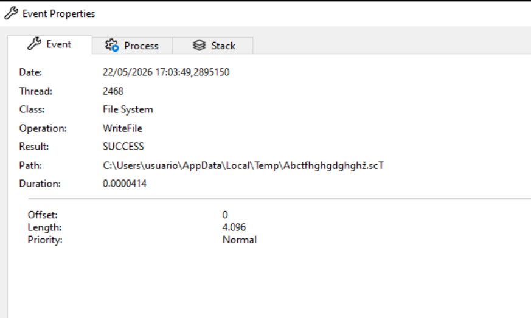
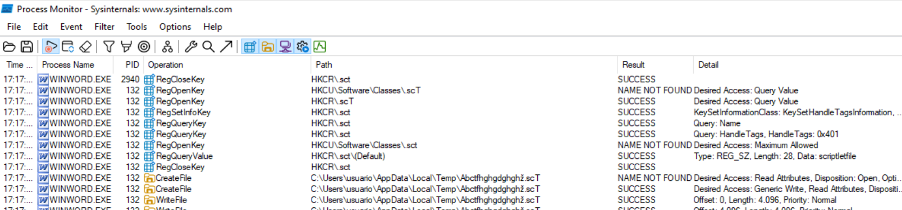

# **1. Información general:**
```
└─$ file 9da7d051bdf010d86a461d407c30d40f57d495fb6a5d22735ff792724bc3831e.rtf 
9da7d051bdf010d86a461d407c30d40f57d495fb6a5d22735ff792724bc3831e.rtf: Rich Text Format data, version 1
```

El archivo es reconocido por `file` como un documento `Rich Text Format` válido. Esto confirma que la muestra mantiene estructura `RTF` y debe analizarse con herramientas específicas para `RTF/OLE`, como `rtfdump.py` y `oledump.py`.

Footprinting:
```
MD5: 3c8de25fcd3746a65314c0747f981aa7
SHA-1: c2c35b8e78b2afc44f9875126f79da2a5646717b
SHA-256: 9da7d051bdf010d86a461d407c30d40f57d495fb6a5d22735ff792724bc3831e 
```

## **1.1 Análisis con VirusTotal**

https://www.virustotal.com/gui/file/9da7d051bdf010d86a461d407c30d40f57d495fb6a5d22735ff792724bc3831e


## **1.2 JoeSandBox**

https://www.joesandbox.com/analysis/800663/0/html

https://www.joesandbox.com/analysis/800663/0/pdf


## **1.3 Vmray**

https://www.vmray.com/analyses/9da7d051bdf0/report/overview.html


## **1.3 Tria.ge**

https://tria.ge/260522-qmlf3scs8k/behavioral1


-------


El script [ghidra_universal_string_deobfuscator.py](xxxxxx) devuelve:
```
ghidra_universal_string_deobfuscator.py> Running...
[*] Program: 9da7d051bdf010d86a461d407c30d40f57d495fb6a5d22735ff792724bc3831e.rtf
[*] Output directory: /tmp/ghidra_universal_deobfuscator_v2_9da7d051bdf010d86a461d407c30d40f57d495fb6a5d22735ff792724bc3831e.rtf
[*] Starting filtered multi-format deobfuscation...
[*] XOR enabled: False
[*] Scanning block: ram 00000000 - 00040552
[+] direct/ascii   00001f3e  Bank Address: Croeselaan 183521 CB Utrecht}
[+] direct/ascii   000029de  Bank Address: 22F \u8211\'96 24 Phan Dang Luu Street, Ward 6, Binh Thanh District, Hochiminh City, Vietnam}
[+] direct/ascii   00002fdc  Best regards,}
[+] hex-text block at 00003b01 produced 42 interesting strings
[+] CSV written: /tmp/ghidra_universal_deobfuscator_v2_9da7d051bdf010d86a461d407c30d40f57d495fb6a5d22735ff792724bc3831e.rtf/deobfuscator_results.csv
[+] Finished
[+] Results kept: 45
[+] Output directory: /tmp/ghidra_universal_deobfuscator_v2_9da7d051bdf010d86a461d407c30d40f57d495fb6a5d22735ff792724bc3831e.rtf
ghidra_universal_string_deobfuscator.py> Finished!
``` 


El Script [ghidra_rtf_hex_auto_deobfuscator.py](https://github.com/soniasalido/cybersecurity/blob/main/Documentation/Malware/Master-ENIIT-Analisis-Malware-Reversing/modulo-9-tecnicas-de-analisis-de-malware/6-M9T6/utiles/scripts_ghidra/ghidra_rtf_hex_auto_deobfuscator-RESULTADOS.md) devuelve:


# alternativas scdbg
| Herramienta          | Uso principal                          | Comentario                                                                                      |
| -------------------- | -------------------------------------- | ----------------------------------------------------------------------------------------------- |
| **Speakeasy**        | Emulación de malware/shellcode Windows | Muy buena alternativa moderna. Emula APIs de Windows, filesystem, registro y red. ([GitHub][1]) |
| **libemu / sctest**  | Emulación x86 de shellcode             | Es la base histórica de scdbg; útil para shellcode clásico de 32 bits. ([GitHub][2])            |
| **Qiling Framework** | Emulación avanzada e instrumentable    | Más potente, permite hooks, tracing y análisis personalizado en Python. ([GitHub][3])           |
| **Unicorn Engine**   | Motor de emulación CPU                 | Bajo nivel; requiere scripting, pero es muy flexible para shellcode. ([unicorn-engine.org][4])  |

[1]: https://github.com/mandiant/speakeasy?utm_source=chatgpt.com "mandiant/speakeasy: Windows kernel and user mode ..."
[2]: https://github.com/buffer/libemu?utm_source=chatgpt.com "buffer/libemu: x86 emulation and shellcode detection"
[3]: https://github.com/qilingframework/qiling/wiki/Malware-Analysis?utm_source=chatgpt.com "Malware Analysis · qilingframework/qiling Wiki"
[4]: https://www.unicorn-engine.org/?utm_source=chatgpt.com "Unicorn – The Ultimate CPU emulator"


```
¿Es código raw?
→ Unicorn directo.

¿Es PE completo?
→ Mejor Speakeasy/Qiling/debugger.

¿Es documento?
→ Extraer objetos; luego Unicorn solo sobre el shellcode.

¿Falla en la primera instrucción?
→ Offset incorrecto o no es shellcode directo.

¿Falla al llamar APIs?
→ Unicorn no emula Windows; necesitas hooks o Qiling/Speakeasy.
``` 


Unicorn Engine como tal no suele usarse con un comando directo tipo unicorn archivo.raw. Unicorn es principalmente una librería/API, por eso normalmente se usa desde Python.

Así que probablemente estabas pensando en:

speakeasy.exe -t archivo.raw --raw --arch x86 -o resultado.json


-------


# **X. Análisis dinámico**
Desdes una máquina virtual windows aislada y con todas las herramientas necesarias instaladas, vamos a realizar el análsis dinámico de esta muestra.

## **X.1 Preparación de la Máquina Virtual**
### **A) Process Monitor**
**Ejecutamos Process Monitor y establecemos los siguientes filtros:**
```
Process Name | is       | wscript.exe     | Include
Process Name | is       | powershell.exe  | Include
Path         | contains | xpertee.exe     | Include
Path         | contains | eddyholdingshuttle | Include
Path         | contains | 10.0.0.4        | Include
Operation    | is       | TCP Connect     | Include
```

### **B) Process Explorer**
Configuracón para Process Explorer:
```
Run as administrator
View > Select Columns > PID, Parent PID, Command Line, Image Path, Verified Signer
```


----

### **C) Regshot**
Tomamos dos snapshot, una previa y otra posterior a la ejecución para compararlas.

Comparación de los dos snapshots: [compare-snapshot-regshot.txt](https://github.com/soniasalido/cybersecurity/blob/main/Documentation/Malware/Master-ENIIT-Analisis-Malware-Reversing/modulo-9-tecnicas-de-analisis-de-malware/6-M9T6/compare-snapshot-regshot.txt)


-----

### **D) Wireshark**
**Filtro recomendado para wireshark:**
```
dns or http
```

| Parte                | Utilidad                   |
| -------------------- | -------------------------- |
| `dns`                | Dominios consultados       |
| `http`               | Peticiones HTTP            |


### **E) Microsoft Office antiguo**
Buscamos una versión antigua del programa, en este caso un Microsot Office 2003.


-----


## **X.2 Ejecutamos la muestra**








----

Ponemos un script de escucha para capturar el script antes de que sea borrardo: [watcher_sct.ps1](https://github.com/soniasalido/cybersecurity/blob/main/Documentation/Malware/Master-ENIIT-Analisis-Malware-Reversing/modulo-9-tecnicas-de-analisis-de-malware/6-M9T6/utiles/watcher_sct.ps1)

Obtenemos el fichero del payload:


Fichero script obtenido: [Abctfhghgdghghž.scT](https://github.com/soniasalido/cybersecurity/blob/main/Documentation/Malware/Master-ENIIT-Analisis-Malware-Reversing/modulo-9-tecnicas-de-analisis-de-malware/6-M9T6/utiles/Abctfhghgdghgh%C5%BE.scT)


Fichero script obtenido en extension .txt: [sct_payload.txt](https://github.com/soniasalido/cybersecurity/blob/main/Documentation/Malware/Master-ENIIT-Analisis-Malware-Reversing/modulo-9-tecnicas-de-analisis-de-malware/6-M9T6/utiles/sct_payload.txt)


Versión sanitizada para poder subirlo a chatGPT y analice lo que hace este script: [sct_report_sanitizado.txt](https://github.com/soniasalido/cybersecurity/blob/main/Documentation/Malware/Master-ENIIT-Analisis-Malware-Reversing/modulo-9-tecnicas-de-analisis-de-malware/6-M9T6/utiles/sct_report_sanitizado.txt)


Limpiamos el fichero payload para que sea un scrip plenamente operativo: [salida.vbs]

salido en plaitext: [salida.txt]