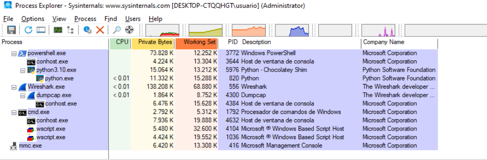

# **1. Información general:**
```
└─$ file 9da7d051bdf010d86a461d407c30d40f57d495fb6a5d22735ff792724bc3831e.rtf 
9da7d051bdf010d86a461d407c30d40f57d495fb6a5d22735ff792724bc3831e.rtf: Rich Text Format data, version 1
```

El archivo es reconocido por `file` como un documento `Rich Text Format` válido. Esto confirma que la muestra mantiene estructura `RTF` y debe analizarse con herramientas específicas para `RTF/OLE`, como `rtfdump.py` y `oledump.py`.

Footprinting:
```
MD5: 3c8de25fcd3746a65314c0747f981aa7
SHA-1: c2c35b8e78b2afc44f9875126f79da2a5646717b
SHA-256: 9da7d051bdf010d86a461d407c30d40f57d495fb6a5d22735ff792724bc3831e 
```

## **1.1 Análisis con VirusTotal**

https://www.virustotal.com/gui/file/9da7d051bdf010d86a461d407c30d40f57d495fb6a5d22735ff792724bc3831e


## **1.2 JoeSandBox**

https://www.joesandbox.com/analysis/800663/0/html

https://www.joesandbox.com/analysis/800663/0/pdf


## **1.3 Vmray**

https://www.vmray.com/analyses/9da7d051bdf0/report/overview.html


## **1.3 Tria.ge**

https://tria.ge/260522-qmlf3scs8k/behavioral1


-------


El script [ghidra_universal_string_deobfuscator.py](xxxxxx) devuelve:
```
ghidra_universal_string_deobfuscator.py> Running...
[*] Program: 9da7d051bdf010d86a461d407c30d40f57d495fb6a5d22735ff792724bc3831e.rtf
[*] Output directory: /tmp/ghidra_universal_deobfuscator_v2_9da7d051bdf010d86a461d407c30d40f57d495fb6a5d22735ff792724bc3831e.rtf
[*] Starting filtered multi-format deobfuscation...
[*] XOR enabled: False
[*] Scanning block: ram 00000000 - 00040552
[+] direct/ascii   00001f3e  Bank Address: Croeselaan 183521 CB Utrecht}
[+] direct/ascii   000029de  Bank Address: 22F \u8211\'96 24 Phan Dang Luu Street, Ward 6, Binh Thanh District, Hochiminh City, Vietnam}
[+] direct/ascii   00002fdc  Best regards,}
[+] hex-text block at 00003b01 produced 42 interesting strings
[+] CSV written: /tmp/ghidra_universal_deobfuscator_v2_9da7d051bdf010d86a461d407c30d40f57d495fb6a5d22735ff792724bc3831e.rtf/deobfuscator_results.csv
[+] Finished
[+] Results kept: 45
[+] Output directory: /tmp/ghidra_universal_deobfuscator_v2_9da7d051bdf010d86a461d407c30d40f57d495fb6a5d22735ff792724bc3831e.rtf
ghidra_universal_string_deobfuscator.py> Finished!
``` 


El Script [ghidra_rtf_hex_auto_deobfuscator.py](https://github.com/soniasalido/cybersecurity/blob/main/Documentation/Malware/Master-ENIIT-Analisis-Malware-Reversing/modulo-9-tecnicas-de-analisis-de-malware/6-M9T6/utiles/scripts_ghidra/ghidra_rtf_hex_auto_deobfuscator-RESULTADOS.md) devuelve:


# alternativas scdbg
| Herramienta          | Uso principal                          | Comentario                                                                                      |
| -------------------- | -------------------------------------- | ----------------------------------------------------------------------------------------------- |
| **Speakeasy**        | Emulación de malware/shellcode Windows | Muy buena alternativa moderna. Emula APIs de Windows, filesystem, registro y red. ([GitHub][1]) |
| **libemu / sctest**  | Emulación x86 de shellcode             | Es la base histórica de scdbg; útil para shellcode clásico de 32 bits. ([GitHub][2])            |
| **Qiling Framework** | Emulación avanzada e instrumentable    | Más potente, permite hooks, tracing y análisis personalizado en Python. ([GitHub][3])           |
| **Unicorn Engine**   | Motor de emulación CPU                 | Bajo nivel; requiere scripting, pero es muy flexible para shellcode. ([unicorn-engine.org][4])  |

[1]: https://github.com/mandiant/speakeasy?utm_source=chatgpt.com "mandiant/speakeasy: Windows kernel and user mode ..."
[2]: https://github.com/buffer/libemu?utm_source=chatgpt.com "buffer/libemu: x86 emulation and shellcode detection"
[3]: https://github.com/qilingframework/qiling/wiki/Malware-Analysis?utm_source=chatgpt.com "Malware Analysis · qilingframework/qiling Wiki"
[4]: https://www.unicorn-engine.org/?utm_source=chatgpt.com "Unicorn – The Ultimate CPU emulator"


```
¿Es código raw?
→ Unicorn directo.

¿Es PE completo?
→ Mejor Speakeasy/Qiling/debugger.

¿Es documento?
→ Extraer objetos; luego Unicorn solo sobre el shellcode.

¿Falla en la primera instrucción?
→ Offset incorrecto o no es shellcode directo.

¿Falla al llamar APIs?
→ Unicorn no emula Windows; necesitas hooks o Qiling/Speakeasy.
``` 


Unicorn Engine como tal no suele usarse con un comando directo tipo unicorn archivo.raw. Unicorn es principalmente una librería/API, por eso normalmente se usa desde Python.

Así que probablemente estabas pensando en:

speakeasy.exe -t archivo.raw --raw --arch x86 -o resultado.json


-------


# **X. Análisis dinámico**
Desdes una máquina virtual windows aislada y con todas las herramientas necesarias instaladas, vamos a realizar el análsis dinámico de esta muestra.

## **X.1 Preparación de la Máquina Virtual**
### **A) Process Monitor**
**Ejecutamos Process Monitor y establecemos los siguientes filtros:**
```
Process Name | is       | wscript.exe     | Include
Process Name | is       | powershell.exe  | Include
Path         | contains | xpertee.exe     | Include
Path         | contains | eddyholdingshuttle | Include
Path         | contains | 10.0.0.4        | Include
Operation    | is       | TCP Connect     | Include
```

### **B) Process Explorer**
Configuracón para Process Explorer:
```
Run as administrator
View > Select Columns > PID, Parent PID, Command Line, Image Path, Verified Signer
```


----

### **C) Regshot**
Tomamos dos snapshot, una previa y otra posterior a la ejecución para compararlas.

Comparación de los dos snapshots: [compare-snapshot-regshot.txt](https://github.com/soniasalido/cybersecurity/blob/main/Documentation/Malware/Master-ENIIT-Analisis-Malware-Reversing/modulo-9-tecnicas-de-analisis-de-malware/6-M9T6/compare-snapshot-regshot.txt)


-----

### **D) Wireshark**
**Filtro recomendado para wireshark:**
```
dns or http
```

| Parte                | Utilidad                   |
| -------------------- | -------------------------- |
| `dns`                | Dominios consultados       |
| `http`               | Peticiones HTTP            |


### **E) Microsoft Office antiguo**
Buscamos una versión antigua del programa, en este caso un Microsot Office 2003.


-----


## **X.2 Ejecutamos la muestra**

**Ejecutamos el documento `9da7d051bdf010d86a461d407c30d40f57d495fb6a5d22735ff792724bc3831e.rtf`:**  


-----


**Muestra una advertencia:**  


-----


**Muestra una segunda advertencia:**  


-----


**Con el procmon vemos que el documento rtf crea un fichero en la carpeta `C:\Users\usuario\AppData\Local\Temp\`:**  


-----


**Inicio exacto de la creación del `.scT`:**  
  

Secuencia:
```
WINWORD.EXE → consulta HKCR\.sct
WINWORD.EXE → HKCR\.sct\(Default) = scriptletfile
WINWORD.EXE → comprueba si existe el .scT en %TEMP%
WINWORD.EXE → NAME NOT FOUND
WINWORD.EXE → crea el .scT
WINWORD.EXE → WriteFile sobre el .scT
``` 

Donde vemos:
```
Path:
C:\Users\usuario\AppData\Local\Temp\Abctfhghgdghghž.scT

Operation:
CreateFile

Result:
NAME NOT FOUND
``` 
Es una comprobación previa: Word pregunta si ya existe el fichero. La respuesta es no. Justo después aparece otro `CreateFile` sobre la misma ruta con:
``` 
Result: SUCCESS
Desired Access: Generic Write, Read Attributes
```
Eso ya es la creación real del fichero. Luego viene:
``` 
WriteFile
Offset: 0
Length: 4096
```

La consulta a:
```
HKCR\.sct\(Default) = scriptletfile
```
es relevante porque indica que Windows reconoce la extensión`.sct` como un scriptlet file. El contenido que capturaste después confirma que ese `.sct` es un downloader VBScript con `ExecuteGlobal`, `WScript.Shell`, `PowerShell` oculto y la URL de segunda etapa `hxxp://eddyholdingshuttle.co.za/i/xpertee[.]exe`.


-----

**Vemos en procmon una fase de búsqueda fallida:**  

vemos que WINWORD.EXE está intentando localizar:
```
%TMP%\abctfhghgdghghž.SCT
```
pero `%TMP%` no se está expandiendo a la ruta real temporal. Windows lo trata como texto literal y lo busca dentro de distintas carpetas del PATH. Por eso vemos rutas como:
```
C:\Python310\Scripts\%TMP%\abctfhghgdghghž.SCT
``` 

Del código VBScript que hemos visto, sabemos que el `.sct` construye un downloader para `xpertee.exe`, usando Base64, PowerShell, `DownloadFile` y `%appdata%`. El script decodifica la URL `hxxp://eddyholdingshuttle.co.za/i/xpertee[.]exe` y el nombre `xpertee[.]exe`, y construye un comando PowerShell para descargarlo y ejecutarlo. La búsqueda rara con `%TMP%\abctfh...SCT` no parece venir del cuerpo principal del VBScript.

-----

**Vemos la evidencia directa del borrado del `.scT` por Word:**


La operación importante es:
``` 
SetDispositionInformationEx
```
y el flag clave es:
```
FILE_DISPOSITION_DELETE
``` 
Eso significa que `WINWORD.EXE` marca el fichero para eliminación. En Windows, esto no siempre se ve como `DeleteFile`; muchas veces el borrado se implementa marcando el objeto de fichero como `delete pending` y eliminándolo cuando se cierran los handles abiertos.


-----

**Vemos quién ordena el borrado del `.scT` y qué operación concreta usa Windows para eliminarlo.:**


En la pestaña Process se ve que el proceso responsable es:
```
Name: WINWORD.EXE
Version: 11.0.5604
Path: C:\Program Files (x86)\Microsoft Office\OFFICE11\WINWORD.EXE
Command Line: "...\WINWORD.EXE" /n /dde
PID: 132
User: DESKTOP-CTQQHGT\usuario
Architecture: 32-bit
Integrity: Medium
```

Y en la pestaña Event del mismo evento se ve la flag `SetDispositionInformationEx`:  

```
Name: WINWORD.EXE
Version: 11.0.5604
Path: C:\Program Files (x86)\Microsoft Office\OFFICE11\WINWORD.EXE
Command Line: "...\WINWORD.EXE" /n /dde
PID: 132
User: DESKTOP-CTQQHGT\usuario
Architecture: 32-bit
Integrity: Medium
``` 

Donde: `SetDispositionInformationEx + FILE_DISPOSITION_DELETE` significa ue `WINWORD.EXE` marca el fichero `.scT` para borrado.


---------


**Secuencia:**
```
1. WINWORD.EXE consulta HKCR\.sct → scriptletfile.
2. WINWORD.EXE comprueba si existe el .sct → NAME NOT FOUND.
3. WINWORD.EXE crea el .sct → SUCCESS.
4. WINWORD.EXE escribe el .sct → WriteFile.
5. WINWORD.EXE lee/consulta el .sct.
6. WINWORD.EXE lo marca para borrado → FILE_DISPOSITION_DELETE.
```


----

**Ponemos un script de escucha para capturar el script del malware antes de que sea borrardo: [watcher_sct.ps1](https://github.com/soniasalido/cybersecurity/blob/main/Documentation/Malware/Master-ENIIT-Analisis-Malware-Reversing/modulo-9-tecnicas-de-analisis-de-malware/6-M9T6/utiles/watcher_sct.ps1)**


**Vemos el fichero que genera el watcher y que contiene el payload:**


------

**Vemos el contenido de este fichero. Es un script Visual Basic:**


-----


Fichero script obtenido: [Abctfhghgdghghž.scT](https://github.com/soniasalido/cybersecurity/blob/main/Documentation/Malware/Master-ENIIT-Analisis-Malware-Reversing/modulo-9-tecnicas-de-analisis-de-malware/6-M9T6/utiles/Abctfhghgdghgh%C5%BE.scT)


Fichero script obtenido en extension .txt: [sct_payload.txt](https://github.com/soniasalido/cybersecurity/blob/main/Documentation/Malware/Master-ENIIT-Analisis-Malware-Reversing/modulo-9-tecnicas-de-analisis-de-malware/6-M9T6/utiles/sct_payload.txt)


Versión sanitizada para poder subirlo a chatGPT y analice lo que hace este script: [sct_report_sanitizado.txt](https://github.com/soniasalido/cybersecurity/blob/main/Documentation/Malware/Master-ENIIT-Analisis-Malware-Reversing/modulo-9-tecnicas-de-analisis-de-malware/6-M9T6/utiles/sct_report_sanitizado.txt)


Limpiamos el fichero payload para que sea un scrip plenamente operativo: [salida.vbs](https://github.com/soniasalido/cybersecurity/blob/main/Documentation/Malware/Master-ENIIT-Analisis-Malware-Reversing/modulo-9-tecnicas-de-analisis-de-malware/6-M9T6/utiles/salida.vbs)

Salida en plaitext: [salida.txt](https://github.com/soniasalido/cybersecurity/blob/main/Documentation/Malware/Master-ENIIT-Analisis-Malware-Reversing/modulo-9-tecnicas-de-analisis-de-malware/6-M9T6/utiles/salida.vbs.txt)


-----

**Volvemos a ejecutar el script pero se produce un error: **
```
Error: El sistema no puede encontrar el recurso especificado.
Código: 800C0005
Origen: msxml3.dll
```
Al ejecutar el script salida.vbs extraído de la muestra mediante `wscript.exe //X //D`, Windows Script Host generó un error con código `800C0005` y origen `msxml3.dll`. Este error es compatible con un fallo en una petición HTTP realizada mediante componentes MSXML, probablemente porque el recurso remoto utilizado por la muestra `http://bit.ly/34vzFlU` ya no está disponible o no es accesible desde la máquina virtual.

Por tanto, aunque el script se ejecuta, no se consigue completar la fase de descarga del payload. La diferencia con el vídeo del profesor puede deberse a que en su entorno el recurso remoto seguía disponible, existía conectividad adecuada o había un depurador de scripts registrado correctamente.

----------------------

**Simularemos el servidor para que el script reciba una respuesta `HTTP 200 OK` y podamos observar qué hace el script  después.**

El script intenta acceder a:
```
http://eddyholdingshuttle.co.za/i/xpertee.exe
```
Por eso el error `msxml3.dll / 800C0005` aparece cuando no puede contactar ese recurso. Si hacemos que ese dominio resuelva hacia nuestro laboratorio y responda algo en esa ruta, el error de `MSXML` desaparecerá.


Modificamos `hosts` y usarremos la propia máquina virtual como servidor falso. En la VM editamos como administrador:
```
C:\Windows\System32\drivers\etc\hosts
```
Añadimos una línea apuntando el dominio a la IP de nuestra propia VM:
```
<ip de la máquina virtual del laboratorio> eddyholdingshuttle.co.za
```

Hacmos un ping para ver si funciona:  


----------------------

**Montamos una respuesta `HTTP` falsa en la VM del laboratorio:**
```
mkdir -p /tmp/fakesite/i
cd /tmp/fakesite
```

Creamos un fichero falso con el nombre que espera la muestra:
```
echo "FAKE_PAYLOAD_FOR_ANALYSIS" > /tmp/fakesite/i/xpertee.exe
```

Levantamos un servidor HTTP en el puerto 80 (debemos estar en la carpeta `fakesite`):
```
python3 -m http.server 80 --bind 0.0.0.0
```


Comprobamos si funciona. Desde otra terminal:
```
curl http://eddyholdingshuttle.co.za/i/xpertee.exe
```

Vemos como el servidor recibe las peticiones correctamente:


---------------------------------

**Volvemos a ejecutar el script. Pero obtenemos un nuevo error:**


El script está intentando ejecutar una línea:
```
Set objFile = writer.CreateTextFile(outFile, True)
```
Pero el objeto writer no existe o no ha sido inicializado. En VBScript, para poder usar `.CreateTextFile`, antes tendría que existir algo así:
```
Set writer = CreateObject("Scripting.FileSystemObject")
```

<mark>El script extraído no está completo o no está perfectamente reconstruido.</mark>

<mark>Para continuar la ejecución controlada, vamos a corregir manualmente el script añadiendo esta línea antes de la línea 373:</mark>


------------------------------------

**Volvemos a ejecutar el script y ya funciona sin erorres.**

**Comprobamos en wiresharK:**  

donde vemos que origen y destino son `10.0.0.4` ya que estamos capturando en loopback. Se confirma el intento de descarga.


--------

**Confirmamos la activación de la fase de descarga:**


```
TCP 49678 → 80
HTTP GET /i/xpertee.exe HTTP/1.1
Host: eddyholdingshuttle.co.za
Full request URI: http://eddyholdingshuttle.co.za/i/xpertee.exe
``` 

La cadena se activó más allá del drop del `.sct`. El scriptlet/downloader llegó a realizar una petición `HTTP GET` para descargar `/i/xpertee.exe` desde `eddyholdingshuttle.co.za`. 

-------

**En Wireshark: `Follow → HTTP Stream` sobre esa petición `Get`:** 


En Wireshark se ve:
```
GET /i/xpertee.exe HTTP/1.1
Host: eddyholdingshuttle.co.za
```
y el servidor responde correctamente:
```
HTTP/1.0 200 OK
Server: SimpleHTTP/0.6 Python/3.10.11
Content-type: application/x-msdownload
Content-Length: 56
```

Vemos en el cuerpo de la respuesta contiene el fichero inocuo:
```
FAKE_PAYLOAD_FOR_ANALYSIS
```


<mark>Ahora tenemos la prueba de una descarga simulada completada.</mark>


------- 


**Comprobamos en process monitor:**  


**Comprobamos en procmon:**  


