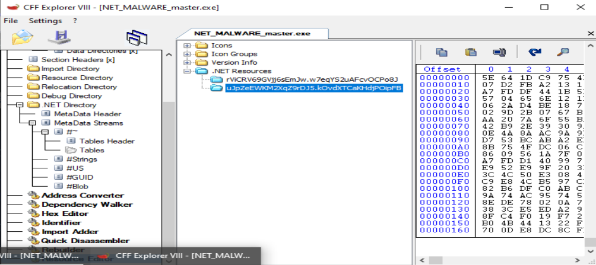

- [1. Identificar la arquitectura de destino del malware](#1-identificar-la-arquitectura-de-destino-del-malware)
  - [1.1. Identificación del formato](#11-identificación-del-formato)
  - [1.2. Arquitectura declarada en la cabecera PE](#12-arquitectura-declarada-en-la-cabecera-pe)
  - [1.3. Subsistema gráfico](#13-subsistema-gráfico)
  - [1.4. Naturaleza administrada del ejecutable](#14-naturaleza-administrada-del-ejecutable)
  - [1.5. Diferencia entre PE32 y arquitectura efectiva del proceso](#15-diferencia-entre-pe32-y-arquitectura-efectiva-del-proceso)
    - [Arquitectura de la envoltura PE](#arquitectura-de-la-envoltura-pe)
    - [Arquitectura requerida por el código administrado](#arquitectura-requerida-por-el-código-administrado)
  - [1.6. Compilador y lenguaje probable](#16-compilador-y-lenguaje-probable)
  - [1.7. Protector detectado](#17-protector-detectado)
  - [1.8. Punto de entrada](#18-punto-de-entrada)
  - [1.9. Secciones del ejecutable](#19-secciones-del-ejecutable)
  - [1.10. Relocalizaciones](#110-relocalizaciones)
  - [1.11. Recursos administrados observados](#111-recursos-administrados-observados)
  - [1.12. Sistema operativo de destino](#112-sistema-operativo-de-destino)
  - [1.13. Resumen de arquitectura](#113-resumen-de-arquitectura)
  - [1.14. Conclusión](#114-conclusión)
- [2. Tomar huellas dactilares del malware](#2-tomar-huellas-dactilares-del-malware)
  - [2.1. Huella criptográfica del archivo](#21-huella-criptográfica-del-archivo)
  - [2.2. Huellas de la cabecera DOS](#22-huellas-de-la-cabecera-dos)
  - [2.3. Huellas de las secciones PE](#23-huellas-de-las-secciones-pe)
    - [Sección `.text`](#sección-text)
    - [Sección `.sdata`](#sección-sdata)
      - [Sección `.rsrc`](#sección-rsrc)
    - [Sección `.reloc`](#sección-reloc)
  - [2.4. Huella de la información de versión](#24-huella-de-la-información-de-versión)
  - [2.5. Import Hash](#25-import-hash)
  - [2.6. Resumen de huellas](#26-resumen-de-huellas)
  - [2.7. Valoración](#27-valoración)
  - [2.9 Consultas externas](#29-consultas-externas)
- [3. Triage estático inicial con PeStudio](#3-triage-estático-inicial-con-pestudio)
  - [3.1. Información general del archivo](#31-información-general-del-archivo)
  - [3.2. Identificación del ejecutable .NET](#32-identificación-del-ejecutable-net)
  - [3.3. Punto de entrada](#33-punto-de-entrada)
  - [3.4. Fecha de compilación](#34-fecha-de-compilación)
  - [3.5. Cabecera DOS](#35-cabecera-dos)
  - [3.6. File Header](#36-file-header)
  - [3.7. Optional Header y protecciones de seguridad](#37-optional-header-y-protecciones-de-seguridad)
  - [3.8. Secciones PE](#38-secciones-pe)
    - [Sección `.text`](#sección-text-1)
    - [Sección `.sdata`](#sección-sdata-1)
    - [Sección `.rsrc`](#sección-rsrc-1)
    - [Sección `.reloc`](#sección-reloc-1)
  - [3.9. Recursos incrustados](#39-recursos-incrustados)
  - [3.10. Recursos PE tradicionales](#310-recursos-pe-tradicionales)
    - [3.11. Importaciones PE, declaraciones P/Invoke y referencias administradas](#311-importaciones-pe-declaraciones-pinvoke-y-referencias-administradas)
      - [Importación PE convencional](#importación-pe-convencional)
      - [Declaraciones P/Invoke](#declaraciones-pinvoke)
      - [Referencias administradas](#referencias-administradas)
  - [3.12. Import Hash](#312-import-hash)
  - [3.13. Namespaces y estructura .NET](#313-namespaces-y-estructura-net)
    - [3.14. Cadenas y referencias relevantes](#314-cadenas-y-referencias-relevantes)
      - [APIs nativas declaradas mediante P/Invoke](#apis-nativas-declaradas-mediante-pinvoke)
  - [3.15. Firma digital y manifiesto](#315-firma-digital-y-manifiesto)
  - [3.16. Indicadores relevantes del triage](#316-indicadores-relevantes-del-triage)
  - [3.17. Valoración del triage](#317-valoración-del-triage)
  - [3.18. Conclusión](#318-conclusión)
- [4. Análisis de empaquetado](#4-análisis-de-empaquetado)
  - [4.1. Indicadores iniciales de protección](#41-indicadores-iniciales-de-protección)
  - [4.2. Análisis de entropía](#42-análisis-de-entropía)
  - [4.3. Recursos administrados de alta entropía](#43-recursos-administrados-de-alta-entropía)
  - [4.4 Nombres y metadatos ofuscados](#44-nombres-y-metadatos-ofuscados)
  - [4.5. APIs nativas y referencias administradas relacionadas con la protección](#45-apis-nativas-y-referencias-administradas-relacionadas-con-la-protección)
    - [Declaraciones P/Invoke](#declaraciones-pinvoke-1)
    - [Referencias administradas](#referencias-administradas-1)
    - [Valoración](#valoración)
  - [4.6. Diferencia entre desempaquetado y desofuscación](#46-diferencia-entre-desempaquetado-y-desofuscación)
  - [4.7. Primer intento con de4dot](#47-primer-intento-con-de4dot)
  - [4.8. Problema relacionado con XAML](#48-problema-relacionado-con-xaml)
  - [4.9. Segundo intento conservando los nombres](#49-segundo-intento-conservando-los-nombres)
  - [4.10. Resultado del proceso de limpieza](#410-resultado-del-proceso-de-limpieza)
  - [4.11. Resultado del análisis de protección](#411-resultado-del-análisis-de-protección)
  - [4.12. Conclusión](#412-conclusión)
- [5. Análisis estático del código descompilado y de los recursos](#5-análisis-estático-del-código-descompilado-y-de-los-recursos)
  - [5.1. Apertura del ensamblado desofuscado](#51-apertura-del-ensamblado-desofuscado)
  - [5.2. Estructura del ensamblado principal](#52-estructura-del-ensamblado-principal)
  - [5.3. Localización del punto de entrada](#53-localización-del-punto-de-entrada)
  - [5.4. Análisis de los recursos administrados](#54-análisis-de-los-recursos-administrados)
  - [5.5. Extracción del recurso sospechoso](#55-extracción-del-recurso-sospechoso)
  - [5.6. Características generales de `resource-A`](#56-características-generales-de-resource-a)
  - [5.7. Clases principales del ensamblado extraído](#57-clases-principales-del-ensamblado-extraído)
- [6. Análisis del Recurso A](#6-análisis-del-recurso-a)


# 1. Identificar la arquitectura de destino del malware

El primer paso del análisis consiste en identificar el formato, la arquitectura y el entorno de ejecución del fichero principal:

```text
NET_MALWARE_master.exe
```

Para ello se van a utilizar las siguientes herramientas:
* Exeinfo PE.
* Detect It Easy.
* PeStudio.
* CFF Explorer.

En esta fase analizamos únicamente el ejecutable principal. Aunque se observan recursos incrustados dentro del ensamblado, todavía no se ha determinado su contenido ni puede afirmarse que alguno de ellos corresponda al payload definitivo.


---

## 1.1. Identificación del formato

Los primeros bytes del archivo son:

```text
4D 5A 90 00 03 00 00 00 04 00 00 00 FF FF 00 00
```

Los bytes:

```text
4D 5A
```

corresponden a la firma ASCII:

```text
MZ
```

Esto confirma que <mark>el fichero utiliza el formato ejecutable de Windows.</mark>

<mark>La cabecera PE se encuentra en el desplazamiento indicado por el campo `e_lfanew`:</mark>

```text
0x00000080
```

En dicha posición aparece la firma:

```text
50 45 00 00
```

equivalente a:

```text
PE\0\0
```

Por tanto, `NET_MALWARE_master.exe` es un <mark>ejecutable **Portable Executable — PE** válido para Microsoft Windows.</mark>

---

## 1.2. Arquitectura declarada en la cabecera PE

Las herramientas identifican las siguientes propiedades:

| Propiedad                    | Valor            |
| ---------------------------- | ---------------- |
| Formato                      | `PE32`           |
| Machine                      | `0x014C`         |
| Arquitectura declarada       | Intel 386 / I386 |
| Modo PE                      | 32 bits          |
| Subsistema                   | Windows GUI      |
| Image Base                   | `0x00400000`     |
| Tamaño de la imagen          | `0x00040000`     |
| Número de secciones          | 4                |
| Punto de entrada             | `0x00439F4E`     |
| Sección del punto de entrada | `.text`          |

El valor:

```text
Machine = 0x014C
```

corresponde a:

```text
IMAGE_FILE_MACHINE_I386
```

Desde el punto de vista de la cabecera PE, el archivo se presenta como un ejecutable **PE32 para arquitectura Intel x86**.

Detect It Easy y Exeinfo PE lo clasifican como:

```text
PE32
32-bit
I386
Windows GUI
```

---

## 1.3. Subsistema gráfico

El Optional Header contiene:

```text
Subsystem = 0x0002
```

Este valor corresponde a:

```text
IMAGE_SUBSYSTEM_WINDOWS_GUI
```

Por tanto, el ejecutable está diseñado como una <mark>aplicación gráfica de Windows y no como una aplicación de consola.</mark> Esta configuración provoca que su ejecución normal no abra automáticamente una ventana de terminal.

El nombre original almacenado en los metadatos es:

```text
WpfBrowserApplication1.exe
```

y la descripción es:

```text
WpfBrowserApplication1
```

Esto es coherente con una aplicación basada en **Windows Presentation Foundation — WPF**.

---

## 1.4. Naturaleza administrada del ejecutable

El análisis muestra que no se trata de un ejecutable nativo convencional, sino de un ensamblado administrado de Microsoft .NET. Los indicadores principales son:

```text
Microsoft.NET
Microsoft Visual C# / Basic .NET
CLR v4.0.30319
Firma de metadatos BSJB
```

La cabecera .NET presenta:

| Propiedad                  | Resultado                    |
| -------------------------- | ---------------------------- |
| Firma CLR                  | `BSJB`                       |
| Versión CLR                | `v4.0.30319`                 |
| Código IL-Only             | Sí                           |
| Native Entry Point         | No                           |
| Strong Name                | No                           |
| Token del punto de entrada | `0x06000009`                 |
| Nombre del módulo          | `WpfBrowserApplication1.exe` |

La propiedad:

```text
IL-Only = true
```

indica que la lógica principal está implementada mediante **Common Intermediate Language — CIL/MSIL**.

El sistema operativo no ejecuta directamente la mayor parte de este código. El ensamblado es cargado por el **Common Language Runtime — CLR**, que compila las instrucciones administradas mediante JIT antes de ejecutarlas.

---

## 1.5. Diferencia entre PE32 y arquitectura efectiva del proceso

Aunque las herramientas muestran:

```text
PE32
I386
32-bit
```

la cabecera CLR contiene los siguientes valores:

```text
32-bit-required = false
32-bit-preferred = false
```

Esto significa que el **ensamblado administrado no declara expresamente que deba ejecutarse obligatoriamente como proceso de 32 bits.**

Por tanto, deben diferenciarse dos conceptos:

### Arquitectura de la envoltura PE

```text
PE32
Machine I386
```

### Arquitectura requerida por el código administrado

```text
32BITREQ = false
32BITPREF = false
```

La combinación es compatible con un ensamblado compilado como:

```text
AnyCPU
```

En ese caso, el comportamiento esperado sería:

```text
Windows de 32 bits → proceso de 32 bits
Windows de 64 bits → proceso administrado potencialmente de 64 bits
```

No obstante, **la muestra se encuentra protegida mediante .NET Reactor**. El protector puede incorporar código auxiliar, stubs nativos o dependencias que condicionen la arquitectura efectiva en tiempo de ejecución.

Por ello, la clasificación más precisa en esta fase es:

> [!CAUTION]
> `NET_MALWARE_master.exe` es un ejecutable PE32 administrado para Windows, cuya cabecera PE utiliza la arquitectura I386, pero cuyo código CLR no está marcado como exclusivamente de 32 bits. La arquitectura efectiva del proceso deberá confirmarse durante el análisis dinámico.

---

## 1.6. Compilador y lenguaje probable

Detect It Easy identifica:

```text
Compilador: VB.NET
Lenguaje: VB.NET
Librería: .NET Framework
```

PeStudio ofrece una identificación más general:

```text
Microsoft Visual C# / Basic .NET
```

También se observan referencias a:

```text
Microsoft.VisualBasic
Microsoft.VisualBasic.ApplicationServices
Microsoft.VisualBasic.CompilerServices
Microsoft.VisualBasic.Devices
```

Estas evidencias indican que el ejecutable fue desarrollado probablemente en **Visual Basic .NET**, aunque determinados componentes generados por WPF puedan aparecer descompilados como `C#`.

---

## 1.7. Protector detectado

Detect It Easy identifica el uso de:

```text
.NET Reactor 4.8–4.9
```

También muestra indicadores relacionados con:

```text
Encrypted or packed data
Assembly invoke
RSACryptoServiceProvider
High entropy
Strings encryption
Obfuscation
Fake .cctor name
Math mutations
```

Por tanto, **<mark>el ensamblado se encuentra protegido u ofuscado.</mark>**

Esta protección puede afectar a:
* Los nombres de clases y métodos.
* Las cadenas.
* El flujo de control.
* La carga de ensamblados.
* Los recursos administrados.
* La interpretación del punto de entrada.
* La arquitectura efectiva de componentes auxiliares.

La identificación de `.NET Reactor` justifica la utilización posterior de herramientas especializadas como:

```text
de4dot
dnSpyEx
ILSpy
CFF Explorer
```

---

## 1.8. Punto de entrada

Las herramientas muestran el punto de entrada PE en:

```text
RVA: 0x00039F4E
VA:  0x00439F4E
```

El punto de entrada se encuentra en:

```text
.text
```

Los primeros bytes son:

```text
FF 25 00 20 40 00
```

Este código actúa como un pequeño stub que transfiere la ejecución al mecanismo de inicialización del CLR.

El punto de entrada administrado se identifica mediante el token:

```text
0x06000009
```

Por tanto, la lógica real del programa no debe analizarse únicamente desde el stub nativo. Es necesario localizar el método .NET asociado a dicho token mediante un descompilador administrado.

---

## 1.9. Secciones del ejecutable

El archivo contiene cuatro secciones:

| Sección  |      Tamaño raw |  Entropía | Permisos principales  |
| -------- | --------------: | --------: | --------------------- |
| `.text`  | `229.376 bytes` | `7,72264` | Lectura y ejecución   |
| `.sdata` |     `512 bytes` | `2,18920` | Lectura y escritura   |
| `.rsrc`  |   `2.560 bytes` | `2,95314` | Lectura               |
| `.reloc` |     `512 bytes` | `0,10473` | Lectura y descartable |

La sección `.text` ocupa aproximadamente:

```text
98,03 % del archivo
```

y presenta una entropía elevada:

```text
7,72264
```

<mark>Detect It Easy clasifica aproximadamente el 95 % del archivo como empaquetado.</mark>

Esta entropía puede ser consecuencia de:
* Ofuscación.
* Cifrado.
* Compresión.
* Protección mediante .NET Reactor.
* Recursos administrados almacenados dentro de `.text`.

En esta fase no debe concluirse automáticamente que la alta entropía corresponde a un payload. **Sólo permite afirmar que existe una cantidad significativa de contenido transformado o protegido.**

---

## 1.10. Relocalizaciones

El archivo contiene una sección:

```text
.reloc
```

La tabla presenta un bloque de relocalización asociado a:

```text
VirtualAddress: 0x00039000
SizeOfBlock:    0x0000000C
```

La presencia de relocalizaciones indica que el ejecutable conserva información para ajustar determinadas direcciones si no se carga exactamente en su dirección base preferida.

Sin embargo, el Optional Header muestra:

```text
ASLR = false
```

Por tanto, aunque existe información de relocalización, el binario no declara compatibilidad con ASLR mediante `DYNAMIC_BASE`.

---

## 1.11. Recursos administrados observados

CFF Explorer muestra recursos dentro del nodo:

```text
.NET Resources
```

Entre ellos aparecen nombres aparentemente aleatorios, por ejemplo:

```text
rViCRV69GVjj6sEmJw.w7eqYS2uAFcvOCPo8J
uJpZeEWKM2XqZ9rDJ5.kOvdXTCaKHdjPOipFB
```

Su contenido se presenta como datos binarios de elevada entropía.

En este punto del análisis sólo podemos afirmar que:
* <mark>El ejecutable contiene recursos .NET incrustados.</mark>
* <mark>Los nombres parecen ofuscados.</mark>
* <mark>Su contenido no es directamente legible.</mark>
* <mark>Pueden estar cifrados, comprimidos o serializados.</mark>
* <mark>Deben extraerse y analizarse de forma independiente.</mark>

No es correcto afirmar todavía que alguno de estos recursos sea un payload operativo del malware. Esa conclusión requiere:

1. Extraer los recursos.
2. Identificar su formato.
3. Localizar el código que los consume.
4. Determinar si se descifran, descomprimen o cargan.
5. Analizar su contenido de forma separada.

---

## 1.12. Sistema operativo de destino

Las características del ejecutable confirman que está diseñado para:

```text
Microsoft Windows
```

Las evidencias principales son:
* Formato PE.
* Subsistema Windows GUI.
* Aplicación WPF.
* .NET Framework / CLR `v4.0.30319`.
* Arquitectura PE I386.
* Uso de recursos y estructuras propias de Windows.
* Protección mediante .NET Reactor para ensamblados .NET.

No se trata de un ejecutable Linux ni de una aplicación .NET multiplataforma moderna.


---

## 1.13. Resumen de arquitectura

```text
Archivo: NET_MALWARE_master.exe
Formato: Portable Executable
Tipo PE: PE32
Machine: Intel 386 / I386
Subsistema: Windows GUI
Plataforma: Microsoft Windows
Tecnología: Microsoft .NET
CLR: v4.0.30319
Código: IL-Only
Lenguaje probable: VB.NET
Interfaz: WPF
Protector: .NET Reactor 4.8–4.9
Image Base: 0x00400000
Punto de entrada PE: 0x00439F4E
Token de entrada .NET: 0x06000009
Número de secciones: 4
32-bit-required: false
32-bit-preferred: false
```

---

## 1.14. Conclusión

`NET_MALWARE_master.exe` es un ejecutable **PE32 administrado para Microsoft Windows**, asociado a la arquitectura I386 en su cabecera PE y compilado para el CLR `v4.0.30319`.

El archivo utiliza WPF, fue desarrollado probablemente en VB.NET y se encuentra protegido mediante .NET Reactor.

Aunque las herramientas lo clasifican como un ejecutable de 32 bits debido a su formato PE32 y al valor `IMAGE_FILE_MACHINE_I386`, los indicadores CLR `32-bit-required` y `32-bit-preferred` están desactivados. Por ello, es posible que el ensamblado administrado haya sido compilado como `AnyCPU`.

La arquitectura efectiva deberá confirmarse mediante ejecución controlada y observación del proceso en un sistema Windows de 64 bits.

En esta fase también se han identificado **recursos .NET de alta entropía con nombres ofuscados.** Sin embargo, todavía no se conoce su función y no debe concluirse que contengan el payload hasta que sean extraídos y analizados.


------------------------------------------

# 2. Tomar huellas dactilares del malware

Para identificar de forma inequívoca la muestra y facilitar su comparación con otras variantes, vamos a realizar una toma de huellas mediante **FootprintNG**. La herramienta calcula hashes tanto del archivo completo como de diferentes estructuras internas del ejecutable PE.

Este enfoque permite trabajar con dos niveles de identificación:
* **Huella global:** identifica exactamente el archivo analizado.
* **Huellas parciales:** permiten comparar cabeceras, secciones y recursos entre muestras relacionadas, aunque el archivo completo haya sido modificado.

## 2.1. Huella criptográfica del archivo

FootprintNG calculó el siguiente SHA-256 para el archivo completo:

```text
6DDA005FA9D3F826124458AF97D2E918A475D83447B2E057A3B0057441C3D6A7
```

| Elemento         | Algoritmo | Huella                                                             |
| ---------------- | --------- | ------------------------------------------------------------------ |
| Archivo completo | SHA-256   | `6DDA005FA9D3F826124458AF97D2E918A475D83447B2E057A3B0057441C3D6A7` |

Esta es la huella principal de la muestra. Puede utilizarse para:

* Buscar el archivo en repositorios de malware.
* Comparar la muestra con otros análisis.
* Crear reglas de detección basadas en hash.
* Verificar que el archivo no ha cambiado durante el análisis.
* Correlacionar alertas procedentes de diferentes sistemas.

## 2.2. Huellas de la cabecera DOS

| Estructura | Algoritmo | Huella                                                             |
| ---------- | --------- | ------------------------------------------------------------------ |
| DOS Stub   | SHA-256   | `7764E7022DCAC1B5779D1F96FC05AF5C1FEE394AAFF8A3A7E9A881E1A1B163A3` |
| DOS Header | SHA-256   | `BFDF5E72651B4EC588BD5FC6A9F17E9E0972248146BBACC10478F48D72F29B81` |

La **cabecera DOS** contiene los primeros campos del ejecutable PE, entre ellos la firma `MZ` y el desplazamiento hasta la cabecera PE.

El **DOS Stub** es el pequeño fragmento heredado que normalmente contiene un mensaje similar a:

```text
This program cannot be run in DOS mode.
```

Estas huellas pueden ser útiles para detectar muestras construidas mediante el mismo compilador, plantilla o proceso de empaquetado. Sin embargo, suelen ser menos discriminantes que el contenido de las secciones principales, ya que numerosos ejecutables pueden compartir cabeceras y DOS Stub similares.

## 2.3. Huellas de las secciones PE

Las secciones del ejecutable presentan las siguientes huellas:

| Sección  | Algoritmo | Huella                                                             |
| -------- | --------- | ------------------------------------------------------------------ |
| `.text`  | SHA-256   | `617D9EB2D242D2375C5FBA9755A51770F19E68F44C1ED863E41863759B9655DF` |
| `.sdata` | SHA-256   | `E4D02FDF63A656CDDE34531DDD2ED81C5B1BCD85D64BD56BEFD30B35036B8780` |
| `.rsrc`  | SHA-256   | `EF609AF44133247770CBC7D19B841EB8EFE2C86652EABBEFC60262DCBE0DACCA` |
| `.reloc` | SHA-256   | `5D2B0481BCB8E65006E85B387C5F92AB16C47674752C7F14E74D70571F9F7194` |

### Sección `.text`

La sección `.text` contiene la parte principal del ejecutable. En un ensamblado .NET puede incluir:

* Cabecera CLR.
* Metadatos .NET.
* Código CIL/MSIL.
* Tablas de métodos y tipos.
* Stubs necesarios para iniciar el CLR.

Su huella es especialmente relevante:

```text
617D9EB2D242D2375C5FBA9755A51770F19E68F44C1ED863E41863759B9655DF
```

Si dos muestras presentan el mismo hash en `.text`, existe una elevada probabilidad de que compartan la misma lógica ejecutable, aunque difieran en recursos, iconos o información de versión.

### Sección `.sdata`

La sección `.sdata` almacena datos estáticos utilizados por el ejecutable.

Su huella es:

```text
E4D02FDF63A656CDDE34531DDD2ED81C5B1BCD85D64BD56BEFD30B35036B8780
```

Esta sección puede contener valores asociados a la configuración, estructuras internas o información estática generada durante la compilación. Su comparación puede ayudar a identificar variantes que conservan la misma estructura interna.

#### Sección `.rsrc`

La sección `.rsrc` contiene los recursos PE tradicionales del ejecutable. En la muestra analizada se han identificado principalmente:

- Información de versión.
- Iconos.
- Grupo de iconos.

Su huella es:

```text
EF609AF44133247770CBC7D19B841EB8EFE2C86652EABBEFC60262DCBE0DACCA
```


### Sección `.reloc`

La sección `.reloc` contiene información de relocalización utilizada cuando el ejecutable no puede cargarse en su dirección base preferida.

Su huella es:

```text
5D2B0481BCB8E65006E85B387C5F92AB16C47674752C7F14E74D70571F9F7194
```

Esta sección suele tener menor valor para identificar la funcionalidad maliciosa, pero puede ayudar a comparar la estructura de compilación entre diferentes muestras.

## 2.4. Huella de la información de versión

FootprintNG obtuvo la siguiente huella SHA-256 para el bloque de información de versión del ejecutable principal:

```text
B9015B052C95A835AE9D169CA50DFF8C98F790DD861F06D6ABBE5F4D783944CB
```

| Elemento               | Algoritmo | Huella                                                             |
| ---------------------- | --------- | ------------------------------------------------------------------ |
| Información de versión | SHA-256   | `B9015B052C95A835AE9D169CA50DFF8C98F790DD861F06D6ABBE5F4D783944CB` |

Este hash identifica el contenido completo del recurso de versión del contenedor `NET_MALWARE_master.exe`. Dicho recurso incluye metadatos como el nombre interno, la descripción, el nombre original del archivo y las versiones del fichero y del producto.

Los metadatos observados son:

| Campo            | Valor                        |
| ---------------- | ---------------------------- |
| FileDescription  | `WpfBrowserApplication1`     |
| FileVersion      | `1.0.0.0`                    |
| InternalName     | `WpfBrowserApplication1.exe` |
| OriginalFilename | `WpfBrowserApplication1.exe` |
| ProductName      | `WpfBrowserApplication1`     |
| ProductVersion   | `1.0.0.0`                    |
| AssemblyVersion  | `1.0.0.0`                    |

La huella permite comparar si otras muestras reutilizan exactamente la misma información de versión. Cualquier modificación de estos metadatos produciría un SHA-256 diferente.

La versión `1.0.0.0` corresponde al contenedor principal y no debe confundirse con la versión de ensamblado `0.0.0.0` del archivo extraído `resource-A.exe`, ni con la versión interna `0.6.4` almacenada en la configuración del RAT.


## 2.5. Import Hash

FootprintNG calculó el siguiente `imphash`:

```text
F34D5F2D4577ED6D9CEEC516C1F5A744
```

| Elemento    | Algoritmo | Huella                             |
| ----------- | --------- | ---------------------------------- |
| Import Hash | MD5       | `F34D5F2D4577ED6D9CEEC516C1F5A744` |

El **imphash** se calcula a partir de las bibliotecas y funciones presentes en la tabla de importaciones del ejecutable. Su finalidad es identificar muestras que comparten un patrón similar de importaciones.

Puede utilizarse para:
* Agrupar muestras pertenecientes a una misma familia.
* Localizar variantes compiladas a partir del mismo código.
* Correlacionar archivos con diferentes hashes globales.
* Detectar relaciones entre payloads.
* 


## 2.6. Resumen de huellas

```text
Archivo completo:
SHA-256: 6DDA005FA9D3F826124458AF97D2E918A475D83447B2E057A3B0057441C3D6A7

DOS Stub:
SHA-256: 7764E7022DCAC1B5779D1F96FC05AF5C1FEE394AAFF8A3A7E9A881E1A1B163A3

DOS Header:
SHA-256: BFDF5E72651B4EC588BD5FC6A9F17E9E0972248146BBACC10478F48D72F29B81

Sección .text:
SHA-256: 617D9EB2D242D2375C5FBA9755A51770F19E68F44C1ED863E41863759B9655DF

Sección .sdata:
SHA-256: E4D02FDF63A656CDDE34531DDD2ED81C5B1BCD85D64BD56BEFD30B35036B8780

Sección .rsrc:
SHA-256: EF609AF44133247770CBC7D19B841EB8EFE2C86652EABBEFC60262DCBE0DACCA

Sección .reloc:
SHA-256: 5D2B0481BCB8E65006E85B387C5F92AB16C47674752C7F14E74D70571F9F7194

Información de versión:
SHA-256: B9015B052C95A835AE9D169CA50DFF8C98F790DD861F06D6ABBE5F4D783944CB

Import Hash:
MD5: F34D5F2D4577ED6D9CEEC516C1F5A744
```

## 2.7. Valoración

La huella principal que debe utilizarse como IOC es:

```text
6DDA005FA9D3F826124458AF97D2E918A475D83447B2E057A3B0057441C3D6A7
```

Las huellas de `.text` y `.rsrc` son especialmente útiles para comparar variantes:

- `.text` permite detectar cambios en la lógica administrada, los metadatos CLR y los recursos .NET incrustados.
- `.rsrc` permite detectar cambios en los recursos PE tradicionales, como iconos e información de versión.
* El imphash permite realizar agrupaciones preliminares, aunque tiene menor capacidad discriminante en ensamblados .NET.


## 2.9 Consultas externas
Usaremos el hash del fichero para hacer unas consultas externas en:
- [VirusTotal](https://www.virustotal.com/gui/file/6dda005fa9d3f826124458af97d2e918a475d83447b2e057a3b0057441c3d6a7):  
  

- [JoeSandbox](https://www.joesandbox.com/analysis/808830/0/html):  
  

-----------------------------------------


# 3. Triage estático inicial con PeStudio

Hemos realizado un análisis estático inicial del ejecutable mediante **PeStudio**, con el objetivo de identificar su formato, arquitectura, características PE, indicadores sospechosos, recursos incrustados y posibles mecanismos de evasión, sin ejecutar la muestra.

La muestra analizada corresponde al ejecutable contenedor:

```text
NET_MALWARE_master.exe
```

El análisis ha permitido confirmar que se trata de una aplicación <mark>`.NET` para Windows que contiene recursos administrados de alta entropía y referencias a funciones relacionadas con acceso y modificación de memoria.</mark>

---

## 3.1. Información general del archivo

PeStudio identificó las siguientes características:

| Propiedad         | Resultado                                                          |
| ----------------- | ------------------------------------------------------------------ |
| Nombre analizado  | `NET_MALWARE_master.exe`                                           |
| Nombre original   | `WpfBrowserApplication1.exe`                                       |
| Descripción       | `WpfBrowserApplication1`                                           |
| Tamaño            | `233.984 bytes`                                                    |
| SHA-256           | `6DDA005FA9D3F826124458AF97D2E918A475D83447B2E057A3B0057441C3D6A7` |
| Tipo              | Ejecutable PE                                                      |
| Subsistema        | GUI                                                                |
| Formato           | PE32                                                               |
| Máquina           | Intel 386                                                          |
| Tecnología        | Microsoft .NET                                                     |
| Lenguaje probable | C# o VB.NET                                                        |
| Versión           | `1.0.0.0`                                                          |
| Entropía global   | `7,664`                                                            |
| Firma digital     | No presente                                                        |
| Overlay           | No presente                                                        |
| Exportaciones     | No presentes                                                       |

Los primeros bytes del archivo son:

```text
4D 5A 90 00 03 00 00 00 04 00 00 00 FF FF 00 00
```

La secuencia inicial `4D 5A` corresponde a la firma:

```text
MZ
```

Esto confirma que se trata de un ejecutable en formato PE para Windows.

---

## 3.2. Identificación del ejecutable .NET

PeStudio detectó las siguientes firmas:

```text
Microsoft Linker 6.0
Microsoft Visual C# / Basic .NET
Microsoft.NET
```

El archivo contiene una cabecera CLR y metadatos .NET válidos:

| Propiedad .NET        | Resultado                    |
| --------------------- | ---------------------------- |
| Firma de metadatos    | `BSJB`                       |
| Versión CLR declarada | `v4.0.30319`                 |
| Nombre del módulo     | `WpfBrowserApplication1.exe` |
| Token de entrada      | `0x06000009`                 |
| IL-Only               | Sí                           |
| Biblioteca .NET       | No                           |
| Strong Name           | No                           |
| Entrada nativa        | No                           |
| 32-bit required       | No                           |
| 32-bit preferred      | No                           |

La propiedad `IL-Only` indica que la lógica principal está implementada en código administrado MSIL/CIL.

Aunque el encabezado PE utiliza `Machine = Intel-386` y formato PE32, el indicador `32-bit-required` se encuentra desactivado. Esto significa que el ensamblado principal no está necesariamente obligado a ejecutarse como proceso de 32 bits y podría comportarse como un ensamblado `AnyCPU`, dependiendo de su configuración y del entorno CLR.

Este resultado debe diferenciarse del ensamblado `resource-A` extraído posteriormente, cuya configuración reconstruida puede presentar características distintas.

---

## 3.3. Punto de entrada

El punto de entrada se encuentra en:

```text
RVA: 0x00039F4E
Sección: .text
```

Los primeros bytes son:

```text
FF 25 00 20 40 00
```

Este patrón corresponde a un salto indirecto utilizado como stub para transferir el control al entorno de ejecución .NET.

El punto de entrada administrado se identifica mediante el token:

```text
0x06000009
```

Por tanto, el flujo real de ejecución debe analizarse desde el método asociado a dicho token mediante un descompilador .NET como dnSpyEx, ILSpy o `ilspycmd`.

---

## 3.4. Fecha de compilación

PeStudio muestra la siguiente marca temporal:

```text
1 de noviembre de 2020, 03:18:22 UTC
```

Valor hexadecimal:

```text
0x5F9E28FE
```

Esta fecha no debe considerarse una prueba concluyente sobre el momento real de creación de la muestra. Las marcas temporales PE pueden:

* Ser modificadas manualmente.
* Ser heredadas de una compilación anterior.
* Ser alteradas por un packer o protector.
* Haber sido falsificadas para dificultar la atribución.

Por tanto, se registra como indicador, pero requiere validación mediante otras evidencias.

---

## 3.5. Cabecera DOS

La cabecera DOS presenta:

| Propiedad  | Resultado                                                          |
| ---------- | ------------------------------------------------------------------ |
| Tamaño     | `64 bytes`                                                         |
| Ubicación  | `0x00000000–0x00000040`                                            |
| Entropía   | `3,669`                                                            |
| `e_lfanew` | `0x00000080`                                                       |
| SHA-256    | `BFDF5E72651B4EC588BD5FC6A9F17E9E0972248146BBACC10478F48D72F29B81` |

El desplazamiento `e_lfanew` apunta correctamente a la cabecera PE situada en:

```text
0x00000080
```

El DOS Stub contiene el mensaje convencional:

```text
This program cannot be run in DOS mode.
```

Su SHA-256 es:

```text
7764E7022DCAC1B5779D1F96FC05AF5C1FEE394AAFF8A3A7E9A881E1A1B163A3
```

No se ha detectado cabecera `Rich`. Su ausencia puede deberse a:

* La herramienta de compilación utilizada.
* Una eliminación intencionada.
* La modificación del binario por un protector.
* Una construcción que no incorpora dicha estructura.

La ausencia de Rich Header no demuestra por sí sola una conducta maliciosa.

---

## 3.6. File Header

La cabecera PE presenta:

| Campo                           | Valor                |
| ------------------------------- | -------------------- |
| Firma                           | `PE\0\0`             |
| Machine                         | `0x014C — Intel 386` |
| Número de secciones             | `4`                  |
| Características                 | `0x010E`             |
| Ejecutable                      | Sí                   |
| DLL                             | No                   |
| Símbolos locales eliminados     | Sí                   |
| Líneas de depuración eliminadas | Sí                   |
| Large Address Aware             | No                   |

El archivo está configurado como ejecutable y no como biblioteca dinámica.

No se detectaron:

* Tabla de símbolos.
* Símbolos COFF.
* Exportaciones.
* Información de depuración utilizable.

---

## 3.7. Optional Header y protecciones de seguridad

El encabezado opcional presenta:

| Propiedad         | Resultado       |
| ----------------- | --------------- |
| Magic             | `0x010B — PE32` |
| Image Base        | `0x00400000`    |
| Base of Code      | `0x00002000`    |
| Base of Data      | `0x0003A000`    |
| Size of Image     | `262.144 bytes` |
| Size of Headers   | `1.024 bytes`   |
| File Alignment    | `512 bytes`     |
| Section Alignment | `8.192 bytes`   |
| Subsistema        | GUI             |
| Checksum          | No definido     |

PeStudio indica que las principales mitigaciones modernas están desactivadas:

| Mitigación      | Estado      |
| --------------- | ----------- |
| ASLR            | Desactivado |
| DEP / NX        | Desactivado |
| CFG             | Desactivado |
| High Entropy VA | Desactivado |
| CET Compatible  | Desactivado |
| AppContainer    | Desactivado |
| Image Isolation | Desactivado |
| SEH             | Activado    |

La ausencia de ASLR, DEP y CFG reduce la resistencia del ejecutable frente a técnicas de explotación y manipulación de memoria.

No obstante, en un ensamblado .NET antiguo estas ausencias también pueden estar relacionadas con la configuración del compilador o con el uso de un toolchain antiguo. Deben interpretarse como una debilidad de seguridad, no como prueba aislada de malware.

---

## 3.8. Secciones PE

El ejecutable contiene cuatro secciones:

| Sección  |      Tamaño raw | Entropía | Permisos              |
| -------- | --------------: | -------: | --------------------- |
| `.text`  | `229.376 bytes` |  `7,723` | Lectura y ejecución   |
| `.sdata` |     `512 bytes` |  `2,186` | Lectura y escritura   |
| `.rsrc`  |   `2.560 bytes` |  `2,953` | Lectura               |
| `.reloc` |     `512 bytes` |  `0,102` | Lectura y descartable |

### Sección `.text`

La sección `.text` representa aproximadamente:

```text
98,03 % del archivo
```

Su entropía es:

```text
7,723
```

Este valor es elevado y próximo al máximo teórico de `8`. Puede indicar:

* Código o datos cifrados.
* Recursos comprimidos.
* Ofuscación.
* Uso de un protector.
* Datos binarios incrustados dentro de la sección.

En un ensamblado .NET, la sección `.text` no contiene únicamente código ejecutable. También puede incluir:

* Metadatos CLR.
* Streams de metadatos.
* Código IL.
* Recursos administrados.
* Datos del ensamblado.

En este caso, el elevado valor de entropía se relaciona especialmente con la presencia de recursos .NET incrustados de gran tamaño.

### Sección `.sdata`

La sección `.sdata` es pequeña y posee permisos de lectura y escritura. Puede contener datos estáticos o información utilizada durante la inicialización.

### Sección `.rsrc`

La sección `.rsrc` contiene los recursos PE tradicionales, como:

* Iconos.
* Grupo de iconos.
* Información de versión.

**Debe diferenciarse de los recursos administrados .NET, que en esta muestra se encuentran dentro de `.text`.**


### Sección `.reloc`

La sección `.reloc` contiene la información necesaria para la relocalización de la imagen. Su entropía muy baja es coherente con una tabla pequeña y estructurada.

---

## 3.9. Recursos incrustados

PeStudio identificó **dos recursos administrados dentro de la sección `.text`:**

| Recurso                                 |          Tamaño | Entropía |
| --------------------------------------- | --------------: | -------: |
| `rViCRV69GVjj6sEmJw.w7eqYS2uAFcvOCPo8J` | `173.584 bytes` |  `7,999` |
| `uJpZeEWKM2XqZ9rDJ5.kOvdXTCaKHdjPOipFB` |     `560 bytes` |  `7,644` |

El primer recurso tiene una entropía de:

```text
7,999
```

Este valor es prácticamente máximo y constituye uno de los indicadores más relevantes del triage.

Una entropía tan elevada es compatible con:
* Datos cifrados.
* Datos comprimidos.
* Un ensamblado protegido.
* Un payload empaquetado.
* Un recurso transformado mediante cifrado u ofuscación.

El segundo recurso también presenta una entropía elevada:

```text
7,644
```

Los nombres aleatorios dificultan su identificación y sugieren que fueron generados mediante un ofuscador o protector.

El tamaño total de los recursos administrados es:

```text
174.152 bytes
```

Esto representa aproximadamente:

```text
74,43 % del ensamblado
```

Por tanto, <mark>una parte muy significativa del fichero corresponde a contenido incrustado y no al código visible del cargador principal.</mark>

**Este resultado hace necesaria la extracción y análisis separado de `resource-A`.**

---

## 3.10. Recursos PE tradicionales

Además de los recursos .NET, la sección `.rsrc` contiene:

* Información de versión.
* Dos iconos.
* Un grupo de iconos.

Información de versión:

| Campo            | Valor                        |
| ---------------- | ---------------------------- |
| FileDescription  | `WpfBrowserApplication1`     |
| FileVersion      | `1.0.0.0`                    |
| InternalName     | `WpfBrowserApplication1.exe` |
| OriginalFilename | `WpfBrowserApplication1.exe` |
| ProductName      | `WpfBrowserApplication1`     |
| ProductVersion   | `1.0.0.0`                    |
| Copyright        | `Copyright @ 2020`           |

Estos valores parecen corresponder a nombres predeterminados de un proyecto `WPF` y no ofrecen una identidad legítima verificable.

La utilización del nombre:

```text
WpfBrowserApplication1
```

sugiere que el autor pudo haber conservado el nombre predeterminado del proyecto o haber empleado una plantilla.

---
### 3.11. Importaciones PE, declaraciones P/Invoke y referencias administradas

En un ejecutable .NET deben diferenciarse la tabla de importaciones PE convencional, las funciones nativas declaradas mediante P/Invoke y las referencias a tipos o métodos administrados.

#### Importación PE convencional

La biblioteca identificada en la tabla de importaciones PE es:

```text
mscoree.dll
```

`mscoree.dll` contiene el mecanismo de inicialización del Common Language Runtime y es habitual en ejecutables .NET. Su presencia no representa por sí misma una funcionalidad maliciosa.

#### Declaraciones P/Invoke

Dentro de los metadatos .NET aparecen declaraciones P/Invoke asociadas a `kernel32.dll` y `kernel32`:

```text
VirtualProtect
WriteProcessMemory
ReadProcessMemory
OpenProcess
RtlZeroMemory
FindResource
CloseHandle
LoadLibrary
GetProcAddress
```

Estas funciones permiten que el código administrado invoque APIs nativas de Windows.

Su presencia es relevante, pero no permite concluir automáticamente que la muestra realice inyección de procesos. Algunas de estas declaraciones pueden formar parte del mecanismo de protección de .NET Reactor. Su finalidad debe confirmarse analizando las referencias cruzadas y los métodos que las invocan.

#### Referencias administradas

PeStudio también muestra elementos que no son importaciones nativas:

```text
CreateEncryptor
GetEnvironmentVariable
MemoryStream
```

Su clasificación es:

| Elemento                 | Tipo de metadato | Interpretación                                              |
| ------------------------ | ---------------- | ----------------------------------------------------------- |
| `CreateEncryptor`        | `MemberRef`      | Referencia a un método administrado de criptografía         |
| `GetEnvironmentVariable` | `MemberRef`      | Referencia a un método administrado de `System.Environment` |
| `MemoryStream`           | `TypeRef`        | Referencia al tipo administrado `System.IO.MemoryStream`    |

Estos elementos forman parte de las referencias del ensamblado .NET y no de la tabla de importaciones PE ni de declaraciones P/Invoke.

---

## 3.12. Import Hash

El imphash calculado es:

```text
F34D5F2D4577ED6D9CEEC516C1F5A744
```

Este valor puede emplearse para buscar muestras con una tabla de importaciones similar.

En ensamblados .NET su utilidad es limitada, porque la tabla PE convencional suele contener pocas importaciones y gran parte de las APIs se declaran mediante P/Invoke dentro de los metadatos CLR.

---

## 3.13. Namespaces y estructura .NET

PeStudio identificó namespaces legítimos relacionados con:

```text
System.Reflection
System.Runtime.InteropServices
System.Diagnostics
System.Security.Cryptography
System.IO
System.Windows
System.Windows.Controls
System.Windows.Markup
Microsoft.VisualBasic
Microsoft.VisualBasic.Devices
Microsoft.VisualBasic.CompilerServices
```

También aparecen namespaces personalizados con nombres aleatorios:

```text
eS2UbhYHih9KjlHWNs
esmiSECghiXXOHjvrI
e1RlCAZENhFg7ngPa8
e4bMEd1QuCf9dZpbaC
```

Estos identificadores sin significado aparente son compatibles con una técnica de renombrado u ofuscación.

La presencia simultánea de:

```text
System.Security.Cryptography
System.IO
System.Reflection
System.Runtime.InteropServices
```

resulta relevante porque puede asociarse a:

* Descifrado de recursos.
* Carga dinámica de ensamblados.
* Invocación de APIs nativas.
* Manipulación de datos en memoria.

---
### 3.14. Cadenas y referencias relevantes

PeStudio identificó diferentes nombres relacionados con APIs nativas y componentes administrados:

#### APIs nativas declaradas mediante P/Invoke

```text
VirtualProtect
WriteProcessMemory
ReadProcessMemory
OpenProcess
```

---

## 3.15. Firma digital y manifiesto

La muestra no contiene:

```text
Firma Authenticode
Certificado digital
Nombre de editor
Manifiesto visible
```

La ausencia de firma digital implica que no existe una identidad de editor verificable.

Tampoco se observó Strong Name en el ensamblado .NET:

```text
strong-name-signed: false
```

Un `Strong Name` no equivale a una firma de confianza, pero su ausencia elimina otro posible mecanismo de identificación del ensamblado.

---

## 3.16. Indicadores relevantes del triage

Los principales indicadores obtenidos son:

```text
SHA-256:
6DDA005FA9D3F826124458AF97D2E918A475D83447B2E057A3B0057441C3D6A7

Imphash:
F34D5F2D4577ED6D9CEEC516C1F5A744

Nombre original:
WpfBrowserApplication1.exe

Descripción:
WpfBrowserApplication1

GUID del ensamblado:
A21C6487-179A-4DAF-BE8E-31972E3545AA

TypeLib GUID:
8D9EDAB7-4B24-421D-9D47-61D58379A8E2

Versión CLR:
v4.0.30319

Entropía global:
7,664

Recurso principal:
rViCRV69GVjj6sEmJw.w7eqYS2uAFcvOCPo8J

Tamaño del recurso:
173.584 bytes

Entropía del recurso:
7,999
```

---

## 3.17. Valoración del triage

Los principales elementos sospechosos observados son:

1. Entropía global elevada.
2. Sección `.text` con entropía de `7,723`.
3. Recurso administrado de `173.584 bytes` con entropía de `7,999`.
4. Nombres aleatorios en namespaces y recursos.
5. Declaraciones P/Invoke de APIs relacionadas con acceso y modificación de memoria.
6. Referencias a VirtualProtect, WriteProcessMemory y OpenProcess, cuya finalidad debe confirmarse mediante referencias cruzadas.
7. Referencias administradas a componentes criptográficos y flujos de memoria.
8. Ausencia de firma digital.
9. Ausencia de ASLR, DEP y CFG.
10. Metadatos genéricos de proyecto WPF.
11. Gran proporción del archivo ocupada por recursos administrados.
12. Compatibilidad con una muestra protegida u ofuscada.

Estos indicadores permiten plantear la siguiente hipótesis:

> `NET_MALWARE_master.exe` funciona como un cargador o contenedor .NET protegido. Su lógica principal incluye mecanismos para recuperar, descifrar o cargar contenido almacenado dentro de recursos administrados de alta entropía. Los recursos incrustados deben extraerse y analizarse por separado, ya que pueden contener el payload operativo real.

---

## 3.18. Conclusión

El triage estático inicial con PeStudio confirma que la muestra es un ejecutable .NET GUI que contiene una cantidad significativa de datos incrustados con entropía muy elevada.

La combinación de:

```text
Recursos cifrados o comprimidos
Nombres ofuscados
Carga dinámica
Acceso a memoria de procesos
Ausencia de firma
Protecciones PE desactivadas
```

justifica su clasificación inicial como archivo altamente sospechoso.

PeStudio no permite determinar por sí solo toda la funcionalidad del malware, pero proporciona evidencias suficientes para continuar con:

1. Desofuscación del ensamblado.
2. Extracción de los recursos .NET.
3. Análisis del punto de entrada.
4. Revisión de las llamadas P/Invoke.
5. Descompilación del payload extraído.
6. Análisis dinámico en una máquina virtual Windows aislada.


-------------------------------------

# 4. Análisis de empaquetado

El siguiente paso consiste en determinar si `NET_MALWARE_master.exe` se encuentra empaquetado, cifrado u ofuscado y, en caso afirmativo, intentar obtener una versión que facilite su análisis estático.

En ejecutables .NET debe distinguirse entre:

* **Empaquetado tradicional**, donde el código original se comprime o cifra y se reconstruye en memoria.
* **Protección u ofuscación .NET**, donde se modifican los metadatos, nombres, cadenas, métodos y flujo de control.
* **Cifrado de recursos o ensamblados**, donde componentes adicionales permanecen ocultos hasta su carga durante la ejecución.

En esta muestra existen evidencias de las tres posibilidades, aunque inicialmente solo puede confirmarse el uso de un protector .NET.

---

## 4.1. Indicadores iniciales de protección

Detect It Easy identificó el protector:

```text
.NET Reactor 4.8–4.9
```

Exeinfo PE también detectó:

```text
.NET Reactor
```

aunque propuso una versión diferente. Esta discrepancia es habitual en identificadores basados en firmas, especialmente cuando el protector ha sido configurado con diferentes opciones o modificado.

Por tanto, la conclusión fiable es:

> La muestra está protegida con .NET Reactor, pero la versión concreta del protector no puede determinarse con total certeza únicamente mediante firmas.

Detect It Easy también mostró los siguientes indicadores:

```text
Encrypted or packed data
Assembly invoke
RSACryptoServiceProvider
High entropy
Strings encryption
Obfuscation
Fake .cctor name
Math mutations
```

Estos elementos son compatibles con las funciones de protección ofrecidas por .NET Reactor:

* Cifrado de métodos.
* Cifrado de cadenas.
* Alteración del flujo de control.
* Renombrado de clases y métodos.
* Protección de recursos.
* Anti-tamper.
* Carga dinámica de ensamblados.
* Ocultación del punto de entrada real.

---

## 4.2. Análisis de entropía

La entropía global del archivo es:

```text
7,664
```

La sección principal `.text` presenta:

```text
Entropía: 7,72264
Tamaño:   229.376 bytes
Porcentaje aproximado del archivo: 98,03 %
```

Detect It Easy clasifica aproximadamente un:

```text
95 %
```

del archivo como empaquetado o de alta entropía.

Las demás secciones presentan valores considerablemente inferiores:

| Sección  |  Entropía | Valoración  |
| -------- | --------: | ----------- |
| `.text`  | `7,72264` | Muy elevada |
| `.sdata` | `2,18920` | Baja        |
| `.rsrc`  | `2,95314` | Baja        |
| `.reloc` | `0,10473` | Muy baja    |

El valor de `.text` es próximo al máximo teórico de `8`, lo que indica que una parte importante de su contenido ha sido:

* Comprimida.
* Cifrada.
* Ofuscada.
* Transformada por el protector.
* Sustituida por recursos administrados de alta entropía.

En un ensamblado .NET, la sección `.text` puede contener no solo código IL, sino también metadatos y recursos administrados. Por esta razón, su alta entropía no demuestra por sí sola la existencia de un packer nativo.

---

## 4.3. Recursos administrados de alta entropía

CFF Explorer y PeStudio identificaron recursos bajo:

```text
.NET Resources
```

Entre ellos aparecen:

```text
rViCRV69GVjj6sEmJw.w7eqYS2uAFcvOCPo8J
uJpZeEWKM2XqZ9rDJ5.kOvdXTCaKHdjPOipFB
```

Los nombres no tienen significado aparente y parecen generados automáticamente por el protector.

El recurso principal presenta:

```text
Tamaño:   173.584 bytes
Entropía: 7,999
```

El segundo recurso presenta:

```text
Tamaño:   560 bytes
Entropía: 7,644
```

Una entropía de `7,999` es prácticamente máxima y resulta compatible con contenido:

* Cifrado.
* Comprimido.
* Empaquetado.
* Transformado mediante una función criptográfica.
* Protegido por .NET Reactor.

En esta fase no puede afirmarse todavía que alguno de estos recursos sea el payload operativo. Solo puede concluirse que contienen datos binarios de alta entropía que requieren extracción y análisis independiente.

---

## 4.4 Nombres y metadatos ofuscados

Vemos la apariencia del fichero empacado, cómo ofusca los nombre de las funciones:  


En el ensamblado aparecen namespaces y recursos con identificadores como:
```text
eS2UbhYHih9KjlHWNs
esmiSECghiXXOHjvrI
e1RlCAZENhFg7ngPa8
e4bMEd1QuCf9dZpbaC
```

Estos nombres son compatibles con un proceso automático de renombrado.

La ofuscación mediante nombres aleatorios dificulta:

* Reconocer la finalidad de las clases.
* Reconstruir el flujo de ejecución.
* Localizar funciones relevantes.
* Identificar referencias entre métodos.
* Comprender la función de los recursos.

También pueden existir constructores estáticos `.cctor` falsos o alterados, tal como indica Detect It Easy.

---

## 4.5. APIs nativas y referencias administradas relacionadas con la protección

PeStudio identificó varios elementos relacionados con acceso a memoria, carga dinámica y criptografía. Es necesario distinguir entre funciones nativas declaradas mediante P/Invoke y referencias administradas de .NET.

### Declaraciones P/Invoke

Las principales APIs nativas detectadas son:

```text
VirtualProtect
WriteProcessMemory
ReadProcessMemory
OpenProcess
RtlZeroMemory
FindResource
CloseHandle
LoadLibrary
GetProcAddress
```

Estas funciones permiten acceder a procesos, modificar regiones de memoria, recuperar recursos y resolver funciones dinámicamente.

Su presencia puede estar relacionada con:

* Descifrado de métodos.
* Carga dinámica de código.
* Protección anti-tamper.
* Recuperación de recursos.
* Manipulación de memoria.

No obstante, no puede afirmarse únicamente con esta evidencia que la muestra realice inyección de procesos, ya que algunas de estas funciones pueden pertenecer al mecanismo de protección de .NET Reactor.

### Referencias administradas

También aparecen elementos administrados como:

```text
CreateEncryptor
GetEnvironmentVariable
MemoryStream
```

Su clasificación es:

| Elemento                 | Tipo        | Función                           |
| ------------------------ | ----------- | --------------------------------- |
| `CreateEncryptor`        | `MemberRef` | Operaciones criptográficas        |
| `GetEnvironmentVariable` | `MemberRef` | Obtención de variables de entorno |
| `MemoryStream`           | `TypeRef`   | Manipulación de datos en memoria  |

Estos elementos no son importaciones PE ni funciones P/Invoke.

### Valoración

La combinación de APIs nativas y referencias administradas es compatible con rutinas de cifrado, carga de recursos y reconstrucción de código en memoria.

Sin embargo, en esta fase no puede determinarse qué funciones pertenecen al protector y cuáles forman parte de la lógica maliciosa. Para confirmarlo sería necesario analizar las referencias cruzadas o realizar una ejecución controlada.


---

## 4.6. Diferencia entre desempaquetado y desofuscación

La muestra no presenta la estructura típica de un ejecutable nativo comprimido con UPX u otro packer convencional.

La protección observada afecta principalmente al ensamblado .NET. Por ello, el término más preciso es:

```text
Desprotección o desofuscación del ensamblado
```

y no necesariamente:

```text
Desempaquetado nativo
```

El objetivo consiste en recuperar:

* Metadatos válidos.
* Cuerpos de métodos.
* Flujo de control comprensible.
* Recursos accesibles.
* Cadenas descifradas.
* Nombres o referencias coherentes.

---

## 4.7. Primer intento con de4dot


Se utilizó `de4dot` sobre el ejecutable original:

```powershell
de4dot.exe C:\Users\usuario\Desktop\NET_MALWARE_master.exe
```


La herramienta produjo la siguiente salida relevante:

```text
Detected .NET Reactor
Cleaning C:\Users\usuario\Desktop\NET_MALWARE_master.exe
WARNING: File contains XAML which isn't supported. Use --dont-rename.
Renaming all obfuscated symbols
Saving C:\Users\usuario\Desktop\NET_MALWARE_master-cleaned.exe
```

de4dot identificó correctamente la familia del protector:

```text
.NET Reactor
```

y generó:

```text
NET_MALWARE_master-cleaned.exe
```

Sin embargo, también advirtió que el ensamblado contiene XAML.

---

## 4.8. Problema relacionado con XAML

El ejecutable corresponde a una aplicación WPF, por lo que contiene recursos XAML o BAML.

En aplicaciones WPF existen asociaciones entre:

* Clases.
* Ventanas.
* Controles.
* Manejadores de eventos.
* Recursos `.g.resources`.
* Archivos BAML compilados.

Si de4dot renombra clases o miembros sin actualizar correctamente las referencias almacenadas en XAML o BAML, puede provocar:

* Referencias rotas.
* Errores al cargar ventanas.
* Fallos en `InitializeComponent`.
* Pérdida de manejadores de eventos.
* Un ejecutable limpiado que no pueda iniciarse.

Por esta razón, la herramienta recomendó utilizar:

```text
--dont-rename
```

---

## 4.9. Segundo intento conservando los nombres

Se repitió el proceso sobre el fichero original:

```powershell
de4dot.exe --dont-rename C:\Users\usuario\Desktop\NET_MALWARE_master.exe -o C:\Users\usuario\Desktop\NET_MALWARE_master-cleaned-xaml.exe
```

La salida fue:

```text
Detected .NET Reactor
Cleaning C:\Users\usuario\Desktop\NET_MALWARE_master.exe
Saving C:\Users\usuario\Desktop\NET_MALWARE_master-cleaned-xaml.exe
```

En esta ocasión no apareció la advertencia relacionada con XAML.

El archivo resultante fue:

```text
NET_MALWARE_master-cleaned-xaml.exe
```

La opción `--dont-rename` conserva los nombres actuales de clases, métodos, campos y propiedades. Aunque estos nombres continúen ofuscados, se evita romper las referencias entre el código WPF y los recursos XAML/BAML.


La opción `--dont-rename` ha evitado el problema con las referencias XAML. Esto no significa que el ejecutable esté completamente desofuscado: ha sido limpiado en la medida que de4dot permite, pero conservará nombres de clases y métodos ofuscados.


---

## 4.10. Resultado del proceso de limpieza

El fichero limpiado puede abrirse correctamente con dnSpyEx.

Vemos la apariencia del fichero desempacado, cómo ofusca los nombre de las funciones:  


La herramienta muestra:
* El ensamblado `WpfBrowserApplication1`.
* El árbol de namespaces.
* Las clases de la aplicación.
* Recursos administrados.
* El punto de entrada.
* Código C# descompilado.
* Métodos y constructores accesibles.

El punto de entrada identificado es:

```text
WpfBrowserApplication1._01.main
```

Esto indica que de4dot ha logrado restaurar una estructura suficientemente válida como para permitir el análisis estático.

No obstante, los nombres continúan parcialmente ofuscados debido al uso de:

```text
--dont-rename
```

---


## 4.11. Resultado del análisis de protección

Los hallazgos pueden resumirse así:

| Elemento                           | Resultado                             |
| ---------------------------------- | ------------------------------------- |
| Protector detectado                | .NET Reactor                          |
| Versión exacta                     | No confirmada                         |
| Tipo de protección                 | Ofuscación y posible cifrado          |
| Entropía global                    | `7,664`                               |
| Entropía de `.text`                | `7,72264`                             |
| Recurso principal                  | `173.584 bytes`                       |
| Entropía del recurso principal     | `7,999`                               |
| Nombres ofuscados                  | Sí                                    |
| Cadenas posiblemente cifradas      | Sí                                    |
| Recursos protegidos                | Probable                              |
| Herramienta utilizada              | de4dot                                |
| Primer resultado                   | Limpiado con advertencia XAML         |
| Segundo resultado                  | Limpiado usando `--dont-rename`       |
| Archivo seleccionado para análisis | `NET_MALWARE_master-cleaned-xaml.exe` |

---

## 4.12. Conclusión

`NET_MALWARE_master.exe` está protegido mediante **.NET Reactor** y presenta señales claras de ofuscación, cifrado o compresión de contenido.

Las principales evidencias son:

```text
Alta entropía global
Sección .text con entropía elevada
Recursos .NET con entropía próxima a 8
Nombres aleatorios
Cadenas cifradas
Uso de funciones criptográficas
Carga dinámica
Detección directa de .NET Reactor
```

El proceso con de4dot permitió obtener:

```text
NET_MALWARE_master-cleaned-xaml.exe
```

La opción `--dont-rename` fue necesaria para preservar las referencias XAML de la aplicación WPF.

El resultado facilita la navegación y descompilación en dnSpyEx, pero no garantiza que todas las capas de protección hayan sido eliminadas. Es posible que todavía existan recursos cifrados, cadenas ocultas o ensamblados cargados dinámicamente.

Por tanto, la muestra puede considerarse parcialmente desprotegida para análisis estático, quedando pendiente la inspección de los recursos y, si fuera necesario, su recuperación durante una ejecución controlada.


-------------


# 5. Análisis estático del código descompilado y de los recursos

Una vez identificada la protección utilizada por la muestra y obtenida una versión parcialmente desofuscada mediante `de4dot`, se procedió al análisis estático del código administrado.

El fichero seleccionado para esta fase fue:

```text
NET_MALWARE_master-cleaned-xaml.exe
```

Se utilizó la opción `--dont-rename` durante la limpieza para evitar que el renombrado de clases y métodos dañara las referencias existentes entre el código de la aplicación WPF y sus recursos XAML o BAML.

El análisis se realizó principalmente con:

* dnSpyEx.
* ILSpy.
* CFF Explorer.
* Detect It Easy.
* CyberChef, para comprobaciones de codificación.
* Herramientas de línea de comandos de .NET cuando fue necesario.

El objetivo de esta fase fue reconstruir el flujo de ejecución, identificar la función de los recursos incrustados y determinar las capacidades reales del malware.

---

## 5.1. Apertura del ensamblado desofuscado

El ejecutable limpiado pudo abrirse correctamente en dnSpyEx. La herramienta reconoció el ensamblado con el nombre:

```text
WpfBrowserApplication1
```

En el árbol del ensamblado se observaron:

* Referencias a bibliotecas .NET.
* Recursos administrados.
* Clases de la aplicación WPF.
* Namespaces con nombres ofuscados.
* El punto de entrada administrado.
* Archivos de recursos `.resources`.
* Clases generadas automáticamente por Visual Basic y WPF.

La apertura correcta en dnSpyEx confirmó que el proceso realizado con `de4dot` había recuperado una estructura de metadatos suficientemente válida para continuar con la descompilación.

No obstante, todavía se mantenían nombres de clases y métodos aparentemente aleatorios debido a que se había utilizado:

```text
--dont-rename
```

Esta decisión preservó la integridad de las referencias XAML, aunque redujo parcialmente la legibilidad del código.

> Ventana completa de dnSpyEx con `NET_MALWARE_master-cleaned-xaml.exe` cargado y el árbol del ensamblado desplegado:


---

## 5.2. Estructura del ensamblado principal

El árbol mostrado por dnSpyEx reveló que el ejecutable principal correspondía a una aplicación WPF desarrollada sobre Microsoft .NET.

Entre los elementos visibles se encontraban:

```text
WpfBrowserApplication1
├── Resources
├── WpfBrowserApplication1
│   ├── Application
│   ├── Page1
│   └── _01
├── WpfBrowserApplication1.My
└── WpfBrowserApplication1.My.Resources
```

También se observaron namespaces con nombres sin significado aparente, por ejemplo:

```text
e1RlCAZENhFg7ngPa8
eS2UbhYHih9KjlHWNs
```

Este tipo de identificadores es compatible con un proceso automático de ofuscación.

La presencia del namespace:

```text
WpfBrowserApplication1.My
```

y de referencias a `Microsoft.VisualBasic` sugiere que la aplicación fue desarrollada originalmente en VB.NET, aunque dnSpyEx pueda mostrar parte del código reconstruido en C#.

La estructura observada es coherente con una aplicación WPF que actúa como primera etapa o contenedor de otros componentes.


---

## 5.3. Localización del punto de entrada

dnSpyEx identificó el punto de entrada administrado como:

```text
WpfBrowserApplication1._01.main
```

El encabezado del ensamblado mostraba:

```text
Entry point: WpfBrowserApplication1._01.main
```

Este método constituye el comienzo lógico del programa después de que el CLR haya cargado e inicializado el ensamblado.

La identificación del punto de entrada es especialmente importante en una muestra protegida, ya que el punto de entrada PE observado previamente corresponde únicamente a un pequeño stub relacionado con la inicialización del entorno .NET.

El análisis debe continuar desde el método administrado `main`, siguiendo:

* Las llamadas directas.
* Los constructores estáticos.
* Las cargas de recursos.
* Las funciones criptográficas.
* Las llamadas a `Assembly.Load`.
* Los métodos invocados mediante reflexión.

En una aplicación protegida con .NET Reactor también deben revisarse los constructores:

```text
<Module>..cctor
Application..cctor
_01..cctor
```

porque el protector puede ejecutar código de inicialización antes de alcanzar el método `main`.

> **Captura recomendada 5.3:** dnSpyEx mostrando la cabecera del ensamblado donde aparece la línea `Entry point: WpfBrowserApplication1._01.main`. Si es posible, debe verse también el método `main` seleccionado en el árbol.

**Pie de figura sugerido:**

```text
Figura 5.3. Identificación del punto de entrada administrado del ejecutable.
```


---

## 5.4. Análisis de los recursos administrados


En el apartado `Resources` aparecieron varios recursos de la aplicación:

```text
aR3nbf8dQp2feLmk31.ISfgApatkdvsVcGcrktoFd.resources
aR3nbf8dQp2feLmk31.SplashForm.resources
WpfBrowserApplication1.g.resources
WpfBrowserApplication1.Resources.resources
```

Además, CFF Explorer permitió observar recursos .NET con nombres aparentemente aleatorios:



```text
rViCRV69GVjj6sEmJw.w7eqYS2uAFcvOCPo8J
uJpZeEWKM2XqZ9rDJ5.kOvdXTCaKHdjPOipFB
```

Uno de los recursos tenía un tamaño aproximado de:

```text
173.584 bytes
```

y una entropía próxima a:

```text
7,999
```

El segundo tenía un tamaño aproximado de:

```text
560 bytes
```

y una entropía de:

```text
7,644
```

Los nombres aleatorios y la elevada entropía indicaban que el contenido podía estar:

* Cifrado.
* Comprimido.
* Empaquetado.
* Serializado.
* Transformado por .NET Reactor.

En este momento del análisis todavía no era posible asegurar qué función desempeñaba cada recurso. Por ello, se procedió a su extracción y análisis independiente.

> **Captura recomendada 5.4:** CFF Explorer con el nodo `.NET Resources` desplegado y los dos recursos de nombres aleatorios visibles. Conviene seleccionar uno de ellos para mostrar su contenido hexadecimal.

**Pie de figura sugerido:**

```text
Figura 5.4. Recursos administrados de nombres ofuscados incluidos en el ejecutable.
```


---

## 5.5. Extracción del recurso sospechoso

Uno de los recursos fue extraído desde el ensamblado y guardado de forma independiente para su análisis.


-----------------------------


Recuperamos el recurso A:


------


From binary:


-----

Detalle de la parte final:


-------

From Base64:


-------


El archivo extraído se denominó:

```text
resource-A
```

En un primer momento se examinó como un bloque binario. Sin embargo, al abrirlo con ILSpy, la herramienta lo reconoció como un ensamblado .NET válido.

El árbol mostrado por ILSpy contenía:

```text
resource-A
├── Metadata
├── References
└── ClassLibrary1
```

Esto permitió concluir que el recurso no era únicamente una configuración, una imagen o un bloque cifrado, sino un segundo ensamblado .NET completo.

Para facilitar su análisis también podía crearse una copia con extensión:

```text
resource-A.dll
```

La extensión no modifica el contenido, pero facilita que determinadas herramientas lo identifiquen como una biblioteca .NET.

> **Captura recomendada 5.5:** ILSpy con `resource-A` cargado y el árbol donde se vean `Metadata`, `References` y `ClassLibrary1`.

**Pie de figura sugerido:**

```text
Figura 5.5. Identificación de resource-A como ensamblado .NET independiente.
```


---

## 5.6. Características generales de `resource-A`

El ensamblado extraído presentaba las siguientes características:

| Propiedad           | Resultado              |
| ------------------- | ---------------------- |
| Tipo                | Ensamblado .NET        |
| Framework           | .NET Framework clásico |
| Lenguaje probable   | VB.NET                 |
| Namespace principal | `ClassLibrary1`        |
| Clases principales  | `A`, `OK`, `kl`        |
| Interfaz            | Windows Forms          |
| APIs nativas        | Sí                     |
| Comunicación de red | TCP                    |
| Persistencia        | Sí                     |
| Keylogger           | Sí                     |
| Carga dinámica      | Sí                     |

Las referencias incluían:

```text
Microsoft.VisualBasic
System
System.Drawing
System.Windows.Forms
```

También se observaron declaraciones P/Invoke hacia:

```text
avicap32.dll
kernel32
ntdll
psapi
user32.dll
```

Estas dependencias confirman que el ensamblado está diseñado específicamente para Windows.

El uso intensivo de clases como:

```text
ServerComputer
Interaction
Conversions
Operators
ProjectData
```

confirma que el código fue desarrollado originalmente en Visual Basic .NET y posteriormente reconstruido como C# por el descompilador.

> **Captura recomendada 5.6:** ILSpy o dnSpyEx mostrando las referencias del ensamblado `resource-A`, especialmente `Microsoft.VisualBasic`, `System.Drawing`, `System.Windows.Forms` y las bibliotecas nativas.

**Pie de figura sugerido:**

```text
Figura 5.6. Referencias administradas y llamadas a bibliotecas nativas de resource-A.
```


---

## 5.7. Clases principales del ensamblado extraído

El código descompilado contiene tres componentes principales:

| Clase | Función                                               |
| ----- | ----------------------------------------------------- |
| `A`   | Punto de entrada y coordinación general               |
| `OK`  | Configuración, persistencia, comunicaciones y órdenes |
| `kl`  | Captura de pulsaciones de teclado                     |

La estructura lógica puede representarse de la siguiente forma:

```text
A.main
 ├── comprueba los argumentos
 ├── crea o verifica el mutex
 ├── llama a OK.INS
 ├── inicia OK.RC
 ├── inicia kl.WRK
 └── mantiene la persistencia

OK
 ├── configuración
 ├── conexión C2
 ├── dispatcher de comandos
 ├── persistencia
 ├── captura de pantalla
 ├── gestión de procesos
 ├── gestión del Registro
 ├── descarga y ejecución
 └── carga de plugins

kl
 ├── detecta teclas
 ├── convierte teclas a Unicode
 ├── registra la ventana activa
 └── guarda el keylog
```

Esta separación de responsabilidades facilita identificar el comportamiento global de la muestra.

> **Captura recomendada 5.7:** árbol de clases de `ClassLibrary1` con las clases `A`, `OK` y `kl` visibles.

**Pie de figura sugerido:**

```text
Figura 5.7. Clases principales del ensamblado malicioso extraído.
```


-------------------


# 6. Análisis del Recurso A

Analizamos el payload:


Parece ofuscado en el código:


Detalle del resource A en ILSpy:


-----

Modulo main de resource A:


Variable en base64:

```bash
2KrZhSDYp9mE2KfYrtiq2LHYp9mCINmF2YYg2YLYqNmEINiv2YPYqtmI2LEg2KfZhNi62LHYqNmK2KkgIw==
```


Persistencia:


Dominio:


---------------------------

