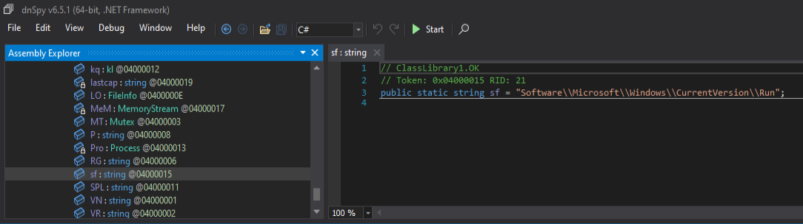
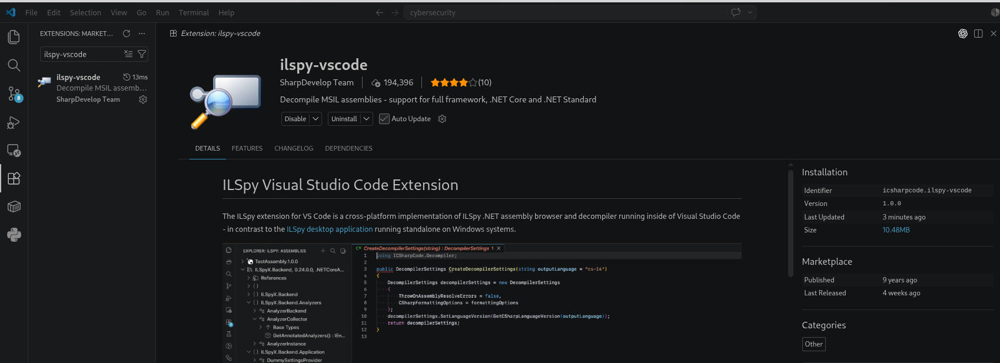
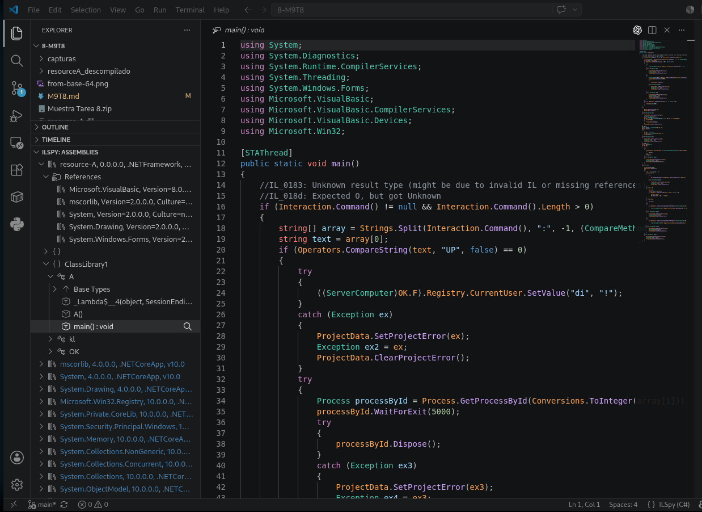
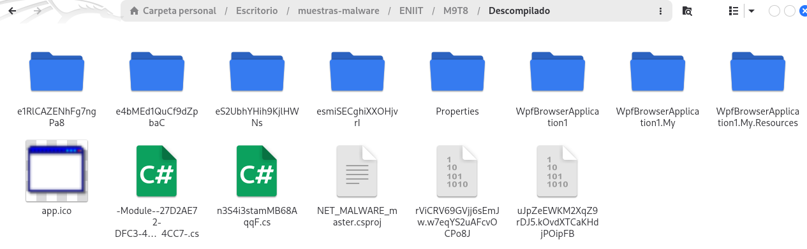

- [1. Identificar la arquitectura de destino del malware](#1-identificar-la-arquitectura-de-destino-del-malware)
  - [1.1. Identificación del formato](#11-identificación-del-formato)
  - [1.2. Arquitectura declarada en la cabecera PE](#12-arquitectura-declarada-en-la-cabecera-pe)
  - [1.3. Subsistema gráfico](#13-subsistema-gráfico)
  - [1.4. Naturaleza administrada del ejecutable](#14-naturaleza-administrada-del-ejecutable)
  - [1.5. Diferencia entre PE32 y arquitectura efectiva del proceso](#15-diferencia-entre-pe32-y-arquitectura-efectiva-del-proceso)
    - [Arquitectura de la envoltura PE](#arquitectura-de-la-envoltura-pe)
    - [Arquitectura requerida por el código administrado](#arquitectura-requerida-por-el-código-administrado)
  - [1.6. Compilador y lenguaje probable](#16-compilador-y-lenguaje-probable)
  - [1.7. Protector detectado](#17-protector-detectado)
  - [1.8. Punto de entrada](#18-punto-de-entrada)
  - [1.9. Secciones del ejecutable](#19-secciones-del-ejecutable)
  - [1.10. Relocalizaciones](#110-relocalizaciones)
  - [1.11. Recursos administrados observados](#111-recursos-administrados-observados)
  - [1.12. Sistema operativo de destino](#112-sistema-operativo-de-destino)
  - [1.13. Resumen de arquitectura](#113-resumen-de-arquitectura)
  - [1.14. Conclusión](#114-conclusión)
- [2. Tomar huellas dactilares del malware](#2-tomar-huellas-dactilares-del-malware)
  - [2.1. Huella criptográfica del archivo](#21-huella-criptográfica-del-archivo)
  - [2.2. Huellas de la cabecera DOS](#22-huellas-de-la-cabecera-dos)
  - [2.3. Huellas de las secciones PE](#23-huellas-de-las-secciones-pe)
    - [Sección `.text`](#sección-text)
    - [Sección `.sdata`](#sección-sdata)
    - [Sección `.rsrc`](#sección-rsrc)
    - [Sección `.reloc`](#sección-reloc)
  - [2.4. Huella de la información de versión](#24-huella-de-la-información-de-versión)
  - [2.5. Import Hash](#25-import-hash)
  - [2.6. Categoría `special`](#26-categoría-special)
  - [2.7. Resumen de huellas](#27-resumen-de-huellas)
  - [2.8. Valoración](#28-valoración)
  - [2.9 Consultas externas](#29-consultas-externas)
- [3. Triage estático inicial con PeStudio](#3-triage-estático-inicial-con-pestudio)
  - [3.1. Información general del archivo](#31-información-general-del-archivo)
  - [3.2. Identificación del ejecutable .NET](#32-identificación-del-ejecutable-net)
  - [3.3. Punto de entrada](#33-punto-de-entrada)
  - [3.4. Fecha de compilación](#34-fecha-de-compilación)
  - [3.5. Cabecera DOS](#35-cabecera-dos)
  - [3.6. File Header](#36-file-header)
  - [3.7. Optional Header y protecciones de seguridad](#37-optional-header-y-protecciones-de-seguridad)
  - [3.8. Secciones PE](#38-secciones-pe)
    - [Sección `.text`](#sección-text-1)
    - [Sección `.sdata`](#sección-sdata-1)
    - [Sección `.rsrc`](#sección-rsrc-1)
    - [Sección `.reloc`](#sección-reloc-1)
  - [3.9. Recursos incrustados](#39-recursos-incrustados)
  - [3.10. Recursos PE tradicionales](#310-recursos-pe-tradicionales)
  - [3.11. Importaciones y P/Invoke](#311-importaciones-y-pinvoke)
    - [`OpenProcess`](#openprocess)
    - [`ReadProcessMemory`](#readprocessmemory)
    - [`WriteProcessMemory`](#writeprocessmemory)
    - [`VirtualProtect`](#virtualprotect)
    - [`LoadLibrary` y `GetProcAddress`](#loadlibrary-y-getprocaddress)
    - [`FindResource`](#findresource)
  - [3.12. Import Hash](#312-import-hash)
  - [3.13. Namespaces y estructura .NET](#313-namespaces-y-estructura-net)
  - [3.14. Cadenas relevantes](#314-cadenas-relevantes)
  - [3.15. Firma digital y manifiesto](#315-firma-digital-y-manifiesto)
  - [3.16. Indicadores relevantes del triage](#316-indicadores-relevantes-del-triage)
  - [3.17. Valoración del triage](#317-valoración-del-triage)
  - [3.18. Conclusión](#318-conclusión)
- [4. Análisis de empaquetado](#4-análisis-de-empaquetado)
  - [4.1. Indicadores iniciales de protección](#41-indicadores-iniciales-de-protección)
  - [4.2. Análisis de entropía](#42-análisis-de-entropía)
  - [4.3. Recursos administrados de alta entropía](#43-recursos-administrados-de-alta-entropía)
  - [4.4 Nombres y metadatos ofuscados](#44-nombres-y-metadatos-ofuscados)
  - [4.5. Funciones relacionadas con carga y manipulación de memoria](#45-funciones-relacionadas-con-carga-y-manipulación-de-memoria)
  - [4.6. Diferencia entre desempaquetado y desofuscación](#46-diferencia-entre-desempaquetado-y-desofuscación)
  - [4.7. Primer intento con de4dot](#47-primer-intento-con-de4dot)
  - [4.8. Problema relacionado con XAML](#48-problema-relacionado-con-xaml)
  - [4.9. Segundo intento conservando los nombres](#49-segundo-intento-conservando-los-nombres)
  - [4.10. Resultado del proceso de limpieza](#410-resultado-del-proceso-de-limpieza)
  - [4.11. Resultado del análisis de protección](#411-resultado-del-análisis-de-protección)
  - [4.12. Conclusión](#412-conclusión)
- [5. Los Resources encontrados](#5-los-resources-encontrados)
- [6. Análisis estático de `resource-A`](#6-análisis-estático-de-resource-a)
  - [6.1. Resumen ejecutivo](#61-resumen-ejecutivo)
  - [6.2. Archivos analizados](#62-archivos-analizados)
  - [6.3. Identificación de la muestra](#63-identificación-de-la-muestra)
    - [6.3.1. Tipo de archivo](#631-tipo-de-archivo)
    - [6.3.2. Atribución probable](#632-atribución-probable)
  - [6.4. Configuración incrustada](#64-configuración-incrustada)
  - [6.5. Flujo de ejecución](#65-flujo-de-ejecución)
    - [6.5.1. Argumentos especiales](#651-argumentos-especiales)
    - [6.5.2. Control de instancia única](#652-control-de-instancia-única)
  - [6.6. Instalación y persistencia](#66-instalación-y-persistencia)
    - [6.6.1. Copia principal](#661-copia-principal)
    - [6.6.2. Claves Run](#662-claves-run)
    - [6.6.3. Carpeta Startup](#663-carpeta-startup)
    - [6.6.4. Autorrestauración](#664-autorrestauración)
    - [6.6.5. Excepción de firewall](#665-excepción-de-firewall)
    - [6.6.6. Variable de entorno](#666-variable-de-entorno)
  - [6.7. Keylogger](#67-keylogger)
    - [6.7.1. APIs utilizadas](#671-apis-utilizadas)
    - [6.7.2. Funcionamiento](#672-funcionamiento)
    - [6.7.3. Información registrada](#673-información-registrada)
  - [6.8. Comunicación con el C2](#68-comunicación-con-el-c2)
    - [6.8.1. Protocolo](#681-protocolo)
    - [6.8.2. Reconexión](#682-reconexión)
    - [6.8.3. Información inicial exfiltrada](#683-información-inicial-exfiltrada)
  - [6.9. Dispatcher de comandos](#69-dispatcher-de-comandos)
  - [6.10. Shell remota](#610-shell-remota)
  - [6.11. Gestión de procesos](#611-gestión-de-procesos)
  - [6.12. Descarga y ejecución](#612-descarga-y-ejecución)
  - [6.13. Carga de plugins en memoria](#613-carga-de-plugins-en-memoria)
  - [6.14. Captura de pantalla](#614-captura-de-pantalla)
  - [6.15. Webcam](#615-webcam)
  - [6.16. Administración del Registro](#616-administración-del-registro)
  - [6.17. Actualización y desinstalación](#617-actualización-y-desinstalación)
    - [6.17.1. Actualización](#6171-actualización)
    - [6.17.2. Desinstalación](#6172-desinstalación)
  - [6.18. Evasión y autoprotección](#618-evasión-y-autoprotección)
  - [6.19. Indicadores de compromiso](#619-indicadores-de-compromiso)
    - [6.19.1. Red](#6191-red)
    - [6.19.2. Archivos](#6192-archivos)
    - [6.19.3. Registro](#6193-registro)
    - [6.19.4. Otros IOC](#6194-otros-ioc)
  - [6.20. Mapeo MITRE ATT\&CK](#620-mapeo-mitre-attck)
  - [6.21. Valoración de riesgo](#621-valoración-de-riesgo)
  - [6.22. Limitaciones del análisis](#622-limitaciones-del-análisis)
  - [6.23. Conclusión](#623-conclusión)


# 1. Identificar la arquitectura de destino del malware

El primer paso del análisis consiste en identificar el formato, la arquitectura y el entorno de ejecución del fichero principal:

```text
NET_MALWARE_master.exe
```

Para ello se va a utilizar las siguientes herramientas:
* Exeinfo PE.
* Detect It Easy.
* PeStudio.
* CFF Explorer.

En esta fase analizamos únicamente el ejecutable principal. Aunque se observan recursos incrustados dentro del ensamblado, todavía no se ha determinado su contenido ni puede afirmarse que alguno de ellos corresponda al payload definitivo.


---

## 1.1. Identificación del formato

Los primeros bytes del archivo son:

```text
4D 5A 90 00 03 00 00 00 04 00 00 00 FF FF 00 00
```

Los bytes:

```text
4D 5A
```

corresponden a la firma ASCII:

```text
MZ
```

Esto confirma que <mark>el fichero utiliza el formato ejecutable de Windows.</mark>

<mark>La cabecera PE se encuentra en el desplazamiento indicado por el campo `e_lfanew`:</mark>

```text
0x00000080
```

En dicha posición aparece la firma:

```text
50 45 00 00
```

equivalente a:

```text
PE\0\0
```

Por tanto, `NET_MALWARE_master.exe` es un <mark>ejecutable **Portable Executable — PE** válido para Microsoft Windows.</mark>

---

## 1.2. Arquitectura declarada en la cabecera PE

Las herramientas identifican las siguientes propiedades:

| Propiedad                    | Valor            |
| ---------------------------- | ---------------- |
| Formato                      | `PE32`           |
| Machine                      | `0x014C`         |
| Arquitectura declarada       | Intel 386 / I386 |
| Modo PE                      | 32 bits          |
| Subsistema                   | Windows GUI      |
| Image Base                   | `0x00400000`     |
| Tamaño de la imagen          | `0x00040000`     |
| Número de secciones          | 4                |
| Punto de entrada             | `0x00439F4E`     |
| Sección del punto de entrada | `.text`          |

El valor:

```text
Machine = 0x014C
```

corresponde a:

```text
IMAGE_FILE_MACHINE_I386
```

Desde el punto de vista de la cabecera PE, el archivo se presenta como un ejecutable **PE32 para arquitectura Intel x86**.

Detect It Easy y Exeinfo PE lo clasifican como:

```text
PE32
32-bit
I386
Windows GUI
```

---

## 1.3. Subsistema gráfico

El Optional Header contiene:

```text
Subsystem = 0x0002
```

Este valor corresponde a:

```text
IMAGE_SUBSYSTEM_WINDOWS_GUI
```

Por tanto, el ejecutable está diseñado como una <mark>aplicación gráfica de Windows y no como una aplicación de consola.</mark> Esta configuración provoca que su ejecución normal no abra automáticamente una ventana de terminal.

El nombre original almacenado en los metadatos es:

```text
WpfBrowserApplication1.exe
```

y la descripción es:

```text
WpfBrowserApplication1
```

Esto es coherente con una aplicación basada en **Windows Presentation Foundation — WPF**.

---

## 1.4. Naturaleza administrada del ejecutable

El análisis muestra que no se trata de un ejecutable nativo convencional, sino de un ensamblado administrado de Microsoft .NET. Los indicadores principales son:

```text
Microsoft.NET
Microsoft Visual C# / Basic .NET
CLR v4.0.30319
Firma de metadatos BSJB
```

La cabecera .NET presenta:

| Propiedad                  | Resultado                    |
| -------------------------- | ---------------------------- |
| Firma CLR                  | `BSJB`                       |
| Versión CLR                | `v4.0.30319`                 |
| Código IL-Only             | Sí                           |
| Native Entry Point         | No                           |
| Strong Name                | No                           |
| Token del punto de entrada | `0x06000009`                 |
| Nombre del módulo          | `WpfBrowserApplication1.exe` |

La propiedad:

```text
IL-Only = true
```

indica que la lógica principal está implementada mediante **Common Intermediate Language — CIL/MSIL**.

El sistema operativo no ejecuta directamente la mayor parte de este código. El ensamblado es cargado por el **Common Language Runtime — CLR**, que compila las instrucciones administradas mediante JIT antes de ejecutarlas.

---

## 1.5. Diferencia entre PE32 y arquitectura efectiva del proceso

Aunque las herramientas muestran:

```text
PE32
I386
32-bit
```

la cabecera CLR contiene los siguientes valores:

```text
32-bit-required = false
32-bit-preferred = false
```

Esto significa que el **ensamblado administrado no declara expresamente que deba ejecutarse obligatoriamente como proceso de 32 bits.**

Por tanto, deben diferenciarse dos conceptos:

### Arquitectura de la envoltura PE

```text
PE32
Machine I386
```

### Arquitectura requerida por el código administrado

```text
32BITREQ = false
32BITPREF = false
```

La combinación es compatible con un ensamblado compilado como:

```text
AnyCPU
```

En ese caso, el comportamiento esperado sería:

```text
Windows de 32 bits → proceso de 32 bits
Windows de 64 bits → proceso administrado potencialmente de 64 bits
```

No obstante, **la muestra se encuentra protegida mediante .NET Reactor**. El protector puede incorporar código auxiliar, stubs nativos o dependencias que condicionen la arquitectura efectiva en tiempo de ejecución.

Por ello, la clasificación más precisa en esta fase es:

> [!CAUTION]
> `NET_MALWARE_master.exe` es un ejecutable PE32 administrado para Windows, cuya cabecera PE utiliza la arquitectura I386, pero cuyo código CLR no está marcado como exclusivamente de 32 bits. La arquitectura efectiva del proceso deberá confirmarse durante el análisis dinámico.

---

## 1.6. Compilador y lenguaje probable

Detect It Easy identifica:

```text
Compilador: VB.NET
Lenguaje: VB.NET
Librería: .NET Framework
```

PeStudio ofrece una identificación más general:

```text
Microsoft Visual C# / Basic .NET
```

También se observan referencias a:

```text
Microsoft.VisualBasic
Microsoft.VisualBasic.ApplicationServices
Microsoft.VisualBasic.CompilerServices
Microsoft.VisualBasic.Devices
```

Estas evidencias indican que el ejecutable fue desarrollado probablemente en **Visual Basic .NET**, aunque determinados componentes generados por WPF puedan aparecer descompilados como `C#`.

---

## 1.7. Protector detectado

Detect It Easy identifica el uso de:

```text
.NET Reactor 4.8–4.9
```

También muestra indicadores relacionados con:

```text
Encrypted or packed data
Assembly invoke
RSACryptoServiceProvider
High entropy
Strings encryption
Obfuscation
Fake .cctor name
Math mutations
```

Por tanto, **<mark>el ensamblado se encuentra protegido u ofuscado.</mark>**

Esta protección puede afectar a:
* Los nombres de clases y métodos.
* Las cadenas.
* El flujo de control.
* La carga de ensamblados.
* Los recursos administrados.
* La interpretación del punto de entrada.
* La arquitectura efectiva de componentes auxiliares.

La identificación de `.NET Reactor` justifica la utilización posterior de herramientas especializadas como:

```text
de4dot
dnSpyEx
ILSpy
CFF Explorer
```

---

## 1.8. Punto de entrada

Las herramientas muestran el punto de entrada PE en:

```text
RVA: 0x00039F4E
VA:  0x00439F4E
```

El punto de entrada se encuentra en:

```text
.text
```

Los primeros bytes son:

```text
FF 25 00 20 40 00
```

Este código actúa como un pequeño stub que transfiere la ejecución al mecanismo de inicialización del CLR.

El punto de entrada administrado se identifica mediante el token:

```text
0x06000009
```

Por tanto, la lógica real del programa no debe analizarse únicamente desde el stub nativo. Es necesario localizar el método .NET asociado a dicho token mediante un descompilador administrado.

---

## 1.9. Secciones del ejecutable

El archivo contiene cuatro secciones:

| Sección  |      Tamaño raw |  Entropía | Permisos principales  |
| -------- | --------------: | --------: | --------------------- |
| `.text`  | `229.376 bytes` | `7,72264` | Lectura y ejecución   |
| `.sdata` |     `512 bytes` | `2,18920` | Lectura y escritura   |
| `.rsrc`  |   `2.560 bytes` | `2,95314` | Lectura               |
| `.reloc` |     `512 bytes` | `0,10473` | Lectura y descartable |

La sección `.text` ocupa aproximadamente:

```text
98,03 % del archivo
```

y presenta una entropía elevada:

```text
7,72264
```

<mark>Detect It Easy clasifica aproximadamente el 95 % del archivo como empaquetado.</mark>

Esta entropía puede ser consecuencia de:
* Ofuscación.
* Cifrado.
* Compresión.
* Protección mediante .NET Reactor.
* Recursos administrados almacenados dentro de `.text`.

En esta fase no debe concluirse automáticamente que la alta entropía corresponde a un payload. **Sólo permite afirmar que existe una cantidad significativa de contenido transformado o protegido.**

---

## 1.10. Relocalizaciones

El archivo contiene una sección:

```text
.reloc
```

La tabla presenta un bloque de relocalización asociado a:

```text
VirtualAddress: 0x00039000
SizeOfBlock:    0x0000000C
```

La presencia de relocalizaciones indica que el ejecutable conserva información para ajustar determinadas direcciones si no se carga exactamente en su dirección base preferida.

Sin embargo, el Optional Header muestra:

```text
ASLR = false
```

Por tanto, aunque existe información de relocalización, el binario no declara compatibilidad con ASLR mediante `DYNAMIC_BASE`.

---

## 1.11. Recursos administrados observados

CFF Explorer muestra recursos dentro del nodo:

```text
.NET Resources
```

Entre ellos aparecen nombres aparentemente aleatorios, por ejemplo:

```text
rViCRV69GVjj6sEmJw.w7eqYS2uAFcvOCPo8J
uJpZeEWKM2XqZ9rDJ5.kOvdXTCaKHdjPOipFB
```

Su contenido se presenta como datos binarios de elevada entropía.

En este punto del análisis sólo podemos afirmar que:
* <mark>El ejecutable contiene recursos .NET incrustados.</mark>
* <mark>Los nombres parecen ofuscados.</mark>
* <mark>Su contenido no es directamente legible.</mark>
* <mark>Pueden estar cifrados, comprimidos o serializados.</mark>
* <mark>Deben extraerse y analizarse de forma independiente.</mark>

No es correcto afirmar todavía que alguno de estos recursos sea un payload operativo del malware. Esa conclusión requiere:

1. Extraer los recursos.
2. Identificar su formato.
3. Localizar el código que los consume.
4. Determinar si se descifran, descomprimen o cargan.
5. Analizar su contenido de forma separada.

---

## 1.12. Sistema operativo de destino

Las características del ejecutable confirman que está diseñado para:

```text
Microsoft Windows
```

Las evidencias principales son:
* Formato PE.
* Subsistema Windows GUI.
* Aplicación WPF.
* .NET Framework / CLR `v4.0.30319`.
* Arquitectura PE I386.
* Uso de recursos y estructuras propias de Windows.
* Protección mediante .NET Reactor para ensamblados .NET.

No se trata de un ejecutable Linux ni de una aplicación .NET multiplataforma moderna.


---

## 1.13. Resumen de arquitectura

```text
Archivo: NET_MALWARE_master.exe
Formato: Portable Executable
Tipo PE: PE32
Machine: Intel 386 / I386
Subsistema: Windows GUI
Plataforma: Microsoft Windows
Tecnología: Microsoft .NET
CLR: v4.0.30319
Código: IL-Only
Lenguaje probable: VB.NET
Interfaz: WPF
Protector: .NET Reactor 4.8–4.9
Image Base: 0x00400000
Punto de entrada PE: 0x00439F4E
Token de entrada .NET: 0x06000009
Número de secciones: 4
32-bit-required: false
32-bit-preferred: false
```

---

## 1.14. Conclusión

`NET_MALWARE_master.exe` es un ejecutable **PE32 administrado para Microsoft Windows**, asociado a la arquitectura I386 en su cabecera PE y compilado para el CLR `v4.0.30319`.

El archivo utiliza WPF, fue desarrollado probablemente en VB.NET y se encuentra protegido mediante .NET Reactor.

Aunque las herramientas lo clasifican como un ejecutable de 32 bits debido a su formato PE32 y al valor `IMAGE_FILE_MACHINE_I386`, los indicadores CLR `32-bit-required` y `32-bit-preferred` están desactivados. Por ello, es posible que el ensamblado administrado haya sido compilado como `AnyCPU`.

La arquitectura efectiva deberá confirmarse mediante ejecución controlada y observación del proceso en un sistema Windows de 64 bits.

En esta fase también se han identificado **recursos .NET de alta entropía con nombres ofuscados.** Sin embargo, todavía no se conoce su función y no debe concluirse que contengan el payload hasta que sean extraídos y analizados.


------------------------------------------

# 2. Tomar huellas dactilares del malware

Para identificar de forma inequívoca la muestra y facilitar su comparación con otras variantes, vamos a realizar una toma de huellas mediante **FootprintNG**. La herramienta calcula hashes tanto del archivo completo como de diferentes estructuras internas del ejecutable PE.

Este enfoque permite trabajar con dos niveles de identificación:
* **Huella global:** identifica exactamente el archivo analizado.
* **Huellas parciales:** permiten comparar cabeceras, secciones y recursos entre muestras relacionadas, aunque el archivo completo haya sido modificado.

## 2.1. Huella criptográfica del archivo

FootprintNG calculó el siguiente SHA-256 para el archivo completo:

```text
6DDA005FA9D3F826124458AF97D2E918A475D83447B2E057A3B0057441C3D6A7
```

| Elemento         | Algoritmo | Huella                                                             |
| ---------------- | --------- | ------------------------------------------------------------------ |
| Archivo completo | SHA-256   | `6DDA005FA9D3F826124458AF97D2E918A475D83447B2E057A3B0057441C3D6A7` |

Esta es la huella principal de la muestra. Puede utilizarse para:

* Buscar el archivo en repositorios de malware.
* Comparar la muestra con otros análisis.
* Crear reglas de detección basadas en hash.
* Verificar que el archivo no ha cambiado durante el análisis.
* Correlacionar alertas procedentes de diferentes sistemas.

## 2.2. Huellas de la cabecera DOS

| Estructura | Algoritmo | Huella                                                             |
| ---------- | --------- | ------------------------------------------------------------------ |
| DOS Stub   | SHA-256   | `7764E7022DCAC1B5779D1F96FC05AF5C1FEE394AAFF8A3A7E9A881E1A1B163A3` |
| DOS Header | SHA-256   | `BFDF5E72651B4EC588BD5FC6A9F17E9E0972248146BBACC10478F48D72F29B81` |

La **cabecera DOS** contiene los primeros campos del ejecutable PE, entre ellos la firma `MZ` y el desplazamiento hasta la cabecera PE.

El **DOS Stub** es el pequeño fragmento heredado que normalmente contiene un mensaje similar a:

```text
This program cannot be run in DOS mode.
```

Estas huellas pueden ser útiles para detectar muestras construidas mediante el mismo compilador, plantilla o proceso de empaquetado. Sin embargo, suelen ser menos discriminantes que el contenido de las secciones principales, ya que numerosos ejecutables pueden compartir cabeceras y DOS Stub similares.

## 2.3. Huellas de las secciones PE

Las secciones del ejecutable presentan las siguientes huellas:

| Sección  | Algoritmo | Huella                                                             |
| -------- | --------- | ------------------------------------------------------------------ |
| `.text`  | SHA-256   | `617D9EB2D242D2375C5FBA9755A51770F19E68F44C1ED863E41863759B9655DF` |
| `.sdata` | SHA-256   | `E4D02FDF63A656CDDE34531DDD2ED81C5B1BCD85D64BD56BEFD30B35036B8780` |
| `.rsrc`  | SHA-256   | `EF609AF44133247770CBC7D19B841EB8EFE2C86652EABBEFC60262DCBE0DACCA` |
| `.reloc` | SHA-256   | `5D2B0481BCB8E65006E85B387C5F92AB16C47674752C7F14E74D70571F9F7194` |

### Sección `.text`

La sección `.text` contiene la parte principal del ejecutable. En un ensamblado .NET puede incluir:

* Cabecera CLR.
* Metadatos .NET.
* Código CIL/MSIL.
* Tablas de métodos y tipos.
* Stubs necesarios para iniciar el CLR.

Su huella es especialmente relevante:

```text
617D9EB2D242D2375C5FBA9755A51770F19E68F44C1ED863E41863759B9655DF
```

Si dos muestras presentan el mismo hash en `.text`, existe una elevada probabilidad de que compartan la misma lógica ejecutable, aunque difieran en recursos, iconos o información de versión.

### Sección `.sdata`

La sección `.sdata` almacena datos estáticos utilizados por el ejecutable.

Su huella es:

```text
E4D02FDF63A656CDDE34531DDD2ED81C5B1BCD85D64BD56BEFD30B35036B8780
```

Esta sección puede contener valores asociados a la configuración, estructuras internas o información estática generada durante la compilación. Su comparación puede ayudar a identificar variantes que conservan la misma estructura interna.

### Sección `.rsrc`

La sección `.rsrc` contiene los recursos del ejecutable, por ejemplo:

* Iconos.
* Manifiestos.
* Información de versión.
* Cadenas.
* Recursos incrustados.
* Posibles payloads adicionales.

Su huella es:

```text
EF609AF44133247770CBC7D19B841EB8EFE2C86652EABBEFC60262DCBE0DACCA
```

Esta huella resulta especialmente relevante en la muestra analizada, ya que el ejecutable principal contiene ensamblados o componentes incrustados como recursos. Una modificación del payload, del icono o de la configuración integrada alteraría el hash de esta sección, aunque el código principal permaneciera sin cambios.

### Sección `.reloc`

La sección `.reloc` contiene información de relocalización utilizada cuando el ejecutable no puede cargarse en su dirección base preferida.

Su huella es:

```text
5D2B0481BCB8E65006E85B387C5F92AB16C47674752C7F14E74D70571F9F7194
```

Esta sección suele tener menor valor para identificar la funcionalidad maliciosa, pero puede ayudar a comparar la estructura de compilación entre diferentes muestras.

## 2.4. Huella de la información de versión

FootprintNG obtuvo la siguiente huella para los datos de versión:

```text
B9015B052C95A835AE9D169CA50DFF8C98F790DD861F06D6ABBE5F4D783944CB
```

| Elemento               | Algoritmo | Huella                                                             |
| ---------------------- | --------- | ------------------------------------------------------------------ |
| Información de versión | SHA-256   | `B9015B052C95A835AE9D169CA50DFF8C98F790DD861F06D6ABBE5F4D783944CB` |

La información de versión puede incluir:

* Nombre interno.
* Descripción del archivo.
* Fabricante.
* Versión del producto.
* Copyright.
* Nombre original del ejecutable.

Esta huella permite comparar si diferentes muestras reutilizan los mismos metadatos, incluso cuando el contenido ejecutable ha sido modificado.

En el ensamblado descompilado se observó una versión de ensamblado poco descriptiva:

```text
0.0.0.0
```

Este valor puede indicar que el autor no configuró metadatos legítimos o que eliminó información identificativa del proyecto.

## 2.5. Import Hash

FootprintNG calculó el siguiente `imphash`:

```text
F34D5F2D4577ED6D9CEEC516C1F5A744
```

| Elemento    | Algoritmo | Huella                             |
| ----------- | --------- | ---------------------------------- |
| Import Hash | MD5       | `F34D5F2D4577ED6D9CEEC516C1F5A744` |

El **imphash** se calcula a partir de las bibliotecas y funciones presentes en la tabla de importaciones del ejecutable. Su finalidad es identificar muestras que comparten un patrón similar de importaciones.

Puede utilizarse para:
* Agrupar muestras pertenecientes a una misma familia.
* Localizar variantes compiladas a partir del mismo código.
* Correlacionar archivos con diferentes hashes globales.
* Detectar relaciones entre payloads.
* 

## 2.6. Categoría `special`

La salida de FootprintNG incluye la categoría:

```text
special
```

pero no presenta una huella adicional asociada. Esto indica que la herramienta no obtuvo, o no mostró, un identificador especial adicional para la muestra.

Según el tipo de archivo y la versión de la herramienta, esta categoría podría utilizarse para huellas específicas de determinados formatos, packers, certificados, overlays u otras estructuras particulares.

## 2.7. Resumen de huellas

```text
Archivo completo:
SHA-256: 6DDA005FA9D3F826124458AF97D2E918A475D83447B2E057A3B0057441C3D6A7

DOS Stub:
SHA-256: 7764E7022DCAC1B5779D1F96FC05AF5C1FEE394AAFF8A3A7E9A881E1A1B163A3

DOS Header:
SHA-256: BFDF5E72651B4EC588BD5FC6A9F17E9E0972248146BBACC10478F48D72F29B81

Sección .text:
SHA-256: 617D9EB2D242D2375C5FBA9755A51770F19E68F44C1ED863E41863759B9655DF

Sección .sdata:
SHA-256: E4D02FDF63A656CDDE34531DDD2ED81C5B1BCD85D64BD56BEFD30B35036B8780

Sección .rsrc:
SHA-256: EF609AF44133247770CBC7D19B841EB8EFE2C86652EABBEFC60262DCBE0DACCA

Sección .reloc:
SHA-256: 5D2B0481BCB8E65006E85B387C5F92AB16C47674752C7F14E74D70571F9F7194

Información de versión:
SHA-256: B9015B052C95A835AE9D169CA50DFF8C98F790DD861F06D6ABBE5F4D783944CB

Import Hash:
MD5: F34D5F2D4577ED6D9CEEC516C1F5A744
```

## 2.8. Valoración

La huella principal que debe utilizarse como IOC es:

```text
6DDA005FA9D3F826124458AF97D2E918A475D83447B2E057A3B0057441C3D6A7
```

Las huellas de `.text` y `.rsrc` son especialmente útiles para comparar variantes:

* `.text` permite identificar cambios en la lógica ejecutable.
* `.rsrc` permite detectar cambios en recursos, configuración o payloads incrustados.
* El imphash permite realizar agrupaciones preliminares, aunque tiene menor capacidad discriminante en ensamblados .NET.

En conjunto, las huellas obtenidas mediante FootprintNG proporcionan una identificación estructural más completa que el hash global y facilitan la comparación con muestras que hayan sido recompiladas, modificadas o empaquetadas de forma diferente.

## 2.9 Consultas externas
Usaremos el hash del fichero para hacer unas consultas externas en:
- [VirusTotal](https://www.virustotal.com/gui/file/6dda005fa9d3f826124458af97d2e918a475d83447b2e057a3b0057441c3d6a7):  
  

- [JoeSandbox](https://www.joesandbox.com/analysis/808830/0/html):  
  

-----------------------------------------


# 3. Triage estático inicial con PeStudio

Hemos realizado un análisis estático inicial del ejecutable mediante **PeStudio**, con el objetivo de identificar su formato, arquitectura, características PE, indicadores sospechosos, recursos incrustados y posibles mecanismos de evasión, sin ejecutar la muestra.

La muestra analizada corresponde al ejecutable contenedor:

```text
NET_MALWARE_master.exe
```

El análisis ha permitido confirmar que se trata de una aplicación <mark>`.NET` para Windows que contiene recursos administrados de alta entropía y referencias a funciones relacionadas con acceso y modificación de memoria.</mark>

---

## 3.1. Información general del archivo

PeStudio identificó las siguientes características:

| Propiedad         | Resultado                                                          |
| ----------------- | ------------------------------------------------------------------ |
| Nombre analizado  | `NET_MALWARE_master.exe`                                           |
| Nombre original   | `WpfBrowserApplication1.exe`                                       |
| Descripción       | `WpfBrowserApplication1`                                           |
| Tamaño            | `233.984 bytes`                                                    |
| SHA-256           | `6DDA005FA9D3F826124458AF97D2E918A475D83447B2E057A3B0057441C3D6A7` |
| Tipo              | Ejecutable PE                                                      |
| Subsistema        | GUI                                                                |
| Formato           | PE32                                                               |
| Máquina           | Intel 386                                                          |
| Tecnología        | Microsoft .NET                                                     |
| Lenguaje probable | C# o VB.NET                                                        |
| Versión           | `1.0.0.0`                                                          |
| Entropía global   | `7,664`                                                            |
| Firma digital     | No presente                                                        |
| Overlay           | No presente                                                        |
| Exportaciones     | No presentes                                                       |

Los primeros bytes del archivo son:

```text
4D 5A 90 00 03 00 00 00 04 00 00 00 FF FF 00 00
```

La secuencia inicial `4D 5A` corresponde a la firma:

```text
MZ
```

Esto confirma que se trata de un ejecutable en formato PE para Windows.

---

## 3.2. Identificación del ejecutable .NET

PeStudio detectó las siguientes firmas:

```text
Microsoft Linker 6.0
Microsoft Visual C# / Basic .NET
Microsoft.NET
```

El archivo contiene una cabecera CLR y metadatos .NET válidos:

| Propiedad .NET        | Resultado                    |
| --------------------- | ---------------------------- |
| Firma de metadatos    | `BSJB`                       |
| Versión CLR declarada | `v4.0.30319`                 |
| Nombre del módulo     | `WpfBrowserApplication1.exe` |
| Token de entrada      | `0x06000009`                 |
| IL-Only               | Sí                           |
| Biblioteca .NET       | No                           |
| Strong Name           | No                           |
| Entrada nativa        | No                           |
| 32-bit required       | No                           |
| 32-bit preferred      | No                           |

La propiedad `IL-Only` indica que la lógica principal está implementada en código administrado MSIL/CIL.

Aunque el encabezado PE utiliza `Machine = Intel-386` y formato PE32, el indicador `32-bit-required` se encuentra desactivado. Esto significa que el ensamblado principal no está necesariamente obligado a ejecutarse como proceso de 32 bits y podría comportarse como un ensamblado `AnyCPU`, dependiendo de su configuración y del entorno CLR.

Este resultado debe diferenciarse del ensamblado `resource-A` extraído posteriormente, cuya configuración reconstruida puede presentar características distintas.

---

## 3.3. Punto de entrada

El punto de entrada se encuentra en:

```text
RVA: 0x00039F4E
Sección: .text
```

Los primeros bytes son:

```text
FF 25 00 20 40 00
```

Este patrón corresponde a un salto indirecto utilizado como stub para transferir el control al entorno de ejecución .NET.

El punto de entrada administrado se identifica mediante el token:

```text
0x06000009
```

Por tanto, el flujo real de ejecución debe analizarse desde el método asociado a dicho token mediante un descompilador .NET como dnSpyEx, ILSpy o `ilspycmd`.

---

## 3.4. Fecha de compilación

PeStudio muestra la siguiente marca temporal:

```text
1 de noviembre de 2020, 03:18:22 UTC
```

Valor hexadecimal:

```text
0x5F9E28FE
```

Esta fecha no debe considerarse una prueba concluyente sobre el momento real de creación de la muestra. Las marcas temporales PE pueden:

* Ser modificadas manualmente.
* Ser heredadas de una compilación anterior.
* Ser alteradas por un packer o protector.
* Haber sido falsificadas para dificultar la atribución.

Por tanto, se registra como indicador, pero requiere validación mediante otras evidencias.

---

## 3.5. Cabecera DOS

La cabecera DOS presenta:

| Propiedad  | Resultado                                                          |
| ---------- | ------------------------------------------------------------------ |
| Tamaño     | `64 bytes`                                                         |
| Ubicación  | `0x00000000–0x00000040`                                            |
| Entropía   | `3,669`                                                            |
| `e_lfanew` | `0x00000080`                                                       |
| SHA-256    | `BFDF5E72651B4EC588BD5FC6A9F17E9E0972248146BBACC10478F48D72F29B81` |

El desplazamiento `e_lfanew` apunta correctamente a la cabecera PE situada en:

```text
0x00000080
```

El DOS Stub contiene el mensaje convencional:

```text
This program cannot be run in DOS mode.
```

Su SHA-256 es:

```text
7764E7022DCAC1B5779D1F96FC05AF5C1FEE394AAFF8A3A7E9A881E1A1B163A3
```

No se ha detectado cabecera `Rich`. Su ausencia puede deberse a:

* La herramienta de compilación utilizada.
* Una eliminación intencionada.
* La modificación del binario por un protector.
* Una construcción que no incorpora dicha estructura.

La ausencia de Rich Header no demuestra por sí sola una conducta maliciosa.

---

## 3.6. File Header

La cabecera PE presenta:

| Campo                           | Valor                |
| ------------------------------- | -------------------- |
| Firma                           | `PE\0\0`             |
| Machine                         | `0x014C — Intel 386` |
| Número de secciones             | `4`                  |
| Características                 | `0x010E`             |
| Ejecutable                      | Sí                   |
| DLL                             | No                   |
| Símbolos locales eliminados     | Sí                   |
| Líneas de depuración eliminadas | Sí                   |
| Large Address Aware             | No                   |

El archivo está configurado como ejecutable y no como biblioteca dinámica.

No se detectaron:

* Tabla de símbolos.
* Símbolos COFF.
* Exportaciones.
* Información de depuración utilizable.

---

## 3.7. Optional Header y protecciones de seguridad

El encabezado opcional presenta:

| Propiedad         | Resultado       |
| ----------------- | --------------- |
| Magic             | `0x010B — PE32` |
| Image Base        | `0x00400000`    |
| Base of Code      | `0x00002000`    |
| Base of Data      | `0x0003A000`    |
| Size of Image     | `262.144 bytes` |
| Size of Headers   | `1.024 bytes`   |
| File Alignment    | `512 bytes`     |
| Section Alignment | `8.192 bytes`   |
| Subsistema        | GUI             |
| Checksum          | No definido     |

PeStudio indica que las principales mitigaciones modernas están desactivadas:

| Mitigación      | Estado      |
| --------------- | ----------- |
| ASLR            | Desactivado |
| DEP / NX        | Desactivado |
| CFG             | Desactivado |
| High Entropy VA | Desactivado |
| CET Compatible  | Desactivado |
| AppContainer    | Desactivado |
| Image Isolation | Desactivado |
| SEH             | Activado    |

La ausencia de ASLR, DEP y CFG reduce la resistencia del ejecutable frente a técnicas de explotación y manipulación de memoria.

No obstante, en un ensamblado .NET antiguo estas ausencias también pueden estar relacionadas con la configuración del compilador o con el uso de un toolchain antiguo. Deben interpretarse como una debilidad de seguridad, no como prueba aislada de malware.

---

## 3.8. Secciones PE

El ejecutable contiene cuatro secciones:

| Sección  |      Tamaño raw | Entropía | Permisos              |
| -------- | --------------: | -------: | --------------------- |
| `.text`  | `229.376 bytes` |  `7,723` | Lectura y ejecución   |
| `.sdata` |     `512 bytes` |  `2,186` | Lectura y escritura   |
| `.rsrc`  |   `2.560 bytes` |  `2,953` | Lectura               |
| `.reloc` |     `512 bytes` |  `0,102` | Lectura y descartable |

### Sección `.text`

La sección `.text` representa aproximadamente:

```text
98,03 % del archivo
```

Su entropía es:

```text
7,723
```

Este valor es elevado y próximo al máximo teórico de `8`. Puede indicar:

* Código o datos cifrados.
* Recursos comprimidos.
* Ofuscación.
* Uso de un protector.
* Datos binarios incrustados dentro de la sección.

En un ensamblado .NET, la sección `.text` no contiene únicamente código ejecutable. También puede incluir:

* Metadatos CLR.
* Streams de metadatos.
* Código IL.
* Recursos administrados.
* Datos del ensamblado.

En este caso, el elevado valor de entropía se relaciona especialmente con la presencia de recursos .NET incrustados de gran tamaño.

### Sección `.sdata`

La sección `.sdata` es pequeña y posee permisos de lectura y escritura. Puede contener datos estáticos o información utilizada durante la inicialización.

### Sección `.rsrc`

La sección `.rsrc` contiene los recursos PE tradicionales, como:

* Iconos.
* Grupo de iconos.
* Información de versión.

Debe diferenciarse de los recursos administrados .NET, que en esta muestra se encuentran dentro de `.text`.

### Sección `.reloc`

La sección `.reloc` contiene la información necesaria para la relocalización de la imagen. Su entropía muy baja es coherente con una tabla pequeña y estructurada.

---

## 3.9. Recursos incrustados

PeStudio identificó **dos recursos administrados dentro de la sección `.text`:**

| Recurso                                 |          Tamaño | Entropía |
| --------------------------------------- | --------------: | -------: |
| `rViCRV69GVjj6sEmJw.w7eqYS2uAFcvOCPo8J` | `173.584 bytes` |  `7,999` |
| `uJpZeEWKM2XqZ9rDJ5.kOvdXTCaKHdjPOipFB` |     `560 bytes` |  `7,644` |

El primer recurso tiene una entropía de:

```text
7,999
```

Este valor es prácticamente máximo y constituye uno de los indicadores más relevantes del triage.

Una entropía tan elevada es compatible con:
* Datos cifrados.
* Datos comprimidos.
* Un ensamblado protegido.
* Un payload empaquetado.
* Un recurso transformado mediante cifrado u ofuscación.

El segundo recurso también presenta una entropía elevada:

```text
7,644
```

Los nombres aleatorios dificultan su identificación y sugieren que fueron generados mediante un ofuscador o protector.

El tamaño total de los recursos administrados es:

```text
174.152 bytes
```

Esto representa aproximadamente:

```text
74,43 % del ensamblado
```

Por tanto, <mark>una parte muy significativa del fichero corresponde a contenido incrustado y no al código visible del cargador principal.</mark>

**Este resultado hace necesaria la extracción y análisis separado de `resource-A`.**

---

## 3.10. Recursos PE tradicionales

Además de los recursos .NET, la sección `.rsrc` contiene:

* Información de versión.
* Dos iconos.
* Un grupo de iconos.

Información de versión:

| Campo            | Valor                        |
| ---------------- | ---------------------------- |
| FileDescription  | `WpfBrowserApplication1`     |
| FileVersion      | `1.0.0.0`                    |
| InternalName     | `WpfBrowserApplication1.exe` |
| OriginalFilename | `WpfBrowserApplication1.exe` |
| ProductName      | `WpfBrowserApplication1`     |
| ProductVersion   | `1.0.0.0`                    |
| Copyright        | `Copyright @ 2020`           |

Estos valores parecen corresponder a nombres predeterminados de un proyecto `WPF` y no ofrecen una identidad legítima verificable.

La utilización del nombre:

```text
WpfBrowserApplication1
```

sugiere que el autor pudo haber conservado el nombre predeterminado del proyecto o haber empleado una plantilla.

---

## 3.11. Importaciones y P/Invoke

La única importación PE convencional identificada es:

```text
mscoree.dll
```

Esta biblioteca contiene el motor de ejecución de Microsoft `.NET` y es habitual en ensamblados administrados.

PeStudio también detectó llamadas `P/Invoke` a:

```text
kernel32.dll
kernel32
```

Entre las <mark>funciones encontradas destacan:</mark>

```text
VirtualProtect
WriteProcessMemory
ReadProcessMemory
OpenProcess
RtlZeroMemory
FindResource
CloseHandle
LoadLibrary
GetProcAddress
```

Estas APIs son relevantes desde el punto de vista del análisis de malware.

### `OpenProcess`

Permite obtener un manejador a otro proceso. Puede utilizarse para:

* Inspección de procesos.
* Lectura de memoria.
* Escritura de memoria.
* Preparación de técnicas de inyección.

### `ReadProcessMemory`

Permite leer la memoria de otro proceso.

### `WriteProcessMemory`

Permite escribir datos en la memoria de otro proceso. Es una función frecuentemente asociada a técnicas de:

* Inyección.
* Process hollowing.
* Modificación de procesos.
* Desempaquetado en memoria.

### `VirtualProtect`

Permite modificar los permisos de una región de memoria. Puede utilizarse para convertir memoria en ejecutable o para modificar código en tiempo de ejecución.

### `LoadLibrary` y `GetProcAddress`

Permiten cargar DLL y resolver funciones dinámicamente. Son habituales tanto en software legítimo como en loaders y malware.

### `FindResource`

Permite localizar recursos incrustados dentro del ejecutable, lo que resulta coherente con la presencia de payloads almacenados como recursos.

La combinación:

```text
OpenProcess
ReadProcessMemory
WriteProcessMemory
VirtualProtect
LoadLibrary
GetProcAddress
```

constituye un indicador relevante de manipulación de memoria y carga dinámica. Sin embargo, el comportamiento exacto debe confirmarse analizando las referencias cruzadas y los métodos que invocan estas funciones.

---

## 3.12. Import Hash

El imphash calculado es:

```text
F34D5F2D4577ED6D9CEEC516C1F5A744
```

Este valor puede emplearse para buscar muestras con una tabla de importaciones similar.

En ensamblados .NET su utilidad es limitada, porque la tabla PE convencional suele contener pocas importaciones y gran parte de las APIs se declaran mediante P/Invoke dentro de los metadatos CLR.

---

## 3.13. Namespaces y estructura .NET

PeStudio identificó namespaces legítimos relacionados con:

```text
System.Reflection
System.Runtime.InteropServices
System.Diagnostics
System.Security.Cryptography
System.IO
System.Windows
System.Windows.Controls
System.Windows.Markup
Microsoft.VisualBasic
Microsoft.VisualBasic.Devices
Microsoft.VisualBasic.CompilerServices
```

También aparecen namespaces personalizados con nombres aleatorios:

```text
eS2UbhYHih9KjlHWNs
esmiSECghiXXOHjvrI
e1RlCAZENhFg7ngPa8
e4bMEd1QuCf9dZpbaC
```

Estos identificadores sin significado aparente son compatibles con una técnica de renombrado u ofuscación.

La presencia simultánea de:

```text
System.Security.Cryptography
System.IO
System.Reflection
System.Runtime.InteropServices
```

resulta relevante porque puede asociarse a:

* Descifrado de recursos.
* Carga dinámica de ensamblados.
* Invocación de APIs nativas.
* Manipulación de datos en memoria.

---

## 3.14. Cadenas relevantes

Entre las cadenas detectadas aparecen:

```text
MemoryStream
VirtualProtect
WriteProcessMemory
ReadProcessMemory
OpenProcess
CreateEncryptor
GetEnvironmentVariable
```

Estas cadenas apuntan a posibles capacidades de:

* Procesamiento de datos en memoria.
* Cifrado o descifrado.
* Acceso a procesos.
* Modificación de memoria.
* Obtención de variables del entorno.
* Carga o recuperación de payloads.

PeStudio también detectó patrones numéricos similares a versiones:

```text
1.0.0.0
10.0.0.0
4.0.0.0
```

No deben interpretarse automáticamente como URL, aunque la herramienta los haya clasificado mediante patrones.

---

## 3.15. Firma digital y manifiesto

La muestra no contiene:

```text
Firma Authenticode
Certificado digital
Nombre de editor
Manifiesto visible
```

La ausencia de firma digital implica que no existe una identidad de editor verificable.

Tampoco se observó Strong Name en el ensamblado .NET:

```text
strong-name-signed: false
```

Un `Strong Name` no equivale a una firma de confianza, pero su ausencia elimina otro posible mecanismo de identificación del ensamblado.

---

## 3.16. Indicadores relevantes del triage

Los principales indicadores obtenidos son:

```text
SHA-256:
6DDA005FA9D3F826124458AF97D2E918A475D83447B2E057A3B0057441C3D6A7

Imphash:
F34D5F2D4577ED6D9CEEC516C1F5A744

Nombre original:
WpfBrowserApplication1.exe

Descripción:
WpfBrowserApplication1

GUID del ensamblado:
A21C6487-179A-4DAF-BE8E-31972E3545AA

TypeLib GUID:
8D9EDAB7-4B24-421D-9D47-61D58379A8E2

Versión CLR:
v4.0.30319

Entropía global:
7,664

Recurso principal:
rViCRV69GVjj6sEmJw.w7eqYS2uAFcvOCPo8J

Tamaño del recurso:
173.584 bytes

Entropía del recurso:
7,999
```

---

## 3.17. Valoración del triage

Los principales elementos sospechosos observados son:

1. Entropía global elevada.
2. Sección `.text` con entropía de `7,723`.
3. Recurso administrado de `173.584 bytes` con entropía de `7,999`.
4. Nombres aleatorios en namespaces y recursos.
5. Referencias a funciones de acceso y modificación de memoria.
6. Uso de `VirtualProtect`, `WriteProcessMemory` y `OpenProcess`.
7. Uso de criptografía y flujos en memoria.
8. Ausencia de firma digital.
9. Ausencia de ASLR, DEP y CFG.
10. Metadatos genéricos de proyecto WPF.
11. Gran proporción del archivo ocupada por recursos administrados.
12. Compatibilidad con una muestra protegida u ofuscada.

Estos indicadores permiten plantear la siguiente hipótesis:

> `NET_MALWARE_master.exe` funciona como un cargador o contenedor .NET protegido. Su lógica principal incluye mecanismos para recuperar, descifrar o cargar contenido almacenado dentro de recursos administrados de alta entropía. Los recursos incrustados deben extraerse y analizarse por separado, ya que pueden contener el payload operativo real.

---

## 3.18. Conclusión

El triage estático inicial con PeStudio confirma que la muestra es un ejecutable .NET GUI que contiene una cantidad significativa de datos incrustados con entropía muy elevada.

La combinación de:

```text
Recursos cifrados o comprimidos
Nombres ofuscados
Carga dinámica
Acceso a memoria de procesos
Ausencia de firma
Protecciones PE desactivadas
```

justifica su clasificación inicial como archivo altamente sospechoso.

PeStudio no permite determinar por sí solo toda la funcionalidad del malware, pero proporciona evidencias suficientes para continuar con:

1. Desofuscación del ensamblado.
2. Extracción de los recursos .NET.
3. Análisis del punto de entrada.
4. Revisión de las llamadas P/Invoke.
5. Descompilación del payload extraído.
6. Análisis dinámico en una máquina virtual Windows aislada.


-------------------------------------

# 4. Análisis de empaquetado

El siguiente paso consiste en determinar si `NET_MALWARE_master.exe` se encuentra empaquetado, cifrado u ofuscado y, en caso afirmativo, intentar obtener una versión que facilite su análisis estático.

En ejecutables .NET debe distinguirse entre:

* **Empaquetado tradicional**, donde el código original se comprime o cifra y se reconstruye en memoria.
* **Protección u ofuscación .NET**, donde se modifican los metadatos, nombres, cadenas, métodos y flujo de control.
* **Cifrado de recursos o ensamblados**, donde componentes adicionales permanecen ocultos hasta su carga durante la ejecución.

En esta muestra existen evidencias de las tres posibilidades, aunque inicialmente solo puede confirmarse el uso de un protector .NET.

---

## 4.1. Indicadores iniciales de protección

Detect It Easy identificó el protector:

```text
.NET Reactor 4.8–4.9
```

Exeinfo PE también detectó:

```text
.NET Reactor
```

aunque propuso una versión diferente. Esta discrepancia es habitual en identificadores basados en firmas, especialmente cuando el protector ha sido configurado con diferentes opciones o modificado.

Por tanto, la conclusión fiable es:

> La muestra está protegida con .NET Reactor, pero la versión concreta del protector no puede determinarse con total certeza únicamente mediante firmas.

Detect It Easy también mostró los siguientes indicadores:

```text
Encrypted or packed data
Assembly invoke
RSACryptoServiceProvider
High entropy
Strings encryption
Obfuscation
Fake .cctor name
Math mutations
```

Estos elementos son compatibles con las funciones de protección ofrecidas por .NET Reactor:

* Cifrado de métodos.
* Cifrado de cadenas.
* Alteración del flujo de control.
* Renombrado de clases y métodos.
* Protección de recursos.
* Anti-tamper.
* Carga dinámica de ensamblados.
* Ocultación del punto de entrada real.

---

## 4.2. Análisis de entropía

La entropía global del archivo es:

```text
7,664
```

La sección principal `.text` presenta:

```text
Entropía: 7,72264
Tamaño:   229.376 bytes
Porcentaje aproximado del archivo: 98,03 %
```

Detect It Easy clasifica aproximadamente un:

```text
95 %
```

del archivo como empaquetado o de alta entropía.

Las demás secciones presentan valores considerablemente inferiores:

| Sección  |  Entropía | Valoración  |
| -------- | --------: | ----------- |
| `.text`  | `7,72264` | Muy elevada |
| `.sdata` | `2,18920` | Baja        |
| `.rsrc`  | `2,95314` | Baja        |
| `.reloc` | `0,10473` | Muy baja    |

El valor de `.text` es próximo al máximo teórico de `8`, lo que indica que una parte importante de su contenido ha sido:

* Comprimida.
* Cifrada.
* Ofuscada.
* Transformada por el protector.
* Sustituida por recursos administrados de alta entropía.

En un ensamblado .NET, la sección `.text` puede contener no solo código IL, sino también metadatos y recursos administrados. Por esta razón, su alta entropía no demuestra por sí sola la existencia de un packer nativo.

---

## 4.3. Recursos administrados de alta entropía

CFF Explorer y PeStudio identificaron recursos bajo:

```text
.NET Resources
```

Entre ellos aparecen:

```text
rViCRV69GVjj6sEmJw.w7eqYS2uAFcvOCPo8J
uJpZeEWKM2XqZ9rDJ5.kOvdXTCaKHdjPOipFB
```

Los nombres no tienen significado aparente y parecen generados automáticamente por el protector.

El recurso principal presenta:

```text
Tamaño:   173.584 bytes
Entropía: 7,999
```

El segundo recurso presenta:

```text
Tamaño:   560 bytes
Entropía: 7,644
```

Una entropía de `7,999` es prácticamente máxima y resulta compatible con contenido:

* Cifrado.
* Comprimido.
* Empaquetado.
* Transformado mediante una función criptográfica.
* Protegido por .NET Reactor.

En esta fase no puede afirmarse todavía que alguno de estos recursos sea el payload operativo. Solo puede concluirse que contienen datos binarios de alta entropía que requieren extracción y análisis independiente.

---

## 4.4 Nombres y metadatos ofuscados

Vemos la apariencia del fichero empacado, cómo codifica los nombre de las funciones:  


En el ensamblado aparecen namespaces y recursos con identificadores como:
```text
eS2UbhYHih9KjlHWNs
esmiSECghiXXOHjvrI
e1RlCAZENhFg7ngPa8
e4bMEd1QuCf9dZpbaC
```

Estos nombres son compatibles con un proceso automático de renombrado.

La ofuscación mediante nombres aleatorios dificulta:

* Reconocer la finalidad de las clases.
* Reconstruir el flujo de ejecución.
* Localizar funciones relevantes.
* Identificar referencias entre métodos.
* Comprender la función de los recursos.

También pueden existir constructores estáticos `.cctor` falsos o alterados, tal como indica Detect It Easy.

---

## 4.5. Funciones relacionadas con carga y manipulación de memoria

PeStudio detectó referencias a:

```text
VirtualProtect
WriteProcessMemory
ReadProcessMemory
OpenProcess
RtlZeroMemory
FindResource
LoadLibrary
GetProcAddress
CreateEncryptor
MemoryStream
```

Estas funciones pueden estar relacionadas con:

* Recuperación de recursos.
* Descifrado de contenido.
* Carga dinámica de bibliotecas.
* Modificación de permisos de memoria.
* Escritura o lectura de memoria.
* Resolución dinámica de funciones.
* Inicialización del protector.

La presencia de estas APIs no demuestra por sí sola una técnica concreta de inyección. Es necesario localizar las referencias cruzadas y examinar los métodos que las utilizan.

En el contexto de .NET Reactor, algunas de estas llamadas pueden pertenecer al propio mecanismo de protección y no necesariamente a la funcionalidad final del malware.

---

## 4.6. Diferencia entre desempaquetado y desofuscación

La muestra no presenta la estructura típica de un ejecutable nativo comprimido con UPX u otro packer convencional.

La protección observada afecta principalmente al ensamblado .NET. Por ello, el término más preciso es:

```text
Desprotección o desofuscación del ensamblado
```

y no necesariamente:

```text
Desempaquetado nativo
```

El objetivo consiste en recuperar:

* Metadatos válidos.
* Cuerpos de métodos.
* Flujo de control comprensible.
* Recursos accesibles.
* Cadenas descifradas.
* Nombres o referencias coherentes.

---

## 4.7. Primer intento con de4dot


Se utilizó `de4dot` sobre el ejecutable original:

```powershell
de4dot.exe C:\Users\usuario\Desktop\NET_MALWARE_master.exe
```


La herramienta produjo la siguiente salida relevante:

```text
Detected .NET Reactor
Cleaning C:\Users\usuario\Desktop\NET_MALWARE_master.exe
WARNING: File contains XAML which isn't supported. Use --dont-rename.
Renaming all obfuscated symbols
Saving C:\Users\usuario\Desktop\NET_MALWARE_master-cleaned.exe
```

de4dot identificó correctamente la familia del protector:

```text
.NET Reactor
```

y generó:

```text
NET_MALWARE_master-cleaned.exe
```

Sin embargo, también advirtió que el ensamblado contiene XAML.

---

## 4.8. Problema relacionado con XAML

El ejecutable corresponde a una aplicación WPF, por lo que contiene recursos XAML o BAML.

En aplicaciones WPF existen asociaciones entre:

* Clases.
* Ventanas.
* Controles.
* Manejadores de eventos.
* Recursos `.g.resources`.
* Archivos BAML compilados.

Si de4dot renombra clases o miembros sin actualizar correctamente las referencias almacenadas en XAML o BAML, puede provocar:

* Referencias rotas.
* Errores al cargar ventanas.
* Fallos en `InitializeComponent`.
* Pérdida de manejadores de eventos.
* Un ejecutable limpiado que no pueda iniciarse.

Por esta razón, la herramienta recomendó utilizar:

```text
--dont-rename
```

---

## 4.9. Segundo intento conservando los nombres

Se repitió el proceso sobre el fichero original:

```powershell
de4dot.exe --dont-rename C:\Users\usuario\Desktop\NET_MALWARE_master.exe -o C:\Users\usuario\Desktop\NET_MALWARE_master-cleaned-xaml.exe
```

La salida fue:

```text
Detected .NET Reactor
Cleaning C:\Users\usuario\Desktop\NET_MALWARE_master.exe
Saving C:\Users\usuario\Desktop\NET_MALWARE_master-cleaned-xaml.exe
```

En esta ocasión no apareció la advertencia relacionada con XAML.

El archivo resultante fue:

```text
NET_MALWARE_master-cleaned-xaml.exe
```

La opción `--dont-rename` conserva los nombres actuales de clases, métodos, campos y propiedades. Aunque estos nombres continúen ofuscados, se evita romper las referencias entre el código WPF y los recursos XAML/BAML.


La opción `--dont-rename` ha evitado el problema con las referencias XAML. Esto no significa que el ejecutable esté completamente desofuscado: ha sido limpiado en la medida que de4dot permite, pero conservará nombres de clases y métodos ofuscados.


---

## 4.10. Resultado del proceso de limpieza

El fichero limpiado puede abrirse correctamente con dnSpyEx.

Vemos la apariencia del fichero desempacado, cómo codifica los nombre de las funciones:  


La herramienta muestra:
* El ensamblado `WpfBrowserApplication1`.
* El árbol de namespaces.
* Las clases de la aplicación.
* Recursos administrados.
* El punto de entrada.
* Código C# descompilado.
* Métodos y constructores accesibles.

El punto de entrada identificado es:

```text
WpfBrowserApplication1._01.main
```

Esto indica que de4dot ha logrado restaurar una estructura suficientemente válida como para permitir el análisis estático.

No obstante, los nombres continúan parcialmente ofuscados debido al uso de:

```text
--dont-rename
```

---


## 4.11. Resultado del análisis de protección

Los hallazgos pueden resumirse así:

| Elemento                           | Resultado                             |
| ---------------------------------- | ------------------------------------- |
| Protector detectado                | .NET Reactor                          |
| Versión exacta                     | No confirmada                         |
| Tipo de protección                 | Ofuscación y posible cifrado          |
| Entropía global                    | `7,664`                               |
| Entropía de `.text`                | `7,72264`                             |
| Recurso principal                  | `173.584 bytes`                       |
| Entropía del recurso principal     | `7,999`                               |
| Nombres ofuscados                  | Sí                                    |
| Cadenas posiblemente cifradas      | Sí                                    |
| Recursos protegidos                | Probable                              |
| Herramienta utilizada              | de4dot                                |
| Primer resultado                   | Limpiado con advertencia XAML         |
| Segundo resultado                  | Limpiado usando `--dont-rename`       |
| Archivo seleccionado para análisis | `NET_MALWARE_master-cleaned-xaml.exe` |

---

## 4.12. Conclusión

`NET_MALWARE_master.exe` está protegido mediante **.NET Reactor** y presenta señales claras de ofuscación, cifrado o compresión de contenido.

Las principales evidencias son:

```text
Alta entropía global
Sección .text con entropía elevada
Recursos .NET con entropía próxima a 8
Nombres aleatorios
Cadenas cifradas
Uso de funciones criptográficas
Carga dinámica
Detección directa de .NET Reactor
```

El proceso con de4dot permitió obtener:

```text
NET_MALWARE_master-cleaned-xaml.exe
```

La opción `--dont-rename` fue necesaria para preservar las referencias XAML de la aplicación WPF.

El resultado facilita la navegación y descompilación en dnSpyEx, pero no garantiza que todas las capas de protección hayan sido eliminadas. Es posible que todavía existan recursos cifrados, cadenas ocultas o ensamblados cargados dinámicamente.

Por tanto, la muestra puede considerarse parcialmente desprotegida para análisis estático, quedando pendiente la inspección de los recursos y, si fuera necesario, su recuperación durante una ejecución controlada.


-------------

# 5. Los Resources encontrados


Detalle de uno de los recursos:


------------------


Vemos los resources:


-----------------------------


Recuperamos el recurso A:


From binary:


Detalle de la parte final:


From Base64:


-------


Descargamos el payload y obtenemos:


Parece ofuscado en el código:


Detalle del resource A en ILSpy:


-----

Modulo main de resource A:


Variable en base64:

```bash
2KrZhSDYp9mE2KfYrtiq2LHYp9mCINmF2YYg2YLYqNmEINiv2YPYqtmI2LEg2KfZhNi62LHYqNmK2KkgIw==
```


Persistencia:



Dominio:


---------------------------


Cuando un malware está ofuscado, el C# producido por el descompilador puede no representar fielmente algunas instrucciones. En esos casos conviene revisar el CIL original con monodis, incluido en Mono. monodis extrae el código y las tablas de un ensamblado ECMA CIL.

Instalación habitual en Debian, Ubuntu, Kali o REMnux:

```bash
sudo apt update
sudo apt install mono-utils
```

Desensamblado completo:

```bash
monodis resource-A.dll > resource-A.il
```


-------------------------------------


Instalar ILSpy en Kali: Es la versión oficial de ILSpy para terminal y está soportada en Linux, macOS y Windows.
1. Instala el SDK de .NET 10

Descarga de nuevo el script oficial, por si no lo conservas:

```bash
curl -fsSL https://dot.net/v1/dotnet-install.sh \
  -o /tmp/dotnet-install.sh

chmod +x /tmp/dotnet-install.sh
```

Ejecuta el instalador sin --runtime:

```bash
/tmp/dotnet-install.sh \
  --channel 10.0 \
  --quality GA \
  --install-dir "$HOME/.dotnet"
```

La diferencia es importante:

--runtime dotnet

instala solamente el runtime, mientras que al omitir --runtime, el script instala el SDK completo, que también incluye el runtime.

No necesitas eliminar .NET 8; ambas versiones pueden permanecer instaladas en ~/.dotnet.

2. Actualiza las variables de entorno

Para Kali, que normalmente utiliza Zsh:

```bash
grep -qxF 'export DOTNET_ROOT="$HOME/.dotnet"' ~/.zshrc ||
echo 'export DOTNET_ROOT="$HOME/.dotnet"' >> ~/.zshrc

grep -qxF 'export PATH="$DOTNET_ROOT:$DOTNET_ROOT/tools:$PATH"' ~/.zshrc ||
echo 'export PATH="$DOTNET_ROOT:$DOTNET_ROOT/tools:$PATH"' >> ~/.zshrc
```

Recarga la configuración:

```bash
source ~/.zshrc
hash -r
```
3. Comprueba que ahora existe un SDK
```bash
dotnet --list-sdks
```

Debe aparecer algo semejante a:

10.0.xxx [/home/xxniwexx/.dotnet/sdk]

Comprueba también:

```bash
dotnet --info
```

Ahora la sección debería dejar de mostrar:

No SDKs were found
4. Instala ilspycmd
```bash
dotnet tool install --global ilspycmd --version 10.1.0.8386

```
La versión y el comando corresponden al paquete oficial publicado en NuGet.

Comprueba la instalación:

```bash
ilspycmd --version

```
Si Zsh todavía no encuentra el comando:

```bash
source ~/.zshrc
"$HOME/.dotnet/tools/ilspycmd" --version
```
5. Analiza resource-A

Primero identifica el archivo:

```bash
file resource-A
sha256sum resource-A
```

Puedes crear una copia con extensión .dll:

```bash
cp resource-A resource-A.dll

```
Lista las clases:

```bash
ilspycmd --list c resource-A.dll

```
Lista los recursos internos:

```bash
ilspycmd --list-resources resource-A.dll

```
Descompílalo como proyecto:

```bash
mkdir -p resourceA_descompilado

```
```bash
ilspycmd \
  --project \
  --outputdir resourceA_descompilado \
  resource-A.dll
```

Busca las llamadas nativas detectadas anteriormente:

```bash
grep -RniE \
'DllImport|avicap32|user32|kernel32|ntdll|psapi|Assembly\.Load|Process\.Start|WebClient|TcpClient|Socket' \
resourceA_descompilado
```

------------------------------------------
```bash

└─$ file resource-A.exe 
resource-A.exe: PE32 executable for MS Windows 4.00 (GUI), Intel i386 Mono/.Net assembly, 3 sections
                                                                                                                                                      

└─$ sha256sum resource-A.exe       
02dfb4a65d7d9a44496c9c905c0c62cd64937ba2bbf0b985deda805d313a9f5b  resource-A.exe
                                                                                                                                                      

└─$ cp resource-A.exe resource-A.dll
                                                                                                                                                      

└─$ ilspycmd --list c resource-A.dll 
Class <Module>
Class ClassLibrary1.OK
Class ClassLibrary1.kl
Class ClassLibrary1.A
                                                                                                                                                      

└─$ ilspycmd --list-resources resource-A.dll
                                                                                                                                                      

└─$ mkdir -p resourceA_descompilado
                                                                                                                                                      

└─$ ilspycmd \
  --project \
  --outputdir resourceA_descompilado \
  resource-A.dll


└─$ code --install-extension icsharpcode.ilspy-vscode
Installing extensions...
(node:223203) [DEP0169] DeprecationWarning: `url.parse()` behavior is not standardized and prone to errors that have security implications. Use the WHATWG URL API instead. CVEs are not issued for `url.parse()` vulnerabilities.
(Use `code --trace-deprecation ...` to show where the warning was created)
Installing extension 'icsharpcode.ilspy-vscode'...
Extension 'ms-dotnettools.vscode-dotnet-runtime' v3.1.0 was successfully installed.
Extension 'icsharpcode.ilspy-vscode' v1.0.0 was successfully installed.


```








```bash
ilspycmd -p -o Descompilado  NET_MALWARE_master.exe

```




-------------------------


Descompilamos resource-A:

```bash
mkdir -p resourceA_descompilado
```


```bash
ilspycmd \
  --project \
  --outputdir resourceA_descompilado \
  resource-A
```

Analizamos el [Resource A descopilado](https://github.com/soniasalido/cybersecurity/tree/main/Documentation/Malware/Master-ENIIT-Analisis-Malware-Reversing/modulo-9-tecnicas-de-analisis-de-malware/8-M9T8/resourceA_descompilado):


XXXXXXXXXXXXXXXXXXXXXXXXXXXXXXXXxx

--------------------


Verificación desde Linux

La arquitectura puede comprobarse con las siguientes herramientas:

```bash
└─$ file NET_MALWARE_master.exe 
NET_MALWARE_master.exe: PE32 executable for MS Windows 4.00 (GUI), Intel i386 Mono/.Net assembly, 4 sections
   
```

```bash
└─$ diec  NET_MALWARE_master.exe
PE32
    Linker: Microsoft Linker(6.0)
    Compiler: VB.NET
    Library: .NET Framework(CLR 4.0.30319)
    Tool: Microsoft Visual Studio
    Protector: .NET Reactor(4.8-4.9)
```

```bash
└─$ monodis --assembly NET_MALWARE_master.exe 
Assembly Table
Name:          WpfBrowserApplication1
Hash Algoritm: 0x00008004
Version:       1.0.0.0
Flags:         0x00000000
PublicKey:     BlobPtr (0x00000000)
	Zero sized public key
Culture:       
```

```bash
└─$ objdump -x NET_MALWARE_master.exe

NET_MALWARE_master.exe:     formato del fichero pei-i386
NET_MALWARE_master.exe
arquitectura: i386, opciones 0x0000010b:
HAS_RELOC, EXEC_P, HAS_DEBUG, D_PAGED
dirección de inicio 0x00439f4e

Características 0x10e
	executable
	line numbers stripped
	symbols stripped
	32 bit words

Time/Date		Sun Nov  1 04:18:22 2020
Magic			010b	(PE32)
MajorLinkerVersion	6
MinorLinkerVersion	0
SizeOfCode		00038000
SizeOfInitializedData	00000e00
SizeOfUninitializedData	00000000
AddressOfEntryPoint	00039f4e
BaseOfCode		00002000
BaseOfData		0003a000
ImageBase		00400000
SectionAlignment	00002000
FileAlignment		00000200
MajorOSystemVersion	4
MinorOSystemVersion	0
MajorImageVersion	0
MinorImageVersion	0
MajorSubsystemVersion	4
MinorSubsystemVersion	0
Win32Version		00000000
SizeOfImage		00040000
SizeOfHeaders		00000400
CheckSum		00000000
Subsystem		00000002	(Windows GUI)
DllCharacteristics	00000000
SizeOfStackReserve	00100000
SizeOfStackCommit	00001000
SizeOfHeapReserve	00100000
SizeOfHeapCommit	00001000
LoaderFlags		00000000
NumberOfRvaAndSizes	00000010

The Data Directory
Entry 0 00000000 00000000 Export Directory [.edata (or where ever we found it)]
Entry 1 00039f00 0000004b Import Directory [parts of .idata]
Entry 2 0003c000 0000086c Resource Directory [.rsrc]
Entry 3 00000000 00000000 Exception Directory [.pdata]
Entry 4 00000000 00000000 Security Directory
Entry 5 0003e000 0000000c Base Relocation Directory [.reloc]
Entry 6 00039eb0 0000001c Debug Directory
Entry 7 00000000 00000000 Description Directory
Entry 8 00000000 00000000 Special Directory
Entry 9 00000000 00000000 Thread Storage Directory [.tls]
Entry a 00000000 00000000 Load Configuration Directory
Entry b 00000000 00000000 Bound Import Directory
Entry c 00002000 00000008 Import Address Table Directory
Entry d 00000000 00000000 Delay Import Directory
Entry e 00002008 00000048 CLR Runtime Header
Entry f 00000000 00000000 Reserved

Hay una tabla de importación en .text en 0x439f00

Las tablas de importación (se interpretaron los contenidos de la sección .text)
 vma:            Pista   Fecha     Adelante DLL       Primero
                 Tabla   Sello     Cadena   Nombre    Thunk
 00039f00	00039f28 00000000 00000000 00039f3e 00002000

	Nombre DLL: mscoree.dll
	vma:     Ordinal  Hint  Member-Name  Bound-To
	00002000  <none>  0000  _CorExeMain

 00039f14	00000000 00000000 00000000 00000000 00000000


Reubicaciones de Fichero Base PE (se interpretaron los contenidos de la sección .reloc)

Dirección virtual: 00039000 Tamaño de fragmento 12 (0xc) Número de ajustes 2
	reubicación    0 desplazamiento  f50 [39f50] HIGHLOW
	reubicación    1 desplazamiento    0 [39000] ABSOLUTE

Hay un directorio de depuración en .text en 439eb0

Tipo             Tamaño         Rva      Despl
 3342336         Unknown 86cc0000 82cc0003 53520003

The .rsrc Resource Directory section:
000  Type Tabla: Car: 0, Tiempo: 00000000, Ver: 0/0, Nombres Núm: 0, IDs: 3
010   Entrada: ID: 0x000003, Valor: 0x80000028
028    Name Tabla: Car: 0, Tiempo: 00000000, Ver: 0/0, Nombres Núm: 0, IDs: 2
038     Entrada: ID: 0x000002, Valor: 0x80000078
078      Language Tabla: Car: 0, Tiempo: 00000000, Ver: 0/0, Nombres Núm: 0, IDs: 1
088       Entrada: ID: 00000000, Valor: 0x0000d8
0d8        Hoja: Direc: 0x03c118, Tam: 0x0002e8, PágCodigo: 0
040     Entrada: ID: 0x000003, Valor: 0x80000090
090      Language Tabla: Car: 0, Tiempo: 00000000, Ver: 0/0, Nombres Núm: 0, IDs: 1
0a0       Entrada: ID: 00000000, Valor: 0x0000e8
0e8        Hoja: Direc: 0x03c400, Tam: 0x000128, PágCodigo: 0
018   Entrada: ID: 0x00000e, Valor: 0x80000048
048    Name Tabla: Car: 0, Tiempo: 00000000, Ver: 0/0, Nombres Núm: 0, IDs: 1
058     Entrada: ID: 0x007f00, Valor: 0x800000a8
0a8      Language Tabla: Car: 0, Tiempo: 00000000, Ver: 0/0, Nombres Núm: 0, IDs: 1
0b8       Entrada: ID: 00000000, Valor: 0x0000f8
0f8        Hoja: Direc: 0x03c528, Tam: 0x000022, PágCodigo: 0
020   Entrada: ID: 0x000010, Valor: 0x80000060
060    Name Tabla: Car: 0, Tiempo: 00000000, Ver: 0/0, Nombres Núm: 0, IDs: 1
070     Entrada: ID: 0x000001, Valor: 0x800000c0
0c0      Language Tabla: Car: 0, Tiempo: 00000000, Ver: 0/0, Nombres Núm: 0, IDs: 1
0d0       Entrada: ID: 00000000, Valor: 0x000108
108        Hoja: Direc: 0x03c54c, Tam: 0x000320, PágCodigo: 0
 Recursos inician en desplazamiento: 0x118

Secciones:
Idx Name          Size      VMA       LMA       File off  Algn
  0 .text         00037f54  00402000  00402000  00000400  2**2
                  CONTENTS, ALLOC, LOAD, READONLY, CODE
  1 .sdata        000000b1  0043a000  0043a000  00038400  2**2
                  CONTENTS, ALLOC, LOAD, DATA
  2 .rsrc         0000086c  0043c000  0043c000  00038600  2**2
                  CONTENTS, ALLOC, LOAD, READONLY, DATA
  3 .reloc        0000000c  0043e000  0043e000  00039000  2**2
                  CONTENTS, LOAD, READONLY, DATA
SYMBOL TABLE:
no hay símbolos
```

---------------------------------------


# 6. Análisis estático de `resource-A`

## 6.1. Resumen ejecutivo

`resource-A` es un ensamblado .NET malicioso que implementa un **troyano de acceso remoto (RAT)** con capacidades de persistencia, keylogging, shell remota, captura de pantalla, administración de procesos y del Registro de Windows, descarga y ejecución de archivos, actualización remota y carga de plugins directamente en memoria.

La estructura del código, la versión interna `0.6.4`, los nombres de las clases (`A`, `OK`, `kl`), el protocolo de comunicación, los comandos admitidos y los delimitadores utilizados son consistentes con **njRAT 0.6.4**, también conocido como **Bladabindi**. La atribución se considera de **alta confianza**, aunque para confirmarla de forma absoluta sería conveniente comparar el hash del binario con repositorios de muestras conocidos.

El nivel de riesgo es **crítico**, porque el operador remoto puede ejecutar comandos arbitrarios, descargar payloads adicionales, capturar información introducida por teclado, observar la pantalla y mantener persistencia en el sistema comprometido.

---

## 6.2. Archivos analizados

El análisis se ha realizado sobre el código descompilado de los siguientes componentes:

| Archivo | Función principal |
|---|---|
| `A.cs` | Punto de entrada y control del ciclo de vida |
| `OK.cs` | Configuración, comunicaciones, persistencia y ejecución de comandos |
| `kl.cs` | Keylogger |
| `AssemblyInfo.cs` | Metadatos básicos del ensamblado |
| `resource-A.csproj` | Configuración reconstruida del proyecto |

El ensamblado parece haber sido escrito originalmente en **VB.NET** y posteriormente descompilado a C#. Esto se deduce del uso intensivo de `Microsoft.VisualBasic`, `ServerComputer`, `Interaction`, `Conversions`, `Operators` y `ProjectData`.

---

## 6.3. Identificación de la muestra

### 6.3.1. Tipo de archivo

`resource-A` no es un recurso pasivo, sino un ensamblado .NET ejecutable con lógica maliciosa completa.

Características observadas:

- Plataforma .NET Framework.
- Uso de Windows Forms.
- Código administrado con llamadas P/Invoke a bibliotecas nativas.
- Compatibilidad aparente con sistemas Windows de 32 y 64 bits.
- Dependencia de APIs específicas de Windows.

### 6.3.2. Atribución probable

La muestra es consistente con:

```text
Familia: njRAT / Bladabindi
Versión interna: 0.6.4
Tipo: Remote Access Trojan
```

Indicadores que sustentan esta atribución:

- Variable `VR = "0.6.4"`.
- Clases y estructura típicas: `A`, `OK`, `kl`.
- Separador de campos `|'|'|`.
- Delimitador de fin de mensaje `[endof]`.
- Comandos `proc`, `rss`, `rs`, `rsc`, `kl`, `inf`, `CAP`, `rn`, `inv`, `ret`, `up`, `RG` y `un`.
- Uso de plugins .NET cargados mediante `Assembly.Load`.
- Persistencia con claves Run y copia en la carpeta Startup.
- Keylogger basado en `GetAsyncKeyState`.

---

## 6.4. Configuración incrustada

La configuración principal se encuentra en la clase `OK`.

| Parámetro | Valor | Interpretación |
|---|---|---|
| `VR` | `0.6.4` | Versión interna |
| `H` | `dr187187.ddns.net` | Dominio C2 |
| `P` | `22` | Puerto TCP |
| `EXE` | `svchost.exe` | Nombre usado para la copia instalada |
| `DR` | `TEMP` | Directorio de instalación |
| `RG` | `ba4c12bee3027d94da5c81db2d196bfd` | Identificador, mutex y nombre de persistencia |
| `Y` | `|'|'|` | Separador interno del protocolo |
| `SPL` | `[endof]` | Fin de mensaje |
| `Idr` | `True` | Instalación en disco activada |
| `Isu` | `True` | Persistencia mediante Run activada |
| `IsF` | `True` | Persistencia en Startup activada |
| `BD` | `False` | Proceso crítico desactivado |

El puerto `22` no implica el uso de SSH. La muestra abre un `TcpClient` y utiliza un protocolo propietario delimitado por cadenas.

La variable `VN` contiene una cadena Base64. Una vez decodificada, produce texto árabe que parece actuar como nombre de campaña o etiqueta del operador.

---

## 6.5. Flujo de ejecución

El punto de entrada se encuentra en:

```csharp
A.main()
```

**Función main:**  


El flujo principal es:

```text
A.main
 ├── procesa argumentos especiales
 ├── comprueba el mutex
 ├── instala la copia persistente
 ├── inicia el hilo de comunicaciones C2
 ├── inicia el keylogger
 ├── mantiene un bucle de vigilancia
 └── repara periódicamente la persistencia
```

### 6.5.1. Argumentos especiales

La muestra reconoce al menos:

```text
UP:<PID>
```

Este argumento se utiliza durante el proceso de actualización. La nueva instancia espera a que termine el proceso antiguo antes de continuar.

También reconoce:

```text
..
```

Este valor introduce una espera de cinco segundos y se utiliza en las entradas de persistencia.

### 6.5.2. Control de instancia única

La muestra intenta abrir un mutex con el nombre:

```text
ba4c12bee3027d94da5c81db2d196bfd
```

Si el mutex ya existe, finaliza. En caso contrario, lo crea y continúa.

---

## 6.6. Instalación y persistencia

La función `OK.INS()` instala el RAT en el sistema.

### 6.6.1. Copia principal

La muestra se copia en:

```text
%TEMP%\svchost.exe
```

El nombre intenta imitar al proceso legítimo `svchost.exe`, aunque la ubicación en `%TEMP%` es anómala.

Después ejecuta la nueva copia y finaliza la instancia original.

### 6.6.2. Claves Run

Crea valores de persistencia en:

```text
HKCU\Software\Microsoft\Windows\CurrentVersion\Run
HKLM\Software\Microsoft\Windows\CurrentVersion\Run
```

Nombre del valor:

```text
ba4c12bee3027d94da5c81db2d196bfd
```

Contenido aproximado:

```text
"%TEMP%\svchost.exe" ..
```

La escritura en `HKLM` puede fallar si la muestra no dispone de privilegios administrativos.

### 6.6.3. Carpeta Startup

También crea una copia en:

```text
%APPDATA%\Microsoft\Windows\Start Menu\Programs\Startup\
ba4c12bee3027d94da5c81db2d196bfd.exe
```

### 6.6.4. Autorrestauración

El bucle principal comprueba periódicamente las claves Run y las vuelve a crear si han sido eliminadas o modificadas.

### 6.6.5. Excepción de firewall

La muestra intenta ejecutar:

```cmd
netsh firewall add allowedprogram "<ruta>" "<nombre>" ENABLE
```

El objetivo es permitir su comunicación a través del firewall de Windows.

### 6.6.6. Variable de entorno

También establece:

```text
SEE_MASK_NOZONECHECKS=1
```

para el usuario actual.

---

## 6.7. Keylogger

La clase `kl` implementa un keylogger completo.

### 6.7.1. APIs utilizadas

```text
GetAsyncKeyState
GetKeyboardState
MapVirtualKey
ToUnicodeEx
GetKeyboardLayout
GetForegroundWindow
GetWindowThreadProcessId
```

### 6.7.2. Funcionamiento

El método `WRK()`:

1. Lee un fichero de log previo, si existe.
2. Recorre continuamente los códigos de tecla de `0` a `255`.
3. Detecta nuevas pulsaciones mediante `GetAsyncKeyState`.
4. Traduce cada tecla a Unicode con `ToUnicodeEx`.
5. Tiene en cuenta la distribución de teclado activa.
6. Registra la ventana y el proceso en primer plano.
7. Guarda periódicamente el resultado en disco.

El fichero de log se almacena en:

```text
<Application.ExecutablePath>.tmp
```

Tras instalarse, la ruta probable es:

```text
%TEMP%\svchost.exe.tmp
```

El log conserva aproximadamente los últimos `20.480` caracteres.

### 6.7.3. Información registrada

- Caracteres introducidos.
- Teclas especiales.
- Enter, Tab y Retroceso.
- Teclas de función.
- Fecha.
- Nombre del proceso activo.
- Título de la ventana activa.
- Estado de Shift y Bloq Mayús.

El comando remoto `kl` envía el contenido del keylogger codificado en Base64.

---

## 6.8. Comunicación con el C2

La muestra conecta con:

```text
dr187187.ddns.net:22
```

La conexión se realiza mediante:

```csharp
TcpClient
```

### 6.8.1. Protocolo

Separador de campos:

```text
|'|'|
```

Delimitador de fin de mensaje:

```text
[endof]
```

No se observa cifrado TLS ni una capa criptográfica propia. Base64 se utiliza para representar cadenas o datos, pero no proporciona confidencialidad.

### 6.8.2. Reconexión

Si la conexión falla:

1. Marca la sesión como desconectada.
2. Espera 2,5 segundos.
3. Intenta reconectar indefinidamente.
4. Al reconectar, vuelve a enviar la información del sistema.

### 6.8.3. Información inicial exfiltrada

La función `inf()` recopila:

- Nombre del equipo.
- Nombre del usuario.
- Número de serie del volumen.
- Fecha de modificación del ejecutable.
- Versión del sistema operativo.
- Service Pack.
- Arquitectura x86/x64.
- Presencia de webcam.
- Versión del RAT.
- Título de la ventana activa.
- Identificadores de plugins guardados en el Registro.

---

## 6.9. Dispatcher de comandos

La función `OK.Ind()` procesa los comandos recibidos desde el C2.

| Comando | Capacidad |
|---|---|
| `proc` | Enumerar, finalizar, borrar o reiniciar procesos |
| `rss` | Abrir una shell oculta |
| `rs` | Enviar órdenes a la shell |
| `rsc` | Cerrar la shell |
| `kl` | Recuperar el keylog |
| `inf` | Recuperar información del sistema |
| `CAP` | Capturar la pantalla |
| `rn` | Descargar o recibir y ejecutar un archivo |
| `inv` | Cargar y ejecutar un plugin |
| `ret` | Ejecutar un plugin y devolver resultado |
| `up` | Actualizar el RAT |
| `un` | Desinstalar, cerrar o reiniciar |
| `RG` | Administrar el Registro de Windows |
| `prof` | Guardar datos o plugins en el Registro |
| `P` | Comprobación o keep-alive |

---

## 6.10. Shell remota

El comando `rss` inicia:

```text
cmd.exe
```

Configuración observada:

```csharp
UseShellExecute = false;
CreateNoWindow = true;
WindowStyle = ProcessWindowStyle.Hidden;
RedirectStandardInput = true;
RedirectStandardOutput = true;
RedirectStandardError = true;
```

El operador puede enviar comandos mediante `rs`. La salida estándar y los errores se devuelven al C2.

Esta capacidad proporciona control remoto con los permisos del usuario comprometido.

---

## 6.11. Gestión de procesos

El comando `proc` permite:

- Enumerar procesos.
- Obtener PID, ruta y descripción.
- Finalizar procesos.
- Finalizar y eliminar el ejecutable asociado.
- Finalizar y reiniciar procesos.

Esto puede utilizarse para detener herramientas defensivas, eliminar procesos rivales o reiniciar aplicaciones.

---

## 6.12. Descarga y ejecución

El comando `rn` admite dos formatos de entrada:

1. URL HTTP.
2. Payload codificado en Base64 y comprimido con GZip.

El archivo se guarda en `%TEMP%` con un nombre aleatorio y la extensión indicada por el operador.

Ejemplo conceptual:

```text
%TEMP%\<nombre_aleatorio>.<extensión>
```

Después se ejecuta mediante `Process.Start`.

La muestra puede actuar como loader para ransomware, stealers, mineros u otros payloads.

---

## 6.13. Carga de plugins en memoria

La función:

```csharp
Plugin(byte[] ByteOfPlugin, string ClassName)
```

utiliza:

```csharp
Assembly.Load(ByteOfPlugin)
```

Después busca una clase cuyo nombre termine en `.A`, crea una instancia y ejecuta sus métodos.

Esto permite ampliar las capacidades del RAT sin escribir necesariamente el plugin en disco.

Los plugins pueden almacenarse codificados en Base64 bajo:

```text
HKCU\Software\ba4c12bee3027d94da5c81db2d196bfd
```

No se observa inyección en un proceso remoto en este módulo. La carga se realiza en el propio proceso .NET.

---

## 6.14. Captura de pantalla

El comando `CAP`:

1. Captura la pantalla primaria.
2. Dibuja el cursor.
3. Redimensiona la imagen.
4. La guarda en memoria como JPEG.
5. Calcula el MD5.
6. Solo envía una nueva imagen si ha cambiado respecto a la anterior.

El MD5 se utiliza como identificador de contenido, no como medida de seguridad.

---

## 6.15. Webcam

La muestra importa:

```text
avicap32.dll
```

Sin embargo, en el código analizado solo se utiliza:

```text
capGetDriverDescriptionA
```

La función `Cam()` comprueba si hay una cámara disponible, pero no captura imágenes.

Conclusión:

> El módulo detecta la presencia de una webcam, pero no implementa captura de webcam en el código analizado.

Un plugin adicional sí podría añadir esa funcionalidad.

---

## 6.16. Administración del Registro

El comando `RG` permite:

- Enumerar subclaves.
- Enumerar valores.
- Crear claves.
- Eliminar claves.
- Crear o modificar valores.
- Eliminar valores.

Hives admitidos:

```text
HKEY_CLASSES_ROOT
HKEY_CURRENT_USER
HKEY_LOCAL_MACHINE
HKEY_USERS
```

La muestra también utiliza el Registro para guardar configuración y plugins.

---

## 6.17. Actualización y desinstalación

### 6.17.1. Actualización

El comando `up`:

1. Descarga o decodifica una nueva versión.
2. La guarda en `%TEMP%`.
3. La ejecuta con el argumento `UP:<PID>`.
4. Espera una señal mediante el Registro.
5. Desinstala la versión anterior.

### 6.17.2. Desinstalación

La función `UNS()` intenta:

- Eliminar las claves Run.
- Eliminar la excepción del firewall.
- Eliminar la copia de Startup.
- Borrar su subclave de configuración.
- Eliminar el ejecutable principal.
- Finalizar el proceso.

---

## 6.18. Evasión y autoprotección

Técnicas observadas:

- Nombre `svchost.exe`.
- Instalación en `%TEMP%`.
- Excepción de firewall.
- Persistencia redundante.
- Restauración periódica de claves Run.
- Gestión extensiva de excepciones.
- Reducción del working set mediante `EmptyWorkingSet`.
- Carga de plugins en memoria.
- Uso del puerto 22 con un protocolo no SSH.
- Posibilidad de marcar el proceso como crítico.

La función:

```csharp
NtSetInformationProcess(handle, 29, ref i, 4)
```

es consistente con `ProcessBreakOnTermination`.

Sin embargo, la configuración actual tiene:

```text
BD=False
```

por lo que esta capacidad se encuentra desactivada.

---

## 6.19. Indicadores de compromiso

### 6.19.1. Red

```text
dr187187.ddns.net
TCP/22
```

### 6.19.2. Archivos

```text
%TEMP%\svchost.exe
%TEMP%\svchost.exe.tmp
%APPDATA%\Microsoft\Windows\Start Menu\Programs\Startup\
ba4c12bee3027d94da5c81db2d196bfd.exe
```

### 6.19.3. Registro

```text
HKCU\Software\Microsoft\Windows\CurrentVersion\Run\
ba4c12bee3027d94da5c81db2d196bfd

HKLM\Software\Microsoft\Windows\CurrentVersion\Run\
ba4c12bee3027d94da5c81db2d196bfd

HKCU\Software\ba4c12bee3027d94da5c81db2d196bfd
```

### 6.19.4. Otros IOC

```text
Mutex: ba4c12bee3027d94da5c81db2d196bfd
Versión: 0.6.4
Separador: |'|'|
Fin de mensaje: [endof]
Variable de entorno: SEE_MASK_NOZONECHECKS=1
```

---

## 6.20. Mapeo MITRE ATT&CK

| Técnica | ID | Evidencia |
|---|---|---|
| Registry Run Keys / Startup Folder | T1060 / T1547.001 | Persistencia mediante Run |
| Boot or Logon Autostart Execution: Shortcut/Startup Items | T1547.001 | Copia en Startup |
| Input Capture: Keylogging | T1056.001 | Clase `kl` |
| Command and Scripting Interpreter: Windows Command Shell | T1059.003 | `cmd.exe` oculto |
| Screen Capture | T1113 | Comando `CAP` |
| Process Discovery | T1057 | Enumeración de procesos |
| Process Termination | T1489 / técnica relacionada | Finalización remota de procesos |
| System Information Discovery | T1082 | Recopilación de SO y arquitectura |
| System Owner/User Discovery | T1033 | Nombre del usuario |
| Remote Access Software | T1219 | Control remoto persistente |
| Application Layer Protocol | T1071 | Protocolo C2 propietario sobre TCP |
| Ingress Tool Transfer | T1105 | Descarga y ejecución de payloads |
| Modify Registry | T1112 | Comando `RG` |
| Software Discovery | T1518 | Enumeración de procesos y descripción |
| Reflective Code Loading | T1620 | `Assembly.Load` desde bytes |
| Indicator Removal on Host | T1070 | Desinstalación y borrado |
| Obfuscated/Compressed Files and Information | T1027 | Base64 y GZip |
| Impair Defenses | T1562.004 | Modificación del firewall |

> Algunos identificadores pueden variar según la versión de la matriz MITRE ATT&CK utilizada.

---

## 6.21. Valoración de riesgo

| Aspecto | Valoración |
|---|---|
| Confidencialidad | Crítica |
| Integridad | Crítica |
| Disponibilidad | Alta |
| Persistencia | Alta |
| Capacidad de expansión | Crítica |
| Control remoto | Completo |

El RAT puede comprometer credenciales, conversaciones, documentos, sesiones de navegador y cualquier información introducida mediante teclado. También puede descargar herramientas adicionales y modificar el sistema.

---

## 6.22. Limitaciones del análisis

- El análisis se basa en código descompilado.
- Existen advertencias de IL no interpretado correctamente.
- No se dispone en este documento de hashes criptográficos del binario.
- No se ha validado el comportamiento mediante ejecución dinámica.
- Los plugins descargados por el C2 pueden añadir capacidades no presentes en este módulo.
- La infraestructura C2 puede haber cambiado o estar inactiva.

Las advertencias del descompilador afectan principalmente a representaciones de enumeraciones y construcciones de VB.NET, pero no modifican las conclusiones principales.

---

## 6.23. Conclusión

`resource-A` es el payload operativo principal de un RAT .NET, con alta probabilidad **njRAT/Bladabindi 0.6.4**.

Sus capacidades incluyen:

- Persistencia redundante.
- Keylogging.
- Shell remota.
- Captura de pantalla.
- Ejecución arbitraria de archivos.
- Descarga de payloads.
- Administración de procesos.
- Administración del Registro.
- Actualización y desinstalación.
- Carga dinámica de plugins.
- Exfiltración de información del sistema.

La muestra debe considerarse de **riesgo crítico**. No debe ejecutarse fuera de una máquina virtual Windows aislada, sin acceso a información real y con la red controlada o simulada.
