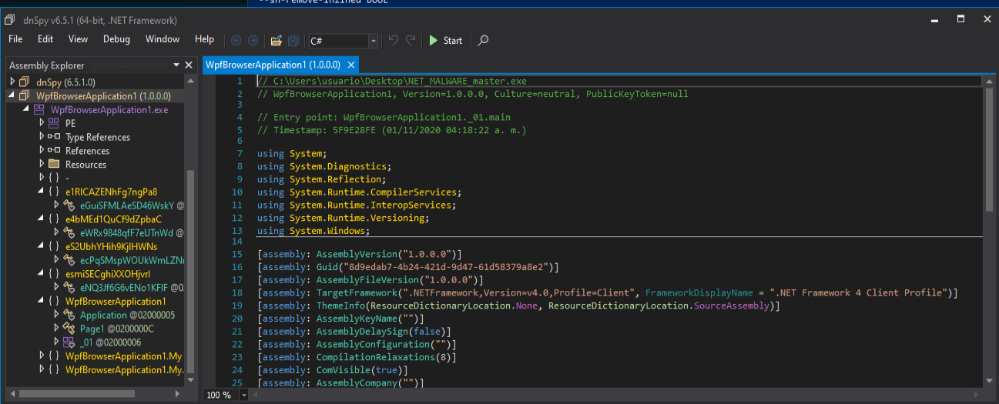
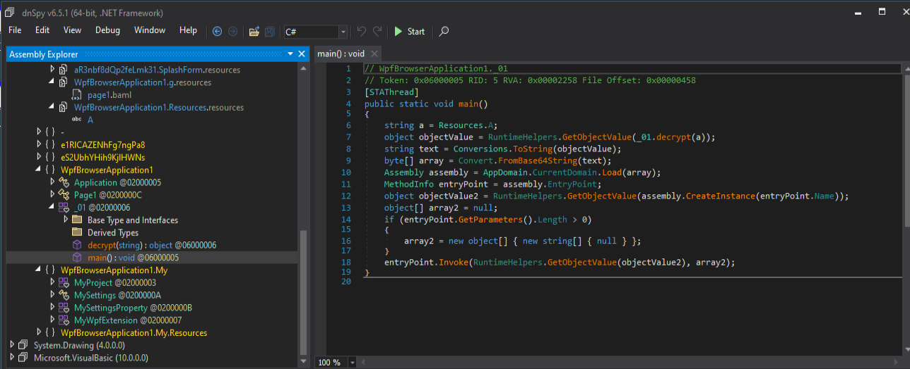
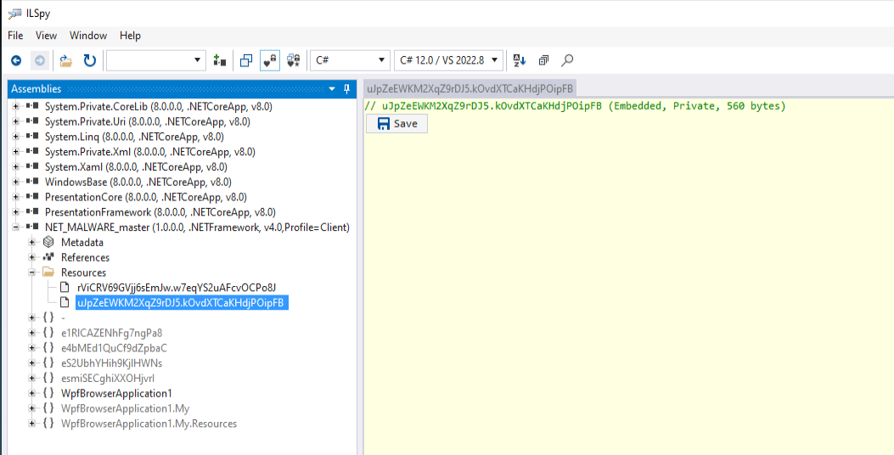
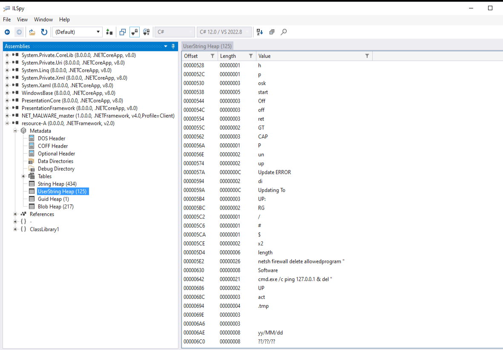

https://www.virustotal.com/gui/file/6dda005fa9d3f826124458af97d2e918a475d83447b2e057a3b0057441c3d6a7

--------------------

file,
file > sha256,6DDA005FA9D3F826124458AF97D2E918A475D83447B2E057A3B0057441C3D6A7
file > first 32 bytes (hex),4D 5A 90 00 03 00 00 00 04 00 00 00 FF FF 00 00 B8 00 00 00 00 00 00 00 40 00 00 00 00 00 00 00 
file > first 32 bytes (text),MZ............................................@..............
file > info,size: 233984 bytes, entropy: 7.664
file > type,executable, 32-bit, GUI
file > version,1.0.0.0
file > description,WpfBrowserApplication1
entry-point > first 32 bytes (hex),FF 25 00 20 40 00 00 00 00 00 00 00 00 00 00 00 00 00 00 00 00 00 00 00 00 00 00 00 00 00 00 00 
entry-point > location,0x00039F4E
file > signature,Microsoft Linker 6.0 | Microsoft Visual C# / Basic .NET | Microsoft.NET
,
stamps,
stamp > compiler,Sun Nov 01 03:18:22 2020 (UTC)
stamp > debug,n/a
stamp > resource,n/a
stamp > import,n/a
stamp > export,n/a
,
names,
file > name,c:\users\usuario\desktop\net_malware_master.exe
debug > file,n/a
export,n/a
version > original-file-name,WpfBrowserApplication1.exe
manifest,n/a
.NET > module > name,WpfBrowserApplication1.exe
certificate > program-name,n/a

----------------------------

Indicators

file > name,c:\users\usuario\desktop\net_malware_master.exe
file > signature,Microsoft Linker 6.0 | Microsoft Visual C# / Basic .NET | Microsoft.NET
file > sha256,6DDA005FA9D3F826124458AF97D2E918A475D83447B2E057A3B0057441C3D6A7
file > info,size: 233984 bytes, entropy: 7.664
file > type,executable, 32-bit, GUI
virustotal > score,No se pudo resolver el nombre de servidor o su dirección
stamp > compiler,Sun Nov 01 03:18:22 2020
file-name > version,WpfBrowserApplication1.exe
languages > names,neutral
resources > info,count: 4, size: 1874 bytes, file-ratio: 0.80%
.NET > assemby > GUID,A21C6487-179A-4DAF-BE8E-31972E3545AA
file > description,WpfBrowserApplication1
file > version,1.0.0.0
entry-point > location,0x00039F4E (section: .text)
string > url-pattern,1.0.0.0
string > url-pattern,10.0.0.0
string > url-pattern,4.0.0.0
certificate,n/a
imports > flag,CreateEncryptor | GetEnvironmentVariable | MemoryStream | OpenProcess | ReadProcessMemory | VirtualProtect | ...
imphash > md5,F34D5F2D4577ED6D9CEEC516C1F5A744
exports,n/a
overlay,n/a
.NET > module > name,WpfBrowserApplication1.exe
libraries > p/invoke,kernel32 | kernel32.dll

--------------------------------

footprintng

file > sha256,6DDA005FA9D3F826124458AF97D2E918A475D83447B2E057A3B0057441C3D6A7
dos-stub > sha256,7764E7022DCAC1B5779D1F96FC05AF5C1FEE394AAFF8A3A7E9A881E1A1B163A3
dos-header > sha256,BFDF5E72651B4EC588BD5FC6A9F17E9E0972248146BBACC10478F48D72F29B81
section > .text > sha256,617D9EB2D242D2375C5FBA9755A51770F19E68F44C1ED863E41863759B9655DF
section > .sdata > sha256,E4D02FDF63A656CDDE34531DDD2ED81C5B1BCD85D64BD56BEFD30B35036B8780
section > .rsrc > sha256,EF609AF44133247770CBC7D19B841EB8EFE2C86652EABBEFC60262DCBE0DACCA
section > .reloc > sha256,5D2B0481BCB8E65006E85B387C5F92AB16C47674752C7F14E74D70571F9F7194
version > sha256,B9015B052C95A835AE9D169CA50DFF8C98F790DD861F06D6ABBE5F4D783944CB
,
special,
imphash > md5,F34D5F2D4577ED6D9CEEC516C1F5A744

--------------------------------------

Dos Header

dos-header > sha256,BFDF5E72651B4EC588BD5FC6A9F17E9E0972248146BBACC10478F48D72F29B81
size,0x40 (64 bytes)
dos-header > location,0x00000000 - 0x00000040
entropy,3.669
file > ratio,0.00 %
exe-header > offset,0x00000080 (e_lfanew)

-----------------------------------------

DOS STUB

dos-stub > sha256,7764E7022DCAC1B5779D1F96FC05AF5C1FEE394AAFF8A3A7E9A881E1A1B163A3
dos-stub > location,0x00000040 - 0x00000080
size,0x40 (64 bytes)
entropy,4.794
file > ratio,0.03 %
first 32 bytes (hex),0E 1F BA 0E 00 B4 09 CD 21 B8 01 4C CD 21 54 68 69 73 20 70 72 6F 67 72 61 6D 20 63 61 6E 6E 6F 
first 32 bytes (hex),................!....L..!This program canno
message,!This program cannot be run in DOS mode.

------------------------------------------

RICH HEASDER

n/a

------------------

FILE HEADER

characteristics,0x010E,
dynamic-link-library,0x0000,false
32-bit words support,0x0100,true
file-can-be-executed,0x0002,true
system-image,0x0000,false
large-address-aware,0x0000,false
debug-stripped,0x0000,false
line-stripped-from-file,0x0004,true
local-symbols-stripped-from-file,0x0008,true
relocation-stripped,0x0000,false
uniprocessor,0x0000,false
bytes-of-machine-words-reversed-Low,0x0000,false
bytes-of-machine-words-reversed-Hi,0x0000,false
media-run-from-swap,0x0000,false
network-run-from-swap,0x0000,false
,,
general,,
stamp > compiler,0x5F9E28FE,Sun Nov 01 03:18:22 2020 (UTC)
size,0x14,20 bytes
file-header > location,0x00000084 - 0x00000098,0x00000084 - 0x00000098
signature,0x00004550,PE00
machine,0x014C,Intel-386
sections > count,0x0004,4
pointer-symbol-table,0x00000000,0x00000000
number-of-symbols,0x00000000,0x00000000

-------------------------------------

OPTIONAL HEADER

general,,
subsystem,0x0002,GUI
magic,0x010B,PE
file-checksum,0x00000000,n/a
entry-point > location,0x00039F4E,section[.text]
base-of-code > location,0x00002000,section[.text]
base-of-data,0x0003A000,section[.sdata]
size-of-code,0x00038000,229376 bytes
size-of-initialized-data,0x00000E00,3584 bytes
size-of-uninitialized-data,0x00000000,0 bytes
size-of-image,0x00040000,262144 bytes
size-of-headers,0x00000400,1024 bytes
size-of-stack-reserve,0x00100000,1048576 bytes
size-of-stack-commit,0x00001000,4096 bytes
size-of-heap-reserve,0x00100000,1048576 bytes
size-of-heap-commit,0x00001000,4096 bytes
section-alignment,0x00002000,8192 bytes
file-alignment,0x00000200,512 bytes
directories > count,0x00000010,16
LoaderFlags,0x00000000,0x00000000
Win32VersionValue,0x00000000,0x00000000
image-base,0x00400000,0x00400000
linker > version,6.0,Microsoft Linker 6.0
os > version,4.0,Windows NT 4.0
image > version,0.0,0.0
subsystem,4.0,4.0
,,
characteristics,0x0000,items
Address-Space-Layout-Randomization (ASLR),0x0000,false
Control-flow Enforcement Technology (CETCOMPACT),0x0000,false
Data Execution Prevention (DEP),0x0000,false
Code-Integrity (CI),0x0000,false
Structured-Exception Handling (SEH),0x0000,true
Windows-Driver Model (WDM),0x0000,false
Terminal-Server aware (TSA),0x0000,false
Control-Flow Guard (CFG),0x0000,false
image-bound,0x0000,false
Image isolation,0x0000,false
High-Entropy,0x0000,false
AppContainer,0x0000,false

-----------------------------------

DIRECTORIES

.NET,0x00000048 (72),0x00002008 (virtual),section:.text,0x00000000,-,-,-
architecture,0x00000000,-,-,-,-,-,x
bound-import,0x00000000,-,-,-,-,-,x
debug,0x0000001C (28),0x00039EB0 (virtual),section:.text,0x00000000,-,-,-
delay-loaded,0x00000000,-,-,-,-,-,x
exception,0x00000000,-,-,-,-,-,x
export,0x00000000,-,-,-,-,-,x
global-pointer,0x00000000,-,-,-,-,-,x
import,0x0000004B (75),0x00039F00 (virtual),section:.text,0x00000000,-,-,-
import-address,0x00000008 (8),0x00002000 (virtual),section:.text,0x00000000,-,-,-
load-configuration,0x00000000,-,-,-,-,-,x
relocation,0x0000000C (12),0x0003E000 (virtual),section:.reloc,0x00000000,-,-,-
resource,0x0000086C (2156),0x0003C000 (virtual),section:.rsrc,0x00000000,-,-,-
security,0x00000000,-,-,-,-,-,x
thread-local-storage,0x00000000,-,-,-,-,-,x

-------------------------------------

SECTIONS

section,section[0],section[1],section[2],section[3]
name,.text,.sdata,.rsrc,.reloc
section > sha256,617D9EB2D242D2375C5FBA9755A51770F19E68F44C1ED863E41863759B9655DF,E4D02FDF63A656CDDE34531DDD2ED81C5B1BCD85D64BD56BEFD30B35036B8780,EF609AF44133247770CBC7D19B841EB8EFE2C86652EABBEFC60262DCBE0DACCA,5D2B0481BCB8E65006E85B387C5F92AB16C47674752C7F14E74D70571F9F7194
entropy,7.723,2.186,2.953,0.102
file > ratio (99.56%),98.03 %,0.22 %,1.09 %,0.22 %
raw-address (begin),0x00000400,0x00038400,0x00038600,0x00039000
raw-address (end),0x00038400,0x00038600,0x00039000,0x00039200
raw-size (232960 bytes),0x00038000 (229376 bytes),0x00000200 (512 bytes),0x00000A00 (2560 bytes),0x00000200 (512 bytes)
virtual-address (begin),0x00002000,0x0003A000,0x0003C000,0x0003E000
virtual-address (end),0x00039F54,0x0003A0B1,0x0003C86C,0x0003E00C
virtual-size (231549 bytes),0x00037F54 (229204 bytes),0x000000B1 (177 bytes),0x0000086C (2156 bytes),0x0000000C (12 bytes)
,,,,
characteristics,0x60000020,0xC0000040,0x40000040,0x42000040
write,-,x,-,-
execute,x,-,-,-
share,-,-,-,-
self-modifying,-,-,-,-
virtual,-,-,-,-
,,,,
items,,,,
directory > import,0x00039F00,-,-,-
directory > resource,-,-,0x0003C000,-
directory > relocation,-,-,-,0x0003E000
directory > debug,0x00039EB0,-,-,-
directory > import-address,0x00002000,-,-,-
directory > .NET,0x00002008,-,-,-
version,-,-,0x00038B4C,-
base-of-code,0x00002000,-,-,-
base-of-data,-,0x0003A000,-,-
entry-point > location,0x00039F4E,-,-,-

---------------------------------

libraries

mscoree.dll,-,Implicit,436,Microsoft .NET Runtime Execution Engine
kernel32.dll,-,p/Invoke,7,Windows NT BASE API Client
kernel32,-,p/Invoke,2,Windows NT BASE API Client

--------------------------------

IMPORTS

VirtualProtect,-,x,p/Invoke,-,kernel32.dll
WriteProcessMemory,-,x,p/Invoke,-,kernel32.dll
ReadProcessMemory,-,x,p/Invoke,-,kernel32.dll
OpenProcess,-,x,p/Invoke,-,kernel32.dll
CreateEncryptor,-,x,MemberRef,-,mscoree.dll
GetEnvironmentVariable,-,x,MemberRef,-,mscoree.dll
MemoryStream,System.IO,x,TypeRef,-,mscoree.dll
RtlZeroMemory,-,-,p/Invoke,-,kernel32.dll
FindResource,-,-,p/Invoke,-,kernel32.dll
CloseHandle,-,-,p/Invoke,-,kernel32.dll
LoadLibrary,-,-,p/Invoke,-,kernel32
GetProcAddress,-,-,p/Invoke,-,kernel32
WpfBrowserApplication1,-,-,Assembly,-,mscoree.dll
....
....

-------------------------

.NET module

namespace (system),items
System.Reflection,19
System,39
System.Runtime.CompilerServices,4
System.Runtime.InteropServices,4
System.Diagnostics,3
System.Runtime.Versioning,1
System.Windows,4
System.Configuration,2
System.Windows.Controls,1
Microsoft.VisualBasic.ApplicationServices,2
Microsoft.VisualBasic.CompilerServices,3
System.Text,1
System.Text.RegularExpressions,1
Microsoft.VisualBasic.Devices,1
Microsoft.VisualBasic.Logging,1
System.Collections,2
System.Resources,1
System.Globalization,1
System.Windows.Markup,1
System.Security.Cryptography,11
System.IO,8
System.CodeDom.Compiler,1
Microsoft.VisualBasic,2
System.ComponentModel,2
System.ComponentModel.Design,1
,
namespace (custom),items
WpfBrowserApplication1.My,4
WpfBrowserApplication1,3
WpfBrowserApplication1.My.Resources,1
eS2UbhYHih9KjlHWNs,1
esmiSECghiXXOHjvrI,1
e1RlCAZENhFg7ngPa8,1
e4bMEd1QuCf9dZpbaC,1
,
header,items
.NET > module > name,WpfBrowserApplication1.exe
signature,BSJB
version,v4.0.30319
assembly > GUID,A21C6487-179A-4DAF-BE8E-31972E3545AA
typelibId > GUID,8D9EDAB7-4B24-421D-9D47-61D58379A8E2
runtime-version,2.5
entry-point (token | address),0x06000009
resources (size),174152 bytes (74.43%)
resources (RVA),0x0000F668
strong-name-signature (size),0 bytes
IL-Only,true
IL-Library,false
32-bit-required,false
32-bit-preferred,false
strong-name-signed,false
track-debug-data,false
native-entry-point,false
heap-sizes,0x0000

------------------------------

Resources

rViCRV69GVjj6sEmJw.w7eqYS2uAFcvOCPo8J,.NET,-,.text:0x0003807C,0x0002A610 (173584 bytes),n/a,7.999,-,52 67 C0 26 7A 70 52 53 F2 56 4B 5F 0B 3A 3F E0 F1 27 CF 52 38 2A 73 AF C8 3A 30 72 91 F4 2A F6 ,Rg..&zpRS..VK_..:?....'..R8*s....:0r....*..
uJpZeEWKM2XqZ9rDJ5.kOvdXTCaKHdjPOipFB,.NET,-,.text:0x000382B0,0x00000230 (560 bytes),n/a,7.644,-,5E 64 1D C9 75 4F 0A 09 C9 56 24 0A 13 B6 7F AD 07 D2 FB A2 13 11 91 DA 13 0A 0F F6 BA 18 EF 0B ,^d....uO......V$..........................................
version,1,version,0x00038B4C - 0x00038E6C,0x00000320 (800 bytes),B9015B052C95A835AE9D169CA50DFF8C98F790DD861F06D6ABBE5F4D783944CB,3.319,neutral (0x00000000),20 03 34 00 00 00 56 00 53 00 5F 00 56 00 45 00 52 00 53 00 49 00 4F 00 4E 00 5F 00 49 00 4E 00 , ..4......V..S.._..V..E..R..S..I..O..N.._..I..N..
icon,2,icon,0x00038718 - 0x00038A00,0x000002E8 (744 bytes),7C5A5E79E83118E35690003B7AF90EDF66CAEA64B38E03BF65E555C49C3A5B31,2.714,neutral (0x00000000),28 00 00 00 20 00 00 00 40 00 00 00 01 00 04 00 00 00 00 00 80 02 00 00 00 00 00 00 00 00 00 00 ,(...... ......@..............................................
icon,3,icon,0x00038A00 - 0x00038B28,0x00000128 (296 bytes),BF763501E16F639D5223F88427789665CB0BAA9AF8877E2E83C65E16016AB8B1,2.536,neutral (0x00000000),28 00 00 00 10 00 00 00 20 00 00 00 01 00 04 00 00 00 00 00 C0 00 00 00 00 00 00 00 00 00 00 00 ,(.............. ..............................................
icon-group,32512,icon-group,0x00038B28 - 0x00038B4A,0x00000022 (34 bytes),E5D571D7F26FA57C7E00290D0FA8AEF8C1D519983E0AA5ECD75F5D4B41FA4CDA,2.477,neutral (0x00000000),00 00 01 00 02 00 20 20 10 00 01 00 04 00 E8 02 00 00 02 00 10 10 10 00 01 00 04 00 28 01 00 00 ,............  ........................................(......

------------------------------

Strings

ascii,12,0x0000C0AB,x,MemoryStream
ascii,14,0x0000C121,x,VirtualProtect
ascii,18,0x0000C2BF,x,WriteProcessMemory
ascii,17,0x0000C2DC,x,ReadProcessMemory
ascii,11,0x0000C302,x,OpenProcess
ascii,15,0x0000C717,x,CreateEncryptor
ascii,22,0x0000C874,x,GetEnvironmentVariable
ascii,12,0x4D5AC0AB,x,MemoryStream
ascii,14,0x4D5AC121,x,VirtualProtect
ascii,18,0x4D5AC2BF,x,WriteProcessMemory
ascii,17,0x4D5AC2DC,x,ReadProcessMemory
ascii,11,0x4D5AC302,x,OpenProcess
ascii,15,0x4D5AC717,x,CreateEncryptor
ascii,22,0x4D5AC874,x,GetEnvironmentVariable
ascii,4,0x00000000,-,BSJB
ascii,40,0x0000004D,-,!This program cannot be run in DOS mode.
ascii,5,0x00000178,-,.text
....
....

------------------

Version

version > sha256,B9015B052C95A835AE9D169CA50DFF8C98F790DD861F06D6ABBE5F4D783944CB
first 32 bytes (hex),20 03 34 00 00 00 56 00 53 00 5F 00 56 00 45 00 52 00 53 00 49 00 4F 00 4E 00 5F 00 49 00 4E 00 
first 32 bytes (text), ..4......V..S.._..V..E..R..S..I..O..N.._..I..N..
version > location,0x00038B4C - 0x00038E6C
size,0x00000320 (800 bytes)
file > type,executable
language,0x0000 (neutral)
code-page,1200 (Unicode UTF-16, little endian)
FileDescription,WpfBrowserApplication1
FileVersion,1.0.0.0
InternalName,WpfBrowserApplication1.exe
LegalCopyright,Copyright @  2020
OriginalFilename,WpfBrowserApplication1.exe
ProductName,WpfBrowserApplication1
ProductVersion,1.0.0.0
Assembly Version,1.0.0.0

-----------------

Desempacado: Con de4dot

La opción `--dont-rename` ha evitado el problema con las referencias XAML. Esto no significa que el ejecutable esté completamente desofuscado: ha sido limpiado en la medida que de4dot permite, pero conservará nombres de clases y métodos ofuscados.

------------------

Vemos a apariencia del fichero empaqado, cómo codifica los nombre de las funciones:

Detalle de uno de los recursos:

Función main:

------------------

Vemos los resources:

-----------------------------

-------------------------

Recuperamos el recurso A:

Creamos el fichero [Recurso-A](resource-A) y lo analizamos en cybercheff:

From binary:

Detalle de la parte final:

From Base64:

-------

Descargamos el payload y obtenemos:

Parece ofuscado en el código:

Detalle del resource A en ILSpy:

