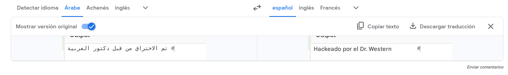
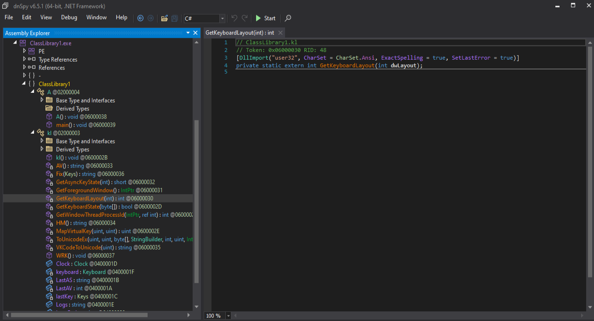

# M9T8 — Puntos 1 a 5 corregidos

# 1. Identificar la arquitectura de destino del malware

El primer paso del análisis consiste en identificar el formato, la arquitectura y el entorno de ejecución del fichero principal:

```text
NET_MALWARE_master.exe
```

Para ello se utilizaron las siguientes herramientas:

- Exeinfo PE.
- Detect It Easy.
- PeStudio.
- CFF Explorer.

En esta fase se analiza únicamente el ejecutable principal. Aunque se observan recursos incrustados, todavía no se conoce su función y no debe afirmarse que alguno de ellos sea el payload hasta que sea extraído e identificado.


## 1.1. Identificación del formato

Los primeros bytes del archivo son:

```text
4D 5A 90 00 03 00 00 00 04 00 00 00 FF FF 00 00
```

Los <mark>bytes `4D 5A` corresponden a la firma ASCII `MZ`, característica de los ejecutables de Windows.</mark>

El campo `e_lfanew` de la cabecera DOS contiene el valor:

```text
0x00000080
```

En ese desplazamiento se encuentra la firma:

```text
50 45 00 00
```

equivalente a `PE\0\0`.

Por tanto, <mark>`NET_MALWARE_master.exe` es un archivo **Portable Executable (PE)** válido para Microsoft Windows.</mark>

## 1.2. Arquitectura declarada en la cabecera PE

Las herramientas muestran las siguientes propiedades:

| Propiedad | Valor |
|---|---|
| Formato | `PE32` |
| Machine | `0x014C` |
| Arquitectura declarada | Intel 386 / I386 |
| Subsistema | Windows GUI |
| Image Base | `0x00400000` |
| Tamaño de la imagen | `0x00040000` |
| Número de secciones | 4 |
| Punto de entrada | `0x00439F4E` |
| Sección del punto de entrada | `.text` |

El valor `Machine = 0x014C` corresponde a:

```text
IMAGE_FILE_MACHINE_I386
```

Desde el punto de vista de la envoltura PE, el archivo se presenta como un ejecutable PE32 para arquitectura x86.

## 1.3. Subsistema gráfico

El Optional Header contiene:

```text
Subsystem = 0x0002
```

Este valor corresponde a:

```text
IMAGE_SUBSYSTEM_WINDOWS_GUI
```

Por tanto, el ejecutable está diseñado como <mark>una aplicación gráfica de Windows y no como una aplicación de consola.</mark>

Los metadatos muestran:

```text
OriginalFilename: WpfBrowserApplication1.exe
FileDescription:  WpfBrowserApplication1
```

Estos valores son coherentes con <mark>una aplicación basada en **Windows Presentation Foundation (WPF)**.</mark>

## 1.4. Naturaleza administrada del ejecutable

La muestra no es un ejecutable nativo convencional, sino <mark>un ensamblado administrado de Microsoft .NET.</mark>

Los principales indicadores son:

```text
Microsoft .NET
CLR v4.0.30319
Firma de metadatos BSJB
Código IL-Only
```

La cabecera CLR presenta:

| Propiedad | Resultado |
|---|---|
| Firma CLR | `BSJB` |
| Versión CLR | `v4.0.30319` |
| IL-Only | Sí |
| Native Entry Point | No |
| Strong Name | No |
| Token del punto de entrada | `0x06000009` |
| Nombre del módulo | `WpfBrowserApplication1.exe` |

La <mark>propiedad `IL-Only` indica que la lógica principal está implementada en CIL/MSIL y será compilada mediante JIT por el Common Language Runtime.</mark>

## 1.5. Diferencia entre PE32 y arquitectura efectiva del proceso

Aunque la cabecera PE declara:

```text
PE32
Machine = I386
```

la cabecera CLR contiene:

```text
32BITREQ  = false
32BITPREF = false
```

Esto significa que <mark>el ensamblado administrado no exige expresamente ejecutarse como proceso de 32 bits. La combinación es compatible con una compilación `AnyCPU`.</mark>

En condiciones normales:

```text
Windows de 32 bits → proceso de 32 bits
Windows de 64 bits → proceso administrado potencialmente de 64 bits
```

No obstante, <mark>la muestra está protegida mediante .NET Reactor.</mark> El protector puede incorporar dependencias o componentes que condicionen la arquitectura efectiva.

Por tanto, la clasificación más precisa es:

> [!Caution]
> **`NET_MALWARE_master.exe` es un ejecutable PE32 administrado para Windows, con cabecera I386, pero sin la marca CLR que obliga a usar 32 bits. La arquitectura efectiva debe confirmarse mediante análisis dinámico.**

## 1.6. Compilador y lenguaje probable

Detect It Easy identifica:

```text
Compilador: VB.NET
Lenguaje: VB.NET
Librería: .NET Framework
```

PeStudio ofrece una identificación más general:

```text
Microsoft Visual C# / Basic .NET
```

También aparecen referencias a:

```text
Microsoft.VisualBasic
Microsoft.VisualBasic.ApplicationServices
Microsoft.VisualBasic.CompilerServices
Microsoft.VisualBasic.Devices
```

Estas evidencias indican que el <mark>proyecto fue desarrollado probablemente en **Visual Basic .NET**, aunque el descompilador pueda representar parte del código como C#.</mark>

## 1.7. Protector detectado

Detect It Easy identifica el uso de:

```text
.NET Reactor 4.8–4.9
```

También señala:

```text
Encrypted or packed data
Assembly invoke
RSACryptoServiceProvider
High entropy
Strings encryption
Obfuscation
Fake .cctor name
Math mutations
```

Por tanto, <mark>el ensamblado se encuentra protegido u ofuscado.</mark> Esta protección puede afectar a los nombres, las cadenas, el flujo de control, los recursos y la carga de ensamblados.

La versión exacta de .NET Reactor no puede confirmarse únicamente mediante firmas, ya que Exeinfo PE propone un intervalo diferente.

## 1.8. Punto de entrada

El punto de entrada PE se encuentra en:

```text
RVA: 0x00039F4E
VA:  0x00439F4E
Sección: .text
```

Los primeros bytes son:

```text
FF 25 00 20 40 00
```

Este código actúa como un stub que transfiere el control al entorno de ejecución .NET.

El punto de entrada administrado se identifica mediante el token:

```text
0x06000009
```

La lógica real debe analizarse desde el método asociado a dicho token mediante `dnSpyEx` o `ILSpy`.

## 1.9. Secciones del ejecutable

El archivo contiene cuatro secciones:

| Sección | Tamaño raw | Entropía | Permisos |
|---|---:|---:|---|
| `.text` | 229.376 bytes | 7,72264 | Lectura y ejecución |
| `.sdata` | 512 bytes | 2,18920 | Lectura y escritura |
| `.rsrc` | 2.560 bytes | 2,95314 | Lectura |
| `.reloc` | 512 bytes | 0,10473 | Lectura y descartable |

<mark>La sección `.text` ocupa aproximadamente el 98,03 % del archivo y presenta una entropía muy elevada.</mark>

En un ensamblado .NET, `.text` puede contener:

- Código IL.
- Metadatos CLR.
- Streams de metadatos.
- Recursos administrados.
- Datos transformados por el protector.

<mark>La entropía elevada es compatible con cifrado, compresión u ofuscación, pero no demuestra por sí sola la existencia de un packer nativo.</mark>

## 1.10. Relocalizaciones

La sección `.reloc` contiene un bloque con:

```text
VirtualAddress: 0x00039000
SizeOfBlock:    0x0000000C
```

La presencia de relocalizaciones indica que se conservan entradas para ajustar determinadas direcciones.

Sin embargo, el Optional Header muestra que `DYNAMIC_BASE` no está activado. Por tanto, <mark>el ejecutable no declara compatibilidad con ASLR aunque contenga una tabla de relocalizaciones.</mark>

## 1.11. Recursos administrados observados

CFF Explorer muestra recursos bajo el nodo:

```text
.NET Resources
```

Entre ellos aparecen nombres ofuscados:

```text
rViCRV69GVjj6sEmJw.w7eqYS2uAFcvOCPo8J
uJpZeEWKM2XqZ9rDJ5.kOvdXTCaKHdjPOipFB
```

**<mark>En esta fase solo puede concluirse que:</mark>**
- El archivo contiene recursos administrados.
- Sus nombres están ofuscados.
- Su contenido no es directamente legible.
- Presentan una entropía elevada.
- Deben extraerse y analizarse por separado.

No podemos afirmar todavía que sean payloads ejecutables.

## 1.12. Sistema operativo de destino

**<mark>La muestra está diseñada para Microsoft Windows debido a:</mark>**
- Su formato PE.
- El subsistema Windows GUI.
- El uso de WPF.
- El CLR `v4.0.30319`.
- Las estructuras específicas de Windows.
- La protección mediante .NET Reactor.

No es una aplicación .NET multiplataforma moderna.

## 1.13. Resumen de arquitectura

```text
Archivo:                    NET_MALWARE_master.exe
Formato:                    PE32
Machine:                    Intel 386 / I386
Subsistema:                 Windows GUI
Plataforma:                 Microsoft Windows
Tecnología:                 Microsoft .NET
CLR:                        v4.0.30319
Código:                     IL-Only
Lenguaje probable:          VB.NET
Interfaz:                   WPF
Protector:                  .NET Reactor
Image Base:                 0x00400000
Punto de entrada PE:        0x00439F4E
Token de entrada .NET:      0x06000009
Número de secciones:        4
32-bit-required:            false
32-bit-preferred:           false
```

## 1.14. Conclusión

`NET_MALWARE_master.exe` es un ejecutable PE32 administrado para Windows, basado en WPF y compilado para el CLR `v4.0.30319`.

La cabecera PE utiliza `IMAGE_FILE_MACHINE_I386`, pero el ensamblado no está marcado como obligatorio o preferente de 32 bits. Por ello, su configuración es compatible con `AnyCPU`, aunque debe confirmarse dinámicamente debido a la protección de .NET Reactor.

También se han identificado recursos administrados de alta entropía. Su función todavía no puede determinarse en esta fase.

---

# 2. Tomar huellas dactilares del malware

La toma de huellas permite identificar de forma inequívoca la muestra y comparar sus estructuras con otros archivos relacionados. Se han utilizado huellas globales y parciales obtenidas mediante FootprintNG.

## 2.1. Huella criptográfica del archivo

El SHA-256 del archivo completo es:

```text
6DDA005FA9D3F826124458AF97D2E918A475D83447B2E057A3B0057441C3D6A7
```

| Elemento | Algoritmo | Huella |
|---|---|---|
| Archivo completo | SHA-256 | `6DDA005FA9D3F826124458AF97D2E918A475D83447B2E057A3B0057441C3D6A7` |

Esta huella debe utilizarse como identificador principal del contenedor.

## 2.2. Huellas de la cabecera DOS

| Estructura | Algoritmo | Huella |
|---|---|---|
| DOS Stub | SHA-256 | `7764E7022DCAC1B5779D1F96FC05AF5C1FEE394AAFF8A3A7E9A881E1A1B163A3` |
| DOS Header | SHA-256 | `BFDF5E72651B4EC588BD5FC6A9F17E9E0972248146BBACC10478F48D72F29B81` |

Estas huellas permiten comparar la estructura inicial del `PE`.

## 2.3. Huellas de las secciones PE

| Sección | Algoritmo | Huella |
|---|---|---|
| `.text` | SHA-256 | `617D9EB2D242D2375C5FBA9755A51770F19E68F44C1ED863E41863759B9655DF` |
| `.sdata` | SHA-256 | `E4D02FDF63A656CDDE34531DDD2ED81C5B1BCD85D64BD56BEFD30B35036B8780` |
| `.rsrc` | SHA-256 | `EF609AF44133247770CBC7D19B841EB8EFE2C86652EABBEFC60262DCBE0DACCA` |
| `.reloc` | SHA-256 | `5D2B0481BCB8E65006E85B387C5F92AB16C47674752C7F14E74D70571F9F7194` |

### Sección `.text`

La huella de `.text` es especialmente relevante porque esta sección contiene el código `IL`, los metadatos `CLR` y los recursos administrados de alta entropía. Una modificación de la lógica administrada o de dichos recursos alteraría esta huella.

### Sección `.sdata`

La sección `.sdata` contiene datos estáticos y estructuras generadas durante la compilación.

### Sección `.rsrc`

La sección `.rsrc` contiene los recursos `PE` tradicionales:

- Información de versión.
- Iconos.
- Grupo de iconos.

Debe distinguirse de los recursos administrados de `.NET`, que en esta muestra se encuentran dentro de `.text`.

### Sección `.reloc`

La huella de `.reloc` permite comparar la estructura de las relocalizaciones, aunque tiene menor relación con la funcionalidad maliciosa.

## 2.4. Huella de la información de versión

FootprintNG obtuvo el siguiente SHA-256 para el bloque de información de versión:

```text
B9015B052C95A835AE9D169CA50DFF8C98F790DD861F06D6ABBE5F4D783944CB
```

| Elemento | Algoritmo | Huella |
|---|---|---|
| Información de versión | SHA-256 | `B9015B052C95A835AE9D169CA50DFF8C98F790DD861F06D6ABBE5F4D783944CB` |

Los metadatos observados son:

| Campo | Valor |
|---|---|
| FileDescription | `WpfBrowserApplication1` |
| FileVersion | `1.0.0.0` |
| InternalName | `WpfBrowserApplication1.exe` |
| OriginalFilename | `WpfBrowserApplication1.exe` |
| ProductName | `WpfBrowserApplication1` |
| ProductVersion | `1.0.0.0` |
| AssemblyVersion | `1.0.0.0` |

<mark>La versión `1.0.0.0` corresponde al contenedor principal. No debe confundirse con la versión de ensamblado `0.0.0.0` del archivo extraído ni con la versión interna `0.6.4` del RAT.</mark>

## 2.5. Import Hash

El imphash calculado es:

```text
F34D5F2D4577ED6D9CEEC516C1F5A744
```

| Elemento | Algoritmo | Huella |
|---|---|---|
| Import Hash | MD5 | `F34D5F2D4577ED6D9CEEC516C1F5A744` |

El imphash se calcula sobre la tabla de importaciones `PE` convencional. En un ensamblado `.NET` su capacidad discriminante es limitada, porque la tabla `PE` contiene principalmente la inicialización del `CLR` y muchas `APIs` nativas se declaran mediante `P/Invoke` dentro de los metadatos `.NET`.

## 2.6. Resumen de huellas

```text
Archivo completo:
SHA-256: 6DDA005FA9D3F826124458AF97D2E918A475D83447B2E057A3B0057441C3D6A7

DOS Stub:
SHA-256: 7764E7022DCAC1B5779D1F96FC05AF5C1FEE394AAFF8A3A7E9A881E1A1B163A3

DOS Header:
SHA-256: BFDF5E72651B4EC588BD5FC6A9F17E9E0972248146BBACC10478F48D72F29B81

.text:
SHA-256: 617D9EB2D242D2375C5FBA9755A51770F19E68F44C1ED863E41863759B9655DF

.sdata:
SHA-256: E4D02FDF63A656CDDE34531DDD2ED81C5B1BCD85D64BD56BEFD30B35036B8780

.rsrc:
SHA-256: EF609AF44133247770CBC7D19B841EB8EFE2C86652EABBEFC60262DCBE0DACCA

.reloc:
SHA-256: 5D2B0481BCB8E65006E85B387C5F92AB16C47674752C7F14E74D70571F9F7194

Información de versión:
SHA-256: B9015B052C95A835AE9D169CA50DFF8C98F790DD861F06D6ABBE5F4D783944CB

Imphash:
MD5: F34D5F2D4577ED6D9CEEC516C1F5A744
```

## 2.7. Consultas externas

El SHA-256 del contenedor se consultó en VirusTotal y Joe Sandbox como evidencia complementaria.

### VirusTotal


En la consulta realizada, 52 de 70 motores clasificaron el archivo como malicioso. Entre las detecciones aparecieron referencias a <mark>njRAT, Bladabindi y familias relacionadas.</mark>

Los nombres asignados por los motores son orientativos y no constituyen por sí solos una atribución definitiva.

### Joe Sandbox


Joe Sandbox clasificó la muestra como:

```text
MALICIOUS
```

con una puntuación de:

```text
100/100
```

y la relacionó con <mark>njRAT.</mark>


---

# 3. Triage estático inicial con PeStudio

Se realizó un análisis estático inicial con PeStudio para identificar el formato, las características `PE`, las protecciones, los recursos y los indicadores sospechosos sin ejecutar la muestra.

## 3.1. Información general del archivo

| Propiedad | Resultado |
|---|---|
| Nombre analizado | `NET_MALWARE_master.exe` |
| Nombre original | `WpfBrowserApplication1.exe` |
| Descripción | `WpfBrowserApplication1` |
| Tamaño | 233.984 bytes |
| SHA-256 | `6DDA005FA9D3F826124458AF97D2E918A475D83447B2E057A3B0057441C3D6A7` |
| Tipo | Ejecutable PE |
| Subsistema | GUI |
| Formato | PE32 |
| Máquina | Intel 386 |
| Tecnología | Microsoft .NET |
| Lenguaje probable | C# o VB.NET |
| Versión | `1.0.0.0` |
| Entropía global | 7,664 |
| Firma digital | No presente |
| Overlay | No presente |
| Exportaciones | No presentes |

## 3.2. Identificación del ejecutable .NET

PeStudio detectó:

```text
Microsoft Linker 6.0
Microsoft Visual C# / Basic .NET
Microsoft .NET
```

La cabecera `CLR` contiene:

| Propiedad | Resultado |
|---|---|
| Firma de metadatos | `BSJB` |
| Versión CLR | `v4.0.30319` |
| Nombre del módulo | `WpfBrowserApplication1.exe` |
| Token de entrada | `0x06000009` |
| IL-Only | Sí |
| Biblioteca .NET | No |
| Strong Name | No |
| Entrada nativa | No |
| 32-bit required | No |
| 32-bit preferred | No |

El resultado es compatible con un ensamblado `AnyCPU`, aunque la arquitectura efectiva debe verificarse dinámicamente.

## 3.3. Punto de entrada

```text
RVA:      0x00039F4E
Sección:  .text
Bytes:    FF 25 00 20 40 00
```

El patrón corresponde a un stub de inicialización del `CLR`.

El token del punto de entrada administrado es:

```text
0x06000009
```

## 3.4. Fecha de compilación

PeStudio muestra:

```text
1 de noviembre de 2020, 03:18:22 UTC
0x5F9E28FE
```

La marca temporal debe considerarse un indicador, no una prueba definitiva, porque puede haber sido modificada por el autor o por el protector.

## 3.5. Cabecera DOS

| Propiedad | Resultado |
|---|---|
| Tamaño | 64 bytes |
| Ubicación | `0x00000000–0x00000040` |
| Entropía | 3,669 |
| `e_lfanew` | `0x00000080` |
| SHA-256 | `BFDF5E72651B4EC588BD5FC6A9F17E9E0972248146BBACC10478F48D72F29B81` |

El DOS Stub contiene:

```text
This program cannot be run in DOS mode.
```

No se detectó Rich Header. Su ausencia no constituye por sí sola un indicador malicioso.

## 3.6. File Header

| Campo | Valor |
|---|---|
| Firma | `PE\0\0` |
| Machine | `0x014C — Intel 386` |
| Número de secciones | 4 |
| Características | `0x010E` |
| Ejecutable | Sí |
| DLL | No |
| Símbolos locales eliminados | Sí |
| Líneas de depuración eliminadas | Sí |
| Large Address Aware | No |

## 3.7. Optional Header y protecciones de seguridad

| Propiedad | Resultado |
|---|---|
| Magic | `0x010B — PE32` |
| Image Base | `0x00400000` |
| Base of Code | `0x00002000` |
| Base of Data | `0x0003A000` |
| Size of Image | 262.144 bytes |
| Size of Headers | 1.024 bytes |
| File Alignment | 512 bytes |
| Section Alignment | 8.192 bytes |
| Subsistema | GUI |
| Checksum | No definido |

Mitigaciones:

| Mitigación | Estado |
|---|---|
| ASLR | Desactivado |
| DEP / NX | Desactivado |
| CFG | Desactivado |
| High Entropy VA | Desactivado |
| CET Compatible | Desactivado |
| AppContainer | Desactivado |
| Image Isolation | Desactivado |
| SEH | Activado |

Estas ausencias reducen las protecciones del binario, pero no demuestran por sí solas una conducta maliciosa.

## 3.8. Secciones PE

| Sección | Tamaño raw | Entropía | Permisos |
|---|---:|---:|---|
| `.text` | 229.376 bytes | 7,723 | Lectura y ejecución |
| `.sdata` | 512 bytes | 2,186 | Lectura y escritura |
| `.rsrc` | 2.560 bytes | 2,953 | Lectura |
| `.reloc` | 512 bytes | 0,102 | Lectura y descartable |

<mark>La elevada entropía de `.text` se relaciona con la protección y con la presencia de recursos administrados.</mark>

<mark>La sección `.rsrc` contiene los recursos `PE` tradicionales, mientras que los recursos administrados `.NET` se encuentran dentro de `.text`.</mark>

## 3.9. Recursos incrustados

PeStudio identificó dos recursos administrados:

| Recurso | Tamaño | Entropía |
|---|---:|---:|
| `rViCRV69GVjj6sEmJw.w7eqYS2uAFcvOCPo8J` | 173.584 bytes | 7,999 |
| `uJpZeEWKM2XqZ9rDJ5.kOvdXTCaKHdjPOipFB` | 560 bytes | 7,644 |

El tamaño conjunto es de 174.152 bytes, aproximadamente el 74,43 % del archivo.

<mark>La elevada entropía es compatible con cifrado, compresión u ofuscación. En esta fase no puede afirmarse que el contenido sea ejecutable.</mark>

## 3.10. Recursos PE tradicionales

La sección `.rsrc` contiene:

- Información de versión.
- Dos iconos.
- Un grupo de iconos.

Los metadatos `WpfBrowserApplication1` parecen genéricos y no permiten identificar un editor legítimo.

## 3.11. Importaciones PE, declaraciones P/Invoke y referencias administradas

### Importación PE convencional

La biblioteca presente en la tabla de importaciones PE es:

```text
mscoree.dll
```

Su función es inicializar el `CLR`.

### Declaraciones P/Invoke

Los metadatos `.NET` contienen:

```text
VirtualProtect
WriteProcessMemory
ReadProcessMemory
OpenProcess
RtlZeroMemory
FindResource
CloseHandle
LoadLibrary
GetProcAddress
```

Estas APIs permiten interactuar con procesos, memoria, bibliotecas y recursos nativos.

Su presencia no demuestra por sí sola una técnica de inyección, ya que pueden formar parte de .NET Reactor.

### Referencias administradas

PeStudio también muestra:

| Elemento | Tipo | Interpretación |
|---|---|---|
| `CreateEncryptor` | `MemberRef` | Método criptográfico administrado |
| `GetEnvironmentVariable` | `MemberRef` | Método de `System.Environment` |
| `MemoryStream` | `TypeRef` | Tipo `System.IO.MemoryStream` |

No son importaciones PE ni declaraciones P/Invoke.

## 3.12. Import Hash

```text
F34D5F2D4577ED6D9CEEC516C1F5A744
```

Su utilidad es limitada en ensamblados .NET debido al reducido número de importaciones PE convencionales.

## 3.13. Namespaces y estructura .NET

Se identificaron namespaces legítimos como:

```text
System.Reflection
System.Runtime.InteropServices
System.Security.Cryptography
System.IO
System.Windows
Microsoft.VisualBasic
```

También aparecen espacios de nombres ofuscados:

```text
eS2UbhYHih9KjlHWNs
esmiSECghiXXOHjvrI
e1RlCAZENhFg7ngPa8
e4bMEd1QuCf9dZpbaC
```

La combinación de reflexión, criptografía, entrada/salida y `P/Invoke` es compatible con rutinas de protección y carga dinámica.

## 3.14. Cadenas y referencias relevantes

PeStudio identificó APIs nativas como:

```text
VirtualProtect
WriteProcessMemory
ReadProcessMemory
OpenProcess
```

y referencias administradas:

```text
CreateEncryptor
GetEnvironmentVariable
MemoryStream
```

La combinación es compatible con descifrado, carga de recursos y manipulación de datos en memoria. Su finalidad exacta debe confirmarse mediante referencias cruzadas.

## 3.15. Firma digital y manifiesto

La muestra no presenta:

- Firma Authenticode.
- Certificado digital.
- Editor verificable.
- Strong Name.
- Manifiesto visible según PeStudio.

La ausencia de firma no demuestra por sí sola que el archivo sea malicioso, pero impide verificar su procedencia.

## 3.16. Indicadores relevantes del triage

```text
SHA-256:
6DDA005FA9D3F826124458AF97D2E918A475D83447B2E057A3B0057441C3D6A7

Imphash:
F34D5F2D4577ED6D9CEEC516C1F5A744

Nombre original:
WpfBrowserApplication1.exe

Versión CLR:
v4.0.30319

Entropía global:
7,664

Recurso principal:
rViCRV69GVjj6sEmJw.w7eqYS2uAFcvOCPo8J

Tamaño:
173.584 bytes

Entropía:
7,999
```

## 3.17. Valoración del triage

<mark>**Los principales indicadores sospechosos son:</mark>**
1. Entropía global elevada.
2. Sección `.text` con entropía de 7,723.
3. Recurso administrado con entropía de 7,999.
4. Nombres ofuscados.
5. Declaraciones P/Invoke de manipulación de memoria.
6. Referencias criptográficas y uso de flujos en memoria.
7. Ausencia de firma digital.
8. Metadatos genéricos.
9. Protecciones PE modernas desactivadas.
10. Gran proporción del archivo ocupada por recursos administrados.

La hipótesis inicial es que el archivo actúa como un contenedor o cargador .NET protegido.

## 3.18. Conclusión

PeStudio confirma que la muestra es un ejecutable `.NET` `WPF` protegido, con recursos administrados de alta entropía y referencias compatibles con criptografía, carga dinámica y manipulación de memoria.

Estos resultados justifican continuar con la desofuscación, la extracción de recursos y la descompilación del contenido recuperado.

---

# 4. Análisis de protección, ofuscación y desofuscación

La muestra no presenta inicialmente la estructura típica de un ejecutable nativo comprimido con `UPX`. Las herramientas identifican una protección `.NET Reactor`.

Por ello, el proceso debe describirse principalmente como **desofuscación o desprotección de un ensamblado .NET**.

## 4.1. Indicadores iniciales de protección

Detect It Easy identifica:

```text
.NET Reactor 4.8–4.9
```

También señala:

```text
Encrypted or packed data
Assembly invoke
RSACryptoServiceProvider
High entropy
Strings encryption
Obfuscation
Fake .cctor name
Math mutations
```

Estas características son <mark>compatibles con cifrado de cadenas, renombrado, protección de métodos, alteración del flujo de control y protección de recursos.</mark>

## 4.2. Análisis de entropía

```text
Entropía global: 7,664
Entropía de .text: 7,72264
Tamaño de .text: 229.376 bytes
Proporción aproximada: 98,03 %
```

El valor de `.text` es compatible con una cantidad importante de datos cifrados, comprimidos u ofuscados.

En un ensamblado .NET, la entropía elevada no demuestra por sí sola la existencia de un packer nativo.

## 4.3. Recursos administrados de alta entropía

Los dos recursos principales presentan:

```text
173.584 bytes — entropía 7,999
560 bytes     — entropía 7,644
```

Estos valores son compatibles con contenido transformado por el protector.

En esta fase sólo se concluye que requieren extracción y análisis independiente.

## 4.4. Nombres y metadatos ofuscados

El ensamblado contiene identificadores como:

```text
eS2UbhYHih9KjlHWNs
esmiSECghiXXOHjvrI
e1RlCAZENhFg7ngPa8
e4bMEd1QuCf9dZpbaC
```

Estos nombres son compatibles con un renombrado automático.

La ofuscación dificulta la identificación de clases, métodos, referencias y recursos.

## 4.5. APIs nativas y referencias administradas relacionadas con la protección

PeStudio identificó declaraciones `P/Invoke`:

```text
VirtualProtect
WriteProcessMemory
ReadProcessMemory
OpenProcess
RtlZeroMemory
FindResource
CloseHandle
LoadLibrary
GetProcAddress
```

También aparecen referencias administradas:

```text
CreateEncryptor
GetEnvironmentVariable
MemoryStream
```

<mark>La combinación es compatible con descifrado, carga dinámica, recuperación de recursos y reconstrucción de código en memoria.</mark>

No obstante, no puede afirmarse que el malware realice inyección de procesos, ya que parte de estas funciones puede pertenecer al protector.

## 4.6. Diferencia entre desempaquetado y desofuscación

El término más preciso es:

```text
Desprotección o desofuscación del ensamblado
```

El objetivo es recuperar:
- Metadatos válidos.
- Cuerpos de métodos.
- Recursos accesibles.
- Flujo de control comprensible.
- Cadenas y referencias analizables.

## 4.7. Primer intento con de4dot

Se ejecutó:

```powershell
de4dot.exe C:\Users\usuario\Desktop\NET_MALWARE_master.exe
```


La salida fue:

```text
Detected .NET Reactor
Cleaning C:\Users\usuario\Desktop\NET_MALWARE_master.exe
WARNING: File contains XAML which isn't supported. Use --dont-rename.
Renaming all obfuscated symbols
Saving C:\Users\usuario\Desktop\NET_MALWARE_master-cleaned.exe
```

de4dot detectó correctamente .NET Reactor y generó una primera copia limpiada.

## 4.8. Problema relacionado con XAML

La muestra es una aplicación WPF y contiene referencias XAML/BAML.

El renombrado de clases o miembros puede romper:

- `InitializeComponent`.
- Manejadores de eventos.
- Referencias a controles.
- Recursos `.g.resources`.
- Archivos BAML.

Por ello, de4dot recomendó usar:

```text
--dont-rename
```

## 4.9. Segundo intento conservando los nombres

Se ejecutó:

```powershell
de4dot.exe --dont-rename C:\Users\usuario\Desktop\NET_MALWARE_master.exe -o C:\Users\usuario\Desktop\NET_MALWARE_master-cleaned-xaml.exe
```


La salida fue:

```text
Detected .NET Reactor
Cleaning C:\Users\usuario\Desktop\NET_MALWARE_master.exe
Saving C:\Users\usuario\Desktop\NET_MALWARE_master-cleaned-xaml.exe
```

La opción `--dont-rename` preservó los nombres y evitó romper las referencias XAML.

## 4.10. Resultado del proceso de limpieza

El archivo:

```text
NET_MALWARE_master-cleaned-xaml.exe
```

pudo abrirse correctamente con dnSpyEx.


La herramienta mostró:
- El ensamblado `WpfBrowserApplication1`.
- El árbol de namespaces.
- Las clases WPF.
- Los recursos administrados.
- El punto de entrada.
- Código C# descompilado.

**El punto de entrada identificado fue:**
```text
WpfBrowserApplication1._01.main
```

La estructura ha quedado lo suficientemente válida para continuar el análisis, aunque los nombres permanecen ofuscados.


## 4.11. Resultado del análisis de protección

| Elemento | Resultado |
|---|---|
| Protector detectado | .NET Reactor |
| Versión exacta | No confirmada |
| Tipo de protección | Ofuscación y posible cifrado |
| Entropía global | 7,664 |
| Entropía de `.text` | 7,72264 |
| Recurso principal | 173.584 bytes |
| Entropía del recurso | 7,999 |
| Nombres ofuscados | Sí |
| Cadenas protegidas | Probable |
| Herramienta | de4dot |
| Primer resultado | Advertencia XAML |
| Segundo resultado | Limpieza con `--dont-rename` |
| Archivo analizado | `NET_MALWARE_master-cleaned-xaml.exe` |

## 4.12. Conclusión

<mark>`NET_MALWARE_master.exe` está protegido mediante .NET Reactor y presenta ofuscación, alta entropía y recursos administrados transformados.</mark>

`de4dot` permitió obtener una versión parcialmente desprotegida:

```text
NET_MALWARE_master-cleaned-xaml.exe
```

La opción `--dont-rename` fue necesaria para preservar las referencias WPF.

El resultado facilita el análisis estático, pero no garantiza que todas las capas de protección hayan sido eliminadas.

---

# 5. Análisis estático del código descompilado y de los recursos

Una vez obtenida la versión parcialmente desofuscada, se analizó:

```text
NET_MALWARE_master-cleaned-xaml.exe
```

Se utilizaron principalmente:
- dnSpyEx.
- ILSpy.
- CFF Explorer.
- CyberChef local.
- Herramientas de línea de comandos de .NET.

El objetivo ha sido localizar el punto de entrada, identificar los recursos y determinar si contenían código ejecutable adicional.

## 5.1. Apertura del ensamblado desofuscado

El archivo limpiado pudo abrirse correctamente en dnSpyEx.

La herramienta reconoció:

```text
WpfBrowserApplication1
```


**En el árbol se observaron:**
- Referencias .NET.
- Recursos administrados.
- Clases WPF.
- Namespaces ofuscados.
- Archivos `.resources`.
- El punto de entrada administrado.

La apertura correcta indica que de4dot recuperó una estructura de metadatos válida para la descompilación.

Los nombres continuaron ofuscados debido al uso de:

```text
--dont-rename
```

## 5.2. Estructura del ensamblado principal

El árbol del ensamblado mostró una aplicación WPF con:

```text
WpfBrowserApplication1
├── PE
├── Type References
├── References
├── Resources
├── WpfBrowserApplication1
└── WpfBrowserApplication1.My
```

Entre los recursos aparecieron contenedores `.resources` y `.g.resources`.

La estructura confirma que el archivo principal actúa como una aplicación `WPF protegida` y contiene recursos administrados que requieren inspección.

## 5.3. Localización del punto de entrada


dnSpyEx identificó el punto de entrada como:

```text
WpfBrowserApplication1._01.main
```

Este método es el inicio del flujo administrado.

**Debido a la protección, parte de la lógica puede encontrarse en:**
- Constructores estáticos `.cctor`.
- Métodos invocados desde `main`.
- Rutinas de descifrado.
- Métodos de carga de recursos.
- Llamadas a `Assembly.Load`.

Por tanto, el punto de entrada debe utilizarse como inicio de la reconstrucción del flujo, pero no como única fuente de comportamiento.

## 5.4. Análisis de los recursos administrados

Se revisaron los recursos visibles en dnSpyEx e ILSpy:


Entre ellos aparecieron:

```text
WpfBrowserApplication1.g.resources
WpfBrowserApplication1.Resources.resources
```

<mark>Dentro de `WpfBrowserApplication1.Resources.resources` se localizó una entrada denominada:<mark>


```text
A
```

Su contenido no comenzaba directamente con una cabecera `PE`. Estaba representado como una secuencia textual de grupos binarios de ocho bits separados por espacios.

Por tanto, <mark>fue necesario aplicar transformaciones para recuperar los bytes originales.<mark>

## 5.5. Extracción e identificación del recurso sospechoso


La entrada `A` se exportó sin ejecutarla y se analizó en CyberChef local dentro de la máquina virtual.

La transformación se realizó en dos fases.

### Primera fase: `From Binary`


Configuración:

```text
Operation:   From Binary
Word length: 8 bits
Delimiter:   espacio
```

La salida obtenida era una cadena compatible con Base64.

### Segunda fase: `From Base64`


Al aplicar `From Base64`, los primeros bytes resultantes fueron:

```text
4D 5A
```

<mark>correspondientes a la firma `MZ`.</mark>

<mark>También se observaron nombres de secciones PE:</mark>

```text
.text
.sdata
.rsrc
.reloc
```

<mark>El resultado se guardó como:</mark>

```text
resource-A.exe
```

Su SHA-256 es:

```text
02DFB4A65D7D9A44496C9C905C0C62CD64937BA2BBF0B985DEDA805D313A9F5B
```

ILSpy reconoció el archivo como un segundo ensamblado .NET válido.


## 5.6. Características generales de `resource-A.exe`

| Propiedad | Resultado |
|---|---|
| Formato | PE32 |
| Sistema operativo | Microsoft Windows |
| Arquitectura | x86, 32 bits |
| Framework | .NET Framework 2.0 |
| Tipo de salida | `WinExe` |
| Interfaz | Windows Forms |
| Lenguaje probable | Visual Basic .NET |
| Namespace principal | `ClassLibrary1` |
| SHA-256 | `02DFB4A65D7D9A44496C9C905C0C62CD64937BA2BBF0B985DEDA805D313A9F5B` |

La configuración reconstruida contiene:

```xml
<TargetFramework>net20</TargetFramework>
<PlatformTarget>x86</PlatformTarget>
<OutputType>WinExe</OutputType>
<UseWindowsForms>True</UseWindowsForms>
```

Por tanto, <mark>`resource-A.exe` está compilado específicamente para `x86`. En un sistema Windows de 64 bits se ejecutaría como proceso de 32 bits bajo WoW64.</mark>

Las referencias incluyen:

```text
Microsoft.VisualBasic
System
System.Drawing
System.Windows.Forms
```

También contiene declaraciones `P/Invoke` hacia:

```text
avicap32.dll
kernel32.dll
ntdll.dll
psapi.dll
user32.dll
```

Estas dependencias confirman que está diseñado específicamente para Windows.


## 5.7. Clases principales del ensamblado extraído

ILSpy identificó:

```text
<Module>
ClassLibrary1.OK
ClassLibrary1.kl
ClassLibrary1.A
```


**Las clases principales son:**

| Clase | Función general |
|---|---|
| `A` | Punto de entrada y coordinación |
| `OK` | Configuración, comunicaciones y ejecución de funciones |
| `kl` | Captura de pulsaciones de teclado |


**El flujo principal puede representarse así:**

```text
A.main
├── procesa argumentos
├── crea o verifica el mutex
├── llama a OK.INS
├── inicia OK.RC
├── inicia kl.WRK
└── mantiene el proceso activo
```


<mark>La clase `OK` concentra la mayor parte de la funcionalidad y la clase `kl` implementa la captura de teclado.</mark>

El análisis funcional detallado de estas clases se desarrolla en el apartado siguiente.


# 6. Análisis estático de `resource-A.exe`
Una vez extraído y decodificado el recurso `A`, el resultado se guardó como:

```text
resource-A.exe
```

El objetivo de este apartado es determinar su formato, arquitectura, nivel de protección, configuración incrustada y capacidades maliciosas sin ejecutar la muestra.

Las herramientas utilizadas fueron:

* Detect It Easy.
* Exeinfo PE.
* ILSpy.
* dnSpyEx.
* CyberChef local.

## 6.1. Identificación y arquitectura

Detect It Easy identifica `resource-A.exe` como un ejecutable PE32 administrado para Windows.


Los principales datos observados son:

| Propiedad           | Resultado      |
| ------------------- | -------------- |
| Tamaño              | 29 KiB         |
| Formato             | PE32           |
| Arquitectura        | I386 / x86     |
| Modo                | 32 bits        |
| Subsistema          | Windows GUI    |
| Image Base          | `0x00400000`   |
| Punto de entrada    | `0x00408B9E`   |
| Número de secciones | 3              |
| Compilador probable | VB.NET         |
| Framework           | .NET Framework |
| CLR                 | `v2.0.50727`   |

Exeinfo PE ofrece resultados compatibles y relaciona la muestra con Visual Basic .NET / Visual Basic 2005.


Por tanto, `resource-A.exe` es un ensamblado .NET Framework 2.0 compilado para x86. En un sistema Windows de 64 bits se ejecutaría como un proceso de 32 bits bajo WoW64.

Debe distinguirse entre:

```text
AssemblyVersion: 0.0.0.0
Versión interna del RAT: 0.6.4
```

La primera corresponde a los metadatos del ensamblado y la segunda a una variable de configuración incluida en el código.

## 6.2. Análisis de entropía y posible empaquetado

Detect It Easy calcula una entropía global de:

```text
5,60425
```

Las secciones presentan los siguientes valores:

| Sección     |         Tamaño | Entropía | Valoración |
| ----------- | -------------: | -------: | ---------- |
| Cabecera PE |  `0x200` bytes |  2,54168 | Baja       |
| `.text`     | `0x6C00` bytes |  5,64426 | Media      |
| `.rsrc`     |  `0x400` bytes |  4,97018 | Media      |
| `.reloc`    |  `0x200` bytes |  0,08436 | Muy baja   |


La herramienta clasifica aproximadamente el 70 % del archivo como no empaquetado. A diferencia del contenedor principal, `resource-A.exe` no presenta una entropía próxima a 8 ni evidencias claras de un packer fuerte.

Exeinfo PE muestra la etiqueta `Obfus/Crypted`, pero este resultado debe interpretarse como un indicio de posible ofuscación y no como una confirmación de empaquetado.

## 6.3. Estructura del ensamblado

ILSpy reconoce el archivo como:

```text
resource-A (0.0.0.0, .NETFramework, v2.0)
```

El ensamblado contiene el namespace:

```text
ClassLibrary1
```

y tres clases principales:

| Clase | Función general                                       |
| ----- | ----------------------------------------------------- |
| `A`   | Punto de entrada y control inicial                    |
| `OK`  | Configuración, comunicaciones, persistencia y órdenes |
| `kl`  | Captura de pulsaciones de teclado                     |

La presencia de `Microsoft.VisualBasic`, junto con construcciones como `Interaction`, `Conversions`, `Operators` y `ProjectData`, indica que el código fue desarrollado originalmente en VB.NET, aunque dnSpyEx lo represente en C#.

## 6.4. Punto de entrada y control de ejecución

El punto de entrada se encuentra en:

```text
ClassLibrary1.A.main()
```


El método está marcado con:

```csharp
[STAThread]
```

y realiza las siguientes operaciones:

1. Procesa los argumentos recibidos.
2. Reconoce un argumento relacionado con actualización, con el formato `UP:<PID>`.
3. Espera a que finalice una instancia anterior durante el proceso de actualización.
4. Comprueba si ya existe un mutex.
5. Crea el mutex cuando no existe.
6. Finaliza la ejecución si detecta otra instancia activa.

El nombre del mutex se obtiene de la variable `OK.RG`, lo que permite impedir la ejecución simultánea de varias copias.

El argumento `..` provoca una espera de cinco segundos y está relacionado con la ejecución desde los mecanismos de persistencia.

## 6.5. Configuración incrustada

El heap `#US` de ILSpy permite localizar directamente varias cadenas de configuración.


Los principales valores son:

| Variable o indicador  | Valor                                           | Interpretación                     |
| --------------------- | ----------------------------------------------- | ---------------------------------- |
| Versión interna       | `0.6.4`                                         | Versión del RAT                    |
| Nombre de instalación | `svchost.exe`                                   | Nombre usado para ocultar la copia |
| Directorio            | `TEMP`                                          | Directorio previsto de instalación |
| Identificador / mutex | `ba4c12bee3027d94da5c81db2d196bfd`              | Identificador persistente          |
| Dominio               | `dr187187.ddns.net`                             | Servidor C2                        |
| Puerto                | `22`                                            | Puerto TCP                         |
| Fin de mensaje        | `[endof]`                                       | Delimitador del protocolo          |
| Persistencia          | `Software\Microsoft\Windows\CurrentVersion\Run` | Clave Run                          |

Estas cadenas muestran que el ensamblado contiene una configuración operativa completa y no es una biblioteca auxiliar pasiva.

## 6.6. Cadena Base64 e identificador del operador

La variable `VN` contiene la siguiente cadena Base64:

```text
2KrZhSDYp9mE2KfYrtiq2LHYp9mCINmF2YYg2YLYqNmEINiv2YPYqtmI2LEg2KfZhNi62LHYqNmK2KkgIw==
```


La cadena se decodificó mediante CyberChef:


El resultado es un texto en árabe:

```text
تم الاختراق من قبل دكتور الغربية #
```

La traducción automática ofrece un sentido aproximado similar a:

```text
Hackeado por el Dr. Western / Al-Gharbia
```



Esta cadena parece actuar como nombre de campaña, etiqueta del operador o identificador enviado al servidor C2. No debe considerarse una atribución personal definitiva.

## 6.7. Comunicaciones con el servidor C2

La clase `OK` contiene la variable:

```csharp
public static string H = "dr187187.ddns.net";
```


La configuración de red es:

```text
Dominio: dr187187.ddns.net
Puerto:  22/TCP
```

El uso del puerto 22 no implica que el malware utilice SSH. El ensamblado contiene un objeto `TcpClient` y emplea un protocolo propio, delimitado mediante cadenas como:

```text
[endof]
```

y otros separadores internos.

La conexión permite que el operador envíe órdenes y reciba información del equipo comprometido.

## 6.8. Comandos y funcionalidades identificadas

El segundo bloque del `UserString Heap` contiene cadenas relacionadas con órdenes y operaciones remotas.


Entre las cadenas relevantes aparecen:

```text
CAP
P
un
up
ret
RG
UP:
Update ERROR
Updating To
start
off
```

También se observan:

```text
netsh firewall delete allowedprogram
cmd.exe /c ping 127.0.0.1 & del
```

Estas cadenas son compatibles con:

* Captura de pantalla.
* Comprobación o keep-alive.
* Actualización del malware.
* Desinstalación o finalización.
* Gestión del Registro.
* Ejecución de órdenes.
* Modificación de reglas del firewall.
* Autoeliminación mediante un proceso auxiliar.

La asociación exacta de cada comando debe confirmarse revisando el dispatcher de órdenes de la clase `OK`.

## 6.9. Keylogger

La clase `kl` contiene varias declaraciones P/Invoke hacia `user32.dll`.



Entre las funciones identificadas se encuentran:

```text
GetAsyncKeyState
GetForegroundWindow
GetKeyboardLayout
GetKeyboardState
GetWindowThreadProcessId
MapVirtualKey
ToUnicodeEx
```

Estas APIs permiten:

* Detectar pulsaciones de teclado.
* Identificar la ventana activa.
* Obtener la distribución de teclado.
* Traducir códigos de tecla a caracteres Unicode.
* Asociar la captura con el proceso y la ventana en primer plano.

La combinación constituye una evidencia directa de funcionalidad de keylogging.

El método `WRK()` parece actuar como bucle principal de captura, mientras que los campos de la clase almacenan el estado del teclado, la última ventana activa y el texto recopilado.

## 6.10. Persistencia y ocultación

Las cadenas y la configuración muestran los siguientes indicadores:

```text
svchost.exe
TEMP
Software\Microsoft\Windows\CurrentVersion\Run
ba4c12bee3027d94da5c81db2d196bfd
```

El malware intenta utilizar el nombre `svchost.exe` para confundirse con un proceso legítimo de Windows, pero prevé instalarse en `%TEMP%`, una ubicación anómala para el proceso legítimo.

La presencia de la ruta `CurrentVersion\Run` indica un mecanismo de persistencia en el inicio de sesión.

El identificador:

```text
ba4c12bee3027d94da5c81db2d196bfd
```

se utiliza como nombre de mutex y como identificador relacionado con la persistencia.

Para confirmar el procedimiento completo deben revisarse los métodos de instalación y desinstalación de la clase `OK`.

## 6.11. Identificación de la familia

Los siguientes elementos son consistentes con njRAT, también conocido como Bladabindi:

* Versión interna `0.6.4`.
* Clases `A`, `OK` y `kl`.
* Uso de `TcpClient`.
* Comandos como `CAP`, `RG`, `up`, `un` y `ret`.
* Delimitador `[endof]`.
* Instalación como `svchost.exe`.
* Persistencia mediante claves Run.
* Keylogger implementado con `GetAsyncKeyState`.
* Carga de configuración desde variables de la clase `OK`.

La atribución se considera de alta confianza y coincide con los resultados externos obtenidos previamente en VirusTotal y Joe Sandbox.

## 6.12. Indicadores de compromiso

| Tipo                      | Indicador                                                          |
| ------------------------- | ------------------------------------------------------------------ |
| SHA-256                   | `02DFB4A65D7D9A44496C9C905C0C62CD64937BA2BBF0B985DEDA805D313A9F5B` |
| Dominio C2                | `dr187187.ddns.net`                                                |
| Puerto C2                 | `22/TCP`                                                           |
| Nombre de instalación     | `svchost.exe`                                                      |
| Directorio de instalación | `%TEMP%`                                                           |
| Mutex / identificador     | `ba4c12bee3027d94da5c81db2d196bfd`                                 |
| Clave de persistencia     | `Software\Microsoft\Windows\CurrentVersion\Run`                    |
| Delimitador C2            | `[endof]`                                                          |
| Versión interna           | `0.6.4`                                                            |
| Framework                 | .NET Framework 2.0                                                 |
| Arquitectura              | x86                                                                |

## 6.13. Conclusión

`resource-A.exe` es un ejecutable .NET Framework 2.0 para x86 que contiene la lógica operativa del malware extraído del contenedor principal.

El análisis estático demuestra la presencia de:

* Configuración C2 incrustada.
* Dominio y puerto de conexión.
* Control de instancia mediante mutex.
* Persistencia mediante claves Run.
* Suplantación del nombre `svchost.exe`.
* Funciones de actualización y autoeliminación.
* Comandos remotos.
* Keylogging.
* Posible captura de pantalla y gestión del Registro.

La estructura, la versión interna y el protocolo son consistentes con **njRAT/Bladabindi 0.6.4**.

El nivel de riesgo es crítico, ya que la muestra permite mantener acceso remoto, capturar información del usuario y ejecutar funciones adicionales sobre el sistema comprometido.
