<div class="page"/>

- [**0. Estructura de la entrega**](#0-estructura-de-la-entrega)
- [**1. Información general de la muestra**](#1-información-general-de-la-muestra)
  - [**1.1 Primera caracterización de la muestra**](#11-primera-caracterización-de-la-muestra)
  - [**1.2 Hashes y footprinting**](#12-hashes-y-footprinting)
  - [**1.3 Consultas externas**](#13-consultas-externas)
- [**2. Triage estático inicial**](#2-triage-estático-inicial)
  - [**2.1 Identificación PE y arquitectura**](#21-identificación-pe-y-arquitectura)
  - [**2.2 Desofuscador**](#22-desofuscador)
    - [**2.2.1 Revisamos posibles blobs DIE**](#221-revisamos-posibles-blobs-die)
    - [**2.2.2 Conclusión de la desofuscación**](#222-conclusión-de-la-desofuscación)
  - [**2.3 Capacidades de la muestra**](#23-capacidades-de-la-muestra)
  - [**2.4 FLOSS**](#24-floss)
  - [**2.5 Strings**](#25-strings)
- [**3. Validación de la estructura PE**](#3-validación-de-la-estructura-pe)
  - [**3.1 Secciones**](#31-secciones)
  - [**3.3 Data Directories**](#33-data-directories)
  - [**3.4 Firma digital y Rich Header**](#34-firma-digital-y-rich-header)
- [**4. Análisis de empaquetado y posible desempaquetado**](#4-análisis-de-empaquetado-y-posible-desempaquetado)
  - [**4.1 UPX**](#41-upx)
  - [**4.2 Secciones**](#42-secciones)
  - [**4.3 Análisis de entropía con Binwalk**](#43-análisis-de-entropía-con-binwalk)
  - [**4.4 Entry Point**](#44-entry-point)
  - [**4.5. Revisión de imports relacionados con unpackings**](#45-revisión-de-imports-relacionados-con-unpackings)
  - [**4.6. Revisar todas las XREFs a GetProcAddress y LoadLibraryA**](#46-revisar-todas-las-xrefs-a-getprocaddress-y-loadlibrarya)
  - [**4.7 Confirmación heurística de datos comprimidos en `.rdata`**](#47-confirmación-heurística-de-datos-comprimidos-en-rdata)
- [**5. Análisis funcional estático de la muestra**](#5-análisis-funcional-estático-de-la-muestra)
- [**6. Buscamos el mecanismo de dropper/unpacking**](#6-buscamos-el-mecanismo-de-dropperunpacking)
    - [**Revisión de `WriteFile`**](#revisión-de-writefile)
- [**7. Análisis Dinámico**](#7-análisis-dinámico)
  - [Conclusiones finales sobre la comprobación de ficheros en `C:\ProgramData\Dizla\`](#conclusiones-finales-sobre-la-comprobación-de-ficheros-en-cprogramdatadizla)
    - [Lista de ficheros esperados](#lista-de-ficheros-esperados)
    - [Comportamiento observado](#comportamiento-observado)
    - [Bypass aplicado durante el análisis dinámico](#bypass-aplicado-durante-el-análisis-dinámico)
      - [1. Creación manual de los ficheros esperados](#1-creación-manual-de-los-ficheros-esperados)
      - [2. Supervisión de `CreateFileA/CreateFileW`](#2-supervisión-de-createfileacreatefilew)
      - [3. Comprobación de tamaño del fichero `Libqih`](#3-comprobación-de-tamaño-del-fichero-libqih)
      - [4. Ajuste manual de la estructura en memoria](#4-ajuste-manual-de-la-estructura-en-memoria)
      - [5. Bypass de la verificación criptográfica](#5-bypass-de-la-verificación-criptográfica)
      - [6. Continuación del flujo tras el bypass](#6-continuación-del-flujo-tras-el-bypass)
    - [Interpretación final](#interpretación-final)
  - [**7.1 Análisis del fichero dropeado**](#71-análisis-del-fichero-dropeado)
  - [**7.2 Reserva de memoria**](#72-reserva-de-memoria)
  - [**7.3 Se detecta persistencia**](#73-se-detecta-persistencia)
  - [**7.4 Obtención del payload final dumpeado desde la muestra original**](#74-obtención-del-payload-final-dumpeado-desde-la-muestra-original)
    - [**Localización de la reconstrucción del payload**](#localización-de-la-reconstrucción-del-payload)
  - [**7.5 El proceso se cierra**](#75-el-proceso-se-cierra)
  - [**7.6 Analizamos funciones relevantes de ese payload obtenido**](#76-analizamos-funciones-relevantes-de-ese-payload-obtenido)
    - [**FUN\_001166F2**](#fun_001166f2)
    - [**FUN\_0011668C**](#fun_0011668c)
    - [**FUN\_00116658**](#fun_00116658)
    - [**FUN\_00112FA2**](#fun_00112fa2)
    - [**FUN\_001137AC**](#fun_001137ac)
    - [**FUN\_001138CA**](#fun_001138ca)
    - [**FUN\_00113EAF**](#fun_00113eaf)
    - [**FUN\_00117C26**](#fun_00117c26)
    - [**FUN\_00117A6E**](#fun_00117a6e)
    - [**FUN\_001177E2**](#fun_001177e2)
    - [**FUN\_00113988**](#fun_00113988)
    - [**FUN\_0011853C**](#fun_0011853c)
  - [**7.7 Comunicación con C2 en dinámico**](#77-comunicación-con-c2-en-dinámico)
  - [**7.8 Dumpeamos el blob obtenido**](#78-dumpeamos-el-blob-obtenido)
  - [**7.9 Uso de dominios recuperados**](#79-uso-de-dominios-recuperados)
  - [**7.10 Terminación del proceso en x32dbg**](#710-terminación-del-proceso-en-x32dbg)
    - [**La ejecución termina**](#la-ejecución-termina)
  - [**7.11 XREFs a IsDebuggerPresent**](#711-xrefs-a-isdebuggerpresent)
  - [**7.12 Transformación del bloque dinámico**](#712-transformación-del-bloque-dinámico)
  - [**7.13 FUN\_068704C0**](#713-fun_068704c0)
  - [**7.14 FUN\_06870770**](#714-fun_06870770)
  - [**7.15 Volvemos a llegar al buffer**](#715-volvemos-a-llegar-al-buffer)
  - [**7.16 Apertura del payload final en Ghidra**](#716-apertura-del-payload-final-en-ghidra)
- [**8. Conclusiones**](#8-conclusiones)
  - [**8.1 Indicadores de compromiso relevantes**](#81-indicadores-de-compromiso-relevantes)
    - [**8.1.1 Identificación de la muestra**](#811-identificación-de-la-muestra)
    - [**8.1.2 Ficheros, rutas y persistencia**](#812-ficheros-rutas-y-persistencia)
    - [**8.1.3 Marcadores o ficheros comprobados durante la ejecución**](#813-marcadores-o-ficheros-comprobados-durante-la-ejecución)
    - [**8.1.4 Dominios C2 recuperados**](#814-dominios-c2-recuperados)
    - [**8.1.5 Payloads y artefactos generados durante el análisis**](#815-payloads-y-artefactos-generados-durante-el-análisis)
    - [**8.1.6 Parámetros del blob de configuración**](#816-parámetros-del-blob-de-configuración)
    - [**8.1.7 Blob Base64 localizado en el payload final**](#817-blob-base64-localizado-en-el-payload-final)
    - [**8.1.8 Cadenas de red y comunicación HTTP**](#818-cadenas-de-red-y-comunicación-http)
    - [**8.1.9 Librerías, comandos y capacidades asociadas**](#819-librerías-comandos-y-capacidades-asociadas)
    - [**8.1.10 Resumen de IOCs principales**](#8110-resumen-de-iocs-principales)
  - [**8.2 Técnicas MITRE ATT\&CK asociadas a los hallazgos**](#82-técnicas-mitre-attck-asociadas-a-los-hallazgos)
    - [**8.2.1 Técnicas confirmadas**](#821-técnicas-confirmadas)
    - [**8.2.2 Técnicas probables**](#822-técnicas-probables)
    - [**8.2.3 Técnicas potenciales o pendientes de confirmar**](#823-técnicas-potenciales-o-pendientes-de-confirmar)
    - [**8.2.4 Resumen MITRE priorizado**](#824-resumen-mitre-priorizado)
  - [**8.3 Conclusiones finales**](#83-conclusiones-finales)


<div class="page"/>

# **0. Estructura de la entrega**

La entrega se organiza en dos documentos complementarios con objetivos diferentes.

El primer documento recoge el **proceso completo de análisis** realizado sobre la muestra. En él se documentan las distintas fases de investigación, las pruebas realizadas, los comandos ejecutados, las capturas obtenidas, los razonamientos seguidos y la evolución del análisis desde la caracterización inicial hasta la identificación de los principales hallazgos. Este documento tiene un enfoque principalmente metodológico y técnico, ya que muestra cómo se han ido descubriendo progresivamente los comportamientos de la muestra, incluyendo el análisis estático, el análisis dinámico, la autocopia, la persistencia, la reconstrucción del payload en memoria, el análisis de funciones relevantes, la extracción de configuración y la correlación con técnicas MITRE ATT&CK.

El segundo documento presenta una **síntesis final limpia y estructurada** de los resultados obtenidos. En este documento se recogen las conclusiones principales del análisis, los indicadores de compromiso más relevantes, las técnicas MITRE ATT&CK asociadas y una explicación consolidada del comportamiento de la muestra. Su objetivo es facilitar una lectura rápida y ordenada de los hallazgos confirmados, separando claramente los comportamientos demostrados de aquellos que quedan como hipótesis, capacidades potenciales o elementos pendientes de confirmación.

Por tanto, ambos documentos deben entenderse como partes de una misma entrega:

| Documento                                     | Finalidad                                            | Contenido principal                                                                                                        |
| --------------------------------------------- | ---------------------------------------------------- | -------------------------------------------------------------------------------------------------------------------------- |
| **Documento 1: Proceso completo de análisis** | Documentar el trabajo técnico realizado paso a paso. | Metodología, pruebas, capturas, comandos, análisis estático, análisis dinámico, razonamiento y evolución de los hallazgos. |
| **Documento 2: Resumen final y conclusiones** | Presentar los resultados de forma clara y depurada.  | Conclusiones finales, IOCs, técnicas MITRE ATT&CK, hallazgos confirmados y limitaciones del análisis.                      |

Esta estructura permite conservar la trazabilidad completa del trabajo realizado, sin perder claridad en la presentación final de resultados. El primer documento actúa como evidencia del proceso de investigación, mientras que el segundo funciona como informe ejecutivo-técnico de cierre.


<div class="page"/>


# **1. Información general de la muestra**

La muestra analizada corresponde a un binario malicioso identificado inicialmente mediante su hash SHA-256 y consultado a través de plataformas públicas de inteligencia de amenazas, principalmente VirusTotal y fuentes OSINT asociadas. El archivo ha sido referenciado públicamente como una muestra relacionada con la familia **Vawtrak**, también conocida como **Neverquest**, una familia de malware bancario orientada al robo de credenciales, interceptación de comunicaciones y descarga de componentes adicionales.

La muestra se ha tratado como un ejecutable de Windows potencialmente empaquetado u ofuscado, por lo que el análisis estático debe centrarse especialmente en la **identificación de rutinas de desempaquetado, resolución dinámica de APIs, descifrado de cadenas, extracción de configuración y posibles mecanismos de carga o inyección de código.**

| Campo                             | Valor                                                              |
| --------------------------------- | ------------------------------------------------------------------ |
| Nombre de laboratorio             | `M9T9`                                                             |
| Tipo de muestra                   | Ejecutable de Windows / posible dropper                            |
| SHA-256                           | `7e7d0557cc95e3f509f71a72aad9b8ab85d6a681df4a46e1648e928a4be5f4be` |
| MD5 observado en fuentes públicas | `9724934a3ed3a92b38b89fe7a2e9b6fd`                                 |
| Familia asociada                  | Vawtrak / Neverquest                                               |
| Clasificación preliminar          | Troyano bancario / dropper                                         |
| Plataforma objetivo               | Microsoft Windows                                                  |
| Estado del análisis               | Análisis estático preliminar                                       |
| Fuente inicial de identificación  | VirusTotal / OSINT pública                                         |

La finalidad de esta primera fase es establecer una caracterización inicial de la muestra antes de profundizar en el análisis de cabeceras PE, secciones, imports, strings, recursos, rutinas criptográficas, mecanismos de persistencia y posibles técnicas de inyección o carga de payload.

## **1.1 Primera caracterización de la muestra**

**Identificación del tipo de archivo:**

Como parte de la primera caracterización de la muestra, hemos realizado una identificación inicial del tipo de archivo mediante la herramienta `file`. El resultado confirma que la muestra corresponde a un ejecutable PE de Windows de 32 bits:

```bash
└─$ file 7e7d0557cc95e3f509f71a72aad9b8ab85d6a681df4a46e1648e928a4be5f4be
7e7d0557cc95e3f509f71a72aad9b8ab85d6a681df4a46e1648e928a4be5f4be:
PE32 executable for MS Windows 5.01 (GUI), Intel i386 (stripped to external PDB) system file, 5 sections
```

El comando identifica el binario como un **PE32 executable** para sistemas Microsoft Windows, orientado a arquitectura **Intel i386**, por lo que se trata de una muestra de **32 bits**. Además, el ejecutable está definido como una aplicación de tipo **GUI**, lo que indica que no está diseñado para ejecutarse como aplicación de consola.

Un aspecto relevante es que el archivo aparece marcado como **system file** y como **stripped to external PDB**. Esto indica que el binario no contiene información de depuración interna útil para el analista y que, en principio, la información simbólica habría sido eliminada o referenciada externamente. En muestras maliciosas, la ausencia de símbolos y la eliminación de información de depuración son habituales, ya que dificultan el análisis estático y la identificación directa de funciones internas.


<div class="page"/>

**Analizamos metadatos con Exiftool:**
```
└─$ exiftool 7e7d0557cc95e3f509f71a72aad9b8ab85d6a681df4a46e1648e928a4be5f4be                                  
ExifTool Version Number         : 13.50
File Name                       : 7e7d0557cc95e3f509f71a72aad9b8ab85d6a681df4a46e1648e928a4be5f4be
Directory                       : .
File Size                       : 311 kB
File Modification Date/Time     : 2026:05:25 16:13:23+02:00
File Access Date/Time           : 2026:06:03 15:13:25+02:00
File Inode Change Date/Time     : 2026:06:03 15:13:25+02:00
File Permissions                : -rw-rw-r--
File Type                       : Win32 EXE
File Type Extension             : exe
MIME Type                       : application/octet-stream
Machine Type                    : Intel 386 or later, and compatibles
Time Stamp                      : 2015:09:17 13:07:39+02:00
Image File Characteristics      : No relocs, Executable, No line numbers, Aggressive working-set trim, Large address aware, [6], No debug, Removable run from swap, Net run from swap, System file
PE Type                         : PE32
Linker Version                  : 10.0
Code Size                       : 62976
Initialized Data Size           : 247296
Uninitialized Data Size         : 0
Entry Point                     : 0x79c1
OS Version                      : 5.1
Image Version                   : 0.0
Subsystem Version               : 5.1
Subsystem                       : Windows GUI
File Version Number             : 4.2.5.4
Product Version Number          : 4.2.5.4
File Flags Mask                 : 0x003f
File Flags                      : (none)
File OS                         : Windows NT 32-bit
Object File Type                : Executable application
File Subtype                    : 0
Language Code                   : English (U.S.)
Character Set                   : Unicode
Company Name                    : Sopcast
Internal Name                   : EquippedRobust
File Description                : Writer Thin Computationally
Languages                       : English
Private Build                   : 4.2.5.4
File Version                    : 4.2.5.4
Legal Copyright                 : Copyright � 2013. All rights reserved. Sopcast
Legal Trademarks                : Copyright � 2013. All rights reserved. Sopcast
Original File Name              : EquippedRobust.exe
Product Name                    : EquippedRobust
Product Version                 : 4.2.5.4
```

<div class="page"/>

Los metadatos más relevantes obtenidos son los siguientes:

| Campo                         | Valor                         |
| ----------------------------- | ----------------------------- |
| Tipo de archivo               | Win32 EXE                     |
| Extensión identificada        | exe                           |
| Tamaño                        | 311 kB                        |
| Arquitectura                  | Intel 386 o compatible        |
| Tipo PE                       | PE32                          |
| Subsistema                    | Windows GUI                   |
| Versión del sistema operativo | 5.1                           |
| Versión del linker            | 10.0                          |
| Punto de entrada              | `0x79c1`                      |
| Número de secciones           | 5                             |
| Tamaño de código              | 62.976 bytes                  |
| Tamaño de datos inicializados | 247.296 bytes                 |
| Timestamp PE                  | `2015:09:17 13:07:39+02:00`   |
| File Version                  | `4.2.5.4`                     |
| Product Version               | `4.2.5.4`                     |
| Company Name                  | `Sopcast`                     |
| Internal Name                 | `EquippedRobust`              |
| Original File Name            | `EquippedRobust.exe`          |
| Product Name                  | `EquippedRobust`              |
| File Description              | `Writer Thin Computationally` |

La muestra presenta una estructura compatible con un ejecutable PE convencional de Windows. Sin embargo, varios metadatos resultan sospechosos o, como mínimo, deben tratarse con cautela. En primer lugar, la información de versión indica como compañía **Sopcast**, mientras que el nombre interno y el nombre original del archivo son **EquippedRobust** y **EquippedRobust.exe**. Esta combinación no permite establecer una relación clara y coherente con un software legítimo.

También destaca la descripción del archivo, **“Writer Thin Computationally”**, que parece una cadena artificial o generada automáticamente. Este tipo de metadatos incoherentes es frecuente en muestras de malware que intentan simular legitimidad mediante recursos de versión falsificados.

Otro elemento importante es el timestamp PE, fechado el **17 de septiembre de 2015**. Aunque este dato puede orientar temporalmente el análisis, no debe considerarse concluyente, ya que los timestamps PE pueden ser manipulados durante el proceso de compilación, empaquetado o modificación del binario.

Las características del archivo también indican la ausencia de información de depuración y la presencia de flags como **No relocs**, **Executable**, **No debug**, **Large address aware** y **System file**. Estos atributos no son necesariamente maliciosos por sí mismos, pero en conjunto con el resto de indicadores refuerzan la necesidad de analizar el binario con especial atención a **posibles técnicas de ofuscación, empaquetado o carga dinámica de código.**

En conclusión, la muestra se caracteriza inicialmente como un **ejecutable PE32 de Windows para arquitectura x86**, con subsistema gráfico, cinco secciones y metadatos de versión potencialmente falsificados o incoherentes. Esta primera identificación es compatible con una muestra maliciosa preparada para dificultar el análisis y aparentar legitimidad mediante información de versión engañosa.

----

## **1.2 Hashes y footprinting**

Como parte del proceso inicial de identificación y trazabilidad de la muestra, se calcularon sus hashes criptográficos mediante los algoritmos **SHA-256** y **MD5**. Estos valores permiten identificar de forma única el archivo analizado, contrastarlo con fuentes externas de inteligencia de amenazas y mantener una referencia estable durante todo el análisis.

En primer lugar, se calculó el hash SHA-256 de la muestra:

```bash
└─$ sha256sum 7e7d0557cc95e3f509f71a72aad9b8ab85d6a681df4a46e1648e928a4be5f4be 
7e7d0557cc95e3f509f71a72aad9b8ab85d6a681df4a46e1648e928a4be5f4be  7e7d0557cc95e3f509f71a72aad9b8ab85d6a681df4a46e1648e928a4be5f4be
```

Posteriormente, se calculó también el hash MD5:

```bash
└─$ md5sum 7e7d0557cc95e3f509f71a72aad9b8ab85d6a681df4a46e1648e928a4be5f4be
9724934a3ed3a92b38b89fe7a2e9b6fd  7e7d0557cc95e3f509f71a72aad9b8ab85d6a681df4a46e1648e928a4be5f4be
```

Los valores obtenidos son los siguientes:

| Algoritmo | Hash                                                               |
| --------- | ------------------------------------------------------------------ |
| SHA-256   | `7e7d0557cc95e3f509f71a72aad9b8ab85d6a681df4a46e1648e928a4be5f4be` |
| MD5       | `9724934a3ed3a92b38b89fe7a2e9b6fd`                                 |

El hash **SHA-256** coincide con el nombre asignado al archivo en el entorno de análisis, lo que facilita su identificación y reduce el riesgo de confusión con otras muestras. Este hash será utilizado como identificador principal durante el informe, al ser más robusto frente a colisiones que MD5.

En conclusión, la muestra queda identificada mediante el hash SHA-256 `7e7d0557cc95e3f509f71a72aad9b8ab85d6a681df4a46e1648e928a4be5f4be` y el hash MD5 `9724934a3ed3a92b38b89fe7a2e9b6fd`, que constituyen los principales indicadores estáticos de identificación para las siguientes fases del análisis.


------

## **1.3 Consultas externas**

Una vez obtenidos los hashes de la muestra, se realizaron consultas externas en plataformas públicas de inteligencia de amenazas y sandboxes online con el objetivo de contrastar la identificación inicial del binario, obtener contexto sobre su posible familia y recopilar indicadores asociados.

La consulta principal se realizó utilizando el hash SHA-256 de la muestra:

```text id="y1cczj"
7e7d0557cc95e3f509f71a72aad9b8ab85d6a681df4a46e1648e928a4be5f4be
```

También se utilizó el hash MD5 como identificador secundario:

```text id="5snf7s"
9724934a3ed3a92b38b89fe7a2e9b6fd
```

<div class="page"/>

Las consultas externas permiten realizar una primera correlación de la muestra con informes previos, resultados de motores antivirus, ejecuciones en sandbox, indicadores de compromiso y posibles atribuciones de familia. No obstante, los resultados obtenidos en fuentes públicas deben interpretarse sólo como información de apoyo.

**Fuentes consultadas**

| Fuente                    | Tipo de información buscada                                                                 | Resultado relevante                                      |
| ------------------------- | ------------------------------------------------------------------------------------------- | -------------------------------------------------------- |
| VirusTotal                | Detecciones antivirus, nombres de familia, metadatos y relaciones                           | Consulta inicial mediante hash SHA-256                   |
| ANY.RUN                   | Ejecución en sandbox, procesos, ficheros creados, tráfico de red y comportamiento observado | Existencia de análisis público asociado al mismo SHA-256 |
| Proofpoint Threat Insight | Inteligencia de amenazas e informes técnicos de familia                                     | Asociación de la muestra con Vawtrak/Neverquest          |
| Fuentes OSINT adicionales | Contexto de familia, capacidades y campañas relacionadas                                    | Confirmación de Vawtrak como troyano bancario modular    |


**Resultado de la correlación externa**

Las consultas externas permiten asociar la muestra con la familia **Vawtrak**, también conocida como **Neverquest**. Esta familia se clasifica como un **troyano bancario** orientado al robo de credenciales, interceptación de información sensible, manipulación de sesiones web y comunicación con infraestructura de mando y control.

La información pública disponible describe Vawtrak como una familia con capacidades avanzadas de evasión y ofuscación. Entre sus características más relevantes se encuentran la codificación de cadenas y configuración, el uso de comunicación HTTP con datos cifrados, la descarga de módulos adicionales y el almacenamiento de configuración en el registro de Windows.

En concreto, la muestra analizada aparece relacionada con un **dropper de Vawtrak**, lo que refuerza la hipótesis de que el binario pueda actuar como una primera etapa encargada de preparar, descifrar, cargar o desplegar componentes adicionales en el sistema comprometido.

**Observaciones derivadas de las consultas**

A partir de la información obtenida en fuentes externas, se extraen las siguientes observaciones preliminares:

* La muestra se encuentra asociada públicamente a la familia **Vawtrak/Neverquest**.
* El comportamiento esperado es compatible con un **dropper** o **loader** de malware bancario.
* La familia Vawtrak suele emplear técnicas de codificación para ocultar cadenas, configuración y módulos.
* El análisis público de la familia describe comunicación HTTP con servidores C2 y uso de datos cifrados.
* La configuración puede encontrarse codificada y almacenada en estructuras internas o en el registro de Windows.
* La muestra podría descargar o cargar componentes adicionales, por lo que el análisis estático debe prestar atención a blobs embebidos, recursos, overlay y rutinas de descifrado.
* La información OSINT debe ser validada mediante análisis propio en herramientas como Ghidra, PEStudio, Detect It Easy, FLOSS y CAPA.

**Valor analítico de las consultas externas**

Las consultas externas son útiles para orientar la investigación, pero no deben considerarse prueba suficiente por sí solas. En este caso, sirven para establecer una hipótesis inicial de familia y comportamiento, que posteriormente deberá confirmarse mediante el análisis de la muestra.


<div class="page"/>

La correlación con Vawtrak/Neverquest permite priorizar la búsqueda de los siguientes elementos durante el análisis estático:

| Elemento                    | Motivo de interés                                                 |
| --------------------------- | ----------------------------------------------------------------- |
| Rutinas de desempaquetado   | Posible carga de payload o DLL interna                            |
| Resolución dinámica de APIs | Ocultación de llamadas reales a la API de Windows                 |
| Cadenas codificadas         | Ocultación de URLs, claves de registro o nombres de módulos       |
| Configuración cifrada       | Posible almacenamiento de C2, web injects o parámetros de campaña |
| APIs de red                 | Comunicación con servidores de mando y control                    |
| APIs de registro            | Persistencia o almacenamiento de configuración                    |
| APIs de memoria             | Carga dinámica, inyección o ejecución de código en memoria        |


# **2. Triage estático inicial**

El triage estático inicial tiene como objetivo obtener una visión rápida de las características estructurales de la muestra sin necesidad de ejecutarla. En esta fase se analizan propiedades básicas del binario, como el tipo de archivo, arquitectura, dirección base, tamaño, formato, protecciones habilitadas, subsistema, presencia de símbolos, firma digital y otros atributos relevantes para orientar el análisis posterior.

Para esta primera inspección se utilizó la herramienta `rabin2`, perteneciente al framework **radare2**, que permite extraer información estructural del binario PE de forma rápida y desde línea de comandos.

Este análisis inicial permite confirmar que la muestra corresponde a un ejecutable PE de Windows de 32 bits y proporciona indicadores útiles para valorar si el binario presenta características comunes en malware, como ausencia de firma digital, eliminación de símbolos, posible ofuscación o uso de protecciones parciales del ejecutable.

## **2.1 Identificación PE y arquitectura**

Se ejecutó el siguiente comando para obtener información general del binario:

```bash
└─$ rabin2 -I 7e7d0557cc95e3f509f71a72aad9b8ab85d6a681df4a46e1648e928a4be5f4be                                                  
arch     x86
baddr    0x400000
binsz    311296
bintype  pe
bits     32
canary   true
injprot  false
retguard false
class    PE32
cmp.csum 0x0005ac3c
compiled Thu Sep 17 13:07:39 2015
crypto   false
endian   little
havecode true
hdr.csum 0x0005ac3c
laddr    0x0
lang     c
linenum  true
lsyms    false
machine  i386
nx       true
os       windows
overlay  false
cc       cdecl
pic      false
relocs   true
signed   false
sanitize false
static   false
stripped true
subsys   Windows GUI
va       true
```

El resultado confirma que la muestra es un binario de tipo **PE32** orientado a sistemas **Microsoft Windows**, compilado para arquitectura **x86/i386**. Esto indica que se trata de un ejecutable de **32 bits**, por lo que el análisis posterior en herramientas como Ghidra, IDA o x32dbg debe configurarse para arquitectura Intel x86 en modo little endian.

Los campos más relevantes extraídos por `rabin2` son los siguientes:

| Campo      |                      Valor | Interpretación                                           |
| ---------- | -------------------------: | -------------------------------------------------------- |
| `arch`     |                      `x86` | Arquitectura Intel x86                                   |
| `bits`     |                       `32` | Binario de 32 bits                                       |
| `bintype`  |                       `pe` | Formato Portable Executable                              |
| `class`    |                     `PE32` | Ejecutable PE de 32 bits                                 |
| `machine`  |                     `i386` | Compatible con Intel 386 o superior                      |
| `os`       |                  `windows` | Sistema operativo objetivo                               |
| `subsys`   |              `Windows GUI` | Aplicación gráfica, no consola                           |
| `baddr`    |                 `0x400000` | Dirección base habitual en ejecutables PE                |
| `binsz`    |                   `311296` | Tamaño del binario en bytes                              |
| `compiled` | `Thu Sep 17 13:07:39 2015` | Timestamp de compilación indicado en la cabecera PE      |
| `endian`   |                   `little` | Orden de bytes little endian                             |
| `lang`     |                        `c` | Lenguaje inferido por la herramienta                     |
| `cc`       |                    `cdecl` | Convención de llamada predominante                       |
| `signed`   |                    `false` | El binario no está firmado digitalmente                  |
| `stripped` |                     `true` | Información simbólica eliminada                          |
| `overlay`  |                    `false` | No se detecta overlay al final del archivo               |
| `nx`       |                     `true` | Protección NX habilitada                                 |
| `canary`   |                     `true` | Presencia de mecanismos de protección de pila detectada  |
| `relocs`   |                     `true` | Tabla de relocaciones detectada según `rabin2`           |
| `static`   |                    `false` | No parece estar enlazado de forma completamente estática |

La dirección base del binario es `0x400000`, valor habitual en ejecutables PE de Windows. El tamaño total del archivo es de **311.296 bytes**, coherente con el tamaño aproximado observado previamente mediante `exiftool`, donde se identificaba como un archivo de unos **311 kB**.

El campo `compiled` indica como fecha de compilación el **17 de septiembre de 2015 a las 13:07:39**. Aunque este dato es útil para contextualizar temporalmente la muestra, debe tratarse con cautela, ya que el timestamp de un PE puede ser manipulado por el compilador, el empaquetador o el propio actor malicioso.

Desde el punto de vista defensivo, resulta relevante que el binario no se encuentre firmado digitalmente (`signed false`). La ausencia de firma no implica por sí sola que un archivo sea malicioso, pero en combinación con el resto de indicadores —metadatos poco coherentes, símbolos eliminados y asociación externa con Vawtrak/Neverquest— incrementa el nivel de sospecha.

También destaca que la muestra aparece como `stripped true`, lo que indica que se ha eliminado información simbólica útil. Esto dificulta el análisis inverso, ya que las funciones internas no conservarán nombres descriptivos y será necesario renombrarlas manualmente a partir de su comportamiento, referencias cruzadas, cadenas asociadas e imports utilizados.

En cuanto a protecciones, `rabin2` indica que la muestra tiene **NX habilitado** (`nx true`) y detecta protección de pila (`canary true`). NX impide, en condiciones normales, la ejecución de código en páginas de memoria marcadas como no ejecutables. Sin embargo, en malware esto no descarta la existencia de rutinas de carga dinámica, desempaquetado o inyección, ya que el propio programa puede solicitar memoria ejecutable mediante APIs como `VirtualAlloc` o modificar permisos con `VirtualProtect`.

El campo `overlay false` indica que no se ha detectado información añadida al final del archivo fuera de la estructura PE principal. Esto reduce la probabilidad de que el payload se encuentre simplemente anexado como overlay, aunque no descarta que existan datos cifrados o comprimidos dentro de secciones, recursos o estructuras internas del binario.

En conclusión, el triage inicial con `rabin2` confirma que la muestra es un **ejecutable PE32 de Windows para arquitectura x86**, no firmado, sin overlay detectado y con símbolos eliminados. Estas características son compatibles con una muestra maliciosa de tipo dropper o loader y justifican continuar con un análisis estático más profundo de secciones, imports, strings, recursos y posibles rutinas de descifrado o carga dinámica de código.


## **2.2 Desofuscador**
Aplicamos el plugin desofuscador para Ghidra: **[ghidra_universal_string_deobfuscator.py.](https://github.com/soniasalido/cybersecurity/blob/main/Documentation/Malware/Master-ENIIT-Analisis-Malware-Reversing/modulo-9-tecnicas-de-analisis-de-malware/3-M9T3/utiles/scripts_ghidra/ghidra_universal_string_deobfuscator.py)**


Obtenemos el fichero: **[desofuscador_ghidra.txt](https://github.com/soniasalido/cybersecurity/blob/main/Documentation/Malware/Master-ENIIT-Analisis-Malware-Reversing/modulo-9-tecnicas-de-analisis-de-malware/9-M9T9/utiles/desofuscador_ghidra.txt)**


El plugin realizó un escaneo multi-formato sobre las principales regiones del binario:

```text
Headers
.text
.rdata
.data
.rsrc
.reloc
tdb
```

Durante esta ejecución, la opción de decodificación mediante XOR aparece deshabilitada:

```text
XOR enabled: False
```

Por tanto, los hallazgos obtenidos corresponden principalmente a cadenas detectadas directamente en memoria, en formato **ASCII** y **UTF-16**, y no a cadenas recuperadas mediante una rutina de descifrado XOR.


El plugin conservó un total de:

```text
Results kept: 140
```

Esto indica que el binario contiene un conjunto significativo de cadenas recuperables mediante el escaneo del plugin, aunque no se detectaron cadenas descifradas por XOR en esta ejecución concreta.

**Tipos de cadenas detectadas**

Los resultados se agrupan principalmente en dos tipos:

| Tipo           | Descripción                                                        |
| -------------- | ------------------------------------------------------------------ |
| `direct/ascii` | Cadenas ASCII localizadas directamente en las secciones analizadas |
| `direct/utf16` | Cadenas Unicode/UTF-16 localizadas directamente en el binario      |

No se observan en el resultado cadenas clasificadas como recuperadas mediante XOR, rotación, suma/resta u otro mecanismo explícito de descifrado automático. Por ello, el output debe interpretarse como una **extracción filtrada de cadenas directas**, no como una recuperación completa de configuración cifrada.


**Secciones con mayor interés**

La mayoría de cadenas útiles se concentran en las secciones:

```text
.rdata
.rsrc
.data
```

La sección `.rdata` contiene la mayor parte de las cadenas ASCII y UTF-16 asociadas a nombres de funciones, librerías, runtime y mensajes internos. La sección `.rsrc` contiene cadenas relacionadas con recursos, formularios, nombres internos y metadatos del ejecutable.

Esto sugiere que el plugin ha sido especialmente útil para localizar cadenas embebidas en zonas de datos y recursos, pero no ha revelado, en esta ejecución, una configuración maliciosa cifrada o decodificada.


**Cadenas ASCII directas relevantes**

Entre las cadenas ASCII recuperadas aparecen nombres de funciones y librerías que ya estaban presentes de forma legible en el binario:

```text
CreateFileA
FindResourceA
LoadResource
HeapAlloc
GetWindowsDirectoryA
WriteFile
GetLastError
GetProcAddress
LoadLibraryA
GetSystemInfo
KERNEL32.dll
FindWindowA
GetWindowLongA
GetWindowTextA
USER32.dll
CreateCompatibleBitmap
CreateCompatibleDC
GDI32.dll
DeleteFileA
GetCommandLineA
TerminateProcess
TlsAlloc
ReadFile
LoadLibraryW
```

Desde el punto de vista exclusivo de la desofuscación, estas cadenas indican que el binario no oculta completamente sus referencias a APIs. Muchas de ellas aparecen directamente en zonas de datos, por lo que pueden ser localizadas sin necesidad de reconstruir cadenas en pila ni aplicar descifrado.


**Cadenas UTF-16 detectadas**

El plugin también recuperó cadenas en formato UTF-16, entre ellas:

```text
mscoree.dll
KERNEL32.DLL
USER32.DLL
Microsoft Visual C++ Runtime Library
```

La recuperación de cadenas UTF-16 confirma que el plugin no se limitó a ASCII, sino que también identificó cadenas Unicode embebidas. No obstante, estas cadenas parecen corresponder principalmente a librerías, runtime y artefactos de compilación, no a configuración C2 ni a indicadores de red.

**Cadenas en recursos**

En la sección `.rsrc` se recuperaron cadenas como:

```text
TfDownloads
fDownloads
Downloads
OldCreateOrder
OnCreate
FormCreate
sbDownloads
sbDownloadsMouseWheel
sbDownloadsResize
TTeOpenThemePanel
TeOpenThemePanel
TTeShellComboBox
TTeShellListView
TFDOWNLOADS
TFRMRECLAMA
Writer Thin Computationally
EquippedRobust.exe
```

Estos hallazgos muestran que la sección de recursos contiene cadenas descriptivas de formularios, componentes gráficos y metadatos del ejecutable. Desde el punto de vista de desofuscación, esto indica que parte de la información interna del binario no está cifrada y puede recuperarse directamente desde `.rsrc`.

Las cadenas `Writer Thin Computationally` y `EquippedRobust.exe` coinciden con los metadatos identificados previamente, reforzando que el plugin también permite localizar información de versión o recursos embebidos dentro del PE.

**Ausencia de cadenas descifradas relevantes**

En esta ejecución no se detectaron cadenas claras asociadas a configuración maliciosa, como:

```text
http://
https://
POST
GET
User-Agent
Cookie
PHPSESSID
dominios C2
direcciones IP
rutas de panel
claves de configuración
```

Esto es relevante porque la muestra se encuentra asociada a una familia que puede ocultar configuración o cadenas sensibles. La ausencia de estos indicadores en el output del plugin sugiere una de las siguientes posibilidades:

* Las cadenas C2 no están presentes en texto claro.
* La configuración puede estar cifrada, comprimida o embebida en otra estructura.
* El plugin no aplicó XOR porque la opción estaba deshabilitada.
* La rutina de desofuscación real puede ser personalizada y no cubierta por este escaneo.
* La muestra podría requerir análisis manual de blobs o recursos para extraer configuración.


### **2.2.1 Revisamos posibles blobs DIE**

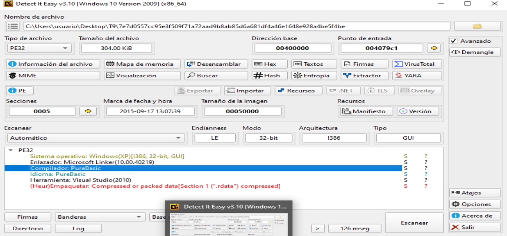

Comprobamos la alerta que detecta Detect It Easy, que marcaba la sección .rdata como posible contenedor de datos comprimidos o empaquetados. Lo comprobamos en Ghidra:


Vamos al inicio de .rdata: En Ghidra --> Ctrl + G -->
```bash
ram:00412000
ram:00418000
ram:00420000
ram:00428000
ram:0042A000
```

Observamos:
```bash
0x00411FFC aprox. → cadenas Unicode/runtime normales
0x00418000 aprox. → bytes opacos de alta entropía
0x00420000 aprox. → bytes opacos de alta entropía
0x00428000 aprox. → bytes opacos de alta entropía
0x0042A000 aprox. → bytes opacos de alta entropía
```

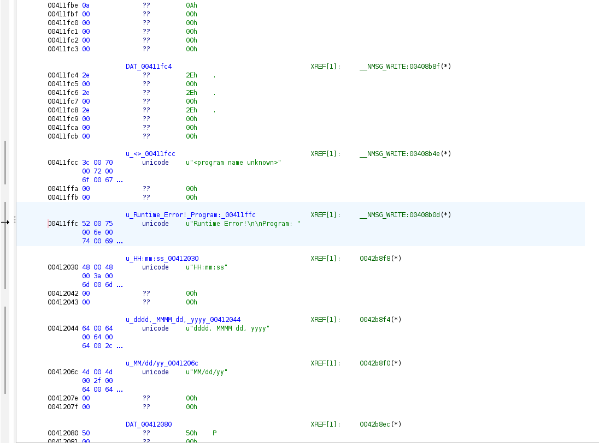

----

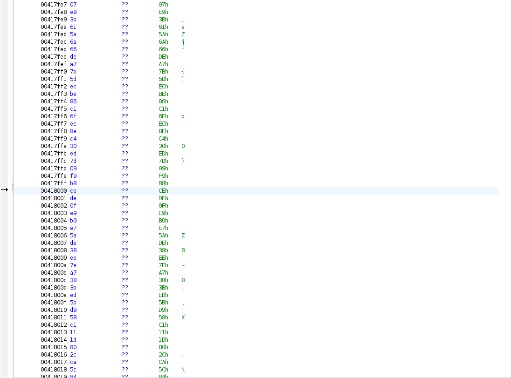


---


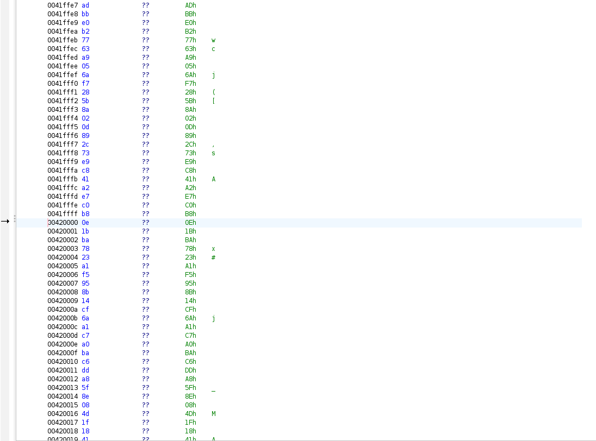


Detect It Easy marca la sección `.rdata` mediante una detección heurística de datos comprimidos o empaquetados. Esta alerta es coherente con la presencia visual, en Ghidra, de regiones extensas de bytes opacos y sin cadenas legibles dentro de dicha sección.

No obstante, la revisión de XREFs sobre varias direcciones representativas del bloque no muestra referencias cruzadas directas desde el código. Por tanto, la región debe clasificarse como un candidato heurístico a datos comprimidos/ofuscados, pero no como payload confirmado.

La detección de DIE es útil para priorizar el análisis de `.rdata`, aunque requiere validación adicional mediante entropía por rangos, extracción de la sección, delimitación exacta del bloque y búsqueda de referencias indirectas.

------

Extraemos rdata:

```bash
└─$ r2 -q -c "s 0x00411000" -c "wt rdata.bin 0x1a000" -c "q" 7e7d0557cc95e3f509f71a72aad9b8ab85d6a681df4a46e1648e928a4be5f4be
WARN: Relocs has not been applied. Please use `-e bin.relocs.apply=true` or `-e bin.cache=true` next time
INFO: Dumped 106496 bytes from 0x00411000 into rdata.bin

```

Analizamos:
```bash

└─$ ls -lh rdata.bin
-rw-rw-r-- 1 xxniwexx xxniwexx 104K jun  3 20:36 rdata.bin
                                                                                                                                                      

└─$ file rdata.bin
rdata.bin: data
                                                                                                                                                      
└─$ xxd -l 64 rdata.bin
00000000: b0aa 0200 a0aa 0200 0000 0000 6caa 0200  ............l...
00000010: 5aaa 0200 50aa 0200 34aa 0200 24aa 0200  Z...P...4...$...
00000020: 18aa 0200 0aaa 0200 faa9 0200 eca9 0200  ................
00000030: e0a9 0200 d0a9 0200 c0a9 0200 aaa9 0200  ................
                                                                                                                                                      
└─$ strings -a -n 6 rdata.bin | head -50
CorExitProcess
bad allocation
Illegal byte sequence
Directory not empty
Function not implemented
No locks available
Filename too long
Resource deadlock avoided
Result too large
Domain error
Broken pipe
Too many links
Read-only file system
Invalid seek
No space left on device
File too large
Inappropriate I/O control operation
Too many open files
Too many open files in system
Invalid argument
Is a directory
Not a directory
No such device
Improper link
File exists
Resource device
Unknown error
Bad address
Permission denied
Not enough space
Resource temporarily unavailable
No child processes
Bad file descriptor
Exec format error
Arg list too long
No such device or address
Input/output error
Interrupted function call
No such process
No such file or directory
Operation not permitted
No error
HH:mm:ss
dddd, MMMM dd, yyyy
MM/dd/yy
December
November
October
September
August

```

La sección `.rdata` se extrajo correctamente en un fichero independiente de `0x1A000` bytes. La inspección inicial del fichero muestra tablas de valores y cadenas asociadas al runtime, errores estándar, formatos de fecha/hora y nombres de meses. Esta zona inicial no presenta indicios de payload embebido ni de datos comprimidos visibles.


----


**Buscamos firmas conocidas:**
```bash

└─$ grep -aob "MZ" rdata.bin
21842:MZ
53210:MZ
69021:MZ
                                                                                                                                                      

└─$ grep -aob "PE" rdata.bin
50777:PE
                                                                                                                                                      

└─$ grep -aob "PK" rdata.bin
764:PK
101898:PK
                                                                                                                                                      

└─$ grep -aob "UPX" rdata.bin
                                                                                                                                                      

└─$ grep -aob "http" rdata.bin 
                                                                                                                                                      

└─$ grep -aob "https" rdata.bin
                                                                                                                                                      

└─$ grep -aob "TPF0" rdata.bin
                                   
```


| Firma buscada | Offset decimal | Offset hex | VA en Ghidra | Interpretación inicial                         |
| ------------- | -------------: | ---------: | -----------: | ---------------------------------------------- |
| `MZ`          |        `21842` |   `0x5552` | `0x00416552` | Candidato a PE embebido, pendiente de validar  |
| `MZ`          |        `53210` |   `0xCFDA` | `0x0041DFDA` | Candidato a PE embebido, pendiente de validar  |
| `MZ`          |        `69021` |  `0x10D9D` | `0x00421D9D` | Candidato a PE embebido, pendiente de validar  |
| `PE`          |        `50777` |   `0xC659` | `0x0041D659` | Puede ser texto casual o parte de estructura   |
| `PK`          |          `764` |    `0x2FC` | `0x004112FC` | Candidato débil; está muy al inicio de runtime |
| `PK`          |       `101898` |  `0x18E0A` | `0x00429E0A` | Candidato a ZIP, pendiente de validar          |


----------------


<div class="page"/>

**Validamos los candidatos MZ:**

Ejecutamos:

```bash
for o in 21842 53210 69021; do
  echo "===== MZ candidate offset $o ====="
  xxd -g 1 -s $o -l 128 rdata.bin
done
```

Obtenemos:
```bash

===== MZ candidate offset 21842 =====
00005552: 4d 5a 18 18 c9 0e 84 bd 6c 02 6d 1c 6e ba 38 ac  MZ......l.m.n.8.
00005562: 7d 79 67 dd 8a 6e 62 90 7e 2b f1 dd 6a 59 a6 58  }yg..nb.~+..jY.X
00005572: 82 2e a1 f1 bc 19 07 02 c3 d8 ea ff 3e f1 38 4a  ............>.8J
00005582: 8c c9 61 83 81 ae 8e 07 fc 85 90 51 2d 00 ff 8f  ..a........Q-...
00005592: b0 59 3e 79 40 9f c6 43 9c 1a 22 0e 31 a6 49 cd  .Y>y@..C..".1.I.
000055a2: e2 6a dc 07 d2 19 8c ba ca da 01 6c c9 25 eb 11  .j.........l.%..
000055b2: aa de ab 86 1a cb cb 84 2b eb 5d d9 7e e4 cf 39  ........+.].~..9
000055c2: 8a ee 84 f2 30 1b 26 4d fe 3b 3a d2 4d 27 da 2e  ....0.&M.;:.M'..
===== MZ candidate offset 53210 =====
0000cfda: 4d 5a 7c 6a f9 59 dd 82 66 b9 79 8f f8 52 18 2b  MZ|j.Y..f.y..R.+
0000cfea: 27 dc 58 bd 7d 5a 1d f0 0e 30 5c 3c a9 d9 87 9e  '.X.}Z...0\<....
0000cffa: 6d d9 bf 92 61 3c e2 a7 51 71 5d 39 98 32 dd ef  m...a<..Qq]9.2..
0000d00a: 86 e1 cf ff bf 1b 03 a5 d0 5f 10 0a bb 81 86 c7  ........._......
0000d01a: 71 c2 ed 59 ef c2 1d 51 de 7b 01 71 c9 27 2f c4  q..Y...Q.{.q.'/.
0000d02a: da 4d d1 3d 01 5b ee 3b 27 bb 1a 3c 71 ba 0f 87  .M.=.[.;'..<q...
0000d03a: 8e 87 ea 9d cc b1 c0 fb 9a 62 e1 84 2b df 2b 03  .........b..+.+.
0000d04a: d0 6d 2f 07 4f 49 7e 9a 2d e2 e0 b9 e6 78 f1 29  .m/.OI~.-....x.)
===== MZ candidate offset 69021 =====
00010d9d: 4d 5a a0 ef 24 7e 55 48 34 53 f9 6d ef ab 64 3c  MZ..$~UH4S.m..d<
00010dad: da 54 7c 90 5c a7 13 5d 07 ab ca 2e 0a 23 a0 8d  .T|.\..].....#..
00010dbd: 6e 5e f8 a3 7b 2b 3d 5e 89 69 22 20 88 a9 7a d3  n^..{+=^.i" ..z.
00010dcd: ce f6 78 24 ef 29 e0 4a 49 ca ee 2c 45 98 d2 05  ..x$.).JI..,E...
00010ddd: cb 3c f1 fb aa 69 86 3f 2d 58 77 04 7a ef 6b ad  .<...i.?-Xw.z.k.
00010ded: 3c 30 67 f1 c9 f1 86 66 98 3a a5 7e 37 09 5b 94  <0g....f.:.~7.[.
00010dfd: d0 4c 28 41 0b eb a0 46 00 7d d6 5d 4c 49 43 89  .L(A...F.}.]LIC.
00010e0d: f0 0b 56 f2 c9 c8 7c 65 6d 6b 6b 6e d5 ea 1c 1c  ..V...|emkkn....
```


| Offset decimal | Offset hex | VA en Ghidra |
| -------------: | ---------: | -----------: |
|        `21842` |   `0x5552` | `0x00416552` |
|        `53210` |   `0xCFDA` | `0x0041DFDA` |
|        `69021` |  `0x10D9D` | `0x00421D9D` |


A simple vista, los tres candidatos empiezan por:

```bash
4D 5A
```

<div class="page"/>

Sin embargo, eso no basta para confirmar un PE embebido. Para validar una cabecera PE real, debe existir un campo e_lfanew válido en el offset MZ + 0x3C, y en la posición MZ + e_lfanew debería aparecer la firma:

```bash
50 45 00 00
```

es decir:

```bash
PE\0\0
```


Durante la revisión de `.rdata`, se localizaron tres ocurrencias de la firma `MZ` en los offsets `0x5552`, `0xCFDA` y `0x10D9D` de `rdata.bin`. Estas direcciones corresponden respectivamente a las VAs `0x00416552`, `0x0041DFDA` y `0x00421D9D`.

Se revisaron manualmente los primeros bytes de cada candidato y se comprobó el campo `e_lfanew`, situado en `MZ + 0x3C`, para validar si las ocurrencias correspondían a cabeceras PE reales. En los tres casos, los valores obtenidos para `e_lfanew` son anómalos y apuntan fuera del rango válido de la sección extraída.

Por tanto, **las ocurrencias `MZ` se consideran falsos positivos derivados de secuencias internas de bytes y no evidencian la existencia de un ejecutable PE embebido dentro de `.rdata`.**

-------


**Revisamos los dos PK:**

```bash
└─$ for o in 764 101898; do
  echo "===== PK candidate offset $o ====="
  xxd -g 1 -s $o -l 64 rdata.bin
done
===== PK candidate offset 764 =====
000002fc: 50 4b 43 00 a8 4b 43 00 49 6c 6c 65 67 61 6c 20  PKC..KC.Illegal 
0000030c: 62 79 74 65 20 73 65 71 75 65 6e 63 65 00 00 00  byte sequence...
0000031c: 44 69 72 65 63 74 6f 72 79 20 6e 6f 74 20 65 6d  Directory not em
0000032c: 70 74 79 00 46 75 6e 63 74 69 6f 6e 20 6e 6f 74  pty.Function not
===== PK candidate offset 101898 =====
00018e0a: 50 4b 0e 4c 00 d9 20 9d 9f 58 48 bd 24 b9 98 c8  PK.L.. ..XH.$...
00018e1a: 32 30 e6 36 cd 4e 35 e9 29 6e 57 b2 79 eb 18 1d  20.6.N5.)nW.y...
00018e2a: 09 b3 7a d2 f4 5a fc 74 b3 a5 9d 27 b4 fa 12 34  ..z..Z.t...'...4
00018e3a: 27 92 70 37 61 00 4f 18 14 51 50 01 a6 7d 07 fa  '.p7a.O..QP..}..
```

                                                          

Durante la búsqueda de posibles archivos comprimidos embebidos en `.rdata`, se localizaron dos ocurrencias de la cadena `PK` en los offsets `0x2FC` y `0x18E0A` de `rdata.bin`.

La primera ocurrencia, en `0x2FC`, corresponde a la dirección virtual `0x004112FC` y aparece dentro de una zona de cadenas de runtime, junto a mensajes como `Illegal byte sequence` y `Directory not empty`. La secuencia observada es `50 4B 43 00`, por lo que no corresponde a una cabecera ZIP válida.

La segunda ocurrencia, en `0x18E0A`, corresponde a la dirección virtual `0x00429E0A`. Aunque se encuentra dentro de una región de apariencia opaca, la secuencia comienza por `50 4B 0E 4C`, que tampoco coincide con las firmas ZIP habituales `50 4B 03 04`, `50 4B 05 06` o `50 4B 07 08`.

Por tanto, ambas ocurrencias `PK` se consideran falsos positivos y no evidencian la presencia de un archivo ZIP embebido dentro de `.rdata`.

-------

**La alerta de DIE sigue siendo relevante, pero ahora la lectura más precisa es: .rdata contiene regiones opacas o de alta entropía, pero no se han identificado cabeceras válidas de PE, ZIP, UPX, URLs ni recursos TPF0.**

----------------

**Confirmamos si esa región opaca tiene alta entropía real:**

```bash
└─$ NUMBA_DISABLE_JIT=1 binwalk -E rdata.bin

DECIMAL       HEXADECIMAL     ENTROPY
--------------------------------------------------------------------------------
0             0x0             Falling entropy edge (0.618235)
8192          0x2000          Falling entropy edge (0.589149)
14336         0x3800          Falling entropy edge (0.830116)
53248         0xD000          Rising entropy edge (0.963085)
80896         0x13C00         Rising entropy edge (0.955441)
90112         0x16000         Rising entropy edge (0.958023)
95232         0x17400         Falling entropy edge (0.740459)
98304         0x18000         Rising entropy edge (0.976983)
102400        0x19000         Falling entropy edge (0.839974)
```

Ahora sí tenemos una explicación sólida de por qué Detect It Easy marcaba .rdata: **La salida de binwalk -E confirma que .rdata contiene zonas de entropía elevada, especialmente a partir de varios offsets. No confirma payload, pero sí confirma que DIE no estaba marcando la sección “porque sí”.**

-------

**Validación de la alerta heurística de Detect It Easy sobre `.rdata`**

Tras la alerta de Detect It Easy, que marcaba la sección `.rdata` como posible contenedor de datos comprimidos o empaquetados, se extrajo dicha sección a un fichero independiente `rdata.bin` de `0x1A000` bytes.

El análisis inicial con `strings` mostró que el comienzo de la sección contiene cadenas normales asociadas al runtime, mensajes de error estándar y formatos de fecha/hora. Sin embargo, la revisión visual en Ghidra y el cálculo de entropía con `binwalk -E` confirmaron la existencia de regiones opacas con entropía elevada.

Los puntos más relevantes detectados fueron:

| Offset en `rdata.bin` | Dirección virtual | Tipo | Entropía |
|---:|---:|---|---:|
| `0x0D000` | `0x0041E000` | Rising entropy edge | `0.963085` |
| `0x13C00` | `0x00424C00` | Rising entropy edge | `0.955441` |
| `0x16000` | `0x00427000` | Rising entropy edge | `0.958023` |
| `0x18000` | `0x00429000` | Rising entropy edge | `0.976983` |

Estos valores indican la presencia de zonas con alta entropía dentro de `.rdata`, compatibles con datos comprimidos, cifrados u ofuscados. Esta evidencia permite explicar la alerta heurística de Detect It Easy.

No obstante, se realizaron búsquedas de firmas conocidas dentro de `rdata.bin`, incluyendo `MZ`, `PE`, `PK`, `UPX`, `http`, `https` y `TPF0`. Aunque se localizaron algunas ocurrencias de `MZ`, `PE` y `PK`, su validación estructural descartó que correspondieran a cabeceras PE o ZIP válidas.

Por tanto, **`.rdata` se clasifica como una sección con regiones de alta entropía y datos opacos, pero sin evidencia confirmada de payload PE embebido, archivo ZIP, UPX, URLs en claro o recursos Delphi serializados.**


-------------


<div class="page"/>


### **2.2.2 Conclusión de la desofuscación**

El plugin de desofuscación universal permitió recuperar **140 cadenas directas** distribuidas principalmente entre `.rdata`, `.data` y `.rsrc`. Los resultados corresponden a cadenas ASCII y UTF-16 visibles directamente en el binario.

No se identificaron cadenas descifradas mediante XOR ni indicadores C2 en texto claro. Por tanto, la ejecución del plugin no revela una configuración maliciosa directamente recuperable, pero sí confirma que el binario conserva numerosas cadenas legibles relacionadas con APIs, librerías, runtime, recursos y metadatos.

Desde el punto de vista de la desofuscación, el hallazgo principal es que la muestra presenta una **ofuscación parcial**: mantiene visibles muchas cadenas operativas y de recursos, pero no expone de forma directa indicadores sensibles como dominios, URLs, IPs o parámetros de comunicación.

La siguiente fase debería centrarse en revisar manualmente posibles blobs en `.rsrc`, `.rdata` o `.data`, así como localizar rutinas internas que apliquen descifrado, decodificación o reconstrucción dinámica de cadenas no recuperadas por el plugin.

```
Conclusiones:
1. Resultados principalmente direct/ascii y direct/utf16.
2. 140 cadenas recuperadas.
3. No aparecen URLs, dominios, C2, PHPSESSID, http/https ni strings de red.
4. .rsrc revisado manualmente:
   - No hay payload PE.
   - No hay ZIP.
   - No hay blob cifrado evidente.
   - Hay diálogos y formularios Delphi/C++Builder TPF0.
5. .rdata marcada por DIE como comprimida/packed.
6. .rdata contiene regiones de alta entropía.
7. Las firmas MZ/PE/PK localizadas no validan como cabeceras reales.
8. No hay XREFs directas hacia las zonas opacas revisadas.
````

El desofuscador universal no recupera configuración maliciosa ni cadenas C2 en claro. La revisión manual de `.rsrc` descarta payloads embebidos evidentes, y la revisión de `.rdata` confirma regiones de alta entropía compatibles con datos opacos, aunque sin evidencia estructural de PE, ZIP, UPX o URLs. Por tanto, la muestra presenta indicios de ofuscación parcial, pero no se ha identificado aún un payload desempaquetado directamente recuperable desde recursos o cadenas.

--------

## **2.3 Capacidades de la muestra**

Para identificar las capacidades potenciales de la muestra se utilizó el plugin **[CAPA para Ghidra](https://github.com/soniasalido/cybersecurity/blob/main/Documentation/Malware/Master-ENIIT-Analisis-Malware-Reversing/modulo-4-vulnerabilidades-herramientas-analisis-malware/2-M4-Tarea-Colaborativa/tarea2.md)**, ejecutado directamente sobre el binario. El resultado del análisis fue exportado al fichero **[capacidades-muestra.txt](https://github.com/soniasalido/cybersecurity/blob/main/Documentation/Malware/Master-ENIIT-Analisis-Malware-Reversing/modulo-9-tecnicas-de-analisis-de-malware/9-M9T9/utiles/capacidades-muestra.txt)**, que contiene las reglas coincidentes detectadas por CAPA a partir del análisis estático del ejecutable.

CAPA permite detectar comportamientos de alto nivel a partir de patrones de código, llamadas a APIs, constantes, estructuras y características reconocibles dentro del binario. En este caso, el análisis se realizó sobre una muestra PE de Windows de arquitectura x86, empleando Ghidra como extractor.

Los metadatos principales del análisis CAPA son los siguientes:

| Campo                          | Valor                                                              |
| ------------------------------ | ------------------------------------------------------------------ |
| Herramienta                    | CAPA para Ghidra                                                   |
| Versión de CAPA                | `9.2.1`                                                            |
| Tipo de análisis               | Estático                                                           |
| Extractor                      | Ghidra                                                             |
| Formato                        | Portable Executable PE                                             |
| Sistema operativo              | Windows                                                            |
| Arquitectura                   | x86                                                                |
| Dirección base                 | `0x400000`                                                         |
| Número de funciones analizadas | `260`                                                              |
| Número total de features       | `15472`                                                            |
| MD5                            | `9724934a3ed3a92b38b89fe7a2e9b6fd`                                 |
| SHA-256                        | `7e7d0557cc95e3f509f71a72aad9b8ab85d6a681df4a46e1648e928a4be5f4be` |

El resultado obtenido permite identificar distintas capacidades relevantes desde el punto de vista del análisis de malware. Estas capacidades no deben interpretarse de forma aislada como prueba definitiva de comportamiento malicioso, pero sí como indicadores técnicos que orientan el análisis manual posterior.

**Capacidades detectadas**

| Categoría              | Capacidad detectada                       | APIs / Indicadores relevantes                                     | Interpretación                                                                                                      |
| ---------------------- | ----------------------------------------- | ----------------------------------------------------------------- | ------------------------------------------------------------------------------------------------------------------- |
| Anti-análisis          | Retraso de ejecución                      | `Sleep`                                                           | Puede emplearse para ralentizar el análisis dinámico o evadir sandboxes con tiempo de ejecución limitado.           |
| Anti-análisis          | Referencias a herramientas de análisis    | Cadenas relacionadas con IDA                                      | Puede indicar presencia de cadenas o artefactos usados para detectar entornos de análisis.                          |
| Sistema de archivos    | Crear o abrir ficheros                    | `fopen`, `CreateFile`                                             | Capacidad para interactuar con el sistema de archivos local.                                                        |
| Sistema de archivos    | Lectura de ficheros                       | `fread`, `_read`, `ReadFile`                                      | Puede utilizarse para leer configuración, recursos, payloads o datos del sistema.                                   |
| Sistema de archivos    | Escritura de ficheros                     | `WriteFile`, permisos `FILE_WRITE_DATA`, `GENERIC_WRITE`          | Compatible con dropper, creación de payloads, escritura de configuración o modificación de archivos.                |
| Sistema de archivos    | Borrado de ficheros                       | `DeleteFile`                                                      | Puede utilizarse para eliminar rastros, limpiar artefactos temporales o reemplazar archivos.                        |
| Recursos PE            | Extracción de recursos                    | `FindResource`, `LoadResource`, `SizeofResource`                  | Indica posible uso de recursos embebidos, como payloads, configuración o datos cifrados.                            |
| Captura de información | Captura de pantalla                       | `GetDC`, `BitBlt`, `CreateCompatibleDC`, `CreateCompatibleBitmap` | Capacidad de obtener contenido gráfico de la pantalla del usuario.                                                  |
| Descubrimiento         | Información del sistema                   | `GetSystemInfo`                                                   | Permite obtener información del entorno de ejecución, arquitectura o características del sistema.                   |
| Descubrimiento         | Variables de entorno                      | `GetEnvironmentStrings`                                           | Puede utilizarse para adaptar el comportamiento al entorno de la víctima.                                           |
| Descubrimiento         | Rutas comunes del sistema                 | `GetWindowsDirectory`                                             | Permite localizar directorios del sistema para leer, copiar o desplegar archivos.                                   |
| Descubrimiento GUI     | Búsqueda de ventanas                      | `FindWindow`                                                      | Puede utilizarse para localizar aplicaciones concretas o comprobar si ciertos programas están abiertos.             |
| Descubrimiento GUI     | Obtención de texto de ventanas            | `GetWindowText`                                                   | Capacidad asociada al reconocimiento de ventanas y aplicaciones activas.                                            |
| Ejecución              | Argumentos de línea de comandos           | `GetCommandLine`                                                  | La muestra puede modificar su comportamiento en función de parámetros recibidos.                                    |
| Procesos               | Terminación de procesos                   | `ExitProcess`, `TerminateProcess`, `exit`                         | Permite finalizar el propio proceso u otros procesos abiertos por la muestra.                                       |
| Threads / TLS          | Uso de almacenamiento local de hilos      | `TlsAlloc`, `TlsGetValue`, `TlsSetValue`                          | Indica gestión interna de datos por hilo, habitual en programas complejos o con rutinas auxiliares.                 |
| Carga dinámica         | Resolución de APIs en tiempo de ejecución | `GetProcAddress`                                                  | Técnica habitual para ocultar imports reales o resolver funciones solo durante la ejecución.                        |
| Carga de código        | Parsing de cabecera PE                    | Comprobaciones de `MZ` y `PE`                                     | Puede indicar manipulación, carga o validación de ejecutables PE en memoria.                                        |
| Flujo de control       | Bucles numerosos                          | 73 coincidencias de estructuras de bucle                          | Indica presencia de rutinas iterativas, potencialmente relacionadas con procesamiento, descifrado o copia de datos. |

**Interpretación de las capacidades**

El conjunto de capacidades detectadas es coherente con una muestra que no se limita a ejecutar una única acción simple, sino que presenta comportamiento más complejo. La presencia de acceso a ficheros, extracción de recursos, resolución dinámica de APIs y parsing de cabeceras PE resulta especialmente relevante en el contexto de una muestra clasificada previamente como posible **dropper** o **loader**.

La detección de APIs como `FindResource`, `LoadResource` y `SizeofResource` sugiere que el binario podría utilizar recursos embebidos. Este patrón es habitual en malware que almacena dentro del propio ejecutable datos adicionales, configuración cifrada, módulos comprimidos o payloads que posteriormente son extraídos, decodificados o cargados durante la ejecución.

Asimismo, la presencia de múltiples operaciones de lectura y escritura de ficheros indica que la muestra tiene capacidad para interactuar de forma activa con el sistema de archivos. Esto puede estar relacionado con la creación de archivos temporales, despliegue de componentes adicionales, escritura de configuración, copia de sí misma o eliminación de artefactos.

La capacidad de **captura de pantalla** es especialmente significativa. CAPA identifica el uso de APIs gráficas como `GetDC`, `BitBlt`, `CreateCompatibleDC` y `CreateCompatibleBitmap`, que pueden emplearse para capturar contenido visual del escritorio o de ventanas activas. En una familia de malware bancario como Vawtrak/Neverquest, esta capacidad resulta coherente con actividades de robo de información, vigilancia de sesiones o captura de datos sensibles mostrados en pantalla.

También se detectan capacidades de **descubrimiento del sistema**, como la consulta de información del sistema mediante `GetSystemInfo`, la obtención de variables de entorno mediante `GetEnvironmentStrings` y la localización del directorio de Windows con `GetWindowsDirectory`. Estas acciones pueden permitir a la muestra adaptar su comportamiento al entorno de ejecución, identificar rutas relevantes o preparar operaciones posteriores.

Otro indicador relevante es la interacción con la interfaz gráfica del sistema. Las APIs `FindWindow` y `GetWindowText` permiten localizar ventanas y obtener texto asociado a ellas. Esta funcionalidad puede utilizarse para identificar aplicaciones abiertas, detectar herramientas de análisis, localizar navegadores, reconocer ventanas bancarias o condicionar la ejecución en función del entorno.

Desde la perspectiva de evasión, CAPA detecta una capacidad de **retraso de ejecución** asociada a la API `Sleep`. Esta técnica puede utilizarse para dificultar el análisis dinámico, especialmente en sandboxes automatizadas con ventanas de observación limitadas. Además, se identifican referencias a cadenas asociadas a herramientas de análisis, lo que puede indicar una posible intención de reconocer entornos de reversing o depuración.

La muestra también presenta resolución dinámica de funciones mediante `GetProcAddress`. Esta técnica es habitual en malware porque reduce la visibilidad de imports estáticos y permite cargar funciones únicamente en tiempo de ejecución. En combinación con el uso de APIs de recursos y el parsing de cabeceras PE, esta capacidad refuerza la hipótesis de que el binario pueda cargar, validar o preparar código adicional en memoria.

Finalmente, CAPA detecta funciones relacionadas con almacenamiento local de hilos mediante `TlsAlloc`, `TlsGetValue` y `TlsSetValue`, así como rutinas de terminación de procesos mediante `TerminateProcess`, `ExitProcess` y `exit`. Estas capacidades sugieren una lógica interna relativamente compleja y la posibilidad de controlar diferentes rutas de ejecución en función del contexto.

**Relación con técnicas MITRE ATT&CK**

Algunas de las capacidades identificadas por CAPA se corresponden con técnicas reconocidas en MITRE ATT&CK:

| Técnica | Nombre                            | Evidencia observada                                                        |
| ------- | --------------------------------- | -------------------------------------------------------------------------- |
| `T1059` | Command and Scripting Interpreter | Uso de `GetCommandLine` para aceptar argumentos de línea de comandos       |
| `T1082` | System Information Discovery      | Uso de `GetSystemInfo` y consulta de variables de entorno                  |
| `T1083` | File and Directory Discovery      | Obtención de rutas comunes como el directorio de Windows                   |
| `T1010` | Application Window Discovery      | Uso de `FindWindow` y `GetWindowText`                                      |
| `T1113` | Screen Capture                    | Uso de `GetDC`, `BitBlt`, `CreateCompatibleDC` y `CreateCompatibleBitmap`  |
| `T1129` | Shared Modules                    | Resolución dinámica de funciones mediante `GetProcAddress` y parsing de PE |

**Conclusión del análisis de capacidades**

El análisis con CAPA muestra que la muestra posee capacidades compatibles con un malware de Windows con funcionalidad de **dropper**, **loader** y posible **robo de información**. Entre los indicadores más relevantes se encuentran la extracción de recursos, la escritura de ficheros, la resolución dinámica de APIs, el parsing de cabeceras PE, la captura de pantalla y el descubrimiento de ventanas del sistema.

Estas capacidades son coherentes con la hipótesis inicial de que la muestra pertenece o está relacionada con **Vawtrak/Neverquest**, familia de malware bancario que suele emplear técnicas de ofuscación, carga modular, robo de información y comunicación con infraestructura C2.

Como siguiente paso, se recomienda revisar manualmente en Ghidra las funciones señaladas por CAPA, especialmente las relacionadas con:

* Extracción de recursos en torno a la función `0x401170`.
* Captura de pantalla y APIs gráficas.
* Resolución dinámica mediante `GetProcAddress`.
* Parsing de cabeceras PE en las funciones `0x407854` y `0x40BBB0`.
* Escritura de ficheros y posible despliegue de payload.
* Rutinas de retardo o anti-análisis asociadas a `Sleep`.

De este modo, CAPA proporciona una guía inicial de alto valor para priorizar el análisis manual y localizar las zonas del binario con mayor interés técnico.


-----------------

<div class="page"/>

## **2.4 FLOSS**

Para complementar la extracción de cadenas de la muestra se utilizó **FLOSS**, herramienta desarrollada por FLARE orientada a la identificación de cadenas en binarios potencialmente ofuscados. A diferencia de la herramienta clásica `strings`, FLOSS permite recuperar no solo cadenas estáticas, sino también posibles **stack strings**, **tight strings** y cadenas decodificadas mediante rutinas internas del binario.

El análisis se ejecutó sobre la muestra mediante el siguiente comando:

```bash id="s298j3"
└─$ floss ~/Escritorio/muestras-malware/ENIIT/M9/T9/7e7d0557cc95e3f509f71a72aad9b8ab85d6a681df4a46e1648e928a4be5f4be > ~/Escritorio/muestras-malware/ENIIT/M9/T9/floss-M9T9.json
```

El resultado fue almacenado en el fichero **[floss-M9T9.json](https://github.com/soniasalido/cybersecurity/blob/main/Documentation/Malware/Master-ENIIT-Analisis-Malware-Reversing/modulo-9-tecnicas-de-analisis-de-malware/9-M9T9/utiles/floss-M9T9.json)**, utilizado posteriormente para revisar las cadenas extraídas y localizar posibles indicadores de interés.

**Resumen del resultado**

El análisis de FLOSS identifica un volumen elevado de cadenas estáticas, pero no consigue recuperar cadenas dinámicas, stack strings ni cadenas decodificadas automáticamente.

| Tipo de cadena               | Resultado |
| ---------------------------- | --------: |
| Static strings               |    `3525` |
| Caracteres en static strings |   `27051` |
| Language strings             |       `0` |
| Stack strings                |       `0` |
| Tight strings                |       `0` |
| Decoded strings              |       `0` |
| Static strings ASCII         |    `3346` |

Este resultado indica que la mayor parte de las cadenas recuperables por FLOSS se encuentran directamente presentes en el binario como cadenas estáticas. Sin embargo, el hecho de que no se hayan recuperado cadenas decodificadas no descarta que la muestra utilice cifrado u ofuscación interna. FLOSS puede no identificar todas las rutinas de decodificación si estas son complejas, si dependen de condiciones de ejecución o si el binario emplea mecanismos personalizados.


<div class="page"/>

**Cadenas relacionadas con la estructura PE**

Entre las primeras cadenas recuperadas aparecen elementos característicos de un ejecutable PE de Windows:

```text id="hwf3lm"
!This program cannot be run in DOS mode.
Rich
.text
.rdata
.data
.rsrc
.reloc
```

Estas cadenas confirman nuevamente que la muestra corresponde a un binario PE convencional. La presencia de secciones como `.text`, `.rdata`, `.data`, `.rsrc` y `.reloc` es coherente con lo observado en apartados anteriores mediante herramientas como `file`, `exiftool` y `rabin2`.

La presencia de la sección `.rsrc` resulta especialmente relevante, ya que en muestras de tipo dropper o loader los recursos pueden emplearse para almacenar payloads embebidos, configuración cifrada, datos comprimidos o componentes auxiliares.

**Cadenas asociadas al runtime y compilación**

FLOSS también recupera numerosas cadenas relacionadas con estructuras internas de C/C++ y del runtime de Microsoft Visual C++, entre ellas referencias a RTTI, constructores, destructores, operadores y excepciones:

```text id="fyifk1"
Complete Object Locator
Class Hierarchy Descriptor
Base Class Array
Base Class Descriptor
Type Descriptor
RTTI
operator delete
operator new
bad_alloc
exception
```

Estas cadenas sugieren que el binario fue compilado con soporte de runtime C/C++ y conserva artefactos propios de este entorno. Aunque estas cadenas no son maliciosas por sí mismas, ayudan a contextualizar la muestra y pueden ser útiles durante el análisis en Ghidra para identificar estructuras, clases, funciones auxiliares o código generado por el compilador.

**Cadenas relacionadas con sistema de archivos y recursos**

Entre las APIs recuperadas por FLOSS aparecen varias funciones relacionadas con acceso a ficheros, gestión de memoria y manipulación de recursos PE:

```text id="b4fo2p"
CreateFileA
CreateFileW
ReadFile
WriteFile
DeleteFileA
FindResourceA
LoadResource
SizeofResource
HeapAlloc
HeapFree
HeapCreate
HeapReAlloc
GetProcessHeap
```

Estas cadenas refuerzan algunas de las capacidades previamente detectadas por CAPA. En particular, las funciones `FindResourceA`, `LoadResource` y `SizeofResource` resultan relevantes porque indican que la muestra puede acceder a datos embebidos dentro de la sección de recursos.

Este comportamiento es compatible con un posible **dropper**, ya que el malware podría almacenar un payload o configuración dentro del propio ejecutable y extraerlo durante la ejecución. Las funciones de lectura y escritura de ficheros también son coherentes con operaciones de despliegue, creación de archivos temporales, escritura de componentes adicionales o eliminación de rastros.

**Cadenas relacionadas con carga dinámica de código**

FLOSS identifica funciones asociadas a carga dinámica y resolución de APIs en tiempo de ejecución:

```text id="e810xu"
GetProcAddress
LoadLibraryA
LoadLibraryW
GetModuleHandleW
GetModuleFileNameA
GetModuleFileNameW
DecodePointer
EncodePointer
```

La presencia de `GetProcAddress` y `LoadLibraryA/W` es especialmente significativa. Estas funciones permiten resolver dinámicamente direcciones de APIs durante la ejecución, reduciendo la visibilidad del comportamiento real en la tabla de imports estática.

En malware, esta técnica se utiliza frecuentemente para dificultar el análisis estático, ocultar llamadas sensibles o cargar librerías únicamente cuando son necesarias. En el contexto de esta muestra, dicha capacidad es coherente con la hipótesis de un binario ofuscado o con comportamiento de loader.

**Cadenas relacionadas con interfaz gráfica y ventanas**

El resultado de FLOSS contiene numerosas APIs de `USER32.dll`, relacionadas con manipulación de ventanas, obtención de texto, mensajes y elementos gráficos:

```text id="npnd01"
USER32.dll
FindWindowA
GetWindowTextA
GetWindowLongA
GetWindowWord
GetWindow
GetParent
GetDlgItem
GetClassNameA
SetWindowTextA
SetDlgItemTextA
SendMessageA
PostQuitMessage
EnumChildWindows
IsWindowVisible
CreateWindowExA
DefWindowProcA
DefMDIChildProcA
```

Estas cadenas indican que la muestra tiene capacidad para interactuar con ventanas del sistema o de aplicaciones abiertas. Este tipo de funcionalidad puede utilizarse para identificar ventanas concretas, obtener textos visibles, enumerar controles o adaptar el comportamiento del binario al entorno gráfico de la víctima.

En el contexto de malware bancario, la interacción con ventanas puede resultar relevante para detectar navegadores, aplicaciones de interés, ventanas activas o herramientas de análisis.

**Cadenas relacionadas con captura gráfica**

También se identifican APIs de `GDI32.dll` relacionadas con dibujo, contexto gráfico y copia de contenido de pantalla:

```text id="bxi86m"
GDI32.dll
GetDC
ReleaseDC
CreateCompatibleDC
CreateCompatibleBitmap
BitBlt
SelectObject
DeleteObject
DeleteDC
CreateDCA
GetDeviceCaps
DrawTextA
DrawIconEx
SetBkColor
SetTextColor
```

La presencia de `GetDC`, `CreateCompatibleDC`, `CreateCompatibleBitmap` y `BitBlt` es especialmente relevante, ya que estas funciones pueden utilizarse para realizar capturas de pantalla o copiar contenido gráfico desde una ventana o desde el escritorio.

Esta observación coincide con la capacidad de **screen capture** detectada previamente por CAPA y resulta coherente con un malware orientado al robo de información.

**Cadenas relacionadas con descubrimiento del entorno**

FLOSS recupera varias APIs orientadas a obtener información del sistema y del entorno de ejecución:

```text id="p5ubam"
GetSystemInfo
GetWindowsDirectoryA
GetEnvironmentStringsW
FreeEnvironmentStringsW
GetCommandLineA
GetCurrentProcess
GetCurrentProcessId
GetCurrentThreadId
GetSystemTimeAsFileTime
GetTickCount
QueryPerformanceCounter
IsProcessorFeaturePresent
```

Estas funciones pueden emplearse para recopilar información básica del sistema, localizar rutas relevantes, identificar el proceso actual, obtener argumentos de ejecución o medir tiempos.

En malware, este tipo de información puede utilizarse para adaptar el comportamiento a la arquitectura, entorno, usuario o configuración del sistema comprometido. También puede formar parte de rutinas de evasión o comprobaciones anti-sandbox.

**Cadenas relacionadas con anti-análisis y control de ejecución**

Entre las cadenas recuperadas destacan algunas APIs asociadas a control de errores, depuración y retardo de ejecución:

```text id="brlzw1"
IsDebuggerPresent
SetUnhandledExceptionFilter
UnhandledExceptionFilter
TerminateProcess
ExitProcess
Sleep
RaiseException
```

La función `IsDebuggerPresent` es un indicador clásico de comprobación anti-debug. Su presencia no demuestra por sí sola que la muestra ejecute técnicas anti-análisis, pero sí justifica revisar sus referencias cruzadas en Ghidra para comprobar si se utiliza para modificar el flujo de ejecución cuando detecta un depurador.

La función `Sleep` puede utilizarse legítimamente, pero en malware también es frecuente como técnica simple de evasión frente a sandboxes, especialmente cuando se introducen retardos antes de activar el comportamiento malicioso.

**Cadenas no recuperadas o ausentes**

En el resultado de FLOSS no se observan cadenas decodificadas automáticamente ni indicadores de red evidentes, como URLs completas, dominios, rutas HTTP o parámetros C2 visibles. Tampoco se recuperan cadenas dinámicas mediante las categorías de stack strings o tight strings.

Este resultado puede interpretarse de varias formas:

* La configuración de red podría no estar presente en texto claro.
* Las cadenas relevantes podrían estar cifradas, comprimidas u ofuscadas.
* El payload principal podría encontrarse embebido en recursos u otra sección.
* La muestra podría actuar como primera etapa y descargar o cargar componentes adicionales.
* Las rutinas de decodificación podrían no haber sido reconocidas automáticamente por FLOSS.

Por tanto, la ausencia de URLs o dominios visibles no reduce necesariamente la peligrosidad de la muestra. En una familia como Vawtrak/Neverquest, es habitual que configuración, cadenas sensibles y datos de comunicación se encuentren codificados o protegidos.

**Conclusión del análisis con FLOSS**

El análisis con FLOSS permite confirmar la presencia de un conjunto amplio de cadenas estáticas relacionadas con APIs de Windows, manipulación de ficheros, recursos PE, carga dinámica de librerías, interacción con ventanas, captura gráfica, descubrimiento del sistema y posibles técnicas anti-análisis.

No se han recuperado cadenas decodificadas automáticamente, stack strings ni tight strings, lo que sugiere que FLOSS no ha identificado rutinas simples de construcción o decodificación de cadenas. Sin embargo, la presencia de APIs como `FindResourceA`, `LoadResource`, `GetProcAddress`, `LoadLibraryA`, `BitBlt`, `FindWindowA` e `IsDebuggerPresent` refuerza la hipótesis de que la muestra puede actuar como un binario con capacidades de loader, extracción de recursos, reconocimiento del entorno, captura de información y evasión básica.

Como siguiente paso, se recomienda revisar manualmente en Ghidra las referencias cruzadas a las siguientes funciones:

```text id="n105vy"
FindResourceA
LoadResource
SizeofResource
GetProcAddress
LoadLibraryA
IsDebuggerPresent
Sleep
BitBlt
CreateCompatibleBitmap
FindWindowA
GetWindowTextA
WriteFile
CreateFileA
```

El objetivo será determinar si estas APIs forman parte de rutinas legítimas del runtime, de funcionalidad auxiliar o de código específico malicioso relacionado con extracción de payload, captura de información, evasión o carga dinámica de código.


------------------------

## **2.5 Strings**
```
└─$ strings -a -n 4 7e7d0557cc95e3f509f71a72aad9b8ab85d6a681df4a46e1648e928a4be5f4be > scrings-ascii.txt 

└─$ strings -a -el -n 4 7e7d0557cc95e3f509f71a72aad9b8ab85d6a681df4a46e1648e928a4be5f4be > strings_unicode.txt
```


[Strings ASCII](https://github.com/soniasalido/cybersecurity/blob/main/Documentation/Malware/Master-ENIIT-Analisis-Malware-Reversing/modulo-9-tecnicas-de-analisis-de-malware/9-M9T9/utiles/strings-ascii.txt)

[Strings UNICODE](https://github.com/soniasalido/cybersecurity/blob/main/Documentation/Malware/Master-ENIIT-Analisis-Malware-Reversing/modulo-9-tecnicas-de-analisis-de-malware/9-M9T9/utiles/strings_unicode.txt)

------

# **3. Validación de la estructura PE**

## **3.1 Secciones**

**A) Pecheck**

```
└─$ python3 pecheck.py ~/Escritorio/muestras-malware/ENIIT/M9/T9/7e7d0557cc95e3f509f71a72aad9b8ab85d6a681df4a46e1648e928a4be5f4be > ~/Escritorio/muestras-malware/ENIIT/M9/T9/pecheck-7e7d05.txt 
```

Obtenemos el fichero [pecheck-7e7d05.txt](https://github.com/soniasalido/cybersecurity/blob/main/Documentation/Malware/Master-ENIIT-Analisis-Malware-Reversing/modulo-9-tecnicas-de-analisis-de-malware/9-M9T9/utiles/pecheck-7e7d05.txt)


**B) objdump**

```
└─$ objdump -h ~/Escritorio/muestras-malware/ENIIT/M9/T9/7e7d0557cc95e3f509f71a72aad9b8ab85d6a681df4a46e1648e928a4be5f4be

/home/xxniwexx/Escritorio/muestras-malware/ENIIT/M9/T9/7e7d0557cc95e3f509f71a72aad9b8ab85d6a681df4a46e1648e928a4be5f4be:     formato del fichero pei-i386

Secciones:
Idx Name          Size      VMA       LMA       File off  Algn
  0 .text         0000f5fd  00401000  00401000  00000400  2**2
                  CONTENTS, ALLOC, LOAD, READONLY, CODE
  1 .rdata        00019f98  00411000  00411000  0000fa00  2**2
                  CONTENTS, ALLOC, LOAD, READONLY, DATA
  2 .data         00009c00  0042b000  0042b000  00029a00  2**2
                  CONTENTS, ALLOC, LOAD, DATA
  3 .rsrc         00015f08  00437000  00437000  00033600  2**2
                  CONTENTS, ALLOC, LOAD, READONLY, DATA
  4 .reloc        00002900  0044d000  0044d000  00049600  2**2
                  CONTENTS, LOAD, READONLY, DATA
```


## **3.3 Data Directories**

Obtenemos el fichero: [directories_malware.txt](https://github.com/soniasalido/cybersecurity/blob/main/Documentation/Malware/Master-ENIIT-Analisis-Malware-Reversing/modulo-9-tecnicas-de-analisis-de-malware/9-M9T9/utiles/directories_malware.txt)


## **3.4 Firma digital y Rich Header**

```
└─$ sed -n '/^Signature:/,/^PEiD:/p' pecheck-7e7d05.txt                                                 
Signature:
 No signature

PEiD:
                                                                                                                                                     
┌──(xxniwexx㉿kali)-[~/…/muestras-malware/ENIIT/M9/T9]
└─$ grep -A20 -Ei "^Signature:|No signature|Signature size|Signature .* hash|pyasn1" pecheck-7e7d05.txt 
Signature:
 No signature

PEiD:
Error: signature database missing
Entry point:
ep:          0x000079c1
ep address:  0x004079c1
Section:     .text
ep offset:   0x00006dc1

TLS Callbacks:
 No TLS

Overlay:
 No overlay

```

-------

<div class="page"/>

# **4. Análisis de empaquetado y posible desempaquetado**

## **4.1 UPX**  
```
└─$ upx -t 7e7d0557cc95e3f509f71a72aad9b8ab85d6a681df4a46e1648e928a4be5f4be 
                       Ultimate Packer for eXecutables
                          Copyright (C) 1996 - 2024
UPX 4.2.4       Markus Oberhumer, Laszlo Molnar & John Reiser    May 9th 2024

upx: 7e7d0557cc95e3f509f71a72aad9b8ab85d6a681df4a46e1648e928a4be5f4be: NotPackedException: not packed by UPX

Tested 0 files.
```

```
└─$ upx -d 7e7d0557cc95e3f509f71a72aad9b8ab85d6a681df4a46e1648e928a4be5f4be -o muestra_unpacked.exe
                       Ultimate Packer for eXecutables
                          Copyright (C) 1996 - 2024
UPX 4.2.4       Markus Oberhumer, Laszlo Molnar & John Reiser    May 9th 2024

        File size         Ratio      Format      Name
   --------------------   ------   -----------   -----------
upx: 7e7d0557cc95e3f509f71a72aad9b8ab85d6a681df4a46e1648e928a4be5f4be: NotPackedException: not packed by UPX

Unpacked 0 files.
```


## **4.2 Secciones**  
Para valorar si la muestra presenta indicios de empaquetado, compresión u ofuscación estructural, revisamos la tabla de secciones PE mediante rabin2 y se contrastó con la identificación realizada por Detect It Easy mediante diec.

Ejecutamos el siguiente comando:

```bash
rabin2 -S 7e7d0557cc95e3f509f71a72aad9b8ab85d6a681df4a46e1648e928a4be5f4be
```

El resultado obtenido fue:

```text
nth paddr          size vaddr         vsize perm flags      type name
0   0x00000400   0xf600 0x00401000  0x10000 -r-x 0x60000020 ---- .text
1   0x0000fa00  0x1a000 0x00411000  0x1a000 -r-- 0x40000040 ---- .rdata
2   0x00029a00   0x9c00 0x0042b000   0xc000 -rw- 0xc0000040 ---- .data
3   0x00033600  0x16000 0x00437000  0x16000 -r-- 0x40000040 ---- .rsrc
4   0x00049600   0x2a00 0x0044d000   0x3000 -r-- 0x42000040 ---- .reloc
```

<div class="page"/>

La muestra contiene cinco secciones PE:

| Nº | Sección  | Offset físico | Tamaño raw | VA           | Tamaño virtual | Permisos | Interpretación        |
| -- | -------- | ------------- | ---------- | ------------ | -------------- | -------- | --------------------- |
| 0  | `.text`  | `0x400`       | `0xF600`   | `0x00401000` | `0x10000`      | `-r-x`   | Código ejecutable     |
| 1  | `.rdata` | `0xFA00`      | `0x1A000`  | `0x00411000` | `0x1A000`      | `-r--`   | Datos de solo lectura |
| 2  | `.data`  | `0x29A00`     | `0x9C00`   | `0x0042B000` | `0xC000`       | `-rw-`   | Datos modificables    |
| 3  | `.rsrc`  | `0x33600`     | `0x16000`  | `0x00437000` | `0x16000`      | `-r--`   | Recursos              |
| 4  | `.reloc` | `0x49600`     | `0x2A00`   | `0x0044D000` | `0x3000`       | `-r--`   | Relocaciones          |

**Análisis estructural de secciones**

La estructura de secciones es relativamente convencional para un ejecutable PE de Windows. Se observan nombres estándar como `.text`, `.rdata`, `.data`, `.rsrc` y `.reloc`, sin nombres típicos de packers conocidos como `UPX0`, `UPX1`, `ASPack`, `MPRESS`, `.packed` o secciones con nombres aleatorios.

La sección `.text` tiene permisos de lectura y ejecución (`-r-x`), lo cual es esperable para la zona de código. Su tamaño raw es `0xF600`, mientras que su tamaño virtual es `0x10000`. Esta diferencia es pequeña y compatible con alineación normal de secciones, por lo que no representa por sí sola un indicador fuerte de empaquetado.

La sección `.rdata` presenta un tamaño considerable de `0x1A000` bytes y permisos de solo lectura (`-r--`). Esta sección ya había sido marcada previamente por Detect It Easy mediante heurística como posible contenedor de datos comprimidos o empaquetados. Además, durante la revisión manual **se observaron regiones opacas y de alta entropía dentro de esta sección**. No obstante, las búsquedas de firmas `MZ`, `PE`, `PK`, `UPX`, `http`, `https` y `TPF0` no confirmaron la presencia de un PE embebido, ZIP, packer UPX, URL en claro o recurso Delphi serializado dentro de `.rdata`.

La sección `.data` tiene permisos de lectura y escritura (`-rw-`), lo habitual para datos globales modificables. Su tamaño virtual (`0xC000`) es superior al tamaño raw (`0x9C00`), lo que indica la **existencia de espacio reservado en memoria que no está completamente inicializado en disco. Esta diferencia no es anómala por sí sola y puede corresponder a variables globales, buffers o estructuras inicializadas parcialmente.**

La sección `.rsrc` tiene un tamaño de `0x16000` bytes y permisos de solo lectura. Esta sección fue revisada manualmente en Ghidra y **se identificaron recursos de diálogo y formularios serializados, algunos con firma `TPF0`. No se identificaron payloads PE, archivos comprimidos ni blobs cifrados evidentes en los recursos revisados.**

La sección `.reloc` está presente y tiene permisos de solo lectura. Su existencia indica que el binario conserva información de relocación, lo cual no es típico de algunos packers que eliminan o alteran agresivamente esta información, aunque tampoco descarta empaquetado.

**Permisos de secciones**

Desde el punto de vista de permisos, no se observan secciones con permisos simultáneos de escritura y ejecución (`RWX`). Esto es relevante porque muchos packers o loaders maliciosos incluyen secciones con permisos anómalos para facilitar la escritura y posterior ejecución de código desempaquetado.

| Sección  | Permisos | Valoración                        |
| -------- | -------- | --------------------------------- |
| `.text`  | `-r-x`   | Normal para código                |
| `.rdata` | `-r--`   | Normal para datos de solo lectura |
| `.data`  | `-rw-`   | Normal para datos modificables    |
| `.rsrc`  | `-r--`   | Normal para recursos              |
| `.reloc` | `-r--`   | Normal para relocaciones          |


<div class="page"/>

La ausencia de secciones `RWX` reduce la evidencia estructural de empaquetado clásico. Sin embargo, **no descarta la posibilidad de que el binario reserve memoria dinámicamente durante la ejecución mediante APIs como `VirtualAlloc` o modifique permisos con `VirtualProtect`.**

**Identificación con Detect It Easy**

Para complementar el análisis estructural de secciones, se ejecutó **Detect It Easy** desde línea de comandos con el escaneo heurístico activado:

```bash
diec --heuristicscan 7e7d0557cc95e3f509f71a72aad9b8ab85d6a681df4a46e1648e928a4be5f4be
```

El resultado obtenido fue:

```text
[!] To get the full heuristic scan result use '--verbose'
[HEUR/About] Generic Heuristic Analysis by DosX (@DosX_dev)
[HEUR] Scanning has begun!
[HEUR] Scan completed.
PE32
    Linker: Microsoft Linker(10.00.40219)
    Compiler: PureBasic
    Tool: Visual Studio(2010)
    (Heur)Packer: Compressed or packed data
```

Detect It Easy identifica la muestra como un binario **PE32**, enlazado mediante **Microsoft Linker 10.00.40219**, asociado a **Visual Studio 2010**. Además, detecta el compilador como **PureBasic**, lo que resulta coherente con la presencia de recursos de interfaz y formularios observados durante la revisión manual de `.rsrc`.

El punto más relevante de esta ejecución es la detección heurística:

```text
(Heur)Packer: Compressed or packed data
```

**Esta alerta no identifica un packer concreto como UPX, ASPack, MPRESS u otro empaquetador conocido**, sino que indica que la herramienta **ha detectado patrones compatibles con datos comprimidos, empaquetados u ofuscados**. Al tratarse de una detección heurística, debe interpretarse como un indicio y no como una prueba concluyente de empaquetado.

Este resultado es coherente con la revisión posterior de la sección `.rdata`, donde se identificaron regiones de alta entropía y datos opacos. Sin embargo, no se confirmaron cabeceras válidas de PE embebido, archivos ZIP, UPX, URLs en claro ni otros indicadores directamente extraíbles.

Por tanto, la salida de Detect It Easy permite reforzar la hipótesis de que la muestra contiene **datos comprimidos u ofuscados**, aunque no permite afirmar por sí sola que el binario esté empaquetado mediante un packer conocido.

Para obtener mayor detalle sobre la detección heurística, la propia herramienta recomienda ejecutar el análisis con la opción `--verbose`:

```bash
diec --heuristicscan --verbose 7e7d0557cc95e3f509f71a72aad9b8ab85d6a681df4a46e1648e928a4be5f4be
```

<div class="page"/>

**Valoración del posible empaquetado**

A partir de la tabla de secciones y de la identificación de DIE, no se observan indicadores clásicos de packer evidentes, como:

* Secciones con nombres característicos de packers conocidos.
* Secciones con permisos `RWX`.
* Ausencia completa de relocaciones.
* Secciones ejecutables adicionales fuera de `.text`.
* Tamaños virtuales extremadamente superiores a los tamaños raw.
* Overlay evidente al final del archivo.
* Firma reconocida de packer como UPX, ASPack o MPRESS.

Sin embargo, sí existen indicadores que justifican continuar con el análisis:

* `.rdata` presenta un tamaño elevado.
* Detect It Easy ha señalado heurísticamente `.rdata` como posible contenedor de datos comprimidos o empaquetados.
* La revisión visual en Ghidra mostró regiones opacas dentro de `.rdata`.
* El análisis de entropía confirmó varios puntos con entropía elevada dentro de `.rdata`.
* No se recuperaron cadenas C2 ni configuración maliciosa en claro mediante FLOSS ni el desofuscador universal.
* Las firmas `MZ`, `PE` y `PK` localizadas en `.rdata` no validaron como cabeceras reales, lo que sugiere datos opacos pero no payload estructurado directamente extraíble.


**Conclusiones**

La estructura PE de la muestra no presenta indicadores concluyentes de empaquetado clásico. Las secciones tienen nombres estándar, permisos coherentes y no se identifican secciones `RWX` ni firmas conocidas de packers.

No obstante, la sección `.rdata` contiene regiones de alta entropía y fue marcada previamente por Detect It Easy mediante heurística como posible zona de datos comprimidos o empaquetados. Esta evidencia apunta a la posible presencia de datos ofuscados, comprimidos o estructuras binarias internas, aunque no se ha confirmado la existencia de un payload PE embebido ni de un packer reconocido.

Por tanto, la muestra debe clasificarse en esta fase como:

```text
PE32 no empaquetado de forma clásica, pero con indicios de datos opacos o comprimidos en `.rdata`.
```


------

## **4.3 Análisis de entropía con Binwalk**

Para complementar la detección heurística de Detect It Easy, se calculó la entropía del binario completo mediante `binwalk -E`:

```bash
binwalk -E 7e7d0557cc95e3f509f71a72aad9b8ab85d6a681df4a46e1648e928a4be5f4be
```

El resultado muestra varios cambios significativos de entropía a lo largo del fichero:

```text
DECIMAL       HEXADECIMAL     ENTROPY
--------------------------------------------------------------------------------
0             0x0             Falling entropy edge (0.324381)
59392         0xE800          Rising entropy edge (0.963487)
63488         0xF800          Falling entropy edge (0.780123)
71680         0x11800         Falling entropy edge (0.539238)
78848         0x13400         Falling entropy edge (0.810178)
117760        0x1CC00         Rising entropy edge (0.962432)
144384        0x23400         Rising entropy edge (0.958054)
148480        0x24400         Rising entropy edge (0.953922)
154624        0x25C00         Rising entropy edge (0.958872)
159744        0x27000         Falling entropy edge (0.506846)
161792        0x27800         Rising entropy edge (0.977805)
166912        0x28C00         Falling entropy edge (0.630612)
175104        0x2AC00         Rising entropy edge (0.962979)
184320        0x2D000         Rising entropy edge (0.957557)
187392        0x2DC00         Rising entropy edge (0.965778)
190464        0x2E800         Rising entropy edge (0.952847)
195584        0x2FC00         Rising entropy edge (0.956889)
209920        0x33400         Falling entropy edge (0.424158)
218112        0x35400         Rising entropy edge (0.952015)
238592        0x3A400         Falling entropy edge (0.458473)
```

Al cruzar estos offsets con la tabla de secciones obtenida mediante `rabin2`, se observa que los cambios de entropía afectan principalmente a `.rdata`, `.data` y `.rsrc`, además de una zona final de `.text`:

|    Offset | Sección aproximada | VA aproximada | Tipo    |   Entropía | Interpretación                            |
| --------: | ------------------ | ------------: | ------- | ---------: | ----------------------------------------- |
|  `0xE800` | `.text`            |  `0x0040F400` | Rising  | `0.963487` | Zona final de código con entropía elevada |
|  `0xF800` | `.text`            |  `0x00410400` | Falling | `0.780123` | Descenso antes del final de `.text`       |
| `0x11800` | `.rdata`           |  `0x00412E00` | Falling | `0.539238` | Inicio de datos más estructurados/runtime |
| `0x1CC00` | `.rdata`           |  `0x0041E200` | Rising  | `0.962432` | Región opaca de alta entropía             |
| `0x23400` | `.rdata`           |  `0x00424A00` | Rising  | `0.958054` | Región opaca de alta entropía             |
| `0x24400` | `.rdata`           |  `0x00425A00` | Rising  | `0.953922` | Región opaca de alta entropía             |
| `0x25C00` | `.rdata`           |  `0x00427200` | Rising  | `0.958872` | Región opaca de alta entropía             |
| `0x27800` | `.rdata`           |  `0x00428E00` | Rising  | `0.977805` | Punto de entropía muy elevado             |
| `0x2AC00` | `.data`            |  `0x0042C200` | Rising  | `0.962979` | Datos modificables con alta entropía      |
| `0x2D000` | `.data`            |  `0x0042E600` | Rising  | `0.957557` | Posibles datos opacos en `.data`          |
| `0x2DC00` | `.data`            |  `0x0042F200` | Rising  | `0.965778` | Posibles datos opacos en `.data`          |
| `0x2E800` | `.data`            |  `0x0042FE00` | Rising  | `0.952847` | Posibles datos opacos en `.data`          |
| `0x2FC00` | `.data`            |  `0x00431200` | Rising  | `0.956889` | Posibles datos opacos en `.data`          |
| `0x35400` | `.rsrc`            |  `0x00438E00` | Rising  | `0.952015` | Recursos con entropía elevada             |

La presencia de múltiples `Rising entropy edge` con valores superiores a `0.95` indica zonas con una distribución de bytes compatible con datos comprimidos, cifrados, empaquetados u ofuscados. Este resultado es coherente con la detección heurística de Detect It Easy:

```text
(Heur)Packer: Compressed or packed data
```

No obstante, la entropía elevada no permite afirmar por sí sola que exista un packer o un payload embebido. En este caso, la revisión manual previa de `.rsrc` descartó la presencia de payloads PE o archivos comprimidos en los recursos, identificando principalmente diálogos y formularios Delphi/C++Builder. Asimismo, en `.rdata` se localizaron ocurrencias de firmas como `MZ`, `PE` y `PK`, pero su validación estructural no confirmó cabeceras PE ni ZIP válidas.

El resultado de `binwalk -E` refuerza, por tanto, la hipótesis de que el binario contiene **datos opacos de alta entropía**, especialmente en `.rdata` y `.data`, pero no confirma un empaquetado clásico ni identifica un packer concreto.

En la salida también aparece un aviso gráfico relacionado con `KFileFilterCombo` y filtros `*.png`. Este mensaje procede del entorno gráfico del sistema y no forma parte del análisis del binario, por lo que se descarta como irrelevante para el estudio de la muestra.

En conclusión, el análisis de entropía respalda la alerta heurística de Detect It Easy: la muestra no presenta indicadores clásicos de packer por nombres de sección o permisos anómalos, pero sí contiene regiones de alta entropía compatibles con datos comprimidos u ofuscados. El siguiente paso será revisar si estas zonas son referenciadas desde el código, especialmente desde rutinas próximas al Entry Point o funciones de inicialización.

El siguiente paso recomendado es revisar el **Entry Point** y las funciones iniciales de ejecución para determinar si existe una rutina de desempaquetado, decodificación o carga dinámica que utilice los datos opacos localizados en `.rdata`.

--------


## **4.4 Entry Point**

Revisar el Entry Point sirve para comprobar si el binario empieza ejecutando código normal o si entra en un posible stub de desempaquetado/carga.

Con los datos que ya tenemos:
```
ImageBase:     0x00400000
Entry Point:   0x79C1
```

La dirección virtual del Entry Point es:
```
0x00400000 + 0x79C1 = 0x004079C1
```

Además, según la tabla de secciones:
```
.text: 0x00401000 - 0x00410FFF
```

Por tanto, el Entry Point cae dentro de .text:
```
Entry Point VA: 0x004079C1
Sección:        .text
Permisos:       -r-x
```
Eso es importante: el EP está dentro de la sección de código normal, no dentro de .rdata, .data, .rsrc ni una sección anómala. Esto reduce la sospecha de un packer clásico, aunque no descarta rutinas internas de decodificación.


Buscamos en entrypoint en Ghidra:  
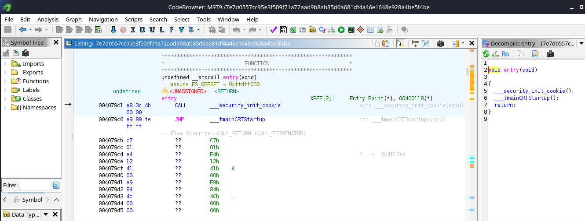


El Entry Point de la muestra se localiza en `0x004079C1`, dentro de la sección `.text`. Al revisar esta dirección en Ghidra, se observa que la función `entry` únicamente realiza una llamada a `__security_init_cookie` y posteriormente transfiere el flujo a `__tmainCRTStartup`.

El pseudocódigo generado por Ghidra es:

```c
void entry(void)
{
    __security_init_cookie();
    __tmainCRTStartup();
    return;
}
```

Este patrón es compatible con un arranque estándar del runtime de Microsoft Visual C/C++ y no presenta, en este punto, características típicas de un stub de desempaquetado, como bucles de descifrado, copia de memoria, resolución dinámica masiva de APIs, llamadas inmediatas a VirtualAlloc/VirtualProtect o saltos indirectos hacia memoria generada en tiempo de ejecución.

Por tanto, desde la revisión del Entry Point no se observan indicios claros de empaquetado clásico. La ejecución comienza en una rutina de inicialización estándar y no en una sección anómala ni en un stub evidente de unpacking.


Tras revisar el Entry Point, se siguió el flujo hacia `__tmainCRTStartup`. Ghidra identifica esta función como una función de librería perteneciente a **Visual Studio 2010 Release**, lo que indica que forma parte del runtime estándar del binario.

La función realiza inicializaciones habituales del CRT, incluyendo configuración de SEH, obtención de `STARTUPINFO`, inicialización del heap, inicialización multihilo, inicialización de entrada/salida, obtención de la línea de comandos, recuperación de variables de entorno, preparación de argumentos y ejecución de inicializadores globales.

También se observan comprobaciones sobre la cabecera PE del propio módulo, como la validación de las firmas `MZ` y `PE`. En este contexto, dichas comprobaciones se interpretan como parte del runtime y no como evidencia de parsing de un payload embebido.

No se observan en esta función patrones típicos de un stub de desempaquetado, como reserva de memoria ejecutable, modificación de permisos, descifrado de buffers, copia de payloads o saltos indirectos hacia memoria generada dinámicamente.

Al final de la función se transfiere el control a `FUN_00401170`, pasando argumentos compatibles con una función tipo `WinMain`. Por tanto, `FUN_00401170` se considera el siguiente punto relevante para determinar si existe lógica propia de carga, decodificación o desempaquetado.

`FUN_00401170` parece corresponder a lógica principal de una aplicación GUI y no a un stub de unpacking. No se observan patrones característicos de empaquetado clásico como `VirtualAlloc`, `VirtualProtect`, escritura de un payload en memoria, bucles de descifrado masivo o saltos indirectos hacia memoria generada dinámicamente.


## **4.5. Revisión de imports relacionados con unpackings**
Para comprobar si la muestra importa APIs habitualmente asociadas a desempaquetado, carga dinámica o inyección de código, se filtró la tabla de imports mediante `rabin2`.

```
└─$ rabin2 -i 7e7d0557cc95e3f509f71a72aad9b8ab85d6a681df4a46e1648e928a4be5f4be | egrep -i "VirtualAlloc|VirtualProtect|VirtualFree|WriteProcessMemory|ReadProcessMemory|CreateThread|CreateRemoteThread|NtUnmapViewOfSection|SetThreadContext|ResumeThread|LoadLibrary|GetProcAddress|HeapAlloc|HeapCreate|FindResource|LoadResource|LockResource|SizeofResource"
12  0x004110a0 NONE FUNC KERNEL32.dll LoadLibraryW
43  0x0041111c NONE FUNC KERNEL32.dll LoadLibraryA
44  0x00411120 NONE FUNC KERNEL32.dll GetProcAddress
46  0x00411128 NONE FUNC KERNEL32.dll SizeofResource
50  0x00411138 NONE FUNC KERNEL32.dll HeapAlloc
51  0x0041113c NONE FUNC KERNEL32.dll LoadResource
52  0x00411140 NONE FUNC KERNEL32.dll HeapCreate
55  0x0041114c NONE FUNC KERNEL32.dll FindResourceA
```

El resultado muestra la presencia de varias APIs relevantes:

```text
LoadLibraryW
LoadLibraryA
GetProcAddress
SizeofResource
HeapAlloc
LoadResource
HeapCreate
FindResourceA
``` 
En conclusión, los imports muestran capacidades de carga dinámica básica, uso de heap y manejo de recursos, pero no evidencian por sí solos una rutina de desempaquetado, inyección o ejecución de payload en memoria.


<div class="page"/>

## **4.6. Revisar todas las XREFs a GetProcAddress y LoadLibraryA**
Revismos en Ghidra las **XREFs** de:

```text
GetProcAddress
LoadLibraryA
LoadLibraryW
FindResourceA
LoadResource
SizeofResource
```

**Revisamos las referencias a GetProcAddress:**  
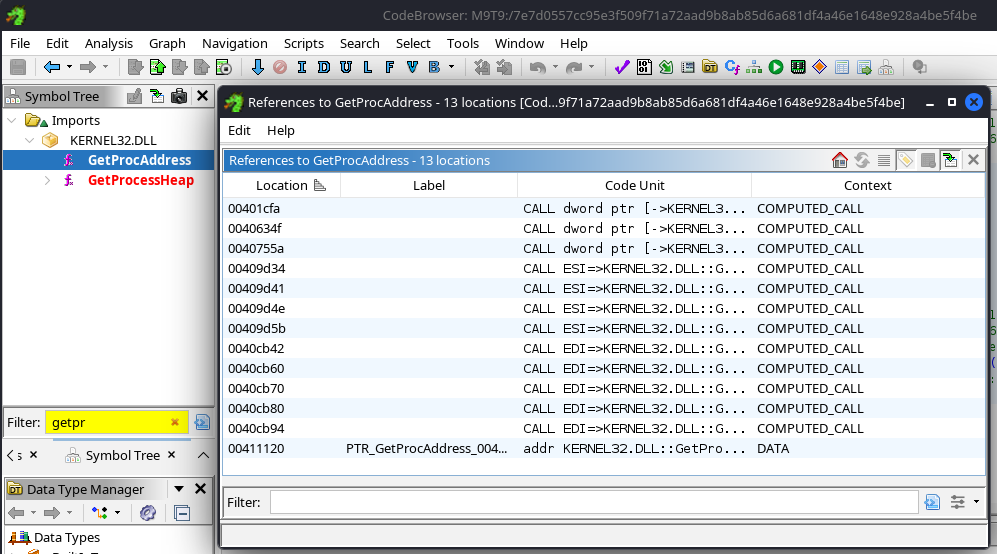

La revisión de GetProcAddress queda prácticamente cerrada: todas las XREFs revisadas pertenecen a heap/runtime/multihilo/CRT/GUI, no a desempaquetado.

**Revisamos las referencias a LoadLibraryA:**  
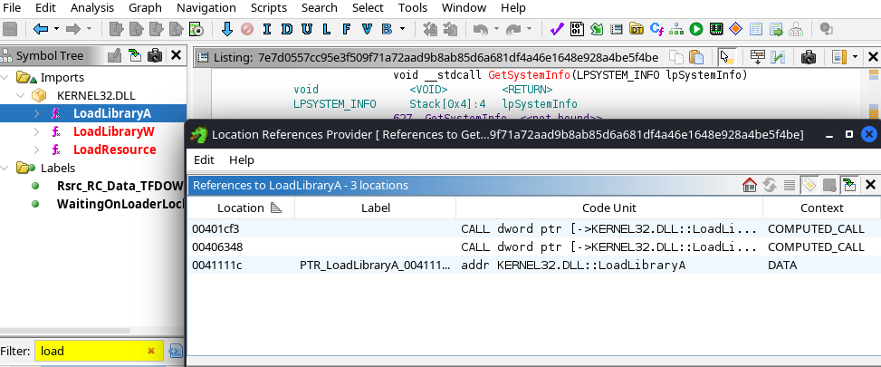

Se revisaron las referencias a `LoadLibraryW` en Ghidra. La función importada aparece referenciada desde `__crtMessageBoxW`, una rutina identificada por Ghidra como función de librería del runtime de Visual Studio.

En este bloque se carga dinámicamente `USER32.DLL` para resolver funciones relacionadas con la interfaz gráfica y cuadros de diálogo, como `MessageBoxW`, `GetActiveWindow`, `GetLastActivePopup` y funciones de objetos de usuario.

No se identifican cargas de DLLs sospechosas, rutas externas, librerías generadas dinámicamente ni APIs asociadas a desempaquetado o inyección. El uso de `LoadLibraryW` se considera parte de la lógica auxiliar del runtime/GUI y no evidencia un packer o loader.

-------------

La muestra no presenta evidencias concluyentes de empaquetado clásico. Detect It Easy marca una alerta heurística de datos comprimidos o empaquetados, y Binwalk confirma regiones de alta entropía en el binario, especialmente en `.rdata` y `.data`.

Sin embargo, el Entry Point apunta a una inicialización estándar del CRT, `__tmainCRTStartup` es reconocido como función de librería, y la función principal inicial muestra lógica GUI y manejo de recursos, no un stub de desempaquetado.

Además, las referencias a `LoadLibraryA/W` y `GetProcAddress` resuelven funciones asociadas a heap, runtime, FLS y GUI, pero no APIs típicas de unpacking como `VirtualAlloc`, `VirtualProtect`, `WriteProcessMemory` o `CreateThread`.

Por tanto, se clasifica la muestra como PE32 con datos opacos o de alta entropía, pero sin evidencia suficiente de packer clásico ni de rutina de desempaquetado identificada estáticamente.

---------

## **4.7 Confirmación heurística de datos comprimidos en `.rdata`**

Para obtener más detalle sobre la alerta de Detect It Easy, se ejecutó la herramienta con escaneo heurístico y modo verbose:

```bash
diec --heuristicscan --verbose 7e7d0557cc95e3f509f71a72aad9b8ab85d6a681df4a46e1648e928a4be5f4be
```


El Resultado obtenido es:
```
[HEUR/About] Generic Heuristic Analysis by DosX (@DosX_dev)
[HEUR] Scanning has begun!
[HEUR] Scanning to programming language has started!
[HEUR] Scan completed.
PE32
    Operation system: Windows(XP)[I386, 32-bit, GUI]
    Linker: Microsoft Linker(10.00.40219)
    Compiler: PureBasic
    Language: PureBasic
    Tool: Visual Studio(2010)
    (Heur)Packer: Compressed or packed data[Section 1 (".rdata") compressed]
```

La salida identifica la muestra como un binario PE32 para Windows XP, de arquitectura I386, con subsistema gráfico. Además, Detect It Easy asocia el binario con PureBasic y con el enlazador de Visual Studio 2010.


La conclusión final del apartado puede quedar así:


**Conclusión del análisis de empaquetamiento:**

Detect It Easy identifica una alerta heurística de empaquetamiento asociada específicamente a la sección `.rdata`, indicando la presencia de datos comprimidos o empaquetados. Esta alerta queda respaldada por el análisis de entropía, que muestra regiones de alta entropía dentro del binario.

No obstante, no se han identificado indicadores estructurales de empaquetado clásico. Las secciones presentan nombres y permisos convencionales, el Entry Point cae dentro de `.text`, el flujo inicial corresponde al runtime estándar de Visual Studio y no se observan APIs típicas de desempaquetado o inyección, como `VirtualAlloc`, `VirtualProtect`, `WriteProcessMemory` o `CreateThread`.

Asimismo, las firmas `MZ`, `PE` y `PK` localizadas en `.rdata` fueron validadas manualmente y descartadas como cabeceras reales de PE o ZIP.

Por tanto, la muestra se clasifica como: PE32 con datos opacos/comprimidos en `.rdata`, sin evidencia concluyente de packer clásico ni rutina de unpacking identificada estáticamente.

----------------

# **5. Análisis funcional estático de la muestra**

```
└─$ rabin2 -i 7e7d0557cc95e3f509f71a72aad9b8ab85d6a681df4a46e1648e928a4be5f4be | egrep -i "SetWindowLong|SetWindowLongPtr|GetWindowLong|CallWindowProc|EnumWindows|EnumChildWindows|FindWindow|GetWindow|SendMessage|PostMessage|SetProp|GetProp|RemoveProp"
49  0x00411134 NONE FUNC KERNEL32.dll GetWindowsDirectoryA
1   0x004111c0 NONE FUNC USER32.dll   GetWindowTextA
5   0x004111d0 NONE FUNC USER32.dll   GetWindowRect
15  0x004111f8 NONE FUNC USER32.dll   SendMessageA
21  0x00411210 NONE FUNC USER32.dll   GetWindow
22  0x00411214 NONE FUNC USER32.dll   GetWindowWord
27  0x00411228 NONE FUNC USER32.dll   GetWindowLongA
33  0x00411240 NONE FUNC USER32.dll   EnumChildWindows
40  0x0041125c NONE FUNC USER32.dll   FindWindowA
```


La búsqueda de imports relacionados con EWMI y manipulación de ventanas muestra la presencia de varias APIs de `USER32.dll`, como `GetWindowTextA`, `GetWindowRect`, `SendMessageA`, `GetWindow`, `GetWindowWord`, `GetWindowLongA`, `EnumChildWindows` y `FindWindowA`.

Sin embargo, no se identifican imports de `SetWindowLongA`, `SetWindowLongW`, `SetWindowLongPtrA/W` ni `CallWindowProcA/W`, que serían especialmente relevantes para confirmar una técnica de modificación del procedimiento de ventana mediante `SetWindowLong`.

Por tanto, en este punto no hay evidencia directa de EWMI vía `SetWindowLong`. La muestra sí presenta capacidades de interacción con ventanas y controles, pero será necesario revisar las XREFs de `GetWindowLongA`, `EnumChildWindows`, `FindWindowA` y `SendMessageA` para determinar si se trata de lógica GUI ordinaria o de manipulación maliciosa de ventanas.

-------------

Abrimos las XREFs de GetWindowLongA y comprobamos si alguna usa -4.


La búsqueda de imports relacionados con EWMI y manipulación de ventanas muestra la presencia de varias APIs de `USER32.dll`, como `GetWindowTextA`, `GetWindowRect`, `SendMessageA`, `GetWindow`, `GetWindowWord`, `GetWindowLongA`, `EnumChildWindows` y `FindWindowA`.

Sin embargo, no se identifican imports de `SetWindowLongA`, `SetWindowLongW`, `SetWindowLongPtrA/W` ni `CallWindowProcA/W`, que serían especialmente relevantes para confirmar una técnica de modificación del procedimiento de ventana mediante `SetWindowLong`.

Por tanto, en este punto no hay evidencia directa de EWMI vía `SetWindowLong`. La muestra sí presenta capacidades de interacción con ventanas y controles, pero será necesario revisar las XREFs de `GetWindowLongA`, `EnumChildWindows`, `FindWindowA` y `SendMessageA` para determinar si se trata de lógica GUI ordinaria o de manipulación maliciosa de ventanas.

-----------


El siguiente paso sería revisar **`FindWindowA`**, **`EnumChildWindows`** y **`SendMessageA`**, pero ya no para confirmar `SetWindowLong`, sino para describir la capacidad real: interacción con ventanas, controles y mensajes GUI.


---------

<div class="page"/>

# **6. Buscamos el mecanismo de dropper/unpacking**
La muestra no presenta un packer clásico reconocible ni un stub de desempaquetado evidente en el Entry Point. Sin embargo, Detect It Easy identifica datos comprimidos en `.rdata`, y esta observación queda alineada con fuentes externas que clasifican el fichero como un dropper de Vawtrak y proporcionan un hash de una DLL Vawtrak desempaquetada asociada.

Por tanto, el empaquetamiento no se manifiesta como una sección UPX/ASPack ni como un OEP oculto clásico, sino como un esquema de dropper/ofuscación de datos: la muestra contiene datos opacos en `.rdata` y, según referencias externas, deriva en una DLL Vawtrak desempaquetada durante la ejecución.


El objetivo ahora es localizar dónde se procesa .rdata o dónde se genera/carga la DLL final.


```
└─$ rabin2 -i 7e7d0557cc95e3f509f71a72aad9b8ab85d6a681df4a46e1648e928a4be5f4be | egrep -i "CreateFile|WriteFile|fopen|fwrite|fread|CreateProcess|WinExec|ShellExecute|GetTempPath|GetTempFileName|RegSetValue|RegCreateKey|Internet|URLDownload|Http|WinHttp|WinInet"
37  0x00411104 NONE FUNC KERNEL32.dll CreateFileW
47  0x0041112c NONE FUNC KERNEL32.dll CreateFileA
48  0x00411130 NONE FUNC KERNEL32.dll WriteFile

```

La muestra tiene capacidad para crear/escribir ficheros en disco. En el contexto de un posible dropper.

Lo prioritario es comprobar si WriteFile escribe:
1. configuración / settings.ini
2. datos gráficos o recursos normales
3. un blob/payload procedente de .rdata, .data o .rsrc


-------------


Revisamos las XREFs de estas tres APIs:
- CreateFileW
- CreateFileA
- WriteFile


### **Revisión de `WriteFile`**

Se revisaron las referencias cruzadas a `WriteFile` para comprobar si la muestra escribía en disco un posible payload desempaquetado o datos procedentes de regiones de alta entropía.

La referencia más relevante aparece en `FUN_00401170`, donde la muestra reserva un buffer mediante `_malloc(0x100000)`, obtiene texto mediante `GetWindowTextA` y posteriormente crea un fichero con `CreateFileA` usando permisos de escritura (`GENERIC_WRITE`), modo `CREATE_ALWAYS` y atributos normales. A continuación, escribe el contenido del buffer mediante `WriteFile`.

El flujo observado es compatible con una funcionalidad de guardado o exportación de texto desde la interfaz gráfica. El buffer escrito procede de `GetWindowTextA`, no de `.rdata`, `.data`, `.rsrc` ni de un bloque de alta entropía. El tamaño escrito también deriva del resultado de `GetWindowTextA`, por lo que no se observa una escritura fija de un payload embebido.

El resto de referencias a `WriteFile` pertenecen a funciones de librería del runtime, como `__write_nolock`, donde se observan operaciones asociadas a escritura estándar, conversión de caracteres con `WideCharToMultiByte`, gestión de errores y handles de consola. Estas referencias se consideran parte del CRT y no lógica propia de desempaquetado.

Por tanto, no se identifica evidencia de que `WriteFile` sea utilizado para materializar un payload en disco.

-----------

<div class="page"/>


**Revisión de `CreateFileA` y `WriteFile`**

Se revisaron las referencias a `CreateFileA` y `WriteFile` para comprobar si la muestra materializaba en disco un posible payload desempaquetado.

La referencia más relevante aparece en `FUN_00401170`. En este bloque, la muestra reserva un buffer de `0x100000` bytes, obtiene texto mediante `GetWindowTextA`, crea un fichero mediante `CreateFileA` con permisos de escritura y posteriormente escribe el contenido mediante `WriteFile`.

El buffer escrito procede de `GetWindowTextA`, no de regiones de alta entropía como `.rdata`, `.data` o `.rsrc`. Además, el tamaño escrito depende del número de caracteres obtenidos desde la ventana/control, por lo que no se observa una escritura fija de un blob o payload embebido.

El resto de referencias a `CreateFileA` aparecen dentro de funciones auxiliares del runtime, asociadas a wrappers de apertura de ficheros y gestión de errores mediante `_doserrno`, `_errno`, `GetLastError`, `_alloc_osfhnd` y `CloseHandle`.

Por tanto, no se identifica evidencia de que `CreateFileA` o `WriteFile` sean utilizados para escribir un payload desempaquetado en disco.


---------

La muestra presenta indicios heurísticos de datos comprimidos/ofuscados en `.rdata`, confirmados por Detect It Easy en modo verbose y apoyados por el análisis de entropía. Sin embargo, no se identifican evidencias de packer clásico ni una rutina de unpacking localizable estáticamente. Las zonas de alta entropía no presentan referencias directas evidentes desde el código, y las APIs revisadas no muestran carga de payload, reserva de memoria ejecutable ni transferencia de control a memoria generada dinámicamente.


------------


<div class="page"/>


# **7. Análisis Dinámico**
Debido a las capas de ocultación, empaquetado y reconstrucción en memoria observadas durante el análisis estático, resulta necesario complementar dicho estudio con un análisis dinámico controlado. El objetivo de esta fase es observar el comportamiento real de la muestra en ejecución, identificar las acciones que no son evidentes únicamente mediante el análisis estático y confirmar posibles capacidades.


Ponemos bps:
```bash
bp kernel32.CreateFileA
bp kernelbase.CreateFileA
bp kernel32.CreateFileW
bp kernelbase.CreateFileW
```


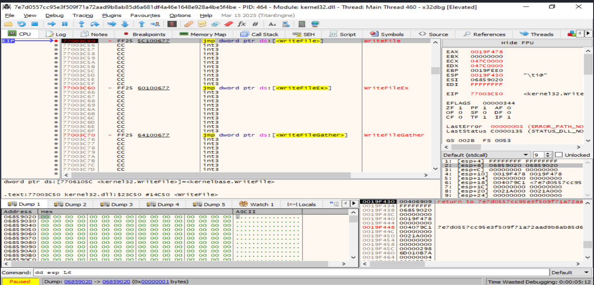

Este WriteFile queda descartado como dropper/payload.

--------------


por la pila parece que es exactamente la llamada previa al WriteFile que vimos antes.

En la captura se ve:

```bash
[ESP]      = 004068F7   ; return address
[ESP+04]   = 0019F8C0   ; lpFileName
[ESP+08]   = 40000000   ; GENERIC_WRITE
[ESP+0C]   = 00000000   ; dwShareMode
[ESP+10]   = 00000000   ; lpSecurityAttributes
[ESP+14]   = 00000002   ; CREATE_ALWAYS
[ESP+18]   = 00000080   ; FILE_ATTRIBUTE_NORMAL
[ESP+1C]   = 00000000   ; hTemplateFile
```

Esto significa que la muestra intenta crear un fichero para escritura:

```bash
CreateFileA(
    lpFileName,
    GENERIC_WRITE,
    0,
    NULL,
    CREATE_ALWAYS,
    FILE_ATTRIBUTE_NORMAL,
    NULL
);
```

-------------------


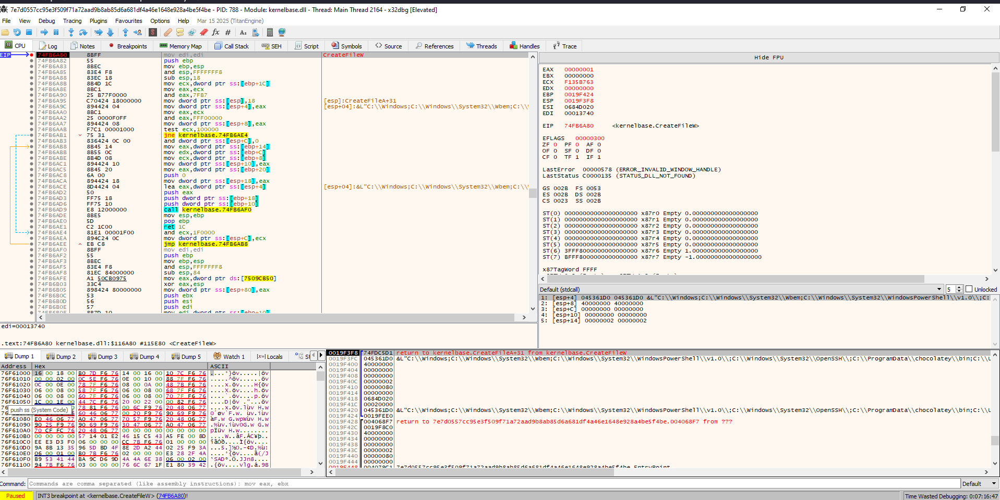

Vemos la cadena: 
```bash
C:\Windows;C:\Windows\System32\wbem;C:\Windows\System32\WindowsPowerShell\v1.0\;C:\Windows\System32\OpenSSH\;...

```

Durante la ejecución se observó una cadena de entorno tipo PATH que contiene rutas estándar del sistema, incluida `C:\Windows\System32\WindowsPowerShell\v1.0\.` No obstante, la aparición de esta ruta se produce en el contexto de `CreateFileW` y no constituye evidencia de ejecución de `PowerShell`.

-------------------------------------


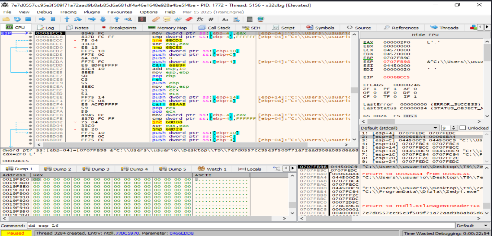

```bash
EAX = 0x000002F0
```


**En la pila aparece una ruta tipo:**
```bash
C:\Users\usuario\Desktop\T9\...\ProgramData\Dizla\\zedyi.exe
```

Con este valor de  `EAX = 000002F0`, que parece un handle válido devuelto por una API de fichero. Es decir: probablemente estemos justo después de una llamada a `CreateFileA` exitosa.


-------------------------------------

**<mark>Reiniciamos x32dbg y perseguimos este hallazgo:</mark>**

Ponemos el bps:
```bash
bp kernel32.CreateFileA
bp kernel32.CreateFileW
bp kernelbase.CreateFileA
bp kernelbase.CreateFileW

bp kernel32.WriteFile
bp kernelbase.WriteFile
bp ntdll.NtWriteFile

bp kernel32.ReadFile
bp kernelbase.ReadFile
bp ntdll.NtReadFile

bp kernel32.CopyFileA
bp kernel32.CopyFileW
bp kernelbase.CopyFileA
bp kernelbase.CopyFileW

bp kernel32.MoveFileA
bp kernel32.MoveFileW
bp kernelbase.MoveFileA
bp kernelbase.MoveFileW

bp kernel32.CloseHandle
bp kernelbase.CloseHandle
```

--------------------------------------

Estamos en kernel32.CreateFileA. 

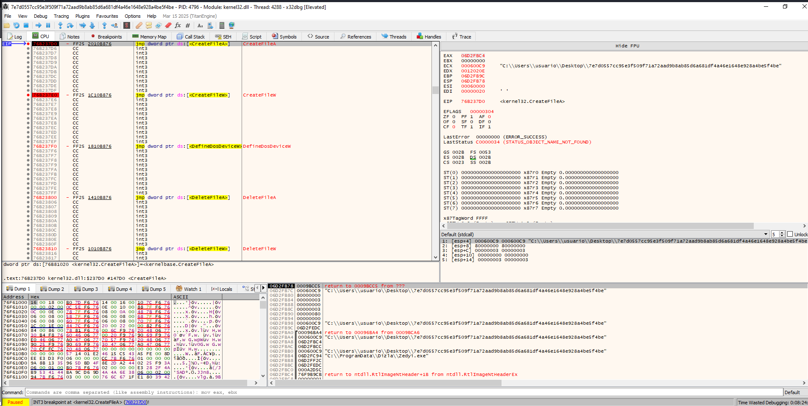

Vemos en la pila: 
```bash
[ESP+4] -> C:\Users\usuario\Desktop\...\7e7d0557...
```

Eso demuestra que la muestra está abriendo su propio ejecutable original.

--------------------------------------

Hemos vuelto al código del malware:

```bash
EIP = 0009BCC5
```

y EAX contiene:

```bash
EAX = 00000298
```

Ese `00000298` es el handle devuelto por `CreateFileA`.

Por tanto podemos anotar:

```bash
hFile_original = 00000298
```

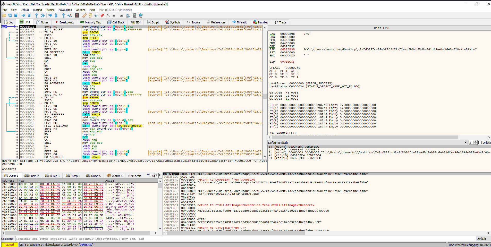


--------

Ahora estamos en `kernel32.GetFileSize`:

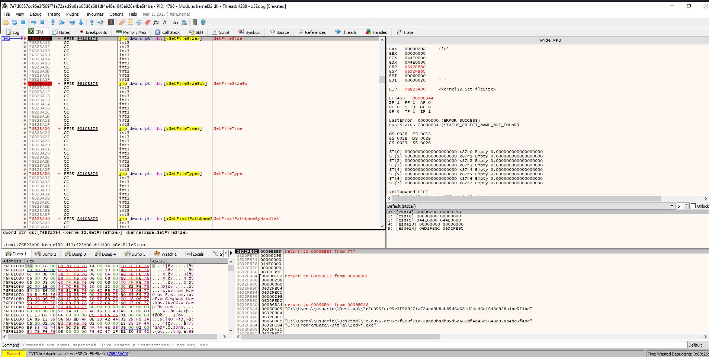

y en la pila aparece:

```bash
[ESP+4] = 00000298
```

Ese valor coincide con el handle anterior. Esto demuestra que hace:

```bash
GetFileSize(hFile_original)
```

Es decir: obtiene el tamaño de la muestra original.

------------------------------

Volvemos al caller y miramos `EAX`:
```bash
EAX = 0004C000
```

Eso demuestra que:

```bash
GetFileSize(muestra_original) = 0x4C000
```

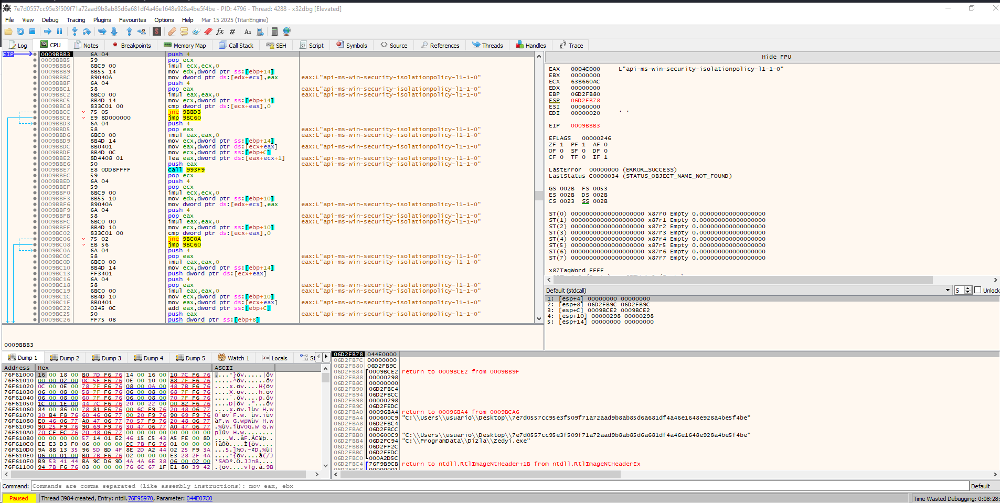


```
CreateFileA abre la propia muestra
↓
GetFileSize obtiene 0x4C000 bytes
↓
la muestra conoce el tamaño completo de su propio fichero

Esto sí es comportamiento relevante de dropper/autolecutra.
```


-----------------------------


Estamos verificando que:
1. La muestra abre su propio ejecutable mediante CreateFileA.
2. CreateFileA devuelve el handle 00000298.
3. Ese mismo handle se pasa a GetFileSize.
4. GetFileSize obtiene el tamaño del ejecutable original.
(5. Después veremos que se copia a sí mismo en un fichero.)


Durante el análisis dinámico se observó que la muestra abre su propio fichero mediante `CreateFileA` y obtiene su tamaño mediante `GetFileSize`. El valor devuelto fue `0x4C000`, coincidente con el tamaño del ejecutable original.

Posteriormente, el flujo continúa en una región de memoria mapeada de tipo `MAP`, con base `0x00613000` y tamaño `0x019BA000`. La protección observada es de solo lectura (`-R---`), por lo que no se trata directamente de una región privada ejecutable o `RWX`.


<div class="page"/>

Este comportamiento sugiere que la muestra realiza autolectura o mapeo de su propio fichero en memoria, posiblemente para inspeccionar o procesar datos embebidos. No obstante, en este punto aún no se ha confirmado la ejecución de un payload desempaquetado ni escritura de un PE/DLL en disco.


----------------------------------------------------------------

Vamos a ir cayendo en varios `CreateFileA/CreateFileW`. En cada parada miramos siempre:

```bash
[ESP+4]
```

`[ESP+4] = lpFileName`. Cuando veamos: `C:\ProgramData\Dizla\Zedyi.exe`


La muestra parece que crea `C:\ProgramData\Dizla\Zedyi.exe`. La llamada a `CreateFile` devuelve un handle válido, posteriormente cerrado mediante `CloseHandle`. El fichero aparece en disco con tamaño aproximado de 304 KB, por lo que se confirma comportamiento de dropper o instalación de un ejecutable auxiliar.


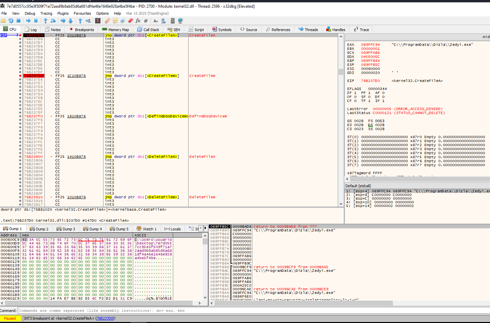


Los argumentos de `CreateFileA` parecen:

```bash
[ESP+4]  = lpFileName              = C:\ProgramData\Dizla\Zedyi.exe
[ESP+8]  = dwDesiredAccess         = C0000000
[ESP+C]  = dwShareMode             = 00000000
[ESP+10] = lpSecurityAttributes    = 00000000
[ESP+14] = dwCreationDisposition   = 00000002
```

`C0000000` suele ser lectura/escritura, y `2` corresponde a `CREATE_ALWAYS`. Es decir: lo está creando o sobrescribiendo.

------

Pulsamos `Ctrl+F9 `para volver primero a `kernelbase.CreateFileA`.

Pulsamos varios `Ctrl+f9 `para salir de kernelbase llegar a un `ret`. Pulsamos `F8` para volver al código del malware.

Deshabilitamos los bps:
```bash
kernel32.CreateFileA
kernel32.CreateFileW
kernelbase.CreateFileA
kernelbase.CreateFileW
```


Llegamos a `WriteFile`:

En la pila se ven los argumentos de WriteFile:

```bash
[ESP+4]  = 000002B4   ← hFile
[ESP+8]  = 0686F6E0   ← buffer que va a escribir
[ESP+C]  = 0004C000   ← tamaño
[ESP+10] = 069FFB7C   ← bytes escritos
[ESP+14] = 00000000   ← overlapped
```

`0x4C000` son `311.296 bytes`, unos `304 KB`, que coincide con el tamaño que viste para `Zedy/Zedyi.exe`. Así que esta llamada muy probablemente está escribiendo el ejecutable completo.

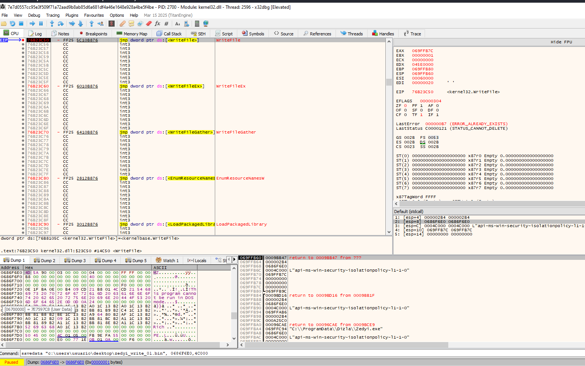


--------------------------------


Guardamos el buffer que se está escribiendo a disco:

```bash
savedata "C:\Temp\zedyi_write_01.bin", 0686F6E0, 4C000
```


Vemos el buffuer: `4D 5A`. Empieza por MZ, confirma que es un PE completo.


------------------

La muestra escribe un ejecutable en `C:\ProgramData\Dizla\Zedyi.exe` mediante WriteFile. El buffer escrito se encuentra en `0x0686F6E0` y el tamaño de escritura es `0x4C000` bytes, equivalente a `311.296` bytes / 304 KiB.


Comprobamos que crea un fichero en esa ruta:
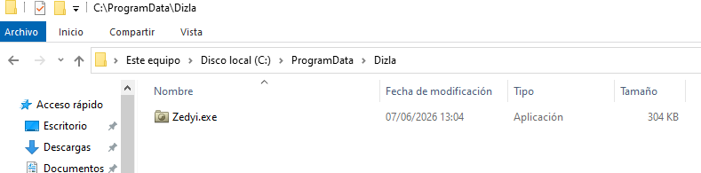


----------------------

Varios Ctrl+F9 y cuando llegamos a `ret`, pulsamos `F8` y llegamos a:

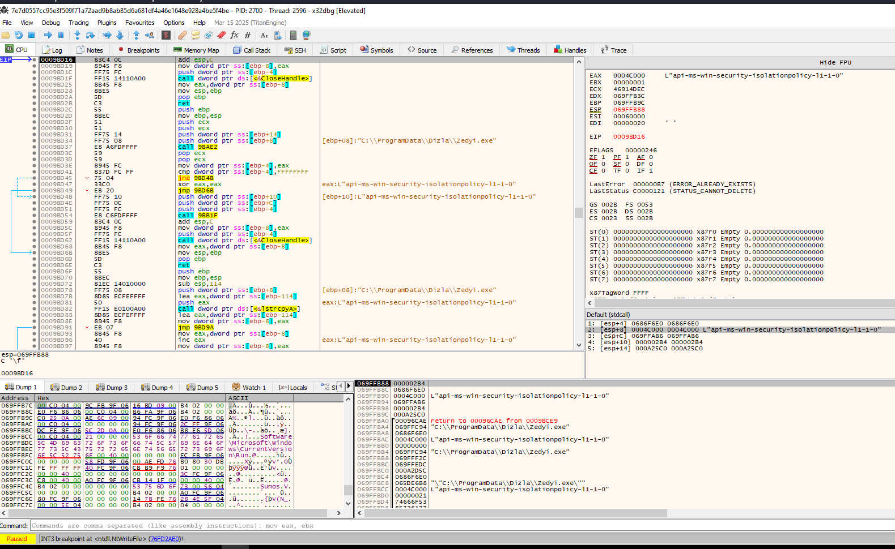


Volvemos al código del malware.

```bash
069FFB7C = 00 C0 04 00

```

Eso confirma que `WriteFile/NtWriteFile` escribió:

```bash
0x0004C000 bytes

```
Es decir: `311.296` bytes / `304` KiB completos.

-------------


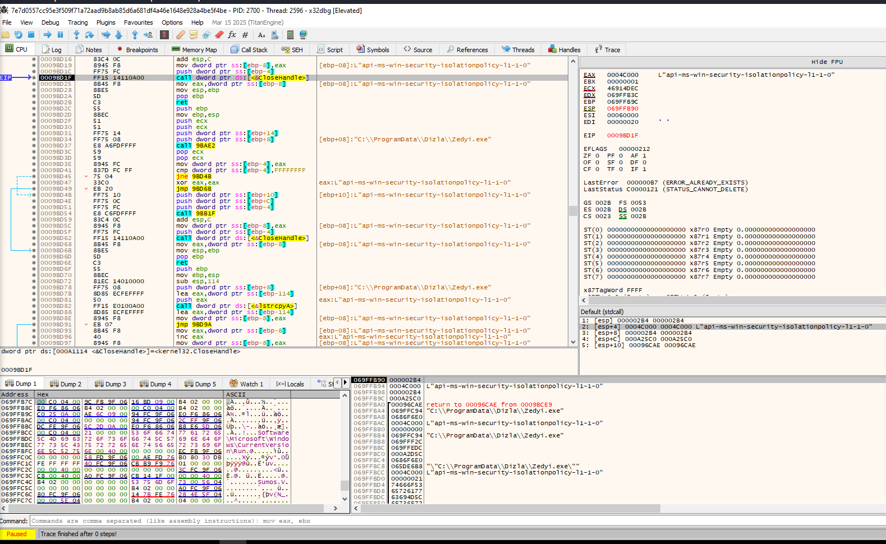

```bash
call dword ptr ds:[<&CloseHandle>]
```

Ahí confirma que el valor que se pushea es el handle:

```bash
[ebp-4] = 000002B4
```

Con eso queda confirmado:
1. Crea `C:\ProgramData\Dizla\Zedyi.exe`.
2. Escribe un PE completo desde `0686F6E0`.
3. Escribe `0x4C000` bytes.
4. Cierra el handle del fichero.


---------

<div class="page"/>


Pulsamos varios f8:


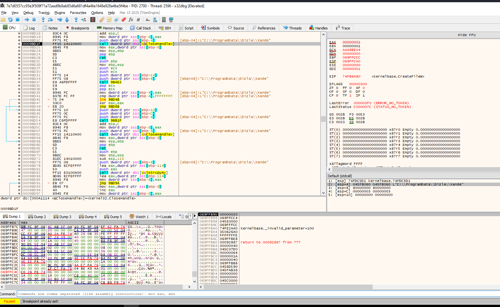

Hay una llamada relacionada con:

```bash
C:\ProgramData\Dizla\Xande
```

y estamos dentro de:  `kernelbase.CreateFileW`. Eso significa que la muestra está intentando abrir o crear un objeto de sistema de ficheros con ese path. Como no tiene extensión, puede ser varias cosas:

1. Un fichero auxiliar sin extensión.
2. Un marcador de instalación.
3. Un directorio.
4. Un lock/check de existencia.
5. Un artefacto usado para persistencia o control de ejecución.


---------------------------------

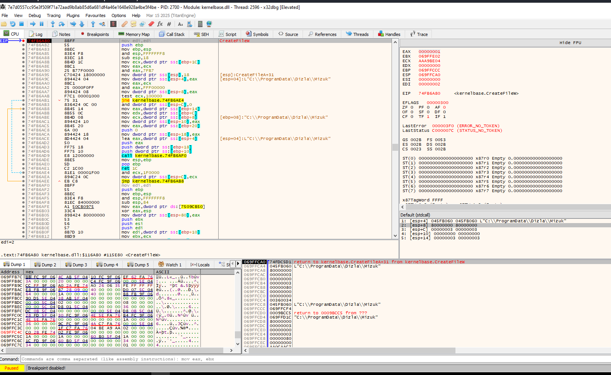

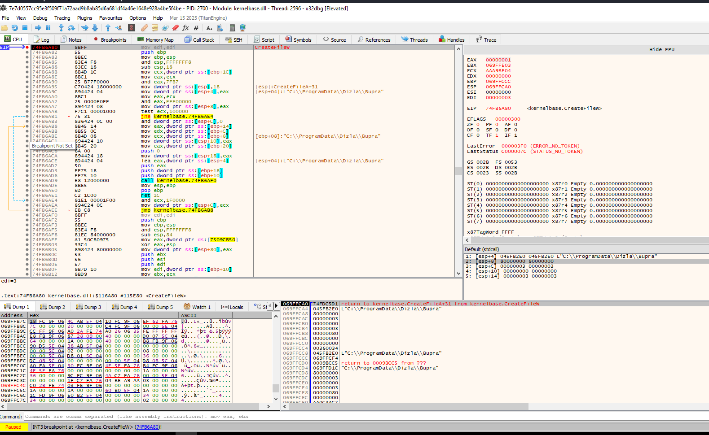

Ya tenemos tres artefactos bajo la misma carpeta:
```bash
C:\ProgramData\Dizla\Zedyi.exe  → confirmado, PE escrito en disco
C:\ProgramData\Dizla\Xande      → comprobación observada, no creado
C:\ProgramData\Dizla\Mizuk      → comprobación observada, no creado
C:\ProgramData\Dizla\Bupra      → comprobación observada, no creado
```


Se observaron referencias a los paths `C:\ProgramData\Dizla\Xande` y `C:\ProgramData\Dizla\Mizuk` mediante llamadas `CreateFileW`, aparentemente como comprobaciones de existencia o marcadores. No se confirmó la creación de estos objetos en disco.

Se observó la cadena `SeDebugPrivilege` en la pila durante la ejecución, lo que sugiere lógica relacionada con privilegios o comprobación de capacidades del proceso.

--------------------------------

## Conclusiones finales sobre la comprobación de ficheros en `C:\ProgramData\Dizla\`

Durante el análisis dinámico de la muestra se observa que el binario no se ejecuta de forma autónoma hasta completar su flujo malicioso, sino que depende de la existencia previa de una serie de ficheros auxiliares ubicados en la ruta:

```text
C:\ProgramData\Dizla\
```

La muestra se autocopia en dicha carpeta con el nombre:

```text
C:\ProgramData\Dizla\Zedyi.exe
```

Posteriormente, inicia una rutina de comprobación sobre múltiples ficheros con nombres aparentemente pseudoaleatorios. Cuando alguno de estos ficheros no existe en la ruta esperada, la ejecución toma una rama de error que termina cerrando el proceso, normalmente mediante `ExitProcess`.

Este comportamiento sugiere que la muestra analizada no representa necesariamente la primera fase de la infección, sino una fase posterior que espera encontrar un entorno previamente preparado. Es probable que una fase anterior, como un dropper, instalador o downloader, sea la encargada de crear la carpeta `Dizla`, copiar el ejecutable y generar o descargar los ficheros auxiliares requeridos.

### Lista de ficheros esperados

| Nº | Fichero     | Ruta esperada                    | Papel observado                                                               |
| -: | ----------- | -------------------------------- | ----------------------------------------------------------------------------- |
|  1 | `AedEpwu`   | `C:\ProgramData\Dizla\AedEpwu`   | Fichero auxiliar/marcador requerido                                           |
|  2 | `Aejawlebh` | `C:\ProgramData\Dizla\Aejawlebh` | Fichero auxiliar/marcador requerido                                           |
|  3 | `DiypOljil` | `C:\ProgramData\Dizla\DiypOljil` | Fichero auxiliar/marcador requerido                                           |
|  4 | `DutQuwq`   | `C:\ProgramData\Dizla\DutQuwq`   | Fichero auxiliar/marcador requerido                                           |
|  5 | `EifExhi`   | `C:\ProgramData\Dizla\EifExhi`   | Fichero auxiliar/marcador requerido                                           |
|  6 | `GakaFwehl` | `C:\ProgramData\Dizla\GakaFwehl` | Fichero auxiliar/marcador requerido                                           |
|  7 | `HaqFism`   | `C:\ProgramData\Dizla\HaqFism`   | Fichero auxiliar/marcador requerido                                           |
|  8 | `HovdEhfan` | `C:\ProgramData\Dizla\HovdEhfan` | Fichero auxiliar/marcador requerido                                           |
|  9 | `Hozcaw`    | `C:\ProgramData\Dizla\Hozcaw`    | Fichero auxiliar/marcador requerido                                           |
| 10 | `IegOjsi`   | `C:\ProgramData\Dizla\IegOjsi`   | Fichero auxiliar/marcador requerido                                           |
| 11 | `keliQhulr` | `C:\ProgramData\Dizla\keliQhulr` | Fichero auxiliar/marcador requerido                                           |
| 12 | `Libqih`    | `C:\ProgramData\Dizla\Libqih`    | Fichero auxiliar crítico; sometido a validación de tamaño, estructura y firma |
| 13 | `LurSudd`   | `C:\ProgramData\Dizla\LurSudd`   | Fichero auxiliar/marcador requerido                                           |
| 14 | `LuwrOswer` | `C:\ProgramData\Dizla\LuwrOswer` | Fichero auxiliar/marcador requerido                                           |
| 15 | `Mizuk`     | `C:\ProgramData\Dizla\Mizuk`     | Fichero auxiliar/marcador requerido                                           |
| 16 | `OamiYsurv` | `C:\ProgramData\Dizla\OamiYsurv` | Fichero auxiliar/marcador requerido                                           |
| 17 | `OihOrda`   | `C:\ProgramData\Dizla\OihOrda`   | Fichero auxiliar/marcador requerido                                           |
| 18 | `PoqDeps`   | `C:\ProgramData\Dizla\PoqDeps`   | Fichero auxiliar/marcador requerido                                           |
| 19 | `PoxcAdlux` | `C:\ProgramData\Dizla\PoxcAdlux` | Fichero auxiliar/marcador requerido                                           |
| 20 | `SebUze`    | `C:\ProgramData\Dizla\SebUze`    | Fichero auxiliar/marcador requerido                                           |
| 21 | `SegoCporx` | `C:\ProgramData\Dizla\SegoCporx` | Fichero auxiliar/marcador requerido                                           |
| 22 | `Selikd`    | `C:\ProgramData\Dizla\Selikd`    | Fichero auxiliar/marcador requerido                                           |
| 23 | `TurRozk`   | `C:\ProgramData\Dizla\TurRozk`   | Fichero auxiliar/marcador requerido                                           |
| 24 | `VuwqIpcab` | `C:\ProgramData\Dizla\VuwqIpcab` | Fichero auxiliar/marcador requerido                                           |
| 25 | `wahaLzovb` | `C:\ProgramData\Dizla\wahaLzovb` | Fichero auxiliar/marcador requerido                                           |
| 26 | `wamusp`    | `C:\ProgramData\Dizla\wamusp`    | Fichero auxiliar/marcador requerido                                           |
| 27 | `wicEdlu`   | `C:\ProgramData\Dizla\wicEdlu`   | Fichero auxiliar/marcador requerido                                           |
| 28 | `Xande`     | `C:\ProgramData\Dizla\Xande`     | Fichero auxiliar/marcador requerido                                           |
| 29 | `Zedyi.exe` | `C:\ProgramData\Dizla\Zedyi.exe` | Autocopia de la muestra                                                       |
| 30 | `ZosFaly`   | `C:\ProgramData\Dizla\ZosFaly`   | Fichero auxiliar/marcador requerido                                           |
| 31 | `ZoxdEzteh` | `C:\ProgramData\Dizla\ZoxdEzteh` | Fichero auxiliar/marcador requerido                                           |

El ultimo fichero que comprueba es: `libqih`. El orden exacto de consulta por parte de la muestra debe confirmarse mediante breakpoints en APIs como `CreateFileA`, `CreateFileW`, `FindFirstFileA`, `GetFileSize`, `GetFileTime` y `CloseHandle`.

### Comportamiento observado

La muestra realiza comprobaciones sucesivas sobre los ficheros de la carpeta `Dizla`. En cada iteración, intenta abrir o consultar uno de los ficheros esperados. Si el fichero no existe, la API correspondiente devuelve error, por ejemplo:

```text
ERROR_FILE_NOT_FOUND
STATUS_OBJECT_NAME_NOT_FOUND
```

Cuando esto ocurre, el flujo termina derivando hacia una ruta de cierre del proceso. Por tanto, para continuar la ejecución durante el análisis dinámico fue necesario crear manualmente los ficheros esperados en la carpeta correcta antes de que la muestra realizara la comprobación.

Sin embargo, el análisis demostró que la existencia del fichero no siempre es suficiente. En el caso del fichero `Libqih`, la muestra realiza validaciones adicionales:

```text
1. Comprueba que el fichero existe.
2. Comprueba su tamaño.
3. Lee o procesa un bloque de 0x400 bytes.
4. Comprueba campos internos de una estructura asociada.
5. Ejecuta una validación criptográfica mediante CryptoAPI.
```

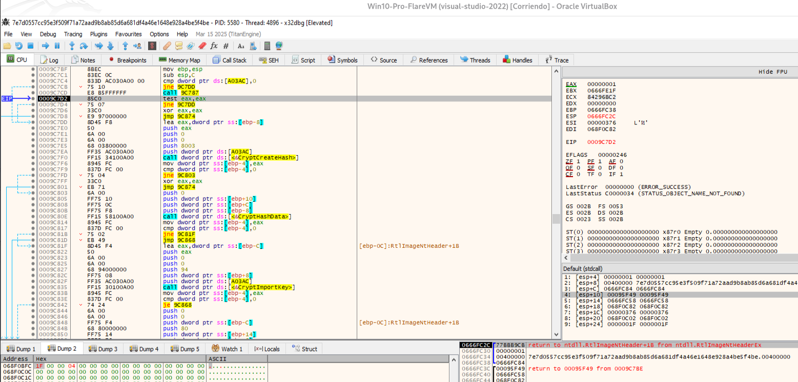

La fase criptográfica observada incluye llamadas a:

```text
CryptCreateHash
CryptHashData
CryptImportKey
CryptVerifySignatureA
CryptDestroyKey
CryptDestroyHash
```

La llamada crítica fue:

```text
CryptVerifySignatureA
```

Esta función devolvió `EAX = 0`, lo que indica que la verificación de firma falló. Esto confirma que los ficheros creados manualmente sirven para superar las comprobaciones de existencia y tamaño, pero no contienen el material criptográfico válido que la muestra espera encontrar.

### Bypass aplicado durante el análisis dinámico

Para impedir que el proceso se cerrara prematuramente y permitir que continuara buscando o procesando el siguiente fichero, se aplicaron varios bypass manuales en x32dbg.

#### 1. Creación manual de los ficheros esperados

El primer bypass consistió en crear la carpeta:

```text
C:\ProgramData\Dizla\
```

y dentro de ella los ficheros esperados por la muestra.

Esto permitió que las llamadas a `CreateFileA/CreateFileW` no devolvieran `INVALID_HANDLE_VALUE` (`FFFFFFFF`) y que la ejecución no saltara inmediatamente hacia la rama de error.

#### 2. Supervisión de `CreateFileA/CreateFileW`

Se utilizaron breakpoints en:

```text
kernel32.CreateFileA
kernel32.CreateFileW
```

En cada parada se comprobó el argumento correspondiente al nombre del fichero. Si la muestra intentaba abrir un fichero que no existía todavía, se creaba manualmente antes de dejar continuar la ejecución.

El objetivo era conseguir que la API devolviera un handle válido, por ejemplo:

```text
EAX != FFFFFFFF
```

De esta forma, el flujo continuaba hacia las comprobaciones posteriores.

#### 3. Comprobación de tamaño del fichero `Libqih`

Para `Libqih`, la muestra esperaba procesar un bloque de tamaño:

```text
0x400 bytes
```

Tras pasar por la rutina de lectura/procesamiento, se observó un retorno correcto de:

```text
EAX = 00000400
```

Esto indicaba que la rutina había leído o procesado el tamaño esperado.

En la zona de validación posterior se identificó una comparación similar a:

```asm
cmp edx, 400
ja  000968DB
```

Como `EDX = 00000400` no cumple la condición “mayor que 0x400”, fue necesario forzar temporalmente:

```text
EDX = 00000401
```

antes de ejecutar el `cmp`, para tomar la rama que permitía continuar el análisis y evitar la ruta de error.

#### 4. Ajuste manual de la estructura en memoria

Durante la validación de `Libqih`, la muestra esperaba que una estructura en memoria contuviera valores concretos. En la ejecución analizada, el buffer base estaba en:

```text
ESI = 068F0BF8
```

Se ajustaron manualmente los siguientes campos:

```text
[ESI+4] = 1F
[ESI+6] = 00000400
```

En memoria, esto quedó representado como:

```text
068F0BFC = 1F
068F0BFE = 00 04 00 00
```

Estos cambios permitieron superar comparaciones internas como:

```asm
cmp dword ptr ds:[esi+6], edx
cmp byte ptr ds:[esi+4], bl
```

y evitar ramas de error que habrían terminado interrumpiendo la ejecución normal.

#### 5. Bypass de la verificación criptográfica

La fase más importante fue la validación mediante `CryptVerifySignatureA`.

La secuencia observada fue:

```text
CryptCreateHash      → correcto
CryptHashData        → correcto
CryptImportKey       → correcto
CryptVerifySignatureA → fallo
```

`CryptVerifySignatureA` devolvió:

```text
EAX = 00000000
```

Para continuar el análisis dinámico, se forzó manualmente:

```text
EAX = 00000001
```

antes de que el valor fuera guardado como resultado de la verificación.

Esto permitió que la función continuara por la rama de éxito, ejecutara las llamadas de limpieza:

```text
CryptDestroyKey
CryptDestroyHash
```

y devolviera éxito al caller.

#### 6. Continuación del flujo tras el bypass

Tras forzar el éxito de la verificación criptográfica, la ejecución continuó hacia una fase posterior donde aparecieron referencias a:

```text
LoadLibraryExA
VirtualAlloc
VirtualFree
GetProcAddress
wininet
```

También se observaron referencias a cabeceras `PE` y a la base del módulo `00400000`, lo que sugiere una fase de loader, resolución dinámica de APIs o preparación de un componente adicional.

Finalmente, el hilo principal alcanzó una llamada a:

```text
ExitProcess
```

Los demás hilos revisados se encontraban en rutinas de `ntdll`, como `NtWaitForWorkViaWorkerFactory`, sin evidencia inmediata de ejecución activa del payload.

### Interpretación final

El comportamiento observado no parece corresponder a una muestra completamente autónoma. La muestra parece formar parte de una cadena de infección multietapa. Su funcionamiento depende de que una fase anterior haya preparado la carpeta `C:\ProgramData\Dizla\`, haya copiado la muestra como `Zedyi.exe` y haya generado o descargado los ficheros auxiliares esperados.

La comprobación de existencia de ficheros actúa como una condición de activación o validación del entorno. Además, la validación criptográfica mediante `CryptVerifySignatureA` indica que al menos algunos de esos ficheros no son simples marcadores vacíos, sino datos estructurados que deben contener material válido, probablemente firmado o generado por otra fase de la infección.

Por tanto, se concluye que el cierre prematuro del proceso no se debe únicamente a la ausencia de ficheros, sino a una cadena de validaciones progresivas:

```text
existencia del fichero
tamaño esperado
estructura interna válida
verificación criptográfica correcta
```

La creación manual de los ficheros permitió avanzar parcialmente, pero fue necesario aplicar bypasses adicionales en memoria y registros para superar la validación completa y observar la fase posterior de carga dinámica.


------------------------------------


Deshabilitamos el breakpoint de WriteFile, porque ya lo capturamos. Dejamos activos solo los de ejecución:

```bash
bp kernel32.CreateProcessA
bp kernel32.CreateProcessW
bp kernelbase.CreateProcessA
bp kernelbase.CreateProcessW
bp kernel32.WinExec
bp shell32.ShellExecuteA
bp shell32.ShellExecuteW
bp shell32.ShellExecuteExA
bp shell32.ShellExecuteExW
```


-------------------------------------------------

<div class="page"/>


## **7.1 Análisis del fichero dropeado**


```bash
└─$ file zedyi_write_01.bin                          
zedyi_write_01.bin: PE32 executable for MS Windows 5.01 (GUI), Intel i386 (stripped to external PDB) system file, 5 sections
                                                                                                                                                    
└─$ sha256sum zedyi_write_01.bin                          
7e7d0557cc95e3f509f71a72aad9b8ab85d6a681df4a46e1648e928a4be5f4be  zedyi_write_01.bin
                                                                                                                                                    
└─$ strings -a -n 4 zedyi_write_01.bin > strings_zedyi.txt

└─$ source ~/tools/env-FLOSS/bin/activate

└─$ floss -f sc32  ~/Escritorio/muestras-malware/ENIIT/M9T9/Dizla/zedyi_write_01.bin > ~/Escritorio/muestras-malware/ENIIT/M9T9/floss_zedyi.txt
```


```bash
└─$ python3 -m capa.main \
  -r ~/Escritorio/capa-rules \
  ~/Escritorio/muestras-malware/ENIIT/M9T9/Dizla/zedyi_write_01.bin \
  | tee ~/Escritorio/muestras-malware/ENIIT/M9T9/Dizla/capa_zedyi.txt
┌───────────┬──────────────────────────────────────────────────────────────────────────────────────┐
│ md5       │ 9724934a3ed3a92b38b89fe7a2e9b6fd                                                     │
│ sha1      │ 7a479295549330798bed66599e22b5cf5580194c                                             │
│ sha256    │ 7e7d0557cc95e3f509f71a72aad9b8ab85d6a681df4a46e1648e928a4be5f4be                     │
│ analysis  │ static                                                                               │
│ os        │ windows                                                                              │
│ format    │ pe                                                                                   │
│ arch      │ i386                                                                                 │
│ path      │ /home/xxniwexx/Escritorio/muestras-malware/ENIIT/M9T9/Dizla/zedyi_write_01.bin       │
└───────────┴──────────────────────────────────────────────────────────────────────────────────────┘
┏━━━━━━━━━━━━━━━━━━━━━━━━━━━━━━━━━━━━┳━━━━━━━━━━━━━━━━━━━━━━━━━━━━━━━━━━━━━━━━━━━━━━━━━━━━━━━━━━━━━┓
┃ ATT&CK Tactic                      ┃ ATT&CK Technique                                            ┃
┡━━━━━━━━━━━━━━━━━━━━━━━━━━━━━━━━━━━━╇━━━━━━━━━━━━━━━━━━━━━━━━━━━━━━━━━━━━━━━━━━━━━━━━━━━━━━━━━━━━━┩
│ COLLECTION                         │ Screen Capture [T1113]                                      │
│ DISCOVERY                          │ Application Window Discovery [T1010]                        │
│                                    │ File and Directory Discovery [T1083]                        │
│                                    │ System Information Discovery [T1082]                        │
│ EXECUTION                          │ Shared Modules [T1129]                                      │
└────────────────────────────────────┴─────────────────────────────────────────────────────────────┘
┏━━━━━━━━━━━━━━━━━━━━━━━━━━━━┳━━━━━━━━━━━━━━━━━━━━━━━━━━━━━━━━━━━━━━━━━━━━━━━━━━━━━━━━━━━━━━━━━━━━━┓
┃ MBC Objective              ┃ MBC Behavior                                                        ┃
┡━━━━━━━━━━━━━━━━━━━━━━━━━━━━╇━━━━━━━━━━━━━━━━━━━━━━━━━━━━━━━━━━━━━━━━━━━━━━━━━━━━━━━━━━━━━━━━━━━━━┩
│ COLLECTION                 │ Screen Capture::WinAPI [E1113.m01]                                  │
│ DISCOVERY                  │ Analysis Tool Discovery::Process detection [B0013.001]              │
│                            │ Application Window Discovery [E1010]                                │
│                            │ File and Directory Discovery [E1083]                                │
│ FILE SYSTEM                │ Delete File [C0047]                                                 │
│                            │ Read File [C0051]                                                   │
│                            │ Writes File [C0052]                                                 │
│ PROCESS                    │ Allocate Thread Local Storage [C0040]                               │
│                            │ Terminate Process [C0018]                                           │
└────────────────────────────┴─────────────────────────────────────────────────────────────────────┘
┏━━━━━━━━━━━━━━━━━━━━━━━━━━━━━━━━━━━━━━━━━━━━━━━━━━━━━━━┳━━━━━━━━━━━━━━━━━━━━━━━━━━━━━━━━━━━━━━━━━━┓
┃ Capability                                            ┃ Namespace                                ┃
┡━━━━━━━━━━━━━━━━━━━━━━━━━━━━━━━━━━━━━━━━━━━━━━━━━━━━━━━╇━━━━━━━━━━━━━━━━━━━━━━━━━━━━━━━━━━━━━━━━━━┩
│ reference analysis tools strings                      │ anti-analysis                            │
│ capture screenshot                                    │ collection/screenshot                    │
│ extract resource via kernel32 functions               │ executable/resource                      │
│ get common file path                                  │ host-interaction/file-system             │
│ delete file                                           │ host-interaction/file-system/delete      │
│ read file on Windows                                  │ host-interaction/file-system/read        │
│ write file on Windows                                 │ host-interaction/file-system/write       │
│ find graphical window                                 │ host-interaction/gui/window/find         │
│ get graphical window text                             │ host-interaction/gui/window/get-text     │
│ get system information on Windows                     │ host-interaction/os/info                 │
│ terminate process                                     │ host-interaction/process/terminate       │
│ allocate thread local storage                         │ host-interaction/thread/tls              │
│ link function at runtime on Windows (7 matches)       │ linking/runtime-linking                  │
│ link many functions at runtime                        │ linking/runtime-linking                  │
└───────────────────────────────────────────────────────┴──────────────────────────────────────────┘
```

<markk>Por su hash verificamos que es una copia exacta del malware inicial.</mark>

---------


**Ahora nuestro objetivo es:**
 - Capturar qué escribe, aunque sabemos que hace un clon del original.
 - Cuándo cierra el fichero.
 - Si después intenta ejecutarlo.


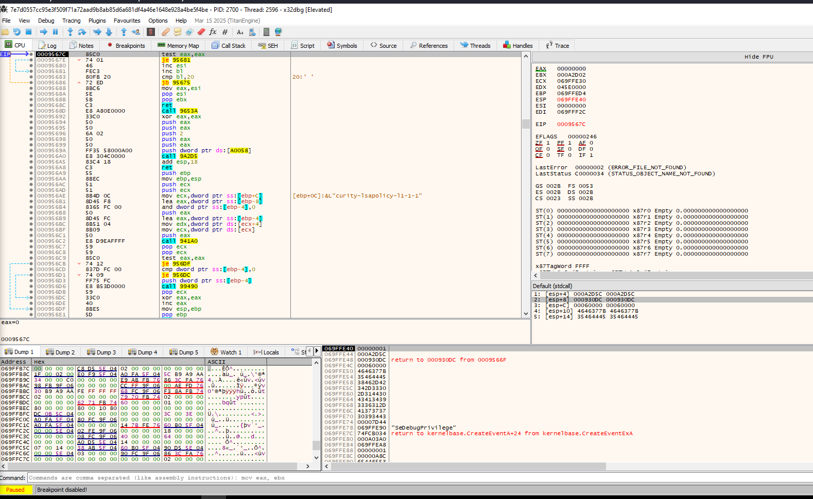


Avanzamos un poco: Pulsamos Alt+F9 para volver al código del malware.

**El proceso muere.**


--------------

<div class="page"/>


## **7.2 Reserva de memoria**

Durante el análisis dinámico se observó que la muestra realiza primero una autocopia en disco, creando el fichero `C:\ProgramData\Dizla\Zedyi.exe`, cuyo contenido coincide con la muestra original. Posteriormente, en una fase posterior del flujo, se detectó una llamada a `MapViewOfFile` con acceso `FILE_MAP_ALL_ACCESS (0x000F001F)` y tamaño `0x0010000C`, lo que indica la creación/uso de una región de memoria mapeada después de completarse la autocopia.

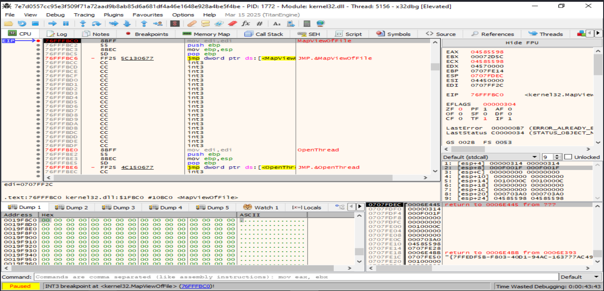

Por la pila se ve:

```bash
[ESP]      = 0006E445    ; retorno al código llamador
[ESP+04]   = 00000314    ; hFileMappingObject
[ESP+08]   = 000F001F    ; dwDesiredAccess
[ESP+0C]   = 00000000    ; dwFileOffsetHigh
[ESP+10]   = 00000000    ; dwFileOffsetLow
[ESP+14]   = 0010000C    ; dwNumberOfBytesToMap
```

Esto significa que la muestra está mapeando el objeto creado antes con:

```bash
hMapping = 0x314
```

y solicita acceso:

```bash
0x000F001F = FILE_MAP_ALL_ACCESS
```

Además, el tamaño mapeado es:

```bash
0x0010000C ≈ 1 MiB
```

Crea un mapping anónimo/pagefile-backed con nombre tipo GUID y luego lo mapea con acceso completo.


----------------


Ejecutamos `MapViewOfFile `y miramos el valor de retorno. Pulsamos: `Ctrl + F9`. Si se queda en un RET, pulsamos una vez: `F8`. Cuando volvamos al código del malware, miramos `EAX`. Ese EAX será la dirección base de la memoria mapeada.

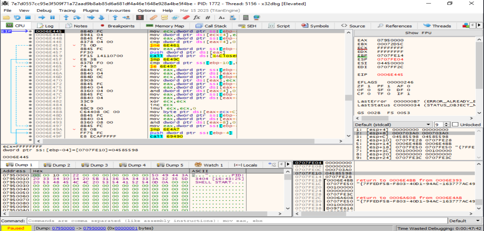

El texto SHELL START es interesante desde el punto de vista funcional, pero no confirma por sí solo dropper. Confirma que la muestra crea una región de memoria compartida nombrada y la usa para almacenar información de estado o comunicación.


--------------


Ponemos un  breakpoint de memoria on access (al menos write) sobre los primeros bytes: Click derecho sobre view_base en el dump → Breakpoint → Memory, Access (o Write).


---------------


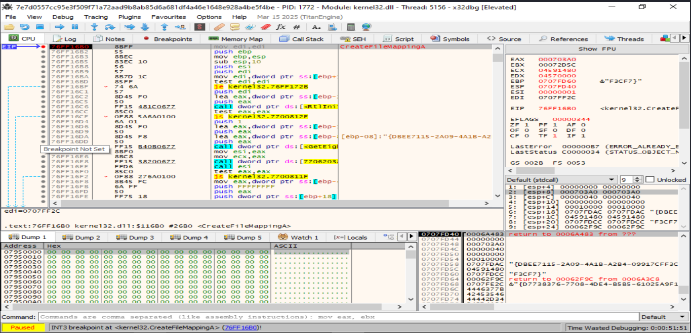


En la pila se aprecia esta estructura aproximada:
```bash

[ESP]      = 0006A483   ; retorno al código llamador
[ESP+04]   = 00000000   ; hFile
[ESP+08]   = 000703A0   ; lpFileMappingAttributes
[ESP+0C]   = 00000040   ; flProtect
[ESP+10]   = 00000000   ; dwMaximumSizeHigh
[ESP+14]   = 00000000   ; dwMaximumSizeLow
[ESP+18]   = 0707FDAC   ; lpName -> GUID
```

El dato más relevante es:

```bash
[ESP+0C] = 0x40
```

`0x40` corresponde a:

```bash
PAGE_EXECUTE_READWRITE

```

Ahora se está intentando crear un objeto de mapping con permisos lectura/escritura/ejecución.

-------------


Ejecutamos esta llamada y miramos si tiene éxito: Pulsamos: Ctrl + F9. Al caer en un RET, pulsamos una vez: F8. Cuando vuelvamos al código llamador, miramos EAX.

Interpretación:
```bash

EAX = 00000000  → CreateFileMappingA falló
EAX != 00000000 → handle válido de mapping
```

Si devolviera un handle válido, lo anotaríamos. Por ejemplo:

```bash
hMapping_exec = EAX
```

Esta llamada merece seguimiento porque usa `PAGE_EXECUTE_READWRITE.`


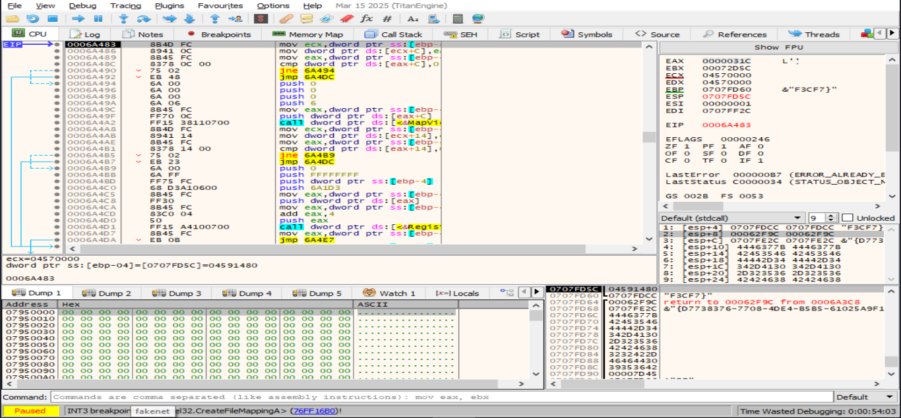


--------

<div class="page"/>


Ponemos un breakpoint directamente en la llamada visible a `MapViewOfFile` en este bloque, alrededor de:

```bash
0006A4A1 / 0006A4A2 aprox.
```

Luego pulsamos: F9


-------------------


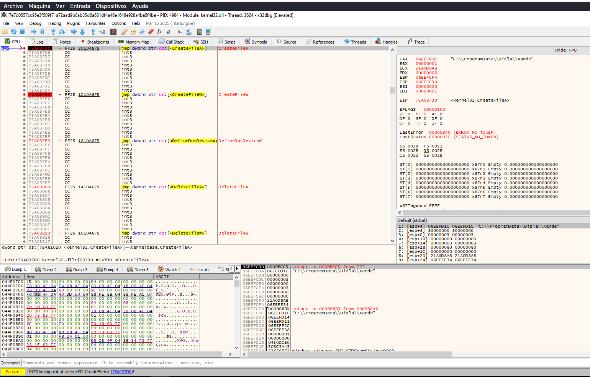

Los argumentos que se ven son aproximadamente:
```bash
[ESP+04] = 06EEFD1C -> "C:\ProgramData\Dizla\Xande"
[ESP+08] = 80000000
[ESP+0C] = 00000003
[ESP+10] = 00000000
[ESP+14] = 00000003
[ESP+18] = 00000080
[ESP+1C] = 00000000
```


Interpretación:

```bash
dwDesiredAccess       = 0x80000000  → GENERIC_READ
dwShareMode           = 0x00000003  → FILE_SHARE_READ | FILE_SHARE_WRITE
dwCreationDisposition = 0x00000003  → OPEN_EXISTING
dwFlagsAndAttributes  = 0x00000080  → FILE_ATTRIBUTE_NORMAL
```

Es decir: **no está creando Xande. Está intentando abrirlo si ya existe.**


En esta captura el dump de `044F07C0` ya no está vacío. Parece una estructura o bloque de datos. Antes de seguir mucho más, guardamos:

```bash
savedata "C:\Users\usuario\Desktop\thread_param_044F0000.bin", 044F0000, 10000
```


y si 076C0000 es la base del mapping:
```bash
savedata "C:\Users\usuario\Desktop\mapping_10000C_inicial.bin", 076C0000, 10000C
```


--------------------------


Salimos de CreateFile y examinamos EAX

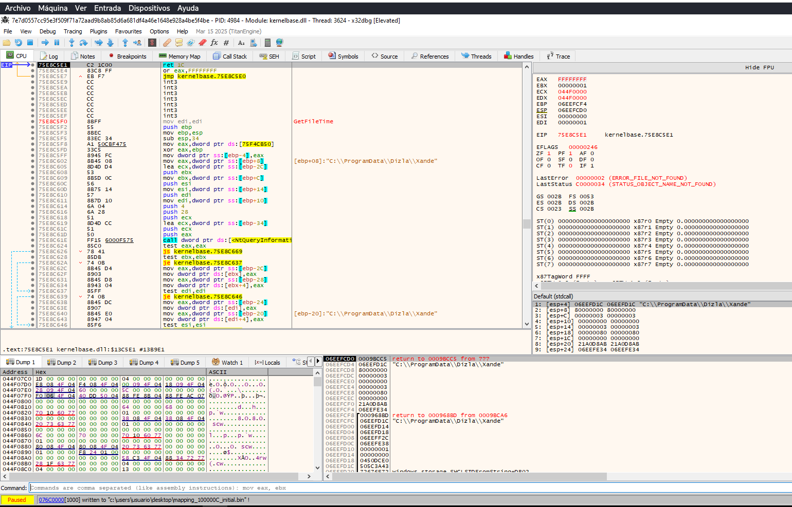

Esta captura confirma dos cosas:

```bash
C:\ProgramData\Dizla\Xande

```

Ha fallado al abrirse:

```bash
EAX = FFFFFFFF
LastError = ERROR_FILE_NOT_FOUND
```

Así que Xande sigue pareciendo un marcador/check de existencia, no un fichero creado.

----------------------------

**Intentamos continuar pero el proceso termina**

<div class="page"/>

Lo que hemos observado hasta ahora:
```bash
1. Se autocopia como C:\ProgramData\Dizla\Zedyi.exe
2. Crea/mapea una región de 0x10000C con MapViewOfFile
3. Crea un hilo con parámetro alrededor de 044F07C0
4. Comprueba C:\ProgramData\Dizla\Xande con CreateFileA/OPEN_EXISTING
5. Xande no existe → CreateFile devuelve FFFFFFFF / ERROR_FILE_NOT_FOUND
6. Poco después cierra handles y termina
```


**Xande parece actuar como marcador de estado o condición de flujo. Al no existir, la muestra toma una ruta que termina.**

---------------------

Creamos el marcador Xande: En la VM, antes de lanzar la muestra:

```bash
echo test > C:\ProgramData\Dizla\Xande
```

Reiniciamos todo el proceso, pero a pesar de ya existir, el proceso se para.

---------------------------------


## **7.3 Se detecta persistencia**


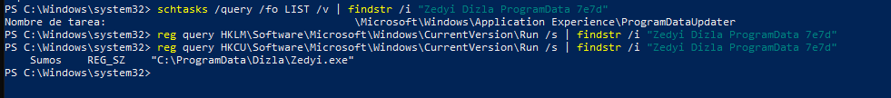

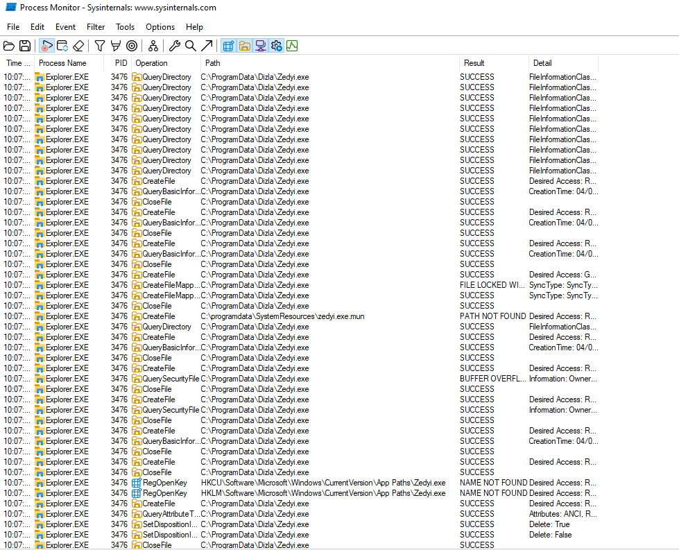


La muestra establece persistencia mediante una clave Run en HKCU:

```bash
HKCU\Software\Microsoft\Windows\CurrentVersion\Run\Sumos

```
El valor apunta a:

```bash
C:\ProgramData\Dizla\Zedyi.exe

```
Dado que Zedyi.exe presenta el mismo hash que la muestra original, esta entrada provoca la ejecución automática de la autocopia tras el inicio de sesión del usuario.


Se observó una tarea programada sospechosa, aunque no se confirmó de forma concluyente que fuera creada por la muestra.

```bash
Nombre de tarea: \MicrosoftWindowsApplicationExperienceProgramDataUpdater
```


---------------------------

<div class="page"/>

**El proceso se cierra**
En x32dbg vamos a intentar capturar el punto exacto donde se termina el proceso.

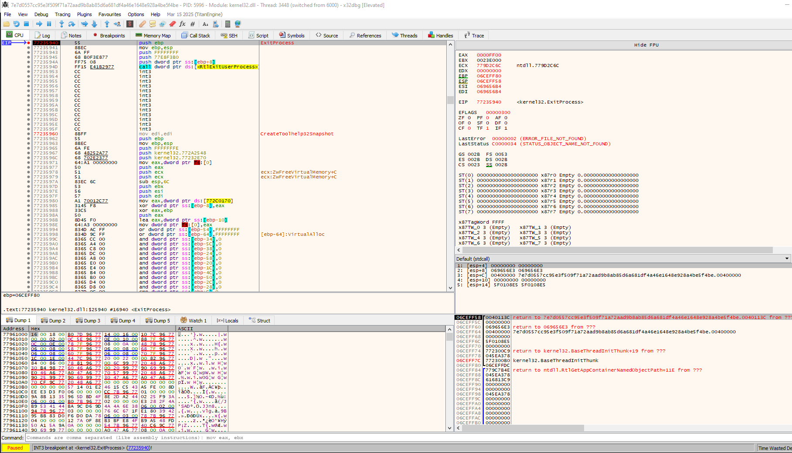

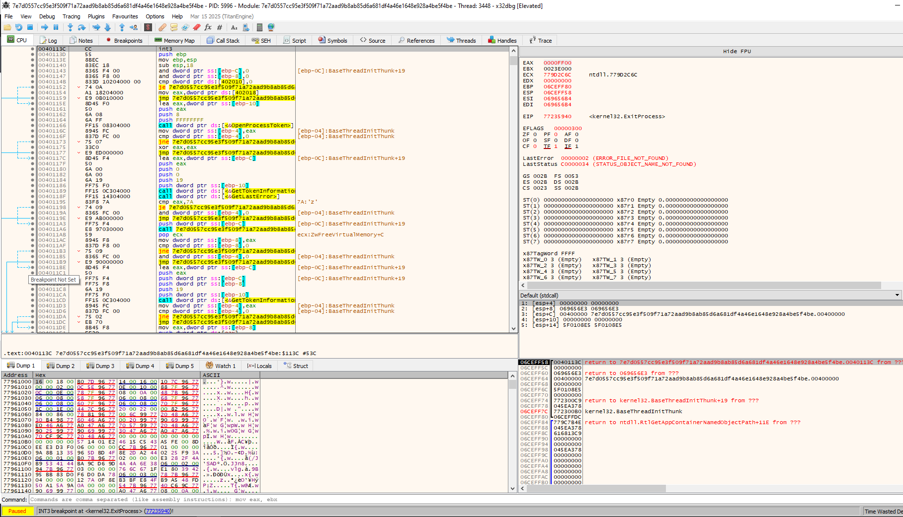

La llamada a ExitProcess viene del propio binario. No ha crasheado. El malware está terminando voluntariamente con código 0.


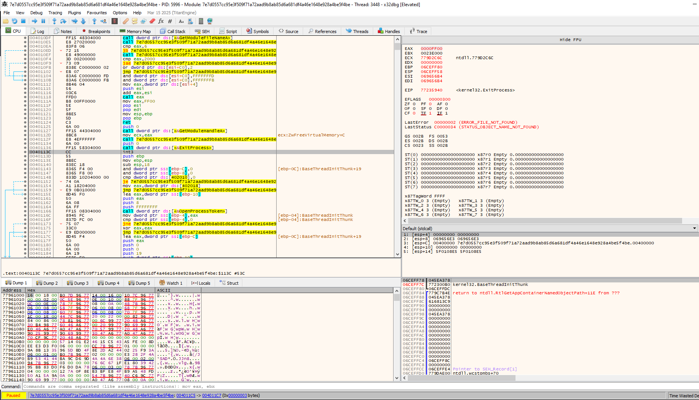

La llamada a ExitProcess es esta:
```bash

00401125  push 0
00401127  call dword ptr ds:[<&GetModuleHandleA>]

0040112D  mov ecx, eax
0040112F  call 0040113D

00401134  push 0
00401136  call dword ptr ds:[<&ExitProcess>]

0040113C  int3
```

La muestra ejecuta 0040113D, retorna normalmente y después el stub de entrada llama a `ExitProcess(0)`.

-----

```bash
ZwTerminateProcess
```

Estamos ante una terminación por excepción no controlada:  
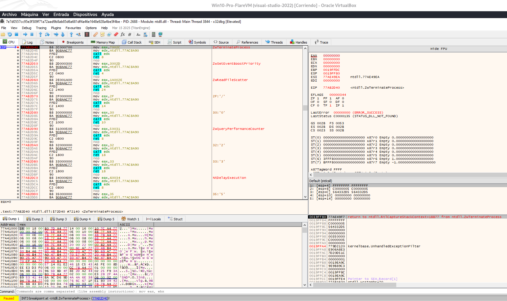


Termina el proceso actual con código C0000005

```bash
C0000005 es ACCESS_VIOLATION.
```


El malware llama voluntariamente a `ExitProcess`


-----------------------------

## **7.4 Obtención del payload final dumpeado desde la muestra original**

Durante las fases anteriores del análisis dinámico se comprobó que la muestra original no expone toda su lógica directamente desde el binario inicial. El comportamiento observado indica que el ejecutable actúa como una primera etapa o loader, encargada de preparar el entorno, realizar operaciones sobre el sistema de archivos, crear estructuras de memoria y reconstruir una segunda imagen en memoria.

Por este motivo, para continuar el análisis no basta con estudiar únicamente la muestra original en Ghidra. Es necesario identificar la región de memoria donde el malware reconstruye el payload final, validarla y volcarla a disco para poder analizarla posteriormente de forma estática.

El objetivo de este apartado es documentar el proceso seguido para obtener ese payload final dumpeado desde la muestra original en ejecución.

### **Localización de la reconstrucción del payload**

Durante la depuración con x32dbg se identificó una zona de ejecución en la que la muestra parecía estar reconstruyendo o copiando una imagen PE por bloques. Este comportamiento se observó al seguir el flujo dinámico de la muestra después de las operaciones de autocopia, creación de memoria y preparación de estructuras internas.

En este punto, avanzar instrucción por instrucción no era viable, ya que el código entraba en un bucle de reconstrucción. Por ello, se decidió colocar breakpoints directamente en puntos posteriores al bucle y en el posible punto de retorno de la función encargada de devolver la dirección base del payload reconstruido.


Vemos la dirección a la que el loader transfiere la ejecución mediante una llamada indirecta:  
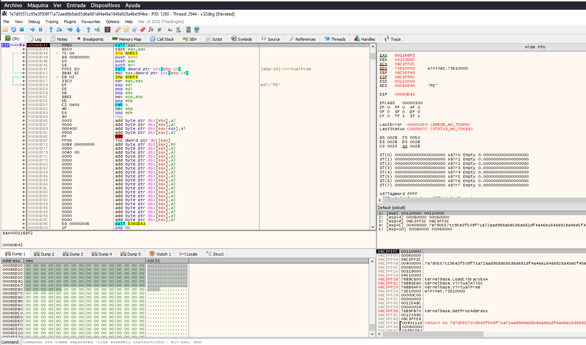

```bash
EIP = 00060D42
instrucción = call eax
EAX = 001166F2
```


El loader ejecuta una llamada indirecta: `call eax` y `EAX` apunta a: `001166F2`. Se está llamando a la `FUN_001166F2`


```bash
ESI = 00110000
EAX = 001166F2
EDI = "PE"
```

Esto sugiere que `00110000` actúa como base del payload reconstruido o cargado en memoria, y que `001166F2` sería una dirección dentro de esa región:

```bash
001166F2 - 00110000 = 0x66F2
```

Por tanto, `0x66F2` puede interpretarse como un offset/RVA interno dentro del payload reconstruido.


En esta captura se observa el momento en el que el loader transfiere la ejecución al payload reconstruido. La instrucción situada en `0x00060D42` realiza un `call eax`, y el registro `EAX` contiene el valor `0x001166F2`. Esta dirección corresponde posteriormente en Ghidra a `FUN_001166F2`, por lo que se identifica como el punto de entrada dinámico del payload final. Además, la presencia de referencias a `VirtualAlloc`, `VirtualFree`, `LoadLibraryExA`, `GetProcAddress` y wininet en la pila refuerza que nos encontramos en una fase de carga y preparación dinámica previa a la ejecución del payload.


> **Nota sobre direcciones y bases de carga:**  
> En el análisis dinámico se observó el payload mapeado en `0x00110000`, con transferencia de ejecución a `0x001166F2`. Esta relación permite calcular el offset interno `0x66F2` dentro del payload reconstruido. Sin embargo, para el análisis en Ghidra algunos volcados se importaron con una base artificial, como `0x00400000`, con el objetivo de facilitar el análisis estático. Por tanto, las direcciones absolutas pueden variar entre x32dbg y Ghidra; lo relevante es conservar la correspondencia entre base de carga, offset interno y punto de entrada.


-------------------------

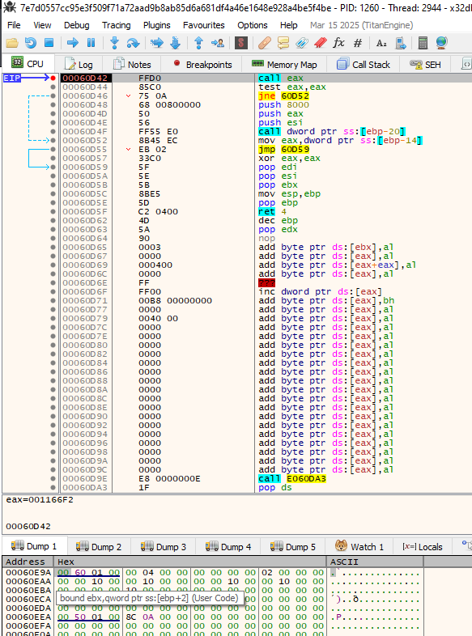


En esta captura se observa el punto de transferencia de ejecución desde el loader hacia el payload reconstruido. La instrucción situada en `0x00060D42` realiza un `call eax`, y el registro `EAX` contiene el valor `0x001166F2`. Esta dirección se corresponde posteriormente, al cargar el payload dumpeado en Ghidra, con la función `FUN_001166F2`. Por tanto, esta evidencia dinámica permite identificar dicha función como el punto de entrada del payload final reconstruido.

Tras la llamada, el loader comprueba el valor de retorno mediante `test eax,eax`. Si el payload devuelve cero, se ejecuta una rutina de limpieza que, por el patrón de argumentos `lpAddress = ESI`, `dwSize = 0` y `dwFreeType = 0x8000`, es compatible con una llamada a `VirtualFree(..., MEM_RELEASE)`. Esto indica que el loader no solo transfiere la ejecución al payload, sino que también controla si la ejecución ha sido satisfactoria y libera la memoria en caso de fallo.


------------------------------------------------


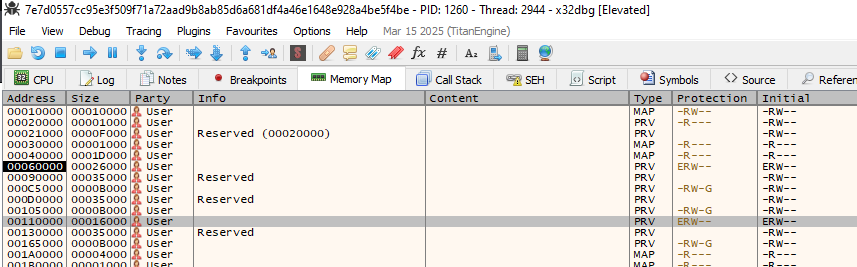

En el mapa de memoria de x32dbg se identifica una región privada con base `0x00110000`, tamaño `0x16000` y permisos `ERW —ejecución, lectura y escritura—`. Esta región resulta relevante porque coincide con el contexto observado justo antes de la transferencia de ejecución al payload: el registro `ESI` contiene `0x00110000`, mientras que EAX contiene `0x001166F2`, dirección utilizada posteriormente por la instrucción call eax.

La diferencia entre ambas direcciones es `0x66F2`, lo que permite interpretar `0x001166F2` como una dirección interna dentro del payload reconstruido. Al cargar posteriormente el payload dumpeado en Ghidra, esa dirección se corresponde con `FUN_001166F2`, identificada como punto de entrada dinámico del payload final.

La presencia de permisos `ERW` en una región privada refuerza la hipótesis de reconstrucción dinámica: el loader escribe el payload en memoria y posteriormente transfiere la ejecución hacia una rutina ubicada dentro de esa misma región.


-----------------------


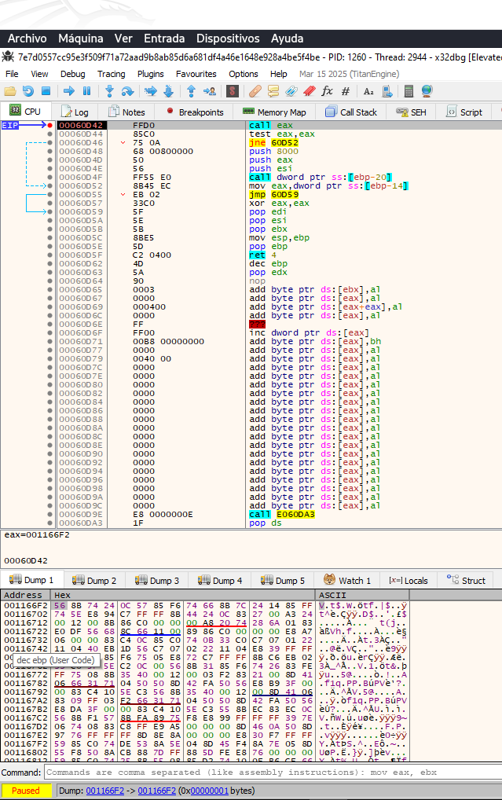

En esta captura se valida el destino real de la transferencia de ejecución. El loader se encuentra en la instrucción `call eax` en la dirección `0x00060D42`, y el registro `EAX` contiene el valor `0x001166F2`. Al seguir esta dirección en el Dump de x32dbg se observa que la memoria contiene instrucciones x86 válidas, comenzando por la secuencia de bytes `56 8B 74 24 0C 57 85 F6...`, que se corresponde con un prólogo funcional de código.

Este hallazgo confirma que `0x001166F2` no es un puntero accidental, sino una dirección de código dentro del payload reconstruido en memoria. Además, al relacionarlo con la región privada identificada previamente con base `0x00110000`, se obtiene el offset interno:

```text
0x001166F2 - 0x00110000 = 0x66F2
```

Por tanto, `0x001166F2` puede interpretarse como una dirección interna del payload final reconstruido, situada en el offset `0x66F2` respecto a la base de carga dinámica. Posteriormente, al cargar el payload dumpeado en Ghidra, esta dirección se corresponde con la función `FUN_001166F2`, que será tomada como punto de entrada dinámico del payload.

Esta evidencia permite justificar el paso del análisis dinámico al análisis estático del payload dumpeado: primero se observa en x32dbg que el loader transfiere la ejecución a `0x001166F2`, y después se analiza esa misma rutina en Ghidra como `FUN_001166F2`.


----------------------------------


1. En dinámico vimos que la muestra reconstruía una imagen PE/payload en memoria.
2. Dumpeamos esa región y la cargamos en Ghidra como payload final.
3. Al mapear manualmente ese PE final, se localizó su zona de entrada.
4. La ejecución reconstruida llegaba a la función `FUN_001166F2`.
5. Al analizar su pseudocódigo, vimos que recibía contexto del loader y transfería ejecución a `FUN_0011668C`.


----------------------------------


## **7.5 El proceso se cierra**
En x32dbg vamos a intentar capturar el punto exacto donde se termina el proceso.


La llamada a ExitProcess viene del propio binario. No ha crasheado. El malware está terminando voluntariamente con código `0`.  


Estamos ante una terminación por excepción no controlada:  


Termina el proceso actual con código `C0000005`
```bash
C0000005 es ACCESS_VIOLATION.
```
El malware llama voluntariamente a `ExitProcess`


## **7.6 Analizamos funciones relevantes de ese payload obtenido**

Una vez identificado y dumpeado el payload reconstruido en memoria, se procede a cargarlo en Ghidra para continuar con un análisis estático más preciso. A diferencia de la muestra original, este fichero no se importa como un ejecutable PE convencional, sino como un volcado crudo de memoria. Por este motivo, en Ghidra se selecciona el formato Raw Binary.


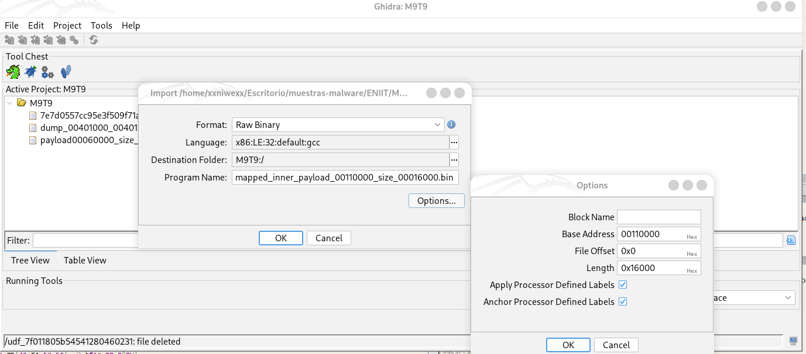

En la configuración de importación se utiliza la arquitectura:

```bash
x86:LE:32:default:gcc
```

Esto es coherente con la arquitectura de la muestra original, que corresponde a un binario Windows de 32 bits. Además, se configura manualmente la dirección base del bloque en:

```bash
Base Address: 0x00110000
```

y el tamaño de la región en:

```bash
Length: 0x16000
```

Estos valores no son arbitrarios. Proceden del análisis dinámico en x32dbg, donde se observó que el payload reconstruido residía en una región privada de memoria con base 0x00110000 y tamaño 0x16000. Esta misma región contenía código ejecutable y era utilizada por el loader para transferir la ejecución mediante una llamada indirecta.

La configuración correcta de la dirección base es fundamental para que las direcciones observadas dinámicamente coincidan con las direcciones analizadas en Ghidra. En x32dbg se observó la siguiente transferencia de ejecución:

```bash
00060D42    call eax
```

con:

```bash
EAX = 001166F2
```

Al cargar el volcado en Ghidra con base 0x00110000, la dirección 0x001166F2 queda correctamente representada dentro del bloque importado. De este modo, Ghidra permite analizar esa zona como código y asignarle una función, identificada como:

```bash
FUN_001166F2
```

Por tanto, FUN_001166F2 no se selecciona de forma arbitraria, sino porque corresponde al destino real de ejecución observado durante el análisis dinámico. El loader reconstruye el payload en memoria, calcula o recupera la dirección 0x001166F2 y transfiere el control a esa dirección mediante call eax.

Esta fase marca el paso del análisis dinámico al análisis estático del payload final. A partir de este punto, el objetivo ya no es estudiar el loader original, sino analizar las funciones internas del payload reconstruido, comenzando por la función que actúa como punto de entrada dinámico.

Las funciones priorizadas para el análisis son:

```bash
FUN_001166F2
FUN_0011668C
FUN_00116658
FUN_00112FA2
FUN_001137AC
FUN_00113AC2
FUN_001138CA
FUN_00113EAF
FUN_00117C26
FUN_00117A6E
FUN_001177E2
FUN_00113988
FUN_0011853C
```

La primera función analizada será FUN_001166F2, ya que representa el punto al que el loader transfiere la ejecución tras reconstruir el payload en memoria.


<div class="page"/>

### **FUN_001166F2**


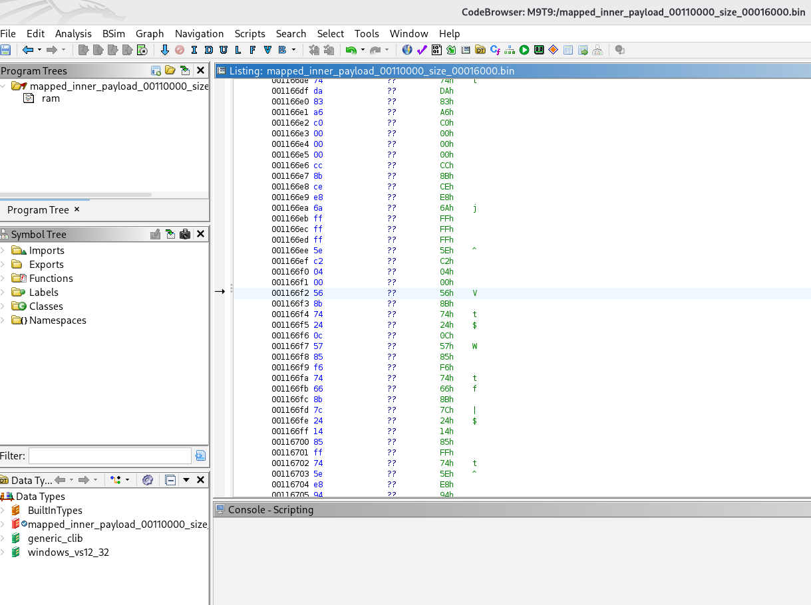


La función `FUN_001166F2` se identifica como una de las funciones más importantes del payload final. En el análisis dinámico, el flujo reconstruido apuntaba a una dirección de entrada probable dentro del payload desempaquetado. Al importar el payload en Ghidra, esta función aparece como una candidata clara a rutina de entrada o función de inicialización principal del payload.

Su importancia radica en que actúa como punto de transición entre el loader original y el código final reconstruido en memoria. Es decir, no parece una función auxiliar aislada, sino una función encargada de recibir el contexto preparado por etapas anteriores y transferir la ejecución hacia la lógica real del payload.


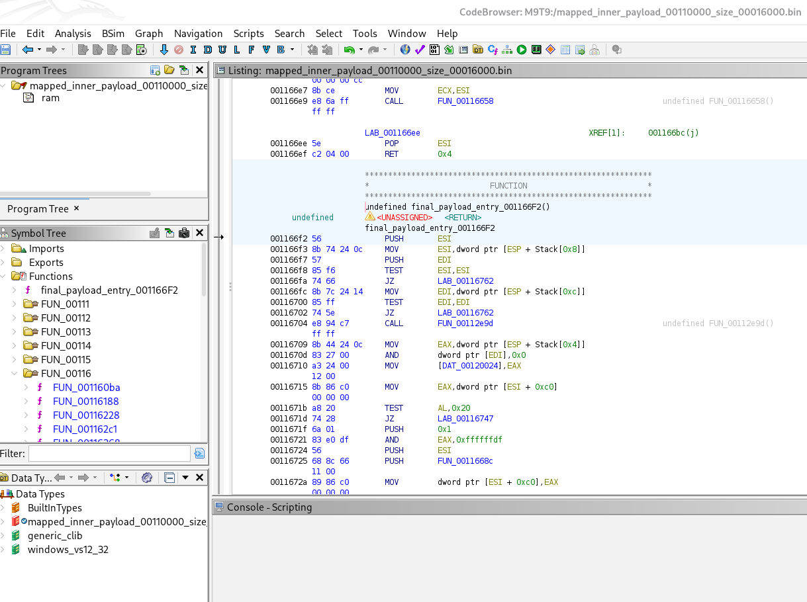


```bash
001166F2  push esi
001166F3  mov esi,dword ptr [esp+0C]
001166F7  push ediFUN_0011668C
001166F8  test esi,esi
001166FA  jz 00116762
001166FC  mov edi,dword ptr [esp+14]
00116700  test edi,edi
00116702  jz 00116762
00116704  call FUN_00112e9d
00116709  mov eax,dword ptr [esp+0C]
0011670D  and dword ptr [edi],0
00116710  mov [DAT_00120024],eax
00116715  mov eax,dword ptr [esi+0C0h]
0011671B  test al,20h
```

Es la rutina de inicialización del payload final.


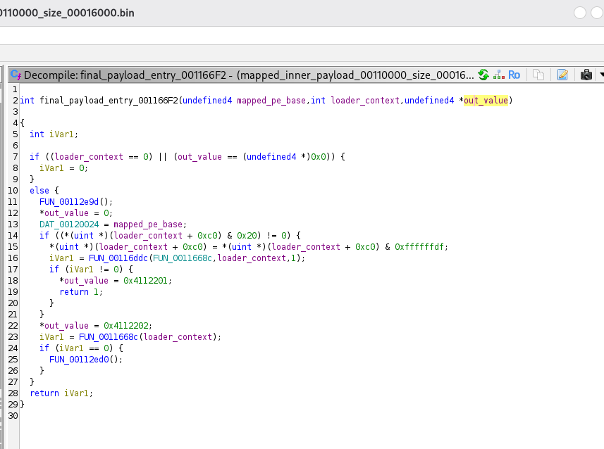


```bash
if ((*(uint *)(loader_context + 0xc0) & 0x20) != 0) {
    *(uint *)(loader_context + 0xc0) &= 0xffffffdf;
    iVar1 = FUN_001106dc(FUN_0011668c, loader_context, 1);
    if (iVar1 != 0) {
        *out_value = 0x4112201;
        return 1;
    }
}

*out_value = 0x4112202;
iVar1 = FUN_0011668c(loader_context);
if (iVar1 == 0) {
    FUN_00112ed0();
}
```

FUN_0011668c es candidata principal a rutina de ejecución real del payload. Vamos a analizarla.


**Pasamos el plugin de capa para ghidra a este payload final dumpeado:**
```
capa_ghidra.py> Running...
INFO:capa_ghidra:running capa using rules from /home/xxniwexx/Escritorio/capa-rules

md5                     e79b55e4a81bc0a37d5af99db8453097                        
sha1                                                                            
sha256                  0ff5e4d5bb5c98396c0c2daa89b685c58e3f540b6edea39fb150e10…
path                    /home/xxniwexx/Escritorio/muestras-malware/ENIIT/M9T9/m…
timestamp               2026-06-05 10:32:04.553597                              
capa version            9.2.1                                                   
os                      unknown os                                              
format                  Raw Binary                                              
arch                    x86                                                     
analysis                static                                                  
extractor               ghidra                                                  
base address            0x0                                                     
rules                   /home/xxniwexx/Escritorio/capa-rules                    
function count          329                                                     
library function count  0                                                       
total feature count     14086                                                   
...
...


64-bit execution via heavens gate (2 matches)
namespace    anti-analysis/anti-disasm                                          
author       awillia2@cisco.com                                                 
scope        function                                                           
mbc          Defense Evasion::Disable or Evade Security Tools::Heavens Gate     
             [F0004.008]                                                        
references   https://download.bitdefender.com/resources/files/News/CaseStudies/…
             https://www.malwaretech.com/2014/02/the-0x33-segment-selector-heav…
description  Looks for instructions related to executing 64-bit code from a     
             32-bit process (Heaven's Gate)                                     
function @ 0x11AD30
  and:
    characteristic: call $+5 = call $+5 pushes the current EIP onto the stack, +5 to jump past call insn bytes @ 0x11AD32
    instruction:
      and:
        mnemonic: add = 'add dword ptr, 5' updates the return address to point after retf @ 0x11AD37
        number: 0x5 = length of add + retf insn bytes @ 0x11AD37
    mnemonic: retf = set EIP = [ESP] and CS = [ESP+4] @ 0x11AD3B
    or: = set up retf to push 0x33 to CS indicating 64-bit mode
      instruction:
        and:
          mnemonic: push @ 0x11AD30
          number: 0x33 @ 0x11AD30
function @ 0x11D53D
  and:
    characteristic: call $+5 = call $+5 pushes the current EIP onto the stack, +5 to jump past call insn bytes @ 0x11D66B
    instruction:
      and:
        mnemonic: add = 'add dword ptr, 5' updates the return address to point after retf @ 0x11D670
        number: 0x5 = length of add + retf insn bytes @ 0x11D670
    mnemonic: retf = set EIP = [ESP] and CS = [ESP+4] @ 0x11D674
    or: = set up retf to push 0x33 to CS indicating 64-bit mode
      instruction:
        and:
          mnemonic: push @ 0x11D669
          number: 0x33 @ 0x11D669

hash data with CRC32
namespace  data-manipulation/checksum/crc32 
author     moritz.raabe@mandiant.com        
scope      function                         
mbc        Data::Checksum::CRC32 [C0032.001]
function @ 0x11E65B
  or:
    and:
      number: 0x1 = bits in a byte @ 0x11E69F, 0x11E6A7, 0x11E6B6, 0x11E6BE
      instruction:
        and:
          operand[1].number: 0x1 @ 0x11E69F
          or:
            mnemonic: and @ 0x11E69F
      instruction:
        and:
          mnemonic: shr @ 0x11E6BE
          number: 0x1 @ 0x11E6BE
        and:
          mnemonic: shr @ 0x11E6B6
          number: 0x1 @ 0x11E6B6
        and:
          mnemonic: shr @ 0x11E6A7
          number: 0x1 @ 0x11E6A7
      characteristic: nzxor @ 0x11E6A9
      operand[1].number: 0xEDB88320 @ 0x11E6A9

encode data using XOR (5 matches)
namespace  data-manipulation/encoding/xor                                       
author     moritz.raabe@mandiant.com                                            
scope      basic block                                                          
att&ck     Defense Evasion::Obfuscated Files or Information [T1027]             
mbc        Defense Evasion::Obfuscated Files or Information::Encoding-Standard  
           Algorithm [E1027.m02], Data::Encode Data::XOR [C0026.002]            
basic block @ 0x11395B in function 0x113900
  and:
    characteristic: tight loop @ 0x11395B
    characteristic: nzxor @ 0x113965
    not: = filter for potential false positives
      or:
        or: = unsigned bitwise negation operation (~i)
          number: 0xFFFFFFFF = bitwise negation for unsigned 32 bits
          number: 0xFFFFFFFFFFFFFFFF = bitwise negation for unsigned 64 bits
        or: = signed bitwise negation operation (~i)
          number: 0xFFFFFFF = bitwise negation for signed 32 bits
          number: 0xFFFFFFFFFFFFFFF = bitwise negation for signed 64 bits
        or: = Magic constants used in the implementation of strings functions.
          number: 0x7EFEFEFF = optimized string constant for 32 bits
          number: 0x81010101 = -0x81010101 = 0x7EFEFEFF
          number: 0x81010100 = 0x81010100 = ~0x7EFEFEFF
          number: 0x7EFEFEFEFEFEFEFF = optimized string constant for 64 bits
          number: 0x8101010101010101 = -0x8101010101010101 = 0x7EFEFEFEFEFEFEFF
          number: 0x8101010101010100 = 0x8101010101010100 = ~0x7EFEFEFEFEFEFEFF
basic block @ 0x1139FD in function 0x113988
  and:
    characteristic: tight loop @ 0x1139FD
    characteristic: nzxor @ 0x113A10
    not: = filter for potential false positives
      or:
        or: = unsigned bitwise negation operation (~i)
          number: 0xFFFFFFFF = bitwise negation for unsigned 32 bits
          number: 0xFFFFFFFFFFFFFFFF = bitwise negation for unsigned 64 bits
        or: = signed bitwise negation operation (~i)
          number: 0xFFFFFFF = bitwise negation for signed 32 bits
          number: 0xFFFFFFFFFFFFFFF = bitwise negation for signed 64 bits
        or: = Magic constants used in the implementation of strings functions.
          number: 0x7EFEFEFF = optimized string constant for 32 bits
          number: 0x81010101 = -0x81010101 = 0x7EFEFEFF
          number: 0x81010100 = 0x81010100 = ~0x7EFEFEFF
          number: 0x7EFEFEFEFEFEFEFF = optimized string constant for 64 bits
          number: 0x8101010101010101 = -0x8101010101010101 = 0x7EFEFEFEFEFEFEFF
          number: 0x8101010101010100 = 0x8101010101010100 = ~0x7EFEFEFEFEFEFEFF
basic block @ 0x113A57 in function 0x113A33
  and:
    characteristic: tight loop @ 0x113A57
    characteristic: nzxor @ 0x113A67
    not: = filter for potential false positives
      or:
        or: = unsigned bitwise negation operation (~i)
          number: 0xFFFFFFFF = bitwise negation for unsigned 32 bits
          number: 0xFFFFFFFFFFFFFFFF = bitwise negation for unsigned 64 bits
        or: = signed bitwise negation operation (~i)
          number: 0xFFFFFFF = bitwise negation for signed 32 bits
          number: 0xFFFFFFFFFFFFFFF = bitwise negation for signed 64 bits
        or: = Magic constants used in the implementation of strings functions.
          number: 0x7EFEFEFF = optimized string constant for 32 bits
          number: 0x81010101 = -0x81010101 = 0x7EFEFEFF
          number: 0x81010100 = 0x81010100 = ~0x7EFEFEFF
          number: 0x7EFEFEFEFEFEFEFF = optimized string constant for 64 bits
          number: 0x8101010101010101 = -0x8101010101010101 = 0x7EFEFEFEFEFEFEFF
          number: 0x8101010101010100 = 0x8101010101010100 = ~0x7EFEFEFEFEFEFEFF
basic block @ 0x113BC0 in function 0x113B15
  and:
    characteristic: tight loop @ 0x113BC0
    characteristic: nzxor @ 0x113BCA
    not: = filter for potential false positives
      or:
        or: = unsigned bitwise negation operation (~i)
          number: 0xFFFFFFFF = bitwise negation for unsigned 32 bits
          number: 0xFFFFFFFFFFFFFFFF = bitwise negation for unsigned 64 bits
        or: = signed bitwise negation operation (~i)
          number: 0xFFFFFFF = bitwise negation for signed 32 bits
          number: 0xFFFFFFFFFFFFFFF = bitwise negation for signed 64 bits
        or: = Magic constants used in the implementation of strings functions.
          number: 0x7EFEFEFF = optimized string constant for 32 bits
          number: 0x81010101 = -0x81010101 = 0x7EFEFEFF
          number: 0x81010100 = 0x81010100 = ~0x7EFEFEFF
          number: 0x7EFEFEFEFEFEFEFF = optimized string constant for 64 bits
          number: 0x8101010101010101 = -0x8101010101010101 = 0x7EFEFEFEFEFEFEFF
          number: 0x8101010101010100 = 0x8101010101010100 = ~0x7EFEFEFEFEFEFEFF
basic block @ 0x113E99 in function 0x113E86
  and:
    characteristic: tight loop @ 0x113E99
    characteristic: nzxor @ 0x113E9F
    not: = filter for potential false positives
      or:
        or: = unsigned bitwise negation operation (~i)
          number: 0xFFFFFFFF = bitwise negation for unsigned 32 bits
          number: 0xFFFFFFFFFFFFFFFF = bitwise negation for unsigned 64 bits
        or: = signed bitwise negation operation (~i)
          number: 0xFFFFFFF = bitwise negation for signed 32 bits
          number: 0xFFFFFFFFFFFFFFF = bitwise negation for signed 64 bits
        or: = Magic constants used in the implementation of strings functions.
          number: 0x7EFEFEFF = optimized string constant for 32 bits
          number: 0x81010101 = -0x81010101 = 0x7EFEFEFF
          number: 0x81010100 = 0x81010100 = ~0x7EFEFEFF
          number: 0x7EFEFEFEFEFEFEFF = optimized string constant for 64 bits
          number: 0x8101010101010101 = -0x8101010101010101 = 0x7EFEFEFEFEFEFEFF
          number: 0x8101010101010100 = 0x8101010101010100 = ~0x7EFEFEFEFEFEFEFF

contain an embedded PE file
namespace  executable/subfile/pe                        
author     moritz.raabe@mandiant.com                    
scope      file                                         
mbc        Execution::Install Additional Program [B0023]
or:
  count(characteristic(embedded pe)): 1 or more @ file+0x110000


Script /home/xxniwexx/ghidra_scripts/capa_ghidra.py called exit with code 0
capa_ghidra.py> Finished!
``` 


Tras desempaquetar y mapear manualmente el PE final, la ejecución llega a `final_payload_entry_001166F2`. Esta función recibe como argumentos la base del `PE` mapeado, el contexto del loader original y un puntero de salida. Realiza una inicialización global, comprueba flags en `loader_context + 0xC0` y transfiere la ejecución principal a `FUN_0011668c`. Si el `flag 0x20` está activo, ejecuta `FUN_0011668c` a través de un wrapper `FUN_001106dc`. En caso contrario, llama directamente a `FUN_0011668c`. Por tanto, `FUN_0011668c` es la siguiente función prioritaria para analizar.

------------------------------------


### **FUN_0011668C**

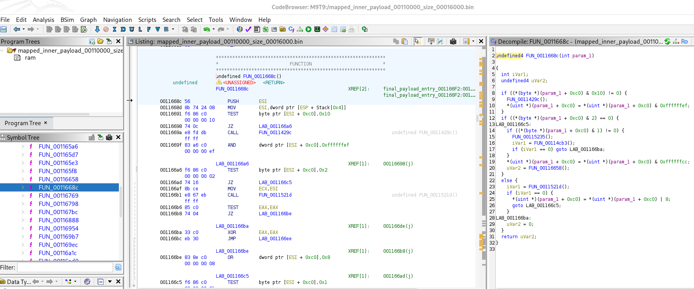


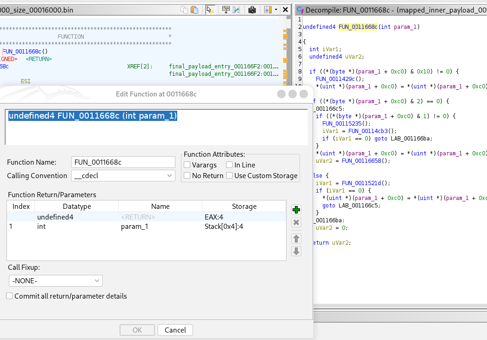

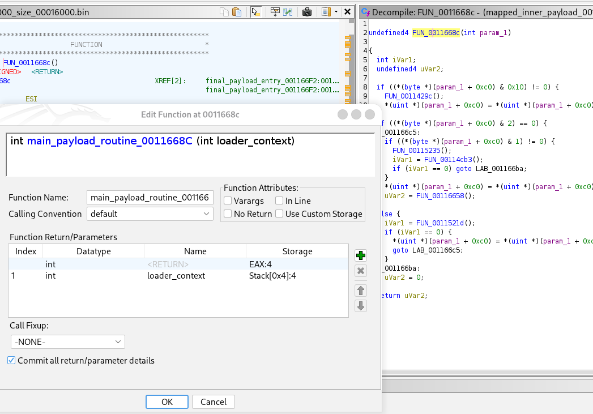

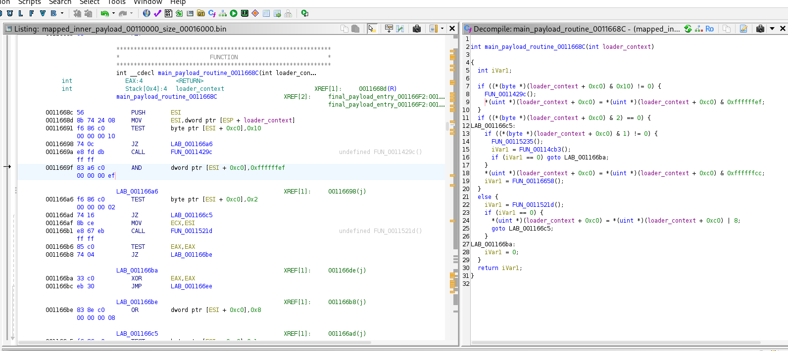


```bash
Posible interpretación:
flag 0x10 -> ejecuta una rutina previa y limpia el bit.
flag 0x02 -> activa una ruta alternativa.
flag 0x01 -> exige una comprobación previa.
flag 0x08 -> se marca cuando falla FUN_0011521d y se fuerza la ruta principal.
```

----------------------------------------

### **FUN_00116658**

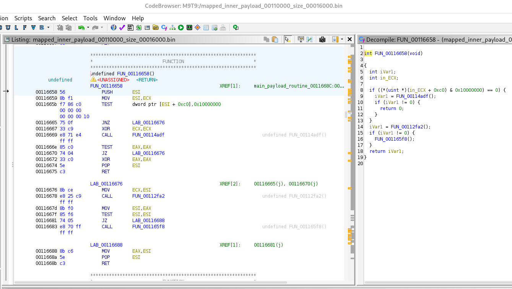


```c
int main_execution_path_00116658(int loader_context)
{
    int result;

    if ((*(uint *)(loader_context + 0xC0) & 0x01000000) == 0) {
        result = FUN_00114adf(0);

        if (result != 0) {
            return 0;
        }
    }

    result = FUN_00112fa2(loader_context);

    if (result != 0) {
        FUN_001165f8();
    }

    return result;
}
```


`FUN_00114adf` es una función de precheck/guardia. Puede ser una comprobación de entorno, estado, inicialización, anti-debug o simplemente una validación interna. Hay que revisarla.


--------------------------

### **FUN_00112FA2**

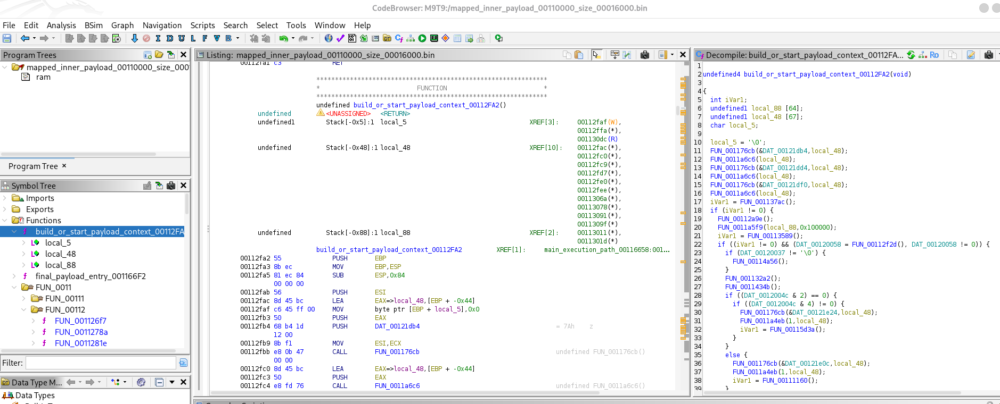


Parece ser una función orquestadora principal: prepara configuración, valida contexto, inicializa recursos y elige una rama de ejecución según flags globales. No hay comprobación anti-VM directa aquí.

`build_or_start_payload_context_00112FA2` es una rutina de inicialización y arranque del payload final. No implementa claramente `anti-VM`, pero llama a varias funciones candidatas a contener validaciones de entorno.

-----------------------------------

<div class="page"/>

### **FUN_001137AC**

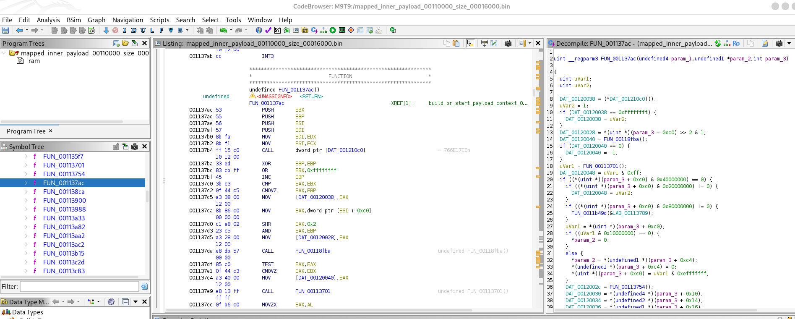

Es una función de inicialización/validación del contexto del loader que copia datos del loader_context a variables globales, interpreta flags y prepara estructuras internas.

-------------------------------


### **FUN_001138CA**

```bash
void set_config_index_from_seed_001138CA(uint seed)
{
    uint entry_count;
    uint selected_index;

    acquire_spinlock(&global_config_lock);

    entry_count = *(byte *)(global_config_blob_ptr + 0x204);

    selected_index = seed % entry_count;

    global_config_access_counter++;
    global_config_selected_index = selected_index;

    release_spinlock(&global_config_lock);
}
```

Esta función probablemente selecciona una entrada dentro de la configuración. Puede ser:

- un C2;
- una URL;
- un perfil de comunicación;
- una clave;
- una tarea;
- una entrada de configuración interna.

Todavía no sabemos cuál, pero el patrón `seed % count` es típico para elegir una entrada de una lista.


------------------------

<div class="page"/>

### **FUN_00113EAF**

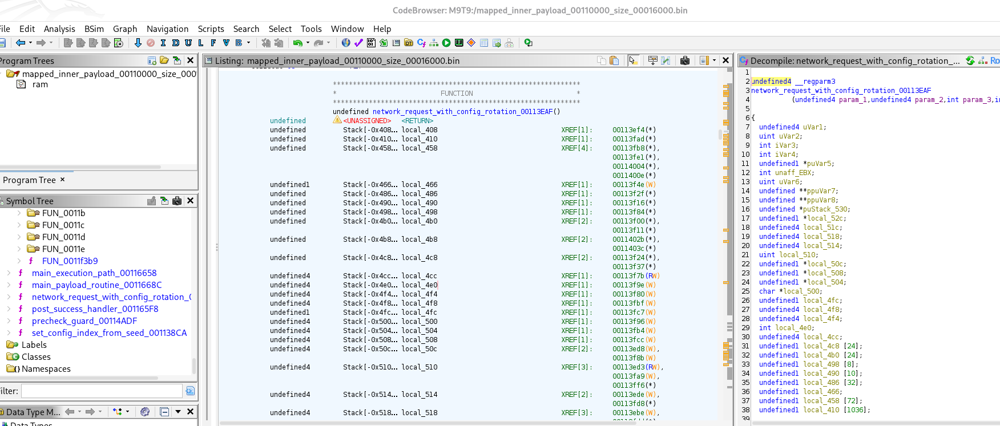

Parece una rutina de comunicación `HTTP/C2` con selección de entrada de configuración y reintentos.

Lo que sí vemos es:
```bash
comunicación HTTP
Content-Type application/octet-stream
manejo de HTTP 200 y 403
rotación de entrada de configuración
reintentos con Sleep(1000)
```

Orden de prioridad para analizar:
1. FUN_00117C26  ; envío HTTP
2. FUN_00113988  ; obtención de entrada config/C2
3. FUN_00113E86  ; construcción URL/endpoint
4. FUN_0011B9E7  ; preparación/cifrado del payload HTTP


----------------------------

### **FUN_00117C26**

Es una rutina de transacción HTTP. FUN_00117C26 es una función de comunicación HTTP. Con alta confianza:
- prepara un request HTTP;
- añade cabeceras realistas de navegador;
- soporta envío simple o envío por chunks;
- consulta códigos HTTP;
- lee respuesta;
- posiblemente descomprime/decodifica gzip/deflate;
- devuelve el código HTTP al caller.


----------------------

<div class="page"/>

### **FUN_00117A6E**

Es la función que consulta el código HTTP y lee el cuerpo de la respuesta. Esta función forma parte clara de la comunicación C2:
1. Consulta el código HTTP.
2. Lee el cuerpo completo de la respuesta.
3. Reasigna memoria dinámicamente según los bytes disponibles.
4. Devuelve el status code HTTP.
5. Guarda la respuesta en un buffer de salida.


La cadena de red queda así:
```bash

http_c2_request_retry_loop_00113EAF
    -> http_transaction_candidate_00117C26
        -> read_http_response_body_00117A6E
```


-----------------------------------


### **FUN_001177E2**


Esta función crea los handles de WinINet: InternetOpen, InternetConnect y HttpOpenRequest, elige entre HTTP/HTTPS, parsea puerto opcional y configura flags de seguridad.

Con esta función, la cadena de red queda bastante cerrada:

```bash
http_c2_request_retry_loop_00113EAF
    -> http_transaction_candidate_00117C26
        -> create_or_open_http_request_001177E2
            -> InternetOpen
            -> InternetConnect
            -> HttpOpenRequest
            -> InternetSetOption
        -> HttpAddRequestHeaders
        -> HttpSendRequest / HttpSendRequestEx / InternetWriteFile
        -> read_http_response_body_00117A6E
            -> HttpQueryInfo
            -> InternetQueryDataAvailable
            -> InternetReadFile
```

Esto confirma que el payload final implementa comunicación HTTP/HTTPS con C2, con soporte GET/POST, cabeceras de navegador, body binario y lectura/posible descompresión de respuesta.

Siguiente paso útil: analizamos FUN_00113988, porque esa debería sacar la entrada C2/configuración actual del global_config_blob_ptr. Ahí podremos intentar recuperar host, ruta, puerto o lista de servidores.

-------------------


### **FUN_00113988**

Es la función que obtiene y descifra una entrada de configuración/C2 de 0x40 bytes desde el bloque global DAT_001200F4.

La renombramos como: `get_decoded_config_entry_00113988`.

`FUN_00113988` es la función que selecciona y descifra una entrada de configuración, probablemente una entrada C2 o perfil de comunicación. Devuelve el índice seleccionado y escribe una estructura descifrada de 0x40 bytes en el buffer que le pasa el caller.

La hipótesis fuerte ahora es:
```bash
El malware contiene una tabla de entradas C2 cifradas/ofuscadas.
Cada entrada mide 0x44 bytes.
Cada entrada se descifra mediante PRNG + XOR.
La entrada descifrada de 0x40 bytes se usa para construir la petición HTTP/HTTPS.
```

----------------------------

### **FUN_0011853C**

Esta función es el PRNG que usa el malware para generar bytes de clave. En el contexto que veníamos analizando, sirve para descifrar por XOR las entradas de configuración/C2.

Esta función confirma que la configuración está ofuscada con un esquema sencillo:

```bash
LCG + XOR byte a byte
```

Es una rutina criptográfica/ofuscación usada para recuperar datos de configuración, probablemente entradas C2, rutas HTTP o perfiles de comunicación.

---------------------------------

## **7.7 Comunicación con C2 en dinámico**

El siguiente paso es extraer y descifrar la configuración/C2. Ya tenemos:

```bash
global_config_blob_ptr = DAT_001200F4
entry_count            = *(byte *)(global_config_blob_ptr + 0x204)
first_entry            = global_config_blob_ptr + 0x206
entry_size             = 0x44
entry format           = DWORD seed + 0x40 bytes cifrados
decoding               = LCG + XOR
```

Esto sale de `get_decoded_config_entry_00113988` y del `PRNG FUN_0011853C`. La función de red usa esas entradas para construir peticiones `HTTP/HTTPS` y luego llama a la rutina de transacción `HTTP` que ya identificamos.


En x32dbg, ejecutamos hasta después de que se haya llamado a: `00113AC2`. Para ello, ponemos un bp en `00113B05`. Ahí está: `00113B05  mov dword ptr [DAT_001200F4], edi`:

Estando parados en el bp --> Dump 1 -> Ctrl+G -> 001200F4 -->  
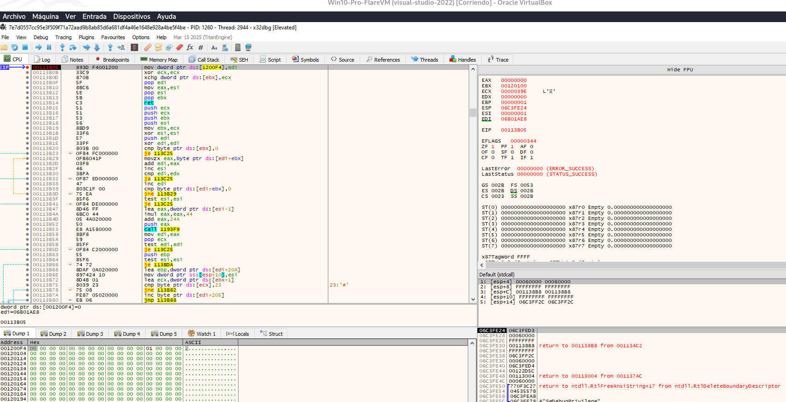


-------------------------


Pulsamos F8 una sola vez.

Después de ese F8, la instrucción se ejecutará y 001200F4 pasa contener: `E8 1A B0 06`.

que en little endian significa: `DAT_001200F4 = 06B01AE8`

-------------------------------


Ahora en Dump 1 --> `Ctrl + G` --> 06B01AE8


Ahora estamos en el inicio del config_blob:

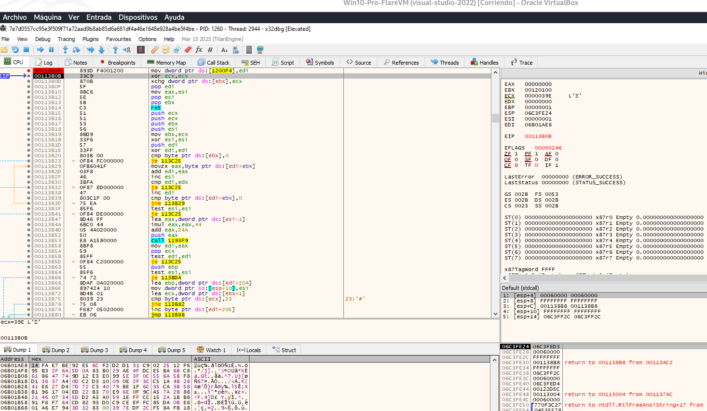

--------------------------------------

<div class="page"/>

Después vamos al contador de entradas: --> Ctrl + G --> 06B01CEC

porque:

```bash
06B01AE8 + 0x204 = 06B01CEC
```

El byte que aparezca en `06B01CEC` es el número de entradas de configuración/C2:
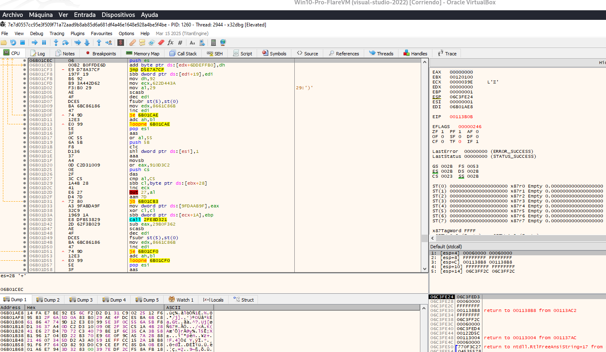


y el byte que aparece ahí es:

```bash
06
```

Eso significa:

```bash
entry_count = 6
```


Ya sabemos:
```bash
config_blob_base = 06B01AE8
entry_count      = 06
entry_size       = 0x44
entries_offset   = 0x206
```

Entonces:
```bash
size = 0x206 + entry_count * 0x44
size = 0x206 + 6 * 0x44
size = 0x206 + 0x198
size = 0x39E
```

Por tanto, el bloque a dumpear es:
```bash
Inicio: 06B01AE8
Tamaño: 0000039E
Final:  06B01AE8 + 0x39E - 1 = 06B01E85
```

--------------------------------

## **7.8 Dumpeamos el blob obtenido**

En x32dbg, usamos: 
```bash
savedata "C:\Users\usuario\Desktop\config_blob.bin", 06B01AE8, 0000039E
```


Script para descifrar las 6 entradas:
```py
from pathlib import Path
import string

CONFIG_PATH = "config_blob.bin"

def lcg_next(seed: int):
    seed = (seed * 0x41C64E6D + 0x3039) & 0xFFFFFFFF
    return seed, seed & 0x7FFFFFFF

def decode_entry(entry: bytes) -> bytes:
    seed = int.from_bytes(entry[:4], "little")
    encoded = entry[4:0x44]

    out = bytearray()
    for b in encoded:
        seed, value = lcg_next(seed)
        out.append(b ^ (value & 0xFF))

    return bytes(out)

def printable(data: bytes) -> str:
    return "".join(chr(b) if chr(b) in string.printable and b != 0 else "." for b in data)

blob = Path(CONFIG_PATH).read_bytes()

count = blob[0x204]
print(f"entry_count = {count}")

for i in range(count):
    off = 0x206 + i * 0x44
    raw_entry = blob[off:off + 0x44]

    if len(raw_entry) != 0x44:
        print(f"[!] Entrada {i} incompleta")
        break

    decoded = decode_entry(raw_entry)

    print(f"\n=== Entry {i} ===")
    print(f"raw offset: 0x{off:04X}")
    print("decoded hex:")
    print(decoded.hex(" "))
    print("decoded ascii:")
    print(printable(decoded))
```


Obtenemos:
```py
└─$ python decode_config.py
entry_count = 6

=== Entry 0 ===
raw offset: 0x0206
decoded hex:
6e 69 6e 74 68 63 6c 75 62 2e 63 6f 6d 00 00 00 00 00 00 00 00 00 00 00 00 00 00 00 00 00 00 00 00 00 00 00 00 00 00 00 00 00 00 00 00 00 00 00 00 00 00 00 00 00 00 00 00 00 00 00 00 00 00 00
decoded ascii:
ninthclub.com...................................................

=== Entry 1 ===
raw offset: 0x024A
decoded hex:
63 61 6d 65 6c 63 61 70 2e 63 6f 6d 00 00 00 00 00 00 00 00 00 00 00 00 00 00 00 00 00 00 00 00 00 00 00 00 00 00 00 00 00 00 00 00 00 00 00 00 00 00 00 00 00 00 00 00 00 00 00 00 00 00 00 00
decoded ascii:
camelcap.com....................................................

=== Entry 2 ===
raw offset: 0x028E
decoded hex:
69 64 65 61 67 72 65 65 6e 73 2e 63 6f 6d 00 00 00 00 00 00 00 00 00 00 00 00 00 00 00 00 00 00 00 00 00 00 00 00 00 00 00 00 00 00 00 00 00 00 00 00 00 00 00 00 00 00 00 00 00 00 00 00 00 00
decoded ascii:
ideagreens.com..................................................

=== Entry 3 ===
raw offset: 0x02D2
decoded hex:
67 75 65 73 73 74 72 61 64 65 2e 63 6f 6d 00 00 00 00 00 00 00 00 00 00 00 00 00 00 00 00 00 00 00 00 00 00 00 00 00 00 00 00 00 00 00 00 00 00 00 00 00 00 00 00 00 00 00 00 00 00 00 00 00 00
decoded ascii:
guesstrade.com..................................................

=== Entry 4 ===
raw offset: 0x0316
decoded hex:
63 61 73 74 75 6e 69 6e 67 2e 72 75 00 00 00 00 00 00 00 00 00 00 00 00 00 00 00 00 00 00 00 00 00 00 00 00 00 00 00 00 00 00 00 00 00 00 00 00 00 00 00 00 00 00 00 00 00 00 00 00 00 00 00 00
decoded ascii:
castuning.ru....................................................

=== Entry 5 ===
raw offset: 0x035A
decoded hex:
6d 67 73 6d 65 64 69 61 2e 72 75 00 00 00 00 00 00 00 00 00 00 00 00 00 00 00 00 00 00 00 00 00 00 00 00 00 00 00 00 00 00 00 00 00 00 00 00 00 00 00 00 00 00 00 00 00 00 00 00 00 00 00 00 00
decoded ascii:
mgsmedia.ru.....................................................
``` 

**Esto confirma que el descifrado está bien y que esas 6 entradas son dominios C2/configuración de red.**

**Los IOCs extraídos son:**

```bash
ninthclub.com
camelcap.com
ideagreens.com
guesstrade.com
castuning.ru
mgsmedia.ru
```


-----------------------------

**Qué hemos demostrado hasta ahora**
- El payload final contiene un bloque de configuración cifrado/ofuscado. 
- El byte en `config_blob + 0x204` indica el número de entradas: `6`. 
- Cada entrada mide `0x44` bytes: un DWORD de semilla seguido de 0x40 bytes cifrados. 
- El descifrado usa un `PRNG LCG` con la fórmula:

```bash
state = state * 0x41C64E6D + 0x3039
```

y cada byte de la entrada se recupera mediante `XOR` con el byte bajo del valor generado.

Resultado:

```bash
Entrada 0 -> ninthclub.com
Entrada 1 -> camelcap.com
Entrada 2 -> ideagreens.com
Entrada 3 -> guesstrade.com
Entrada 4 -> castuning.ru
Entrada 5 -> mgsmedia.ru
```

<mark>Hemos conseguido demostrar la configuración C2 recuperada dinámicamente tras desempaquetado y descifrado.</mark>


----------------------------------


## **7.9 Uso de dominios recuperados**

Vamos a analizar `FUN_00113E86`.

En `network_request_with_config_rotation_00113EAF`, esta función se llama antes de preparar la petición `HTTP/C2`. Justo después, el resultado se pasa a otra función con tamaño 0x10, así que parece que esos `16` bytes son algún tipo de:

```bash
ID
nonce
clave
token
identificador de bot
material criptográfico

```


Ponemos breakpoint en: `00113E86`


**Pero el proceso termina.**


------------------------------


## **7.10 Terminación del proceso en x32dbg**
Cuando se termina el proceso en x32dbg y tenemos que empezar desde cero, para llegar a las zonas calientes del malware, debemos:

1. Abrimos la muestra original

2. Limpiamos estos breakpoints internos:
```bash
000977E2
00097A6E
00097C26
00093EAF
```


Dejamos sólo:

```bash
00060D42
```

3. Llegamos primero a `00060D42 call eax`. Tenemos que volver a este punto:

```bash
00060D42  call eax
```

Ahí el loader transfiere ejecución al payload final.

Cuando estamos ahí, miramos registros:

```bash
ESI = base actual del payload
EAX = entrypoint final
```

Ejemplo anterior:
```bash

ESI = 00090000
EAX = 000966F2
```

Entonces:

```bash
base = 00090000
```


4. Sólo entonces calculamos los BPs internos

Con base `00090000`, serían:

```bash
base + 0x77E2 = 000977E2   ; create_or_open_http_request
base + 0x7A6E = 00097A6E   ; read_http_response_body
base + 0x7C26 = 00097C26   ; http_transaction
base + 0x3EAF = 00093EAF   ; rutina C2 principal
```

Pero si en la nueva ejecución ESI es, por ejemplo:

```bash
00110000
```

entonces serían:

```bash
001177E2
00117A6E
00117C26
00113EAF
```


Sobre los breakpoints de `WinINet`

Que no te deje poner:

```bash
wininet.HttpOpenRequestA
wininet.HttpSendRequestA
wininet.HttpQueryInfoA
wininet.InternetReadFile
```

significa que wininet.dll aún no está cargada o x32dbg todavía no resolvió esos exports.

Haz esto en vez de ponerlos al inicio:

```bash
Primero pon breakpoints de carga de DLL
bp kernel32.LoadLibraryA
bp kernel32.LoadLibraryW
bp kernel32.LoadLibraryExA
bp kernel32.LoadLibraryExW
bp ntdll.LdrLoadDll
```

Pulsa F9.

Cuando pare, miramos el argumento de la DLL. Si vemos:

```bash
wininet.dll

```
dejamos que retorne y entonces ya ponemos los bps:

```bash
bp wininet.InternetOpenA
bp wininet.InternetConnectA
bp wininet.HttpOpenRequestA
bp wininet.HttpSendRequestA
bp wininet.HttpSendRequestExA
bp wininet.InternetWriteFile
bp wininet.HttpQueryInfoA
bp wininet.InternetReadFile
```

También probamos las versiones W:

```bash
bp wininet.InternetOpenW
bp wininet.InternetConnectW
bp wininet.HttpOpenRequestW
bp wininet.HttpSendRequestW
bp wininet.HttpQueryInfoW
bp wininet.InternetReadFile
```


Reiniciamos la muestra y pulsamos f9:

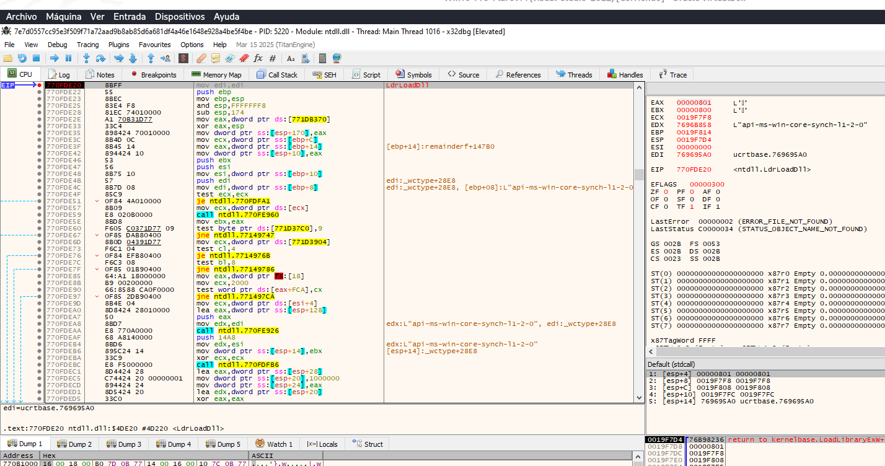

Cada vez que pare, miramos el nombre que aparece en los comentarios de registros o en la pila. Ahora vemos: `L"api-ms-win-core-synch-l1-2-0"`.

Tenemos que seguir hasta que veamos algo como: `L wininet.dll` o: `wininet.dll`.

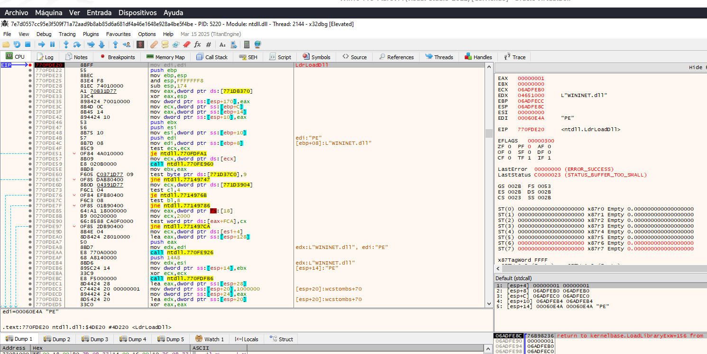

Cuando veamos wininet.dll, entonces sí: Dejamos que termine esa carga, normalmente con: `Ctrl + F9` para volver del LdrLoadDll.

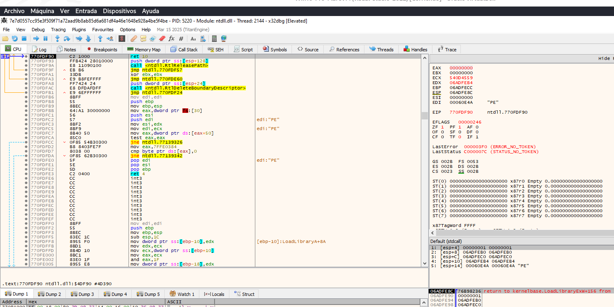


Si wininet.dll ya está cargada en `Memory Map`, ahora ya sí podemos poner los breakpoints: 
```bash
bp wininet.InternetOpenA
bp wininet.InternetConnectA
bp wininet.HttpOpenRequestA
bp wininet.HttpSendRequestA
bp wininet.HttpSendRequestExA
bp wininet.InternetWriteFile
bp wininet.HttpQueryInfoA
bp wininet.InternetReadFile
```

<div class="page"/>

Ahora no podemos poner BPs internos del payload todavía
```bash
000977E2
00097A6E
00097C26

```
hasta volver al punto:

```bash
00060D42  call eax
```

ya que tenemos que confirmar la base actual del payload en ESI.


Ponemos los bps:
```bash
bp kernel32.VirtualAlloc
bp kernelbase.VirtualAlloc
bp kernel32.VirtualProtect
bp kernelbase.VirtualProtect
```


----------------------------

### **La ejecución termina**


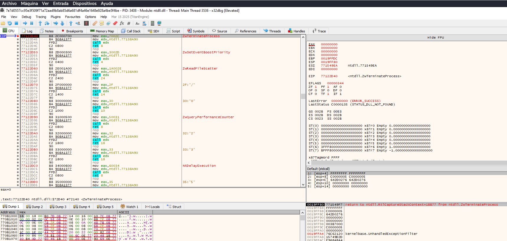


El proceso termina por:

```bash
ntdll.ZwTerminateProcess
```

y el código de salida es:

```bash
C0000005
```

Es decir:

```bash
STATUS_ACCESS_VIOLATION
```

En la pila se ve:

```bash
[esp+4] = FFFFFFFF    ; proceso actual
[esp+8] = C0000005    ; exit status
```


------------------------


1. El proceso no llega a usar WinINet.
2. Termina con C0000005 / ACCESS_VIOLATION.
3. La excepción cae en 00401132.
4. 00401132 pertenece a FUN_00401010.
5. FUN_00401010 es llamada desde 00406503.
6. El caller de 00406503 parece una rutina de GUI/GDI, no la rutina principal de red.

-------------------------------


Hemos encontrado varias señales compatibles con anti-análisis:

```bash
IsDebuggerPresent
GetTickCount
GetSystemInfo
QueryPerformanceCounter
RaiseException
Sleep
IsProcessorFeaturePresent
```

Pero que exista la string/import no demuestra aún que esté usando anti-debug. Hay que ver quién la llama y qué hace con el resultado.


-----------------------------

<div class="page"/>

## **7.11 XREFs a IsDebuggerPresent**

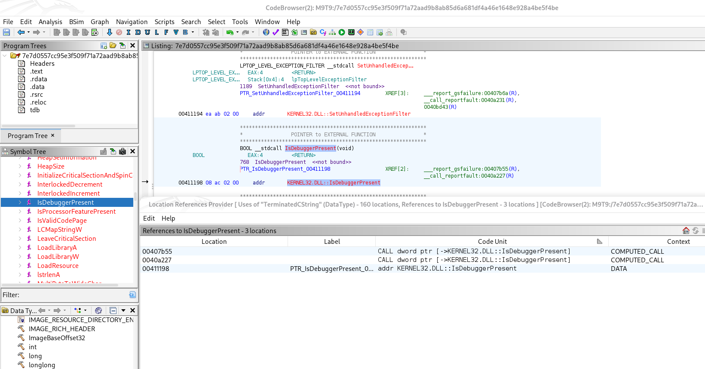


Esto sí confirma anti-debug directo.

Hemos encontrado referencias a `IsDebuggerPresent` en:

```bash
00407b55
0040a227
```

y además aparece dentro de funciones relacionadas con reporte de fallo:

```bash
__report_gsfailure
_call_reportfault
```

----------------------

**Primer isdebbuggerpresent en 0040b55**

`FUN_00401010` está corrompiendo la pila o recibe argumentos que hacen que escriba fuera de rango. Al llegar al epílogo, `__security_check_cookie` detecta que el stack cookie ha cambiado. Entonces llama a `__report_gsfailure`. Esa rutina usa `IsDebuggerPresent` como parte del reporte.
Finalmente termina el proceso con `TerminateProcess`.


“Rompe porque se produce una corrupción de pila detectada por /GS. La llamada a `IsDebuggerPresent` forma parte del manejador estándar de fallo de seguridad, no necesariamente de una rutina anti-debug propia.”


-------------------------------------------

**Segundo isdebbuggerpresent en en 0040a227**

El binario importa `IsDebuggerPresent` y contiene referencias en `00407b55` y `0040a227`. Sin embargo, ambas aparecen dentro de rutinas asociadas a reporte de excepciones/fallos del runtime, junto con `SetUnhandledExceptionFilter`, `UnhandledExceptionFilter`, `TerminateProcess` y `__security_check_cookie.` Por tanto, estas referencias por sí solas no demuestran una técnica anti-debug propia del malware.


--------------------------------

<div class="page"/>

## **7.12 Transformación del bloque dinámico**

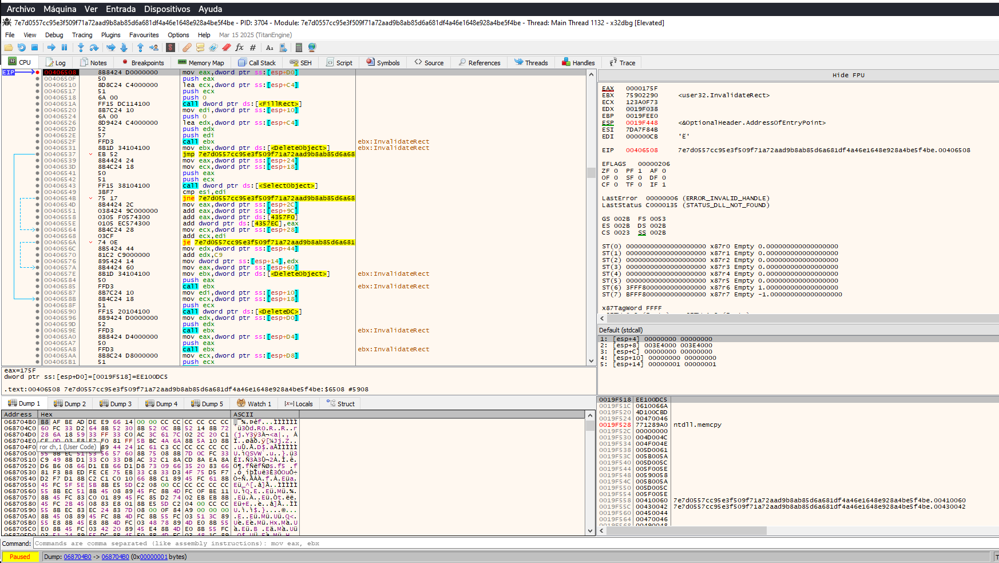

Probablemente ha transformado un bloque dinámico que empieza en:


```bash
savedata "C:\Users\Usuario\Desktop\stage_region_06870000_8000.bin", 06870000, 8000

```

Lo cargamos en Ghidra:

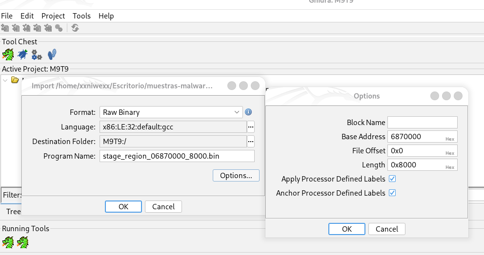


El bloque dinámico decodificado contiene un stage ejecutable. Su inicio en `068704B0` actúa como trampolín, cargando `0xDEADBEEF` en `EAX` y saltando a `06871920`. Dentro del mismo bloque aparece una rutina que accede al PEB mediante `fs:[30h]` y recorre estructuras del `loader`, lo que *+indica resolución manual de módulos/API en memoria.**

Ahora lo más útil es analizar `06871920` y `068704C0`.


--------------------------------


## **7.13 FUN_068704C0**

**Se confirma que el stage usa resolución manual de APIs:**
```bash
PEB -> LDR -> lista de módulos -> hash del nombre -> base de kernel32.dll

```

------


## **7.14 FUN_06870770**

Se confirma que el stage tiene un resolvedor dinámico de APIs por hash.


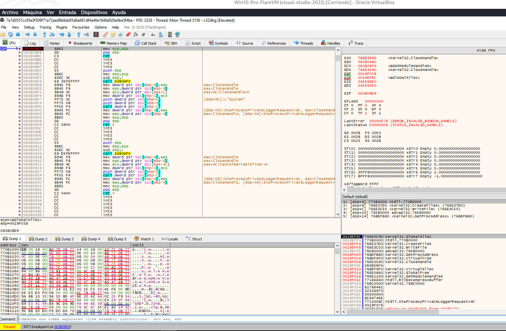

Esto confirma lo que vimos en Ghidra: `FUN_06870770` obtiene la base de `kernel32`, resuelve APIs por hash y carga ntdll y advapi32.


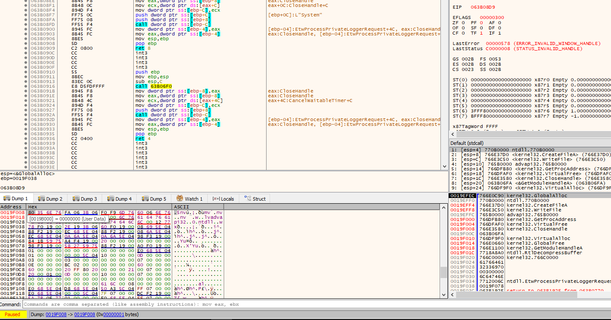

**El stage decodificado realiza resolución manual de APIs. Obtiene kernel32.dll desde el PEB, resuelve APIs por hash y construye una tabla interna con funciones de kernel32, ntdll y advapi32.**


------

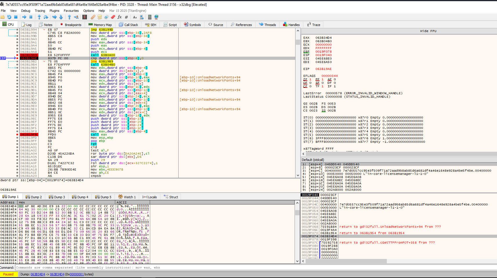

En el Dump lo tenemos abierto ahí:

`063B34D4  00 AF BE AD DE E9 16 22 00 00 CC CC ...`

Es decir: el siguiente stage ya está en memoria.


-------------------------------


**Nos volvemos a caer. El proceso se vuelve a cerrar.**


------------------------------------------------------

<div class="page"/>


## **7.15 Volvemos a llegar al buffer**


1. Reiniciamos y paramos en el decoder: Ponemos breakpoint en:

```bash
00406503

```
Ese es:

```bash
00406503  call FUN_00401010
```


Ejecutamos con F9 hasta que pare ahí.

Cuando pare, miramos la pila. En la primera línea del stack tendremos en esta pasada:
```bash
[ESP]   = inicio del buffer = 069104B0 ---> 069C04B0
[ESP+4] = tamaño que se decodifica en FUN_00401010 = 0000175F
dirección justo después del bloque decodificado = [ESP] + [ESP +4] - 1 = 69C1C0E
```


```bash
BUFFER + 0x175F = 69C1C0F
BUFFER + 0x175F - 1 = 69C1C0E
```

Si hablamos del último byte real del bloque, sería: `069C04B0 + 175F - 1 = 69C1C0E`


2. Dejamos que se decodifique el stage. Estando en:

```bash
00406503  call FUN_00401010

```

Pulsamos: F8. Volvemos a:

```bash
00406508
```


3. Calculamos los puntos importantes: Con el BUFFER actual, calculamos:


Tabla correcta de parada en esta ejecución:
```bash
[ESP]   = 069C04B0
[ESP+4] = 0000175F

Primer bloque decodificado:
inicio        = 069C04B0
fin exclusivo = 069C1C0F
último byte   = 069C1C0E

Puntos de ejecución:
stage1_entry      = 069804B0 + 1470 = 069C1920
stage1_call_next  = 069804B0 + 154B = 069C19FB
next_stage_stub   = 069C04B0 + 3024 = 069C34D4
next_stage_jmp    = 069C04B0 + 3029 = 069C34D9
stage2_entry      = 069C04B0 + 5244 = 069C56F4
punto_clave       = 069C04B0 + 5303 = 069C57B3
funcion_problema  = 069C04B0 + 4D14 = 069C51C4
retorno_normal    = 069C04B0 + 5308 = 069C57B8
```

La clave es esta: `0x175F` es el tamaño del primer stage decodificado por `FUN_00401010`.

`0x5303` es un offset posterior dentro de la región donde el stage genera/usa el segundo stage dinámicamente.

------------------


**Qué breakpoints ponemos:** Después de ejecutar el decoder en `00406503` con `F8` y volver a `00406508`, ponemos primero sólo estos:

```bash
bp 069C1920
bp 069C19FB
```

Pulsamos `F9` hasta `069C1920`, luego `F9` hasta `069C19FB`.

Cuando estemos en:

```bash
069C19FB  call eax
```

No pulsamos `F9`. Ahí pulsamos:

```bash
F7
```

Una sola vez. Deberíamos entrar en `061x34D4` o `069x34D9`.

Una vez dentro del segundo stage, entonces ponemos:

```bash
bp 069C56F4
bp 069C57B3
bp 069C57B8
```

Y seguimos con F9 hasta:

```bash
069x57B3  call 069151C4
```

Ahí tampoco pulsamos `F8`. En ese punto pulsa:

```bash
F7
```

Una sola vez para entrar en `069x51C4`.

Resumen operativo:

```bash
00406503 -> F8
00406508 -> bp 069x1920 / bp 069x19FB
F9 hasta 069x19FB
069119FB -> F7

Luego:
bp 069x56F4
bp 069x57B3
bp 069x57B8
F9 hasta 069x57B3
069x57B3 -> F7
```


-------------------------

Estamos  dentro de la función problemática:

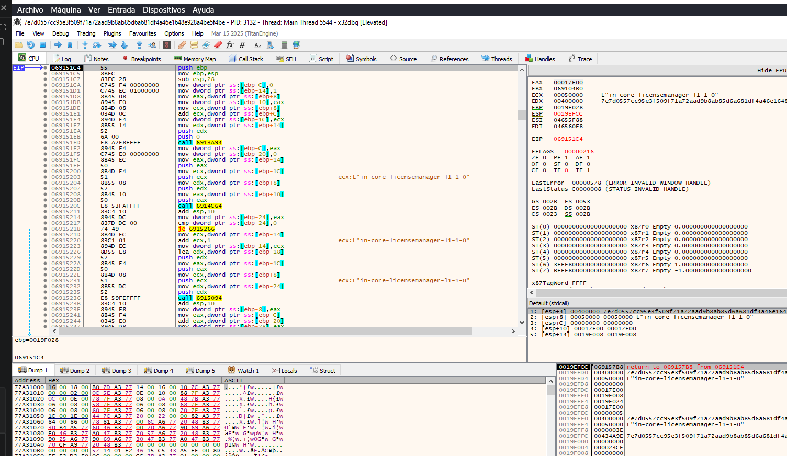


```bash
069x51C4  push ebp

```


La función `069x51C4` recibe estos argumentos:
```bash
[ESP+04] = 00400000   ; base del PE original
[ESP+08] = 00050000   ; SizeOfImage
[ESP+0C] = 00000000
[ESP+10] = 00017E00   ; RVA del bloque localizado
[ESP+14] = 0019F008   ; puntero auxiliar/salida
```

Ahora avanzamos con F8 hasta quedar justo en esta llamada:

```bash
069x51ED  call 06913A94

```

-----------------------


Ahora no usamos `F9`. Vamos paso a paso.

La función `069x51C4` recibe estos argumentos:
```bash
[ESP+04] = 00400000   ; base del PE original
[ESP+08] = 00050000   ; SizeOfImage
[ESP+0C] = 00000000
[ESP+10] = 00017E00   ; RVA del bloque localizado
[ESP+14] = 0019F008   ; puntero auxiliar/salida
```

Ahora avanzamos con F8 hasta quedar justo en esta llamada:

```bash
069x51ED  call 06913A94

```
No entremos todavía con `F7` en esa llamada.


------------------------------------


Estamos justo en la primera llamada interna de `069x51C4`:

```bash
069x51ED  call 06913A94
```

Y los argumentos preparados son:

```bash
[ESP]   = 00000000
[ESP+4] = 00017E00
```

Es decir, esta llamada es aproximadamente:

```bash
FUN_06913A94(0, 0x17E00);
```


Esta llamada `069x3A94` parece una función auxiliar de reserva/preparación de memoria. Podemos ejecutarla con: `F8`. No usar `F9`.

Después de pulsar `F8`, debemos quedar en:

```bash
069151F2  mov dword ptr ss:[ebp-C], eax

```

<div class="page"/>

Ahí miramos el valor de:
```bash
EAX
```

------------------


Se confirma que la primera llamada interna ha funcionado. Hemos ejecutado:

```bash
069151ED  call 06913A94
```

y ahora estamos en:

`069151F2  mov [ebp-0C], eax`

El valor devuelto es:

```bash
EAX = 06D0E5E8
```

Eso parece un buffer reservado/asignado. La función `06913A94(0, 0x17E00)` probablemente ha reservado o preparado memoria para trabajar con el bloque embebido.


Primero guardamos este dato:

```bash
buffer_trabajo = 06D0E5E8

```
Puedes lo comprobamos en el Dump:

```bash
Dump -> Ctrl+G -> 06D0E5E8
```

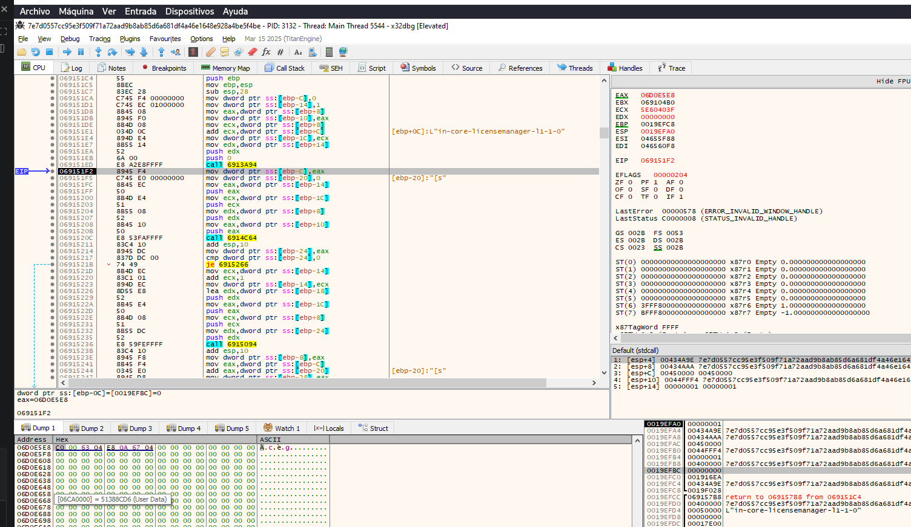


-------------------------------


Avanzamos hasta la siguiente llamada. Ahora seguimos con `F8`, no `F9`, hasta llegar a:

```bash
069x520C  call 06914C64

```


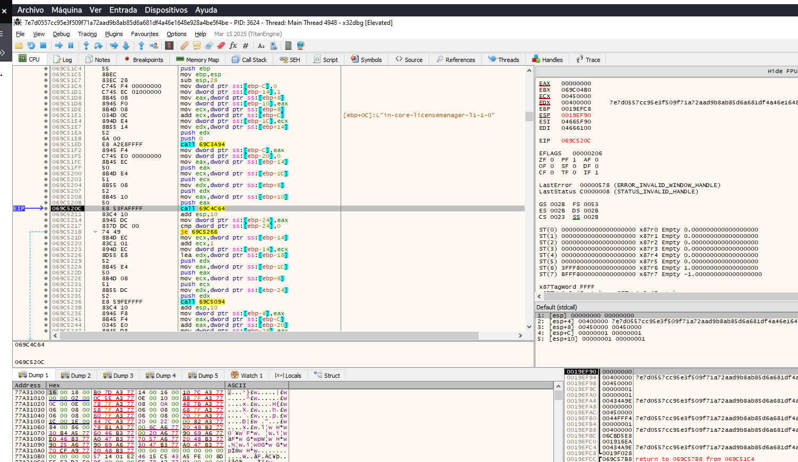

<div class="page"/>


Estamos en la segunda llamada interna de `069C51C4`:

```bash
069C520C  call 069C4C64
```

Y en esta ejecución la función problemática es:

```bash
069C51C4
```


Antes de ejecutarla, ponemos un breakpoint justo después de la llamada:

```bash
bp 069C5211
```

Y confirmamos que tenemos también el retorno normal de la función grande:

```bash
bp 069C57B8
```

Luego ejecutamos esta llamada con: `F8`. Si todo va bien, debemos quedar en:

```bash
069C5211  add esp, 10
```

Ahí miramos:

```bash
EAX
```

------------------


<div class="page"/>

Ese EAX es el resultado de `069C4C64`.

También hacemos: `Dump -> Ctrl+G -> 0041351E`


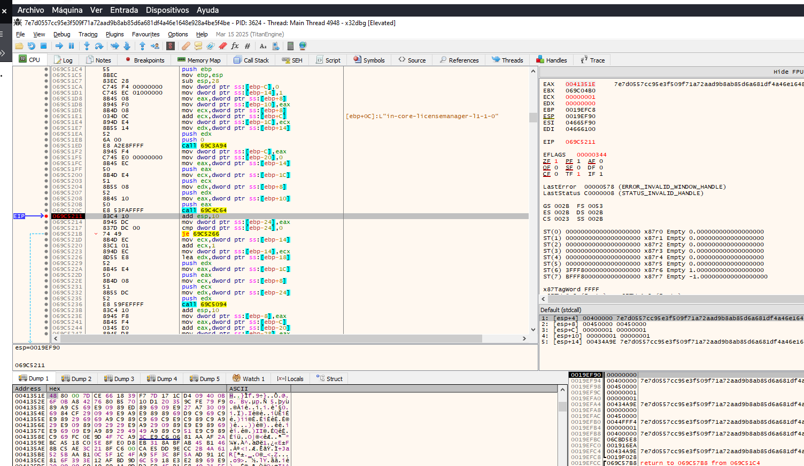

**<mark>El dump en `0041351E` muestra datos con aspecto cifrado/ofuscado o comprimido, no una estructura PE limpia ni texto claro:</mark>**

-----------------------------------


Avanzamos con `F8` hasta llegar a:

```bash
069C5236  call 069C5094
```

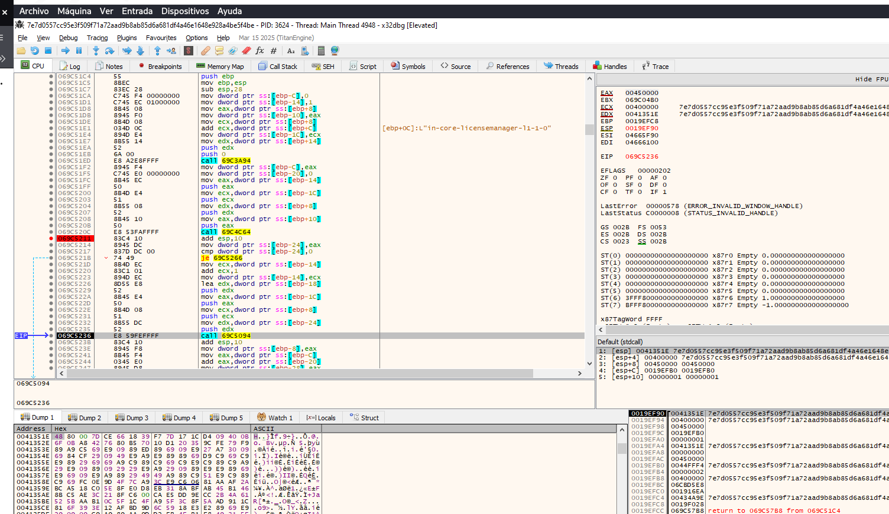


```bash
069C5236  call 069C5094

```

Esta es la tercera llamada interna importante dentro de `069C51C4`.

En la pila se ven los argumentos principales:

```bash
[ESP]    = 0041351E   ; bloque localizado antes por 069C4C64
[ESP+04] = 00400000   ; base del PE original
[ESP+08] = 00450000   ; fin de la imagen / base + SizeOfImage
[ESP+0C] = 0019EFB0   ; puntero a local de salida
```


Antes de ejecutarla, ponemos un breakpoint justo después:

```bash
bp 069C523B
```

También conviene tener:

```bash
bp 069C5266
bp 069C57B8
```

`069C5266` parece una rama alternativa/error.
`069C57B8` es el retorno normal de la función grande `069C51C4`.


Ahora ejecuta esta llamada con: `F8`. No usar `F9`.

---------------------------

<div class="page"/>

Volvemos a `069C523B`. Ahora miramos qué hay en el buffer devuelto: `Dump -> Ctrl+G -> 06CD6968`


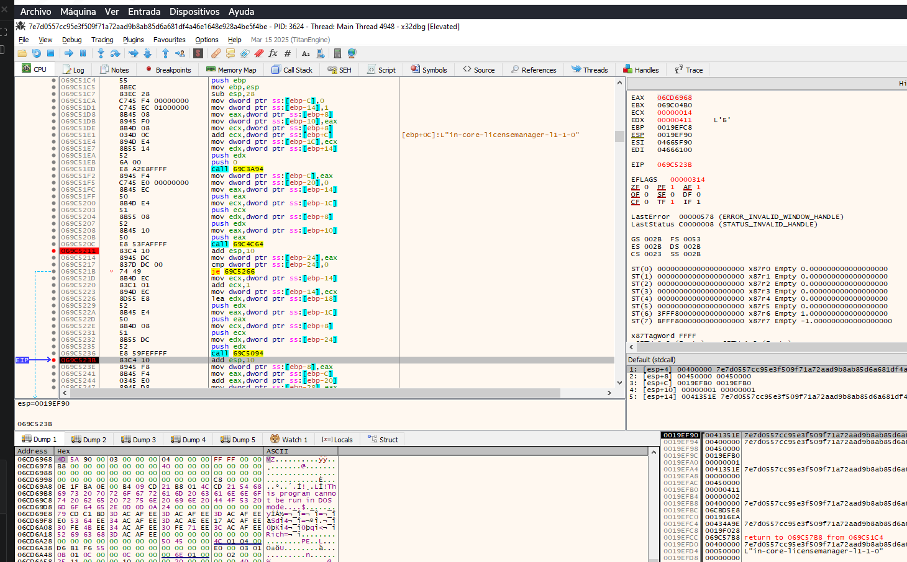


**<mark>Esto es MUY importante: 069C5094 ha devuelto un buffer que empieza por MZ.</mark>**

Ahora mismo:

```bash
EAX = 06CD6968
```

Y en el dump se ve:

```bash
06CD6968: 4D 5A ...
```

También se ve el texto típico:

```bash
This program cannot be run in DOS mode

```
y más abajo aparece `PE`. Es decir: **hemos llegado a un PE reconstruido/desempaquetado en memoria.**


---------------------------------------------

<div class="page"/>

**Guardamos este PE.**


El payload empieza en:

```bash
06CD6968
```


e_lfanew está en:

```bash
base + 0x3C

```
Así que:

```bash
06CD6968 + 3C = 06CD69A4

```
En x32dbg:

```bash
Dump -> Ctrl+G -> 06CD69A4

```
Leemos los 4 bytes de esa dirección en little endian.

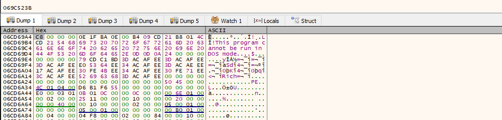

Esta captura ya nos permite sacar los campos clave del PE:
```bash
Payload base = 06CD6968
MZ visible   = 06CD6968
PE real      = 06CD6A20
```

Ojo: en `06CD69A4` aparece:

```bash
C8 00 00 00

```

<div class="page"/>

Eso sugeriría:

```bash
06CD6968 + C8 = 06CD6A30

```
pero en la captura la firma real `PE 00 00` se ve en:

```bash
06CD6A20

```
Así que aquí hay una pequeña incoherencia en `e_lfanew`. Para que el PE quede bien parseable, probablemente habrá que corregir `e_lfanew` a:

```bash
06CD6A20 - 06CD6968 = B8

```
Es decir:

```bash
e_lfanew correcto = 000000B8

```

Campos que se ven en la captura

Tomando como PEHDR:

```bash
PEHDR = 06CD6A20

```
tenemos:

```bash
Machine           = 014C      ; PE32 x86
NumberOfSections = 0004
SizeOfOptionalHdr = 00E0
Magic             = 010B      ; PE32
ImageBase         = 00400000
AddressOfEntryPoint RVA = 00001125
SizeOfImage       = 0001B000
SizeOfHeaders     = 00000400
```

Por tanto:

```bash
EntryVA = 06CD6968 + 00001125 = 06CD7A8D

```

-------------------------------------

<div class="page"/>

Qué hacer ahora. **Primero guardamos el payload completo con el tamaño real:**

```bash
savedata "C:\Temp\payload_06CD6968_1B000.bin", 06CD6968, 1B000

```
Después, antes de seguir ejecutando, ponemos un breakpoint en el entry del payload:

```bash
bp 06CD7A8D

```

---------------------------------------------------------------

Importante: Parcheamos el header:

Como el PE real parece estar en `06CD6A20`, pero `e_lfanew` visible apunta a C``8, hacemos una copia sin tocar primero, y luego otra parcheada.

Copia sin tocar:

```bash
savedata "C:\Temp\payload_06CD6968_original_1B000.bin", 06CD6968, 1B000

```


Luego en el dump vamos a:

```bash
Ctrl+G -> 06CD69A4

```
Cambiamos:

```bash
C8 00 00 00

```
por:

```bash
B8 00 00 00

```
y guardamos otra:

```bash
savedata "C:\Temp\payload_06CD6968_fixed_1B000.bin", 06CD6968, 1B000

```

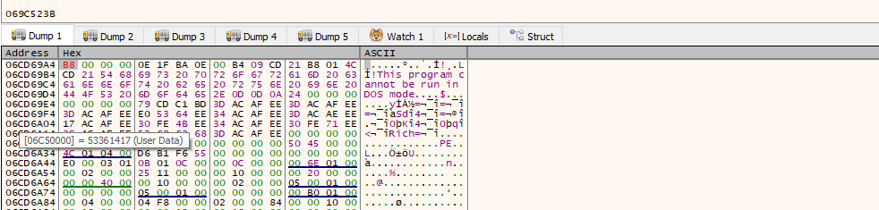


La versión fixed debería abrir mejor en `PE-bear`, `CFF Explorer` o `Ghidra`.


--------------


Después de guardar, volvemos a CPU. Estamos en:

```bash
069C523B  add esp, 10
```

No usar `F9` todavía. Avanzamos con `F8` unas instrucciones más y vigila si usamos `EAX = 06CD6968` o si salta al `EntryVA = 06CD7A8D`. El breakpoint en `06CD7A8D` nos dirá si realmente ejecuta el payload reconstruido.


Pulsamos un `f8`

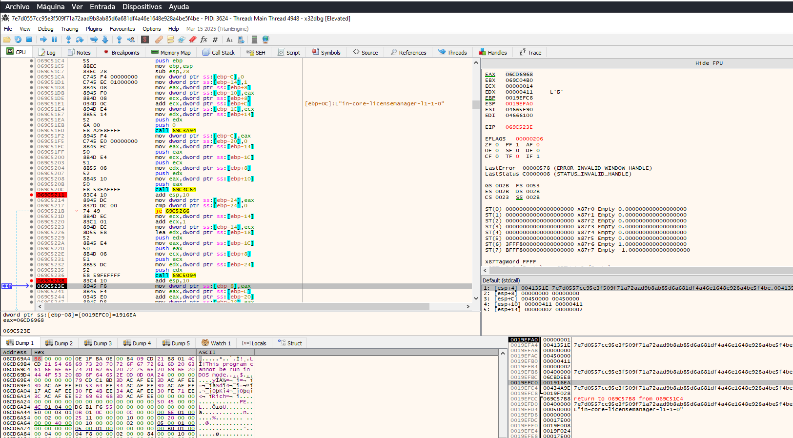

estamos en 

```bash
069C523E  mov dword ptr ss:[ebp-8], eax
```

y:

```bash
EAX = 06CD6968
```

Eso significa que va a guardar en la variable local [EBP-8] el puntero al PE reconstruido:

```bash
[EBP-8] = 06CD6968
```
Importante: corrigiendo el EntryPoint

El PE está así:

```bash
Payload base = 06CD6968
e_lfanew     = 000000B8
PE header    = 06CD6968 + B8 = 06CD6A20
```

En el Optional Header se ve:

```bash
AddressOfEntryPoint = 00001000
ImageBase           = 00400000
SizeOfImage         = 0001B000
SizeOfHeaders       = 00000800

```
Por tanto, el entry en memoria actual sería:

```bash
EntryVA = 06CD6968 + 1000 = 06CD7968

```
Pon este breakpoint:

```bash
bp 06CD7968

```


Guardamosya el payload

Como ya tenemos el header corregido con `e_lfanew = B8`, guardamos esta versión:

```bash
savedata "C:\Temp\payload_06CD6968_fixed_1B000.bin", 06CD6968, 1B000

```

-------------------------------------


**Punto clave: Ya no estamos buscando el PE, lo tenemos en `06CD6968`. Ahora queremos saber si la función:**

```bash
lo copia a otra zona,
le aplica relocations/imports,
lo ejecuta saltando a 06CD7968,
o lo inyecta/usa como imagen manualmente.
```


***********************************

<div class="page"/>

Descubir como encaja esta parte: Pulsamos F8 una vez. Después comprobamos que:

```bash
ECX = 00000411
```

Luego seguimos con F8, pero sólo hasta la siguiente call. El call esta en: 0069C5256. **No ejecutar!**


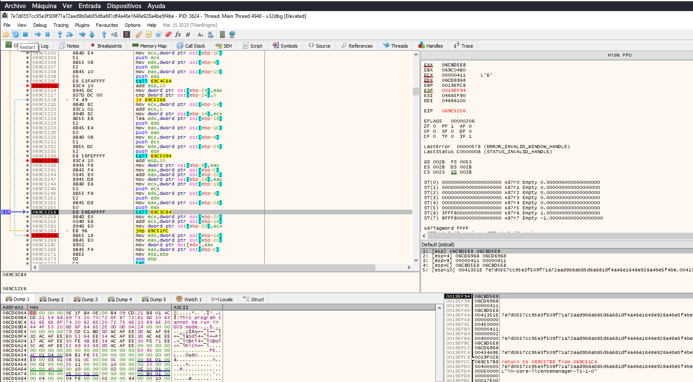


Esta llamada parece una copia de memoria, probablemente tipo `memcpy`.

Por la pila actual:

```bash
[ESP]    = 06CBD5E8
[ESP+04] = 06CD6968
[ESP+08] = 00000411
```


Antes de ejecutarla, ponemos un breakpoint justo después:

```bash
bp 069C525B
```

<div class="page"/>

Luego pulsamos: F8:


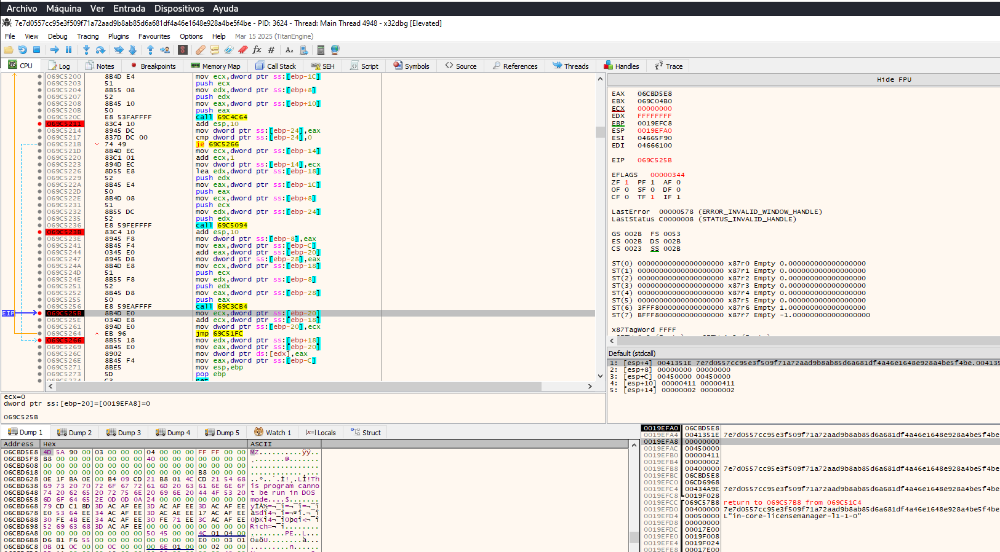

Ahora estamos en:

```bash
069C525B  mov ecx, dword ptr ss:[ebp-20]
```

Y abajo se ve que el buffer destino:

```bash
06CBD5E8
```

ya empieza por:

```bash
4D 5A
```

Es decir, **ya se ha copiado la cabecera MZ del payload desde `06CD6968` hacia `06CBD5E8`.**


**Ahora mismo tenemos:**

```bash
origen temporal PE     = 06CD6968
destino final/trabajo  = 06CBD5E8
tamaño copiado ahora   = 00000411
[EBP-20] actual        = 00000000
[EBP-18]               = 00000411
```

<div class="page"/>

Las siguientes instrucciones harán:

```bash
069C525B  mov ecx, [ebp-20]      ; ECX = 0
069C525E  add ecx, [ebp-18]      ; ECX = 0 + 411
069C5261  mov [ebp-20], ecx      ; [EBP-20] = 411
069C5264  jmp 069C51FC           ; vuelve al bucle
```

O sea: está reconstruyendo/copiando el PE por bloques.

-----------------------------


No hacer F8 todo el bucle. Ahora sería muy lento ir instrucción por instrucción. Así que ponemos breakpoints en la salida del bucle y en el retorno normal:

```bash
bp 069C5266
bp 069C57B8
```

Y como ahora el PE bueno parece estar en `06CBD5E8`, ponemos también breakpoint en su `EntryPoint`:

```bash
bp 06CBE5E8
```

Porque:

```bash
payload_base = 06CBD5E8
AddressOfEntryPoint = 00001000
EntryVA = 06CBD5E8 + 1000 = 06CBE5E8
```

---------------------

Bps ahora

```bash
Mantener habilitados:
069C5266
069C57B8
06CBE5E8
06CD7968   ; opcional

Deshabilitar:
069C1920
069C19FB
069C5211
069C523B
069C525B
069C56F4
069C57B3
00406503
06CD7A80
```

---------------------------------

<div class="page"/>


Después volvemos a `CPU` y pulsamos `F9`. Debería parar en `069C5266` cuando termine el bucle, o en `06CBE5E8` si salta al entrypoint del payload final.


Salida del bucle de reconstrucción y paramos en `069C5266`. Ejecutamos con `F8` estas instrucciones:

```bash
069C5266
069C5269
069C526C
069C526E
```

Páramos justo en:

```bash
069C5271  mov esp, ebp

```
Ahí deberíamos ver:

```bash
EAX = 06CBD5E8

```

Ese será el valor de retorno de `069C51C4`.

Guardamos ya el payload final:

```bash
savedata "C:\Temp\payload_final_06CBD5E8_1B000.bin", 06CBD5E8, 1B000

```
Y también podemos guardar hasta `0x17E00`, porque ese es el tamaño que acaba de poner como salida:

```bash
savedata "C:\Temp\payload_final_06CBD5E8_17E00.bin", 06CBD5E8, 17E00

```


----------------------------------


Después de 069C526E, avanza hasta el ret:

```bash
069C5271  mov esp, ebp
069C5273  pop ebp
069C5274  ret
```

Al hacer F8 sobre el ret, deberíamos volver a:

```bash
069C57B8

```

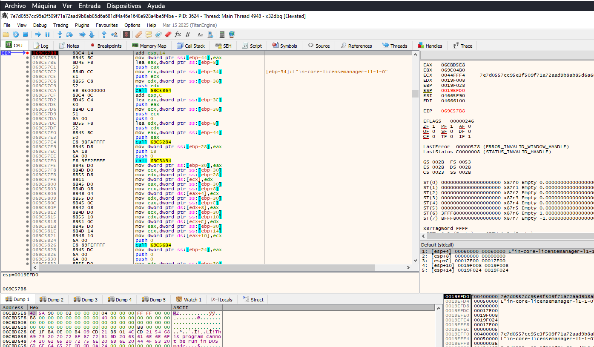

Ahí miramos cómo usa el caller el valor devuelto:

```bash
EAX = 06CBD5E8
```

Eso significa que `069C51C4` ha devuelto la base del payload PE final reconstruido.


-------------------------------

Pulsamos  F8 sobre:
```bash

069C57B8  add esp,14
```

Luego pulsamos otro F8 sobre:

```bash
069C57BB  mov [ebp-44],eax
```

Eso guardará:

```bash
[EBP-44] = 06CBD5E8
```

Después avanzamos con F8 hasta llegar a:

```bash
069C57CA  call 069C5364
```

No debemos ejecutar todavía esa llamada cuando lleguemos.

--------------------------

Antes de ejecutarla, ponemos breakpoint en el retorno:

```bash
bp 069C57CF
```

porque la siguiente instrucción después del call será:

```bash
069C57CF  add esp, 0C
```

Luego ejecutamso la llamada con: F8. 


Debemos parar en `069C57CF`. Ahí miramos:

```bash
EAX= [0019F020]
```


--------------

<div class="page"/>


## **7.16 Apertura del payload final en Ghidra**

En Ghidra: File → Import File → Seleccionamos: `payload_final_06CBD5E8_1B000.bin`, con:

```bash
Raw Binary
x86:LE:32:default
Compiler: windows
Base Address: 00410000
```

Luego vamos a:

```bash
00401000
```


> **Nota sobre direcciones y bases de carga:**  
> Las direcciones absolutas usadas en Ghidra pueden diferir de las observadas en x32dbg porque el volcado se importa con una base artificial. La correspondencia debe hacerse mediante el offset interno del payload.


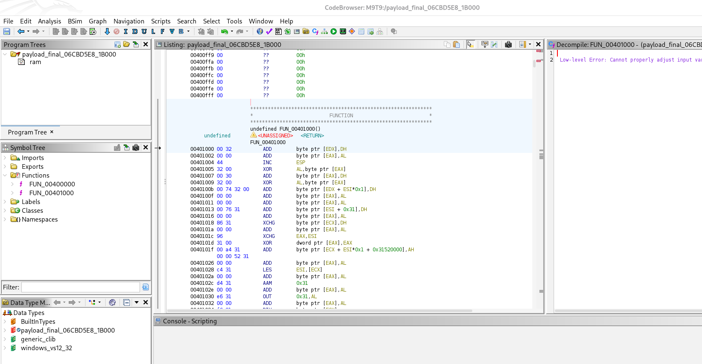


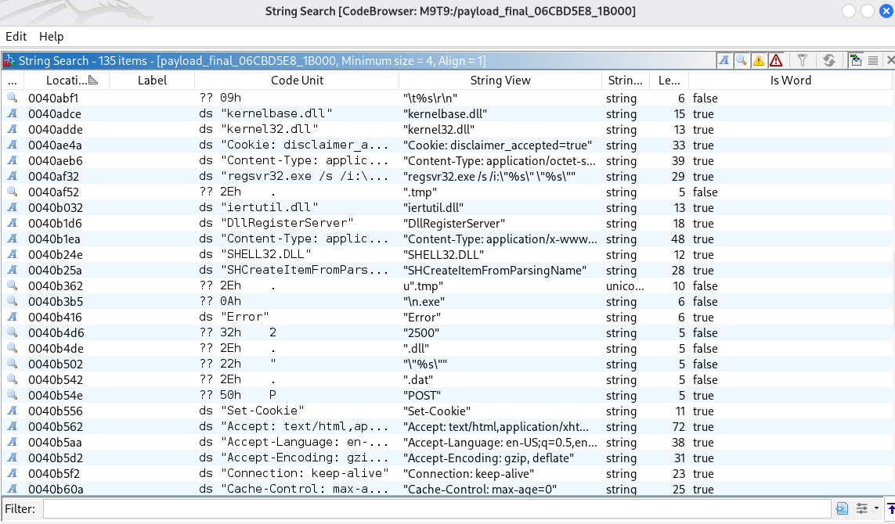


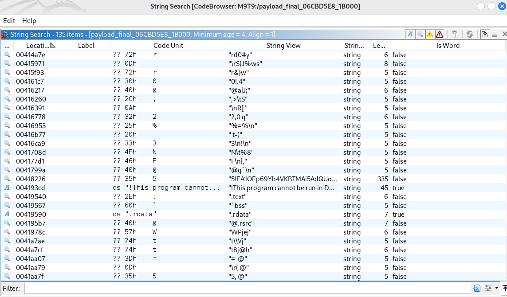


<mark>El payload_final_06CBD5E8_1B000 contiene strings muchos más interesantes que el temporal.<mark>

Strings claramente relacionadas con comunicación HTTP/C2 y persistencia/ejecución:

```bash
kernelbase.dll
kernel32.dll
regsvr32.exe /s /i:\"%s\" \"%s\"
iertutil.dll
DllRegisterServer
SHELL32.DLL
SHCreateItemFromParsingName

POST
Set-Cookie
Cookie: disclaimer_accepted=true
Content-Type: application/octet-stream
Content-Type: application/x-www-form-urlencoded
Accept: text/html,application/xhtml...
Accept-Language: en-US;q=0.5,en...
Accept-Encoding: gzip, deflate
Connection: keep-alive
Cache-Control: max-age=0
```

Esto apunta a que el payload sí contiene lógica HTTP, probablemente para beaconing o envío/recepción de datos, aunque no vemos todavía una URL completa en claro.


-------------------------


Empezamos por la string POST --> Right click sobre la dirección/string → References → Show References to Address

Si salen referencias, entra en la función que la usa y pásame captura del decompiler.

Orden de búsqueda de las referencias:
```bash
0040b54e  "POST"
0040b1ea  "Content-Type: application/x-www-form-urlencoded..."
0040aeb6  "Content-Type: application/octet-stream..."
0040b556  "Set-Cookie"
0040b562  "Accept: text/html,application/xhtml..."
0040b5a2  "Accept-Language: en-US;q=0.5..."
0040b5d2  "Accept-Encoding: gzip, deflate"
0040b5f2  "Connection: keep-alive"
0040b60a  "Cache-Control: max-age=0"
```

La función que referencie varias de estas strings será casi seguro la rutina HTTP/C2.


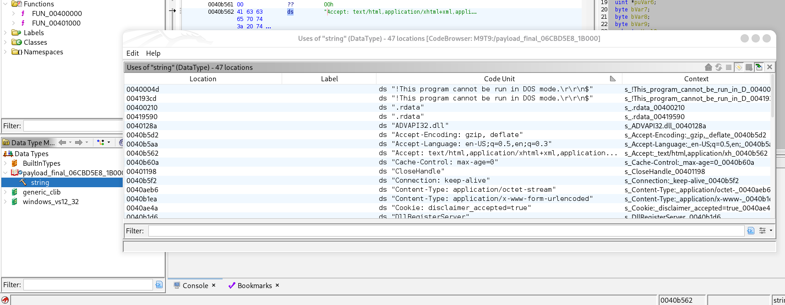


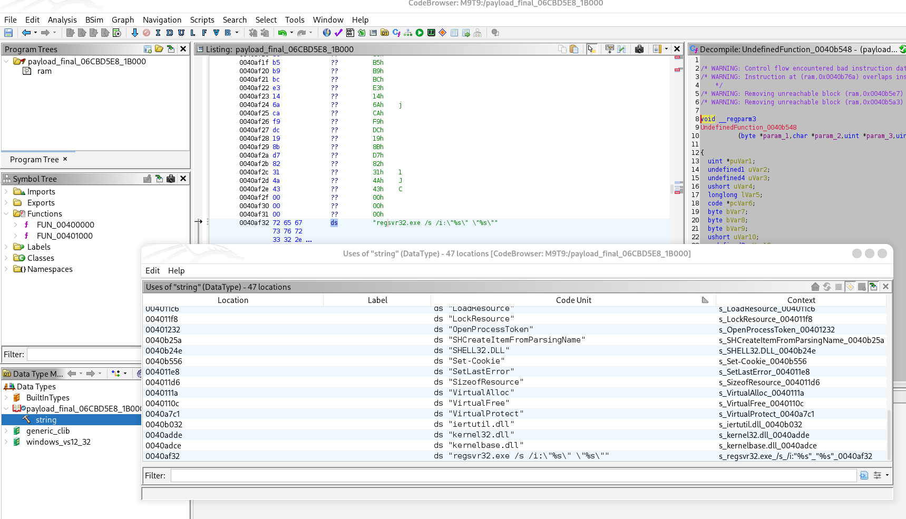


Tenemos dos líneas claras:
1. El unpacking dinámico reconstruye un payload en memoria.
2. El payload final contiene strings HTTP interesantes, pero sin referencias directas visibles en Ghidra.

Las strings HTTP sí son relevantes:
```bash
POST
Content-Type: application/octet-stream
Content-Type: application/x-www-form-urlencoded
Cookie: disclaimer_accepted=true
Set-Cookie
Accept: text/html,...
Accept-Encoding: gzip, deflate
Connection: keep-alive
Cache-Control: max-age=0
regsvr32.exe /s /i:\"%s\" \"%s\"
iertutil.dll
DllRegisterServer
SHELL32.DLL
SHCreateItemFromParsingName
kernel32.dll
kernelbase.dll
ADVAPI32.dll
```

<mark>Pero el problema es que Ghidra no está encontrando referencias directas porque probablemente las direcciones se calculan dinámicamente, las funciones todavía están mal descubiertas o esas strings pertenecen a una estructura/plantilla usada indirectamente.</mark>

```bash
floss -f sc32  payload_final_06CBD5E8_1B000.bin > payload_final_06CBD5E8_1B000.txt
```

El payload contiene componentes para construir peticiones `HTTP/HTTPS`, pero no expone directamente el dominio o endpoint `C2`.

Se identifican cadenas asociadas a ejecución mediante `regsvr32.exe `y `DllRegisterServer`, lo que sugiere posible uso de regsvr32 como mecanismo de ejecución de un componente descargado o generado localmente.


Hay resolución/carga dinámica y manipulación de memoria.

La cadena larga tipo Base64 es muy sospechosa
```
5!EA1OEp69Yb4VKBTMAi5AdQUoEhIxk0wwUEQxEe1PAWvJQAZuhUCdSNWAve5l0gaHRgmIAAjyhUNtGgA37FgrQGrmNWCQNAgQ6D/pHjmi5tBY1EadKIBVqVgSKnYRKj+QK7YPRTojUFXgqg3o61UFxnlhVJBYhR4+FVRA/tj4Qo8e7XIJ5juiKYKOhSLqVAA6bPBfwSv0xSffDnObpPBi9iEiJeHbY4GawhkjKQ0QPXhCQlH34kCWBpiGdnBcABZiXJQ5CogIA4kVhCJCM76OcBcKJKeLINUm0+Y5EBwQi5RLVb1U4wUkvr4xiGzYHi7rIUJJQt+W4Wwq
```

No se ha obtenido un dominio `C2` en claro a partir de este blob Base64 concreto. Los dominios `C2` confirmados proceden del bloque `config_blob.bin`. Sin embargo, el payload final contiene lógica HTTP/HTTPS, cabeceras de petición, método POST, posibles plantillas de comunicación, strings relacionadas con `regsvr32/DllRegisterServer` y un blob largo codificado que podría contener configuración o datos cifrados.

----------------------------


**Analizamos ese blob largo:**


```bash
└─$ grep -aoE '[A-Za-z0-9+/]{80,}={0,2}' payload_final_06CBD5E8_1B000.txt

PADPADDINGXXPADDINGPADDINGXXPADDINGPADDINGXXPADDINGPADDINGXXPADDINGPADDINGXXPADDINGPADDINGXXPADDINGPADDINGXXPADDINGPADDINGXXPADDINGPADDINGXXPADDINGPADDINGXXPADDINGPADDINGXXPADDINGPADDINGXXPADDINGPADDINGXXPADDINGPADDINGXXPADDINGPADDINGXXPADDINGPADDINGXXPADDINGPADDINGXXPADDINGPADDINGXXPADDINGPADDINGXXPAD
EA1OEp69Yb4VKBTMAi5AdQUoEhIxk0wwUEQxEe1PAWvJQAZuhUCdSNWAve5l0gaHRgmIAAjyhUNtGgA37FgrQGrmNWCQNAgQ6D/pHjmi5tBY1EadKIBVqVgSKnYRKj+QK7YPRTojUFXgqg3o61UFxnlhVJBYhR4+FVRA/tj4Qo8e7XIJ5juiKYKOhSLqVAA6bPBfwSv0xSffDnObpPBi9iEiJeHbY4GawhkjKQ0QPXhCQlH34kCWBpiGdnBcABZiXJQ5CogIA4kVhCJCM76OcBcKJKeLINUm0+Y5EBwQi5RLVb1U4wUkvr4xiGzYHi7rIUJJQt+W4Wwq

```

guardar solo la cadena larga en un archivo:
```bash
└─$ grep -aoE '[A-Za-z0-9+/]{80,}={0,2}' payload_final_06CBD5E8_1B000.txt > blobs_b64.txt

```


```bash
└─$ awk '{ print length($0), $0 }' blobs_b64.txt | sort -nr | head
332 EA1OEp69Yb4VKBTMAi5AdQUoEhIxk0wwUEQxEe1PAWvJQAZuhUCdSNWAve5l0gaHRgmIAAjyhUNtGgA37FgrQGrmNWCQNAgQ6D/pHjmi5tBY1EadKIBVqVgSKnYRKj+QK7YPRTojUFXgqg3o61UFxnlhVJBYhR4+FVRA/tj4Qo8e7XIJ5juiKYKOhSLqVAA6bPBfwSv0xSffDnObpPBi9iEiJeHbY4GawhkjKQ0QPXhCQlH34kCWBpiGdnBcABZiXJQ5CogIA4kVhCJCM76OcBcKJKeLINUm0+Y5EBwQi5RLVb1U4wUkvr4xiGzYHi7rIUJJQt+W4Wwq
303 PADPADDINGXXPADDINGPADDINGXXPADDINGPADDINGXXPADDINGPADDINGXXPADDINGPADDINGXXPADDINGPADDINGXXPADDINGPADDINGXXPADDINGPADDINGXXPADDINGPADDINGXXPADDINGPADDINGXXPADDINGPADDINGXXPADDINGPADDINGXXPADDINGPADDINGXXPADDINGPADDINGXXPADDINGPADDINGXXPADDINGPADDINGXXPADDINGPADDINGXXPADDINGPADDINGXXPADDINGPADDINGXXPAD
```

blobs_b64.txt solo contiene 2 candidatos largos:
```bash
1. 332 bytes/chars: EA1OEp69...
2. 303 bytes/chars: PADPADDINGXX...
```


El segundo no parece ser configuración: PADPADDINGXX... es padding/relleno, no parece un blob C2.

El primero sí merece análisis:

           

```bash
└─$ echo 'EA1OEp69Yb4VKBTMAi5AdQUoEhIxk0wwUEQxEe1PAWvJQAZuhUCdSNWAve5l0gaHRgmIAAjyhUNtGgA37FgrQGrmNWCQNAgQ6D/pHjmi5tBY1EadKIBVqVgSKnYRKj+QK7YPRTojUFXgqg3o61UFxnlhVJBYhR4+FVRA/tj4Qo8e7XIJ5juiKYKOhSLqVAA6bPBfwSv0xSffDnObpPBi9iEiJeHbY4GawhkjKQ0QPXhCQlH34kCWBpiGdnBcABZiXJQ5CogIA4kVhCJCM76OcBcKJKeLINUm0+Y5EBwQi5RLVb1U4wUkvr4xiGzYHi7rIUJJQt+W4Wwq' | base64 -d > blob_config_decoded.bin
                                                                                                                                                      

└─$ file blob_config_decoded.bin
blob_config_decoded.bin: data
                                                                                                                                                      

└─$ file blob_config_decoded.bin
blob_config_decoded.bin: data
                                                                                                                                                      

└─$ xxd -g 1 -l 128 blob_config_decoded.bin
00000000: 10 0d 4e 12 9e bd 61 be 15 28 14 cc 02 2e 40 75  ..N...a..(....@u
00000010: 05 28 12 12 31 93 4c 30 50 44 31 11 ed 4f 01 6b  .(..1.L0PD1..O.k
00000020: c9 40 06 6e 85 40 9d 48 d5 80 bd ee 65 d2 06 87  .@.n.@.H....e...
00000030: 46 09 88 00 08 f2 85 43 6d 1a 00 37 ec 58 2b 40  F......Cm..7.X+@
00000040: 6a e6 35 60 90 34 08 10 e8 3f e9 1e 39 a2 e6 d0  j.5`.4...?..9...
00000050: 58 d4 46 9d 28 80 55 a9 58 12 2a 76 11 2a 3f 90  X.F.(.U.X.*v.*?.
00000060: 2b b6 0f 45 3a 23 50 55 e0 aa 0d e8 eb 55 05 c6  +..E:#PU.....U..
00000070: 79 61 54 90 58 85 1e 3e 15 54 40 fe d8 f8 42 8f  yaT.X..>.T@...B.
                                                                                                                                                      

└─$ strings -a -n 4 blob_config_decoded.bin
L0PD1
X+@j
E:#PU
=xBBQ
!BIB
```


Se identificó un blob Base64 de 332 caracteres que decodifica a 249 bytes de datos binarios. El contenido decodificado no presenta cabeceras conocidas ni strings legibles, por lo que se considera candidato a configuración cifrada/ofuscada o material binario auxiliar.


Medimos entropia
```bash
└─$ python3 - << 'PY'
from collections import Counter
import math

data = open("blob_config_decoded.bin", "rb").read()
c = Counter(data)
entropy = -sum((n / len(data)) * math.log2(n / len(data)) for n in c.values())

print("size:", len(data))
print("entropy:", entropy)
print("unique bytes:", len(c))
print("first32:", data[:32].hex())
PY
size: 249
entropy: 6.956176618752648
unique bytes: 146
first32: 100d4e129ebd61be152814cc022e40750528121231934c3050443111ed4f016b
```

Se identificó un blob Base64 de 332 caracteres que decodifica a 249 bytes binarios. El contenido decodificado no contiene cabeceras conocidas ni cadenas legibles relevantes. Su entropía es de 6.956, con 146 valores de byte únicos, por lo que se considera un candidato a datos cifrados, comprimidos u ofuscados. No se ha podido extraer de él un dominio C2 ni una configuración en claro.


Localizamos el offset exacto del blob dentro del binario:
```bash
└─$ grep -aob 'EA1OEp69Yb4VKBTMAi5AdQUo' payload_final_06CBD5E8_1B000.bin
98856:EA1OEp69Yb4VKBTMAi5AdQUo
```

Vamos a ese punto en ghidra:  
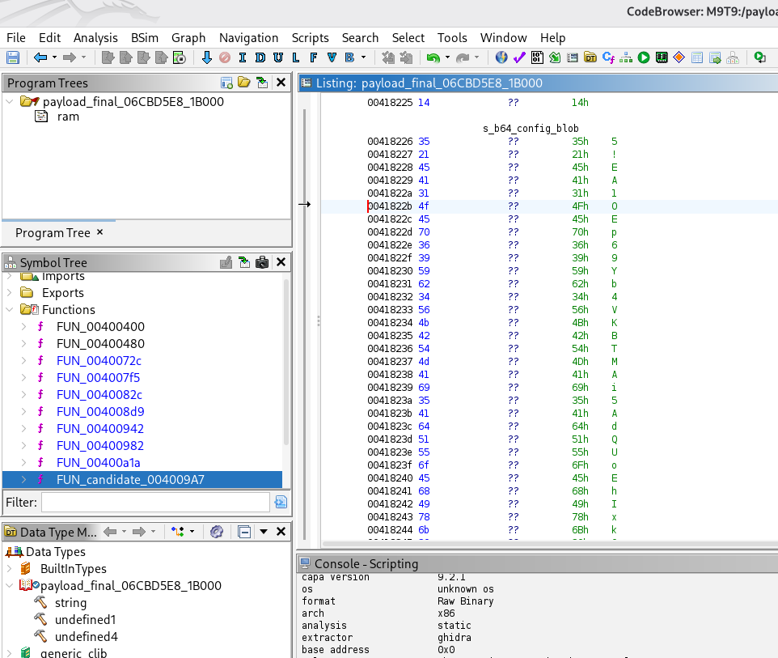


No se ha recuperado un dominio C2 en claro a partir de este blob Base64 concreto. Los dominios C2 confirmados proceden del bloque `config_blob.bin`, no de la cadena Base64 larga. El análisis dinámico con x32dbg permitió extraer un payload reconstruido en memoria, pero la ejecución posterior no fue estable: el proceso finaliza o falla antes de permitir observar comunicación de red. El análisis estático del payload final muestra cadenas asociadas a comunicación HTTP/HTTPS, método POST y cabeceras HTTP, así como posibles mecanismos de ejecución mediante `regsvr32.exe/DllRegisterServer`. FLOSS no recuperó strings decodificadas, y el blob Base64 identificado decodifica a datos binarios opacos sin indicadores en claro.


<div class="page"/>

**Ahora mismo tenemos hallazgos sólidos:**

- Payload reconstruido dinámicamente con x32dbg.
- Strings HTTP/HTTPS, POST y cabeceras HTTP en el payload final.
- Strings relacionadas con regsvr32.exe y DllRegisterServer.
- Blob Base64 opaco no resuelto.
- capa confirma CRC32 en 0x004009A7.
- No se ha recuperado dominio C2 ni endpoint completo.
- No se han confirmado capacidades de red por capa.


---------------------------


# **8. Conclusiones**


## **8.1 Indicadores de compromiso relevantes**


Para facilitar la lectura, los indicadores se organizan en varias subtablas. Se diferencian los IOCs confirmados, los artefactos generados durante el análisis y los elementos observados que deben tratarse como potenciales o pendientes de confirmación.


### **8.1.1 Identificación de la muestra**

| Tipo             | Valor                                                              | Estado            | Descripción                                                           |
| ---------------- | ------------------------------------------------------------------ | ----------------- | --------------------------------------------------------------------- |
| SHA-256          | `7e7d0557cc95e3f509f71a72aad9b8ab85d6a681df4a46e1648e928a4be5f4be` | Confirmado        | Hash principal de la muestra original analizada.                      |
| MD5              | `9724934a3ed3a92b38b89fe7a2e9b6fd`                                 | Confirmado        | Hash MD5 de la muestra original.                                      |
| Familia asociada | `Vawtrak / Neverquest`                                             | Correlación OSINT | Familia asociada a la muestra según la correlación externa realizada. |

---

<div class="page"/>

### **8.1.2 Ficheros, rutas y persistencia**

| Tipo                  | Indicador                                                  | Estado                              | Descripción                                                                                                                                                 |
| --------------------- | ---------------------------------------------------------- | ----------------------------------- | ----------------------------------------------------------------------------------------------------------------------------------------------------------- |
| Autocopia             | `C:\ProgramData\Dizla\Zedyi.exe`                           | Confirmado                          | Fichero PE escrito en disco por la muestra. Presenta el mismo hash que la muestra original, por lo que se interpreta como autocopia persistente del loader. |
| Clave de registro     | `HKCU\Software\Microsoft\Windows\CurrentVersion\Run\Sumos` | Confirmado                          | Clave de persistencia creada para ejecutar la autocopia tras el inicio de sesión del usuario.                                                               |
| Valor de persistencia | `"C:\ProgramData\Dizla\Zedyi.exe"`                         | Confirmado                          | Ruta configurada en la clave `Run\Sumos`.                                                                                                                   |
| Tarea programada      | `\MicrosoftWindowsApplicationExperienceProgramDataUpdater` | Sospechoso / pendiente de confirmar | Tarea observada durante la investigación. Debe tratarse como sospechosa si apunta a la ruta del malware.                                                    |

---

### **8.1.3 Marcadores o ficheros comprobados durante la ejecución**

| Fichero                      | Estado                                              | Descripción                                                                                                          |
| ---------------------------- | --------------------------------------------------- | -------------------------------------------------------------------------------------------------------------------- |
| `C:\ProgramData\Dizla\Xande` | Observado, no confirmado como creado por la muestra | La muestra comprueba su existencia mediante `CreateFile`. Puede actuar como marcador de estado o condición de flujo. |
| `C:\ProgramData\Dizla\Mizuk` | Observado, no confirmado como creado por la muestra | Referencia observada durante la ejecución. Se interpreta como posible comprobación de existencia.                    |
| `C:\ProgramData\Dizla\Bupra` | Observado, no confirmado como creado por la muestra | Referencia observada durante la ejecución. No se confirmó su creación en disco.                                      |

---

<div class="page"/>

### **8.1.4 Dominios C2 recuperados**

| Dominio          | Estado     | Descripción                                                                               |
| ---------------- | ---------- | ----------------------------------------------------------------------------------------- |
| `ninthclub.com`  | Confirmado | Dominio recuperado tras dumpear y descifrar el bloque de configuración del payload final. |
| `camelcap.com`   | Confirmado | Dominio recuperado desde la configuración cifrada/ofuscada.                               |
| `ideagreens.com` | Confirmado | Dominio recuperado desde la configuración cifrada/ofuscada.                               |
| `guesstrade.com` | Confirmado | Dominio recuperado desde la configuración cifrada/ofuscada.                               |
| `castuning.ru`   | Confirmado | Dominio recuperado desde la configuración cifrada/ofuscada.                               |
| `mgsmedia.ru`    | Confirmado | Dominio recuperado desde la configuración cifrada/ofuscada.                               |

---

### **8.1.5 Payloads y artefactos generados durante el análisis**

| Artefacto                                         | Estado                                | Descripción                                                                                                              |
| ------------------------------------------------- | ------------------------------------- | ------------------------------------------------------------------------------------------------------------------------ |
| [payload_final_06CBD5E8_1B000.bin](https://github.com/soniasalido/cybersecurity/blob/main/Documentation/Malware/Master-ENIIT-Analisis-Malware-Reversing/modulo-9-tecnicas-de-analisis-de-malware/9-M9T9/dumps/payload_final_06CBD5E8_1B000)                | Confirmado como artefacto de análisis | Payload final reconstruido en memoria y dumpeado para análisis estático posterior.                                       |
| [mapped_inner_payload_00110000_size_00016000.bin](https://github.com/soniasalido/cybersecurity/blob/main/Documentation/Malware/Master-ENIIT-Analisis-Malware-Reversing/modulo-9-tecnicas-de-analisis-de-malware/9-M9T9/dumps/mapped_inner_payload_00110000_size_00016000.bin) | Confirmado como artefacto de análisis | Imagen PE reconstruida en memoria con entrypoint dinámico asociado a `0x001166F2`.                                       |
| [config_blob.bin](https://github.com/soniasalido/cybersecurity/blob/main/Documentation/Malware/Master-ENIIT-Analisis-Malware-Reversing/modulo-9-tecnicas-de-analisis-de-malware/9-M9T9/dumps/config_blob_big.bin)                                 | Confirmado como artefacto de análisis | Bloque dumpeado desde memoria en `06B01AE8`, con tamaño `0x39E`, usado para recuperar seis entradas de configuración/C2. |

---

### **8.1.6 Parámetros del blob de configuración**

| Campo              | Valor      | Estado                  | Descripción                                                                              |
| ------------------ | ---------- | ----------------------- | ---------------------------------------------------------------------------------------- |
| Base del blob      | `06B01AE8` | Confirmado en ejecución | Dirección de inicio del bloque de configuración dumpeado en x32dbg.                      |
| Tamaño del blob    | `0x39E`    | Confirmado              | Tamaño calculado a partir de `entry_count = 6` y entradas de `0x44` bytes.               |
| Número de entradas | `6`        | Confirmado              | Valor leído en `config_blob + 0x204`, correspondiente al número de dominios recuperados. |

---

<div class="page"/>

### **8.1.7 Blob Base64 localizado en el payload final**

El payload final contiene una cadena Base64 larga. Para evitar romper la maquetación de la tabla, se documenta fuera de ella:

```text
EA1OEp69Yb4VKBTMAi5AdQUoEhIxk0wwUEQxEe1PAWvJQAZuhUCdSNWAve5l0gaHRgmIAAjyhUNtGgA37FgrQGrmNWCQNAgQ6D/pHjmi5tBY1EadKIBVqVgSKnYRKj+QK7YPRTojUFXgqg3o61UFxnlhVJBYhR4+FVRA/tj4Qo8e7XIJ5juiKYKOhSLqVAA6bPBfwSv0xSffDnObpPBi9iEiJeHbY4GawhkjKQ0QPXhCQlH34kCWBpiGdnBcABZiXJQ5CogIA4kVhCJCM76OcBcKJKeLINUm0+Y5EBwQi5RLVb1U4wUkvr4xiGzYHi7rIUJJQt+W4Wwq
```

| Elemento          | Estado                 | Descripción                                                                                                       |
| ----------------- | ---------------------- | ----------------------------------------------------------------------------------------------------------------- |
| Blob Base64 largo | Candidato relevante    | Blob localizado en el payload final. Decodifica a datos binarios, pero no se confirmó como payload independiente. |
| `PADPADDINGXX...` | Descartado como IOC C2 | Cadena larga localizada junto al blob Base64. Se interpreta como relleno/padding, no como configuración.          |

---

### **8.1.8 Cadenas de red y comunicación HTTP**

| Tipo          | Valor                                             | Estado                     | Descripción                                                |
| ------------- | ------------------------------------------------- | -------------------------- | ---------------------------------------------------------- |
| Método HTTP   | `POST`                                            | Observado en payload final | Indica lógica de comunicación HTTP en el payload final.    |
| Esquema URL   | `http://`                                         | Observado en payload final | Cadena asociada a comunicación HTTP.                       |
| Esquema URL   | `https://`                                        | Observado en payload final | Cadena asociada a comunicación HTTPS.                      |
| Cabecera HTTP | `Content-Type: application/octet-stream`          | Observado en payload final | Cabecera HTTP localizada en strings del payload final.     |
| Cabecera HTTP | `Content-Type: application/x-www-form-urlencoded` | Observado en payload final | Cabecera HTTP localizada en strings del payload final.     |
| Cabecera HTTP | `Cookie: disclaimer_accepted=true`                | Observado en payload final | Cadena HTTP localizada en el payload final.                |
| Cabecera HTTP | `Set-Cookie`                                      | Observado en payload final | Cadena asociada a gestión de cookies en comunicación HTTP. |

---

<div class="page"/>

### **8.1.9 Librerías, comandos y capacidades asociadas**

| Tipo             | Valor                          | Estado                     | Descripción                                                                                                                   |
| ---------------- | ------------------------------ | -------------------------- | ----------------------------------------------------------------------------------------------------------------------------- |
| Librería de red  | `wininet.dll`                  | Observado en payload final | Librería asociada a comunicación HTTP/HTTPS en Windows.                                                                       |
| Librería shell   | `SHELL32.DLL`                  | Observado en payload final | Librería usada para operaciones shell o interacción con objetos del sistema.                                                  |
| Comando / LOLBin | `regsvr32.exe /s /i:"%s" "%s"` | Observado en payload final | Cadena que sugiere posible uso de `regsvr32.exe` para registrar o ejecutar componentes. No se confirmó su ejecución efectiva. |
| Export DLL       | `DllRegisterServer`            | Observado en payload final | Cadena asociada a registro de DLL o ejecución mediante `regsvr32`.                                                            |
| Privilegio       | `SeDebugPrivilege`             | Observado en ejecución     | Cadena observada en pila, potencialmente relacionada con comprobación o adquisición de privilegios.                           |

---

### **8.1.10 Resumen de IOCs principales**

Los indicadores más relevantes para detección y correlación son:

| Categoría      | Indicador                                                          |
| -------------- | ------------------------------------------------------------------ |
| SHA-256        | `7e7d0557cc95e3f509f71a72aad9b8ab85d6a681df4a46e1648e928a4be5f4be` |
| MD5            | `9724934a3ed3a92b38b89fe7a2e9b6fd`                                 |
| Fichero creado | `C:\ProgramData\Dizla\Zedyi.exe`                                   |
| Persistencia   | `HKCU\Software\Microsoft\Windows\CurrentVersion\Run\Sumos`         |
| Valor Run      | `"C:\ProgramData\Dizla\Zedyi.exe"`                                 |
| Dominio C2     | `ninthclub.com`                                                    |
| Dominio C2     | `camelcap.com`                                                     |
| Dominio C2     | `ideagreens.com`                                                   |
| Dominio C2     | `guesstrade.com`                                                   |
| Dominio C2     | `castuning.ru`                                                     |
| Dominio C2     | `mgsmedia.ru`                                                      |


<div class="page"/>

## **8.2 Técnicas MITRE ATT&CK asociadas a los hallazgos**


### **8.2.1 Técnicas confirmadas**

| ID MITRE    | Técnica                                 | Evidencia observada                                                                                                     | Estado              |
| ----------- | --------------------------------------- | ----------------------------------------------------------------------------------------------------------------------- | ------------------- |
| `T1547.001` | Registry Run Keys / Startup Folder      | Clave `HKCU\Software\Microsoft\Windows\CurrentVersion\Run\Sumos` apuntando a `C:\ProgramData\Dizla\Zedyi.exe`.          | Confirmada          |
| `T1112`     | Modify Registry                         | Escritura de la clave de persistencia en `HKCU\...\Run`.                                                                | Confirmada          |
| `T1083`     | File and Directory Discovery            | Uso de rutas como `C:\ProgramData\Dizla\` y comprobación de ficheros mediante `CreateFile`.                             | Confirmada          |
| `T1106`     | Native API                              | Uso de APIs nativas o de bajo nivel como `NtWriteFile`, `NtCreateSection`, `NtMapViewOfSection` o `NtTerminateProcess`. | Confirmada          |
| `T1129`     | Shared Modules                          | Uso de `LoadLibrary`, `GetProcAddress` y carga dinámica de librerías como `wininet.dll`.                                | Confirmada          |
| `T1027`     | Obfuscated Files or Information         | Regiones de alta entropía, blobs opacos, cadena Base64 y configuración ofuscada.                                        | Confirmada          |
| `T1140`     | Deobfuscate/Decode Files or Information | Reconstrucción del payload final en memoria y descifrado de entradas de configuración.                                  | Confirmada          |
| `T1071.001` | Web Protocols                           | Uso de HTTP/HTTPS, `POST`, cabeceras HTTP y funciones WinINet.                                                          | apacidad confirmada. Tráfico no observado          |
| `T1113`     | Screen Capture                          | CAPA detecta APIs como `GetDC`, `BitBlt`, `CreateCompatibleDC` y `CreateCompatibleBitmap`.                              | Confirmada por CAPA |
| `T1010`     | Application Window Discovery            | CAPA detecta uso de `FindWindow` y `GetWindowText`.                                                                     | Confirmada por CAPA |
| `T1082`     | System Information Discovery            | CAPA detecta uso de `GetSystemInfo` y consulta de variables de entorno.                                                 | Confirmada por CAPA |

---

### **8.2.2 Técnicas probables**

| ID MITRE    | Técnica                 | Evidencia observada                                                                                     | Estado   |
| ----------- | ----------------------- | ------------------------------------------------------------------------------------------------------- | -------- |
| `T1620`     | Reflective Code Loading | Payload PE reconstruido en memoria y transferencia de ejecución mediante `call eax` hacia `0x001166F2`. | Probable |
| `T1573`     | Encrypted Channel       | Presencia de HTTPS y datos de configuración cifrados/ofuscados.                                         | Probable |
| `T1497.003` | Time Based Evasion      | Detección de `Sleep` o rutinas de retraso de ejecución.                                                 | Probable |
| `T1622`     | Debugger Evasion        | Referencias a `IsDebuggerPresent`, cierres del proceso y comportamiento sensible al depurador.          | Probable |
| `T1480`     | Execution Guardrails    | Comprobación de marcadores como `Xande`, `Mizuk` o `Bupra`.                                             | Probable |
| `T1036`     | Masquerading            | Metadatos incoherentes, uso de nombres aparentemente legítimos y ejecución desde `ProgramData`.         | Probable |

---

<div class="page"/>

### **8.2.3 Técnicas potenciales o pendientes de confirmar**

| ID MITRE    | Técnica                           | Evidencia observada                                                                                              | Estado                 |
| ----------- | --------------------------------- | ---------------------------------------------------------------------------------------------------------------- | ---------------------- |
| `T1105`     | Ingress Tool Transfer             | Funciones capaces de recibir y procesar contenido HTTP. No se confirmó descarga efectiva.                        | Potencial              |
| `T1218.010` | Regsvr32                          | Cadena `regsvr32.exe /s /i:"%s" "%s"` y referencia a `DllRegisterServer`.                                        | Potencial              |
| `T1053.005` | Scheduled Task                    | Tarea `\MicrosoftWindowsApplicationExperienceProgramDataUpdater` observada durante la investigación.             | Pendiente de confirmar |
| `T1055`     | Process Injection                 | Uso de memoria ejecutable y reconstrucción de código en memoria. No se confirmó inyección en otro proceso.       | No confirmada          |
| `T1005`     | Data from Local System            | Capacidades de lectura de ficheros mediante `ReadFile`, `_read` o `fread`.                                       | Potencial              |
| `T1041`     | Exfiltration Over C2 Channel      | Comunicación HTTP/HTTPS con C2. No se confirmó exfiltración efectiva.                                            | Potencial              |
| `T1059`     | Command and Scripting Interpreter | CAPA asocia `GetCommandLine` con manejo de argumentos. No se confirmó ejecución de `cmd.exe` o `powershell.exe`. | Baja / contextual      |

---

### **8.2.4 Resumen MITRE priorizado**

| Nivel                        | Técnicas principales                                                                                      |
| ---------------------------- | --------------------------------------------------------------------------------------------------------- |
| Confirmadas                  | `T1547.001`, `T1112`, `T1083`, `T1106`, `T1129`, `T1027`, `T1140`, `T1071.001`, `T1113`, `T1010`, `T1082` |
| Probables                    | `T1620`, `T1573`, `T1497.003`, `T1622`, `T1480`, `T1036`                                                  |
| Potenciales / no confirmadas | `T1105`, `T1218.010`, `T1053.005`, `T1055`, `T1005`, `T1041`, `T1059`                                     |

<div class="page"/>

## **8.3 Conclusiones finales**

El análisis realizado permite concluir que la muestra estudiada corresponde a un ejecutable PE32 de Windows con comportamiento malicioso compatible con un **loader/dropper** asociado a la familia **Vawtrak/Neverquest**. Esta asociación se apoya tanto en la correlación OSINT inicial como en los comportamientos observados durante el análisis estático y dinámico.

Durante la fase de análisis estático se comprobó que la muestra presenta metadatos poco coherentes, ausencia de firma digital, cadenas operativas visibles y regiones de alta entropía en la sección `.rdata`. Aunque estas regiones opacas sugerían la posible presencia de datos comprimidos, cifrados u ofuscados, la validación manual de firmas `MZ`, `PE`, `PK`, `UPX` y otros patrones descartó la presencia de un PE o archivo comprimido directamente extraíble desde dicha sección. Por tanto, el análisis estático inicial permitió identificar indicios de ofuscación, pero no permitió recuperar directamente el payload final ni la configuración C2.

El análisis dinámico resultó determinante para comprender el comportamiento real de la muestra. Se confirmó que el malware realiza una **autocopia** en disco en la ruta:

```text
C:\ProgramData\Dizla\Zedyi.exe
```

La comparación de hashes permitió verificar que `Zedyi.exe` coincide con la muestra original, por lo que no debe considerarse un payload independiente, sino una copia persistente del loader inicial. Además, se confirmó la creación de persistencia mediante la clave:

```text
HKCU\Software\Microsoft\Windows\CurrentVersion\Run\Sumos
```

apuntando a:

```text
C:\ProgramData\Dizla\Zedyi.exe
```

Este comportamiento confirma que la muestra intenta mantenerse activa tras el inicio de sesión del usuario.

Otro hallazgo relevante fue el uso de memoria mapeada y regiones privadas con permisos de ejecución, lectura y escritura. La muestra reconstruye un payload PE en memoria y posteriormente transfiere la ejecución hacia dicho código mediante una llamada indirecta. En concreto, se observó una instrucción `call eax` donde `EAX` contenía la dirección `0x001166F2`, que posteriormente se corresponde en Ghidra con la función `FUN_001166F2`. Esta función se identifica como el punto de entrada dinámico o dispatcher inicial del payload reconstruido.

Por tanto, durante el análisis se diferencian claramente tres elementos:

```text
1. La muestra original: loader/dropper inicial.
2. Zedyi.exe: autocopia persistente de la muestra original.
3. Payload final reconstruido en memoria: segunda etapa extraída mediante dump.
```

Esta separación es importante para evitar una interpretación errónea de los artefactos. `Zedyi.exe` no representa una segunda etapa diferente, sino una copia del binario original. El verdadero payload final es el código reconstruido en memoria y dumpeado para su análisis posterior en Ghidra.

El análisis del payload final permitió identificar capacidades más avanzadas, incluyendo comunicación HTTP/HTTPS mediante `wininet.dll`, uso del método `POST`, cabeceras HTTP, cadenas relacionadas con cookies, posible uso de `regsvr32.exe` y referencias a `DllRegisterServer`. No obstante, algunos de estos elementos deben considerarse capacidades potenciales, ya que no todos fueron observados ejecutándose de forma completa durante la depuración.

Uno de los resultados más importantes fue la recuperación de una configuración ofuscada que contenía seis dominios asociados a comunicación C2:

```text
ninthclub.com
camelcap.com
ideagreens.com
guesstrade.com
castuning.ru
mgsmedia.ru
```

Estos dominios constituyen los indicadores de red más relevantes del análisis. Su recuperación confirma que el payload final contiene lógica de configuración cifrada u ofuscada y que el análisis dinámico combinado con el dump de memoria fue necesario para acceder a información que no estaba disponible en claro en la muestra original.

También se localizó un blob Base64 largo dentro del payload final. Dicho blob decodifica a datos binarios de alta entropía, sin cabeceras reconocibles ni cadenas legibles. Por tanto, se clasifica como un artefacto relevante y candidato a configuración o datos auxiliares ofuscados, pero no como un payload adicional confirmado.

Durante el análisis se observaron además referencias a ficheros o marcadores como:

```text
C:\ProgramData\Dizla\Xande
C:\ProgramData\Dizla\Mizuk
C:\ProgramData\Dizla\Bupra
```

Estos elementos parecen actuar como condiciones de flujo o marcadores de estado. Sin embargo, no se confirmó que todos fueran creados por la muestra, por lo que se documentan como artefactos observados y no como IOCs plenamente confirmados.

Desde el punto de vista de MITRE ATT&CK, los comportamientos confirmados se relacionan principalmente con persistencia mediante claves `Run`, modificación del registro, uso de APIs nativas, carga dinámica de módulos, ofuscación de información, decodificación de datos, capacidad de comunicación mediante protocolos web, aunque no se observó una sesión C2 completa, descubrimiento del sistema, interacción con ventanas y posible captura de pantalla. Otras técnicas, como ejecución mediante `regsvr32`, descarga de componentes adicionales, exfiltración o creación de tareas programadas, deben tratarse como potenciales o pendientes de confirmación, ya que no se observaron de forma completa durante la ejecución analizada.

En conjunto, la cadena de comportamiento confirmada puede resumirse así:

```text
1. La muestra original actúa como loader/dropper.
2. Se autocopia en C:\ProgramData\Dizla\Zedyi.exe.
3. Establece persistencia mediante HKCU\...\Run\Sumos.
4. Usa memoria mapeada y regiones privadas ejecutables.
5. Reconstruye un payload PE en memoria.
6. Transfiere ejecución al payload mediante call eax.
7. El payload final contiene lógica HTTP/HTTPS y configuración C2 ofuscada.
8. Se recuperan seis dominios asociados a dicha configuración.
9. Se observan mecanismos de anti-análisis y cierres del proceso que dificultan la ejecución completa.
```

<div class="page"/>

Como conclusión final, la muestra presenta una arquitectura por fases, propia de malware con capacidades de loader: primero prepara el entorno y se copia en disco, después establece persistencia, reconstruye una segunda etapa en memoria y transfiere la ejecución hacia el payload final. La combinación de autocopia, persistencia, reconstrucción dinámica, uso de memoria ejecutable, configuración ofuscada y comunicación HTTP/HTTPS es coherente con una muestra de malware bancario modular como Vawtrak/Neverquest.

Aunque no se pudo observar completamente toda la cadena de comunicación o ejecución posterior debido a cierres del proceso y posibles mecanismos anti-análisis, el trabajo permitió extraer indicadores relevantes, recuperar dominios de configuración, confirmar persistencia y documentar el mecanismo de transición hacia el payload final. Por tanto, el análisis proporciona una visión técnica suficientemente sólida del comportamiento principal de la muestra y de sus capacidades más relevantes.
