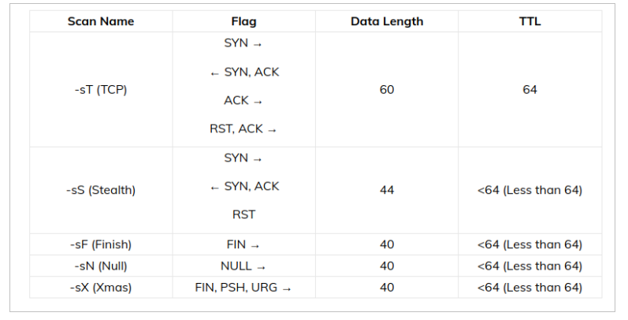
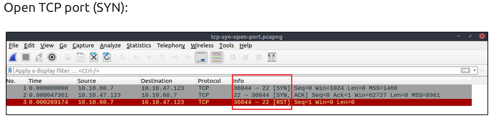
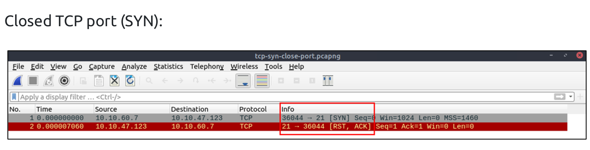
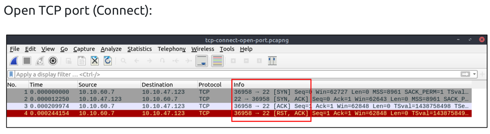
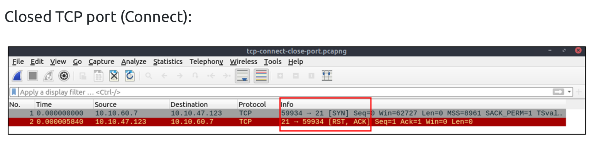
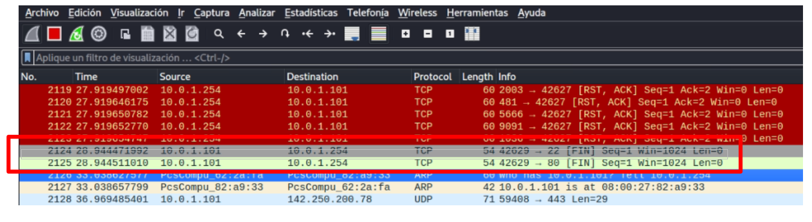
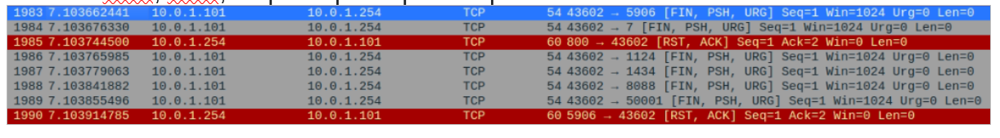
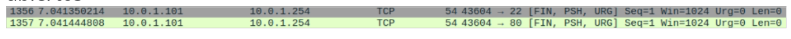
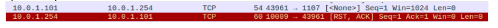
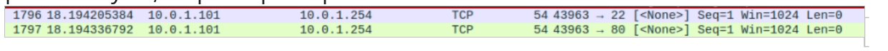

# Puertos
## Estado de un puerto
- Los puertos de comunicaciones tienen dos Estados:
    - Alcanzable: Un puerto es “alcanzable” si no existe ninguna causa externa (p.ej. filtros intermedios) que evite el contacto entre los extremos. De este modo el origen tendrá información de si dicho puerto está a la escucha o está cerrado.
    - Inalcanzable: Un puerto es “inalcanzable” en cualquier otro caso. Los puertos UDP abiertos, al no negociar una conexión de manera implícita, pueden dar la apariencia de que son inalcanzables.


# Arquitectura Nmap:
Nmap ofrece muchos tipos diferentes de escaneos que pueden usarse para obtener varios resultados sobre nuestros objetivos. Básicamente, Nmap se puede dividir en las siguientes técnicas de escaneo:
    • Descubrimiento de host
    • Escaneo de puertos
    • Enumeración y detección de servicios
    • Detección de sistema operativo
    • Interacción programable con el servicio de destino (Nmap Scripting Engine)

## Técnicas de escaneo:
Sintaxis:
```
nmap <scan types> <options> <target>
```
Nmap ofrece muchas técnicas de escaneo diferentes, haciendo diferentes tipos de conexiones y utilizando paquetes estructurados de manera diferente para enviar. Aquí podemos ver todas las técnicas de escaneo que ofrece Nmap:
```
nmap --help
<SNIP>
SCAN TECHNIQUES:
  -sS/sT/sA/sW/sM: TCP SYN/Connect()/ACK/Window/Maimon scans
  -sU: UDP Scan
  -sN/sF/sX: TCP Null, FIN, and Xmas scans
  --scanflags <flags>: Customize TCP scan flags
  -sI <zombie host[:probeport]>: Idle scan
  -sY/sZ: SCTP INIT/COOKIE-ECHO scans
  -sO: IP protocol scan
  -b <FTP relay host>: FTP bounce scan
<SNIP>
```


## Estados para Nmap de un puerto
La salida de Nmap es, dependiendo de las opciones que utilicemos, una lista de equipos escaneados a los que se acompaña de información adicional como el estado de sus puertos. Nmap define seis Estados distintos para recoger los distintos grados de incertidumbre en la determinación de si un puerto está abierto o cerrado, es decir, de si está a la escucha o no de nuevas conexiones o paquetes.

A diferencia del punto anterior (Estados de un puerto), estos estados no son propiedades intrínsecas de los puertos, sino que definen cómo son vistos desde el exterior. La razón de que Nmap sea considerado un escáner de puertos avanzado es, entre otros motivos, debido a esta granularidad en el estado de dichos puertos.

### Los Estados son los siguientes:
- **Abierto:** existe una aplicación en la máquina objetivo que está a la escucha de nuevas conexiones o paquetes TCP o UDP. Muestra un servicio disponible para ser usado en la red.

- **Cerrado:** es un puerto alcanzable, pero no existe una aplicación que esté a la escucha en él. Cuando el puerto se muestra como cerrado, el protocolo TCP indica que el paquete que recibimos **contiene un indicador RST**. Este método de escaneo también se puede utilizar para determinar si nuestro objetivo está vivo o no.

- **Filtrado:** Nmap no ha recibido respuestas a las sondas enviadas hacia un puerto. Suele significar que una herramienta intermedia (generalmente cortafuegos, sondas IDS/IPS, otros elementos de la red, o cualquier otro tipo de filtro) está bloqueando dicho puerto, respondiendo con poca o ninguna información (en ocasiones con un ICMP de tipo “destino inalcanzable”). Nmap no puede identificar correctamente si el puerto escaneado está abierto o cerrado porque no se devuelve una respuesta del destino para el puerto o recibimos un código de error del destino. Esta circunstancia ralentiza notablemente el escaneo para descartar que se trata de un problema de congestión de la red.

- **No filtrado:** Sólo aparece tras un análisis de tipo ACK. Es un puerto alcanzable, pero no es posible determinar si está abierto o cerrado.

- **Abierto | Filtrado:** En este caso, Nmap no ha sido capaz de determinar si el puerto está abierto o filtrado debido a falta de respuestas, bien porque ésta o la Sonda están siendo eliminadas por algún tipo de filtro de paquetes. 

- **Cerrado | Filtrado:** Sólo se obtiene tras un escaneo de tipo Idle. En este caso Nmap no ha sido capaz de determinar si el puerto está cerrado o filtrado.


# Escaneo de TCP Scan
El escaneo de TCP (Transmission Control Protocol) es una técnica utilizada en el ámbito de la seguridad informática para **identificar puertos abiertos (escuchando) en un sistema remoto**. TCP es uno de los protocolos fundamentales en las redes de Internet, encargado de establecer conexiones entre dos hosts y asegurar que los datos enviados lleguen de manera íntegra y en el orden correcto.

El proceso de escaneo de TCP busca determinar qué puertos están escuchando (abiertos) en un dispositivo. Esto se realiza enviando paquetes de datos a diferentes puertos y analizando las respuestas recibidas. Basándose en cómo responde un puerto a ciertos tipos de mensajes, un atacante o un profesional de seguridad puede inferir si el puerto está abierto, cerrado, o filtrado por un firewall.


## Tipos de escaneo de TCP:


### 1. Escaneo SYN (o half-open scan) 🠲 TCP scan (-sS) (Stealth)
Este método envía un paquete TCP SYN (solicitud de conexión) a un puerto específico del sistema objetivo. Si el puerto está abierto, el sistema responde con un paquete SYN-ACK, lo que indica que está listo para establecer una conexión. El escáner entonces envía un paquete RST (reset) para cerrar la conexión antes de que se complete, evitando así la creación de una conexión completa y posiblemente el registro de la actividad de escaneo.

**Esquema:**
```
FLAGS:
SYN 🠚
🠠 SYN, ACK
RST
----------------------------
Data Length: 44
TTL: <64
```

**Funcionamiento:**
- SYN: La herramienta de escaneo envía un paquete TCP con el flag SYN (synchronize) activado a un puerto específico del servidor objetivo. Esto indica el deseo de iniciar una conexión TCP.
- SYN-ACK o RST:
    - Si el puerto está abierto, el servidor responde con un paquete TCP que tiene activados los flags SYN y ACK, lo que indica su disposición a aceptar conexiones.
    - Si el puerto está cerrado, el servidor responde con un paquete TCP que tiene activado el flag RST (reset), lo que indica que no hay ninguna aplicación escuchando en ese puerto.
- RST: En lugar de completar el proceso de tres vías enviando un paquete ACK para establecer una conexión completa, la herramienta de escaneo envía un paquete RST para cerrar la tentativa de conexión. Esto evita la formación de una conexión completa, lo que podría ser registrado por los sistemas de monitoreo del servidor objetivo, haciendo al escaneo SYN menos detectable que otras formas de escaneo TCP, como el escaneo de conexión completa.

El escaneo SYN es especialmente útil para los atacantes y profesionales de la seguridad por igual porque permite mapear los puertos abiertos de un servidor sin establecer una conexión completa, lo que podría dejar huellas en los registros del sistema objetivo. Esto lo hace menos intrusivo y más difícil de detectar en comparación con otros métodos de escaneo que completan la conexión TCP. Además, el **escaneo SYN a menudo requiere privilegios de root** en el sistema desde el que se realiza el escaneo, ya que implica la creación directa de paquetes TCP a bajo nivel.

**Ejemplo: Escaneo para ver versiones de la máquina objetivo:**
```
sudo nmap -sS -V -A -T4 10.0.1.254
■ -sS: TCP SYN port scan (Default)
■ -V: Prints verbose output
■ -A: Enables OS detection, version detection, script scanning, and traceroute
■ -T4: T4 timing
```






### 2. Escaneo de conexión completa (o escaneo TCP connect) 🠲 TCP scan (-sT) (TCP)
En este caso, el escáner establece una conexión completa con el puerto objetivo utilizando el procedimiento normal de establecimiento de conexión TCP (handshake de tres vías: SYN, SYN-ACK, ACK). Aunque este método permite determinar si un puerto está abierto, también es más detectable porque la conexión se completa y puede quedar registrada en los sistemas de registro o detección de intrusiones del objetivo.

**Esquema:**
```
SYN 🠚
🠠 SYN, ACK
ACK 🠚
RST, ACK 🠚
----------------------------
Data Length: 60
TTL: <64
```


**Funcionamiento:** Esta técnica utiliza el procedimiento estándar de tres vías de TCP para establecer una conexión completa con el puerto objetivo:
- SYN: El cliente (o la herramienta de escaneo) envía un paquete TCP con el flag SYN activado a un puerto específico en el servidor. Este paso solicita abrir una conexión.
- SYN-ACK: Si el puerto está escuchando (abierto), el servidor responde con un paquete TCP que tiene activados los flags SYN y ACK, indicando que está listo para aceptar la conexión.
- ACK: El cliente completa el proceso de establecimiento de conexión enviando un paquete ACK al servidor.

Una vez establecida la conexión, el escáner puede confirmar que el puerto está abierto. Luego, generalmente, terminará la conexión enviando un paquete TCP con el flag FIN para cerrarla de manera ordenada.

**Esta técnica se utiliza por defecto cuando:**
- No es posible la utilización de SYN Scan (-sS).
- Cuando el usuario no tiene suficientes privilegios para crear paquetes RAW IP.

Para su funcionamiento, usa las llamadas de alto nivel del sistema operativo para crear los paquetes (concretamente la llamada connect()) y para obtener la información de los intentos de conexión, al igual que cualquier otra aplicación.

**Esta técnica es menos eficiente que SYN Scan (-sS) porque:**
- Nmap no toma el control de los paquetes enviados, como hace en la mayoría de las otras técnicas.
- Porque termina todas las conexiones, en lugar de hacer un half-open reset. Por este motivo, es menos sigilosa, siendo probable que un IDS/IPS registre los intentos de conexión.


**Ejemplos:**
```
sudo nmap -sT 10.0.1.254
sudo nmap -Pn -sT -p 22,80,8080 -v 10.0.1.254
■ -sT: TCP connect scan
■ -Pn: Hace un ping  que envía paquetes de tipo ICMP Address mask
■ -p: Define los puertos a los que realiza el escáner 22, 80,2022 y 8080
■ -v: Modo detallado, muestra hora de inicio del escáner, cantidad de hosts y puertos escaneados, duración del escaneo y resume brevemente los resultados.
```





### 3. Escaneo FIN, Xmas, y Null 
Estos métodos envían paquetes con banderas (flags) TCP inusuales o inválidas para provocar respuestas de los puertos que pueden ser interpretadas para determinar su estado. No todos los sistemas responden de la misma manera a estos paquetes, por lo que la efectividad de estos métodos puede variar.

Estas técnicas se basan en enviar sondas TCP con distintos flags activados, como por ejemplo Null, FIN, Xmas. Se aprovecha de una indefinición en el estándar RFC 793 para provocar una respuesta en el objetivo que determine si un puerto está abierto o cerrado. El fundamento de esta técnica reside en que los puertos cerrados de equipos compatibles con esta RFC responderán con un RST a cualquier paquete que no contenga un flag SYN, RST o ACK, mientras que no emitirán respuesta alguna si el puerto está abierto.

Según las respuestas obtenidas, Nmap clasifica los puertos en:
- Abiertos/Filtrados: Si no se recibe ninguna respuesta.
- Cerrados: Si se recibe un paquete RST.
- Filtrados: Si se recibe algún tipo de error ICMP inalcanzable.


#### Escaneo FIN 🠲(-sF) (Finish)
El escaneo FIN se basa en enviar un paquete TCP con el flag FIN (finalizar) activado a un puerto específico del objetivo. La lógica detrás de este tipo de escaneo se aprovecha de un detalle en el comportamiento de los puertos TCP según las especificaciones del protocolo.

En la técnica FIN Scan (-sF) se activa únicamente el flag FIN. Un paquete FIN se usa para terminar la conexión TCP entre el puerto de origen y el puerto de destino, generalmente después de que se completa la transferencia de datos. Nmap inicia un escaneo FIN enviando el paquete FIN. FIN scan sólo funciona en sistemas operativos TCP / IP basados de acuerdo con RFC 793.

**Esquema:**
```
FIN 🠚
----------------------------
Data Length: 40
TTL: <64
```


**Funcionamiento el escaneo FIN:**
- Paquete FIN enviado: La herramienta de escaneo envía un paquete TCP con el flag FIN a un puerto del servidor objetivo. Este paquete indica el deseo de cerrar una conexión, aunque en este contexto se envía sin que haya una conexión establecida previamente.
- Respuestas esperadas:
    - Si el puerto está abierto, en teoría, el puerto ignora el paquete FIN porque no hay una conexión existente para cerrar, y no se envía respuesta alguna. Esto se basa en el comportamiento estándar TCP que espera que los paquetes no solicitados (como un FIN a una conexión no existente) sean simplemente descartados.
    - Si el puerto está cerrado, el sistema responde con un paquete TCP que tiene activado el flag RST (reset), lo que indica que no hay ninguna conexión para cerrar en ese puerto.

La eficacia del escaneo FIN puede variar dependiendo de la configuración del sistema objetivo y de los dispositivos de seguridad en la red (como firewalls y sistemas de detección de intrusos) que pueden interceptar o responder de manera diferente a los paquetes inesperados. Un aspecto clave de este método es que, **al no completar un handshake TCP típico, puede evadir la detección en algunos sistemas que solo registran o alertan sobre conexiones TCP completas.**

El escaneo FIN es especialmente útil en entornos donde los puertos cerrados responden de manera predecible con paquetes RST, permitiendo al atacante o profesional de seguridad diferenciar entre puertos cerrados y potencialmente abiertos o filtrados. Sin embargo, no todos los sistemas operativos responden de la misma manera a los paquetes FIN no solicitados, lo que puede afectar la precisión de este método de escaneo.

**Ejemplo:**
```
nmap -sF 10.0.1.254
■ -sF: FIN Scan
```

```
FIN Scan Dirigido a un puerto abierto:
Kali Linux						                     Ubuntu Server
10.0.1.101  - - - - - - - - - - - - - - - -FIN - - - - - -- - >	10.0.1.254:22
10.0.1.101  <- - - - - - -- -No Response - - - -  -- - -	    10.0.1.254:22
xxxxxxxxxxx


FIN Scan Dirigido a un puerto cerrado:
Kali Linux						                     Ubuntu Server
10.0.1.101  - - - - - - - - - - - - - - - -FIN - - - - - -- - >	10.0.1.254
10.0.1.101  <- - - - -  - - - ----- -RST/ACK - - - -  - -	    10.0.1.254
```

Vemos con wireshark cómo la máquina 10.0.1.101 envía un paquete FIN a la máquina 10.0.1.254 que no obtiene respuesta. Justo encima vemos en rojo, respuestas del servidor de puertos cerrados ya que responden con RST, ACK →



#### Escaneo Xmas 🠲 (-sX) (Xmas)
El escaneo Xmas Tree recibe su nombre por la analogía de que los paquetes enviados están "iluminados" como un árbol de Navidad, debido a la combinación de varios flags TCP activados simultáneamente. En un escaneo Xmas Tree, los paquetes TCP se envían con los flags FIN, URG y PSH activados.

XMAS Scan sólo funciona en sistemas operativos TCP / IP basados de acuerdo con RFC 793. Xmas Scan solo funciona en máquinas Linux y no funciona en la última versión de Windows.

**Esquema:**
```
NULL 🠚
----------------------------
Data Length: 40
TTL: <64
```

**Funcionamiento del escaneo Xmas Tree:**
- Paquetes "iluminados" enviados: La herramienta de escaneo genera paquetes TCP con los flags FIN, URG, y PSH activados y los envía a puertos específicos en el servidor objetivo. Esta combinación inusual de flags no es típica en el tráfico de red normal, lo que da origen al nombre del escaneo.
- Respuestas esperadas:
    - Si el puerto está abierto o filtrado por un firewall que no responde a los paquetes inesperados, en teoría, no hay respuesta al paquete enviado, ya que el comportamiento estándar TCP es ignorar paquetes que no corresponden al estado actual de una conexión.
    - Si el puerto está cerrado, el sistema objetivo responde con un paquete TCP que tiene el flag RST activado, indicando que no hay ninguna conexión para cerrar y que el puerto no está escuchando.
      
La utilidad del escaneo Xmas Tree radica en su **capacidad para pasar desapercibido** por algunos sistemas de detección de intrusos y firewalls que no están configurados para detectar este tipo de tráfico anómalo. Sin embargo, al igual que el escaneo FIN, la eficacia de esta técnica puede variar significativamente entre diferentes sistemas y configuraciones de red. Algunos sistemas modernos pueden no responder de manera predecible a este tipo de paquetes, o incluso pueden responder a todos los paquetes inesperados con un RST, lo que hace más difícil interpretar los resultados del escaneo.

Es importante destacar que, aunque el escaneo Xmas Tree puede ser útil para identificar puertos abiertos sin ser detectado en ciertos entornos, su comportamiento puede ser inconsistente dependiendo del sistema operativo y de la configuración de la red objetivo. 

**Ejemplo:**
```
nmap -sX 10.0.1.254
```

```
XMAS Scan Dirigido a un puerto abierto:
Kali Linux						Ubuntu Server
10.0.1.101  - - - - - - - -FIN / URG / PSH - - - -- - >	10.0.1.254
10.0.1.101  <- - - - - - -- -No Response - - - -  -- - -	10.0.1.254

XMAS Scan Dirigido a un puerto cerrado:
Kali Linux						Ubuntu Server
10.0.1.101   - - - - - - - -FIN / URG / PSH - - - -- - >10.0.1.254
10.0.1.101  <- - - - -  - - - ----- -RST/ACK - - - -  - -	10.0.1.254
```

Vemos cómo en la primera fila, la máquina 10.0.1.101 envía un paquete FIN, PSH, URG a la máquina servidor 10.0.1.254 al puerto 5906. En la última fila, vemos la respuesta del servidor RST, ACK, lo que implica que ese puerto está cerrado.



Aquí vemos como no obtiene respuesta cuando se envía el paquete con los flags activados FIN, PSH, URG al puerto 22 y 80 del servidor, lo que implica que están abiertos→



#### Escaneo Null 🠲 (-sN) (Null)
Este tipo de escaneo se caracteriza por enviar paquetes TCP sin ningún flag activado (de ahí el término "Null", que significa "nulo" en inglés). La estrategia detrás del escaneo Null se basa en cómo los diferentes sistemas responden a paquetes TCP inusuales o inesperados, dependiendo de si los puertos están abiertos o cerrados.

NULL Scan sólo funciona en sistemas operativos TCP / IP basados de acuerdo con RFC 793. Xmas Scan solo funciona en máquinas Linux y no funciona en la última versión de Windows.

**Esquema:**
```
FIN, PSH, URG 🠚
----------------------------
Data Length: 40
TTL: <64
```


**Funcionamiento del escaneo Null:**
- Paquetes Null enviados: La herramienta de escaneo genera y envía paquetes TCP hacia puertos específicos en el servidor objetivo, asegurándose de que ningún flag TCP esté activado en el encabezado del paquete. Esto es atípico para el tráfico TCP normal, ya que los paquetes TCP generalmente tienen al menos un flag activado para indicar el propósito del paquete (como SYN para iniciar conexiones, ACK para reconocer la recepción, FIN para cerrar conexiones, etc.).
- Respuestas esperadas:
    - Si el puerto está abierto o filtrado (por ejemplo, por un firewall que no responde a paquetes inesperados), en teoría, el puerto ignora el paquete Null. El estándar TCP no especifica una respuesta para paquetes sin flags activados enviados a puertos abiertos, por lo que la falta de respuesta puede indicar que el puerto está abierto o filtrado.
    - Si el puerto está cerrado, el sistema objetivo responde con un paquete TCP que tiene el flag RST (reset) activado. Este paquete indica que no hay ninguna conexión asociada a estos paquetes y que el puerto no está escuchando.


La efectividad del escaneo Null, al igual que el escaneo FIN y el escaneo Xmas Tree, puede variar según el sistema operativo del host objetivo y la configuración de la red. Algunos sistemas operativos pueden no seguir el comportamiento esperado y podrían, por ejemplo, responder a todos los paquetes inusuales con paquetes RST, independientemente del estado del puerto.

Una de las ventajas teóricas del escaneo Null es su potencial para evadir la detección por parte de sistemas de monitoreo y firewalls que no estén configurados para buscar y responder a este tipo específico de tráfico anómalo. Sin embargo, debido a su naturaleza inusual, el tráfico generado por un escaneo Null puede ser más sospechoso para sistemas de seguridad avanzados o para administradores de red atentos.

Al igual que con otros métodos de escaneo, el uso del escaneo Null sin autorización en redes que no son de tu propiedad puede ser ilegal y considerado una violación de las políticas de uso aceptable. Es una herramienta útil para profesionales de la seguridad que realizan pruebas de penetración o evaluaciones de seguridad con permiso, permitiéndoles identificar puertos abiertos y evaluar la postura de seguridad de una red.

**Ejemplo:**
```
nmap -sN 10.0.1.254
```

```
NULL Scan Dirigido a un puerto abierto:
Kali Linux						Ubuntu Server
10.0.1.101  - - - - - - - - -No Flags Set - - - - - -- - >	10.0.1.254
10.0.1.101  <- - - - - - -- -No Response - - - -  -- - -	10.0.1.254

NULL Scan Dirigido a un puerto cerrado:
Kali Linux						Ubuntu Server
10.0.1.101  - - - - - - - - -No Flags Set - - - - - -- - >	10.0.1.254
10.0.1.101  <- - - - -  - - - ----- -RST/ACK - - - -  - -	10.0.1.254
```

Vemos con wireshark cómo la máquina 10.0.1.101 envía un paquete sin ningún flag activado [<None>] a la máquina 10.0.1.254 al puerto 43961. También vemos la respuesta de la máquina servidor 10.0.1.254 que responden RST/ACK, lo que implica que ese puerto está cerrado →


Aquí vemos como no obtiene respuesta cuando se envía el paquete sin ningún flag al puerto 22 y 80, lo que implica que están abiertos →


# Otros escaneos
**Ejemplos:**
```
sudo nmap -A -sC -Pn- 10.0.1.254
■ -A: Perform an Aggresive Scan
■ -sC: Scan with default NSE scripts. Considered useful for discovery and safe
■ -Pn: Hace un ping  que envía paquetes de tipo ICMP Addressmask
```


# Bloqueo de TCP Scan

## Bloqueo de escaneo de puertos abiertos
Rechazaremos SYN flags con IPTables en el ubuntu server. Aplicaremos un filtro de firewall que ahora evitará la comunicación de protocolo de enlace de 3 vías en la red y resistirá al atacante para realizar un escaneo TCP al rechazar el paquete SYN en la red.

Ejecutamos el siguiente comando para hacer una regla de filtrado para bloquear el paquete SYN en el ubuntu server→
```
iptables -I INPUT -p tcp --tcp-flags ALL SYN -j REJECT --reject-with tcp-reset
■ -I: Inserta una regla en una cadena en un punto especificado por un valor entero definido por el usuario.
■ INPUT: Cadenas por donde van a circular los paquetes dentro del sistema: Contiene los paquetes destinados al equipo local con cualquier origen.
■ -p: Configura el protocolo IP para la regla.
■ -cp-flags ALL SYN: Permite a los paquetes TCP con bits específicos o banderas, ser coincididos con una regla. Máscara que configura las banderas a ser examinadas en el paquete: ALL. Bandera que se debe configurar para poder coincidir: SYN.
■ -j REJECT: Salta a un objetivo particular cuando un paquete coincide con una regla particular. Objetivo: REJECT. Envía un paquete de error de vuelta al sistema remoto y deja caer el paquete.
■ --reject-with tcp-reset: El objetivo REJECT acepta --reject-with <tipo> (donde <tipo> es el tipo de rechazo) el cual permite devolver información más detallada con el paquete de error. Se rechaza con el tipo tcp-reset que se emplea para cerrar de una forma elegante conexiones TCP abiertas.
```


# Bypass del bloqueo de paquetes SYN del Firewall
Esta técnica se basa en enviar sondas TCP con distintos flags activados, como por ejemplo Null, FIN, Xmas. Se aprovecha de una indefinición en el estándar RFC 793 para provocar una respuesta en el objetivo que determine si un puerto está abierto o cerrado. El fundamento de esta técnica reside en que los puertos cerrados de equipos compatibles con esta RFC responderán con un RST a cualquier paquete que no contenga un flag SYN, RST o ACK, mientras que no emitirán respuesta alguna si el puerto está abierto.

Según las respuestas obtenidas, Nmap clasifica los puertos en:
- Abiertos/Filtrados: Si no se recibe ninguna respuesta.
- Cerrados: Si se recibe un paquete RST.
- Filtrados: Si se recibe algún tipo de error ICMP inalcanzable.


