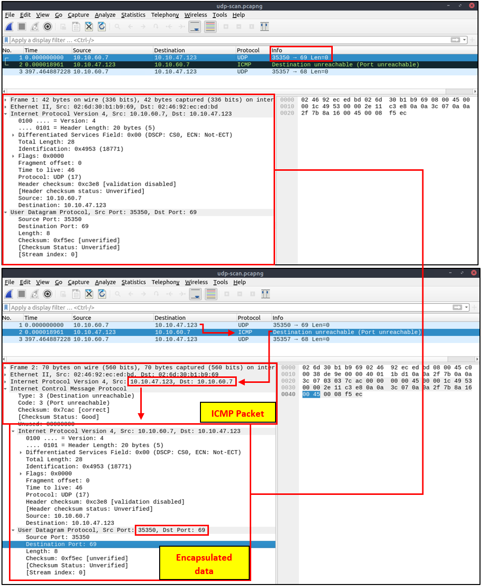
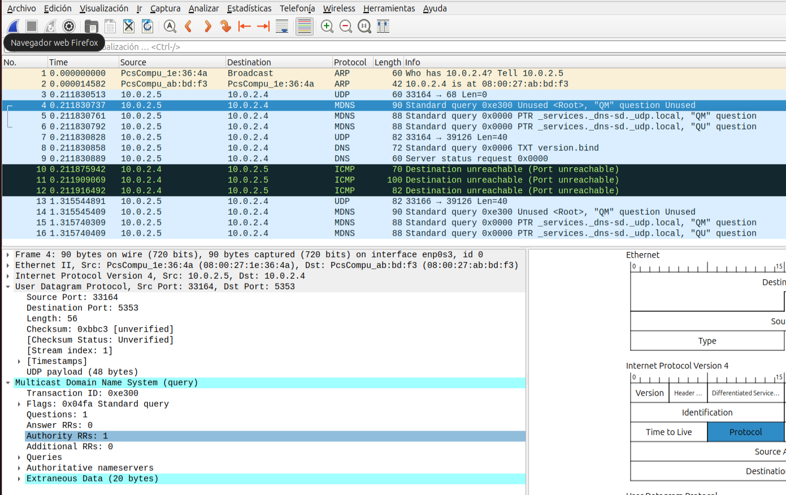
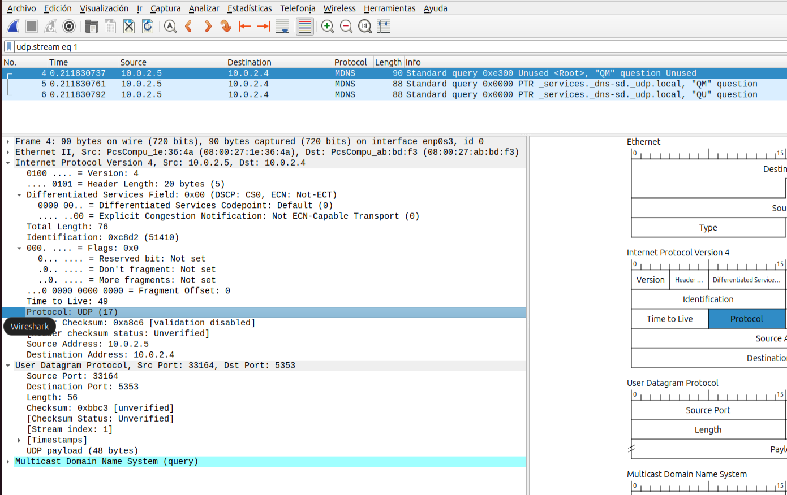

# UDP Scan

El escaneo UDP es una técnica utilizada en la seguridad informática y la administración de redes para descubrir servicios o aplicaciones que están escuchando en los puertos UDP de un host. A diferencia de los puertos TCP, los puertos UDP no establecen una conexión directa antes de la transferencia de datos, lo que puede hacer que el escaneo de puertos UDP sea más complicado y menos fiable que el escaneo de puertos TCP.

Cuando se realiza un escaneo UDP, el objetivo es enviar paquetes UDP a diferentes puertos del host objetivo. La forma en que el host responde a estos paquetes puede revelar si un puerto está abierto o cerrado. Sin embargo, la interpretación de las respuestas puede ser desafiante debido a las características del protocolo UDP.

## Cómo Funciona el Escaneo UDP:
- Envío de Paquetes: El escáner envía un paquete UDP al puerto objetivo en el host. Este paquete puede contener datos específicos diseñados para provocar una respuesta de las aplicaciones que escuchan en ese puerto.
- Respuestas y sus Significados:
  - Puerto Abierto: Si una aplicación está escuchando en el puerto, puede que no responda al paquete UDP si no espera datos de esa forma, lo que podría hacer parecer que el puerto está cerrado o filtrado. Sin embargo, algunas aplicaciones responderán con un mensaje que puede indicar que el puerto está activo.

  - Puerto Cerrado: Si no hay ninguna aplicación escuchando en el puerto, el host objetivo debería responder con un mensaje de error ICMP (Internet Control Message Protocol) como "Puerto inalcanzable". Esto indica claramente que el puerto está cerrado.

  - Sin Respuesta o Filtrado: Si no hay respuesta después de varios intentos de envío, podría ser indicativo de que el puerto está filtrado por un firewall, o que las respuestas están siendo descartadas en la ruta de vuelta.

- Desafíos:
  - Filtrado de Respuestas: Los firewalls y los dispositivos de filtrado de paquetes pueden bloquear los paquetes UDP salientes o las respuestas ICMP entrantes, lo que hace difícil determinar si un puerto está abierto.
  - Respuestas Limitadas: Dado que las aplicaciones UDP no necesitan responder a un paquete si este no contiene datos esperados, la ausencia de respuesta no siempre significa que un puerto esté cerrado o filtrado.

Debido a estas peculiaridades, el escaneo UDP puede resultar menos fiable y más lento que el escaneo TCP. A pesar de esto, sigue siendo una herramienta valiosa en la caja de herramientas de un auditor de seguridad, especialmente cuando se necesitan identificar servicios UDP específicos o cuando se auditan redes para las cuales el conocimiento previo es limitado.

## El escaneo UDP, en resumen, es un método de identificación de puertos que:
- No requiere un proceso de establecimiento de conexión previo.
- No genera una respuesta directa para puertos abiertos.
- Provoca mensajes de error ICMP para puertos cerrados.
- Se realiza comúnmente con el comando nmap -sU.
- Impacto en la Red: Este tipo de escaneo puede generar una cantidad significativa de tráfico de red y, potencialmente, afectar el rendimiento de la red o los sistemas objetivo.


## Tráfico de red durante un UDP Scan -sU en puertos que están cerrados:
```
UDP Scan Dirigido a un puerto cerrado:
Kali Linux						Ubuntu Server
10.0.2.5:47536  - - - - - - - - -UDP pcaket - - - - - -- - >	10.0.2.4:19722
10.0.2.4:19722  <- -  ICMP Type3, code 3 message (Destinatios unreachable, port unreachable) - - -	10.0.2.5:47536
```


Vemos un detalle de la respuesta del servidor:
- Protocolo ICMP.
- Internet Control Message Protocol:
  -  Type: 3 (Destination unreachable)
  -  Code: 3 (Port unreachable)


## Otro ejemplo: Tráfico de red durante un UDP Scan -sU en puertos que están cerrados:


La imagen anterior muestra que el puerto cerrado devuelve un paquete de error ICMP. A primera vista, no se proporciona más información sobre el error, entonces, ¿cómo puede un analista decidir a qué pertenece este mensaje de error? El mensaje de error ICMP utiliza la solicitud original como datos encapsulados para mostrar el origen/razón del paquete. Una vez que expandes la sección ICMP en el panel de detalles del paquete, verás los datos encapsulados y la solicitud original, como se muestra en la imagen a continuación.




## Tráfico de red durante un UDP Scan -sU en puertos que están abiertos:
Hacemos un scan de puertos udp:
```
udo nmap -sU -p 53,68,5353,39126  10.0.2.4
```


Tráfico generado en wireshark:



```
UDP Scan Dirigido a un puerto abierto:
Kali Linux						Ubuntu Server
10.0.2.5:33164  - - - - - - - - -No Flags Set - - - - - -- - >	10.0.2.4:5353
10.0.2.4:x  <- - - - - - -- -No Response - - - -  -- - -	10.0.2.5:xx
```

Seguimos la secuencia UDP del paquete número 4:



## Filtros wireshark para detectar un UDP scan
Para detectar un escaneo UDP utilizando Wireshark, se pueden emplear varios filtros de visualización que ayuden a identificar patrones de tráfico sospechoso. Un escaneo UDP se realiza típicamente para descubrir puertos abiertos en dispositivos dentro de una red, enviando paquetes UDP a diferentes puertos y observando las respuestas. Dado que UDP es un protocolo sin conexión, la detección de escaneos puede ser menos directa en comparación con los protocolos orientados a conexión como TCP.

Algunos filtros que podemos utilizar:
- Filtro para tráfico UDP: Comienza por filtrar todo el tráfico UDP para simplificar la visualización de los paquetes relevantes.
  ```
  udp
  ```
- Puertos de destino no estándar: Los escaneos a menudo se dirigen a puertos que no se utilizan comúnmente para servicios estándar. Puedes filtrar por rangos de puertos o puertos específicos que te interesen. Este filtro excluye el tráfico hacia puertos DNS (53) y NTP (123), que son comunes y probablemente no parte de un escaneo.
  ```
  udp.port != 53 && udp.port != 123
  ```
- Respuestas de error o sin respuesta: En un escaneo UDP, los paquetes enviados a puertos cerrados pueden generar mensajes de error ICMP tipo 3 (destino inalcanzable). Filtrar por estos mensajes puede ayudar a identificar los puertos que se estaban escaneando.
  ```
  icmp.type == 3
  icmp.type==3 and icmp.code==3     
  ```

- Actividad sospechosa de una sola fuente: Si sospechas de un host específico que está realizando el escaneo, puedes filtrar el tráfico UDP originado por esa dirección IP.
  ```
  ip.src == ipHostSospechoso && udp
  ```

- Alta frecuencia de solicitudes a diferentes puertos: Un patrón de escaneo puede involucrar una alta frecuencia de paquetes dirigidos a múltiples puertos en un corto período de tiempo. Wireshark no puede filtrar directamente por la frecuencia de los paquetes, pero puedes ordenar los paquetes por dirección de destino y número de puerto para identificar patrones visuales de este tipo de actividad.

- Tamaño de paquete uniforme: Algunas herramientas de escaneo envían paquetes de tamaño uniforme. Aunque este no es un método directo de filtrado en Wireshark, observar el tamaño de los paquetes en las columnas puede ayudar a identificar patrones.

