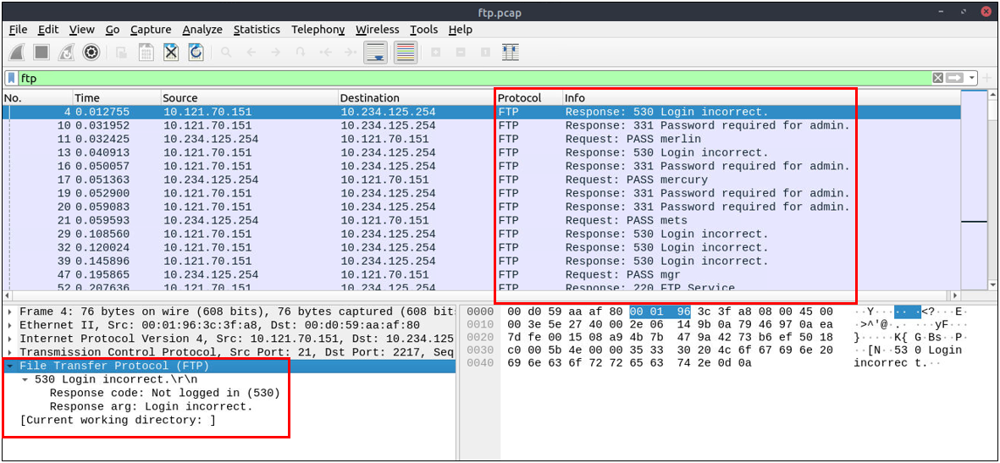

# Análisis de Protocolos en Texto Plano
Investigar rastros de protocolos en texto plano parece fácil, pero cuando llega el momento de investigar un gran rastro de red para el análisis de incidentes y respuesta, el juego cambia. Un análisis adecuado es más que seguir el flujo y leer los datos en texto plano. Para un analista de seguridad, es importante crear estadísticas y resultados clave del proceso de investigación. 

## Análisis FTP
El Protocolo de Transferencia de Archivos (FTP) está diseñado para transferir archivos con facilidad, por lo que se enfoca en la simplicidad en lugar de la seguridad. Como resultado de esto, usar este protocolo en entornos no seguros podría crear problemas de seguridad como:
- Ataques de Hombre en el Medio (MITM).
- Robo de credenciales y acceso no autorizado.
- Phishing.
- Instalación de malware.
- Exfiltración de datos.

## Filtros Wireshark:
- Búsqueda global:
  ```
  ftp
  ```

- Opciones de "FTP" para aprovechar las oportunidades más accesibles:
  - Serie x1x: Respuestas a solicitudes de información.
  - Serie x2x: Mensajes de conexión.
  - Serie x3x: Mensajes de autenticación.
  Nota: "200" significa comando exitoso.

- Opciones de "FTP" "x1x":
  - 211: System status.
  - 212: Directory status.@
  - 213: File status
  ```
  ftp.response.code == 211
  ```

- Opciones de "FTP" "x2x":
  -  230: User login.
  -  231: User logout.
  -  331: Valid username.
  -  430: Invalid username or password.
  -  530: No login, invalid password.
  ```
  ftp.response.code == 230
  ```

- "FTP" commands:
  - USER: Username.
    ```
    ftp.request.command == "USER"
    ```
  - PASS: Password.
    ```
    ftp.request.command == "USER"
    ftp.request.command == "PASS"
    ftp.request.arg == "password"
    ```
  - CWD: Current work directory.
  - LIST: List.


- Ejemplos de usos avanzados
  - Bruteforce signal: Intentos de inicio de sesión incorrectos en Wireshark: buscamos paquetes que contengan respuestas del servidor que indiquen un fallo en la autenticación:
    ```
    ftp.response.code == 530
    ```
  - Bruteforce signal: List target username.
    ```
    (ftp.response.code == 530) and (ftp.response.arg contains "username")
    ```
  - Password spray signal: List targets for a static password.
    ```
    (ftp.request.command == "PASS" ) and (ftp.request.arg == "password")
    ```




