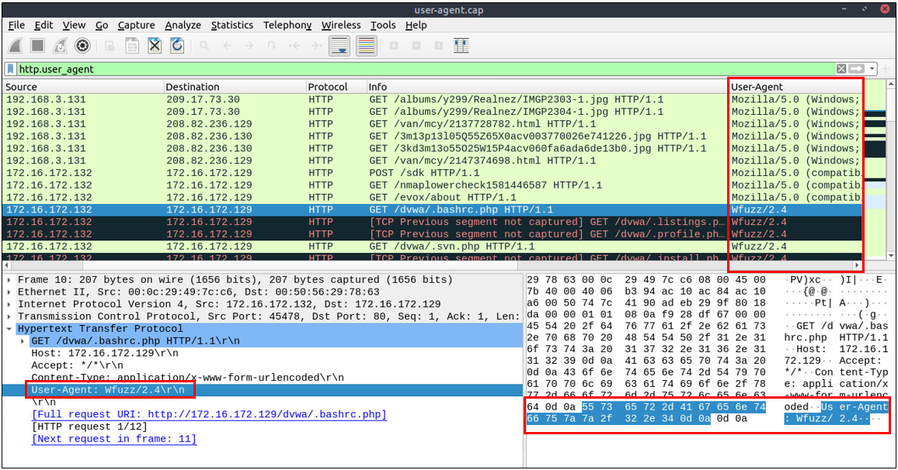

# HTTP Analysis
El Protocolo de Transferencia de Hipertexto (HTTP) es un protocolo en texto plano, de solicitud-respuesta y cliente-servidor. Es el tipo estándar de actividad de red para solicitar/servir páginas web y, por defecto, no está bloqueado por ningún perímetro de red. Como resultado de ser no encriptado y la columna vertebral del tráfico web, HTTP es uno de los protocolos que se deben conocer en el análisis de tráfico.

Los siguientes ataques podrían ser detectados con la ayuda del análisis de HTTP:
- Páginas de phishing.
- Ataques web.
- Exfiltración de datos.
- Tráfico de comando y control (C2)


## Filtros Wireshark para HTTP ANALYSIS
- Búsqueda global:
  ```
  http
  http2
  ```
  Nota: HTTP2 es una revisión del protocolo HTTP para un mejor rendimiento y seguridad. Soporta la transferencia de datos binarios y el multiplexado de solicitud y respuesta.

- HTTP Request Methods:
  - GET:
    ```
    http.request.method == "GET"
    ```

  - POST:
    ```
    http.request.method == "POST"
    ```

  - Request: Listing all requests:
    ```
    http.request
    ```

- HTTP Response Status Codes:
  - 200 OK: Request successful:
    ```
    http.response.code == 200
    ```
  - 301 Moved Permanently: Resource is moved to a new URL/path (permanently).
  - 302 Moved Temporarily: Resource is moved to a new URL/path (temporarily).
  - 400 Bad Request: Server didn't understand the request.
  - 401 Unauthorised: URL needs authorisation (login, etc.):
    ```
    http.response.code == 401
    ```
  - 403 Forbidden: No access to the requested URL.
  - 404 Not Found: Server can't find the requested URL.
  - 405 Method Not Allowed: Used method is not suitable or blocked.
  - 408 Request Timeout:  Request look longer than server wait time.
  - 500 Internal Server Error: Request not completed, unexpected error.
  - 503 Service Unavailable: Request not completed server or service is down.


- HTTP Parameters:
  - User agent: Browser and operating system identification to a web server application:
    ```
    http.user_agent contains "nmap"
    ```
  - Request URI: Points the requested resource from the server:
    ```
    http.request.uri contains "admin"
    ```
  - Full *URI: Complete URI information:
    ```
    http.request.full_uri contains "admin"
    ```

Nota: *URI: Uniform Resource Identifier. Es una cadena de caracteres que se utiliza para identificar un recurso en la red. Los URIs proporcionan una forma de localizar un recurso especificando su ubicación en una red. Un URI puede ser
- Un URL (Uniform Resource Locator), que es el tipo más común de URI y especifica no solo la identidad del recurso sino también cómo acceder a él (como http://www.example.com).
- Un URN (Uniform Resource Name), que identifica el recurso de manera única sin especificar cómo localizarlo.

- HTTP Parameters:
  - Server: Server service name:
    ```
    http.server contains "apache"
    ```
  - Host: Hostname of the server:
    ```
    http.host contains "keyword"
    http.host == "keyword"
    ```
  - Connection: Connection status:
    ```
    http.connection == "Keep-Alive"
    ```
  - Line-based text data: Cleartext data provided by the server:
    ```
    data-text-lines contains "keyword"
    ```
  - HTML Form URL Encoded: Web form information: Un filtro que se centre en el tipo de contenido MIME utilizado por estos formularios al ser enviados. Los formularios web codificados en URL típicamente usan el tipo de contenido application/x-www-form-urlencoded para el cuerpo de la solicitud POST.
    ```
    http.request.method == "POST" && http.content_type == "application/x-www-form-urlencoded"
    ```


## Filtros Wireshark para USER AGENT ANALYSIS
A medida que los adversarios utilizan técnicas sofisticadas para llevar a cabo ataques, intentan dejar rastros similares al tráfico natural a través de los protocolos conocidos y confiables. Para un analista de seguridad, es importante detectar los signos de anomalía en los bits y piezas de los paquetes. El campo "user-agent" es uno de los grandes recursos para detectar anomalías en el tráfico HTTP. En algunos casos, los adversarios modifican con éxito los datos del user-agent, lo que podría parecer completamente natural. 

Un analista de seguridad no puede confiar únicamente en el campo del user-agent para detectar una anomalía. Nunca incluyas en una lista blanca un user agent, incluso si parece natural. La detección/búsqueda de anomalías/amenazas basada en el user agent es una fuente de datos adicional para verificar y es útil cuando hay una anomalía obvia. Si no estás seguro acerca de un valor, puedes realizar una búsqueda web para validar tus hallazgos con la información del user-agent por defecto y normal ([sitio de ejemplo](https://developers.whatismybrowser.com/useragents/explore/)).

- Búsqueda global:
  ```
  http.user_agent
  ```

- Resultados de la investigación:
  - Different user agent information from the same host in a short time notice.
  - Non-standard and custom user agent info.
  - Subtle spelling differences. ("Mozilla" is not the same as  "Mozlilla" or "Mozlila").
  - Audit tools info like Nmap, Nikto, Wfuzz and sqlmap in the user agent field.
  - Payload data in the user agent field.
  ```
  (http.user_agent contains "sqlmap") || (http.user_agent contains "Nmap") || (http.user_agent contains "Wfuzz") || (http.user_agent contains "Nikto"
  ```


