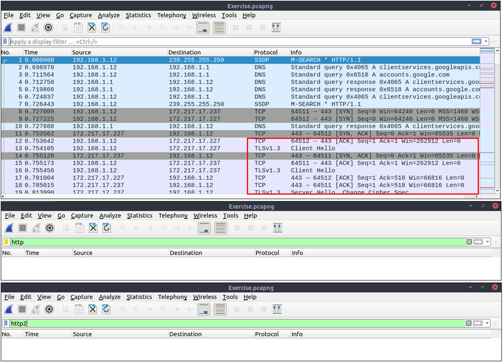
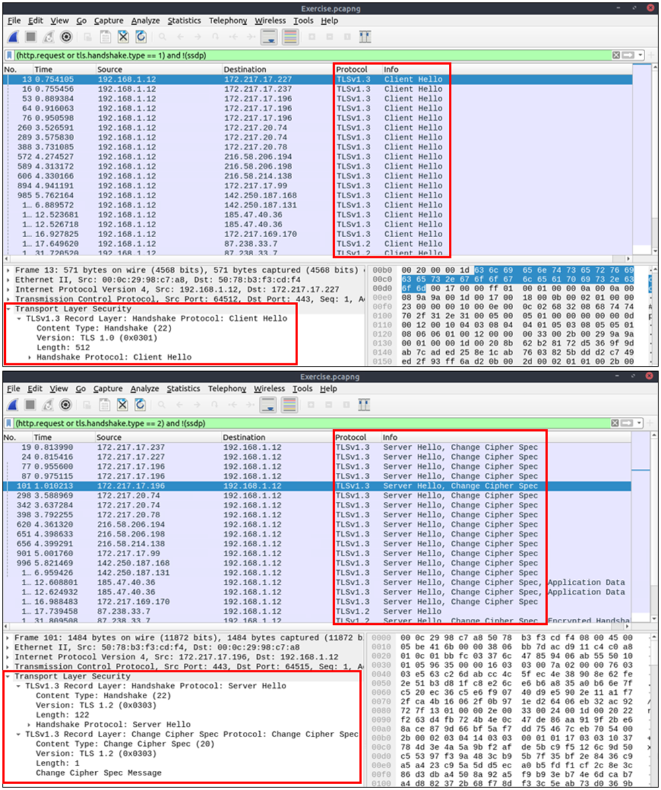
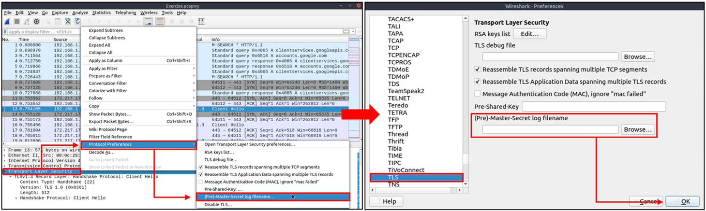
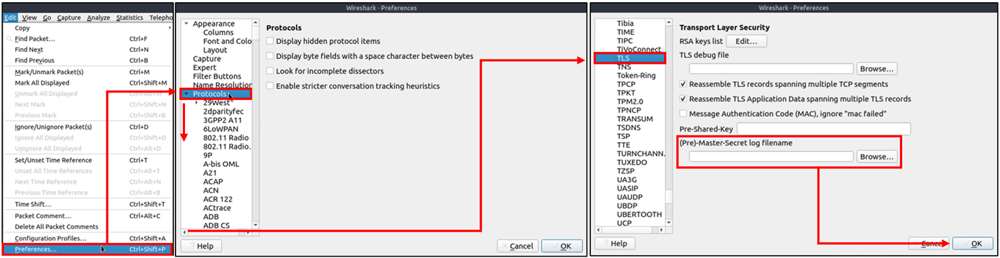
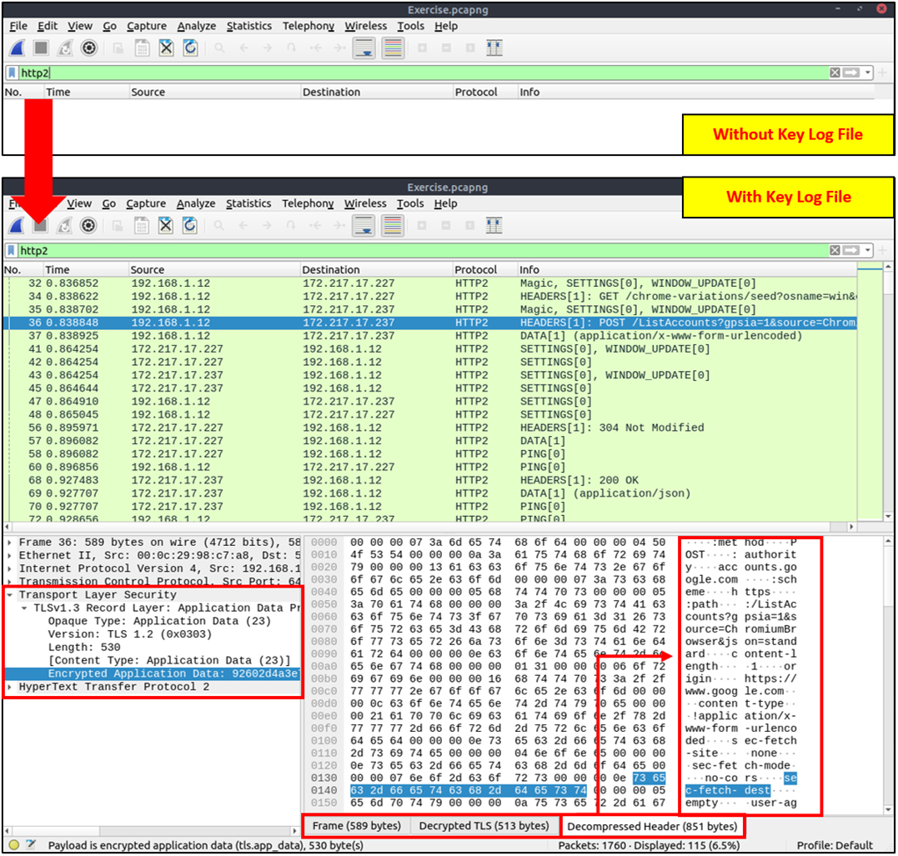

# Descifrando Tráfico HTTPS

Al investigar el tráfico web, los analistas a menudo se encuentran con tráfico encriptado. Esto se debe al uso del protocolo Hypertext Transfer Protocol Secure (HTTPS) para una mayor seguridad contra ataques de suplantación de identidad, interceptación y escucha. HTTPS utiliza el protocolo TLS para encriptar las comunicaciones, por lo que es imposible descifrar el tráfico y ver los datos transferidos sin tener los pares de claves de encriptación/desencriptación. Dado que este protocolo proporciona un buen nivel de seguridad para la transmisión de datos sensibles, los atacantes y los sitios web maliciosos también utilizan HTTPS. Por lo tanto, un analista de seguridad debe saber cómo utilizar archivos de claves para descifrar el tráfico encriptado e investigar la actividad del tráfico.

Los paquetes aparecerán en diferentes colores ya que el tráfico HTTP está encriptado. Además, los detalles del protocolo e información (dirección URL real y datos devueltos por el servidor) no serán completamente visibles. La primera imagen a continuación muestra los paquetes HTTP encriptados con el protocolo TLS. La segunda y tercera imágenes demuestran cómo filtrar paquetes HTTP sin utilizar un archivo de registro de claves.

