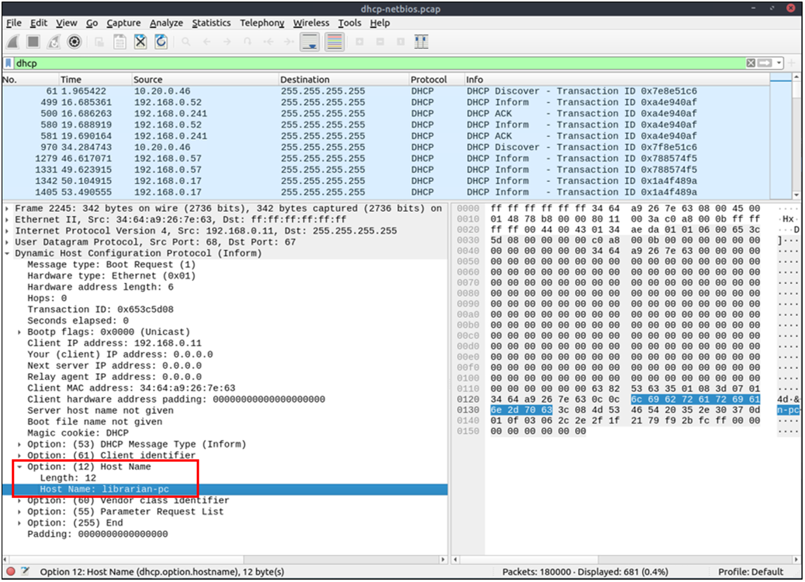
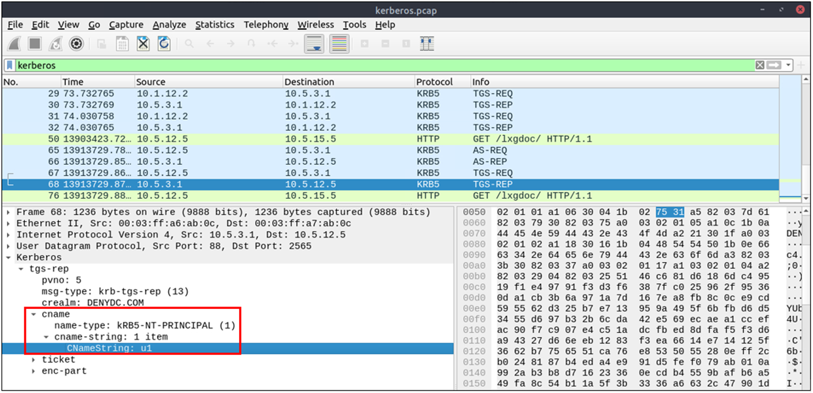

Cuando se investiga un compromiso o actividad de infección por malware, un analista de seguridad debe saber cómo identificar los hosts en la red aparte del emparejamiento de dirección IP con dirección MAC. Uno de los mejores métodos es identificar los hosts y usuarios en la red para decidir el punto de partida de la investigación y listar los hosts y usuarios asociados con el tráfico/actividad maliciosos.

Usualmente, las redes empresariales utilizan un patrón predefinido para nombrar a los usuarios y hosts. Aunque esto facilita el conocimiento y seguimiento del inventario, tiene lados buenos y malos. El lado bueno es que será fácil identificar un usuario o host mirando el nombre. El lado malo es que será fácil clonar ese patrón y vivir en la red empresarial para los adversarios. Hay múltiples soluciones para evitar este tipo de actividades, pero para un analista de seguridad, sigue siendo esencial tener habilidades de identificación de host y usuario.

Protocolos que pueden ser utilizados en la identificación de Host y Usuario:
- Tráfico del Protocolo de Configuración Dinámica de Host (DHCP).
- Tráfico de NetBIOS (NBNS).
- Tráfico de Kerberos.


# Análisis de DHCP
El protocolo DHCP, o Protocolo de Configuración Dinámica de Host (DHCP, por sus siglas en inglés), es la tecnología responsable de gestionar la asignación automática de direcciones IP y los parámetros de comunicación requeridos.

## Investigación de DHCP en resumen:
- Búsqueda global:
  ```
  dhcp
  bootp
  ```

- Filtrado por "DHCP packet options": Debido a la naturaleza del protocolo, solo la "Opción 53" (tipo de solicitud) tiene valores estáticos predefinidos. Deberías filtrar primero el tipo de paquete, y luego puedes filtrar el resto de las opciones aplicándolas como columna o usando filtros avanzados como "contiene" y "coincide".
  - Los paquetes de "Solicitud DHCP" contienen la información del nombre del host:
    ```
    dhcp.option.dhcp == 3
    ```
  
  - Los paquetes "DHCP ACK" representan las solicitudes aceptadas:
    ```
    dhcp.option.dhcp == 5
    ```
  
  - Los paquetes "DHCP NAK" representan solicitudes denegadas
    ```
    dhcp.option.dhcp == 6
    ```

- DHCP Request:
  - Option 12: Hostname.
  - Option 50: Requested IP address.
  - Option 51: Requested IP lease time.
  - Option 61: Client's MAC address.
    ```
    dhcp.option.hostname contains "keyword"
    ```

- DHCP ACK:
  - Option 15: Domain name.
  - Option 51: Assigned IP lease time.
    ```
    dhcp.option.domain_name contains "keyword"  
    ```

- DHCP NAK:
  - Option 56: Message (rejection details/reason).
  - Como el mensaje puede ser único según el caso/situación, se sugiere leer el mensaje en lugar de filtrarlo. Por lo tanto, el analista podría crear una hipótesis/resultado más confiable al comprender las circunstancias del evento.





# NetBIOS (NBNS) Analysis
NetBIOS (Network Basic Input/Output System) es la tecnología responsable de permitir que aplicaciones en diferentes hosts se comuniquen entre sí.

## Investigación de NBNS en resumen:
- Búsqueda global:
  ```
  nvns
  ```

- NBNS:
  - Queries (consultas): Detalle de la consulta.
  - Los detalles de la consulta pueden contener:
    ```
    nbns.name contains "keyword"
    ```


# Kerberos Analysis
Kerberos es el servicio de autenticación predeterminado para dominios de Microsoft Windows. Es responsable de autenticar las solicitudes de servicio entre dos o más computadoras a través de una red que no es de confianza. El objetivo final es demostrar la identidad de forma segura.

## Investigación de Kerberos en resumen:
- Búsqueda global: 
  ```
  kerberos
  ```

- Búsqueda de cuentas de usuario: Algunos paquetes podrían proporcionar información del nombre de host en este campo. Para evitar esta confusión, filtre el valor "$". Los valores que terminan en "$" son nombres de host y los que no lo tienen son nombres de usuario.
  - CNameString: el nombre de usuario.
    ```
    kerberos.CNameString contains "keyword"
    kerberos.CNameString and !(kerberos.CNameString contains "$" )
    ```


- Kerberos options:
  - pvno: Version del Protocolo:
    ```
    kerberos.pvno == 5
    ```
  - realm: nombre de dominio para el ticket generado:
    ```
    kerberos.realm contains ".org"
    ```
  - addresses: Dirección IP del cliente y nombre NetBIOS. Nota: la información de "direcciones" solo está disponible en paquetes de solicitud.
    ```
    kerberos.SNameString == "krbtg"
    ```




