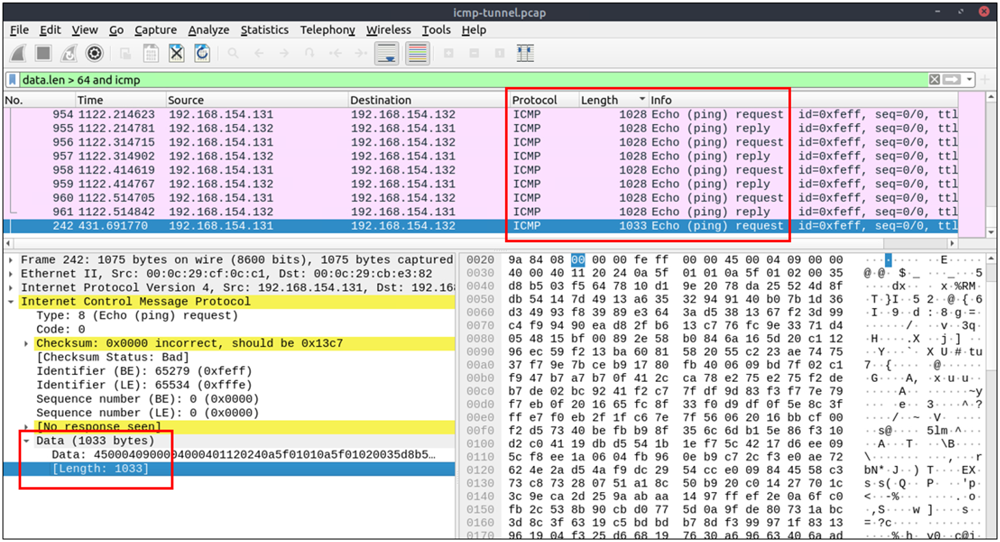
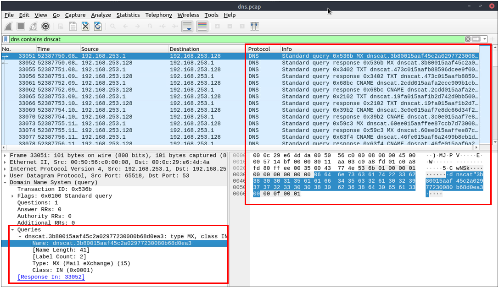

# Tunelización de Tráfico: ICMP y DNS

La tunelización de tráfico (también conocida como "reenvío de puertos") es el proceso de transferir datos/recursos de manera segura a segmentos y zonas de red. Se puede utilizar para flujos/direcciones de "internet a redes privadas" y de "redes privadas a internet". Hay un proceso de encapsulamiento para ocultar los datos, por lo que los datos transferidos parecen naturales para el caso, pero contienen paquetes de datos privados y los transfieren al destino final de manera segura.

La tunelización proporciona anonimato y seguridad del tráfico. Por lo tanto, es muy utilizado por redes empresariales. Sin embargo, dado que ofrece un nivel significativo de encriptación de datos, los atacantes utilizan la tunelización para eludir los perímetros de seguridad utilizando los protocolos estándar y confiables usados en el tráfico cotidiano como ICMP y DNS. Por lo tanto, para un analista de seguridad, es crucial tener la capacidad de detectar anomalías en ICMP y DNS.

El "Tunneling" de tráfico, específicamente utilizando DNS e ICMP, es una técnica que permite el envío de datos a través de protocolos de red de manera encubierta. Esta práctica puede ser utilizada tanto para propósitos legítimos como para actividades maliciosas. 

## Tunneling de Tráfico
El "tunneling" de tráfico es un método para enviar datos entre dos puntos a través de una red pública de manera privada. Esto se logra encapsulando los datos originales en paquetes de otro protocolo, de tal manera que los datos encapsulados pueden atravesar la red sin ser detectados fácilmente. Es una técnica comúnmente utilizada en VPNs (Redes Privadas Virtuales) para crear conexiones seguras a través de Internet.


## DNS Tunneling
El DNS (Sistema de Nombres de Dominio) es un protocolo utilizado para traducir nombres de dominio fáciles de recordar (como www.example.com) en direcciones IP numéricas que las computadoras pueden entender. El DNS Tunneling aprovecha este protocolo para enviar datos no relacionados con DNS dentro de las solicitudes y respuestas DNS.

Por ejemplo, un atacante puede utilizar DNS Tunneling para enviar comandos a un malware instalado en una red infectada. Debido a que el tráfico DNS a menudo no es inspeccionado tan rigurosamente como el tráfico HTTP o HTTPS en muchas redes, esta técnica puede ser utilizada para evadir firewalls o filtros de contenido.

## ICMP Tunneling
ICMP (Protocolo de Mensajes de Control de Internet) es un protocolo utilizado para enviar mensajes de error o de control entre dispositivos en una red. Los ejemplos incluyen los mensajes "echo request" y "echo reply" utilizados por el comando "ping" para verificar la disponibilidad de un dispositivo en la red.

El ICMP Tunneling consiste en ocultar y enviar datos dentro de estos mensajes ICMP. Al igual que con el DNS Tunneling, esta técnica puede ser utilizada para eludir controles de seguridad, dado que el tráfico ICMP es esencial para el diagnóstico de la red y, por lo tanto, a menudo se permite pasar a través de los firewalls sin mucha inspección.


# Análisis de ICMP
El Protocolo de Mensajes de Control de Internet (ICMP) está diseñado para diagnosticar e informar sobre problemas de comunicación de red. Se utiliza ampliamente en la notificación de errores y pruebas. Como es un protocolo de capa de red de confianza, a veces se utiliza para ataques de denegación de servicio (DoS); además, los adversarios lo utilizan en actividades de exfiltración de datos y tunelización C2."

Generalmente, los ataques de tunelización ICMP son anomalías que aparecen/comienzan después de la ejecución de un malware o la explotación de una vulnerabilidad. Dado que los paquetes ICMP pueden transferir una carga útil de datos adicional, los adversarios utilizan esta sección para exfiltrar datos y establecer una conexión C2. Podría ser datos de TCP, HTTP o SSH. Aunque los protocolos ICMP ofrecen una gran oportunidad para llevar datos extra, también tienen desventajas. La mayoría de las redes empresariales bloquean paquetes personalizados o requieren privilegios de administrador para crear paquetes ICMP personalizados.

Un gran volumen de tráfico ICMP o tamaños de paquetes anómalos son indicadores de tunelización ICMP. Aun así, los adversarios podrían crear paquetes personalizados que coincidan con el tamaño regular de paquetes ICMP (64 bytes), por lo que sigue siendo engorroso detectar estas actividades de tunelización. Sin embargo, un analista de seguridad debe conocer lo normal y lo anormal para detectar la posible anomalía y escalarla para un análisis más profundo.

## Filtros wireshark
- Búsqueda global:
  ```
  icmp
  ```
- ICMP options:
  - Packet length:
    ```
    data.len > 64 and icmp
    ```
  - ICMP destination addresses.
  - Encapsulated protocol signs in ICMP payload.





# Análisis DNS
El Sistema de Nombres de Dominio (DNS) está diseñado para traducir/convertir direcciones de dominios IP a direcciones IP. También es conocido como la guía telefónica de Internet. Dado que es una parte esencial de los servicios web, es comúnmente utilizado y confiable, y por lo tanto, a menudo ignorado. Debido a eso, los adversarios lo utilizan en actividades de exfiltración de datos y de comando y control (C2 activities).

Similar a los túneles ICMP, los ataques DNS son anomalías que aparecen/comienzan después de la ejecución de un malware o la explotación de una vulnerabilidad. El adversario crea (o ya tiene) una dirección de dominio y la configura como un canal C2. El malware o los comandos ejecutados después de la explotación envían consultas DNS al servidor C2. Sin embargo, estas consultas son más largas que las consultas DNS predeterminadas y están diseñadas para direcciones de subdominios. Desafortunadamente, estas direcciones de subdominios no son direcciones reales; son comandos codificados como se muestra a continuación:

"comandos-codificados.dominio-malicioso.com"

Cuando esta consulta se enruta al servidor C2, el servidor envía los comandos maliciosos reales al host. Dado que las consultas DNS son una parte natural de la actividad de red, estos paquetes tienen la posibilidad de no ser detectados por los perímetros de red. Un analista de seguridad debe saber cómo investigar las longitudes de los paquetes DNS y las direcciones objetivo para detectar estas anomalías.

## Filtros wireshark
- Búsqueda global:
  ```
  dns
  ```
- DNS options:
  - Query length.
  - Anomalous and non-regular names in DNS addresses.
  - Long DNS addresses with encoded subdomain addresses.
  - Known patterns like dnscat and dns2tcp.
  - Statistical analysis like the anomalous volume of DNS requests for a particular target.
    ```
    dns contains "dnscat"
    dns.qry.name.len > 15 and !mdns
    ```

Notas:
- La herramienta dnscat2, por ejemplo, permite a los usuarios establecer conexiones encubiertas que pueden pasar a través de firewalls y otros mecanismos de seguridad sin ser detectadas, utilizando DNS para transportar los datos.
- !mdns: Disable local link device queries.



