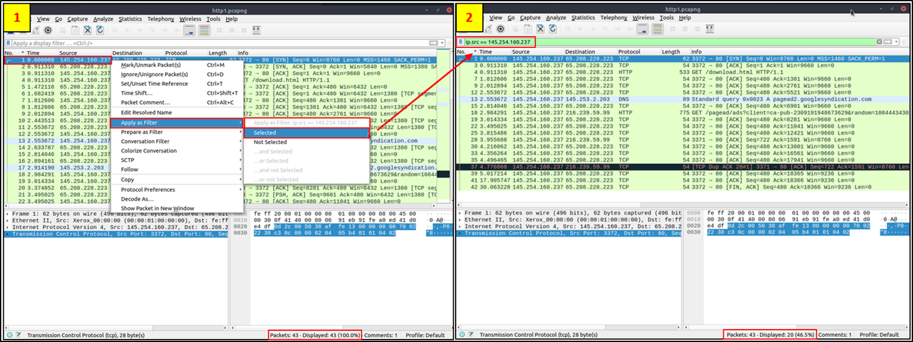
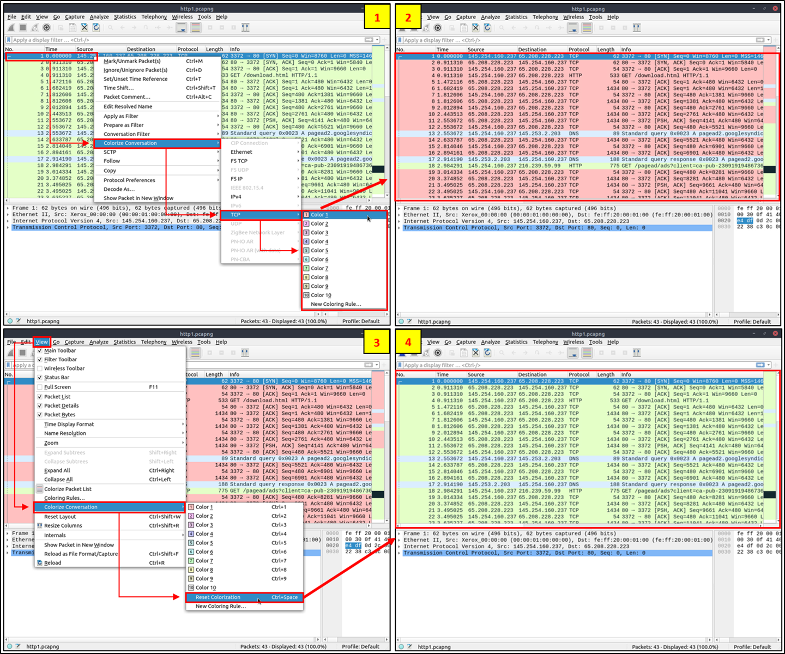

## Formas de capturar tráfico:
- Network Taps: Los Network Taps (puntos de acceso de red) son dispositivos de hardware que se utilizan para acceder y monitorear el tráfico de datos en una red de comunicaciones. El término "Tap" se refiere a "Test Access Point" (Punto de Acceso de Prueba). Estos dispositivos se colocan entre dos puntos de una red, como entre un switch y un router, para capturar una copia exacta del tráfico que pasa entre estos puntos sin interferir con la transmisión de datos.
- MAC Floods: Las inundaciones de MAC son una táctica comúnmente utilizada por equipos rojos como una forma de capturar paquetes activamente. La inundación de MAC tiene como objetivo sobrecargar el switch y llenar la tabla CAM. Una vez que la tabla CAM está llena, el switch ya no aceptará nuevas direcciones MAC y, por lo tanto, para mantener la red activa, el switch enviará paquetes a todos los puertos del switch. Nota: Esta técnica debe usarse con extrema precaución y con consentimiento explícito previo.
- ARP Poisoning: El envenenamiento ARP es otra técnica utilizada por equipos rojos para capturar paquetes activamente. Mediante el envenenamiento ARP, puedes redirigir el tráfico desde el(los) host(s) hacia la máquina desde la que estás monitoreando. Esta técnica no sobrecargará el equipo de red como lo hace la inundación MAC; sin embargo, aún debe usarse con precaución y solo si otras técnicas como los Network Taps no están disponibles.


## Filtrado de paquetes:
- Filtros de visualización: Podemos aplicar filtros de visualización de dos maneras:
  - A través de la pestaña analizar.
  - En la barra de filtro en la parte superior de la captura de paquetes.
- Operadores de Filtrado:
  - and - operator: and / &&
  - or - operator: or / ||
  - equals - operator: eq / ==
  - not equal - operator: ne / !=
  - greater than - operator: gt /  >
  - less than - operator: lt / <
  - contains
  - matches
  - bitwise_and
  - operators
- Documentación: Filtros Wiresharl: https://wiki.wireshark.org/DisplayFilters

## Packet Dissection
Esta sección cubre cómo Wireshark utiliza las capas OSI para desglosar los paquetes y cómo usar estas capas para el análisis. 


### Packet Details
Puedes hacer doble clic en un paquete en la captura para abrir sus detalles. Los paquetes consisten de 5 a 7 capas basadas en el modelo OSI. Podemos ver las 7 capas distintas en el paquete: marco/paquete (Frame), fuente (source) [MAC], fuente (Source) [IP], protocolo (Protocol), errores de protocolo (Protocol Errors), protocolo de aplicación (Application Protocol) y datos de aplicación (Application Data):


- Frame (Layer 1) --> Esto te mostrará qué marco/paquete estás observando, así como detalles específicos de la Capa Física del modelo OSI.

  

- Source [MAC] (Layer 2) --> Esto te mostrará las direcciones MAC de origen y destino; de la Capa de Enlace de Datos del modelo OSI.

  

- Source [IP] (Layer 3) --> Esto te mostrará las direcciones IPv4 de origen y destino; de la Capa de Red del modelo OSI.

  

- Protocol (Layer 4) --> Esto te mostrará detalles del protocolo utilizado (UDP/TCP) junto con los puertos de origen y destino; de la Capa de Transporte del modelo OSI.

  

- Protocol Errors --> Esta es una continuación de la 4ª capa que muestra segmentos específicos de TCP que necesitaban ser reensamblados.

  

- Application Protocol (Layer 5) --> Esto mostrará detalles específicos del protocolo que se está utilizando, como HTTP, FTP, SMB, etc. De la Capa de Aplicación del modelo OSI.

  

- Application Data --> Esta es una extensión de la capa 5 que puede mostrar los datos específicos de la aplicación.

  


## ARP Traffic
ARP o Protocolo de Resolución de Direcciones es un protocolo de Capa 2 que se utiliza para conectar direcciones IP con direcciones MAC. Contendrán mensajes de SOLICITUD y mensajes de RESPUESTA. Para identificar paquetes, el encabezado del mensaje contendrá uno de dos códigos de operación:
- Request
- Reply

Multiple ARP requests and replies:


Es útil notar que la mayoría de los dispositivos se identificarán a sí mismos o Wireshark los identificará, como por ejemplo Intel_78; un ejemplo de tráfico sospechoso serían muchas solicitudes de una fuente no reconocida. Sin embargo, necesitas habilitar una configuración dentro de Wireshark para resolver direcciones físicas. Para habilitar esta característica, navega a Ver > Resolución de Nombres > Asegúrate de que la opción Resolver Direcciones Físicas esté marcada.

Mirando la captura de pantalla a continuación, podemos ver que un dispositivo Cisco está enviando Solicitudes ARP, lo que significa que deberíamos poder confiar en este dispositivo, sin embargo, siempre debes mantener precaución al analizar paquetes.


## Visión General del Tráfico ARP

- Paquetes de Solicitud ARP: Podemos comenzar a analizar paquetes observando el primer paquete de Solicitud ARP y examinando los detalles del paquete:

  

- Observando los detalles del paquete mencionados anteriormente, los detalles más importantes del paquete están resaltados en rojo. El Opcode es una abreviatura de código de operación y te indicará si es una Solicitud ARP o una Respuesta. El segundo detalle resaltado es hacia dónde está dirigido el paquete, que en este caso, es una solicitud de difusión a todos. Paquetes de Respuesta ARP:

  

  Observando los detalles del paquete anterior, podemos ver por el Opcode que es un paquete de Respuesta ARP. También podemos obtener otra información útil como la dirección MAC y la dirección IP que se enviaron junto con la respuesta, ya que este es un paquete de respuesta, sabemos que esta fue la información enviada junto con el mensaje.

  ARP es uno de los protocolos más simples de analizar, todo lo que necesitas recordar es identificar si es un paquete de solicitud o de respuesta y quién lo está enviando.


## Opcode
En el contexto de los protocolos de red, como el Protocolo de Resolución de Direcciones (ARP), el opcode es un campo dentro del paquete ARP que indica si el paquete es una solicitud (ARP Request) o una respuesta (ARP Reply).

En ARP, específicamente, los opcodes tienen asignados valores numéricos para distinguir entre diferentes tipos de mensajes:
- Solicitud ARP (ARP Request): Generalmente tiene el valor de opcode 1. Este tipo de paquete se envía para solicitar la dirección MAC (Media Access Control) que corresponde a una dirección IP conocida en la red.
- Respuesta ARP (ARP Reply): Tiene el valor de opcode 2. Este paquete se envía en respuesta a una solicitud ARP, proporcionando la dirección MAC solicitada.

Para filtrar y ver solamente las respuestas ARP en Wireshark, puedes utilizar el siguiente filtro de visualización:
```
arp.opcode == 2
```

eth.addr == 80:fb:06:f0:45:d7


## ICMP o Protocolo de Mensajes de Control de Internet
Se utiliza para analizar varios nodos en una red. Esto se usa más comúnmente con utilidades como ping y traceroute. 

### Resumen del Tráfico ICMP
- Solicitud ICMP:
  - Vemos los detalles de un paquete de solicitud de ping. Hay algunas cosas importantes dentro de los detalles del paquete que podemos notar primero siendo el tipo y código del paquete. Un tipo que es igual a 8 significa que es un paquete de solicitud, si es igual a 0 es un paquete de respuesta. Cuando estos códigos son alterados o no parecen correctos, eso es típicamente una señal de actividad sospechosa.
  - Hay otros dos detalles dentro del paquete que son útiles para analizar: la marca de tiempo y los datos. La marca de tiempo puede ser útil para identificar el momento en que se solicitó el ping; también puede ser útil para identificar actividades sospechosas en algunos casos. También podemos mirar la cadena de datos, que típicamente será solo una cadena de datos aleatoria.
    


- Respuesta ICMP:
  - Vemos que el paquete de respuesta es muy similar al paquete de solicitud. Una de las principales diferencias que distingue a un paquete de respuesta es el código, en este caso, puedes ver que es 0, confirmando que es un paquete de respuesta.
  - Las mismas técnicas de análisis para los paquetes de solicitud se aplican aquí también, nuevamente la principal diferencia será el tipo de paquete.
  - 


##  Tráfico TCP
TCP o Protocolo de Control de Transmisión maneja la entrega de paquetes, incluyendo la secuenciación y los errores. Documentación TCP de la IETF: https://datatracker.ietf.org/doc/html/rfc793

A continuación, vemos un ejemplo de un escaneo con Nmap, escaneando los puertos 80 y 443. Podemos decir que el puerto está cerrado debido al paquete RST, ACK en rojo.


Al analizar paquetes TCP, Wireshark puede ser muy útil y codificar los paquetes en colores según el nivel de peligro.

TCP puede proporcionar una visión útil de una red al analizarla; sin embargo, también puede ser difícil de analizar debido al número de paquetes que envía. Aquí es donde podrías necesitar utilizar otras herramientas como RSA NetWitness y NetworkMiner para filtrar y analizar más a fondo las capturas.


### Resumen del Tráfico TCP
Algo común que verás al analizar paquetes TCP es lo que se conoce como el handshake (saludo) TCP. Incluye una serie de paquetes: syn, syn-ack, ack; que permiten a los dispositivos establecer una conexión.


Típicamente, cuando este saludo está fuera de orden o cuando incluye otros paquetes, como un **paquete RST**, algo sospechoso o incorrecto está sucediendo en la red. El escaneo con Nmap en la sección anterior es un ejemplo perfecto de esto. Un paquete RST, o paquete de reinicio, es un tipo de mensaje utilizado en el Protocolo de Control de Transmisión (TCP) para indicar que una conexión debe ser terminada inmediatamente. En el contexto de TCP, que es un protocolo orientado a conexión y diseñado para proporcionar una comunicación fiable entre dispositivos en una red, un paquete RST se utiliza en varias situaciones, como:

Cerrar una conexión de manera anormal: Si un dispositivo recibe paquetes inesperados para una conexión que no reconoce o para una sesión que ha sido cerrada, puede enviar un paquete RST para informar al emisor que no hay una conexión establecida y que debe cesar el envío de más paquetes.

Rechazar intentos de conexión: Si un servidor recibe una solicitud de conexión (un paquete SYN) a un puerto que no está escuchando o que está filtrado, puede responder con un paquete RST para indicar que la conexión no puede establecerse.

Interceptar comunicaciones: En algunas técnicas de seguridad de red y análisis, los paquetes RST se utilizan para interrumpir conexiones existentes o bloquear el establecimiento de nuevas conexiones, como parte de una acción de firewall o de un sistema de prevención de intrusiones.

### Análisis de Paquetes TCP
Para analizar paquetes TCP, no entraremos en los detalles de cada aspecto individual de los paquetes; sin embargo, observaremos algunos de los comportamientos y estructuras que tienen los paquetes. A continuación, vemos los detalles de un paquete SYN. Lo principal que queremos buscar al observar un paquete TCP es el número de secuencia y el número de acuse de recibo.


En este caso, vemos que el puerto no estaba abierto porque el número de acuse de recibo es 0.

Dentro de Wireshark, también podemos ver el número de secuencia original navegando a editar > preferencias > protocolos > TCP > números de secuencia relativos (desmarcar casillas).


Típicamente, los paquetes TCP necesitan ser observados en su conjunto para contar una historia, en lugar de examinar uno por uno en detalle.


## Resumen de DNS

DNS o protocolo de Servicio de Nombres de Dominio se utiliza para resolver nombres con direcciones IP. Documentación de DNS de la IETF: https://www.ietf.org/rfc/rfc1035.txt

Hay un par de cosas que se detallan a continuación que debes tener en mente al analizar paquetes DNS.
- Consulta-Respuesta
- Solo Servidores DNS
- UDP

Si alguno de estos está fuera de lugar, entonces los paquetes deben ser examinados más a fondo y deberían considerarse sospechosos. A continuación, podemos ver una captura de paquete con múltiples consultas y respuestas DNS.


Al observar instantáneamente los paquetes, podemos ver qué están consultando; esto puede ser útil cuando tienes muchos paquetes y necesitas identificar tráfico sospechoso o inusual rápidamente:


### Resumen del Tráfico DNS

- Consulta DNS: Al observar la consulta a continuación, realmente tenemos dos bits de información que podemos usar para analizar el paquete. El primer dato en el que podemos fijarnos es de dónde proviene la consulta; en este caso, es UDP 53, lo que significa que este paquete pasa esa verificación. Si fuera TCP 53, entonces debería considerarse tráfico sospechoso y necesitaría ser analizado más a fondo. También podemos observar qué está consultando; esto puede ser útil, junto con otra información, para construir la historia de lo que ocurrió.


Al analizar paquetes DNS, realmente necesitamos entender el entorno y si el tráfico sería considerado normal dentro de tu entorno.

Respuesta DNS: A continuación, vemos un paquete de respuesta, es similar al paquete de consulta, pero también incluye una respuesta, la cual puede ser utilizada para verificar la consulta:


### Tráfico HTTP
HTTP es uno de los protocolos más directos para el análisis de paquetes; el protocolo va directo al grano y no incluye ningún tipo de saludo inicial ni requisitos previos antes de la comunicación.

Standart HTTP/1.1: https://www.ietf.org/rfc/rfc2616.txt


Arriba podemos ver un ejemplo de paquete HTTP. Al observar un paquete HTTP, podemos recopilar fácilmente información, ya que el flujo de datos no está encriptado como su contraparte HTTPS. Algunos de los datos importantes que podemos recopilar del paquete incluyen el URI de solicitud, datos de archivo, servidor.


Profundizamos en la captura de paquetes: Podemos ver los detalles de una de las solicitudes HTTP:


A partir de este paquete podemos identificar información muy importante como el host, el agente de usuario, el URI solicitado y la respuesta.

Podemos utilizar algunas de las funciones integradas de Wireshark para ayudar a digerir todos estos datos y organizarlos para análisis futuros. Podemos comenzar viendo una característica muy útil en Wireshark para organizar los protocolos presentes en una captura, la Jerarquía de protocolos. Vaya a Estadísticas > Jerarquía de protocolos:


Esta información puede resultar muy útil en aplicaciones prácticas como la búsqueda de amenazas para identificar discrepancias en las capturas de paquetes.

La siguiente característica de Wireshark que veremos es Exportar objeto HTTP. Esta característica nos permitirá organizar todos los URI solicitados en la captura. Para utilizar Exportar objeto HTTP, navegue hasta archivo > Exportar objetos > HTTP.


La última característica que cubriremos en esta sección de esta sala son los Endpoints. Esta función permite al usuario organizar todos los Endpoints e IPs que se encuentran dentro de una captura específica. Al igual que las otras funciones, esto puede resultar útil para identificar de dónde se origina una discrepancia. Para utilizar la función Puntos finales, vaya a Estadísticas > Endpoints:


## Tráfico HTTPS
HTTPS o Protocolo Seguro de Transferencia de Hipertexto puede ser uno de los protocolos más molestos de entender desde la perspectiva del análisis de paquetes y puede ser confuso comprender los pasos necesarios para analizar paquetes HTTPS.

### Visión General del Tráfico HTTPS
Antes de enviar información encriptada, el cliente y el servidor necesitan acordar varios pasos para crear un túnel seguro:
- El cliente y el servidor acuerdan una versión del protocolo.
- El cliente y el servidor seleccionan un algoritmo criptográfico.
- El cliente y el servidor pueden autenticarse entre sí; este paso es opcional.
- Se crea un túnel seguro con una clave pública.

Podemos comenzar a analizar el tráfico HTTPS mirando los paquetes del saludo inicial (handshake) entre el cliente y el servidor. A continuación, se muestra un paquete de Saludo de Cliente que muestra la Capa de Registro SSLv2, el Tipo de Handshake y la Versión SSL.


A continuación se muestra el paquete de Saludo del Servidor que envía información similar al paquete de Saludo del Cliente; sin embargo, esta vez incluye detalles de la sesión e información del certificado SSL.


A continuación se muestra el paquete de intercambio de claves del cliente; esta parte del protocolo de enlace determinará la clave pública que se utilizará para cifrar más mensajes entre el cliente y el servidor.


En el siguiente paquete, el servidor confirmará la clave pública y creará el túnel seguro; todo el tráfico posterior a este punto se cifrará según las especificaciones acordadas enumeradas anteriormente.


El tráfico entre el Cliente y el Servidor ahora está cifrado y necesitará la clave secreta para descifrar el flujo de datos que se envía entre los dos hosts.


### Análisis Práctico de Paquetes HTTPS
Tryhackme Wireshar 101 --> Para practicar y obtener experiencia práctica con paquetes HTTPS, podemos analizar el PCAP snakeoil2_070531 y la clave de descifrado. Ve a la carpeta /root/Rooms/Wireshark101 en el AttackBox y extrae la carpeta task12.zip; también puedes descargar esto en esta tarea.


Al observar la captura de paquetes anterior, podemos ver que todas las solicitudes están cifradas. Al observar más de cerca los paquetes, podemos ver el protocolo de enlace HTTPS, así como las solicitudes cifradas. Echemos un vistazo más de cerca a una de las solicitudes cifradas: el paquete 36.


Podemos confirmar por los detalles del paquete que los Datos de Aplicación están encriptados. Puedes usar una clave RSA en Wireshark para ver los datos sin encriptar. Para cargar una clave RSA navega a Editar > Preferencias > Protocolos > TLS > [+]. Si estás utilizando una versión antigua de Wireshark, será SSL en lugar de TLS. Necesitarás completar las diversas secciones en el menú con las siguientes preferencias:
- Dirección IP: 127.0.0.1
- Puerto: start_tls
- Protocolo: http
- Archivo de clave: ubicación de la clave RSA


Ahora que tenemos una clave RSA importada a Wireshark, si volvemos a la captura de paquetes podemos ver que el flujo de datos ahora no está cifrado.


Ahora podemos ver las solicitudes HTTP en flujos de datos no cifrados. Si observamos más de cerca uno de los detalles del paquete, podemos ver más de cerca el flujo de datos no cifrados.


Al observar los detalles del paquete, podemos ver información muy importante, como el URI de solicitud y el agente de usuario, que pueden ser muy útiles en aplicaciones prácticas de Wireshark, como la búsqueda de amenazas y la administración de redes.

Ahora podemos usar otras funciones para organizar el flujo de datos, como usar la función de exportación de objetos HTTP. Para acceder a esta función, vaya a Archivo > Exportar objetos > HTTP.


# Packet Filtering
Wireshark tiene un potente motor de filtros que ayuda a los analistas a acotar el tráfico y centrarse en el evento de interés. Wireshark tiene dos tipos de enfoques de filtrado:
- Filtros de captura: Se utilizan para "capturar" solo los paquetes válidos para el filtro utilizado. 
- Filtros de visualización: Se utilizan para "ver" los paquetes válidos para el filtro utilizado.

Los filtros son consultas específicas diseñadas para protocolos disponibles en la referencia oficial de protocolos de Wireshark. Mientras que los filtros son la única opción para investigar el evento de interés, hay dos maneras diferentes de filtrar el tráfico y eliminar el ruido del archivo de captura. La primera utiliza consultas, y la segunda utiliza el menú de clic derecho. Wireshark proporciona una potente interfaz gráfica de usuario, y hay una regla de oro para los analistas que no quieren escribir consultas para tareas básicas: "Si puedes hacer clic en ello, puedes filtrarlo y copiarlo".

## Aplicar como Filtro
Esta es la manera más básica de filtrar tráfico. Mientras investigas un archivo de captura, puedes hacer clic en el campo que quieres filtrar y usar el "menú de clic derecho" o el menú "Analizar --> Aplicar como Filtro" para filtrar el valor específico. Una vez que aplicas el filtro, Wireshark generará la consulta de filtro requerida, la aplicará, mostrará los paquetes según tu elección y ocultará los paquetes no seleccionados del panel de lista de paquetes. Ten en cuenta que el número de paquetes totales y mostrados siempre se muestra en la barra de estado.



## Filtro de Conversación
Cuando usas la opción "Aplicar como Filtro", filtrarás solo una única entidad del paquete. Esta opción es una buena manera de investigar un valor particular en los paquetes. Sin embargo, supongamos que quieres investigar un número de paquete específico y todos los paquetes vinculados, enfocándote en direcciones IP y números de puerto. En ese caso, la opción "Filtro de Conversación" te ayuda a ver solo los paquetes relacionados y ocultar el resto de los paquetes fácilmente. Puedes usar el "menú de clic derecho" o el menú "Analizar --> Filtro de Conversación" para filtrar conversaciones.


## Colorear Conversación
Esta opción es similar al "Filtro de Conversación" con una diferencia. Resalta los paquetes vinculados sin aplicar un filtro de visualización y disminuir el número de paquetes vistos. Esta opción funciona con la opción de "Reglas de Coloración" y cambia los colores de los paquetes sin considerar la regla de color aplicada previamente. Puedes usar el "menú de clic derecho" o el menú "Ver --> Colorear Conversación" para colorear un paquete vinculado con un solo clic. Ten en cuenta que puedes usar el menú "Ver --> Colorear Conversación --> Restablecer Coloración" para deshacer esta operación.



## Preparar como Filtro
Similar a "Aplicar como Filtro", esta opción ayuda a los analistas a crear filtros de visualización usando el menú de "clic derecho". Sin embargo, a diferencia de la anterior, este modelo no aplica los filtros después de la elección. Añade la consulta requerida al panel y espera el comando de ejecución (enter) o otra opción de filtrado elegida usando ".. y/o .." del menú de "clic derecho".


## Aplicar como Columna
Por defecto, el panel de lista de paquetes proporciona información básica sobre cada paquete. Puedes usar el "menú de clic derecho" o "Analizar --> Aplicar como Columna" para añadir columnas al panel de lista de paquetes. Una vez que hagas clic en un valor y lo apliques como columna, será visible en el panel de lista de paquetes. Esta función ayuda a los analistas a examinar la aparición de un valor/campo específico en los paquetes disponibles en el archivo de captura. Puedes habilitar/deshabilitar las columnas mostradas en el panel de lista de paquetes haciendo clic en la parte superior del panel de lista de paquetes.


## Seguir Flujo
Wireshark muestra todo en tamaño de porción de paquete. Sin embargo, es posible reconstruir los flujos y ver el tráfico bruto tal como se presenta en el nivel de aplicación. Seguir los flujos de protocolo ayuda a los analistas a recrear los datos a nivel de aplicación y entender el evento de interés. También es posible ver los datos del protocolo no encriptados, como nombres de usuario, contraseñas y otros datos transferidos.

Puedes usar el "menú de clic derecho" o "Analizar --> Seguir Flujo de TCP/UDP/HTTP" para seguir los flujos de tráfico. Los flujos se muestran en un cuadro de diálogo separado; los paquetes que provienen del servidor se resaltan con azul, y aquellos que provienen del cliente se resaltan con rojo.


Una vez que sigues un flujo, Wireshark crea y aplica automáticamente el filtro requerido para ver el flujo específico. Recuerda, una vez que se aplica un filtro, el número de paquetes vistos cambiará. Necesitarás usar el "botón X" ubicado en el lado derecho superior de la barra de filtro de visualización para remover el filtro de visualización y ver todos los paquetes disponibles en el archivo de captura.


# Estadísticas
Este menú ofrece múltiples opciones de estadísticas listas para investigar, que ayudan a los usuarios a ver el panorama general en términos del alcance del tráfico, los protocolos disponibles, endpoints y conversaciones, y algunos detalles específicos de protocolos como DHCP, DNS y HTTP/2. Para un analista de seguridad, es crucial saber cómo utilizar la información estadística. Esta sección proporciona un resumen rápido del pcap procesado, que ayudará a los analistas a crear una hipótesis para una investigación. Puedes usar el menú "Estadísticas" para ver todas las opciones disponibles.

## Direcciones Resueltas
Esta opción ayuda a los analistas a identificar direcciones IP y nombres DNS disponibles en el archivo de captura, proporcionando la lista de las direcciones resueltas y sus hostnames. Ten en cuenta que la información del hostname se toma de las respuestas DNS en el archivo de captura. Los analistas pueden identificar rápidamente los recursos accedidos usando este menú. Así pueden detectar recursos accedidos y evaluarlos de acuerdo al evento de interés. Puedes usar el menú "Estadísticas --> Direcciones Resueltas" para ver todas las direcciones resueltas por Wireshark.


## Jerarquía de Protocolos
Esta opción desglosa todos los protocolos disponibles del archivo de captura y ayuda a los analistas a ver los protocolos en una vista de árbol basada en contadores de paquetes y porcentajes. De esta manera, los analistas pueden ver el uso general de los puertos y servicios y centrarse en el evento de interés. La regla de oro mencionada en la sala anterior es válida en esta sección; puedes hacer clic derecho y filtrar el evento de interés. Puedes usar el menú "Estadísticas --> Jerarquía de Protocolos" para ver esta información.


## Conversaciones
Conversación representa el tráfico entre dos endpoints específicos. Esta opción proporciona la lista de las conversaciones en cinco formatos base; ethernet, IPv4, IPv6, TCP y UDP. De esta manera, los analistas pueden identificar todas las conversaciones y contactar endpoints para el evento de interés. Puedes usar el menú "Estadísticas --> Conversaciones" para ver esta información.


## Endpoints
La opción de endpoints es similar a la opción de conversaciones. La única diferencia es que esta opción proporciona información única para un solo campo de información (Ethernet, IPv4, IPv6, TCP y UDP). De esta manera, los analistas pueden identificar los endpoints únicos en el archivo de captura y usarlo para el evento de interés. Puedes usar el menú "Estadísticas --> Endpoints" para ver esta información.

Wireshark también admite la resolución de direcciones MAC a un formato legible por humanos usando el nombre del fabricante asignado por IEEE. Ten en cuenta que esta conversión se realiza a través de los primeros tres bytes de la dirección MAC y solo funciona para los fabricantes conocidos. Cuando revisas los endpoints ethernet, puedes activar esta opción con el botón de "Resolución de nombres" en la esquina inferior izquierda de la ventana de endpoints.


La resolución de nombres no se limita solo a las direcciones MAC. Wireshark también proporciona opciones de resolución de nombres para IP y puertos. Sin embargo, estas opciones no están habilitadas por defecto. Si deseas utilizar estas funcionalidades, necesitas activarlas a través del menú "Editar --> Preferencias --> Resolución de Nombres". Una vez que habilites la resolución de nombres para IP y puertos, verás las direcciones IP y nombres de puertos resueltos en el panel de lista de paquetes y también podrás ver los nombres resueltos en los menús de "Conversaciones" y "Endpoints".


Vista del menú de endpoints con resolución de nombres:


Además de la resolución de nombres, Wireshark también ofrece un mapeo de geolocalización IP que ayuda a los analistas a identificar las direcciones de origen y destino en el mapa. Pero esta característica no está activada por defecto y necesita datos suplementarios como la base de datos GeoIP. Actualmente, Wireshark admite las bases de datos de MaxMind, y las últimas versiones de Wireshark vienen configuradas con el resolvedor de DB de MaxMind. Sin embargo, todavía necesitas los archivos DB de MaxMind y proporcionar la ruta de la base de datos a Wireshark usando el menú "Editar --> Preferencias --> Resolución de Nombres --> Directorios de base de datos de MaxMind". Una vez que descargues e indiques la ruta, Wireshark proporcionará automáticamente información GeoIP bajo los detalles del protocolo IP para las direcciones IP coincidentes.


Endpoints and GeoIP view.


-----------------------------------------------

https://www.wolf.university/learnwireshark/ebook/learnwireshark.pdf

https://www.wolf.university/networkanalysisusingwireshark2cookbook/ebook/networkanalysisusingwireshark2cookbook_ebook.pdf


Elegir profile

Edición -- Preferencias -- Apaciencia -- Columnas -- Botón + para añadir columna -- Nombre: Delta -- Tipo: Delta TIme Displayed.

Edición -- Preferencias -- Apaciencia -- Diseño -- Panel 1: Listado de Paquetes -- Panel 2: Detalles de paquete --- Panel 3: Diagrama de paquetes

Visualización -- Reglas de Coloreado --  Botón + para añadir regla -- xxxxxxx

Añadir botón de filtro -- Nombre: Anomalías TCP -- Valor: tcp.analysis.flags

Tráfico hacia la máquina destino -- Nombre ip-dst  -- Valor: ip.dst==192.168.18.202

Tráfico desde la máquina destino -- Nombre ip-src  -- Valor: ip.src==192.168.18.202

Sobre un paquete --- En Transmission Control Protrocol -- [TCP Segment Len] boton derecho --> Aplicar como columna --> Se muestra en el panel 1 una nueva columna que muestra la longitud del payload.


# Opciones de captura
Botón Opciones de captura -- Administrar Interfaces -- Pestaña Entrada - Quitar los interfaces que no necesitemos analizar para que el tráfico que se captura sea más limpio.

Si se necesita capturar el payload por completo, hay que modificar el dato --> Longitud de Instantánea (En ingles Snaplen (B)) dentro de la ventana Administrar Interfaces ya que por defecto no captura todo el payload

Botón Opciones de captura -- Administrar Interfaces -- Pestaña Salida - Mejor trocear en ficheros la captura que se realiza para no generar un unico fichero muy grande - Establecer la carpeta y el nombre del fichero con la extension. Activamos la casilla de crear un nuevo fichero automaticamente after 500 megabytes. Activamos Use a ring buffer with 10 files.

Elegimos el interfaz para hacer la captura. Y terminamos con el botón Start.


# Capturing packets with Dumpcap - Command Line Capture

## En Windows
Abrimos command prompt
```
cd program files
cd wireshark
path
## Verificamos que en el path esté wireshark
## Si no aparece hay que añadirlo: System Properties - Ennvironmet variables -- .......
dumpcap -h
dumpcap -D ## Muestra las interfaces que dispone el host y les pone un numero
dumpcap -i 1 -w ~/Escritorio/sample.pcapng
dumpcap -i 1 -w ~/Escritorio/sample.pcapng -b filesize: 500000  -b files:10      ## Para hacer un ring buffer
```


# ¿Donde hacemos la captura del tráfico de red?
Lo ponemos en el end point? o en otros sitios?
Eso depende del problema que tenemos, de lo que queremos analizar con wireshark.


# How to Filter Traffic
La diferencia entre un filtro de captura y un filtro de visualización es la siguiente:
- Filtro de Captura: Se utiliza para definir qué paquetes de datos serán capturados por una herramienta de análisis de red. El filtro se aplica durante la captura de paquetes, determinando cuáles paquetes son retenidos para su análisis posterior.
  - port 53
  - ip 192.168......
  - tcp <<-- Si usamos este filtro nos perdemos los paquetes icmp. Si acotamos mucho la captura nos podemos perder mensajes importantes.

- Filtro de Visualización: Se aplica a los paquetes de datos que ya han sido capturados. Este filtro ayuda a los usuarios a buscar y visualizar específicamente ciertos paquetes o tipos de datos dentro de un conjunto de datos capturados más grande, sin afectar la colección original de datos capturados.
  - ip.addr==192.168.18.202
  - Hacer un filtro de visualización de forma automática: Sobre un paquete, hacemos click en el botón derecho y en el menú elegimos los opción Conversation Filter .... Especificamos lo que queremos un filtrp basado en la dirección ethernet en este paquete, o si queremos un filtro basado en la dirección IPv4, o queremos que dea una conversación tcp.
  - Otra forma de hacer un filtro de visualización --> Sobre un paquete --> En Transmission Contrl Protocol hacemos click con el boton derecho --> Prepare as Filter --> and selected. Esto escribe de forma automatica el filtro.
  - Quitar mensajes de una captura: !arp -- not arp -- not (arp or ipv6). Esto quita de la vista estos mensajes.
  - Filtro para mostrar los paquetes tcp de varios puertos: tcp.por in {80 443 8080}
  - String Filters: Cuando buscamos una palabra en concreto -->
    - frame contains google -- Case sensitive
    - frame matches google -- Case insensitive


El lenguaje utilizado para capture filters es diferente al usado en display filters


## Name Resolution
Ir a Preferencias -- Name Resolution --- marcar la opción Resolve a MAC addresses --  marcar la opción Resolve transport names --  marcar la opción Resolve network IP addresses --  marcar la opción Use captured DNS ... --  marcar la opción Use an external network ....

Sobre una ip que queramos  --- Boton Derecho --- Edit Resolved Name --- Escribimos el nombre que queremos y ya no muestra la IP, mostrará el nombre que le dimos.

Para que estos cambios se queden guardados en el pcapng --> Menu View -- Reload as File Format/Capture --- Save

Para quitar esos nombres que le dimos a las ips --> Hacemos click en uno de los paquetes que tengan ese nombre, hacemos click boton derecho sobre el nombre -- Edit resolve name --- Eliminamos el nombre --- y ya aparece la ip otro vez


## Using the time column
El tiempo se mide desde el primer paquete que entró en el device que wireshark captura el tréfico. Para cambiar esto y que se muestre la hora del sistema --> View Menu --> Time Display Format --> TIme of Day (muestra la hora del sistema donde esté instalado wireshark) -- También podemos elegir UTC Time of DAY

Marcar un paquete como referencia de tiempo: sobre el paquete hacemos click botón derecho en la columna time -- Set/Unset time reference


Seleccionar varios paquetes de una request, boton derecho --  Set/Unset time reference -- Veremos como se marca a Cero los paquetes que correspondan con el response del request anterior.


Quitar todas las marcas de tiempo: Menu editar - Unset all time references.


Time since firs frame in this tcp stream -- hacer columna. Esto habla del tiempo con respecto a su anterior paquete dentro de esa conversación. Se puede hacer columna. Es util.


## Reading pcap with Wireshark Statistics
Menu Statistics --> Conversations --> Muestra por capas de direcciones cuantas conversaciones tenemos en ese filero de tráfico.   
Usamos Statistics para ver las conversaciones y hacernos una idea de lo que ocurre.
Aplicamos filtros a esas conversaciones para mostrar una parte de todo el tráfico que tiene el pcapng.

## Extracting files from pcaps


# Filtros
- Capturar peticiones de ping --> Capturar y analizar específicamente los paquetes ICMP que son de tipo 8. En el contexto de ICMP, el tipo 8 corresponde a los mensajes de "echo request", comúnmente conocidos como peticiones de ping.
  ```
  icmp.type == 8
  ```
- Respuestas a solicitudes de ping --> Capturar y analizar específicamente los paquetes ICMP que son de tipo 0. En el contexto de ICMP, el tipo 0 corresponde a los mensajes de "echo reply", que son comúnmente conocidos como respuestas a solicitudes de ping.
  ```
  icmp.type == 0
  ```
- Analizar el tráfico HTTP: Mostar solo las solicitudes HTTP.
  ```
  http.request.uri
  ```

# Case study
## 1. ICMP Flood or something else
Hands On Network Forensic - Pag 104
Packet number 179 has a system path in it. This is going south! The found traces denote that someone is accessing this system using an ICMP shell. The ICMP shell is a backdoor that makes use of data fields to send replies to a command sent by the attacker. Since all the requests originated from 192.168.153.129, we have our attacker. We can also see another strange thing: The ICMP packets are missing data fields, apart from the packets' ICMP backdoor packets. This gives us an edge to only focus on the packets having data, for this, we can type data as the filter:

.\tshark.exe -Y data -r C:\Users\Apex\Desktop\Wire\icmp_camp.pcapng -T fields -e data
-Y data -> -Y se utiliza para aplicar un "display filter" (filtro de visualización) en Tshark. En este caso, el filtro es data, lo que significa que el comando buscará paquetes que contengan datos (payload) en su interior.
-r C:\Users\Apex\Desktop\Wire\icmp_camp.pcapng --> ruta de archivo se utiliza para leer un archivo de captura de paquetes existente.
-T fields --> -T fields especifica que la salida debe ser en formato de "campos". Esto significa que Tshark generará una salida basada en campos específicos de los paquetes, en lugar del formato de salida predeterminado.
-e data --> -e se utiliza para especificar un campo específico que se desea incluir en la salida. Aquí, data es el campo que se extraerá de cada paquete filtrado. En el contexto de los paquetes de red, data generalmente se refiere al payload o carga útil del paquete, que es la parte del paquete que contiene los datos reales transmitidos.


# SiLK
(System for Internet-Level Knowledge) es un conjunto de herramientas de análisis de tráfico de red diseñado para facilitar la recopilación, el almacenamiento y el análisis de grandes conjuntos de datos de flujo de red. Desarrollado por el CERT (Computer Emergency Response Team) de la Universidad Carnegie Mellon, SiLK está orientado principalmente a la seguridad de redes y análisis forense. 
https://tools.netsa.cert.org/silk/download.html


# DynamiteLab
https://lab.dynamite.ai/


## Filtros
```
http contains "<script>" || http contains "javascript:" || http contains "onerror=" || http contains "alert("

http || tcp.port == 80 || tcp.port == 443

(http.request or tls.handshake.type eq 1) and !(ssdp)

http.response.code == 500

http.request.uri contains "SELECT" || http.request.uri contains "UNION" || http.request.uri contains "DROP" || http.request.uri contains "OR '1'='1'"

http.request.method == "POST"

ip.src == <SRC IP Address> and ip.dst == <DST IP Address>

tcp.port eq <Port #> or <Protocol Name>

udp.port eq <Port #> or <Protocol Name>
```
