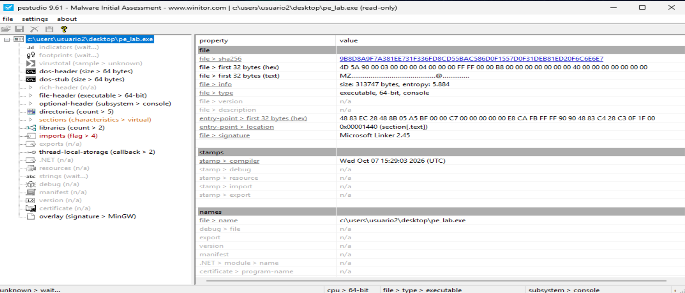

# 1. FASE A — analizar pe_lab.exe como PE

```
    ↓
1. DOS Header
2. NT Headers
3. File Header
4. Optional Header
5. Secciones
6. Imports
7. Relocations
8. RVA ↔ offset
```

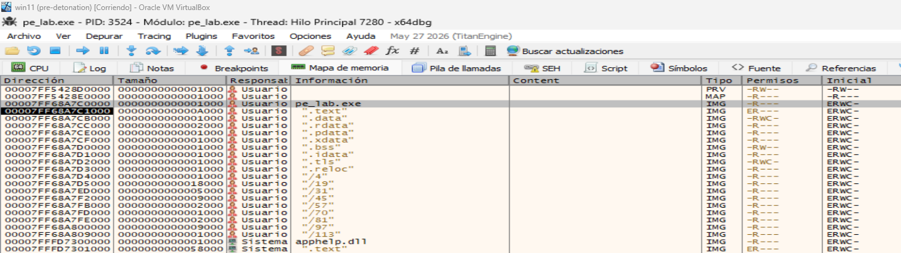

MapppedBase del ejecutable: `00007FF68A7C0000`.


## 1.1. IMAGE_DOS_HEADER

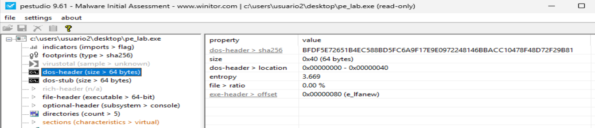


```
pe_lab.exe

Offset 0x0000
+-----------------------+
| IMAGE_DOS_HEADER      |
|                       |
| e_magic = MZ          |
|                       |
| e_lfanew = 0x80 ------+------------------+
+-----------------------+                  |
| DOS Stub              |                  |
| ...                   |                  |
+-----------------------+                  |
                                           |
Offset 0x0080 <-----------------------------+
+-----------------------+
| PE 00 00              |
+-----------------------+
```


## 1.2. DOS_STUB

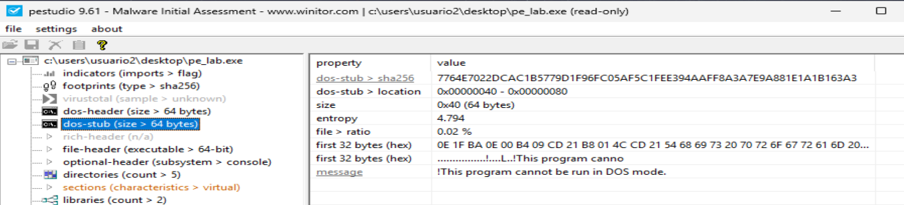


También se observa el mensaje del DOS Stub:
```
This program cannot be run in DOS mode.
```
Ese texto está situado entre la `cabecera DOS` y la `cabecera PE`.


## 1.3. IMAGE_NT_HEADERS

```
Offset 0x00
    ↓
   MZ
    |
    | e_lfanew = 0x80
    ↓
Offset 0x80
    ↓
 PE\0\0
```


Conclusión: la captura confirma correctamente la estructura inicial de `pe_lab.exe` como un fichero `PE` válido de Windows.


## 1.4. IMAGE_FILE_HEADER

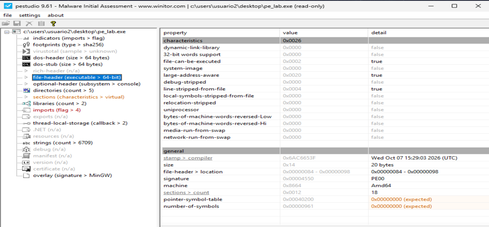

Ya vimos:
```
Offset 0x80 → 50 45 00 00 → "PE\0\0"
```

La firma ocupa 4 bytes, así que el IMAGE_FILE_HEADER comienza en:
```
0x80 + 4 = 0x84
```

Su estructura en Windows es:
```
typedef struct _IMAGE_FILE_HEADER {
    WORD  Machine;
    WORD  NumberOfSections;
    DWORD TimeDateStamp;
    DWORD PointerToSymbolTable;
    DWORD NumberOfSymbols;
    WORD  SizeOfOptionalHeader;
    WORD  Characteristics;
} IMAGE_FILE_HEADER;
```

Ocupa exactamente 20 bytes (0x14).

En pe_lab.exe, los bytes correspondientes son:
```
Offset 0x84

64 86 | 12 00 | 3F 65 C6 6A | 00 02 04 00 |
61 09 00 00 | F0 00 | 26 00
```

Separándolos por campos:
| Campo | Bytes | Valor |
|---|---|---:|
| `Machine` | `64 86` | `0x8664` |
| `NumberOfSections` | `12 00` | `0x0012` = **18** |
| `TimeDateStamp` | `3F 65 C6 6A` | `0x6AC6653F` |
| `PointerToSymbolTable` | `00 02 04 00` | `0x00040200` |
| `NumberOfSymbols` | `61 09 00 00` | `0x00000961` |
| `SizeOfOptionalHeader` | `F0 00` | `0x00F0` = **240 bytes** |
| `Characteristics` | `26 00` | `0x0026` |


Mapa:
```
pe_lab.exe
│
├── Offset 0x0000
│      │
│      └── IMAGE_DOS_HEADER
│             │
│             ├── e_magic  = MZ
│             │
│             └── e_lfanew = 0x80
│
├── DOS Stub
│      "This program cannot be run in DOS mode."
│
└── Offset 0x0080
       │
       ├── 50 45 00 00
       │      "PE\0\0"
       │
       └── Offset 0x0084
              │
              └── IMAGE_FILE_HEADER
                    │
                    ├── Machine
                    │      0x8664 → AMD64
                    │
                    ├── NumberOfSections
                    │      0x12 → 18
                    │
                    ├── TimeDateStamp
                    │      0x6AC6653F
                    │
                    ├── PointerToSymbolTable
                    │      0x40200
                    │
                    ├── NumberOfSymbols
                    │      2401
                    │
                    ├── SizeOfOptionalHeader
                    │      0xF0 → 240 bytes
                    │
                    └── Characteristics
                           0x0026
```

## 1.5. IMAGE_OPTIONAL_HEADER64

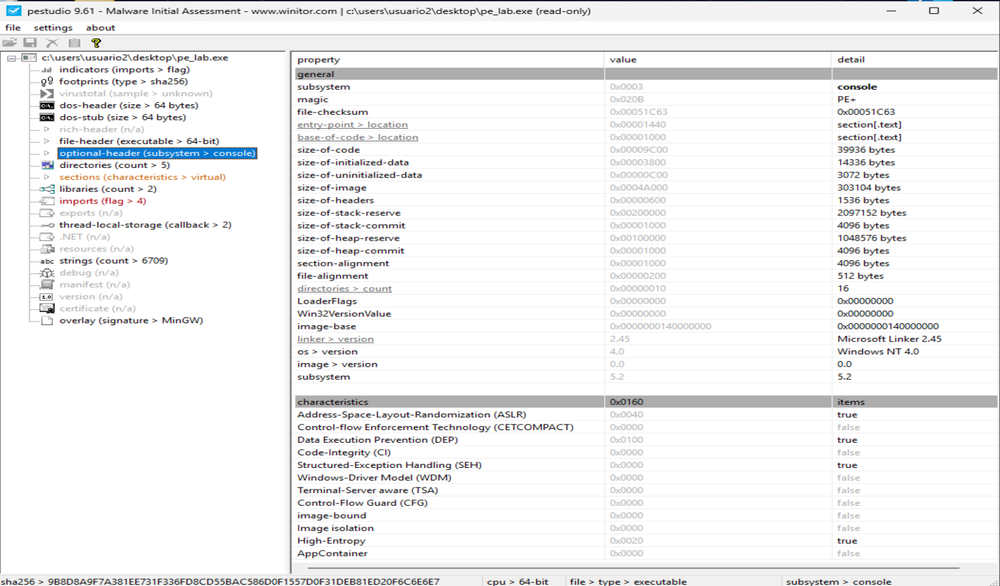

IMAGE_OPTIONAL_HEADER64 comienza en el `offset 0x98`:
```
00007FF68A7C0090  61 09 00 00 F0 00 26 00 0B 02 02 2D 00 9C 00 00  a...ð.&....-....  
                                          │
                                          └── offset 0x98
```

| Campo | Valor |
|---|---:|
| `Magic` | `0x20B` |
| `MajorLinkerVersion` | `2` |
| `MinorLinkerVersion` | `45` |
| `SizeOfCode` | `0x9C00` |
| `SizeOfInitializedData` | `0x3800` |
| `SizeOfUninitializedData` | `0x0C00` |
| `AddressOfEntryPoint` | `0x1440` |
| `BaseOfCode` | `0x1000` |
| `ImageBase` | `0x140000000` |
| `SectionAlignment` | `0x1000` |
| `FileAlignment` | `0x200` |
| `SizeOfImage` | `0x4A000` |
| `SizeOfHeaders` | `0x600` |
| `Subsystem` | `3` |
| `DllCharacteristics` | `0x160` |
| `NumberOfRvaAndSizes` | `16` |


Si el PE se carga en su dirección preferida:
```
ImageBase = 0x140000000
```

entonces conceptualmente:
```
VA EntryPoint =
ImageBase + AddressOfEntryPoint
```

Por tanto:
```
0x140000000
+     0x1440
----------------
0x140001440
```

Así que la dirección virtual preferida del EntryPoint sería:
```
0x140001440
```

-----

**BaseOfCode = 0x1000**

Tenemos: `BaseOfCode = 0x1000`

Esto indica el RVA donde empieza la zona de código.

```
.text VirtualAddress ≈ 0x1000
```

El EntryPoint:
```
0x1440
```
está dentro de esa zona:
```
.text
RVA 0x1000
   |
   +---- EntryPoint 0x1440

```

------

**ImageBase = 0x140000000**
```
ImageBase = 0x140000000
```
Es la dirección virtual donde el PE preferiría ser cargado.


------

De todo el IMAGE_OPTIONAL_HEADER64, los mas destacado es:
```
AddressOfEntryPoint = 0x1440
ImageBase           = 0x140000000
SectionAlignment    = 0x1000
FileAlignment       = 0x200
SizeOfImage         = 0x4A000
SizeOfHeaders       = 0x600
```

----

## 1.6. DataDirectory

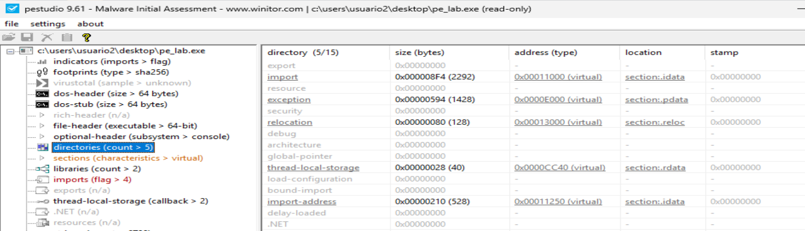

DataDirectory[16] es una de las partes más interesantes del IMAGE_OPTIONAL_HEADER64, porque funciona como un índice de estructuras importantes del PE.


| Índice | Directorio | RVA / Offset | Size |
|---:|---|---:|---:|
| 0 | Export | `0x00000000` | `0x00000000` |
| 1 | Import | `0x00011000` | `0x000008F4` |
| 2 | Resource | `0x00000000` | `0x00000000` |
| 3 | Exception | `0x0000E000` | `0x00000594` |
| 4 | Security | `0x00000000` | `0x00000000` |
| 5 | Base Relocation | `0x00013000` | `0x00000080` |
| 6 | Debug | `0x00000000` | `0x00000000` |
| 7 | Architecture | `0x00000000` | `0x00000000` |
| 8 | GlobalPtr | `0x00000000` | `0x00000000` |
| 9 | TLS | `0x0000CC40` | `0x00000028` |
| 10 | Load Config | `0x00000000` | `0x00000000` |
| 11 | Bound Import | `0x00000000` | `0x00000000` |
| 12 | IAT | `0x00011250` | `0x00000210` |
| 13 | Delay Import | `0x00000000` | `0x00000000` |
| 14 | COM Descriptor | `0x00000000` | `0x00000000` |
| 15 | Reserved | `0x00000000` | `0x00000000` |


Mapa mental:
```
IMAGE_OPTIONAL_HEADER64
        |
        v
DataDirectory[16]
        |
        +--> [0] Exports
        |
        +--> [1] Imports --------> RVA 0x11000
        |
        +--> [3] Exceptions -----> RVA 0xE000
        |
        +--> [5] Relocations ----> RVA 0x13000
        |
        +--> [9] TLS ------------> RVA 0xCC40
        |
        +--> [12] IAT -----------> RVA 0x11250
```

-----

## 1.8. Secciones

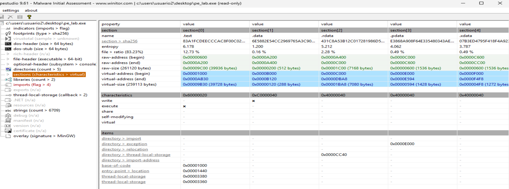


La tabla de secciones comienza en el `offset 0x188`:


| Sección | RVA | VirtualSize | Raw offset | Raw size | Permisos aprox. |
|---|---:|---:|---:|---:|---|
| `.text` | `0x1000` | `0x9B30` | `0x600` | `0x9C00` | R-X |
| `.data` | `0xB000` | `0x120` | `0xA200` | `0x200` | RW- |
| `.rdata` | `0xC000` | `0x1BA8` | `0xA400` | `0x1C00` | R-- |
| `.pdata` | `0xE000` | `0x594` | `0xC000` | `0x600` | R-- |
| `.xdata` | `0xF000` | `0x4F8` | `0xC600` | `0x600` | R-- |
| `.bss` | `0x10000` | `0xB90` | `0x0` | `0x0` | RW- |
| `.idata` | `0x11000` | `0x8F4` | `0xCC00` | `0xA00` | R-- |
| `.tls` | `0x12000` | `0x10` | `0xD600` | `0x200` | RW- |
| `.reloc` | `0x13000` | `0x80` | `0xD800` | `0x200` | R-- |
| `/4` | `0x14000` | `0x820` | `0xDA00` | `0xA00` | R-- |
| `/19` | `0x15000` | `0x17F46` | `0xE400` | `0x18000` | R-- |
| `/31` | `0x2D000` | `0x4010` | `0x26400` | `0x4200` | R-- |
| `/45` | `0x32000` | `0x876B` | `0x2A600` | `0x8800` | R-- |
| `/57` | `0x3B000` | `0x1AA8` | `0x32E00` | `0x1C00` | R-- |
| `/70` | `0x3D000` | `0x6CD` | `0x34A00` | `0x800` | R-- |
| `/81` | `0x3E000` | `0x1EC7` | `0x35200` | `0x2000` | R-- |
| `/97` | `0x40000` | `0x874A` | `0x37200` | `0x8800` | R-- |
| `/113` | `0x49000` | `0x62A` | `0x3FA00` | `0x800` | R-- |

-----

La relación disco ↔ memoria:
```
                 DISCO                    MEMORIA

.text            offset 0x600             RVA 0x1000
.data            offset 0xA200            RVA 0xB000
.rdata           offset 0xA400            RVA 0xC000
.pdata           offset 0xC000            RVA 0xE000
.idata           offset 0xCC00            RVA 0x11000
.reloc           offset 0xD800            RVA 0x13000
```

----


# 2. FASE B — analizar pe_lab.c
    ↓
1. main()
2. load_file()
3. parse_pe()
4. rva_to_file_offset()
5. imports
6. entropía
7. map_lab()


**Analizamos el ejecutable `pe_lab.exe:`**  
El ejecutable `pe_lab.exe` es un laboratorio educativo para analizar archivos `PE` de Windows y entender cómo están organizados tanto en disco como en memoria.

**Tiene dos modos principales:**
- `static`: analiza el archivo sin ejecutarlo. Lee sus cabeceras `PE`, detecta la arquitectura, muestra `ImageBase`, `EntryPoint`, `SizeOfImage`, secciones, permisos, entropía e `imports`.
- `map`: reserva memoria dentro del propio proceso de `pe_lab.exe` y reconstruye allí la imagen `PE` copiando `headers` y secciones según sus `RVA`. No ejecuta el `PE`, no resuelve `imports`, no aplica `relocations` y no inyecta nada en otros procesos.

La idea central es que podamos observar cómo funciona un `PE` internamente
- Dónde están sus cabeceras,
- cómo se relacionan los offsets de fichero con los RVA,
- qué permisos tiene cada sección,
- qué DLL y funciones importa,
- y cómo quedaría distribuido en memoria.

En resumen: no es un inyector completo, sino una herramienta de estudio para entender los fundamentos que luego aparecen en técnicas de `PE loading`, `manual mapping` e `injection`.


------

El orden recomendado para continuar estudiando este ejecutable:
1. main()
2. load_file()
3. parse_pe()
4. rva_to_file_offset()
5. static_analysis()
6. print_imports()
7. map_lab()
8. comparar lo que imprime pe_lab.exe static pe_lab.exe con lo que hemos visto manualmente.


## 2.1. main()

Dentro del ejecutable `pe_lab.exe` se define una estructura creada para guardar, de forma ordenada, toda la información que el programa va extrayendo del ejecutable `PE`. 


La idea visual sería:
```
PE_IMAGE pe

+-----------------------------------+
| data -------------> fichero entero|
| size -------------> tamaño        |
|                                   |
| dos -------------> DOS Header     |
| signature -------> "PE\0\0"       |
| file_header -----> File Header    |
| opt32/opt64 -----> Optional Header|
| sections --------> Secciones      |
+-----------------------------------+
```

Lo importante es que `PE_IMAGE` no contiene copias completas de todas las cabeceras. En gran parte contiene punteros hacia posiciones concretas dentro de data, que es donde está cargado el fichero completo.

El método `main()` recibe el modo de funcionamiento y el fichero `PE` objetivo. Luego prepara una variable `PE_IMAGE pe` que utilizará para almacenar toda la información del `PE` que vaya a analizar y llama a `load_file()` para empezar el análisis. El método main espera exactamente 3 argumentos contando el nombre del programa:
```
pe_lab.exe static notepad.exe
```

Conceptualmente:
```
main()
  |
  v
¿argc == 3?
  |
  +-- NO --> usage() --> termina
  |
  +-- SÍ
       |
       v
   load_file(argv[2], &pe)
```


------

## 2.2. load_file(): representación en disco

Vamos a analizar `load_file()` para ver cómo `pe_lab.exe` abre otro `PE`, calcula su tamaño, reserva memoria y copia el fichero completo a `pe->data`.

```
load_file(argv[2], &pe)
```
aquí es donde `pe_lab.exe` abre el ejecutable que queremos estudiar y lo carga completamente en memoria.


**Flujo de la función load_file():**
```
load_file()
   |
   v
fopen()       -> abre el fichero
   |
   v
fseek()       -> se mueve al final ->  Porque el programa necesita averiguar cuánto ocupa el archivo antes de reservar memoria
   |
   v
ftell()       -> obtiene el tamaño
   |
   v
malloc()      -> reserva memoria  ->  malloc() reserva memoria en el heap del proceso
   |
   v
fread()       -> copia TODO el fichero a memoria
   |
   v
pe->data      -> contiene los bytes del PE
pe->size      -> contiene su tamaño
```


`load_file()` abre el ejecutable con:
```
fopen(filename, "rb");
```

obtiene su tamaño, reserva:
```
pe->data = (BYTE *)malloc(pe->size);
```

y copia el fichero completo:
```
fread(pe->data, 1, pe->size, fp);
```

En este momento todavía no hay una imagen PE cargada como la cargaría Windows. Tenemos únicamente:
```
Representación del fichero

offset 0
|
v
+-----------------+
| DOS header      |
+-----------------+
| DOS stub        |
+-----------------+
| NT headers      |
+-----------------+
| section table   |
+-----------------+
| raw .text       |
+-----------------+
| raw .rdata      |
+-----------------+
| raw .data       |
+-----------------+
```

Esto introduce una distinción fundamental:
```
OFFSET DE FICHERO ≠ RVA
```

Y precisamente por eso después necesitamos:
```
rva_to_file_offset()
```


Cuando termina correctamente, tenemos algo así:
```
PE_IMAGE pe

pe.data
   |
   v
+------------------------------------+
| MZ | ... | PE\0\0 | ... | .text   |
|    fichero PE completo en memoria  |
+------------------------------------+

pe.size = tamaño total del fichero
```


Conceptualmente:
```
DISCO

pe_lab.exe
+----------------------------+
| MZ                         |
| DOS Header                 |
| PE\0\0                     |
| Optional Header            |
| .text                      |
| .data                      |
| .idata                     |
| ...                        |
+----------------------------+

             fread()
                |
                v

MEMORIA DEL PROCESO

pe->data
+----------------------------+
| MZ                         |
| DOS Header                 |
| PE\0\0                     |
| Optional Header            |
| .text                      |
| .data                      |
| .idata                     |
| ...                        |
+----------------------------+
```
Es una copia byte por byte del fichero.


Todavía no se ha interpretado nada del formato `PE`. Solo se han cargado los bytes. No es una imagen `PE` mapeada por el `loader`. Ese detalle es clave:
```
load_file() no analiza el PE; únicamente lo mete entero en memoria.
```

El análisis real empieza en el paso 2, cuando `main()` llama a:
```
parse_pe(&pe);
```

Ahí ya se buscan `MZ`, `e_lfanew`, `PE\0\0`, `IMAGE_FILE_HEADER`, `Optional Header` y tabla de secciones.


**Estado de PE_IMAGE al terminar:**
```
PE_IMAGE pe

+--------------------------------+
| data ───────────────┐          |
| size = tamaño       |          |
| dos = NULL          |          |
| signature = NULL    |          |
| file_header = NULL  |          |
| opt32 = NULL        |          |
| opt64 = NULL        |          |
| sections = NULL     |          |
+---------------------|----------+
                      |
                      v
              +-------------------+
              | MZ                |
              | DOS Header        |
              | DOS Stub          |
              | PE\0\0            |
              | File Header       |
              | Optional Header   |
              | Section Headers   |
              | .text             |
              | .data             |
              | ...               |
              +-------------------+
```
Es decir:
- `load_file()` carga los bytes.
- `parse_pe()` les dará significado.

### 2.2.1 Análisis del load_file() en x64dbg

#### A) Breakpoint en fopen o justo después de volver de fopen
En este punto comprobamos que `argv[2]` contiene la ruta del `PE` objetivo y que `fp` pasa de no existir a contener un handle/estructura válida de fichero. En el código corresponde a `fp = fopen(filename, "rb");`.

Establecemos la linea de comandos del ejecutable:
```
"C:\Users\usuario2\Desktop\pe_lab.exe" static "C:\Users\usuario2\Desktop\pe_lab.exe"
```

Establecemos un breakpoint en fopen:  
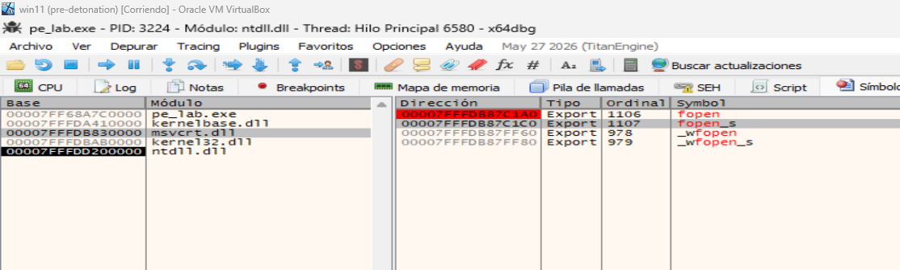  

Avanzamos hasta llegar a fopen:  
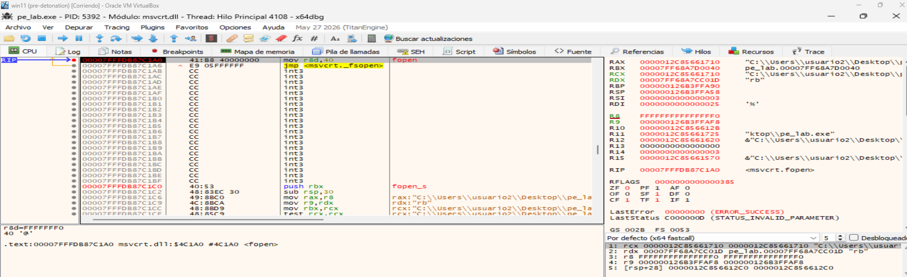  
donde:
- RCX apunta a: `C:\Users\usuario2\Desktop\pe_lab.exe`.
- RDX apunta a: `rb`.
- Es justo la llamada: `fopen(filename, "rb");`


Pulsamos `Ctrl+F9` para salir de `fopen` y volver al código de `pe_lab.exe`:  
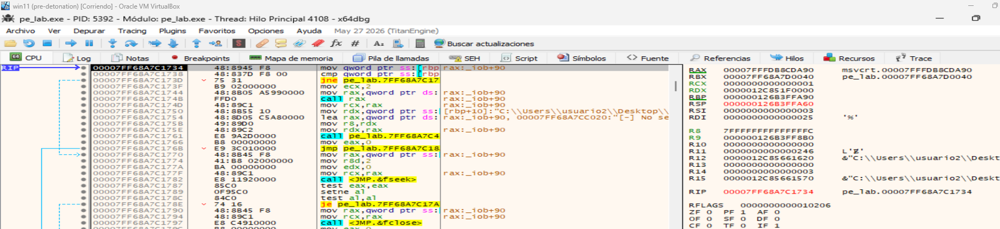   
donde:
- Si `RAX != 0`, entonces ese valor será el `FILE *` devuelto por `fopen`, que después se guarda en: `fp`.


Conceptualmente:
```
load_file()
   |
   +--> fopen(filename, "rb")
          |
          +--> RCX = ruta del PE
          +--> RDX = "rb"
          |
          v
        RAX = FILE *
```

Ese `FILE *` contiene internamente información asociada al archivo abierto: estado del stream, posición actual, buffer, descriptor/handle subyacente, etc. Y se reutiliza en llamadas como:
```
fseek(fp, 0, SEEK_END);
ftell(fp);
fread(..., fp);
fclose(fp);
```

#### B) Breakpoint justo después de malloc(pe->size)
Aquí lo interesante es observar que `pe->size` ya contiene el tamaño del fichero y que `pe->data` recibe una dirección de memoria reservada en el `heap`. Antes de `fread`, esa zona aún no contiene el `PE` completo. Corresponde a la reserva realizada en `pe->data = (BYTE *)malloc(pe->size);`.

La ruta práctica para encontrar malloc es:
```
BP fopen
   ↓
volver a pe_lab.exe
   ↓
CALL fseek
   ↓
CALL ftell
   ↓
RAX = file_size
   ↓
seguir unas instrucciones
   ↓
CALL malloc
```

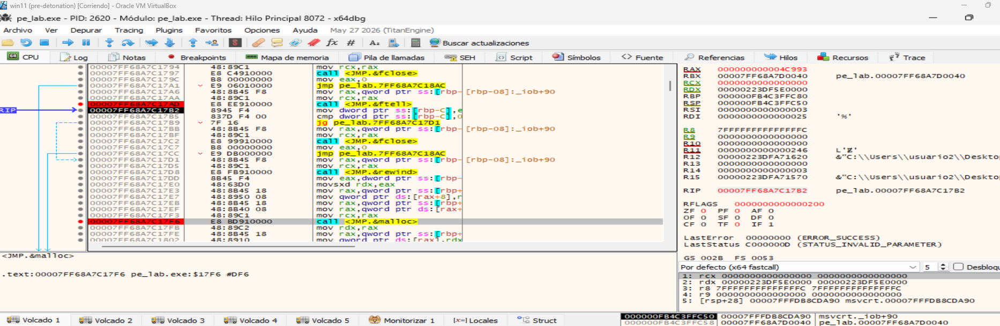  
donde:
- RAX = tamaño del fichero


Ejecutamos malloc:  
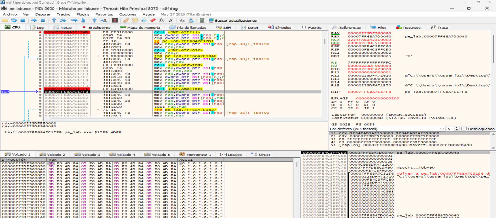  
donde:
- RAX = 00000223DF960080. Ese valor es la dirección del bloque de memoria reservado por malloc.
- Por tanto: `pe->data ≈ 0x00000223DF960080`.
- En la zona inferior del DUMP se ve precisamente esa memoria, y contiene valores como: `0D F0 AD BA 0D F0 AD BA ...`.
- Eso es memoria recién reservada que todavía no contiene el `PE`. Aún no se ha ejecutado `fread()`.


`malloc(pe->size)` reserva una zona de memoria del tamaño del fichero y devuelve su dirección en `RAX`. Esa dirección se almacena en `pe->data`.


#### C) Breakpoint justo después de fread().
Si seguimos el valor de `pe->data` en el DUMP, veremos al comienzo: `4D 5A`. Es decir: `MZ`.

Y más adelante, en el offset indicado por `e_lfanew`, la firma `PE\0\0`. En ese momento podemos comprobar visualmente que `load_file()` ha copiado el ejecutable entero tal como está en disco dentro de la memoria de `pe_lab.exe`.


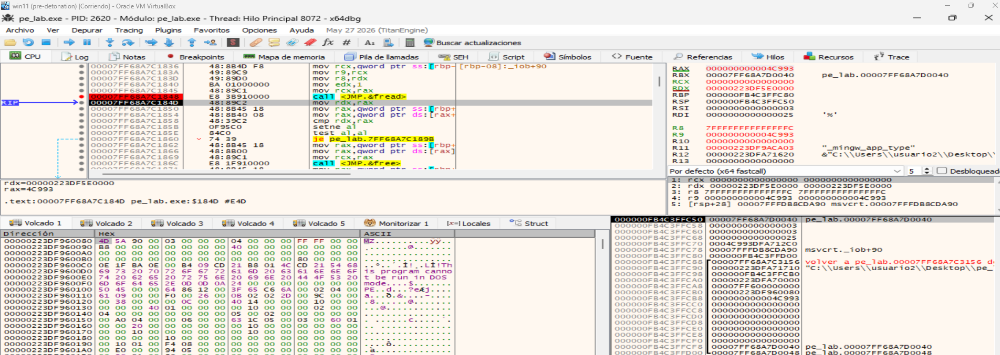  
donde:
- Vemos que `fread()` ha copiado el fichero `PE` completo dentro del buffer apuntado por `pe->data`.


Flujo:
```
malloc(pe->size)
      ↓
RAX = dirección reservada
      ↓
pe->data = esa dirección
      ↓
fread(pe->data, 1, pe->size, fp)
      ↓
el PE completo queda copiado en memoria
```
Y esto es importante: en este punto **el `PE` todavía no está mapeado como imagen ejecutable. Lo que tenemos en `pe->data` es una copia `RAW` del archivo tal como está en disco.**


----

## 2.3. parse_pe()

Dentro de `parse_pe()` es donde esos bytes empiezan a interpretarse como `IMAGE_DOS_HEADER`, firma `PE\0\0`, `IMAGE_FILE_HEADER`, `Optional Header` y tabla de secciones.

La idea general de parse_pe() es esta:
```
pe->data
   ↓
interpretar DOS Header
   ↓
comprobar MZ
   ↓
leer e_lfanew
   ↓
ir a PE\0\0
   ↓
leer IMAGE_FILE_HEADER
   ↓
leer Optional Header
   ↓
localizar tabla de secciones
```

La imagen completa de parse_pe() queda así:
```
pe->data
   |
   +--> 0x00  pe->dos
   |          MZ
   |
   +--> e_lfanew = 0x80
   |
   +--> 0x80  pe->signature
   |          PE\0\0
   |
   +--> 0x84  pe->file_header
   |
   +--> 0x98  pe->opt64
   |
   +--> 0x188 pe->sections
```
Lo importante es que `parse_pe()` no mueve físicamente ninguna parte del `PE`. Solo crea punteros que apuntan a posiciones concretas dentro de `pe->data`.


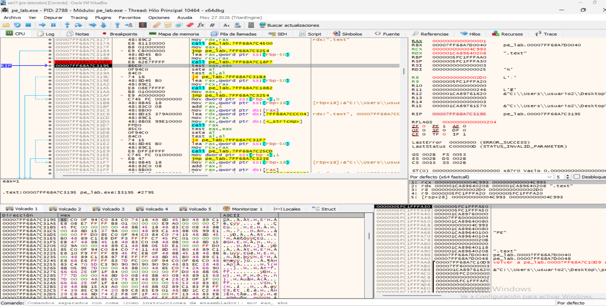  
donde vemos:
- parse_pe() ha terminado correctamente y ha considerado válido el PE.
- "PE"        → firma PE\0\0
- 0x020B      → Magic del Optional Header = PE32+
- ".text"     → primera sección


Esta captura demuestra:
```
load_file()
     ↓
PE RAW cargado en memoria
     ↓
parse_pe()
     ↓
valida MZ
     ↓
localiza PE\0\0
     ↓
identifica PE32+
     ↓
localiza tabla de secciones
     ↓
EAX = 1 → parseo correcto
```

Breakpoint tras `parse_pe()`: la función devuelve `EAX = 1`, indicando que el parseo ha sido correcto. En los datos locales pueden observarse la firma `PE`, el valor `0x20B` correspondiente a `PE32+` y la sección `.text`, confirmando que el programa ha identificado correctamente las principales estructuras del ejecutable.

## 2.4. rva_to_file_offset()

La función `rva_to_file_offset()` es una función clave porque traduce una dirección `RVA` —válida en la imagen PE en memoria— a un `offset` dentro del fichero en disco.

Recibe:
- pe: el PE ya parseado.
- rva: la RVA que queremos traducir.
- result: donde guardará el offset de fichero si la conversión funciona.

La lógica es:
```
RVA
 ↓
¿está dentro de los headers?
 ├─ sí → offset = RVA
 └─ no → buscar la sección que contiene esa RVA
            ↓
         calcular delta
            ↓
 FileOffset = PointerToRawData + delta
```

Línea de comandos necesaria:
```
"C:\Users\usuario2\Desktop\pe_lab.exe" static "C:\Users\usuario2\Desktop\pe_lab.exe"
```

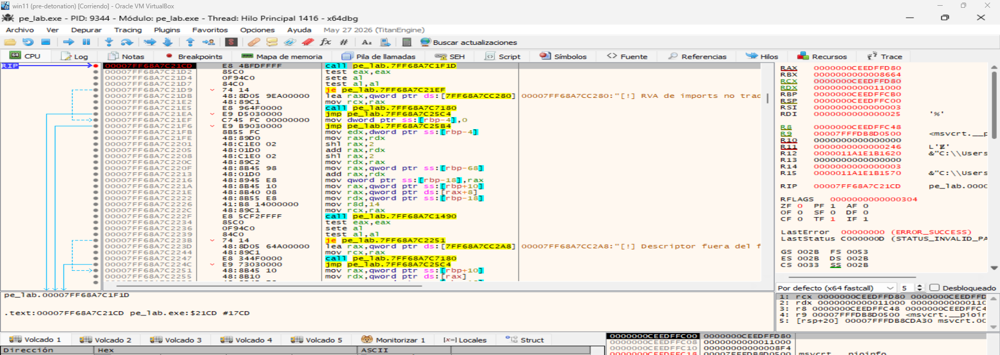  
donde:
- Estamos en el call que hace la llamada a `rva_to_file_offset()`.
- RCX = 000000CEEDFFD80   → PE_IMAGE *pe
- RDX = 0000000000011000  → rva  →  Coincide exactamente con la `RVA` del `Import Directory` de `pe_lab.exe`
- R8  = 000000CEEDFFC48   → &descriptor_offset

Avanzamos con `F8`:  
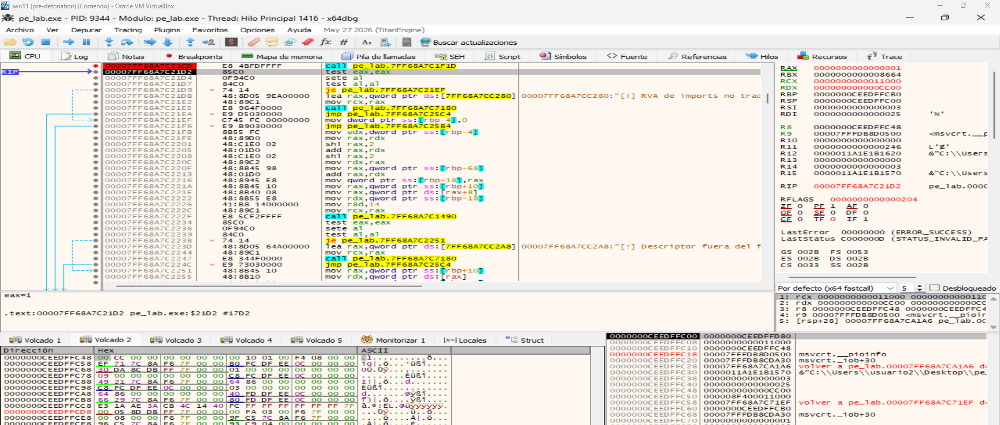  
donde:
- EAX = 1 → Eso significará que la conversión funcionó.
- R8 = 000000CEEDFFC48
- Miramos el conenido de R8 en el Dump: [R8] = 0xCC00

Conceptualmente:
```
RVA                    = 0x11000
.idata VirtualAddress  = 0x11000
.idata RawOffset       = 0xCC00

delta = 0x11000 - 0x11000
      = 0

FileOffset = 0xCC00 + 0
           = 0xCC00
```


## 2.5. static_analysis()

Esta función es, básicamente, el informe estático principal del laboratorio: toma el PE_IMAGE ya cargado y parseado, y muestra por consola la información más útil del ejecutable sin ejecutarlo.

Trabaja sobre un PE que ya ha pasado por:
```
load_file()
   ↓
parse_pe()
   ↓
static_analysis()
```

La función static_analysis() realiza cuatro bloques principales:
1. obtiene algunos DataDirectory relevantes;
2. imprime información general del PE;
3. recorre y muestra todas las secciones;
4. llama a print_imports() para mostrar las DLL y funciones importadas.

Comprobación dinámica de static_analysis(): ejecutando `"C:\Users\usuario2\Desktop\pe_lab.exe" static  "C:\Users\usuario2\Desktop\pe_lab.exe"`, la herramienta muestra los principales campos del PE y recorre la tabla de secciones, indicando RVA, tamaño virtual, offset/tamaño RAW, permisos y entropía.


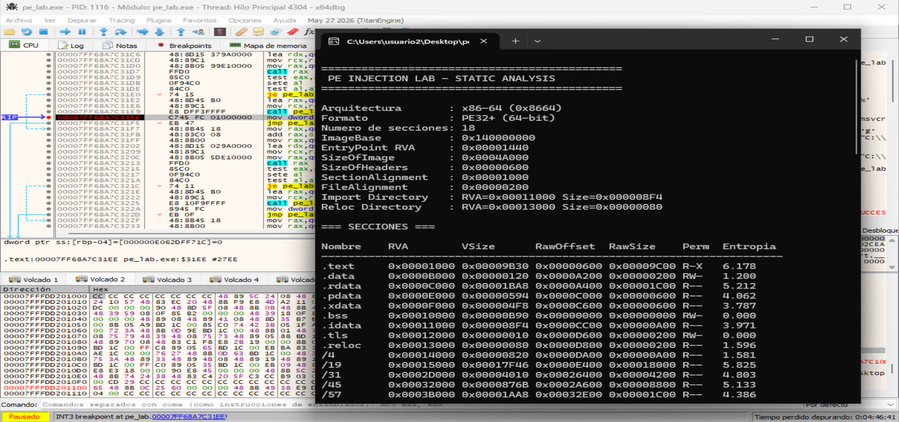  

**Comprobación dinámica de static_analysis():**  
Se ejecuta pe_lab.exe en modo static sobre sí mismo. Tras finalizar static_analysis(), se detiene la ejecución con un breakpoint, permitiendo observar en consola el resumen del PE y la tabla de secciones. La función muestra los principales campos de las cabeceras, los directorios de imports y relocations, y para cada sección sus RVA, tamaños, offset RAW, permisos y entropía.

--------------

## 2.6 print_imports()

Esta función es la que recorre la tabla de imports del PE y muestra qué DLL usa el ejecutable y qué funciones importa de cada una.


La lógica es:
```
Import Directory
   ↓
convertir RVA → offset
   ↓
recorrer IMAGE_IMPORT_DESCRIPTOR
   ↓
obtener nombre de la DLL
   ↓
seguir OriginalFirstThunk / FirstThunk
   ↓
recorrer funciones importadas
   ↓
mostrar nombre u ordinal
```

Esta función permite responder una de las preguntas más importantes del análisis estático: ¿Qué capacidades externas parece necesitar este ejecutable?

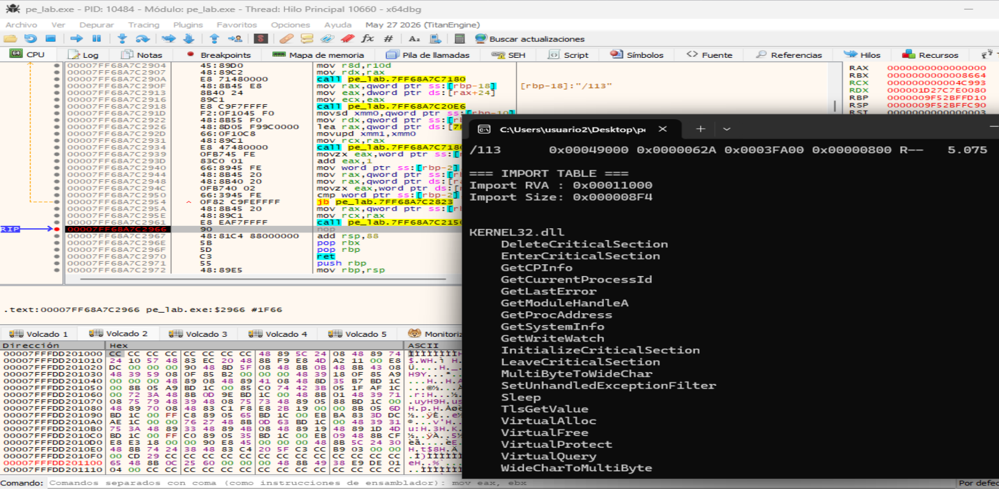

Comprobación dinámica de `print_imports()`: la función localiza el `Import Directory` mediante su `RVA`, lo traduce a offset de fichero y recorre los descriptores de importación. En la salida se observa `KERNEL32.dll` junto con diversas APIs importadas como VirtualAlloc, VirtualFree, GetProcAddress y GetWriteWatch.

## 2.7. map_lab()

`map_lab()` añade cómo se reconstruye ese `PE` en memoria siguiendo sus `RVA`, sin llegar a ejecutarlo.

En concreto, map_lab() hace:
```
SizeOfImage
   ↓
VirtualAlloc()
   ↓
reserva una región PAGE_READWRITE
   ↓
copia los headers
   ↓
recorre las secciones
   ↓
copia cada sección en:
mapped + VirtualAddress
   ↓
calcula:
mapped + EntryPoint RVA
```

Pero deliberadamente no hace:
```
ejecutar EntryPoint
resolver imports
aplicar relocations
dar permisos RX/RWX
inyectar en otro proceso
```

### 2.7.1. Justo después de VirtualAlloc()
Demostramos que el programa ha reservado una región privada del tamaño SizeOfImage y con protección PAGE_READWRITE. En el código corresponde a la reserva de mapped.

Ejecutamos el programa en modo map:
```
"C:\Users\usuario2\Desktop\pe_lab.exe" map "C:\Users\usuario2\Desktop\pe_lab.exe"
```

Establecemos un breakpoint en VirtualAlloc:
```
bp VirtualAlloc
```

La llamada para VirtualAlloc es:
```
VirtualAlloc(
    NULL,
    image_size,
    MEM_RESERVE | MEM_COMMIT | MEM_WRITE_WATCH,
    PAGE_READWRITE);
```

En Windows x64:
```
RCX = lpAddress
RDX = dwSize
R8  = flAllocationType
R9  = flProtect
```

Para pe_lab.exe sabemos:
```
RCX = 0
RDX = 0x4A000       ; SizeOfImage
R8  = 0x203000      ; MEM_WRITE_WATCH | MEM_RESERVE | MEM_COMMIT
R9  = 0x4           ; PAGE_READWRITE
```
Por tanto, en el breakpoint de VirtualAlloc, usa esta condición:
```
rcx==0 && rdx==0x4A000 && r8==0x203000 && r9==0x4
```

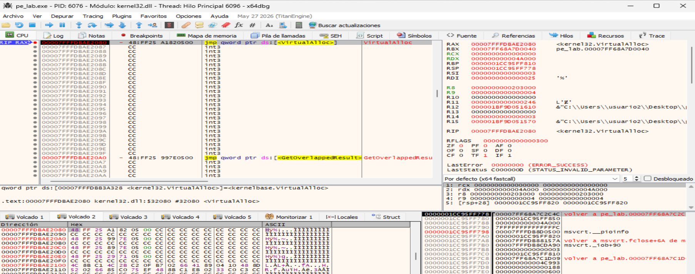

Breakpoint en VirtualAlloc() de map_lab(): la función solicita una región de 0x4A000 bytes, correspondiente a SizeOfImage, con MEM_RESERVE | MEM_COMMIT | MEM_WRITE_WATCH y protección PAGE_READWRITE. Tras retornar, RAX contiene la dirección base de la región asignada, que se almacena en mapped.


### 2.7.2. Justo después del memcpy() que copia una sección
Este es el punto más representativo del mapeo real. La función memcpy() copia una sección a mapped + VirtualAddress.

Establecemos un breakpoint en memcpy con la codición: r8==0x9C00 ya que:
```
.text
SizeOfRawData = 0x9C00
```


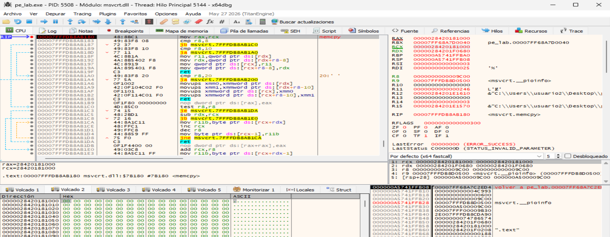


Se intercepta memcpy() con R8 = 0x9C00, correspondiente a SizeOfRawData de .text. RDX apunta a los datos RAW de la sección en pe->data, mientras que RCX apunta a mapped + 0x1000, su VirtualAddress dentro de la imagen reconstruida. Tras la copia, los bytes de .text quedan situados en su RVA correspondiente.

el Dump inferior izquierdo ya se ve que la región destino contiene código máquina real:
```
C3 0F 1F 40 ...
31 C9 ...
41 57 41 56 ...
```

Eso demuestra visualmente que:
```
antes:
mapped + 0x1000
→ zona vacía / cero

después del memcpy:
mapped + 0x1000
→ bytes de la sección .text
```

map_lab() copia la sección .text desde su representación RAW hacia la imagen reconstruida en memoria, colocándola en mapped + VirtualAddress.

Tras ejecutar memcpy(), la región destino correspondiente a mapped + 0x1000 deja de estar vacía y contiene código máquina de .text. Esto confirma que map_lab() reconstruye la imagen PE copiando cada sección desde pe->data + PointerToRawData hasta mapped + VirtualAddress.


### 2.7.3. Justo antes de getchar()
Cuando ya se han copiado todas las secciones y se ha calculado el EntryPoint virtual. Ahí la consola ya muestra:
```
Base simulada
EntryPoint RVA
EntryPoint virtual
```


-------------------

xxxxxxxxxxxxx

--------------

## 2.4. e_lfanew: primer desplazamiento importante
El siguiente valor fundamental es:
```
pe->dos->e_lfanew
```
que indica dónde empieza la cabecera NT:
```
FILE OFFSET

0x0000
┌─────────────────────┐
│ IMAGE_DOS_HEADER    │
│                     │
│ e_magic = "MZ"      │
│                     │
│ e_lfanew ───────────────┐
└─────────────────────┘   │
                          │
                          ▼
                     ┌───────────────┐
                     │ "PE\0\0"      │
                     ├───────────────┤
                     │ File Header   │
                     ├───────────────┤
                     │ Optional Hdr  │
                     └───────────────┘
```

El programa comprueba primero:
```
if (pe->dos->e_lfanew < 0)
```

y después comprueba que existan suficientes bytes para:
```
DWORD
+
IMAGE_FILE_HEADER
```


## 2.5. Firma NT
Una vez localizado e_lfanew:
```
pe->signature =
    (DWORD *)(pe->data + nt_offset);
```

y comprueba:
```
*pe->signature == IMAGE_NT_SIGNATURE
```

que corresponde a:
```
50 45 00 00
 P  E \0 \0
```

Por tanto hasta ahora tenemos:
```
MZ
 ↓
e_lfanew
 ↓
PE\0\0
```


## 2.6. IMAGE_FILE_HEADER
Justo después de la firma:
```
pe->file_header =
    (IMAGE_FILE_HEADER *)
    (pe->data + nt_offset + sizeof(DWORD));
```

Aquí aparecen campos importantes:
```
Machine
NumberOfSections
TimeDateStamp
PointerToSymbolTable
NumberOfSymbols
SizeOfOptionalHeader
Characteristics
```

En este laboratorio interesan sobre todo:
```
Machine
NumberOfSections
SizeOfOptionalHeader
```

## 2.7. Número de secciones
El parser impone:
```
NumberOfSections != 0
NumberOfSections <= 96
```

mediante:
```
#define MAX_SECTIONS 96
```

Esto no forma parte del formato PE como requisito estricto. Es una medida defensiva del laboratorio. Sirve para evitar que un PE corrupto o manipulado provoque recorridos absurdos. Por ejemplo:
```
NumberOfSections = 65535
```

no debería hacer que nuestro parser intente recorrer decenas de miles de estructuras.

## 2.8. Optional Header

Su posición se calcula como:
```
optional_offset =
    nt_offset +
    sizeof(DWORD) +
    sizeof(IMAGE_FILE_HEADER);
```
Es decir:
```
e_lfanew
   |
   v
+----------+
| PE\0\0   | sizeof(DWORD)
+----------+
| FILE HDR |
+----------+
| OPTIONAL | <-- optional_offset
| HEADER   |
+----------+
```

Después lee únicamente los primeros 2 bytes:
```
pe->optional_magic =
    *(WORD *)(pe->data + optional_offset);
```

porque el campo:
```
Magic
```
determina qué tipo de Optional Header tenemos.
