# Laboratorio mínimo de PE injection — Windows x64

Tres piezas: `injector.exe`, `target.exe` y `payload.dll`. El inyector crea su propio destino, construye la imagen en memoria, la copia al destino y ejecuta la función exportada `LabEntry`. Esta función únicamente devuelve `0x5045`. No acepta PID, rutas ni cargas externas como argumentos.

Este laboratorio tiene tres archivos:
- Entenderemos cómo se prepara payload.dll,
- cómo se copia a target.exe y
- cómo se ejecuta LabEntry.

Primero comprobaremos el resultado 0x5045; después lo observaremos con x64dbg.

## Compilar

En Windows instala Visual Studio Build Tools con **Desktop development with C++** y Windows SDK. Abre **x64 Native Tools Command Prompt for VS**, entra en esta carpeta y ejecuta:

```bat
build.cmd
out\injector.exe
```

No requiere privilegios de administrador. Conservaremos juntos los tres binarios de `out`. Se compila sin optimización y con símbolos PDB. La DLL no contiene CRT, imports, TLS ni DllMain. La ejecución de la DLL no abre ventanas ni conexiones.


----

## Diseccionar con x64dbg

1. Abre `out\injector.exe` en **x64dbg**, no x32dbg. Ejecuta hasta la primera    pausa de consola. Anota el PID del destino y adjunta **otra instancia** de x64dbg a ese PID. Reanuda el destino después de la pausa inicial del depurador.
2. En el inyector pon breakpoints en `VirtualAllocEx`, `WriteProcessMemory`, `VirtualProtectEx` y `CreateRemoteThread`. Usa los símbolos resueltos de KernelBase/Kernel32; algunas exportaciones son reenviadas. También puedes poner breakpoints en las llamadas correspondientes desde el desensamblado.
3. Pulsa ENTER en la consola del inyector. En `VirtualAllocEx`, observa el handle del hijo, `SizeOfImage` y `PAGE_READWRITE`. Al volver de la función, **RAX** contiene la base remota. La consola imprime esa base y la dirección exacta de `LabEntry`.
4. Continúa hasta la segunda pausa, pulsa ENTER y examina `WriteProcessMemory`. En la entrada: **RCX** = handle, **RDX** = base destino, **R8** = imagen local, **R9** = tamaño. Sigue R8 en Dump: debe comenzar con `MZ`. La imagen ya tiene
   las secciones en sus RVA, no en sus offsets originales del archivo.
5. Continúa hasta la tercera pausa. En el depurador del destino, ve a la base remota en Dump y comprueba `MZ`, `PE` y las secciones. Ve a la dirección impresa de `LabEntry` en Disassembler y coloca allí un breakpoint. No la confundas con `AddressOfEntryPoint`: la DLL usa `/NOENTRY`; se llama una exportación de forma explícita.
6. Pulsa ENTER. En `CreateRemoteThread`, **R9** es la dirección de inicio. Continúa el inyector y el destino hasta detenerte en `LabEntry`. Avanza instrucción a instrucción: verás preparar **EAX = 0x5045** y retornar.
7. Reanuda el destino. La consola del inyector debe mostrar `Resultado del hilo: 0x5045 (esperado: 0x5045)`. ENTER libera la imagen y termina únicamente el hijo creado por el laboratorio.

Las pausas de consola y las pausas de ambos depuradores son independientes: si parece bloqueado, comprueba cuál espera ENTER y cuál espera F9. La espera del hilo no tiene timeout para permitir una disección lenta.

## Qué demuestra y qué simplifica

Es una copia manual de una **imagen PE DLL** a otro proceso seguida de ejecución de una exportación. No sustituye la imagen principal del destino (hollowing) ni llama a LoadLibrary para cargar la DLL. La imagen no se registra en las listas
de módulos del cargador; búscala por su dirección en el mapa de memoria.

El inyector reserva memoria RW, escribe, aplica permisos por sección y vacía la caché de instrucciones antes de crear el hilo. Incluye el ajuste de relocaciones DIR64 si existen. El payload suministrado es independiente de su base: puede
no contener relocaciones, por lo que no debes esperar ver ajustes en esta versión.

**No es un cargador PE general.** No resuelve imports, inicializa TLS, invoca DllMain ni registra unwind tables. El pequeño payload no necesita esas operaciones. No lo sustituyas por un EXE/DLL cualquiera ni por código con excepciones o llamadas externas. El parser tiene comprobaciones de límites, pero está pensado para los archivos del laboratorio, no para procesar archivos hostiles como servicio.

## Validación y resultado esperado

En Windows: `build.cmd` debe finalizar sin errores; ejecuta el inyector, completa las cuatro pausas y comprueba el resultado `0x5045` y el código de salida 0 (`echo %ERRORLEVEL%`). Repite la ejecución: debe crear un destino nuevo sin dejar
el anterior abierto al terminar normalmente.

Este paquete se preparó en Linux. No se ha compilado con MSVC ni ejecutado en Windows/x64dbg aquí; esas comprobaciones quedan pendientes. No hay binarios Windows precompilados en el paquete.


------------------


Este laboratorio realiza un mapeo manual simplificado de una `DLL PE` en un proceso que el propio inyector crea, y ejecuta una función de esa `DLL` mediante un hilo remoto.

**Qué hace cada programa:**
- `target.exe` imprime su PID y permanece esperando mediante Sleep(INFINITE). Es el proceso donde estudiaremos la inyección.
- `payload.dll` exporta la función `LabEntry`, que únicamente devuelve `0x5045`. No muestra mensajes, abre ventanas ni realiza conexiones.
- `injector.exe` prepara la `DLL` en memoria, la copia al destino y ejecuta `LabEntry` allí.


No necesitamoss abrir `target.exe` antes ni proporcionar un `PID`. Ejecutaremos `injector.exe` sin argumentos, con los tres binarios en la misma carpeta: esto crea su propio destino y lo termina al finalizar.

**Cómo funciona injector.exe:**
| Fase | Qué hace | Qué permite estudiar |
|---|---|---|
| Leer y validar | Lee `payload.dll` y comprueba las firmas `MZ`, `PE` y el formato x64. Rechaza imports y TLS. | La estructura de un archivo PE. |
| Construir la imagen | Reserva un búfer local de `SizeOfImage`, copia las cabeceras y coloca cada sección en su dirección relativa, o RVA. | La diferencia entre el archivo en disco y su distribución en memoria. |
| Buscar la función | Examina la tabla de exportaciones para localizar `LabEntry`. | Cómo una exportación identifica una función dentro de la imagen. |
| Crear el destino | Llama a `CreateProcessA` para iniciar `target.exe`. | La separación entre los dos procesos. |
| Reservar memoria | Usa `VirtualAllocEx` para reservar memoria de lectura y escritura dentro del destino. | Qué significa reservar memoria en otro proceso. |
| Ajustar y copiar | Aplica relocaciones `DIR64` si existen y copia la imagen con `WriteProcessMemory`. | Cómo se coloca el PE en una base distinta de la preferida. |
| Aplicar permisos | Usa `VirtualProtectEx` y vacía la caché de instrucciones. | La transición desde memoria escrita a código ejecutable. |
| Ejecutar | Crea un hilo con `CreateRemoteThread`, cuya dirección inicial es `LabEntry`. | La ejecución del payload dentro del destino. |
| Comprobar y limpiar | Lee el resultado del hilo, libera la memoria y termina el destino. | La verificación y el ciclo completo del laboratorio. |

La relación central es:
```
Dirección remota de LabEntry = base remota de la imagen + RVA de LabEntry
```
Una `RVA` es un desplazamiento respecto al comienzo de la imagen. No es necesariamente el desplazamiento de esos mismos bytes dentro del archivo en disco.


------

## Primera práctica: las cuatro pausas

Abrimos una consola en out y ejecutamos:
```
injector.exe
```
Avanzamos con ENTER, leyendo cada pausa:
1. Destino creado: anotamos los PID del inyector y del destino. Todavía no se ha reservado la memoria del payload.
2. Memoria reservada: anotamos la base remota y la dirección de LabEntry. La imagen aún no se ha copiado.
3. Imagen copiada: el destino contiene las cabeceras y secciones del payload, con sus permisos aplicados. Todavía no se ha ejecutado LabEntry.
4. Ejecución completada: debe aparecer:
   ```
   Resultado del hilo: 0x5045 (esperado: 0x5045).
   ```
   El último ENTER libera la imagen y termina el destino.

   Después podemos comprobar el código de salida:
   ```
   echo %ERRORLEVEL%
   ```
   El resultado esperado es 0. La ausencia de una ventana o mensaje del payload es normal: su única acción observable es devolver ese valor.

----


## Segunda práctica: observarlo con x64dbg
1. Abre injector.exe en x64dbg y ejecútalo hasta la primera pausa de consola.
2. Abre otra instancia de x64dbg y adjúntala al PID del destino que imprime el inyector. Reanuda el destino después de la pausa inicial del depurador.
3. En el inyector, coloca breakpoints en VirtualAllocEx, WriteProcessMemory, VirtualProtectEx y CreateRemoteThread. Algunas exportaciones están reenviadas entre Kernel32 y KernelBase; también puedes detenerte en las llamadas del propio inyector.
4. Avanza hasta la tercera pausa. En el depurador del destino, examina la base remota en Dump: encontrarás las cabeceras MZ y PE.
5. Ve a la dirección impresa de LabEntry remota en el desensamblador y coloca allí un breakpoint.
6. Pulsa ENTER en la consola del inyector y continúa ambos depuradores. El nuevo hilo del destino debe detenerse en LabEntry.
7. Avanza por las instrucciones: observarás que se prepara el valor 0x5045 en EAX y se retorna. Reanuda el destino para que el inyector pueda recoger el resultado.
Las pausas de consola y del depurador son independientes. Si parece detenido, comprueba si espera ENTER en la consola o F9 en alguno de los depuradores. El inyector espera al hilo sin límite de tiempo para permitir esta inspección.


----------

## Qué demuestra esta inyección PE
Los bytes se preparan en el inyector, pero LabEntry se ejecuta en el proceso destino. Ese cambio de contexto es lo que debes comprobar con los dos depuradores.
Este ejemplo no llama a LoadLibrary ni sustituye el ejecutable principal del destino. La DLL tampoco se registra en las listas normales del cargador: búscala por la dirección impresa en el mapa de memoria.
Es un cargador deliberadamente limitado: no resuelve imports, inicializa TLS, llama a DllMain ni registra tablas para el manejo de excepciones x64. build.cmd prepara el pequeño payload con /NOENTRY y sin bibliotecas predeterminadas para que pueda funcionar bajo esas condiciones. Además, puede no contener relocaciones; que no observes ajustes es coherente con este payload.
He verificado esto leyendo el código; no he ejecutado tus binarios en Windows. La comprobación práctica será detenerte en LabEntry dentro del destino y obtener 0x5045 en la consola del inyector.

-----

## Flujo


-----

## Paso 0
Vamos a analizar la parte en la que injector.exe abre payload.dll para copiar su contenido para luego llevarlo a target.exe.

FLujo:
```
payload.dll en disco
        ↓ fopen_s + fread
raw: copia del archivo dentro del inyector
        ↓ validación y copia de secciones
image: imagen PE organizada dentro del inyector
        ↓ WriteProcessMemory
remote: imagen dentro de target.exe
```
donde:
- raw e image son dos búferes diferentes.

Para abrir payload.dll se usa la siguiente llamda del código:
```
fopen_s(&file, dll, "rb")
```
donde:
- Esta operación abre el archivo para leer sus bytes. No carga la DLL mediante LoadLibrary ni ejecuta su código.

El inyector construye la ruta utilizando la carpeta de su propio ejecutable.

Al entrar en fopen_s, los argumentos x64 son:
| Registro | Contenido | Qué observar |
|---|---|---|
| RCX | Dirección de la variable `file` | Allí se escribirá el puntero `FILE*`. |
| RDX | Dirección de la cadena `dll` | La ruta completa de `payload.dll`. |
| R8 | Dirección de `"rb"` | Modo lectura binaria. |

Ponemos un breakpoint en: `bp fopen_s`:
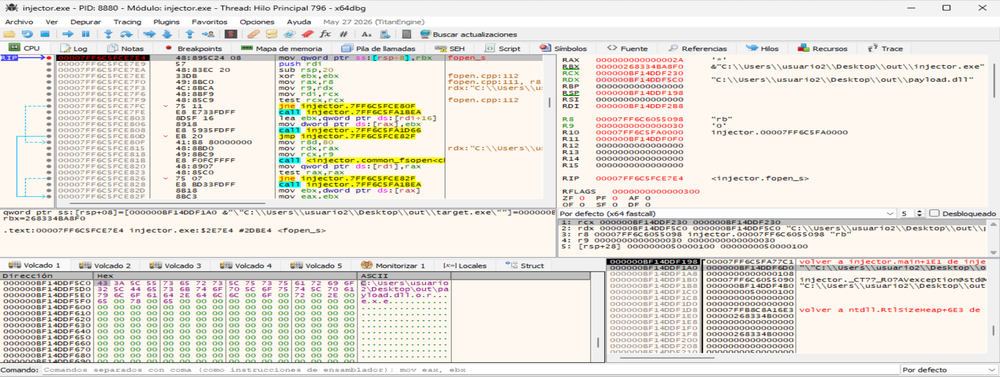

La captura muestra:
| Registro | Valor | Significado |
|---|---|---|
| **RCX** | `000000BF14DDF230` | Dirección de la variable `file`, donde se guardará el `FILE*`. |
| **RDX** | `000000BF14DDF5C0` | Cadena `C:\Users\usuario2\Desktop\out\payload.dll`. |
| **R8** | Dirección de `"rb"` | Lectura binaria. |

El panel del DUMP inferior muestra la cadena con la ruta, no el contenido de la DLL.

Pulsamos Ctrl+F9 para ejecutar hasta el retorno y F8 una vez para regresar a main. Comprobamos EAX: en fopen_s, 0 significa éxito. Hacemos clic en Volcado 1, pulsamos Ctrl+G e introducimos la dirección que hemos anotado en RCX: `000000BF14DDF230`:  
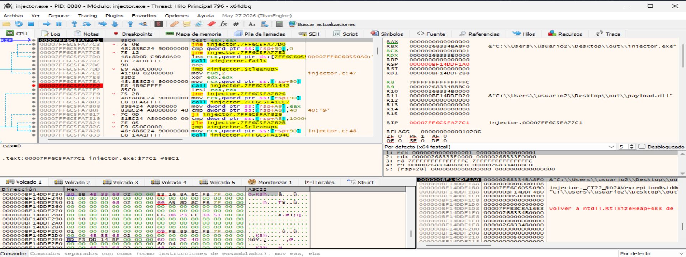  
donde:
- EAX = 0 es el resultado correcto de fopen_s.
- En la variable file, dirección 0x000000BF14DDF230, aparecen estos bytes: `30 BB 4B 33 68 02 00 00`. Interpretados como un puntero de 64 bits en little-endian, representan FILE* = 0x00000268334BBB30.


Ahora vamos a obtener el tamaño del archivo. Avanzamos con F8 hasta dejar seleccionada la llamada situada en
```
00007FF6C5FA77F2
```
Es la llamada a fseek. Antes de ejecutarla, los argumentos son:
| Registro | Valor esperado |
|---|---|
| RCX | `0x00000268334BBB30`: el `FILE*`. |
| RDX | `0`: desplazamiento. |
| R8 | `2`: `SEEK_END`, referencia al final del archivo. |

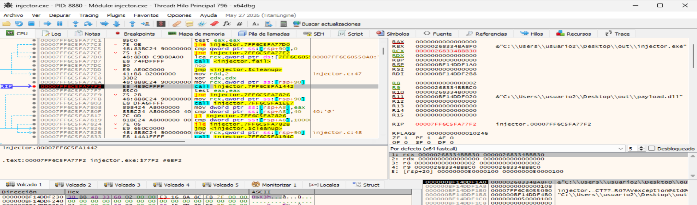


Continuamos con F8 hasta la llamada a ftell, visible en:
```
00007FF6C5FA7803
```
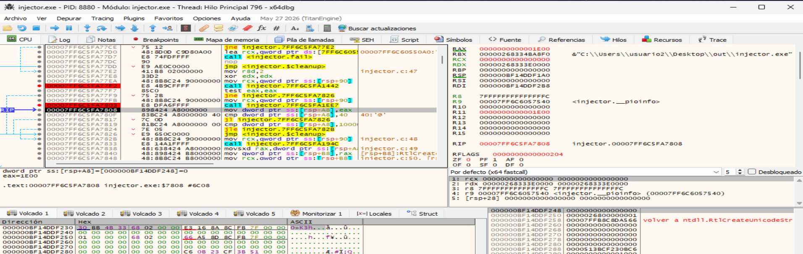  
donde:
- ftell ha devuelto EAX = 0x1E00. Por tanto, payload.dll ocupa 7.680 bytes —7,5 KiB— en disco.

-----

**Reserva de memoria:**

Ahora el programa preparará el tamaño para reservar el búfer raw. Siguiente paso: observar malloc.

Pulsa F8 una vez para completar malloc. Al regresar a 0x00007FF6C5FA7855, RAX contendrá la dirección del búfer reservado; cero indicaría un fallo.
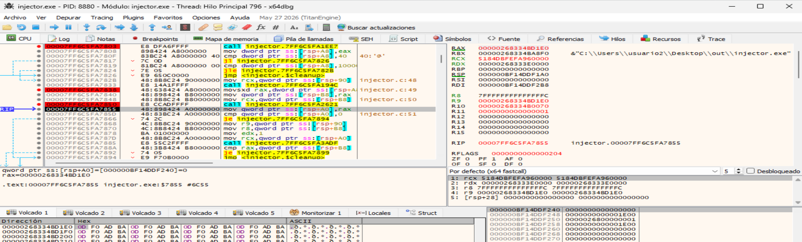  
donde vemos:
- malloc ha reservado el búfer correctamente.
- Dirección de raw: 0x00000268334BD1E0.
- Tamaño solicitado: 0x1E00 —7.680 bytes—.
- El patrón repetido 0D F0 AD BA corresponde a relleno del heap; todavía no es el contenido de la DLL.

------------------

**Leer payload.dll:**

Avanzamos con F8 hasta la llamada situada en:
```
00007FF6C5FA7885
```
Es fread(raw, 1, length, file).

| Registro | Valor esperado | Significado |
|---|---|---|
| RCX | `0x00000268334BD1E0` | Búfer destino `raw`. |
| RDX | `1` | Tamaño de cada elemento. |
| R8 | `0x1E00` | Número de elementos que leer. |
| R9 | `0x00000268334B8B30` | Puntero `FILE*`. |

Pulsamos F8 una vez para completar la lectura. Debemos regresar a 0x00007FF6C5FA788A.
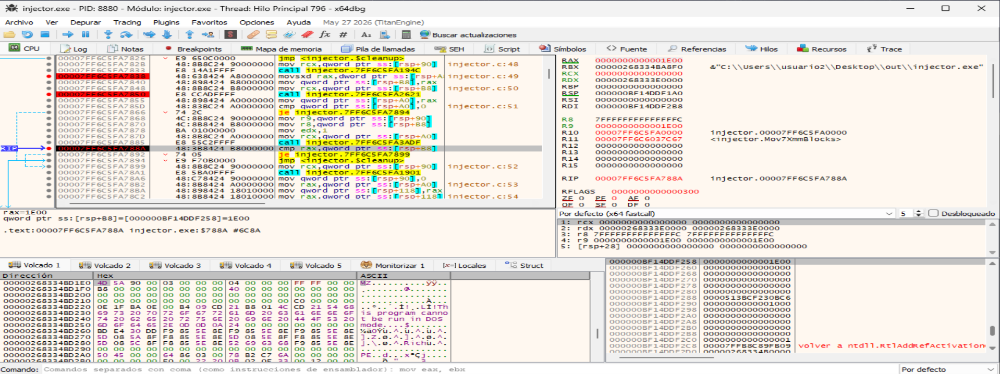  
donde:
- RAX = 0x1E00: fread ha leído los 7.680 bytes solicitados.
- En raw = 0x00000268334BD1E0 aparecen 4D 5A —MZ— y las cabeceras del archivo.
- La instrucción seleccionada compara los bytes leídos con length.

-----

**Primera validación del PE**

```
dos = (IMAGE_DOS_HEADER *)raw;
```
Esa conversión permite interpretar los bytes como una cabecera DOS; no crea otra copia.

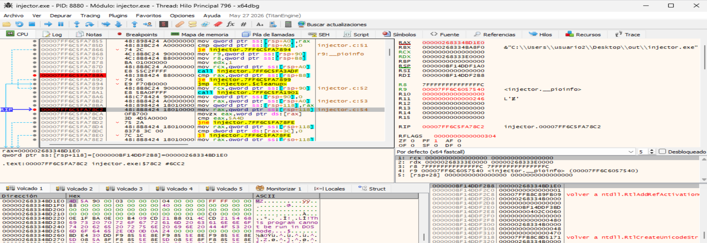

Estamos en la validación de la cabecera DOS. 
| Acción | Instrucción | Resultado esperado |
|---|---|---|
| **F8** | `mov rax,[rsp+118]` | RAX recibe la dirección de `raw`. |
| **F8** | `movzx eax,word ptr [rax]` | EAX recibe **`0x5A4D`**, los bytes `MZ`. |
| **F8** | `cmp eax,5A4D` | **ZF = 1**, porque ambos valores coinciden. |

----

**Validación de las cabeceras PE:**

Localizamos las cabeceras PE mediante e_lfanew. Este campo está en el offset 0x3C de la cabecera DOS.


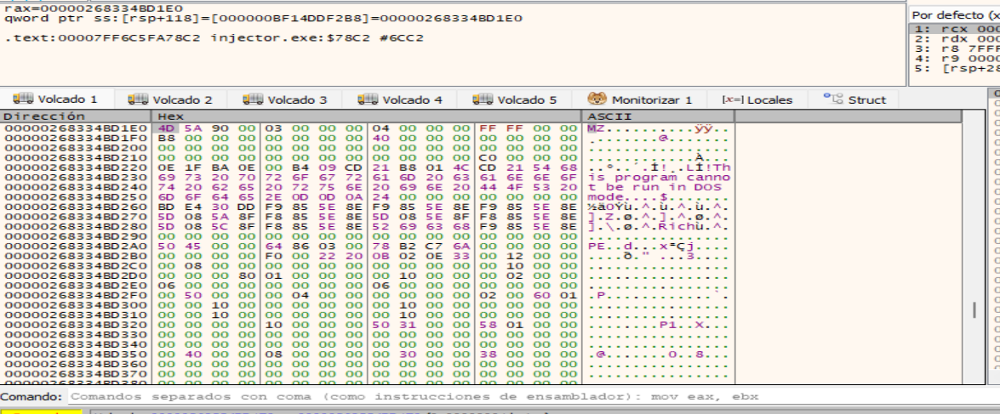


| Valor | Significado |
|---|---|
| **`0x3C`** | Posición donde comienza el campo `e_lfanew`, respecto al inicio del archivo. |
| **`0xC0`** | Contenido de `e_lfanew` en tu DLL: indica dónde comienzan las cabeceras PE. |


La dirección calculada es así:
```
raw + 0x3C
0x00000268334BD1E0 + 0x3C = 0x00000268334BD21C
```
donde:
- 0x00000268334BD21C es la posición en donde comienza el campo `e_lfanew`.
- Utilizamos el valor que contiene para localizar las cabeceras.

```
Inicio del archivo
│
├── Offset 0x00:  4D 5A           → firma MZ
│
├── Offset 0x3C:  C0 00 00 00     → campo e_lfanew
│                 │
│                 └── Su valor es 0xC0
│
└── Offset 0xC0:  50 45 00 00     → firma PE
```


En la captura se observan los bytes `C0 00 00 00`: representan e_lfanew = 0xC0, el desplazamiento de las cabeceras PE dentro del archivo.
Por tanto:
```
nt = raw + 0xC0
   = 0x00000268334BD2A0
```
Al ir a esa última dirección, encontraremos 50 45 00 00 —PE\0\0—.

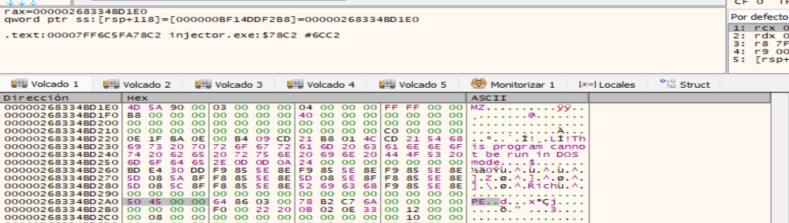

```
Campo e_lfanew:  0x00000268334BD1E0 + 0x3C
              = 0x00000268334BD21C

Cabeceras PE:   0x00000268334BD1E0 + 0xC0
              = 0x00000268334BD2A0
```

| Campo | Dirección en esta ejecución | Bytes esperados |
|---|---|---|
| Firma PE | `0x00000268334BD2A0` | `50 45 00 00` |
| Arquitectura AMD64 | `0x00000268334BD2A4` | `64 86` → `0x8664` |
| Formato PE32+ | `0x00000268334BD2B8` | `0B 02` → `0x020B` |
| `SizeOfImage` | `0x00000268334BD2F0` | `00 50 00 00` → `0x5000` |

-----


-------

## Paso 1
Abrimos injector.exe en x64dbg y lo ejecutamos hasta la primera pausa del laboratorio.

- Comprobamos que injector.exe, target.exe y payload.dll están juntos en la carpeta out.
- Abrimos x64dbg, seleccionamos File → Open y carga injector.exe sin argumentos.
- Pulsamos F9 para continuar. Vamos pulsando F9 hasta que la consola muestre:
  ```
  Inyector PID=…; destino propio PID=…; …
  1. Adjunta otra instancia de x64dbg al destino. Siguiente: VirtualAllocEx.
  Pulsa ENTER para continuar…
  ```
  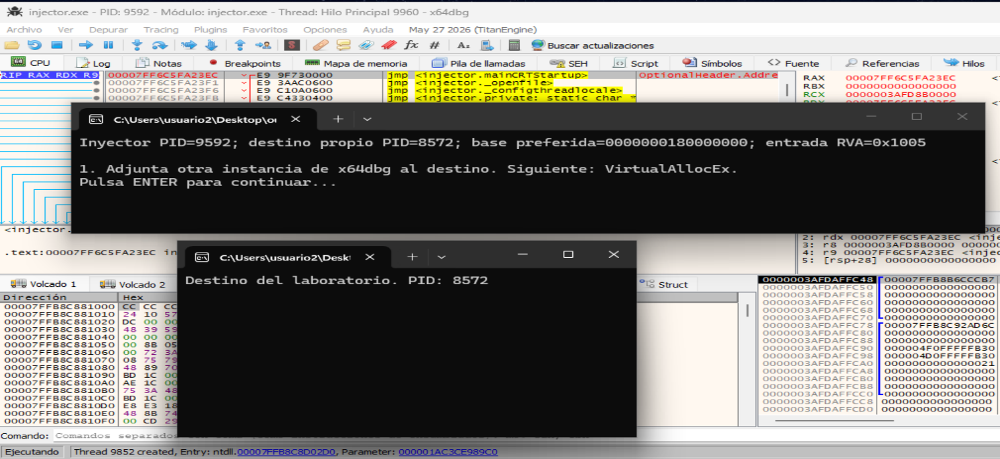

- No pulsaremos ENTER todavía. Anotamos el PID del destino ya que lo utilizaremos para adjuntar una segunda instancia de x64dbg.


**En este punto, target.exe ya está creado, pero todavía no se ha reservado la memoria remota del payload.**

----

## Paso 2
Adjuntamos una segunda instancia de x64dbg a target.exe.

- Manténemos abierta la primera instancia, que depura injector.exe, y no pulsamos ENTER en su consola.
- Abrimos otra instancia de x64dbg.
- Seleccionamos File → Attach y busca target.exe cuyo PID coincida con el «destino propio PID» que anotamos.
- Lo seleccionamos y pulsamos Attach.

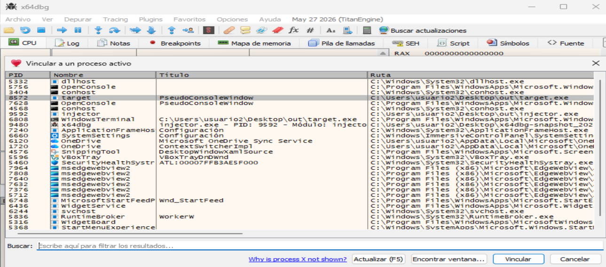

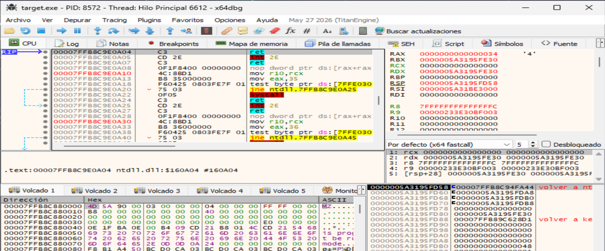  
donde vemos que:
- Ya está vinculado a target.exe, PID 8004.
- La vista CPU muestra código de ntdll.dll, una biblioteca de Windows

- Pulsamos F9 para reanudar el destino. Si ya indica «Ejecutando», lo dejamos así.
  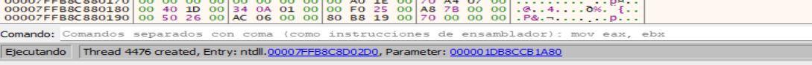

- Mantenemos el inyector esperando ENTER en su primera pausa.

## Paso 3
Preparamos los breakpoints en el inyector.
- Volvemos a la primera instancia de x64dbg, la que depura injector.exe.
- En la barra de comandos, introducimos los siguientes breakpoints:
   - bp VirtualAllocEx
   - bp WriteProcessMemory
   - bp VirtualProtectEx
   - bp CreateRemoteThread


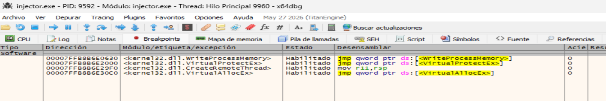

----

## Paso 4
Detener el inyector en VirtualAllocEx y observar qué memoria solicita.
- En la consola de injector.exe, pulsamos ENTER una vez para salir de la primera pausa.
- La instancia de x64dbg que depura el inyector debería detenerse en el breakpoint de VirtualAllocEx.

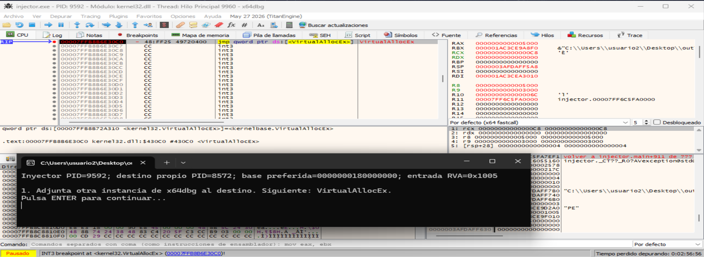
donde:


En la entrada de esa función, los argumentos x64 son:
| Ubicación | Valor | Significado |
|---|---|---|
| RCX | `0xC8` | Handle del destino, PID `8572`; no es su PID. |
| RDX | `0` | Windows elegirá la dirección base. |
| R8 | `0x5000` | Tamaño solicitado: **20 KiB**, el `SizeOfImage`. |
| R9 | `0x3000` | Reserva y compromiso de memoria. |
| `[RSP+0x28]` | `0x04` | Protección inicial **RW**. |

----

## Paso 5
Ahora vamos a obtener el resultado de la reserva:
- Dejamos target.exe ejecutándose en su depurador. Si estuviera pausado, pulsamos F9 allí.
- En el depurador de injector.exe, pulsamos Ctrl+F9 y F8 para ejecutar VirtualAlloc y retornar al código del injector.exe.
- Observamos RAX: contendrá la base remota reservada si la llamada tuvo éxito; 0 indicaría un fallo:
  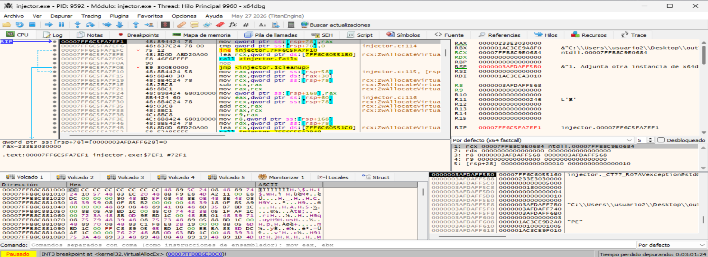
- Anotamos RAX antes de continuar, porque otras instrucciones pueden sobrescribirlo. La memoria recién reservada todavía no contiene el PE.
- RAX contiene la base remota 0x00000233E3030000. Estamos de vuelta en el inyector, justo antes de guardar ese valor en su variable local.

----

## Paso 6
Observamos la región antes de copiar el PE:
- Anotamos la base: 0x00000233E3030000.
- Cambiamos al x64dbg de target.exe, PID 8572.
- Pulsamos F12 para pausarlo.
- En el panel Volcado, pulsamos Ctrl+G, e introducimos esa dirección para ir a esa región:
  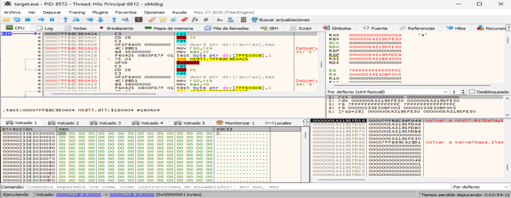

Vemos memoria inicializada a cero, con protección RW. Todavía no aparecen las cabeceras MZ del payload:
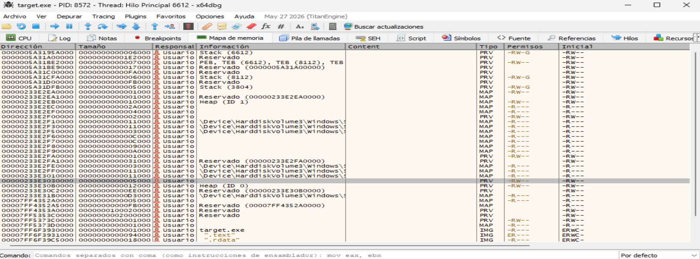
donde vemos:
- Base: 0x00000233E3030000.
- Tamaño: 0x5000 —20 KiB—.
- Tipo: memoria privada (PRV).
- Permisos: lectura y escritura.
- Contenido: ceros, porque todavía no se ha copiado el PE.


- Pulsamos F9 en el destino (target.exe) para reanudarlo.
 

----

## Paso 7
Vamos ahora a lacopia de la imagen.
- Volvemos al x64dbg del inyector y pulsamos F9.
- Pulsamos ENTER una vez en esa consola. El depurador del inyector debe detenerse en WriteProcessMemory.
  ```
  2. Memoria reservada. Siguiente: WriteProcessMemory (cabeceras y secciones).
  Pulsa ENTER para continuar...
  ```
  

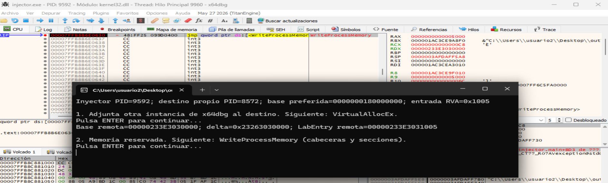

En la entrada de esa función WriteProcessMemory, comprobaremos:
| Registro | Valor | Significado |
|---|---|---|
| RCX | `0xC8` | Handle del destino. |
| RDX | `0x00000233E3030000` | Dirección remota donde escribirá. |
| R8 | `0x000001AC3CE9F010` | Imagen preparada en el inyector. |
| R9 | `0x5000` | Bytes que copiará: 20 KiB. |


Seguimos el volvado de R8. El volcado debería comenzar con 4D 5A, que aparece como MZ en la columna de texto: son las cabeceras de la imagen PE preparada:
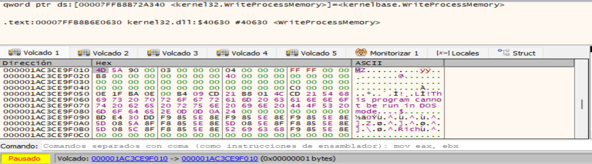

----

## Paso 8
Completamos la copia y la comprobamos en el destino.
- En el x64dbg de injector.exe, pulsamos Ctrl+F9 para ejecutar hasta el retorno de WriteProcessMemory.
- Pulsamos F7 una vez para regresar al código del inyector.
- Comprobamos RAX antes de avanzar:
   - Distinto de cero: la escritura tuvo éxito.
   - Cero: la llamada falló.
   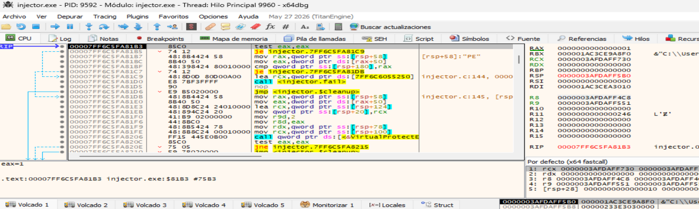

- Cambiamos al x64dbg de target.exe, PID 8572. Si no aparece directamente en panel del DUMP la dirección 00000233E3030000, entonces hacemos clic dentro de Volcado 1, pulsa Ctrl+G e introducimos esa dirección.

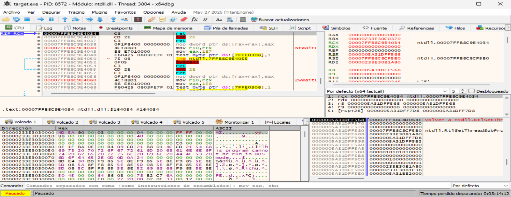
donde vemos:
- La región que antes contenía ceros, ahora comienza con: `4D 5A    →    MZ....`

Esto demuestra que la imagen preparada en el inyector ya se ha copiado a la memoria del destino. En este punto la región sigue siendo RW y LabEntry todavía no se ha ejecutado:
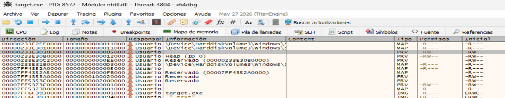


## Paso 9
Observamos el cambio de permisos con VirtualProtectEx.
- En el x64dbg de target.exe, pulsamos F9 (si está en estado pausado).
- Volvemos al x64dbg de injector.exe y pulsamos F9.
- El inyector se detiene en el breakpoint de VirtualProtectEx:
  
En esta primera llamada, esperamos:
| Registro | Valor esperado | Significado |
|---|---|---|
| **RCX** | `0xC8` | Handle del destino. |
| **RDX** | `0x00000233E3030000` | Base de la imagen remota. |
| **R8** | `0x5000` | Tamaño de toda la imagen. |
| **R9** | `0x02` | `PAGE_READONLY`: solo lectura. |

Primero se protege toda la imagen como solo lectura. Las llamadas posteriores ajustarán cada sección: el código tendrá lectura y ejecución, y los datos recibirán los permisos correspondientes.

Ahora ejecutamos esta llamada VirtualProtectEx:
- En el depurador del inyector, pulsamos Ctrl+F9.
- Cuando se detenga en el retorno, pulsamos F8 una vez para regresar al inyector.
- Comprobamos RAX: distinto de cero indica éxito.

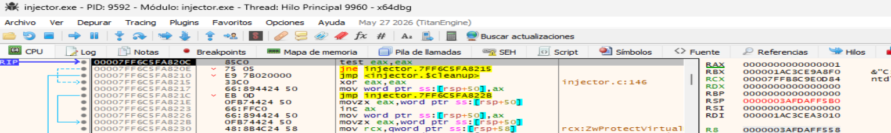


Esta llamada prepara la sección ejecutable. Los argumentos muestran:
| Registro | Valor | Significado |
|---|---|---|
| **RDX** | `0x00000233E3031000` | Base remota + RVA `0x1000`. |
| **R8** | `0x1200` | Tamaño solicitado: 4.608 bytes. |
| **R9** | `0x20` | `PAGE_EXECUTE_READ`: lectura y ejecución. |


La dirección de LabEntry, 0x00000233E3031005, está dentro de esta región. Windows aplica los permisos por páginas, por lo que el intervalo protegido se redondea a sus límites.

Pulsamos F9 para continuar. En cada nueva parada de VirtualProtectEx podemos verificar los permisos en el registro R9. Continuamos con F9 hasta que la consola alcance:
```
3. Imagen copiada. En el destino pon un breakpoint en LabEntry remota.
Siguiente: CreateRemoteThread.
```

[VirtualProtectEx-4.png](capturas/VirtualProtectEx-4.png)
donde:
- Estamos detenidos en la entrada de CreateRemoteThread, antes de que se cree el hilo.
- R9 = 0x00000233E3031005 confirma que la dirección inicial del hilo será LabEntry.


## Paso 10

Cambiamos al x64dbg de target.exe, PID 8572. Si indica Ejecutando, pulsamos F12 para pausarlo.

En su barra de comandos, introducimos: `bp 00000233E3031005`.

Comprueba en Breakpoints que esa dirección está habilitada.

Pulsamos F9 en target.exe para dejarlo ejecutándose y preparado para alcanzar ese breakpoint.

## Paso 11
Pulsamos F9 en el inyector para que cree el hilo remoto.

Al pulsar F9 en inyector, se activa el breakpoint en target.exe:
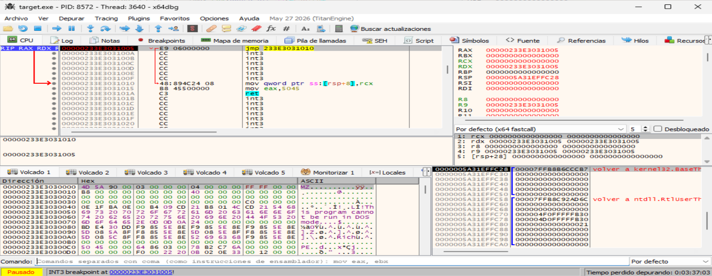

El nuevo hilo 3640, dentro de target.exe, PID 8572, ha alcanzado LabEntry en 0x00000233E3031005.

Ahora observa su ejecución en el depurador del destino:
| Acción | Qué ocurre | Próxima instrucción |
|---|---|---|
| **F7 una vez** | El `jmp` lleva al cuerpo de la función. | `0x00000233E3031010` |
| **F7 otra vez** | Guarda el argumento recibido en la pila. | `mov eax,5045` |
| **F7 otra vez** | Coloca el resultado **`0x5045` en EAX**. | `ret` |


Pulsamos F9 en el x64dbg de target.exe.

El hilo retornará y terminará.

El inyector, que espera su finalización, debería mostrar:
Resultado del hilo: 0x5045 (esperado: 0x5045).
