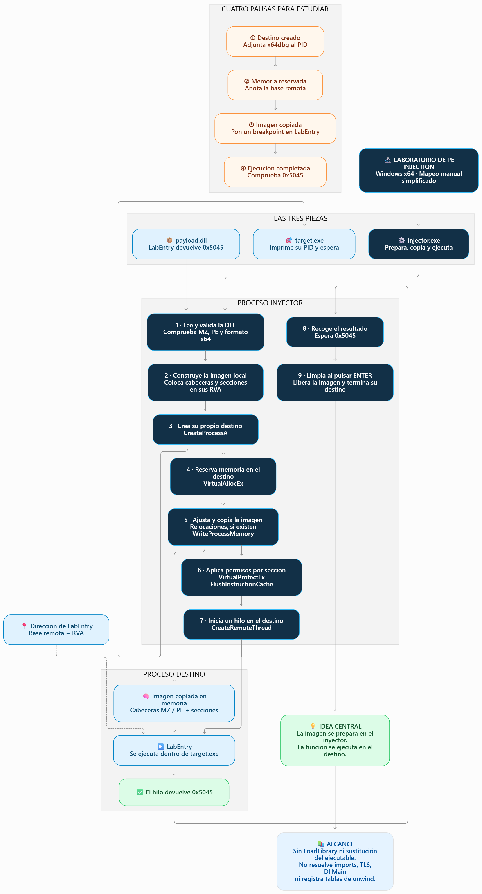

# Laboratorio mínimo de PE injection — Windows x64

Tres piezas: `injector.exe`, `target.exe` y `payload.dll`. El inyector crea su propio destino, construye la imagen en memoria, la copia al destino y ejecuta la función exportada `LabEntry`. Esta función únicamente devuelve `0x5045`. No acepta PID, rutas ni cargas externas como argumentos.

Este laboratorio tiene tres archivos:
- Entenderemos cómo se prepara payload.dll,
- cómo se copia a target.exe y
- cómo se ejecuta LabEntry.

Primero comprobaremos el resultado 0x5045; después lo observaremos con x64dbg.

## Compilar

En Windows instala Visual Studio Build Tools con **Desktop development with C++** y Windows SDK. Abre **x64 Native Tools Command Prompt for VS**, entra en esta carpeta y ejecuta:

```bat
build.cmd
out\injector.exe
```

No requiere privilegios de administrador. Conservaremos juntos los tres binarios de `out`. Se compila sin optimización y con símbolos PDB. La DLL no contiene CRT, imports, TLS ni DllMain. La ejecución de la DLL no abre ventanas ni conexiones.


----

## Diseccionar con x64dbg

1. Abre `out\injector.exe` en **x64dbg**, no x32dbg. Ejecuta hasta la primera    pausa de consola. Anota el PID del destino y adjunta **otra instancia** de x64dbg a ese PID. Reanuda el destino después de la pausa inicial del depurador.
2. En el inyector pon breakpoints en `VirtualAllocEx`, `WriteProcessMemory`, `VirtualProtectEx` y `CreateRemoteThread`. Usa los símbolos resueltos de KernelBase/Kernel32; algunas exportaciones son reenviadas. También puedes poner breakpoints en las llamadas correspondientes desde el desensamblado.
3. Pulsa ENTER en la consola del inyector. En `VirtualAllocEx`, observa el handle del hijo, `SizeOfImage` y `PAGE_READWRITE`. Al volver de la función, **RAX** contiene la base remota. La consola imprime esa base y la dirección exacta de `LabEntry`.
4. Continúa hasta la segunda pausa, pulsa ENTER y examina `WriteProcessMemory`. En la entrada: **RCX** = handle, **RDX** = base destino, **R8** = imagen local, **R9** = tamaño. Sigue R8 en Dump: debe comenzar con `MZ`. La imagen ya tiene
   las secciones en sus RVA, no en sus offsets originales del archivo.
5. Continúa hasta la tercera pausa. En el depurador del destino, ve a la base remota en Dump y comprueba `MZ`, `PE` y las secciones. Ve a la dirección impresa de `LabEntry` en Disassembler y coloca allí un breakpoint. No la confundas con `AddressOfEntryPoint`: la DLL usa `/NOENTRY`; se llama una exportación de forma explícita.
6. Pulsa ENTER. En `CreateRemoteThread`, **R9** es la dirección de inicio. Continúa el inyector y el destino hasta detenerte en `LabEntry`. Avanza instrucción a instrucción: verás preparar **EAX = 0x5045** y retornar.
7. Reanuda el destino. La consola del inyector debe mostrar `Resultado del hilo: 0x5045 (esperado: 0x5045)`. ENTER libera la imagen y termina únicamente el hijo creado por el laboratorio.

Las pausas de consola y las pausas de ambos depuradores son independientes: si parece bloqueado, comprueba cuál espera ENTER y cuál espera F9. La espera del hilo no tiene timeout para permitir una disección lenta.

## Qué demuestra y qué simplifica

Es una copia manual de una **imagen PE DLL** a otro proceso seguida de ejecución de una exportación. No sustituye la imagen principal del destino (hollowing) ni llama a LoadLibrary para cargar la DLL. La imagen no se registra en las listas
de módulos del cargador; búscala por su dirección en el mapa de memoria.

El inyector reserva memoria RW, escribe, aplica permisos por sección y vacía la caché de instrucciones antes de crear el hilo. Incluye el ajuste de relocaciones DIR64 si existen. El payload suministrado es independiente de su base: puede
no contener relocaciones, por lo que no debes esperar ver ajustes en esta versión.

**No es un cargador PE general.** No resuelve imports, inicializa TLS, invoca DllMain ni registra unwind tables. El pequeño payload no necesita esas operaciones. No lo sustituyas por un EXE/DLL cualquiera ni por código con excepciones o llamadas externas. El parser tiene comprobaciones de límites, pero está pensado para los archivos del laboratorio, no para procesar archivos hostiles como servicio.

## Validación y resultado esperado

En Windows: `build.cmd` debe finalizar sin errores; ejecuta el inyector, completa las cuatro pausas y comprueba el resultado `0x5045` y el código de salida 0 (`echo %ERRORLEVEL%`). Repite la ejecución: debe crear un destino nuevo sin dejar
el anterior abierto al terminar normalmente.

Este paquete se preparó en Linux. No se ha compilado con MSVC ni ejecutado en Windows/x64dbg aquí; esas comprobaciones quedan pendientes. No hay binarios Windows precompilados en el paquete.


------------------


Este laboratorio realiza un mapeo manual simplificado de una `DLL PE` en un proceso que el propio inyector crea, y ejecuta una función de esa `DLL` mediante un hilo remoto.

**Qué hace cada programa:**
- `target.exe` imprime su PID y permanece esperando mediante Sleep(INFINITE). Es el proceso donde estudiaremos la inyección.
- `payload.dll` exporta la función `LabEntry`, que únicamente devuelve `0x5045`. No muestra mensajes, abre ventanas ni realiza conexiones.
- `injector.exe` prepara la `DLL` en memoria, la copia al destino y ejecuta `LabEntry` allí.


No necesitamoss abrir `target.exe` antes ni proporcionar un `PID`. Ejecutaremos `injector.exe` sin argumentos, con los tres binarios en la misma carpeta: esto crea su propio destino y lo termina al finalizar.

**Cómo funciona injector.exe:**
| Fase | Qué hace | Qué permite estudiar |
|---|---|---|
| Leer y validar | Lee `payload.dll` y comprueba las firmas `MZ`, `PE` y el formato x64. Rechaza imports y TLS. | La estructura de un archivo PE. |
| Construir la imagen | Reserva un búfer local de `SizeOfImage`, copia las cabeceras y coloca cada sección en su dirección relativa, o RVA. | La diferencia entre el archivo en disco y su distribución en memoria. |
| Buscar la función | Examina la tabla de exportaciones para localizar `LabEntry`. | Cómo una exportación identifica una función dentro de la imagen. |
| Crear el destino | Llama a `CreateProcessA` para iniciar `target.exe`. | La separación entre los dos procesos. |
| Reservar memoria | Usa `VirtualAllocEx` para reservar memoria de lectura y escritura dentro del destino. | Qué significa reservar memoria en otro proceso. |
| Ajustar y copiar | Aplica relocaciones `DIR64` si existen y copia la imagen con `WriteProcessMemory`. | Cómo se coloca el PE en una base distinta de la preferida. |
| Aplicar permisos | Usa `VirtualProtectEx` y vacía la caché de instrucciones. | La transición desde memoria escrita a código ejecutable. |
| Ejecutar | Crea un hilo con `CreateRemoteThread`, cuya dirección inicial es `LabEntry`. | La ejecución del payload dentro del destino. |
| Comprobar y limpiar | Lee el resultado del hilo, libera la memoria y termina el destino. | La verificación y el ciclo completo del laboratorio. |

La relación central es:
```
Dirección remota de LabEntry = base remota de la imagen + RVA de LabEntry
```
Una `RVA` es un desplazamiento respecto al comienzo de la imagen. No es necesariamente el desplazamiento de esos mismos bytes dentro del archivo en disco.


------

## Primera práctica: las cuatro pausas

Abrimos una consola en out y ejecutamos:
```
injector.exe
```
Avanzamos con ENTER, leyendo cada pausa:
1. Destino creado: anotamos los PID del inyector y del destino. Todavía no se ha reservado la memoria del payload.
2. Memoria reservada: anotamos la base remota y la dirección de LabEntry. La imagen aún no se ha copiado.
3. Imagen copiada: el destino contiene las cabeceras y secciones del payload, con sus permisos aplicados. Todavía no se ha ejecutado LabEntry.
4. Ejecución completada: debe aparecer:
   ```
   Resultado del hilo: 0x5045 (esperado: 0x5045).
   ```
   El último ENTER libera la imagen y termina el destino.

   Después podemos comprobar el código de salida:
   ```
   echo %ERRORLEVEL%
   ```
   El resultado esperado es 0. La ausencia de una ventana o mensaje del payload es normal: su única acción observable es devolver ese valor.

----


## Segunda práctica: observarlo con x64dbg
1. Abre injector.exe en x64dbg y ejecútalo hasta la primera pausa de consola.
2. Abre otra instancia de x64dbg y adjúntala al PID del destino que imprime el inyector. Reanuda el destino después de la pausa inicial del depurador.
3. En el inyector, coloca breakpoints en VirtualAllocEx, WriteProcessMemory, VirtualProtectEx y CreateRemoteThread. Algunas exportaciones están reenviadas entre Kernel32 y KernelBase; también puedes detenerte en las llamadas del propio inyector.
4. Avanza hasta la tercera pausa. En el depurador del destino, examina la base remota en Dump: encontrarás las cabeceras MZ y PE.
5. Ve a la dirección impresa de LabEntry remota en el desensamblador y coloca allí un breakpoint.
6. Pulsa ENTER en la consola del inyector y continúa ambos depuradores. El nuevo hilo del destino debe detenerse en LabEntry.
7. Avanza por las instrucciones: observarás que se prepara el valor 0x5045 en EAX y se retorna. Reanuda el destino para que el inyector pueda recoger el resultado.
Las pausas de consola y del depurador son independientes. Si parece detenido, comprueba si espera ENTER en la consola o F9 en alguno de los depuradores. El inyector espera al hilo sin límite de tiempo para permitir esta inspección.


----------

## Qué demuestra esta inyección PE
Los bytes se preparan en el inyector, pero LabEntry se ejecuta en el proceso destino. Ese cambio de contexto es lo que debes comprobar con los dos depuradores.
Este ejemplo no llama a LoadLibrary ni sustituye el ejecutable principal del destino. La DLL tampoco se registra en las listas normales del cargador: búscala por la dirección impresa en el mapa de memoria.
Es un cargador deliberadamente limitado: no resuelve imports, inicializa TLS, llama a DllMain ni registra tablas para el manejo de excepciones x64. build.cmd prepara el pequeño payload con /NOENTRY y sin bibliotecas predeterminadas para que pueda funcionar bajo esas condiciones. Además, puede no contener relocaciones; que no observes ajustes es coherente con este payload.
He verificado esto leyendo el código; no he ejecutado tus binarios en Windows. La comprobación práctica será detenerte en LabEntry dentro del destino y obtener 0x5045 en la consola del inyector.

-----

## Flujo



