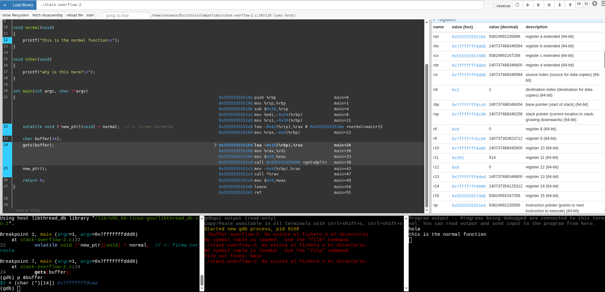
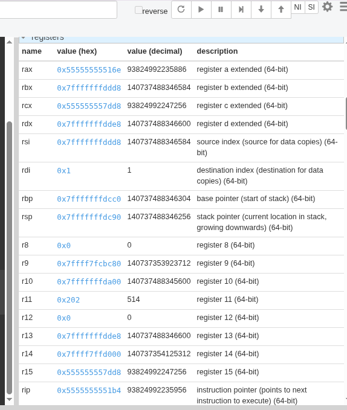

# Buffer-Overflow-2
```
#include <stdlib.h>
#include <stdio.h>

void special(void)
{
    printf("this is the special function\n");
    printf("you did this, friend!\n");
}

void normal(void)
{
    printf("this is the normal function\n");
}

void other(void)
{
    printf("why is this here?\n");
}

int main(int argc, char **argv)
{
    volatile void (*new_ptr)(void) = normal;  // <- firma correcta
    char buffer[14];
    gets(buffer);
    new_ptr();
    return 0;
}

```
donde:
- `volatile`: Indica al compilador que no optimice la variable `new_ptr`, asegurando que el desbordamiento funcione como se espera en entornos educativos. Este programa es un ejemplo clásico de una vulnerabilidad de desbordamiento de búfer (buffer overflow). Está diseñado para demostrar cómo un atacante puede alterar el flujo de ejecución de un programa para ejecutar código que, en teoría, no debería ejecutarse.

## Explicación paso a paso lo que sucede
**- El flujo esperado:** En condiciones normales, el programa hace lo siguiente:
- Declara un puntero a una función llamado `new_ptr` y lo apunta a la función `normal`.
- Reserva un espacio en memoria (un array) llamado `buffer` con capacidad para 14 caracteres.
- Usa la función `gets(buffer)` para recibir una entrada del usuario.
- Llama a la función a la que apunta `new_ptr`, que debería ser `normal`.

**- El fallo de seguridad:** `gets()`: El problema crítico es el uso de la función `gets()` que es extremadamente peligrosa porque no verifica cuántos datos introduce el usuario. Si escribimos más de 14 caracteres, `gets()` seguirá escribiendo en la memoria, invadiendo el espacio de otras variables.

**- ¿Qué haría un atacante?**
- Si un usuario conoce la dirección de memoria de la función `special()`, puede enviar una cadena de texto larga que termine con esa dirección específica.
- El programa llena el `buffer`.
- El exceso de datos cambia el valor de `new_ptr` de `normal` a `special`.
- Al final, el programa ejecuta `new_ptr()`, pero en lugar de imprimir `this is the normal function`, ejecutará special() y dirá: `you did this, friend!`.


donde:

**Cuando main se ejecuta, reserva espacio para sus variables locales. El orden suele ser de direcciones altas a bajas:**
- `Return Address` (EIP/RIP): La dirección a la que el programa vuelve cuando termina main.
- `Saved EBP`: El puntero del marco de la pila anterior.
- `new_ptr` (4 u 8 bytes): Esta variable local está en el stack junto al buffer.
- `buffer` (14 bytes): El espacio para tus caracteres.

En un Stack Overflow tradicional, el objetivo suele ser sobrescribir la Return Address para tomar el control cuando la función termina (return 0). Sin embargo, en este programa, el desbordamiento está diseñado para algo más inmediato:
- El objetivo principal es: Sobrescribir la variable `new_ptr`.
- Por qué: Porque el programa llama a `new_ptr()` antes de llegar al final del main.
- Si llenamoss los 14 bytes del `buffer` y seguimos escribiendo, lo primero que aplastaremos será el valor de `new_ptr`. Si ponemos ahí la dirección de `special`, el programa saltará a ella en la última línea (`new_ptr();`) sin ni siquiera haber intentado salir de la función main.






donde:
- `RIP (Instruction Pointer)`: Está en `0x5555555551b4`, justo en la instrucción `lea -0x16(%rbp)`, `%rax` antes de llamar a `gets`.
- `RBP (Base Pointer)`: El registro `RBP` tiene el valor `0x7fffffffdfcc0`.
- Ubicación de las variables en el Stack: En el desensamblado podemos ver cómo el compilador organizó la memoria:
    - `buffer`: La instrucción `lea -0x16(%rbp)`, `%rax` indica que el `buffer` comienza en `RBP - 22 bytes` (0x16 en hexadecimal es 22).
    - `new_ptr`: Un poco más abajo (en la línea 25 del código), la instrucción `mov -0x8(%rbp)`, `%rax` seguida de `call %rax `nos da la clave. El puntero `new_ptr` está almacenado en `RBP - 8`.
 
El Mapa de Memoria (x64). Calculando con las direcciones de la captura:
| Elemento | Cálculo | Dirección Exacta (Hex) |
| -- | -- | -- |
| RBP (Base) | Referencia | 0x7fffffffdfcc0 |
| new_ptr | RBP - 0x8 | 0x7fffffffdfcb8 |
| buffer[14] | RBP - 0x16 | 0x7fffffffdfcaa |
