# Código del programa
```c
#include <stdio.h>

void call_me() {
    printf("You cannot call me, noob!\n");
}

void try_to_call_me() {
    char input[120];
    printf("Call ");
    gets(input);
    printf("Maybe...\n");
}

int main(int argc, char** argv) {
    try_to_call_me();
    return 0;
}
```

donde:
- Entra a try_to_call_me().
- Muestra Call , lee una línea con gets(input) y luego imprime Maybe....
- Termina.
- La función call_me() no se llama en el flujo normal.

Lo interesante es que usa la función `gets`, que es insegura ya que no comprueba el tamaño del buffer ➔ `input[120]`. Con una entrada suficientemente larga, se puede provocar un desbordamiento de pila y sobrescribir la dirección de retorno para desviar la ejecución hacia la función `call_me()` (que en esta aplicación nunca se ejecutaría) o a cualquier otra parte. Este es el típico ejercicio para demostrar cómo explotar un buffer overflow.


----------------------------------------

# Análisis con IDA 
## La función main
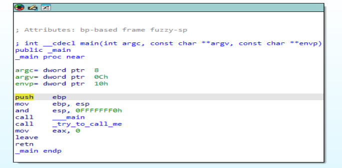

### La firma de la función main: `int __cdecl main(int argc, const char **argv, const char **envp)`:
- `argc` (tipo `int`): número de argumentos posicionales pasados al programa desde la línea de comandos. Incluye el nombre del programa.
- `argv` (tipo `char **` o `const char **`): puntero a un array de cadenas C (array de `char *`).
    - `argv[0]` normalmente es el nombre (o ruta) del ejecutable.
    - `argv[1]` es el primer argumento, etc.
    - El array está terminado con `argv[argc] == NULL`.
- `envp` (tipo `char **` o `const char **`): puntero a un array de cadenas que representan las variables de entorno.

### Prólogo/stack frame
``` 
push ebp
mov  ebp, esp
and  esp, 0FFFFFFF0h
```

#### 1. Crea un `frame pointer` estable para acceder a parámetros/locales por offsets constantes.
Convención típica al entrar en una función:
```
push ebp
mov  ebp, esp
```
donde:
- `push ebp`
    - Guarda el valor del registro EBP.
    - Reserva el frame pointer del contexto anterior para poder restaurarlo al salir de la función.
    - EBP ➞ Extended Base Pointer: Registro del procesador que contiene un puntero de base de pila.
    - EBP se usa para tener una referencia fija dentro del stack frame de una función.
    - Ahora EBP apunta al inicio del frame y desde ahí se accede a parámetros y variables locales:
        - [ebp+8] → primer argumento de la función.
        - [ebp-4] → una variable local.

- `mov ebp, esp`
    - Establece el nuevo frame pointer de la función: `EBP <- ESP`.
    - Con esto fijamos un punto de referencia estable (`EBP`) para la función actual. Desde ahí se calculan offsets a
        -  Parámetros (`[ebp+8]`...)
        -  Y a las variables locales (`[ebp - N]`).
    -  `ESP` (Extended Stack Pointer):
        - Puntero de pila, indica la cima de la pila.
        - Cada vez que hacemos un push, ESP disminuye; con un pop, ESP aumenta.
        - La pila en x86 crece hacia abajo (direcciones decrecientes).
        - Fundamental en llamadas a funciones porque almacena parámetros, direcciones de retorno y variables locales.
    - Antes de la instrucción mov, `ESP` apuntaba al saved `EBP` que acabamos de pushear. Después, EBP apunta a esa misma dirección (la palabra donde está guardado el antiguo EBP).


[Esquema visual de cómo se organiza un stack frame típico en x86 usando EBP, ESP y EIP](https://github.com/soniasalido/cybersecurity/blob/main/Documentation/Assembly/02-memory-registers.md#esquema-visual-de-c%C3%B3mo-se-organiza-un-stack-frame-t%C3%ADpico-en-x86-usando-ebp-esp-y-eip)


#### 2. Alinea ESP a 16 bytes:
```
and esp, 0FFFFFFF0h
```
Aplica una máscara bit a bit: ESP = ESP & 0xFFFFFFF0. Lo que hace es redondear ESP hacia abajo al múltiplo de 16 (alineación a 16 bytes). Por convención, se recomienda que la pila esté alineada a 16 bytes en el momento de hacer call.


### Anota los parámetros que podrían llegar:
```
argc = [ebp+8]
argv = [ebp+0Ch]
envp = [ebp+10h]
```
Estos argumentos No se usan.

### Runtime init de GCC:
```
call __main
```
Stub del runtime (inicializa constructores estáticos, etc.).


### Lógica real del programa:
```
call _try_to_call_me
mov  eax, 0
```
donde:
- Llama a `try_to_call_me()`.
- Carga 0 en `EAX` como valor de retorno de main.

`EAX` (Extended Accumulator Register) ➞
- Es el acumulador principal.
- Se usa mucho en operaciones aritméticas y de retorno de funciones.
- Por convención, cuando una función devuelve un valor, suele estar en EAX.
- Ejemplo: después de un add eax, ebx, el resultado queda en EAX.


### Epílogo (cómo se revierte al salir):
```
leave
retn
```
donde:
- `leave` restaura `ESP` desde `EBP` (deshaciendo la reserva de la pila) y `pop ebp` restaura el `saved EBP` del llamador.
- Después `ret` lee la `return address` de la pila y salta a ella.


-----------------------------------

## La función try_to_call_me
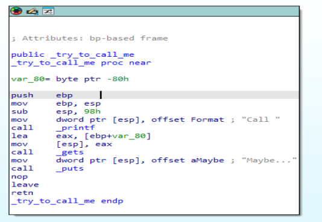

```
push ebp
mov  ebp, esp
sub  esp, 98h                       ; reserva espacio en la pila para variables locales
mov  dword ptr [esp], offset Format ; "Call "
call _printf

lea  eax, [ebp-80h]                 ; dirección del buffer local
mov  dword ptr [esp], eax
call _gets                          ; gets(buffer)

mov  dword ptr [esp], offset aMaybe ; Imprime en pantalla "Maybe..."
call _puts

leave
retn
```

### Donde
- `push ebp` y `mov ebp, esp` ➞ prologo habitual: guarda el frame anterior y marca el nuevo ebp.
- `sub esp, 98h` ➞ reserva 0x98 (152) bytes en la pila para variables locales / alineación.
- `mov [esp], offset Format y call _printf` ➞ prepara el argumento (puntero al string "Call ") en la cima de la pila y llama a printf. El compilador usa mov [esp], ... en lugar de push (una forma de pasar argumentos cuando ya se ha hecho la reserva).
- `lea eax, [ebp-80h]` ➞ obtiene la dirección de la variable local que IDA llama var_80. Es decir, el buffer empieza en ebp - 0x80.
- `mov [esp], eax` y `call _gets` ➞ pasa la dirección del buffer a gets. <mark>Importante: gets no comprueba tamaños</mark>, por eso es insegura.
- Luego prepara el string "Maybe..." y llama a `puts`, termina la función.

Se usa la función insegura `gets` para escribir por pantalla un mensaje que se almacena en la variable local `var_80`. Esta variable tiene un espacio reservado de 0x80 que son 128 bytes en decimal. ¿Porqué 128 bytes si en el código de main se han reservado sólo 120? Porque el compilador ha decidido reservar 8 bytes más para mantener el alineamiento de la pila a 16 bytes (0x10). Esto quiere decir que <mark>como mínimo, necesitaremos escribir 128 bytes para poder comenzar a sobreescribir información en la pila.</mark>


### Layout de pila (conceptual)
```css
[ dirección más alta ]
... (stack del llamador)
ret address  <-- [ebp + 4]
saved EBP    <-- [ebp]
local buffer (comienza en [ebp - 0x80])  <-- espacio reservado para vars
[ direcciones más bajas ]
```
donde:
- El buffer comienza en ebp - 0x80 (IDA lo marca como var_80).
- La función reservó 0x98 bytes totales; el buffer ocupa parte de ese espacio (el compilador puede añadir padding por alineación).
- gets escribe datos a partir de la dirección ebp - 0x80 sin límite.


### ¿Dónde está la vulnerabilidad?
Porque gets(buffer) puede leer más bytes de los que el buffer puede almacenar y, por tanto, sobrescribir la memoria adyacente dentro del frame: primero sobreescribe el contenido del buffer, luego el saved EBP, y después la dirección de retorno (la que está encima de saved EBP). Si un atacante controla la entrada, puede cambiar la dirección de retorno para desviar la ejecución cuando la función termine.
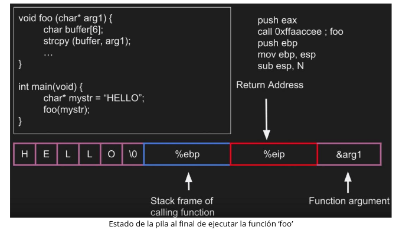

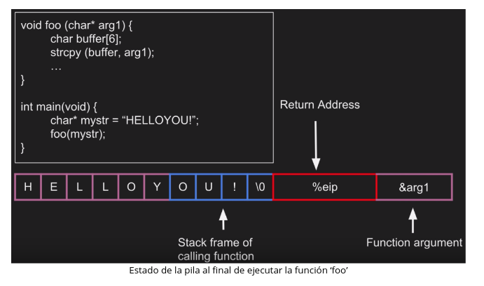


### Consecuencias
En ejecución normal no ocurre nada extraño: imprime "Call ", lee la entrada y luego "Maybe...".

Con una entrada suficientemente larga, es posible corromper el saved EBP y la dirección de retorno y así redirigir la ejecución (por ejemplo, saltar a call_me() o a otro sitio). Ese es el comportamiento típico que se estudia en ejercicios de buffer overflow.


### Diagrama con offsets. Dirección inicial del buffer ([ebp - 0x80]) que muestra IDA.
```
Alto (direcciones mayores)
+---------------------------+  <-- (ebp + 8) ...
|  (argumentos del llamador)|
+---------------------------+
| return address  ← ebp+4   |  ← offset desde buffer_start = 0x84 (132)
+---------------------------+
| saved EBP       ← ebp     |  ← offset desde buffer_start = 0x80 (128)
+---------------------------+
|  (padding / otros)        |
|  ...                      |
|  buffer (input) starts →  |  ← ebp - 0x80   (offset 0x00)
|  [ebp - 0x80] (byte 0)    |
|  [ebp - 0x7F] (byte 1)    |
|      ...                  |
|  [ebp - 0x01] (byte 0x7F) |
+---------------------------+  <-- (direcciones más bajas)
Bajo (direcciones menores)
```
**donde:**
- Dirección base del buffer (LEA): ebp - 0x80 → offset 0x00 desde el comienzo del buffer.
- Saved EBP (saved frame pointer) está en ebp → offset 0x80 (hex) = 128 (dec) bytes desde el inicio del buffer.
- Return address está en ebp + 4 → offset 0x84 (hex) = 132 (dec) bytes desde el inicio del buffer.

**Para sobrescribir por completo los 4 bytes de la dirección de retorno necesitamos** que la entrada escrita alcance hasta offset 0x84..0x87. Eso significa que el tamaño total mínimo de entrada para sobreescribir completamente la return address es:
- 0x84 (bytes hasta el inicio de la return addr) + 4 (bytes de la return addr) = 0x88 (hex) = 136 (dec) bytes.

**En práctica de explotación típica se usan:**
- padding = 128 bytes → relleno para alcanzar saved EBP
- 4 bytes → sobrescriben saved EBP (pueden ser basura o un valor controlado)
- 4 bytes → sobrescriben return address (valor que se quiere poner)

### Mapa de memoria organizado por palabras de 4 bytes (word) relativo al inicio del buffer en ebp - 0x80
| word | offset (hex) | offset (dec) | contenido / descripción                                                |
| ---: | :----------: | :----------: | :--------------------------------------------------------------------- |
|    0 |     0x00     |       0      | buffer[0..3]  (primeros 4 bytes del buffer)                            |
|    1 |     0x04     |       4      | buffer[4..7]                                                           |
|    2 |     0x08     |       8      | buffer[8..11]                                                          |
|    3 |     0x0C     |      12      | buffer[12..15]                                                         |
|    4 |     0x10     |      16      | buffer[16..19]                                                         |
|    5 |     0x14     |      20      | buffer[20..23]                                                         |
|    6 |     0x18     |      24      | buffer[24..27]                                                         |
|    7 |     0x1C     |      28      | buffer[28..31]                                                         |
|    8 |     0x20     |      32      | buffer[32..35]                                                         |
|    9 |     0x24     |      36      | buffer[36..39]                                                         |
|   10 |     0x28     |      40      | buffer[40..43]                                                         |
|   11 |     0x2C     |      44      | buffer[44..47]                                                         |
|   12 |     0x30     |      48      | buffer[48..51]                                                         |
|   13 |     0x34     |      52      | buffer[52..55]                                                         |
|   14 |     0x38     |      56      | buffer[56..59]                                                         |
|   15 |     0x3C     |      60      | buffer[60..63]                                                         |
|   16 |     0x40     |      64      | buffer[64..67]                                                         |
|   17 |     0x44     |      68      | buffer[68..71]                                                         |
|   18 |     0x48     |      72      | buffer[72..75]                                                         |
|   19 |     0x4C     |      76      | buffer[76..79]                                                         |
|   20 |     0x50     |      80      | buffer[80..83]                                                         |
|   21 |     0x54     |      84      | buffer[84..87]                                                         |
|   22 |     0x58     |      88      | buffer[88..91]                                                         |
|   23 |     0x5C     |      92      | buffer[92..95]                                                         |
|   24 |     0x60     |      96      | buffer[96..99]                                                         |
|   25 |     0x64     |      100     | buffer[100..103]                                                       |
|   26 |     0x68     |      104     | buffer[104..107]                                                       |
|   27 |     0x6C     |      108     | buffer[108..111]                                                       |
|   28 |     0x70     |      112     | buffer[112..115]                                                       |
|   29 |     0x74     |      116     | buffer[116..119]                                                       |
|   30 |     0x78     |      120     | buffer[120..123]                                                       |
|   31 |     0x7C     |      124     | buffer[124..127]                                                       |
|   32 |     0x80     |      128     | **saved EBP** (4 bytes) — valor de EBP guardado por la función         |
|   33 |     0x84     |      132     | **return address** (4 bytes) — dirección a la que volverá la ejecución |


```sql
Direcciones más altas
+---------------------------------+  <-- (llamador) stack / args...
|  (argumentos del llamador ...)  |
+---------------------------------+
| return address  <-- [ebp + 4]   |  offset desde buffer_start = 0x84 (word 33)
+---------------------------------+
| saved EBP       <-- [ebp]       |  offset desde buffer_start = 0x80 (word 32)
+---------------------------------+
| buffer[124..127]  (word31)      |  offset 0x7C
+---------------------------------+
| ...                             |
+---------------------------------+
| buffer[0..3]      (word0)       |  offset 0x00
+---------------------------------+  <-- (ebp - 0x80) = inicio del buffer
Direcciones más bajas
```

--------------------------

# Análisis con x32dbg

## La función main
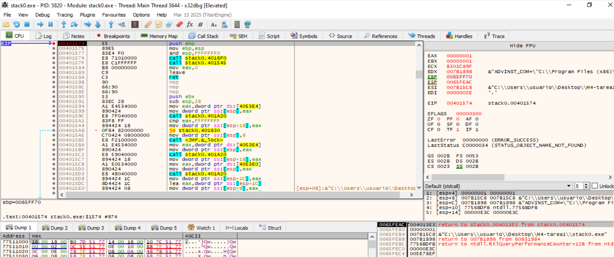

### Registros
| Registro   | Valor        | Comentario                                                                                                                                |
| ---------- | ------------ | ----------------------------------------------------------------------------------------------------------------------------------------- |
| **EBP**    | **0065FF70** | Frame pointer del *caller* (función que llamó a `main`). Este será **pusheado** al stack al ejecutar la siguiente instrucción `push ebp`. |
| **ESP**    | **0065FEAC** | Stack pointer actual, apunta a la parte superior de la pila.                                                                              |
| **EIP**    | **00401574** | Dirección de la instrucción actual (`push ebp`).                                                                                          |
| **EFLAGS** | `00000300`   | Estado normal (ningún flag de error).                                                                                                     |


### `push ebp`
- Guarda el valor 0065FF70 (el viejo EBP) en la pila.
- Decrementa ESP en 4 bytes → anterior ESP = 0065FEAC → nuevo ESP = 0065FEA8.
- En la dirección [0065FEA8] ahora queda el valor 0065FF70.


### `mov ebp, esp`
- Copia el valor actual de ESP (0065FEA8) a EBP.
- Ahora EBP = 0065FEA8.
- Esto marca el nuevo frame pointer de la función main.
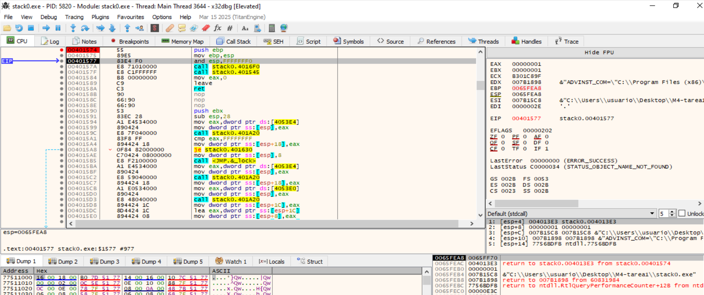

### `and esp, 0FFFFFFF0h`
- Aplica la máscara binaria a ESP → redondea hacia abajo a múltiplo de 16.
- Si ESP = 0065FEA8, el resultado es 0065FEA0.
- El propósito es alinear la pila a 16 bytes, requisito del ABI (como te expliqué antes).
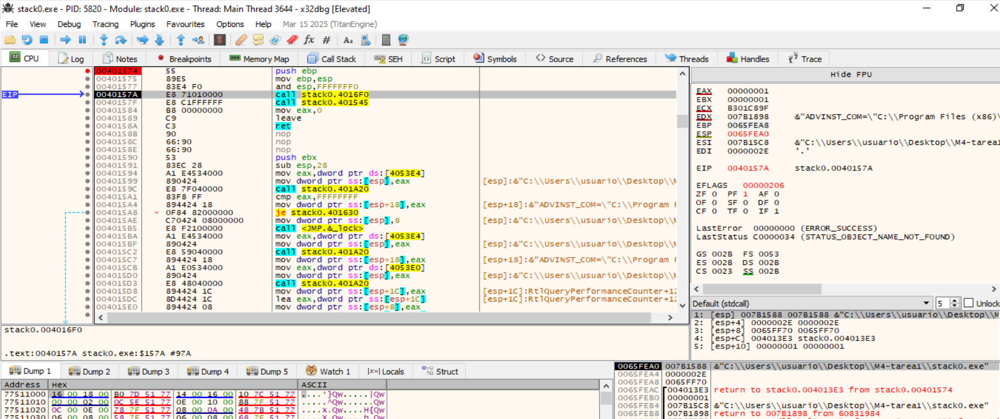


### Resultado
```
EBP = 0065FEA8  (estable)
ESP = 0065FEA0  (ajustado, alineado)
```
Ahora la pila está lista para reservar espacio local o hacer llamadas (call).

### Runtime init de GCC:
```
call stack0.416F0
```

Stub del runtime (inicializa constructores estáticos, etc.). Inicializador del entorno en compilaciones de GCC/MinGW.


## La función try_to_call_me
Llamada a la función try_to_call_me:  


La función try_to_call_me:  
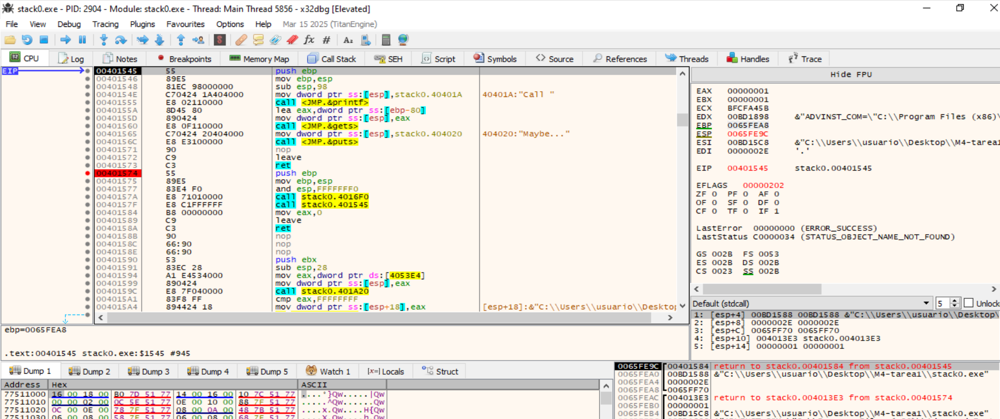

### Instrucciones del prólogo y su propósito
| Dirección       | Instrucción                           | Explicación                                                                       |
| --------------- | ------------------------------------- | --------------------------------------------------------------------------------- |
| **00401545**    | `push ebp`                            | Guarda el `EBP` del llamador en la pila (crea espacio para el *stack frame*).     |
| **00401546**    | `mov ebp, esp`                        | Establece el nuevo frame pointer para esta función (`EBP` = `ESP`).               |
| **00401548**    | `sub esp, 98h`                        | Reserva **0x98 bytes (152)** en la pila para variables locales.                   |
| **0040154B**    | `mov dword ptr [esp], offset "Call "` | Prepara el argumento para `printf("Call ")`.                                      |
| **00401552**    | `call printf`                         | Imprime la cadena `"Call "`.                                                      |
| **00401557**    | `lea eax, [ebp-80h]`                  | Calcula la dirección de un buffer local (`input`). Empieza en `EBP - 0x80`.       |
| **0040155A**    | `mov [esp], eax`                      | Coloca la dirección del buffer como argumento para `gets()`.                      |
| **0040155D**    | `call gets`                           | Llama a `gets(input)` → **función vulnerable**, no controla el tamaño del buffer. |
| **00401562**    | `mov [esp], offset "Maybe..."`        | Prepara el argumento `"Maybe..."` para `puts()`.                                  |
| **00401569**    | `call puts`                           | Imprime `"Maybe..."`.                                                             |
| **0040156E–70** | `nop`, `leave`, `ret`                 | Limpieza de la pila y retorno al llamador (`main`).                               |


### Registros
| Registro            | Valor                                                          | Significado                                                          |
| ------------------- | -------------------------------------------------------------- | -------------------------------------------------------------------- |
| **EIP**             | `00401545`                                                     | Apunta al inicio de `try_to_call_me()` (`push ebp`).                 |
| **EBP**             | `0065FEA8`                                                     | Frame pointer del *caller* (`main`). Será guardado en la pila ahora. |
| **ESP**             | `0065FE9C`                                                     | Top of stack actual. Al hacer `push ebp`, bajará 4 bytes.            |


### `push ebp`
- Guarda EBP (0065FEA8) en la pila.
- Decrementa ESP en 4 bytes → anterior ESP = 0065FE9C → nuevo ESP = 0065FE98.
- En la dirección [0065FE98] ahora queda el valor 0065FEA8.
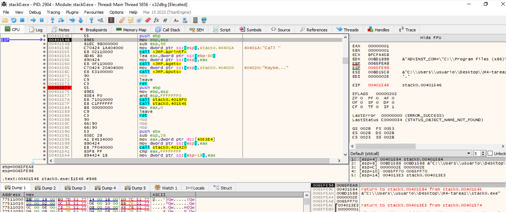

### `mov ebp, esp`
- Copia el valor actual de ESP (0065FE98) a EBP.
- Ahora EBP = 0065FE98.
- Esto marca el nuevo frame pointer de la función main.
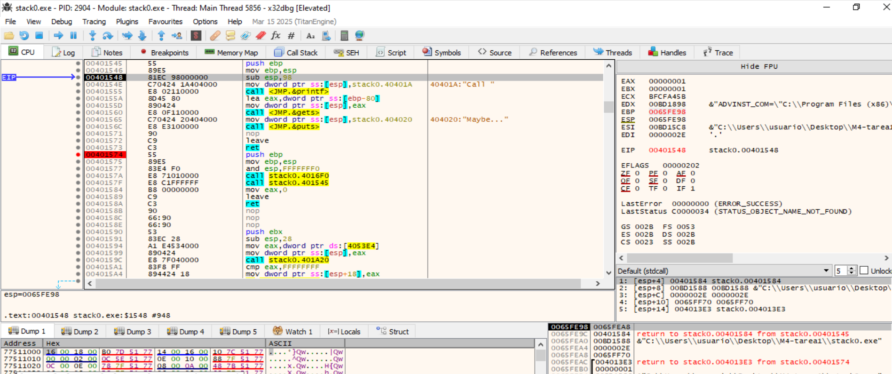


### `sub esp, 98`
- Resta 0x98 → nuevo ESP = 0065FE00 (aprox).
- Espacio reservado para el buffer y padding.
- EBP = 0x0065FE98
- ESP = 0x0065FE00 ← valor tras sub esp, 0x98 (es decir, espacio reservado ya efectuado)
- Observación: la diferencia EBP - ESP = 0x98
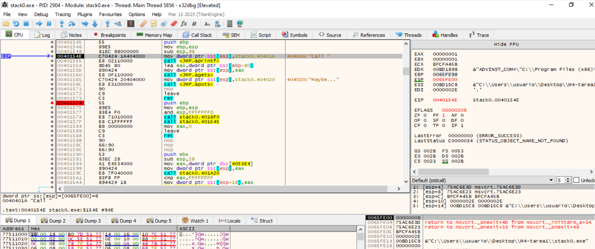


### `mov dword ptr [esp], offset "Call "`
- Prepara el argumento para printf("Call ").
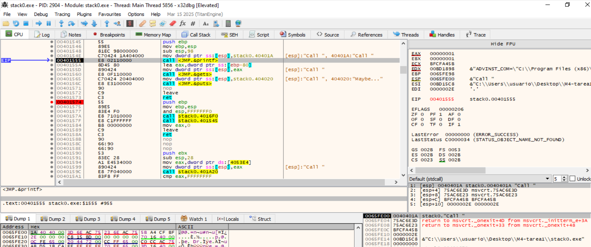

- La instrucción anterior hizo `mov dword ptr [esp], 0x0040401A` ➞ se ha cargado en `[esp]` el puntero a la cadena `"Call "` (`dirección 0x0040401A`).
- En la vista de Stack ➞ `[esp] 0040401A stack0.0040401A "Call "` ➞ confirma que el argumento para printf está correctamente en `[esp]`.
- En el Dump se ve memoria alrededor de la dirección `0x0065FE00` (`ESP` actual) el contenido ASCII como "Call ".

En este offset de la pila: `0x0065FE00` NO está la cadena "Call " en sí, está el puntero hacia la cadena. El código hace:
```
mov dword ptr [esp], 0040401A  ; escribe en la pila la **DIRECCIÓN** de la cadena "Call "
call printf
```

En memoria, ese puntero se almacena en little-endian como `bytes 1A 40 40 00`. Eso es exactamente lo que aparece en el Dump en `0x0065FE00`. <mark>Esos bytes representan la dirección `0x0040401A`, no los caracteres `C a l l `</mark>.


Para ver la cadena "Call " ➞ Sobre la dirección `0x0065FE00` hacemos click con el boton derecho ➞ `Follow DWORD in Dump` ➞ `Dump2`


### `call printf`
Tras finalizar la función print, vemos que se se muestra en la consola esa cadena `"Call "`:
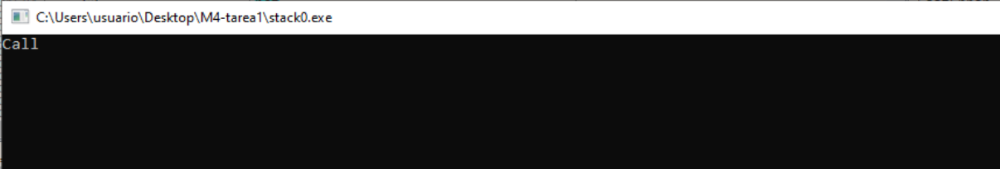


### `lea eax, [ebp-80h]`
- `LEA` = Load Effective Address. No carga contenido de memoria: calcula una dirección y la guarda en el registro destino.
- `lea eax, [ebp-80h]` pone en `EAX` la dirección `EBP - 0x80`. Esa dirección es el inicio del buffer local (`input`) que el compilador reservó en el stack.
- Esta instrucción, calcula la dirección del `buffer local` y la coloca en un registro para pasarla luego a `gets`.
- EBP = 0x0065FE98
- EAX ← EBP - 0x80
- EAX ← 0x0065FE98 - 0x80 = 0x0065FE18 (dirección física del buffer).
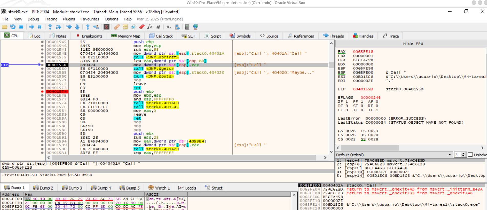


### `mov dword ptr [esp], eax`
- Coloca la dirección del buffer en `[esp]` ➡ `0x0065FE18`.
- Pone en la cima de la pila el puntero al buffer (argumento para gets).
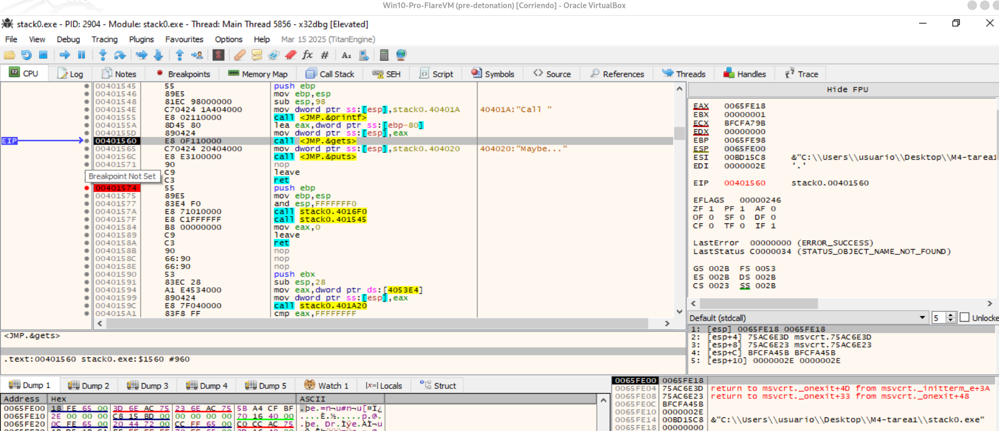


Vemos en la línea `[ESP]` el dword con la dirección `0x0065FE18`. Hacemos doble clic en ese dword en la Stack y eligimos `Follow in Dump` ➞ nos llevará al inicio del buffer (0x0065FE18) en la Dump. Ahí veremos bytes escritos por gets cuando introduzcamos la entrada.


### `call gets`
- Saltará a la función gets, que leerá bytes desde stdin y los escribirá en la dirección indicada por EAX, es decir en 0x0065FE18.
- Ponemos un breakpoint en la instrucción después de `call gets` y ejecutamos hasta `gets`. Cuando gets espere, vamos a la terminal y escribimos algo (`hello world!`). Cuando el breakpoint salte podremos inspeccionar en Dump cómo quedó la memoria.
- Después de `mov [esp], eax` en la dirección `ESP` veremos los bytes little-endian de EAX. Ej.: EAX = 0x0065FE18 se verá como 18 FE 65 00 en memoria.
- El contenido real del buffer (los caracteres que gets escribe) aparecerá a partir de 0x0065FE18 en la Dump, columna ASCII mostrará el texto legible.
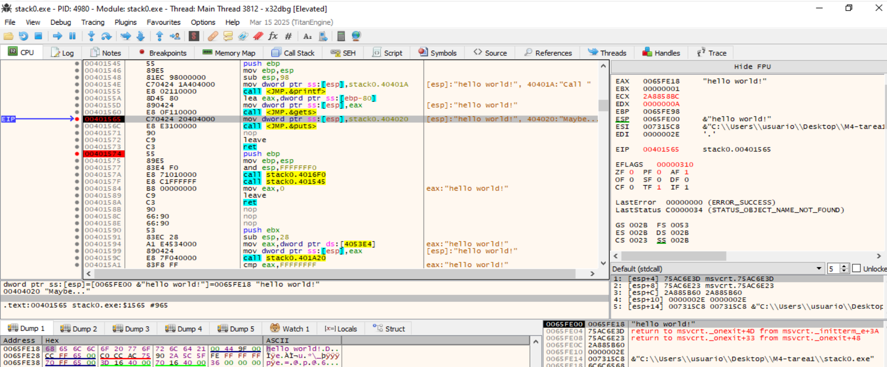


### xxxxx


----------------------------------------------------
## Vamos a exceder el buffer de 128Bytes
En este punto vamos a escribir repetidamente `hello world!" para exceder el buffer y provocar el desbordamiento del stack.
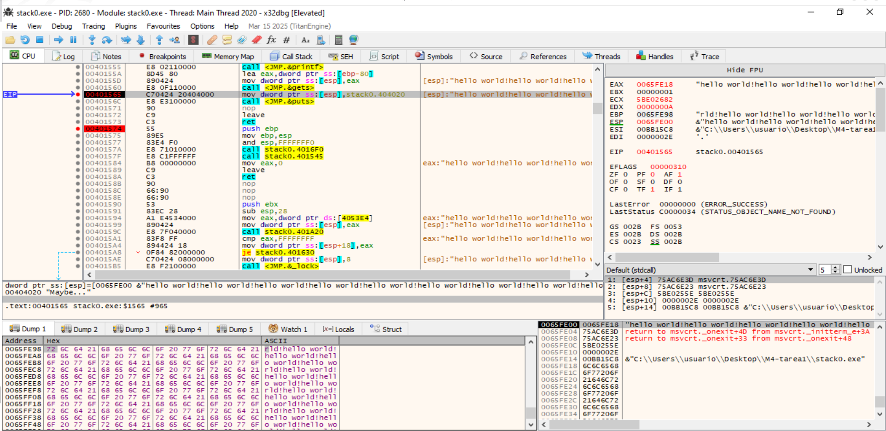

**Vemos que se ha sobrescrito `[EBP]` y `[EBP+4]`:**
- Dump → Ctrl+G → escribimos EBP → Enter.
    - Veremos en esa dirección (`[EBP]`) bytes/ASCII del texto escrito → saved EBP sobrescrito.
    
- Dump → Ctrl+G → escribe EBP+4 → Enter.
    - Veremos nuestro texto aquí → return address sobrescrita.
    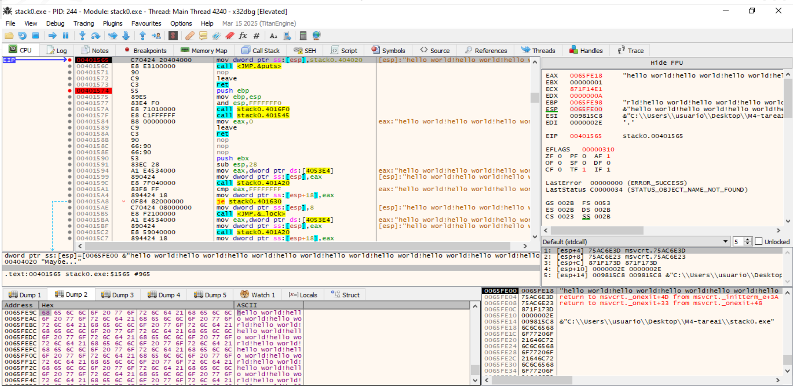


----------------------------------------------------
## Vamos a cambiar el orden de ejecución
En la captura 0x00401530 es el inicio de la función call_me. Vamos a aprovechar el desbordamiento para alterar el orden de ejecución, obligando a que se ejecute esta función.
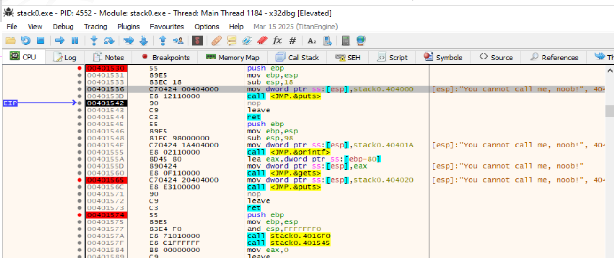


### xx
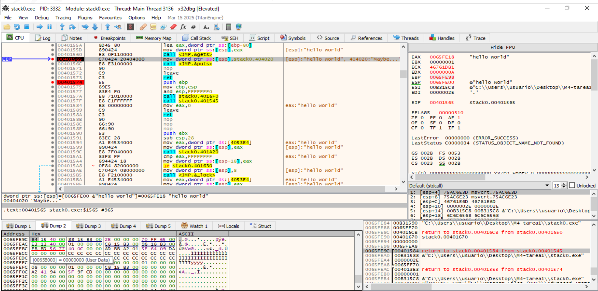
En el panel Stack (abajo-derecha) aparece la fila: `0065FE9C 00401584 return to stack0.00401584 from stack0.00401545`.  
Esa dirección `0065FE9C = [EBP+4]` es la return address de `try_to_call_me`.


### Modificamos la `[EBP+4]` (return address)
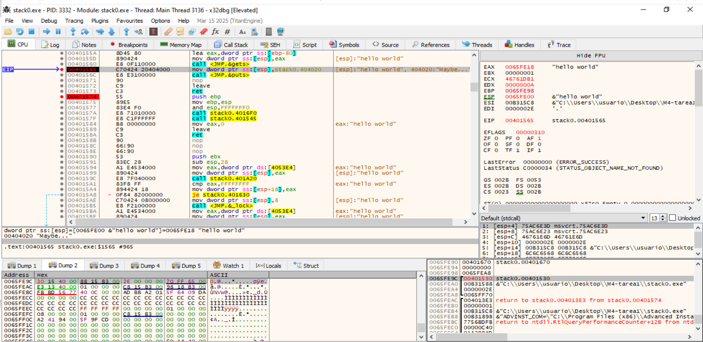
`0065FE9C 00401530 stack0.00401530` ➞ Esto significa que `[EBP+4]` (la return address) ya apunta al inicio de `call_me`.


### Primera instrucción de call_me
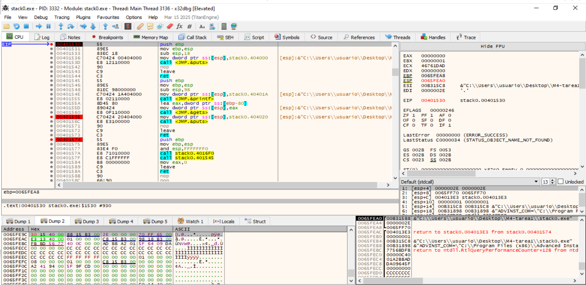


### xx
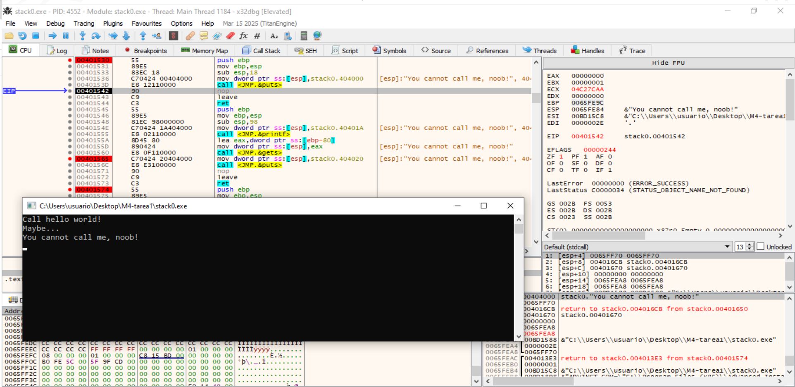

