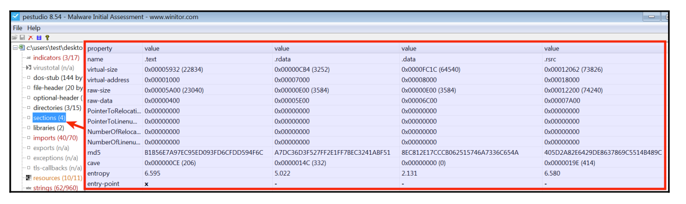

# PE Injection

## Conocimientos previos

Antes de estudiar **PE Injection** conviene dominar los siguientes conceptos:

- Qué es una imagen PE.
- Cómo se representa un PE en disco.
- Cómo Windows organiza una imagen PE en memoria.
- Qué información contienen sus cabeceras.
- Cómo se describen y localizan sus secciones.
- Qué son las importaciones, las relocations y el punto de entrada.
- Qué artefactos puede dejar una técnica de inyección.
- Cómo reconocer esos artefactos mediante análisis estático y dinámico.

El laboratorio será educativo y utilizará un PE benigno cuyo comportamiento sea fácil de reconocer, por ejemplo:

```c
MessageBoxA("Hola mundo");
```

---

## Qué es un PE

El **Portable Executable (PE)** es el formato utilizado por Windows para representar ejecutables, bibliotecas y otros módulos que pueden ser cargados por el sistema operativo. Entre los archivos que habitualmente utilizan este formato se encuentran:

- Ejecutables (`.exe`).
- Bibliotecas de enlace dinámico (`.dll`).
- Controladores (`.sys`).
- Otros módulos compatibles con el formato PE/COFF.

El formato PE deriva de **COFF (Common Object File Format)** y contiene, además del código y los datos de la aplicación, una serie de cabeceras, tablas y directorios que describen cómo debe interpretarse y organizarse la imagen en memoria.

Desde el punto de vista del análisis de malware, comprender la estructura PE es fundamental porque <mark>técnicas como el empaquetado, la ofuscación, la carga manual, el process hollowing y distintas formas de process injection manipulan o reconstruyen partes de esta estructura.</mark>

### Estructura general de un PE

De forma simplificada, un archivo PE presenta la siguiente organización:

```text
Inicio del archivo
        │
        ▼
┌─────────────────────────────────┐
│ IMAGE_DOS_HEADER                │
│                                 │
│ e_magic  = "MZ"                 │
│ e_lfanew ───────────────────┐   │
└─────────────────────────────│───┘
                              │
┌─────────────────────────────│───┐
│ DOS Stub                    │   │
│                             │   │
│ Código compatible con DOS   │   │
│                             │   │
│ Habitualmente muestra:      │   │
│ "This program cannot be     │   │
│  run in DOS mode."          │   │
│                             │   │
│ [En esta región puede       │   │
│  aparecer un Rich Header]   │   │
└─────────────────────────────│───┘
                              │
                              │ e_lfanew
                              ▼
┌─────────────────────────────────┐
│ NT Headers                      │
│                                 │
│ Signature                       │
│ "PE\0\0"                        │
├─────────────────────────────────┤
│ IMAGE_FILE_HEADER               │
│                                 │
│ Machine                         │
│ NumberOfSections                │
│ Characteristics                 │
├─────────────────────────────────┤
│ IMAGE_OPTIONAL_HEADER           │
│                                 │
│ AddressOfEntryPoint             │
│ ImageBase                       │
│ SectionAlignment                │
│ FileAlignment                   │
│ SizeOfImage                     │
│ SizeOfHeaders                   │
│ Subsystem                       │
│ DllCharacteristics              │
│ DataDirectory[]                 │
└─────────────────────────────────┘
                │
                ▼
┌─────────────────────────────────┐
│ Section Table                   │
│                                 │
│ IMAGE_SECTION_HEADER[0]         │
│        │                        │
│        ├── Name                 │
│        ├── VirtualAddress       │
│        ├── VirtualSize          │
│        ├── PointerToRawData     │
│        ├── SizeOfRawData        │
│        └── Characteristics      │
│                                 │
│ IMAGE_SECTION_HEADER[1]         │
│ IMAGE_SECTION_HEADER[2]         │
│ ...                             │
└─────────────────────────────────┘
                │
                ▼
┌─────────────────────────────────┐
│ Datos de las secciones          │
│                                 │
│ .text        (habitual)         │
│ .rdata       (habitual)         │
│ .data        (habitual)         │
│ .idata       (posible)          │
│ .rsrc        (posible)          │
│ .reloc       (posible)          │
│ otras...                        │
└─────────────────────────────────┘
```

Las **cabeceras PE** proporcionan al cargador de Windows la información necesaria para interpretar el archivo y organizarlo en memoria. Entre los datos más relevantes se encuentran:

- **Tipo y características del archivo:** permiten distinguir, entre otros, ejecutables, DLL y controladores.
- **Arquitectura:** indica para qué plataforma se compiló el módulo, por ejemplo x86 o x64.
- **Dirección base preferida:** especifica dónde espera cargarse la imagen.
- **Punto de entrada:** indica la RVA desde la que comienza normalmente la ejecución del módulo.
- **Secciones:** describen áreas de código, datos, recursos, relocations y otra información.
- **Importaciones y dependencias:** identifican bibliotecas y símbolos externos utilizados.
- **Recursos:** pueden contener iconos, cadenas, diálogos, manifiestos y otros datos.
- **Información de seguridad y mitigaciones:** puede incluir características relacionadas con `ASLR`, `DEP/NX` o `Control Flow Guard`.

Examinar esta información es una de las primeras tareas del **análisis estático de un `PE`**.

---

### IMAGE_DOS_HEADER

Un archivo `PE` comienza normalmente con una estructura `IMAGE_DOS_HEADER`. Dos campos son especialmente importantes:

- `e_magic`: contiene la firma `MZ`.
- `e_lfanew`: contiene el desplazamiento desde el inicio del archivo hasta la firma de las `cabeceras NT` (`PE\0\0`).

De forma conceptual:

```text
Inicio del archivo
      │
      ▼
+-----------------------+
| MZ                    |
|                       |
| e_lfanew = 0xF8       |
+-----------------------+
          │
          │ + 0xF8
          ▼
+-----------------------+
| PE\0\0                 |
+-----------------------+
```

La firma `MZ` corresponde a los bytes:

```text
4D 5A
```

El nombre procede de **Mark Zbikowski**, uno de los desarrolladores del formato ejecutable de DOS. La presencia de `MZ` por sí sola **no demuestra que el archivo sea un PE válido**: también deben ser coherentes `e_lfanew`, la firma `PE\0\0` y las estructuras posteriores.

El campo `e_lfanew` se encuentra en el offset `0x3C` del `IMAGE_DOS_HEADER`. Por ejemplo:

```text
Offset 0x00: 4D 5A        -> MZ
Offset 0x3C: 08 01 00 00  -> e_lfanew = 0x108
Offset 0x108: 50 45 00 00 -> PE\0\0
```

Para localizar las `cabeceras NT`, el cargador toma el valor de `e_lfanew` y lo interpreta como un desplazamiento desde el inicio del archivo.

---

### DOS Stub

Después del `IMAGE_DOS_HEADER` suele encontrarse un pequeño programa denominado **DOS Stub**, situado antes de las `cabeceras NT`.

En numerosos ejecutables su mensaje característico es:

```text
This program cannot be run in DOS mode.
```

Históricamente, este código permitía proporcionar un comportamiento mínimo si el archivo se ejecutaba bajo DOS.

En la región comprendida entre el `DOS Header` y las `cabeceras NT` también puede aparecer un **Rich Header**, especialmente en binarios generados con herramientas de Microsoft. El `Rich Header` no forma parte obligatoria de la especificación `PE`.

Desde el punto de vista del análisis de malware, esta zona puede ser modificada o reutilizada para almacenar datos, por lo que conviene examinarla cuando existan inconsistencias.

---

### Firma PE — PE Signature

En la posición indicada por `e_lfanew` debe encontrarse la firma:

```text
50 45 00 00
```

que corresponde a:

```text
PE\0\0
```

Esta firma marca el comienzo de las `cabeceras NT`. Su presencia aislada tampoco garantiza que todo el archivo sea válido; las estructuras y tamaños posteriores deben ser coherentes.

---

### IMAGE_FILE_HEADER

Después de la firma `PE\0\0` se encuentra el `IMAGE_FILE_HEADER`, también llamado **COFF File Header**.

Entre sus campos se encuentran:

```text
Machine
NumberOfSections
TimeDateStamp
SizeOfOptionalHeader
Characteristics
```

Algunos campos de especial interés son:

- `Machine`: identifica la arquitectura.
- `NumberOfSections`: indica cuántas entradas contiene la tabla de secciones.
- `SizeOfOptionalHeader`: especifica el tamaño del `Optional Header`.
- `Characteristics`: contiene flags generales del archivo.

Valores habituales del campo `Machine`:

```text
0x014C -> x86
0x8664 -> x86-64
```

---

### IMAGE_OPTIONAL_HEADER

A pesar de su nombre, el **Optional Header es esencial para una imagen ejecutable PE**. Contiene gran parte de la información que utiliza el cargador para organizar el módulo en memoria.

Entre los campos más relevantes, y en el orden relativo en que aparecen dentro de la estructura, se encuentran:

```text
AddressOfEntryPoint
ImageBase
SectionAlignment
FileAlignment
SizeOfImage
SizeOfHeaders
Subsystem
DllCharacteristics
DataDirectory[]
```

> Nota: existen otros campos intermedios. Además, `IMAGE_OPTIONAL_HEADER32` y `IMAGE_OPTIONAL_HEADER64` presentan algunas diferencias estructurales.

#### AddressOfEntryPoint

`AddressOfEntryPoint` contiene la **RVA (Relative Virtual Address)** del punto de entrada del módulo.

No es una dirección virtual absoluta. Para obtener la dirección virtual correspondiente se utiliza:

```text
VA = ImageBase + RVA
```

Por ejemplo:

```text
ImageBase           = 0x140000000
AddressOfEntryPoint = 0x00001230

VA = 0x140000000 + 0x1230
VA = 0x140001230
```

En análisis de malware suele hablarse de **Entry Point (EP)**. El término **Original Entry Point (OEP)** se utiliza especialmente al analizar binarios empaquetados para referirse al punto de entrada original del programa antes del empaquetado; por tanto, no debe utilizarse como sinónimo automático de `AddressOfEntryPoint`.

El punto de entrada resulta especialmente relevante durante el análisis dinámico porque representa la RVA desde la que comienza normalmente la ejecución del módulo una vez completadas las tareas de carga necesarias.


#### ImageBase

`ImageBase` indica la dirección virtual **preferida** en la que la imagen espera ser cargada.

Si esa dirección no está disponible, el sistema puede cargarla en otra posición siempre que el módulo disponga de la información necesaria para corregir las referencias dependientes de la base. En ese caso intervienen las **base relocations**.

#### SectionAlignment

`SectionAlignment` indica la alineación de las secciones cuando la imagen se encuentra en memoria.

Un valor muy habitual es:

```text
SectionAlignment = 0x1000
```

pero no debe asumirse que siempre será ese valor.

#### FileAlignment

`FileAlignment` especifica la alineación utilizada para los datos de las secciones en el archivo.

Un valor frecuente es:

```text
FileAlignment = 0x200
```

Esto explica por qué muchos `PointerToRawData` y `SizeOfRawData` aparecen alineados a múltiplos de `0x200`.

#### SizeOfImage

`SizeOfImage` representa el tamaño total que ocupará la imagen `PE` una vez organizada en memoria, respetando `SectionAlignment`.

Puede ser diferente del tamaño físico del archivo:

```text
Tamaño del archivo en disco = 45 KB
SizeOfImage                 = 80 KB
```

Entre los factores que explican esta diferencia se encuentran:

- Alineamiento de secciones.
- Diferencias entre `VirtualSize` y `SizeOfRawData`.
- Datos que se inicializan a cero.
- Espacios de alineamiento entre regiones.

<mark>Este campo es especialmente importante al estudiar **manual mapping** o **PE Injection**, ya que permite conocer el espacio virtual necesario para reconstruir la imagen.</mark>

#### SizeOfHeaders

`SizeOfHeaders` indica el tamaño combinado y alineado de las cabeceras del PE, incluida la tabla de secciones.

Es relevante durante un mapeo manual porque la parte inicial de la imagen también debe quedar disponible en memoria.

#### Subsystem

`Subsystem` especifica el entorno esperado por el ejecutable. Dos valores frecuentes son:

```text
2 -> Windows GUI
3 -> Windows Console
```

Este campo ayuda a determinar cómo espera interactuar el programa con el entorno, pero no describe por sí solo todo su comportamiento.

#### DllCharacteristics

`DllCharacteristics` contiene flags relacionados con características de carga y mitigaciones de seguridad.

Entre los más conocidos se encuentran:

```text
IMAGE_DLLCHARACTERISTICS_DYNAMIC_BASE
IMAGE_DLLCHARACTERISTICS_NX_COMPAT
IMAGE_DLLCHARACTERISTICS_GUARD_CF
```

Estos flags pueden indicar compatibilidad con mecanismos como `ASLR`, `DEP/NX` o `Control Flow Guard`.

#### DataDirectory

El `Optional Header` contiene un array de **Data Directories**. Cada entrada describe la ubicación y el tamaño de una estructura lógica del `PE`.

Entre las entradas más importantes se encuentran:

```text
Export Table
Import Table
Resource Table
Exception Table
Certificate Table
Base Relocation Table
Debug Directory
TLS Table
IAT
Delay Import Table
CLR Header
```

La mayoría de estas entradas se expresan mediante una pareja:

```text
VirtualAddress / RVA
Size
```

La **Certificate Table** es una excepción importante: su campo de dirección se interpreta como un `offset` de archivo y no como una `RVA`.

##### Import Table

La Import Table describe bibliotecas y símbolos externos utilizados por el programa.

Ejemplo:

```text
KERNEL32.dll
  CreateFileA
  WriteFile
  CreateProcessA

ADVAPI32.dll
  RegSetValueExA

WS2_32.dll
  socket
  connect
  send
  recv
```

Estas importaciones pueden ayudar a formular hipótesis sobre el comportamiento del binario:

```text
CreateFile / WriteFile       -> operaciones con archivos
RegSetValueEx                -> posible modificación del Registro
socket / connect             -> funcionalidad de red
```

Una combinación como:

```text
VirtualAllocEx
WriteProcessMemory
CreateRemoteThread
```

puede ser compatible con técnicas de `process injection`, pero **las importaciones por sí solas no demuestran que la técnica se ejecute realmente**. Es necesario confirmar el flujo de código y los parámetros utilizados.

##### Export Table

La Export Table resulta especialmente relevante en `DLL` y otros módulos que exponen funciones.

Los nombres exportados pueden orientar el análisis, aunque tampoco constituyen por sí mismos evidencia de comportamiento malicioso.

##### Resource Table

La Resource Table puede contener:

- Iconos.
- Imágenes.
- Cadenas.
- Diálogos.
- Manifiestos.
- Información de versión.
- Datos binarios arbitrarios.

En muestras de malware también puede utilizarse para almacenar configuraciones, ejecutables embebidos u otros datos codificados o comprimidos.

##### Base Relocation Table

La Base Relocation Table contiene información utilizada para corregir determinadas referencias cuando una imagen se carga en una dirección distinta de su `ImageBase` preferido.

Habitualmente estos datos pueden encontrarse asociados a una sección denominada:

```text
.reloc
```

El nombre de la sección, sin embargo, no es obligatorio.

##### TLS Table

La TLS Table puede incluir **TLS callbacks**. Estos `callbacks` pueden ejecutarse durante determinados eventos de carga antes de que se alcance el punto de entrada principal del módulo.

En análisis de malware son relevantes porque <mark>pueden utilizarse para ejecutar código de inicialización o técnicas anti-análisis antes del `Entry Point` observado por el analista.</mark>

---

## Secciones del PE

El contenido de un `PE` se organiza habitualmente en diferentes **secciones**. Cada sección está descrita mediante un `IMAGE_SECTION_HEADER`.

Algunas secciones frecuentes son:

| Sección | Contenido habitual |
|---|---|
| `.text` | Código ejecutable |
| `.rdata` | Datos de solo lectura, constantes y tablas |
| `.data` | Variables globales inicializadas |
| `.bss` | Datos no inicializados. Puede no aparecer como sección independiente |
| `.idata` | Información relacionada con importaciones |
| `.edata` | Información relacionada con exportaciones |
| `.rsrc` | Recursos |
| `.reloc` | Base relocations |
| `.pdata` | Información de excepciones, especialmente habitual en x64 |

Los nombres de sección son principalmente una **convención**. El cargador no depende de que una sección se llame `.text`, `.data` o `.rdata`; utiliza los campos de sus cabeceras y características.

Por este motivo, un binario empaquetado u ofuscado puede utilizar nombres diferentes.

---

### IMAGE_SECTION_HEADER

Cada sección está descrita mediante una estructura `IMAGE_SECTION_HEADER`.

Algunos campos relevantes son:

```text
Name
VirtualSize
VirtualAddress
SizeOfRawData
PointerToRawData
Characteristics
```

#### Name

Identifica el nombre convencional de la sección.

Ejemplos habituales:

```text
.text
.rdata
.data
.idata
.rsrc
.reloc
```

Algunos packers pueden utilizar nombres reconocibles, por ejemplo:

```text
UPX0
UPX1
.aspack
.mpress
```

Un nombre inusual puede justificar un análisis adicional, pero **no demuestra por sí mismo que el archivo sea malicioso**.

#### VirtualSize

Indica el tamaño lógico solicitado para la sección dentro de la imagen en memoria.

#### VirtualAddress

Contiene la **RVA** en la que comienza la sección dentro de la imagen.

Por ejemplo:

```text
VirtualAddress = 0x1000
ImageBase      = 0x00400000
```

La dirección virtual correspondiente sería:

```text
0x00400000 + 0x1000 = 0x00401000
```

#### SizeOfRawData

Indica el tamaño de los datos de la sección almacenados físicamente en el archivo, normalmente alineado según `FileAlignment`.

#### PointerToRawData

Indica el offset del archivo donde comienzan los datos físicos de la sección.

Por ejemplo:

```text
PointerToRawData = 0x400
```

significa que los bytes almacenados de la sección comienzan en el offset `0x400` del archivo.

#### Characteristics

Contiene `flags` que describen propiedades de la sección, entre ellas sus permisos previstos.

De forma conceptual:

```text
R -> Read
W -> Write
X -> Execute
```

Configuraciones habituales:

```text
.text -> R-X
.data -> RW-
```

Una sección o región con permisos `RWX` puede ser relevante durante el análisis porque permite lectura, escritura y ejecución simultáneamente, aunque **no constituye por sí sola una prueba de actividad maliciosa**.

---

### La Section Table contiene descriptores, no los datos de las secciones

La **Section Table** está formada por estructuras `IMAGE_SECTION_HEADER`. Estas estructuras describen dónde se encuentran los datos y cómo deben organizarse.

Por ejemplo:

```text
IMAGE_SECTION_HEADER
       │
       │ describe
       ▼
┌──────────────────────────┐
│ .text                    │
│                          │
│ VirtualAddress           │
│ VirtualSize              │
│ PointerToRawData         │
│ SizeOfRawData            │
│ Characteristics          │
└──────────────────────────┘
```

`PointerToRawData` permite localizar los bytes de la sección en el archivo:

```text
Section Table

.text
PointerToRawData = 0x400
        │
        ▼
File Offset 0x400
┌─────────────────────────┐
│ bytes reales de .text   │
│                         │
│ 48 89 5C 24 ...         │
└─────────────────────────┘
```

En memoria, la sección se localiza mediante:

```text
MappedBase + VirtualAddress
```

<mark>Esta diferencia es fundamental para entender el mapeo de una imagen `PE`.</mark>

---

## PE en disco frente a PE en memoria

Un `PE` no presenta exactamente la misma disposición en disco que una vez mapeado como imagen en memoria.

### En disco

Los campos más relevantes son:

```text
PointerToRawData
SizeOfRawData
```

### En memoria

La posición de una sección se expresa mediante:

```text
MappedBase + VirtualAddress
```

Por ejemplo:

```text
                DISCO                       MEMORIA

.text
PointerToRawData = 0x400       ->      Base + RVA 0x1000

.rdata
PointerToRawData = 0x2400      ->      Base + RVA 0x4000

.data
PointerToRawData = 0x3000      ->      Base + RVA 0x5000
```

Visualmente:

```text
PE EN DISCO

+------------------------+
| PE Headers             |
+------------------------+
| .text                  |  <- offset 0x400
+------------------------+
| .rdata                 |  <- offset 0x2400
+------------------------+
| .data                  |  <- offset 0x3000
+------------------------+


PE EN MEMORIA

MappedBase
    │
    ▼
+------------------------+
| PE Headers             |
+------------------------+
|                        |
| .text                  |  <- Base + 0x1000
|                        |
+------------------------+
| .rdata                 |  <- Base + 0x4000
+------------------------+
| .data                  |  <- Base + 0x5000
+------------------------+
```

Por ello, <mark>copiar un `PE` como un bloque continuo de bytes no equivale a reproducir su imagen cargada. El mapeo debe respetar la información contenida en las cabeceras y en la tabla de secciones.</mark>

---

## Secciones típicas y señales de interés

| Sección | Función habitual | Observaciones de análisis |
|---|---|---|
| `.text` | Código ejecutable | Lo habitual es `R-X`; código fuera de secciones ejecutables merece revisión |
| `.data` | Variables globales inicializadas | Suele ser `RW-`; puede contener configuración o datos de estado |
| `.bss` | Datos no inicializados | Puede corresponder a espacio reservado y zero-filled en memoria |
| `.rdata` | Datos de solo lectura | Puede contener strings, constantes, RTTI y tablas |
| `.idata` | Imports | Útil para estudiar dependencias y APIs |
| `.edata` | Exports | Especialmente relevante en DLL |
| `.rsrc` | Recursos | Puede contener iconos, cadenas y datos embebidos |
| `.reloc` | Base relocations | Permite corregir referencias cuando cambia la base de carga |
| `UPX0`, `UPX1` | Nombres frecuentes en binarios UPX | Indican posible empaquetado, no necesariamente malware |

Los nombres de sección no deben utilizarse como criterio aislado de clasificación.

Cuando una herramienta como `PeStudio` muestra la tabla de secciones, algunos campos habituales son:

- **Name:** nombre de la sección.
- **Virtual Size:** tamaño lógico de la sección en memoria.
- **Virtual Address:** RVA donde comienza la sección.
- **Raw Size:** tamaño almacenado en disco.
- **Raw Data / Raw Offset:** desplazamiento del archivo donde comienzan los datos.
- **Entry Point:** puede indicar en qué sección cae la RVA del punto de entrada.



### Discrepancias útiles durante el análisis

Algunas características pueden justificar una revisión más detallada:

- Nombres como `UPX0` y `UPX1` pueden indicar que el binario está empaquetado con UPX.
- Un `Entry Point` situado en una sección asociada al `packer` suele conducir primero a la rutina de desempaquetado.
- Diferencias entre `VirtualSize` y `SizeOfRawData` son normales hasta cierto punto debido al alineamiento y a los datos no inicializados.
- Una diferencia muy grande —por ejemplo, una sección con `SizeOfRawData = 0` pero un `VirtualSize` considerable— puede indicar que se reserva espacio que será rellenado durante la ejecución. En un binario empaquetado puede utilizarse para alojar código o datos desempaquetados.

Estas observaciones son **indicadores, no pruebas concluyentes de comportamiento malicioso**.

---

## RVA, VA y File Offset

Para estudiar correctamente un `PE` es necesario diferenciar tres conceptos:

- **File Offset:** posición de un elemento dentro del archivo almacenado en disco.
- **RVA (Relative Virtual Address):** desplazamiento relativo respecto a la base de carga de la imagen.
- **VA (Virtual Address):** dirección virtual efectiva dentro del espacio de memoria del proceso.

La relación básica es:

```text
VA = MappedBase + RVA
```

Cuando la imagen se carga exactamente en su dirección preferida:

```text
VA = ImageBase + RVA
```

Ejemplo:

```text
ImageBase = 0x140000000
RVA       = 0x00001230

VA        = 0x140001230
```

Para convertir una RVA perteneciente a una sección en un offset de archivo puede utilizarse:

```text
FileOffset =
    PointerToRawData +
    (RVA - VirtualAddress)
```

Ejemplo:

```text
RVA buscada:      0x1234

Sección .text:
VirtualAddress:   0x1000
PointerToRawData: 0x400
```

Cálculo:

```text
FileOffset = 0x400 + (0x1234 - 0x1000)
FileOffset = 0x634
```

> `FileOffset`, `Raw Offset` y el desplazamiento físico dentro del archivo se utilizan aquí con el mismo sentido.

Comprender estas conversiones es esencial para correlacionar lo observado en herramientas de análisis estático con las direcciones mostradas posteriormente por un debugger como x64dbg.

---

## Importaciones e IAT

Los ejecutables utilizan con frecuencia funciones proporcionadas por otras bibliotecas.

Por ejemplo:

```text
USER32.dll
    └── MessageBoxA
```

Entre las estructuras relacionadas con la resolución de `imports` se encuentran:

```text
IMAGE_IMPORT_DESCRIPTOR
Import Name Table
Import Address Table (IAT)
```

Durante una carga normal, el cargador de Windows resuelve las dependencias necesarias y prepara las referencias que utilizará el módulo.

En un laboratorio de `manual mapping` o `PE Injection`, esta parte es importante porque una `imagen PE` reconstruida manualmente no puede asumir automáticamente que sus referencias externas están listas para utilizarse.

---

## Relocations

Una imagen PE tiene una dirección base preferida:

```text
ImageBase
```

Si termina mapeada en una dirección distinta, determinadas referencias dependientes de la base pueden necesitar corrección.

Por ejemplo:

```text
ImageBase preferida = 0x140000000
ActualBase          = 0x7FF700000000
```

El desplazamiento se calcula conceptualmente como:

```text
Delta = ActualBase - PreferredImageBase
```

Las entradas de la **Base Relocation Table** identifican qué ubicaciones deben ajustarse.

Este mecanismo es importante tanto para el cargador de Windows como para comprender una implementación de `manual mapping`.

---

## Importancia del formato PE para estudiar PE Injection

Una técnica de `PE Injection` o `manual mapping` no consiste simplemente en escribir un bloque arbitrario de bytes en memoria.

<mark>Para reconstruir correctamente una `imagen PE` es necesario comprender elementos como:</mark>

```text
IMAGE_DOS_HEADER
        ↓
IMAGE_NT_HEADERS
        ↓
SizeOfImage
        ↓
Section Table
        ↓
VirtualAddress
        ↓
Headers
        ↓
Sections
        ↓
Relocations
        ↓
Imports / IAT
        ↓
Protecciones
        ↓
AddressOfEntryPoint
```

Por este motivo, antes de estudiar una técnica de inyección es fundamental entender cómo se organiza un `PE` en disco y cómo cambia su representación cuando se convierte en una imagen en memoria.

---

# PE Injection

## Diferenciar Process Injection de PE Injection

El término **Process Injection** describe una familia amplia de técnicas en las que un proceso provoca que código o datos sean introducidos o ejecutados en el contexto de otro proceso.

Una secuencia como:

```text
OpenProcess
    ↓
VirtualAllocEx
    ↓
WriteProcessMemory
    ↓
CreateRemoteThread
```

es compatible con una forma clásica de **remote thread injection**, pero no demuestra por sí sola que el contenido inyectado sea una `imagen PE` completa.

Para hablar de **PE Injection** o **manual mapping de un PE** deben observarse además operaciones relacionadas con la reconstrucción de una imagen PE, por ejemplo:

```text
MZ / PE\0\0
IMAGE_NT_HEADERS
SizeOfImage
Section Table
VirtualAddress
Relocations
Imports / IAT
AddressOfEntryPoint
```

Conceptualmente:

```text
Process Injection
        +
reconstrucción o carga manual
    de una imagen PE
        =
inyección de una imagen PE
```

La terminología puede variar entre fuentes, por lo que durante el análisis conviene describir **el mecanismo observado** y no basarse únicamente en una etiqueta.

---

## Flujo conceptual de PE Injection

A alto nivel, <mark>el proceso de reconstrucción de una imagen PE puede representarse así:</mark>

```text
PE payload
    │
    ▼
Leer DOS Header
    │
    ▼
Localizar NT Headers
    │
    ▼
Leer SizeOfImage
    │
    ▼
Reservar una región adecuada
    │
    ▼
Copiar Headers
    │
    ▼
Copiar secciones según sus RVA
    │
    ├── .text
    ├── .rdata
    ├── .data
    └── ...
    │
    ▼
Aplicar relocations si son necesarias
    │
    ▼
Preparar imports / IAT
    │
    ▼
Aplicar protecciones coherentes
    │
    ▼
MappedBase + AddressOfEntryPoint
```

Este esquema resume los elementos que interesa reconocer durante el análisis. No todas las implementaciones siguen exactamente el mismo procedimiento.

---

## Reserva de memoria

`SizeOfImage` indica el tamaño total que necesita la imagen una vez organizada en memoria.

Por ello:

```text
PE file size
      !=
SizeOfImage
```

Ejemplo:

```text
Tamaño del archivo: 45 KB
SizeOfImage:         80 KB
```

Esta diferencia puede deberse a:

```text
SectionAlignment
VirtualSize
espacios de alineamiento
datos inicializados a cero
```

---

## Copia de headers y secciones

Conceptualmente, las cabeceras se sitúan al comienzo de la región de la imagen:

```text
destination = MappedBase
source      = PE file
size        = SizeOfHeaders
```

Cada sección se ubica utilizando su `VirtualAddress`:

```text
destination =
    MappedBase + section.VirtualAddress

source =
    FileBase + section.PointerToRawData

size =
    section.SizeOfRawData
```

Esquema:

```text
                    PE EN DISCO

        ┌──────────────────────────┐
        │ Headers                  │
        ├──────────────────────────┤
        │ .text raw                │
        ├──────────────────────────┤
        │ .rdata raw               │
        ├──────────────────────────┤
        │ .data raw                │
        └──────────────────────────┘

                    │
                    │ mapeo
                    ▼

                    MEMORIA

Base ──► ┌─────────────────────────┐
         │ PE Headers              │
+1000 ─► │ .text                   │
         │                         │
+4000 ─► │ .rdata                  │
         │                         │
+5000 ─► │ .data                   │
         └─────────────────────────┘
```

Esta transición de **layout de archivo** a **layout de imagen** es uno de los conceptos centrales del tutorial.

---

## Base Relocations

Si una imagen esperaba cargarse en:

```text
ImageBase = 0x140000000
```

pero termina en otra dirección, algunas referencias dependientes de la base pueden dejar de ser válidas.

Conceptualmente:

```text
Delta = ActualBase - PreferredImageBase
```

Las entradas de la tabla de relocations indican qué ubicaciones necesitan ajustarse.

---

## Imports e IAT durante un mapeo manual

Copiar la sección `.text` no garantiza que el código pueda utilizar sus dependencias externas.

Si el `PE` utiliza:

```text
MessageBoxA
```

debe existir una referencia válida a:

```text
USER32.dll
        ↓
MessageBoxA
```

Entre las estructuras relevantes se encuentran:

```text
Import Directory
IMAGE_IMPORT_DESCRIPTOR
OriginalFirstThunk
FirstThunk
Import Address Table
```

En el `PE` benigno de **Hola mundo**, `USER32.dll` y `MessageBoxA` resultan especialmente útiles para relacionar el análisis estático con el comportamiento observado durante el laboratorio.

---

## Entry Point

Una vez reconstruida la imagen, la dirección virtual correspondiente a su punto de entrada se obtiene como:

```text
EntryPoint = MappedBase + AddressOfEntryPoint
```

Ejemplo:

```text
MappedBase          = 000001F400000000
AddressOfEntryPoint = 0x1470

EntryPoint          = 000001F400001470
```

Es importante distinguir entre:

- `ImageBase`: dirección preferida indicada en el `PE`.
- `MappedBase`: dirección en la que la imagen se encuentra realmente mapeada.
- `AddressOfEntryPoint`: `RVA` almacenada en el `Optional Header`.

---

## Protecciones de memoria

Las secciones suelen tener características distintas.

Ejemplo conceptual:

```text
.text      R-X
.rdata     R--
.data      RW-
.reloc     R--
```

Estas propiedades se relacionan con:

```text
IMAGE_SECTION_HEADER.Characteristics
```

Durante el análisis de malware es útil comparar las características esperadas de las secciones con las protecciones reales observadas en memoria.

---

## PE Injection, Manual Mapping y Process Hollowing

Conviene distinguir varias técnicas relacionadas:

```text
Process Injection
│
├── Remote Thread Injection
├── DLL Injection
├── Manual Mapping / PE Injection
├── Process Hollowing
├── APC Injection
└── Thread Hijacking
```

La clasificación exacta puede variar según la fuente.

### Manual Mapping / PE Injection

Se caracteriza por reconstruir una imagen `PE` en memoria sin depender exclusivamente de la ruta normal del cargador.

Los elementos de interés incluyen:

```text
Headers
Sections
Relocations
Imports / IAT
Protecciones
Entry Point
```

### Process Hollowing

En `process hollowing` suele observarse un proceso creado en estado suspendido y la sustitución o modificación de su imagen antes de reanudar el hilo principal.

Entre las `APIs` que pueden aparecer en algunas implementaciones se encuentran:

```text
CreateProcess
CREATE_SUSPENDED
NtUnmapViewOfSection
VirtualAllocEx
WriteProcessMemory
SetThreadContext
ResumeThread
```

La presencia de una `API` concreta no basta para clasificar la técnica; debe analizarse la secuencia completa y los parámetros.

---

## Indicadores para detección

El estudio de `PE Injection` debe incluir también una perspectiva defensiva.

Algunos artefactos que pueden resultar relevantes son:

```text
regiones MEM_PRIVATE ejecutables

cabeceras MZ/PE dentro de memoria privada

layout de secciones compatible con una imagen PE

cambios de protección RW -> RX

escrituras entre procesos

hilos cuyo inicio cae en memoria privada

entry points dentro de regiones no asociadas
a módulos cargados normalmente

discordancia entre regiones ejecutables
y la lista de módulos del proceso
```

Ningún indicador aislado debe considerarse una prueba definitiva. La detección fiable suele requerir correlacionar varios artefactos.

---

## Laboratorios progresivos

El tutorial se puede organizar en cuatro prácticas:

```text
LAB 1
PE Hello World
────────────────────
¿Qué es el PE?

ImageBase
Entry Point
Sections
Imports


        ↓


LAB 2
PE Mapping local
────────────────────
SizeOfImage
VirtualAlloc
Headers
Sections
RVA -> memoria


        ↓


LAB 3
PE Loader educativo
────────────────────
Relocations
Imports / IAT
Protecciones
Entry Point


        ↓


LAB 4
Análisis de malware
────────────────────
Buscar patrones reales
Comparar APIs
Examinar memoria
Determinar la técnica
```

---

## Hilo conductor

La pregunta central del tutorial es:

> **¿Qué necesita ocurrir para transformar un archivo `PE` almacenado en disco en una imagen `PE` coherente dentro de memoria?**

El recorrido conceptual es:

```text
DOS Header
       ↓
NT Headers
       ↓
SizeOfImage
       ↓
Section Table
       ↓
VirtualAddress
       ↓
Headers
       ↓
Sections
       ↓
Relocations
       ↓
Imports / IAT
       ↓
Protecciones
       ↓
Entry Point
```

Comprender este proceso proporciona la base necesaria para reconocer y analizar técnicas de **Manual Mapping**, **PE Injection** y, posteriormente, **Process Hollowing**.


----

## Herramientas para análisis de archivos PE

### Comando pecheck
El comando pecheck es una herramienta de análisis de archivos PE (Portable Executable) desarrollada por Didier Stevens. Cuando se ejecuta pecheck en un archivo PE, la herramienta examina el archivo y proporciona un informe que incluye información sobre las siguientes estructuras y elementos:
- DOS Header: La cabecera inicial que está presente para mantener la compatibilidad con aplicaciones DOS antiguas.
- PE Header: La cabecera que sigue al DOS Header y contiene metadatos esenciales sobre el archivo ejecutable, como la arquitectura de la máquina para la que está compilado (x86, x64, etc.) y los puntos de entrada del programa.
- Optional Header: Una sección del PE Header que proporciona información adicional necesaria para la carga del ejecutable, como la dirección base de la imagen, la alineación de las secciones y el punto de entrada del programa.
- Section Headers: Las cabeceras de las secciones del archivo que describen cómo se organizan los datos y el código dentro del archivo PE.
- Data Directories: Partes del Optional Header que contienen punteros a estructuras de datos importantes como la tabla de importaciones y exportaciones, recursos y más.

### Utilidad pe-tree
Es una herramienta de análisis de archivos Portable Executable (PE) diseñada para proporcionar una vista estructurada y jerárquica de los componentes internos de los archivos PE.
- Vista Jerárquica: pe-tree presenta la información del archivo PE en una estructura de árbol, lo que permite a los usuarios expandir y colapsar secciones para explorar detalles específicos de manera eficiente. Esto incluye cabeceras, secciones, tablas de importación/exportación, recursos y más.
- Análisis de Secciones y Cabeceras: La herramienta analiza y muestra información detallada sobre las cabeceras PE, incluyendo el DOS Header, PE Header, Optional Header, y Section Headers. Esto es crucial para entender la configuración y el comportamiento potencial del archivo.
- Identificación de Anomalías: pe-tree puede ayudar a identificar características inusuales o sospechosas en los archivos PE, como secciones ocultas, configuraciones anómalas en las cabeceras, o firmas digitales inválidas.
- Integración con Herramientas de Análisis de Malware: pe-tree puede integrarse con otras herramientas y plataformas de análisis de malware para proporcionar una visión más completa del archivo analizado. Esto puede incluir la extracción y análisis de cadenas, así como la identificación de patrones de código malicioso.

### Otras utilidades:
- **Analazing PE Header en windows con CFF Explorer:** https://ntcore.com/explorer-suite/

- **PE Internals**: http://www.andreybazhan.com/pe-internals.html

- **PPEE(puppy)**: https://www.mzrst.com/

- **PEBrowse Professional**: http://www.smidgeonsoft.prohosting.com/pebrowsepro-file-viewer.html

- **PEStudio** → muy visual.  Destaca elementos sospechosos.

- **peview.exe**

- **Detect It Easy (DIE)** → detecta si está empaquetado. https://horsicq.github.io/


- **objdump / readpe / pefile.py** → para línea de comandos o scripts.


- **Herramienta pescanner:** Creado por Michael Ligh y Glenn P. Edwards, es una excelente herramienta para detectar archivos `PE` sospechosos basados en los atributos del archivo `PE`. Utiliza heurísticas en lugar de firmas y puede ayudar a identificar binarios empaquetados incluso si no hay firmas para ello. Se puede descargar una copia del script desde https://github.com/hiddenillusion/AnalyzePE/blob/master/pescanner.py.


- **Herramienta pesec:** Esta herramienta es utilizada para analizar archivos binarios de Windows con el objetivo de revisar ciertas protecciones de seguridad que pueda tener el ejecutable, como por ejemplo:  


  - `ASLR` (Address Space Layout Randomization): no  
  Significa que el binario no soporta aleatorización del espacio de direcciones, lo cual lo hace más vulnerable a exploits de memoria.

  - `DEP/NX` (Data Execution Prevention / No-eXecute): no  
  No tiene protección para prevenir la ejecución de código en regiones no ejecutables de la memoria. Esto facilita ataques como el buffer overflow.

  - `SEH` (Structured Exception Handling): yes  
  Indica que el ejecutable usa SEH, un mecanismo para manejar excepciones estructuradas. No es una mitigación por sí sola, pero es un dato técnico útil.

  - `CFG` (Control Flow Guard): no  
  No incluye esta mitigación contra el secuestro del flujo de control, usada para prevenir exploits tipo ROP.

  - `Stack cookies` (EXPERIMENTAL): yes  
  Usa canarios de pila (stack cookies), una protección para detectar desbordamientos de buffer.

En este ejemplo vemos que este binario es poco seguro: carece de `ASLR`, `DEP/NX` y `CFG`, lo que lo deja expuesto a ataques de explotación de memoria. Aunque tiene `stack cookies` y usa `SEH`, eso no es suficiente para considerarlo bien protegido.


- **PE Resources** ⬅️⬅️⬅️ Los recursos requeridos por el archivo ejecutable, como iconos, menús, diálogos y cadenas, se almacenan en la sección de recursos (`.rsrc`) de un archivo ejecutable. A menudo, los atacantes almacenan información como binarios adicionales, documentos señuelo y datos de configuración en la sección de recursos, por lo que examinar los recursos puede revelar información valiosa sobre un binario. La sección de recursos también contiene información de versión que puede revelar detalles sobre el origen, el nombre de la empresa, los detalles del autor del programa y la información de copyright.


  
### peframe
Es un analizador estático de archivos ejecutables `PE` usado en análisis de malware. Descargar peframe: https://github.com/guelfoweb/peframe
```
python3 -m venv peenv
# 2. Activa el entorno
source peenv/bin/activate

python3 -m pip install --upgrade installer

git clone https://github.com/guelfoweb/peframe.git
cd peframe
  
pip install build

python3 -m build

# Esto creará un archivo .whl dentro del directorio dist/, algo como:
# dist/peframe-6.0-py3-none-any.whl

#  Instala el .whl con installer
python3 -m installer dist/peframe-*.whl
  
# 4. Ejecuta peframe
peframe archivo.exe

```


### radare2
- Radare es una herramientas opensource para realizar tareas de ingeniería inversa. Su creador es Sergi Alvárez ([pancake](https://www.navajanegra.com/2025/speaker/pancake-sergi-alvarez-capilla/index.html)).
- Cuenta con una interfaz gráfica llamada [Cutter](https://www.radare.org/cutter/).
- Libro de radare: https://book.rada.re/
- Para abrir un fichero en radare debemos pasar la ruta del fichero como primer parámetro.
  
```
sudo apt install radare2
r2 -A archivo.exe
a?               # Ayuda para los comandos de análisis de binarios
aaa              # Carga toda la información del binario
aaaa             # Información de cadenas, llamadas (referencias cruzadas), listas de funciones, etc.
ae               # Entrypoint analizado
af               # Define función en dirección actual
afl              # Lista de funciones encontradas
afl~main         # Busca funciones que contengan "main"
axt              # Referencias a una dirección
axtj             # Referencias (en JSON)
axg              # Grafo de referencias cruzadas
dcu              # Desensamblar hasta llamada (debug)
i                # Muestra información básica sobre el binario, como protecciones activadas durante la compilación, fecha de compilación, tipo de binario, Sistema Operativo...
iI               # Info del formato PE (arch, machine, tamaño)
iD               # Directivas del PE como imports/exports
iS               # Muestra todas las secciones (.text, .data, etc.)
iS~text          # Filtra por sección de código
iH               # Cabecera del binario
ii               # Imports
iij              # Muestra imports pero en formato JSON (útil para scripts)
ii~VirtualAlloc  # Busca funciones específicas, por ejemplo VirtualAlloc
ii~kernel32      # Ver funciones importadas de kernel32.dll
ii~WriteProcessMemory
ii~CreateRemoteThread
ii~LoadLibrary
ii~GetProcAddress
ii~WinExec
iE               # Exported symbols (símbolos exportados)
ie               #  muestra entrypoints del binario
iz               # Strings encontradas (utf-8, ascii)
iz~=[A-Za-z0-9]{6,} # Para buscar cadenas raras que podrían estar cifradas
iz~xor           # Busca strings y llamadas relacionadas con cifrado
iz~decrypt       # Busca strings y llamadas relacionadas con cifrado
iz~key           # Busca strings y llamadas relacionadas con cifrado
ii~RtlDecompress # Busca strings y llamadas relacionadas con cifrado
iz               # Strings del binario
iz~http          # Filtrar strings que contengan "http"
/                # Comando para buscar cadenas o patrones de bytes.
/?               # Lista los modificadores para utilizar con el comando / de búsqueda
/x               # Comando para buscar cadenas de bytes
/x 90 90         # Busca la secuencia 0x90 0x90
/m               # Busca cabeceras “mágicas” (firmas de tipos de archivo) usando libmagic. Sirve para detectar archivos o estructuras embebidas dentro de un binario
/ WinExec        # Buscador de patrones
/ http           # Buscar la palabra "http"
/ bin.sh         # Buscar posibles llamadas a shells
/c 90            # Buscar NOPs (hexadecimal)
/R               # Busca gadgets ROP en el rango de búsqueda actual.
/V               # 
pdf              # Imprime el código desensamblado correspondiente a la función que nos encontremos actualmente.
pdf              # p: print - d: desensamblado - f: función 🡆 Print disassembly function
pd 5             # print disasm 5 🡆 imprime las 5 instrucciones de ensamblador siguientes desde la dirección actual (el offset donde estás posicionado)
pd?              # muestra la ayuda de pd en radare2, una descripción del comando, su sintaxis y las opciones/variantes disponibles
p?               # Muestra la ayuda del comando y sus posibles modificadores
px               # p: print - x: hexadecimal 🡆 imprime en hexadecimal
q                # Salir
s main           # Comando seek que permite movernos al lugar indicado como parámetro. En este caso a la función main
s 0x00401574     # Para movernos a una dirección de memoria concreta
V                # Entra en modo visual (desensamblado)
             hjkl → moverte (como en vim): izquierda, abajo, arriba, derecha
             p → cambia el panel de vista (hexdump, ensamblador, gráfico, etc.)
             V → alterna entre los distintos modos visuales.
             q → salir al modo normal.
             ? → muestra ayuda dentro del modo visual
....
r2 -d archivo.exe  🡆 Depura el ejecutable con radare
d?                # Lista de comandos de debugger
db                # Permite añadir y quitar breakpoints en las direcciones de memoria deseadas.

```


