# Resolución dinámica de APIS que ocultan los nombres mediante hashing

Simulador de reversing para practicar exactamente el flujo que buscarías en x64dbg:
```
bucle de hashing → comparación → resolución en la tabla de exportaciones → 
→ puntero resultante → CALL/JMP indirecto.
```
Los comandos de breakpoint y vigilancia de memoria utilizados como referencia están documentados por x64dbg.

**Pregunta central del análisis:** Si no aparece `GetProcAddress("Sleep")`, ¿cómo demuestra el código qué función está buscando y dónde termina ejecutándola?

## 1. Anatomía del patrón
Secuencia que debemos aprender a reconocer:  


## 2. Simulador de sesión x64dbg


---


----


----


----


----


----


## 3. Reto: encuentra el resolver


## 4. Procedimiento


## 5. Hoja de Investigación


## 6. Ejemplo practico

Programa que hace una carga dinámica de una API ocultando el nombre mediante hashing: [api-hash.c](https://github.com/soniasalido/cybersecurity/blob/main/LABS/Investigating%20Malware/Resolucion-Dinamica-APIS-ocultacion-nombres-mediante-hashing/api-hash.c)

Compilamos el programa para obtener un ejecutable para Windows:
```bash
x86_64-w64-mingw32-gcc -Wall -Wextra -Wno-cast-function-type -O0 -g api-hash.c -o api-hash.exe
```

Abrimos una terminal de comandos y lo ejecutamos:

donde:
- La salida confirma que tu resolver ha localizado `MessageBoxA` mediante el hash `0x384F14B4` y ha calculado su dirección dentro de `user32.dll`.


En laboratorios anteriores perseguíamos:
```bash
LoadLibraryA("user32.dll");
GetProcAddress(hModule, "MessageBoxA");
```

Y poníamos breakpoints en:
```bash
LoadLibraryA
GetProcAddress
```

Aquí el flujo es diferente:
```bash
LoadLibraryA("user32.dll")
        ↓
GetProcAddressByHash()
        ↓
parsea manualmente el PE
        ↓
IMAGE_EXPORT_DIRECTORY
        ↓
AddressOfNames
        ↓
hash(nombre)
        ↓
comparación con 0x384F14B4
        ↓
AddressOfNameOrdinals
        ↓
AddressOfFunctions
        ↓
dirección de MessageBoxA
```

Es decir, `GetProcAddress` no aparece en el proceso.


Ponemos un breakpoint en
```bash
bp LoadLibraryA
```


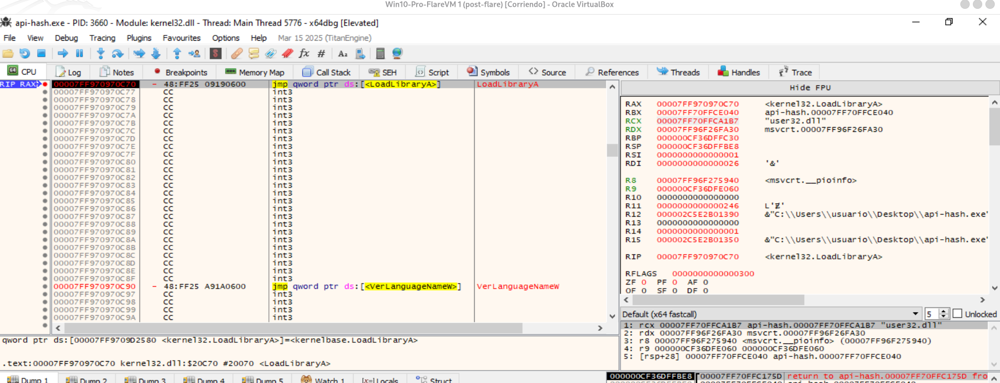


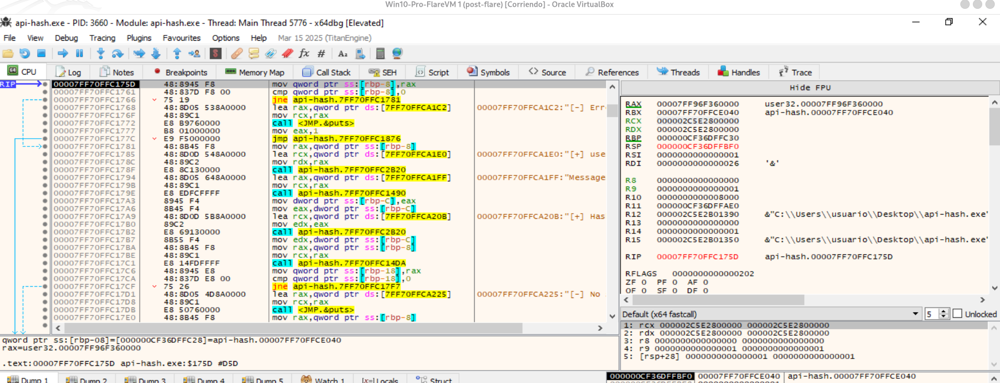

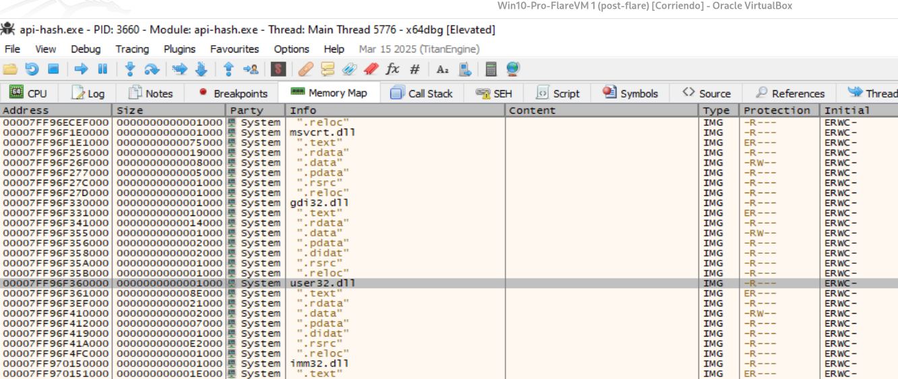

donde:
- El retorno de `LoadLibraryA("user32.dll")` es: `RAX = 00007FF96F360000`. Ese valor es el `HMODULE` devuelto por `LoadLibraryA`, y en Windows un `HMODULE` corresponde, en la práctica, a la dirección base donde está cargado el módulo.

- `mov qword ptr [rbp-8], rax`: Guarda: `RAX = 00007FF96F360000` en una variable local: `[rbp-8] = HMODULE user32`.


------

**Justo antes de llamar al resolver por hash:**
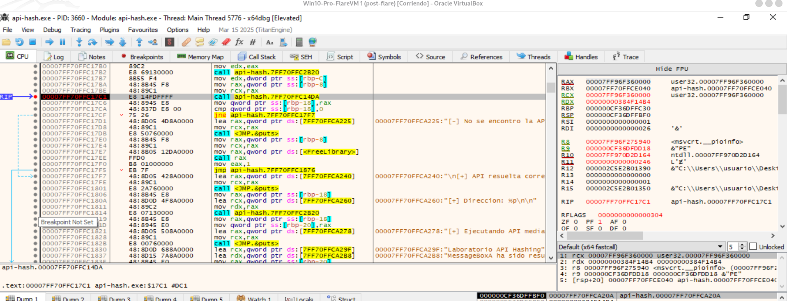
donde:
- `RCX = 00007FF96F360000`.
- `RDX = 00000000384F14B4`.

Eso equivale a:
```bash
GetProcAddressByHash(
    0x00007FF96F360000,   // user32.dll
    0x384F14B4            // hash de MessageBoxA
);
```

Se evidencia que `RCX` contiene exactamente la misma base de `user32.dll` que obtuvimos como retorno de `LoadLibraryA`.

-----

Siguiente paso: Ahora pulsamos: `F7` para entrar en: `00007FF70FFC14DA`: Estamos en el comienzo de `GetProcAddressByHash()`. Lo que vemos es exactamente el parseo manual de la cabecera `PE` de `user32.dll`.
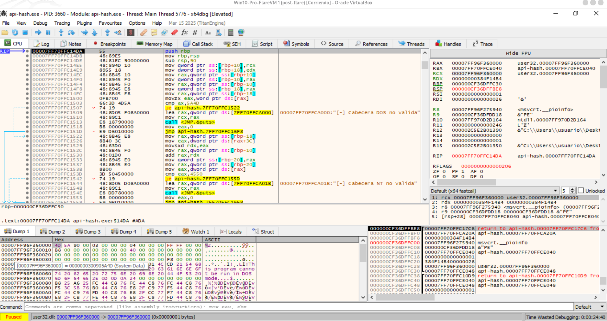

La captura confirma que estamos en el inicio del `resolver` dinámico y que los valores esperados son correctos:
```bash
RCX = 00007FF96F360000 → base de user32.dll.
RDX = 00000000384F14B4 → hash objetivo de MessageBoxA.
```
En el Dump, en `00007FF96F360000`, aparecen los bytes `4D 5A `→ firma `MZ` válida de la cabecera `DOS`.
El código hace `cmp ax, 5A4D`, verificando justamente esa firma.
Después aparece `mov eax, dword ptr [rax+3C]`, que lee `e_lfanew`.
Luego suma ese `offset` a la base y compara con `0x4550`, es decir `PE\0\0`.

En resumen, se demuestra dinámicamente este flujo:
```bash
LoadLibraryA("user32.dll")
        ↓
Base = 0x00007FF96F360000
        ↓
MZ comprobado
        ↓
e_lfanew en +0x3C
        ↓
PE\0\0 comprobado
```

El siguiente punto interesante es continuar tras la validación de `PE\0\0` para localizar el `Export Directory` y, después, `AddressOfNames`, `AddressOfNameOrdinals` y `AddressOfFunctions`. Ahí empieza propiamente la resolución de `APIs` por hash.

--------


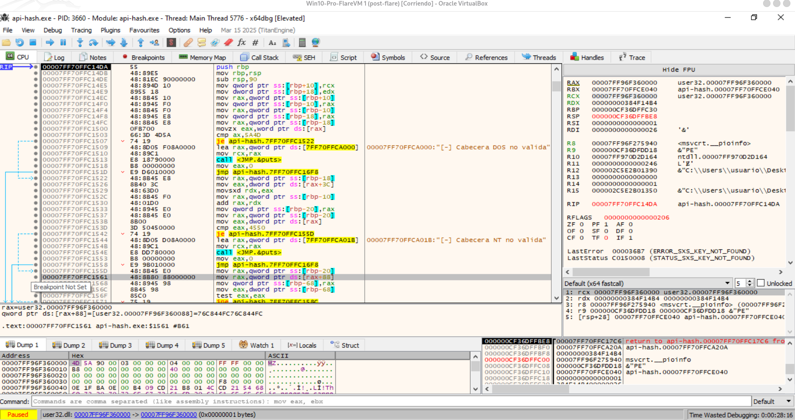

La captura muestra el momento en que el programa, ya dentro de `GetProcAddressByHash`, accede al directorio de exportaciones de `user32.dll`.

La instrucción clave es:

```bash
mov rax, qword ptr [rax+88]
```

Ese desplazamiento `+0x88` corresponde, en un `PE` de `64 bits`, a `OptionalHeader.DataDirectory[IMAGE_DIRECTORY_ENTRY_EXPORT]`. El programa obtiene así la información del `Export Directory` y guarda su `VirtualAddress`.

Después comprueba que ese `RVA` no sea cero mediante:
```bash
test eax,eax
```

En resumen, en esta fase el flujo es:
```bash
PE Header
   ↓
Optional Header
   ↓
DataDirectory[EXPORT]
   ↓
RVA del Export Directory
```

Es el paso previo a localizar `NumberOfNames`, `AddressOfNames`, Address``OfNameOrdinals y `AddressOfFunctions`, que serán usados para resolver la `API` por hash.


--------


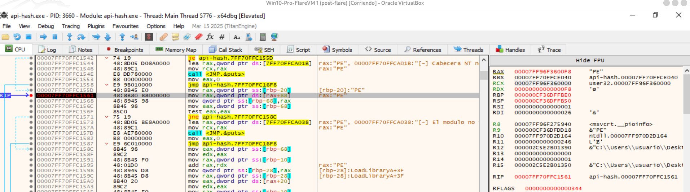
donde:
- Antes de ejecutar la instrucción, `RAX` apunta a los `IMAGE_NT_HEADERS64 de user32.dll`: `RAX = 00007FF96F3600F8`.


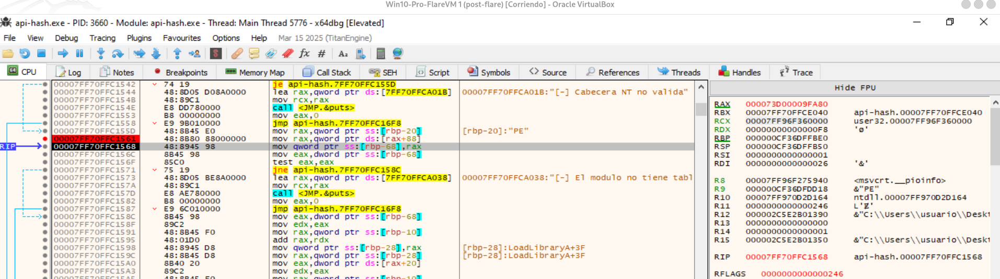
donde:
- Después de ejecutar la instrucción, `RAX` pasa a contener los 8 bytes del `DataDirectory[EXPORT]`: `RAX ≈ 000073D0 0009FA80`.
- Ya se ha leído correctamente el `Data Directory` de exportaciones de `user32.dll`.


---------------

Continuamos hasta esta secuencia:
```bash
mov edx,dword ptr [rbp-68]   ; EDX = 0x9FA80
mov rax,qword ptr [rbp-10]   ; RAX = base user32.dll
add rax,rdx                  ; base + RVA
mov qword ptr [rbp-28],rax
```

El cálculo esperado es:
```bash
00007FF96F360000   base user32.dll
+        0009FA80   RVA exportaciones
──────────────────
00007FF96F3FFA80   IMAGE_EXPORT_DIRECTORY
```

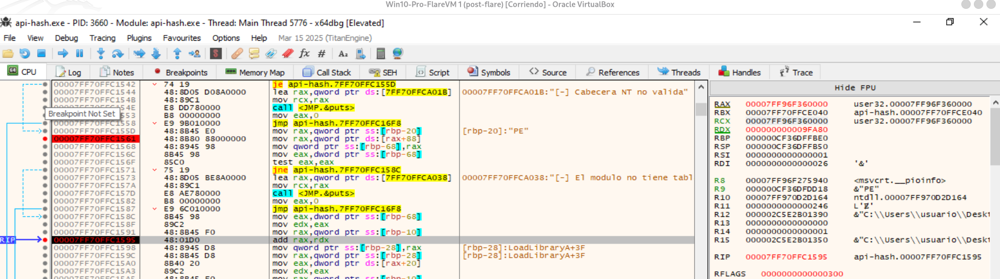

La captura muestra el momento justo antes de calcular la dirección virtual del `IMAGE_EXPORT_DIRECTORY`.

Los registros contienen:
```bash
RAX = 00007FF96F360000   → base de user32.dll
RDX = 000000000009FA80   → RVA del Export Directory
```

La instrucción actual es:
```bash
add rax, rdx
```

Por tanto, al ejecutarla con F8 se calculará:
```bash
00007FF96F360000
+        0009FA80
----------------
00007FF96F3FFA80
```

Ese resultado será la dirección en memoria del:
```bash
IMAGE_EXPORT_DIRECTORY
```

La siguiente instrucción:
```bash
mov qword ptr [rbp-28], rax
```
guardará esa dirección para utilizarla posteriormente.


En resumen:
```bash
Base user32.dll
      +
RVA Export Directory
      ↓
IMAGE_EXPORT_DIRECTORY
```


Ahora haremos `F8` sobre `add rax,rdx` y comprobar que `RAX = 00007FF96F3FFA80`. Después podremos empezar a leer `NumberOfNames`, `AddressOfFunctions`, `AddressOfNames` y `AddressOfNameOrdinals`.

-----------------


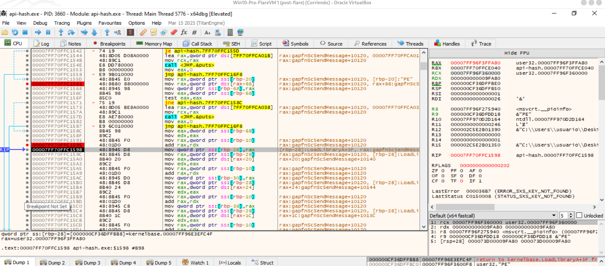
donde:
- La captura muestra que ya se ha calculado correctamente la dirección virtual del `IMAGE_EXPORT_DIRECTORY` de `user32.dll`.

Además, justo debajo ya aparecen los accesos importantes:
```bash
mov eax, dword ptr [rax+20]   ; AddressOfNames
...
mov eax, dword ptr [rax+24]   ; AddressOfNameOrdinals
...
mov eax, dword ptr [rax+1C]   ; AddressOfFunctions
```

Por tanto, el programa ya ha llegado al punto en el que obtiene las tres tablas necesarias para recorrer las `APIs` exportadas.

Siguiente paso: seguir el acceso a `[rax+20]`, porque `AddressOfNames` nos llevará al array de nombres de funciones sobre el que se calcularán los hashes.


-----------------


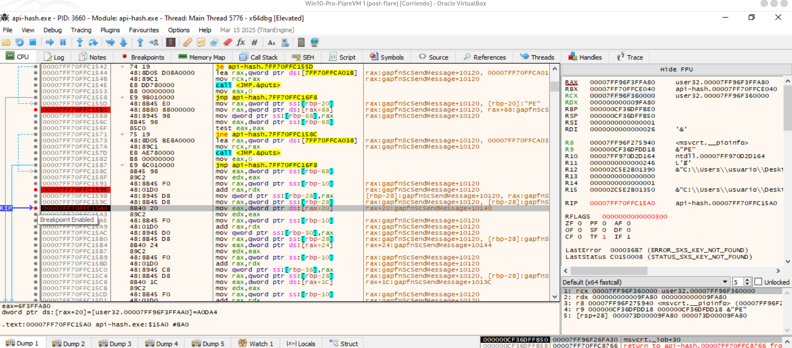

En ese momento:
```bash
RAX = 00007FF96F3FFA80
```
que es la dirección del `IMAGE_EXPORT_DIRECTORY` de `user32.dll`.

La instrucción va a leer:
```bash
[RAX + 0x20]
```
y ese campo corresponde a:
```bash
AddressOfNames
```

En la parte inferior `x64dbg` ya te muestra el valor:
```bash
dword ptr [rax+20] = A0DA4
```

Por tanto:
```bash
AddressOfNames RVA = 0x000A0DA4
```

El siguiente paso es hacer `F8`. Entonces:
```bash
EAX = 0x000A0DA4
```

Después seguimos unas instrucciones más hasta el:
```bash
add rax,rdx
```

porque ahí se calculará:
```bash
base user32.dll + RVA AddressOfNames
```
y obtendremos la dirección virtual real del array de nombres exportados. Esa tabla es la que el programa recorrerá `API` por `API` para calcular sus hashes.


-----

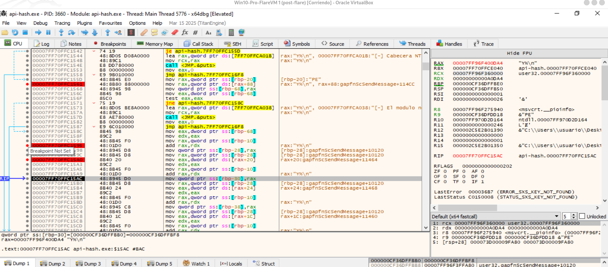


La captura muestra que ya se ha convertido correctamente el `RVA` de `AddressOfNames` en una dirección virtual.

Partíamos de:
```bash
Base user32.dll = 00007FF96F360000
RVA AddressOfNames = 000A0DA4
```

y tras:
```bash
add rax,rdx
```

obtenemos:
```bash
RAX = 00007FF96F400DA4
```


Esa dirección es el comienzo del array `AddressOfNames`, es decir, una tabla de `DWORD` que contiene los `RVA` de los nombres de las `APIs` exportadas.


En resumen, ya tenemos:
```bash
IMAGE_EXPORT_DIRECTORY
        │
        └── AddressOfNames
                  ↓
          00007FF96F400DA4
```

El siguiente paso útil es dejar que obtenga también `AddressOfNameOrdinals` y `AddressOfFunctions`. Después podremos entrar en el bucle que toma cada nombre de `AddressOfNames` y calcula su hash.


--------

Aquí `[rbp-38]` queda apuntando a la tabla `AddressOfNameOrdinals`:
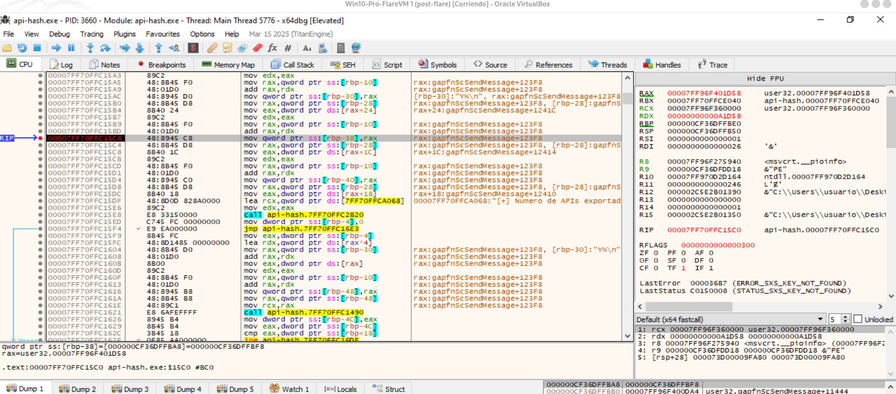


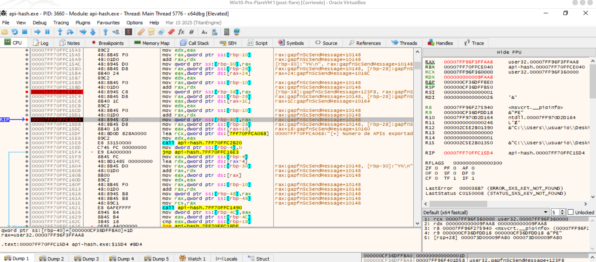


Ahora estamos justo en el bucle que recorre las `APIs` exportadas y calcula su hash:
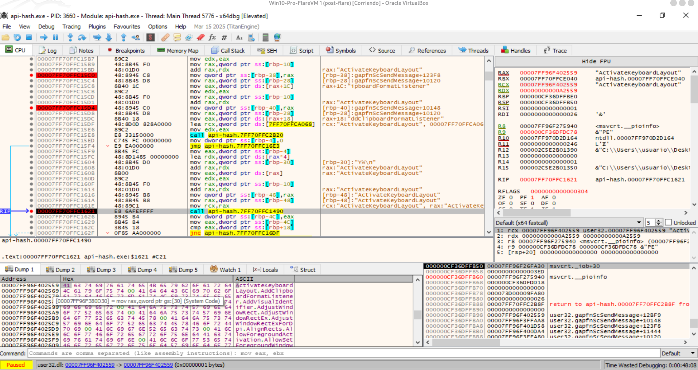


En la captura:
```bash
RCX = 00007FF96F402559
```

y `x64dbg` identifica esa dirección como:

```bash
"ActivateKeyboardLayout"
```

Es decir, el programa ha tomado uno de los nombres de `AddressOfNames` y lo pasa como primer argumento a:

```bash
00007FF70FFC1621  call api-hash.7FF70FFC1490
```

Esa función `7FF70FFC1490` es tu:

```bash
hash_api(functionName);
```

El flujo que estamos viendo es:
```bash
AddressOfNames
      ↓
RVA del nombre
      ↓
base user32.dll + RVA
      ↓
"ActivateKeyboardLayout"
      ↓
RCX = dirección del string
      ↓
call hash_api
```

Después de ejecutar el `call`, tenemos:

```bash
mov dword ptr [rbp-4C],eax
mov eax,dword ptr [rbp-4C]
cmp eax,dword ptr [rbp+18]
jne ...
```

Esto corresponde a:
```bash
currentHash = hash_api(functionName);

if (currentHash == targetHash)
```

Recordemos:

```bash
[rbp+18] = 0x384F14B4
```

que es el hash objetivo de `MessageBoxA`.

Siguiente paso: Poner un breakpoint en:
```bash
cmp eax,dword ptr [rbp+18]
```

Así podremos observar:
```bash
EAX       = hash de la API actual
[rbp+18]  = 384F14B4
```

Al principio no coincidirá porque estamos procesando:

```bash
ActivateKeyboardLayout
```

El bucle continuará con:
```bash
AddClipboardFormatListener
AdjustWindowRect
...
```

hasta llegar a:
```bash
MessageBoxA
```

En esa iteración:

```bash
EAX = 384F14B4
```

y la comparación será igual. Ese es uno de los puntos más importantes del laboratorio porque demostrará dinámicamente cómo el programa identifica una `API` sin comparar su nombre directamente, sino únicamente su hash.


---------------------


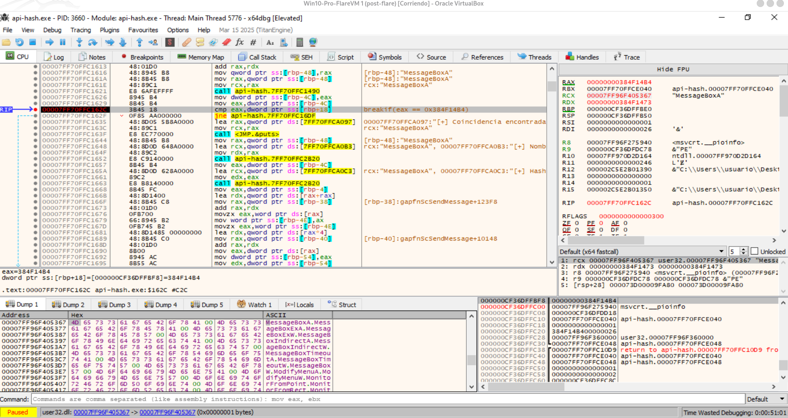

La captura confirma la coincidencia positiva del hashing y prácticamente cierra el laboratorio.

En el breakpoint de:
```bash
cmp eax, dword ptr [rbp+18]
```

se observa:
```bash
EAX      = 384F14B4
[rbp+18] = 384F14B4
```

Además:
```bash
RCX = 00007FF96F405367 → "MessageBoxA"
```

y `[rbp-48]` también apunta a `"MessageBoxA"`.

Eso demuestra que el programa ha recorrido los nombres exportados de `user32.dll`, ha calculado el hash de cada uno y finalmente ha encontrado:
```bash
hash("MessageBoxA") = 0x384F14B4
```

Al ejecutar ahora el `cmp` con `F8`, se establecerá:

```bash
ZF = 1
```

por lo que el siguiente:
```bash
jne api-hash.7FF70FFC16DF
```

no saltará, entrando en la rama de coincidencia:

```bash
"[+] Coincidencia encontrada"
```

Después el código utilizará `AddressOfNameOrdinals` y `AddressOfFunctions` para obtener el `RVA` de la función y calcular finalmente:

```bash
VA(MessageBoxA) = Base user32.dll + RVA
```

-----


**Conclusión del laboratorio:** Hemos demostrado dinámicamente todo el mecanismo:

```bash
LoadLibraryA("user32.dll")
        ↓
Base de user32.dll
        ↓
MZ → e_lfanew → PE
        ↓
Export Directory
        ↓
AddressOfNames
        ↓
recorrido de nombres
        ↓
hash de cada API
        ↓
MessageBoxA
        ↓
0x384F14B4 == 0x384F14B4
        ↓
AddressOfNameOrdinals
        ↓
AddressOfFunctions
        ↓
dirección de MessageBoxA
        ↓
CALL indirecto
```

Esta captura muestra simultáneamente el nombre `MessageBoxA`, su hash `0x384F14B4` y la comparación positiva que permite identificarla sin usar `GetProcAddress`.

------------


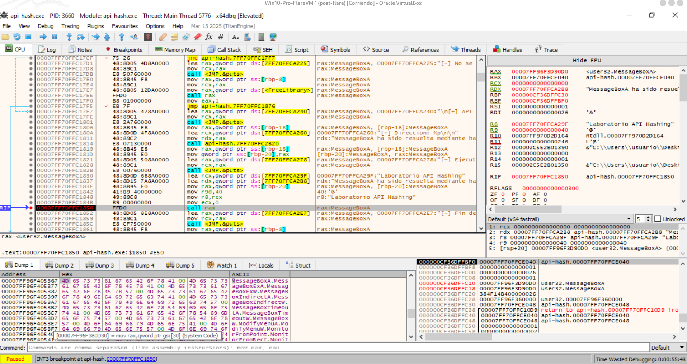

Por tanto, el programa está haciendo una llamada indirecta a la dirección de `MessageBoxA` que resolvió previamente mediante hashing.

Lo importante es que no aparece:
```bash
call user32.MessageBoxA
```

sino:

```bash
call rax
```

Es decir:

```bash
hash
 ↓
resolución manual en Export Table
 ↓
dirección de MessageBoxA
 ↓
RAX = user32.MessageBoxA
 ↓
CALL RAX
```


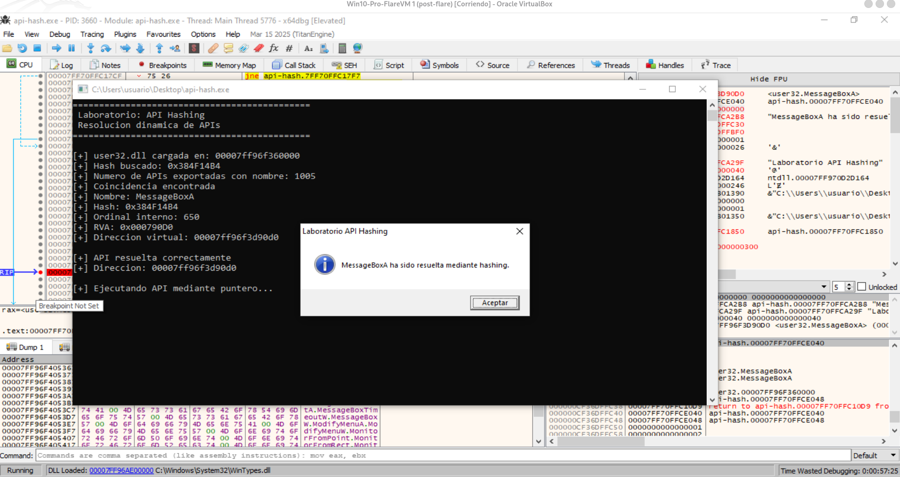

Se ve que la resolución dinámica ha terminado correctamente:

```bash
Hash buscado: 0x384F14B4
Nombre: MessageBoxA
RVA: 0x000790D0
Dirección virtual: 00007FF96F3D90D0
```

Y además, tras ejecutar el `call rax`, aparece el cuadro de diálogo de `MessageBoxA`.