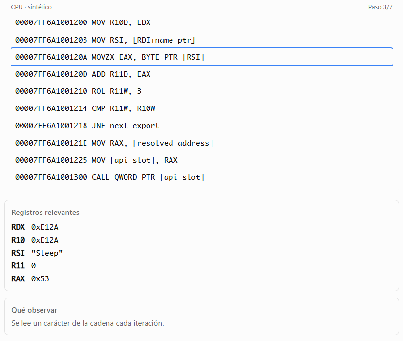
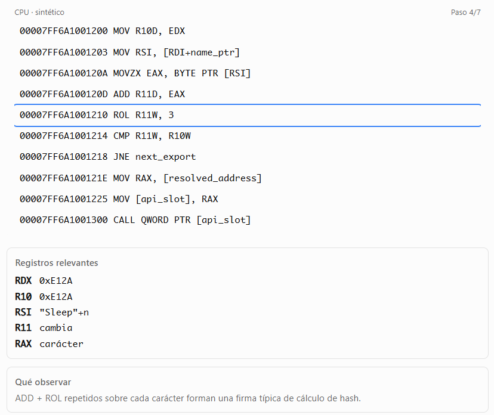
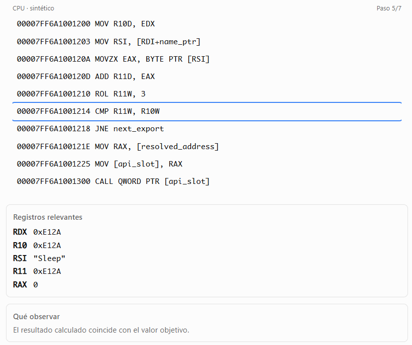
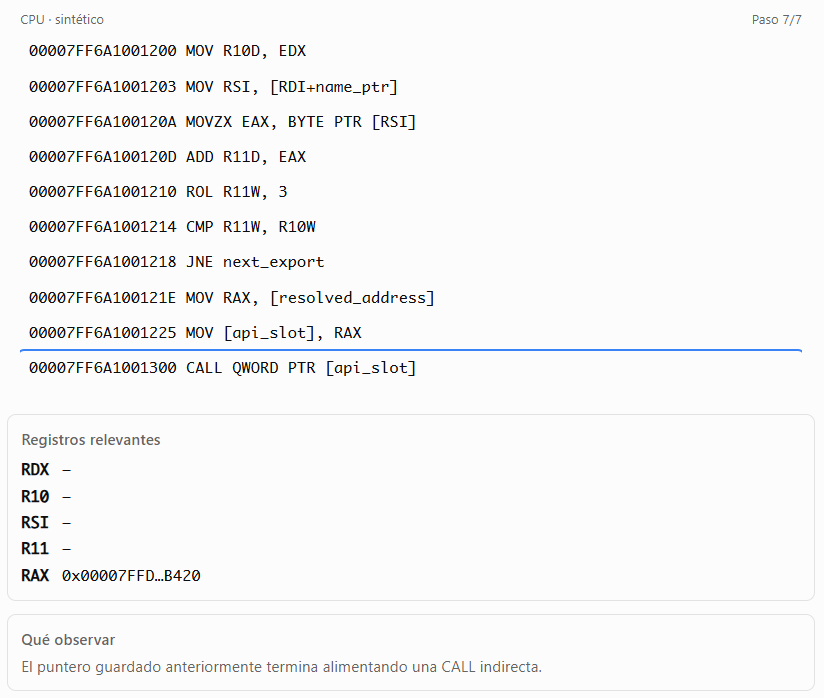
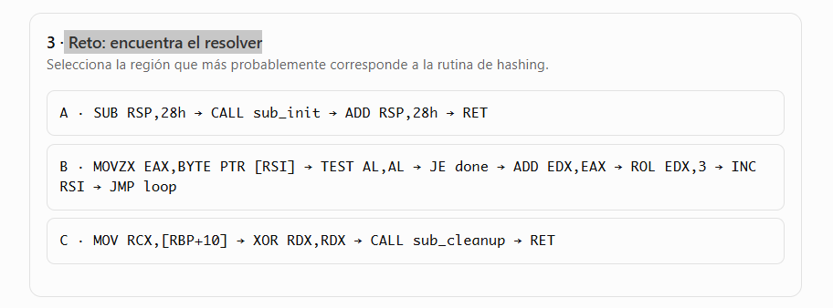
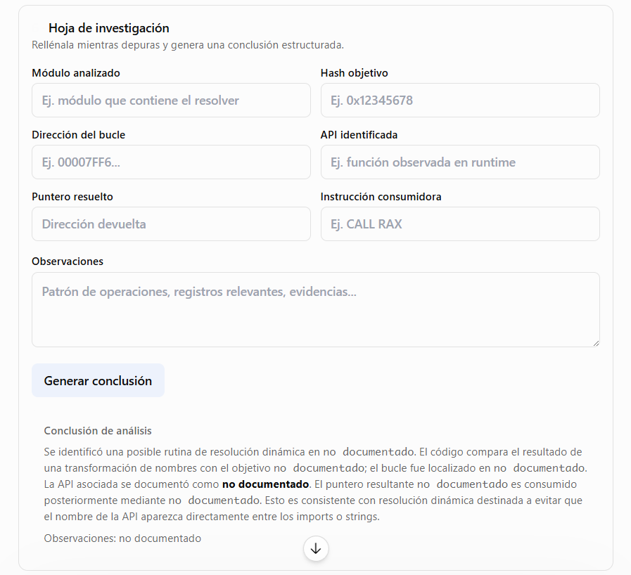
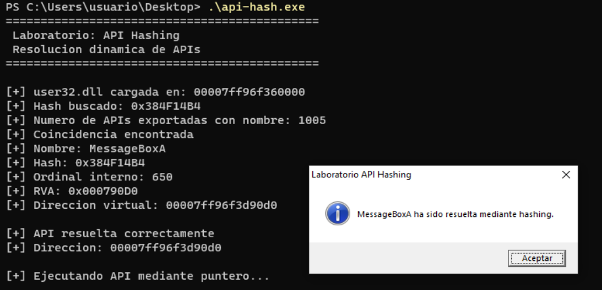
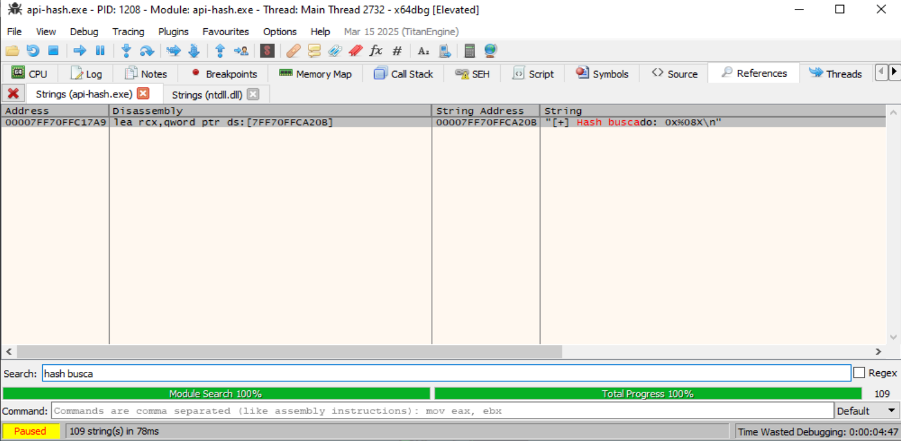
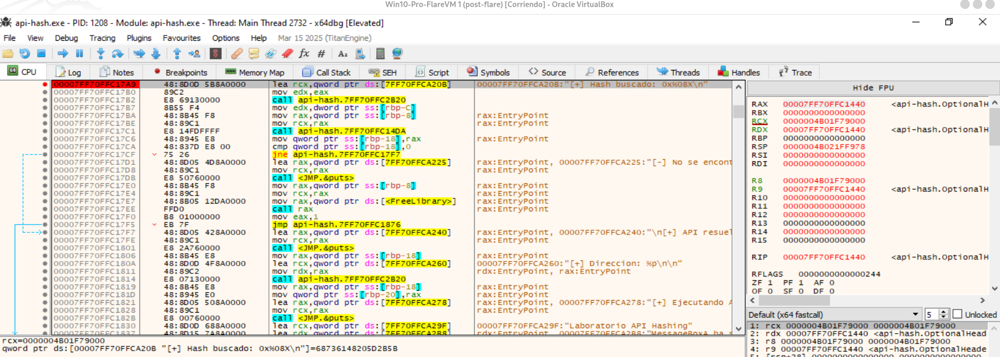

# Resolución dinámica de APIS que ocultan los nombres mediante hashing

Simulador de reversing para practicar exactamente el flujo que buscarías en x64dbg:
```
bucle de hashing → comparación → resolución en la tabla de exportaciones → 
→ puntero resultante → CALL/JMP indirecto.
```
Los comandos de breakpoint y vigilancia de memoria utilizados como referencia están documentados por x64dbg.

**Pregunta central del análisis:** Si no aparece `GetProcAddress("Sleep")`, ¿cómo demuestra el código qué función está buscando y dónde termina ejecutándola?

## 1. Anatomía del patrón
Secuencia que debemos aprender a reconocer:  


## 2. Simulador de sesión x64dbg


---


----




----




----




----


----





## 3. Reto: encuentra el resolver




## 4. Procedimiento


## 5. Hoja de Investigación




## 6. Ejemplo practico

Programa que hace una carga dinámica de una API ocultando el nombre mediante hashing: [api-hash.c](https://github.com/soniasalido/cybersecurity/blob/main/LABS/Investigating%20Malware/Resolucion-Dinamica-APIS-ocultacion-nombres-mediante-hashing/api-hash.c)

Compilamos el programa para obtener un ejecutable para Windows:
```bash
x86_64-w64-mingw32-gcc -Wall -Wextra -Wno-cast-function-type -O0 -g api-hash.c -o api-hash.exe
```

Abrimos una terminal de comandos y lo ejecutamos:

donde:
- La salida confirma que tu resolver ha localizado `MessageBoxA` mediante el hash `0x384F14B4` y ha calculado su dirección dentro de `user32.dll`.


En la ventana CPU: `clic derecho → Search for → Current Module → String references`. Buscamos alguna de la cadena: `Hash buscado`:
  



