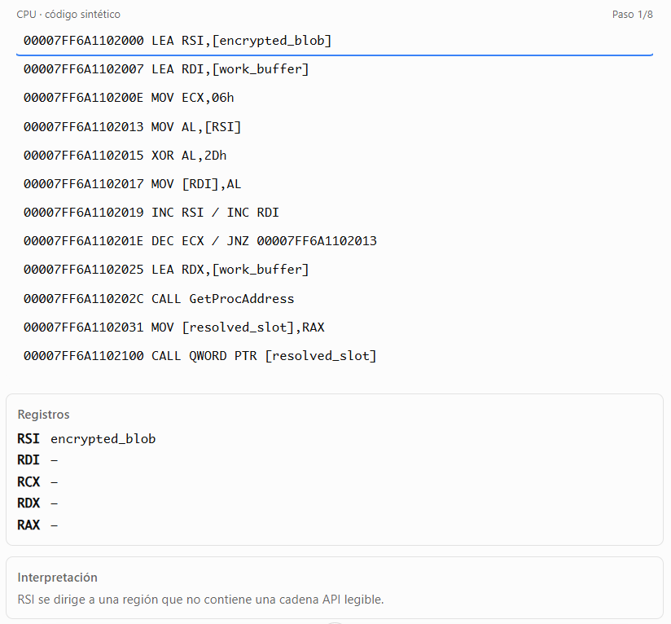
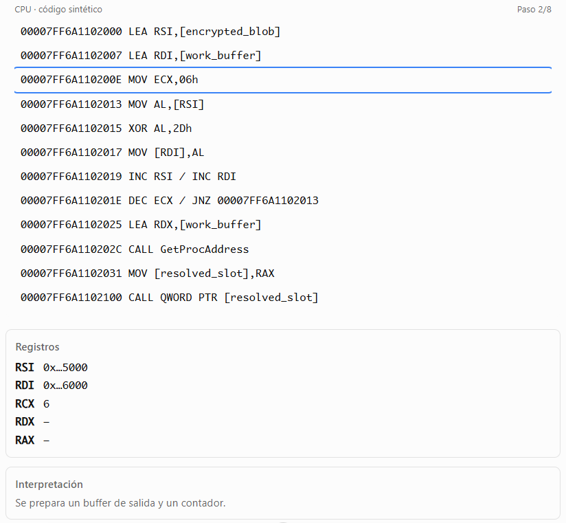
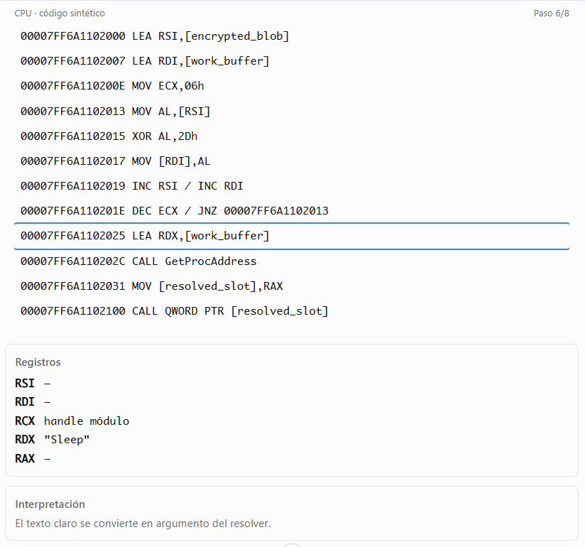

# Resolución dinámica de APIS que ocultan los nombres mediante cifrado

Simulador de reversing para prácticar sobre una evidencia observable en x64dbg.

### 1. Anatomía del patrón

```
buffer cifrado → rutina de descifrado → nombre API visible temporalmente → resolver → puntero almacenado → llamada indirecta.
```
Para el seguimiento, x64dbg permite breakpoints por nombre (bpx) y breakpoints de memoria de lectura/escritura/ejecución (bpm).


### 2. Simulador de sesión x64dbg



---




---


---


---


---



---


---


-----


