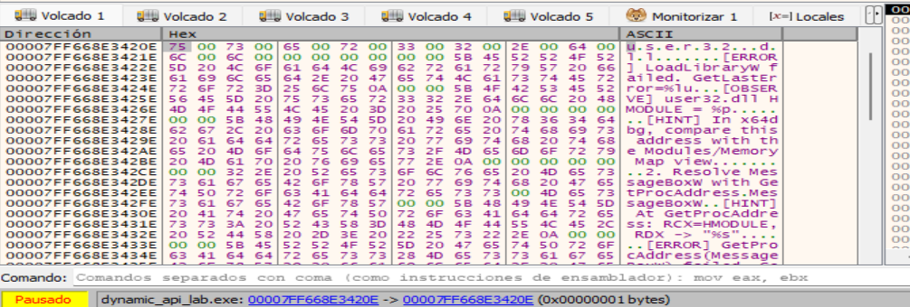

# Laboratorio x64dbg: carga dinámica de APIs

## Objetivo

Reconocer en depuración el patrón:

1. `LoadLibraryW("user32.dll")`
2. `GetProcAddress(hModule, "MessageBoxW")`
3. almacenamiento de la dirección resuelta
4. `CALL` indirecto a la API
5. `FreeLibrary`

La muestra es deliberadamente benigna. No implementa persistencia, inyección, descarga de código, anti-debugging, ejecución de comandos ni resolución de APIs por hash.

---

## 1. Preparación

- Instalación de MSYS2 desde su web oficial: [MSYS2 oficial](https://www.msys2.org/?utm_source=chatgpt.com).
- Abrimos la consola: `MSYS2 UCRT64`.
- Instalamos GCC: `pacman -S mingw-w64-ucrt-x86_64-gcc`.
- Para instalar el toolchain completo: `pacman -S mingw-w64-ucrt-x86_64-toolchain`.
- Desde la terminal `MSYS2 UCRT64`, vamos a la carpeta del proyecto.
- Compilación de `dynamic_api_lab.c`:
   ```
   gcc -Wall -Wextra -Wno-cast-function-type -O0 -g -municode \
   dynamic_api_lab.c -o dynamic_api_lab.exe
   ```
- Ejecutamos: `./dynamic_api_lab.exe`. Veremos algo parecido a:
   ```
   ======================================================
    x64dbg Educational Lab - Dynamic API Loading
    Benign demo: LoadLibraryW + GetProcAddress
   ======================================================
   
   [INFO] Guided mode enabled.
   [INFO] Suggested x64dbg breakpoints:
          bp kernel32.LoadLibraryW
          bp kernel32.GetProcAddress
   ```
- Después aparecerá una ventana generada mediante la `MessageBoxW` resuelta dinámicamente.


---

## 2. Breakpoints principales

En la barra de comandos de x64dbg ejecutamos:

```text
bp kernel32.LoadLibraryW
bp kernel32.GetProcAddress
```

Opcional:

```text
bp kernel32.FreeLibrary
```

Después pulsamos `F9`.

> En sistemas modernos algunas APIs pueden aparecer encaminadas mediante `KernelBase`. Si el breakpoint simbólico no se activa, localizaremos la exportación desde la vista `Symbols/Modules` y colocamos allí el breakpoint.


Pulsamos en la terminal `Enter` para continuar.

---

## 3. Primera parada: LoadLibraryW

El programa se detiene en `LoadLibraryW`:


`LoadLibraryW` es una API de Windows que carga un módulo especificado en el espacio de direcciones del proceso actual y devuelve un identificador del módulo cargado. El módulo especificado puede hacer que se carguen otros módulos.

### Sintaxis
```
HMODULE LoadLibraryW(
  [in] LPCWSTR lpLibFileName
);
```
donde:
- `[in] lpLibFileName`: Es el nombre del módulo. Puede ser:
   - Un módulo de biblioteca (un archivo `.dll`).
   - Un módulo ejecutable (un archivo `.exe`). Si el módulo especificado es un módulo ejecutable, no se cargan las importaciones estáticas. En su lugar, el módulo se carga como si `LoadLibraryEx` con la marca `DONT_RESOLVE_DLL_REFERENCES`.
- Valor devuelto:
   - Si la API se ejecuta correctamente, el valor devuelto es un identificador del módulo.
   - Si se produce un error en la API, el valor devuelto es `NULL`. Para obtener información de error extendida, llamamos a `GetLastError`.

### Por ejemplo
```
HMODULE hModule = LoadLibraryW(L"user32.dll");
```
Aquí Windows busca `user32.dll`, la carga si es necesario y devuelve un `HMODULE`.


### Qué significa la W
Windows suele ofrecer dos versiones de muchas APIs:
```
LoadLibraryA  → cadenas ANSI
LoadLibraryW  → cadenas Unicode UTF-16
```
Por eso:
```
LoadLibraryW(L"user32.dll");
```
usa una cadena de caracteres anchos:
```
u s e r 3 2 . d l l
```
almacenada en memoria como UTF-16.

### Qué ocurre internamente
Conceptualmente, cuando ejecutamos:
```
LoadLibraryW(L"user32.dll");
```

el flujo es:
```
programa
   │
   ▼
LoadLibraryW("user32.dll")
   │
   ├─ localiza la DLL
   │
   ├─ comprueba si ya está cargada
   │
   ├─ mapea la DLL en memoria si hace falta
   │
   ├─ procesa sus dependencias
   │
   ├─ realiza las tareas del loader
   │
   ▼
HMODULE
```
Ese `HMODULE` representa esencialmente el módulo cargado y puede utilizarse después con otras APIs.


Por ejemplo:
```
HMODULE h = LoadLibraryW(L"user32.dll");

FARPROC p = GetProcAddress(
    h,
    "MessageBoxW"
);
```
**La combinación:**
```
LoadLibrary
     +
GetProcAddress
```
**es precisamente uno de los patrones clásicos de resolución dinámica de APIs.**

### Qué devuelve

**Si funciona:**
```
HMODULE hModule
```
contendrá un valor válido, por ejemplo conceptualmente:
```
00007FFC12340000
```
En Windows, ese valor normalmente corresponde a la dirección base del módulo cargado.

**Si falla:**
```
hModule == NULL
```
y podemos obtener información sobre el error con:
```
GetLastError();
```

**Ejemplo:**
```
HMODULE h = LoadLibraryW(L"user32.dll");

if (h == NULL) {
    printf("Error: %lu\n", GetLastError());
}
```

### Observamos en x64dbg

Como estamos trabajando con un ejecutable de `64 bits`, Windows utiliza la convención de llamadas `x64`. Los primeros argumentos van en:
```
1º argumento → RCX
2º argumento → RDX
3º argumento → R8
4º argumento → R9
```

`LoadLibraryW` solamente tiene un argumento:
```
LoadLibraryW(lpLibFileName);
```

Por tanto, justo antes de entrar en `LoadLibraryW`:
```
RCX → puntero al nombre de la DLL

En nuestro laboratorio:
RCX
 │
 ▼
memoria
 │
 ▼
"user32.dll"
```

También sabemos que:
```
ANTES de ejecutarse la función:

RCX ───────► L"user32.dll"


           LoadLibraryW
               │
               ▼

--------------------------------------------------------------------

DESPUÉS de ejecutarse la función:

RAX ───────► HMODULE de user32.dll
```

### Seguimos RCX

Como hemos visto antes, para `LoadLibraryW` su primer (y único) argumento está en `RCX`.
1. Seleccionamos `RCX`: `00007FF668E3420E`.
2. Seguimos su dirección en Dump.
3. La interpretamos como `UTF-16`.
4. Debemos encontrar: `user32.dll`:


donde:
-  Vemos que aparecen estos bytes:
   ```
   75 00 73 00 65 00 72 00 33 00 32 00 2E 00 64 00 ...
   ```
- Interpretados como UTF-16LE son:
   ```
   u  s  e  r  3  2  .  d  l  l
   ```
- Es decir:
   ```
   user32.dll
   ```
- La `W` de `LoadLibraryW` explica los `00` que vemos entre las letras: la cadena está almacenada como `UTF-16LE`.
- La cadena termina en:
   ```
   00 00
   ```
   porque las cadenas Unicode de Windows terminan con un carácter nulo `UTF-16`.


### Lo que está ocurriendo

`LoadLibraryW` no se está resolviendo dinámicamente. La usamos para resolver/cargar lo necesario para luego obtener `MessageBoxW`.

En la llamada a `LoadLibraryW`, `RCX` apunta al nombre de la biblioteca que el programa quiere cargar dinámicamente, en este caso `user32.dll`. La resolución dinámica de una `API` concreta ocurre después, con:
```
GetProcAddress(hModule, "MessageBoxW");
```

Así que en `GetProcAddress` sí podremos decir:
```
RDX apunta al nombre de la API que se está resolviendo dinámicamente, en este caso MessageBoxW.
```

La secuencia es:
```
LoadLibraryW
RCX → "user32.dll"
          ↓
      HMODULE
          ↓
GetProcAddress
RCX → HMODULE
RDX → "MessageBoxW"
          ↓
RAX → dirección de MessageBoxW
```

------

### Carga dinámica de LoadLibrary

Para que se realizara una carga dinámica de `LoadLibrary`, tendríamos que tener algo como:
```
GetProcAddress(hKernel32, "LoadLibraryW");
```
entonces sí veríamos:
```
RDX → "LoadLibraryW"
```
y podríamos afirmar que `LoadLibraryW` está siendo resuelta dinámicamente.


## 4. Segunda parada: GetProcAddress

La llamada conceptual es:

```c
GetProcAddress(user32, "MessageBoxW");
```

En el breakpoint comprueba:

- `RCX`: handle/base del módulo.
- `RDX`: puntero a una cadena ANSI.
- sigue `RDX` en Dump.
- identifica `MessageBoxW`.

Cuando la función retorne:

- `RAX` contiene la dirección de la función resuelta.

Anota esa dirección.

### Comprobación

Sigue `RAX` en el disassembler y verifica que la dirección pertenece a
`user32.dll` o al módulo de sistema al que la exportación sea redirigida.

---

## 5. Localizar el CALL indirecto

Continúa hasta volver al código del programa.

Busca el punto en el que se usa la dirección obtenida con `GetProcAddress`.

Según compilador y build, puedes encontrar patrones equivalentes a:

```asm
call rax
```

o:

```asm
call qword ptr [rbp-...]
```

o una secuencia donde la dirección se mueve primero a otro registro:

```asm
mov rax, [...]
call rax
```

La característica importante no es el registro concreto, sino que el destino
del `CALL` procede de la dirección retornada previamente por `GetProcAddress`.

---

## 6. Segunda API dinámica

La muestra repite el patrón con:

```text
kernel32.dll
GetTickCount64
```

Repite el análisis y completa:

| Elemento | Valor observado |
|---|---|
| DLL | |
| API | |
| `HMODULE` | |
| Dirección de la API | |
| Instrucción de llamada indirecta | |

---

## 7. Comparación con una importación estática

Abre `static_control.exe` en otra sesión de x64dbg.

Este ejecutable invoca `MessageBoxW` de forma normal.

Compara:

### Muestra estática

Esperas encontrar una referencia ligada a la Import Address Table (IAT).

### Muestra dinámica

La API `MessageBoxW` no necesita aparecer como importación directa del
ejecutable; el programa obtiene su dirección en tiempo de ejecución mediante
`GetProcAddress`.

---

## 8. Indicadores útiles durante análisis de malware

La carga dinámica de APIs no es maliciosa por sí misma. Es común en software
legítimo para compatibilidad, plugins y APIs opcionales.

En una muestra sospechosa, el patrón gana relevancia cuando aparece junto con:

- muchas llamadas a `LoadLibrary*` / `GetProcAddress`
- nombres de APIs construidos o descifrados en runtime
- resolución por hash
- API sets o módulos poco habituales
- llamadas indirectas posteriores
- combinación con otras técnicas de evasión

Este laboratorio se limita al patrón básico y observable.

---

## 9. Preguntas de estudio

1. ¿Qué diferencia existe entre importar `MessageBoxW` desde la IAT y resolverla
   con `GetProcAddress`?
2. ¿Qué registro contiene el primer argumento en la convención x64 de Windows?
3. ¿Dónde se devuelve la dirección resuelta?
4. ¿Por qué una herramienta de análisis estático puede ver menos nombres de API
   en una muestra que usa carga dinámica?
5. ¿Qué evidencia dinámica demuestra que el puntero obtenido es realmente usado?
6. ¿Por qué `LoadLibrary` + `GetProcAddress` no debe considerarse por sí solo un
   indicador suficiente de malware?

---

## 10. Reto

Ejecuta:

```text
dynamic_api_lab.exe --challenge
```

En este modo se ocultan las pistas impresas por consola. Intenta reconstruir
solo con x64dbg:

```text
DLL -> API -> dirección resuelta -> CALL indirecto -> efecto observable
```
