- [Laboratorio x64dbg: carga dinámica de APIs](#laboratorio-x64dbg-carga-dinámica-de-apis)
  - [1. Objetivo](#1-objetivo)
  - [2. Idea central](#2-idea-central)
  - [3. Seguridad](#3-seguridad)
  - [4. Preparación](#4-preparación)
  - [5. Breakpoints principales](#5-breakpoints-principales)
  - [6. Primera parada: LoadLibraryW](#6-primera-parada-loadlibraryw)
    - [Sintaxis de la API `LoadLibrary`](#sintaxis-de-la-api-loadlibrary)
    - [Por ejemplo](#por-ejemplo)
    - [Qué significa la W](#qué-significa-la-w)
    - [Qué ocurre internamente](#qué-ocurre-internamente)
    - [Qué devuelve](#qué-devuelve)
    - [Observamos en x64dbg](#observamos-en-x64dbg)
    - [Nota sobre la dirección `RVA` (Relative Virtual Address) de `RCX`](#nota-sobre-la-dirección-rva-relative-virtual-address-de-rcx)
    - [Seguimos RCX](#seguimos-rcx)
    - [Lo que está ocurriendo](#lo-que-está-ocurriendo)
    - [Carga dinámica de LoadLibrary](#carga-dinámica-de-loadlibrary)
  - [7. Ejecutamos `LoadLibraryW`](#7-ejecutamos-loadlibraryw)
  - [8. Parada en `GetProcAddress`](#8-parada-en-getprocaddress)
  - [9. Obtener la dirección de `MessageBoxW`](#9-obtener-la-dirección-de-messageboxw)
  - [10. Encontrar la llamada indirecta](#10-encontrar-la-llamada-indirecta)
    - [Lo importante: `call rax`](#lo-importante-call-rax)
    - [Para MessageBoxW:](#para-messageboxw)
  - [11. Reconstrucción de toda la técnica](#11-reconstrucción-de-toda-la-técnica)
  - [12. Segunda API dinámica](#12-segunda-api-dinámica)
    - [Obtenemos el `HMODULE`](#obtenemos-el-hmodule)
    - [Ejecutamos GetTickCount64 y regresamos a `dynamic_api_lab.exe`](#ejecutamos-gettickcount64-y-regresamos-a-dynamic_api_labexe)
    - [Instrucción CALL](#instrucción-call)
    - [Observación de interés con `RAX`](#observación-de-interés-con-rax)
  - [13. Indicadores útiles durante análisis de malware](#13-indicadores-útiles-durante-análisis-de-malware)
  - [14. Preguntas de estudio](#14-preguntas-de-estudio)
  - [15. Reto](#15-reto)

----

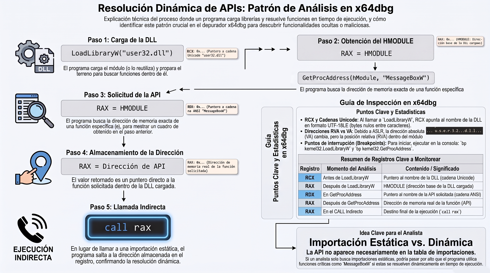

# Laboratorio x64dbg: carga dinámica de APIs

## 1. Objetivo

**Reconocer en depuración el patrón:**
- `DLL` cargada 🠮 `LoadLibraryW(L"user32.dll")`.
- Valor `HMODULE` devuelto por `LoadLibraryW`.
- Nombre de la `API` solicitada 🠮 `GetProcAddress(hModule, "MessageBoxW")`.
- Dirección de la `API` retornada por `GetProcAddress`.
- `CALL` indirecto a la `API` resuelta.


**El propósito es aprender a identificar el patrón de resolución dinámica de `APIs`:**
- Carga dinámica de una `DLL` mediante `LoadLibraryW`.
- Obtención del `HMODULE` correspondiente al módulo cargado.
- Resolución de una `API` concreta mediante `GetProcAddress`.
- Obtención de la dirección de la `API` en tiempo de ejecución.
- Invocación de la `API` mediante una llamada indirecta con `CALL`.

---

## 2. Idea central
La muestra principal ejecuta este patrón benigno:

```c
HMODULE h = LoadLibraryW(L"user32.dll");
FARPROC p = GetProcAddress(h, "MessageBoxW");
```

y después llama a la dirección obtenida mediante un puntero de función.

`user32.dll` es una DLL. `MessageBoxW` es una API/función exportada por `user32.dll`. Primero se carga la DLL `user32.dll`. Después se busca dentro de ese módulo la dirección de `MessageBoxW`.


**Estas dos líneas de código implementan el patrón básico de carga de una DLL y resolución dinámica de una API:**
- `HMODULE h = LoadLibraryW(L"user32.dll");` :
  - Carga `user32.dll` en el proceso actual (o reutiliza el módulo si ya estaba cargado) y guarda el identificador del módulo en `h`.
  - `HMODULE` es un tipo de Windows que representa un módulo cargado. En la práctica, su valor está asociado a la dirección base de la `DLL` en memoria.
  - La `L` de: `L"user32.dll"`  🠮 Indica una cadena Unicode de caracteres anchos. Por eso encaja con `LoadLibraryW`: La `W` significa que la función espera una cadena `UTF-16`.
- `FARPROC p = GetProcAddress(h, "MessageBoxW");`:
  - `FARPROC` es un tipo genérico de Windows utilizado para representar una dirección de función obtenida mediante `GetProcAddress`.
  - Significa: “dentro del módulo identificado por `h`, busca la función exportada llamada `MessageBoxW` y devuelve su dirección en memoria”.
  - El valor de `p` ya no representa la `DLL` completa. Representa la dirección concreta donde está `MessageBoxW`.


**La diferencia entre `h` y `p` es fundamental:**
```
h
│
└── identifica el módulo
    user32.dll

p
│
└── apunta a una función concreta
    MessageBoxW
```


**El flujo completo es:**
```
1. Obtener la DLL

HMODULE h =
    LoadLibraryW(L"user32.dll");

        ↓

h → user32.dll


2. Buscar una API dentro de esa DLL

FARPROC p =
    GetProcAddress(h, "MessageBoxW");

        ↓

p → dirección de MessageBoxW


3. Convertir el puntero

PFN_MessageBoxW fn =
    (PFN_MessageBoxW)p;


4. Ejecutar

fn(...);

        ↓

MessageBoxW(...)
```


**En términos de `x64dbg` lo que vamos a analizar es:**
```
LoadLibraryW
    RCX → L"user32.dll"
    RAX ← HMODULE

             ↓

GetProcAddress
    RCX → HMODULE
    RDX → "MessageBoxW"
    RAX ← dirección de MessageBoxW

             ↓

call rax
```
Y ese último **<mark>`call rax` es especialmente importante ya que demuestra que el programa llama a una dirección obtenida en tiempo de ejecución, en lugar de hacer una llamada convencional a una importación estática.</mark>**

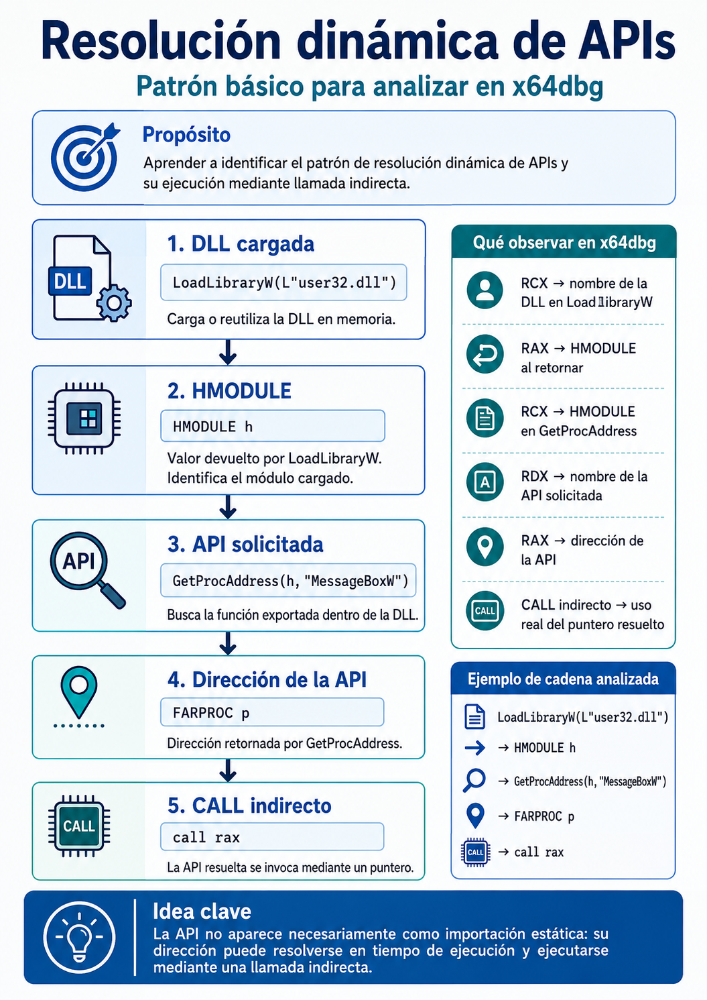

----

## 3. Seguridad

**El proyecto no incluye:**
- inyección de procesos
- shellcode
- descarga o ejecución remota
- persistencia
- anti-debugging
- escalada de privilegios
- resolución de APIs por hash
- ofuscación

Está diseñado exclusivamente como muestra de laboratorio local.

---

## 4. Preparación

- Instalación de MSYS2 desde su web oficial: [MSYS2 oficial](https://www.msys2.org/?utm_source=chatgpt.com).
- Abrimos la consola: `MSYS2 UCRT64`.
- Instalamos GCC: `pacman -S mingw-w64-ucrt-x86_64-gcc`.
- Para instalar el toolchain completo: `pacman -S mingw-w64-ucrt-x86_64-toolchain`.
- Desde la terminal `MSYS2 UCRT64`, vamos a la carpeta del proyecto.
- Compilación de [dynamic_api_lab.c](https://github.com/soniasalido/cybersecurity/blob/main/LABS/Investigating%20Malware/Resolucion-Dinamica-APIs/utiles/dynamic_api_lab.c):
   ```
   gcc -Wall -Wextra -Wno-cast-function-type -O0 -g -municode \
   dynamic_api_lab.c -o dynamic_api_lab.exe
   ```
- Obtenemos el ejecutable: `dynamic_api_lab.exe` con `SHA256`: `BCCDD5F875AB6E3BEB31664899E195FA56535100C655FDF0B12153963265EE2F`.
- Ejecutamos en la máquina virtual: `./dynamic_api_lab.exe`. Veremos algo parecido a:
   ```
   ======================================================
    x64dbg Educational Lab - Dynamic API Loading
    Benign demo: LoadLibraryW + GetProcAddress
   ======================================================
   
   [INFO] Guided mode enabled.
   [INFO] Suggested x64dbg breakpoints:
          bp kernel32.LoadLibraryW
          bp kernel32.GetProcAddress
   ```
- Después aparecerá una ventana generada mediante la `MessageBoxW` resuelta dinámicamente.

**Análisis de `dynamic_api_lab.exe` con `pestudio`:**
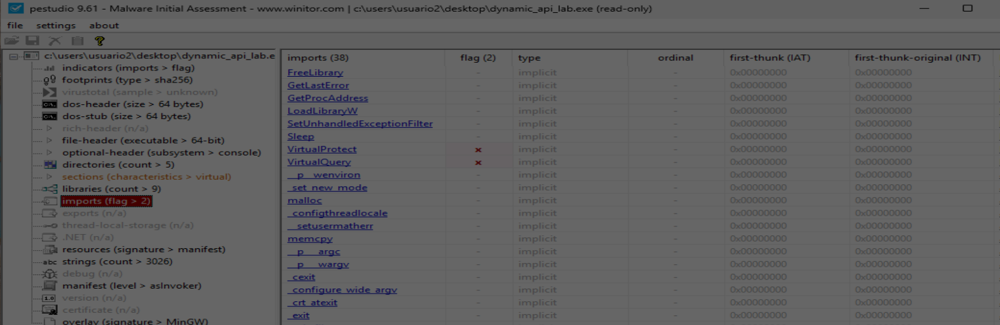
```
dynamic_api_lab.exe
        │
        ├── Import Table
        │      ├── LoadLibraryW
        │      ├── GetProcAddress
        │      ├── FreeLibrary
        │      └── GetLastError
        │
        ▼
 resolución dinámica posterior
```

El análisis estático con PeStudio revela la presencia de `LoadLibraryW` y `GetProcAddress` entre las funciones importadas por el ejecutable. Esta combinación constituye un indicador de posible resolución dinámica de `APIs`, aunque por sí sola no implica comportamiento malicioso. Las funciones posteriormente resueltas, como `MessageBoxW` o `GetTickCount64`, no necesitan figurar en la tabla de importaciones, ya que sus direcciones se obtienen durante la ejecución. Mediante análisis dinámico con `x64dbg` es posible interceptar `GetProcAddress`, identificar el nombre de la `API` solicitado y seguir la dirección retornada hasta la correspondiente llamada indirecta.


**Análisis de los strings:**
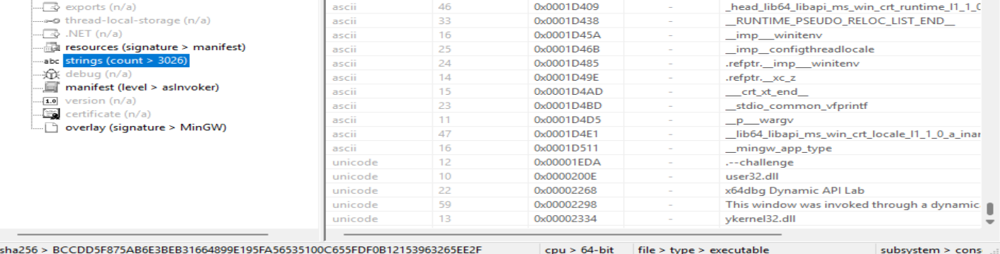
donde:
- Los nombres utilizados por el programa siguen almacenados como cadenas en claro dentro del ejecutable.
- Esas cadenas son Unicode (`UTF-16`), así que el compilador las almacena en alguna sección de datos del `PE` y PeStudio puede recuperarlas mediante análisis estático.


El análisis de cadenas mediante PeStudio permite identificar nombres como `user32.dll` y `kernel32.dll`, así como los nombres de las funciones empleados posteriormente por `GetProcAddress`. Esto evidencia que la resolución dinámica de `APIs` evita que dichas funciones aparezcan necesariamente en la tabla de importaciones, pero no impide por sí sola que sus nombres puedan recuperarse mediante análisis estático. Para dificultar también este tipo de análisis sería necesario ocultar, codificar o construir dinámicamente las cadenas utilizadas durante la resolución.

---

## 5. Breakpoints principales

En la barra de comandos de x64dbg ejecutamos:

```text
bp kernel32.LoadLibraryW
bp kernel32.GetProcAddress
```

Opcional:

```text
bp kernel32.FreeLibrary
```

Después pulsamos `F9`.

> En sistemas modernos algunas APIs pueden aparecer encaminadas mediante `KernelBase`. Si el breakpoint simbólico no se activa, localizaremos la exportación desde la vista `Symbols/Modules` y colocamos allí el breakpoint.


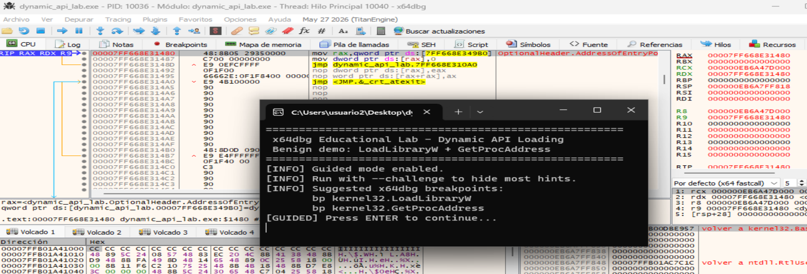

Pulsamos en la terminal `Enter` para continuar.

---

## 6. Primera parada: LoadLibraryW

El programa se detiene en `LoadLibraryW`:

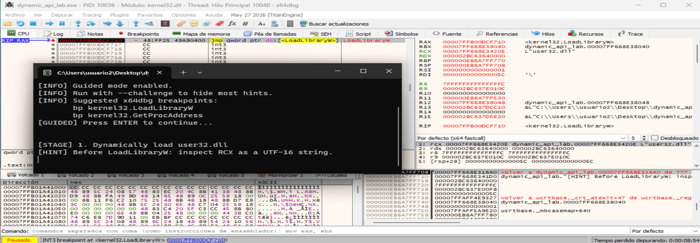

`LoadLibraryW` es una API de Windows que carga un módulo especificado en el espacio de direcciones del proceso actual y devuelve un identificador del módulo cargado. El módulo especificado puede hacer que se carguen otros módulos.


### Sintaxis de la API `LoadLibrary`
```
HMODULE LoadLibraryW(
  [in] LPCWSTR lpLibFileName
);
```
donde `LoadLibraryW`:
- Recibe → un parámetro de entrada llamado `lpLibFileName`. Este parámetro es el nombre del módulo. Puede ser:
   - Un módulo de biblioteca → un archivo `.dll`.
   - Un módulo ejecutable → un archivo `.exe`.
- Devuelve → un `HMODULE`. Este valor devuelto:
   - <mark>Si la API se ejecuta correctamente, el valor devuelto es un identificador del módulo.</mark>
   - Si se produce un error en la API, el valor devuelto es `NULL`. Para obtener información del error obtenido se llamaría a `GetLastError`.
- `[in]` → Es una anotación de la documentación de Microsoft. Significa que el parámetro es de entrada: el programa proporciona ese dato a la función.
- `LPCWSTR` → Es el tipo del parámetro de entrada.
- `LPCWSTR lpLibFileName` significa: `lpLibFileName` es un puntero a una cadena `UTF-16` que contiene el nombre o la ruta de la biblioteca que se quiere cargar. Especifica un puntero a una cadena Unicode de sólo lectura.


**<mark>`LoadLibraryW` recibe el nombre Unicode de una DLL y devuelve un `HMODULE` que identifica el módulo cargado.</mark>**

### Por ejemplo
```
HMODULE h = LoadLibraryW(L"user32.dll");
```
Aquí Windows busca `user32.dll`, la carga y devuelve un `HMODULE`.


### Qué significa la W
Windows suele ofrecer dos versiones de muchas APIs:
```
LoadLibraryA  → cadenas ANSI
LoadLibraryW  → cadenas Unicode UTF-16
```
Por eso:
```
LoadLibraryW(L"user32.dll");
```
usa una cadena de caracteres anchos:
```
u s e r 3 2 . d l l
```
almacenada en memoria como UTF-16.

### Qué ocurre internamente
Conceptualmente, cuando ejecutamos:
```
LoadLibraryW(L"user32.dll");
```

el flujo es:
```
programa
   │
   ▼
LoadLibraryW("user32.dll")
   │
   ├─ localiza la DLL
   │
   ├─ comprueba si ya está cargada
   │
   ├─ mapea la DLL en memoria si hace falta
   │
   ├─ procesa sus dependencias
   │
   ├─ realiza las tareas del loader
   │
   ▼
HMODULE
```
Ese `HMODULE` representa esencialmente el módulo cargado y puede utilizarse después con otras APIs.


Por ejemplo:
```
HMODULE h = LoadLibraryW(L"user32.dll");

FARPROC p = GetProcAddress(
    h,
    "MessageBoxW"
);
```
**<mark>La combinación:</mark>**
```
LoadLibrary
     +
GetProcAddress
```
**<mark>es precisamente uno de los patrones clásicos de resolución dinámica de APIs.</mark>**

### Qué devuelve

**Si funciona:**
```
HMODULE hModule
```
contendrá un valor válido, por ejemplo conceptualmente:
```
00007FFC12340000
```
En Windows, <mark>ese valor normalmente corresponde a la dirección base del módulo cargado.</mark>

**Si falla:**
```
hModule == NULL
```
y podemos obtener información sobre el error con:
```
GetLastError();
```

**Ejemplo:**
```
HMODULE h = LoadLibraryW(L"user32.dll");

if (h == NULL) {
    printf("Error: %lu\n", GetLastError());
}
```

### Observamos en x64dbg

Como estamos trabajando con un **ejecutable de `64 bits`, Windows utiliza la convención de llamadas `x64`**. Los primeros argumentos van en:
```
1º argumento → RCX
2º argumento → RDX
3º argumento → R8
4º argumento → R9
```

`LoadLibraryW` solamente tiene un argumento:
```
LoadLibraryW(lpLibFileName);
```

Por tanto, justo antes de entrar en `LoadLibraryW`:
```
RCX → puntero al nombre de la DLL

En nuestro laboratorio:
RCX
 │
 ▼
memoria
 │
 ▼
"user32.dll"
```

También sabemos que:
```
ANTES de ejecutarse la función:

RCX ───────► L"user32.dll"


           LoadLibraryW
               │
               ▼

--------------------------------------------------------------------

DESPUÉS de ejecutarse la función:

RAX ───────► HMODULE de user32.dll
```

### Nota sobre la dirección `RVA` (Relative Virtual Address) de `RCX`
La `RVA` (Relative Virtual Address) es la dirección relativa respecto a la base donde se ha cargado el ejecutable.

En la ejecución veremos:
```
RCX = 00007FF6D372420E
```
y el módulo `dynamic_api_lab.exe` está cargado aproximadamente en:
```
ImageBase = 00007FF6D3720000
```
Por tanto:
```
RVA = VA - ImageBase
```
Aplicándolo:
```
00007FF6D372420E
-
00007FF6D3720000
----------------
000000000000420E
```
Así que la dirección relativa estable es:
```
dynamic_api_lab.exe + 0x420E
```
o simplemente:
```
RVA = 0x420E
```
Eso significa que, aunque `ASLR` cambie la dirección base en cada ejecución de `dynamic_api_lab.exe` en `x64dbg`, mientras el binario no cambie, la cadena `L"user32.dll"` seguirá estando en:
```
Base actual del módulo + 0x420E
```

**<mark>Debido a `ASLR`, la dirección virtual absoluta de la cadena `L"user32.dll"` puede variar entre ejecuciones. Sin embargo, su posición relativa dentro del módulo permanece constante mientras el binario no sea modificado. En la ejecución analizada, la cadena se encuentra en `0x00007FF6D372420E` y el ejecutable está cargado en `0x00007FF6D3720000`, por lo que su `RVA` es `0x420E`. En consecuencia, puede referenciarse de forma independiente de `ASLR` como `dynamic_api_lab.exe+0x420E`.</mark>**

### Seguimos RCX

Como hemos visto antes, para `LoadLibraryW` su primer (y único) argumento está en `RCX`.
1. Seleccionamos `RCX`: `00007FF6D372420E`.
2. Seguimos su dirección en Dump.
3. La interpretamos como `UTF-16`.
4. Debemos encontrar: `user32.dll`:

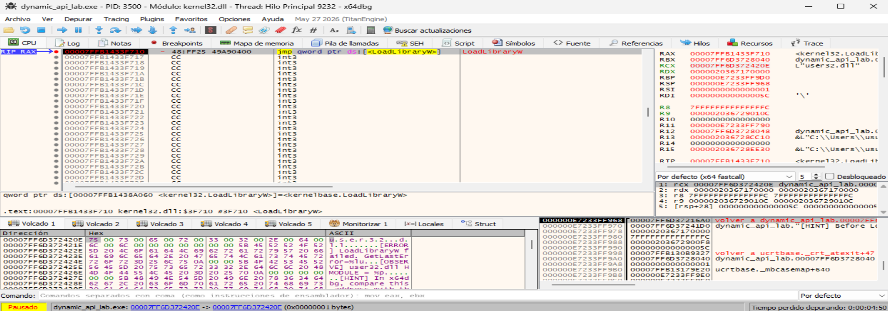
donde:
-  Vemos que aparecen estos bytes:
   ```
   75 00 73 00 65 00 72 00 33 00 32 00 2E 00 64 00 ...
   ```
- Interpretados como UTF-16LE son:
   ```
   u  s  e  r  3  2  .  d  l  l
   ```
- Es decir:
   ```
   user32.dll
   ```
- La `W` de `LoadLibraryW` explica los `00` que vemos entre las letras: la cadena está almacenada como `UTF-16LE`.
- La cadena termina en:
   ```
   00 00
   ```
   porque las cadenas Unicode de Windows terminan con un carácter nulo `UTF-16`.
- <mark>Ahora mismo `RAX` todavía no es el `HMODULE`. En esta captura `RAX` apunta a `kernel32.LoadLibraryW`, porque aún no se ha ejecutado la función.</mark>


### Lo que está ocurriendo

`LoadLibraryW` no se está resolviendo dinámicamente. La usamos para resolver/cargar lo necesario para luego obtener `MessageBoxW`.

En la llamada a `LoadLibraryW`, `RCX` apunta al nombre de la biblioteca que el programa quiere cargar dinámicamente, en este caso `user32.dll`. La resolución dinámica de una `API` concreta ocurre después, con:
```
GetProcAddress(hModule, "MessageBoxW");
```

Así que en `GetProcAddress` sí podremos decir: <mark>`RDX` apunta al nombre de la API que se está resolviendo dinámicamente, en este caso `MessageBoxW`.</mark>

La secuencia es:
```
LoadLibraryW
RCX → "user32.dll"
          ↓
      HMODULE
          ↓
GetProcAddress
RCX → HMODULE
RDX → "MessageBoxW"
          ↓
RAX → dirección de MessageBoxW
```

------

### Carga dinámica de LoadLibrary

Para que se realizara una carga dinámica de `LoadLibrary`, tendríamos que tener algo como:
```
GetProcAddress(hKernel32, "LoadLibraryW");
```
entonces sí veríamos:
```
RDX → "LoadLibraryW"
```
y podríamos afirmar que `LoadLibraryW` está siendo resuelta dinámicamente.

-----

## 7. Ejecutamos `LoadLibraryW`

Pulsamos una vez `F8`. Terminamos dentro de `kernelbase.LoadLibraryW:`:

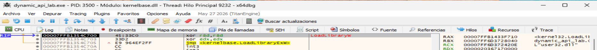


Ejecutamos hasta que regrese al programa principal: Dentro de KernelBase.LoadLibraryW, usamos `Execute till return`:
```
Ctrl + F9
```

Teminamos dentro de `gdi32full.dll`, es decir, dentro de código interno de Windows que se está ejecutando como consecuencia de la carga de `user32.dll`:
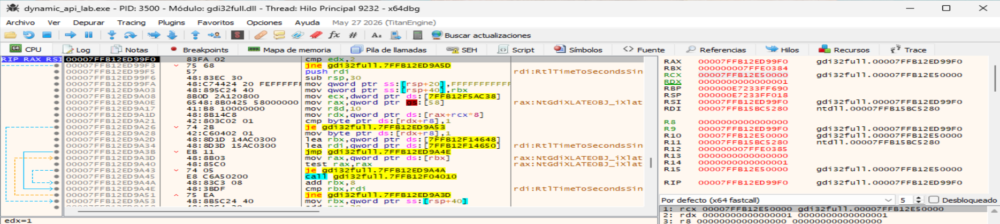


Para volver a `dynamic_api_lab.exe`, usamos `Run until user code`:
```
Alt + F9
```

LLegamos a `dynamic_api_lab.exe`:
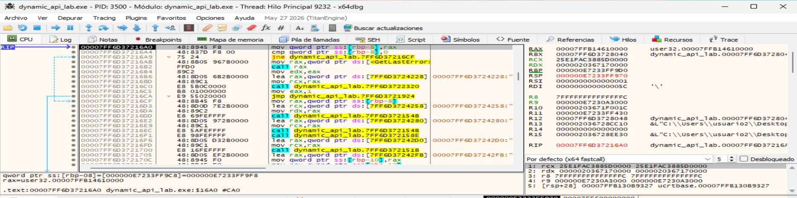
donde:
- `RAX`: `00007FFB14610000`.
- Eso significa que `LoadLibraryW(L"user32.dll")` ha devuelto correctamente un `HMODULE` cuyo valor es `0x00007FFB14610000`.


Recordamos que:
```
RCX
 │
 ▼
L"user32.dll"
 │
 ▼
LoadLibraryW
 │
 ▼
RAX = HMODULE
 │
 ├──────────────┐
 ▼              ▼
RCX          RDX -> "MessageBoxW"
 │              │
 └──────┬───────┘
        ▼
 GetProcAddress
        │
        ▼
RAX = dirección de MessageBoxW
```

**La instrucción actual es muy interesante::**
```
mov qword ptr ss:[rbp-8], rax
```

El programa está haciendo conceptualmente:
```
HMODULE user32 = LoadLibraryW(L"user32.dll");
```

Es decir:
```
LoadLibraryW(...)
       │
       ▼
RAX = 00007FFB14610000
       │
       ▼
mov [rbp-8], rax
       │
       ▼
variable local "user32"
```

La siguiente instrucción:
```
cmp qword ptr ss:[rbp-8], 0
```
comprueba precisamente si `LoadLibraryW` falló:
```
if (!user32) {
    ...
}
```

Como el valor es distinto de cero, la carga ha funcionado.

Detalle de mapa de memoria:
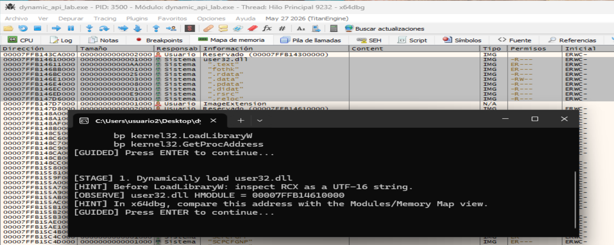


---

## 8. Parada en `GetProcAddress`

La llamada conceptual es:

```c
GetProcAddress(user32, "MessageBoxW");
```

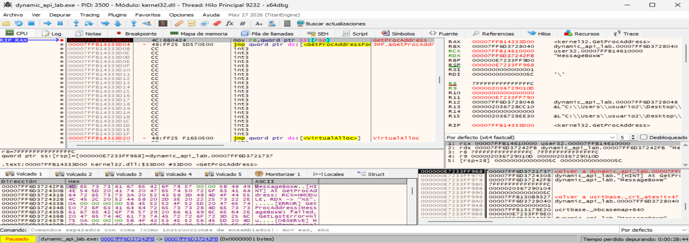
donde:
- `RCX`: handle/base del módulo 🠮 🠮 `00007FFB14610000    user32.00007FFB14610000`.
- `RDX`: puntero a una cadena ANSI 🠮 🠮 `00007FF6D37242FB    "MessageBoxW"`.

Esto corresponde exactamente a:
```
GetProcAddress(
    user32,
    "MessageBoxW"
);
```
Por tanto:
```
RCX → HMODULE de user32.dll
RDX → nombre de la API que se resulve dinámicamente: "MessageBoxW"
```


**Comprobamos que `RCX` tiene el mismo valor que devolvió antes `LoadLibraryW`:**
```
LoadLibraryW devuelve:
RAX = 00007FFB14610000

GetProcAddress recibe:
RCX = 00007FFB14610000
```

Eso reconstruye perfectamente el flujo:
```
LoadLibraryW(L"user32.dll")
             │
             ▼
RAX = 00007FFB14610000
             │
             ▼
        HMODULE user32
             │
             └──────────────┐
                            │
GetProcAddress(             │
    RCX = 00007FFB14610000, │
    RDX = "MessageBoxW"     │
)
```

**Comprobamos el DUMP:**
```
4D 65 73 73 61 67 65 42 6F 78 57 00
 M  e  s  s  a  g  e  B  o  x  W
```
Ahora:
```
"MessageBoxW" → ANSI/ASCII
```


---

## 9. Obtener la dirección de `MessageBoxW`

Ejecutamos `GetProcAddress` para observar su valor de retorno: Pulsamos
```
CTRL + F9
F8
```

Ahora estamos exactamente después del retorno de `GetProcAddress`. Hemos regresado al proceso `dynamic-api-lab.exe` y ya tenemos la evidencia clave de la resolución dinámica:
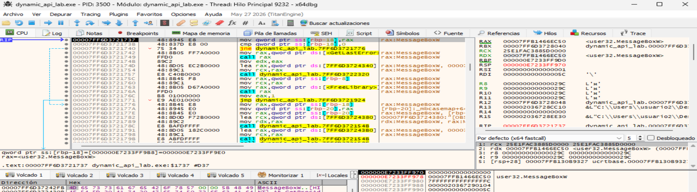
donde:
- `RAX = 00007FFB1466EC50  <user32.MessageBoxW>`.

Esto significa que:
```
GetProcAddress(user32, "MessageBoxW");
```
ha devuelto correctamente la dirección de `MessageBoxW`.

El flujo que ya hemos demostrado es:
```
LoadLibraryW(L"user32.dll")
        │
        ▼
RAX = 00007FFB14610000
      HMODULE user32.dll
        │
        ▼
GetProcAddress(
    RCX = 00007FFB14610000,
    RDX = "MessageBoxW"
)
        │
        ▼
RAX = 00007FFB1466EC50
      user32.MessageBoxW
```

La instrucción actual es:
```
mov qword ptr ss:[rbp-18], rax
```

Eso significa que el programa está guardando la dirección obtenida en una variable local:
```
RAX = 00007FFB1466EC50
          │
          ▼
     [RBP-18]
```

Conceptualmente corresponde a:
```
FARPROC raw_message_box =
    GetProcAddress(user32, "MessageBoxW");
```

----

## 10. Encontrar la llamada indirecta
Ahora queremos demostrar que **esa dirección no sólo se resuelve, sino que se utiliza realmente para llamar a `MessageBoxW`.** Pulsamos `F8` tres veces. Llegamos a:
```
jne ...

Ese cmp corresponde al código:
if (!raw_message_box) {
    ...
}
```

Como `00007FFB1466EC50 != 0`, continua por la rama válida:
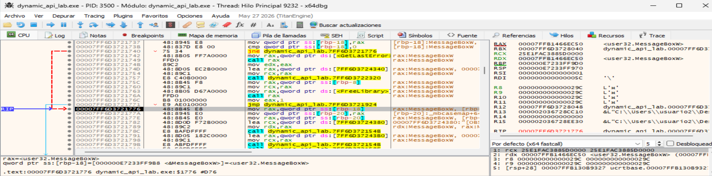
donde:
- `[RBP-18] = 0x00007FFB1466EC50 ≠ 0` contiene la dirección que devolvió anteriormente `GetProcAddress`.
- `[rbp-18]`  → Contiene un puntero a `MessageBoxW`: Contiene la dirección de `user32.MessageBoxW`.


Ahora localizamos una instrucción de llamada cuyo destino proceda del puntero almacenado en `[rbp-20]`:
```
00007FF6D372177A  mov qword ptr [rbp-20],rax
```
donde:
- Se guarda el puntero como la variable `pMessageBoxW`.

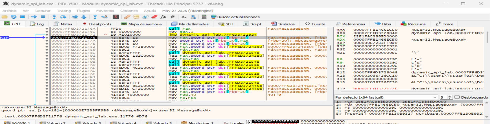

Para <mark>saber cual es el `CALL` correcto</mark>: La característica importante no es el registro concreto, sino que el destino del <mark>`CALL` procede de la dirección retornada previamente por `GetProcAddress`.</mark>

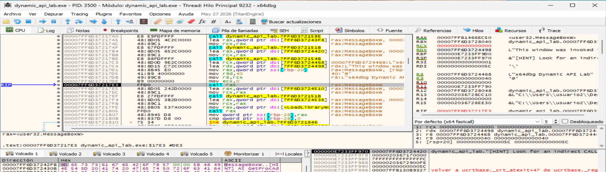
donde:
- Esta captura es la evidencia final de que `MessageBoxW` ha sido resuelta dinámicamente y va a ejecutarse mediante una llamada indirecta.
- Justo antes de ejecutar ese `CALL`, x64dbg muestra:
   - `RAX = 00007FFB1466EC50   <user32.MessageBoxW>`.
   - `RCX = 0000000000000000`.
   - `RDX = 00007FF6D3724498   L"This window was invoked..."`.
   - `R8  = 00007FF6D3724468   L"x64dbg Dynamic API Lab"`.
   - `R9  = 0000000000000040`.

Esto corresponde exactamente a:
```
pMessageBoxW(
    NULL,
    L"This window was invoked through a dynamically resolved API.",
    L"x64dbg Dynamic API Lab",
    MB_OK | MB_ICONINFORMATION
);
```

### Lo importante: `call rax`

Esta es la pieza clave de todo el laboratorio:
```
call rax
```
No vemos:
```
call user32.MessageBoxW
```
ni algo como:
```
call qword ptr [__imp_MessageBoxW]
```
El destino de la llamada está contenido en un registro:
```
RAX
 │
 ▼
00007FFB1466EC50
 │
 ▼
user32.MessageBoxW
```
Por tanto:
```
call rax
   │
   ▼
user32.MessageBoxW
```
Esto es una llamada indirecta.

Y la dirección que ahora está en RAX es precisamente la que obtuvimos anteriormente mediante:
```
GetProcAddress(
    hUser32,
    "MessageBoxW"
);
```

### Para MessageBoxW:
```
int MessageBoxW(
    HWND    hWnd,
    LPCWSTR lpText,
    LPCWSTR lpCaption,
    UINT    uType
);
```

La captura demuestra:
```
RCX = 0
 │
 └── hWnd = NULL

RDX ──► L"This window was invoked..."
 │
 └── lpText

R8 ───► L"x64dbg Dynamic API Lab"
 │
 └── lpCaption

R9 = 0x40
 │
 └── uType
```

`0x40` corresponde a:
```
MB_ICONINFORMATION
```
y `MB_OK` vale `0`, por lo que:
```
MB_OK | MB_ICONINFORMATION

0x00 | 0x40 = 0x40
```
Eso explica perfectamente:
```
R9 = 0000000000000040
```


---


## 11. Reconstrucción de toda la técnica

```
1. LoadLibraryW

RCX ─────────► L"user32.dll"

      LoadLibraryW
             │
             ▼
RAX = 00007FFB14610000
      HMODULE user32.dll


2. GetProcAddress

RCX = 00007FFB14610000
      HMODULE user32.dll

RDX ─────────► "MessageBoxW"

        GetProcAddress
               │
               ▼
RAX = 00007FFB1466EC50
      user32.MessageBoxW


3. Almacenar el puntero

mov [rbp-18], rax

...

mov rax,[rbp-20]


4. Preparar los argumentos

RCX = NULL
RDX ─► texto
R8  ─► título
R9  = 0x40


5. Ejecutar la API

RAX ─► user32.MessageBoxW

call rax
   │
   ▼
MessageBoxW(...)
```

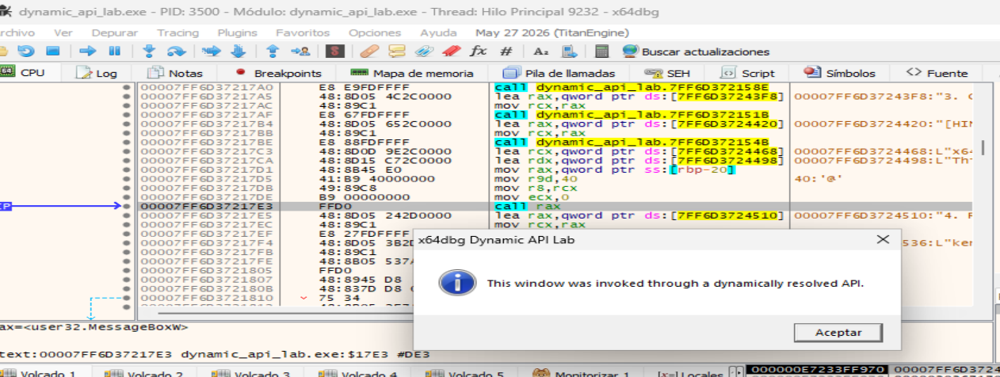


Tras resolver `MessageBoxW` mediante `GetProcAddress`, el ejecutable almacena la dirección obtenida y posteriormente la recupera para realizar una llamada indirecta. Justo antes de la instrucción `call rax`, el registro `RAX` contiene la dirección `0x00007FFB1466EC50`, identificada por `x64dbg` como `user32.MessageBoxW`. Los registros `RC`X, `RDX`, `R8` y `R9` contienen respectivamente los cuatro argumentos de `MessageBoxW`. Esto confirma que la API no es invocada mediante una importación estática convencional, sino mediante una dirección resuelta dinámicamente en tiempo de ejecución.


## 12. Segunda API dinámica

La muestra repite el patrón con:

```text
kernel32.dll
GetTickCount64
```

Repetimos el análisis y completamos:

| Elemento | Valor observado |
|---|---|
| DLL | |
| API | |
| `HMODULE` | |
| Dirección de la API | |
| Instrucción de llamada indirecta | |


[segunda-parada-en-GetProcAddress.png](capturas/segunda-parada-en-GetProcAddress.png)
donde:
- `RCX → L"kernel32.dll"`.
- `RCX = 00007FF6D3724536`.
- El ejecutable realiza una segunda llamada a `LoadLibraryW`, pasando mediante `RCX` un puntero a la cadena `UTF-16` `kernel32.dll`.
- La llamada que estamos observando es conceptualmente: `HMODULE kernel32 = LoadLibraryW(L"kernel32.dll");`

La secuencia que ahora vamos a reconstruir ahora es:
```
LoadLibraryW(L"kernel32.dll")
          ↓
      HMODULE
          ↓
GetProcAddress(hModule, "GetTickCount64")
          ↓
dirección de GetTickCount64
          ↓
    CALL indirecto
```

### Obtenemos el `HMODULE`

Fulsamos `CTRL + F9` y `F8` para volver al código de `dynamic_api_lab.exe` y analizar `RAX`:
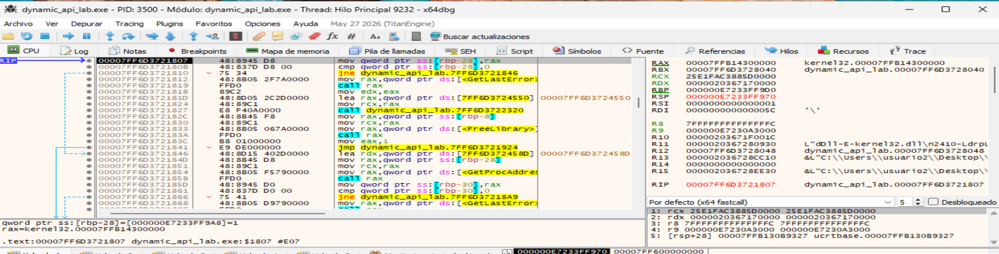
donde:
- `RAX`: `00007FFB14300000`.
- `RAX =  kernel32.00007FFB14300000`.


Acabamos de obtener:
```
LoadLibraryW(L"kernel32.dll")
          ↓
RAX = 00007FFB14300000
      HMODULE de kernel32.dll

...
...
mov [rbp-28], rax
```


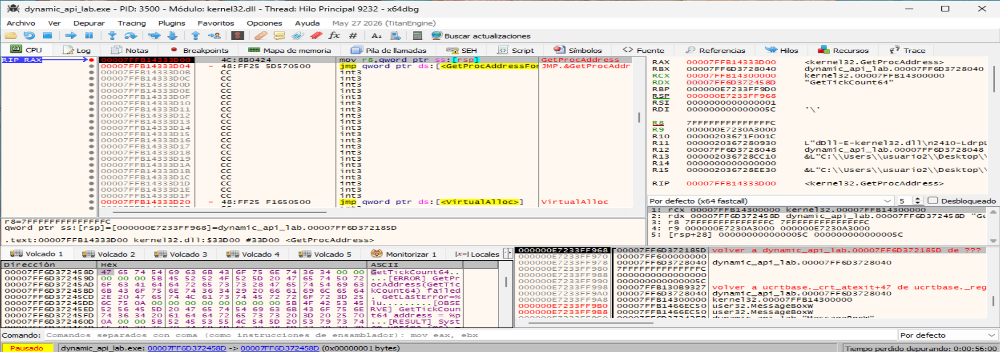
donde:
- Esta captura confirma la segunda resolución dinámica.
- Ahora estamos detenidos al entrar en: `kernel32.GetProcAddress`.
- Los argumentos son:
   - RCX = 00007FFB14300000
            kernel32.dll
   - RDX = 00007FF6D372458D
            "GetTickCount64"

Eso corresponde exactamente a:
```
GetProcAddress(
    kernel32,
    "GetTickCount64"
);
```

Además, en el volcado inferior izquierdo ya se ve la cadena ASCII:
```
47 65 74 54 69 63 6B 43 6F 75 6E 74 36 34 00
 G  e  t  T  i  c  k  C  o  u  n  t  6  4
```

En la segunda llamada a `GetProcAddress`, `RCX` contiene el `HMODULE` de `kernel32.dll`, obtenido previamente mediante `LoadLibraryW`, mientras que `RDX` apunta a la cadena `ASCII` `"GetTickCount64"`. Esto indica que el programa está solicitando dinámicamente la dirección de dicha API.

### Ejecutamos GetTickCount64 y regresamos a `dynamic_api_lab.exe`
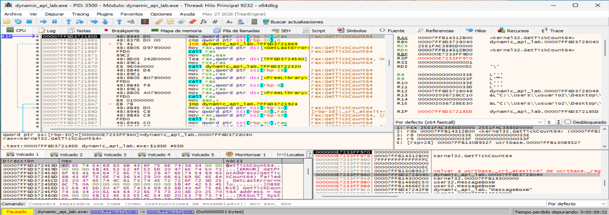
donde:
- `RAX = 00007FFB14312B00 <kernel32.GetTickCount64>`
- Por tanto, esta llamada: `GetProcAddress(kernel32, "GetTickCount64");` ha devuelto correctamente la dirección de `GetTickCount64`.

La instrucción actual es:
```
00007FF6D372185D    mov qword ptr [rbp-30], rax
```

Es decir, el programa guarda el puntero resuelto:
```
RAX
 │
 │ 00007FFB14312B00
 ▼
kernel32.GetTickCount64
 │
 ▼
[RBP-30]
```

### Instrucción CALL

[segunda-parada-en-GetProcAddress-4.png](capturas/segunda-parada-en-GetProcAddress-4.png)
donde:
- Estamos parados en la instrucción: `00007FF6D37218B5    call rax`.
- `RAX = 00007FFB14312B00
      <kernel32.GetTickCount64>`
- Por tanto, el destino real de: `call rax` es: `kernel32.GetTickCount64`.


El programa no realiza una llamada estática como:
```
call kernel32.GetTickCount64
```
sino que previamente ha obtenido su dirección con:
```
GetProcAddress(hKernel32, "GetTickCount64");
```
y ahora ejecuta esa dirección indirectamente:
```
GetProcAddress(...)
        │
        ▼
00007FFB14312B00
        │
        ▼
guardar puntero
        │
        ▼
RAX = 00007FFB14312B00
        │
        ▼
    call rax
        │
        ▼
kernel32.GetTickCount64
```
Eso completa la demostración de resolución dinámica + llamada indirecta.


### Observación de interés con `RAX`

Tras resolver dinámicamente `GetTickCount64` mediante `GetProcAddress`, el ejecutable recupera la dirección obtenida y la almacena en `RAX`. Inmediatamente antes de la instrucción `call rax`, x64dbg identifica el contenido de `RAX` como `kernel32.GetTickCount64`, confirmando que la API es invocada mediante una llamada indirecta. Al no recibir parámetros, no es necesario preparar argumentos en `RCX`, `RDX`, `R8` o `R9`. El valor retornado por la API se recibe posteriormente en `RAX`.


Después de ejecutar `GetTickCount64`, `RAX` ya no contendrá la dirección de la API. Pasará de:
```
ANTES DEL CALL

RAX = 00007FFB14312B00
      dirección de GetTickCount64
```

a:
```
DESPUÉS DEL CALL

RAX = número de milisegundos
      desde el arranque del sistema
```

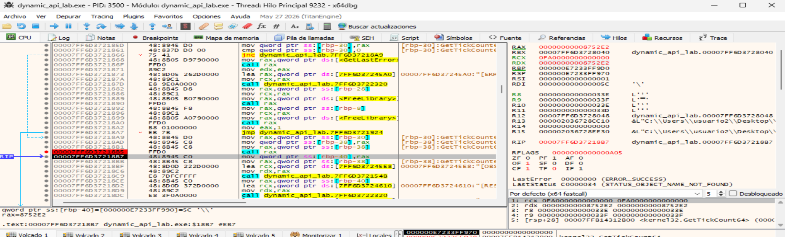
donde:
- `RAX = 00000000008752E2`
      ↑
      valor retornado por `GetTickCount64`
- `GetTickCount64` devuelve el número de milisegundos transcurridos desde que se inició el sistema. En este caso: `0x8752E2 = 8.868.578 ms`.
- Llevaba aproximadamente 2 horas y 28 minutos funcionando en ese momento.

El flujo demostrado es:
```
LoadLibraryW
RCX → L"kernel32.dll"
          │
          ▼
       HMODULE
          │
          ▼
GetProcAddress
RCX → HMODULE
RDX → "GetTickCount64"
          │
          ▼
RAX → dirección GetTickCount64
          │
          ▼
       call rax
          │
          ▼
   GetTickCount64()
          │
          ▼
RAX → 0x8752E2
      uptime
```


Tras resolver dinámicamente GetTickCount64 mediante GetProcAddress, la dirección obtenida es utilizada como destino de una llamada indirecta call rax. Antes de la llamada, RAX contiene la dirección de kernel32.GetTickCount64. Tras finalizar la función, RAX contiene 0x8752E2, correspondiente al valor ULONGLONG retornado por la API. La instrucción inmediatamente posterior almacena dicho resultado en una variable local mediante mov [rbp-40], rax.

---

## 13. Indicadores útiles durante análisis de malware

La carga dinámica de APIs no es maliciosa por sí misma. Es común en software legítimo para compatibilidad, plugins y APIs opcionales.

En una muestra sospechosa, el patrón gana relevancia cuando aparece junto con:
- muchas llamadas a `LoadLibrary*` / `GetProcAddress`
- nombres de APIs construidos o descifrados en runtime
- resolución por hash
- API sets o módulos poco habituales
- llamadas indirectas posteriores
- combinación con otras técnicas de evasión

Este laboratorio se limita al patrón básico y observable.

---

## 14. Preguntas de estudio

1. ¿Qué diferencia existe entre importar `MessageBoxW` desde la IAT y resolverla con `GetProcAddress`?
2. ¿Qué registro contiene el primer argumento en la convención x64 de Windows?
3. ¿Dónde se devuelve la dirección resuelta?
4. ¿Por qué una herramienta de análisis estático puede ver menos nombres de API en una muestra que usa carga dinámica?
5. ¿Qué evidencia dinámica demuestra que el puntero obtenido es realmente usado?
6. ¿Por qué `LoadLibrary` + `GetProcAddress` no debe considerarse por sí solo un indicador suficiente de malware?

---

## 15. Reto

Reto: [challenge_dynamic_api.c](https://github.com/soniasalido/cybersecurity/blob/main/LABS/Investigating%20Malware/Resolucion-Dinamica-APIs/utiles/challenge_dynamic_api.c). Con SHA256: `04E9DAFFD59024BE3C76D0DB8157744AA83159B4DDFF37FD84879599A36D1807 `.

### Preparación

Abrimos la consola: MSYS2 UCRT64 y accedemos a la carpeta para compilar el fichero de este reto. Compilamos `challenge_dynamic_api.c`:
```
gcc -Wall -Wextra -Wno-cast-function-type -O0 -g -municode \
challenge_dynamic_api.c -o challenge_dynamic_api.exe
```
Obtenemos el ejecutable: [challenge_dynamic_api.exe](https://github.com/soniasalido/cybersecurity/blob/main/LABS/Investigating%20Malware/Resolucion-Dinamica-APIs/utiles/challenge_dynamic_api.exe) con SHA256: `0073AF9F05AACFEB3E72563F07CA6CEAE807CA5821D520A1EF69E1C6EDCB1D3E `.


### PRIMERA RESOLUCIÓN

**Paso1:** Antes de ejecutar `LoadLibrary`: `RCX` → Puntero a la cadena unicode `user32.dll`.

**Paso 2:** Después de ejecutar `LoadLibrary`: `RAX = hMOdule de user32.dll` → `00007FFF14D00000` <---- Esta es la zona de memoria donde ha cargado la DLL `user32.dll`.

**Paso 3:** Va a ejecutar `GetProcAddress (hModule, "GetDoubleClickTime")`.
- Se busca donde está cargado en la memoria la API `GetDoubleClickTime` dentro de la `DLL` →  `RCX = 00007FFF14D00000` → `HMODULE de user32.dll`.
- Se obtiene que está la API `GetDoubleClickTime` está cargada en `RDX` = 00007FFF14D33F80.

**Paso 4:** Después de ejecutar `GetProcAddress (hModule, "GetDoubleClickTime")` → Se almacena en `RAX` la dirección de memoria en donde está cargado la API → `RAX = 00007FFF14D33F80`.

**Paso 5:** Para que ocurrierra una carga dinámica del API, tendría que existir la llamada indirecta `call RAX`. Así se completaría la resolución dinámica de la carga de esa API. Pero sin embargo en esta primera resolución no ocurre esta llamada indirecta.

Estado despues de ejecutar `GetProcAddres(hModule, "GetDoubleClickTime")`:
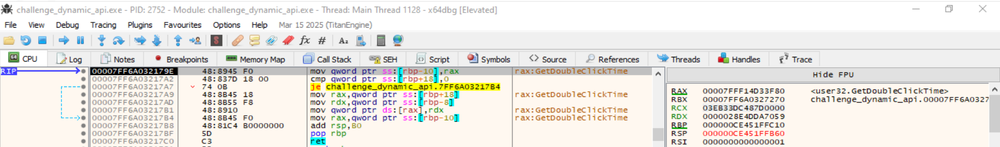
donde:
- `mov [rbp-10], rax`: Guardar la dirección de memoria en donde se encuentra la API `GetDoubleClickTime` dentro de la `DLL` en una variable local de la pila.
- Comprueba si existe un puntero de salida para devolver también el `HMODULE.`
- Si no es `NULL`, guarda también el `HMODULE` de `user32.dll`.
- `mov rax,[rbp-10]`: Esta es la parte fundamental. Porque `RAX: 00007FFF14D33F80` → user32.GetDoubleClickTime. La dirección de memoria en donde se encuentra esa API.
- Luego hace ret.

El flujo completo de esta captura es:
```
GetProcAddress(...)
        │
        ▼
RAX = dirección de GetDoubleClickTime
        │
        ▼
mov [rbp-10],rax
        │
        ▼
guardar temporalmente el puntero
        │
        ├── guardar también HMODULE en module_out
        │
        ▼
mov rax,[rbp-10]
        │
        ▼
RAX = dirección GetDoubleClickTime
        │
        ▼
ret
        │
        ▼
volver al caller
```
**No se ejecuta `GetDoubleClickTime`. Hasta ahora únicamente se ha resuelto su dirección:** `GetProcAddress: RAX = 0x00007FFF14D33F80`, dirección de `user32.GetDoubleClickTime`. La instrucción `mov [rbp-10], rax` guarda temporalmente el puntero resuelto. Antes del `RET`, el valor se recupera de `[rbp-10]` y se devuelve nuevamente en `RAX` al caller. En este punto la API ha sido resuelta, pero todavía no ha sido ejecutada.


**Regreso del ret de la función que resolvió `GetDoubleClickTime`:**  
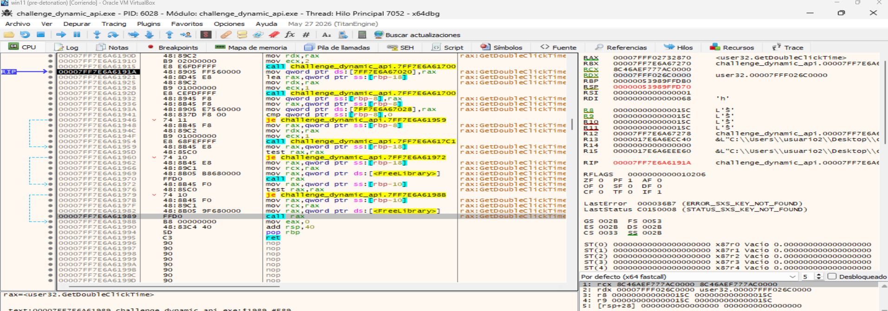
donde:
- `mov qword ptr ds:[7FF7E6A67020], rax`: Almacena la dirección de `GetDoubleClickTime` en una variable global.
- `RAX` contiene la dirección de memoria en donde se encuantra la API `GetDoubleClickTime`.

```
lea rax, qword ptr [rbp-18]
mov rdx, rax
mov ecx, ...
call challenge_dynamic_api....
```
donde:
- <mark>El valor de RAX que contenía `GetDoubleClickTime` va a ser sobrescrito por: `lea rax,[rbp-18]`. Así que deja de utilizarse como destino de llamada.</mark
- <markEl programa no hace `call rax` hacia `GetDoubleClickTime`. En lugar de eso, empieza a preparar otra llamada al resolvedor para obtener una segunda API.</mark


### SEGUNDA RESOLUCIÓN
**NOTA:** Las capturas se corresponde con un reinicio del programa en x64dbg, por lo que las direcciones de memoria han cambiado.

**Paso1:** Antes de ejecutar `LoadLibrary`: `RCX` → Puntero a la cadena unicode `user32.dll` → `00000053989FFD10`

**Paso 2:** Después de ejecutar `LoadLibrary`: `RAX = hMOdule de user32.dll` → `00007FFF026C0000` <---- Esta es la zona de memoria donde ha cargado la DLL `user32.dll`.

**Paso 3:** Va a ejecutar `GetProcAddress (hModule, "GetSystemMetrics")`.
- Se busca donde está cargado en la memoria la API `GetSystemMetrics` dentro de la `DLL` →  `RCX = 00007FFF026C0000` → `HMODULE de user32.dll`.
- Se obtiene que está la API `GetSystemMetrics` está cargada en `RDX` = `00007FFF026C8AD0`.

**Paso 4:** Después de ejecutar `GetProcAddress (hModule, "GetSystemMetrics")` → Se almacena en `RAX` la dirección de memoria en donde está cargado la API → `RAX = 00007FFF026C8AD0`.

**Paso 5:** Para que ocurrierra una carga dinámica del API, tendría que existir la llamada indirecta `call RAX`. Así se completaría la resolución dinámica de la carga de esa API. Pero sin embargo en esta primera resolución no ocurre esta llamada indirecta.

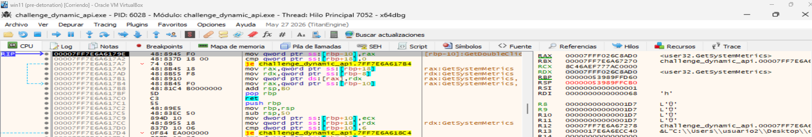
donde:
- `mov [rbp-10], rax`: Guardar la dirección de memoria en donde se encuentra la API `GetSystemMetrics` dentro de la `DLL` en una variable local de la pila.
- Comprueba si existe un puntero de salida para devolver también el `HMODULE.`
- Si no es `NULL`, guarda también el `HMODULE` de `user32.dll`.
- `mov rax,[rbp-10]`: Esta es la parte fundamental. Porque `RAX: 00007FFF026C8AD0` → user32.GetSystemMetrics. La dirección de memoria en donde se encuentra esa API.
- Luego hace ret.

**Regreso del ret de la función que resolvió `GetSystemMetrics`:**  
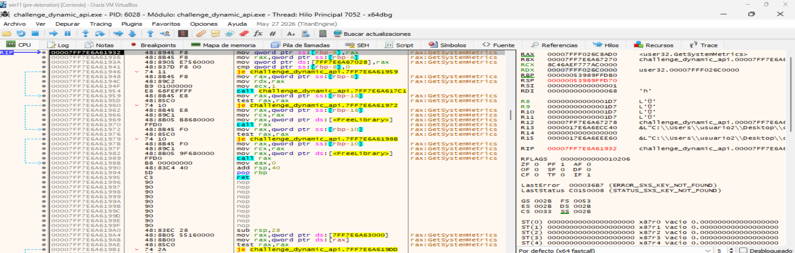
donde:
- `mov qword ptr [rbp-8], rax`: Guarda en `[rbp-8]` el contenido de `RAXp  → dirección de `GetSystemMetrics`.
- `mov qword ptr [7FF7E6A67028], rax`: Copia la dirección también a una variable global.
- Después hace una comprobación para ver si `GetProcAddress` resolvió correctamente. Como la dirección de `GetSystemMetrics` es distinta de cero, no toma la rama de error.

Se prepara una llamada a otra función interna:
```
mov rax, qword ptr [rbp-8]
mov rdx, rax
mov ecx, 1
call challenge_dynamic_api.7FF7E6A617C1
```


El flujo es:
```
GetProcAddress("GetSystemMetrics")
            │
            ▼
RAX = dirección GetSystemMetrics
            │
            ▼
mov [rbp-8], rax
            │
            ▼
g_target_pointer = dirección
            │
            ▼
¿puntero != NULL?
            │
           sí
            ▼
RCX = 1
RDX = dirección GetSystemMetrics
            │
            ▼
call invoke_target
```

Avanzamos hasta: `call challenge_dynamic_api.7FF7E6A617C1` y usamos `F7` para entrar:  
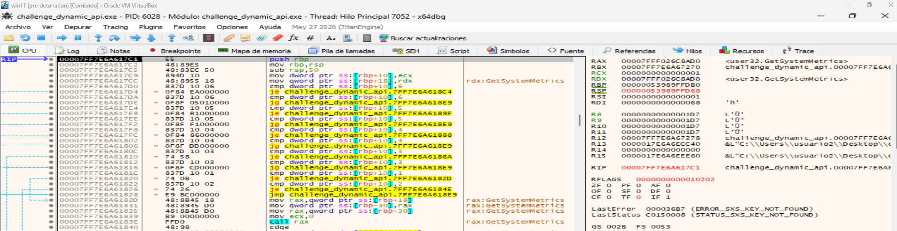
donde:
- `RCX = 0000000000000001`.
- `RDX = 00007FFF02C6CAD0` →  dirección de GetSystemMetrics.
- `mov dword ptr [rbp+10],ecx`: Guarda en `[rbp+10]` lo que contiene `ECX`.
- `mov qword ptr [rbp+18],rdx`: Guarda en `[rbp+18]`lo que contiene `RDX`.
- Realiza unas comparaciones para seleccionar qué firma debe utilizar.
- Sólo será verdadera en: `cmp dword ptr [rbp+10],1`. La comparación será verdadera y saltará a la rama correspondiente a `GetSystemMetrics`.


Continúa por la rama de éxito:  
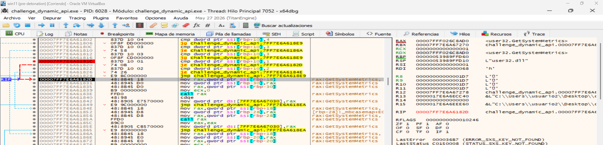
donde:
- `mov rax,qword ptr [rbp+18]`: Mete en `RAX` lo que contenía `RDX`  →  dirección de `GetSystemMetrics`  → `00007FFF02C6CAD0`
- `mov qword ptr [rbp-30],rax`: Guarda el puntero en otra variable local.
- `mov rax,qword ptr [rbp-30]`: Vuelve a preparar la dirección para la llamada.
- `mov ecx,0`: prepara el único argumento de `GetSystemMetrics`.
- `call rax`: LLamada indirecta a la API `GetSystemMetrics`.


Termina la llamada indirecta a `GetSystemMetrics(0)`:  
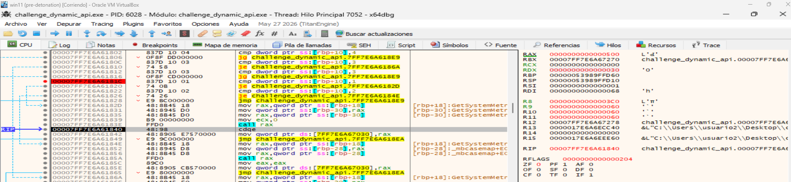
donde:

- `RAX = 0000000000000500` que es decimal es `1280`.
- `GetSystemMetrics(0)` utiliza el índice: `SM_CXSCREEN = 0` que devuelve el ancho de la pantalla principal en píxeles.
- Resolución de la pantalla: 1280 píxeles.


La dirección de `GetSystemMetrics` obtenida mediante `GetProcAddress` es posteriormente utilizada como destino de una instrucción `call rax`. Antes de la llamada, `RAX` contiene la dirección de `user32.GetSystemMetrics` y `RCX` contiene `0`, correspondiente al argumento `SM_CXSCREEN`. Tras la ejecución, `RAX` contiene `0x500 (1280 decimal)`, valor que representa el ancho de la pantalla principal en píxeles. Esto confirma que `GetSystemMetrics` es la `API` realmente ejecutada, mientras que `GetDoubleClickTime` actúa como resolución señuelo.


## 16. Comprobación de conocimientos

Objetivo: aprender a reconocer y reconstruir el flujo de resolución dinámica de APIs durante el análisis de una muestra. El laboratorio usa fragmentos y algoritmos sintéticos: no ejecuta APIs del sistema.

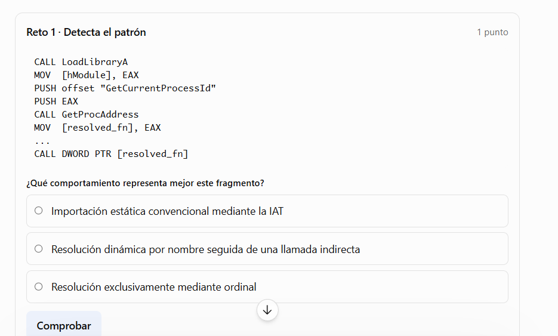

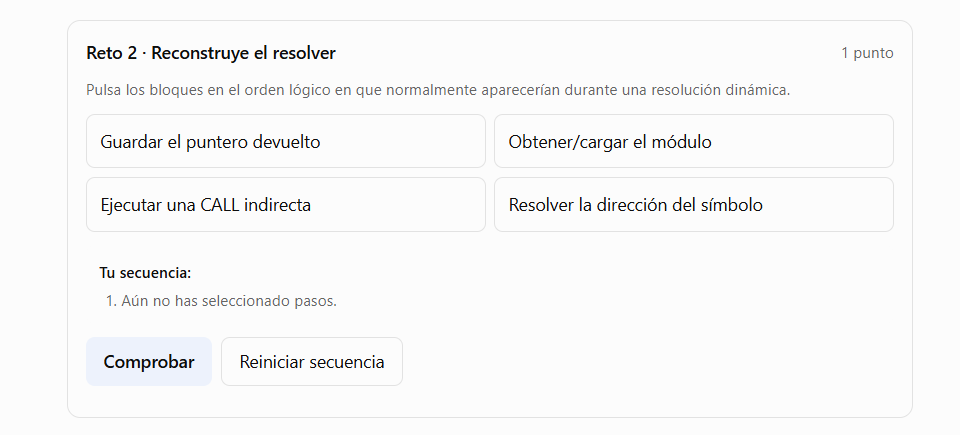

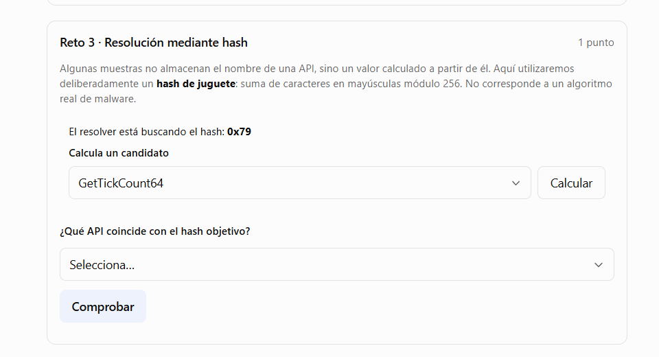

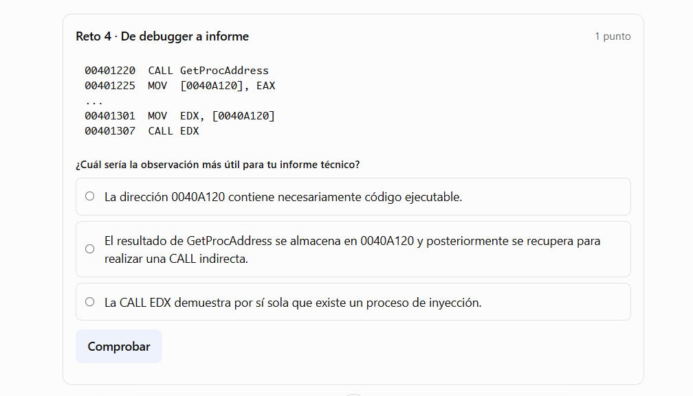


## 17. Resolución dinámica de APIS que ocultan los nombres mediante hashing

Simulador de reversing para practicar exactamente el flujo que buscarías en x64dbg:
```
bucle de hashing → comparación → resolución en la tabla de exportaciones → puntero resultante → CALL/JMP indirecto.
```
Los comandos de breakpoint y vigilancia de memoria utilizados como referencia están documentados por x64dbg.

**Pregunta central del análisis:** Si no aparece `GetProcAddress("Sleep")`, ¿cómo demuestra el código qué función está buscando y dónde termina ejecutándola?

### 1. Anatomía del patrón
Secuencia que debemos aprender a reconocer:  
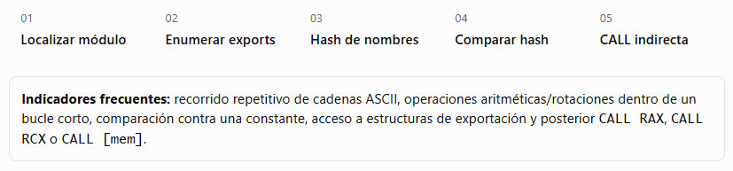


### 2. Simulador de sesión x64dbg

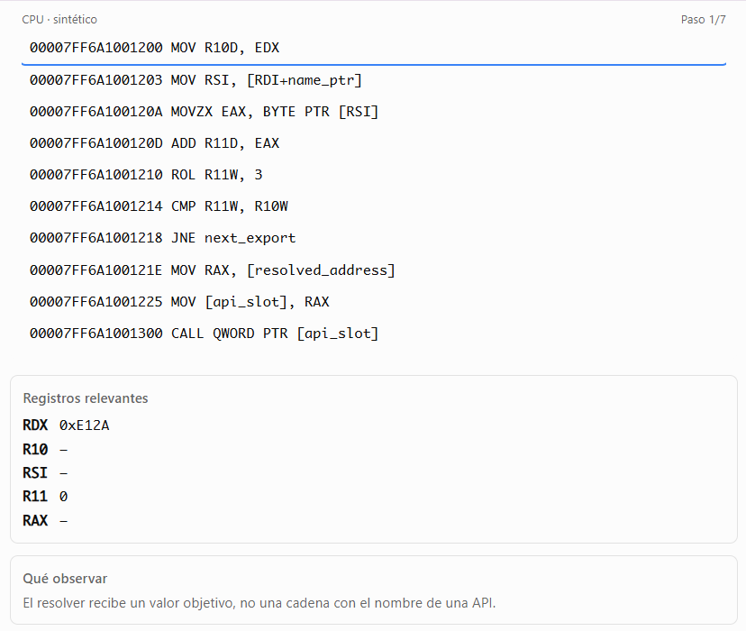

---

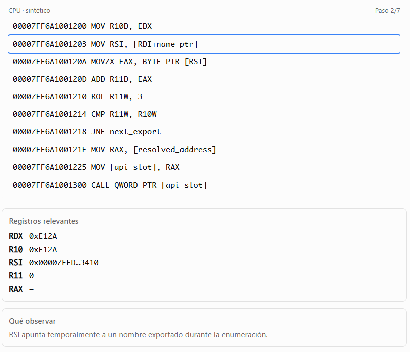


----


----


----


----


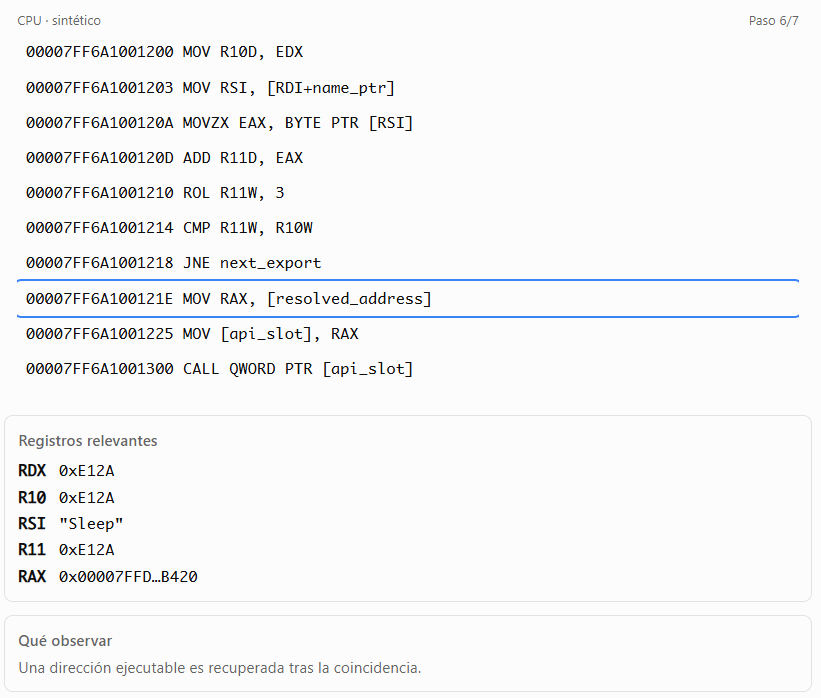

----


### 3. Reto: encuentra el resolver


### 4. Procedimiento

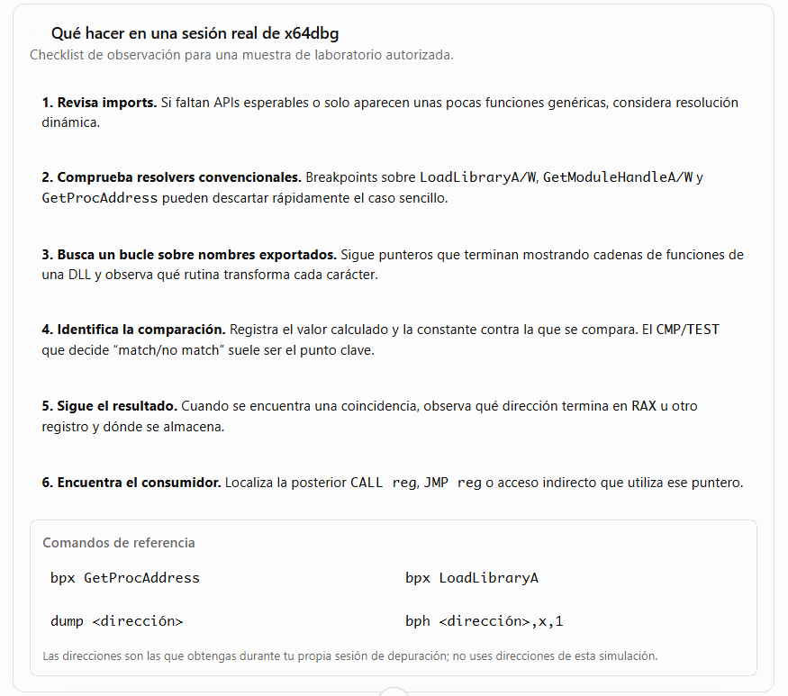


### 5. Hoja de Investigación

[hoja-investigacion.png[(capturas/hoja-investigacion.png)


## 18. Resolución dinámica de APIS que ocultan los nombres mediante cifrado

Simulador de reversing para prácticar sobre una evidencia observable en x64dbg.

### 1. Anatomía del patrón

```
buffer cifrado → rutina de descifrado → nombre API visible temporalmente → resolver → puntero almacenado → llamada indirecta.
```
Para el seguimiento, x64dbg permite breakpoints por nombre (bpx) y breakpoints de memoria de lectura/escritura/ejecución (bpm).

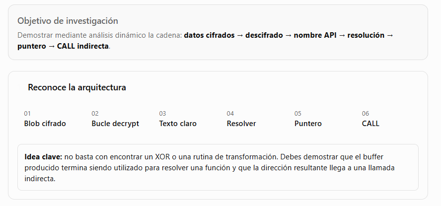


### 2. Simulador de sesión x64dbg


---


---

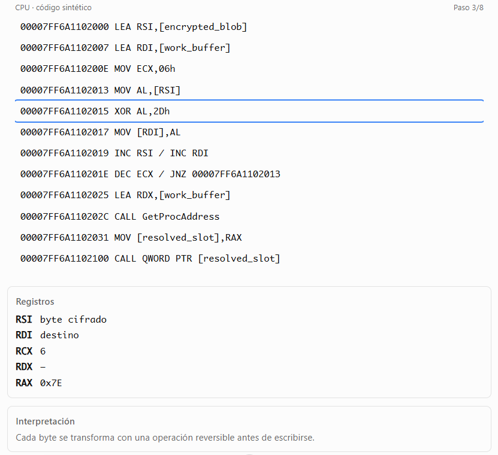

---

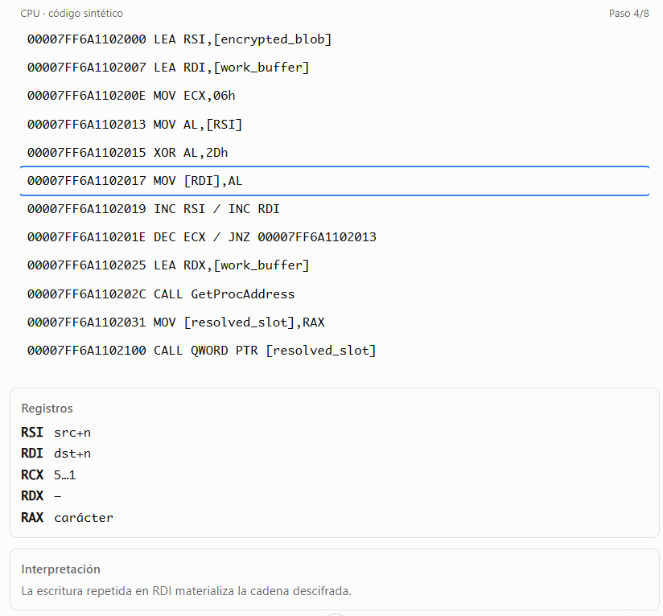

---

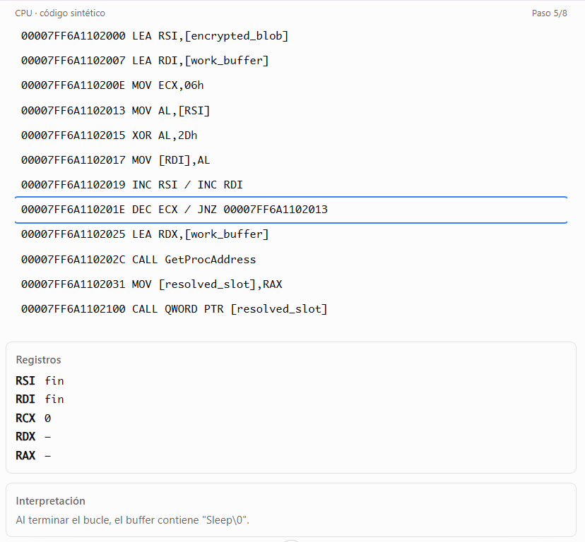

---


---

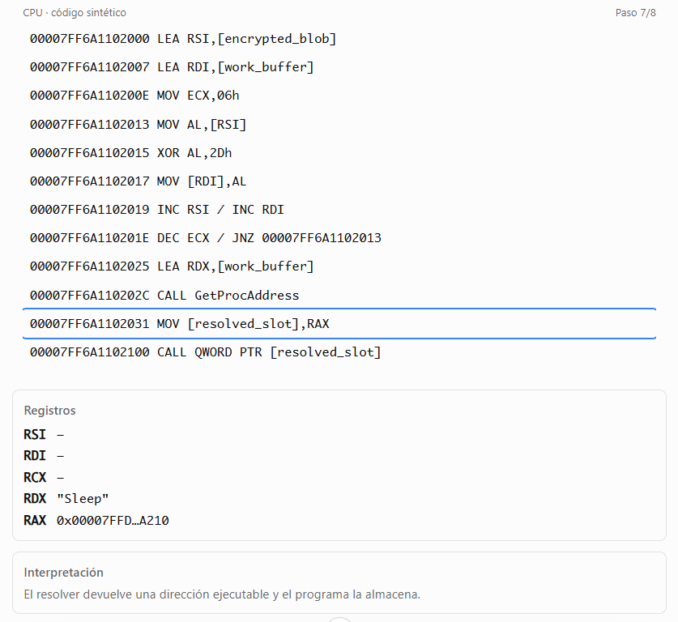

---

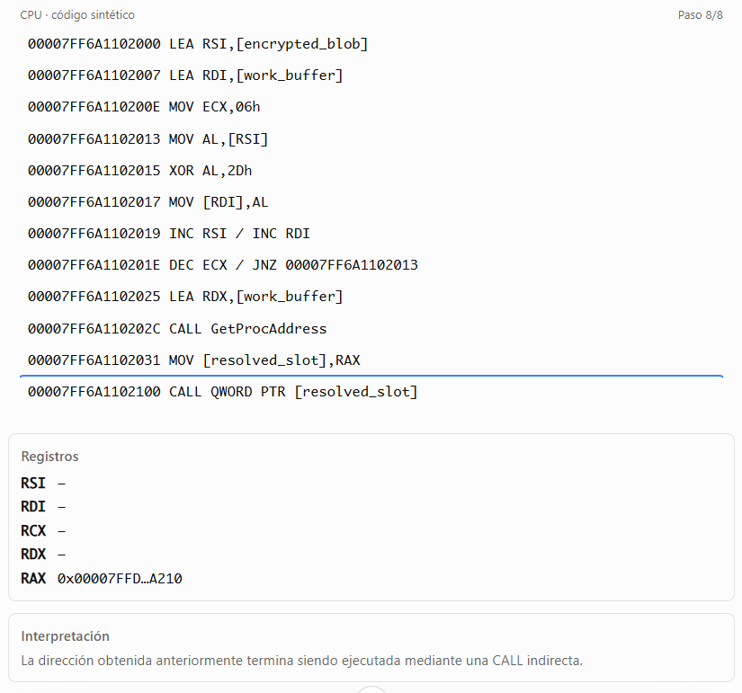

-----


