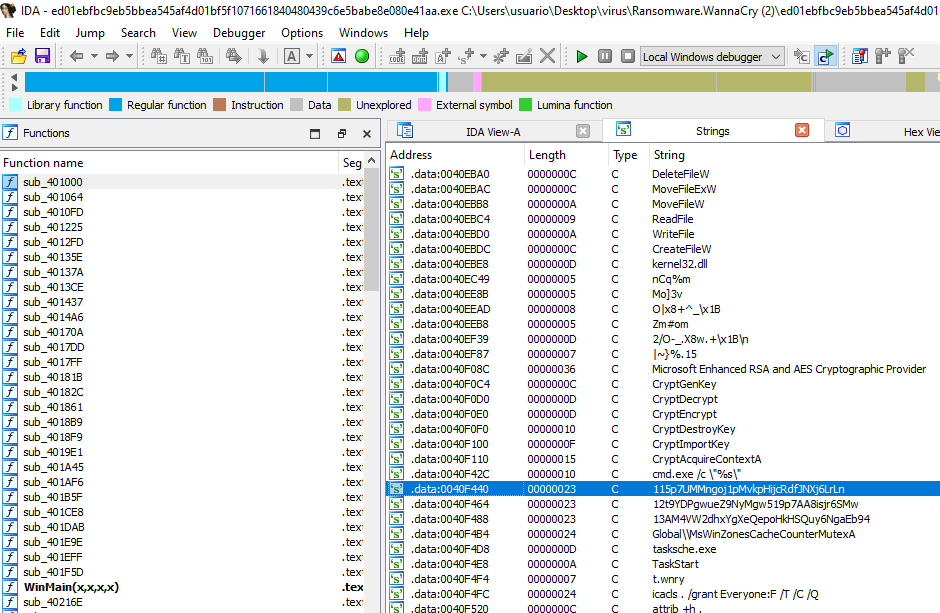
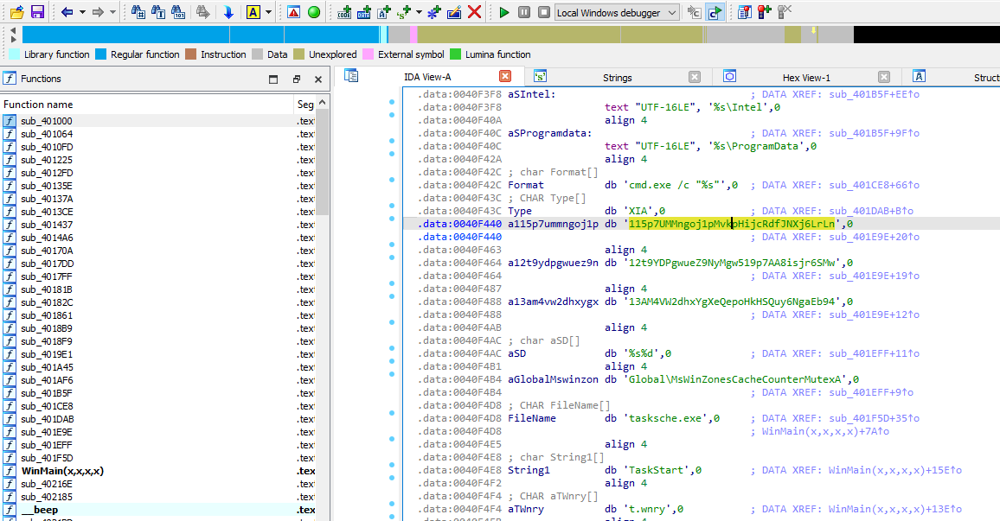

https://github.com/xcp3r/WannaCry

https://github.com/ghidraninja/ReversingWannacry

https://github.com/colton-gabertan/ReversingWannaCry

https://github.com/LuisFernandezJr/PMAT-ReverseEngineering/blob/main/PMAT%20Reverse%20Engineering%20-%20WannaCry.pdf

https://medium.com/@snoballz_909/wannacry-analysis-of-a-crypto-worm-a06996c4ecc0

------

Vemos en la siguiente captura direcciones de Bitcoin. En el sistema de Bitcoin, las direcciones se utilizan para enviar y recibir fondos. Son una cadena de letras y números que representan un destino posible para un pago de Bitcoin. Las direcciones de Bitcoin pueden variar en longitud y generalmente comienzan con '1', '3' o con caracteres como 'bc1' para direcciones en el formato SegWit. Esta dirección en particular comienza con un '1', lo que indica que probablemente utiliza el formato de dirección más común y más antiguo en la red de Bitcoin.

