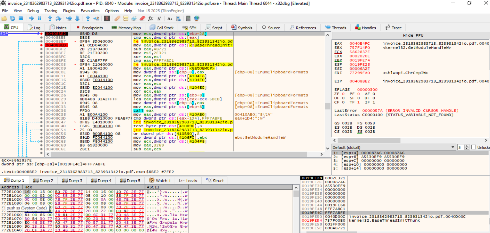
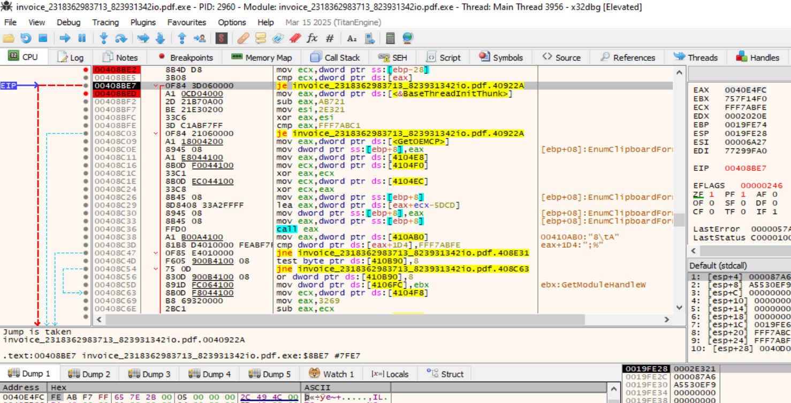
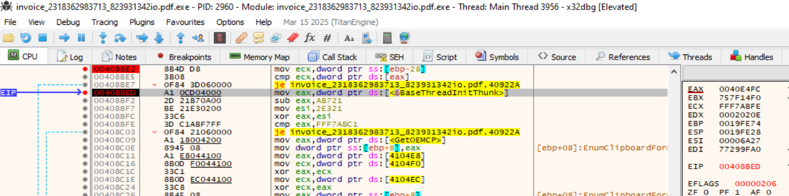
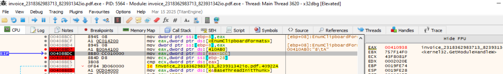
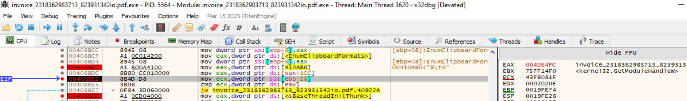
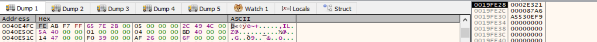

# FUN_00408469

La funcion FUN_00408469 contine logica antidebug: Por el contexto de xrefs, es la que integra los checks/mezcladores y suele ser donde viven los gates de anti-debug (loops opacos, ramas dependientes de estado global, etc.).  En este cuerpo de FUN_00408469 sí hay lógica anti-debug / anti-análisis, pero no en el sentido “clásico” de IsDebuggerPresent/NtQueryInformationProcess. Aquí la defensa es más de anti-análisis, anti-hook y anti-disassembly, apoyada por self-modifying code y predicados opacos.


FUN_00408469 → es el “hub”:
- hace checks de integridad/consistencia y decide si irse por rutas alternativas;
- resuelve APIs de forma dinámica/obfuscada (anti-IAT / anti-tracing);
- y, sobre todo, modifica código: escribe en FUN_0040142f (byte en FUN_0040142f y dword en FUN_0040142f+1).
- otro punto relevante (aunque no es “donde decides”, sino donde impacta) es: FUN_0040142f → porque es el objetivo del parcheo/self-modifying, y ahí es donde “se materializa” parte del mecanismo.


Actuación:
- builds de debug/símbolos, flags de compilación, o configuración que desactive esas rutas,
- o instrumentación/telemetría (logs) para entender qué condición dispara las ramas “defensivas”, sin entrar en bypass.


--------

Lo que muestras es una rutina “loader/initializer” fuertemente ofuscada (típica en malware/crackmes) cuyo objetivo principal no es “calcular algo útil”, sino:
- resolver/derivar punteros a APIs sin dejarlos estáticos,
- hacer checks de integridad/antitamper,
- parchear (self-modify) código para habilitar una siguiente etapa,
- dejar globals y punteros preparados y devolver un puntero final desde una estructura global.


Indicadores claros de intención
- PE walking (+0x3C) → típico de unpacker/loader/manual resolver.
- Self-modifying code sobre FUN_0040142f → típico de decryption stub / indirect jump builder.
- Lazy import por bitmask (DAT_00410b90) → típico de ofuscación y reducción de IAT evidente.
- Checks con sentinels 0xFFF7ABFE / 0xFFF7ABC1 → antitamper / anti-reentry / integrity guard.


----------------

FUN_00408469 funciona como un hub de inicialización + verificación (con mucho “noise arithmetic”) donde lo importante son unos pocos predicados que determinan si sigue por la ruta “normal” o salta a rutas alternativas (potencialmente defensivas).


1) “Tripwires” de integridad sobre globals (saltan a LAB_0040922a): Hay dos checks seguidos, ambos llevan al mismo destino:
- Check A (sentinela directa): En 00408bd7 toma un puntero global tipo “contexto”:
  - ctx = [PTR_DAT_00410ab0] (parece struct global en 00410938)
  - p = [ctx + 0x1CC] → PTR_DAT_00410b04 → apunta a DAT_0040e4fc
  - Compara:
    - Condición: *[DAT_0040e4fc] == 0xFFF7ABFE → JZ a LAB_0040922a (00408be7)
  - En el dump se ve: local_2c se setea a 0xFFF7ABFE y se compara con [DAT_0040e4fc].

- Check B (sentinela derivada): Si el check anterior NO salta, hace:
  - EAX = [DAT_0040d00c]
  - EAX = (EAX - 0xAB721) XOR 0x2E321
  - Compara con 0xFFF7ABC1

- Condición: ((DAT_0040d00c - 0xAB721) XOR 0x2E321) == 0xFFF7ABC1 → JZ a LAB_0040922a (00408c03)

👉 Estos dos son “tripwires” clásicos de integridad/estado: si “algo” dejó esos globals en valores esperados (o corruptos, según el diseño), te mandan por la ruta alternativa.


-----


2) Check de sentinela en ctx + 0x1D4 (elige rama grande): Después de llamar a una API (construida dinámicamente), hace:
En 00408c38:
- Condición:
  - dword ptr [ctx + 0x1D4] == 0xFFF7ABFE
    - si NO es igual (JNZ) → salta a LAB_00408e31
    - si es igual → sigue por la ruta “central” (la que luego monta llamadas y termina invocando FUN_0040142f).

- Esto es importante porque divide el flujo en dos:
  - Rama 1 (no salta): continua con resolución dinámica de función vía DAT_004106fc, montaje de argumentos y termina en llamadas sensibles (incluida FUN_0040592c y FUN_0040142f).
  - Rama 2 (LAB_00408e31): empieza a caminar estructuras PE:
    - base = [ctx + 0x198] -> DAT_0040e4cc
    - base = [base]
    - e_lfanew = [base + 0x3C]
    - EBX = [base + e_lfanew + 0x28]

Ese patrón es típico de parseo del PE (opcional header / fields del NT header). Suele usarse para localizar tablas, directorios (import/debug), o calcular offsets sin APIs.

------------------------

3) Loop de comparación “numérica” (posible anti-emulación/anti-timing)

En la zona LAB_00408eb6 ↔ LAB_00408f6b hay un bucle:
- construye un umbral EAX = (…)*… - … + 0xE3130B5E
- compara param_1 vs EAX
- si param_1 <= EAX sigue iterando y hace una llamada indirecta desde DAT_004106f4
- si param_1 > EAX sale a LAB_00408f71

Formalmente: Condición de salida del bucle:
- param_1 > computed_threshold → LAB_00408f71

Este tipo de lazo suele usarse como:
- delay/jitter (anti single-step),
- anti-emulación (espera un estado que sólo aparece en ejecución “real”),
- o “liveness check” (algo externo tiene que cambiar un valor para salir).


--------

4) Self-modifying / patching (impacta a FUN_0040142f)

Aunque no es “condición”, sí es “comportamiento crítico” asociado a defensa:
- En 004090d2…004090df:
  - Calcula un byte (AL transformado) y lo escribe en la dirección de FUN_0040142f (primer byte del cuerpo).

- En 004090e9…004090f9:
  - Calcula un dword y lo escribe en FUN_0040142f + 1.

Esto indica que, tras ciertas ramas/valores, FUN_00408469 reconfigura el stub/cuerpo de FUN_0040142f en runtime.


-----


5) ¿Qué hace exactamente LAB_0040922a?

Cuando caes en LAB_0040922a, se ve:
- toma GetCurrentThread y lo llama (vía puntero ajustado),
- y luego llama a FUN_00407436 con dos constantes (0x04284E65 y 0x075F5C12).

Por estructura, esa ruta suele ser:
- rutina “alternativa” de control/telemetría/defensa,
- o una rama de “fallo” que cambia el comportamiento del programa.


LAB_0040922a es una ruta alternativa/“fail path” a la que se salta cuando fallan dos checks previos (A o B) en FUN_00408469:
- A: *( *(ctx+0x1CC) ) == 0xFFF7ABFE → JZ LAB_0040922a (00408be7)
- B: ((DAT_0040d00c - 0xAB721) XOR 0x2E321) == 0xFFF7ABC1 → JZ LAB_0040922a (00408c03)

Eso, por sí solo, indica “si esta integridad/estado no es el esperado, me voy por la ruta B”.


Cómo demostrar “sandbox” en el informe (rápido y sólido): Para poder decir “sandbox/VM/emulación”, tendrías que ver checks típicos (ej. CPUID/hypervisor bit, IsDebuggerPresent, NtQueryInformationProcess, CheckRemoteDebuggerPresent, artefactos de drivers/servicios, timing checks tipo QueryPerformanceCounter, etc.) o al menos que los valores A/B dependan de algo que cambia en sandbox.


--------------------


Lo que se ve en tu función (anti-análisis genérico):
- GetOEMCP
- GetConsoleAliasExesLengthW
- GetCompressedFileSizeA
- GetPrivateProfileIntW
- FindNextFileA
Estas no son “VM detection” clásicas, pero suelen usarse para heurísticas de sandbox o para “ruido” + opaque predicates.

👉 Tu objetivo aquí: cuando un breakpoint salte, mira quién lo llamó (Call Stack) y vuelves a FUN_00408469 para marcar esa zona como “check candidato”.

----------------------------------------------
# Evitar salto a 40922A



donde:
- Paso 1 — Identifica primero el “gate” que te está matando:
  - En x32dbg, pon BP normales (software) en:
  - 00408BE2 (el cmp … je 40922a)
  - 00408BFE/00408C03 (el cmp eax, fff7abc1 / jz 40922a)
  - 0040922a (entrada de la ruta de abort)



- Avanzamos hasta la comparación.
- Está comparando ECX: FFF7ABFE con lo que contiene la direccion de memoria EAX: FE AB F7 FF (little endian).
- Como son iguales ZF = 1
- Cambiamos ZF = 0



donde:
- Hemos evitado el salto 40922a.
- Continua por 4088ED


--------------------


Volver atrás al je que  dispara a 40922a:
- Volvemos a 00408BE7.
- Inspeccionar el valor de:
  - [PTR_DAT_00410ab0 + 0x1CC] (y luego [ese_ptr])
  - DAT_0040d00c
  ```
  00408bd7 a1 b0 0a        MOV        EAX,[PTR_DAT_00410ab0]                           = 00410938
                  41 00
          00408bdc 8b 80 cc        MOV        EAX,dword ptr [EAX + 0x1cc]=>PTR_DAT_00410b04    = 0040e4fc
                  01 00 00
  ```


Avanzamos un paso con F8 para ver que dato es PTR_DAT_00410ab0, ya que se introduce en EAX:

donde:
  - EAX = 00410938


Avanzamos un paso vel el resultado de: `EAX + 0x1cc`. Ahora EAX = 0040E4FC



Hacemos un dump del contenido EAX = 0040E4FC:



Hace una comparacion ECX que vale FFF7ABFE con el contenido de la memoria de EAX que está en 0040E4FC y que vale FFF7ABFE. Si son iguales, entonces la flags Z=1 y salta a 40922A:


Se construye un puntero vía PTR_DAT_00410ab0, que es una estructura global tipo “contexto/estado”.

Se lee un campo PTR ds:[EAX+ 0x1CC], luego se compara su contenido con un Centinela tipo FFF7ABFE.

Se lee DAT_0040d00c, se mezcla con una constante (0xAB721) y se compara con otro Centinela (FFF7ABC1).

Si alguna comparación “cuadra”, salta a 0040922A.

Interpretación: 0040922A no es “VM detectada” por sí misma; es ruta de manejo de condición (anti-análisis / tamper / entorno inesperado). La “detección” real es la(s) condición(es) que hacen que esas comparaciones den el valor esperado.

En otras palabras: el punto importante no es 0040922A, sino de dónde salen:

el valor en [PTR_DAT_00410ab0 + 0x1CC] (y el dword al que apunta),

y el valor en DAT_0040d00c.


---------------------------------------------

## Analizando 0040922A
Está dentro de esta función FUN_00408469.

En tu flujo, LAB_0040922a es claramente una rama “acción” tras detectar condición.


**Qué está haciendo la rama 0040922A en tu función:** En tu snippet, se llega a LAB_0040922a por dos condiciones previas:
- CMP [ [PTR_DAT_00410ab0]+0x1CC ], local_2c y si igual → JZ LAB_0040922a
- EAX = ([DAT_0040d00c] - 0xAB721) XOR 0x2E321 y si igual a 0xFFF7ABC1 → JZ LAB_0040922a

O sea: dos “checks” tipo cookie / integridad / entorno. Si saltan, ejecuta la rutina 0040922A.

Dentro de 0040922A:
- carga GetCurrentThread (lo acabas de confirmar)
- la llama ⇒ obtiene pseudo-handle del hilo actual
- hace push 0x04284E65 y push 0x075F5C12
- llama FUN_00407436


Esa combinación (“obtener handle del hilo actual” + “llamar a helper con constantes”) es muy típica de:
- resolver una API por hash/constantes (esas dos DWORDs suelen ser hashes/keys),
- y luego ejecutar una acción “defensiva” del hilo/proceso: anti-debug / anti-instrumentación / kill-switch.


---------------------------------

## Analizando FUN_00407436

[FUN_00407436](FUN_00407436-AD.md)

No es “una API concreta”, sino un dispatcher/initializer muy ofuscado que:
- calcula valores “basura”/opacos a partir de tablas DAT_0040f7xx..0040fbxx (opaque predicates)
- inicializa y cachea punteros a APIs en globales DAT_004106e0/dc/d8/d4/d0/cc/c8 usando el bitmask DAT_00410b8c como “init flags”
- toca memoria de datos del binario (por ejemplo DAT_004342be) con una pequeña rutina aritmética (típico de decrypt/patch-in-place)
- ejecuta varias llamadas a helpers internos (FUN_0040c22f, FUN_00407123, FUN_0040c266, FUN_0040b9be, FUN_0040c3b8, FUN_0040c137) que seguramente son deobfuscadores / hash-resolvers / transformadores de buffers


### Hay código “anti-disassembly / data-in-code”

El segmento:
- CALL SUB_c049986d en 00407555
- seguido inmediatamente por un montón de bytes “??” y una cadena ASCII larga (hil:IMVly1o6To8jEFu8p3I...)

Eso es típico de:
- blob embebido (config/strings cifradas, base64-like, etc.)
- y/o trampa para desensambladores (ejecución nunca cae ahí, o cae de forma controlada)

En la práctica: ese bloque NO lo interpretaría como “instrucciones reales” hasta confirmar flujo con el depurador (trace).


### DAT_00410b8c = flags de inicialización (cache de APIs)
Eso es un lazy resolver de funciones (y encaja con que antes tú veías CALL EAX a GetCurrentThread: están llamando muchas cosas por puntero).


### Escritura/transformación sobre DAT_004342be
Eso es modificación in-place de un buffer/tabla (normalmente: descifrar una cadena/tabla de bytes o “desempaquetar” algo pequeño).


### “Resolver por offset” desde una API conocida (técnica de ofuscación)

Eso suele significar: no llaman a ChrCmpIA, sino a otra export cercana calculando un offset desde una dirección “semilla” de IAT. Es una técnica clásica para evitar firmas estáticas (“no hay GetProcAddress claro”, pero igual resuelven cosas).


### El “set” que te interesa: por qué tu rama usa GetCurrentThread
No puedo afirmar “es NtSetInformationThread” solo con este fragmento (porque no vemos un Nt* explícito), pero sí puedo decir que aquí se monta la infraestructura para hacer llamadas indirectas y tocar memoria, que es compatible con anti-debug/anti-analysis y/o decrypt de strings/config.


---------------------------------------------
-----------------------------------------
1.
```
00408be5 3b 08           CMP        ECX,dword ptr [EAX]=>DAT_0040e4fc                = FFF7ABFEh
```

Condición:
➡️ Si dword ptr [EAX] == 0xFFF7ABFE entonces salta a LAB_0040922a (en tu screenshot se ve el je ...40922A).

Interpretación: esto tiene pinta de sentinela/cookie (anti-tamper). Si el valor “cuadra” con un patrón esperado/inesperado (según cómo esté diseñado), fuerza una ruta alternativa.

--------------------

2.

```
00408bfe 3d c1 ab        CMP        EAX,0xfff7abc1
                 f7 ff
00408c03 0f 84 21        JZ         LAB_0040922a
```
Condición:
➡️ Si ((DAT_0040d00c - 0xAB721) XOR 0x2E321) == 0xFFF7ABC1 ⇒ ruta LAB_0040922a.

Interpretación: otra comprobación de estado/integridad derivada de un global (posible “canary” que el malware usa para detectar modificaciones, breakpoints/patches, entorno, etc.).

---------------------------

3.


```
00408c3d 81 b8 d4        CMP        dword ptr [EAX + 0x1d4]=>DAT_00410b0c,0xfff7abfe = FFF7ABFEh
         01 00 00
      fe ab f7 ff
00408c47 0f 85 e4        JNZ        LAB_00408e31
```

Condición:
➡️ Si ese campo no vale 0xFFF7ABFE, cambia a otra rama grande (00408E31…).

Interpretación: de nuevo, “estado/cookie” en estructura global. Esto no parece “VM check” directo: parece anti-tamper / anti-analysis gating.


-------------------

Entonces… ¿LAB_0040922a es “ruta sandbox/VM”?

Con lo que has mostrado, lo más correcto es:

✅ LAB_0040922a es ruta de “fallback/abort/handling” cuando saltan checks de integridad/estado.
❗No puedo afirmar que sea específicamente “VM detection” solo por eso: es una ruta de respuesta a una condición (que puede ser debugger, tamper, sandbox, timing, etc.).

En tu propio dump, LAB_0040922a hace cosas tipo:

GetCurrentThread

llama a FUN_00407436 con constantes (muy típico de “handler”: crash controlado, exit, despiste, etc.)

Eso encaja mucho más con “me han tocado / no me gusta el entorno” ⇒ me salgo que con un check VM único.


0040922A no es “VM detectada” por sí misma; es ruta de manejo de condición (anti-análisis / tamper / entorno inesperado). La “detección” real es la(s) condición(es) que hacen que esas comparaciones den el valor esperado.


El punto importante no es 0040922A, sino de dónde salen:
- el valor en [PTR_DAT_00410ab0 + 0x1CC] (y el dword al que apunta),
- y el valor en DAT_0040d00c.


---------------------


```
                             **************************************************************
                             *                          FUNCTION                          *
                             **************************************************************
                             byte * __stdcall FUN_00408469(uint param_1)
                               assume FS_OFFSET = 0xffdff000
             byte *            EAX:4          <RETURN>
             uint              Stack[0x4]:4   param_1                                 XREF[35,20]: 00408bbf(R),
                                                                                                   00408bcc(W),
                                                                                                   00408bd4(W),
                                                                                                   00408c0e(W),
                                                                                                   00408c26(R),
                                                                                                   00408c30(W),
                                                                                                   00408c33(R),
                                                                                                   00408c89(W),
                                                                                                   00408c8c(R),
                                                                                                   00408cc9(W),
                                                                                                   00408ccc(R),
                                                                                                   00408d0e(W),
                                                                                                   00408d15(R),
                                                                                                   00408d32(W),
                                                                                                   00408d54(R),
                                                                                                   00408e28(W),
                                                                                                   00408e45(W),
                                                                                                   00408e66(RW),
                                                                                                   00408e69(R),
                                                                                                   00408eb3(W)
             undefined4        Stack[-0x8]:4  local_8                                 XREF[6,4]:   004084ae(W),
                                                                                                   004084dc(R),
                                                                                                   00408a18(W),
                                                                                                   00408a73(R),
                                                                                                   00408a7c(W),
                                                                                                   00408a9f(R),
                                                                                                   00408b5b(W),
                                                                                                   00408b5f(R),
                                                                                                   0040918d(W),
                                                                                                   00409199(R)
             undefined4        Stack[-0xc]:4  local_c                                 XREF[26,8]:  00408478(W),
                                                                                                   004084a6(W),
                                                                                                   004084a9(R),
                                                                                                   004084b5(W),
                                                                                                   004084d4(R),
                                                                                                   004085af(W),
                                                                                                   004085f4(W),
                                                                                                   00408612(W),
                                                                                                   004086f2(R),
                                                                                                   00408717(W),
                                                                                                   004087f0(W),
                                                                                                   0040883e(RW),
                                                                                                   00408875(R),
                                                                                                   00408a95(W),
                                                                                                   00408a98(RW),
                                                                                                   00408a9b(R),
                                                                                                   00408ab0(W),
                                                                                                   00408ad1(RW),
                                                                                                   00408ad4(R),
                                                                                                   00408ade(W)
             undefined4        Stack[-0x10]:4 local_10                                XREF[3]:     00408b19(W),
                                                                                                   00408b1c(R),
                                                                                                   00408b1f(*)
             undefined4        Stack[-0x14]:4 local_14                                XREF[14]:    004084bc(W),
                                                                                                   004084cd(R),
                                                                                                   00408661(W),
                                                                                                   004086d7(R),
                                                                                                   00408941(W),
                                                                                                   0040896a(R),
                                                                                                   00408990(W),
                                                                                                   004089a1(R),
                                                                                                   004089ea(W),
                                                                                                   00408a1c(R),
                                                                                                   00408a80(R),
                                                                                                   00408f71(W),
                                                                                                   0040904b(R),
                                                                                                   004090e9(R)
             undefined4        Stack[-0x18]:4 local_18                                XREF[35]:    0040847b(W),
                                                                                                   00408487(R),
                                                                                                   004084c3(W),
                                                                                                   004084ca(R),
                                                                                                   00408501(W),
                                                                                                   00408573(R),
                                                                                                   00408637(W),
                                                                                                   00408673(R),
                                                                                                   00408697(W),
                                                                                                   004086fc(R),
                                                                                                   004087f3(W),
                                                                                                   004087fa(R),
                                                                                                   00408811(W),
                                                                                                   00408814(R),
                                                                                                   00408850(W),
                                                                                                   00408853(R),
                                                                                                   00408872(W),
                                                                                                   00408906(W),
                                                                                                   00408944(W),
                                                                                                   00408950(R)
             undefined4        Stack[-0x1c]:4 local_1c                                XREF[3]:     00408cea(W),
                                                                                                   00408ced(R),
                                                                                                   00408cf0(*)
             undefined4        Stack[-0x20]:4 local_20                                XREF[2]:     00408720(W),
                                                                                                   00408b85(R)
             undefined4        Stack[-0x24]:4 local_24                                XREF[2]:     004087c7(W),
                                                                                                   00408b92(R)
             undefined4        Stack[-0x28]:4 local_28                                XREF[6]:     004087cf(W),
                                                                                                   004087e2(W),
                                                                                                   00408911(W),
                                                                                                   00408b95(R),
                                                                                                   00408d35(W),
                                                                                                   00408db5(R)
             undefined4        Stack[-0x2c]:4 local_2c                                XREF[6]:     004085bf(W),
                                                                                                   00408be2(R),
                                                                                                   00408d3c(W),
                                                                                                   00408db2(R),
                                                                                                   00409361(W),
                                                                                                   004093c9(R)
             undefined4        Stack[-0x30]:4 local_30                                XREF[17]:    004084e1(W),
                                                                                                   004085b8(W),
                                                                                                   00408cfd(R),
                                                                                                   00408d43(W),
                                                                                                   00408d91(R),
                                                                                                   00408e88(W),
                                                                                                   0040903e(R),
                                                                                                   00409142(W),
                                                                                                   00409169(R),
                                                                                                   0040936d(W),
                                                                                                   00409382(R),
                                                                                                   00409393(W),
                                                                                                   004093af(R),
                                                                                                   004093e2(W),
                                                                                                   004093e9(R),
                                                                                                   0040940e(W),
                                                                                                   00409411(R)
             undefined4        Stack[-0x34]:4 local_34                                XREF[1]:     00408b22(W)
             undefined4        Stack[-0x38]:4 local_38                                XREF[1]:     00408cf3(W)
             undefined1        Stack[-0x3c]:1 local_3c                                XREF[1]:     0040903a(*)
             undefined2        Stack[-0x40]:2 local_40                                XREF[1]:     004093ab(W)
             undefined2        Stack[-0x42]:2 local_42                                XREF[1]:     004093a4(W)
             undefined2        Stack[-0x44]:2 local_44                                XREF[1]:     0040939b(W)
                             FUN_00408469                                    XREF[1]:     FUN_004094b1:0040a29d(c)
        00408469 55              PUSH       EBP
        0040846a 8b ec           MOV        EBP,ESP
        0040846c 83 ec 40        SUB        ESP,0x40
        0040846f 53              PUSH       EBX
        00408470 56              PUSH       ESI
        00408471 57              PUSH       EDI
        00408472 8b 3d a0        MOV        EDI,dword ptr [->SHLWAPI.DLL::ChrCmpIW]          = 0002037a
                 00 42 00
        00408478 89 7d f8        MOV        dword ptr [EBP + local_c],EDI
        0040847b c7 45 ec        MOV        dword ptr [EBP + local_18],0x7fe3
                 e3 7f 00 00
        00408482 a1 30 03        MOV        EAX,[DAT_00410330]                               = 00004902h
                 41 00
        00408487 8b 55 ec        MOV        EDX,dword ptr [EBP + local_18]
        0040848a 8a 0d 2c        MOV        CL,byte ptr [DAT_0041032c]                       = 0Fh
                 03 41 00
        00408490 05 6c 2b        ADD        EAX,0x2b6c
                 00 00
        00408495 23 d0           AND        EDX,EAX
        00408497 d3 e2           SHL        EDX,CL
        00408499 8b c7           MOV        EAX,EDI
        0040849b 6a 72           PUSH       0x72
        0040849d 6a 45           PUSH       0x45
        0040849f 8d 84 10        LEA        EAX,[EAX + EDX*0x1 + 0xc5cf0000]
                 00 00 cf c5
        004084a6 89 45 f8        MOV        dword ptr [EBP + local_c],EAX
        004084a9 8b 45 f8        MOV        EAX,dword ptr [EBP + local_c]
        004084ac ff d0           CALL       EAX
        004084ae c7 45 fc        MOV        dword ptr [EBP + local_8],0x5b9d
                 9d 5b 00 00
        004084b5 c7 45 f8        MOV        dword ptr [EBP + local_c],0x1a20
                 20 1a 00 00
        004084bc c7 45 f0        MOV        dword ptr [EBP + local_14],0x5d46
                 46 5d 00 00
        004084c3 c7 45 ec        MOV        dword ptr [EBP + local_18],0x4
                 04 00 00 00
        004084ca 8b 4d ec        MOV        ECX,dword ptr [EBP + local_18]
        004084cd 8b 45 f0        MOV        EAX,dword ptr [EBP + local_14]
        004084d0 33 d2           XOR        EDX,EDX
        004084d2 f7 f1           DIV        ECX
        004084d4 8b 4d f8        MOV        ECX,dword ptr [EBP + local_c]
        004084d7 33 d2           XOR        EDX,EDX
        004084d9 0f af c1        IMUL       EAX,ECX
        004084dc 8b 4d fc        MOV        ECX,dword ptr [EBP + local_8]
        004084df 33 c1           XOR        EAX,ECX
        004084e1 89 45 d4        MOV        dword ptr [EBP + local_30],EAX
        004084e4 a1 44 03        MOV        EAX,[DAT_00410344]                               = 00004464h
                 41 00
        004084e9 8b 0d 40        MOV        ECX,dword ptr [DAT_00410340]                     = 00000489h
                 03 41 00
        004084ef 0f af c1        IMUL       EAX,ECX
        004084f2 35 76 5a        XOR        EAX,0x5a76
                 00 00
        004084f7 c1 e0 04        SHL        EAX,0x4
        004084fa b9 20 3f        MOV        ECX,0x13673f20
                 67 13
        004084ff f7 f1           DIV        ECX
        00408501 89 45 ec        MOV        dword ptr [EBP + local_18],EAX
        00408504 a1 74 03        MOV        EAX,[DAT_00410374]                               = 000039B4h
                 41 00
        00408509 8b 0d 70        MOV        ECX,dword ptr [DAT_00410370]                     = 00006D78h
                 03 41 00
        0040850f 8b 15 6c        MOV        EDX,dword ptr [DAT_0041036c]                     = 00001E81h
                 03 41 00
        00408515 8b 35 3c        MOV        ESI,dword ptr [DAT_0041033c]                     = 00001A55h
                 03 41 00
        0040851b 0b c1           OR         EAX,ECX
        0040851d 69 f6 b9        IMUL       ESI,ESI,0x4bb9
                 4b 00 00
        00408523 8a 0d 38        MOV        CL,byte ptr [DAT_00410338]                       = 12h
                 03 41 00
        00408529 23 d0           AND        EDX,EAX
        0040852b a1 68 03        MOV        EAX,[DAT_00410368]                               = 00005031h
                 41 00
        00408530 0b c2           OR         EAX,EDX
        00408532 35 bd eb        XOR        EAX,0x908ebbd
                 08 09
        00408537 50              PUSH       EAX
        00408538 d3 ee           SHR        ESI,CL
        0040853a 8b 0d 64        MOV        ECX,dword ptr [DAT_00410364]                     = 00000008h
                 03 41 00
        00408540 a1 60 03        MOV        EAX,[DAT_00410360]                               = 000038C8h
                 41 00
        00408545 33 d2           XOR        EDX,EDX
        00408547 f7 f1           DIV        ECX
        00408549 33 d2           XOR        EDX,EDX
        0040854b b9 5e 5d        MOV        ECX,0x5d5e
                 00 00
        00408550 69 c0 58        IMUL       EAX,EAX,0x2b58
                 2b 00 00
        00408556 35 b1 7d        XOR        EAX,0xc5bd7db1
                 bd c5
        0040855b 50              PUSH       EAX
        0040855c a1 5c 03        MOV        EAX,[DAT_0041035c]                               = 00004B26h
                 41 00
        00408561 2d b5 56        SUB        EAX,0x56b5
                 00 00
        00408566 f7 f1           DIV        ECX
        00408568 b9 ca 24        MOV        ECX,0x24ca
                 00 00
        0040856d 8b c2           MOV        EAX,EDX
        0040856f 33 d2           XOR        EDX,EDX
        00408571 f7 f1           DIV        ECX
        00408573 8b 45 ec        MOV        EAX,dword ptr [EBP + local_18]
        00408576 8b 04 85        MOV        EAX,dword ptr [EAX*0x4 + 0x410350]=>DAT_00410354 = 00002684h
                 50 03 41 00
        0040857d 8b 0d 48        MOV        ECX,dword ptr [DAT_00410348]                     = 00006F92h
                 03 41 00
        00408583 81 c2 63        ADD        EDX,0x68984663
                 46 98 68
        00408589 52              PUSH       EDX
        0040858a 8b 15 4c        MOV        EDX,dword ptr [DAT_0041034c]                     = 00005F84h
                 03 41 00
        00408590 23 ca           AND        ECX,EDX
        00408592 2b c8           SUB        ECX,EAX
        00408594 81 f1 72        XOR        ECX,0x1cf1e572
                 e5 f1 1c
        0040859a 51              PUSH       ECX
        0040859b 8a 0d 34        MOV        CL,byte ptr [DAT_00410334]                       = 07h
                 03 41 00
        004085a1 d3 ee           SHR        ESI,CL
        004085a3 81 c6 fe        ADD        ESI,0x34550fe
                 50 45 03
        004085a9 56              PUSH       ESI
        004085aa e8 50 36        CALL       FUN_0040bbff                                     int FUN_0040bbff(void)
                 00 00
        004085af 66 89 45 f8     MOV        word ptr [EBP + local_c],AX
        004085b3 bb eb ca        MOV        EBX,0x8d6ccaeb
                 6c 8d
        004085b8 c7 45 d4        MOV        dword ptr [EBP + local_30],0xfff7abc1
                 c1 ab f7 ff
        004085bf c7 45 d8        MOV        dword ptr [EBP + local_2c],0xfff7abfe
                 fe ab f7 ff
        004085c6 a1 80 03        MOV        EAX,[DAT_00410380]                               = 00005059h
                 41 00
        004085cb 8a 0d 7c        MOV        CL,byte ptr [DAT_0041037c]                       = 12h
                 03 41 00
        004085d1 2d 98 6c        SUB        EAX,0x6c98
                 00 00
        004085d6 c1 e8 03        SHR        EAX,0x3
        004085d9 35 8f 33        XOR        EAX,0xa695338f
                 95 a6
        004085de 50              PUSH       EAX
        004085df a1 78 03        MOV        EAX,[DAT_00410378]                               = 00006E9Dh
                 41 00
        004085e4 d3 e0           SHL        EAX,CL
        004085e6 c1 e0 0b        SHL        EAX,0xb
        004085e9 35 ac 7a        XOR        EAX,0x108b7aac
                 8b 10
        004085ee 50              PUSH       EAX
        004085ef e8 0a 3d        CALL       FUN_0040c2fe                                     int FUN_0040c2fe(void)
                 00 00
        004085f4 66 89 45 f8     MOV        word ptr [EBP + local_c],AX
        004085f8 a1 90 03        MOV        EAX,[DAT_00410390]                               = 0000700Eh
                 41 00
        004085fd 8b 0d 8c        MOV        ECX,dword ptr [DAT_0041038c]                     = 00007D42h
                 03 41 00
        00408603 0d c1 5e        OR         EAX,0x5ec1
                 00 00
        00408608 33 d2           XOR        EDX,EDX
        0040860a f7 f1           DIV        ECX
        0040860c 81 ea 8b        SUB        EDX,0x18b
                 01 00 00
        00408612 89 55 f8        MOV        dword ptr [EBP + local_c],EDX
        00408615 8b 0d a0        MOV        ECX,dword ptr [DAT_004103a0]                     = 00000FDAh
                 03 41 00
        0040861b a1 9c 03        MOV        EAX,[DAT_0041039c]                               = 00002F75h
                 41 00
        00408620 81 c9 a6        OR         ECX,0x2a6
                 02 00 00
        00408626 0f af c1        IMUL       EAX,ECX
        00408629 8b 0d 98        MOV        ECX,dword ptr [DAT_00410398]                     = 000003E8h
                 03 41 00
        0040862f 23 c8           AND        ECX,EAX
        00408631 81 f1 04        XOR        ECX,0x104
                 01 00 00
        00408637 89 4d ec        MOV        dword ptr [EBP + local_18],ECX
        0040863a 8a 0d d0        MOV        CL,byte ptr [DAT_004103d0]                       = 1Ah
                 03 41 00
        00408640 a1 cc 03        MOV        EAX,[DAT_004103cc]                               = 000020CAh
                 41 00
        00408645 d3 e0           SHL        EAX,CL
        00408647 33 d2           XOR        EDX,EDX
        00408649 b9 35 c9        MOV        ECX,0x25c935
                 25 00
        0040864e f7 f1           DIV        ECX
        00408650 8b 0d c8        MOV        ECX,dword ptr [DAT_004103c8]                     = 00004C2Dh
                 03 41 00
        00408656 33 d2           XOR        EDX,EDX
        00408658 0b c8           OR         ECX,EAX
        0040865a b8 2f 4d        MOV        EAX,0x4d2f
                 00 00
        0040865f 2b c1           SUB        EAX,ECX
        00408661 89 45 f0        MOV        dword ptr [EBP + local_14],EAX
        00408664 a1 ec 03        MOV        EAX,[DAT_004103ec]                               = 0000255Dh
                 41 00
        00408669 8b 1d e8        MOV        EBX,dword ptr [DAT_004103e8]                     = 000051BFh
                 03 41 00
        0040866f 03 c0           ADD        EAX,EAX
        00408671 33 d8           XOR        EBX,EAX
        00408673 8b 45 ec        MOV        EAX,dword ptr [EBP + local_18]
        00408676 8b 04 85        MOV        EAX,dword ptr [EAX*0x4 + 0x4103a4]=>DAT_004103b4 = 0000424Dh
                 a4 03 41 00
        0040867d 8b 0d 94        MOV        ECX,dword ptr [DAT_00410394]                     = 000039C1h
                 03 41 00
        00408683 8b 35 88        MOV        ESI,dword ptr [DAT_00410388]                     = 000002B2h
                 03 41 00
        00408689 33 c1           XOR        EAX,ECX
        0040868b 69 f6 b3        IMUL       ESI,ESI,0x3ab3
                 3a 00 00
        00408691 8a 0d f8        MOV        CL,byte ptr [DAT_004103f8]                       = 14h
                 03 41 00
        00408697 89 45 ec        MOV        dword ptr [EBP + local_18],EAX
        0040869a b8 88 20        MOV        EAX,0x2088
                 00 00
        0040869f d3 e0           SHL        EAX,CL
        004086a1 8b 0d f4        MOV        ECX,dword ptr [DAT_004103f4]                     = 00000001h
                 03 41 00
        004086a7 69 c0 c6        IMUL       EAX,EAX,0x75c6
                 75 00 00
        004086ad 2d 1f 68        SUB        EAX,0x585e681f
                 5e 58
        004086b2 50              PUSH       EAX
        004086b3 a1 f0 03        MOV        EAX,[DAT_004103f0]                               = 000058BCh
                 41 00
        004086b8 f7 f1           DIV        ECX
        004086ba 8b 0d e4        MOV        ECX,dword ptr [DAT_004103e4]                     = 00000001h
                 03 41 00
        004086c0 33 d2           XOR        EDX,EDX
        004086c2 0d 7f 7a        OR         EAX,0x7a7f
                 00 00
        004086c7 2d 73 36        SUB        EAX,0x62e43673
                 e4 62
        004086cc 50              PUSH       EAX
        004086cd 8b c3           MOV        EAX,EBX
        004086cf f7 f1           DIV        ECX
        004086d1 2d 07 44        SUB        EAX,0x39f84407
                 f8 39
        004086d6 50              PUSH       EAX
        004086d7 8b 45 f0        MOV        EAX,dword ptr [EBP + local_14]
        004086da 8b 04 85        MOV        EAX,dword ptr [EAX*0x4 + DAT_004103d4]           = D5h
                 d4 03 41 00
        004086e1 03 05 c4        ADD        EAX,dword ptr [DAT_004103c4]                     = 21h    !
                 03 41 00
        004086e7 0d 2c 5b        OR         EAX,0x5b2c
                 00 00
        004086ec 2d d8 da        SUB        EAX,0x5efcdad8
                 fc 5e
        004086f1 50              PUSH       EAX
        004086f2 8b 45 f8        MOV        EAX,dword ptr [EBP + local_c]
        004086f5 8b 04 85        MOV        EAX,dword ptr [EAX*0x4 + 0x4103b8]=>DAT_004103c0 = 000070B7h
                 b8 03 41 00
        004086fc 03 45 ec        ADD        EAX,dword ptr [EBP + local_18]
        004086ff 35 bc ae        XOR        EAX,0x5eeaaebc
                 ea 5e
        00408704 50              PUSH       EAX
        00408705 a1 84 03        MOV        EAX,[DAT_00410384]                               = 00003D17h
                 41 00
        0040870a 33 c6           XOR        EAX,ESI
        0040870c 05 60 b6        ADD        EAX,0x7f88b660
                 88 7f
        00408711 50              PUSH       EAX
        00408712 e8 dc 39        CALL       FUN_0040c0f3                                     ushort FUN_0040c0f3(void)
                 00 00
        00408717 66 89 45 f8     MOV        word ptr [EBP + local_c],AX
        0040871b a1 b0 e5        MOV        EAX,[DAT_0040e5b0]                               = 326A0272h
                 40 00
        00408720 89 45 e4        MOV        dword ptr [EBP + local_20],EAX
        00408723 8b 0d 14        MOV        ECX,dword ptr [DAT_00410414]                     = 000007C4h
                 04 41 00
        00408729 a1 10 04        MOV        EAX,[DAT_00410410]                               = 00002A20h
                 41 00
        0040872e 33 d2           XOR        EDX,EDX
        00408730 f7 f1           DIV        ECX
        00408732 a1 04 04        MOV        EAX,[DAT_00410404]                               = 00002169h
                 41 00
        00408737 6a 03           PUSH       0x3
        00408739 5e              POP        ESI
        0040873a 8b ca           MOV        ECX,EDX
        0040873c 33 d2           XOR        EDX,EDX
        0040873e f7 f6           DIV        ESI
        00408740 8b 15 1c        MOV        EDX,dword ptr [DAT_0041041c]                     = 000003E2h
                 04 41 00
        00408746 69 d2 f0        IMUL       EDX,EDX,0x3ff0
                 3f 00 00
        0040874c be 3a 25        MOV        ESI,0xe553253a
                 53 e5
        00408751 2b f2           SUB        ESI,EDX
        00408753 8b 15 18        MOV        EDX,dword ptr [DAT_00410418]                     = 00006DDFh
                 04 41 00
        00408759 56              PUSH       ESI
        0040875a 81 f2 02        XOR        EDX,0x1002
                 10 00 00
        00408760 81 e2 1a        AND        EDX,0x5e1a
                 5e 00 00
        00408766 be 74 f9        MOV        ESI,0x8082f974
                 82 80
        0040876b 2b f2           SUB        ESI,EDX
        0040876d 8b 15 0c        MOV        EDX,dword ptr [DAT_0041040c]                     = 000025C6h
                 04 41 00
        00408773 33 d1           XOR        EDX,ECX
        00408775 8b 0d 08        MOV        ECX,dword ptr [DAT_00410408]                     = 00002021h
                 04 41 00
        0040877b 56              PUSH       ESI
        0040877c 81 e1 10        AND        ECX,0x110
                 01 00 00
        00408782 81 c2 1f        ADD        EDX,0xc02c71f
                 c7 02 0c
        00408788 52              PUSH       EDX
        00408789 81 c9 03        OR         ECX,0x4603
                 46 00 00
        0040878f c1 e0 02        SHL        EAX,0x2
        00408792 81 c1 96        ADD        ECX,0x69ec1696
                 16 ec 69
        00408798 51              PUSH       ECX
        00408799 8b 0d 00        MOV        ECX,dword ptr [DAT_00410400]                     = 00004FF6h
                 04 41 00
        0040879f 33 d2           XOR        EDX,EDX
        004087a1 f7 f1           DIV        ECX
        004087a3 a1 fc 03        MOV        EAX,[DAT_004103fc]                               = 00006E5Eh
                 41 00
        004087a8 2d 2a 12        SUB        EAX,0x122a
                 00 00
        004087ad 35 de 3b        XOR        EAX,0xafae3bde
                 ae af
        004087b2 81 c2 f8        ADD        EDX,0x423149f8
                 49 31 42
        004087b8 52              PUSH       EDX
        004087b9 50              PUSH       EAX
        004087ba e8 6a 37        CALL       FUN_0040bf29                                     int FUN_0040bf29(void)
                 00 00
        004087bf 88 45 fb        MOV        byte ptr [EBP + local_c+0x3],AL
        004087c2 a1 b4 e5        MOV        EAX,[DAT_0040e5b4]                               = 586A0272h
                 40 00
        004087c7 89 45 e0        MOV        dword ptr [EBP + local_24],EAX
        004087ca a1 34 01        MOV        EAX,[->USER32.DLL::VkKeyScanA]                   = 00020662
                 42 00
        004087cf 89 45 dc        MOV        dword ptr [EBP + local_28],EAX
        004087d2 a1 b0 0a        MOV        EAX,[PTR_DAT_00410ab0]                           = 00410938
                 41 00
        004087d7 8b 80 9c        MOV        EAX,dword ptr [EAX + 0x19c]=>PTR_DAT_00410ad4    = 0040e558
                 01 00 00
        004087dd 33 f6           XOR        ESI,ESI
        004087df 89 30           MOV        dword ptr [EAX]=>DAT_0040e558,ESI                = 00586C14h
        004087e1 37              AAA
        004087e2 89 75 dc        MOV        dword ptr [EBP + local_28],ESI
        004087e5 35 fe cd        XOR        EAX,0x5970cdfe
                 70 59
        004087ea 8b 1d 70        MOV        EBX,dword ptr [->KERNEL32.DLL::GetModuleHandleW] = 000204c0
                 00 42 00
        004087f0 89 5d f8        MOV        dword ptr [EBP + local_c],EBX
        004087f3 c7 45 ec        MOV        dword ptr [EBP + local_18],0x4f73
                 73 4f 00 00
        004087fa 8b 45 ec        MOV        EAX,dword ptr [EBP + local_18]
        004087fd 8b 0d 20        MOV        ECX,dword ptr [DAT_00410420]                     = 0000147Eh
                 04 41 00
        00408803 03 c0           ADD        EAX,EAX
        00408805 35 5d 40        XOR        EAX,0x405d
                 00 00
        0040880a 2b c1           SUB        EAX,ECX
        0040880c 35 3e ca        XOR        EAX,0xca3e
                 00 00
        00408811 89 45 ec        MOV        dword ptr [EBP + local_18],EAX
        00408814 8b 45 ec        MOV        EAX,dword ptr [EBP + local_18]
        00408817 8b 04 85        MOV        EAX,dword ptr [EAX*0x4 + 0x410428]=>DAT_00410434 = 000048E0h
                 28 04 41 00
        0040881e 8b 0d 24        MOV        ECX,dword ptr [DAT_00410424]                     = 00005A19h
                 04 41 00
        00408824 81 c1 4c        ADD        ECX,0xf4c
                 0f 00 00
        0040882a 81 e1 b2        AND        ECX,0x4fb2
                 4f 00 00
        00408830 0b c1           OR         EAX,ECX
        00408832 b9 e0 49        MOV        ECX,0x49e0
                 00 00
        00408837 2b c8           SUB        ECX,EAX
        00408839 a1 44 04        MOV        EAX,[DAT_00410444]                               = 00000439h
                 41 00
        0040883e 01 4d f8        ADD        dword ptr [EBP + local_c],ECX
        00408841 33 d2           XOR        EDX,EDX
        00408843 b9 35 76        MOV        ECX,0x7635
                 00 00
        00408848 f7 f1           DIV        ECX
        0040884a 81 f2 38        XOR        EDX,0x438
                 04 00 00
        00408850 89 55 ec        MOV        dword ptr [EBP + local_18],EDX
        00408853 8b 45 ec        MOV        EAX,dword ptr [EBP + local_18]
        00408856 8a 0c 85        MOV        CL,byte ptr [EAX*0x4 + 0x410448]=>DAT_0041044c   = 1Dh
                 48 04 41 00
        0040885d a1 40 04        MOV        EAX,[DAT_00410440]                               = 00005937h
                 41 00
        00408862 d3 e0           SHL        EAX,CL
        00408864 8b 0d 3c        MOV        ECX,dword ptr [DAT_0041043c]                     = 00007F89h
                 04 41 00
        0040886a 33 c8           XOR        ECX,EAX
        0040886c 81 c1 77        ADD        ECX,0x1fff8077
                 80 ff 1f
        00408872 89 4d ec        MOV        dword ptr [EBP + local_18],ECX
        00408875 8b 45 f8        MOV        EAX,dword ptr [EBP + local_c]
        00408878 51              PUSH       ECX
        00408879 ff d0           CALL       EAX
        0040887b 56              PUSH       ESI
        0040887c 56              PUSH       ESI
        0040887d 56              PUSH       ESI
        0040887e 56              PUSH       ESI
        0040887f e8 2b a2        CALL       FUN_00402aaf                                     ushort * FUN_00402aaf(void)
                 ff ff
        00408884 f6 05 90        TEST       byte ptr [DAT_00410b90],0x1
                 0b 41 00 01
        0040888b 75 11           JNZ        LAB_0040889e
        0040888d a1 8c 00        MOV        EAX,[->SHLWAPI.DLL::PathIsRelativeA]             = 000203ac
                 42 00
        00408892 83 0d 90        OR         dword ptr [DAT_00410b90],0x1
                 0b 41 00 01
        00408899 a3 08 07        MOV        [DAT_00410708],EAX
                 41 00
                             LAB_0040889e                                    XREF[1]:     0040888b(j)
        0040889e f6 05 90        TEST       byte ptr [DAT_00410b90],0x2
                 0b 41 00 02
        004088a5 75 11           JNZ        LAB_004088b8
        004088a7 a1 e8 00        MOV        EAX,[->USER32.DLL::GetSysColor]                  = 000206f8
                 42 00
        004088ac 83 0d 90        OR         dword ptr [DAT_00410b90],0x2
                 0b 41 00 02
        004088b3 a3 04 07        MOV        [DAT_00410704],EAX
                 41 00
                             LAB_004088b8                                    XREF[1]:     004088a5(j)
        004088b8 a1 5c 04        MOV        EAX,[DAT_0041045c]                               = 000070F7h
                 41 00
        004088bd 8b 0d 58        MOV        ECX,dword ptr [DAT_00410458]                     = 00004D78h
                 04 41 00
        004088c3 0b c1           OR         EAX,ECX
        004088c5 8b 0d 54        MOV        ECX,dword ptr [DAT_00410454]                     = 000041F0h
                 04 41 00
        004088cb 0d 77 0a        OR         EAX,0xa77
                 00 00
        004088d0 0f af c8        IMUL       ECX,EAX
        004088d3 a1 04 07        MOV        EAX,[DAT_00410704]
                 41 00
        004088d8 8d 84 08        LEA        EAX,[EAX + ECX*0x1 + 0xdf0841f0]
                 f0 41 08 df
        004088df 8b 0d 60        MOV        ECX,dword ptr [DAT_00410460]                     = 00007049h
                 04 41 00
        004088e5 a3 04 07        MOV        [DAT_00410704],EAX
                 41 00
        004088ea 33 d2           XOR        EDX,EDX
        004088ec b8 49 7e        MOV        EAX,0x7e49
                 00 00
        004088f1 f7 f1           DIV        ECX
        004088f3 6a 03           PUSH       0x3
        004088f5 59              POP        ECX
        004088f6 8b c2           MOV        EAX,EDX
        004088f8 25 94 5c        AND        EAX,0x5c94
                 00 00
        004088fd 33 d2           XOR        EDX,EDX
        004088ff f7 f1           DIV        ECX
        00408901 2d 3e 4d        SUB        EAX,0x48a94d3e
                 a9 48
        00408906 89 45 ec        MOV        dword ptr [EBP + local_18],EAX
        00408909 50              PUSH       EAX
        0040890a a1 04 07        MOV        EAX,[DAT_00410704]
                 41 00
        0040890f ff d0           CALL       EAX
        00408911 c7 45 dc        MOV        dword ptr [EBP + local_28],DAT_0040d00c          = 0A085C17h
                 0c d0 40 00
        00408918 8a 0d 68        MOV        CL,byte ptr [DAT_00410468]                       = 01h
                 04 41 00
        0040891e b8 c6 4e        MOV        EAX,0x4ec6
                 00 00
        00408923 d3 e8           SHR        EAX,CL
        00408925 8b 0d 64        MOV        ECX,dword ptr [DAT_00410464]                     = 00000001h
                 04 41 00
        0040892b 33 d2           XOR        EDX,EDX
        0040892d 6a 1d           PUSH       0x1d
        0040892f f7 f1           DIV        ECX
        00408931 33 d2           XOR        EDX,EDX
        00408933 8b c8           MOV        ECX,EAX
        00408935 c1 e1 1b        SHL        ECX,0x1b
        00408938 b8 00 00        MOV        EAX,0x48000000
                 00 48
        0040893d f7 f1           DIV        ECX
        0040893f 33 d2           XOR        EDX,EDX
        00408941 89 45 f0        MOV        dword ptr [EBP + local_14],EAX
        00408944 c7 45 ec        MOV        dword ptr [EBP + local_18],0x13
                 13 00 00 00
        0040894b a1 74 04        MOV        EAX,[DAT_00410474]                               = 000068B0h
                 41 00
        00408950 8a 4d ec        MOV        CL,byte ptr [EBP + local_18]
        00408953 05 70 a5        ADD        EAX,0xffffa570
                 ff ff
        00408958 d3 e0           SHL        EAX,CL
        0040895a 8b 0d 70        MOV        ECX,dword ptr [DAT_00410470]                     = 000FABAFh
                 04 41 00
        00408960 f7 f1           DIV        ECX
        00408962 2d 32 07        SUB        EAX,0x732
                 00 00
        00408967 89 45 ec        MOV        dword ptr [EBP + local_18],EAX
        0040896a 8b 45 f0        MOV        EAX,dword ptr [EBP + local_14]
        0040896d 8a 80 80        MOV        AL,byte ptr [EAX + 0x410480]=>DAT_00410483       = B4h
                 04 41 00
        00408973 0f b6 c8        MOVZX      ECX,AL
        00408976 8b 45 ec        MOV        EAX,dword ptr [EBP + local_18]
        00408979 8a 80 78        MOV        AL,byte ptr [EAX + 0x410478]=>DAT_0040fd46
                 04 41 00
        0040897f 0f b6 c0        MOVZX      EAX,AL
        00408982 0b c1           OR         EAX,ECX
        00408984 0f b6 0d        MOVZX      ECX,byte ptr [DAT_0041046c]                      = 60h
                 6c 04 41 00
        0040898b 0b c8           OR         ECX,EAX
        0040898d 88 4d fb        MOV        byte ptr [EBP + local_c+0x3],CL
        00408990 c7 45 f0        MOV        dword ptr [EBP + local_14],0x5750
                 50 57 00 00
        00408997 c7 45 ec        MOV        dword ptr [EBP + local_18],0x39a9
                 a9 39 00 00
        0040899e 8b 45 ec        MOV        EAX,dword ptr [EBP + local_18]
        004089a1 8b 4d f0        MOV        ECX,dword ptr [EBP + local_14]
        004089a4 0b c1           OR         EAX,ECX
        004089a6 69 c0 3a        IMUL       EAX,EAX,0x703a
                 70 00 00
        004089ac 03 05 88        ADD        EAX,dword ptr [DAT_00410488]                     = 97h
                 04 41 00
        004089b2 89 45 ec        MOV        dword ptr [EBP + local_18],EAX
        004089b5 a1 94 04        MOV        EAX,[DAT_00410494]                               = 000038F7h
                 41 00
        004089ba 69 c0 65        IMUL       EAX,EAX,0x765
                 07 00 00
        004089c0 25 50 13        AND        EAX,0x1350
                 00 00
        004089c5 2d 4f 12        SUB        EAX,0x124f
                 00 00
        004089ca 89 45 ec        MOV        dword ptr [EBP + local_18],EAX
        004089cd 8a 0d 9c        MOV        CL,byte ptr [DAT_0041049c]                       = 19h
                 04 41 00
        004089d3 58              POP        EAX
        004089d4 d3 e0           SHL        EAX,CL
        004089d6 8b 0d 98        MOV        ECX,dword ptr [DAT_00410498]                     = 00006ADCh
                 04 41 00
        004089dc 0b c8           OR         ECX,EAX
        004089de 81 f1 ff        XOR        ECX,0xffffebff
                 eb ff ff
        004089e4 81 e1 cd        AND        ECX,0x3ecd
                 3e 00 00
        004089ea 89 4d f0        MOV        dword ptr [EBP + local_14],ECX
        004089ed 66 a1 bc        MOV        AX,[DAT_004104bc]                                = 2929h
                 04 41 00
        004089f3 0f b7 c8        MOVZX      ECX,AX
        004089f6 66 a1 b8        MOV        AX,[DAT_004104b8]                                = 7CF1h
                 04 41 00
        004089fc 0f b7 c0        MOVZX      EAX,AX
        004089ff 99              CDQ
        00408a00 f7 f9           IDIV       ECX
        00408a02 0f b7 05        MOVZX      EAX,word ptr [DAT_004104b4]                      = 6566h
                 b4 04 41 00
        00408a09 66 03 c2        ADD        AX,DX
        00408a0c ba 0e 2f        MOV        EDX,0x2f0e
                 00 00
        00408a11 8b f2           MOV        ESI,EDX
        00408a13 05 32 03        ADD        EAX,0x332
                 00 00
        00408a18 66 89 45 fc     MOV        word ptr [EBP + local_8],AX
        00408a1c 8b 45 f0        MOV        EAX,dword ptr [EBP + local_14]
        00408a1f 8a 0c 45        MOV        CL,byte ptr [EAX*0x2 + 0x4104a0]=>DAT_004104a2   = 0Bh
                 a0 04 41 00
        00408a26 8b 45 ec        MOV        EAX,dword ptr [EBP + local_18]
        00408a29 66 8b 04        MOV        AX,word ptr [EAX*0x2 + 0x4104a8]=>DAT_004104aa   = 4D4Eh
                 45 a8 04
                 41 00
        00408a31 d3 fe           SAR        ESI,CL
        00408a33 66 23 c6        AND        AX,SI
        00408a36 be 27 6a        MOV        ESI,0x6a27
                 00 00
        00408a3b eb 62           JMP        LAB_00408a9f
                             LAB_00408a3d                                    XREF[1]:     00408aa9(j)
        00408a3d a0 c0 04        MOV        AL,[DAT_004104c0]                                = E8h
                 41 00
        00408a42 8a 0d bf        MOV        CL,byte ptr [DAT_004104bf]                       = BDh
                 04 41 00
        00408a48 f6 e9           IMUL       CL
        00408a4a 0f b6 0d        MOVZX      ECX,byte ptr [DAT_004104be]                      = B8h
                 be 04 41 00
        00408a51 0f b6 c0        MOVZX      EAX,AL
        00408a54 33 c8           XOR        ECX,EAX
        00408a56 88 4d fb        MOV        byte ptr [EBP + local_c+0x3],CL
        00408a59 66 a1 90        MOV        AX,[DAT_00410490]                                = 7396h
                 04 41 00
        00408a5f 66 8b 0d        MOV        CX,word ptr [DAT_0041048c]                       = 1809h
                 8c 04 41 00
        00408a66 66 c1 e8 09     SHR        AX,0x9
        00408a6a 66 23 c8        AND        CX,AX
        00408a6d 6a 0a           PUSH       0xa
        00408a6f 58              POP        EAX
        00408a70 66 2b c1        SUB        AX,CX
        00408a73 0f b7 4d fc     MOVZX      ECX,word ptr [EBP + local_8]
        00408a77 0f b7 c0        MOVZX      EAX,AX
        00408a7a 03 c8           ADD        ECX,EAX
        00408a7c 66 89 4d fc     MOV        word ptr [EBP + local_8],CX
        00408a80 8b 45 f0        MOV        EAX,dword ptr [EBP + local_14]
        00408a83 8a 0c 45        MOV        CL,byte ptr [EAX*0x2 + 0x4104a0]=>DAT_004104a2   = 0Bh
                 a0 04 41 00
        00408a8a 8b 45 ec        MOV        EAX,dword ptr [EBP + local_18]
        00408a8d 66 8b 04        MOV        AX,word ptr [EAX*0x2 + 0x4104a8]=>DAT_004104aa   = 4D4Eh
                 45 a8 04
                 41 00
        00408a95 89 55 f8        MOV        dword ptr [EBP + local_c],EDX
        00408a98 d3 7d f8        SAR        dword ptr [EBP + local_c],CL
        00408a9b 66 23 45 f8     AND        AX,word ptr [EBP + local_c]
                             LAB_00408a9f                                    XREF[1]:     00408a3b(j)
        00408a9f 66 8b 4d fc     MOV        CX,word ptr [EBP + local_8]
        00408aa3 66 33 c6        XOR        AX,SI
        00408aa6 66 3b c8        CMP        CX,AX
        00408aa9 72 92           JC         LAB_00408a3d
        00408aab a1 84 00        MOV        EAX,[->SHLWAPI.DLL::IsCharSpaceA]                = 000203d6
                 42 00
        00408ab0 89 45 f8        MOV        dword ptr [EBP + local_c],EAX
        00408ab3 a1 c8 04        MOV        EAX,[DAT_004104c8]                               = 00003CCFh
                 41 00
        00408ab8 8a 0d c4        MOV        CL,byte ptr [DAT_004104c4]                       = 05h
                 04 41 00
        00408abe 05 5c 7f        ADD        EAX,0x7f5c
                 00 00
        00408ac3 d3 e8           SHR        EAX,CL
        00408ac5 b9 00 00        MOV        ECX,0xf0800000
                 80 f0
        00408aca 6a 6c           PUSH       0x6c
        00408acc c1 e0 17        SHL        EAX,0x17
        00408acf 2b c8           SUB        ECX,EAX
        00408ad1 01 4d f8        ADD        dword ptr [EBP + local_c],ECX
        00408ad4 8b 45 f8        MOV        EAX,dword ptr [EBP + local_c]
        00408ad7 ff d0           CALL       EAX
        00408ad9 a1 ec 00        MOV        EAX,[->USER32.DLL::DestroyCursor]                = 00020706
                 42 00
        00408ade 89 45 f8        MOV        dword ptr [EBP + local_c],EAX
        00408ae1 a1 d0 04        MOV        EAX,[DAT_004104d0]                               = 00002941h
                 41 00
        00408ae6 33 d2           XOR        EDX,EDX
        00408ae8 b9 3b 6c        MOV        ECX,0x6c3b
                 00 00
        00408aed f7 f1           DIV        ECX
        00408aef a1 cc 04        MOV        EAX,[DAT_004104cc]                               = 00005B8Bh
                 41 00
        00408af4 0f af c2        IMUL       EAX,EDX
        00408af7 35 49 01        XOR        EAX,0x149
                 00 00
        00408afc 25 69 6b        AND        EAX,0x6b69
                 00 00
        00408b01 01 45 f8        ADD        dword ptr [EBP + local_c],EAX
        00408b04 a1 d4 04        MOV        EAX,[DAT_004104d4]                               = 00007EA6h
                 41 00
        00408b09 69 c0 e5        IMUL       EAX,EAX,-0xb1b
                 f4 ff ff
        00408b0f 25 80 1d        AND        EAX,0x1d80
                 00 00
        00408b14 35 a6 1c        XOR        EAX,0x39251ca6
                 25 39
        00408b19 89 45 f4        MOV        dword ptr [EBP + local_10],EAX
        00408b1c ff 75 f4        PUSH       dword ptr [EBP + local_10]
        00408b1f 8d 45 f4        LEA        EAX=>local_10,[EBP + -0xc]
        00408b22 89 45 d0        MOV        dword ptr [EBP + local_34],EAX
        00408b25 8b 45 f8        MOV        EAX,dword ptr [EBP + local_c]
        00408b28 ff d0           CALL       EAX
        00408b2a f6 05 90        TEST       byte ptr [DAT_00410b90],0x4
                 0b 41 00 04
        00408b31 75 11           JNZ        LAB_00408b44
        00408b33 a1 d4 00        MOV        EAX,[->USER32.DLL::GetProcessDefaultLayout]      = 00020696
                 42 00
        00408b38 83 0d 90        OR         dword ptr [DAT_00410b90],0x4
                 0b 41 00 04
        00408b3f a3 00 07        MOV        [DAT_00410700],EAX
                 41 00
                             LAB_00408b44                                    XREF[1]:     00408b31(j)
        00408b44 a1 d8 04        MOV        EAX,[DAT_004104d8]                               = 00005A83h
                 41 00
        00408b49 33 d2           XOR        EDX,EDX
        00408b4b b9 96 7b        MOV        ECX,0x7b96
                 00 00
        00408b50 f7 f1           DIV        ECX
        00408b52 81 ea 81        SUB        EDX,0x5a81
                 5a 00 00
        00408b58 89 55 ec        MOV        dword ptr [EBP + local_18],EDX
        00408b5b c6 45 ff 85     MOV        byte ptr [EBP + local_8+0x3],0x85
        00408b5f 8a 45 ff        MOV        AL,byte ptr [EBP + local_8+0x3]
        00408b62 8a 0d dc        MOV        CL,byte ptr [DAT_004104dc]                       = 01h
                 04 41 00
        00408b68 0c 85           OR         AL,0x85
        00408b6a d2 e0           SHL        AL,CL
        00408b6c 8b 4d ec        MOV        ECX,dword ptr [EBP + local_18]
        00408b6f 8a 89 e0        MOV        CL,byte ptr [ECX + 0x4104e0]=>DAT_004104e2       = B6h
                 04 41 00
        00408b75 0f b6 c9        MOVZX      ECX,CL
        00408b78 0f b6 c0        MOVZX      EAX,AL
        00408b7b 99              CDQ
        00408b7c f7 f9           IDIV       ECX
        00408b7e 88 55 fb        MOV        byte ptr [EBP + local_c+0x3],DL
        00408b81 0f ba e0 05     BT         EAX,0x5
        00408b85 8b 45 e4        MOV        EAX,dword ptr [EBP + local_20]
        00408b88 a3 e4 e4        MOV        [DAT_0040e4e4],EAX                               = 67784E12h
                 40 00
        00408b8d ba 48 36        MOV        EDX,0xb57c3648
                 7c b5
        00408b92 8b 45 e0        MOV        EAX,dword ptr [EBP + local_24]
        00408b95 8b 4d dc        MOV        ECX,dword ptr [EBP + local_28]
        00408b98 89 01           MOV        dword ptr [ECX]=>DAT_0040d00c,EAX                = 0A085C17h
        00408b9a 89 7d f8        MOV        dword ptr [EBP + local_c],EDI
        00408b9d 8a 0d e4        MOV        CL,byte ptr [DAT_004104e4]                       = 1Eh
                 04 41 00
        00408ba3 b8 fe 7f        MOV        EAX,0x7ffe
                 00 00
        00408ba8 d3 e0           SHL        EAX,CL
        00408baa 8b cf           MOV        ECX,EDI
        00408bac 6a 66           PUSH       0x66
        00408bae 6a 77           PUSH       0x77
        00408bb0 c1 e8 18        SHR        EAX,0x18
        00408bb3 8d 44 01 80     LEA        EAX,[ECX + EAX*0x1 + -0x80]
        00408bb7 89 45 f8        MOV        dword ptr [EBP + local_c],EAX
        00408bba 8b 45 f8        MOV        EAX,dword ptr [EBP + local_c]
        00408bbd ff d0           CALL       EAX
        00408bbf 8b 45 08        MOV        EAX,dword ptr [EBP + param_1]
        00408bc2 a3 54 e5        MOV        [DAT_0040e554],EAX                               = 097E5C63h
                 40 00
        00408bc7 a1 08 00        MOV        EAX,[->KERNEL32.DLL::WinExec]                    = 0002063e
                 42 00
        00408bcc 89 45 08        MOV        dword ptr [EBP + param_1],EAX
        00408bcf a1 0c 01        MOV        EAX,[->USER32.DLL::EnumClipboardFormats]         = 0002078c
                 42 00
        00408bd4 89 45 08        MOV        dword ptr [EBP + param_1],EAX
        00408bd7 a1 b0 0a        MOV        EAX,[PTR_DAT_00410ab0]                           = 00410938
                 41 00
        00408bdc 8b 80 cc        MOV        EAX,dword ptr [EAX + 0x1cc]=>PTR_DAT_00410b04    = 0040e4fc
                 01 00 00
        00408be2 8b 4d d8        MOV        ECX,dword ptr [EBP + local_2c]
        00408be5 3b 08           CMP        ECX,dword ptr [EAX]=>DAT_0040e4fc                = FFF7ABFEh
        00408be7 0f 84 3d        JZ         LAB_0040922a
                 06 00 00
        00408bed a1 0c d0        MOV        EAX,[DAT_0040d00c]                               = 0A085C17h
                 40 00
        00408bf2 2d 21 b7        SUB        EAX,0xab721
                 0a 00
        00408bf7 be 21 e3        MOV        ESI,0x2e321
                 02 00
        00408bfc 33 c6           XOR        EAX,ESI
        00408bfe 3d c1 ab        CMP        EAX,0xfff7abc1
                 f7 ff
        00408c03 0f 84 21        JZ         LAB_0040922a
                 06 00 00
        00408c09 a1 18 00        MOV        EAX,[->KERNEL32.DLL::GetOEMCP]                   = 000205ee
                 42 00
        00408c0e 89 45 08        MOV        dword ptr [EBP + param_1],EAX
        00408c11 a1 e8 04        MOV        EAX,[DAT_004104e8]                               = 00001FD3h
                 41 00
        00408c16 8b 0d f0        MOV        ECX,dword ptr [DAT_004104f0]                     = 00007CBEh
                 04 41 00
        00408c1c 33 c1           XOR        EAX,ECX
        00408c1e 8b 0d ec        MOV        ECX,dword ptr [DAT_004104ec]                     = 00003EA0h
                 04 41 00
        00408c24 33 c8           XOR        ECX,EAX
        00408c26 8b 45 08        MOV        EAX,dword ptr [EBP + param_1]
        00408c29 8d 84 08        LEA        EAX,[EAX + ECX*0x1 + 0xffffa233]
                 33 a2 ff ff
        00408c30 89 45 08        MOV        dword ptr [EBP + param_1],EAX
        00408c33 8b 45 08        MOV        EAX,dword ptr [EBP + param_1]
        00408c36 ff d0           CALL       EAX
        00408c38 a1 b0 0a        MOV        EAX,[PTR_DAT_00410ab0]                           = 00410938
                 41 00
        00408c3d 81 b8 d4        CMP        dword ptr [EAX + 0x1d4]=>DAT_00410b0c,0xfff7abfe = FFF7ABFEh
                 01 00 00
                 fe ab f7 ff
        00408c47 0f 85 e4        JNZ        LAB_00408e31
                 01 00 00
        00408c4d f6 05 90        TEST       byte ptr [DAT_00410b90],0x8
                 0b 41 00 08
        00408c54 75 0d           JNZ        LAB_00408c63
        00408c56 83 0d 90        OR         dword ptr [DAT_00410b90],0x8
                 0b 41 00 08
        00408c5d 89 1d fc        MOV        dword ptr [DAT_004106fc],EBX
                 06 41 00
                             LAB_00408c63                                    XREF[1]:     00408c54(j)
        00408c63 8b 0d f8        MOV        ECX,dword ptr [DAT_004104f8]                     = 00006EAAh
                 04 41 00
        00408c69 b8 69 32        MOV        EAX,0x3269
                 00 00
        00408c6e 2b c1           SUB        EAX,ECX
        00408c70 8b 0d fc        MOV        ECX,dword ptr [DAT_004104fc]                     = 00007496h
                 04 41 00
        00408c76 03 c1           ADD        EAX,ECX
        00408c78 8a 0d f4        MOV        CL,byte ptr [DAT_004104f4]                       = 02h
                 04 41 00
        00408c7e d3 e8           SHR        EAX,CL
        00408c80 b9 17 0e        MOV        ECX,0xe17
                 00 00
        00408c85 33 d2           XOR        EDX,EDX
        00408c87 2b c8           SUB        ECX,EAX
        00408c89 89 4d 08        MOV        dword ptr [EBP + param_1],ECX
        00408c8c 8b 45 08        MOV        EAX,dword ptr [EBP + param_1]
        00408c8f 8b 0c 85        MOV        ECX,dword ptr [EAX*0x4 + 0x410504]=>DAT_0041050c = 00002D2Eh
                 04 05 41 00
        00408c96 b8 6f 74        MOV        EAX,0x746f
                 00 00
        00408c9b 2b c1           SUB        EAX,ECX
        00408c9d 8b 0d 00        MOV        ECX,dword ptr [DAT_00410500]                     = 000053E3h
                 05 41 00
        00408ca3 03 c8           ADD        ECX,EAX
        00408ca5 a1 1c 05        MOV        EAX,[DAT_0041051c]                               = 0000647Eh
                 41 00
        00408caa 81 f1 20        XOR        ECX,0x9b20
                 9b 00 00
        00408cb0 c1 e9 04        SHR        ECX,0x4
        00408cb3 01 0d fc        ADD        dword ptr [DAT_004106fc],ECX
                 06 41 00
        00408cb9 b9 27 5f        MOV        ECX,0x5f27
                 00 00
        00408cbe f7 f1           DIV        ECX
        00408cc0 81 f2 00        XOR        EDX,0x500
                 05 00 00
        00408cc6 c1 ea 07        SHR        EDX,0x7
        00408cc9 89 55 08        MOV        dword ptr [EBP + param_1],EDX
        00408ccc 8b 45 08        MOV        EAX,dword ptr [EBP + param_1]
        00408ccf 8b 0c 85        MOV        ECX,dword ptr [EAX*0x4 + DAT_00410520]           = 01h
                 20 05 41 00
        00408cd6 a1 18 05        MOV        EAX,[DAT_00410518]                               = 0000523Ch
                 41 00
        00408cdb 33 d2           XOR        EDX,EDX
        00408cdd f7 f1           DIV        ECX
        00408cdf 8a 0d 14        MOV        CL,byte ptr [DAT_00410514]                       = 08h
                 05 41 00
        00408ce5 d3 e8           SHR        EAX,CL
        00408ce7 83 e8 52        SUB        EAX,0x52
        00408cea 89 45 e8        MOV        dword ptr [EBP + local_1c],EAX
        00408ced ff 75 e8        PUSH       dword ptr [EBP + local_1c]
        00408cf0 8d 45 e8        LEA        EAX=>local_1c,[EBP + -0x18]
        00408cf3 89 45 cc        MOV        dword ptr [EBP + local_38],EAX
        00408cf6 a1 fc 06        MOV        EAX,[DAT_004106fc]
                 41 00
        00408cfb ff d0           CALL       EAX
        00408cfd 8b 45 d4        MOV        EAX,dword ptr [EBP + local_30]
        00408d00 8b 0d b0        MOV        ECX,dword ptr [PTR_DAT_00410ab0]                 = 00410938
                 0a 41 00
        00408d06 8b 89 d0        MOV        ECX,dword ptr [ECX + 0x1d0]=>PTR_DAT_00410b08    = 00410934
                 01 00 00
        00408d0c 89 01           MOV        dword ptr [ECX]=>DAT_00410934,EAX                = 00694274h
        00408d0e c7 45 08        MOV        dword ptr [EBP + param_1],0x3a2f
                 2f 3a 00 00
        00408d15 8b 45 08        MOV        EAX,dword ptr [EBP + param_1]
        00408d18 8b 0d 38        MOV        ECX,dword ptr [DAT_00410538]                     = 0000696Bh
                 05 41 00
        00408d1e 33 d2           XOR        EDX,EDX
        00408d20 0d 26 33        OR         EAX,0x3326
                 00 00
        00408d25 f7 f1           DIV        ECX
        00408d27 b8 92 22        MOV        EAX,0x2292
                 00 00
        00408d2c 81 f2 2e        XOR        EDX,0x3b2e
                 3b 00 00
        00408d32 89 55 08        MOV        dword ptr [EBP + param_1],EDX
        00408d35 c7 45 dc        MOV        dword ptr [EBP + local_28],0x643f
                 3f 64 00 00
        00408d3c c7 45 d8        MOV        dword ptr [EBP + local_2c],0x2df0
                 f0 2d 00 00
        00408d43 c7 45 d4        MOV        dword ptr [EBP + local_30],0x4066
                 66 40 00 00
        00408d4a 8b 0d 58        MOV        ECX,dword ptr [DAT_00410558]                     = 00000001h
                 05 41 00
        00408d50 33 d2           XOR        EDX,EDX
        00408d52 f7 f1           DIV        ECX
        00408d54 8b 4d 08        MOV        ECX,dword ptr [EBP + param_1]
        00408d57 8b 0c 8d        MOV        ECX,dword ptr [ECX*0x4 + 0x41053c]=>DAT_00410540 = 00003837h
                 3c 05 41 00
        00408d5e 8b 35 30        MOV        ESI,dword ptr [DAT_00410530]                     = 0000586Bh
                 05 41 00
        00408d64 69 c9 c6        IMUL       ECX,ECX,0x18c6
                 18 00 00
        00408d6a 8b 15 54        MOV        EDX,dword ptr [DAT_00410554]                     = 000027D0h
                 05 41 00
        00408d70 69 f6 3f        IMUL       ESI,ESI,0x5a3f
                 5a 00 00
        00408d76 03 d0           ADD        EDX,EAX
        00408d78 a1 50 05        MOV        EAX,[DAT_00410550]                               = 00000BDDh
                 41 00
        00408d7d 69 c0 7b        IMUL       EAX,EAX,0x187b
                 18 00 00
        00408d83 81 f2 a5        XOR        EDX,0x501298a5
                 98 12 50
        00408d89 52              PUSH       EDX
        00408d8a ba 52 e8        MOV        EDX,0xffffe852
                 ff ff
        00408d8f 2b d0           SUB        EDX,EAX
        00408d91 8b 45 d4        MOV        EAX,dword ptr [EBP + local_30]
        00408d94 81 e2 90        AND        EDX,0x7b90
                 7b 00 00
        00408d9a 81 c2 47        ADD        EDX,0x604b0347
                 03 4b 60
        00408da0 0d dd 7f        OR         EAX,0x7fdd
                 00 00
        00408da5 81 c6 1c        ADD        ESI,0xda5b461c
                 46 5b da
        00408dab 35 37 92        XOR        EAX,0x89839237
                 83 89
        00408db0 52              PUSH       EDX
        00408db1 50              PUSH       EAX
        00408db2 8b 45 d8        MOV        EAX,dword ptr [EBP + local_2c]
        00408db5 8b 7d dc        MOV        EDI,dword ptr [EBP + local_28]
        00408db8 05 1a 63        ADD        EAX,0x631a
                 00 00
        00408dbd 33 d2           XOR        EDX,EDX
        00408dbf f7 f7           DIV        EDI
        00408dc1 b8 f3 21        MOV        EAX,0x21f3
                 00 00
        00408dc6 bf 67 f3        MOV        EDI,0x9f367
                 09 00
        00408dcb 81 f2 b1        XOR        EDX,0x79097db1
                 7d 09 79
        00408dd1 52              PUSH       EDX
        00408dd2 8b 15 4c        MOV        EDX,dword ptr [DAT_0041054c]                     = 0000381Ch
                 05 41 00
        00408dd8 2b c2           SUB        EAX,EDX
        00408dda 33 d2           XOR        EDX,EDX
        00408ddc f7 f7           DIV        EDI
        00408dde 8b 3d 34        MOV        EDI,dword ptr [DAT_00410534]                     = 000049A3h
                 05 41 00
        00408de4 33 d2           XOR        EDX,EDX
        00408de6 c1 e0 0f        SHL        EAX,0xf
        00408de9 05 8b 99        ADD        EAX,0x29a6998b
                 a6 29
        00408dee 50              PUSH       EAX
        00408def 8b c1           MOV        EAX,ECX
        00408df1 f7 f7           DIV        EDI
        00408df3 a1 2c 05        MOV        EAX,[DAT_0041052c]                               = 00001B99h
                 41 00
        00408df8 03 c6           ADD        EAX,ESI
        00408dfa 81 ea 45        SUB        EDX,0x16cf5945
                 59 cf 16
        00408e00 52              PUSH       EDX
        00408e01 50              PUSH       EAX
        00408e02 e8 7a 33        CALL       FUN_0040c181                                     undefined1 FUN_0040c181(void)
                 00 00
        00408e07 88 45 0b        MOV        byte ptr [EBP + param_1+0x3],AL
        00408e0a 8a 0d 60        MOV        CL,byte ptr [DAT_00410560]                       = 0Ah
                 05 41 00
        00408e10 b8 47 70        MOV        EAX,0x7047
                 00 00
        00408e15 66 d3 e0        SHL        AX,CL
        00408e18 66 8b 0d        MOV        CX,word ptr [DAT_0041055c]                       = 0001h
                 5c 05 41 00
        00408e1f 0f b7 c9        MOVZX      ECX,CX
        00408e22 0f b7 c0        MOVZX      EAX,AX
        00408e25 99              CDQ
        00408e26 f7 f9           IDIV       ECX
        00408e28 66 89 45 08     MOV        word ptr [EBP + param_1],AX
        00408e2c e9 ef 03        JMP        LAB_00409220
                 00 00
                             LAB_00408e31                                    XREF[1]:     00408c47(j)
        00408e31 8b 80 98        MOV        EAX,dword ptr [EAX + 0x198]=>PTR_DAT_00410ad0    = 0040e4cc
                 01 00 00
        00408e37 8b 08           MOV        ECX,dword ptr [EAX]=>DAT_0040e4cc                = 00792274h
        00408e39 8b 41 3c        MOV        EAX,dword ptr [ECX + 0x3c]=>DAT_007922b0
        00408e3c 8b 5c 08 28     MOV        EBX,dword ptr [EAX + ECX*0x1 + 0x28]
        00408e40 a1 30 00        MOV        EAX,[->KERNEL32.DLL::GetConsoleAliasExesLengthW] = 00020548
                 42 00
        00408e45 89 45 08        MOV        dword ptr [EBP + param_1],EAX
        00408e48 a1 64 05        MOV        EAX,[DAT_00410564]                               = 00005087h
                 41 00
        00408e4d 6a 0b           PUSH       0xb
        00408e4f 03 d9           ADD        EBX,ECX
        00408e51 33 d2           XOR        EDX,EDX
        00408e53 59              POP        ECX
        00408e54 f7 f1           DIV        ECX
        00408e56 69 c0 0f        IMUL       EAX,EAX,0x390f
                 39 00 00
        00408e5c 0d 0d 1a        OR         EAX,0x1a0d
                 00 00
        00408e61 35 cf bf        XOR        EAX,0x1a1bfcf
                 a1 01
        00408e66 01 45 08        ADD        dword ptr [EBP + param_1],EAX
        00408e69 8b 45 08        MOV        EAX,dword ptr [EBP + param_1]
        00408e6c ff d0           CALL       EAX
        00408e6e f6 05 90        TEST       byte ptr [DAT_00410b90],0x10
                 0b 41 00 10
        00408e75 75 11           JNZ        LAB_00408e88
        00408e77 a1 28 00        MOV        EAX,[->KERNEL32.DLL::GetCompressedFileSizeA]     = 00020566
                 42 00
        00408e7c 83 0d 90        OR         dword ptr [DAT_00410b90],0x10
                 0b 41 00 10
        00408e83 a3 f8 06        MOV        [DAT_004106f8],EAX
                 41 00
                             LAB_00408e88                                    XREF[1]:     00408e75(j)
        00408e88 c7 45 d4        MOV        dword ptr [EBP + local_30],0xfff7aa3e
                 3e aa f7 ff
        00408e8f 8b 0d 88        MOV        ECX,dword ptr [DAT_00410588]                     = 00005F78h
                 05 41 00
        00408e95 a1 84 05        MOV        EAX,[DAT_00410584]                               = 0000773Bh
                 41 00
        00408e9a 33 d2           XOR        EDX,EDX
        00408e9c f7 f1           DIV        ECX
        00408e9e a1 80 05        MOV        EAX,[DAT_00410580]                               = 000049CCh
                 41 00
        00408ea3 8a 0d 7c        MOV        CL,byte ptr [DAT_0041057c]                       = 0Ch
                 05 41 00
        00408ea9 0f af c2        IMUL       EAX,EDX
        00408eac d3 e0           SHL        EAX,CL
        00408eae 35 d8 20        XOR        EAX,0x993220d8
                 32 99
        00408eb3 89 45 08        MOV        dword ptr [EBP + param_1],EAX
                             LAB_00408eb6                                    XREF[1]:     00408f6b(j)
        00408eb6 8b 0d 78        MOV        ECX,dword ptr [DAT_00410578]                     = 000039C6h
                 05 41 00
        00408ebc a1 74 05        MOV        EAX,[DAT_00410574]                               = 00007961h
                 41 00
        00408ec1 c1 e1 0e        SHL        ECX,0xe
        00408ec4 0f af c1        IMUL       EAX,ECX
        00408ec7 8b 0d 70        MOV        ECX,dword ptr [DAT_00410570]                     = 000029FCh
                 05 41 00
        00408ecd 2b c1           SUB        EAX,ECX
        00408ecf 8b 4d 08        MOV        ECX,dword ptr [EBP + param_1]
        00408ed2 05 5e 0b        ADD        EAX,0xe3130b5e
                 13 e3
        00408ed7 3b c8           CMP        ECX,EAX
        00408ed9 0f 87 92        JA         LAB_00408f71
                 00 00 00
        00408edf f6 05 90        TEST       byte ptr [DAT_00410b90],0x20
                 0b 41 00 20
        00408ee6 75 0d           JNZ        LAB_00408ef5
        00408ee8 83 0d 90        OR         dword ptr [DAT_00410b90],0x20
                 0b 41 00 20
        00408eef 89 3d f4        MOV        dword ptr [DAT_004106f4],EDI
                 06 41 00
                             LAB_00408ef5                                    XREF[1]:     00408ee6(j)
        00408ef5 a1 90 05        MOV        EAX,[DAT_00410590]                               = 00002DC1h
                 41 00
        00408efa 8b 0d 8c        MOV        ECX,dword ptr [DAT_0041058c]                     = 0000673Ch
                 05 41 00
        00408f00 c1 e8 05        SHR        EAX,0x5
        00408f03 33 d2           XOR        EDX,EDX
        00408f05 f7 f1           DIV        ECX
        00408f07 a1 f4 06        MOV        EAX,[DAT_004106f4]
                 41 00
        00408f0c 6a 61           PUSH       0x61
        00408f0e 6a 62           PUSH       0x62
        00408f10 81 ca 30        OR         EDX,0x2f30
                 2f 00 00
        00408f16 8d 84 10        LEA        EAX,[EAX + EDX*0x1 + 0xffffd082]
                 82 d0 ff ff
        00408f1d a3 f4 06        MOV        [DAT_004106f4],EAX
                 41 00
        00408f22 a1 f4 06        MOV        EAX,[DAT_004106f4]
                 41 00
        00408f27 ff d0           CALL       EAX
        00408f29 8b 0d 6c        MOV        ECX,dword ptr [DAT_0041056c]                     = 00004978h
                 05 41 00
        00408f2f a1 68 05        MOV        EAX,[DAT_00410568]                               = 00001111h
                 41 00
        00408f34 81 c1 92        ADD        ECX,0x6992
                 69 00 00
        00408f3a 23 c1           AND        EAX,ECX
        00408f3c 33 d2           XOR        EDX,EDX
        00408f3e b9 00 11        MOV        ECX,0x1100
                 00 00
        00408f43 f7 f1           DIV        ECX
        00408f45 01 45 08        ADD        dword ptr [EBP + param_1],EAX
        00408f48 8b 0d 78        MOV        ECX,dword ptr [DAT_00410578]                     = 000039C6h
                 05 41 00
        00408f4e a1 74 05        MOV        EAX,[DAT_00410574]                               = 00007961h
                 41 00
        00408f53 c1 e1 0e        SHL        ECX,0xe
        00408f56 0f af c1        IMUL       EAX,ECX
        00408f59 8b 0d 70        MOV        ECX,dword ptr [DAT_00410570]                     = 000029FCh
                 05 41 00
        00408f5f 2b c1           SUB        EAX,ECX
        00408f61 8b 4d 08        MOV        ECX,dword ptr [EBP + param_1]
        00408f64 05 5e 0b        ADD        EAX,0xe3130b5e
                 13 e3
        00408f69 3b c8           CMP        ECX,EAX
        00408f6b 0f 86 45        JBE        LAB_00408eb6
                 ff ff ff
                             LAB_00408f71                                    XREF[1]:     00408ed9(j)
        00408f71 c7 45 f0        MOV        dword ptr [EBP + local_14],0xfff7abc5
                 c5 ab f7 ff
        00408f78 c6 45 0b 60     MOV        byte ptr [EBP + param_1+0x3],0x60
        00408f7c a1 9c 05        MOV        EAX,[DAT_0041059c]                               = 00006914h
                 41 00
        00408f81 8b 0d 98        MOV        ECX,dword ptr [DAT_00410598]                     = 00000003h
                 05 41 00
        00408f87 25 7e 23        AND        EAX,0x237e
                 00 00
        00408f8c 35 9e 6a        XOR        EAX,0x6a9e
                 00 00
        00408f91 33 d2           XOR        EDX,EDX
        00408f93 f7 f1           DIV        ECX
        00408f95 2d 2d 19        SUB        EAX,0x192d
                 00 00
        00408f9a 89 45 ec        MOV        dword ptr [EBP + local_18],EAX
        00408f9d 0f b6 45 0b     MOVZX      EAX,byte ptr [EBP + param_1+0x3]
        00408fa1 8a 0d 96        MOV        CL,byte ptr [DAT_00410596]                       = 81h
                 05 41 00
        00408fa7 24 df           AND        AL,0xdf
        00408fa9 2a c1           SUB        AL,CL
        00408fab 05 d0 00        ADD        EAX,0xd0
                 00 00
        00408fb0 88 45 0b        MOV        byte ptr [EBP + param_1+0x3],AL
        00408fb3 eb 49           JMP        LAB_00408ffe
                             LAB_00408fb5                                    XREF[1]:     0040901a(j)
        00408fb5 a0 a8 05        MOV        AL,[DAT_004105a8]                                = 1Ah
                 41 00
        00408fba 0f b6 c8        MOVZX      ECX,AL
        00408fbd 0f b6 05        MOVZX      EAX,byte ptr [DAT_004105a9]                      = C3h
                 a9 05 41 00
        00408fc4 25 aa 00        AND        EAX,0xaa
                 00 00
        00408fc9 23 c1           AND        EAX,ECX
        00408fcb 99              CDQ
        00408fcc b9 9b 00        MOV        ECX,0x9b
                 00 00
        00408fd1 f7 f9           IDIV       ECX
        00408fd3 88 55 fb        MOV        byte ptr [EBP + local_c+0x3],DL
        00408fd6 a0 95 05        MOV        AL,[DAT_00410595]                                = F1h
                 41 00
        00408fdb 8a 0d 94        MOV        CL,byte ptr [DAT_00410594]                       = 02h
                 05 41 00
        00408fe1 c0 e0 02        SHL        AL,0x2
        00408fe4 2c 3e           SUB        AL,0x3e
        00408fe6 0f b6 c0        MOVZX      EAX,AL
        00408fe9 0f b6 c9        MOVZX      ECX,CL
        00408fec 99              CDQ
        00408fed f7 f9           IDIV       ECX
        00408fef 0f b6 4d 0b     MOVZX      ECX,byte ptr [EBP + param_1+0x3]
        00408ff3 0f b6 c0        MOVZX      EAX,AL
        00408ff6 83 f0 42        XOR        EAX,0x42
        00408ff9 2b c8           SUB        ECX,EAX
        00408ffb 88 4d 0b        MOV        byte ptr [EBP + param_1+0x3],CL
                             LAB_00408ffe                                    XREF[1]:     00408fb3(j)
        00408ffe 8b 45 ec        MOV        EAX,dword ptr [EBP + local_18]
        00409001 8a 80 a4        MOV        AL,byte ptr [EAX + 0x4105a4]=>DAT_004105a5       = 5Eh
                 05 41 00
        00409007 8a 0d a0        MOV        CL,byte ptr [DAT_004105a0]                       = C4h
                 05 41 00
        0040900d 80 e1 04        AND        CL,0x4
        00409010 c0 e1 03        SHL        CL,0x3
        00409013 32 c1           XOR        AL,CL
        00409015 8a 4d 0b        MOV        CL,byte ptr [EBP + param_1+0x3]
        00409018 3a c8           CMP        CL,AL
        0040901a 77 99           JA         LAB_00408fb5
        0040901c f6 05 90        TEST       byte ptr [DAT_00410b90],0x40
                 0b 41 00 40
        00409023 c6 45 0b a5     MOV        byte ptr [EBP + param_1+0x3],0xa5
        00409027 75 11           JNZ        LAB_0040903a
        00409029 a1 00 00        MOV        EAX,[->KERNEL32.DLL::GetPrivateProfileIntW]      = 0002059a
                 42 00
        0040902e 83 0d 90        OR         dword ptr [DAT_00410b90],0x40
                 0b 41 00 40
        00409035 a3 f0 06        MOV        [DAT_004106f0],EAX
                 41 00
                             LAB_0040903a                                    XREF[1]:     00409027(j)
        0040903a 8d 45 c8        LEA        EAX=>local_3c,[EBP + -0x38]
        0040903d 50              PUSH       EAX
        0040903e 8b 45 d4        MOV        EAX,dword ptr [EBP + local_30]
        00409041 33 c6           XOR        EAX,ESI
        00409043 bf 21 b7        MOV        EDI,0xab721
                 0a 00
        00409048 03 c7           ADD        EAX,EDI
        0040904a 50              PUSH       EAX
        0040904b 8b 45 f0        MOV        EAX,dword ptr [EBP + local_14]
        0040904e 33 c6           XOR        EAX,ESI
        00409050 03 c7           ADD        EAX,EDI
        00409052 50              PUSH       EAX
        00409053 ff 35 ac        PUSH       dword ptr [->FUN_0040142f]                       = 0040142f
                 e5 40 00
        00409059 a1 d4 0a        MOV        EAX,[PTR_DAT_00410ad4]                           = 0040e558
                 41 00
        0040905e 6a 04           PUSH       0x4
        00409060 6a 01           PUSH       0x1
        00409062 68 26 0a        PUSH       DAT_00410a26                                     = BEh
                 41 00
        00409067 ff 30           PUSH       dword ptr [EAX]=>DAT_0040e558                    = 00586C14h
        00409069 e8 be c8        CALL       FUN_0040592c                                     uint FUN_0040592c(char * param_1)
                 ff ff
        0040906e 83 c4 20        ADD        ESP,0x20
        00409071 f6 05 90        TEST       byte ptr [DAT_00410b90],0x80
                 0b 41 00 80
        00409078 75 14           JNZ        LAB_0040908e
        0040907a a1 c8 00        MOV        EAX,[->SHLWAPI.DLL::ChrCmpIA]                    = 00020300
                 42 00
        0040907f 81 0d 90        OR         dword ptr [DAT_00410b90],0x80
                 0b 41 00
                 80 00 00 00
        00409089 a3 ec 06        MOV        [DAT_004106ec],EAX
                 41 00
                             LAB_0040908e                                    XREF[1]:     00409078(j)
        0040908e a1 ac 05        MOV        EAX,[DAT_004105ac]                               = 00006102h
                 41 00
        00409093 8b 0d ec        MOV        ECX,dword ptr [DAT_004106ec]
                 06 41 00
        00409099 25 d4 5e        AND        EAX,0x5ed4
                 00 00
        0040909e 8d 84 01        LEA        EAX,[ECX + EAX*0x1 + 0xffffc000]
                 00 c0 ff ff
        004090a5 6a 45           PUSH       0x45
        004090a7 a3 ec 06        MOV        [DAT_004106ec],EAX
                 41 00
        004090ac a1 ec 06        MOV        EAX,[DAT_004106ec]
                 41 00
        004090b1 6a 54           PUSH       0x54
        004090b3 ff d0           CALL       EAX
        004090b5 b8 00 01        MOV        EAX,0x100
                 00 00
        004090ba 85 05 90        TEST       dword ptr [DAT_00410b90],EAX
                 0b 41 00
        004090c0 75 10           JNZ        LAB_004090d2
        004090c2 09 05 90        OR         dword ptr [DAT_00410b90],EAX
                 0b 41 00
        004090c8 a1 14 00        MOV        EAX,[->KERNEL32.DLL::FindNextFileA]              = 000205fa
                 42 00
        004090cd a3 e8 06        MOV        [DAT_004106e8],EAX
                 41 00
                             LAB_004090d2                                    XREF[1]:     004090c0(j)
        004090d2 8a 45 0b        MOV        AL,byte ptr [EBP + param_1+0x3]
        004090d5 8b 0d ac        MOV        ECX,dword ptr [->FUN_0040142f]                   = 0040142f
                 e5 40 00
        004090db 34 be           XOR        AL,0xbe
        004090dd 2c 32           SUB        AL,0x32
        004090df 88 01           MOV        byte ptr [ECX]=>FUN_0040142f,AL
        004090e1 a1 60 00        MOV        EAX,[->KERNEL32.DLL::GlobalAddAtomA]             = 00020476
                 42 00
        004090e6 89 45 08        MOV        dword ptr [EBP + param_1],EAX
        004090e9 8b 45 f0        MOV        EAX,dword ptr [EBP + local_14]
        004090ec 33 c6           XOR        EAX,ESI
        004090ee 2b d8           SUB        EBX,EAX
        004090f0 a1 ac e5        MOV        EAX,[->FUN_0040142f]                             = 0040142f
                 40 00
        004090f5 2b d8           SUB        EBX,EAX
        004090f7 2b df           SUB        EBX,EDI
        004090f9 89 58 01        MOV        dword ptr [EAX + 0x1]=>LAB_00401430,EBX
        004090fc b8 00 02        MOV        EAX,0x200
                 00 00
        00409101 85 05 90        TEST       dword ptr [DAT_00410b90],EAX
                 0b 41 00
        00409107 75 10           JNZ        LAB_00409119
        00409109 09 05 90        OR         dword ptr [DAT_00410b90],EAX
                 0b 41 00
        0040910f a1 30 00        MOV        EAX,[->KERNEL32.DLL::GetConsoleAliasExesLengthW] = 00020548
                 42 00
        00409114 a3 e4 06        MOV        [DAT_004106e4],EAX
                 41 00
                             LAB_00409119                                    XREF[1]:     00409107(j)
        00409119 8b 0d b4        MOV        ECX,dword ptr [DAT_004105b4]                     = 00003BAAh
                 05 41 00
        0040911f b8 d2 7a        MOV        EAX,0x7ad2
                 00 00
        00409124 2b c1           SUB        EAX,ECX
        00409126 8b 0d b8        MOV        ECX,dword ptr [DAT_004105b8]                     = 0000324Ch
                 05 41 00
        0040912c 03 c1           ADD        EAX,ECX
        0040912e 8a 0d b0        MOV        CL,byte ptr [DAT_004105b0]                       = 02h
                 05 41 00
        00409134 d3 e0           SHL        EAX,CL
        00409136 33 d2           XOR        EDX,EDX
        00409138 b9 2e c6        MOV        ECX,0xc62e
                 00 00
        0040913d 35 d0 c5        XOR        EAX,0x1c5d0
                 01 00
        00409142 89 45 d4        MOV        dword ptr [EBP + local_30],EAX
        00409145 a1 c0 05        MOV        EAX,[DAT_004105c0]                               = 000073A9h
                 41 00
        0040914a c1 e0 1e        SHL        EAX,0x1e
        0040914d f7 f1           DIV        ECX
        0040914f 35 ae 52        XOR        EAX,0x52ae
                 00 00
        00409154 89 45 08        MOV        dword ptr [EBP + param_1],EAX
        00409157 8b 45 08        MOV        EAX,dword ptr [EBP + param_1]
        0040915a 8b 04 85        MOV        EAX,dword ptr [EAX*0x4 + 0x4105c4]=>DAT_004105cc = 0000479Ch
                 c4 05 41 00
        00409161 8b 0d bc        MOV        ECX,dword ptr [DAT_004105bc]                     = 00005A8Ah
                 05 41 00
        00409167 03 c1           ADD        EAX,ECX
        00409169 8b 4d d4        MOV        ECX,dword ptr [EBP + local_30]
        0040916c 8b 0c 8d        MOV        ECX,dword ptr [ECX*0x4 + DAT_004105d4]           = 61h    a
                 d4 05 41 00
        00409173 23 c8           AND        ECX,EAX
        00409175 b8 20 22        MOV        EAX,0x2220
                 00 00
        0040917a 2b c1           SUB        EAX,ECX
        0040917c 01 05 e4        ADD        dword ptr [DAT_004106e4],EAX
                 06 41 00
        00409182 a1 e4 06        MOV        EAX,[DAT_004106e4]
                 41 00
        00409187 ff d0           CALL       EAX
        00409189 c6 45 fb 23     MOV        byte ptr [EBP + local_c+0x3],0x23
        0040918d c6 45 ff 3f     MOV        byte ptr [EBP + local_8+0x3],0x3f
        00409191 c6 45 0b 11     MOV        byte ptr [EBP + param_1+0x3],0x11
        00409195 0f b6 45 0b     MOVZX      EAX,byte ptr [EBP + param_1+0x3]
        00409199 8a 4d ff        MOV        CL,byte ptr [EBP + local_8+0x3]
        0040919c f6 e9           IMUL       CL
        0040919e 0f b6 4d fb     MOVZX      ECX,byte ptr [EBP + local_c+0x3]
        004091a2 0b c1           OR         EAX,ECX
        004091a4 2d 98 00        SUB        EAX,0x98
                 00 00
        004091a9 88 45 0b        MOV        byte ptr [EBP + param_1+0x3],AL
        004091ac eb 2e           JMP        LAB_004091dc
                             LAB_004091ae                                    XREF[1]:     004091f2(j)
        004091ae a0 ea 05        MOV        AL,[DAT_004105ea]                                = D9h
                 41 00
        004091b3 0f b6 c0        MOVZX      EAX,AL
        004091b6 83 e0 fc        AND        EAX,0xfffffffc
        004091b9 88 45 fb        MOV        byte ptr [EBP + local_c+0x3],AL
        004091bc a0 e8 05        MOV        AL,[DAT_004105e8]                                = 53h
                 41 00
        004091c1 0f b6 c0        MOVZX      EAX,AL
        004091c4 99              CDQ
        004091c5 6a 03           PUSH       0x3
        004091c7 59              POP        ECX
        004091c8 f7 f9           IDIV       ECX
        004091ca b1 e3           MOV        CL,0xe3
        004091cc 34 f9           XOR        AL,0xf9
        004091ce 2a c8           SUB        CL,AL
        004091d0 0f b6 c1        MOVZX      EAX,CL
        004091d3 0f b6 4d 0b     MOVZX      ECX,byte ptr [EBP + param_1+0x3]
        004091d7 2b c8           SUB        ECX,EAX
        004091d9 88 4d 0b        MOV        byte ptr [EBP + param_1+0x3],CL
                             LAB_004091dc                                    XREF[1]:     004091ac(j)
        004091dc a0 e9 05        MOV        AL,[DAT_004105e9]                                = A8h
                 41 00
        004091e1 b1 92           MOV        CL,0x92
        004091e3 f6 e9           IMUL       CL
        004091e5 8a c8           MOV        CL,AL
        004091e7 d0 e9           SHR        CL,0x1
        004091e9 b0 ea           MOV        AL,0xea
        004091eb 2a c1           SUB        AL,CL
        004091ed 8a 4d 0b        MOV        CL,byte ptr [EBP + param_1+0x3]
        004091f0 3a c8           CMP        CL,AL
        004091f2 73 ba           JNC        LAB_004091ae
        004091f4 ff 35 54        PUSH       dword ptr [DAT_0040e554]                         = 097E5C63h
                 e5 40 00
        004091fa ff 35 0c        PUSH       dword ptr [DAT_0040d00c]                         = 0A085C17h
                 d0 40 00
        00409200 a1 b0 0a        MOV        EAX,[PTR_DAT_00410ab0]                           = 00410938
                 41 00
        00409205 8b 80 98        MOV        EAX,dword ptr [EAX + 0x198]=>PTR_DAT_00410ad0    = 0040e4cc
                 01 00 00
        0040920b ff 30           PUSH       dword ptr [EAX]=>DAT_0040e4cc                    = 00792274h
        0040920d e8 1d 82        CALL       FUN_0040142f                                     undefined4 FUN_0040142f(void)
                 ff ff
        00409212 8b 0d b0        MOV        ECX,dword ptr [PTR_DAT_00410ab0]                 = 00410938
                 0a 41 00
        00409218 8b 89 d0        MOV        ECX,dword ptr [ECX + 0x1d0]=>PTR_DAT_00410b08    = 00410934
                 01 00 00
        0040921e 89 01           MOV        dword ptr [ECX]=>DAT_00410934,EAX                = 00694274h
                             LAB_00409220                                    XREF[1]:     00408e2c(j)
        00409220 a1 a4 00        MOV        EAX,[->SHLWAPI.DLL::PathAddExtensionW]           = 00020366
                 42 00
        00409225 89 45 08        MOV        dword ptr [EBP + param_1],EAX
        00409228 eb 42           JMP        LAB_0040926c
                             LAB_0040922a                                    XREF[2]:     00408be7(j), 00408c03(j)
        0040922a a1 48 00        MOV        EAX,[->KERNEL32.DLL::GetCurrentThread]           = 000204e4
                 42 00
        0040922f 89 45 08        MOV        dword ptr [EBP + param_1],EAX
        00409232 a1 f0 05        MOV        EAX,[DAT_004105f0]                               = 0000458Fh
                 41 00
        00409237 8b 0d ec        MOV        ECX,dword ptr [DAT_004105ec]                     = 00004FC4h
                 05 41 00
        0040923d 23 c1           AND        EAX,ECX
        0040923f 33 d2           XOR        EDX,EDX
        00409241 b9 c5 1d        MOV        ECX,0x1dc5
                 00 00
        00409246 f7 f1           DIV        ECX
        00409248 8b 45 08        MOV        EAX,dword ptr [EBP + param_1]
        0040924b 8d 84 10        LEA        EAX,[EAX + EDX*0x1 + 0xfffff606]
                 06 f6 ff ff
        00409252 89 45 08        MOV        dword ptr [EBP + param_1],EAX
        00409255 8b 45 08        MOV        EAX,dword ptr [EBP + param_1]
        00409258 ff d0           CALL       EAX
        0040925a 68 65 4e        PUSH       0x4284e65
                 28 04
        0040925f 68 12 5c        PUSH       0x75f5c12
                 5f 07
        00409264 e8 cd e1        CALL       FUN_00407436                                     undefined FUN_00407436(void)
                 ff ff
        00409269 c1 e1 0d        SHL        ECX,0xd
                             LAB_0040926c                                    XREF[1]:     00409228(j)
        0040926c 0b d3           OR         EDX,EBX
        0040926e 8a 0d fc        MOV        CL,byte ptr [DAT_004105fc]                       = 02h
                 05 41 00
        00409274 a1 f8 05        MOV        EAX,[DAT_004105f8]                               = 0000529Ah
                 41 00
        00409279 d3 e8           SHR        EAX,CL
        0040927b be d3 00        MOV        ESI,0xd3
                 00 00
        00409280 69 c0 42        IMUL       EAX,EAX,0x6c42
                 6c 00 00
        00409286 35 cc 5a        XOR        EAX,0x8bb5acc
                 bb 08
        0040928b 89 45 ec        MOV        dword ptr [EBP + local_18],EAX
        0040928e a0 08 06        MOV        AL,[DAT_00410608]                                = 32h
                 41 00
        00409293 0f b6 0d        MOVZX      ECX,byte ptr [DAT_00410609]                      = 29h
                 09 06 41 00
        0040929a 2c 1e           SUB        AL,0x1e
        0040929c 02 c8           ADD        CL,AL
        0040929e 81 f1 8a        XOR        ECX,0x8a
                 00 00 00
        004092a4 88 4d 0b        MOV        byte ptr [EBP + param_1+0x3],CL
                             LAB_004092a7                                    XREF[1]:     00409342(j)
        004092a7 a0 01 06        MOV        AL,[DAT_00410601]                                = 7Eh
                 41 00
        004092ac 8a 0d 00        MOV        CL,byte ptr [DAT_00410600]                       = 01h
                 06 41 00
        004092b2 0f b6 c0        MOVZX      EAX,AL
        004092b5 33 c6           XOR        EAX,ESI
        004092b7 0f b6 c9        MOVZX      ECX,CL
        004092ba 99              CDQ
        004092bb f7 f9           IDIV       ECX
        004092bd 8b c8           MOV        ECX,EAX
        004092bf 8b 45 ec        MOV        EAX,dword ptr [EBP + local_18]
        004092c2 8a 80 04        MOV        AL,byte ptr [EAX + DAT_00410604]                 = 7Bh    {
                 06 41 00
        004092c8 f6 e9           IMUL       CL
        004092ca b1 e9           MOV        CL,0xe9
        004092cc 2a c8           SUB        CL,AL
        004092ce 8a 45 0b        MOV        AL,byte ptr [EBP + param_1+0x3]
        004092d1 3a c1           CMP        AL,CL
        004092d3 73 73           JNC        LAB_00409348
        004092d5 0f b7 05        MOVZX      EAX,word ptr [DAT_0041060c]                      = 5195h
                 0c 06 41 00
        004092dc b9 a4 43        MOV        ECX,0x43a4
                 00 00
        004092e1 66 0b c1        OR         AX,CX
        004092e4 b9 23 0e        MOV        ECX,0xe23
                 00 00
        004092e9 66 03 c1        ADD        AX,CX
        004092ec b1 4d           MOV        CL,0x4d
        004092ee 69 c0 6d        IMUL       EAX,EAX,0x16d
                 01 00 00
        004092f4 66 89 45 f8     MOV        word ptr [EBP + local_c],AX
        004092f8 a0 f5 05        MOV        AL,[DAT_004105f5]                                = 8Ch
                 41 00
        004092fd 2a c8           SUB        CL,AL
        004092ff 0f b6 c1        MOVZX      EAX,CL
        00409302 8a 0d f4        MOV        CL,byte ptr [DAT_004105f4]                       = 01h
                 05 41 00
        00409308 d3 e8           SHR        EAX,CL
        0040930a 0f b6 4d 0b     MOVZX      ECX,byte ptr [EBP + param_1+0x3]
        0040930e 83 f0 61        XOR        EAX,0x61
        00409311 03 c8           ADD        ECX,EAX
        00409313 88 4d 0b        MOV        byte ptr [EBP + param_1+0x3],CL
        00409316 a0 01 06        MOV        AL,[DAT_00410601]                                = 7Eh
                 41 00
        0040931b 8a 0d 00        MOV        CL,byte ptr [DAT_00410600]                       = 01h
                 06 41 00
        00409321 0f b6 c0        MOVZX      EAX,AL
        00409324 33 c6           XOR        EAX,ESI
        00409326 0f b6 c9        MOVZX      ECX,CL
        00409329 99              CDQ
        0040932a f7 f9           IDIV       ECX
        0040932c 8b c8           MOV        ECX,EAX
        0040932e 8b 45 ec        MOV        EAX,dword ptr [EBP + local_18]
        00409331 8a 80 04        MOV        AL,byte ptr [EAX + DAT_00410604]                 = 7Bh    {
                 06 41 00
        00409337 f6 e9           IMUL       CL
        00409339 b1 e9           MOV        CL,0xe9
        0040933b 2a c8           SUB        CL,AL
        0040933d 8a 45 0b        MOV        AL,byte ptr [EBP + param_1+0x3]
        00409340 3a c1           CMP        AL,CL
        00409342 0f 82 5f        JC         LAB_004092a7
                 ff ff ff
                             LAB_00409348                                    XREF[1]:     004092d3(j)
        00409348 a1 10 06        MOV        EAX,[DAT_00410610]                               = 00001FB6h
                 41 00
        0040934d b9 e4 0e        MOV        ECX,0xee4
                 00 00
        00409352 2b c8           SUB        ECX,EAX
        00409354 81 c9 1f        OR         ECX,0x391f
                 39 00 00
        0040935a b8 41 ff        MOV        EAX,0xffffff41
                 ff ff
        0040935f 2b c1           SUB        EAX,ECX
        00409361 89 45 d8        MOV        dword ptr [EBP + local_2c],EAX
        00409364 b8 78 30        MOV        EAX,0x3078
                 00 00
        00409369 66 89 45 08     MOV        word ptr [EBP + param_1],AX
        0040936d c7 45 d4        MOV        dword ptr [EBP + local_30],0x1e98
                 98 1e 00 00
        00409374 a1 1c 06        MOV        EAX,[DAT_0041061c]                               = 000000A3h
                 41 00
        00409379 8b 0d 18        MOV        ECX,dword ptr [DAT_00410618]                     = 00006296h
                 06 41 00
        0040937f 0f af c1        IMUL       EAX,ECX
        00409382 8b 4d d4        MOV        ECX,dword ptr [EBP + local_30]
        00409385 2b c1           SUB        EAX,ECX
        00409387 35 01 1f        XOR        EAX,0x1f01
                 00 00
        0040938c b9 ed b9        MOV        ECX,0x3eb9ed
                 3e 00
        00409391 2b c8           SUB        ECX,EAX
        00409393 89 4d d4        MOV        dword ptr [EBP + local_30],ECX
        00409396 b8 93 66        MOV        EAX,0x6693
                 00 00
        0040939b 66 89 45 c0     MOV        word ptr [EBP + local_44],AX
        0040939f b8 c6 6b        MOV        EAX,0x6bc6
                 00 00
        004093a4 66 89 45 c2     MOV        word ptr [EBP + local_42],AX
        004093a8 6a 07           PUSH       0x7
        004093aa 58              POP        EAX
        004093ab 66 89 45 c4     MOV        word ptr [EBP + local_40],AX
        004093af 8b 45 d4        MOV        EAX,dword ptr [EBP + local_30]
        004093b2 66 8b 04        MOV        AX,word ptr [EAX*0x2 + 0x410620]=>DAT_00410624   = 0001h
                 45 20 06
                 41 00
        004093ba 0f b7 c8        MOVZX      ECX,AX
        004093bd 66 a1 14        MOV        AX,[DAT_00410614]                                = 6A0Eh
                 06 41 00
        004093c3 0f b7 c0        MOVZX      EAX,AX
        004093c6 99              CDQ
        004093c7 f7 f9           IDIV       ECX
        004093c9 8b 4d d8        MOV        ECX,dword ptr [EBP + local_2c]
        004093cc 8a 4c 4d c0     MOV        CL,byte ptr [EBP + ECX*0x2 + -0x40]
        004093d0 66 8b 55 08     MOV        DX,word ptr [EBP + param_1]
        004093d4 66 03 d0        ADD        DX,AX
        004093d7 0f b7 c2        MOVZX      EAX,DX
        004093da d3 e0           SHL        EAX,CL
        004093dc 33 d2           XOR        EDX,EDX
        004093de 66 89 45 08     MOV        word ptr [EBP + param_1],AX
        004093e2 c7 45 d4        MOV        dword ptr [EBP + local_30],0xe
                 0e 00 00 00
        004093e9 8a 4d d4        MOV        CL,byte ptr [EBP + local_30]
        004093ec b8 c2 1a        MOV        EAX,0x1ac2
                 00 00
        004093f1 d3 e0           SHL        EAX,CL
        004093f3 b9 b1 2a        MOV        ECX,0x2ab1
                 00 00
        004093f8 f7 f1           DIV        ECX
        004093fa 8b 0d 2c        MOV        ECX,dword ptr [DAT_0041062c]                     = 00000001h
                 06 41 00
        00409400 33 d2           XOR        EDX,EDX
        00409402 f7 f1           DIV        ECX
        00409404 ba 80 52        MOV        EDX,0x5280
                 00 00
        00409409 35 1c 28        XOR        EAX,0x281c
                 00 00
        0040940e 89 45 d4        MOV        dword ptr [EBP + local_30],EAX
        00409411 8b 45 d4        MOV        EAX,dword ptr [EBP + local_30]
        00409414 66 8b 04        MOV        AX,word ptr [EAX*0x2 + DAT_00410634]             = 65h    e
                 45 34 06
                 41 00
        0040941c 66 8b 0d        MOV        CX,word ptr [DAT_00410630]                       = 3583h
                 30 06 41 00
        00409423 66 33 ca        XOR        CX,DX
        00409426 66 c1 e9 07     SHR        CX,0x7
        0040942a 66 23 c1        AND        AX,CX
        0040942d 66 8b 4d 08     MOV        CX,word ptr [EBP + param_1]
        00409431 66 3b c8        CMP        CX,AX
        00409434 73 67           JNC        LAB_0040949b+2
        00409436 80 11 c1        ADC        byte ptr [ECX],0xc1
        00409439 c8 8b 5b 52     ENTER      0x5b8b,0x12
        0040943d 1a 23           SBB        AH,byte ptr [EBX]
        0040943f e5 2f           IN         EAX,0x2f
        00409441 06              PUSH       ES
        00409442 f5              CMC
        00409443 ab              STOSD      ES:EDI=>DAT_000049a3
        00409444 a7              CMPSD      ES:EDI=>DAT_000049a7,ESI=>DAT_000000d3
        00409445 a1 55 07        MOV        EAX,[DAT_00000755]
                 00 00
        0040944a 4b              DEC        EBX
        0040944b 00 00           ADD        byte ptr [EAX],AL
        0040944d 00 f5           ADD        CH,DH
        0040944f 17              POP        SS
        00409450 9e              SAHF
        00409451 a1 58 41        MOV        EAX,[DAT_4b524158]
                 52 4b
        00409456 78 71           JS         LAB_004094c6+3
        00409458 6c              INSB       ES:EDI=>DAT_000049ab,DX
        00409459 32 6b 59        XOR        CH,byte ptr [EBX + 0x59]
        0040945c 62 50 6c        BOUND      EDX,dword ptr [EAX + 0x6c]
        0040945f 77 39           JA         LAB_0040949a
        00409461 67 63 68 3a     ARPL       word ptr [BX + SI + 0x3a],BP
        00409465 63 51 41        ARPL       word ptr [ECX + 0x41],DX
        00409468 32 6a 45        XOR        CH,byte ptr [EDX + 0x45]=>DAT_000052c5
        0040946b 33 76 36        XOR        ESI,dword ptr [ESI + 0x36]=>DAT_0000010d
        0040946e 64 67 37        AAA
        00409471 57              PUSH       EDI
        00409472 45              INC        EBP
        00409473 33 7a 33        XOR        EDI,dword ptr [EDX + 0x33]=>DAT_000052b3
        00409476 79 43           JNS        LAB_004094ba+1
        00409478 7a 30           JP         LAB_004094aa
        0040947a 76 53           JBE        LAB_004094cb+4
        0040947c 4a              DEC        EDX
        0040947d 71 36           JNO        LAB_004094b4+1
        0040947f 77 38           JA         LAB_004094b9
        00409481 64 68 57        PUSH       0x69666857
                 68 66 69
        00409487 52              PUSH       EDX
        00409488 77 77           JA         LAB_004094ff+2
        0040948a 2c 75           SUB        AL,0x75
        0040948c 35 76 6d        XOR        EAX,0x4c706d76
                 70 4c
        00409491 44              INC        ESP
        00409492 48              DEC        EAX
        00409493 62 6a 63        BOUND      EBP,dword ptr [EDX + 0x63]
        00409496 79 6e           JNS        LAB_00409506
        00409498 47              INC        EDI
        00409499 52              PUSH       EDX
                             LAB_0040949a                                    XREF[1]:     0040945f(j)
        0040949a 54              PUSH       ESP
                             LAB_0040949b+2                                  XREF[0,1]:   00409434(j)
        0040949b 69 76 a1        IMUL       ESI,dword ptr [ESI + -0x5f],PTR_DAT_00410ab0     = 00410938
                 b0 0a 41 00
        004094a2 8b 80 d0        MOV        EAX,dword ptr [EAX + 0x1d0]
                 01 00 00
        004094a8 8b 00           MOV        EAX,dword ptr [EAX]
                             LAB_004094aa                                    XREF[1]:     00409478(j)
        004094aa 5f              POP        EDI
        004094ab 5e              POP        ESI
        004094ac 5b              POP        EBX
        004094ad c9              LEAVE
        004094ae c2 04 00        RET        0x4
```
