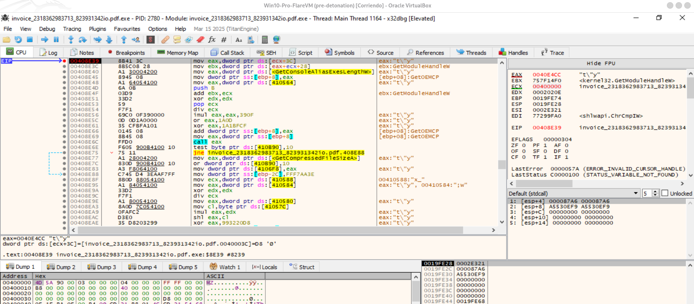

# Técnicas anti debug


## 0. GetTickCount

```
                             **************************************************************
                             *                          FUNCTION                          *
                             **************************************************************
                             int __cdecl entry(undefined4 param_1, undefined4 param_2
                               assume FS_OFFSET = 0xffdff000
             int               EAX:4          <RETURN>
             undefined4        Stack[0x4]:4   param_1                                 XREF[2]:     0040a9ef(R), 
                                                                                                   0040b169(R)  
             undefined4        Stack[0x8]:4   param_2                                 XREF[2]:     0040a9f7(R), 
                                                                                                   0040b166(R)  
             byte *            Stack[0xc]:4   param_3                                 XREF[1]:     0040b16c(R)  
             undefined4        Stack[-0x40]:4 local_40                                XREF[2]:     0040a4b0(W), 
                                                                                                   0040a4b4(R)  
             undefined4        Stack[-0x5c]:4 local_5c                                XREF[1]:     0040a445(W)  
             undefined4        Stack[-0x7c]:4 local_7c                                XREF[3]:     0040a44e(W), 
                                                                                                   0040a4a2(RW), 
                                                                                                   0040a4b8(R)  
             undefined2        Stack[-0x80]:2 local_80                                XREF[1]:     0040a430(W)  
             undefined4        Stack[-0x84]:4 local_84                                XREF[2]:     0040a46a(W), 
                                                                                                   0040a46e(R)  
                             entry                                           XREF[2]:     Entry Point(*), 00400100(*)  
        0040a3b6 55              PUSH       EBP
        0040a3b7 8b ec           MOV        EBP,ESP
        0040a3b9 83 e4 f8        AND        ESP,0xfffffff8
        0040a3bc 83 ec 7c        SUB        ESP,0x7c
        0040a3bf a1 94 fc        MOV        EAX,[DAT_0040fc94]                               = 00006A95h
                 40 00
.....
.....
                 00 00
        0040a445 89 44 24 34     MOV        dword ptr [ESP + local_5c],EAX
        0040a449 a1 e8 00        MOV        EAX,[->USER32.DLL::GetSysColor]                  = 000206f8
                 42 00
        0040a44e 89 44 24 14     MOV        dword ptr [ESP + local_7c],EAX
        0040a452 a1 ac fc        MOV        EAX,[DAT_0040fcac]                               = 0000006Ah
                 40 00
        0040a457 8b 0d a8        MOV        ECX,dword ptr [DAT_0040fca8]                     = 00007119h
                 fc 40 00
        0040a45d 05 ca 00        ADD        EAX,0xca
                 00 00
        0040a462 c1 e8 04        SHR        EAX,0x4
        0040a465 23 c8           AND        ECX,EAX
        0040a467 83 e9 10        SUB        ECX,0x10
        0040a46a 89 4c 24 0c     MOV        dword ptr [ESP + local_84],ECX
        0040a46e 8b 44 24 0c     MOV        EAX,dword ptr [ESP + local_84]
        0040a472 8b 0c 85        MOV        ECX,dword ptr [EAX*0x4 + 0x40fcb0]=>DAT_0040fcb4 = 00001616h
                 b0 fc 40 00
        0040a479 33 d2           XOR        EDX,EDX
        0040a47b b8 29 6b        MOV        EAX,0x6b29
                 00 00
        0040a480 f7 f1           DIV        ECX
        0040a482 8a 0d a4        MOV        CL,byte ptr [DAT_0040fca4]                       = 0Ah
                 fc 40 00
        0040a488 a1 c0 fc        MOV        EAX,[DAT_0040fcc0]                               = 00002A1Ah
                 40 00
        0040a48d 35 00 4f        XOR        EAX,0x4f00
                 00 00
        0040a492 05 02 c5        ADD        EAX,0xffffc502
                 ff ff
        0040a497 d3 ea           SHR        EDX,CL
        0040a499 8b 0d bc        MOV        ECX,dword ptr [DAT_0040fcbc]                     = 0000030Eh
                 fc 40 00
        0040a49f 83 f2 04        XOR        EDX,0x4
        0040a4a2 01 54 24 14     ADD        dword ptr [ESP + local_7c],EDX
        0040a4a6 33 d2           XOR        EDX,EDX
        0040a4a8 f7 f1           DIV        ECX
        0040a4aa 81 c2 85        ADD        EDX,0x2915cc85
                 cc 15 29
        0040a4b0 89 54 24 50     MOV        dword ptr [ESP + local_40],EDX
        0040a4b4 ff 74 24 50     PUSH       dword ptr [ESP + local_40]
        0040a4b8 8b 44 24 18     MOV        EAX,dword ptr [ESP + local_7c]
        0040a4bc ff d0           CALL       EAX
        0040a4be be 00 00        MOV        ESI,0x80000
                 08 00
                             LAB_0040a4c3                                    XREF[1]:     0040a4ca(j)  
        0040a4c3 ff 15 4c        CALL       dword ptr [->KERNEL32.DLL::GetTickCount]         = 000204d4
                 00 42 00
        0040a4c9 4e              DEC        ESI
        0040a4ca 75 f7           JNZ        LAB_0040a4c3
        0040a4cc f6 05 98        TEST       byte ptr [DAT_00410b98],0x1
                 0b 41 00 01
        0040a4d3 75 11           JNZ        LAB_0040a4e6
        0040a4d5 a1 38 01        MOV        EAX,[->USER32.DLL::AllowSetForegroundWindow]     = 000206c0
                 42 00
        0040a4da 83 0d 98        OR         dword ptr [DAT_00410b98],0x1
                 0b 41 00 01
        0040a4e1 a3 3c 07        MOV        [DAT_0041073c],EAX
                 41 00
```

1) 0040a449 --> en GetSysColor: Eso es call-target obfuscation: parte de una API válida y le suma un delta para acabar llamando a “algo” (a veces un thunk propio, a veces otra función dentro de la misma DLL si el delta cuadra). Forensemente, esto se trata como resolución dinámica/indirect call, muy común en loaders.

Ojo: ese CALL EAX tras modificar el puntero “GetSysColor + delta” es sospechoso de ser anti-analysis (romper heurísticas) o simplemente una forma de saltar a un thunk propio reubicado.


Call EAX llama a 7674D750 --> la dll GetsSysColor


2) 0040a4c3 --> GetTickCount: 

En 0040A4BE --> Inicializa ESI = 0x80000 (~524.288 iteraciones).

En cada iteración llama a GetTickCount y tira el resultado (no lo guarda, no lo compara).

Decrementa contador y repite.

Interpretación forense (lo importante)

Esto NO es el timing-check clásico (el de “mido delta y si es grande hay debugger”).
Aquí no hay comparación ni umbral. Por tanto, lo más probable es:

A) Delay activo / anti-sandbox por consumo de tiempo

Introduce una demora real sin usar Sleep (que muchas sandboxes aceleran o “hookean” fácil).

Llamar a una API del sistema cientos de miles de veces fuerza cambios de contexto y overhead del kernel/user.


## 1. Sentinel global 0xFFF7ABFE como “flag de estado” (gating de ramas)

Usa una constante sentinela y comparaciones:
- En FUN_00407436
    - 004075D2–004075F3
        - MOV EAX, [DAT_0040E5A8]
        - CMP EAX, 0xFFF7ABFE
        - Si igual: carga puntero vía PTR_PTR_0040D008 y lo copia a DAT_0040E590
        - Si distinto: fuerza DAT_0040E590 = 0

Por qué es relevante anti-analysis: ese sentinela está actuando como interruptor de “modo válido”. Si algo cambia ese valor (por inicialización distinta, ejecución bajo ciertas condiciones, o por manipulación), el flujo entra por la ruta que invalida DAT_0040E590 y luego aparecen cortes tempranos más adelante.


## 2 “Kill-switch” temprano por valor crítico (cierre/abort)

En FUN_00407436:
    - 00407806–00407810
        - CMP [DAT_0040E590], 0
        - JZ LAB_00407EE5 (salta a una ruta alternativa “corta”)

Lectura forense: DAT_0040E590 es una especie de “handle/ptr válido” que, si no está inicializado correctamente, manda a una rama distinta. Este tipo de gate se usa mucho para:
    - abortar lógica sensible si algo no cuadra,
    - impedir avanzar si el entorno no es el esperado,
    - o separar “ruta normal” vs “ruta anti-analysis”.


## 3 Auto-modificación / parcheo en memoria como fase protegida (mencionaste FUN_0040142F)

Hemos intentando “ver el dump” en 0x0040142F pero “se borra antes”. Eso encaja con dos patrones anti-analysis clásicos:
- Self-modifying code (descifra/parchea un stub en memoria, lo usa y luego lo pisa/borra).
- Ventana de tiempo estrecha (solo es visible durante unos pocos cientos de instrucciones).

Aunque no tengamoss el byte-dump, el hecho operacional ya lo tenemos:
- hay una fase de “parcheo/uso/limpieza” que dificulta inspeccionar estáticamente.
- Esto es anti-analysis, aunque no sea “anti-debug check” tipo IsDebuggerPresent.


## 4 Resolución dinámica de APIs/funciones (anti-IAT + anti-breakpoints)

En FUN_00407436 y en el bloque de LAB_00408C63, aparece repetidamente:
- punteros a APIs guardados en globals (ej. DAT_004106cc, DAT_004106d0, DAT_004106d4, DAT_004106d8, DAT_004106dc, DAT_004106e0, etc.)
- llamadas indirectas tipo:
    - MOV EAX, [DAT_004106FC]
    - CALL EAX

Por qué es anti-analysis: no es “detectar debugger” directamente, pero sí:
- evita que veamos un import table limpio,
- hace más difícil poner breakpoints en KERNEL32!X porque no hay call directo,
- permite cambiar de destino dinámicamente (incluso hacia stubs internos),
- y complica el tracing lineal.


## 5. Rama “caminar el PE” (parseo manual) usada como ruta alternativa (potencial anti-debug)

Cuando se toma la rama que empieza a leer:
- base = ...
- e_lfanew = [base + 0x3C]
- campos del NT Header / Optional Header

Ese patrón es PE parsing manual. En malware se usa mucho para:
- localizar directorios sin llamar a APIs,
- inspeccionar IMAGE_DIRECTORY_ENTRY_DEBUG (debug directory),
- inspeccionar imports/exports,
- validar que la imagen “es la esperada” (anti-tamper),
- o derivar offsets para stubs protegidos.

Importante: PE parsing no es automáticamente anti-debug, pero en este caso está claramente en una rama de control (cuando el “sentinela” no cuadra / o el flujo decide ir por ruta alternativa). Eso la vuelve sospechosa como lógica de “si no estás en condiciones normales, ve por ruta X”.


Esta rama hace PE-walking al principio ([base+0x3C], etc.).
- Si base (00792274) no es un PE válido o ni siquiera es memoria legible, ese read rompe con AV.
- En muchas familias eso se usa como control flow basado en excepción (SEH): bajo ejecución normal lo absorbe un handler y continúa; en debugger, si paras en first-chance, parece “crash”.

No te digo “cómo” configurarlo ni cómo “saltarlo”, pero forensemente: es muy plausible que NO sea un crash “real”, sino un nodo de flujo intencional.




## 6. Anti-debug basado en excepciones (SEH / KiUserExceptionDispatcher)

Esto es de lo más claro por las capturas:
- Llegas a un punto (00408E39) y al seguir con F9 te da excepción que te corta la ejecución.
- Por qué una lectura del tipo:
  ```
  mov eax, dword ptr [ecx+3C] con ECX=00400000
  acabaría en KiUserException...
  ```

Aunque en teoría [0x00400000+0x3C] debería ser legible si la imagen está mapeada normalmente, en muestras protegidas esto se usa de dos maneras:
- “Exception-as-signal”: provocan un acceso inválido solo bajo ciertas condiciones (p.ej. ECX no es realmente 00400000 en el momento efectivo, o el page mapping no es el “normal”, o hay trampas de guard page).
- SEH control-flow: el programa espera la excepción y la maneja para seguir; pero el debugger, dependiendo de configuración (“break on first chance”), interrumpe antes de que el handler la consuma, y el usuario cree que “se cae”.

Esto sí es anti-debug muy típico: “si estás debuggeando, te freno con excepciones”.


## 7. Comparaciones/ramas con “checks opacos” (valores calculados + saltos)

Ejemplos visibles:
- bucles tipo:
    - CMP ...
    - JBE / JA / JNZ hacia un loop (p.ej. 004074FD vuelve a 004074AD, o 00408331 vuelve a 00408289)

Estos bucles con constantes y tablas suelen ser:
- opaque predicates (condiciones difíciles de simplificar),
- delay loops / “noise”,
- o gating para que el flujo “bueno” ocurra solo si ciertos estados internos cuadran.

De nuevo: no es un “IsDebuggerPresent”, pero es anti-análisis porque complica el reasoning y el stepping.


## 8 FUN_004012DF: validación de imagen / sanity check (más anti-tamper que anti-debug)

FUN_004012DF(param_1) hace:
- chequeo del primer byte: `AL = [param_1] ; AL += 0x32 ; AL ^= 0xBE ; CMP AL, 0xC1`
    - Si falla → ruta alternativa (LAB_0040140D)

- calcula `ECX = param_1 + [param_1+0x3C]` (otra vez e_lfanew)
- compara un dword en `[ECX+0x54]` contra un valor derivado de constantes.

Eso parece validación del PE (o de un buffer con estructura similar a PE) + gating. Es útil para anti-analysis porque:
- si el “objeto PE” no es el esperado (por dumping parcial, reconstrucción incompleta, o manipulación), no deja avanzar por la ruta “normal”.

No se puede afirmar que sea anti-debug directo, pero sí anti-tamper/anti-dump.


-----


# Mapa de flujo: “ruta normal” vs “ruta alternativa (PE-walk / excepción)”

## A) FUN_00407436 (00407436) — gate de sentinela y bifurcación temprana
### A1) Inicialización + gate de DAT_0040E590

#### 1. 004075D2–004075F3
- Lee DAT_0040E5A8 y compara con 0xFFF7ABFE.
- Si igual: escribe un puntero/valor en DAT_0040E590.
- Si distinto: pone DAT_0040E590 = 0.

#### 2. 00407806–00407810
- CMP [DAT_0040E590], 0
- Si 0 → salta a LAB_00407EE5 (ruta “corta/alternativa” dentro de la función).
- Si no es 0 → continúa la ruta “central” (la larga).


📌 Interpretación forense: aquí DAT_0040E590 actúa como “flag/handle válido”. Si no está bien, FUN_00407436 se va a una ruta distinta antes de ejecutar parte de la lógica “sensible”.


## En el bloque alrededor de 00408C38–00409220 — el gran “split” por sentinela en ctx+0x1D4
### B1) Gate clave (check de sentinela)

En 00408C38:
- Condición: `dword ptr [ctx + 0x1D4] == 0xFFF7ABFE`.
- Si NO es igual (JNZ) → salta a LAB_00408E31 (ruta alternativa).
- Si SÍ es igual → sigue por la ruta “central” (ruta normal).

Esto separa:
- Ruta 1 --> (normal / “central”): la que suele llevar a la parte útil (incluido parcheo/descifrado)
- Ruta 2 --> (alternativa / LAB_00408E31): PE-walking + excepciones (anti-analysis)


-------

## Ruta 1 (normal / “central”): la que suele llevar a la parte útil (incluido parcheo/descifrado)
## C1) Qué hace (a alto nivel)

En esta ruta se ve el patrón:
1. Actualiza punteros dinámicos de API
- Ejemplo: en el snippet, en LAB_00408C63:
    - calcula valores desde DAT_004104F8..
    - termina haciendo:
        - ADD dword ptr [DAT_004106FC], ECX (00408CB3)
        - MOV EAX, [DAT_004106FC]
        - CALL EAX (00408CFB)


2. Escritura a una estructura global tipo “contexto”
    - 00408D00–00408D0C
        - ECX = [PTR_DAT_00410AB0]
        - ECX = [ECX + 0x1D0]
        - MOV [ECX], EAX

    - Esto parece “guardar resultado/ptr” en una estructura global (muy típico de loader/dispatcher interno).


3. Preparación de llamada grande (muchos pushes)
    - 00408D43–00408E02
    - Termina en:
        - CALL FUN_0040C181 (00408E02)


4. Salta hacia:
    - JMP LAB_00409220 (00408E2C)

## C2) ¿Esta ruta lleva a FUN_0040142F?

Es la candidata más probable a terminar invocando la parte de:
- descifrado/parcheo,
- o ejecución de stub temporal,
- que estamos intentando observar en 0x0040142F.

Razón: es la ruta donde ves resolución dinámica + llamadas indirectas + “montaje de argumentos”; eso es el patrón típico previo a stubs tipo FUN_0040592C / FUN_0040142F que comentabas antes.

✅ Conclusión útil: si existe una ruta que “gana” y llega a lo interesante (incluido el parcheo que luego se borra), normalmente es esta ruta 1.


## Ruta 2 (alternativa / LAB_00408E31): PE-walking + excepciones (anti-analysis)
## D) Qué se observa

En esa rama:
- toma una base (probablemente ImageBase o un puntero sacado del “ctx”),
- hace:
    - e_lfanew = [base + 0x3C]
    - luego lee campos dentro del NT header.

Esto es parseo manual del PE. Forensemente se usa para:
- encontrar directorios (import/debug/relocs),
- validar estructura (anti-tamper),
- o localizar offsets sin APIs.

## D2) ¿Desde esta rama se llega a FUN_0040142F?

No se sabe aun. En muchas muestras, esa rama se usa para:
- validar/chequear (y si algo “huele a debug”, aborta),
- o desviar hacia una ruta que acaba en excepción/cierre.

El síntoma (“si continuo, salta excepción y se para”) encaja más con:
- ruta 2 como ruta de castigo/anti-debug, o ruta que depende de manejar una excepción por SEH (y el debugger te corta antes de que el handler la consuma).

🔎 Conclusión prudente: lo más probable es que la ruta 2 NO sea la que nos lleva a FUN_0040142F, sino la que te saca del camino normal (o te mete en exception-driven control flow que en debug se vuelve molesto).


-----


# Cómo verificarlo de forma “forense” (sin bypass)

Para saber si la ruta 2 puede llegar a FUN_0040142F, podemos hacer una verificación observacional, no “forzada”:
- Breakpoint en el/los CALL site(s) reales a FUN_0040142F
    - No necesitamos saber cómo llegar: si llega, lo verás.
    - Cuando se dispare, miramos el call stack: eso nos dirá si veníamos de la ruta 1 o 2.

- Breakpoint en FUN_0040142F (entrada)
    - Si jamás rompe ahí mientras estás en la rama LAB_00408E31, esa rama no te conduce.

- Trace ligero con “log de ramas”
    - Solo registramos: “¿tomé el JNZ a LAB_00408E31?” y “¿vi ejecución en 0040142F?”
    - Con eso cerramos la duda sin tocar nada.


# Resumen ejecutivo
- Gates grandes vistos:
    - DAT_0040E5A8 == 0xFFF7ABFE → controla DAT_0040E590
    - DAT_0040E590 == 0 → manda a ruta alternativa dentro de FUN_00407436
    - [ctx+0x1D4] == 0xFFF7ABFE → separa ruta 1 (central) vs ruta 2 (PE-walk)
- Ruta 1 (central) = más probable que lleve a la fase de parcheo/descifrado (donde esperas ver FUN_0040142F).
- Ruta 2 (LAB_00408E31) = más probable que sea validación/anti-analysis (y donde te “cae” la excepción).