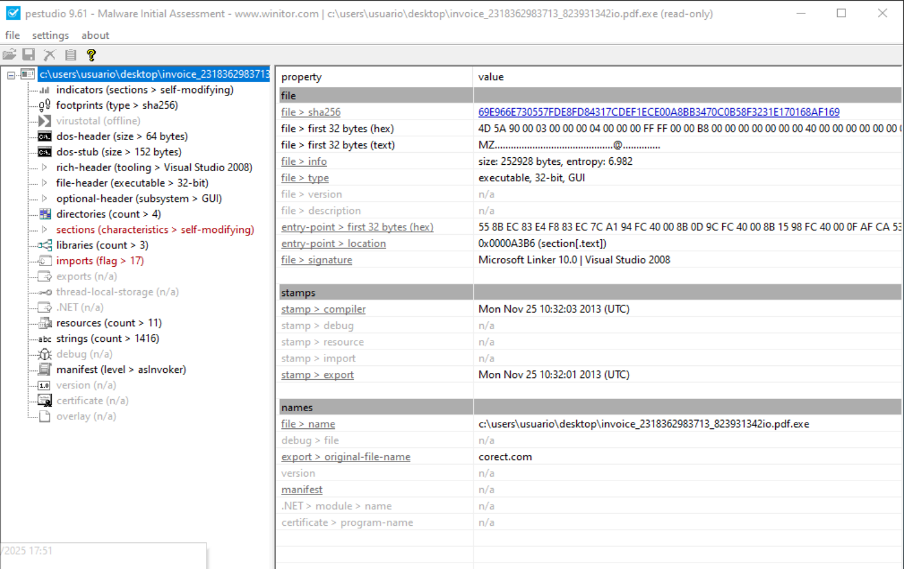
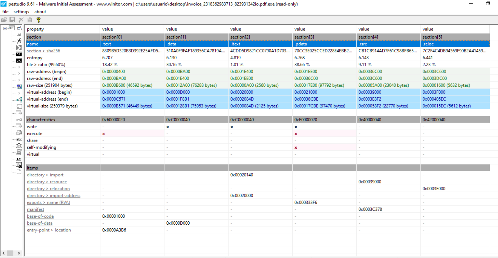
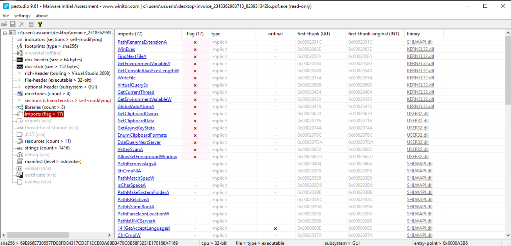
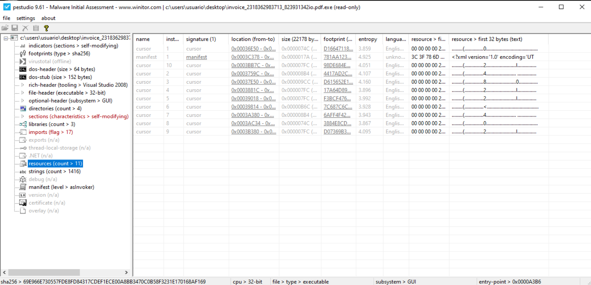

# Footprints

file > sha256,69E966E730557FDE8FD84317CDEF1ECE00A8BB3470C0B58F3231E170168AF169
dos-stub > sha256,6960FDC23907135D89201041AB3E8A222D0D9D327C4A16ADA1037BB1DAA11197
dos-header > sha256,5D85EEA79E3B682F8FE35296C9C506B0960112F39CC275078E096295EFF02644
rich-header > sha256,CD3CD6CDB421DA509FDE21CB41B183E51E145371F844B5DE628A3A2E873ABFF6
section > .text > sha256,8309B5D320B3D392E25AFD57793E6BB9D54A3AEACA697759963B008F3367B352
section > .data > sha256,510A0F9FAF189356CA7819AC6A5CBE1DA1D94EA110158E1C4D3BCB753C458BA5
section > .itext > sha256,4CDD5D9821CC0790A1D7031EF6CD3DFA9E68B967279D3BD2F0DE781EBCB95389
section > .pdata > sha256,70CC3E025CCED228E4EBB21E54B904A2E0CCEC85C0B0E292A1E12E7C819DB0AE
section > .rsrc > sha256,CB1CB914AD7F61C98BFB6506306E31A8D94DF71B078C69405E9FBD8DD289C54F
section > .reloc > sha256,7C2F4C4DB94369F90B2A41459CB3FB96EB9E9FF0D8631B7C6562467F0D8924B9
manifest > sha256,781AA123142F5551ABCD8D75E34CB3E24686341235276240580E4F3244616C9D
,
special,
imphash > md5,459E320C8A8F7E7049FF769CD123FD31


 # Identificación: Es Zeus (Zbot)

El archivo no es solo una "posible variante". El hash confirma que se trata de una muestra conocida del Troyano Bancario Zeus, extraída originalmente del repositorio de malware theZoo.

- Nombre real del archivo: invoice_2318362983713_823931342io.pdf.exe.
- Detección: Alrededor de 62-65 motores antivirus lo marcan como malicioso.


Es un troyano bancario para Windows centrado en robo de credenciales y fraude transaccional mediante man-in-the-browser (MitB) y form-grabbing.

Objetivo principal: capturar credenciales bancarias y datos financieros antes de que el navegador los cifre con TLS/SSL, y/o manipular la sesión del usuario ya autenticado para facilitar el fraude.




Arquitectura: 32 bits, tipo ejecutable PE, subsistema GUI, lo cual cuadra con un dropper bancario camuflado como documento PDF (“invoice_…pdf.exe”).

## Capacidades típicas:
- MitB / Webinjects: inyección/modificación de contenido en páginas bancarias en tiempo real (p. ej., añadir campos extra o alterar formularios).
- Form-grabbing y keylogging: captura de formularios/teclas para credenciales y otros accesos (correo, FTP, etc.).
- Modularidad: Zeus marcó un “patrón” arquitectónico que luego heredaron múltiples troyanos bancarios posteriores/derivados.


> Nota de contexto: el Zeus original se identificó en 2007 y su evolución/filtraciones impulsaron un ecosistema de variantes (p. ej., GameOver Zeus con C2 P2P; y derivados posteriores que reutilizan técnicas).


# ¿Qué hace al ejecutarse?
- El Señuelo (Decoy): Al ejecutarse, el malware intenta instalar una versión falsa de Adobe Flash Player para distraer a la víctima. Crea un proceso hijo llamado InstallFlashPlayer.exe en el directorio temporal (%TEMP%).

- Ejecución Oculta: Lanza cmd.exe y conhost.exe en segundo plano. Estos procesos son los encargados de ejecutar los comandos maliciosos sin que aparezca ninguna ventana en tu pantalla.

- Tráfico de Red: Intenta contactar con dominios como `fpdownload.macromedia.com`. A menudo, Zeus usa tráfico que parece legítimo para camuflar su comunicación con el servidor de control (C2).


# Las secciones



## Tamaño de las secciones:
| section | sha256 (prefix) | entropy | file ratio | raw begin | raw end | raw size | VA begin | VA end | virtual size |
|---|---|---:|---:|---:|---:|---|---:|---:|---|
| .text  | 8309... | 6.707 | 18.42% | 0x00000400 | 0x0000BA00 | 0x0000B600 (46592 bytes) | 0x00001000 | 0x0000C571 | 0x0000B571 (46449 bytes) |
| .data  | 510A... | 6.130 | 30.16% | 0x0000BA00 | 0x0001E400 | 0x00012A00 (76288 bytes) | 0x0000D000 | 0x0001F8B1 | 0x000128B1 (75953 bytes) |
| .itext | 4CDD...  | 4.819 | 1.01%  | 0x0001E400 | 0x0001EE00 | 0x00000A00 (2560 bytes)  | 0x00020000 | 0x0002084D | 0x0000084D (2125 bytes)  |
| .pdata | 70CC...  | 6.768 | 38.66% | 0x0001EE00 | 0x00036C00 | 0x00017E00 (97792 bytes) | 0x00021000 | 0x00038CBE | 0x00017CBE (97470 bytes) |
| .rsrc  | CB1C...  | 6.143 | 9.11%  | 0x00036C00 | 0x0003C600 | 0x00005A00 (23040 bytes) | 0x00039000 | 0x0003E8F2 | 0x000058F2 (22770 bytes) |
| .reloc | 7C2F... | 6.441 | 2.23%  | 0x0003C600 | 0x0003DC00 | 0x00001600 (5632 bytes)  | 0x0003F000 | 0x000405EC | 0x000015EC (5612 bytes)  |


## Características y Flags
| section | characteristics | write | execute | share | self-modifying | virtual |
|---|---:|:---:|:---:|:---:|:---:|:---:|
| .text  | 0x60000020 | - | **x** | - | - | - |
| .data  | 0xC0000040 | x | - | - | - | - |
| .itext | 0xC0000040 | x | - | - | - | - |
| .pdata | 0xE0000020 | x | **x** | - | **x** | - |
| .rsrc  | 0x40000040 | - | - | - | - | - |
| .reloc | 0x42000040 | - | - | - | - | - |


<mark><sections (characteristics > self-modifying: en rojo, indica al menos una sección con combinación RWX o patrón típico de código que se reescribe en tiempo de ejecución. Esto indica que el código cambiará a sí mismo mientras se ejecuta. Es una técnica clásica de polimorfismo para evadir firmas de antivirus.</mark> Las secciones de código no suelen tener permiso de escritura para evitar exploits. Que una sección pueda escribir y ejecutar al mismo tiempo es el comportamiento típico de un packer o un descompresor de malware.


## Items (solo entradas con valor)
| item | section | value |
|---|---|---:|
| directory > import | .itext | 0x00020140 |
| directory > import-address | .itext | 0x00020000 |
| directory > resource | .rsrc | 0x00039000 |
| directory > relocation | .reloc | 0x0003F000 |
| exports > name (RVA) | .pdata | 0x000333F6 |
| manifest | .rsrc | 0x0003C378 |
| base-of-code | .text | 0x00001000 |
| base-of-data | .data | 0x0000D000 |
| entry-point > location | .text | 0x0000A3B6 |


## Sección .text  
- Inicio - raw begin: `0x00000400`.
- Fin - raw end: `0x0000BA00`.
- Entropy moderada (6.707) y file % ratio ~90%, tamaño virtual ~250 KB.
- Flags:
  - No aparece el flag de write en la captura.
  - Sí aparece el flag execute, por lo que en principio es RX, como cabría esperar.
- Es razonable asumir que aquí reside el código principal: inicialización, API imports indirectos, descompresión de payload y/o inyección en otros procesos.
- El tamaño relativamente grande para un troyano bancario sugiere que puede incluir lógica empaquetada propia, no un simple stub PE pequeño, con rutinas de cifrado, comunicaciones C2, parser de config, etc.


**Lo interesante aquí para análisis estático:**
- Buscar patrones de desencriptado/decompresión: bucles con xor/add/sub/rol/ror sobre buffers, uso de VirtualAlloc/VirtualProtect seguido de copias de memoria a secciones ejecutables.
- Localizar trampolines hacia `.itext` u otras regiones: llamadas/jumps que van a RVA dentro de .itext o .pdata.


## Sección .data  
- Inicio - raw begin: 0x0000BA00.
- Fin: end raw: 0x0001E400.
- Entropía ~6.13, file % ratio ~30%, tamaño virtual ~75 KB.
- Tiene flag de ejecución (execute marcado con ✔), lo cual es inusual: .data suele ser RW, no RX.
- El hecho de que Pestudio marque el binario como “self‑modifying” suele correlacionar con secciones de datos ejecutables o RWX usadas como zona de desencriptado de shellcode/payload.

**Hipótesis de uso en este malware:**
- Almacenamiento cifrado de:
    - Configuración de Zeus (dominios C2, cuentas bancarias objetivo, webinjects).
    - API strings ofuscadas.
    - Shellcode que se desencripta y se hace ejecutable en runtime.

- Región “scratch” donde se copia código de .text ya descrifado para después cambiar permisos a RX y ejecutar.

**Para confirmar, en reversing:**
- Buscar referencias de código que escriban intensivamente dentro de direcciones RVA que caen en .data y luego ejecuten saltos allí.
- Rastrear llamadas a VirtualProtect/VirtualAlloc que apunten a esa sección, y bucles de deofuscación que terminen con un jmp a un offset en .data.


## Sección .itext
- Inicio - raw begin: 0x0001E400.
- Fin - end raw: 0x0001EE00.
- Nombre inusual (.itext), muy pequeña (~2.5 KB de raw, ~2 KB virtuales), con flag execute.
- Esta clase de sección suele usarse en malware como:
    - Stub de inicialización que corre muy pronto (por ejemplo, llamado desde el entry point) para montar anti‑debug/anti‑VM antes de saltar al código principal.
    - Trampolín para código desencriptado: el stub descifra un bloque en otra sección y luego hace un jmp allí.

**Puntos de análisis:**
- Ver si el entry‑point está dentro de .itext; si es así, centrar el análisis inicial ahí buscando:
    - Comprobaciones de PEB (BeingDebugged, NtGlobalFlag).
    - Llamadas a APIs de entorno (IsDebuggerPresent, CheckRemoteDebuggerPresent, etc.).
    - Decrypt loops compactos que referencien offsets en .text o .data.
- Aunque el tamaño es pequeño, podría contener pequeños fragmentos de shellcode polimórfico que cambian entre builds, típico en familias de troyanos bancarios para evadir firmas.


## Sección .pdata 
- Inicio - raw begin: 0x0001EE00.
- Fin - end raw: 0x00036C00.
- Entropía ~6.76, file % ratio ~38%, tamaño virtual ~95 KB.
- No tiene flag execute; se marca como datos (lo esperable).
- En PE legítimos suele contener información de excepción estructurada (SEH), pero en malware se reutiliza a menudo como “almacén” de datos ofuscados porque muchos analistas novatos la ignoran.

**Posibles usos en este contexto:**
- Almacenamiento de:
    - Tabla de configuración principal (ID de bot, URL C2, rutas de inyección de navegador, etc.).
    - Webinjects comprimidos.
    - Strings empaquetadas (nombres de bancos, dominios objetivo).
- Como zona intermedia en rutinas de empaquetador: datos comprimidos que luego se inflan a .data o memoria recién alocada.

**En análisis:**
- Extraer el contenido de .pdata y revisar con un hexdump/binaryninja/radare buscando estructuras repetitivas (longitud, flag, offset…) o compresión (cabeceras zlib/deflate, RC4, AES reconocible).
- Si se detecta RC4/AES o XOR sencillo, escribir script para deofuscar y volcar la configuración Zeus‑like (dominios, paths, user‑agents).

La sección `.pdata` confirma que es maliciosa. Contiene el código ofuscado que, una vez en memoria, "suelta" (drops) el ejecutable InstallFlashPlayer.exe. Los permisos de escritura/ejecución (RWX) que señalamos antes son necesarios para desempaquetar este segundo archivo en tiempo real.


## Sección .rsrc 
- Inicio - raw begin: 0x00036C00.
- Fin - end raw: 0x0003C600.
- Entropía ~6.14, file % ratio ~9%, tamaño virtual ~23 KB, sin flag execute (normal).
- Aun siendo una sección típica, para malware bancario suele ser interesante:
    - Puede contener íconos y diálogos para camuflarse como PDF viewer/factura.
    - Puede esconder payloads adicionales (por ejemplo, DLL bancarias, plantillas HTML de webinject) en recursos “custom”.

**Acciones sugeridas:**
- Enumerar recursos y comprobar tipos no estándar (RT_RCDATA, recursos con nombres numéricos raros).
- Extraer recursos binarios grandes y analizarlos aparte; a veces la config de Zeus se esconde ahí en lugar de .data/.pdata.


## Sección .reloc
- Inicio - raw begin: 0x0003C600.
- Fin: end raw: 0x0003DC00.
- Entropía: 6.441, file % ratio ~2.
- 


# Entropía y Empaquetamiento
La entropía mide la aleatoriedad de los datos. Valores altos sugieren que los datos están cifrados o comprimidos.
- Sección .text: Tiene una entropía de 6.707.
- Sección .pdata: Sube a 6.768.

Interpretación: Aunque no llega al 7.5 (que sería cifrado casi total), es lo suficientemente alta para confirmar que el contenido real del malware está oculto tras una capa de ofuscación. El código "limpio" no se ve a simple vista.


# Los imports

- Imports y Librerías: El análisis de esta muestra indica que importa KERNEL32.dll, SHLWAPI.dll y USER32.dll. Estas son las librerías justas y necesarias para manipular archivos (crear el falso instalador) y modificar el registro de Windows para ganar persistencia (que el virus se inicie al encender el PC).


# Los resources



# Indicadores de Compromiso (IOCs)

- Hash SHA256: 69e966e730557fde8fd84317cdef1ece00a8bb3470c0b58f3231e170168af169.
- Cadena sospechosa: Se ha detectado la función o cadena CellrotoCrudUntohighCols en su código, que es una firma específica de esta variante.
- Comportamiento clave: Creación de InstallFlashPlayer.exe y modificación del registro de Windows.


# Los Strings
A partir del output de FLOSS lo más importante es que la muestra parece estar muy `string-hardened`: tiene muchísimas cadenas estáticas ruidosas, muy pocas cadenas realmente “humanas”, y solo 33 `decoded strings` que además no aportan semántica clara. Eso suele apuntar a stub/loader + payload/config cifrado, o a resolución dinámica de APIs (GetProcAddress/LoadLibrary) para esconder capacidades que no aparecen en claro.


[**Los strings detectados - Opcion -a**](strings-a.ZeusBanking.txt)

[**Los strings detectados con Floss**](ZeusBank-Analisis-Floss.txt)


## 1 Captura de entrada (keylogging / form-grabbing “clásico”)
Hay un conjunto muy explícito de APIs de teclado/ventanas/clipboard:
- GetAsyncKeyState (polling de teclas), VkKeyScanA, GetKeyNameTextA
- GetClipboardData, EnumClipboardFormats, GetClipboardOwner 

Lectura defensiva: esto es compatible con keylogger/clipboard stealer (muy típico en troyanos bancarios), aunque por strings no podemos afirmar el mecanismo exacto: hooking vs polling vs inyección en navegador.

## 2 Componentes de GUI / señuelo (decoy)
Aparecen muchas funciones de UI y manejo de controles:
- SetDlgItemTextW, SetDlgItemInt, CreateCaret, ShowCaret/HideCaret, LoadIconA, LoadBitmapA, EndPaint, etc.

**Esto es consistente con:**
- un diálogo/ventana real (por ejemplo, para mostrar un “error” o un señuelo tipo “documento corrupto”), o
- un stub con UI mientras hace acciones en segundo plano.

## 3 Operaciones de ficheros y enumeración del sistema (dropper-like)
Se ven APIs de:
- ficheros/directorios: CreateFileA, WriteFile, DeleteFileA, FindFirstFileA/FindNextFileA/FindNextFileW
- rutas: muchísimas SHLWAPI.Path* (PathCanonicalizeW, PathRemoveFileSpecA, PathIsUNCW, etc.)

**Esto es consistente con:**
- Muy compatible con dropper/instalador (elige rutas, crea ficheros, limpia rastros),
- y/o con preparación de rutas para persistencia.
- A tener en cuentao: no aparecen APIs típicas de Registro (RegCreateKeyEx, RegSetValueEx, etc.), así que si hay persistencia por registro probablemente está resuelta dinámicamente o no está en esta etapa.

## 4 Comprobaciones de entorno / anti-analysis “suave”
Aparecen:
- GetSystemDefaultUILanguage, GetUserDefaultUILanguage, GetOEMCP, GetSystemDefaultLCID
- GetTickCount, VerSetConditionMask, VirtualQuery/VirtualQueryEx, IsBadReadPtr

Interpretación razonable:
- perfilado por idioma/locale (geofencing o lógicas específicas por región),
- y primitives típicas para chequear memoria/estado (a veces anti-debug o para localizar/gestionar payload en memoria).


## 5. Identificadores Únicos de Familia

- `CellrotoCrudUntohighCols`: Esta secuencia de palabras aparentemente aleatorias es una firma interna detectada en esta variante específica de Zeus. Confirma que el archivo analizado coincide exactamente con la muestra reportada en repositorios de malware como theZoo.

## 6. Capacidades de Inyección y Evasión

El malware importa funciones críticas de KERNEL32.dll y USER32.dll que revelan su "hoja de ruta" tras la ejecución:
- Inyección en Memoria: La presencia de funciones como VirtualQueryEx y WriteFile sugieren la preparación del espacio de memoria para inyectar el código malicioso en otros procesos legítimos del sistema.

- Persistencia y Ejecución: El uso de WinExec indica que el malware lanzará procesos adicionales (como el falso instalador de Flash detectado en análisis previos).

- Reconocimiento del Sistema: Cadenas como GetLogicalDrives, GetDriveTypeA y GetSystemDefaultUILanguage muestran que el malware "estudia" la víctima (idioma, discos conectados) para decidir si procede con el ataque o si está en un entorno de análisis (sandbox).

## 7. Ofuscación de Datos (Payload)

El reporte de FLOSS muestra grandes bloques de texto cifrado o codificado (ej. Km}0+, 85+IZrM4lXHU...).
- Estos bloques corresponden al configurador de Zeus, que contiene la lista de bancos objetivo, las URLs de los servidores de control (C2) y las plantillas de inyección web (scripts que modifican la web del banco).

- El hecho de que estas cadenas no sean legibles incluso para FLOSS confirma que el malware utiliza un algoritmo de cifrado personalizado (como una variante de RC4 o XOR) para proteger su infraestructura.


## 8. Un dominio
```
corect.com
```

## DLL usadas
- SHLWAPI.dll: 
- KERNEL32.dll:
- USER32.dll:
- KERNEL32.MulDi:


-------------------------

# Próximos pasos prácticos de análisis
- Localizar el entry‑point y ver en qué sección cae; si es .itext, desensamblar ese stub completo primero.
- Marcar las RVAs de .data y .pdata y colocar hardware breakpoints en escritura/ejecución sobre esas regiones en x32dbg para ver exactamente cuándo se modifican y desde qué código.
- Volcar las secciones .data y .pdata antes y después de la rutina de desencriptado para comparar y recuperar payload/config de forma limpia.
- Buscar en los volcados cadenas ofuscadas (URL, paths de bancos, user‑agents, “/gate.php”, etc.) que te confirmen familia y te den IOCs de C2.


-------------------------------

# Otros Analisis interesantes de ZeusBank
- https://threatradar.vercel.app/malware-analysis-of-zeus-banking-trojan
- 