# Análisis dinámico preliminar de la muestra ZeusBank

**Herramientas:** x32dbg y Process Monitor  
**Entorno:** máquina virtual Windows 10 sanitizada y aislada  
**Fecha de la sesión documentada:** 26 de julio de 2026  
**Estado del análisis:** ejecución y manipulación de proceso confirmadas; mecanismo exacto de inyección todavía pendiente

---

## 1. Objetivo del análisis

El objetivo de esta sesión fue reconstruir el flujo de ejecución de la muestra, comprobar qué proceso crea, observar cómo manipula ese proceso y determinar si el autoborrado corresponde al funcionamiento normal del loader o a una reacción anti-VM/anti-debug.

La muestra analizada es:

```text
invoice_2318362983713_823931342io.pdf.exe
```

Hash SHA-256 asociado al análisis previo:

```text
69e966e730557fde8fd84317cdef1ece00a8bb3470c0b58f3231e170168af169
```

> Las direcciones del módulo principal corresponden a esta muestra cargada con base `0x00400000`. Las direcciones de `ntdll.dll` y `kernel32.dll` pueden variar entre ejecuciones debido a ASLR.

---

## 2. Resultado de la ejecución de referencia

En una ejecución sin breakpoints internos, la muestra:

1. se inicia correctamente;
2. crea un proceso hijo `cmd.exe`;
3. manipula el hilo principal del proceso hijo mientras permanece suspendido;
4. reanuda dicho hilo;
5. finaliza;
6. elimina del escritorio el ejecutable original.

Este comportamiento se reproduce tanto fuera del depurador como con breakpoints mínimos de API, por lo que constituye el **flujo de referencia o baseline**.

No se observó la creación de `InstallFlashPlayer.exe`. La afirmación anterior sobre ese proceso debe considerarse descartada para esta ejecución.

---

## 3. Hub interno y comprobación de sentinelas

Se alcanzó la función situada en `0x00408469`, identificada durante el análisis estático como un hub de inicialización, resolución dinámica, control de estado y selección de rutas.

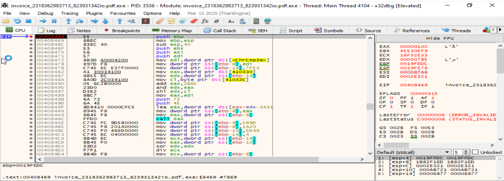

### 3.1. Sentinela `0xFFF7ABFE`

En `0x00408BE5` se observó:

```text
ECX          = FFF7ABFE
EAX          = 0040E4FC
[0040E4FC]   = FFF7ABFE
```

La instrucción es:

```asm
00408BE5  cmp ecx, dword ptr [eax]
```

Los dos operandos son iguales. Tras ejecutar el `CMP`, la condición de igualdad debe cumplirse y el salto `JE` posterior debe seguir la rama esperada.

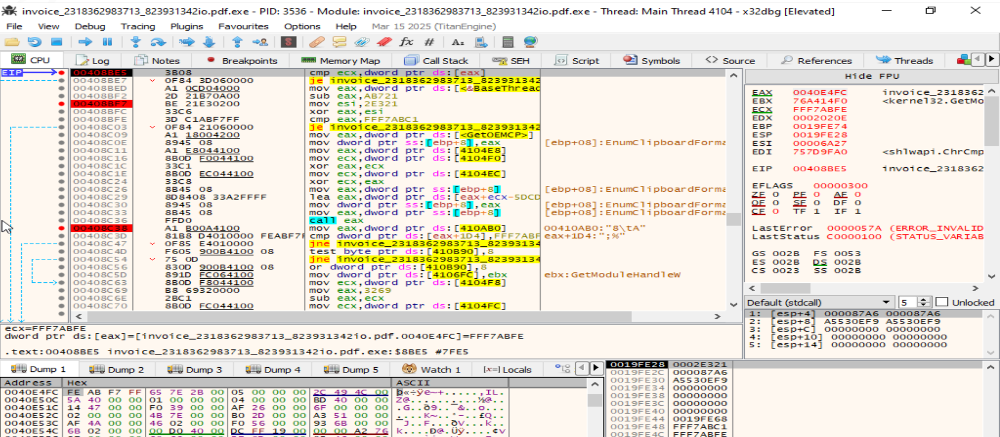

**Conclusión:** esta comprobación concreta fue superada en la máquina virtual sanitizada. No constituye evidencia de que la muestra haya detectado la VM.

### 3.2. Interferencia provocada por breakpoints software

En una sesión anterior, los breakpoints software insertados dentro del módulo fueron copiados junto con código reubicado. La misma rutina apareció en una región con base aproximada `0x02450000`, y el depurador se detuvo en `0x0245846A`, inmediatamente después del byte correspondiente al `INT3` copiado.

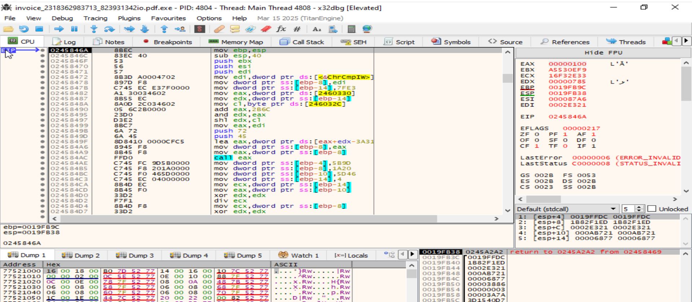

Esto explica las terminaciones anómalas y las ejecuciones de `WerFault.exe` observadas en sesiones previas. Esas terminaciones deben tratarse como **artefactos del análisis**, no como comportamiento normal confirmado de la muestra.

Para continuar el análisis interno deben utilizarse breakpoints hardware de ejecución o breakpoints de API fuera de las regiones que la muestra copia o reescribe.

---

## 4. Creación del proceso `cmd.exe`

La llamada a `CreateProcessW` se realiza desde el módulo principal en:

```text
Call site:       0040377E
Return address:  00403784
```

La parada en `kernel32!CreateProcessW` mostró:

```text
lpApplicationName = C:\Windows\System32\cmd.exe
lpCommandLine     = NULL
```

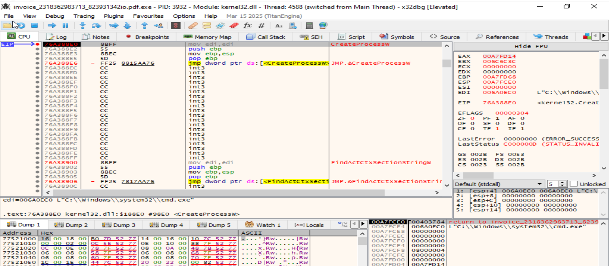

Los parámetros reconstruidos durante la sesión fueron:

```text
lpApplicationName    C:\Windows\System32\cmd.exe
lpCommandLine        NULL
dwCreationFlags      08000004
lpStartupInfo        00A7FD14
lpProcessInformation 00A7FD58
```

El valor `0x08000004` combina:

```text
0x00000004  CREATE_SUSPENDED
0x08000000  CREATE_NO_WINDOW
```

Por tanto, la muestra crea `cmd.exe` **suspendido y sin ventana visible**.

### 4.1. Resultado de `CreateProcessW`

Después de ejecutar la API y regresar a `0x00403784`:

```text
EAX = 00000001
```

En `CreateProcessW`, un valor distinto de cero significa éxito.

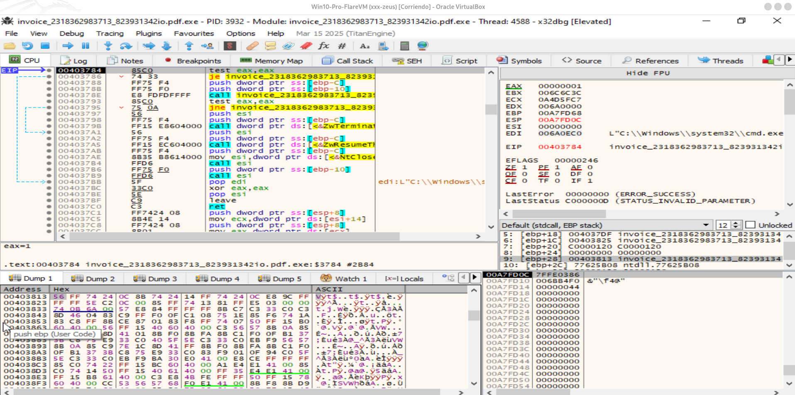

La estructura `PROCESS_INFORMATION`, situada en `0x00A7FD58`, quedó rellenada con:

```text
hProcess  = 00000118
hThread   = 00000114
PID       = 000010E4  = 4324 decimal
TID       = 000010A4  = 4260 decimal
```

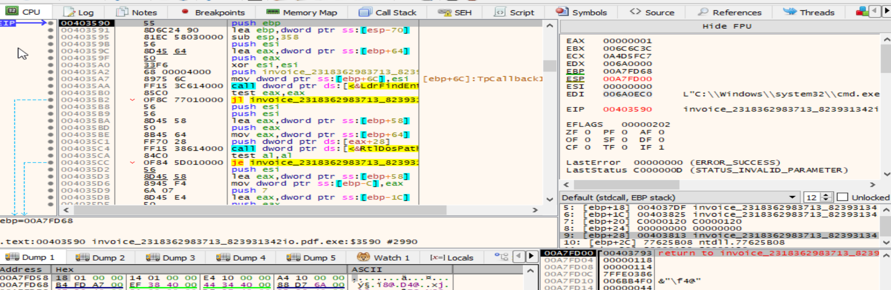

### 4.2. Confirmación independiente con Procmon

Process Monitor registró:

```text
Proceso padre: invoice_...pdf.exe
PID padre:     3932
Proceso hijo:  C:\Windows\SysWOW64\cmd.exe
PID hijo:      4324
Resultado:     SUCCESS
Command line:  "C:\Windows\system32\cmd.exe"
```

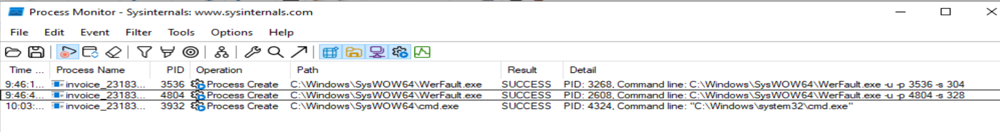

La diferencia entre `System32` y `SysWOW64` es coherente con la redirección de WOW64: un proceso de 32 bits solicita `System32`, pero Windows ejecuta la versión de 32 bits ubicada en `SysWOW64`.

---

## 5. Obtención y modificación del contexto del hilo

Después de crear el proceso suspendido, la muestra entra en una rutina situada alrededor de `0x00403590` y manipula el hilo cuyo handle es `0x114`.

### 5.1. `ZwGetContextThread`

La muestra llama a `ZwGetContextThread` con:

```text
ThreadHandle   = 00000114
Context        = 00A7F9A4
ContextFlags   = 00010001
```

`0x00010001` corresponde a la solicitud de la parte de control del contexto en x86.

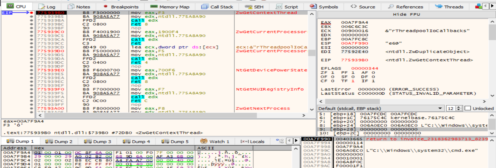

Después de que la API rellenara la estructura, se observó:

```text
CONTEXT.Eip = [00A7FA5C] = 77595050
CONTEXT.Esp = [00A7FA68] = 00DAFA54
EFlags                      = 00000202
```

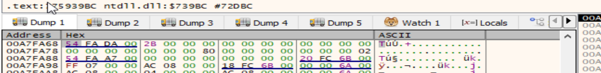

Este valor representa el estado inicial del hilo suspendido de `cmd.exe` en esa ejecución.

### 5.2. `ZwSetContextThread`

Posteriormente, la muestra llama a `ZwSetContextThread` utilizando el mismo handle y la misma estructura:

```text
ThreadHandle = 00000114
Context      = 00A7F9A4
```

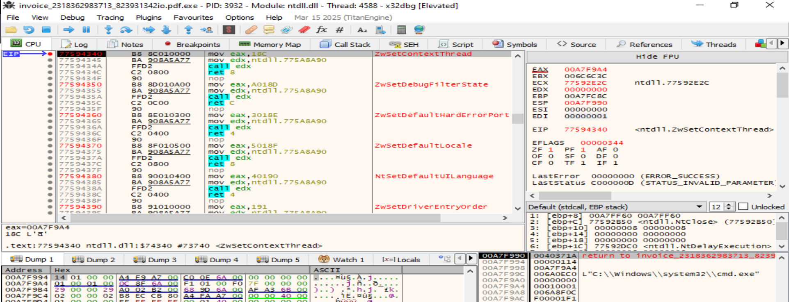

Antes de ejecutar la llamada se observó:

```text
CONTEXT.Eip = [00A7FA5C] = 77592AA0
```

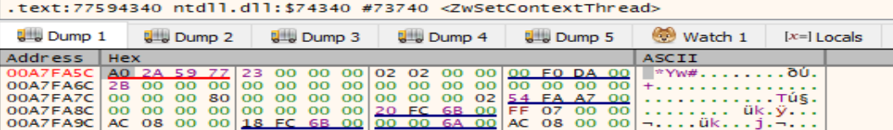

Comparación:

```text
EIP obtenido inicialmente: 77595050
EIP aplicado después:      77592AA0
```

Esto demuestra que la muestra **modifica el contexto del hilo suspendido**. Ambos valores pertenecen aparentemente al rango de `ntdll.dll`, por lo que el segundo valor no puede identificarse todavía como punto de entrada directo del payload.

---

## 6. Reanudación del hilo y autoborrado

La cadena final alcanza `ZwResumeThread` con el mismo handle:

```text
ThreadHandle = 00000114
```

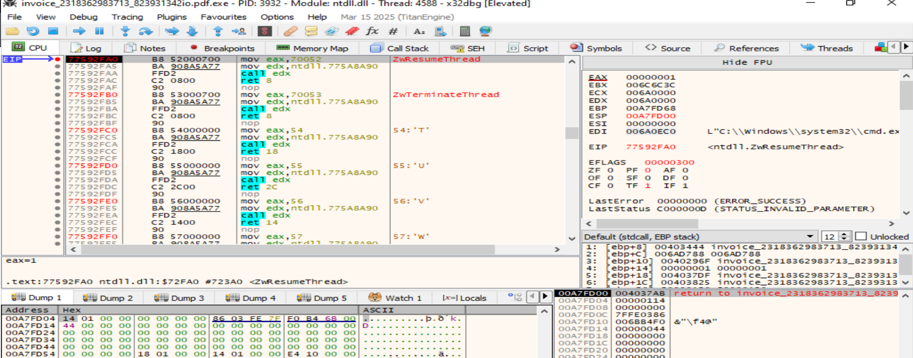

Después de ejecutar `ZwResumeThread` y regresar al módulo principal:

```text
EAX = 00000000
```

En las funciones nativas, `NTSTATUS = 0` indica éxito. Al continuar con `F9`:

1. el proceso reanudado continuó ejecutándose;
2. el proceso de la muestra terminó;
3. el archivo original desapareció del escritorio.

Por tanto, el flujo dinámico confirmado es:

```text
invoice_...pdf.exe
        |
        | CreateProcessW
        v
cmd.exe creado suspendido y sin ventana
        |
        | ZwGetContextThread
        | ZwSetContextThread
        | ZwResumeThread
        v
cmd.exe continúa ejecutándose
        |
        v
finalización y eliminación del ejecutable original
```

---

## 7. Hallazgos confirmados

### 7.1. Certezas obtenidas dinámicamente

| Hallazgo | Evidencia | Estado |
|---|---|---|
| La muestra se ejecuta correctamente en la VM sanitizada | Proceso principal observado en x32dbg y Procmon | Confirmado |
| Se crea un proceso hijo `cmd.exe` | `CreateProcessW`, EAX=1 y evento `Process Create` de Procmon | Confirmado |
| El padre de `cmd.exe` es la muestra | PID padre 3932 en Procmon | Confirmado |
| El PID del hijo es 4324 | `PROCESS_INFORMATION` y Procmon | Confirmado |
| `cmd.exe` se crea suspendido | Flag `CREATE_SUSPENDED` | Confirmado |
| `cmd.exe` se crea sin ventana | Flag `CREATE_NO_WINDOW` | Confirmado |
| La muestra obtiene el contexto del hilo | `ZwGetContextThread`, handle `0x114` | Confirmado |
| La muestra cambia el contexto del hilo | Cambio de EIP y llamada a `ZwSetContextThread` | Confirmado |
| La muestra reanuda el hilo | `ZwResumeThread`, NTSTATUS 0 | Confirmado |
| El ejecutable original termina y se borra | Observación directa tras continuar la ejecución | Confirmado |
| El sentinela `0xFFF7ABFE` se valida en esta VM | Igualdad en `0x00408BE5` | Confirmado |
| Los breakpoints software internos pueden alterar la ejecución | Código reubicado con `INT3` copiado y ejecuciones de WerFault | Confirmado |
| No se crea `InstallFlashPlayer.exe` en la sesión observada | Ausencia en Procmon y cadena real centrada en `cmd.exe` | Confirmado para esta ejecución |

---

## 8. Interpretaciones de alta confianza, pero no completamente cerradas

### 8.1. Comportamiento de loader/injector

La combinación siguiente es característica de un loader que prepara otro proceso:

```text
CreateProcessW(CREATE_SUSPENDED)
ZwGetContextThread
ZwSetContextThread
ZwResumeThread
```

La muestra está utilizando `cmd.exe` como contenedor o proceso auxiliar. La secuencia es compatible con técnicas de inyección o process hollowing, pero todavía falta capturar la operación exacta que introduce o mapea el código.

### 8.2. Función del autoborrado

La explicación que mejor encaja con los datos actuales es:

> El ejecutable inicial actúa como loader, prepara el proceso hijo y elimina el archivo de origen después de transferir o delegar la ejecución.

El autoborrado se reproduce sin breakpoints internos y después de completar la cadena `CreateProcessW → GetContext → SetContext → ResumeThread`. Por ello, parece formar parte del flujo normal de limpieza o *melting* del loader.

---

## 9. Aspectos todavía no demostrados

No debe afirmarse todavía como certeza ninguno de los siguientes puntos:

- que la técnica concreta sea process hollowing completo;
- que la imagen original de `cmd.exe` sea desmontada con `ZwUnmapViewOfSection`;
- que se reserve memoria remota con `ZwAllocateVirtualMemory`;
- que el payload se escriba mediante `ZwWriteVirtualMemory`;
- que se utilicen secciones compartidas mediante `ZwCreateSection` y `ZwMapViewOfSection`;
- cuál es la dirección final real del payload;
- qué código ejecuta exactamente `cmd.exe` después de ser reanudado;
- que el autoborrado sea una reacción a la detección de VirtualBox, FLARE VM o x32dbg;
- que exista una comprobación específica de VMware basada en `vmci`;
- que se ejecuten en esta sesión las capacidades bancarias, de keylogging, persistencia o comunicación C2.

---

## 10. Evaluación de la hipótesis anti-VM/anti-debug

La hipótesis planteada fue que la muestra podría borrarse porque detecta la máquina virtual o el análisis.

### Evidencia que no respalda esa hipótesis por ahora

1. La muestra se borra también cuando se ejecuta sin breakpoints internos.
2. Antes de borrarse completa una cadena compleja de preparación del proceso hijo.
3. `CreateProcessW`, `ZwSetContextThread` y `ZwResumeThread` terminan con éxito.
4. El sentinela `0xFFF7ABFE` se valida en la VM sanitizada.
5. Los fallos con `WerFault.exe` se relacionan con breakpoints software copiados, no con una ruta anti-VM confirmada.

### Conclusión provisional

> No se ha demostrado que el autoborrado sea una respuesta anti-VM o anti-debug. La evidencia actual encaja mejor con una rutina normal de limpieza del loader tras preparar y reanudar `cmd.exe`.

Para demostrar una detección anti-VM sería necesario identificar una consulta concreta del entorno, el resultado obtenido, el salto condicional que utiliza ese resultado y una ruta divergente que evite o interrumpa el flujo normal.

---

## 11. Próximos pasos recomendados

### 11.1. Identificar el mecanismo de introducción del código

Repetir desde una snapshot limpia, colocando los breakpoints antes de ejecutar:

```text
ntdll!ZwCreateSection
ntdll!ZwMapViewOfSection
ntdll!ZwUnmapViewOfSection
ntdll!ZwAllocateVirtualMemory
ntdll!ZwWriteVirtualMemory
ntdll!ZwGetContextThread
ntdll!ZwSetContextThread
ntdll!ZwResumeThread
```

En cada parada deben anotarse:

- handle del proceso;
- handle de sección;
- dirección base local y remota;
- dirección del buffer fuente;
- tamaño de la operación;
- protección de memoria;
- valor devuelto por la API;
- relación con el PID 4324 o con el proceso hijo de la nueva ejecución.

### 11.2. Determinar el mecanismo exacto de borrado

Colocar breakpoints en:

```text
kernel32!DeleteFileW
kernel32!DeleteFileA
kernel32!MoveFileExW
ntdll!NtSetInformationFile
kernel32!CreateProcessW
```

En `NtSetInformationFile`, comprobar si se utiliza una clase de información relacionada con `FileDispositionInformation`.

### 11.3. Continuar la investigación anti-VM

- utilizar breakpoints hardware en los gates internos;
- registrar operandos y saltos sin modificar inicialmente EFLAGS;
- comparar una ejecución baseline con pruebas diferenciales;
- alterar una sola condición del entorno cada vez;
- no utilizar breakpoints software dentro de regiones que puedan copiarse o auto-modificarse.

---

## 12. Conclusión general

La sesión permite afirmar que la muestra completa un flujo de loader funcional en la máquina virtual sanitizada. Crea `cmd.exe` suspendido y sin ventana, obtiene y modifica el contexto de su hilo, lo reanuda con éxito y posteriormente elimina el ejecutable original.

La manipulación observada es compatible con una técnica de inyección o process hollowing, pero el mecanismo de mapeo o escritura del payload no se ha capturado todavía. Tampoco se ha demostrado que el autoborrado sea provocado por una detección de máquina virtual o depurador. Con los datos actuales, debe clasificarse como una fase normal de limpieza o *melting* posterior a la preparación del proceso hijo.
