# Extracción dinámica de la imagen cargada por `msimg32.dll` mediante x32dbg

## Análisis del instalador de Flash Player, seguimiento de la reserva de memoria, cambio de protecciones, volcado con `savedata` y reconstrucción con OllyDumpEx

---

## 1. Objetivo y alcance

Este documento describe, paso a paso, el procedimiento seguido para identificar y extraer la imagen PE que `msimg32.dll` coloca en una región privada de memoria cuando la DLL es cargada por `InstallFlashPlayer.exe`.

El flujo analizado es compatible con un escenario de **DLL side-loading**:

1. Se ejecuta un instalador de Flash Player.
2. El ejecutable carga una DLL denominada `msimg32.dll`.
3. La DLL ejecuta su punto de entrada durante `DLL_PROCESS_ATTACH`.
4. Desde código perteneciente a la DLL se solicita una región de memoria de `0x41000` bytes.
5. La región se reserva inicialmente con protección `PAGE_READONLY`.
6. Después se cambia a `PAGE_EXECUTE_READWRITE`.
7. En la región aparece una cabecera `MZ` y una imagen PE completa.
8. La región puede volcarse en bruto con el comando `savedata` de x32dbg.
9. También puede reconstruirse como PE mediante OllyDumpEx.
10. La comparación estática sugiere que la imagen extraída podría ser una **copia reubicada de la propia `msimg32.dll`**, en lugar de un payload completamente distinto.

El término *payload* se utiliza en este documento como denominación operativa de la imagen colocada en memoria. La conclusión final matiza esta denominación: la evidencia observada es compatible con que se trate de una segunda instancia o copia manualmente mapeada de la propia DLL.

> **Entorno observado en las capturas:** Windows 10 en una VM FLARE, x32dbg elevado, proceso de 32 bits. Las direcciones absolutas pertenecen a una ejecución concreta y pueden cambiar por ASLR.

---

## 2. Precauciones de laboratorio

La muestra debe analizarse exclusivamente en un entorno aislado:

- Máquina virtual con instantánea recuperable.
- Sin carpetas compartidas innecesarias.
- Sin portapapeles bidireccional durante la ejecución.
- Sin acceso a la red real, salvo una red simulada y controlada.
- Conservación de hashes de las muestras originales.
- Los volcados deben tratarse como ejecutables potencialmente maliciosos.
- No debe abrirse ni ejecutarse el payload extraído fuera de la VM.

La ejecución usada en este análisis aparece como **Elevated** en x32dbg. Si se quiere reproducir el flujo exactamente, debe anotarse este dato, porque la elevación puede alterar rutas, accesos, procesos secundarios y módulos cargados.

---

## 3. Conceptos necesarios

### 3.1. Dirección base, RVA y dirección virtual

En un PE, muchas ubicaciones se expresan como **RVA** (*Relative Virtual Address*), es decir, como un desplazamiento respecto de la base de la imagen:

```text
VA = ImageBase + RVA
RVA = VA - ImageBase
```

En la ejecución documentada:

```text
Base original de msimg32.dll = 0x00400000
RVA del punto de entrada      = 0x0000A3B6
VA del punto de entrada       = 0x0040A3B6
```

La copia privada quedó en:

```text
Base de la copia              = 0x03170000
VA equivalente del EP         = 0x0317A3B6
```

El RVA continúa siendo `0xA3B6`; lo que cambia es la base en la que se encuentra la imagen.

### 3.2. Argumentos en x86

Las funciones WinAPI utilizadas siguen `stdcall`. Al entrar en la API, la pila contiene:

```text
[ESP]     Dirección de retorno
[ESP+4]   Primer argumento
[ESP+8]   Segundo argumento
[ESP+C]   Tercer argumento
[ESP+10]  Cuarto argumento
```

Esta disposición permite:

- comprobar quién llamó a la API mirando `[ESP]`;
- interpretar los parámetros sin entrar en la función;
- filtrar breakpoints por el rango del módulo llamador.

### 3.3. Valores de memoria relevantes

En la llamada observada:

```text
0x1000 = MEM_COMMIT
0x2000 = MEM_RESERVE
0x3000 = MEM_COMMIT | MEM_RESERVE

0x02 = PAGE_READONLY
0x04 = PAGE_READWRITE
0x20 = PAGE_EXECUTE_READ
0x40 = PAGE_EXECUTE_READWRITE
```

`PAGE_EXECUTE_READWRITE` permite lectura, escritura y ejecución. Por sí solo no demuestra actividad maliciosa, pero resulta especialmente relevante cuando se combina con:

- una reserva privada;
- la copia de una cabecera `MZ`;
- una imagen PE completa;
- una futura transferencia de ejecución a esa región.

---

# 4. Procedimiento dinámico completo

## 4.1. Iniciar el instalador y detenerse en la carga de `msimg32.dll`

Se abre `InstallFlashPlayer.exe` con x32dbg y, en el *system breakpoint*, se crea un breakpoint de biblioteca:

```text
bpdll msimg32.dll,l
```

Significado:

- `bpdll`: breakpoint de carga/descarga de biblioteca.
- `msimg32.dll`: módulo que se desea vigilar.
- `l`: detenerse únicamente durante la carga.

En caso de necesitar un respaldo para inspeccionar todas las cargas dinámicas:

```text
bp ntdll.LdrLoadDll
```

Sin embargo, `LdrLoadDll` es mucho más ruidoso. Para el objetivo concreto de este análisis, `bpdll msimg32.dll,l` es el mecanismo mínimo y más directo.

La siguiente captura muestra la vista de breakpoints durante la preparación. La fila de `msimg32.dll` aparecía inicialmente desactivada y se habilitó antes de continuar.

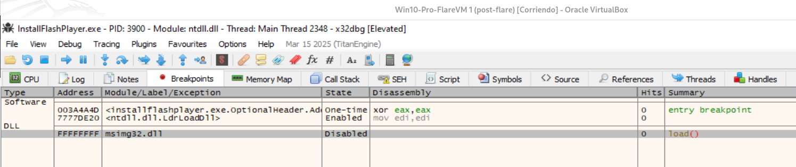

**Figura 1.** Breakpoint del entry point, `LdrLoadDll` y breakpoint de biblioteca para `msimg32.dll`.

Después se pulsa:

```text
F9
```

Cuando el breakpoint de DLL se activa, se comprueba:

- nombre del módulo;
- ruta completa;
- base;
- tamaño;
- secciones.

La ruta es crucial. Para demostrar side-loading, la DLL debe proceder del directorio de la muestra y no de una ruta legítima como `C:\Windows\System32\msimg32.dll`.

---

## 4.2. Confirmar la base y el mapa de la DLL

En la ejecución documentada, `msimg32.dll` quedó cargada en:

```text
Base = 0x00400000
```

Su mapa contenía las secciones:

```text
00401000  .text
0040D000  .data
00420000  .itext
00421000  .pdata
00439000  .rsrc
0043F000  .reloc
```

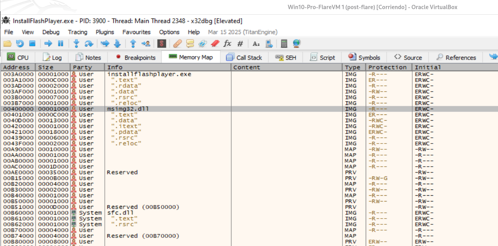

**Figura 2.** `msimg32.dll` registrada como imagen PE a partir de `0x00400000`.

El tamaño de imagen identificado posteriormente fue:

```text
SizeOfImage = 0x41000
```

Por tanto, el rango exacto de la imagen es:

```text
Inicio: 0x00400000
Fin exclusivo: 0x00441000
```

> En las pruebas se utilizó inicialmente `0x00440000` como límite superior. Funcionó para las llamadas observadas, pero el límite exacto derivado de `SizeOfImage` es `0x00441000`.

---

## 4.3. Detenerse en el punto de entrada de `msimg32.dll`

El entry point de la DLL se encontraba en:

```text
RVA = 0xA3B6
VA  = 0x0040A3B6
```

Se coloca:

```text
bp 0040A3B6
```

o se obtiene la dirección desde la vista de módulos y se crea el breakpoint desde la interfaz.

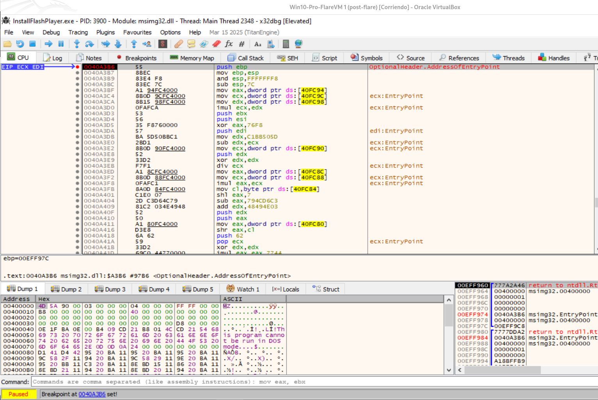

**Figura 3.** Ejecución detenida en `msimg32.dll!EntryPoint`, dirección `0x0040A3B6`.

En la pila pueden observarse los argumentos de `DllMain`:

```c
BOOL WINAPI DllMain(
    HINSTANCE hinstDLL,
    DWORD     fdwReason,
    LPVOID    lpReserved
);
```

En x86:

```text
[ESP+4] = 00400000  -> hinstDLL
[ESP+8] = 00000001  -> DLL_PROCESS_ATTACH
[ESP+C] = 00000000  -> lpReserved
```

El valor `1` en el segundo argumento confirma que se está ejecutando la inicialización de la DLL para la carga del proceso.

El código inicial presenta operaciones aritméticas, accesos a variables globales y flujo difícil de seguir. Por ello, en lugar de recorrer todo el entry point con `F7`, se utilizaron breakpoints en APIs de memoria.

---

## 4.4. Crear breakpoints mínimos en APIs de memoria

Los breakpoints principales son:

```text
bp kernel32.VirtualAlloc
bp kernel32.VirtualProtect
bp ntdll.NtAllocateVirtualMemory
bp ntdll.NtProtectVirtualMemory
```

También pueden mantenerse, con carácter auxiliar:

```text
bp kernel32.LoadLibraryA
bp kernel32.LoadLibraryW
bp kernel32.GetProcAddress
```

No obstante, para llegar con menos ruido a la reserva del payload, conviene desactivar temporalmente las APIs que no sean de memoria.

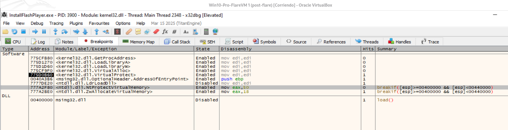

**Figura 4.** Breakpoints de `VirtualAlloc`, `VirtualProtect` y sus equivalentes nativos.

### 4.4.1. Condicionar por el módulo llamador

Sin condiciones, las APIs nativas generan muchas paradas internas de Windows. Para detenerse solo cuando la dirección de retorno pertenece a `msimg32.dll`, se usa:

```text
[esp]>=00400000 && [esp]<00441000
```

La condición se introduce en el campo **Break Condition**, sin envolverla en `breakif(...)`.

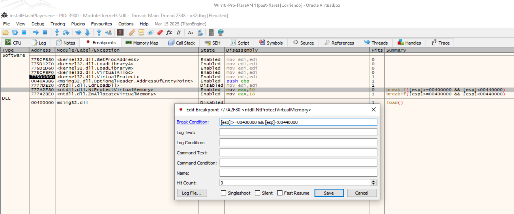

**Figura 5.** Condición sobre la dirección de retorno almacenada en `[ESP]`.

Se recomienda marcar **Fast Resume**. Así, cuando la condición sea falsa, x32dbg continúa sin realizar una pausa visible.

### Limitación del filtro

La condición comprueba al **llamador inmediato**. Es perfecta cuando `msimg32.dll` llama directamente a `kernel32!VirtualAlloc` o `kernel32!VirtualProtect`. En APIs nativas, una llamada puede pasar antes por `KernelBase` o por un wrapper; en tal caso, `[ESP]` podría pertenecer a un módulo del sistema. Por eso se mantienen tanto los breakpoints de alto nivel como los nativos.

---

## 4.5. Capturar la llamada a `VirtualAlloc`

Después de continuar con `F9`, x32dbg se detuvo en:

```text
kernel32!VirtualAlloc
EIP = 0x775CF9F0
```

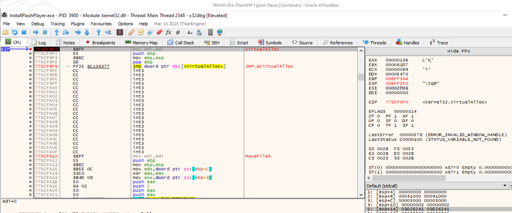

**Figura 6.** Llamada a `VirtualAlloc` procedente de `msimg32.dll`.

Los argumentos visibles eran:

```text
[ESP+4]  lpAddress        = 00000000
[ESP+8]  dwSize           = 00041000
[ESP+C]  flAllocationType = 00003000
[ESP+10] flProtect        = 00000002
```

Interpretación:

```text
lpAddress = NULL
```

El sistema debe elegir la dirección base.

```text
dwSize = 0x41000
```

Se solicita exactamente el mismo tamaño que `SizeOfImage` de `msimg32.dll`.

```text
flAllocationType = 0x3000
                 = MEM_RESERVE | MEM_COMMIT
```

Se reserva espacio virtual y se confirman las páginas.

```text
flProtect = 0x02
          = PAGE_READONLY
```

La memoria se crea inicialmente en modo de solo lectura.

La pila también muestra:

```text
[ESP] = 00407109
```

La dirección `0x00407109` pertenece a `msimg32.dll`, confirmando que la llamada fue realizada directamente desde la DLL.

### Importancia del tamaño `0x41000`

El hecho de que la reserva tenga exactamente el mismo tamaño que la imagen PE de la DLL es la primera evidencia de una posible **copia completa de la propia imagen**:

```text
SizeOfImage de msimg32.dll = 0x41000
Tamaño solicitado          = 0x41000
```

---

## 4.6. Recuperar la dirección asignada

Se ejecuta la API hasta su retorno:

```text
Ctrl+F9
```

En x86, `VirtualAlloc` devuelve en `EAX`:

- la dirección base de la nueva región, si tuvo éxito;
- `NULL`, si falló.

En la ejecución analizada:

```text
EAX = 0x03170000
```

La nueva región es:

```text
Base:          0x03170000
Tamaño:        0x00041000
Fin exclusivo: 0x031B1000
```

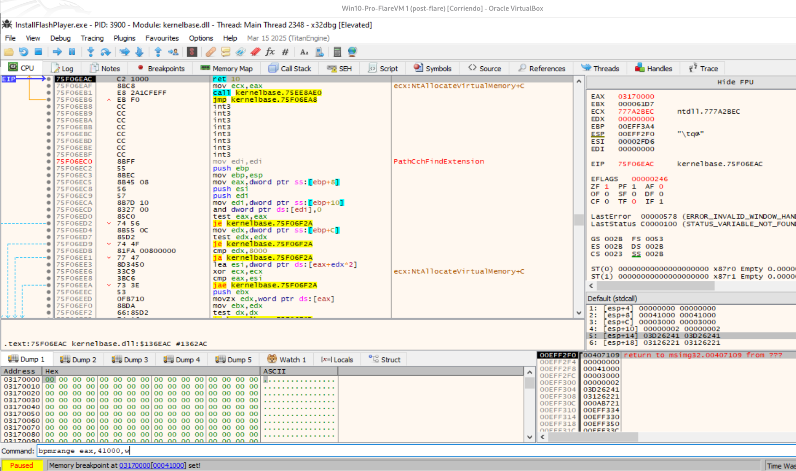

**Figura 7.** `EAX=0x03170000` y creación de un breakpoint de escritura sobre `0x41000` bytes.

Para vigilar cualquier escritura en la región se introdujo:

```text
bpmrange eax,41000,w
```

Equivalente, usando la dirección explícita:

```text
bpmrange 03170000,41000,w
```

Parámetros:

```text
03170000 -> comienzo de la región
41000    -> tamaño en hexadecimal
w        -> detenerse en escritura
```

x32dbg confirmó:

```text
Memory breakpoint at 03170000 [00041000] set!
```

> Los valores numéricos de los comandos de x32dbg se interpretan como hexadecimales. Los argumentos se separan mediante comas.

---

## 4.7. Capturar el cambio de protección con `VirtualProtect`

La región se había reservado con `PAGE_READONLY`, lo que impide escribir o ejecutar normalmente su contenido. A continuación se observó una llamada a:

```text
kernel32!VirtualProtect
```

con estos argumentos:

```text
[ESP+4]  lpAddress    = 03170000
[ESP+8]  dwSize       = 00041000
[ESP+C]  flNewProtect = 00000040
[ESP+10] lpflOldProtect = 00EFF3FC
```

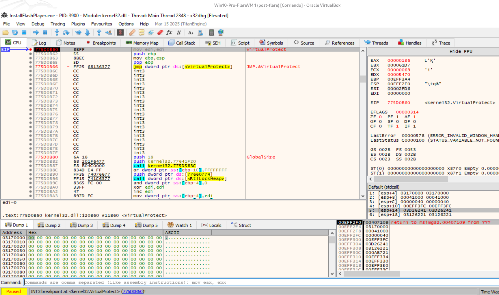

**Figura 8.** Cambio de protección de la región `0x03170000` a `PAGE_EXECUTE_READWRITE`.

Interpretación:

```text
0x40 = PAGE_EXECUTE_READWRITE
```

Por tanto, el mismo bloque pasa a ser:

- legible;
- escribible;
- ejecutable.

La secuencia observada queda así:

```text
VirtualAlloc(
    NULL,
    0x41000,
    MEM_RESERVE | MEM_COMMIT,
    PAGE_READONLY
)
        |
        v
Base devuelta: 0x03170000
        |
        v
VirtualProtect(
    0x03170000,
    0x41000,
    PAGE_EXECUTE_READWRITE,
    &OldProtect
)
```

Esta secuencia prepara la región para recibir una imagen y, potencialmente, ejecutar código desde ella.

### Nota metodológica

El breakpoint de escritura ya estaba activo, pero también seguían activos los breakpoints sobre APIs. Por ello, la siguiente parada visible fue la llamada a `VirtualProtect`. Para capturar exactamente la instrucción que realiza la primera escritura, una repetición más depurada puede:

1. dejar finalizar `VirtualProtect`;
2. desactivar temporalmente los breakpoints de APIs;
3. conservar solo `bpmrange 03170000,41000,w`;
4. continuar con `F9`.

En la ejecución documentada, aunque no se preservó la primera instrucción escritora, sí se demostró el resultado de la copia.

---

## 4.8. Verificar que la región contiene una imagen PE

Después de continuar, el Dump de x32dbg mostró:

```text
03170000: 4D 5A ...
```

Los bytes `4D 5A` corresponden a la firma DOS:

```text
"MZ"
```

Además, se observa el texto típico:

```text
This program cannot be run in DOS mode.
```

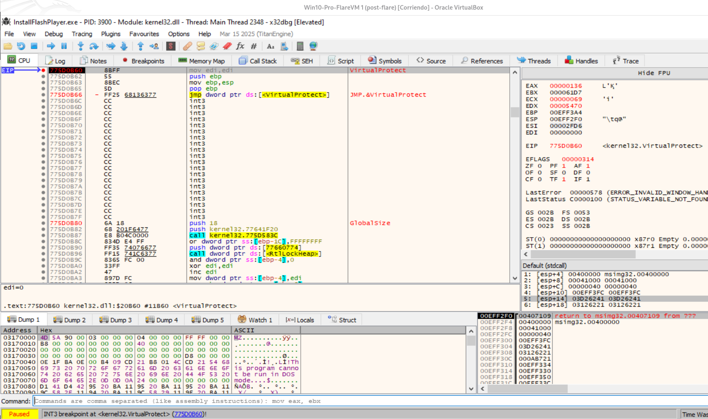

**Figura 9.** La región privada `0x03170000` contiene una cabecera PE reconocible.

En esta captura, el breakpoint activo de `VirtualProtect` corresponde ya a otra modificación, sobre la base original `0x00400000`; sin embargo, el panel Dump conserva la vista de `0x03170000` y demuestra que la imagen ya fue depositada allí.

La presencia de `MZ` no basta, por sí sola, para afirmar que el PE sea íntegro. Deben verificarse también:

- `e_lfanew` en `base + 0x3C`;
- firma `PE\0\0`;
- `SizeOfImage`;
- tabla de secciones;
- coherencia de `AddressOfEntryPoint`.

En este caso, OllyDumpEx pudo reconocer la región como un PE32 x86 DLL, lo que aporta evidencia adicional de integridad estructural.

---

# 5. Extracción en bruto con el comando `savedata` de x32dbg

## 5.1. Cuándo realizar el volcado

El volcado debe hacerse cuando:

1. `VirtualAlloc` ya haya devuelto una base válida.
2. Se haya completado el cambio de protección necesario.
3. La región contenga la cabecera `MZ`.
4. Preferiblemente, la copia o reconstrucción de secciones haya terminado.
5. El proceso esté pausado.

En esta ejecución:

```text
Base = 0x03170000
Size = 0x41000
```

En una ejecución previa, la base fue `0x02890000`. Esto demuestra que **la base no debe codificarse de forma fija**: se obtiene de `EAX` tras `VirtualAlloc` o del argumento real de `VirtualProtect`.

## 5.2. Sintaxis oficial

El comando es:

```text
savedata <archivo>,<dirección>,<tamaño>
```

### Volcado automático en el directorio de x32dbg

```text
savedata :memdump:,03170000,41000
```

La palabra especial `:memdump:` hace que x32dbg genere un nombre similar a:

```text
memdump_<PID>_03170000_00041000.bin
```

### Volcado con nombre y ruta explícitos

```text
savedata "C:\Users\usuario\Desktop\payload_03170000.bin",03170000,41000
```

Para la ejecución previa, si la base era `0x02890000` y el tamaño confirmado seguía siendo `0x41000`, el comando equivalente sería:

```text
savedata "C:\Users\usuario\Desktop\payload_02890000.bin",02890000,41000
```

No debe reutilizarse `0x41000` por simple suposición: debe confirmarse en la llamada de asignación o en el mapa de memoria.

## 5.3. Resultado esperado

El tamaño decimal de `0x41000` es:

```text
0x41000 = 266240 bytes = 260 KiB
```

Este valor coincide con el tamaño observado en el dump reconstruido.

Después del volcado:

1. calcular MD5 y SHA-256;
2. conservar el archivo bruto sin modificar;
3. trabajar sobre una copia;
4. abrirlo como PE o binario bruto según la estructura;
5. anotar la base de carga usada en el momento de la extracción.

## 5.4. Diferencia entre volcado bruto y PE reconstruido

`savedata` copia exactamente los bytes del rango de memoria:

```text
03170000 -> 031B0FFF
```

No reconstruye necesariamente:

- `PointerToRawData`;
- alineación de archivo;
- tabla de importaciones;
- relocations;
- entry point;
- directorios PE.

Por ello, el `.bin` es la mejor evidencia forense del contenido en memoria, pero puede ser menos cómodo para el análisis estático.

---

# 6. Reconstrucción complementaria con OllyDumpEx

Además del volcado bruto, se utilizó OllyDumpEx para reconstruir una DLL analizable como PE.

## 6.1. Seleccionar la región correcta

En OllyDumpEx:

```text
Base: Address
Address: 03170000
```

Después:

```text
ReScan Image
```

La detección correcta mostró:

```text
Image Base: 03170000
Image Size: 00041000
Entry Point: 0000A3B6
Tipo: PE32 x86 DLL
```

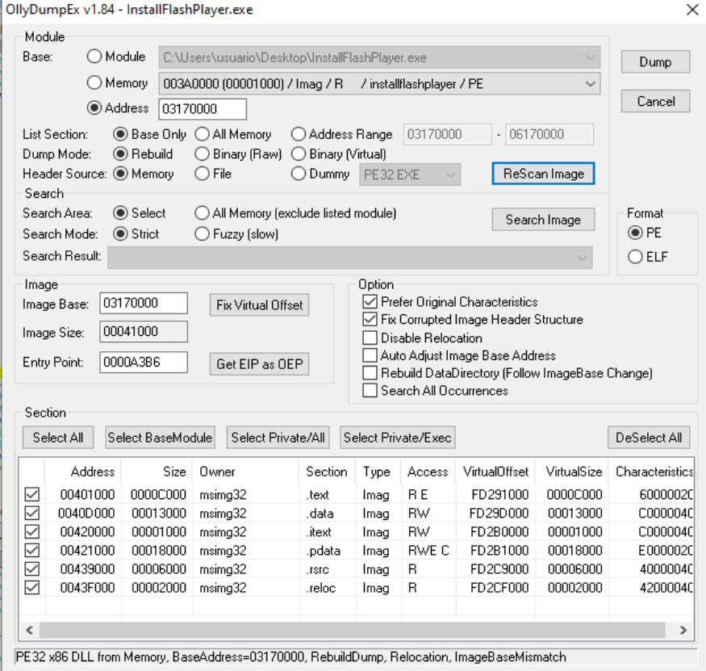

**Figura 10.** OllyDumpEx reconoce la región privada como una DLL PE32.

Configuración empleada como punto de partida:

```text
Dump Mode: Rebuild
Header Source: Memory
Format: PE

Prefer Original Characteristics: activado
Fix Corrupted Image Header Structure: activado
```

Se debe evitar seleccionar por error `InstallFlashPlayer.exe` o la imagen original de `msimg32.dll`. El campo principal debe mostrar `0x03170000`.

Marcar las opciones:
```
✓ Prefer Original Characteristics
✓ Fix Corrupted Image Header Structure
✓ Auto Adjust Image Base Address
✓ Rebuild DataDirectory
```

## 6.2. Precauciones con la reconstrucción

El dump de OllyDumpEx no es una copia byte a byte. El plugin puede:

- reconstruir cabeceras;
- modificar alineaciones;
- ajustar offsets;
- corregir características;
- conservar o modificar la base preferida;
- cambiar el tamaño físico del archivo.

Por eso:

- el hash puede diferir;
- el tamaño puede aumentar;
- el PE puede ser más fácil de abrir en Ghidra;
- el dump bruto debe conservarse como referencia.

Se recomienda verificar tras el dump:

```text
AddressOfEntryPoint RVA = 0xA3B6
SizeOfImage             = 0x41000
Número de secciones     = 6
```

Algunas herramientas muestran el **VA calculado del punto de entrada**, no el RVA almacenado. Deben distinguirse ambos conceptos.

---

# 7. Validación y comparación de los artefactos

## 7.1. Hash y tamaño

Se compararon:

```text
msimg32.dll original
msimg32_memory_dump.dll
```

Resultados observados:

```text
Original:
  Tamaño = 252928 bytes
  MD5    = E05130BC2F0C1B280514C99AABD36E34

Dump:
  Tamaño = 266240 bytes
  MD5    = 76BECA851658256B77D22BE7BE4A7EB1
```

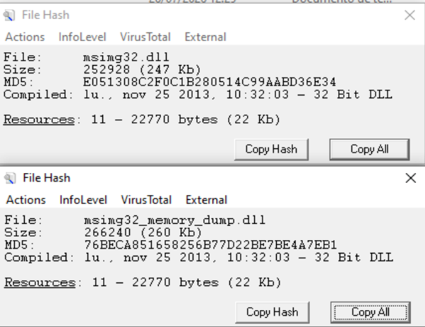

**Figura 11.** Los hashes y tamaños físicos son distintos.

Esto no prueba que el código lógico sea distinto. El cambio es esperable tras reconstruir un PE desde memoria.

## 7.2. Comparación con Detect It Easy

### DLL original

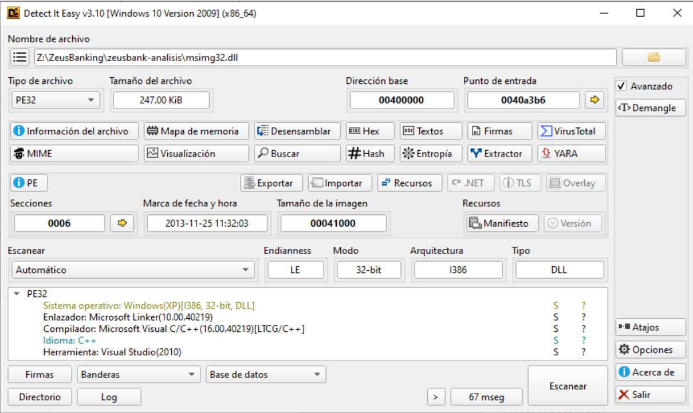

**Figura 12.** Propiedades de la DLL original.

### Dump reconstruido

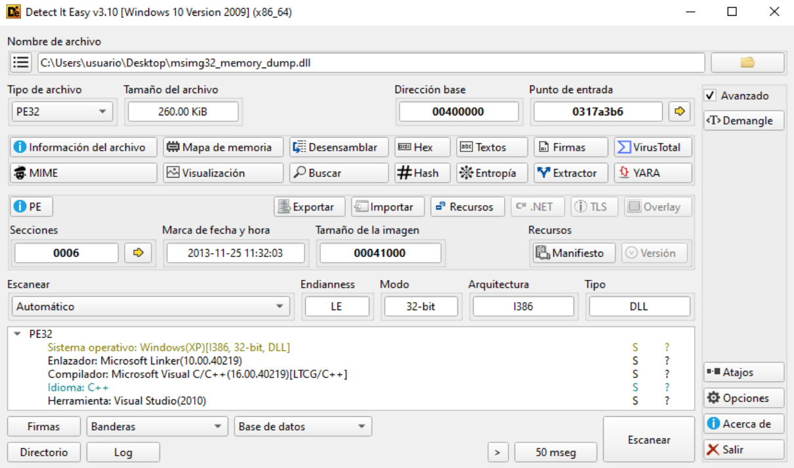

**Figura 13.** Propiedades del dump reconstruido.

Coincidencias relevantes:

```text
Tipo                  = PE32
Arquitectura          = i386
Tipo de imagen        = DLL
Fecha de compilación  = 2013-11-25
Número de secciones   = 6
SizeOfImage           = 0x41000
Compilador/enlazador  = Visual Studio 2010
```

Estas coincidencias son coherentes con una copia o reconstrucción de la misma imagen.

## 7.3. Comparación del código en Ghidra

Se analizaron dos artefactos:

1. un volcado bruto obtenido con el comando de x32dbg;
2. un PE reconstruido con OllyDumpEx.

### Volcado bruto

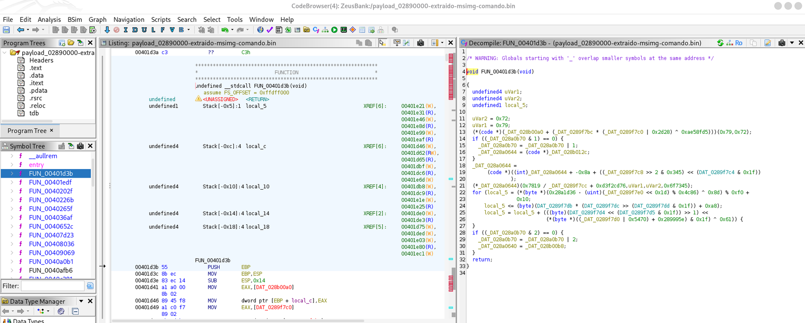

**Figura 14.** Función y referencias globales en el volcado bruto.

### Dump reconstruido

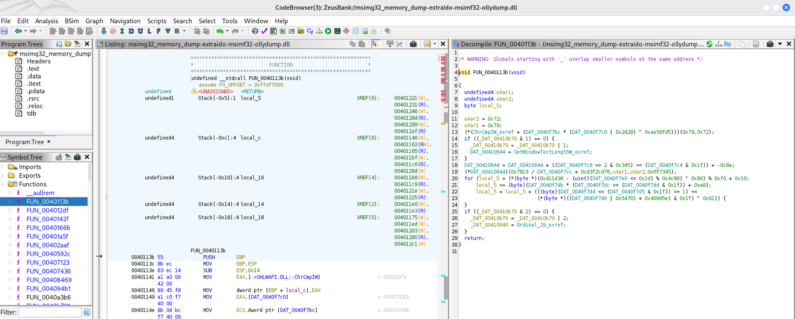

**Figura 15.** Estructura equivalente en el dump reconstruido.

La función comparada mantiene:

```asm
push ebp
mov  ebp,esp
sub  esp,14
```

y un pseudocódigo con la misma estructura lógica:

- asignación de constantes `0x72` y `0x79`;
- comprobaciones de flags;
- llamada indirecta;
- bucle con operaciones sobre bytes;
- actualización de variables globales.

Lo que cambia son las direcciones absolutas de datos.

Ejemplo:

```text
Volcado en memoria: DAT_0289F7BC
PE reconstruido:    DAT_0040F7BC
```

La diferencia es constante:

```text
0x0289F7BC - 0x0040F7BC = 0x02490000
```

Otros ejemplos siguen el mismo patrón:

```text
0x028A0B70 - 0x00410B70 = 0x02490000
0x028A0644 - 0x00410644 = 0x02490000
0x028B012C - 0x0042012C = 0x02490000
```

Una diferencia constante en las referencias es la señal esperada cuando el mismo código se analiza con bases distintas.

---

# 8. Conclusión técnica

## 8.1. Hechos demostrados dinámicamente

La ejecución observada permite afirmar:

1. `InstallFlashPlayer.exe` carga `msimg32.dll`.
2. El entry point de la DLL se ejecuta con `DLL_PROCESS_ATTACH`.
3. Código de `msimg32.dll` llama a `VirtualAlloc`.
4. La dirección de retorno es `0x00407109`, dentro de la DLL.
5. Se solicitan `0x41000` bytes.
6. `0x41000` coincide con `SizeOfImage` de `msimg32.dll`.
7. La reserva devuelve `0x03170000`.
8. La región se cambia a `PAGE_EXECUTE_READWRITE`.
9. En la región aparece una imagen con firma `MZ`.
10. OllyDumpEx reconoce el contenido como una DLL PE32 de tamaño `0x41000`.
11. El dump conserva seis secciones, el timestamp y el RVA de entry point de la DLL.
12. El código comparado en Ghidra mantiene la misma estructura lógica.
13. Las diferencias de referencias absolutas pueden explicarse mediante un desplazamiento de base constante.

## 8.2. Hipótesis mejor sustentada

La evidencia es compatible con el siguiente modelo:

```text
InstallFlashPlayer.exe
        |
        v
Carga local de msimg32.dll
        |
        v
DllMain / EntryPoint en 0x0040A3B6
        |
        v
VirtualAlloc(NULL, 0x41000, 0x3000, PAGE_READONLY)
        |
        v
Nueva base: 0x03170000
        |
        v
VirtualProtect(0x03170000, 0x41000, PAGE_EXECUTE_READWRITE)
        |
        v
Copia o mapeo manual de una imagen PE
        |
        v
Imagen con la misma estructura lógica que msimg32.dll
```

Por tanto, el denominado “payload” podría no ser un binario de segunda etapa diferente, sino:

- una copia de la propia `msimg32.dll`;
- una imagen manualmente mapeada;
- una versión reubicada;
- una copia sobre la que se aplican relocations o parches antes de transferir el control.

## 8.3. Qué no queda demostrado todavía

El análisis descrito no demuestra por sí solo:

- que la copia se ejecute;
- que toda la imagen sea byte a byte idéntica;
- que no se apliquen parches en memoria;
- que no exista una etapa posterior;
- que la copia sea el payload final.

Para cerrar estas cuestiones deben añadirse:

```text
bpmrange 03170000,41000,x
bp 0317A3B6
```

El objetivo es capturar:

- la primera ejecución dentro del rango privado;
- la instrucción `CALL`, `JMP` o `RET` que transfiere el control;
- posibles nuevas llamadas a `VirtualAlloc` desde la copia;
- una posible tercera región con otro payload.

## 8.4. Criterio de demostración de copia

Para demostrar con mayor rigor que es la misma DLL:

1. comparar por RVA, no por VA;
2. comparar las secciones `.text`, `.data`, `.itext` y `.pdata`;
3. normalizar relocations;
4. ignorar campos reconstruidos por OllyDumpEx;
5. comparar el grafo de llamadas;
6. comparar hashes de secciones normalizadas;
7. registrar cualquier byte modificado en memoria.

---

# 9. Lista de reproducción rápida

## Fase de carga

```text
bpdll msimg32.dll,l
F9
```

Confirmar base y ruta.

## Entry point

```text
bp 0040A3B6
F9
```

## APIs de memoria

```text
bp kernel32.VirtualAlloc
bp kernel32.VirtualProtect
bp ntdll.NtAllocateVirtualMemory
bp ntdll.NtProtectVirtualMemory
```

Condición aproximada usada en el laboratorio:

```text
[esp]>=00400000 && [esp]<00441000
```

## Al detenerse en `VirtualAlloc`

Leer:

```text
[ESP+4]
[ESP+8]
[ESP+C]
[ESP+10]
[ESP]
```

Después:

```text
Ctrl+F9
```

Guardar `EAX`.

## Vigilar escritura

```text
bpmrange eax,41000,w
F9
```

## Volcar la región

```text
savedata :memdump:,03170000,41000
```

o:

```text
savedata "C:\Users\usuario\Desktop\payload_03170000.bin",03170000,41000
```

## Vigilar ejecución posterior

```text
bpmc 03170000
bpmrange 03170000,41000,x
bp 0317A3B6
F9
```

---

# 10. Tabla de evidencias

| Evidencia | Valor observado | Interpretación |
|---|---:|---|
| Base original de la DLL | `0x00400000` | Imagen cargada por el loader |
| Entry point original | `0x0040A3B6` | RVA `0xA3B6` |
| Tamaño de imagen | `0x41000` | Tamaño PE de la DLL |
| Retorno de `VirtualAlloc` | `0x00407109` | Llamada desde `msimg32.dll` |
| Tamaño de `VirtualAlloc` | `0x41000` | Coincide con `SizeOfImage` |
| Tipo de asignación | `0x3000` | `MEM_RESERVE | MEM_COMMIT` |
| Protección inicial | `0x02` | `PAGE_READONLY` |
| Base nueva | `0x03170000` | Región privada |
| Protección posterior | `0x40` | `PAGE_EXECUTE_READWRITE` |
| Firma en la nueva región | `4D 5A` | Cabecera `MZ` |
| Tipo detectado | PE32 x86 DLL | Imagen PE estructurada |
| Secciones | 6 | Coinciden con la DLL |
| RVA del entry point | `0xA3B6` | Coincide con la DLL |
| Diferencias Ghidra | Delta constante | Compatible con reubicación |

---

# 11. Referencias técnicas

- [x64dbg: LibrarianSetBreakpoint / bpdll](https://help.x64dbg.com/en/latest/commands/breakpoint-control/LibrarianSetBreakpoint.html)
- [x64dbg: SetBPX / bp](https://help.x64dbg.com/en/latest/commands/breakpoint-control/SetBPX.html)
- [x64dbg: SetMemoryRangeBPX / bpmrange](https://help.x64dbg.com/en/latest/commands/breakpoint-control/SetMemoryRangeBPX.html)
- [x64dbg: DeleteMemoryBPX / bpmc](https://help.x64dbg.com/en/latest/commands/breakpoint-control/DeleteMemoryBPX.html)
- [x64dbg: savedata](https://help.x64dbg.com/en/latest/commands/memory-operations/savedata.html)
- [Microsoft Learn: VirtualAlloc](https://learn.microsoft.com/en-us/windows/win32/api/memoryapi/nf-memoryapi-virtualalloc)
- [Microsoft Learn: VirtualProtect](https://learn.microsoft.com/en-us/windows/win32/api/memoryapi/nf-memoryapi-virtualprotect)
- [Microsoft Learn: Memory Protection Constants](https://learn.microsoft.com/en-us/windows/win32/memory/memory-protection-constants)
- [Microsoft Learn: MEMORY_BASIC_INFORMATION](https://learn.microsoft.com/en-us/windows/win32/api/winnt/ns-winnt-memory_basic_information)

---

## Nota final

Las direcciones de este documento corresponden a una ejecución concreta. En una nueva sesión:

- la base de `InstallFlashPlayer.exe` puede cambiar;
- la base de `msimg32.dll` puede cambiar;
- la región devuelta por `VirtualAlloc` puede cambiar;
- el comando `savedata` debe adaptarse a los valores reales observados.

El procedimiento reproducible no depende de memorizar `0x03170000`, sino de seguir esta cadena:

```text
carga de DLL
-> entry point
-> llamada a VirtualAlloc
-> EAX
-> VirtualProtect
-> verificación MZ
-> savedata(base,tamaño)
```
