# Análisis dinámico de `InstallFlashPlayer.exe` y `msimg32.dll`

## Carga lateral de DLL, desempaquetado en memoria, extracción del PE y actividad de red

> **Contexto:** análisis realizado en una máquina virtual FLARE-VM aislada, con x32dbg y Wireshark.  
> **Objetivo:** documentar exclusivamente la cadena formada por el ejecutable camuflado como instalador de Flash, la DLL `msimg32.dll`, el desempaquetado observado, la imagen PE extraída de memoria y la comunicación de red asociada.

---

## 1. Resumen ejecutivo

El comportamiento observado no corresponde a un instalador de Flash convencional. La ejecución se organiza como una cadena por etapas:

1. El binario inicial deja o prepara un ejecutable llamado `InstallFlashPlayer.exe` y una DLL llamada `msimg32.dll`.
2. `InstallFlashPlayer.exe` carga `msimg32.dll` en su espacio de direcciones.
3. La DLL ejecuta su punto de entrada con `DLL_PROCESS_ATTACH`.
4. El código de la DLL modifica permisos de memoria, reserva regiones privadas y ejecuta rutinas ofuscadas.
5. Esas rutinas construyen manualmente una o varias imágenes PE en memoria.
6. Una de las imágenes reconstruidas permanece en `0x02890000`, con tamaño `0x41000`, y contiene cabeceras `MZ` y `PE\0\0` coherentes.
7. La imagen puede extraerse manualmente con `savedata`.
8. El proceso carga Winsock y crea sockets.
9. En una ejecución anterior del binario original se observaron datagramas UDP hacia `85.114.128.127:53`. Wireshark los interpreta como DNS por el puerto utilizado, pero el contenido no es un mensaje DNS válido.
10. Paralelamente aparece la interfaz de un instalador de Flash y tráfico HTTP legítimo de Adobe, que debe separarse del canal UDP malicioso.

La evidencia es compatible con una **DLL proxy o side-loading**, seguida por un **loader/desempaquetador en memoria** y una **segunda etapa con capacidad de red**.

---

## 2. Muestra y datos conocidos

Muestra principal analizada:

```text
Nombre: invoice_2318362983713_823931342io.pdf.exe
SHA-256: 69e966e730557fde8fd84317cdef1ece00a8bb3470c0b58f3231e170168af169
MD5: EA039A854D20D7734C5ADD48F1A51C34
```

Artefactos relevantes:

```text
InstallFlashPlayer.exe
msimg32.dll
GoogleUpdate.exe
```

Este documento parte de una comprobación previa de la sesión: `InstallFlashPlayer.exe` actúa como ejecutable de la siguiente fase y se ejecuta junto a una `msimg32.dll` controlada por la muestra.

> Las direcciones virtuales que aparecen a continuación pertenecen a una ejecución concreta. Pueden cambiar en otra sesión por ASLR, asignaciones del heap y orden de carga.

---

## 3. Cadena global de ejecución

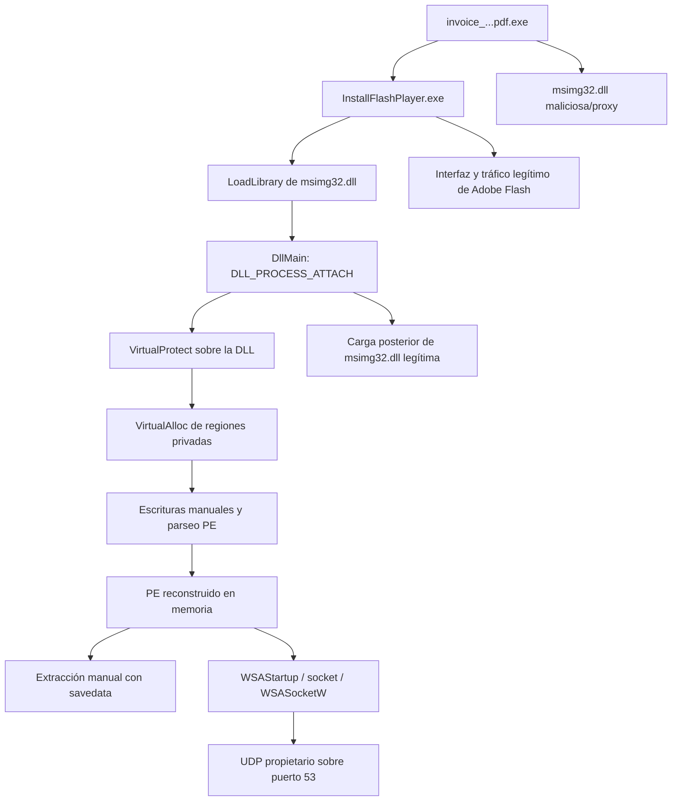

La cadena mezcla tres componentes que deben distinguirse:

- **Cargador/host:** `InstallFlashPlayer.exe`.
- **Componente malicioso:** `msimg32.dll` situada junto al ejecutable.
- **Componente legítimo:** la `msimg32.dll` real de Windows, cargada posteriormente para conservar funcionalidad gráfica.

---

# 4. Entrada en `msimg32.dll`

## 4.1 Punto de entrada y `DLL_PROCESS_ATTACH`

La DLL se cargó en:

```text
Base: 0x02740000
Entry Point: 0x0274A3B6
RVA: 0xA3B6
```

En el punto de entrada, la pila mostraba:

```text
[ESP+4]  = 0x02740000    hinstDLL
[ESP+8]  = 0x00000001    DLL_PROCESS_ATTACH
[ESP+C]  = 0x00000000    lpReserved
```

Esto confirma que el cargador de Windows estaba invocando la inicialización de la DLL al asociarla al proceso.

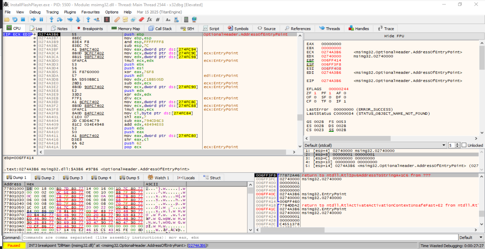

*Figura 1. Breakpoint en `msimg32.dll+0xA3B6`. El segundo argumento vale `1`, correspondiente a `DLL_PROCESS_ATTACH`.*

El código inicial contiene un prólogo reconocible, pero rápidamente entra en operaciones aritméticas, referencias globales y flujo poco natural:

```asm
push ebp
mov  ebp, esp
and  esp, FFFFFFF8
sub  esp, 7C
imul
xor
div
shl
shr
```

Este patrón es coherente con un **stub ofuscado**, inicialización de un protector o lógica anti-análisis. No es la estructura sencilla que se esperaría de una DLL gráfica legítima.

---

# 5. Preparación de memoria y automodificación

## 5.1 Cambio de permisos de la propia DLL

Se interceptó una llamada a:

```c
VirtualProtect(
    lpAddress      = 0x02740000,
    dwSize         = 0x00041000,
    flNewProtect   = 0x00000040,
    lpflOldProtect = ...
);
```

`0x40` corresponde a:

```text
PAGE_EXECUTE_READWRITE
```

Por tanto, la DLL convirtió prácticamente toda su imagen en memoria ejecutable, legible y escribible.

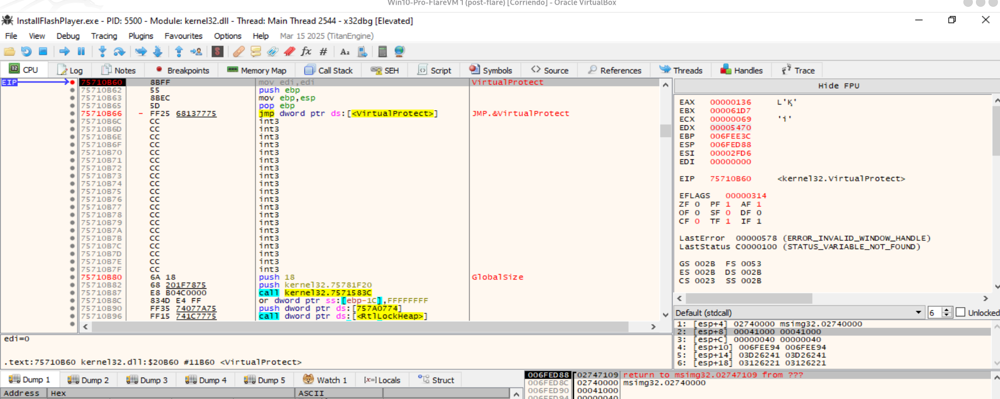

*Figura 2. `VirtualProtect` aplicado sobre la base `0x02740000`, tamaño `0x41000`, con protección `PAGE_EXECUTE_READWRITE`.*

Este comportamiento permite que el código:

- se descifre a sí mismo;
- modifique instrucciones;
- reconstruya funciones;
- aplique parches;
- utilice una misma región como datos y código.

La llamada no demuestra por sí sola cuál de esas operaciones se realiza, pero las escrituras y las imágenes PE reconstruidas observadas después confirman que el cambio de permisos forma parte del loader.

---

## 5.2 Primera región privada: `0x02890000`

Después de una llamada a `VirtualAlloc`, el registro `EAX` devolvió:

```text
EAX = 0x02890000
```

La reserva asociada tenía tamaño aproximado:

```text
0x41000 bytes
```

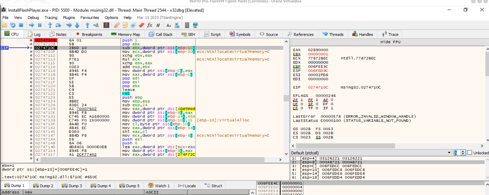

*Figura 3. Regreso al código de `msimg32.dll` con `EAX=0x02890000`, dirección de una región privada recién reservada.*

Esta región termina siendo especialmente importante porque conserva una imagen PE completa que puede extraerse.

---

## 5.3 Segunda región privada: `0x028F0000`

Más adelante, código ejecutado desde una región dinámica en `0x028Cxxxx` solicitó otra reserva:

```text
Tamaño: 0x1D000
Tipo: MEM_COMMIT | MEM_RESERVE
Protección inicial: PAGE_READWRITE
Base devuelta: 0x028F0000
```

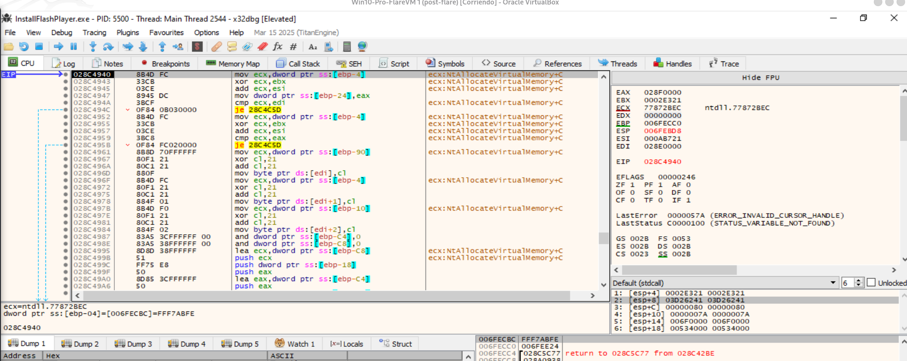

*Figura 4. Retorno de `VirtualAlloc` con `EAX=0x028F0000`. El llamador ya está en código dinámico de la etapa de desempaquetado.*

La existencia de dos regiones es relevante:

| Región | Tamaño | Papel observado |
|---|---:|---|
| `0x02890000` | `0x41000` | Imagen PE privada que permanece íntegra y se extrae manualmente |
| `0x028F0000` | `0x1D000` | Buffer adicional donde también se observa construcción de una cabecera PE |

La evidencia indica varias fases de transformación. Sin comparar los dumps completos no debe asumirse que ambas regiones contienen exactamente el mismo binario.

---

# 6. Escritura y reconstrucción manual del PE

## 6.1 Escrituras byte a byte

Los breakpoints en `memcpy`, `memmove`, `RtlMoveMemory` y `WriteProcessMemory` no explicaban la copia porque el loader no dependía de esas APIs. Un breakpoint de memoria reveló escrituras directas:

```asm
mov byte ptr [edi], cl
mov byte ptr [edi+1], cl
mov byte ptr [edi+2], cl
```

Con:

```text
EDI = 0x028E0000
CL  = 0x03
```

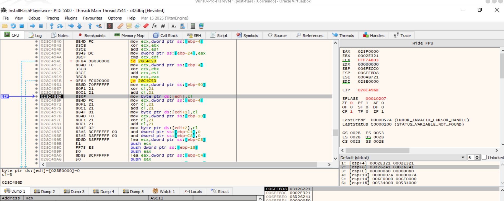

*Figura 5. El loader escribe directamente en la región vigilada. Esta técnica evita que breakpoints en funciones estándar de copia detecten la operación.*

La secuencia incluía transformaciones sobre cada byte:

```asm
xor cl, 21
add cl, 21
mov [edi], cl
```

Esto es compatible con una rutina propia de decodificación, descompresión o generación de estructuras.

---

## 6.2 Aparición de la cabecera `MZ` en `0x028F0000`

Al avanzar sobre la rutina de escritura, el buffer comenzó a mostrar:

```text
4D 5A 90 00
```

Los dos primeros bytes:

```text
4D 5A = "MZ"
```

identifican una cabecera DOS válida.

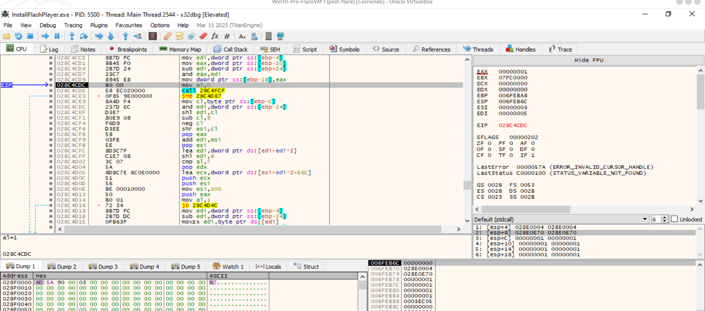

*Figura 6. Construcción de la cabecera `MZ` en la región `0x028F0000`.*

Este hallazgo demuestra que el buffer no contiene datos arbitrarios: el código está generando una imagen ejecutable PE.

---

## 6.3 Regiones visibles en Memory Map

El mapa de memoria mostró simultáneamente:

```text
0x02890000  tamaño 0x41000
0x028F0000  tamaño 0x1D000
```

Ambas aparecen como memoria privada de usuario, no como módulos `MEM_IMAGE` registrados por el loader.

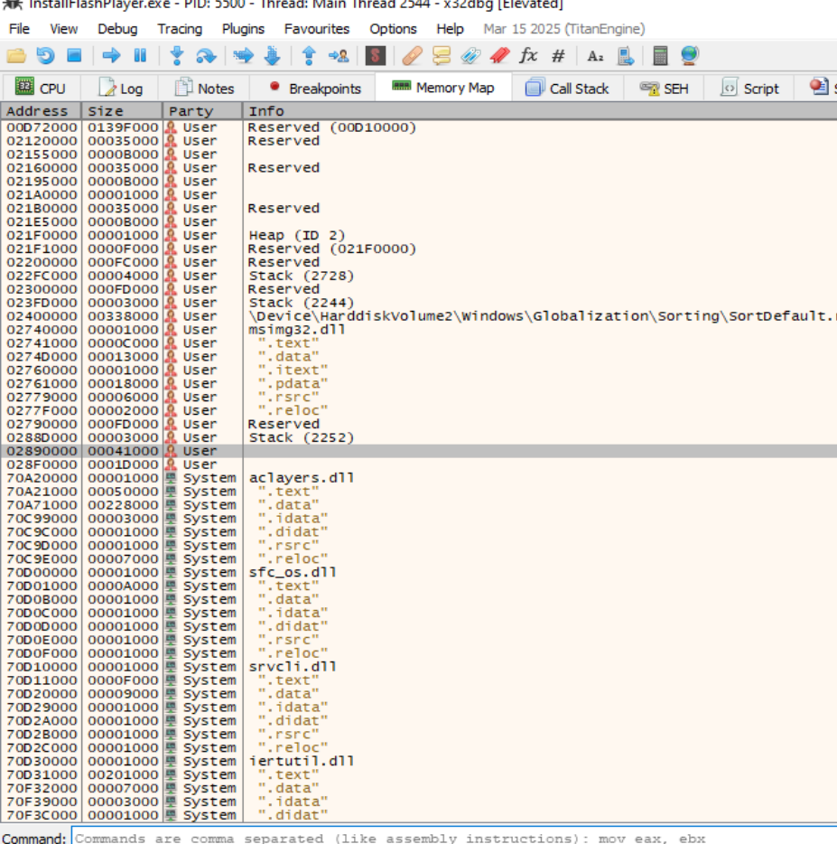

*Figura 7. Regiones privadas empleadas por el desempaquetador. `0x02890000` y `0x028F0000` no aparecen como módulos cargados normalmente.*

Esto explica por qué herramientas que enumeran solo módulos PE registrados pueden no detectar automáticamente el payload.

---

# 7. Verificación de la imagen extraíble en `0x02890000`

## 7.1 Cabecera DOS

La región `0x02890000` comienza por:

```text
4D 5A 90 00
```

También contiene el texto DOS clásico:

```text
This program cannot be run in DOS mode.
```

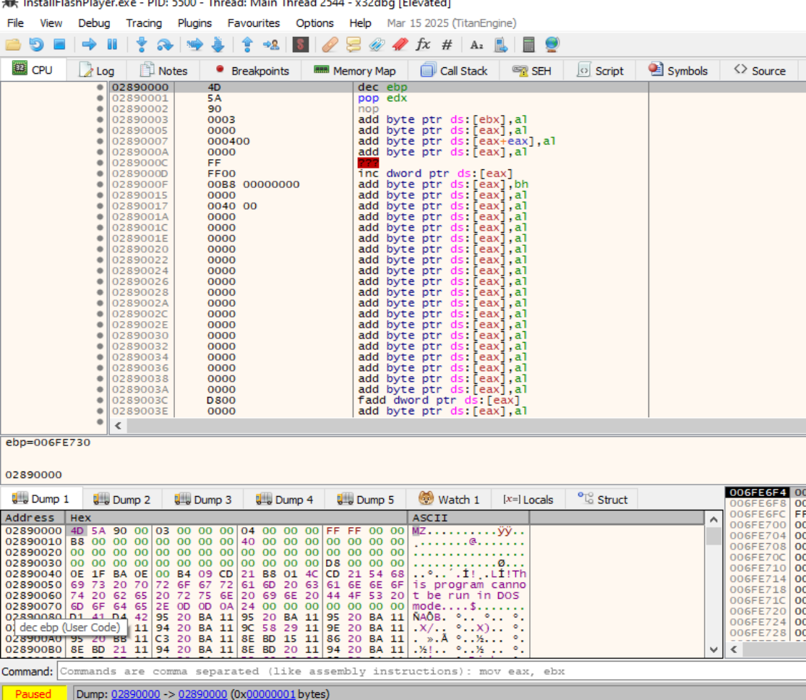

*Figura 8. Inicio de la imagen privada: firma `MZ` y stub DOS.*

---

## 7.2 `e_lfanew` y firma PE

En el offset `0x3C` de la cabecera DOS aparece:

```text
D8 00 00 00
```

Interpretado en little-endian:

```text
e_lfanew = 0xD8
```

Por tanto:

```text
0x02890000 + 0xD8 = 0x028900D8
```

En esa dirección aparece:

```text
50 45 00 00 = "PE\0\0"
```

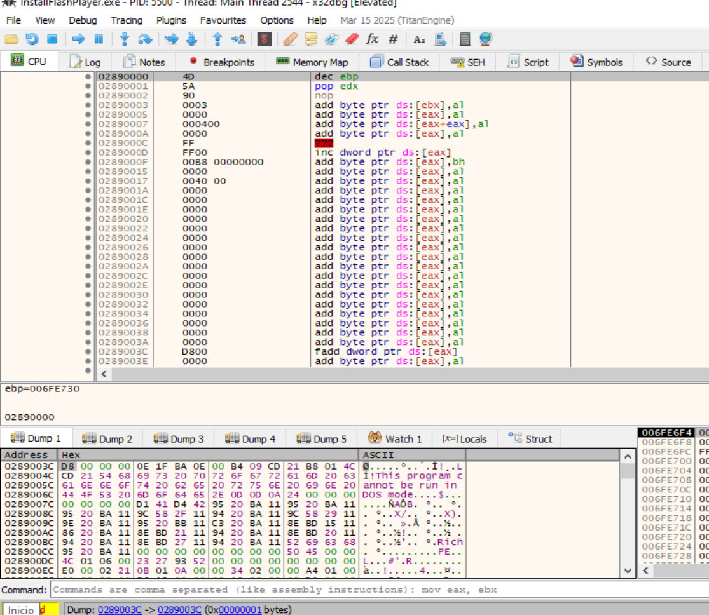

*Figura 9. La firma `PE\0\0` aparece en `0x028900D8`, coherente con el valor `e_lfanew=0xD8`.*

La presencia conjunta de:

- `MZ`;
- stub DOS;
- `e_lfanew`;
- `PE\0\0`;

confirma que la región contiene una imagen PE estructuralmente coherente.

---

# 8. Extracción manual del ejecutable reconstruido

## 8.1 Por qué OllyDumpEx no seleccionó el payload

OllyDumpEx seleccionó inicialmente el módulo normal del proceso:

```text
Base: 0x002D0000
Image Size: 0x18000
```

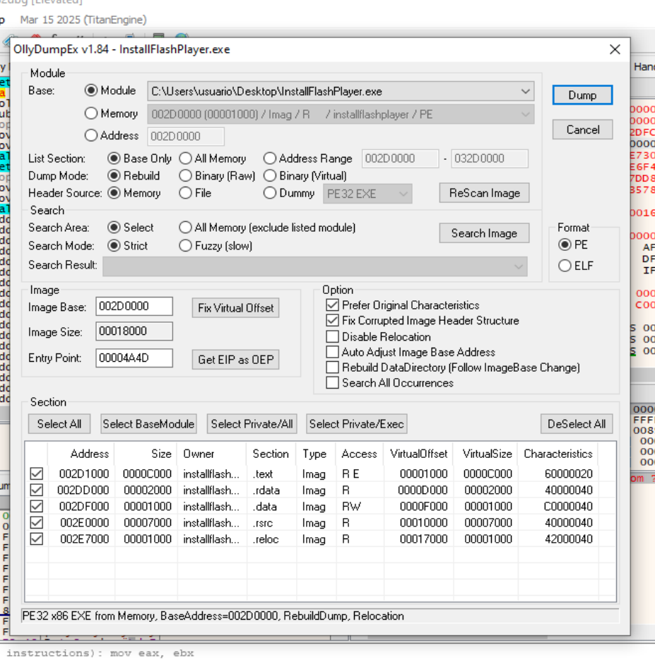

*Figura 10. OllyDumpEx detecta el módulo registrado del ejecutable, no la imagen privada reconstruida en `0x02890000`.*

La imagen desempaquetada está en una región `MEM_PRIVATE`, por lo que no siempre aparece como módulo PE en la lista automática.

---

## 8.2 Comando de extracción

Con el proceso pausado, se puede guardar la región completa desde la barra de comandos de x32dbg:

```text
savedata "C:\Users\usuario\Desktop\payload_02890000.bin", 02890000, 41000
```

Parámetros:

```text
Ruta de salida: C:\Users\usuario\Desktop\payload_02890000.bin
Base:           0x02890000
Tamaño:         0x41000
```

Verificaciones mínimas posteriores:

```text
Offset 0x0000: 4D 5A
Offset 0x003C: D8 00 00 00
Offset 0x00D8: 50 45 00 00
```

### Limitaciones del dump bruto

`savedata` conserva la representación virtual de memoria. El archivo puede requerir:

- reparación de `PointerToRawData`;
- reconstrucción de IAT;
- comprobación de relocaciones;
- ajuste de secciones;
- identificación del OEP real.

El dump ya es útil para análisis estático en Ghidra, IDA, PE-bear o Detect It Easy, aunque no sea ejecutable sin reparación.

---

# 9. Carga de la `msimg32.dll` legítima

Posteriormente apareció otra `msimg32.dll` en una base alta:

```text
Base: 0x70CF0000
Símbolo: DllInitialize
```

El código referencia funciones gráficas esperables:

```text
GdiTransparentBlt
GdiGradientFill
GdiAlphaBlend
DisableThreadLibraryCalls
```

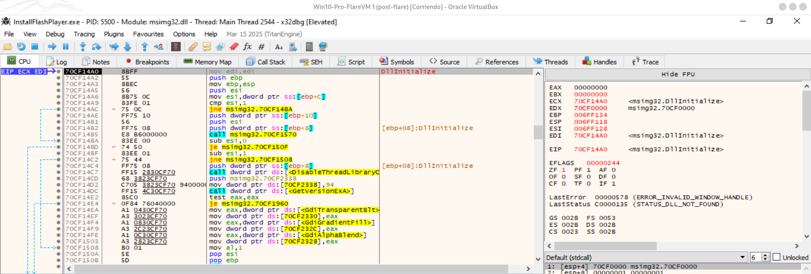

*Figura 11. Inicialización de la `msimg32.dll` legítima de Windows.*

Esto es coherente con una DLL proxy:

1. la DLL controlada por la muestra ejecuta la lógica maliciosa;
2. carga la DLL real del sistema;
3. conserva las funciones gráficas que espera el ejecutable anfitrión.

La carga de la DLL legítima no invalida el comportamiento malicioso de la primera; forma parte del mecanismo para evitar que la aplicación falle.

---

# 10. Inicialización de red

## 10.1 `WSAStartup`

Se interceptó la inicialización de Winsock en un hilo secundario:

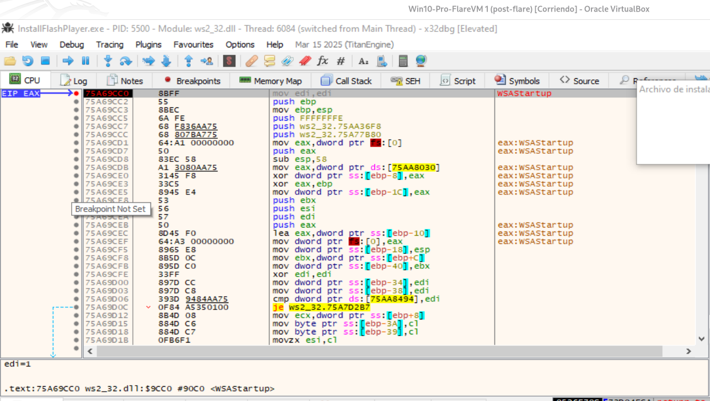

*Figura 12. Un hilo secundario entra en `ws2_32!WSAStartup`.*

Esto demuestra intención de utilizar la pila de red, pero no demuestra por sí solo que se haya enviado un paquete.

---

## 10.2 Creación del socket

La ejecución alcanzó:

```text
ws2_32!socket
```

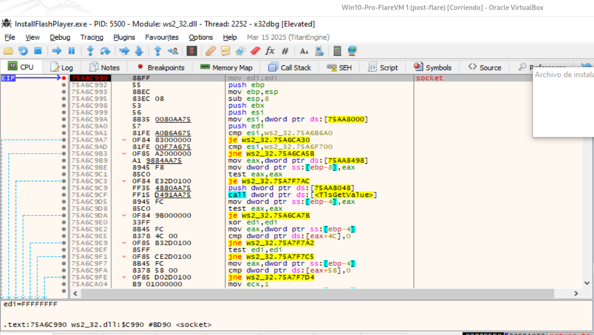

*Figura 13. Creación de un socket desde un hilo de la segunda etapa.*

Después se observó la implementación basada en:

```text
ws2_32!WSASocketW
```

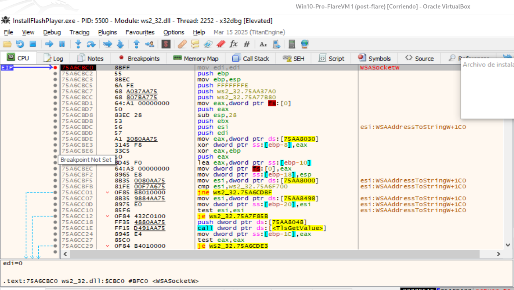

*Figura 14. Entrada en `WSASocketW`, API que crea el socket Winsock.*

La secuencia observada en distintas ejecuciones incluyó:

```text
WSAStartup
socket / WSASocketW
setsockopt
bind
WSASendTo
WSARecvFrom
WSAGetLastError
closesocket
```

También se obtuvo:

```text
WSAGetLastError = 0x3E5
```

equivalente a:

```text
WSA_IO_PENDING
```

Esto es coherente con operaciones asíncronas de recepción.

---
