# Análisis dinámico de la faceta de conexión de la muestra ZeusBank

## Reconstrucción de la secuencia DNS, geolocalización, tráfico UDP/53 no estándar, reintentos y terminación controlada

**Muestra analizada:** `invoice_2318362983713_823931342io.pdf.exe`  
**SHA-256:** `69e966e730557fde8fd84317cdef1ece00a8bb3470c0b58f3231e170168af169`  
**MD5:** `EA039A854D20D7734C5ADD48F1A51C34`  
**Arquitectura:** PE de 32 bits  
**Entorno:** Windows 10 FLARE VM, x32dbg y Wireshark, con una máquina REMnux prevista como infraestructura de simulación  
**Ámbito de este documento:** exclusivamente la lógica de conexión descubierta durante el análisis dinámico.

---

## 1. Objetivo y problema de análisis

La faceta de red de esta muestra resulta difícil de seguir porque varias actividades distintas aparecen superpuestas y, a primera vista, parecen formar una única descarga. En realidad, la ejecución observada contiene al menos tres flujos diferentes:

1. Una rutina de red de la muestra original que construye manualmente una consulta para `j.maxmind.com` y utiliza sockets Winsock con entrada/salida asíncrona.
2. Una fase posterior que prepara en memoria una solicitud HTTP a `/app/geoip.js`, también asociada a `j.maxmind.com`, pero cuya transmisión HTTP no llegó a observarse en la captura.
3. Un tráfico UDP dirigido a `85.114.128.127:53`, cuyo contenido no es DNS válido aunque Wireshark lo clasifique inicialmente como DNS por emplear el puerto 53.
4. En paralelo, un proceso señuelo denominado `InstallFlashPlayer.exe` que intenta descargar un componente de Flash desde `fpdownload.macromedia.com`. Este flujo pertenece al instalador señuelo y no debe confundirse con la comunicación propia de la muestra principal.

La hipótesis central que se intenta evaluar es la siguiente:

> La muestra abandona su ejecución porque no recibe una respuesta de red válida —o el contenido esperado— desde la infraestructura que debería ser emulada por REMnux.

La evidencia reunida apoya esta hipótesis de forma importante, aunque todavía no demuestra que la causa sea exactamente «la falta de un fichero». Lo confirmado es que la muestra envía o intenta iniciar varias operaciones de red, no obtiene la respuesta esperada, recrea sockets, cierra operaciones pendientes y finalmente ejecuta `ExitProcess(0)`.

---

## 2. Por qué esta secuencia es especialmente compleja

El análisis fue difícil por cinco motivos técnicos que deben tenerse presentes antes de interpretar las capturas.

### 2.1. Uso de E/S solapada y varios hilos

La muestra utiliza operaciones Winsock asíncronas. Una llamada puede quedar pendiente mientras otro hilo recibe la notificación, cancela la operación o cierra el socket. Por ello, el hilo que crea o usa el socket no siempre es el mismo que lo cierra.

En la traza se observó, por ejemplo, que `closesocket(0x188)` era ejecutado desde un hilo secundario, mientras la creación de nuevos sockets volvía a producirse en el hilo principal.

### 2.2. Los handles de socket cambian en cada iteración

Los valores `0x188`, `0x19C`, `0x1D8` y `0x620` no son identificadores permanentes de funciones o servidores. Son handles asignados dinámicamente por Windows. Cada nuevo `WSASocketW` puede devolver un valor diferente.

Por ello, una condición como:

```text
arg.get(0) == 0x188
```

solo es válida mientras se esté siguiendo ese socket concreto. Tras un nuevo `WSASocketW`, la condición debe actualizarse con el nuevo handle.

### 2.3. El puerto 53 provoca una clasificación engañosa

Wireshark intenta decodificar como DNS cualquier datagrama UDP cuyo puerto sea 53. Sin embargo, el hecho de usar ese puerto no garantiza que el payload sea DNS.

En esta ejecución, los paquetes hacia `85.114.128.127:53` se muestran como:

```text
Unknown operation (11) [Malformed Packet]
```

El mensaje no demuestra que el paquete se haya corrompido durante la transmisión. Demuestra que los bytes no se ajustan a la estructura de un mensaje DNS válido.

### 2.4. La muestra construye parte del tráfico manualmente

La consulta para `j.maxmind.com` se construye como un bloque binario y se envía directamente a una dirección almacenada en una estructura `sockaddr`. Esto puede evitar el resolvedor normal de Windows.

Por esa razón, una entrada en el fichero `hosts` como:

```text
10.0.0.3    j.maxmind.com
```

no necesariamente modifica este flujo. El fichero `hosts` solo interviene cuando el programa utiliza las funciones de resolución del sistema. Si la muestra ya ha construido el datagrama DNS y ha fijado el destino `8.8.8.8:53`, la petición no consulta el fichero `hosts`.

### 2.5. Existen dos procesos con actividad de red

La muestra principal lanza un supuesto instalador de Adobe Flash. Este segundo proceso genera una solicitud HTTP legítimamente formada y muestra un cuadro de error de descarga. Si no se separan los procesos, es fácil atribuir esa petición HTTP a la muestra principal.

---

## 3. Mapa conceptual de los flujos observados

```text
MUESTRA PRINCIPAL
│
├─ UDP asíncrono
│  ├─ construye consulta DNS para j.maxmind.com
│  ├─ destino observado en memoria: 8.8.8.8:53
│  ├─ WSARecvFrom queda pendiente: WSA_IO_PENDING (997)
│  ├─ reintentos y recreación de sockets
│  └─ tráfico posterior a 85.114.128.127:53
│     ├─ payload de 20 bytes
│     ├─ no es DNS válido
│     └─ recibe ICMP Port Unreachable
│
├─ Preparación de HTTP de geolocalización
│  ├─ GET /app/geoip.js HTTP/1.0
│  ├─ Host: j.maxmind.com
│  ├─ crea sockets TCP
│  └─ no se observó conexión HTTP efectiva de este flujo
│
└─ termina mediante ExitProcess(0)

PROCESO SEÑUELO InstallFlashPlayer.exe
│
├─ GET a fpdownload.macromedia.com
├─ intenta descargar un componente de Flash
└─ muestra un mensaje de error y queda esperando «Reintentar»
```

Este mapa es esencial: la terminación de la muestra original y el mensaje visible del instalador ocurren de forma próxima, pero no pertenecen necesariamente a la misma función ni al mismo proceso.

---

## 4. Primera fase: operación asíncrona y `WSA_IO_PENDING`

La traza se detuvo en `ws2_32.WSAGetLastError` después de una llamada asíncrona a `WSARecvFrom`. En el panel de estado aparecía:

```text
LastError = 000003E5
```

`0x3E5` equivale a 997 decimal y corresponde a `WSA_IO_PENDING` o `ERROR_IO_PENDING`.

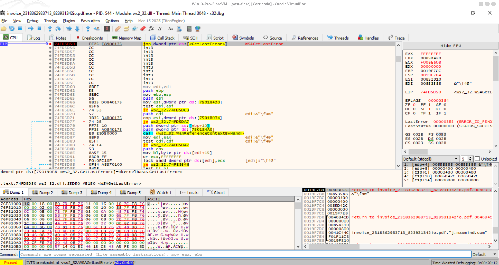

**Figura 1.** Entrada en `WSAGetLastError`. La captura muestra el error `0x3E5` y, en la pila, referencias asociadas a la rutina que trabaja con `j.maxmind.com`.

El valor `WSA_IO_PENDING` no significa por sí mismo que la conexión haya fallado. En una operación solapada significa que la recepción ha sido aceptada, pero se completará más adelante mediante el mecanismo asíncrono configurado por el programa.

Tras ejecutar `GetLastError`, el control regresó a la muestra con:

```text
EIP = 00403FC5
EAX = 000003E5
```

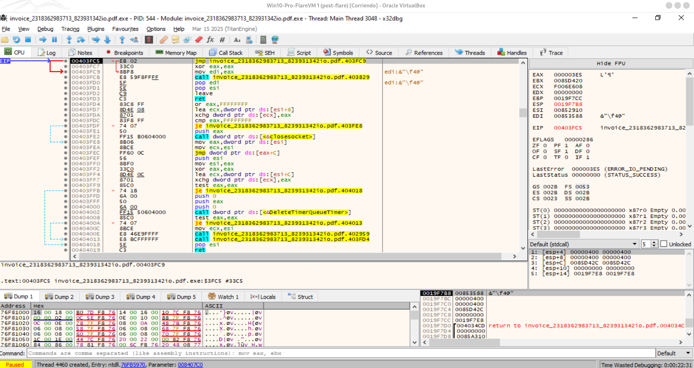

**Figura 2.** Retorno al código de la muestra. El valor `0x3E5` es tratado por el programa y posteriormente se elimina de `EAX` mediante `xor eax,eax`, lo que indica que el estado pendiente forma parte de una ruta esperada.

La secuencia inmediata observada fue aproximadamente:

```asm
00403FC5  jmp 00403FC9
00403FC9  xor eax,eax
00403FCB  mov edi,eax
```

La muestra no interpreta el estado pendiente como una excepción fatal. Continúa con su lógica de espera, temporización y cierre.

---

## 5. Envío a `8.8.8.8:53` y consulta construida manualmente

En la entrada de `WSASendTo`, la pila permitió reconstruir los parámetros relevantes:

```text
[ESP+04] = socket
[ESP+08] = puntero a WSABUF
[ESP+0C] = número de buffers
[ESP+18] = puntero a sockaddr destino
[ESP+1C] = longitud de sockaddr
```

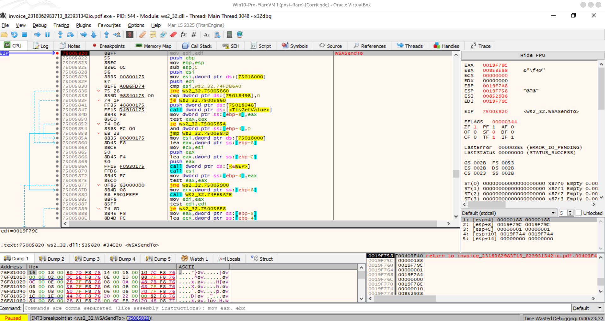

**Figura 3.** Entrada en `WSASendTo`. En esta iteración el socket era `0x188`; el `WSABUF` estaba en `0x0019F79C` y la estructura `sockaddr` en `0x0019F78C`.

La estructura de destino contenía:

```text
02 00          AF_INET
00 35          puerto 53 en orden de red
08 08 08 08    8.8.8.8
```

El `WSABUF` contenía una longitud de 31 bytes. El buffer previamente examinado tenía la siguiente consulta:

```text
33 33 01 00 00 01 00 00 00 00 00 00
01 6A
07 6D 61 78 6D 69 6E 64
03 63 6F 6D
00
00 01
00 01
```

Su decodificación es:

```text
Transaction ID : 0x3333
Flags          : 0x0100 (consulta estándar con recursion desired)
QDCOUNT        : 1
QNAME          : j.maxmind.com
QTYPE          : A
QCLASS         : IN
```

Al regresar de `WSASendTo`, la muestra presentaba:

```text
EIP = 00403F40
EAX = 00000000
LastError = 00000000
```

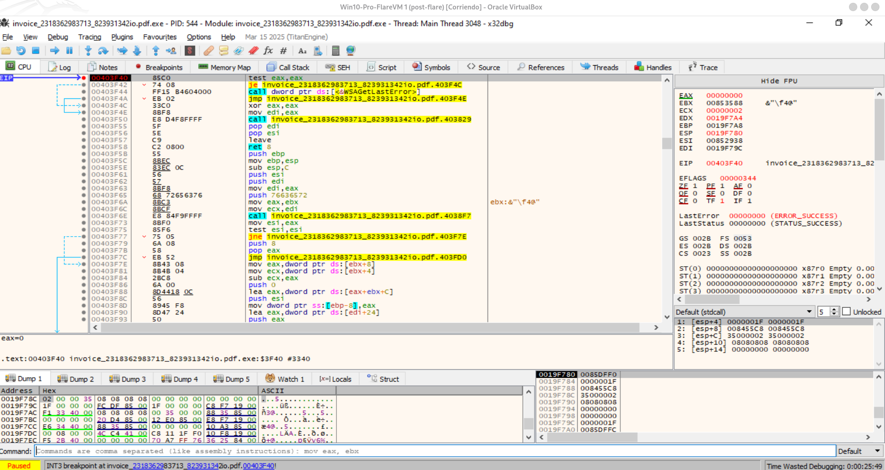

**Figura 4.** Retorno de `WSASendTo`. El `sockaddr` visible en el dump confirma `8.8.8.8:53` y el `WSABUF` tiene 31 bytes.

### 5.1. Qué demuestra exactamente `EAX = 0`

El retorno cero indica que Winsock aceptó y completó la operación de envío sin informar de un error inmediato. No demuestra que:

- el servidor remoto recibiera el paquete;
- se obtuviera una respuesta DNS;
- la captura de Wireshark contenga necesariamente el paquete;
- la lógica posterior del malware considerara la fase satisfactoria.

La ausencia posterior de una respuesta útil y la aparición de reintentos indican que la operación no produjo el resultado lógico esperado por la muestra.

### 5.2. Por qué el fichero `hosts` no resuelve este caso

La muestra no está pidiendo al sistema operativo que resuelva `j.maxmind.com` mediante `getaddrinfo`. Está enviando directamente un datagrama ya construido a `8.8.8.8:53`.

Para redirigir esta operación a REMnux no basta con editar:

```text
C:\Windows\System32\drivers\etc\hosts
```

Sería necesario uno de estos mecanismos:

- modificar el `sockaddr` antes de `WSASendTo` para sustituir `08 08 08 08` por la IP de REMnux;
- realizar una redirección NAT/DNAT de `8.8.8.8:53` hacia REMnux;
- interceptar la llamada en una capa de red controlada;
- situar un servicio DNS simulado en el destino efectivo que recibe el datagrama.

---

## 6. Reintentos, cierre asíncrono y recreación de sockets UDP

Después de que la recepción quedara pendiente, un hilo secundario llegó a `closesocket` con:

```text
arg.get(0) == 0x188
[ESP+04]   == 0x188
```

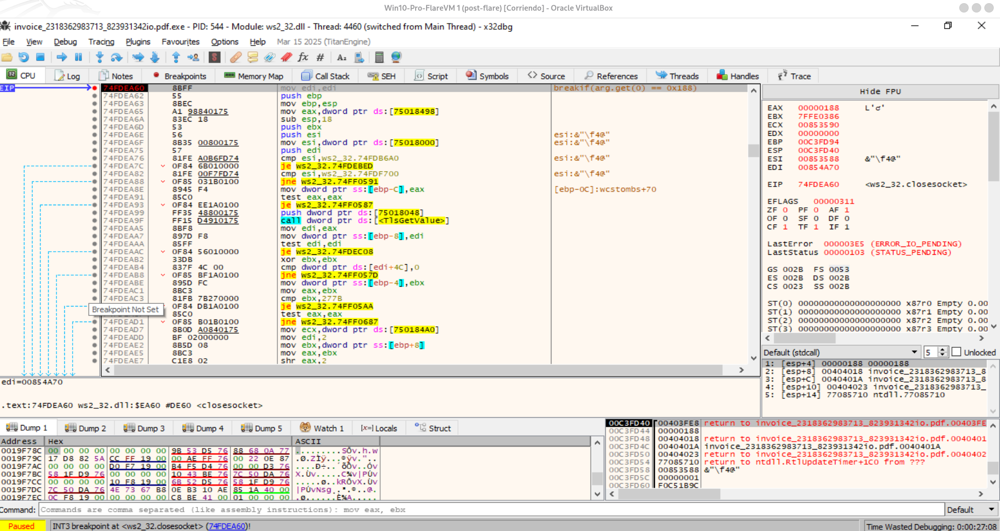

**Figura 5.** El socket `0x188` es cerrado por el hilo 4460. Esto demuestra que la rutina de red utiliza varios hilos y que el cierre no ocurre necesariamente en el hilo que inició el envío.

El cierre no debe interpretarse como evidencia automática de detección de máquina virtual, anti-debugging o sabotaje del análisis. En el contexto observado encaja mucho mejor con una rutina normal de:

1. envío;
2. espera asíncrona;
3. timeout o respuesta no válida;
4. cancelación/cierre;
5. creación de un nuevo socket;
6. reintento.

Tras el cierre apareció un nuevo `WSASocketW` con:

```text
AF_INET     = 2
SOCK_DGRAM  = 2
IPPROTO_UDP = 17
```

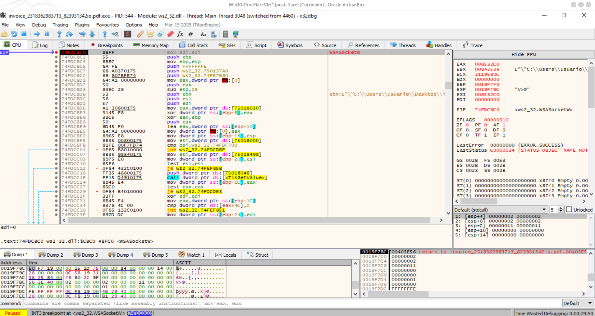

**Figura 6.** Nuevo socket UDP en el hilo principal después del cierre anterior. La secuencia confirma un mecanismo de reintento, no una única conexión persistente.

Durante la ejecución se observaron varios handles, entre ellos:

```text
0x188
0x19C
0x1D0
```

Los valores concretos dependen de la ejecución. Lo relevante es el patrón de recreación y cierre.

---

## 7. Preparación en memoria de la solicitud de geolocalización

En la rutina alcanzada al regresar de uno de los cierres se observó una cadena HTTP completa:

```http
GET /app/geoip.js HTTP/1.0
Host: j.maxmind.com
...
```

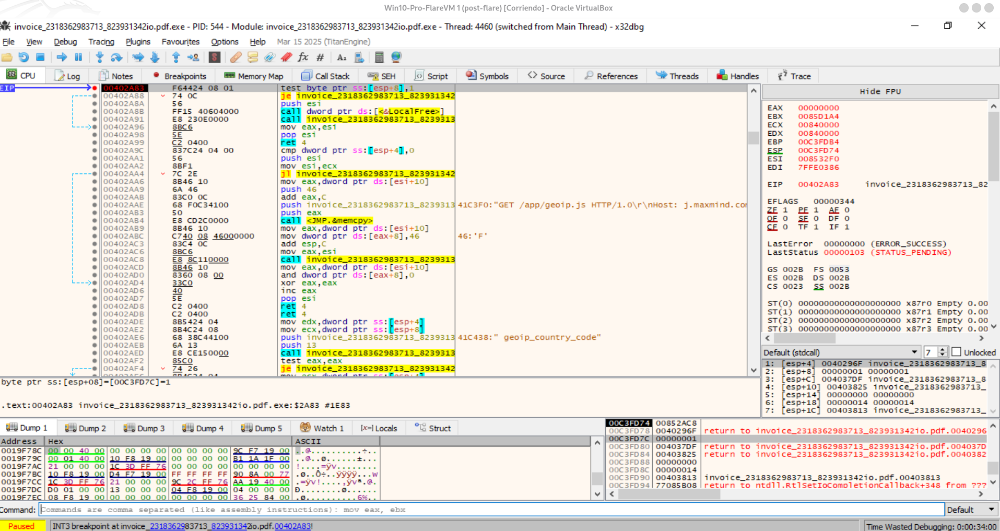

**Figura 7.** En el comentario del desensamblado aparece la cadena `GET /app/geoip.js HTTP/1.0` y el host `j.maxmind.com`.

Esta evidencia permite afirmar que la muestra contiene una fase de geolocalización o clasificación geográfica. Sin embargo, es importante distinguir tres niveles de evidencia:

### Nivel 1: intención de comunicación — confirmado

La cadena existe y es utilizada por una rutina activa durante la ejecución.

### Nivel 2: preparación de la solicitud — confirmado

El programa copia o ensambla el contenido HTTP y crea sockets TCP posteriormente.

### Nivel 3: transmisión HTTP efectiva — no observada

No se encontró en Wireshark un paquete que contuviera `maxmind`, ni una solicitud HTTP con host `j.maxmind.com`. Tampoco se interceptó una llamada estándar `connect`/`send` correspondiente a esa solicitud en la traza analizada.

Por tanto, no debe redactarse que la muestra «descargó `geoip.js`». La formulación correcta es:

> La muestra preparó una solicitud para `/app/geoip.js`, pero no se observó que llegara a establecer la conexión HTTP ni a transmitirla durante esta ejecución.

---

## 8. Creación de sockets TCP y abandono de la fase HTTP

Después de preparar la cadena de geolocalización, la muestra llamó a `WSASocketW` con:

```text
AF_INET      = 2
SOCK_STREAM  = 1
IPPROTO_TCP  = 6
```

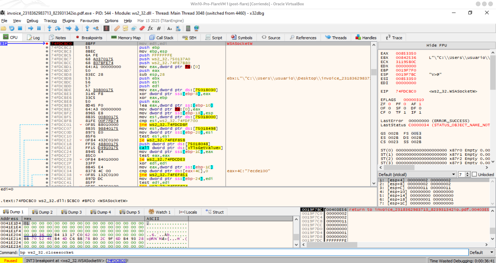

**Figura 8.** Entrada en `WSASocketW` para crear un socket TCP, coherente con la intención de realizar una solicitud HTTP.

El retorno produjo un handle TCP válido:

```text
EAX = 000001D8
```

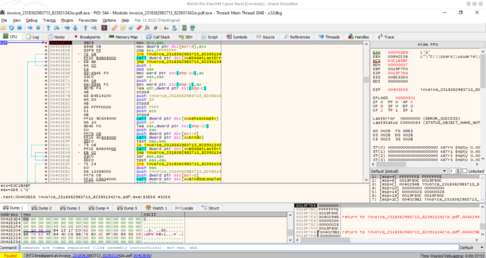

**Figura 9.** `WSASocketW` devuelve `0x1D8`, por lo que la creación del socket TCP fue correcta.

Sin embargo, el mismo socket terminó siendo cerrado:

```text
closesocket(0x1D8)
```

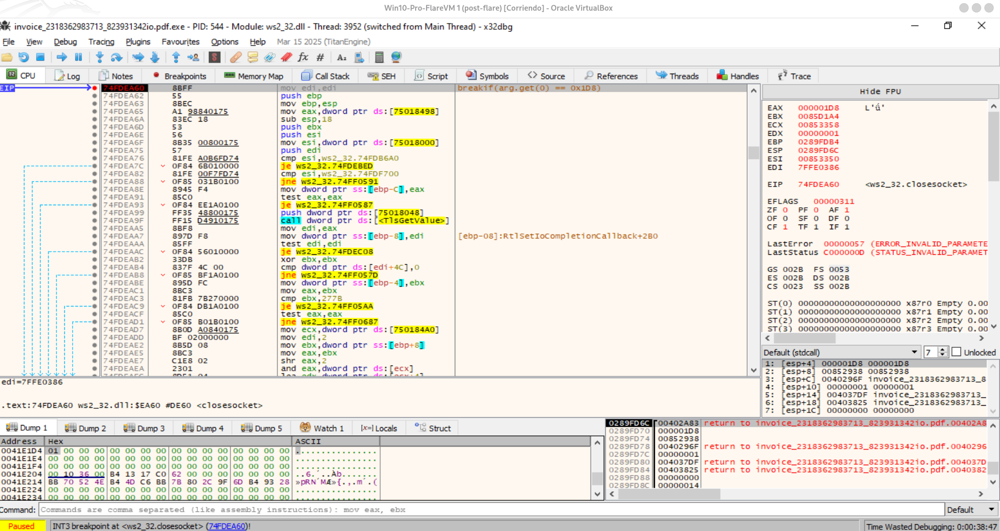

**Figura 10.** El socket TCP `0x1D8` se cierra desde otro hilo. No se había observado previamente una solicitud HTTP de MaxMind en Wireshark.

Más tarde apareció otro socket TCP, con handle `0x620`, lo que refuerza el patrón de reintento. Aun así, no se observó el flujo TCP esperado hacia MaxMind.

### 8.1. Interpretación más probable

La muestra parece crear el recurso TCP, pero una condición previa no se satisface. Entre las causas plausibles se encuentran:

- no se obtuvo una respuesta válida de la fase DNS o UDP anterior;
- no se pudo determinar una dirección útil para `j.maxmind.com`;
- la rutina esperaba un evento o contenido asíncrono que nunca llegó;
- el protocolo personalizado hacia `85.114.128.127:53` debía devolver un valor necesario para continuar;
- una condición de temporización agotó los reintentos.

No se puede afirmar únicamente con estas capturas cuál de esas condiciones exactas gobierna la transición, pero la relación temporal es clara: fallo o ausencia de respuesta, recreación de sockets, cierres y salida.

---

## 9. Terminación de la muestra principal

La ejecución llegó a:

```text
kernel32.ExitProcess
[ESP+04] = 00000000
```

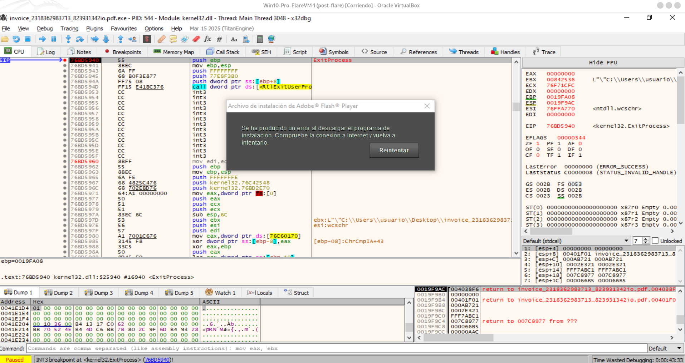

**Figura 11.** La muestra principal intenta finalizar mediante `ExitProcess(0)`.

Este dato es importante por tres razones:

1. No se observó una excepción no controlada como causa de la salida.
2. El código cero sugiere una ruta de terminación deliberada y controlada.
3. La finalización ocurre después de varios intentos de red y cierres de sockets.

La secuencia observada es compatible con una lógica del tipo:

```text
si no se obtiene la respuesta requerida después de N intentos:
    limpiar recursos
    cerrar sockets
    finalizar proceso con código 0
```

Esto no prueba por sí solo que la muestra requiera «un fichero» concreto, pero sí respalda que la ausencia de una respuesta de red válida forma parte de la condición de salida.

---

## 10. Flujo separado: descarga del instalador señuelo de Flash

Mientras la muestra principal estaba cerca de finalizar, el cuadro «Archivo de instalación de Adobe Flash Player» mostraba un error de descarga. Wireshark registró una petición:

```http
GET /get/flashplayer/update/current/install/install_all_win_cab_64_ax_sgn.z HTTP/1.1
Host: fpdownload.macromedia.com
```

con destino `104.83.12.116`.

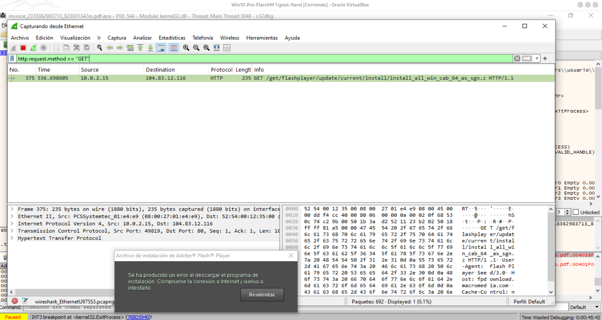

**Figura 12.** Única solicitud HTTP GET visible con el filtro `http.request.method == "GET"`. Pertenece al instalador de Flash, no a la cadena `GET /app/geoip.js` preparada por la muestra principal.

### 10.1. Por qué no debe mezclarse con la comunicación de la muestra

Previamente se había observado que la muestra original ejecutaba `InstallFlashPlayer.exe` mediante `ShellExecuteExW` con el verbo `runas`. El instalador es, por tanto, un proceso separado.

El cuadro de error demuestra que ese proceso no completó su descarga. No demuestra directamente que la muestra principal terminara porque falló esa descarga.

La evidencia que permite separarlos es:

- el diálogo del instalador permanecía abierto;
- la muestra principal llegó de forma independiente a `ExitProcess(0)`;
- la solicitud observada usa `fpdownload.macromedia.com`, mientras la muestra principal trabaja con `j.maxmind.com` y `85.114.128.127`;
- el recurso solicitado por Flash es distinto de `/app/geoip.js`.

Por ello, deben documentarse como dos flujos paralelos:

```text
Flujo A: muestra principal → geolocalización / protocolo UDP / salida
Flujo B: InstallFlashPlayer.exe → descarga de Flash → cuadro de error
```

---

## 11. Búsqueda de `j.maxmind.com` en la captura

Se aplicaron dos filtros:

```wireshark
dns.qry.name contains "maxmind"
```

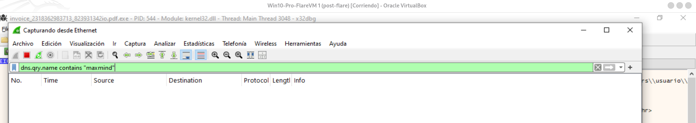

**Figura 13.** No aparecen consultas que Wireshark pueda decodificar como DNS válido y cuyo nombre contenga `maxmind`.

También se aplicó:

```wireshark
frame contains "maxmind"
```

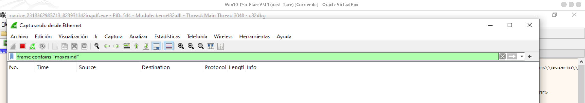

**Figura 14.** Ningún frame capturado contiene literalmente la cadena ASCII `maxmind`.

### 11.1. Qué puede concluirse y qué no

Estas búsquedas demuestran que no se capturó una solicitud DNS o HTTP en texto claro que contuviera ese dominio.

No demuestran que no existiera actividad de red de la muestra. De hecho, la captura contiene tráfico hacia `85.114.128.127:53`, pero su payload es binario y no incluye la cadena `maxmind`.

Esta distinción corrige una conclusión inicial demasiado amplia. El resultado correcto es:

> No se observó una transmisión en claro de `j.maxmind.com`, pero sí se observó otro canal UDP asociado temporalmente a la misma secuencia de reintentos.

---

## 12. Comunicación efectiva con `85.114.128.127:53`

El filtro:

```wireshark
ip.addr == 85.114.128.127
```

reveló varios pares de paquetes:

```text
10.0.2.15      → 85.114.128.127   UDP/53
85.114.128.127 → 10.0.2.15        ICMP Destination unreachable (Port unreachable)
```

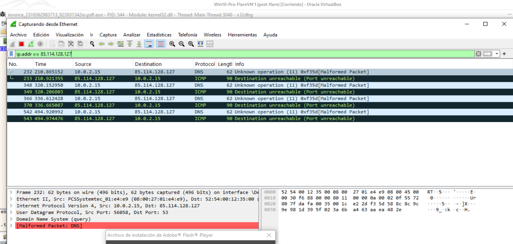

**Figura 15.** Se observan varios datagramas desde la VM hacia `85.114.128.127:53`, seguidos de mensajes ICMP de puerto inaccesible.

Los frames visibles corresponden a varios reintentos separados en el tiempo. Esto concuerda con la recreación de sockets observada en x32dbg.

### 12.1. Significado de `ICMP Destination Unreachable – Port Unreachable`

La respuesta indica que el datagrama salió de la VM y que la ruta de red devolvió la indicación de que no había un servicio UDP aceptando el tráfico en ese puerto.

En una red virtualizada con NAT, el mensaje puede haber sido generado por el host de destino o por un elemento intermedio que representa esa falta de servicio. La inferencia segura es:

> La muestra no recibió una respuesta de aplicación válida; recibió un error de puerto UDP inaccesible.

Este resultado es altamente relevante para la hipótesis del cierre del proceso. La rutina espera una interacción de aplicación, pero recibe una condición que imposibilita completar el intercambio.

---

## 13. El payload de 20 bytes no es DNS

En el frame seleccionado, Wireshark muestra:

```text
Source port      : 60419
Destination port : 53
UDP length       : 28 bytes
UDP payload      : 20 bytes
```

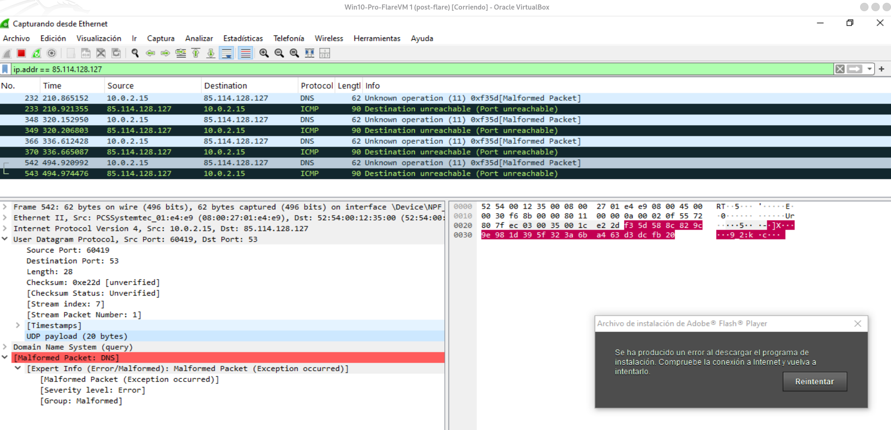

**Figura 16.** El payload tiene 20 bytes. Wireshark intenta decodificarlo como DNS y genera `Malformed Packet`.

Los 20 bytes son:

```text
F3 5D 58 8C 82 9C 9E 98 1D 39 5F 32 3A 6B A4 63 D3 DC FB 20
```

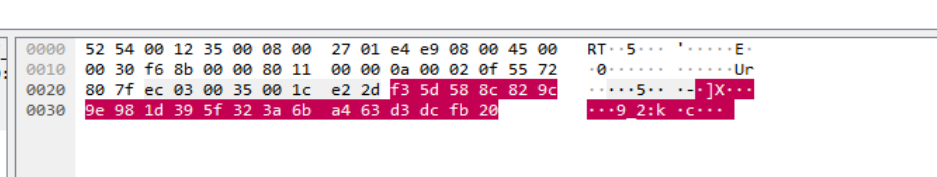

**Figura 17.** Extracto hexadecimal del datagrama.

### 13.1. Demostración estructural de que no es un DNS válido

Si se interpretan los primeros 12 bytes como una cabecera DNS, se obtendría:

```text
Transaction ID : F3 5D
Flags          : 58 8C
QDCOUNT        : 82 9C
ANCOUNT        : 9E 98
NSCOUNT        : 1D 39
ARCOUNT        : 5F 32
```

Los bits de `0x588C` producen un opcode 11, de ahí el texto de Wireshark:

```text
Unknown operation (11)
```

Además, los supuestos contadores serían:

```text
QDCOUNT = 0x829C = 33436 preguntas
ANCOUNT = 0x9E98 = 40600 respuestas
NSCOUNT = 0x1D39 = 7481 registros de autoridad
ARCOUNT = 0x5F32 = 24370 registros adicionales
```

Esos valores son incompatibles con un paquete total de 20 bytes. Por tanto, no se trata de una consulta DNS ligeramente defectuosa: la estructura no corresponde al protocolo DNS.

### 13.2. Interpretación prudente del payload

El bloque puede ser:

- una cabecera de protocolo propietario;
- un identificador de bot o de sesión;
- un nonce o reto;
- datos ofuscados o cifrados;
- un mensaje compacto con checksum;
- una combinación de varios campos binarios.

Con un único bloque de 20 bytes no es posible demostrar cifrado ni asignar cada campo. La conclusión técnicamente sólida es:

> La muestra utiliza UDP/53 para transportar un payload binario no compatible con DNS. El puerto parece actuar como canal de transporte, pero el formato exacto del protocolo aún no está identificado.

---

## 14. Reconstrucción cronológica consolidada

| Paso | Evidencia observada | Interpretación confirmada | Incertidumbre pendiente |
|---:|---|---|---|
| 1 | `WSASocketW(AF_INET, SOCK_DGRAM, IPPROTO_UDP)` | Se crea un socket UDP | Ninguna relevante |
| 2 | `WSASendTo` con destino `8.8.8.8:53` y buffer de 31 bytes | Se prepara una consulta DNS A para `j.maxmind.com` | El paquete no aparece identificado en la captura disponible |
| 3 | `WSARecvFrom` seguido de `WSAGetLastError = 0x3E5` | La recepción queda pendiente de forma asíncrona | Qué evento o timeout exacto la completa/cancela |
| 4 | `closesocket(0x188)` desde un hilo secundario | Se cierra la operación pendiente | Motivo interno exacto del cierre |
| 5 | Nuevos `WSASocketW` UDP | Existen reintentos | Número máximo y temporización exacta |
| 6 | Cadena `GET /app/geoip.js` / `Host: j.maxmind.com` | Se prepara una solicitud de geolocalización | No se observa su transmisión HTTP |
| 7 | `WSASocketW(AF_INET, SOCK_STREAM, IPPROTO_TCP)` | La muestra intenta preparar una fase TCP | API o condición exacta que impide continuar |
| 8 | Cierre de sockets TCP | La fase HTTP se abandona | Respuesta concreta que esperaba la muestra |
| 9 | UDP binario a `85.114.128.127:53` | Existe comunicación efectiva no DNS | Formato del protocolo propietario |
| 10 | ICMP Port Unreachable | No hay un servicio UDP que responda correctamente | Si el error lo genera destino o infraestructura NAT |
| 11 | Repetición de datagramas | La muestra reintenta | Política exacta de reintentos |
| 12 | `ExitProcess(0)` | Salida controlada tras el fallo de red | Condición booleana exacta que decide la salida |
| 13 | GET a `fpdownload.macromedia.com` | El instalador Flash realiza su propia descarga | Relación funcional del señuelo con la persistencia, fuera de este documento |

---

## 15. Evaluación de la hipótesis: ¿la falta de respuesta de REMnux provoca la salida?

### 15.1. Aspectos que apoyan la hipótesis

La hipótesis es plausible y está respaldada por la siguiente cadena:

1. La muestra inicia operaciones de red.
2. La recepción queda pendiente.
3. No se observa una respuesta válida.
4. Los sockets se cierran y recrean.
5. Los datagramas a `85.114.128.127:53` reciben `Port Unreachable`.
6. Los sockets TCP para la fase HTTP se crean, pero no se observa una conexión HTTP de MaxMind.
7. Tras varios intentos, la muestra ejecuta `ExitProcess(0)`.

El comportamiento es característico de una rutina que necesita una respuesta para superar una fase de inicialización o validación.

### 15.2. Corrección necesaria: no puede reducirse todavía a «REMnux no envía el fichero»

La formulación «solicita la descarga de un fichero y REMnux no se lo envía» mezcla tres operaciones:

- la solicitud preparada a `/app/geoip.js`;
- el protocolo UDP no DNS hacia `85.114.128.127:53`;
- la descarga real del instalador Flash desde `fpdownload.macromedia.com`.

La muestra principal no llegó a mostrar en Wireshark una solicitud HTTP efectiva de `/app/geoip.js`. Por ello, no se ha demostrado que REMnux recibiera esa solicitud y se negara o no pudiera servir el fichero.

Lo que sí se ha demostrado es que la infraestructura de simulación no estaba interceptando correctamente los destinos usados por la muestra:

```text
8.8.8.8:53
85.114.128.127:53
```

Los paquetes no se dirigían a `10.0.0.3`, que era la IP prevista para REMnux. Por tanto, REMnux no podía responder a menos que existiera una redirección explícita.

### 15.3. Formulación final recomendada

> La ejecución indica que la muestra depende de una o varias respuestas de red para continuar. La infraestructura REMnux no recibió directamente todos los flujos porque la muestra utilizó destinos explícitos (`8.8.8.8` y `85.114.128.127`). El tráfico UDP personalizado recibió `ICMP Port Unreachable`, la fase HTTP de `j.maxmind.com` no llegó a observarse en la red y el programa terminó de forma controlada después de varios reintentos. Por tanto, es probable que la falta de una respuesta emulada válida provoque la ruta de salida, aunque todavía no se ha demostrado que el elemento ausente sea específicamente un fichero descargable.

---

## 16. Experimento necesario para confirmar causalidad

Para convertir la hipótesis en una conclusión demostrada, la siguiente ejecución debe modificar una sola variable: proporcionar una infraestructura que responda a los destinos que realmente usa la muestra.

### 16.1. Experimento A: interceptar la consulta manual a `8.8.8.8:53`

El objetivo es lograr que el datagrama de 31 bytes llegue a REMnux.

Opciones:

```text
A. Modificar temporalmente el sockaddr en x32dbg:
   02 00 00 35 08 08 08 08
   ↓
   02 00 00 35 0A 00 00 03

B. Crear una redirección NAT/DNAT:
   8.8.8.8:53 → 10.0.0.3:53
```

REMnux debe devolver una respuesta DNS controlada para `j.maxmind.com`.

Indicadores de éxito:

- desaparece el timeout de la recepción;
- se reduce la recreación de sockets UDP;
- se alcanza `connect`, `ConnectEx`, `send` o `WSASend` con el socket TCP;
- aparece en Wireshark `GET /app/geoip.js`.

### 16.2. Experimento B: interceptar `85.114.128.127:53`

Debe redirigirse:

```text
85.114.128.127:53/UDP → 10.0.0.3:53/UDP
```

En una primera prueba basta con abrir un listener UDP para evitar `ICMP Port Unreachable` y registrar los datagramas. Esta prueba permite comprobar si la mera desaparición del error cambia la temporización o la ruta.

Una respuesta arbitraria no debe asumirse válida. Para emular el protocolo correctamente será necesario:

1. capturar varias muestras del payload;
2. buscar campos constantes y variables;
3. localizar en x32dbg la función que construye los 20 bytes;
4. localizar la rutina que valida la respuesta;
5. deducir longitud, checksum, cifrado u ofuscación;
6. construir una respuesta mínima aceptada.

### 16.3. Experimento C: servir `/app/geoip.js`

Una vez resuelta la dirección hacia REMnux, debe existir un servicio HTTP que registre:

```http
GET /app/geoip.js HTTP/1.0
Host: j.maxmind.com
```

No conviene inventar el cuerpo esperado sin analizar primero el parser de la muestra. El experimento inicial debe responder con una página controlada y observar:

- si la muestra llama a `recv`/`WSARecv`;
- cuántos bytes espera;
- qué cadenas busca;
- qué comparaciones realiza;
- si el resultado altera la ruta de `ExitProcess`.

### 16.4. Criterio de confirmación

La hipótesis quedará demostrada si, manteniendo la misma muestra y condiciones, una respuesta válida provoca que:

- la muestra no ejecute `ExitProcess(0)` en el mismo punto;
- aparezcan nuevas fases de red o nuevas acciones en el sistema;
- se reduzcan o desaparezcan los cierres y reintentos observados;
- el control alcance funciones que antes no se ejecutaban.

---

## 17. Breakpoints recomendados para repetir la prueba

### Winsock UDP y operaciones asíncronas

```text
bp ws2_32.WSASocketW
bp ws2_32.setsockopt
bp ws2_32.bind
bp ws2_32.WSASendTo
bp ws2_32.WSARecvFrom
bp ws2_32.WSAGetLastError
bp ws2_32.closesocket
```

### TCP y HTTP

```text
bp ws2_32.connect
bp ws2_32.WSAConnect
bp ws2_32.send
bp ws2_32.WSASend
bp ws2_32.recv
bp ws2_32.WSARecv
bp ws2_32.WSAIoctl
```

Si se obtiene dinámicamente `ConnectEx`, también debe vigilarse `mswsock.ConnectEx` después de que cargue el módulo.

### Terminación

```text
bp kernel32.ExitProcess
bp ntdll.RtlExitUserProcess
bp ntdll.NtTerminateProcess
```

### Reglas de seguimiento

- Anotar cada handle devuelto por `WSASocketW`.
- Actualizar la condición de `closesocket` para el handle vigente.
- No asumir que `LastError` pertenece a la API actual: puede ser residual.
- Comprobar el retorno real en `EAX`.
- Usar breakpoints temporales en la dirección de retorno en lugar de recorrer internamente Winsock instrucción a instrucción.
- Identificar siempre el hilo activo.
- Separar el PID de la muestra principal del PID de `InstallFlashPlayer.exe`.

---

## 18. Filtros de Wireshark para la siguiente ejecución

### Todo el tráfico de la VM observado en esta captura

```wireshark
ip.addr == 10.0.2.15
```

### Consulta o tráfico hacia el DNS explícito

```wireshark
ip.addr == 8.8.8.8 && udp.port == 53
```

### Tráfico personalizado observado

```wireshark
ip.addr == 85.114.128.127
```

```wireshark
ip.dst == 85.114.128.127 && udp.dstport == 53
```

### Respuestas de puerto inaccesible

```wireshark
icmp.type == 3 && icmp.code == 3
```

### Búsqueda de MaxMind en claro

```wireshark
dns.qry.name contains "maxmind"
```

```wireshark
frame contains "maxmind"
```

```wireshark
http.host contains "maxmind"
```

### Solicitudes HTTP de la muestra o del señuelo

```wireshark
http.request
```

```wireshark
http.host == "fpdownload.macromedia.com"
```

### Intentos de apertura TCP

```wireshark
tcp.flags.syn == 1 && tcp.flags.ack == 0 && ip.src == 10.0.2.15
```

---

## 19. Indicadores de compromiso y artefactos de red obtenidos

| Tipo | Valor | Observación |
|---|---|---|
| Dominio | `j.maxmind.com` | Consulta construida en memoria y solicitud HTTP preparada |
| Recurso | `/app/geoip.js` | Recurso de geolocalización preparado, no observado en la red |
| IP | `8.8.8.8` | Destino explícito de la consulta DNS manual |
| IP | `85.114.128.127` | Destino de datagramas UDP no DNS |
| Puerto | `53/UDP` | Utilizado tanto para consulta manual como para payload binario |
| Payload | `F3 5D 58 8C 82 9C 9E 98 1D 39 5F 32 3A 6B A4 63 D3 DC FB 20` | Bloque binario de 20 bytes, no DNS |
| Error de red | `ICMP Type 3 Code 3` | Puerto UDP inaccesible |
| Dominio señuelo | `fpdownload.macromedia.com` | Tráfico del instalador Flash separado |
| IP señuelo | `104.83.12.116` | Destino HTTP observado para el instalador Flash |

Estos indicadores deben contextualizarse. `8.8.8.8` es un servicio público legítimo y no debe considerarse malicioso por sí mismo. `j.maxmind.com` también puede ser un servicio legítimo utilizado por la muestra para geolocalización. El indicador más específico del flujo sospechoso observado es la combinación:

```text
85.114.128.127:53/UDP + payload binario no DNS + reintentos
```

---

## 20. Conclusión

La faceta de conexión de esta muestra no consiste en una única descarga fallida. La ejecución revela una arquitectura de red por etapas:

1. La muestra construye manualmente una consulta DNS A para `j.maxmind.com` y la dirige a `8.8.8.8:53`.
2. La recepción se gestiona de forma asíncrona y queda en `WSA_IO_PENDING`.
3. La rutina utiliza hilos secundarios, temporizadores, cierre de sockets y recreación de nuevos sockets.
4. Se prepara en memoria una solicitud `GET /app/geoip.js`, asociada a una fase de geolocalización.
5. Se crean sockets TCP, pero no se observa que la petición de MaxMind llegue a transmitirse durante esta ejecución.
6. En paralelo o en una fase relacionada, la muestra envía datagramas binarios de 20 bytes a `85.114.128.127:53`.
7. Esos datagramas no son DNS, aunque Wireshark los intente decodificar como tal debido al puerto utilizado.
8. La red responde con `ICMP Port Unreachable`, por lo que la muestra no recibe una respuesta válida de aplicación.
9. Tras varios reintentos y cierres, la muestra principal ejecuta `ExitProcess(0)`.
10. El instalador Flash genera una descarga HTTP separada y muestra su propio error; este flujo no debe confundirse con el protocolo de la muestra principal.

La conclusión más sólida es:

> La falta de una respuesta de red emulada y válida es una causa probable de que la muestra abandone su ejecución. Sin embargo, aún debe realizarse una prueba controlada de redirección y emulación para demostrar qué respuesta concreta —DNS, HTTP o protocolo UDP personalizado— es necesaria para superar la fase de inicialización. La evidencia actual no permite reducir el problema exclusivamente a la ausencia de un fichero servido por REMnux.

