# Análisis consolidado de la muestra ZeusBank

**Muestra:** `invoice_2318362983713_823931342io.pdf.exe`  
**Entorno:** Windows 10 de 32 bits bajo WOW64, máquina virtual sanitizada y aislada  
**Herramientas principales:** x32dbg, Process Monitor, análisis PE, CAPA y FLOSS  
**Estado:** informe actualizado con los hallazgos estáticos y dinámicos obtenidos hasta la fecha

> Este documento diferencia expresamente entre **hechos confirmados**, **inferencias de alta confianza** y **aspectos todavía no demostrados**. Las direcciones de DLL del sistema pueden cambiar entre ejecuciones por ASLR.

---

## 1. Resumen ejecutivo

La muestra actúa como un **loader/dropper protegido** que combina instalación local, solicitud de elevación, ejecución de un señuelo firmado y limpieza de artefactos.

El comportamiento observado depende principalmente del **nivel de integridad del proceso**:

```text
Ejecución no elevada
    ├─ crea una copia local denominada GoogleUpdate.exe
    ├─ intenta registrar el valor de inicio automático "Google Update"
    ├─ deposita InstallFlashPlayer.exe y msimg32.dll en %LOCALAPPDATA%\Temp
    ├─ llama a ShellExecuteExW con el verbo "runas"
    ├─ Windows muestra el UAC de Adobe Flash Player
    └─ al aceptar, se ejecuta el instalador elevado y se carga la DLL temporal

Ejecución ya elevada
    ├─ omite la solicitud UAC
    ├─ crea cmd.exe suspendido y sin ventana
    ├─ obtiene, modifica y restablece el contexto del hilo
    ├─ reanuda el hilo
    └─ finaliza y elimina la copia inicial
```

La comparación entre ejecuciones directas y ejecuciones bajo x32dbg demuestra que esta bifurcación **no depende de la presencia del depurador**, sino de si el proceso ya está elevado.

La muestra sí incorpora varias capas de **anti-análisis y protección**: empaquetamiento, resolución dinámica de APIs, automodificación, flujo ofuscado, retardos activos, uso de excepciones y limpieza. No se ha confirmado, sin embargo, una detección específica de x32dbg, VirtualBox o VMware.

---

## 2. Identificación de la muestra

| Campo | Valor |
|---|---|
| Nombre | `invoice_2318362983713_823931342io.pdf.exe` |
| Tamaño | 252.928 bytes |
| Arquitectura | PE32, x86 |
| MD5 | `EA039A854D20D7734C5ADD48F1A51C34` |
| SHA-256 | `69e966e730557fde8fd84317cdef1ece00a8bb3470c0b58f3231e170168af169` |
| ImageBase | `0x00400000` |
| Entry point actual | RVA `0xA3B6`, VA `0x0040A3B6` |
| Secciones | 6 |
| Imports detectados | 77 |
| Timestamp PE | 25 de noviembre de 2013, 10:32:03 UTC |

Existe una discrepancia con una nota antigua que situaba el punto de entrada en `0x004097B6`. Los metadatos actuales y CAPA coinciden en `0x0040A3B6`; conviene volver a comprobar la muestra original si se reutilizan direcciones históricas.

---

## 3. Hallazgos estructurales y de protección

### 3.1. Sección ejecutable y escribible

La sección `.pdata` presenta:

```text
VA:              0x00421000
Raw size:        97.792 bytes
Virtual size:    97.470 bytes
Entropía:        6,768
Características: 0xE0000020
Permisos:        lectura, escritura y ejecución (RWX)
```

Una sección RWX de gran tamaño y entropía elevada es compatible con código desempaquetado, buffers ejecutables, automodificación o un loader personalizado.

### 3.2. Empaquetamiento y desempaquetado

CAPA identificó patrones compatibles con un **packer genérico**, flujo entre secciones y secuencias del tipo `PUSHAD/POPAD`. En una sesión anterior se realizó un volcado después de la transición a memoria ejecutable y se reparó la IAT con Scylla.

Hash SHA-256 del volcado desempaquetado conservado en las notas:

```text
087d69755e7317b9e4b308a775e7e448e55f9012086c5efafb175fd71e83d73a
```

Sobre el volcado, CAPA dejó de mostrar la advertencia principal de packer y detectó:

- descompresión compatible con **aPLib**;
- codificación mediante XOR;
- análisis manual de exportaciones PE.

CAPA también generó una coincidencia con Chaskey. Debe tratarse como **firma heurística pendiente de validación**, no como identificación criptográfica definitiva.

### 3.3. Resolución dinámica y análisis manual de PE

El punto de entrada y distintas rutinas recorren módulos y tablas de exportación para resolver funciones de forma dinámica. Este patrón reduce la utilidad de la tabla de imports y dificulta el análisis estático convencional.


*Figura 1. Función interna utilizada como hub de control, resolución y comprobación de estado.*

### 3.4. Automodificación, código copiado y breakpoints

La muestra copia o reubica regiones de código. Durante una sesión, un breakpoint software `INT3` quedó incluido en la copia y provocó una parada dentro de una región reubicada, seguida de errores y ejecuciones de `WerFault.exe`.


*Figura 2. El breakpoint software fue copiado junto con el código; las terminaciones asociadas fueron un artefacto del análisis.*

Para las rutinas que se copian o modifican deben preferirse breakpoints hardware de ejecución o breakpoints en APIs del sistema.

### 3.5. Ofuscación del flujo

Se han documentado:

- predicados opacos y comparaciones centinela;
- saltos difíciles de seguir;
- bloques basura y datos mezclados con código;
- instrucciones anómalas como `AAA`, `SALC`, `IN` y `OUT`;
- cachés de APIs resueltas de forma perezosa;
- modificación de los primeros bytes de funciones internas.

Las constantes `0xFFF7ABFE` y `0xFFF7ABC1` se utilizan como sentinelas de estado. Las comparaciones observadas se superaron en la VM; por sí solas no prueban detección del entorno.

---

## 4. Ejecución condicionada por el nivel de privilegios

### 4.1. Prueba comparativa

| Condición | Resultado observado |
|---|---|
| Ejecución directa no elevada | UAC de Adobe Flash Player |
| x32dbg no elevado, sin ScyllaHide | mismo UAC de Adobe Flash Player |
| Ejecución directa como administrador | `cmd.exe`, finalización y autoborrado |
| x32dbg elevado | `cmd.exe`, finalización y autoborrado |

La variable que explica el cambio es la **elevación**, no la presencia de x32dbg.

La técnica correcta se clasifica como **comprobación del nivel de integridad y solicitud de elevación**. No debe describirse como «el malware no se ejecuta con permisos de superusuario»: cuando ya dispone de privilegios administrativos continúa por una ruta diferente.

---

## 5. Flujo no elevado: solicitud UAC mediante Adobe Flash Player

### 5.1. Llamada directa a `ShellExecuteExW`

La muestra llama directamente a `shell32!ShellExecuteExW`; la dirección de retorno pertenece al módulo principal.

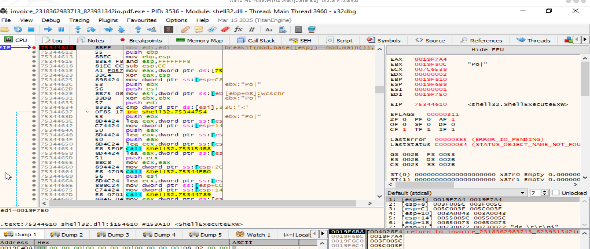

*Figura 3. `ShellExecuteExW` es invocada desde la muestra; la estructura `SHELLEXECUTEINFOW` se encuentra en la pila.*

La estructura contenía:

```text
lpVerb       = L"runas"
lpFile       = L"C:\Users\usuario\AppData\Local\Temp\InstallFlashPlayer.exe"
lpParameters = NULL
lpDirectory  = NULL
nShow        = SW_SHOWNORMAL
```

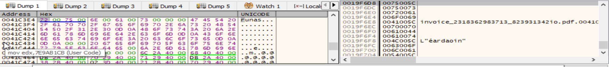

*Figura 4. El campo `lpVerb` contiene literalmente `runas`.*

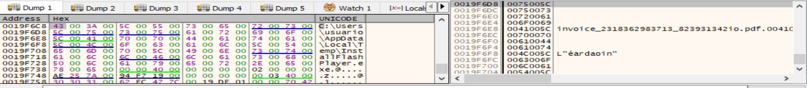

*Figura 5. `lpFile` apunta a `%LOCALAPPDATA%\Temp\InstallFlashPlayer.exe`.*

### 5.2. Solicitud de elevación

Windows muestra una solicitud UAC de Adobe Flash Player:

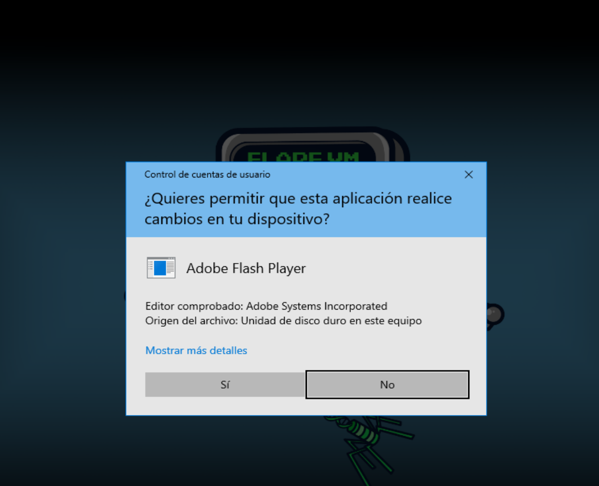

*Figura 6. La solicitud de elevación se origina en la llamada con `runas`.*

### 5.3. Naturaleza del instalador

El archivo conservado presenta:

| Campo | Valor observado |
|---|---|
| Nombre | `InstallFlashPlayer.exe` |
| Tamaño | 89.248 bytes |
| Arquitectura | PE32 |
| MD5 | `2FF9B59034C62748885D459D082295F` |
| Versión | `11.0.1.152` |
| Firma | válida |
| Firmante | Adobe Systems Incorporated |
| Emisor | VeriSign Class 3 Code Signing 2010 CA |

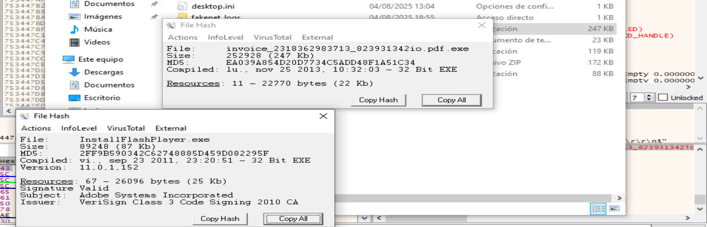

*Figura 7. El instalador conserva una firma Authenticode válida de Adobe.*

La firma válida no convierte en legítima la cadena completa. El instalador se utiliza como cobertura visual y como proceso elevado susceptible de cargar la DLL depositada en el mismo directorio.

### 5.4. Error del instalador web

Tras aceptar el UAC, el instalador intenta descargar componentes y muestra un error de conexión:

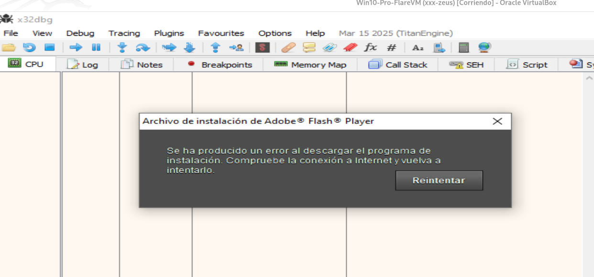

*Figura 8. El instalador web no puede completar la descarga en el entorno aislado.*

El mensaje es coherente con un instalador web antiguo sin acceso a Internet o con infraestructura ya no disponible.

---

## 6. DLL temporal y posible side-loading

Process Monitor registró que la muestra deposita:

```text
C:\Users\usuario\AppData\Local\Temp\msimg32.dll
C:\Users\usuario\AppData\Local\Temp\InstallFlashPlayer.exe
```

Después de aceptar el UAC, `InstallFlashPlayer.exe`, ejecutado con integridad alta, carga:

```text
%LOCALAPPDATA%\Temp\msimg32.dll
```

Posteriormente también se observó la carga de la DLL legítima:

```text
C:\Windows\SysWOW64\msimg32.dll
```

Esta secuencia es **altamente compatible con DLL side-loading mediante una DLL proxy**:

```text
InstallFlashPlayer.exe firmado
        ↓
búsqueda de msimg32.dll en su directorio
        ↓
carga de la DLL temporal controlada por la muestra
        ↓
posible delegación a la DLL legítima de SysWOW64
```

La DLL temporal se elimina durante el flujo o la limpieza, por lo que debe copiarse antes de cerrar el instalador. Su análisis estático directo sigue pendiente.

**Grado de certeza:**

- carga de la DLL temporal por el proceso elevado: confirmada por Procmon;
- side-loading/proxy malicioso: inferencia de alta confianza;
- comportamiento interno de la DLL: pendiente de análisis.

---

## 7. Instalación local como `GoogleUpdate.exe`

La muestra crea la estructura:

```text
C:\Users\usuario\AppData\Local\Google\Desktop\Install\
{4e5270bb-4db4-bbc6-7b80-2c9f6db49328}\
```

En el directorio aparecen:

```text
GoogleUpdate.exe
@
L\
U\
```

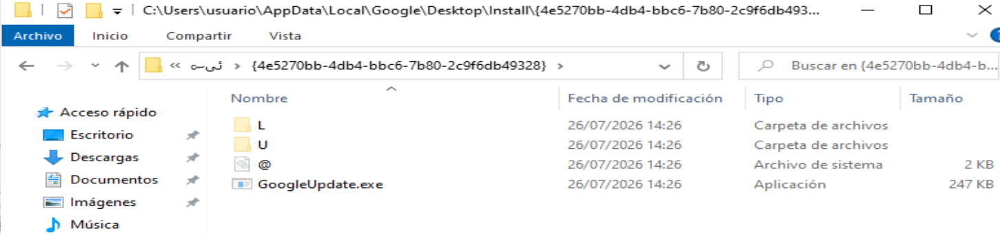

*Figura 9. Copia instalada con nombre `GoogleUpdate.exe` y artefactos auxiliares.*

### 7.1. Relación con la muestra original

La muestra original y `GoogleUpdate.exe` presentan el mismo tamaño y MD5:

```text
Tamaño: 252.928 bytes
MD5:    EA039A854D20D7734C5ADD48F1A51C34
```

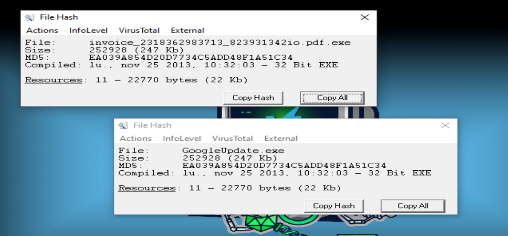

*Figura 10. `GoogleUpdate.exe` es consistente con una copia exacta renombrada de la muestra.*

La igualdad de tamaño y MD5 aporta una confianza muy alta. Una comparación SHA-256 o `fc /b` permite acreditar formalmente la identidad byte a byte.

---

## 8. Persistencia mediante la clave Run

### 8.1. Escritura confirmada

La muestra alcanzó `ntdll!ZwSetValueKey` con:

```text
ValueName = L"Google Update"
Type      = REG_SZ
Data      = cadena que termina apuntando a GoogleUpdate.exe
```

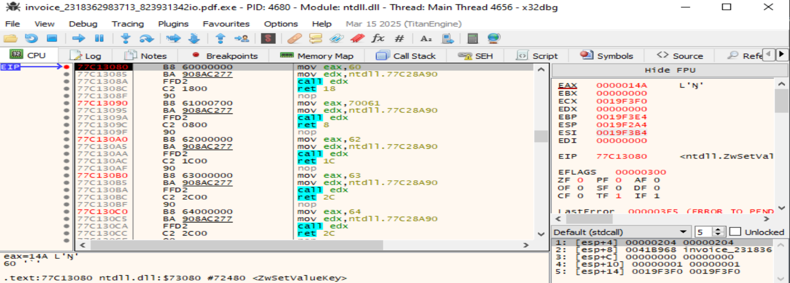

*Figura 11. Escritura de un valor `REG_SZ` mediante la API nativa.*

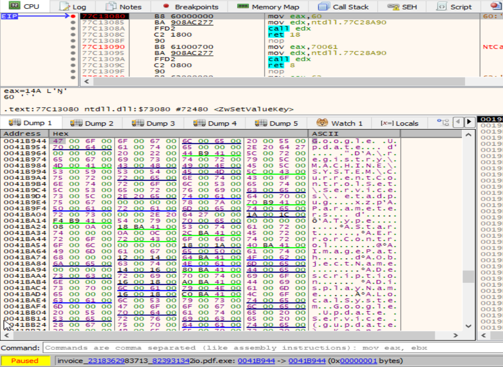

*Figura 12. El nombre del valor es `Google Update`; el búfer contiene la ruta de instalación.*

El handle corresponde a la ruta nativa:

```text
\REGISTRY\USER\<SID>\Software\Microsoft\Windows\CurrentVersion\Run
```

que equivale a:

```text
HKCU\Software\Microsoft\Windows\CurrentVersion\Run
```

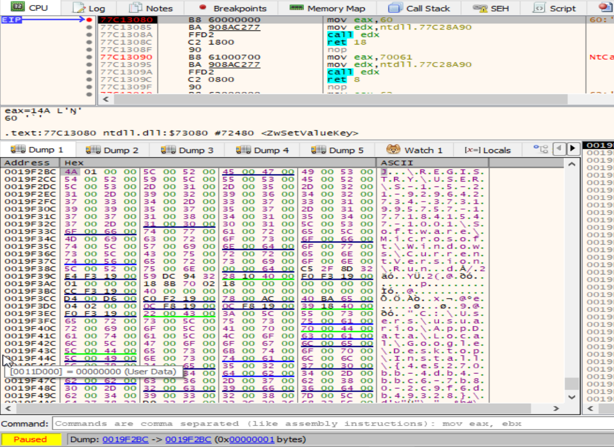

*Figura 13. La cadena nativa confirma que se trata de la rama HKCU del usuario actual.*

Después de ejecutar la syscall:

```text
EAX = 00000000
```

`STATUS_SUCCESS` confirma que la escritura fue aceptada por el sistema.

### 8.2. Valor no interpretable por Regedit

Regedit detecta el valor `Google Update`, pero no puede mostrar su contenido:

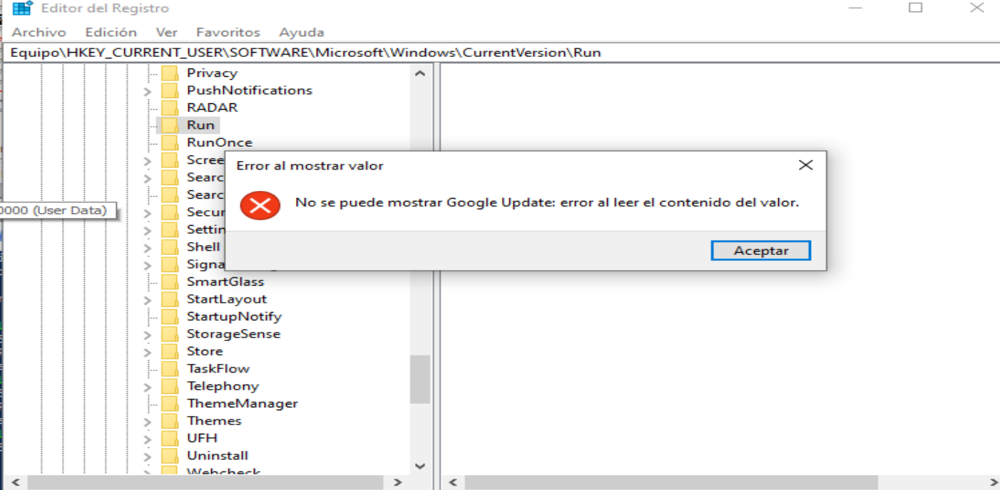

*Figura 14. El valor existe, aunque Regedit encuentra un error al leer sus datos.*

Las causas posibles incluyen:

- longitud `DataSize` incorrecta;
- datos adicionales después de la ruta;
- terminación UTF-16 defectuosa;
- contenido binario intercalado en un valor declarado como `REG_SZ`;
- modificación concurrente.

No se ha determinado todavía la causa exacta. Tampoco se ha concluido si el valor permanece después de todo el flujo o es eliminado durante la limpieza. Este punto quedó aparcado para una sesión posterior.

**Conclusión vigente:** la creación de `HKCU\...\Run\Google Update` está confirmada; su formato exacto y permanencia final siguen pendientes.

---

## 9. Flujo elevado: creación y manipulación de `cmd.exe`

Cuando la muestra ya se ejecuta elevada, omite la solicitud UAC y crea:

```text
C:\Windows\System32\cmd.exe
```

### 9.1. Creación suspendida y sin ventana

La llamada a `CreateProcessW` utiliza:

```text
dwCreationFlags = 0x08000004
```

que combina:

```text
CREATE_SUSPENDED = 0x00000004
CREATE_NO_WINDOW = 0x08000000
```


*Figura 15. Creación de `cmd.exe` suspendido y sin ventana visible.*

Procmon confirmó independientemente la creación:


*Figura 16. Evento `Process Create` del proceso `cmd.exe`.*

### 9.2. Lectura y modificación del contexto

La muestra llama a `ZwGetContextThread` sobre el hilo suspendido:


*Figura 17. Obtención del contexto del hilo de `cmd.exe`.*

Después llama a `ZwSetContextThread` utilizando el mismo handle y una estructura modificada:


*Figura 18. Aplicación de un contexto modificado al hilo suspendido.*

En una sesión se registró el cambio de `CONTEXT.Eip`:

```text
EIP inicial:   0x77595050
EIP aplicado:  0x77592AA0
```

Ambas direcciones pertenecían aparentemente a `ntdll.dll`. En técnicas de hollowing x86, el punto de entrada final también puede transmitirse mediante otros registros del contexto, por lo que este cambio demuestra manipulación, pero no identifica por sí solo el payload.

### 9.3. Reanudación y finalización

Finalmente se llama a `ZwResumeThread` y la syscall devuelve éxito:


*Figura 19. Reanudación del hilo manipulado.*

Tras continuar:

- el proceso original termina;
- el ejecutable inicial se elimina;
- `cmd.exe` continúa la fase preparada.

La cadena:

```text
CreateProcessW(CREATE_SUSPENDED)
→ ZwGetContextThread
→ ZwSetContextThread
→ ZwResumeThread
```

es compatible con **thread-context hijacking o process hollowing**. Para confirmar process hollowing completo todavía falta capturar la introducción del código en el proceso remoto mediante, por ejemplo:

- `ZwWriteVirtualMemory`;
- `ZwCreateSection` / `ZwMapViewOfSection`;
- `ZwUnmapViewOfSection`;
- `ZwAllocateVirtualMemory`.

---

## 10. Limpieza y procesos `cmd.exe`

El PML analizado mostró dos etapas diferenciadas:

1. un `cmd.exe` creado por la muestra original;
2. otro `cmd.exe` creado por `InstallFlashPlayer.exe` al cerrarse la ventana del instalador.

La muestra original termina poco después del primer proceso; el instalador termina poco después del segundo. La secuencia es compatible con rutinas de **autoborrado y limpieza**.

No se capturó una línea de comandos del tipo `cmd.exe /c ...`; junto con la manipulación de contexto, esto sugiere que `cmd.exe` puede utilizarse como contenedor o proceso auxiliar, no únicamente como intérprete de una orden visible.

El autoborrado no debe clasificarse como reacción anti-debug o anti-VM. Se reproduce en el flujo elevado tanto dentro como fuera de x32dbg.

---

## 11. Evaluación de anti-análisis y anti-VM

### 11.1. Técnicas confirmadas o con evidencia sólida

| Técnica | Estado | Evidencia |
|---|---|---|
| Empaquetamiento/loader | Confirmada | CAPA, transición a memoria y volcado desempaquetado |
| Resolución dinámica de APIs | Confirmada | análisis manual de exportaciones y cachés de funciones |
| Automodificación/reubicación | Confirmada | modificación y copia de código; breakpoints software copiados |
| Ofuscación del flujo | Confirmada | predicados opacos, junk code y saltos anómalos |
| Retardo activo | Confirmada | bucle de unas `0x80000` iteraciones llamando a `GetTickCount` |
| Excepciones/SEH | Probable como control de flujo | múltiples first-chance exceptions y paso por el dispatcher |
| Limpieza/autoborrado | Confirmada | eliminación del original y artefactos temporales |
| Comprobación de elevación | Confirmada como comportamiento | rutas distintas en función del nivel de integridad |

La comprobación de elevación **no es una técnica anti-análisis**; es una condición operativa para solicitar UAC cuando hace falta.

### 11.2. Resultado del analizador anti-VM

AntiVM Inspector asignó:

```text
Puntuación: 17
Veredicto:  alta
Reglas únicas: 9
Correlaciones de alta confianza: 1
```

Indicadores detectados:

- `GetAsyncKeyState`;
- `GetTickCount`;
- `GetWindowTextLengthW`;
- `FindNextFileA`;
- `GetDriveTypeA`;
- `GetLogicalDrives`;
- instrucción `IN AL, DX` en `0x00401007`.

El propio informe indica que la clasificación es heurística y no demuestra la ejecución de las ramas. Muchas de estas APIs son genéricas y también encajan con capacidades funcionales del malware.

El desensamblado no detectó:

```text
RDTSC: 0
CPUID: 0
```

### 11.3. Elementos no confirmados

No se ha demostrado:

- detección específica de x32dbg;
- detección específica de VirtualBox o VMware;
- uso real de la puerta VMware mediante puertos de E/S;
- comprobaciones clásicas con `IsDebuggerPresent`;
- que la cadena `vmci` se use en una comparación ejecutada;
- que el autoborrado sea una reacción al análisis.

La coincidencia `vmci` apareció dentro de una cadena larga de aspecto codificado; sin referencias cruzadas funcionales puede ser accidental.

---

## 12. Indicadores funcionales pendientes de validación

El análisis estático y del volcado desempaquetado contiene indicadores compatibles con:

### 12.1. Captura de entrada y portapapeles

```text
GetAsyncKeyState
VkKeyScanA
GetClipboardData
EnumClipboardFormats
GetClipboardOwner
```

Estas APIs son compatibles con keylogging o vigilancia del portapapeles, pero también generan falsos positivos en análisis anti-sandbox. Su finalidad exacta requiere trazado dinámico.

### 12.2. Geolocalización

En el volcado desempaquetado aparecen:

```text
GET /app/geoip.js HTTP/1.0
Host: j.maxmind.com
geoip_country_code
```

Esto es compatible con geolocalización por país. No se observó la petición completa en la captura de red actual.

### 12.3. Inyección y mapeo de secciones

Se localizaron cadenas o imports dinámicos relacionados con:

```text
ZwCreateSection
ZwMapViewOfSection
ZwUnmapViewOfSection
ZwOpenProcess
ZwGetContextThread
ZwSetContextThread
ZwResumeThread
```

La manipulación de contexto está confirmada; el mapeo del payload todavía no se capturó en el momento de la llamada.

### 12.4. Criptografía e integridad

Se observaron referencias a:

```text
MD5Init / MD5Update / MD5Final
RtlComputeCrc32
CryptGenRandom
```

La presencia de estas funciones no permite determinar por sí sola qué datos se cifran, verifican o generan.

---

## 13. Indicadores de compromiso y artefactos

### 13.1. Hashes

```text
Muestra original / GoogleUpdate.exe
MD5:    EA039A854D20D7734C5ADD48F1A51C34
SHA256: 69e966e730557fde8fd84317cdef1ece00a8bb3470c0b58f3231e170168af169

InstallFlashPlayer.exe
MD5:    2FF9B59034C62748885D459D082295F
```

### 13.2. Archivos y rutas

```text
%LOCALAPPDATA%\Temp\InstallFlashPlayer.exe
%LOCALAPPDATA%\Temp\msimg32.dll

%LOCALAPPDATA%\Google\Desktop\Install\
{4e5270bb-4db4-bbc6-7b80-2c9f6db49328}\GoogleUpdate.exe

%LOCALAPPDATA%\Google\Desktop\Install\
{4e5270bb-4db4-bbc6-7b80-2c9f6db49328}\@

%LOCALAPPDATA%\Google\Desktop\Install\
{4e5270bb-4db4-bbc6-7b80-2c9f6db49328}\L\

%LOCALAPPDATA%\Google\Desktop\Install\
{4e5270bb-4db4-bbc6-7b80-2c9f6db49328}\U\
```

### 13.3. Registro

```text
HKCU\Software\Microsoft\Windows\CurrentVersion\Run
Valor: Google Update
Tipo:  REG_SZ
Datos: ruta que termina en GoogleUpdate.exe
```

### 13.4. Procesos

```text
invoice_...pdf.exe
GoogleUpdate.exe
InstallFlashPlayer.exe
cmd.exe
WerFault.exe   — observado en sesiones alteradas por breakpoints/errores
```

### 13.5. Prefetch

Windows puede generar:

```text
C:\Windows\Prefetch\INVOICE_2318362983713_8239313-*.pf
C:\Windows\Prefetch\INSTALLFLASHPLAYER.EXE-*.pf
C:\Windows\Prefetch\CMD.EXE-*.pf
C:\Windows\Prefetch\GOOGLEUPDATE.EXE-*.pf
```

Son artefactos forenses generados por Windows, no ficheros depositados intencionadamente por el malware.

---

## 14. Matriz de certezas

### Confirmado dinámicamente

- La muestra crea una copia local llamada `GoogleUpdate.exe`.
- La copia tiene el mismo tamaño y MD5 que la muestra original.
- Se escribe con éxito el valor `Google Update` bajo `HKCU\...\Run`.
- La muestra deposita `InstallFlashPlayer.exe` y llama a `ShellExecuteExW` con `runas`.
- El UAC muestra Adobe Flash Player.
- El ejecutable de Flash está firmado por Adobe y se ejecuta elevado al aceptar.
- El proceso elevado carga la `msimg32.dll` temporal según Procmon.
- Se crea `cmd.exe` suspendido y sin ventana.
- Se obtiene, modifica y restablece el contexto de su hilo.
- Se reanuda el hilo y se produce limpieza/autoborrado.

### Inferencias de alta confianza

- `msimg32.dll` participa en DLL side-loading o actúa como proxy.
- `GoogleUpdate.exe` es una copia exacta renombrada del binario original.
- Los procesos `cmd.exe` forman parte de la ejecución preparada o la limpieza.
- El bucle de `GetTickCount` actúa como retardo anti-sandbox.

### No confirmado

- Process hollowing completo y método exacto de escritura/mapeo remoto.
- Persistencia efectiva después de reiniciar o cerrar sesión.
- Eliminación posterior del valor `Google Update`.
- Detección específica de depurador o hipervisor.
- Comunicación C2 real.
- Uso efectivo de VNC, países excluidos o una familia criptográfica concreta.

---

## 15. Próximos pasos recomendados

1. Analizar estáticamente la `msimg32.dll` recuperada: exports, imports, DllMain, proxy de funciones y comparación con la DLL legítima.
2. Repetir la ejecución con breakpoints previos en `ZwCreateSection`, `ZwMapViewOfSection`, `ZwWriteVirtualMemory` y `ZwUnmapViewOfSection` para cerrar la hipótesis de hollowing.
3. Exportar el valor `Google Update` en formato binario y registrar el `DataSize` exacto para explicar por qué Regedit no puede mostrarlo.
4. Reiniciar sesión en una snapshot controlada para comprobar si `GoogleUpdate.exe` se ejecuta por la clave Run.
5. Capturar tráfico mediante FakeNet-NG/Wireshark para diferenciar peticiones del instalador de Flash de posibles comunicaciones del payload.
6. Comparar SHA-256 y contenido byte a byte entre la muestra original, `GoogleUpdate.exe` y la DLL temporal.

---

## 16. Conclusión

La muestra analizada es un loader/dropper bancario protegido que combina una copia de instalación, persistencia en HKCU, elevación socialmente creíble mediante un instalador firmado de Adobe, carga de una DLL temporal y manipulación de un proceso `cmd.exe` suspendido. El comportamiento cambia cuando el proceso ya está elevado, pero esa diferencia no constituye detección del depurador.

La evidencia más significativa obtenida hasta ahora es:

- creación de `GoogleUpdate.exe` como réplica de la muestra;
- escritura satisfactoria del valor `Google Update` en la clave Run;
- `ShellExecuteExW("runas")` dirigido a un instalador firmado;
- carga de `msimg32.dll` desde `%TEMP%` por el proceso elevado;
- manipulación del contexto de un `cmd.exe` suspendido;
- limpieza y autoborrado posteriores.

La muestra contiene mecanismos claros de protección y anti-análisis, pero la detección específica de máquinas virtuales o depuradores sigue sin estar demostrada.


## 17. Tabla resumen

| Área                          | Hallazgo o acción de la muestra                                                                                                                             | Evidencia observada                                                                              | Estado                                                    |
| ----------------------------- | ----------------------------------------------------------------------------------------------------------------------------------------------------------- | ------------------------------------------------------------------------------------------------ | --------------------------------------------------------- |
| Instalación local             | Crea una copia de sí misma con el nombre `GoogleUpdate.exe`                                                                                                 | Mismo tamaño y mismo MD5 que la muestra original                                                 | Confirmado                                                |
| Ruta de instalación           | Guarda la copia en `%LOCALAPPDATA%\Google\Desktop\Install\{4e5270bb-4db4-bbc6-7b80-2c9f6db49328}\GoogleUpdate.exe`                                          | Archivo localizado en el sistema de archivos                                                     | Confirmado                                                |
| Persistencia                  | Escribe un valor denominado `Google Update` en `HKCU\Software\Microsoft\Windows\CurrentVersion\Run`                                                         | Intercepción de `ZwSetValueKey`; nombre `Google Update`; tipo `REG_SZ`; retorno `STATUS_SUCCESS` | Confirmado                                                |
| Contenido de persistencia     | El valor apunta a la copia instalada como `GoogleUpdate.exe`                                                                                                | Búfer observado durante `ZwSetValueKey`                                                          | Confirmado                                                |
| Valor malformado              | Regedit detecta `Google Update`, pero no puede mostrar correctamente su contenido                                                                           | Mensaje: «error al leer el contenido del valor»                                                  | Confirmado                                                |
| Eliminación de persistencia   | Posible eliminación posterior del valor `Google Update`                                                                                                     | Todavía no se ha observado `ZwDeleteValueKey` sobre ese valor                                    | Pendiente                                                 |
| Comprobación de privilegios   | Adapta el flujo según el nivel de integridad del proceso                                                                                                    | Comportamiento distinto entre ejecución elevada y no elevada                                     | Confirmado                                                |
| Ejecución no elevada          | Solicita privilegios administrativos mediante UAC                                                                                                           | Llamada directa a `ShellExecuteExW`                                                              | Confirmado                                                |
| Elevación                     | Utiliza el verbo `runas`                                                                                                                                    | `SHELLEXECUTEINFOW.lpVerb = L"runas"`                                                            | Confirmado                                                |
| Archivo elevado               | Ejecuta `%LOCALAPPDATA%\Temp\InstallFlashPlayer.exe`                                                                                                        | `lpFile` observado en la estructura `SHELLEXECUTEINFOW`                                          | Confirmado                                                |
| Señuelo visual                | Muestra un instalador de Adobe Flash Player firmado                                                                                                         | UAC y ventana del instalador observados                                                          | Confirmado                                                |
| Instalador legítimo           | `InstallFlashPlayer.exe` tiene firma válida de Adobe Systems Incorporated                                                                                   | Firma Authenticode y metadatos del archivo                                                       | Confirmado                                                |
| Error del señuelo             | El instalador intenta descargar componentes y muestra un error de conexión                                                                                  | Mensaje de error de descarga de Adobe Flash Player                                               | Confirmado                                                |
| DLL temporal                  | Deposita `msimg32.dll` en el mismo directorio temporal que el instalador                                                                                    | Eventos `WriteFile` y `Load Image` de Procmon                                                    | Confirmado                                                |
| DLL side-loading              | `InstallFlashPlayer.exe` carga `%TEMP%\msimg32.dll` antes de cargar la DLL legítima de Windows                                                              | `Load Image` desde `%LOCALAPPDATA%\Temp\msimg32.dll`, seguido de `SysWOW64\msimg32.dll`          | Inferencia de alta confianza                              |
| Ejecución elevada del payload | La DLL temporal se ejecuta dentro del proceso firmado con integridad alta                                                                                   | Carga de la DLL desde el proceso elevado de Flash                                                | Inferencia de alta confianza                              |
| Creación de procesos          | Crea `cmd.exe` desde la muestra original                                                                                                                    | Evento `Process Create` y breakpoint en `CreateProcessW`                                         | Confirmado                                                |
| Segundo proceso               | `InstallFlashPlayer.exe` crea otro `cmd.exe` al finalizar                                                                                                   | Evento `Process Create` en Procmon                                                               | Confirmado                                                |
| Creación suspendida           | Crea `cmd.exe` suspendido y sin ventana                                                                                                                     | Flags observados en `CreateProcessW`                                                             | Confirmado                                                |
| Manipulación de hilo          | Obtiene el contexto del hilo de `cmd.exe`                                                                                                                   | `ZwGetContextThread`                                                                             | Confirmado                                                |
| Modificación de contexto      | Cambia el contexto del hilo suspendido                                                                                                                      | `ZwSetContextThread` sobre el mismo handle                                                       | Confirmado                                                |
| Reanudación                   | Reanuda el hilo modificado                                                                                                                                  | `ZwResumeThread` devuelve `STATUS_SUCCESS`                                                       | Confirmado                                                |
| Posible inyección             | La secuencia es compatible con process hollowing o manipulación de proceso                                                                                  | `CreateProcessW` suspendido, `Get/SetContextThread` y `ResumeThread`                             | Probable; falta demostrar el método de escritura o mapeo  |
| Autoborrado                   | Elimina la muestra original después de completar parte del flujo                                                                                            | Archivo original desaparece tras la ejecución                                                    | Confirmado                                                |
| Limpieza temporal             | Elimina `msimg32.dll` y otros artefactos temporales                                                                                                         | La DLL ya no aparece tras finalizar la ejecución                                                 | Inferencia de alta confianza                              |
| Prefetch                      | La ejecución genera un archivo `INVOICE_...pf`                                                                                                              | Archivo localizado en `C:\Windows\Prefetch`                                                      | Confirmado; artefacto creado por Windows                  |
| Empaquetamiento               | La muestra utiliza un loader o packer protegido                                                                                                             | Secciones anómalas, código desempaquetado y transferencia al payload                             | Confirmado                                                |
| Sección anómala               | Presenta una sección `.pdata` con permisos de escritura y ejecución                                                                                         | Características RWX y entropía elevada                                                           | Confirmado                                                |
| Resolución dinámica           | Resuelve APIs y exportaciones manualmente                                                                                                                   | Parsing de PE y resolución dinámica observada                                                    | Confirmado                                                |
| Automodificación              | Modifica instrucciones o regiones de código durante la ejecución                                                                                            | Escrituras sobre código y funciones analizadas                                                   | Confirmado                                                |
| Ofuscación                    | Utiliza predicados opacos, saltos confusos y bloques basura                                                                                                 | Análisis estático de funciones internas                                                          | Confirmado                                                |
| Anti-desensamblado            | Incluye instrucciones inusuales como `IN`, `AAA`, `SALC` y secuencias aparentemente inválidas                                                               | Código observado en funciones ofuscadas                                                          | Confirmado como ofuscación; finalidad exacta pendiente    |
| Retardo                       | Ejecuta un bucle masivo con llamadas repetidas a `GetTickCount`                                                                                             | Aproximadamente `0x80000` iteraciones                                                            | Confirmado                                                |
| Anti-sandbox temporal         | El retardo puede intentar superar tiempos máximos de análisis                                                                                               | No compara tiempos; únicamente consume tiempo                                                    | Inferencia de alta confianza                              |
| Excepciones                   | Utiliza excepciones y SEH durante la ejecución                                                                                                              | Paradas de primera oportunidad y flujo por manejadores                                           | Confirmado                                                |
| Comprobaciones internas       | Emplea valores centinela como `FFF7ABFE` y `FFF7ABC1`                                                                                                       | Comparaciones observadas en `FUN_00408469`                                                       | Confirmado                                                |
| Integridad o estado           | Las constantes centinela controlan bifurcaciones internas                                                                                                   | Saltos condicionados por esos valores                                                            | Confirmado                                                |
| Actividad de usuario          | Importa o utiliza `GetAsyncKeyState`                                                                                                                        | Imports y reglas estáticas                                                                       | Confirmado como capacidad; uso anti-sandbox no demostrado |
| Captura de datos              | Presenta APIs compatibles con teclado y portapapeles                                                                                                        | `GetAsyncKeyState`, `VkKeyScanA`, `GetClipboardData`, etc.                                       | Probable                                                  |
| Perfilado del sistema         | Consulta unidades, ventanas y recursos del sistema                                                                                                          | `GetDriveTypeA`, `GetLogicalDrives`, `GetWindowTextLengthW`, etc.                                | Confirmado como capacidad                                 |
| Detección de VM               | Existen indicadores estáticos como `vmci` e instrucciones de puerto                                                                                         | Cadenas y reglas heurísticas                                                                     | No confirmado                                             |
| Detección de x32dbg           | No se ha observado una bifurcación causada específicamente por el depurador                                                                                 | x32dbg no elevado reproduce el flujo normal de Flash                                             | No confirmado                                             |
| Anti-debug clásico            | No se han confirmado llamadas como `IsDebuggerPresent` o `CheckRemoteDebuggerPresent`                                                                       | Análisis realizado hasta ahora                                                                   | No confirmado                                             |
| RDTSC/CPUID                   | No se detectó uso de estas instrucciones                                                                                                                    | Resultado de la herramienta AntiVM                                                               | No detectado                                              |
| Comunicación                  | El instalador carga bibliotecas de red e intenta descargar componentes                                                                                      | `wininet.dll`, `winhttp.dll`, `urlmon.dll`, mensaje de descarga                                  | Confirmado para el instalador                             |
| C2 malicioso                  | No se ha capturado tráfico que demuestre comunicación con un servidor de mando y control                                                                    | El Procmon disponible no contiene eventos de red suficientes                                     | Pendiente                                                 |
| Geolocalización               | Aparecen cadenas relacionadas con `geoip` y MaxMind en el volcado desempaquetado                                                                            | Cadenas del payload desempaquetado                                                               | Probable                                                  |
| Cifrado y hashing             | Utiliza o contiene referencias a MD5, CRC32 y generación aleatoria                                                                                          | Imports y cadenas del binario desempaquetado                                                     | Confirmado como capacidad                                 |
| Conclusión funcional          | Actúa como dropper/loader, instala una copia persistente, solicita elevación, utiliza un instalador firmado como señuelo y ejecuta una DLL temporal elevada | Conjunto de evidencia estática, x32dbg y Procmon                                                 | Alta confianza                                            |
